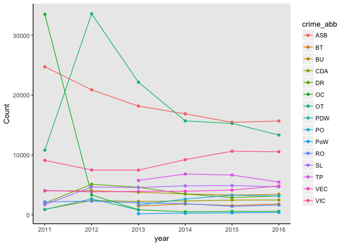
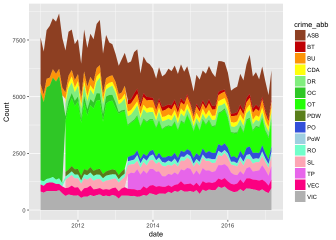
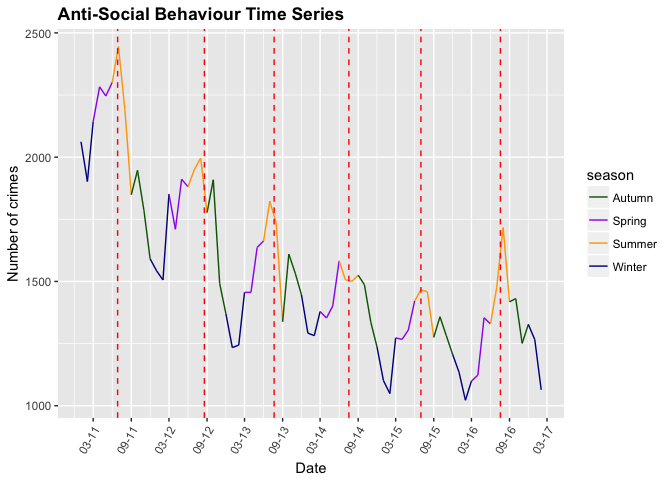
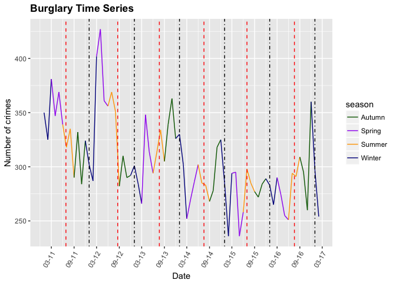

Capstone Project
================

Exploratory Data Analysis
-------------------------

To begin with the required packages and dataframes were loaded.

``` r
library(ggplot2)
library(readr)
library(dplyr)
library(tidyr)
library(lubridate)
library(scales)
library(rgdal)
library(broom)
library(classInt)
library(KernSmooth)
library(RColorBrewer)
library(leaflet)

crime11to17 <- readRDS("crime11to17.rds")
monthly.crime <- readRDS("monthlycrime.rds")
annual.crime <- readRDS("annualcrime.rds")
seasonal.crime <- readRDS("seasonalcrime.rds")
```

This was followed by getting a broad overview of the crime11to17 dataset.

``` r
summary(crime11to17)
table(crime11to17$crime_type)
```

There are 15 different types of crime. Month and year are available but not day due to the police anonymisation process. Latitude and longitude are provided. Location data is only referencing the approximate location using 'anonymous' map points. The most prevalent crime in this period is anti-social-behaviour.

``` r
asb.count <- count(crime11to17, crime_type == "anti-social-behaviour")
total.count <- nrow(crime11to17)
```

This accounts for 23.14% of total recorded crime.

The majority of the records are from the Police Force but a small portion is submitted by the British Transport Police who operate on the railways.

``` r
service.count <- count(crime11to17, service == "BTP")
```

These records account for only 0.04%.

Annual Crime Analysis
=====================

It would be interesting to explore the annual variation in street crimes using a bar chart. The total crimes per year need to be calculated first.

``` r
total.year <- crime11to17 %>% 
  group_by(year) %>%
  summarize(Count=n()) %>%
  filter(year != 2017) %>%
  as.data.frame()

ggplot(total.year, aes(x = year, y = Count)) +
  geom_col(col = "blue")
```


The abbreviations used are as follows:

| Abbreviation | Crime                   |
|--------------|-------------------------|
| ASB          | Anti-social behaviour   |
| BT           | Bicycle theft           |
| BU           | Burglary                |
| CDA          | Criminal damage & arson |
| DR           | Drugs                   |
| OC           | Other crime             |
| OT           | Other theft             |
| PDW          | Public disorder weapons |
| PO           | Public order            |
| PoW          | Possesion of weapons    |
| RO           | Robbery                 |
| SL           | Shoplifting             |
| TP           | Theft from the person   |
| VEC          | Vehicle crime           |
| VIC          | Violent crime           |

Recorded annual street crime has been decreasing each year in London since 2011. There was a significant decrease between 2012 and 2013 of 11.82% and subsequent years show a steadier reduction.

The variation of specific crime frequency over time is displayed using a bar chart and a line plot.




Three categories have shown a strong decrease between 2011 and 2016 - other crime, other theft and anti social behaviour. The anonymously large drop between 2011 and 2012 for other crime, and large increase of other-theft between 2012 and 2013 may suggest a change in recording/reporting. Worryingly, violent crime displays a steady increase from 2013 onwards.

Monthly-seasonal crime analysis
===============================

First, need to set up a date column with the correct format using Lubridate.

``` r
monthly.crime <- monthly.crime %>% 
  unite(date, month, year, sep = "-", remove = FALSE)
monthly.crime$date <- paste0("01-", monthly.crime$date) 
monthly.crime$date <- dmy(monthly.crime$date)
```

Plot time series using geom\_area() which adds together time series at each point. Set the colour scale for the crime categories manually due to large n.



This illustrates the changing classification of crimes over time and suggests there was a drive to classify 'other crimes' into different categories. 'Other theft' did not exist prior to late 2011 and seems to increase by a similar degree to the decrease in 'other crime'. Several other categories appear at this point: drugs, shoplifting, criminal damage & arson, and public disorder weapons. The final tranche of categories are introduced early 2013 - public order, bicycle theft and theft from the person. By early 2017, the other-crime category is used very minimally.

Plotting a time series using geom\_bar() suggests anti-social behaviour peaks each summer, but due to the scale used it is difficult to tell.


The anti-social behaviour will be analysed separately to determine patterns. Seasonal colours are set using a vector so the line segments can be individually coloured. Date is converted for time series use. A line plot is created with vertical lines to indicate the beginning of each year (black lines) and the day with the highest temperature (red lines). Dataframe hottest.day created with maximum temperature for each year.

``` r
season.cols <- c("Summer" = "orange", "Autumn" = "darkgreen", "Winter" = "darkblue", "Spring" = "purple")
seasonal.crime$date <- paste0("01-", seasonal.crime$date) 
seasonal.crime$date <- dmy(seasonal.crime$date)
ASB.season <- filter(seasonal.crime, crime_type == "anti-social-behaviour")

annual.line <- c("2012-01-01", "2013-01-01", "2014-01-01", "2015-01-01", "2016-01-01", "2017-01-01")
TDates <- c("2011-06-27", "2012-08-19", "2013-07-22", "2014-07-18", "2015-07-01", "2016-07-19")
HTemp <- c(30, 30, 33, 30, 35, 33)
hottest.day <- data.frame(x = TDates, y = HTemp)
```



There has been a clear decrease in anti-social behavious over time, with the exception of 2016 which showed a significant increase. Clear peaks are visible in the summer (orange segments), often falling in August (school summer holidays). The peaks frequently coincide very closely to the hottest day of the year, with the exception of 2014. Minimum occurences are consistently just after 1st January.

This process will be repeated for burglaries.



Burglaries have generally decreased since 2012, though there was a surge in Spring 2012 and a subsequent peak in Autumn 2016. There is less of a pattern visible in burglary occurences, though there is frequently a peak in the run up to Christmas followed by a sharp decrease over New Year. There is no clear pattern between high temperatures and burglary.

Geographic analysis
===================

The Leaflet package can be used to visualise the location of crime occurences. A reduced dataset is required due to processing capability.The data was filtered to 2016 and to display only vehicle crime.

``` r
VEC.2016 <- crime11to17 %>%
filter(year == 2016, crime_type == 'vehicle-crime')

VEC.2016 %>% 
  leaflet() %>%
  addTiles() %>%
  addMarkers(~longitude, ~latitude)
```

This format of displaying crime occurences is not particularly useful when the density is so high and would require jittering to be used as many of the crimes overlie each other.

Insights, correlations and further investigations
=================================================

Crime rates have been dropping consistently in London from 2011 onwards. However, certain crimes have shown an increase over that time e.g. violent crime. There are seasonal patterns in crime occurence present, as evidenced by peaks of anti-social behaviour correlating to the summer season.

It is difficult at present to integrate other datasets relating to indicators at a Borough level as the data is downloaded using the API over a polygon area of central London which encompasses parts of Westminster, Camden, Lambeth and Southwark.

The dataset would be too large if all data for the London boroughs was used for analysis. It is proposed to use shapefiles of the borough outlines to sort the data to include only the 'inner' London boroughs. This would allow investigation into correlations between areas, crimes plus other factors if time permits.

In terms of hotspots for crime, the next step is to build heatmaps which show where the highest concentration of crimes occur. Each map will focus on a specific crime and be colour coded to indicate risk. Chloropleth maps could also be useful to interactively display the frequency of specific crimes across boroughs.
