Temporal and Spatial Analysis of Street Crime in Inner London
-------------------------------------------------------------

### 1. Introduction

The Metropolitan Police operate across 32 boroughs within Greater London
and aim to make London the safest global city. To this end, an
accessible method allowing both residents and tourists to check where
crime hotspots are located would allow them to make informed decisions
about where they go and encourage preventative action. This would be a
useful service for the Met Police to promote with the aim of reducing
opportunistic crimes by raising awareness of the highest risk areas.

For locals, this may be in the context of checking incidences of bicycle
theft to identify where is best to lock up your bike, or hotspots for
burglaries when looking to rent or purchase property. This may also be
useful for tourists visiting the city to flag if they are in a higher
risk area.

This project aims to address several key questions:

1.  Is crime on the increase or decrease in central London?

2.  Is the frequency of specific crimes reducing or increasing on an
    annual basis?

3.  Is there any seasonal variation in the frequency of crimes?

4.  Are certain crimes more prevalent in certain areas - where are these
    'hotspots'?

5.  Create a visualisation allowing easy identification of risk level to
    a certain crime

6.  Can correlations be made between crime occurrences and other
    indicators e.g. employment levels?

7.  Can time series forecasting be used to estimate occurence of crime
    in the future?

### 2. Data acquisition

Datasets for street level crime in England, Wales and Northern Ireland
are available at (<https://data.police.uk/docs/method/crime-street/>).
Data is reported monthly and is available from December 2010 to March
2017 at present. All the data on this site is made available under the
Open Government License v3.0.

There is an associated API which can efficiently and rapidly provide a
rich data source of information. The API is implemented as a standard
JSON web service using HTTP GET and POST requests.

**Example API Request**
<https://data.police.uk/api/crimes-street/all-crime?poly=52.268,0.543:52.794,0.238:52.130,0.478&date=2013-01>

To keep the size of the dataset manageable an area over central London
was initially defined. The *poly* parameter identifies the polygon
within which data is extracted and is formatted in lat/lng pairs,
separated by colons:

poly=\[lat\],\[lng\]:\[lat\],\[lng\]:\[lat\],\[lng\]:\[lat\],\[lng\]

The date also needs to be specified or the most recent month will be
returned. The limit of a custom search area is 10,000 crimes, if it
contains more than this the API will return a 503 status code.

Location data is only referencing the approximate location using
'anonymous' map points. This is to protect the privacy of the victim.
The date of occurence is also truncated to record only month and year
for the same reason.

The API was initially used to acquire the full dataset (*crime11to17*)
from December 2011 to March 2017 for central London as defined by a
polygon with corners: 51.514,-0.225 - Shepherds Bush 51.484,-0.225 -
South Hammersmith 51.484,-0.105 - Kennington 51.514,-0.105 - Temple

It was subsequently used to acquire the 2016 crime data for a
significantly larger area covering all the inner London boroughs
(*central2016*). These are Camden, Greenwich, Hackney, Hammersmith and
Fulham, Islington, Kensington and Chelsea, Lambeth, Lewisham, Southwark,
Tower Hamlets, Wandsworth and Westminster. 17 individual polygons were
requird to prevent the call limit of 10,000 being exceeded. There were
then combined during the data wrangling process and filtered to remove
the crimes that fell outside those boroughs.

### 3. Important fields and information

Variable names, types and number of observations were reviewed using
`glimpse()` on the original crime11to17 dataframe. This reveals 11
variables - 6 characters, 3 numerics (1 integer, 2 double precision) and
2 factors. There are 498,628 observations in total.

The following variables are returned: **category**, location\_type,
context, persistent\_id, id, location\_subtype, **month**, **latitude**,
**longitude**, outcome\_status\_category, outcome\_status\_data. The key
fields for this study are in **bold**.

There are 15 different types of crime recorded in the **category**
variable. Month and year are available but not day due to the police
anonymisation process. Latitude and longitude are provided as
geographical coordinates in decimal degrees. Location data is only
referencing the approximate location using 'anonymous' map points.

The central2016 dataframe had 696,844 observations prior to filtering by
the inner boroughs, and 447,418 observations post filtering. It contains
two additional variables: **borough** and **census code**.

### 4. Data limitations

The main limitations that have been identified with the dataset are:

-   Anonymistation of the data means the locations are fixed to a 'map
    point' and jittering is required to make all the events visible,
    although as the dataset gets larger it is not possible to create an
    effective map visualisation of individual crimes.

-   Anonymisation also means no day/time is provided so it is not
    possible to analyse potential relationships on a weekly scale with
    certain crimes.

-   It has been difficult to integrate other datasets relating to
    indicators at a Borough level as the data was downloaded using the
    API over a polygon area of central London which encompasses parts of
    Westminster, Camden, Lambeth and Southwark. As the project
    progressed, it became clear that a dataset covering a large, clearly
    defined area would be needed. GIS data was used to filter the large
    dataset, and remove all crimes which did not fall within one of the
    inner boroughs.

-   City of London is not included in this study as it is has its own
    police force and therefore the data is stored separately. The white
    blob in the centre of plots indicates its location.

### 5. Data cleaning and wrangling

The following packages were loaded in preparation for data wrangling:
`readr`, `dplyr`, `tidyr` and `lubridate`.

They key data wrangling steps were applied to crime11to17 and
central2016:

-   Convert `category` and `location_type` to factor using
    `as.factor()`.

-   Several of the variables contained no useful data for a
    civilian user. The variables `context`, `persistent_id`, `id` and
    `location_subtype` were removed with `select()` and variable names
    for `category` and `location_type` were changed to `crime_type` and
    `service` respectively, to make the dataset clearer using
    `rename()`.

-   Checked columns for missing values using
    `sapply(crime11to17, function(x) sum(is.na(x)))`. Only the
    `outcome_status_category` and `outcome_status_date` contain NA
    values and there is no plan to use these in the scope of the
    current project.

-   Use the `lubridate` functions `year()` and `month()` to create new
    columns called `year` and `month` from the original 'month' variable
    which was in format y-m.

-   Create dataframe for monthly crime statistics. Abbreviate the
    `crime_type` into new variable called `crime_abb` to improve data
    visualisations using `case_when()` function nested within
    `mutate()`. The `group_by()` function is then used to sort by
    `year`, `month` and `crime_abb`. `summarize()` is used to get a
    count for each of the new groupings.

-   For crime11to17, the process was repeated for annual crime
    statistics from 2011 to 2016, with 2017 removed as only a
    partial year.

-   Dataframes for seasonal crime were created using case\_when() to
    assign Spring (March to May), Summer (June to August), Autumn
    (September to November) or Winter (December to February) to a new
    **season** variable. Removed Mar-2017 from analysis as not
    sufficient data to constitute a full season.

-   The 2016 inner borough dataset was subset to include only the crimes
    which occured within the 12 borough outlines using the `sp` package
    and GIS files of borough outlines.

-   Save dataframes created using saveRDS for loading into
    analysis section.

### 6. Data Investigation

#### 6.1 Central 2011-2017 Dataset

Initially the 2011-2017 dataset for central London was explored.The most
prevalent crime in this period was anti-social-behaviour. This accounted
for 23% of total recorded crime. The majority of the records are from
the Police Force but a small portion were submitted by the British
Transport Police who operate on the railways. These records account for
only 4.3%. It would be interesting to explore the annual variation in
street crimes using a bar chart. The total crimes per year are
calculated using `group_by(year)` and `summarize(Count=n())`. 2017 is
removed using `filter()`.

    library(readr)
    library(ggplot2)
    library(dplyr)
    library(tidyr)
    library(lubridate)
    library(scales)
    library(rgdal)
    library(broom)
    library(classInt)
    library(KernSmooth)
    library(RColorBrewer)
    library(leaflet)
    library(sp)
    library(maptools)
    library(rgdal)
    library(rgeos)

    crime11to17 <- readRDS("crime11to17.rds")
    monthly.crime <- readRDS("monthlycrime.rds")
    annual.crime <- readRDS("annualcrime.rds")
    seasonal.crime <- readRDS("seasonalcrime.rds")
    total.year <- crime11to17 %>% 
      group_by(year) %>%
      summarize(Count=n()) %>%
      filter(year != 2017) %>%
      as.data.frame()

    ggplot(total.year, aes(x = year, y = Count)) +
      geom_col(col = "blue")

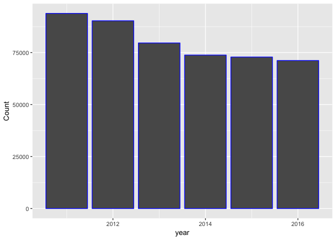

The abbreviations used are as follows:

<table>
<thead>
<tr class="header">
<th>Abbreviation</th>
<th>Crime</th>
</tr>
</thead>
<tbody>
<tr class="odd">
<td>ASB</td>
<td>Anti-social behaviour</td>
</tr>
<tr class="even">
<td>BT</td>
<td>Bicycle theft</td>
</tr>
<tr class="odd">
<td>BU</td>
<td>Burglary</td>
</tr>
<tr class="even">
<td>CDA</td>
<td>Criminal damage and arson</td>
</tr>
<tr class="odd">
<td>DR</td>
<td>Drugs</td>
</tr>
<tr class="even">
<td>OC</td>
<td>Other crime</td>
</tr>
<tr class="odd">
<td>OT</td>
<td>Other theft</td>
</tr>
<tr class="even">
<td>PDW</td>
<td>Public disorder weapons</td>
</tr>
<tr class="odd">
<td>PO</td>
<td>Public order</td>
</tr>
<tr class="even">
<td>PoW</td>
<td>Possesion of weapons</td>
</tr>
<tr class="odd">
<td>RO</td>
<td>Robbery</td>
</tr>
<tr class="even">
<td>SL</td>
<td>Shoplifting</td>
</tr>
<tr class="odd">
<td>TP</td>
<td>Theft from the person</td>
</tr>
<tr class="even">
<td>VEC</td>
<td>Vehicle crime</td>
</tr>
<tr class="odd">
<td>VIC</td>
<td>Violent crime</td>
</tr>
</tbody>
</table>

Recorded annual street crime has been decreasing each year in London
since 2011. There was a significant decrease between 2012 and 2013 of
11.8% and subsequent years show a reduction with a shallower negative
gradient. The variation of specific crime frequency over time is
displayed using a bar chart and a line plot with the `annual.crime`
dataframe as input.

    ggplot(annual.crime) +
      geom_bar(stat="identity",aes(x = year, y = Count,fill = crime_abb)) +
      theme(panel.grid = element_blank())

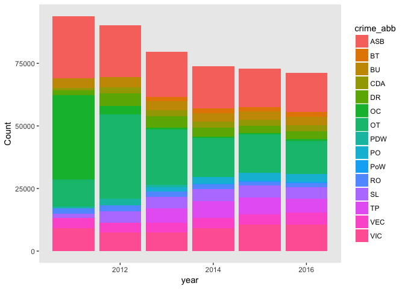

    ggplot(annual.crime, aes(x = year, y = Count)) +
      geom_point(aes(col = crime_abb)) +
      geom_line(aes(col = crime_abb)) +
      theme(panel.grid = element_blank(), axis.line = element_line(colour = "black"))

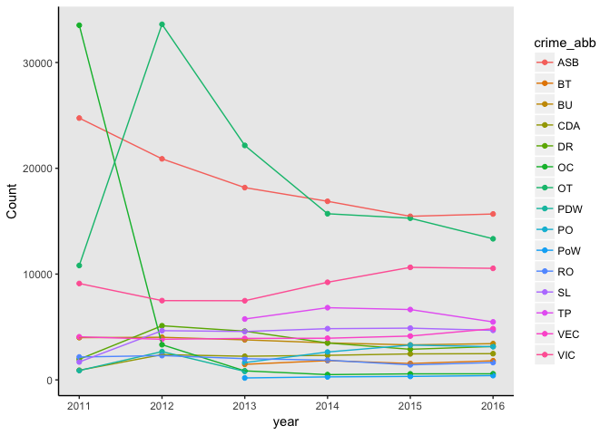

Three categories have shown a strong decrease between 2011 and 2016 -
other crime, other theft and anti-social behaviour. The anonymously
large drop between 2011 and 2012 for other crime, and large increase of
other theft between 2012 and 2013 may suggest a change in
recording/reporting. Worryingly, violent crime displays a steady
increase from 2013 onwards.

The `monthly.crime` dataframe is used to investigate time series.
Initially, the date column needs to be set to the correct format using
Lubridate.

    monthly.crime <- monthly.crime %>% 
      unite(date, month, year, sep = "-", remove = FALSE)
    monthly.crime$date <- paste0("01-", monthly.crime$date) 
    monthly.crime$date <- dmy(monthly.crime$date)

A time series is plotted using geom\_area() which stacks time series at
each point. The colour scale for the crime categories is manually set
using a vector due to the large number of categories.

    crime.col <- c("ASB" = "sienna", "BT" = "red3", "BU" = "orange", "CDA" = "yellow", "DR" = "lightgreen", "OC" = "limegreen", "OT" = "green", "PDW" = "olivedrab", "PO" = "royalblue", "PoW" = "lightblue", "RO" = "aquamarine", "SL" = "lightpink", "TP" = "violet", "VEC" = "deeppink", "VIC" = "grey")

    ggplot(monthly.crime, aes(x = date,  y = Count, fill = crime_abb)) +
      geom_area() +
      scale_fill_manual(values = crime.col)

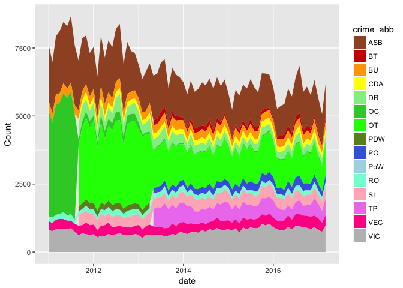

This illustrates the changing classification of crimes over time and
suggests there was a drive to classify 'other crimes' into different
categories. 'Other theft' did not exist prior to late 2011 and seems to
increase by a similar degree to the decrease in 'other crime'. Several
other categories are added at this point: drugs, shoplifting, criminal
damage and arson, and public disorder weapons. The final tranche of
categories were introduced in early 2013 - public order, bicycle theft
and theft from the person. By early 2017, the other-crime category was
used only minimally.

A plot is created using geom\_bar() which suggests anti-social behaviour
peaks each summer, but due to the scale used it is difficult to analyse
it further.

    ggplot(monthly.crime) +
      geom_bar(stat="identity",aes(x = date, y = Count,fill = crime_abb)) +
      theme(panel.grid = element_blank(), axis.line = element_line(colour = "black")) +
      xlab("Date") +
      ylab("Count") +
      scale_fill_manual(values = crime.col)

A heatmap can be used to get an overview of seasonal variation across
all crime categories.

    ggplot(monthly.crime,aes(x=crime_abb,y=month,fill=Count))+
      geom_tile(aes(fill=Count))

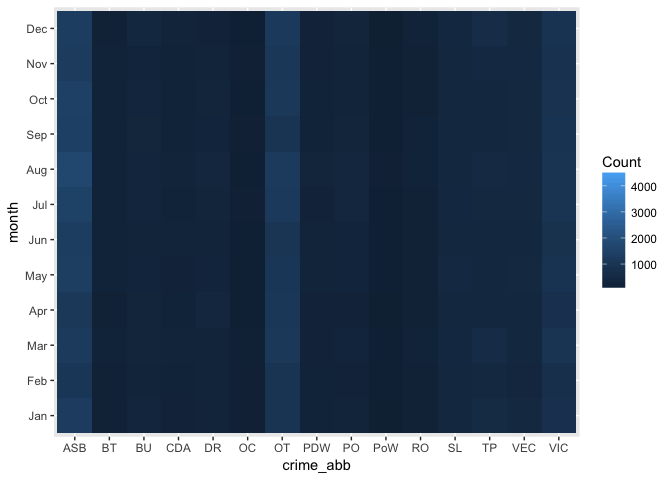

This clearly demonstrates the seasonal fluctuations in anti-social
behaviour, with peaks each summer. Bicycle crime and violent crime also
appear to be more common in May-July. Most other crimes show minimal
seasonal variation.

These variations will be analysed in more detail using the
`seasonal.crime` dataframe. Seasonal colours are set using a vector so
the line segments can be individually coloured. Date is converted for
time series use. A line plot is created with vertical lines to indicate
the day with the highest temperature (red lines). This is created using
a dataframe with the maximum London temperature for each year
(`hottest.day`).

    season.cols <- c("Summer" = "orange", "Autumn" = "darkgreen", "Winter" = "darkblue", "Spring" = "purple")
    seasonal.crime$date <- paste0("01-", seasonal.crime$date) 
    seasonal.crime$date <- dmy(seasonal.crime$date)
    ASB.season <- filter(seasonal.crime, crime_type == "anti-social-behaviour")

    TDates <- c("2011-06-27", "2012-08-19", "2013-07-22", "2014-07-18", "2015-07-01", "2016-07-19")
    HTemp <- c(30, 30, 33, 30, 35, 33)
    hottest.day <- data.frame(x = TDates, y = HTemp)

    ggplot(ASB.season, aes(x = date, y = Count)) +
      geom_line(aes(group = crime_type, col = season)) + 
      scale_colour_manual(values = season.cols) +
      scale_x_date(date_breaks = "6 month", date_labels = "%m-%y") +
      ylab("Number of crimes") +
      xlab("Date") +
      ggtitle("Anti-Social Behaviour Time Series") +
      theme(axis.text.x=element_text(angle=60, hjust=1), plot.title = element_text(lineheight=.8, face="bold")) +
      geom_vline(xintercept = as.numeric(as.Date(TDates)), linetype=2, col = "red")

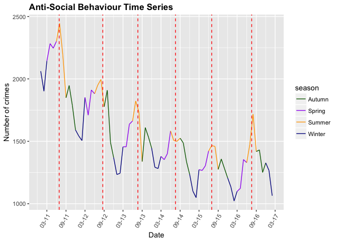
There has been a decrease in anti-social behaviour over time, with the
exception of 2016 which showed a significant increase. Clear peaks are
visible in the summer (orange segments), often coinciding with August
when the school summer holidays occur. The peaks frequently coincide
very closely to the hottest day of the year, with the exception of 2014.
Minimum occurences are consistently just after 1st January. This process
will be repeated for bicycle theft and burglaries.

    BT.season <- filter(seasonal.crime, crime_type == "bicycle-theft")
    ggplot(BT.season, aes(x = date, y = Count)) +
      geom_line(aes(group = crime_type, col = season)) + 
      scale_colour_manual(values = season.cols) +
      scale_x_date(date_breaks = "6 month", date_labels = "%m-%y") +
      ylab("Number of crimes") +
      xlab("Date") +
      ggtitle("Bicycle Theft Time Series") +
      theme(axis.text.x=element_text(angle=60, hjust=1), plot.title = element_text(lineheight=.8, face="bold")) +
      geom_vline(xintercept = as.numeric(as.Date(TDates)), linetype=2, col = "red")

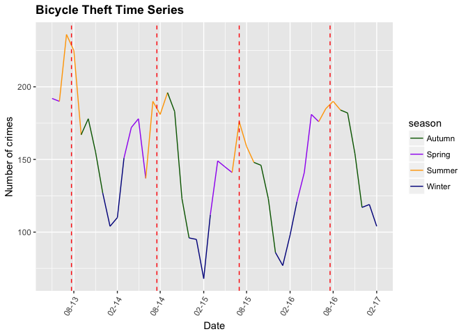

    BU.season <- filter(seasonal.crime, crime_type == "burglary")

    ggplot(BU.season, aes(x = date, y = Count)) +
      geom_line(aes(group = crime_type, col = season)) + 
      scale_colour_manual(values = season.cols) +
      scale_x_date(date_breaks = "6 month", date_labels = "%m-%y") +
      ylab("Number of crimes") +
      xlab("Date") +
      ggtitle("Burglary Time Series") +
      theme(axis.text.x=element_text(angle=60, hjust=1), plot.title = element_text(lineheight=.8, face="bold")) +
        geom_vline(xintercept = as.numeric(as.Date(TDates)), linetype=2, col = "red")

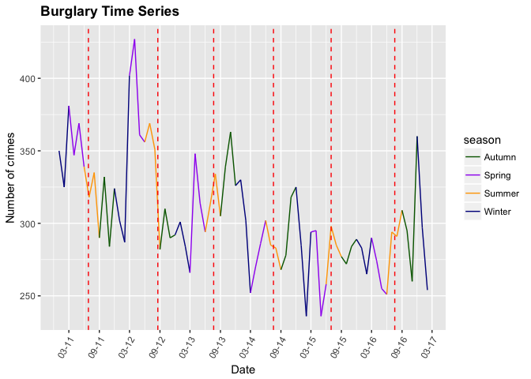

Bicycle theft statistics are only available from 2013 and they have been
fairly steady from 2014 onwards. The time series is cyclical with peaks
generally corresponding reasonably (within 3 weeks) to the hottest day
of the year, and minimum recorded incidences always occuring in the
winter.

Burglaries have generally decreased since 2012, though there was a surge
in Spring 2012 and another peak in Autumn 2016. There is less of a
pattern visible in burglary occurences, though there is frequently a
peak in the run up to Christmas followed by a sharp decrease over New
Year. There is no clear pattern between high temperatures and burglary.

The Leaflet package can be used to visualise the location of crime
occurences. A reduced dataset is required and is only useful if the data
is filtered to a single year and single crime, due to overlapping or
proximal datapoints. Jittering could be used to improve this.

    VEC.2016 <- crime11to17 %>%
    filter(year == 2016, crime_type == 'vehicle-crime')

    VEC.2016 %>% 
      leaflet() %>%
      addTiles() %>%
      addMarkers(~longitude, ~latitude)

    ## PhantomJS not found. You can install it with webshot::install_phantomjs(). If it is installed, please make sure the phantomjs executable can be found via the PATH variable.

<!--html_preserve-->

<script type="application/json" data-for="htmlwidget-f2c9b19ff444b8d90abf">{"x":{"options":{"crs":{"crsClass":"L.CRS.EPSG3857","code":null,"proj4def":null,"projectedBounds":null,"options":{}}},"calls":[{"method":"addTiles","args":["//{s}.tile.openstreetmap.org/{z}/{x}/{y}.png",null,null,{"minZoom":0,"maxZoom":18,"maxNativeZoom":null,"tileSize":256,"subdomains":"abc","errorTileUrl":"","tms":false,"continuousWorld":false,"noWrap":false,"zoomOffset":0,"zoomReverse":false,"opacity":1,"zIndex":null,"unloadInvisibleTiles":null,"updateWhenIdle":null,"detectRetina":false,"reuseTiles":false,"attribution":"&copy; <a href=\"http://openstreetmap.org\">OpenStreetMap<\/a> contributors, <a href=\"http://creativecommons.org/licenses/by-sa/2.0/\">CC-BY-SA<\/a>"}]},{"method":"addMarkers","args":[[51.51253,51.509514,51.485859,51.498936,51.496564,51.502966,51.497899,51.507531,51.498336,51.491165,51.485489,51.491806,51.488371,51.487674,51.508221,51.485009,51.489116,51.513077,51.501566,51.495754,51.502892,51.48939,51.494229,51.506587,51.49485,51.49027,51.500546,51.500397,51.488796,51.500808,51.497532,51.484917,51.507293,51.493613,51.487165,51.487165,51.493462,51.500969,51.512558,51.505458,51.513664,51.506276,51.510505,51.512899,51.492366,51.512955,51.501937,51.508539,51.498865,51.500288,51.495601,51.508486,51.496975,51.486498,51.500288,51.503336,51.513643,51.513474,51.507877,51.496938,51.487136,51.489332,51.486179,51.494263,51.513846,51.48493,51.484861,51.499023,51.51225,51.487506,51.485914,51.509135,51.495451,51.50784,51.506587,51.512379,51.512719,51.484455,51.48992,51.490621,51.493175,51.508642,51.497505,51.484242,51.497255,51.491266,51.486829,51.484427,51.512592,51.501237,51.501237,51.48939,51.489684,51.509054,51.493162,51.48921,51.512424,51.501964,51.49809,51.508871,51.498304,51.506157,51.485748,51.497733,51.510164,51.490054,51.510263,51.508642,51.498336,51.510297,51.487795,51.491386,51.4857,51.50784,51.489168,51.501998,51.511914,51.50472,51.505975,51.499435,51.508337,51.497322,51.511767,51.506712,51.505569,51.498501,51.496311,51.501753,51.499823,51.487732,51.487136,51.501017,51.497255,51.49236,51.488241,51.498903,51.505771,51.495874,51.512975,51.486313,51.484663,51.500651,51.497789,51.508259,51.500735,51.500703,51.511238,51.499014,51.498316,51.510265,51.511375,51.510632,51.486875,51.510925,51.485764,51.495278,51.505458,51.49505,51.501853,51.493713,51.491231,51.485336,51.48992,51.485748,51.491386,51.493694,51.49216,51.511694,51.505921,51.488512,51.497592,51.509904,51.499306,51.490006,51.497733,51.510051,51.509475,51.495775,51.509528,51.503437,51.493096,51.498936,51.492094,51.492206,51.487769,51.497579,51.493033,51.486538,51.492961,51.499433,51.487835,51.497032,51.51225,51.487732,51.491605,51.514,51.497608,51.484999,51.491972,51.490241,51.512096,51.486005,51.500397,51.490893,51.491338,51.4873,51.498012,51.50786,51.491798,51.50472,51.494549,51.504216,51.509053,51.487136,51.512425,51.513828,51.51117,51.493583,51.484498,51.494046,51.495737,51.513343,51.498501,51.490725,51.510192,51.489778,51.503336,51.491488,51.49027,51.496291,51.499953,51.510632,51.494486,51.487353,51.513226,51.505771,51.503456,51.489013,51.499307,51.510003,51.501753,51.506841,51.493244,51.498737,51.511211,51.487045,51.501221,51.505458,51.486416,51.48621,51.49426,51.498304,51.489094,51.499811,51.499443,51.49455,51.500729,51.492797,51.500471,51.492715,51.508045,51.513893,51.504908,51.49461,51.485011,51.491597,51.485754,51.495405,51.497592,51.491488,51.499727,51.510411,51.491082,51.511707,51.507548,51.499443,51.490762,51.490576,51.504908,51.505931,51.501753,51.488408,51.512764,51.50282,51.48658,51.512793,51.490158,51.490878,51.486158,51.50799,51.495877,51.499823,51.486416,51.489778,51.511579,51.500816,51.49461,51.490762,51.491899,51.506747,51.495232,51.485517,51.492344,51.51225,51.508419,51.485181,51.507298,51.485018,51.513839,51.490576,51.511734,51.511036,51.489963,51.500463,51.495877,51.500089,51.490628,51.510096,51.508871,51.510974,51.488172,51.512773,51.502168,51.512876,51.500397,51.490627,51.509609,51.506587,51.485009,51.489886,51.486364,51.498222,51.48832,51.487165,51.509369,51.490601,51.499245,51.485181,51.489874,51.490943,51.496784,51.51225,51.51225,51.512773,51.509475,51.507214,51.48677,51.500397,51.486866,51.493702,51.49853,51.510003,51.507713,51.500397,51.493465,51.501566,51.496734,51.490893,51.484159,51.487795,51.501188,51.485997,51.485783,51.489733,51.495494,51.491991,51.493443,51.488681,51.501815,51.498936,51.492669,51.500506,51.486558,51.495923,51.504908,51.502281,51.49696,51.506747,51.506587,51.496593,51.487165,51.489684,51.511303,51.497608,51.500471,51.491787,51.494212,51.487769,51.499536,51.501221,51.499868,51.491777,51.495317,51.50518,51.50784,51.487165,51.491634,51.488408,51.495067,51.493276,51.50806,51.500471,51.487795,51.486693,51.490738,51.511751,51.489478,51.486687,51.500599,51.508201,51.49216,51.500201,51.506013,51.500599,51.496121,51.497568,51.513643,51.50972,51.494147,51.501632,51.49564,51.512063,51.498936,51.496932,51.490006,51.500599,51.496577,51.495733,51.492852,51.496291,51.503038,51.49696,51.499146,51.492755,51.498201,51.487852,51.485748,51.487165,51.484905,51.497264,51.487032,51.501278,51.495765,51.494892,51.490707,51.505458,51.495754,51.499435,51.489094,51.493748,51.50634,51.504735,51.50786,51.503515,51.501309,51.496607,51.490461,51.490811,51.485738,51.510946,51.495737,51.489271,51.490551,51.500682,51.510275,51.512793,51.485389,51.494752,51.497305,51.511694,51.496199,51.500793,51.500961,51.494693,51.499939,51.508539,51.497058,51.491899,51.49261,51.502613,51.496205,51.489828,51.501675,51.50784,51.496246,51.50799,51.485237,51.48695,51.51225,51.492747,51.500217,51.500936,51.501298,51.511707,51.510973,51.48785,51.493288,51.495125,51.498985,51.50129,51.512596,51.513828,51.501298,51.49948,51.511749,51.510606,51.509005,51.490118,51.493765,51.490628,51.486158,51.49455,51.494486,51.507657,51.513114,51.485129,51.490429,51.510834,51.488681,51.499753,51.51272,51.495109,51.490691,51.511045,51.484381,51.484434,51.497733,51.486313,51.503763,51.502173,51.512719,51.512596,51.49931,51.510827,51.495486,51.499132,51.505458,51.497513,51.510946,51.507758,51.494371,51.503763,51.500089,51.509475,51.500039,51.50634,51.49019,51.503763,51.500227,51.486091,51.509933,51.49273,51.495199,51.499953,51.510974,51.495278,51.509475,51.497817,51.487165,51.502048,51.487045,51.497592,51.493453,51.506818,51.498127,51.491329,51.494688,51.500682,51.502791,51.488141,51.497072,51.50784,51.492242,51.505195,51.50837,51.502892,51.493702,51.510678,51.494864,51.513664,51.484852,51.502862,51.510158,51.513363,51.498704,51.488983,51.489768,51.51052,51.495496,51.499753,51.511055,51.511096,51.501188,51.489717,51.488681,51.491327,51.508871,51.510766,51.511767,51.51393,51.495906,51.500333,51.487852,51.513484,51.503826,51.509182,51.493955,51.489945,51.498201,51.511211,51.486418,51.487754,51.485754,51.493014,51.501566,51.49762,51.51394,51.502966,51.488562,51.513067,51.498336,51.498336,51.497941,51.497789,51.509135,51.511868,51.485505,51.510974,51.500816,51.48817,51.485859,51.494982,51.498632,51.488755,51.492852,51.498524,51.512278,51.491605,51.494522,51.508445,51.498936,51.497202,51.499014,51.491777,51.508165,51.500414,51.489133,51.495906,51.50129,51.500816,51.48475,51.508871,51.498304,51.508132,51.500729,51.512165,51.498737,51.493583,51.49162,51.489982,51.49449,51.500305,51.498304,51.497322,51.485505,51.491386,51.491622,51.498497,51.509475,51.505759,51.491777,51.49219,51.486418,51.499953,51.49461,51.49505,51.493865,51.48737,51.485726,51.496853,51.50784,51.507513,51.498137,51.509514,51.49598,51.494881,51.496819,51.510541,51.49678,51.494864,51.491605,51.510158,51.497072,51.513303,51.509933,51.504908,51.512345,51.496004,51.512938,51.493181,51.499868,51.510606,51.500556,51.486158,51.510757,51.48535,51.512345,51.513452,51.484452,51.489753,51.509475,51.484248,51.492719,51.48695,51.50784,51.489322,51.513622,51.502791,51.50784,51.484999,51.513484,51.497802,51.487857,51.513474,51.487353,51.486392,51.491329,51.50357,51.512086,51.497365,51.509232,51.490576,51.488441,51.508248,51.501202,51.497608,51.513893,51.490831,51.48997,51.494522,51.497975,51.509609,51.512938,51.49449,51.490831,51.504908,51.485517,51.487165,51.502297,51.509392,51.48785,51.513839,51.485469,51.498449,51.51225,51.507309,51.491377,51.484999,51.504286,51.49668,51.510275,51.485748,51.501815,51.490968,51.493106,51.487473,51.484033,51.485517,51.484242,51.48404,51.497351,51.492341,51.508221,51.491306,51.486675,51.498304,51.512447,51.502791,51.498234,51.494416,51.495648,51.502613,51.484677,51.511315,51.504246,51.487032,51.486711,51.499584,51.504515,51.489965,51.508221,51.513343,51.484381,51.488912,51.50784,51.486754,51.485469,51.48508,51.511767,51.512118,51.490576,51.512955,51.512887,51.487136,51.493955,51.507377,51.49317,51.495597,51.494392,51.487769,51.501645,51.510192,51.494212,51.487612,51.512887,51.497592,51.49299,51.51018,51.513553,51.487769,51.493445,51.50799,51.508539,51.490158,51.492656,51.493184,51.50998,51.492341,51.499198,51.485009,51.484248,51.51104,51.488177,51.513245,51.485035,51.512009,51.494489,51.494489,51.508598,51.495765,51.49107,51.513075,51.512908,51.493033,51.510615,51.513552,51.51018,51.487812,51.493904,51.485389,51.495085,51.484274,51.496249,51.491865,51.507298,51.510757,51.499506,51.495405,51.494982,51.494628,51.487165,51.484549,51.498737,51.49379,51.50634,51.511691,51.48982,51.504687,51.497532,51.510839,51.49097,51.498727,51.512998,51.50808,51.499502,51.491777,51.493427,51.489644,51.510003,51.51018,51.49349,51.508045,51.512345,51.506991,51.485754,51.503328,51.498344,51.509933,51.513671,51.489332,51.492925,51.49696,51.494522,51.495095,51.50806,51.49505,51.484362,51.49261,51.486346,51.50634,51.501221,51.491386,51.490179,51.485474,51.488983,51.493337,51.492692,51.488547,51.493265,51.49931,51.512427,51.51318,51.512887,51.505458,51.499603,51.498088,51.485181,51.498582,51.490158,51.510953,51.500961,51.488727,51.490831,51.511268,51.492574,51.51018,51.486418,51.501299,51.489322,51.497365,51.511816,51.493162,51.495828,51.503861,51.507439,51.50693,51.487543,51.513552,51.508215,51.496311,51.49564,51.505458,51.512592,51.511057,51.485933,51.512063,51.49273,51.487835,51.497524,51.504908,51.493583,51.494014,51.490158,51.498436,51.485945,51.500471,51.486335,51.494147,51.509921,51.487098,51.498497,51.513108,51.486469,51.499023,51.512558,51.497283,51.493029,51.484694,51.498582,51.51225,51.506814,51.504286,51.493955,51.493927,51.500936,51.490551,51.48985,51.508539,51.505179,51.487769,51.487795,51.49273,51.500472,51.494202,51.512478,51.512975,51.486596,51.501126,51.490692,51.485575,51.500682,51.508123,51.489684,51.493462,51.489684,51.4857,51.505458,51.48837,51.510158,51.512171,51.497608,51.494554,51.488371,51.484917,51.48854,51.498985,51.493123,51.500682,51.513846,51.497789,51.502371,51.50016,51.489778,51.513338,51.491082,51.492312,51.4983,51.512175,51.49668,51.490158,51.484804,51.493053,51.494629,51.506013,51.493955,51.509922,51.509475,51.505458,51.49273,51.488681,51.510725,51.49505,51.501126,51.498131,51.505458,51.506712,51.499584,51.496249,51.489322,51.487674,51.508602,51.511036,51.504515,51.490468,51.487857,51.497975,51.486172,51.485696,51.497592,51.501174,51.493228,51.495407,51.494335,51.500936,51.501998,51.488893,51.485033,51.486387,51.487711,51.49696,51.49273,51.491377,51.490582,51.510839,51.501675,51.494672,51.49429,51.491777,51.513526,51.499505,51.509294,51.489753,51.510365,51.492715,51.496199,51.510615,51.513828,51.485469,51.48828,51.496638,51.498681,51.489743,51.493007,51.489696,51.500961,51.487728,51.496009,51.494489,51.508871,51.500314,51.503637,51.491173,51.487795,51.500089,51.489116,51.49105,51.497608,51.497592,51.501174,51.496485,51.486418,51.487674,51.501202,51.513012,51.492162,51.513825,51.510263,51.503308,51.499953,51.510003,51.487088,51.512103,51.49324,51.499506,51.51395,51.495405,51.498696,51.497985,51.512938,51.493133,51.486392,51.50457,51.507877,51.505921,51.498127,51.494557,51.494557,51.48535,51.4858,51.486091,51.486392,51.493175,51.490121,51.508447,51.488668,51.4908,51.513828,51.487032,51.505474,51.48947,51.507293,51.484268,51.491223,51.50784,51.505921,51.49564,51.513638,51.501566,51.487088,51.500793,51.507214,51.490893,51.506455,51.492155,51.488729,51.494212,51.492188,51.507377,51.502209,51.498304,51.490118,51.491486,51.495601,51.512975,51.512118,51.511768,51.498766,51.496291,51.489965,51.490158,51.505811,51.498131,51.498685,51.505218,51.512175,51.501566,51.496441,51.489965,51.505467,51.512558,51.487119,51.505444,51.487296,51.513026,51.504222,51.490893,51.491082,51.498304,51.490241,51.50806,51.512975,51.513825,51.488377,51.490429,51.485695,51.513833,51.500735,51.49485,51.489209,51.490429,51.51175,51.512063,51.500753,51.498088,51.498222,51.496232,51.512558,51.498131,51.490158,51.490811,51.513495,51.513643,51.48971,51.500181,51.500181,51.500703,51.501221,51.498513,51.484375,51.487919,51.49146,51.488408,51.486418,51.502892,51.487032,51.492093,51.504657,51.512063,51.499552,51.489778,51.510046,51.496034,51.51141,51.499575,51.496232,51.499603,51.51225,51.501815,51.485801,51.496406,51.500941,51.511045,51.495405,51.493522,51.497289,51.507891,51.486057,51.49144,51.510505,51.512596,51.499433,51.485489,51.495745,51.501566,51.498528,51.488241,51.499475,51.485945,51.491787,51.508419,51.507877,51.497505,51.513737,51.490628,51.510265,51.486675,51.506271,51.513552,51.512793,51.499868,51.501964,51.502958,51.507507,51.510437,51.491173,51.501116,51.50784,51.503763,51.489094,51.49668,51.484242,51.505759,51.504738,51.506802,51.486057,51.494805,51.494805,51.500227,51.503038,51.509294,51.500004,51.492249,51.504448,51.487538,51.512874,51.491309,51.485726,51.513701,51.511342,51.512938,51.497524,51.497558,51.510046,51.48493,51.507755,51.492623,51.507531,51.511057,51.488096,51.51225,51.498513,51.491453,51.492852,51.507506,51.499368,51.503087,51.499603,51.509135,51.510505,51.499575,51.495232,51.506802,51.498768,51.485263,51.497426,51.511707,51.51018,51.497949,51.50784,51.503337,51.484113,51.503763,51.499642,51.501675,51.497072,51.511288,51.505609,51.488595,51.510381,51.498088,51.495568,51.494173,51.490893,51.512461,51.512673,51.498768,51.490893,51.511338,51.493053,51.494014,51.494805,51.51225,51.495733,51.497608,51.497985,51.493957,51.493886,51.492961,51.486675,51.504165,51.512478,51.493033,51.490114,51.487538,51.484478,51.507395,51.501237,51.506344,51.487711,51.484455,51.490811,51.49138,51.487098,51.509777,51.49598,51.485726,51.492341,51.484045,51.500463,51.498012,51.493265,51.501062,51.4858,51.501548,51.494247,51.493288,51.494864,51.491488,51.490878,51.51393,51.494147,51.501675,51.493175,51.498304,51.493955,51.494936,51.493313,51.503826,51.500753,51.502087,51.500181,51.491327,51.485754,51.490691,51.492165,51.496104,51.504687,51.489743,51.500961,51.500463,51.485859,51.506151,51.512764,51.501964,51.491386,51.485469,51.511338,51.505331,51.485489,51.513839,51.511026,51.505886,51.511669,51.50784,51.487674,51.497608,51.513474,51.511338,51.499476,51.502862,51.505609,51.49626,51.510925,51.491231,51.500181,51.487769,51.497072,51.50016,51.495923,51.498737,51.488669,51.493096,51.492187,51.495232,51.489321,51.496975,51.502719,51.499063,51.506587,51.490054,51.499575,51.501964,51.487136,51.509135,51.490893,51.499939,51.48658,51.499117,51.508419,51.495601,51.493486,51.500032,51.485748,51.492299,51.49809,51.497557,51.49171,51.495882,51.501548,51.513714,51.490627,51.49809,51.487045,51.496938,51.496655,51.513714,51.509005,51.488681,51.498012,51.489717,51.485859,51.49809,51.486158,51.491386,51.489022,51.512672,51.512245,51.498127,51.501278,51.510946,51.500269,51.484426,51.513824,51.500463,51.48982,51.491688,51.4858,51.491622,51.507758,51.491082,51.503518,51.500181,51.50784,51.498304,51.491972,51.48828,51.491292,51.500414,51.510033,51.492341,51.500019,51.508337,51.493096,51.485517,51.505458,51.497867,51.508602,51.495278,51.484455,51.500466,51.501221,51.503087,51.512118,51.490241,51.497558,51.506747,51.491291,51.49097,51.48404,51.492659,51.484255,51.512425,51.486158,51.485582,51.512876,51.512876,51.487136,51.512719,51.490241,51.500735,51.512118,51.512887,51.494852,51.496784,51.512278,51.493748,51.510468,51.507386,51.500227,51.512887,51.491486,51.491034,51.505771,51.488417,51.486687,51.500414,51.497743,51.488441,51.497207,51.508539,51.494864,51.484381,51.493462,51.513828,51.492755,51.491478,51.500871,51.495232,51.494983,51.498497,51.510003,51.513108,51.490468,51.501062,51.484677,51.498304,51.4852,51.493427,51.509922,51.490967,51.493065,51.487045,51.498737,51.488225,51.489982,51.500471,51.485358,51.502281,51.509904,51.48471,51.501964,51.497264,51.499925,51.513108,51.490219,51.509053,51.509135,51.499727,51.486418,51.512897,51.490054,51.510411,51.501964,51.495407,51.496485,51.494864,51.500463,51.487165,51.505458,51.509933,51.513101,51.512599,51.501263,51.495754,51.486773,51.488983,51.499953,51.51225,51.487317,51.490967,51.485033,51.497305,51.513734,51.509082,51.495648,51.511338,51.501753,51.498304,51.493265,51.494133,51.489256,51.493583,51.496817,51.511342,51.506932,51.491921,51.485748,51.501309,51.507214,51.49977,51.493957,51.493957,51.484242,51.489067,51.493912,51.491102,51.484937,51.492341,51.502403,51.487045,51.501575,51.50784,51.499846,51.487032,51.500941,51.496593,51.493181,51.487032,51.498936,51.485783,51.503038,51.504216,51.485582,51.484677,51.489814,51.485859,51.498304,51.499605,51.511638,51.494983,51.511859,51.487136,51.498497,51.497592,51.484632,51.502048,51.504575,51.49645,51.507309,51.512245,51.497365,51.511669,51.500793,51.50016,51.508338,51.49917,51.497608,51.506889,51.492842,51.494147,51.496121,51.491605,51.497524,51.493203,51.507577,51.513094,51.503508,51.484434,51.512447,51.497802,51.506837,51.50613,51.505771,51.494416,51.511026,51.489959,51.488562,51.507214,51.50582,51.495486,51.495451,51.512345,51.494247,51.507298,51.487296,51.506276,51.513303,51.493936,51.49762,51.495486,51.501309,51.491991,51.510003,51.505208,51.498012,51.507293,51.511638,51.495601,51.509414,51.506695,51.51225,51.489067,51.486558,51.486364,51.513108,51.501964,51.489332,51.487165,51.505458,51.484455,51.507569,51.500269,51.501964,51.49832,51.491428,51.499939,51.485997,51.496205,51.487395,51.492341,51.495199,51.487962,51.490006,51.502791,51.500941,51.484349,51.512345,51.505825,51.493998,51.496073,51.513495,51.509692,51.498497,51.4987,51.51018,51.487395,51.507758,51.487098,51.507214,51.506211,51.492341,51.512443,51.512345,51.508735,51.486392,51.493292,51.51015,51.490808,51.500414,51.498979,51.501964,51.513552,51.498782,51.500753,51.505576,51.510003,51.495671,51.491231,51.510946,51.493746,51.488177,51.496246,51.496291,51.489684,51.499584,51.489315,51.491488,51.490762,51.508486,51.510732,51.495693,51.512478,51.492546,51.49019,51.501299,51.490897,51.508338,51.499939,51.508007,51.506293,51.509392,51.504176,51.498697,51.500546,51.501221,51.486773,51.509427,51.49349,51.50016,51.50016,51.487045,51.497072,51.490054,51.484452,51.485854,51.499939,51.489067,51.505813,51.48659,51.487684,51.513474,51.513821,51.497567,51.490893,51.50016,51.497608,51.485018,51.502647,51.493427,51.499198,51.500397,51.491082,51.489116,51.495317,51.489116,51.485945,51.489067,51.511418,51.500181,51.486392,51.507473,51.513643,51.513638,51.513899,51.497802,51.507855,51.509135,51.501853,51.506802,51.494147,51.513452,51.494147,51.496249,51.490158,51.49505,51.499753,51.499753,51.489097,51.495125,51.49809,51.492341,51.49853,51.484694,51.510046,51.485263,51.500546,51.49809,51.484375,51.501126,51.494864,51.506597,51.489315,51.509432,51.507877,51.486158,51.493427,51.502613,51.492341,51.513732,51.509475,51.509475,51.501756,51.494155,51.495882,51.497592,51.488377,51.511036,51.513899,51.511338,51.484033,51.501298,51.495906,51.486158,51.498501,51.489315,51.487901,51.484455,51.48493,51.485483,51.486558,51.510632,51.501221,51.503038,51.487795,51.492306,51.485469,51.488512,51.491516,51.500355,51.501283,51.501221,51.49564,51.492529,51.509933,51.488668,51.502791,51.500181,51.49939,51.494164,51.487543,51.496517,51.500397,51.496205,51.498131,51.502281,51.49832,51.510158,51.512897,51.492755,51.510606,51.498865,51.491991,51.485695,51.485695,51.489298,51.489717,51.512079,51.492188,51.498205,51.490647,51.486416,51.49654,51.492184,51.488177,51.498304,51.492206,51.485933,51.488401,51.51374,51.490762,51.4975,51.485859,51.487732,51.510158,51.507473,51.492715,51.486158,51.510392,51.511694,51.510946,51.512719,51.512558,51.505763,51.501174,51.486346,51.497558,51.497608,51.511575,51.505801,51.513761,51.511057,51.49988,51.512876,51.513067,51.499245,51.512934,51.487543,51.489982,51.490219,51.500181,51.513474,51.491668,51.499368,51.485489,51.50784,51.484999,51.509053,51.500472,51.489067,51.494342,51.487032,51.498903,51.507043,51.484233,51.48471,51.493998,51.486475,51.500471,51.49809,51.500321,51.493955,51.494342,51.495693,51.489104,51.510606,51.487857,51.485783,51.487586,51.493348,51.497322,51.488669,51.485474,51.493746,51.484632,51.512897,51.508045,51.498893,51.510946,51.493427,51.494672,51.496936,51.50634,51.509432,51.505218,51.502791,51.497899,51.498903,51.492662,51.492797,51.494936,51.498304,51.497592,51.484937,51.490878,51.498449,51.50935,51.513363,51.490878,51.502743,51.489768,51.493702,51.496249,51.496232,51.492184,51.49107,51.487088,51.488727,51.490481,51.513531,51.494486,51.497608,51.484917,51.51395,51.49626,51.501315,51.487711,51.486566,51.485859,51.491834,51.502986,51.499532,51.497608,51.492184,51.484861,51.488401,51.490811,51.490107,51.490842,51.493313,51.50096,51.489067,51.487136,51.492546,51.488401,51.501753,51.486158,51.505921,51.511055,51.490107,51.489298,51.489768,51.50634,51.509324,51.4975,51.498513,51.486158,51.485358,51.496199,51.489959,51.493727,51.506814,51.50808,51.501998,51.486937,51.496441,51.492629,51.486147,51.48737,51.487045,51.506946,51.511025,51.497592,51.50885,51.500471,51.48982,51.505458,51.494164,51.500753,51.48404,51.487732,51.502862,51.485574,51.491798,51.489717,51.508248,51.495199,51.499433,51.492188,51.495232,51.511816,51.509392,51.499433,51.494147,51.500682,51.509904,51.51191,51.504216,51.51393,51.499603,51.510158,51.499925,51.500463,51.509609,51.487586,51.508318,51.508659,51.513474,51.489753,51.496139,51.500471,51.51254,51.504525,51.501001,51.497122,51.49915,51.496139,51.511473,51.496668,51.51052,51.485582,51.48854,51.497608,51.484255,51.489133,51.512558,51.500355,51.489886,51.48837,51.511768,51.501278,51.511691,51.486335,51.512186,51.512975,51.499953,51.494173,51.513363,51.500735,51.50808,51.513899,51.49138,51.485939,51.510946,51.490429,51.510158,51.4858,51.513474,51.501221,51.492341,51.505771,51.511268,51.49273,51.487484,51.511768,51.497905,51.51117,51.500463,51.513644,51.50822,51.512911,51.509369,51.494416,51.502168,51.49857,51.501174,51.509583,51.512728,51.512938,51.512692,51.494557,51.492922,51.489963,51.496564,51.490893,51.497355,51.512287,51.490576,51.488872,51.508528,51.507713,51.513158,51.511036,51.505208,51.495615,51.488729,51.49171,51.494522,51.494649,51.494649,51.494649,51.486416,51.485966,51.500397,51.485018,51.485358,51.513104,51.500181,51.494354,51.499925,51.491112,51.495494,51.494491,51.495957,51.493313,51.506455,51.502048,51.494752,51.507506,51.495693,51.493486,51.495601,51.487165,51.498394,51.485469,51.501237,51.498178,51.512975,51.497359,51.51018,51.51018,51.485441,51.487165,51.496291,51.499925,51.512908,51.497483,51.499925,51.493265,51.492253,51.506802,51.506802,51.510422,51.51025,51.494549,51.505059,51.492188,51.496783,51.4873,51.511691,51.499823,51.498316,51.51393,51.505474,51.509824,51.51141,51.51049,51.50021,51.506527,51.4982,51.485997,51.488401,51.489814,51.498936,51.505218,51.49505,51.484917,51.50784,51.494881,51.501998,51.513067,51.511291,51.494147,51.493097,51.494023,51.485033,51.498633,51.500089,51.486364,51.500506,51.501964,51.491386,51.507577,51.495755,51.503861,51.501675,51.49273,51.491428,51.488727,51.488629,51.503861,51.487684,51.491688,51.489743,51.488629,51.486596,51.493427,51.485975,51.500816,51.491381,51.495232,51.512938,51.506587,51.491921,51.4987,51.500735,51.486915,51.484632,51.511338,51.501998,51.505218,51.50784,51.490241,51.496034,51.489965,51.489271,51.510297,51.513644,51.48758,51.51228,51.495754,51.486038,51.512887,51.487032,51.500019,51.487204,51.498222,51.491173,51.488408,51.506455,51.48758,51.484632,51.502185,51.497592,51.490967,51.489753,51.514,51.489768,51.49931,51.496291,51.484804,51.493184,51.50613,51.48574,51.510392,51.495877,51.49138,51.488681,51.496485,51.485695,51.485474,51.50784,51.486457,51.511599,51.492749,51.514,51.492299,51.49349,51.485389,51.493957,51.512603,51.490241,51.491251,51.493613,51.48947,51.490536,51.494864,51.490241,51.50021,51.48475,51.495067,51.495754,51.491486,51.495232,51.500414,51.498304,51.510297,51.487136,51.499198,51.504216,51.501202,51.493613,51.495232,51.495232,51.497283,51.487919,51.492773,51.497557,51.496577,51.485011,51.506747,51.512899,51.501963,51.499656,51.493014,51.48677,51.486802,51.498865,51.49324,51.484673,51.503856,51.495451,51.48981,51.508735,51.486418,51.48709,51.4982,51.487543,51.49564,51.501299,51.484861,51.487869,51.492546,51.497426,51.498201,51.513067,51.510422,51.505931,51.487032,51.491947,51.513552,51.505921,51.490355,51.510946,51.484861,51.493511,51.484455,51.498737,51.486754,51.486754,51.51394,51.487204,51.491991,51.485505,51.503337,51.501575,51.484861,51.503276,51.505331,51.499476,51.495176,51.484452,51.513824,51.510297,51.493348,51.484455,51.487032,51.507377,51.513824,51.48982,51.506344,51.498936,51.488218,51.487032,51.512897,51.500471,51.499443,51.491102,51.506932,51.494864,51.511767,51.511767,51.486778,51.493957,51.51153,51.506417,51.508871,51.490831,51.511459,51.493113,51.50743,51.492341,51.512876,51.488595,51.503775,51.493765,51.49626,51.51377,51.486687,51.492093,51.500181,51.490461,51.4852,51.486711,51.510606,51.493511,51.492548,51.493053,51.486809,51.493033,51.48997,51.507339,51.48508,51.505399,51.49939,51.500546,51.500111,51.490054,51.493184,51.512908,51.494693,51.505931,51.501237,51.50822,51.494892,51.512186,51.487098,51.50613,51.486364,51.513899,51.489886,51.48493,51.513824,51.510925,51.500414,51.487538,51.500471,51.501753,51.485748,51.494015,51.48475,51.497067,51.493265,51.494335,51.506673,51.499476,51.485311,51.492014,51.492253,51.485011,51.493551,51.489696,51.513846,51.492842,51.485939,51.505059,51.498632,51.51018,51.495308,51.494401,51.490878,51.511879,51.51242,51.510606,51.500269,51.491338,51.507473,51.484455,51.513638,51.509392,51.501937,51.510766,51.491053,51.489883,51.512599,51.512257,51.511726,51.497264,51.511068,51.513819,51.50016,51.485181,51.502219,51.513303,51.513739,51.485469,51.485018,51.492529,51.495923,51.501986,51.513899,51.492253,51.513846,51.499349,51.513283,51.510551,51.513474,51.485474,51.498131,51.491223,51.510003,51.485939,51.505195,51.496607,51.499575,51.499753,51.493265,51.492162,51.484248,51.513839,51.486802,51.486179,51.513643,51.497592,51.507439,51.49449,51.494892,51.491947,51.491276,51.498697,51.502994,51.511473,51.487754,51.484999,51.484478,51.48854,51.511859,51.510297,51.498313,51.502613,51.490006,51.48992,51.494155,51.491055,51.493955,51.48535,51.493265,51.501202,51.491834,51.492546,51.501202,51.49138,51.492069,51.491798,51.489883,51.491292,51.493955,51.48837,51.495733,51.502281,51.485748,51.502862,51.495232,51.509475,51.494864,51.498576,51.484427,51.508217,51.488681,51.493053,51.493348,51.501753,51.490878,51.490878,51.49261,51.512459,51.510275,51.490179,51.491973,51.500682,51.488755,51.491375,51.503038,51.488408,51.513166,51.489256,51.486773,51.497289,51.485009,51.492341,51.490158,51.487506,51.485854,51.484632,51.51132,51.485582,51.499584,51.48689,51.513904,51.487165,51.485859,51.491834,51.486333,51.485966,51.496938,51.507439,51.492171,51.506585,51.496249,51.487543,51.497534,51.487353,51.486475,51.511575,51.487901,51.487586,51.497183,51.503038,51.497558,51.494802,51.488172,51.49349,51.506926,51.490551,51.507755,51.494903,51.495405,51.493713,51.495601,51.492529,51.509005,51.500004,51.510946,51.501038,51.487648,51.492165,51.513738,51.499476,51.49349,51.489811,51.502371,51.494522,51.490576,51.493722,51.500471,51.498331,51.494805,51.497608,51.488547,51.493096,51.499575,51.510499,51.512335,51.49449,51.50016,51.512975,51.51025,51.48854,51.490158,51.491991,51.506802,51.502048,51.498885,51.490158,51.497802,51.490158,51.484478,51.490158,51.489094,51.499624,51.488912,51.486778,51.498131,51.489301,51.501309,51.500855,51.492444,51.500471,51.497534,51.492344,51.495407,51.490576,51.497558,51.501278,51.498308,51.501278,51.495451,51.494853,51.51374,51.495568,51.511338,51.513222,51.487165,51.512478,51.503456,51.492715,51.49721,51.507531,51.500941,51.510422,51.50457,51.511338,51.506013,51.485933,51.501116,51.492253,51.498737,51.504216,51.500397,51.499435,51.491055,51.51033,51.513493,51.510046,51.498131,51.509475,51.486558,51.49429,51.488755,51.494649,51.50016,51.511827,51.486558,51.485726,51.510003,51.48659,51.489965,51.50149,51.494486,51.485237,51.497743,51.491634,51.513474,51.485219,51.513899,51.496271,51.497055,51.485997,51.512896,51.496311,51.495601,51.506406,51.492341,51.492845,51.500397,51.489987,51.484917,51.497774,51.513169,51.513798,51.502719,51.489117,51.492253,51.510551,51.490878,51.484694,51.499925,51.497482,51.486679,51.501891,51.496249,51.50124,51.50124,51.487032,51.511691,51.506747,51.500227,51.487479,51.491082,51.487648,51.496311,51.489686,51.490429,51.493583,51.492184,51.507855,51.492162,51.507506,51.490808,51.491488,51.494354,51.49564,51.506587,51.489963,51.492615,51.50472,51.512773,51.512908,51.487479,51.485754,51.507133,51.492715,51.497975,51.500004,51.489787,51.496734,51.495601,51.507577,51.484632,51.500397,51.503038,51.51052,51.508123,51.508486,51.500793,51.491856,51.508286,51.494903,51.507043,51.500682,51.486158,51.489094,51.485754,51.507439,51.489906,51.494015,51.51025,51.507377,51.490943,51.489621,51.497905,51.493583,51.512568,51.497774,51.502791,51.510839,51.492852,51.507192,51.490725,51.492263,51.485486,51.491034,51.511055,51.487795,51.485033,51.490692,51.484498,51.498304,51.485939,51.484329,51.495407,51.491034,51.490808,51.485966,51.485859,51.496104,51.489886,51.504908,51.490707,51.498152,51.485754,51.487317,51.513825,51.509037,51.512461,51.492747,51.487648,51.510946,51.498696,51.485726,51.487032,51.501997,51.490601,51.51175,51.49408,51.498304,51.489454,51.511767,51.492094,51.492529,51.509583,51.494518,51.512118,51.489509,51.499435,51.494688,51.49324,51.512226,51.505218,51.495601,51.498304,51.492546,51.504908,51.487165,51.489778,51.486469,51.510234,51.497802,51.500651,51.486158,51.499823,51.501278,51.485469,51.49236,51.501237,51.48947,51.495568,51.497359,51.504222,51.513824,51.508945,51.490967,51.493348,51.506013,51.503276,51.494354,51.490769,51.49449,51.492917,51.498234,51.485489,51.485574,51.494864,51.510275,51.509028,51.489022,51.4986,51.51333,51.506747,51.499811,51.487754,51.485939,51.488629,51.484273,51.512908,51.504515,51.499413,51.513734,51.485018,51.493713,51.488698,51.498737,51.496668,51.49314,51.50129,51.50998,51.500941,51.484255,51.497802,51.511989,51.484632,51.487032,51.490355,51.513824,51.488872,51.485018,51.485389,51.50634,51.497359,51.494864,51.485336,51.488912,51.509933,51.502403,51.509583,51.512492,51.487032,51.492162,51.501298,51.504165,51.487852,51.491292,51.497322,51.500682,51.497579,51.512186,51.500808,51.495215,51.501188,51.501795,51.501753,51.508338,51.509475,51.4857,51.488371,51.510839,51.49721,51.510724,51.498001,51.51175,51.505208,51.491292,51.493184,51.49931,51.493731,51.486479,51.51025,51.498936,51.509135,51.506587,51.507293,51.498538,51.492909,51.495615,51.508871,51.511914,51.498685,51.497072,51.498685,51.513535,51.502209,51.501202,51.506747,51.501038,51.493702,51.497072,51.491104,51.499349,51.50632,51.498304,51.489238,51.493462,51.493731,51.485441,51.504246,51.491269,51.489321,51.51018,51.491266,51.488796,51.509609,51.487769,51.486158,51.497532,51.492749,51.496249,51.507433,51.500871,51.506455,51.493033,51.485966,51.487612,51.498308,51.513893,51.503775,51.498449,51.495451,51.491777,51.513303,51.513338,51.48737,51.500269,51.490707,51.513222,51.493796,51.498308,51.499925,51.494734,51.508208,51.513096,51.512934,51.509475,51.485011,51.497153,51.513101,51.50799,51.502218,51.508642,51.500936,51.48737,51.511338,51.495085,51.501116,51.508445,51.492341,51.505378,51.498513,51.509005,51.485237,51.496485,51.497567,51.492457,51.510003,51.484632,51.484274,51.496073,51.485011,51.506802,51.487204,51.511556,51.512599,51.488812,51.512186,51.512887,51.493184,51.506905,51.501116,51.511816,51.500463,51.51025,51.49809,51.500269,51.500181,51.496485,51.486158,51.511767,51.488225,51.489094,51.486158,51.50998,51.487204,51.50896,51.486456,51.501964,51.493936,51.498538,51.513067,51.494486,51.509609,51.489209,51.48985,51.484673,51.494409,51.491329,51.501753,51.492546,51.508486,51.494522,51.486158,51.493096,51.501188,51.51363,51.484498,51.486098,51.500089,51.497608,51.51033,51.492366,51.512938,51.49485,51.486754,51.505771,51.507713,51.485696,51.499198,51.484268,51.496936,51.500404,51.513821,51.502791,51.513222,51.495067,51.495755,51.496671,51.487136,51.499476,51.494864,51.511045,51.492692,51.512086,51.497899,51.494335,51.487317,51.485854,51.501202,51.501221,51.504176,51.501853,51.4873,51.509418,51.497322,51.501753,51.501964,51.493583,51.496249,51.48997,51.498513,51.513081,51.506013,51.488681,51.490006,51.508539,51.49105,51.511816,51.487795,51.489874,51.497608,51.486422,51.491486,51.490405,51.498283,51.493433,51.491668,51.498707,51.497351,51.489256,51.497153,51.509869,51.492253,51.489963,51.497729,51.491102,51.502209,51.496232,51.493583,51.492852,51.508338,51.498768,51.499953,51.513104,51.486418,51.502892,51.498304,51.49696,51.511338,51.507891,51.498737,51.489184,51.510422,51.498135,51.484248,51.485033,51.487769,51.492533,51.49564,51.495733,51.50462,51.486158,51.512719,51.498316,51.490762,51.484149,51.505195,51.488935,51.513495,51.498696,51.485489,51.484455,51.507377,51.498737,51.501169,51.499306,51.50518,51.513899,51.486802,51.492094,51.497729,51.490627,51.498632,51.501566,51.486456,51.491605,51.513338,51.500305,51.506455,51.488225,51.486333,51.491112,51.485517,51.498497,51.509427,51.499925,51.505458,51.493033,51.487136,51.51374,51.48471,51.512258,51.511767,51.509574,51.499098,51.498696,51.490831,51.505208,51.500269,51.485754,51.510839,51.487032,51.492749,51.486158,51.491094,51.485754,51.495085,51.490811,51.511609,51.511989,51.500181,51.490762,51.511844,51.502281,51.513899,51.506712,51.497322,51.500404,51.48854,51.490808,51.486158,51.493337,51.49485,51.497927,51.500004,51.494734,51.50784,51.502281,51.496291,51.493727,51.512096,51.501221,51.512719,51.496291,51.510974,51.501887,51.502958,51.513828,51.493265,51.49248,51.512461,51.508165,51.505811,51.486422,51.498582,51.489481,51.490576,51.504176,51.512379,51.505378,51.497557,51.493731,51.495199,51.492623,51.495874,51.494864,51.493713,51.501753,51.490429,51.487684,51.4975,51.486158,51.49449,51.487795,51.498497,51.510839,51.510766,51.495351,51.488371,51.512975,51.50632,51.48947,51.492797,51.485859,51.507134,51.486158,51.503508,51.492249,51.486392,51.485237,51.501753,51.491292,51.495146,51.510297,51.494092,51.495601,51.50021,51.489478,51.486392,51.505458,51.488893,51.50613,51.506293,51.501298,51.499198,51.492615,51.497729,51.4975,51.486416,51.494672,51.493419,51.487506,51.493184,51.498985,51.509028,51.489094,51.497975,51.50518,51.488812,51.491488,51.499117,51.513101,51.504222,51.485582,51.510839,51.501753,51.487165,51.504176,51.493998,51.507713,51.495232,51.504216,51.501512,51.487648,51.500753,51.493228,51.492623,51.506587,51.512692,51.487165,51.494864,51.49261,51.49273,51.488241,51.498737,51.505921,51.486158,51.506417,51.485011,51.498088,51.48475,51.506956,51.486196,51.485748,51.488727,51.504515,51.513062,51.486158,51.492692,51.499846,51.500658,51.495494,51.496306,51.488141,51.507192,51.486693,51.513839,51.500032,51.50693,51.497058,51.511291,51.493765,51.51052,51.496734,51.492529,51.504575,51.488912,51.492533,51.510839,51.499435,51.485237,51.486479,51.507377,51.493228,51.495877,51.500941,51.513828,51.485517,51.501126,51.501188,51.493551,51.49273,51.484375,51.493053,51.489275,51.499925,51.51025,51.493427,51.498037,51.501278,51.509428,51.498316,51.494155,51.493228,51.501815,51.499925,51.511768,51.491375,51.495407,51.497802,51.495125,51.493337,51.511669,51.508003,51.508003,51.513067,51.511691,51.495109,51.509053,51.486313,51.484632,51.496205,51.49449,51.485748,51.505569,51.486538,51.484426,51.501278,51.486309,51.507891,51.484686,51.486773,51.490878,51.489184,51.488545,51.511473,51.486693,51.492546,51.501126,51.49162,51.486057,51.500181,51.493427,51.493175,51.49394,51.487795,51.496104,51.492092,51.497264,51.489768,51.486679,51.500032,51.513824,51.502048,51.505444,51.501207,51.48817,51.510839,51.501675,51.507134,51.48854,51.491605,51.513644,51.512459,51.506587,51.500735,51.513671,51.505444,51.492094,51.512599,51.501188,51.513484,51.491329,51.498222,51.497515,51.513484,51.489886,51.512911,51.490054,51.500305,51.48404,51.500305,51.507891,51.492818,51.50021,51.489768,51.501274,51.498037,51.484917,51.505458,51.501202,51.488408,51.497264,51.493662,51.486802,51.512876,51.507321,51.512706,51.500201,51.512505,51.495877,51.510946,51.495879,51.499582,51.501753,51.49939,51.511473,51.487296,51.493184,51.507059,51.485517,51.512938,51.495407,51.49297,51.511457,51.486802,51.492341,51.497899,51.50613,51.498632,51.49379,51.502403,51.486158,51.491991,51.493106,51.511868,51.512378,51.497568,51.488441,51.493583,51.492094,51.501038,51.497312,51.512719,51.494328,51.502209,51.497608,51.499433,51.513166,51.500703,51.509135,51.49473,51.508201,51.513714,51.512749,51.48695,51.485336,51.48471,51.509135,51.494155,51.50613,51.497592,51.492263,51.497802,51.486773,51.512344,51.497058,51.499968,51.509692,51.493184,51.498366,51.512876,51.500333,51.490893,51.513638,51.506623,51.49872,51.504216,51.489322,51.501938,51.49832,51.495879,51.512345,51.490114,51.492922,51.508338,51.494491,51.499753,51.499823,51.490041,51.50822,51.485489,51.484677,51.498304,51.491787,51.48621,51.48947,51.503826,51.485754,51.495828,51.513303,51.507214,51.489392,51.512492,51.500201,51.510599,51.491223,51.501795,51.501795,51.490878,51.484248,51.507433,51.493014,51.500004,51.497122,51.498449,51.501298,51.488911,51.511726,51.499117,51.511609,51.507891,51.509135,51.502048,51.500463,51.51225,51.495877,51.497058,51.49261,51.510234,51.509933,51.493758,51.493239,51.497828,51.48947,51.501278,51.509684,51.511338,51.513104,51.489717,51.498936,51.487136,51.50282,51.513474,51.51299,51.492546,51.502048,51.502892,51.489218,51.485505,51.510839,51.496034,51.502743,51.503038,51.512897,51.49917,51.492574,51.487045,51.490114,51.51052,51.499349,51.493522,51.497482,51.496139,51.513828,51.513737,51.502743,51.498737,51.486915,51.499953,51.50784,51.510096,51.484242,51.511067,51.492249,51.499532,51.506526,51.513788,51.505195,51.499023,51.512118,51.487136,51.495085,51.509427,51.484248,51.4983,51.501964,51.501795,51.509787,51.488668,51.49273,51.499443,51.49809,51.510046,51.513839,51.491329,51.486457,51.486558,51.484632,51.512975,51.499117,51.498576,51.491806,51.484613,51.488417,51.49429,51.501753,51.485237,51.486309,51.497592,51.511391,51.511055,51.486158,51.50885,51.496009,51.510606,51.488796,51.513701,51.492548,51.501566,51.508486,51.499098,51.49948,51.485469,51.497426,51.497743,51.487045,51.513737,51.489886,51.492444,51.493583,51.484426,51.488441,51.501753,51.513145,51.490241,51.497941,51.509609,51.489696,51.490762,51.487795,51.495737,51.487711,51.500269,51.490241,51.498304,51.488401,51.490121,51.488352,51.510946,51.506344,51.498528,51.500471,51.491777,51.496809,51.501753,51.495311,51.498131,51.507214,51.513347,51.485748,51.497032,51.492264,51.509609,51.513552,51.484242,51.496291,51.491921,51.484242,51.487317,51.493318,51.511036,51.506167,51.493288,51.484455,51.500729,51.498037,51.501815,51.487032,51.489298,51.500057,51.498936,51.485939,51.493726,51.500472,51.51351,51.499056,51.495176,51.501278,51.500288,51.487543,51.501221,51.510275,51.500816,51.499575,51.500651,51.513343,51.497505,51.492341,51.502048,51.487619,51.507214,51.50613,51.498316,51.492408,51.499925,51.488755,51.498131,51.508528,51.497153,51.510946,51.50021,51.504687,51.497608,51.490429,51.508618,51.489022,51.500355,51.513063,51.495125,51.493239,51.490107,51.512975,51.500181,51.501126,51.511096,51.510974,51.50808,51.500753,51.4858,51.511726,51.500414,51.486313,51.51394,51.497072,51.49598,51.512175,51.503336,51.492971,51.492529,51.506666,51.497608,51.493096,51.497733,51.508123,51.486915,51.485219,51.512887,51.487165,51.50613,51.512896,51.512719,51.486687,51.497592,51.490107,51.508003,51.509005,51.488452,51.50896,51.500471,51.484659,51.485748,51.499605,51.505218,51.49604,51.490878,51.491366,51.49564,51.487032,51.50632,51.513114,51.49832,51.498366,51.495494,51.485219,51.512793,51.489963,51.486333,51.511036,51.499435,51.513363,51.513363,51.513363,51.501815,51.507377,51.501298,51.486479,51.512896,51.492299,51.491486,51.493401,51.492529,51.492188,51.491428,51.497697,51.488629,51.513343,51.485748,51.506012,51.506673,51.491053,51.495486,51.484175,51.49105,51.491391,51.496205,51.499871,51.487711,51.513077,51.489298,51.511268,51.48695,51.498304,51.488715,51.486829,51.485726,51.495828,51.506597,51.499823,51.490967,51.495601,51.503456,51.495601,51.49373,51.485358,51.490967,51.510606,51.49503,51.510158,51.512767,51.500718,51.512955,51.507377,51.511624,51.493886,51.492188,51.513459,51.490625,51.493184,51.513452,51.490468,51.485764,51.486866,51.513825,51.494489,51.492162,51.495737,51.503048,51.49261,51.490224,51.493113,51.486335,51.513828,51.498685,51.508274,51.488668,51.496291,51.489621,51.498928,51.485336,51.491266,51.484329,51.491668,51.487612,51.500816,51.509053,51.504908,51.513824,51.487165,51.494752,51.501566,51.497515,51.497407,51.487165,51.513114,51.492341,51.495496,51.51225,51.513495,51.494489,51.492263,51.509005,51.506013,51.484175,51.49393,51.501753,51.512103,51.501753,51.485,51.487658,51.501566,51.492253,51.507755,51.494381,51.487857,51.503826,51.503515,51.512558,51.50808,51.513701,51.508045,51.485469,51.492188,51.501815,51.511581,51.493184,51.490475,51.492546,51.501263,51.497592,51.487165,51.503048,51.510265,51.488365,51.512079,51.510946,51.495095,51.494202,51.485779,51.490831,51.48997,51.496938,51.510839,51.490878,51.501283,51.491787,51.493758,51.49236,51.490762,51.500718,51.495875,51.497557,51.501753,51.492341,51.512461,51.491366,51.499584,51.490158,51.485726,51.508221,51.508735,51.496232,51.512345,51.510158,51.484917,51.510839,51.51225,51.492206,51.485859,51.491856,51.497975,51.497899,51.49832,51.508113,51.503839,51.508642,51.496468,51.513363,51.486345,51.501678,51.500414,51.508003,51.486754,51.513363,51.497365,51.498632,51.50518,51.50462,51.484937,51.495902,51.489392,51.490893,51.511816,51.49832,51.494173,51.487919,51.500217,51.506965,51.506276,51.500269,51.51333,51.512975,51.508036,51.484242,51.493234,51.510003,51.507395,51.501174,51.511555,51.507834,51.497802,51.512773,51.497407,51.493033,51.498135,51.500269,51.513077,51.510725,51.49138,51.486158,51.511212,51.51153,51.484455,51.498137,51.497608,51.513552,51.49019,51.486754,51.49809,51.503763,51.512599,51.498304,51.492546,51.51132,51.507891,51.512975,51.507043,51.497407,51.51225,51.496199,51.497868,51.488715,51.500355,51.512558,51.512558,51.486675,51.494852,51.495568,51.513821,51.490355,51.494554,51.497067,51.495601,51.486679,51.510422,51.488698,51.509554,51.511816,51.490054,51.511694,51.51225,51.492529,51.492341,51.503328,51.485754,51.512908,51.508539,51.49931,51.511669,51.500735,51.490893,51.487165,51.490316,51.499006,51.485582,51.512232,51.512938,51.492341,51.499823,51.511556,51.487136,51.513839,51.494522,51.499435,51.490878,51.497351,51.486754,51.506013,51.506455,51.510158,51.507321,51.501566,51.511425,51.499868,51.501667,51.513096,51.510158,51.494852,51.511816,51.499925,51.507657,51.504643,51.490769,51.484268,51.51153,51.504176,51.494263,51.498737,51.501299,51.509838,51.487252,51.51395,51.50896,51.488365,51.491381,51.499823,51.499023,51.507891,51.511816,51.508723,51.488352,51.501038,51.501136,51.486158,51.485263,51.49503,51.49503,51.49503,51.496232,51.512459,51.509609,51.494852,51.502281,51.497899,51.511036,51.502743,51.491386,51.487538,51.487088,51.487032,51.497899,51.491787,51.510392,51.513062,51.496412,51.496723,51.508723,51.491165,51.513347,51.512938,51.49019,51.513096,51.501221,51.512258,51.507395,51.512384,51.487179,51.490831,51.50124,51.507433,51.504634,51.493486,51.505378,51.505059,51.491428,51.493053,51.496784,51.487658,51.500463,51.499063,51.48574,51.494855,51.491856,51.510599,51.490219,51.485336,51.492623,51.495737,51.51052,51.48982,51.512558,51.512938,51.513231,51.492184,51.496306,51.511734,51.501753,51.513495,51.497128,51.503038,51.512955,51.499433,51.502613,51.509634,51.485237,51.500269,51.510615,51.487619,51.508602,51.491668,51.496784,51.495125,51.513839,51.499502,51.484113,51.487165,51.510275,51.492223,51.494864,51.496784,51.507755,51.495531,51.48677,51.513833,51.48574,51.486778,51.506013,51.505537,51.512558,51.510003,51.49171,51.499506,51.501221,51.509933,51.49273,51.507298,51.501081,51.487179,51.502764,51.512975,51.512199,51.497513,51.50241,51.505576,51.512908,51.489753,51.501753,51.489684,51.492094,51.48475,51.49917,51.486456,51.488241,51.487664,51.49853,51.484175,51.489778,51.489271,51.509475,51.506802,51.485219,51.487619,51.501202,51.501202,51.498184,51.509904,51.498449,51.512063,51.510946,51.49314,51.486457,51.489778,51.490893,51.499727,51.491292,51.513732,51.498582,51.508036,51.49058,51.501753,51.496784,51.507531,51.491622,51.497802,51.509418,51.504246,51.487165,51.48837,51.497608,51.513739,51.502403,51.493993,51.489903,51.493927,51.497975,51.511767,51.485011,51.486422,51.492341,51.491668,51.503775,51.494864,51.489945,51.513493,51.501566,51.494864,51.51206,51.497899,51.50021,51.495215,51.486213,51.496291,51.497568,51.507439,51.513495,51.492162,51.512719,51.493313,51.512672,51.506013,51.494864,51.496034,51.494864,51.507214,51.484632,51.499968,51.485975,51.500463,51.485754,51.486418,51.505811,51.506814,51.510158,51.498328,51.48574,51.508248,51.49138,51.513495,51.489478,51.499925,51.502966,51.487045,51.489446,51.486754,51.490536,51.488241,51.49349,51.494805,51.486754,51.509787,51.50634,51.48758,51.51025,51.506013,51.487543,51.506905,51.509634,51.487179,51.500599,51.491516,51.492162,51.488417,51.500181,51.510606,51.507214,51.499506,51.508045,51.503856,51.499986,51.494864,51.498903,51.500032,51.487242,51.501278,51.492093,51.491381,51.499132,51.496121,51.505179,51.501828,51.51206,51.512345,51.49002,51.498576,51.497975,51.496541,51.507439,51.497286,51.506635,51.485,51.493551,51.507877,51.489959,51.49408,51.495693,51.49058,51.4858,51.48726,51.513644,51.495405,51.485929,51.490219,51.513495,51.506211,51.491386,51.486418,51.486418,51.505569,51.489116,51.490965,51.487129,51.48981,51.493175,51.507214,51.492341,51.501815,51.512345,51.512899,51.496485,51.508107,51.501202,51.499847,51.492341,51.511726,51.513819,51.513734,51.510946,51.502613,51.513904,51.51225,51.492273,51.510761,51.495752,51.510946,51.510158,51.50021,51.486098,51.501309,51.498088,51.487088,51.484268,51.492574,51.512975,51.507377,51.501174,51.495407,51.492623,51.513899,51.505059,51.497975,51.497153,51.501938,51.513738,51.506802,51.513226,51.511229,51.491102,51.496104,51.512975,51.500404,51.498135,51.504515,51.484677,51.494155,51.498304,51.496213,51.512811,51.485748,51.509082,51.513869,51.487769,51.499117,51.492925,51.512118,51.500463,51.493029,51.495601,51.50582,51.499506,51.508274,51.500181,51.501126,51.511691,51.505975,51.501188,51.496445,51.501998,51.509475,51.494522,51.512749,51.492184,51.505811,51.490551,51.489965,51.492249,51.492005,51.489684,51.50357,51.512118,51.512118,51.493053,51.50685,51.510732,51.513739,51.497743,51.498131,51.484248,51.513075,51.493886,51.496784,51.500471,51.506013,51.492341,51.49819,51.497843,51.507513,51.488755,51.489743,51.509634,51.51299,51.498632,51.486158,51.498088,51.489116,51.512773,51.497568,51.513114,51.49931,51.511291,51.513484,51.495085,51.513251,51.499413,51.486915,51.498632,51.489886,51.513495,51.495125,51.49393,51.512672,51.49058,51.492364,51.505676,51.499023,51.489945,51.491231,51.491947,51.491973,51.51052,51.50837,51.508735,51.512997,51.502892,51.492206,51.507531,51.485939,51.49872,51.489828,51.48939,51.486778,51.496783,51.497359,51.494852,51.496291,51.488727,51.510839,51.51033,51.500039,51.505378,51.509053,51.49461,51.495317,51.494903,51.498304,51.497524,51.494557,51.488698,51.501221,51.513145,51.484613,51.500032,51.485336,51.50219,51.513798,51.498088,51.509135,51.489218,51.501645,51.508221,51.511338,51.509035,51.497608,51.497351,51.510761,51.499309,51.502613,51.489828,51.494166,51.507877,51.48677,51.512278,51.489094,51.513251,51.500032,51.513681,51.513761,51.500941,51.48471,51.500471,51.511026,51.495601,51.512719,51.509418,51.495072,51.499023,51.498768,51.499953,51.485181,51.506012,51.4857,51.492925,51.490179],[-0.209344,-0.131284,-0.174381,-0.161237,-0.151075,-0.222571,-0.119685,-0.206456,-0.218501,-0.153714,-0.166791,-0.120498,-0.19374,-0.20748,-0.209787,-0.199649,-0.208288,-0.195761,-0.193348,-0.185035,-0.218914,-0.129672,-0.187559,-0.19413,-0.16509,-0.161413,-0.197178,-0.164406,-0.195654,-0.190237,-0.169232,-0.188461,-0.147168,-0.157259,-0.180868,-0.180868,-0.161386,-0.124933,-0.192409,-0.114389,-0.131575,-0.211981,-0.221067,-0.120812,-0.155178,-0.198317,-0.109059,-0.145215,-0.179739,-0.222114,-0.187908,-0.197787,-0.193069,-0.201794,-0.222114,-0.216779,-0.185765,-0.177197,-0.147159,-0.166331,-0.185363,-0.182611,-0.182852,-0.138102,-0.160118,-0.15807,-0.121417,-0.209902,-0.129759,-0.178492,-0.105257,-0.143678,-0.111186,-0.221402,-0.19413,-0.194232,-0.151387,-0.209868,-0.218599,-0.131322,-0.197382,-0.203228,-0.164637,-0.185478,-0.126656,-0.182664,-0.173175,-0.179465,-0.206315,-0.212985,-0.212985,-0.129672,-0.180969,-0.196669,-0.113081,-0.212663,-0.142391,-0.194687,-0.152065,-0.209992,-0.159966,-0.139577,-0.185188,-0.224389,-0.127525,-0.216174,-0.129192,-0.203228,-0.218501,-0.194459,-0.188462,-0.162074,-0.169936,-0.221402,-0.191159,-0.188115,-0.119425,-0.192028,-0.214111,-0.182901,-0.14776,-0.182308,-0.195928,-0.126974,-0.150163,-0.213409,-0.187332,-0.186238,-0.157585,-0.190798,-0.185363,-0.163243,-0.126656,-0.167437,-0.181848,-0.214402,-0.223168,-0.130819,-0.15508,-0.159095,-0.169748,-0.224693,-0.181684,-0.14857,-0.156727,-0.11287,-0.133922,-0.184733,-0.180914,-0.21769,-0.134104,-0.140519,-0.142868,-0.186219,-0.109915,-0.149975,-0.114389,-0.210029,-0.184577,-0.202533,-0.141971,-0.20279,-0.218599,-0.185188,-0.162074,-0.147014,-0.175915,-0.144554,-0.109067,-0.106892,-0.159822,-0.153086,-0.15677,-0.178493,-0.224389,-0.133971,-0.146402,-0.142694,-0.197688,-0.199816,-0.170764,-0.161237,-0.156168,-0.168495,-0.178093,-0.130576,-0.201594,-0.167166,-0.195749,-0.223861,-0.175987,-0.164829,-0.129759,-0.190798,-0.172624,-0.199025,-0.16142,-0.185592,-0.19053,-0.175704,-0.222158,-0.188994,-0.164406,-0.206908,-0.155032,-0.152127,-0.214955,-0.193863,-0.193202,-0.192028,-0.17,-0.21369,-0.213674,-0.185363,-0.217808,-0.118741,-0.138148,-0.184214,-0.216232,-0.13291,-0.149985,-0.190793,-0.213409,-0.179646,-0.207533,-0.178906,-0.216779,-0.209333,-0.161413,-0.163505,-0.198383,-0.140519,-0.168259,-0.136698,-0.127774,-0.223168,-0.221673,-0.118452,-0.214948,-0.143974,-0.186238,-0.214827,-0.169303,-0.220661,-0.215434,-0.219935,-0.158465,-0.114389,-0.224137,-0.162858,-0.211256,-0.159966,-0.206892,-0.188029,-0.214439,-0.17811,-0.19158,-0.197973,-0.159346,-0.159096,-0.205975,-0.213211,-0.211357,-0.206546,-0.178851,-0.203552,-0.175696,-0.208502,-0.159822,-0.209333,-0.213592,-0.189641,-0.186431,-0.193754,-0.195821,-0.214439,-0.188417,-0.156316,-0.211357,-0.110839,-0.186238,-0.162568,-0.134898,-0.119267,-0.164716,-0.193625,-0.146307,-0.217697,-0.179122,-0.149719,-0.192421,-0.157585,-0.224137,-0.18703,-0.193039,-0.217814,-0.206546,-0.188417,-0.155254,-0.13487,-0.16421,-0.218814,-0.142387,-0.129759,-0.134787,-0.210934,-0.207647,-0.167731,-0.144265,-0.156316,-0.182166,-0.146166,-0.152797,-0.166348,-0.192421,-0.211388,-0.16245,-0.141881,-0.209992,-0.145059,-0.210068,-0.183019,-0.223337,-0.153355,-0.164406,-0.170474,-0.209992,-0.19413,-0.199649,-0.161025,-0.164105,-0.21221,-0.144941,-0.180868,-0.170573,-0.165952,-0.214994,-0.210934,-0.174062,-0.183253,-0.161065,-0.129759,-0.129759,-0.183019,-0.151518,-0.129721,-0.161295,-0.164406,-0.222924,-0.132809,-0.113047,-0.143974,-0.133951,-0.164406,-0.151849,-0.193348,-0.189088,-0.206908,-0.202289,-0.188462,-0.220969,-0.16592,-0.160902,-0.1399,-0.216134,-0.160494,-0.151634,-0.186454,-0.15847,-0.161237,-0.128919,-0.215766,-0.182304,-0.209491,-0.211357,-0.224875,-0.18042,-0.13487,-0.19413,-0.167238,-0.180868,-0.180969,-0.217938,-0.16142,-0.159346,-0.166423,-0.16392,-0.178093,-0.161083,-0.158465,-0.177178,-0.197092,-0.173081,-0.219747,-0.221402,-0.180868,-0.140139,-0.162568,-0.164577,-0.192236,-0.106788,-0.159346,-0.188462,-0.187541,-0.164347,-0.189602,-0.209642,-0.106348,-0.219479,-0.154019,-0.175915,-0.172597,-0.146946,-0.219479,-0.180238,-0.212956,-0.185765,-0.131794,-0.199174,-0.155985,-0.168443,-0.11413,-0.161237,-0.214321,-0.178493,-0.219479,-0.192321,-0.185958,-0.159782,-0.163505,-0.213131,-0.18042,-0.166603,-0.176021,-0.194994,-0.167243,-0.185188,-0.180868,-0.213422,-0.194887,-0.122221,-0.223386,-0.198534,-0.185069,-0.18139,-0.114389,-0.185035,-0.182901,-0.206892,-0.194306,-0.10611,-0.114188,-0.142663,-0.194352,-0.116419,-0.146953,-0.109534,-0.114518,-0.220346,-0.186968,-0.149985,-0.106025,-0.178284,-0.179235,-0.138977,-0.193625,-0.161566,-0.192926,-0.114019,-0.144554,-0.114598,-0.107262,-0.10933,-0.177514,-0.20625,-0.145215,-0.186179,-0.155254,-0.156421,-0.209459,-0.188561,-0.180387,-0.169628,-0.221402,-0.184872,-0.149719,-0.173671,-0.179796,-0.129759,-0.174912,-0.171314,-0.166632,-0.196385,-0.193754,-0.188725,-0.169447,-0.205949,-0.161924,-0.156942,-0.170926,-0.155571,-0.118741,-0.196385,-0.166719,-0.108018,-0.14454,-0.196412,-0.179929,-0.162944,-0.16245,-0.179122,-0.17811,-0.168259,-0.12989,-0.214019,-0.196375,-0.21008,-0.13966,-0.186454,-0.176174,-0.134395,-0.170122,-0.153862,-0.137086,-0.19976,-0.204972,-0.224389,-0.159095,-0.218794,-0.105331,-0.151387,-0.155571,-0.224615,-0.130697,-0.115592,-0.109103,-0.114389,-0.10796,-0.186968,-0.141284,-0.106073,-0.218794,-0.211388,-0.146402,-0.107365,-0.10611,-0.1128,-0.218794,-0.151863,-0.121295,-0.195352,-0.194749,-0.170694,-0.198383,-0.145059,-0.149975,-0.146402,-0.145017,-0.180868,-0.216642,-0.219935,-0.159822,-0.129031,-0.142735,-0.162451,-0.161299,-0.1656,-0.179235,-0.116905,-0.115103,-0.167392,-0.221402,-0.166174,-0.148147,-0.151577,-0.218914,-0.132809,-0.126999,-0.202574,-0.131575,-0.112488,-0.193989,-0.150352,-0.189178,-0.139146,-0.110992,-0.107301,-0.148204,-0.209176,-0.176174,-0.145675,-0.122226,-0.220969,-0.157705,-0.186454,-0.149155,-0.209992,-0.155256,-0.195928,-0.212071,-0.154415,-0.163774,-0.167243,-0.142319,-0.107453,-0.206175,-0.2066,-0.192007,-0.194994,-0.215434,-0.176764,-0.208053,-0.175696,-0.160957,-0.193348,-0.115173,-0.117901,-0.222571,-0.181072,-0.215073,-0.218501,-0.218501,-0.196215,-0.181684,-0.143678,-0.13848,-0.19914,-0.145059,-0.217814,-0.208181,-0.174381,-0.209657,-0.15736,-0.194762,-0.159782,-0.217298,-0.1542,-0.172624,-0.159052,-0.143274,-0.161237,-0.211962,-0.184733,-0.197092,-0.214962,-0.188625,-0.137836,-0.154415,-0.170926,-0.217814,-0.181108,-0.209992,-0.159966,-0.192887,-0.19158,-0.123825,-0.220661,-0.184214,-0.19511,-0.206742,-0.183544,-0.21733,-0.159966,-0.182308,-0.19914,-0.162074,-0.161071,-0.163056,-0.146402,-0.215863,-0.197092,-0.172053,-0.176764,-0.198383,-0.206546,-0.210029,-0.157292,-0.202926,-0.171059,-0.200335,-0.221402,-0.197062,-0.183255,-0.131284,-0.182217,-0.115963,-0.159306,-0.193368,-0.128966,-0.202574,-0.172624,-0.150352,-0.167392,-0.159347,-0.156615,-0.211357,-0.147035,-0.179695,-0.150441,-0.198967,-0.177178,-0.14454,-0.132918,-0.179122,-0.134792,-0.177498,-0.147035,-0.200834,-0.120023,-0.118623,-0.146402,-0.178363,-0.158765,-0.179796,-0.221402,-0.211204,-0.14021,-0.116905,-0.221402,-0.185592,-0.142319,-0.20825,-0.163556,-0.177197,-0.136698,-0.205399,-0.161299,-0.105504,-0.213209,-0.148305,-0.117576,-0.156316,-0.136712,-0.203344,-0.194242,-0.16142,-0.213211,-0.120826,-0.192482,-0.159052,-0.15789,-0.209992,-0.150441,-0.183544,-0.120826,-0.211357,-0.218814,-0.180868,-0.107978,-0.199956,-0.169447,-0.144265,-0.179956,-0.164585,-0.129759,-0.128348,-0.118412,-0.185592,-0.217145,-0.137427,-0.138977,-0.185188,-0.15847,-0.157193,-0.120257,-0.133524,-0.176657,-0.218814,-0.185478,-0.222227,-0.162814,-0.219326,-0.209787,-0.170749,-0.206857,-0.159966,-0.212143,-0.116905,-0.217108,-0.189799,-0.136936,-0.209459,-0.197977,-0.118528,-0.219236,-0.122221,-0.108983,-0.163041,-0.215062,-0.14378,-0.209787,-0.190793,-0.19976,-0.143707,-0.221402,-0.114987,-0.179956,-0.20666,-0.195928,-0.148068,-0.152888,-0.198317,-0.116128,-0.185363,-0.2066,-0.11575,-0.190036,-0.149659,-0.141108,-0.178093,-0.160854,-0.207533,-0.16392,-0.222909,-0.116128,-0.159822,-0.222398,-0.210906,-0.138699,-0.178093,-0.192747,-0.149719,-0.145215,-0.146307,-0.137101,-0.18106,-0.132331,-0.219326,-0.193759,-0.199649,-0.178363,-0.113726,-0.190507,-0.152201,-0.106546,-0.133242,-0.212111,-0.134794,-0.215637,-0.198534,-0.162,-0.142624,-0.14511,-0.201594,-0.149685,-0.151728,-0.210906,-0.216578,-0.142655,-0.161566,-0.138313,-0.184065,-0.160798,-0.214014,-0.207647,-0.134792,-0.115614,-0.208502,-0.209657,-0.172705,-0.180868,-0.114344,-0.220661,-0.141132,-0.10611,-0.180511,-0.168331,-0.193398,-0.169232,-0.184162,-0.153894,-0.105172,-0.12026,-0.136098,-0.194828,-0.197092,-0.212671,-0.166235,-0.143974,-0.210906,-0.16379,-0.205975,-0.147035,-0.142828,-0.175696,-0.188048,-0.214309,-0.156615,-0.172505,-0.182611,-0.184658,-0.18042,-0.159052,-0.195938,-0.106788,-0.210029,-0.216756,-0.156421,-0.162968,-0.10611,-0.158465,-0.162074,-0.167107,-0.223079,-0.110992,-0.110005,-0.117998,-0.137759,-0.15687,-0.224615,-0.119966,-0.127156,-0.116128,-0.114389,-0.174624,-0.209348,-0.210934,-0.200468,-0.146307,-0.133012,-0.10933,-0.162253,-0.120826,-0.179317,-0.169042,-0.210906,-0.176764,-0.111333,-0.211204,-0.148305,-0.177004,-0.113081,-0.155729,-0.19637,-0.199874,-0.145252,-0.186672,-0.151728,-0.131034,-0.187332,-0.202745,-0.114389,-0.206315,-0.128237,-0.133371,-0.11413,-0.194749,-0.175987,-0.184317,-0.211357,-0.184214,-0.176634,-0.146307,-0.111105,-0.185713,-0.159346,-0.188247,-0.199174,-0.200454,-0.168512,-0.163056,-0.219539,-0.196365,-0.209902,-0.192409,-0.189124,-0.215438,-0.127272,-0.200468,-0.129759,-0.138469,-0.217145,-0.2066,-0.106451,-0.166632,-0.178284,-0.177189,-0.145215,-0.106547,-0.178093,-0.188462,-0.138366,-0.186577,-0.108961,-0.187181,-0.15508,-0.209957,-0.159852,-0.224446,-0.118839,-0.179235,-0.132032,-0.180969,-0.161386,-0.180969,-0.169936,-0.114389,-0.179106,-0.150352,-0.133236,-0.16142,-0.177793,-0.19374,-0.188461,-0.202952,-0.156942,-0.13992,-0.179235,-0.160118,-0.181684,-0.15669,-0.170553,-0.18703,-0.133649,-0.186431,-0.140357,-0.220894,-0.141998,-0.137427,-0.146307,-0.161503,-0.219399,-0.224336,-0.146946,-0.2066,-0.223511,-0.146402,-0.114389,-0.138366,-0.186454,-0.152649,-0.210029,-0.159852,-0.155262,-0.114389,-0.126974,-0.163041,-0.160798,-0.211204,-0.20748,-0.148642,-0.146166,-0.215062,-0.183963,-0.163556,-0.15789,-0.211644,-0.208134,-0.159822,-0.167487,-0.204929,-0.191056,-0.182196,-0.166632,-0.188115,-0.150478,-0.165253,-0.12183,-0.161675,-0.18042,-0.194749,-0.118412,-0.166428,-0.184162,-0.169628,-0.172084,-0.157434,-0.197092,-0.162077,-0.159673,-0.202972,-0.118623,-0.154364,-0.159096,-0.114598,-0.149685,-0.118741,-0.179956,-0.11033,-0.21743,-0.167976,-0.170855,-0.155325,-0.209807,-0.10933,-0.112931,-0.153532,-0.134794,-0.209992,-0.132352,-0.110804,-0.190028,-0.188462,-0.211388,-0.208288,-0.1774,-0.16142,-0.159822,-0.167487,-0.193304,-0.176764,-0.20748,-0.194242,-0.123978,-0.159363,-0.187084,-0.129192,-0.192617,-0.198383,-0.143974,-0.163817,-0.120556,-0.190508,-0.115614,-0.12636,-0.208502,-0.197914,-0.143123,-0.150441,-0.224078,-0.205399,-0.11065,-0.147159,-0.109067,-0.162451,-0.220176,-0.220176,-0.177498,-0.217276,-0.121295,-0.205399,-0.197382,-0.171445,-0.142236,-0.22258,-0.116664,-0.118741,-0.122221,-0.192517,-0.174107,-0.147168,-0.127664,-0.145443,-0.221402,-0.109067,-0.168443,-0.18199,-0.193348,-0.163817,-0.107262,-0.129721,-0.206908,-0.134565,-0.136128,-0.145803,-0.16392,-0.205748,-0.11575,-0.220137,-0.159966,-0.179929,-0.183462,-0.187908,-0.15508,-0.148068,-0.188391,-0.170537,-0.163505,-0.14378,-0.146307,-0.210976,-0.155262,-0.115994,-0.11009,-0.141998,-0.193348,-0.105641,-0.14378,-0.14655,-0.192409,-0.138998,-0.22174,-0.181785,-0.151461,-0.214713,-0.206908,-0.186431,-0.159966,-0.175704,-0.106788,-0.15508,-0.187084,-0.145702,-0.21008,-0.182928,-0.134292,-0.156727,-0.16509,-0.219102,-0.142983,-0.218915,-0.11413,-0.184981,-0.209348,-0.21221,-0.216178,-0.192409,-0.155262,-0.146307,-0.114518,-0.158417,-0.185765,-0.133404,-0.155194,-0.155194,-0.11287,-0.158465,-0.20596,-0.165741,-0.150301,-0.140507,-0.162568,-0.176764,-0.218914,-0.122221,-0.112578,-0.139119,-0.11413,-0.184611,-0.178906,-0.143281,-0.20793,-0.216666,-0.165908,-0.216178,-0.174624,-0.129759,-0.15847,-0.163192,-0.138274,-0.157785,-0.137086,-0.208502,-0.155491,-0.183649,-0.198805,-0.20763,-0.204437,-0.221067,-0.155571,-0.223861,-0.166791,-0.132308,-0.193348,-0.160476,-0.181848,-0.167555,-0.185713,-0.166423,-0.134787,-0.147159,-0.164637,-0.127147,-0.16245,-0.21769,-0.206857,-0.193508,-0.151728,-0.193625,-0.177178,-0.194687,-0.152257,-0.137966,-0.120942,-0.190028,-0.219791,-0.221402,-0.218794,-0.206892,-0.137427,-0.185478,-0.215863,-0.192632,-0.209929,-0.20763,-0.221708,-0.221708,-0.151863,-0.213131,-0.202972,-0.192935,-0.133574,-0.197701,-0.165542,-0.205382,-0.204673,-0.171059,-0.128273,-0.203381,-0.150441,-0.184317,-0.166292,-0.19222,-0.15807,-0.146256,-0.167009,-0.206456,-0.128237,-0.180053,-0.129759,-0.20596,-0.138951,-0.159782,-0.216025,-0.171608,-0.195161,-0.174624,-0.143678,-0.221067,-0.165908,-0.16421,-0.209929,-0.19271,-0.221618,-0.112602,-0.193754,-0.210906,-0.18041,-0.221402,-0.107776,-0.211062,-0.218794,-0.179997,-0.169628,-0.167392,-0.142178,-0.148749,-0.223102,-0.119114,-0.209348,-0.151231,-0.151705,-0.206908,-0.184357,-0.189969,-0.19271,-0.206908,-0.198453,-0.219399,-0.176634,-0.221708,-0.129759,-0.185958,-0.16142,-0.143123,-0.167157,-0.186305,-0.195749,-0.206857,-0.194557,-0.187181,-0.201594,-0.190733,-0.165542,-0.12391,-0.201663,-0.212985,-0.110216,-0.161675,-0.209868,-0.114518,-0.173195,-0.168512,-0.124673,-0.182217,-0.171059,-0.219326,-0.172797,-0.166348,-0.214955,-0.15687,-0.162088,-0.217276,-0.189862,-0.116234,-0.205949,-0.202574,-0.209333,-0.217697,-0.212071,-0.199174,-0.169628,-0.197382,-0.159966,-0.157332,-0.173442,-0.208729,-0.107453,-0.184981,-0.217419,-0.155194,-0.149155,-0.175696,-0.21249,-0.189024,-0.19489,-0.193398,-0.170855,-0.10933,-0.166348,-0.174381,-0.125657,-0.134898,-0.194687,-0.162074,-0.179956,-0.198453,-0.222609,-0.166791,-0.144265,-0.208582,-0.217069,-0.147509,-0.221402,-0.20748,-0.16142,-0.177197,-0.198453,-0.217175,-0.193989,-0.148749,-0.164975,-0.186219,-0.141971,-0.155194,-0.178093,-0.167392,-0.170553,-0.209491,-0.220661,-0.220852,-0.170764,-0.139325,-0.16421,-0.146255,-0.193069,-0.224065,-0.196041,-0.19413,-0.216174,-0.165908,-0.194687,-0.185363,-0.143678,-0.206908,-0.20625,-0.164716,-0.216036,-0.134787,-0.187908,-0.165217,-0.223636,-0.185188,-0.165812,-0.152065,-0.157072,-0.154066,-0.19801,-0.189862,-0.218565,-0.170474,-0.152065,-0.219935,-0.166331,-0.153434,-0.218565,-0.196412,-0.186454,-0.214955,-0.157705,-0.174381,-0.152065,-0.179122,-0.162074,-0.138748,-0.15698,-0.113128,-0.162451,-0.223386,-0.186968,-0.196742,-0.158638,-0.203975,-0.166348,-0.168331,-0.177375,-0.116064,-0.161071,-0.141284,-0.186431,-0.117336,-0.155194,-0.221402,-0.159966,-0.19053,-0.11033,-0.108087,-0.188625,-0.119301,-0.219326,-0.112265,-0.14776,-0.170764,-0.218814,-0.114389,-0.168786,-0.148642,-0.149975,-0.209868,-0.110964,-0.158465,-0.195161,-0.148068,-0.175704,-0.166292,-0.13487,-0.125979,-0.153894,-0.222227,-0.114269,-0.223342,-0.217808,-0.179122,-0.181997,-0.153355,-0.153355,-0.185363,-0.151387,-0.175704,-0.156727,-0.148068,-0.116128,-0.156014,-0.161065,-0.1542,-0.194306,-0.184033,-0.137682,-0.151863,-0.116128,-0.183462,-0.209639,-0.223168,-0.191477,-0.106348,-0.188625,-0.21972,-0.136712,-0.219367,-0.145215,-0.202574,-0.19976,-0.161386,-0.118741,-0.157078,-0.156496,-0.152226,-0.16421,-0.121188,-0.163056,-0.143974,-0.219539,-0.183963,-0.162088,-0.197977,-0.159966,-0.112286,-0.212671,-0.223511,-0.200005,-0.221358,-0.219935,-0.220661,-0.172126,-0.206742,-0.159346,-0.211921,-0.224875,-0.153086,-0.223713,-0.194687,-0.194887,-0.166989,-0.219539,-0.160464,-0.213674,-0.143678,-0.213592,-0.22248,-0.147258,-0.216174,-0.189641,-0.194687,-0.191056,-0.193304,-0.202574,-0.166348,-0.180868,-0.114389,-0.156615,-0.117719,-0.143191,-0.166849,-0.185035,-0.160344,-0.110992,-0.198383,-0.129759,-0.162353,-0.200005,-0.165253,-0.114019,-0.120158,-0.194391,-0.136936,-0.198453,-0.186238,-0.159966,-0.15687,-0.21237,-0.116267,-0.184214,-0.217984,-0.203381,-0.138594,-0.105814,-0.185188,-0.116419,-0.129721,-0.185913,-0.167157,-0.167157,-0.185478,-0.223429,-0.17465,-0.18074,-0.203195,-0.219326,-0.214568,-0.219935,-0.15982,-0.221402,-0.160826,-0.122221,-0.157785,-0.167238,-0.109219,-0.122221,-0.161237,-0.160902,-0.213131,-0.21369,-0.181997,-0.197977,-0.166804,-0.174381,-0.159966,-0.209159,-0.191638,-0.121188,-0.127772,-0.185363,-0.163056,-0.159822,-0.173566,-0.216642,-0.149267,-0.155834,-0.128348,-0.113128,-0.148305,-0.147509,-0.107262,-0.170553,-0.19687,-0.106983,-0.16142,-0.149461,-0.156858,-0.199174,-0.180238,-0.172624,-0.184317,-0.116191,-0.141782,-0.127376,-0.191557,-0.204972,-0.212143,-0.20825,-0.111824,-0.209508,-0.223168,-0.189799,-0.208582,-0.110203,-0.181072,-0.129721,-0.206293,-0.115592,-0.111186,-0.147035,-0.116234,-0.207647,-0.181785,-0.211981,-0.159347,-0.189544,-0.115173,-0.115592,-0.116419,-0.160494,-0.143974,-0.138131,-0.214955,-0.147168,-0.191638,-0.187908,-0.122771,-0.148028,-0.129759,-0.223429,-0.182304,-0.164105,-0.219539,-0.194687,-0.182611,-0.180868,-0.114389,-0.209868,-0.132833,-0.196742,-0.194687,-0.215678,-0.184415,-0.20625,-0.16592,-0.188561,-0.213411,-0.219326,-0.170694,-0.117991,-0.178493,-0.116905,-0.157785,-0.124852,-0.147035,-0.224939,-0.21118,-0.155302,-0.158417,-0.151048,-0.163056,-0.214079,-0.210906,-0.213411,-0.141284,-0.168512,-0.129721,-0.148667,-0.219326,-0.196045,-0.147035,-0.154228,-0.205399,-0.193906,-0.192519,-0.19373,-0.188625,-0.200554,-0.194687,-0.151728,-0.139503,-0.184981,-0.124571,-0.143974,-0.186623,-0.141971,-0.186968,-0.120908,-0.190507,-0.184872,-0.163505,-0.180969,-0.163041,-0.157317,-0.209333,-0.188417,-0.197787,-0.14857,-0.219166,-0.187181,-0.182829,-0.1128,-0.111333,-0.143036,-0.19687,-0.20625,-0.213484,-0.20662,-0.199956,-0.149643,-0.165497,-0.197178,-0.158465,-0.160344,-0.148465,-0.16379,-0.170553,-0.170553,-0.219935,-0.167392,-0.216174,-0.120023,-0.213774,-0.20625,-0.223429,-0.137775,-0.190181,-0.145097,-0.129824,-0.172917,-0.211717,-0.206908,-0.170553,-0.16142,-0.167731,-0.190554,-0.212671,-0.193759,-0.164406,-0.186431,-0.208288,-0.173081,-0.208288,-0.185713,-0.223429,-0.154985,-0.155194,-0.205399,-0.125675,-0.185765,-0.18199,-0.194244,-0.20825,-0.21532,-0.143678,-0.184577,-0.209929,-0.199174,-0.200834,-0.199174,-0.160798,-0.146307,-0.210029,-0.176174,-0.176174,-0.135532,-0.161924,-0.152065,-0.219326,-0.113047,-0.127272,-0.143281,-0.221618,-0.197178,-0.152065,-0.165741,-0.159852,-0.202574,-0.197155,-0.157317,-0.20141,-0.147159,-0.179122,-0.212671,-0.209459,-0.219326,-0.162068,-0.146402,-0.151518,-0.108432,-0.185718,-0.19801,-0.159822,-0.145702,-0.146166,-0.194244,-0.198453,-0.176657,-0.196385,-0.154415,-0.179122,-0.213409,-0.157317,-0.201768,-0.209868,-0.15807,-0.204758,-0.182304,-0.140519,-0.158465,-0.213131,-0.188462,-0.181844,-0.179956,-0.106892,-0.19242,-0.167433,-0.224885,-0.158465,-0.168443,-0.147839,-0.156615,-0.22258,-0.116905,-0.155194,-0.203923,-0.120603,-0.186672,-0.127724,-0.164406,-0.188561,-0.155262,-0.224875,-0.215678,-0.150352,-0.147258,-0.176021,-0.14454,-0.179739,-0.160494,-0.182928,-0.182928,-0.176923,-0.157705,-0.19923,-0.205748,-0.173772,-0.132934,-0.224137,-0.135402,-0.216653,-0.190507,-0.159966,-0.168495,-0.133371,-0.168402,-0.134656,-0.188417,-0.109991,-0.174381,-0.190798,-0.150352,-0.200867,-0.159096,-0.179122,-0.135023,-0.144554,-0.186968,-0.151387,-0.192409,-0.148786,-0.167487,-0.162968,-0.166292,-0.16142,-0.216284,-0.133583,-0.145637,-0.128237,-0.10864,-0.153355,-0.215073,-0.214994,-0.171411,-0.186672,-0.206742,-0.160464,-0.155194,-0.177197,-0.182489,-0.171608,-0.166791,-0.221402,-0.185592,-0.213674,-0.186577,-0.223429,-0.149912,-0.122221,-0.214402,-0.148417,-0.17217,-0.223713,-0.21118,-0.208492,-0.159346,-0.152065,-0.168731,-0.2066,-0.149912,-0.219166,-0.13824,-0.14454,-0.163556,-0.160902,-0.134413,-0.171359,-0.182308,-0.220852,-0.223079,-0.120908,-0.173566,-0.147258,-0.205975,-0.156225,-0.186968,-0.212671,-0.172084,-0.193445,-0.10611,-0.20141,-0.11009,-0.116905,-0.119685,-0.214402,-0.157989,-0.197973,-0.173442,-0.159966,-0.159822,-0.203195,-0.217697,-0.164585,-0.196023,-0.189178,-0.217697,-0.107181,-0.107301,-0.132809,-0.160798,-0.216178,-0.216653,-0.162,-0.163817,-0.162253,-0.162845,-0.221324,-0.168259,-0.16142,-0.188461,-0.12636,-0.164975,-0.189353,-0.161675,-0.105546,-0.174381,-0.185032,-0.192154,-0.186845,-0.16142,-0.216653,-0.121417,-0.168402,-0.114518,-0.105414,-0.111448,-0.208729,-0.107629,-0.223429,-0.185363,-0.182829,-0.168402,-0.186238,-0.179122,-0.109067,-0.145675,-0.105414,-0.176923,-0.107301,-0.10611,-0.13743,-0.109991,-0.20596,-0.179122,-0.211921,-0.114598,-0.110203,-0.171488,-0.138469,-0.211204,-0.188115,-0.218125,-0.105641,-0.165092,-0.150272,-0.202926,-0.219935,-0.136029,-0.204993,-0.159822,-0.199819,-0.159346,-0.168331,-0.114389,-0.120603,-0.184981,-0.222227,-0.190798,-0.193989,-0.105948,-0.193202,-0.157705,-0.203344,-0.170694,-0.223861,-0.205748,-0.16421,-0.177004,-0.199956,-0.223861,-0.199174,-0.179235,-0.153086,-0.106282,-0.21369,-0.212071,-0.174624,-0.150352,-0.166989,-0.166348,-0.209992,-0.134413,-0.201483,-0.137443,-0.129824,-0.118623,-0.164692,-0.159346,-0.16693,-0.11398,-0.112959,-0.20322,-0.133797,-0.164692,-0.200767,-0.198224,-0.148204,-0.181997,-0.202952,-0.16142,-0.223342,-0.137836,-0.192409,-0.167433,-0.161025,-0.179106,-0.188391,-0.223386,-0.180511,-0.188247,-0.186962,-0.15508,-0.198383,-0.151705,-0.189178,-0.156727,-0.136098,-0.194244,-0.173195,-0.141682,-0.186968,-0.142983,-0.150352,-0.217276,-0.129824,-0.158465,-0.219326,-0.223168,-0.179317,-0.194749,-0.131983,-0.188391,-0.14605,-0.138148,-0.166348,-0.170791,-0.132461,-0.139662,-0.170573,-0.189799,-0.223337,-0.140894,-0.167487,-0.122101,-0.174359,-0.150441,-0.19115,-0.220176,-0.153383,-0.152797,-0.151075,-0.206908,-0.153939,-0.12359,-0.152888,-0.134389,-0.144481,-0.133951,-0.129722,-0.146166,-0.138131,-0.207572,-0.145803,-0.154066,-0.159052,-0.151714,-0.151714,-0.151714,-0.224137,-0.144504,-0.164406,-0.167731,-0.211921,-0.180599,-0.155194,-0.155227,-0.166989,-0.150388,-0.216134,-0.179553,-0.201667,-0.208729,-0.134565,-0.216642,-0.192926,-0.216025,-0.219166,-0.165217,-0.187908,-0.180868,-0.150828,-0.179956,-0.212985,-0.172621,-0.15508,-0.157598,-0.210906,-0.210906,-0.19737,-0.180868,-0.163505,-0.166989,-0.14511,-0.198019,-0.166989,-0.15687,-0.149723,-0.209929,-0.209929,-0.192076,-0.199591,-0.17,-0.15089,-0.205748,-0.18995,-0.187272,-0.180511,-0.157585,-0.180914,-0.212071,-0.192517,-0.192402,-0.216666,-0.125407,-0.158232,-0.196697,-0.197256,-0.16592,-0.168402,-0.166804,-0.161237,-0.221072,-0.210029,-0.188461,-0.221402,-0.115963,-0.188115,-0.215073,-0.186061,-0.199174,-0.173155,-0.162199,-0.165253,-0.19211,-0.211388,-0.164105,-0.215766,-0.194687,-0.162074,-0.141782,-0.163714,-0.19637,-0.169628,-0.138366,-0.184415,-0.162253,-0.161162,-0.19637,-0.145097,-0.177375,-0.170855,-0.161162,-0.209957,-0.212671,-0.184185,-0.217814,-0.188364,-0.16421,-0.150441,-0.19413,-0.105814,-0.214079,-0.156727,-0.133518,-0.173566,-0.198453,-0.188115,-0.221072,-0.221402,-0.175704,-0.20793,-0.223293,-0.106025,-0.194459,-0.170791,-0.139138,-0.127121,-0.185035,-0.113562,-0.116128,-0.122221,-0.112265,-0.110576,-0.21221,-0.190028,-0.162568,-0.134565,-0.139138,-0.173566,-0.197935,-0.159822,-0.200005,-0.118623,-0.199025,-0.107301,-0.224615,-0.163505,-0.161503,-0.18106,-0.209508,-0.168451,-0.135023,-0.192421,-0.181305,-0.186454,-0.193304,-0.182928,-0.223079,-0.221402,-0.19733,-0.214324,-0.186638,-0.199025,-0.165812,-0.16379,-0.161566,-0.167157,-0.185403,-0.175704,-0.155756,-0.157259,-0.174107,-0.155482,-0.202574,-0.175704,-0.158232,-0.181108,-0.164577,-0.185035,-0.183462,-0.16421,-0.188625,-0.159966,-0.194459,-0.185363,-0.193759,-0.21369,-0.194242,-0.157259,-0.16421,-0.16421,-0.189124,-0.150301,-0.163934,-0.157072,-0.192321,-0.178851,-0.13487,-0.120812,-0.157614,-0.110392,-0.160957,-0.161295,-0.177786,-0.179739,-0.190508,-0.179095,-0.108763,-0.111186,-0.143109,-0.154228,-0.22248,-0.21701,-0.197256,-0.186672,-0.168443,-0.111333,-0.121417,-0.200271,-0.182829,-0.112602,-0.194994,-0.215073,-0.192076,-0.110839,-0.122221,-0.16172,-0.151728,-0.109067,-0.141171,-0.186968,-0.121417,-0.108529,-0.209868,-0.220661,-0.114987,-0.114987,-0.117901,-0.110576,-0.160494,-0.19914,-0.107776,-0.15982,-0.121417,-0.107317,-0.222609,-0.217175,-0.166388,-0.120023,-0.203975,-0.194459,-0.171359,-0.209868,-0.122221,-0.11575,-0.203975,-0.168331,-0.110216,-0.161237,-0.113789,-0.122221,-0.147258,-0.159346,-0.214439,-0.18074,-0.138594,-0.202574,-0.195928,-0.195928,-0.188964,-0.167157,-0.146665,-0.136713,-0.209992,-0.120826,-0.146178,-0.168444,-0.150736,-0.219326,-0.153355,-0.223102,-0.109833,-0.162944,-0.164975,-0.15303,-0.106348,-0.112578,-0.155194,-0.109534,-0.112286,-0.108983,-0.14454,-0.108529,-0.185263,-0.219399,-0.215047,-0.201594,-0.192482,-0.108388,-0.20666,-0.194076,-0.203923,-0.197178,-0.159375,-0.216174,-0.18106,-0.14511,-0.177514,-0.110839,-0.212985,-0.132461,-0.185069,-0.186962,-0.168512,-0.209508,-0.164105,-0.194244,-0.161025,-0.15807,-0.203975,-0.186219,-0.188625,-0.165542,-0.159346,-0.186238,-0.185188,-0.112469,-0.181108,-0.221418,-0.15687,-0.182196,-0.108877,-0.217175,-0.168656,-0.132921,-0.149723,-0.178851,-0.201977,-0.209807,-0.160118,-0.156858,-0.141682,-0.15089,-0.15736,-0.210906,-0.128061,-0.133213,-0.217697,-0.107148,-0.111132,-0.14454,-0.196742,-0.155032,-0.125675,-0.209868,-0.18199,-0.199956,-0.109059,-0.155256,-0.164363,-0.151662,-0.143191,-0.126776,-0.156269,-0.194887,-0.188462,-0.183798,-0.170553,-0.210934,-0.162445,-0.159347,-0.174001,-0.179956,-0.167731,-0.147839,-0.209491,-0.159659,-0.194244,-0.149723,-0.160118,-0.150934,-0.123448,-0.132034,-0.129824,-0.223079,-0.155262,-0.145443,-0.143974,-0.141682,-0.148147,-0.146953,-0.165908,-0.176174,-0.15687,-0.159363,-0.178363,-0.144265,-0.177786,-0.182852,-0.185765,-0.159822,-0.199874,-0.183544,-0.185069,-0.16172,-0.129537,-0.165497,-0.215568,-0.200767,-0.208053,-0.185592,-0.12391,-0.202952,-0.127772,-0.194459,-0.206962,-0.209459,-0.178493,-0.218599,-0.185718,-0.143908,-0.2066,-0.177498,-0.15687,-0.194242,-0.185032,-0.182829,-0.194242,-0.181305,-0.109453,-0.193202,-0.151662,-0.108087,-0.2066,-0.179106,-0.185958,-0.224875,-0.185188,-0.193989,-0.16421,-0.151518,-0.202574,-0.207125,-0.179465,-0.201933,-0.186454,-0.219399,-0.171359,-0.186238,-0.217697,-0.217697,-0.156421,-0.179025,-0.138977,-0.167107,-0.128673,-0.179235,-0.194762,-0.165416,-0.213131,-0.162568,-0.131336,-0.116267,-0.160344,-0.183649,-0.199649,-0.219326,-0.146307,-0.178492,-0.213774,-0.173566,-0.211971,-0.181997,-0.163041,-0.201534,-0.130801,-0.180868,-0.174381,-0.185032,-0.174765,-0.144504,-0.166331,-0.199874,-0.145678,-0.139387,-0.160798,-0.186672,-0.132278,-0.136698,-0.208492,-0.216284,-0.201768,-0.134413,-0.132249,-0.213131,-0.166292,-0.155684,-0.210068,-0.16379,-0.107296,-0.178284,-0.146256,-0.17886,-0.208502,-0.202533,-0.187908,-0.147839,-0.196412,-0.192935,-0.186968,-0.186497,-0.142261,-0.189024,-0.205967,-0.217175,-0.16379,-0.16545,-0.15669,-0.159052,-0.156316,-0.168837,-0.159346,-0.203432,-0.221708,-0.16142,-0.137759,-0.170764,-0.165908,-0.188355,-0.203645,-0.183544,-0.170553,-0.15508,-0.199591,-0.202952,-0.146307,-0.160494,-0.209929,-0.216642,-0.160274,-0.146307,-0.20825,-0.146307,-0.12391,-0.146307,-0.206892,-0.109543,-0.143707,-0.188964,-0.155262,-0.186429,-0.116419,-0.16554,-0.174535,-0.159346,-0.132278,-0.142387,-0.191056,-0.152888,-0.166292,-0.223386,-0.178638,-0.223386,-0.111186,-0.128829,-0.134656,-0.151231,-0.198453,-0.199329,-0.180868,-0.187181,-0.221673,-0.159096,-0.145329,-0.206456,-0.157785,-0.192076,-0.11065,-0.198453,-0.146946,-0.133371,-0.219791,-0.149723,-0.220661,-0.21369,-0.164406,-0.182901,-0.143908,-0.142448,-0.197056,-0.143281,-0.155262,-0.146402,-0.182304,-0.157434,-0.194762,-0.151714,-0.170553,-0.140427,-0.182304,-0.171059,-0.143974,-0.190181,-0.14378,-0.125503,-0.168259,-0.173671,-0.21972,-0.140139,-0.129824,-0.164454,-0.194244,-0.132618,-0.153706,-0.16592,-0.201518,-0.223767,-0.187908,-0.13997,-0.219326,-0.191691,-0.164406,-0.173841,-0.188461,-0.206436,-0.14801,-0.202261,-0.224065,-0.1334,-0.149723,-0.132034,-0.217697,-0.127272,-0.166989,-0.151139,-0.137907,-0.107332,-0.160798,-0.164833,-0.164833,-0.122221,-0.180511,-0.13487,-0.151863,-0.118703,-0.186431,-0.142261,-0.223767,-0.135811,-0.21008,-0.184214,-0.216653,-0.21532,-0.159363,-0.216025,-0.19373,-0.209333,-0.155227,-0.168443,-0.19413,-0.152797,-0.144724,-0.192028,-0.183019,-0.14511,-0.118703,-0.175696,-0.121813,-0.159096,-0.15789,-0.192935,-0.121906,-0.189088,-0.187908,-0.141782,-0.173566,-0.164406,-0.213131,-0.148204,-0.132032,-0.197787,-0.107262,-0.179543,-0.130426,-0.141044,-0.148417,-0.179235,-0.179122,-0.206892,-0.175696,-0.199874,-0.137228,-0.112469,-0.199591,-0.11575,-0.183253,-0.204293,-0.14605,-0.184214,-0.213017,-0.206436,-0.116905,-0.184162,-0.159782,-0.137402,-0.179646,-0.188401,-0.123379,-0.209639,-0.145675,-0.188462,-0.165253,-0.224446,-0.216232,-0.159966,-0.141682,-0.111847,-0.191056,-0.209639,-0.19373,-0.144504,-0.174381,-0.19489,-0.161025,-0.211357,-0.18139,-0.165735,-0.175696,-0.162353,-0.187084,-0.130698,-0.184357,-0.174912,-0.142261,-0.186968,-0.197914,-0.171059,-0.122221,-0.111693,-0.165952,-0.218915,-0.152659,-0.159966,-0.209802,-0.195928,-0.156168,-0.147839,-0.122101,-0.136579,-0.148068,-0.137734,-0.182901,-0.1656,-0.190508,-0.137298,-0.221072,-0.187908,-0.159966,-0.182829,-0.211357,-0.180868,-0.178906,-0.196365,-0.197401,-0.20825,-0.224693,-0.179122,-0.157585,-0.223386,-0.179956,-0.167437,-0.212985,-0.163779,-0.151231,-0.157598,-0.214713,-0.203975,-0.12266,-0.200005,-0.171359,-0.146946,-0.107317,-0.155227,-0.149696,-0.183544,-0.224691,-0.217108,-0.166791,-0.105948,-0.202574,-0.138977,-0.198529,-0.138748,-0.149062,-0.105157,-0.13487,-0.188029,-0.208053,-0.141682,-0.161162,-0.121787,-0.14511,-0.215062,-0.156161,-0.120158,-0.167731,-0.202533,-0.175376,-0.220661,-0.198224,-0.18171,-0.170926,-0.132331,-0.157785,-0.223342,-0.20825,-0.136486,-0.173566,-0.122221,-0.141171,-0.203975,-0.134389,-0.167731,-0.161566,-0.10611,-0.157598,-0.202574,-0.20279,-0.143707,-0.195352,-0.214568,-0.122101,-0.172452,-0.122221,-0.159363,-0.196385,-0.194557,-0.167243,-0.108087,-0.182308,-0.179235,-0.130576,-0.186962,-0.190237,-0.169397,-0.220969,-0.220067,-0.186238,-0.19687,-0.151518,-0.169936,-0.19374,-0.184162,-0.145329,-0.116953,-0.201298,-0.218915,-0.138131,-0.108087,-0.18106,-0.224615,-0.138556,-0.111873,-0.199591,-0.161237,-0.143678,-0.19413,-0.147168,-0.219401,-0.149149,-0.207572,-0.209992,-0.119425,-0.115994,-0.167392,-0.115994,-0.200384,-0.220137,-0.194242,-0.13487,-0.186497,-0.132809,-0.167392,-0.211869,-0.150934,-0.213132,-0.159966,-0.205086,-0.161386,-0.138556,-0.19737,-0.219236,-0.109471,-0.146255,-0.210906,-0.182664,-0.195654,-0.209992,-0.178093,-0.179122,-0.169232,-0.186638,-0.160798,-0.1515,-0.152226,-0.134565,-0.201594,-0.144504,-0.222909,-0.178638,-0.213211,-0.109833,-0.164585,-0.111186,-0.197092,-0.159347,-0.133649,-0.202926,-0.196742,-0.18139,-0.199329,-0.166688,-0.178638,-0.166989,-0.175467,-0.194325,-0.132593,-0.171411,-0.146402,-0.178851,-0.206374,-0.117719,-0.149719,-0.193654,-0.203228,-0.166632,-0.202926,-0.198453,-0.138313,-0.219791,-0.143274,-0.219326,-0.196195,-0.20596,-0.196412,-0.173671,-0.193304,-0.211717,-0.210995,-0.143974,-0.173566,-0.184065,-0.155302,-0.178851,-0.209929,-0.110576,-0.120608,-0.143191,-0.115493,-0.186962,-0.116128,-0.18106,-0.14995,-0.219791,-0.177004,-0.166348,-0.199591,-0.152065,-0.196742,-0.155194,-0.193304,-0.179122,-0.195928,-0.172126,-0.206892,-0.179122,-0.132331,-0.110576,-0.211069,-0.120516,-0.194687,-0.189544,-0.219401,-0.168998,-0.168259,-0.209992,-0.219102,-0.177189,-0.179095,-0.21161,-0.161299,-0.186238,-0.182829,-0.197787,-0.159052,-0.179122,-0.170764,-0.220969,-0.180866,-0.216232,-0.183964,-0.211388,-0.16142,-0.142448,-0.155178,-0.150441,-0.16509,-0.114987,-0.223168,-0.133951,-0.208134,-0.193759,-0.127664,-0.193445,-0.203754,-0.172917,-0.116905,-0.199329,-0.164577,-0.163714,-0.204246,-0.185363,-0.217175,-0.202574,-0.137086,-0.117998,-0.213209,-0.119685,-0.182196,-0.162353,-0.213774,-0.194242,-0.158465,-0.149643,-0.184577,-0.187272,-0.212852,-0.182308,-0.186238,-0.194687,-0.184214,-0.160798,-0.192482,-0.20596,-0.135605,-0.146946,-0.186454,-0.178493,-0.145215,-0.1774,-0.177004,-0.188462,-0.174062,-0.16142,-0.17878,-0.183462,-0.21325,-0.198002,-0.179178,-0.182489,-0.181748,-0.162814,-0.116267,-0.206374,-0.140622,-0.149723,-0.152797,-0.21112,-0.18074,-0.220137,-0.216178,-0.184214,-0.154625,-0.19687,-0.19271,-0.198383,-0.180599,-0.176764,-0.218914,-0.159966,-0.18042,-0.198453,-0.198805,-0.220661,-0.209798,-0.192076,-0.163503,-0.178363,-0.165253,-0.178093,-0.194253,-0.202745,-0.185958,-0.194856,-0.179122,-0.151387,-0.180914,-0.188417,-0.218161,-0.148147,-0.171535,-0.158417,-0.197914,-0.166791,-0.209868,-0.11575,-0.220661,-0.153425,-0.15677,-0.219747,-0.194244,-0.177786,-0.156168,-0.21112,-0.170474,-0.15736,-0.193348,-0.120516,-0.172624,-0.133649,-0.21733,-0.134565,-0.172126,-0.174765,-0.150388,-0.218814,-0.163056,-0.148465,-0.166989,-0.114389,-0.201594,-0.185363,-0.134656,-0.223713,-0.17592,-0.195928,-0.197744,-0.182021,-0.197914,-0.120826,-0.138131,-0.196742,-0.175696,-0.184162,-0.122221,-0.186638,-0.179122,-0.138447,-0.175696,-0.138313,-0.114518,-0.141473,-0.136486,-0.155194,-0.188417,-0.2127,-0.224875,-0.194244,-0.126974,-0.182308,-0.203754,-0.202952,-0.19373,-0.179122,-0.110005,-0.16509,-0.220001,-0.192935,-0.175467,-0.221402,-0.224875,-0.163505,-0.171488,-0.222158,-0.158465,-0.151387,-0.163505,-0.145059,-0.157358,-0.152257,-0.118741,-0.15687,-0.106511,-0.184357,-0.214962,-0.210976,-0.17878,-0.200468,-0.139334,-0.152888,-0.149643,-0.194232,-0.196195,-0.157072,-0.138556,-0.170694,-0.167009,-0.130819,-0.202574,-0.202533,-0.186238,-0.128276,-0.145097,-0.109991,-0.179122,-0.183544,-0.188462,-0.163056,-0.184162,-0.155256,-0.140896,-0.19374,-0.15508,-0.213132,-0.174107,-0.197973,-0.174381,-0.151353,-0.179122,-0.191557,-0.133574,-0.205399,-0.173671,-0.186238,-0.108087,-0.159272,-0.194459,-0.154575,-0.187908,-0.158232,-0.209642,-0.205399,-0.114389,-0.150478,-0.209508,-0.20662,-0.196385,-0.193759,-0.144724,-0.21112,-0.109991,-0.224137,-0.172084,-0.188124,-0.178492,-0.18106,-0.156942,-0.198529,-0.206892,-0.15789,-0.219747,-0.115493,-0.209333,-0.216036,-0.117719,-0.214713,-0.181997,-0.184162,-0.186238,-0.180868,-0.149643,-0.21118,-0.133951,-0.16421,-0.21369,-0.198004,-0.142261,-0.184981,-0.204929,-0.167009,-0.19413,-0.19115,-0.180868,-0.202574,-0.156421,-0.138366,-0.181848,-0.220661,-0.109067,-0.179122,-0.136713,-0.178851,-0.209348,-0.181108,-0.123708,-0.216108,-0.185188,-0.162253,-0.215062,-0.168653,-0.179122,-0.117998,-0.160826,-0.223367,-0.216134,-0.196294,-0.115103,-0.137402,-0.187541,-0.144265,-0.223636,-0.145252,-0.186179,-0.186061,-0.162944,-0.148204,-0.189088,-0.147839,-0.149267,-0.143707,-0.194253,-0.184162,-0.182901,-0.173671,-0.111873,-0.11575,-0.204929,-0.192421,-0.157785,-0.118741,-0.218814,-0.159852,-0.220969,-0.201977,-0.138366,-0.165741,-0.219399,-0.220526,-0.166989,-0.199591,-0.212671,-0.213658,-0.223386,-0.130379,-0.180914,-0.185718,-0.204929,-0.15847,-0.166989,-0.188391,-0.168269,-0.191056,-0.20825,-0.161924,-0.110005,-0.147509,-0.200861,-0.200861,-0.215073,-0.180511,-0.170122,-0.213674,-0.159095,-0.173566,-0.188561,-0.183544,-0.185188,-0.150163,-0.167166,-0.158638,-0.223386,-0.137231,-0.198805,-0.219754,-0.160344,-0.217697,-0.209798,-0.112321,-0.200767,-0.187541,-0.182829,-0.159852,-0.19511,-0.20763,-0.155194,-0.212671,-0.197382,-0.155806,-0.188462,-0.19489,-0.191303,-0.194887,-0.107301,-0.137907,-0.223636,-0.203975,-0.216642,-0.22174,-0.128569,-0.208181,-0.184162,-0.169628,-0.151353,-0.202952,-0.172624,-0.170791,-0.179025,-0.19413,-0.156727,-0.172505,-0.22174,-0.156168,-0.143191,-0.220969,-0.142319,-0.161299,-0.21221,-0.187832,-0.142319,-0.161025,-0.139662,-0.216174,-0.21733,-0.222227,-0.21733,-0.198805,-0.205204,-0.158232,-0.107301,-0.187856,-0.213658,-0.188461,-0.114389,-0.194242,-0.162568,-0.194887,-0.107283,-0.177786,-0.153355,-0.124601,-0.178698,-0.172597,-0.124316,-0.192421,-0.186968,-0.146435,-0.201754,-0.186238,-0.203923,-0.200767,-0.181785,-0.18106,-0.212613,-0.218814,-0.150441,-0.191056,-0.131398,-0.122889,-0.177786,-0.219326,-0.119685,-0.209508,-0.15736,-0.141132,-0.214568,-0.179122,-0.160494,-0.120257,-0.13848,-0.19821,-0.212956,-0.136712,-0.184214,-0.156168,-0.186497,-0.153451,-0.151387,-0.187008,-0.220137,-0.16142,-0.223861,-0.131336,-0.11287,-0.143678,-0.132393,-0.154019,-0.218565,-0.184951,-0.179796,-0.20279,-0.223713,-0.143678,-0.185718,-0.209508,-0.159822,-0.188401,-0.20825,-0.160344,-0.193109,-0.186179,-0.174393,-0.151048,-0.18106,-0.211066,-0.153355,-0.163774,-0.206908,-0.18199,-0.127655,-0.167556,-0.21369,-0.211204,-0.206488,-0.215678,-0.146435,-0.147035,-0.190733,-0.153383,-0.19687,-0.179553,-0.176174,-0.157585,-0.190044,-0.132461,-0.166791,-0.197977,-0.159966,-0.166423,-0.162858,-0.163779,-0.107453,-0.175696,-0.155729,-0.159347,-0.129721,-0.162802,-0.172452,-0.172597,-0.216582,-0.145443,-0.220067,-0.220067,-0.217697,-0.178363,-0.1515,-0.160957,-0.192935,-0.20322,-0.164585,-0.196385,-0.122792,-0.156269,-0.216036,-0.141473,-0.198805,-0.143678,-0.216642,-0.166348,-0.129759,-0.192421,-0.186179,-0.156421,-0.197401,-0.156615,-0.175794,-0.127411,-0.187128,-0.174107,-0.223386,-0.137445,-0.198453,-0.180599,-0.157705,-0.161237,-0.185363,-0.119267,-0.177197,-0.17442,-0.182829,-0.216642,-0.218914,-0.141448,-0.19914,-0.184162,-0.20793,-0.107181,-0.213131,-0.147258,-0.106983,-0.169042,-0.219935,-0.190733,-0.148204,-0.150934,-0.155491,-0.12731,-0.164692,-0.118741,-0.127147,-0.107181,-0.220661,-0.133518,-0.198383,-0.221402,-0.141881,-0.185478,-0.123798,-0.133574,-0.186845,-0.200717,-0.149614,-0.148147,-0.209902,-0.148068,-0.185363,-0.138313,-0.148465,-0.178363,-0.220894,-0.194687,-0.220067,-0.12924,-0.22258,-0.194749,-0.214439,-0.152065,-0.143281,-0.144265,-0.161299,-0.19733,-0.182304,-0.173566,-0.15508,-0.216036,-0.207125,-0.120498,-0.218475,-0.191477,-0.157434,-0.186238,-0.173671,-0.137231,-0.159822,-0.213078,-0.145675,-0.179122,-0.199819,-0.153532,-0.14454,-0.195654,-0.128273,-0.185263,-0.193348,-0.197787,-0.182021,-0.166719,-0.179956,-0.112602,-0.21972,-0.219935,-0.127147,-0.161025,-0.174535,-0.184214,-0.158638,-0.136712,-0.186238,-0.135098,-0.175704,-0.196215,-0.209992,-0.209807,-0.188417,-0.188462,-0.149985,-0.161675,-0.196742,-0.175704,-0.159966,-0.168402,-0.171445,-0.201879,-0.186968,-0.110216,-0.160476,-0.159346,-0.197092,-0.154638,-0.186238,-0.161196,-0.155262,-0.129721,-0.166206,-0.185188,-0.147152,-0.132277,-0.209992,-0.151728,-0.185478,-0.163505,-0.105814,-0.185478,-0.162353,-0.209636,-0.146166,-0.149865,-0.205949,-0.209868,-0.19158,-0.213658,-0.15847,-0.122221,-0.176923,-0.180081,-0.161237,-0.141682,-0.174268,-0.186577,-0.126407,-0.138094,-0.166388,-0.223386,-0.222114,-0.186672,-0.158465,-0.138977,-0.217814,-0.165908,-0.224693,-0.190793,-0.164637,-0.219326,-0.216642,-0.174238,-0.129721,-0.209508,-0.180914,-0.200135,-0.166989,-0.194762,-0.155262,-0.144481,-0.206374,-0.186968,-0.158232,-0.193398,-0.16142,-0.128276,-0.15138,-0.138748,-0.167433,-0.128256,-0.161924,-0.152405,-0.105414,-0.15508,-0.155194,-0.159852,-0.122226,-0.145059,-0.211204,-0.184981,-0.116064,-0.156269,-0.188625,-0.159095,-0.117901,-0.167392,-0.182217,-0.141998,-0.216779,-0.224674,-0.147839,-0.151315,-0.16142,-0.170764,-0.224389,-0.197571,-0.133518,-0.164454,-0.116128,-0.180868,-0.209508,-0.201518,-0.151387,-0.106348,-0.159822,-0.105414,-0.200861,-0.196412,-0.206053,-0.211069,-0.159346,-0.160314,-0.185188,-0.209159,-0.221072,-0.126014,-0.217697,-0.160217,-0.168443,-0.122221,-0.213132,-0.214019,-0.215678,-0.211066,-0.216134,-0.164454,-0.193625,-0.152797,-0.174765,-0.146166,-0.182901,-0.189178,-0.189178,-0.189178,-0.15847,-0.11575,-0.196385,-0.111873,-0.201518,-0.165812,-0.183462,-0.105594,-0.147839,-0.205748,-0.184415,-0.223209,-0.161162,-0.190793,-0.185188,-0.196516,-0.108877,-0.164363,-0.115592,-0.221012,-0.1774,-0.188378,-0.188561,-0.195389,-0.161675,-0.195761,-0.176923,-0.179317,-0.179796,-0.159966,-0.219165,-0.173175,-0.171059,-0.155729,-0.197155,-0.157585,-0.200005,-0.187908,-0.221673,-0.187908,-0.165913,-0.211921,-0.200005,-0.14454,-0.109604,-0.150352,-0.12834,-0.151066,-0.198317,-0.11575,-0.133878,-0.186305,-0.205748,-0.163002,-0.196489,-0.18106,-0.200834,-0.183963,-0.109915,-0.222924,-0.187084,-0.212111,-0.159363,-0.149985,-0.109387,-0.156421,-0.181524,-0.168444,-0.188247,-0.118741,-0.115994,-0.196225,-0.22258,-0.163505,-0.204293,-0.10816,-0.20279,-0.182664,-0.111847,-0.182489,-0.222909,-0.217814,-0.213674,-0.211357,-0.203975,-0.180868,-0.192926,-0.193348,-0.187832,-0.185517,-0.180868,-0.214019,-0.219326,-0.209176,-0.129759,-0.158417,-0.212111,-0.188401,-0.196412,-0.146946,-0.221012,-0.129573,-0.186238,-0.120556,-0.186238,-0.10551,-0.114749,-0.193348,-0.149723,-0.146256,-0.113981,-0.163556,-0.107453,-0.224438,-0.192409,-0.136098,-0.128273,-0.205975,-0.179956,-0.205748,-0.15847,-0.127798,-0.18106,-0.134554,-0.182829,-0.166849,-0.159822,-0.180868,-0.109387,-0.21769,-0.20862,-0.19923,-0.186968,-0.195938,-0.108961,-0.209427,-0.120826,-0.10977,-0.166331,-0.184162,-0.217697,-0.224885,-0.166423,-0.175794,-0.167437,-0.188417,-0.151066,-0.184123,-0.157072,-0.186238,-0.219326,-0.184357,-0.160217,-0.163041,-0.146307,-0.171059,-0.209787,-0.154228,-0.216178,-0.147035,-0.150352,-0.188461,-0.184162,-0.129759,-0.168495,-0.174381,-0.179543,-0.15789,-0.119685,-0.215678,-0.224576,-0.220852,-0.203228,-0.216917,-0.189178,-0.201152,-0.106389,-0.188625,-0.200861,-0.114987,-0.189178,-0.148305,-0.15736,-0.219747,-0.194856,-0.203195,-0.169672,-0.162802,-0.206908,-0.177004,-0.215678,-0.151705,-0.150301,-0.171314,-0.208856,-0.211981,-0.196742,-0.13829,-0.15508,-0.195384,-0.185478,-0.13728,-0.143974,-0.201663,-0.167487,-0.126199,-0.197481,-0.20825,-0.183019,-0.185517,-0.201594,-0.163503,-0.196742,-0.195761,-0.152649,-0.173195,-0.179122,-0.189695,-0.146665,-0.209868,-0.183255,-0.16142,-0.151728,-0.1128,-0.114987,-0.152065,-0.218794,-0.143191,-0.159966,-0.182829,-0.211971,-0.198805,-0.15508,-0.148417,-0.185517,-0.129759,-0.114598,-0.156223,-0.219165,-0.167433,-0.192409,-0.192409,-0.206857,-0.156014,-0.151231,-0.172917,-0.141171,-0.177793,-0.221418,-0.187908,-0.137907,-0.192076,-0.175376,-0.138343,-0.177004,-0.216174,-0.144554,-0.129759,-0.147839,-0.219326,-0.188048,-0.175696,-0.14511,-0.145215,-0.224615,-0.147509,-0.156727,-0.206908,-0.180868,-0.139242,-0.184243,-0.181997,-0.224632,-0.150441,-0.219326,-0.157585,-0.120608,-0.185363,-0.144265,-0.159052,-0.182901,-0.217697,-0.162814,-0.114987,-0.146946,-0.134565,-0.150352,-0.124601,-0.193348,-0.183058,-0.177178,-0.175478,-0.132593,-0.150352,-0.156014,-0.177004,-0.166989,-0.12989,-0.1085,-0.149696,-0.127664,-0.146665,-0.149643,-0.138102,-0.220661,-0.111333,-0.124512,-0.109623,-0.12636,-0.211069,-0.20862,-0.188364,-0.157585,-0.209902,-0.198805,-0.177004,-0.152889,-0.201879,-0.186497,-0.117391,-0.179122,-0.221618,-0.109604,-0.109604,-0.109604,-0.216178,-0.179025,-0.209992,-0.156014,-0.224875,-0.119685,-0.146166,-0.107181,-0.162074,-0.165542,-0.163817,-0.122221,-0.119685,-0.166423,-0.135023,-0.168653,-0.167174,-0.190702,-0.152889,-0.153714,-0.166206,-0.150441,-0.1128,-0.132593,-0.158465,-0.17592,-0.201663,-0.130258,-0.21571,-0.120826,-0.164833,-0.1515,-0.196973,-0.165217,-0.196195,-0.15089,-0.184415,-0.219399,-0.161065,-0.114749,-0.166348,-0.196041,-0.168451,-0.113803,-0.179543,-0.216582,-0.160464,-0.20279,-0.167009,-0.149985,-0.148204,-0.168331,-0.192409,-0.150441,-0.201649,-0.216653,-0.196294,-0.182166,-0.186238,-0.158417,-0.159538,-0.213131,-0.198317,-0.223861,-0.209459,-0.131466,-0.173671,-0.196742,-0.149685,-0.174238,-0.148642,-0.182489,-0.161065,-0.161924,-0.144265,-0.194828,-0.211062,-0.180868,-0.138977,-0.224574,-0.202574,-0.161065,-0.146256,-0.105521,-0.161295,-0.134292,-0.168451,-0.188964,-0.146946,-0.151577,-0.192409,-0.143974,-0.154066,-0.115614,-0.158465,-0.156615,-0.194749,-0.207647,-0.111731,-0.21571,-0.196413,-0.15508,-0.185434,-0.10796,-0.110538,-0.124571,-0.14511,-0.118623,-0.186238,-0.180969,-0.156168,-0.181108,-0.106983,-0.120516,-0.181848,-0.14612,-0.113047,-0.221012,-0.178906,-0.106025,-0.146402,-0.209929,-0.164454,-0.174238,-0.194242,-0.194242,-0.147206,-0.153086,-0.164585,-0.11413,-0.186968,-0.18171,-0.19733,-0.178906,-0.206908,-0.213592,-0.108087,-0.162068,-0.200468,-0.195384,-0.130445,-0.186238,-0.161065,-0.206456,-0.161071,-0.20825,-0.212852,-0.219236,-0.180868,-0.179106,-0.16142,-0.174001,-0.214568,-0.190954,-0.120159,-0.106451,-0.15789,-0.195928,-0.178851,-0.17878,-0.219326,-0.182489,-0.109833,-0.202574,-0.192007,-0.197056,-0.193348,-0.202574,-0.129652,-0.119685,-0.158232,-0.169397,-0.165379,-0.163505,-0.212956,-0.199874,-0.168736,-0.159363,-0.151387,-0.208729,-0.15698,-0.146946,-0.202574,-0.20793,-0.202574,-0.129721,-0.173566,-0.174393,-0.184185,-0.166348,-0.175696,-0.176764,-0.210976,-0.138469,-0.150352,-0.131338,-0.168451,-0.203344,-0.173195,-0.158417,-0.209642,-0.166989,-0.222571,-0.219935,-0.176643,-0.114987,-0.155482,-0.181848,-0.16379,-0.221708,-0.114987,-0.12924,-0.10611,-0.139138,-0.199591,-0.146946,-0.186672,-0.14995,-0.131466,-0.21571,-0.219479,-0.19242,-0.159363,-0.191477,-0.155194,-0.14454,-0.129721,-0.115614,-0.205975,-0.108763,-0.150836,-0.202574,-0.214402,-0.223636,-0.11177,-0.223386,-0.112578,-0.188364,-0.109103,-0.180238,-0.106547,-0.151323,-0.129652,-0.147035,-0.163843,-0.207125,-0.15789,-0.14795,-0.138804,-0.105073,-0.216103,-0.10551,-0.201977,-0.147159,-0.110203,-0.152659,-0.219166,-0.130445,-0.217276,-0.223427,-0.170791,-0.208502,-0.205115,-0.160464,-0.158417,-0.148667,-0.162074,-0.176764,-0.176764,-0.150163,-0.208288,-0.134261,-0.196569,-0.143109,-0.197382,-0.129721,-0.219326,-0.15847,-0.147035,-0.120812,-0.193304,-0.136673,-0.194242,-0.188575,-0.219326,-0.156269,-0.183798,-0.120158,-0.186968,-0.209459,-0.130801,-0.129759,-0.224903,-0.119833,-0.169836,-0.186968,-0.150352,-0.158232,-0.183964,-0.116419,-0.209348,-0.163817,-0.127664,-0.169042,-0.15508,-0.11575,-0.167487,-0.191056,-0.167009,-0.194244,-0.15089,-0.15789,-0.206374,-0.206488,-0.205967,-0.209929,-0.127774,-0.140739,-0.18074,-0.19489,-0.15508,-0.203754,-0.163503,-0.215062,-0.197977,-0.185718,-0.159966,-0.148237,-0.134478,-0.185188,-0.194391,-0.105134,-0.178093,-0.216036,-0.184658,-0.148068,-0.166348,-0.215438,-0.187908,-0.206293,-0.115614,-0.196225,-0.155194,-0.159852,-0.180511,-0.214111,-0.220969,-0.191923,-0.188115,-0.146402,-0.159052,-0.184951,-0.216653,-0.210976,-0.178284,-0.14378,-0.133574,-0.176959,-0.180969,-0.105504,-0.148068,-0.148068,-0.219399,-0.212506,-0.14857,-0.174001,-0.21972,-0.155262,-0.178363,-0.142624,-0.186305,-0.161065,-0.159346,-0.146946,-0.219326,-0.182071,-0.198581,-0.197062,-0.194762,-0.170855,-0.131466,-0.17442,-0.15736,-0.179122,-0.209348,-0.208288,-0.183019,-0.212956,-0.214019,-0.224615,-0.186061,-0.142319,-0.138313,-0.158312,-0.156161,-0.133518,-0.15736,-0.161025,-0.158417,-0.161924,-0.129573,-0.15698,-0.130445,-0.179782,-0.221054,-0.209902,-0.192007,-0.141971,-0.16172,-0.128673,-0.148204,-0.151577,-0.154228,-0.18876,-0.218914,-0.168495,-0.206456,-0.141682,-0.167556,-0.180387,-0.129672,-0.188964,-0.18995,-0.157598,-0.156014,-0.163505,-0.162253,-0.184162,-0.142448,-0.107365,-0.196195,-0.213674,-0.206546,-0.173081,-0.17886,-0.159966,-0.184317,-0.220176,-0.175376,-0.158465,-0.135098,-0.218475,-0.223636,-0.20279,-0.188944,-0.202261,-0.209348,-0.143678,-0.141448,-0.160854,-0.209787,-0.198453,-0.123276,-0.16142,-0.162814,-0.119833,-0.164954,-0.209459,-0.180387,-0.213968,-0.147159,-0.161295,-0.1542,-0.206892,-0.149218,-0.223636,-0.167994,-0.145637,-0.157785,-0.223713,-0.159346,-0.208582,-0.187908,-0.151387,-0.212852,-0.182757,-0.209902,-0.19271,-0.198383,-0.210934,-0.196516,-0.169936,-0.184658,-0.167107],null,null,null,{"clickable":true,"draggable":false,"keyboard":true,"title":"","alt":"","zIndexOffset":0,"opacity":1,"riseOnHover":false,"riseOffset":250},null,null,null,null,null,null,null]}],"limits":{"lat":[51.484033,51.514],"lng":[-0.224939,-0.105073]}},"evals":[],"jsHooks":[]}</script>
<!--/html_preserve-->
It would be valuable to be able to visualise the density of crimes
rather than individual occurences. A dataframe is created from the
original dataset containing only bicycle theft. Jitter is then added to
the latitude and longitude. Leaflet can be used to visualise the output.

    bike <- crime11to17 %>%
      filter(crime_type == 'bicycle-theft')

    for(i in 1:length(bike$latitude)){
      bike$longitude[i] <- bike$longitude[i]+runif(1,0.001,0.004)
      bike$latitude[i] <- bike$latitude[i]+runif(1,0.001,0.004)}

    leaflet(bike) %>%
      addTiles() %>% 
      addCircles(~longitude,~latitude)

<!--html_preserve-->

<script type="application/json" data-for="htmlwidget-64fec4c748fd7f670984">{"x":{"options":{"crs":{"crsClass":"L.CRS.EPSG3857","code":null,"proj4def":null,"projectedBounds":null,"options":{}}},"calls":[{"method":"addTiles","args":["//{s}.tile.openstreetmap.org/{z}/{x}/{y}.png",null,null,{"minZoom":0,"maxZoom":18,"maxNativeZoom":null,"tileSize":256,"subdomains":"abc","errorTileUrl":"","tms":false,"continuousWorld":false,"noWrap":false,"zoomOffset":0,"zoomReverse":false,"opacity":1,"zIndex":null,"unloadInvisibleTiles":null,"updateWhenIdle":null,"detectRetina":false,"reuseTiles":false,"attribution":"&copy; <a href=\"http://openstreetmap.org\">OpenStreetMap<\/a> contributors, <a href=\"http://creativecommons.org/licenses/by-sa/2.0/\">CC-BY-SA<\/a>"}]},{"method":"addCircles","args":[[51.5088175072697,51.4980971022743,51.5003817894062,51.4910596017201,51.5014164241943,51.5130413319869,51.5053385783353,51.4896682509539,51.49482255394,51.4951627100856,51.5057312304422,51.489305744149,51.4948598780715,51.4958307126041,51.4912750842951,51.5006342943716,51.5144283081761,51.4918567763262,51.5073338015379,51.5159983696396,51.4894313305915,51.4858997315599,51.4916509336787,51.5057309774055,51.4957785980147,51.4920497541385,51.508432659717,51.5031806726845,51.4996400672404,51.5003985032051,51.5064132425351,51.5086123889942,51.5090143629033,51.4971162668816,51.4983972023426,51.4893781309284,51.5076236366937,51.5033761871325,51.4890851322667,51.4991016171612,51.5076450255323,51.511034777865,51.4925819830012,51.5100110119413,51.4899967609973,51.4918153943477,51.5019289047522,51.5106127838819,51.4953913351058,51.4916328459518,51.5119136348352,51.4995718743419,51.508918897448,51.5155454525029,51.5146652194418,51.5170843535351,51.4888072454792,51.4954570428975,51.516847835614,51.506761876278,51.513070011543,51.5027613153015,51.5034416578436,51.495952683527,51.5027897328961,51.5142835392906,51.5113504677872,51.501201202362,51.503981648314,51.4877807606201,51.5019817246603,51.4872089686678,51.5109998260937,51.5108300557746,51.5136566885054,51.5027325653897,51.5045651589694,51.4903026184682,51.4895098383078,51.5008874248036,51.5097893309254,51.4950138660424,51.496261272475,51.5010718010681,51.5104350150999,51.4894705899262,51.4870019089248,51.5096314136485,51.4903907504551,51.5105634810069,51.5015407832758,51.4885124241834,51.5054564755038,51.5156953876376,51.501818691605,51.5096244592978,51.5154517613997,51.5112538364855,51.508687213129,51.4909289902243,51.515187349188,51.5147933147587,51.4912417375776,51.5143443149416,51.5139433882487,51.4978302731932,51.5134325175818,51.5081057094691,51.4933037189987,51.4927770293841,51.5097982425679,51.5146773300136,51.4894175703421,51.4994933901223,51.494920707269,51.4905418343025,51.4902717838452,51.5042473543947,51.4984175860861,51.5101163989564,51.4955425636409,51.4914252099227,51.5069422270156,51.4924161012179,51.5032175067779,51.4898219826917,51.4913080170373,51.4914993944081,51.4962049667924,51.4932179811582,51.5055858127911,51.4986970144786,51.5107926496278,51.5110931020371,51.5039279354341,51.5171591388445,51.5097966062032,51.4988201520034,51.492679050785,51.5072035456588,51.4970297733684,51.4944120600368,51.5157117303596,51.49717536646,51.5142033159173,51.5125504951252,51.4992340445985,51.5149617542837,51.5054971776515,51.5101318820998,51.513473230921,51.4913363958721,51.5066939485374,51.5056884879096,51.50747567803,51.5081393928999,51.4970043270762,51.4930648832173,51.4905937594675,51.4882233612832,51.4895836017058,51.5078355338117,51.5074008731481,51.5126537113699,51.5077688456888,51.505665893312,51.5066139871539,51.4973694420058,51.510877002838,51.5012392370812,51.5161747810756,51.4988591768207,51.4999704216346,51.5040212857201,51.5089864944535,51.5118064422646,51.4969607301589,51.4988921770489,51.4937048043928,51.4892688015871,51.5094900263485,51.4889792326391,51.4960543890311,51.4946188837421,51.4929783135782,51.501213078481,51.5027771455502,51.4962542041715,51.4946585669094,51.4895091275885,51.5004577888744,51.4931944343324,51.5092942437922,51.5150085448966,51.489300585748,51.4883564044569,51.4984743226265,51.4969571656798,51.5090028282702,51.5102562540257,51.4965838345773,51.5163898715119,51.5009557377452,51.4907941172497,51.4926238994276,51.4937321878992,51.5006315407379,51.516107816413,51.5169543262199,51.5109829886885,51.5044186929907,51.5020471323716,51.4941585290612,51.504421409357,51.5151349921778,51.5014014317761,51.5023845611727,51.5050880353247,51.4868324913372,51.5153727677701,51.5106852552115,51.502053492661,51.4883628920557,51.5175107601588,51.5172750529804,51.505593394268,51.5077135605401,51.4870341383282,51.489078580368,51.5098127234584,51.5024324132264,51.4904527411431,51.5084959825362,51.505192753469,51.5108469863235,51.5111941357748,51.5156433301479,51.5151549980669,51.5153016612479,51.4921113124424,51.5073127570998,51.5002297967229,51.4875335710748,51.5035705375183,51.5031900805862,51.5065608621911,51.4867594453543,51.5155460413089,51.5079816102597,51.504501081998,51.5150209221131,51.5160535548345,51.5063970983831,51.4998894921521,51.5068854253413,51.4911625954504,51.5161250097823,51.4886997159677,51.5005334475315,51.4872850218055,51.491044152264,51.4925050105758,51.4938055124708,51.4969443673619,51.5099608918574,51.4888906099119,51.4879701197744,51.5099670521064,51.5066717969569,51.5050580022682,51.5113918376317,51.5168252658609,51.5013235934177,51.5009554844941,51.5041768119034,51.5163255550889,51.4882772502658,51.4902613903764,51.4885348877002,51.4910317410335,51.5138712461002,51.4979675349554,51.5103183722437,51.5019380816345,51.4882596378576,51.5134693725465,51.5170877232653,51.48765659469,51.516353756471,51.4997594739923,51.5117473702652,51.4943594884036,51.5014423962061,51.5098618191948,51.5038841662471,51.5159078528562,51.5139090420734,51.4896085798534,51.5005341779357,51.5168555609193,51.5106862813241,51.5107858992158,51.4936922448125,51.5103604945067,51.5115731326236,51.4970076028915,51.5000807590966,51.5113186160821,51.5058186635584,51.5153169960694,51.4991344763588,51.5137141915463,51.4950256261278,51.4893407436451,51.510086574872,51.5042344924668,51.5064997763281,51.5146725429353,51.508796234149,51.5125606303241,51.5031256134118,51.498799244685,51.515182537668,51.5094220573675,51.5100921240283,51.5159692124817,51.5073258646747,51.4886798060379,51.491947683067,51.5121242379889,51.5058545078919,51.4922345540595,51.5075417416016,51.5073876187652,51.5015055451615,51.496423601877,51.517288784425,51.497243608312,51.5014611405727,51.5075848146174,51.4959041759591,51.4986244376123,51.4896048571424,51.4931886508756,51.5014960253272,51.5132372748816,51.5096168465772,51.4929399164721,51.5048064282172,51.497041273464,51.4951953362001,51.5091044077714,51.5142750816628,51.507283686706,51.5080501967086,51.50900641512,51.49983740669,51.50934283842,51.4992002103109,51.4998320732895,51.5090829138687,51.4988620770783,51.4983030603428,51.5090355189381,51.5119064210437,51.4998071431149,51.5095823811518,51.4888062936443,51.5009548558165,51.5154430946402,51.495545618802,51.5125602690207,51.496902622169,51.4922274565078,51.5074826257145,51.5119741473256,51.4913523100263,51.4886939926226,51.5043910552833,51.4977118418542,51.4956781505913,51.4952581081324,51.4910469398554,51.5014279339988,51.4971432338903,51.5079337083322,51.5121196983259,51.5017714248685,51.4888410972666,51.5064806792116,51.5164884671411,51.5076023374404,51.5099330572406,51.5025927980945,51.5085559204929,51.4907186600029,51.5112251851714,51.5171248466625,51.4935514112213,51.5115084147362,51.4881148457353,51.4904425471835,51.5121695943307,51.5045811733795,51.5083985011845,51.4938044294757,51.506703644073,51.5054483339692,51.4892321031022,51.5085788923321,51.514532985988,51.4948374558636,51.5054421960712,51.5072737208781,51.5131648101508,51.509677256037,51.4940604552444,51.4934748597001,51.4887089808596,51.5129997110198,51.5145938743112,51.511395910602,51.5138257613183,51.4897354008698,51.5102361683915,51.5051581064052,51.5118499412537,51.5112973783148,51.5148275647828,51.5133456723499,51.5145197370799,51.5145399034321,51.5018513436172,51.5030548545297,51.5117684036706,51.506377834476,51.5155436306897,51.5153264198423,51.5082141730531,51.5029402472706,51.5036270155653,51.5115419833704,51.5129573465856,51.5082190788511,51.4910055069692,51.5083978720388,51.5039440281302,51.5035995087751,51.4991859917817,51.5089469579763,51.4883476368177,51.5104070324357,51.513194735859,51.5044722211573,51.5070088464249,51.5129703868139,51.4947310889846,51.5104435588497,51.5100331611414,51.5091681842051,51.4932018076994,51.5085840336769,51.4876638514636,51.4872496248632,51.5077402670347,51.5141525557776,51.5095526225328,51.5105699974939,51.4967112171307,51.4884527905349,51.4890805366983,51.5133337731311,51.5171287246662,51.4877551708622,51.5004730507953,51.5148225464875,51.5054333631782,51.5146394489781,51.5092577454614,51.5151487655552,51.4972140992754,51.5134063352463,51.4859103263756,51.4928649172245,51.4960958729788,51.512020543453,51.5153325835052,51.5164387185611,51.4995348142886,51.5152090497624,51.5049846751416,51.5013292659174,51.5033059515508,51.5030481143798,51.4982361291486,51.4867944714674,51.4884507688165,51.51132588067,51.4982236923799,51.5049690435313,51.5156045270369,51.4924494880309,51.5104723926385,51.5087902807408,51.5033895695076,51.5084767777739,51.4945770503662,51.5005688599266,51.4967985519857,51.5163124882315,51.515860745822,51.5077294275648,51.5101568510708,51.5060891535854,51.4973298893521,51.5043292426436,51.5098579285121,51.4987589622915,51.5106304545947,51.4985825947689,51.4985314269965,51.5148110173153,51.4928704176569,51.4973036732113,51.5127395654712,51.5012486104081,51.4992263880235,51.496830874194,51.5070182652079,51.4870469949612,51.4953311889485,51.4953519812921,51.5091514352589,51.5139673629841,51.5038738098274,51.4861559454194,51.4897799327683,51.5031803275609,51.5008579475674,51.4987690129681,51.5146941707969,51.5035722466351,51.5082280438236,51.5167008927289,51.5012047994039,51.5100457174709,51.5162048098956,51.5067853895421,51.5122549711352,51.4901680195874,51.4904446146456,51.4890300670222,51.5033330387575,51.5124512152008,51.5159892052189,51.4991397680061,51.5105857165279,51.5121028521161,51.504710105838,51.5127619084722,51.5145854051618,51.5096811069831,51.5123123903822,51.5077354752302,51.5001481421684,51.5115608003855,51.5073591419059,51.5108398846919,51.5145413966756,51.4935177694799,51.5055516042643,51.50188957119,51.5143866798936,51.4921653779342,51.5044836420603,51.4868874660884,51.5133342158812,51.5126127380261,51.5163303451513,51.5164474548851,51.49104974158,51.5170915946263,51.5020669412843,51.5123217972231,51.5110929639172,51.5140647681478,51.5052818168236,51.4912771927895,51.5093844195775,51.509469345001,51.512608638059,51.4906044885613,51.5030224973678,51.5099739610005,51.4915493981618,51.5010377118155,51.5098632907329,51.5060492055274,51.5076938309555,51.5100504056778,51.5124965608947,51.4906542453694,51.5056525729142,51.5126410998014,51.505035583882,51.4929932257796,51.508006662174,51.4918816798366,51.5033890180527,51.5051509453308,51.4988519024609,51.4887916223196,51.5003974351338,51.4958590519581,51.5166564395151,51.5116086957923,51.5099137045278,51.5047499872794,51.5008298170001,51.5003622805832,51.4938177755692,51.5017886579734,51.5103251110885,51.4990611063718,51.4974957290911,51.5116120525278,51.4944016370202,51.4947493890822,51.5116542285224,51.4906051385632,51.5050252175069,51.5165531842276,51.5176991859877,51.5157054696814,51.4991073731326,51.5043933392985,51.5052704657617,51.5063143705768,51.5139791788083,51.5151790638682,51.5147365398622,51.5130541925582,51.5079295305743,51.4969576909276,51.4903546560072,51.5138211074644,51.5136971480419,51.5110954270653,51.4863615017808,51.4869025017221,51.497163150182,51.5064311135684,51.4953032411833,51.5061227942876,51.5099500999066,51.5128959904563,51.5098231746764,51.5145123409395,51.5068574722941,51.5131177323531,51.5102982059406,51.5132409249565,51.5087358161727,51.4991817506799,51.5096228716099,51.5136189162221,51.5128091834089,51.506256751949,51.5066603065831,51.5046015442407,51.506496967558,51.5062885913302,51.4952686057779,51.4885259971288,51.5147185372741,51.5154248231652,51.5082109396959,51.4866790017367,51.4970425034113,51.5018632750203,51.5001345409581,51.4994645299471,51.5092765684287,51.5137939960508,51.512826110198,51.4961999680889,51.5038107750776,51.5057582448804,51.493529855836,51.5046551307428,51.5091553915925,51.5105974143617,51.5112400863492,51.491786176308,51.5000205120072,51.5061523387616,51.4982383112922,51.5132263659349,51.5066645045528,51.5066547172485,51.5007786121534,51.5114450519284,51.5107285604359,51.4982153268899,51.5015585253522,51.5046775082551,51.5028673678783,51.4942386998968,51.4897026756168,51.4923811665636,51.5058278962781,51.5085484060001,51.5164526601379,51.5030030312883,51.4994993016598,51.5053371199173,51.5111812212829,51.4888197567018,51.5036602529992,51.5086855348748,51.4948884827145,51.4876412450728,51.5017310820145,51.5011405710107,51.4910969311853,51.5163246188267,51.4947006438998,51.5038073824667,51.4957067018184,51.5108547665854,51.4988023408706,51.5156747477152,51.5042594205304,51.4921113120851,51.5110441632853,51.4961602522894,51.5107529069246,51.5151200509063,51.5157674056607,51.4882168937863,51.4999309443778,51.4989639331014,51.5022219677134,51.5152314813353,51.511612050931,51.4901717315479,51.5135922524954,51.5114187795632,51.5053822595199,51.5101761248295,51.5072660253832,51.4896342160432,51.5160500146966,51.4876377360048,51.4867888640889,51.5157974288881,51.5084166794486,51.5044345126451,51.4940700520045,51.5006295594317,51.4952645504116,51.4915017080966,51.5142221677618,51.507172482637,51.4901085300383,51.4921341321395,51.5011171769304,51.5094557086378,51.4985499926648,51.5148504824747,51.4946897015468,51.4975320270299,51.5049050135387,51.4927882470683,51.502226413718,51.4984176675707,51.4920542287985,51.4936083068666,51.5067992926296,51.4922541965942,51.5118565738458,51.5030830248773,51.5029124850772,51.5020121262925,51.505791951187,51.4888814494188,51.4886015492068,51.5162596887925,51.5085098553791,51.49249712755,51.4948682058265,51.5106780037094,51.4914687590302,51.5091983529857,51.4928836662323,51.4865851986946,51.4889801218756,51.5121771480386,51.4977744654491,51.5043852652437,51.5085340505231,51.5153290779733,51.4868353045186,51.4874538170818,51.5140277179724,51.4902755260834,51.5102654196477,51.5039351694557,51.5112689796703,51.5092917132561,51.5131815127831,51.5061449683261,51.496709719726,51.5079698927351,51.4881078388816,51.487868529054,51.4874266929651,51.5147458108441,51.5097178269297,51.4880679292417,51.5016936197038,51.5110345910805,51.5090314447534,51.5088374427547,51.5148466474455,51.5071262583415,51.4957188045325,51.5096706405724,51.4900526474068,51.5049980541624,51.504468094609,51.5043927113754,51.5084836259544,51.5058363461453,51.5139435307996,51.5082803241125,51.5101206829809,51.4969719791609,51.5066066380589,51.504969232348,51.513048037404,51.5131695619033,51.5002931938484,51.5123804855978,51.4923169223145,51.4993124889561,51.4928464627581,51.4904330254001,51.5153960098888,51.5112819713968,51.5163830892416,51.4961157365206,51.5077640021761,51.5151216559576,51.4931140100477,51.5109102403774,51.5033534849798,51.5151403676143,51.5094761391753,51.4882444628813,51.4962151199989,51.5140730932654,51.5095518505807,51.4900222181292,51.4902937155699,51.5114433860579,51.5143243202621,51.5000118381081,51.5019647386659,51.4999351371317,51.5009492551962,51.5074029887125,51.4947140318824,51.4910965927386,51.4875812664291,51.4882861034002,51.5133685277726,51.5101214441274,51.5126048426568,51.4980793783195,51.5154313869119,51.512239318595,51.5088658673006,51.5049355116358,51.5030010494946,51.5113693144358,51.496064555082,51.4933807758706,51.4990623376189,51.4955388157877,51.5157021707063,51.4975774886945,51.4995414686407,51.4957042490784,51.5021333536281,51.5137998680028,51.5102168588864,51.4917115259545,51.5006488283624,51.5033874789708,51.4965900409621,51.4938303845043,51.5095806542299,51.4951468363684,51.4891514305019,51.5049218294733,51.5018326550653,51.5137628926742,51.5125465706439,51.4929874986707,51.5121830591958,51.5058355325241,51.5041695050108,51.4985147446371,51.4890111397644,51.4978165493285,51.5080226857462,51.5005406756077,51.5007045576135,51.515126788731,51.4891706624026,51.507670319995,51.5076189664699,51.4918529172154,51.4905669088679,51.5124120371062,51.4968762878213,51.5094693488733,51.5052266149818,51.5141720887181,51.5130842062682,51.5104464692276,51.4941787351457,51.5165727447092,51.4914986842793,51.5138062317042,51.4912576636469,51.5057217732084,51.4943886923634,51.4996596780151,51.4900823762379,51.5150231039361,51.5125289380214,51.4961017618247,51.5114068704231,51.4968180923061,51.5106652502525,51.5124011255678,51.4961188124954,51.4941928032362,51.501940059792,51.5172053326384,51.5139703459898,51.5157968318762,51.4974312003003,51.5139310098837,51.5094695552289,51.4891605635931,51.4949813613268,51.5128596169715,51.5042743942968,51.5098483448277,51.5119547102845,51.501733578358,51.4899964421819,51.5076246336045,51.51647096722,51.4986384093415,51.4967198057273,51.5151870247785,51.5042738913396,51.5005013523038,51.4978355183938,51.5079843619579,51.5072590413827,51.4997659789432,51.4891297359988,51.4954013023947,51.4919676346511,51.5132188552291,51.4954151141071,51.5071182455149,51.5095129057258,51.4893072232812,51.507489338091,51.5087602385163,51.5042253251275,51.4939175638132,51.4939254362298,51.4989926114828,51.5103298584322,51.5022410283011,51.4978947648798,51.5102049790067,51.5010957149777,51.5106746240348,51.4990110095016,51.4962359937378,51.491233428485,51.4985052838871,51.5044978334162,51.4962081485986,51.4922400501601,51.5042581763352,51.5017384438622,51.5014497762286,51.4975044853926,51.4987139503588,51.5030865341515,51.5153230986959,51.5046691934518,51.5021183782364,51.5039025550733,51.5098010794863,51.4941153276909,51.5128959786982,51.4877491164454,51.4958171316163,51.5034789249686,51.4876183024499,51.5010178347929,51.504740502369,51.4930785504359,51.4865082383738,51.5020993088754,51.5096450408058,51.4920834249836,51.5167895926304,51.4958068995806,51.492915388459,51.5004543177295,51.5007530513145,51.4946683492259,51.5160535072118,51.5014820146199,51.4879461172,51.4969370100087,51.4954850613994,51.4938998729824,51.488230542797,51.4911271070527,51.4882756577744,51.4889006708653,51.5065667338729,51.4942438070776,51.5020506403448,51.4874016134499,51.5051922571359,51.5168489352759,51.4858026191602,51.5018548922434,51.5033525173674,51.5068974310825,51.5112621951909,51.5066116240607,51.5025774979807,51.488207818401,51.5151446225694,51.5018676165006,51.5029732728319,51.4897613704031,51.489746876764,51.5000166983186,51.4902167263856,51.4984974802133,51.5077604082792,51.4938766122998,51.4986080821805,51.5112956335746,51.507403937361,51.4898785788328,51.5042339608085,51.4945637558294,51.4913809496914,51.5037564862954,51.4985656873265,51.512026236225,51.4921853022985,51.5032356762634,51.5024236096335,51.5048537239687,51.5004888273408,51.5007124211512,51.50099477749,51.5090435003723,51.4975710064451,51.5036431393884,51.4987897988391,51.5042281501847,51.5041777512594,51.4869760110334,51.5138888732616,51.493724128901,51.4886542729902,51.5127956408458,51.5168272921997,51.4955850964188,51.4886500215085,51.5132392918775,51.5061054769534,51.517399178684,51.5088147522419,51.5018352460703,51.491232945805,51.4945139105732,51.5068829478552,51.4897689188704,51.5010891905653,51.515325177854,51.5128753402304,51.5099700072847,51.5013256799981,51.4936711721653,51.5073989814646,51.5074212252413,51.4952939610087,51.5141384079106,51.500302233513,51.5080934286903,51.5143996815173,51.4969284751269,51.5090003438383,51.5039578018253,51.5075858512332,51.5023150884364,51.5144213268183,51.4914646623097,51.5050755057267,51.5105296518654,51.5079532255653,51.4950596469877,51.4998785640013,51.4901213511551,51.507874365176,51.5038255325459,51.5146434915258,51.4982246361507,51.487241514109,51.5122322085768,51.5115683654988,51.5054120181182,51.4996319802187,51.4857573388048,51.5090594649985,51.5020270443578,51.4884297815646,51.4934903252387,51.4919044485787,51.4873181891066,51.5154367786211,51.502212690651,51.492112249925,51.5172477060159,51.5174741195811,51.5110397830661,51.5142993682657,51.5017166167191,51.5039701094635,51.4897614601821,51.5020290127257,51.5018201677053,51.50340619758,51.5113447780059,51.5133173511346,51.5039971496599,51.4976086108957,51.5067899044814,51.4879303394546,51.513822542436,51.5093485992213,51.4903103617443,51.5042946080763,51.4875505808915,51.4913694504846,51.4952815077221,51.4931773479927,51.4891214783453,51.5157182444473,51.4907329707841,51.5164541292191,51.4893348118453,51.4943745956406,51.5109324582422,51.5044554301894,51.4935943635661,51.5101747474576,51.5010817451994,51.4885371465611,51.4905432598525,51.51071004449,51.5083242615761,51.5090920728712,51.5026091033192,51.4864996458845,51.5004058757918,51.4969030257714,51.5109618020135,51.5116287628612,51.5061171489624,51.4944522021219,51.5120430049095,51.4979385974174,51.496111993841,51.5113031743254,51.5015075959187,51.5019899101219,51.5026105621392,51.4952042828186,51.4970896061377,51.5076466797812,51.4879757208485,51.5015772760433,51.4897376323961,51.5067270228505,51.4982420664595,51.5035301690091,51.5168062087524,51.5059085030938,51.5056158314791,51.5133482857643,51.4947875772306,51.5136989099741,51.5042146944666,51.4964315954553,51.4898605989065,51.488682632934,51.5017614472175,51.5013360203351,51.4894731297351,51.5138047811815,51.5084350681262,51.5082163443136,51.4900196066975,51.5138513691889,51.5141478589237,51.5136399539746,51.5116684059853,51.4927244576895,51.4950071701002,51.5147675975998,51.5020617003366,51.5129432661737,51.5001926614652,51.4930419194252,51.4962770847724,51.5028050031298,51.5008278405831,51.4856623074772,51.5111951999193,51.5010323754175,51.4897727314634,51.5060801757772,51.5053064643829,51.5157313402799,51.5128341358158,51.504506715644,51.4948260897609,51.4941612152471,51.4933920864971,51.4872839935767,51.4973115097018,51.5115551114972,51.5097144494745,51.491504886731,51.4890457309744,51.4895092322636,51.5143132288584,51.4957196810395,51.4858951461279,51.4993265865605,51.5134308289027,51.5014668504862,51.50730930659,51.5045824892729,51.503409391873,51.4957631948243,51.5137824872757,51.4915521092207,51.4942158285882,51.5073218162374,51.4906904894962,51.5109744044276,51.4966719319625,51.5169198247616,51.4911694791868,51.5016293053446,51.5114904969907,51.4863896825091,51.4972877930174,51.4924712663998,51.4929347066488,51.5021869640798,51.5096542772318,51.4962878384862,51.5117631581247,51.5065991820194,51.5169813705409,51.5015463615024,51.4942154829262,51.486460164552,51.5035198182052,51.4958150521817,51.5018679698835,51.5076120339976,51.5069779924988,51.502601813928,51.503456541901,51.4977096837392,51.5152343197638,51.5136997448323,51.4907917583116,51.5057055359404,51.5025566653128,51.5157484803958,51.5065363775834,51.4931250555675,51.506430083909,51.5036452093105,51.4890994437871,51.4900565880655,51.5026359675606,51.4921642478743,51.4940836030639,51.5023739473074,51.4990708434537,51.4923156532349,51.4875375128632,51.5130046492514,51.5119934685055,51.4885113468904,51.4949623708331,51.4897720917089,51.5122060490642,51.5112624632785,51.4885032676432,51.5144387956848,51.4873606682734,51.5092461991143,51.503738031218,51.4975925111198,51.495877132934,51.4970921221538,51.503084722921,51.5094857583376,51.4937931204707,51.4904593360003,51.5117313630422,51.5167805118606,51.4994124136924,51.495270192386,51.5096223708346,51.5116311277262,51.5135647333318,51.5138396204807,51.5042618952607,51.4979995266251,51.5055611102944,51.5082358611255,51.5159733297966,51.5008176696838,51.5035363877574,51.5058313500823,51.4955773263324,51.5023141010416,51.5028181181964,51.5120432157167,51.4918665676755,51.5011102935726,51.4874051116028,51.5137625084912,51.49441472166,51.5044573104379,51.4867375356688,51.5159707811486,51.508867532557,51.5090401754954,51.5152545308596,51.5093805534911,51.4983338185601,51.4936344958263,51.4943708378791,51.5100835557663,51.514354152883,51.5006374758909,51.5036699976402,51.4944348325332,51.511338085923,51.4925689662386,51.5064481827779,51.5094710335749,51.5018591841829,51.5137726978375,51.4934294485238,51.5081723108672,51.4925989410982,51.5154402391691,51.5160194140907,51.5169530713247,51.4940523037796,51.4900768421073,51.50708652633,51.5078226498934,51.4910585595563,51.5159207621531,51.5026666107884,51.5067475461831,51.4873773009525,51.5149459606512,51.5138881387899,51.5105338301851,51.5009986833147,51.5040242497991,51.5154914425551,51.4919712306973,51.5095159092021,51.494618284177,51.5108081842991,51.5067585463477,51.4942972464808,51.513435750151,51.5028609823943,51.4890002350423,51.5074969913847,51.5140055449259,51.5132948595618,51.5155092114691,51.5012477193229,51.5044121564641,51.4897402581194,51.5127141250814,51.5097174106245,51.4878198359499,51.4927997367153,51.5137478196109,51.5166130556332,51.5055048342778,51.5046401336164,51.4879561569182,51.4939598593797,51.505005771747,51.4985935943864,51.4901924788195,51.5121060147901,51.4878690905536,51.4915377539461,51.4961949197555,51.5092895289478,51.5034513473022,51.4864746436644,51.4923999461386,51.5113878311511,51.4921670716607,51.5052883506566,51.5109826701002,51.5095983783511,51.5120321525468,51.5008214860585,51.4959999969138,51.503979258916,51.5124731356874,51.5168009512692,51.4892828889441,51.497081266459,51.5085884726614,51.5155354437464,51.5133237162343,51.4999813829279,51.4909199661605,51.5157342158634,51.4893404970286,51.5000166154798,51.4883494297548,51.5118604572586,51.511819032357,51.5020436948843,51.5136854510325,51.5002112309514,51.5034732943504,51.4878453547902,51.503373211683,51.4886025953338,51.5072269466945,51.5099961209678,51.505241131754,51.5091822238803,51.5004988163462,51.5121478112483,51.5097530462281,51.4940214955835,51.4987408012456,51.5146854589624,51.486724029023,51.48724586474,51.4994195794859,51.5018411975275,51.504158181204,51.513008800519,51.5154115448897,51.494487561597,51.5035693232792,51.5039131105119,51.4957490617268,51.5158406215495,51.5043610473072,51.5023851562421,51.515845285345,51.4987069293915,51.5167159269246,51.4917440904076,51.4944781629281,51.5039360016803,51.5122834802985,51.513892779469,51.5108078663759,51.5011061690989,51.4882397777192,51.5070542223993,51.4881600678201,51.5071674087511,51.5038106243525,51.5060426225163,51.4865524461528,51.5102799862532,51.5123571928784,51.4940176846361,51.4899731918845,51.51504959223,51.5165416953089,51.5110434344798,51.5003330250071,51.5094812482874,51.4898085255415,51.4937750316082,51.5026745029008,51.4969734591006,51.5130312316686,51.4907586980197,51.5160000842078,51.4883535617957,51.5111067078336,51.5154802990592,51.5057691552766,51.4998679734884,51.487946068486,51.4932972851945,51.4924432627229,51.4988599719476,51.4987004367157,51.5155460685934,51.5001724833266,51.4882788029777,51.4959093176834,51.5111634577659,51.5126119870599,51.5064035220562,51.4946475462203,51.4908936924258,51.4996315885013,51.5043865848417,51.5146490343474,51.5058006609615,51.5107707533554,51.5088967052824,51.5153818790247,51.5033818868522,51.4979043711171,51.4883700783807,51.4866770597759,51.5132923100355,51.5166925313887,51.4878618023679,51.4880002191401,51.5021596411066,51.5128238959679,51.4934457408575,51.5078766160123,51.5149869061684,51.5131962208831,51.512536892885,51.4928911678679,51.5136729413054,51.4911791349914,51.5135696280245,51.4904038242452,51.5067996668898,51.5168361713091,51.4937260188623,51.4955565870718,51.5020096829503,51.5045015167552,51.5118420860421,51.5038985323535,51.5029461369836,51.514518674668,51.4911506652569,51.5057175978738,51.5154952386391,51.5012684939896,51.5022794951631,51.4943074511767,51.4984767490282,51.5011906973454,51.5124313037028,51.5059831909868,51.4896251405286,51.4908901300662,51.5155627972418,51.5072166127406,51.4933922012488,51.4871953168173,51.5015890201061,51.5120068737762,51.5020930646527,51.5103604306286,51.5135717137226,51.5165908972357,51.5123958949422,51.5030858779662,51.4958558872575,51.4951273082541,51.4883621830789,51.4868815115779,51.5039608137284,51.5120612261752,51.5029084327693,51.4984425070434,51.5013323012334,51.4951459785376,51.505674492804,51.5031045118521,51.4985443248869,51.4998097215789,51.5132717372058,51.5130001560998,51.5026209215058,51.5034539941039,51.4917992480756,51.511391481189,51.4969692331515,51.5014926756757,51.4879071774536,51.5033667574052,51.4882232248203,51.4946176275157,51.4886269839758,51.5077053473598,51.5054222311111,51.500876293807,51.5146019979401,51.495986568857,51.5129372927562,51.4886312274442,51.4915656007731,51.5142429726529,51.512373587382,51.5027755421055,51.5061119074297,51.5156437334489,51.514032944113,51.5028038245209,51.5124486320387,51.5042580917235,51.5069001984891,51.5062599477638,51.5058674589012,51.5115617331312,51.4932781784922,51.5098547822462,51.5154649524399,51.5137176513614,51.5085521368167,51.4869735462927,51.5015377953246,51.498919871571,51.4972240868443,51.5043942645426,51.5080768922359,51.5059833185299,51.5153443376512,51.4922290621133,51.5150132438071,51.4950547589242,51.4960415100262,51.50724417657,51.5159473959483,51.5127691317936,51.509120914228,51.5145990848431,51.5061285395047,51.512609303594,51.5089661619444,51.5050020527545,51.5173980544659,51.5035010383705,51.4949546673556,51.4951317104012,51.5132392496154,51.5044553178947,51.5160601730844,51.5119807543245,51.4951817947872,51.4891627532705,51.5119879375429,51.5056318847132,51.5026947337661,51.5076923400052,51.5050791090267,51.5001211816277,51.495843047983,51.5124204079789,51.4925862619083,51.5147258937957,51.5159220530003,51.5028385906792,51.5153659402366,51.5037667750935,51.5055329378868,51.5126112365178,51.4958988229283,51.5073544632697,51.4955725273672,51.5149956363597,51.5018181362897,51.5145375657845,51.5017542433185,51.5150881741126,51.514936095345,51.5008238795927,51.5142961379495,51.509112846489,51.4958895616183,51.5141209948918,51.5135274603089,51.5064276311399,51.4866777986677,51.5128400898901,51.4962107395968,51.4880038438512,51.5065578061282,51.5120616684958,51.4986418050616,51.5152765159805,51.5157491727534,51.4985781751078,51.5167333617363,51.4882275930392,51.5074444324788,51.5103254282339,51.4904547363093,51.5036642015548,51.4902703440738,51.5018084937625,51.5146576064695,51.512286406223,51.499328669762,51.487939091709,51.4897805570328,51.4977840695172,51.5033736918921,51.5007630785092,51.5049597215872,51.4872565661937,51.5007053439911,51.5097207676395,51.5027816212631,51.5011306351666,51.5042790553317,51.489374627555,51.5032905564628,51.5095650623145,51.5048469267055,51.5021628766154,51.4932586391358,51.4902965608289,51.5153727185332,51.5140525933927,51.5105974503298,51.5134730318081,51.5030228870697,51.4875235709746,51.5147652771089,51.5112591503888,51.5090123654248,51.5093700873369,51.506539554308,51.4867649179707,51.5059111700226,51.4959530460765,51.49387967194,51.5020518857184,51.5127810163173,51.4884613672792,51.5128441435581,51.4968947076448,51.5004690372824,51.5078387275179,51.5022051522759,51.510438094266,51.5019095820613,51.4888894911448,51.4946174022379,51.4960008539793,51.4978770810595,51.4892822137699,51.515736185056,51.5135712639551,51.502810741514,51.5003245779311,51.5036587215739,51.4869999252616,51.5020462144939,51.5156533876275,51.5165010137471,51.5115976118848,51.489665463282,51.5010513376542,51.4867786134034,51.514655551267,51.4883992592234,51.4919382670266,51.50381009219,51.5043156859735,51.5152002335113,51.5039898898294,51.5152072398183,51.5122558783204,51.4976895130593,51.5136079690774,51.4958564680991,51.5066127238994,51.4950892309937,51.5033761716296,51.4914643749922,51.4882379528582,51.4992192775063,51.5166755664594,51.5149126770179,51.4972285094624,51.508797656563,51.5084982747649,51.5116819471084,51.4882738000606,51.5161082831706,51.5144058164727,51.5083698559088,51.5133087716351,51.4923298336041,51.4885322519992,51.48719862484,51.4926772164416,51.5066405668146,51.4943481131543,51.5131178062209,51.5106403267661,51.5108405580324,51.4926877033778,51.5140387506147,51.5110656727301,51.5050727196228,51.5089778955464,51.5040640295025,51.4908230918548,51.4872986710147,51.5099211195343,51.5012486208191,51.4989481062487,51.4960018364731,51.5125021800366,51.4877091465334,51.5163147291341,51.5128354432718,51.4952403477494,51.5010029223168,51.4972997162944,51.5073536776335,51.5005531621626,51.4966498252862,51.5167989439553,51.5038602167747,51.4873772462252,51.5108496436929,51.4995708442868,51.511477772471,51.4974685977005,51.5024946231928,51.4971774494232,51.502594971531,51.4951422447056,51.5119265319558,51.5131307712873,51.5149327290848,51.5006358399346,51.5162419322891,51.5016727349579,51.4968790609324,51.4917702388647,51.5150070424997,51.5067928437191,51.5152139496339,51.5031681308632,51.5168876054756,51.5133929629701,51.5150819651556,51.5021665961765,51.5137846137034,51.5130722296888,51.4857805274578,51.5138714890888,51.4975308666161,51.5144905243515,51.5122253011324,51.4962410523232,51.5124942212798,51.5157542719945,51.4956735946208,51.4997323626832,51.4962442414575,51.517083397454,51.513842598647,51.4913720156473,51.4956494384348,51.5161129457107,51.5108804179419,51.5144089174217,51.5117180671458,51.5156886476623,51.5121546624207,51.5173265114367,51.51604130448,51.5104005521356,51.5008122475934,51.4940504384825,51.5150914931403,51.5103733855759,51.5043666808857,51.4953210494382,51.5095988496554,51.5008643315128,51.5111409812001,51.515658065089,51.5095924660324,51.4951197799195,51.5054130688722,51.5074646691635,51.5159475372493,51.4920800796866,51.5091530330432,51.5057093375619,51.505241143275,51.5149970842767,51.5145018325876,51.488486170693,51.4943246963983,51.5031870419893,51.5023102625913,51.512601479172,51.4944315809846,51.5037586151117,51.4883715708817,51.5161450604902,51.4867936498335,51.4947455158975,51.512999090063,51.5063746051169,51.5001162575575,51.5146390869837,51.489210832746,51.504159444788,51.4925467271298,51.4944504852775,51.5166740325531,51.4970447707215,51.4910488234714,51.4868197347492,51.5144202438534,51.5096677514647,51.50062445399,51.4866781337715,51.4883273451361,51.4966020742912,51.502371494655,51.5028073748559,51.5033283161692,51.5040587120025,51.4888459608885,51.5109639721178,51.5082676722227,51.5058678991217,51.4936142896821,51.499815895707,51.508289579289,51.5141096812982,51.5157664828341,51.5115098463517,51.5135477997629,51.5021483259978,51.4940992583842,51.5034419796009,51.4878125443712,51.5094883232091,51.5080025156537,51.5091371255435,51.5161513429315,51.5023656721871,51.4949892737646,51.5143477225885,51.508200933366,51.5019854827528,51.515256273887,51.5127247361525,51.4965650829939,51.5127043310371,51.5117430648602,51.5034028071812,51.4898965077491,51.5140617541777,51.5102576711336,51.511846578453,51.5022455418997,51.4932524210154,51.4885367427271,51.5141002153272,51.4953363470275,51.486467625832,51.500631132038,51.5136627387358,51.4859685105942,51.4995230209634,51.5114223923935,51.4886166676304,51.5094264174173,51.5074648380723,51.4975749486965,51.4856109418241,51.5159775994117,51.5093611050858,51.4918475421977,51.5067155656145,51.4956209345031,51.4893346326653,51.5004058141087,51.4888207464739,51.4914438442797,51.4935561511814,51.5146623989432,51.5123305071373,51.512445481743,51.504176083537,51.5155584365182,51.514309987441,51.5152652230612,51.515224446963,51.5112095518158,51.4995700717012,51.4882845101575,51.4949292516703,51.5014390910128,51.4920893841737,51.4881658763893,51.4898203817221,51.4880415995996,51.4995010742712,51.4932352448794,51.5116872673916,51.4882539930963,51.4961437851202,51.4921414702509,51.4989669881049,51.4910119219922,51.510830153748,51.5144105127071,51.5032727550775,51.506585329482,51.4930166858636,51.5144022121025,51.5070919839036,51.5058356870863,51.5028517367542,51.507050374526,51.5000738553656,51.4959734237854,51.5150401570862,51.5121145568554,51.5064510735399,51.5073565860521,51.5043152541872,51.4992212082212,51.4985224884455,51.495135436885,51.4936884648816,51.5124127983729,51.5014877574031,51.5012120035791,51.4976843892973,51.509442430222,51.5054412873247,51.5148749057578,51.4872748218077,51.4923482094644,51.5004350529212,51.4994179185951,51.5134282598126,51.4888875873291,51.4984576974006,51.5150672209495,51.4942033809129,51.5085689498705,51.5060565046864,51.4883705476211,51.5108137245289,51.4925154307134,51.5145829452558,51.5064126656296,51.4934519211551,51.5162969398415,51.5087252222895,51.4905787066625,51.4942636089305,51.5018813420801,51.5152152754519,51.4912395157339,51.4991566288224,51.5046104977157,51.5148093724485,51.5084154678294,51.4964106718167,51.490456509616,51.4868842797851,51.5071336411795,51.4954249094965,51.4940272644944,51.505659234779,51.5175581239583,51.5064438050411,51.504001988346,51.5006641436906,51.5071580476213,51.5100341358578,51.4873655586084,51.5105101910623,51.5056192281075,51.5168545883902,51.5128067907629,51.5005519230395,51.5044309247959,51.4859497414804,51.5167765111229,51.5022772684609,51.5045416072622,51.4988318436901,51.5090328181698,51.5068955829229,51.5143070559816,51.4999814362681,51.5010229140223,51.5127120987917,51.4971720947379,51.486935019081,51.5158748656917,51.4993180953302,51.5051359867747,51.5075509339635,51.5111871999749,51.5138419437568,51.5040527693222,51.4906872176144,51.5127657981113,51.4883307137412,51.5013579953599,51.4970633797732,51.5067333806862,51.4913229270433,51.491478965068,51.4904074803935,51.5041233153591,51.4986153331358,51.4882794382324,51.5061798849073,51.4936600302619,51.5111074633744,51.5077143004316,51.5025031806542,51.5067086883657,51.4908476963491,51.5065895888016,51.5106790955326,51.5147160212072,51.4954071822896,51.5171816780199,51.4984629648239,51.5029260627272,51.5125802164008,51.5154876800297,51.5061884856776,51.4956480318395,51.4952128105393,51.5152994233886,51.5031777083217,51.5150650071946,51.4928889598375,51.5127524718728,51.5111926731997,51.5052239230469,51.4966466473675,51.5142419600219,51.4919194497921,51.504661697481,51.5115479612857,51.4935348715323,51.4973191117009,51.5078688986206,51.5008367997577,51.4928170399626,51.5138651906898,51.5091831907292,51.5102151241047,51.5075444356298,51.5128058831198,51.5125258430581,51.5131696566956,51.4981203146627,51.503656273107,51.5065356549733,51.5007226150064,51.5059099997536,51.5084214123691,51.5000496027635,51.5049745315272,51.5060256298069,51.5052779704785,51.4992836139933,51.5116113004735,51.5101935789675,51.4914733936619,51.5142104253189,51.4979793888825,51.5084159499681,51.5167242436404,51.4898721600026,51.5075941572693,51.501315740041,51.5163297700674,51.5141477244603,51.4872576895056,51.4990207926073,51.5011692524704,51.5119129141293,51.5104922192231,51.5151524500008,51.4920285008457,51.5109356550478,51.5175311707091,51.5133951607074,51.5057628170612,51.4963827921274,51.4872837665507,51.5050547155697,51.4956100964174,51.4886935017057,51.4946788998031,51.5110275173408,51.4890886200654,51.5134931316158,51.5160947260098,51.5087501574259,51.5004377209116,51.5050948278248,51.5061399047981,51.5064595060717,51.5057038306138,51.5127053126266,51.4969804903227,51.495691927664,51.5139129812968,51.5132216768705,51.5097652526292,51.5053810717278,51.4908713817104,51.4914615740387,51.4956861796865,51.5116667706372,51.4894500325763,51.5040942634192,51.5011305525306,51.4937414752557,51.5093262646297,51.4862022788374,51.4884157604071,51.5040137310167,51.4983061959493,51.5098953726255,51.5097627955053,51.4936350059955,51.502087685914,51.5007815417873,51.5105276317667,51.5004733880455,51.4951970226226,51.4941942238122,51.5071535854064,51.5129388280158,51.5044413440513,51.5091597691197,51.4869441554949,51.514305886933,51.5114550516966,51.5158710150434,51.5111747492031,51.4859265798638,51.4931321794838,51.4905100435179,51.5151141309909,51.4942789864065,51.4972227987807,51.4913835015194,51.5028115089945,51.5153524703881,51.5169792676798,51.4907239454946,51.4996695633654,51.5163102845837,51.5047615497645,51.498172063314,51.505993115669,51.4999219956339,51.4947695959086,51.4888172893543,51.4958943805063,51.4919283156962,51.5029754183756,51.5070937333547,51.4906881943055,51.5133021295007,51.5090433990619,51.5169165636985,51.4888925350405,51.5068920180056,51.5060463899035,51.4924936694793,51.5095753545651,51.5141091755872,51.5025520315041,51.4919138666196,51.4943589876563,51.4886434325557,51.5153243651339,51.5141324352001,51.509187141538,51.4939690476836,51.4924035196875,51.4914607584868,51.4934425289654,51.5130451625722,51.5057653893353,51.5174217797232,51.507644859732,51.5142311152669,51.497742189745,51.5103638462967,51.5041916013211,51.5169722847422,51.5083872431162,51.5093005808149,51.5173841811694,51.4889595057922,51.5106128847649,51.5108761850471,51.4896067553501,51.5124309973078,51.513549334569,51.4906828916472,51.514225743787,51.4947158308306,51.491381665551,51.5112403763308,51.5137698536129,51.5146455571503,51.4927252904987,51.5173943180346,51.5109064548351,51.5079534267715,51.5052538710696,51.4966792445168,51.5069352924655,51.5148920174583,51.4939171139078,51.5152903206698,51.5129482734558,51.512911738071,51.4878530543905,51.4938363599239,51.5105491513982,51.4886651162564,51.5158444737125,51.4963606700308,51.505237409406,51.5139268484523,51.5096845588111,51.5140882722417,51.513742073458,51.4938932558774,51.5030399918828,51.5048216930225,51.5072166510747,51.5088983887544,51.4907763920551,51.5135556578967,51.4919633711735,51.5148190638085,51.4956507087824,51.512348146935,51.4960074288136,51.4985165561752,51.4934933134258,51.4937864633442,51.5120380490279,51.5026225284313,51.4987904764897,51.5153368757598,51.5024577329639,51.5068576000109,51.4870797830163,51.5129870097239,51.4989165968782,51.4960318572311,51.5100059225076,51.4875461952821,51.5072947244668,51.5159862599046,51.4969298738443,51.5040408549984,51.5155464477883,51.5102716287718,51.4965090228092,51.5144503221973,51.5038844210461,51.5137154650072,51.4882059790383,51.502399994654,51.5107574812456,51.5118768852607,51.5039924314341,51.4950731126519,51.4919189834303,51.5070281550786,51.4920120895077,51.4985684691594,51.5033176299759,51.505423688337,51.5055353650281,51.5021262749095,51.5152950201317,51.5011205197028,51.5105476371932,51.4882293852517,51.4927910407472,51.5013492598907,51.4901845822299,51.5130377668907,51.4950230860421,51.501628789214,51.5112604132548,51.5061614606112,51.5043553622668,51.5007161497198,51.5004931552322,51.510860436314,51.4885096936205,51.5011379427491,51.5001020761286,51.5103275010365,51.5000138793855,51.5173133772707,51.4895458847311,51.4872203602458,51.5021719999716,51.4885870639801,51.5074067332527,51.4880401084107,51.4984236204982,51.5110282988502,51.4902903991132,51.5099773593115,51.5162578190573,51.5104378539838,51.4889859375029,51.4927977626979,51.4993935808837,51.5098850731179,51.5061218041655,51.4910163092007,51.5111931333753,51.5165938533817,51.5024877661405,51.5084332938374,51.5072871998717,51.5092685966507,51.4901368249179,51.5107724345457,51.5157437554678,51.492100483421,51.4926741453239,51.5133120171826,51.5143645190118,51.5150306866226,51.503367743957,51.4902601760009,51.4931916578459,51.4884358095227,51.5148735386121,51.5156326227561,51.4973818345199,51.4884283203276,51.5093662142278,51.4983455640475,51.5005529499206,51.5156488976587,51.4892519232938,51.5001237670085,51.4947433147523,51.4858160749024,51.5070640854435,51.5038128081621,51.4969034827269,51.5052387169503,51.4933284094781,51.4924980062819,51.5018532776227,51.4869407451427,51.5149133150009,51.4906039856548,51.5086327106253,51.5146904179318,51.4998427784632,51.5030159250565,51.5105155224862,51.4934723460923,51.49568846845,51.4854286489857,51.501978369483,51.5086350262065,51.5154062332824,51.5149664742212,51.5085507440801,51.4927869321868,51.4884215856458,51.501135097496,51.5086880485836,51.497836965966,51.4874360070622,51.5026396453014,51.4858207734628,51.4921593924902,51.5044555805982,51.5075508173971,51.515328409006,51.5097140824369,51.511798191764,51.5137531337695,51.4944010133521,51.5130430122777,51.4976028465491,51.5138294329943,51.5081410281435,51.4910409810554,51.5103680477846,51.5148889025588,51.4920186884854,51.4971964203158,51.4943048196469,51.488799433666,51.4939061144961,51.4893749267143,51.4881740224413,51.5039350990683,51.5067344683757,51.5003685515769,51.5107669745542,51.4940778487533,51.5149622543666,51.4884414977452,51.4907206308371,51.5074284899219,51.4892346836363,51.5088765136869,51.5015873646526,51.5031257157969,51.5115560944762,51.498488904531,51.514495844285,51.5128488209933,51.5034037814538,51.4886991325172,51.4977350733745,51.4891163633181,51.4861689526257,51.5131933561091,51.5020316033272,51.5135680189306,51.4958396896273,51.5133191994343,51.5150294228469,51.4920727123227,51.5146996434441,51.5177062848107,51.4913007085549,51.5148182452849,51.4885306027184,51.5131749080602,51.494781231364,51.5142552807601,51.4991820306086,51.5161693530656,51.514094810363,51.4944394474343,51.4957475965962,51.4861987239873,51.5028140132326,51.5022398340717,51.5056215064317,51.5052914427995,51.5143935561363,51.4888425405882,51.5052648241046,51.5024862938459,51.5154656584836,51.4913890088768,51.4930509245996,51.5040498697188,51.5064810944036,51.5156525582863,51.5085992593657,51.4877064582309,51.495624625624,51.4871646018341,51.4979205166861,51.5030175533697,51.5019012429057,51.5157279448315,51.4963559731837,51.5049679805092,51.4942898699834,51.4994846190645,51.5126588901023,51.5151293337935,51.5148352941796,51.5095278787701,51.5138128105386,51.5118097211491,51.5166099281552,51.5074795051784,51.4990764507685,51.5146668298785,51.5154475452084,51.4898857272643,51.4986742840261,51.5157244908471,51.4893894450129,51.5160687152223,51.494559350603,51.5050863803772,51.5091414787569,51.5090583057315,51.5021264403294,51.5102692198405,51.5025019653509,51.5092217692214,51.5143409500321,51.5020006405762,51.5040959230061,51.5165016539836,51.4906053319173,51.5144549646084,51.5160252350696,51.5118882712004,51.4946701652711,51.4912668851127,51.5026954819872,51.4940667773335,51.5070321714414,51.5165444852543,51.4868255181255,51.5136064846801,51.5088505692365,51.5026555968472,51.4928627037833,51.49666210919,51.4939238486353,51.4950911363036,51.4869535215111,51.4976400227373,51.4913004778793,51.5014719855192,51.5133489303998,51.5087436006927,51.4938995769252,51.5130556578913,51.5023748838377,51.4976669165974,51.4887496802879,51.5035859167889,51.5046074808563,51.5089392791345,51.5044855792173,51.5058122983033,51.5043729374633,51.5054675317952,51.5111576604749,51.5113448196583,51.5103817343701,51.4948434992578,51.5090284770826,51.5133809202525,51.5011224603046,51.514285098817,51.4964036753599,51.5172182157913,51.5073758567864,51.487968324112,51.5119918550894,51.4960017245049,51.5044433858713,51.5156586143115,51.5155161263159,51.4878756560438,51.5003459867818,51.5062350440763,51.5029629402581,51.4914237426321,51.5178314046871,51.5100347619625,51.4920531208292,51.5154525319346,51.5161461995903,51.5145643044448,51.4905002841757,51.4866292617713,51.515292392879,51.4901450065496,51.4894125130906,51.504951846124,51.5148804688878,51.5086483960609,51.4963875145592,51.489773387426,51.514152659089,51.5095844219266,51.4863768144297,51.5142426225612,51.4957366320634,51.5101112767624,51.5004830331928,51.5057183469121,51.5155510117985,51.5101076611031,51.4942600619489,51.499387501799,51.493609527527,51.4964596238818,51.5099831177887,51.5134506110961,51.4912257998867,51.4888498344972,51.5052767942206,51.4881134157762,51.501360192109,51.5039843749855,51.4988002636359,51.508864865566,51.4883322289902,51.501694935131,51.486843450833,51.4883203908362,51.5084951866573,51.5165933581409,51.516843481044,51.4860072238356,51.4943798072847,51.5022736615251,51.5174263157081,51.4987191030764,51.5087244836831,51.5080150698808,51.4997104975032,51.5036719508104,51.5062590412425,51.5168300987432,51.4870723483843,51.4989290424816,51.5044142467244,51.5020693452631,51.4917334982885,51.5151313044405,51.497106477029,51.5071455904842,51.4996222369317,51.5154275947924,51.4937404372213,51.5119330571974,51.5026702832314,51.5030902135289,51.4928779402068,51.5120162038024,51.4914054276678,51.5080466175808,51.5031943875115,51.4892277136677,51.4958710464789,51.4898852662742,51.5008375254017,51.5135076940365,51.5023632447214,51.5061819509772,51.4867837357311,51.4990553043647,51.507282784633,51.4937336385794,51.4953006026041,51.4916403486129,51.4927830223786,51.490384824293,51.4860120322118,51.4949027683548,51.5128628904951,51.4902599409599,51.5015760278867,51.4858542662982,51.5075071221458,51.5147431607091,51.5081331335328,51.5074980266545,51.5003083387771,51.5090743249034,51.5040539091527,51.4921206317021,51.4955741461589,51.493971276794,51.5050538605699,51.4963120778582,51.5097019704573,51.5124040487263,51.5083563325656,51.5065345991213,51.4956780238119,51.4927632825863,51.5036500702413,51.5096026152651,51.5137641802593,51.511579961004,51.4976849450474,51.5065006700637,51.486796139756,51.4888814468962,51.5124244286762,51.5152832180527,51.4942368492955,51.4935820758103,51.5033745351553,51.4932297796978,51.4912906380531,51.497311903716,51.497423136377,51.4976940440014,51.5080791084352,51.5130954935235,51.4967395121192,51.5117573384295,51.5109501705244,51.5155194782136,51.4919418726235,51.5155657118461,51.5074220356624,51.5087110499499,51.4863740800855,51.4889756873071,51.501434015866,51.4947730345085,51.5034122394291,51.4950118794054,51.5138313834002,51.4927427147485,51.515042165556,51.5068497688761,51.5022376664234,51.4918438348181,51.49192579612,51.5069372268445,51.5058316324881,51.4960887641694,51.4876554233804,51.4944407578821,51.4893301547406,51.4926598311955,51.4930523430123,51.5049786374392,51.5041187155632,51.498583996437,51.4976741338191,51.4971966279249,51.4940826371792,51.4963898030749,51.4939484852172,51.4973564243485,51.5158693167955,51.5070659664588,51.502797895406,51.4899624579087,51.4954762342356,51.4874028670138,51.4886149628324,51.4872653889724,51.4934718791879,51.4882989493888,51.5135141206884,51.5107836309639,51.4976700462199,51.5029948459718,51.5017119574845,51.5116753989899,51.5149554870822,51.4923893643483,51.4921141750929,51.4868046570949,51.5056170414366,51.5058073687314,51.4967721549586,51.5104672697447,51.4917646550343,51.4970972350947,51.4961205312982,51.5130204823409,51.4859550042229,51.5124895983946,51.5089340213987,51.5090579961253,51.5147406805943,51.4992257452234,51.488143913958,51.5082586336812,51.486673355138,51.5022879313242,51.4934828811599,51.4861367979716,51.5109331703302,51.4999942160238,51.4869329367897,51.5048609015344,51.4924174742317,51.5078264241634,51.4870143118401,51.5025322794392,51.4902066618298,51.5062746147376,51.5117585243133,51.5026235747545,51.4934611998705,51.5111048092244,51.5141957777174,51.5045707520619,51.5155284026294,51.5158607624651,51.513309699464,51.4946540842249,51.5172587588596,51.4973762994899,51.49099723978,51.510274873943,51.5160316076233,51.5109994929139,51.5134927939591,51.5155207718477,51.5032318797363,51.511738387923,51.5040447135406,51.5078328271044,51.4937145829924,51.4957108719345,51.5020950144456,51.5058223004377,51.509019279529,51.5117942021826,51.5144187831132,51.5019425001049,51.5128904475677,51.5106587285955,51.5062562632043,51.5057967627962,51.5106372834136,51.5062945570853,51.4999502555707,51.4966037024806,51.5115076861275,51.4926041893316,51.5122561876967,51.5163810459278,51.4865390822515,51.5060078988834,51.4864942562103,51.5088321302786,51.5106814992241,51.4883970592399,51.5072147863683,51.4973534060674,51.4941058219229,51.4982438096058,51.5025939591986,51.4918453771378,51.5110628176711,51.5006723489136,51.5042905838074,51.5143013340902,51.5134057608307,51.4877437420122,51.4888851387449,51.5093655176693,51.4867715265447,51.4886627685782,51.5129186230723,51.5160975425145,51.4882191657609,51.4935922180789,51.5065480381488,51.5153605144658,51.5133541800355,51.5008285092735,51.4921922822559,51.5157222145896,51.4996150854354,51.515301167932,51.5065741673588,51.5155576800572,51.5174084356515,51.51407356525,51.5158839033507,51.4866183411672,51.4880059165691,51.5131028762861,51.514151584718,51.5051617596139,51.4984525521111,51.4935659165697,51.5113043396318,51.492871206339,51.5014063384513,51.5098036605966,51.5037307474437,51.5147512276724,51.5026545465189,51.5049929524086,51.5083636580312,51.4965122056974,51.514629223984,51.5026043002983,51.5118124142362,51.4919918689614,51.509849052883,51.4952043993117,51.5157549135334,51.4938340551401,51.5016971868653,51.5109308843883,51.5165169775672,51.5145043804501,51.4959617262989,51.4925620432246,51.5153599871197,51.5098023196315,51.5121936878639,51.5121717306672,51.5141011770635,51.4925827887463,51.503609699574,51.5005048942873,51.4969930177213,51.5147244063746,51.5164284106715,51.4949727872163,51.5117277324141,51.5150734372496,51.5000811085085,51.5085735987073,51.5147159973145,51.4890405234934,51.5123425595477,51.5090537582914,51.5141278938816,51.5093744053666,51.5140240197495,51.5132616537156,51.4951679020377,51.5001108218018,51.5044905683502,51.4924671191904,51.5028644878347,51.4970072914138,51.5018724985338,51.4926495584258,51.514143846185,51.5017335030302,51.5075901129843,51.4972492223396,51.509564920103,51.5028383902597,51.5069472416887,51.4894829634104,51.5070185816471,51.5144025884625,51.4881950308341,51.4969206764937,51.5136971030717,51.4944265672732,51.4905499677396,51.5049983142184,51.5063995924842,51.5090581480294,51.5035430681391,51.5164791889412,51.5046203997906,51.5046193545159,51.5016925796001,51.4991450895421,51.5129729179756,51.5073892627974,51.498782122799,51.5113075751857,51.4944225336571,51.4932075414318,51.5012242537556,51.4872363518024,51.5097640733907,51.5058481572429,51.5149905116258,51.4978931148565,51.5163792659105,51.5001667334999,51.5030821905947,51.5156234972604,51.4990655765876,51.5089320556202,51.4908901573259,51.4956269575116,51.4917629581594,51.5042039636315,51.5160388402482,51.4955644353194,51.5154086817856,51.5040614772009,51.4875498374935,51.5133071864055,51.5153925537601,51.4939758295665,51.511218494173,51.5160227866809,51.5032485608426,51.502969929567,51.5014315812132,51.4875941647205,51.5061528817749,51.4938519574427,51.493298192543,51.4924524897066,51.5014372512429,51.5117048474077,51.4884502400755,51.5148499375927,51.5043548275239,51.5084381735904,51.4997215306962,51.5147929699718,51.508458665036,51.5014274655687,51.4886962467463,51.5107870045818,51.5127076343314,51.5094136001142,51.5019952712217,51.5141675392871,51.5020559904822,51.4971052571764,51.4961825439372,51.5002190412968,51.5150291865365,51.5007199666993,51.5131885073155,51.499563864874,51.4987675736461,51.510484881383,51.5148289741637,51.5125345234486,51.492155604762,51.4887013359802,51.5133850619158,51.502483182701,51.4873052672409,51.5105830717068,51.5113933949738,51.4870005912583,51.5105717255702,51.4999733789709,51.4989125893875,51.4881925947007,51.5145162518926,51.4951914708686,51.4970241478937,51.5034385711516,51.5000368771297,51.5029425890317,51.4974547857656,51.5138765206389,51.5067101832757,51.5006492532596,51.5066698870886,51.5080358415392,51.5128992379428,51.5097154098099,51.5079009083785,51.4950092742058,51.5061395577677,51.5088361436925,51.516741416549,51.4987837146899,51.5012341862341,51.5069248616634,51.5171521879974,51.4903463200255,51.513528985527,51.491555603996,51.5132388582748,51.5005882303026,51.5153996628497,51.5150402961689,51.5038180832167,51.5105430520424,51.5086630380576,51.5059042617907,51.5015193944725,51.5075067192357,51.5149050122039,51.5157237969867,51.5088194501714,51.4911651688765,51.5015644142971,51.5119833065417,51.5172113565755,51.5123756573682,51.4914830561452,51.5038371792342,51.4952713363973,51.5093762978818,51.5100033512814,51.5149893786073,51.4869831385713,51.5038022005221,51.5009101269387,51.5164402147925,51.5071785939035,51.4991482210201,51.515779415287,51.5141486964825,51.490141887681,51.5008573023231,51.5124512299841,51.4884143752402,51.5091647875182,51.5059311837668,51.5054451699877,51.5067755164182,51.5056595127325,51.5022525529017,51.503018684827,51.505551391798,51.5148995733349,51.4907177437455,51.5142345732796,51.5160002735717,51.5099519958879,51.5036240949264,51.5033032021254,51.5067125972844,51.5012484789421,51.5132502711836,51.4887659907927,51.4926696870541,51.5024325225384,51.5098716813858,51.5106887365074,51.5023133206619,51.4942701636615,51.4952111356194,51.5153678596963,51.5154738102127,51.4964203535259,51.4872116972471,51.5009924356905,51.498776646152,51.4872886181802,51.4908183686283,51.4992677609322,51.5067053925818,51.49120004269,51.5147586842085,51.5168836803798,51.4928614851308,51.5148317356793,51.5031034256173,51.5037022623602,51.4975568513795,51.4973012607179,51.5021193858941,51.5061491432316,51.4916278889939,51.4927083369036,51.5164423620984,51.5152763732916,51.5017563134018,51.5043447070339,51.5069247442581,51.5143733575745,51.4998093375904,51.5171105844192,51.5142861888747,51.4983190086448,51.5023684744723,51.5108849926022,51.5158476964375,51.4996383854555,51.4879786287097,51.490169667067,51.5169066726917,51.5044280570821,51.5059671339051,51.4991952461286,51.5018914158713,51.4946446787222,51.5155704595455,51.5168254404475,51.5046961403681,51.5142893256544,51.4998212985498,51.5078837406758,51.500528527563,51.5140959357285,51.497460422849,51.5086074135161,51.4975513190815,51.5133412266373,51.5079145448447,51.5150800972104,51.516153610935,51.5000246341151,51.5079260373392,51.5147444399503,51.5028812542909,51.4924420354013,51.500178007293,51.4939018324154,51.5000123791509,51.5155897140217,51.4975442449795,51.5151056504347,51.5091923075993,51.5083800225029,51.5168136649084,51.5102580782011,51.5161841474943,51.5132327080698,51.5162405442054,51.5102101808646,51.4974696006932,51.4983680260915,51.5018869763618,51.510618051202,51.5076420018966,51.508312125919,51.5154134347725,51.5108087176434,51.4983551792622,51.4989610622137,51.4931591341347,51.5149625166939,51.5017344891431,51.5170279232457,51.5121145245175,51.515286383333,51.515652677459,51.5041989997189,51.5118557068673,51.5074977129602,51.4988276974596,51.5101328323279,51.4997334822407,51.4938249249348,51.4929205292686,51.5154289542121,51.5136246907173,51.5039734521759,51.5164847695427,51.5066382692388,51.5153671924984,51.5037335606245,51.4923705745028,51.5122387165805,51.5042463990287,51.5147845316035,51.5019712548511,51.506011057665,51.513169302433,51.501420935413,51.4935939964077,51.4931256001287,51.495497961302,51.493887509411,51.4936120577328,51.516996865197,51.4883950662173,51.5041602328922,51.506566310278,51.5136387880454,51.494892611852,51.4972048496066,51.4962781784207,51.5111389005767,51.4912876636943,51.5132090489574,51.4871078498876,51.4906413306927,51.4879773301016,51.5084811348493,51.5088747252008,51.4882489084955,51.5153236360576,51.5132018634315,51.492580122259,51.4885929427725,51.490448589556,51.5086075182835,51.4978476770619,51.5103907067768,51.5085461027803,51.5149302060333,51.504331823637,51.5089506147069,51.5146849677025,51.512980875229,51.5112406119558,51.4970569542477,51.5103936608603,51.5148502757745,51.487582869865,51.4869070626301,51.51155038395,51.4972399044406,51.4994515828227,51.5077792914199,51.5159618585031,51.514732508954,51.5004227388495,51.4966099133585,51.5079425271981,51.5014502026273,51.4912513058557,51.4868522914883,51.5111015600338,51.5143017527074,51.5060766212149,51.5143740933385,51.5083709771142,51.5162902437645,51.4957884479612,51.4972530201911,51.5093510311478,51.516931271871,51.5064900950001,51.4920396976937,51.5011794884197,51.5022630878364,51.4987257886801,51.514594545618,51.5147658629773,51.509596697617,51.5028905212317,51.5007827077027,51.503982326008,51.4884827860347,51.4886158662219,51.504030102017,51.5138073728766,51.5097436894658,51.5136829243936,51.5124888609711,51.5160464600024,51.5139584896771,51.5141213581847,51.5022967028904,51.5149693105629,51.5102863825313,51.5109377875269,51.5027971470505,51.4911734402295,51.5007090967403,51.511004795211,51.5024738356705,51.5079690534435,51.5141184147243,51.5155473454276,51.5146587816932,51.5101946687442,51.5133302054075,51.5015748385108,51.4871579412319,51.4906006442146,51.4971753040881,51.4958598050607,51.4989534815877,51.5001626003115,51.4956239977239,51.5019916138738,51.516379311353,51.4869742905204,51.5034055819021,51.4906791057029,51.4958807971885,51.4919475977424,51.4947837541866,51.4851847125064,51.5089593883046,51.5063999956697,51.514295817545,51.5038192473262,51.5106049303372,51.5138341629148,51.4948048258701,51.4997893189062,51.5041475141179,51.5092949655156,51.5112491253437,51.5117869138168,51.4947592207185,51.5033384869644,51.5155488756921,51.513217421467,51.5004774206097,51.5041671308185,51.4933581870823,51.487794358196,51.487072612045,51.4946034447164,51.4928156295922,51.5034639557405,51.5145227485031,51.4999381175312,51.5049388553848,51.5062601362924,51.5011200571214,51.5118399045639,51.4965987254935,51.5069495500865,51.498516289199,51.4925760063964,51.4913746378324,51.4932103851042,51.501482338358,51.494563452563,51.507456329147,51.4939014411068,51.4908670294809,51.512262018394,51.5041323674947,51.4867630575677,51.503891985601,51.5149487365373,51.5158985170481,51.5083309457964,51.5153993344155,51.5135549233666,51.5023998378013,51.5123484521512,51.516521159249,51.5153396879774,51.4893008194563,51.5141646230492,51.5116899667604,51.4921631601339,51.5059276659168,51.5129982598718,51.5163290690897,51.5104513673937,51.4948673680627,51.5101189446624,51.4997338704973,51.5018819964964,51.5115463573066,51.5105530985881,51.5061581735469,51.5016849029697,51.4919007064628,51.497236907388,51.4890787099898,51.5167475818767,51.495491366835,51.4940806780472,51.4910561167952,51.514980604996,51.5008931260505,51.4933874225901,51.4938260867496,51.4956482372332,51.5050474579381,51.5079649891021,51.5105841246498,51.4879051730176,51.5013985441794,51.4913526677097,51.50852869239,51.4993971515203,51.5060261281052,51.5137707273195,51.5061483262611,51.5101108337519,51.5132924352742,51.4980859061018,51.4923091316574,51.5012111184543,51.5143725117193,51.5067422281683,51.5132702674971,51.504011832009,51.5038531648502,51.5149471681144,51.5144626650773,51.4936897506507,51.5087955303786,51.5009270368758,51.5164556785342,51.5006002362594,51.4875903206419,51.5106032125141,51.5068217801765,51.4887092084068,51.515370866536,51.4992854117038,51.5041355682258,51.5048529522348,51.5067716331341,51.5098268159851,51.5038550506612,51.5107672426119,51.510255854411,51.5120643544029,51.5045995313599,51.5007516161833,51.5121830568177,51.5141463121731,51.5004822553047,51.4963520528054,51.5153125960818,51.5002975755797,51.4882344125311,51.4985137329618,51.489926136849,51.5127603618872,51.5034966176476,51.5163045770085,51.5095431190743,51.48838695565,51.5057287253084,51.4910031777735,51.497235708513,51.5042352291023,51.5112971439851,51.5151696010369,51.5152547118853,51.4897296053599,51.5133414822129,51.5147178600331,51.5134746637966,51.5006058235463,51.5146010176534,51.498011568522,51.4960115157962,51.487962076552,51.5091809865862,51.5173460072567,51.5059262845564,51.4926467389009,51.514717195332,51.4926447575156,51.5076194299738,51.4914689371216,51.489923429908,51.5155032471502,51.5150764782562,51.5092875463497,51.5092972340914,51.4995045790189,51.5135531540337,51.4948967871442,51.4908592825253,51.5143304898595,51.5011630276385,51.50615549273,51.4868320383599,51.5123174273828,51.5120457087157,51.4960960898263,51.5052186021613,51.5117810430608,51.5163246153576,51.5162131680048,51.5003152618951,51.5023418300854,51.5126763514823,51.5150731780744,51.4890861725171,51.5039224376131,51.5118124960618,51.496336486284,51.5040603210954,51.5166545817316,51.4915685929262,51.4872915790132,51.5038603680683,51.5144274553412,51.5146090841907,51.4889655573711,51.4926412046882,51.5026685902071,51.514521040544,51.5042899897624,51.5063564393646,51.5054134713517,51.5082434525081,51.5109150345902,51.4988878604447,51.4905641553096,51.5104075372227,51.5108665717104,51.5151759473435,51.5029456371061,51.488184944902,51.488390821389,51.5118872863846,51.5111690427981,51.5051555524774,51.5028126768548,51.509061247875,51.5060374421867,51.4967474347752,51.5103977294935,51.5124001053172,51.4927606481138,51.512156945724,51.4958806673726,51.5169939846525,51.5093259860106,51.4900030554026,51.514727645097,51.50024686209,51.508152082486,51.4870378466827,51.5144869260467,51.5130427734888,51.4904795725121,51.4879493473232,51.4854221912332,51.49779801803,51.5006579135593,51.4901989838385,51.4953940465436,51.5104057682474,51.5142291772774,51.4877860240473,51.4870936893797,51.4934621302982,51.5027946691649,51.5085383952853,51.494796200239,51.4881863915403,51.5151612219136,51.5143794963094,51.4986365775996,51.5006440676769,51.510682806479,51.504027849366,51.506136855448,51.4909087516532,51.5069764102253,51.4914649688952,51.5148755389363,51.4958807975177,51.4945377377973,51.4881517165941,51.508058856277,51.5001134257643,51.5060215108873,51.5023496457248,51.5113921223108,51.504829095523,51.5072837894119,51.5086464017671,51.4943595744817,51.4974994356024,51.505350535059,51.5083671897439,51.5106537813883,51.5097921500108,51.5096362177973,51.5046876373411,51.5066522275641,51.5086754880731,51.515816407246,51.5111554463738,51.5090792791631,51.4898245918983,51.5031614599257,51.488158427426,51.5151665020295,51.4985530811765,51.511737129125,51.5137943441012,51.5122489770832,51.4881806593982,51.5055845715354,51.5040565013423,51.5071307049641,51.4866268073106,51.488400470986,51.5144090926201,51.5164373967073,51.5035513264838,51.5024878937274,51.5102016282896,51.5091978609764,51.5000560600934,51.5147717709913,51.5010994270726,51.5042408723279,51.5048950468021,51.4864900919555,51.517151764384,51.4957968029177,51.514933995282,51.5078624967952,51.5173775785648,51.5005929712183,51.5085849549502,51.5093774213363,51.5117703906111,51.5116607019973,51.5168602505178,51.5034805297804,51.4939302045157,51.5074290689546,51.5092798427695,51.4891556296106,51.4955044599331,51.5119913315581,51.4953586240438,51.4884175163391,51.508734128909,51.5160948400307,51.4990962507195,51.5075000640102,51.4899039039045,51.499783600267,51.5020954020507,51.5024114936117,51.4866412688079,51.515642157824,51.4901533387201,51.4872031476218,51.4954733065508,51.5118843575978,51.5044464170567,51.5134972834625,51.5086784863158,51.5069666945505,51.4868080619971,51.5143790614725,51.5140235910684,51.5169590478974,51.4859494130411,51.4996818478258,51.4885969728672,51.5108177042969,51.4981370301175,51.5092395526419,51.5140664931463,51.493108502428,51.5147019757858,51.5133592219524,51.5126357904396,51.4934444122723,51.5087396371247,51.4991665023175,51.4892556734792,51.5120889332418,51.515303123631,51.4917928235969,51.4958334847392,51.5013606125627,51.4883135423172,51.4882023830447,51.5055400988774,51.4884433014986,51.5093856423464,51.5116111716623,51.4913453882453,51.5116317992606,51.5136354869205,51.5089984069415,51.4900253781731,51.5057964686059,51.5120213464487,51.4859778943539,51.5119652890678,51.5107010501293,51.5017818490082,51.516453081894,51.5055933983056,51.5082409149576,51.5085379852648,51.495758750528,51.5039780515397,51.5064686393482,51.4956123177116,51.5040502609814,51.5165589378958,51.5015085321401,51.5162056201265,51.5081079075096,51.5101865793531,51.48973531126,51.5092332731617,51.5066279549633,51.5010939964365,51.5029302594477,51.5103096347323,51.505667003908,51.5001706684276,51.4950272179813,51.5147744307759,51.510432649899,51.5126629313336,51.492200620191,51.5130342642264,51.5084510539575,51.4966184862067,51.4875144808245,51.5018381545419,51.489771104805,51.5136044990911,51.4992422304073,51.5104306663693,51.5080532345014,51.495002326674,51.511936622954,51.5150314152891,51.4938531083224,51.5132154547503,51.5115752238007,51.4891065672998,51.5118004903566,51.5005503195895,51.4887661350884,51.4917574247189,51.5130366298677,51.50897113605,51.5049521120537,51.5092047808968,51.4875604172354,51.5058569993229,51.4881275795627,51.5114985111066,51.515567755174,51.5006149727206,51.5090548940672,51.5152684705828,51.5026588773005,51.5150335008215,51.505810635513,51.4892686425591,51.486146465076,51.5140671389081,51.5053710407306,51.4955889236196,51.5153278143009,51.5149138803993,51.4937165510806,51.5054726259409,51.510827754988,51.5146776037474,51.5116197680644,51.4894508296952,51.4939497057378,51.5074375035566,51.5035514642991,51.5063324502757,51.5018072954567,51.5155736092121,51.514012172669,51.5112259411417,51.5107484119455,51.4923901966612,51.4865913339339,51.5009753973591,51.5135717888,51.5035495905522,51.5126231478221,51.4955507970463,51.5119002438856,51.494943960953,51.5134108350013,51.4871850821475,51.5089863840541,51.5058345250905,51.4876391414578,51.513853836063,51.5117492009585,51.5019000341689,51.4960315555151,51.4964522178807,51.506207053248,51.5094910510746,51.5102390715223,51.4933514852087,51.5090428855253,51.4981099333618,51.497389427456,51.5147943029672,51.5019743503651,51.4907327561046,51.5092596261863,51.4965453547325,51.5088117145336,51.4894093475674,51.4860847955286,51.489435512211,51.4968139423925,51.5059903341964,51.4882077034733,51.5024622699344,51.5086853872108,51.5063868846173,51.4863106881937,51.489449341283,51.5086721158225,51.4897001149986,51.5008889309582,51.5134017906557,51.5093728858839,51.5092736941945,51.5038435444174,51.5156674886661,51.4947571299804,51.5091440612678,51.4945375259592,51.5085207533426,51.4934713325109,51.4962484286423,51.4937705227996,51.5125255102503,51.5147627606231,51.5155811183745,51.510784009603,51.5148277594765,51.5010191960209,51.5132530718188,51.5008572656334,51.5061659664361,51.4984313576446,51.5147565148336,51.4869467624555,51.5102480402556,51.5101049028628,51.4992481965217,51.5134170463959,51.4913260414232,51.5025094027517,51.4938583655716,51.4931698383067,51.487856652001,51.4888758927763,51.4887748894893,51.489659374741,51.5110418970828,51.4991924769951,51.514123289887,51.4917503002418,51.5111442286649,51.4873219717704,51.5016826617009,51.4898811011293,51.5031064066579,51.492515663992,51.5022684545768,51.5120325695413,51.4965852256235,51.5035954272612,51.4939201316273,51.5146795040033,51.4981837829244,51.5150481507442,51.5052913344543,51.4877624240633,51.4996428562865,51.4941673469941,51.5084894133421,51.5024548176904,51.510511948903,51.509770160675,51.488226511008,51.4887165263681,51.5168122832161,51.4892301203888,51.5165608642276,51.4955142851398,51.4868273376887,51.5151528076662,51.5071635963684,51.5071975463327,51.5116106093142,51.4935102853002,51.5147372371437,51.5054167342645,51.4921823597853,51.5041462755585,51.4998910455269,51.4961362806901,51.5167910527738,51.4882973980782,51.5031742694372,51.5127855872312,51.4857734251001,51.5112251406009,51.4920837796771,51.4907485081904,51.4992179278701,51.5104295974147,51.5100850709267,51.5003667193477,51.5092049113129,51.5068323679657,51.5074776018762,51.5145717000594,51.5111864522369,51.5012434647217,51.4882329286427,51.4925347796042,51.5087941600993,51.5147647135815,51.5123058895807,51.5112348549235,51.502741400874,51.4963419528065,51.4955051580455,51.4888043066526,51.5021058695561,51.4964561771644,51.5042376434012,51.5140416353012,51.5149117374786,51.5085271016373,51.5134288480223,51.5035470663594,51.4968987537618,51.488534704438,51.5008665974052,51.4852748669884,51.5128129415795,51.5010568393084,51.5004984553118,51.4900954841627,51.5130944420694,51.5020363176581,51.5177432134888,51.493377608135,51.5139183716906,51.5033591708351,51.4961425142349,51.4939053838193,51.5164150571654,51.4992565341685,51.5033350982114,51.488024107044,51.5122722646439,51.4918573225799,51.5126705096127,51.5097478705238,51.5103196907799,51.4916709906807,51.4981357741042,51.5151587423678,51.5099789118907,51.5042713851855,51.499365298148,51.4871783083518,51.5173048741294,51.5022881886164,51.5017441971798,51.4878762589751,51.4914465999588,51.5135078886547,51.5153377961025,51.5026964160626,51.5152428323468,51.4949636567866,51.5160938268813,51.5106341452496,51.5148453691434,51.5153404834143,51.4926575979772,51.5041864145418,51.5063040642222,51.5042033034223,51.5016229282092,51.4880125578053,51.4896654942076,51.4980726969181,51.4897947533937,51.4953955772436,51.5081708108337,51.5039418620463,51.5139613218471,51.5037292987525,51.4964731639132,51.5128966178902,51.5136477750384,51.4865780320081,51.5100926524561,51.5157657609777,51.4893733592905,51.5155476509283,51.492493885341,51.5030639389345,51.5017402681114,51.5110206598334,51.5013576370091,51.5093348845226,51.5125152511089,51.5061065397689,51.5014562270824,51.5093524444379,51.5165147099117,51.4939421922878,51.4890379272778,51.5086879763968,51.5140368836675,51.4979086138296,51.4960821761212,51.4915366895305,51.5048210364697,51.5017448725174,51.5043268206716,51.502982510891,51.5077580849779,51.4870015519423,51.4894646253492,51.5065904755985,51.5047522175547,51.4973568830563,51.5089526289251,51.5147042249665,51.4940245464185,51.4984093587746,51.5149880070671,51.5139347704284,51.4912347633907,51.5009546532596,51.5021077831113,51.4979145957161,51.5093104228084,51.5114157177355,51.5149258607517,51.5172782572488,51.515791108689,51.49012458309,51.4869494745608,51.5141377930291,51.5112646424425,51.5096165466625,51.5151448936161,51.51686038016,51.510533379549,51.5132567933332,51.5067977269188,51.5016641478664,51.5003195728138,51.5014991983976,51.5010973698828,51.4924362051834,51.5014342259251,51.5155204411798,51.5041297823977,51.4921656963797,51.4885441153412,51.5099442023374,51.489073030902,51.5175397502079,51.5065049742173,51.4866574496943,51.489655318509,51.5080896463675,51.4928160581707,51.5148450669654,51.5049171199199,51.5121747820819,51.5031100320187,51.5117787429406,51.5041840271267,51.5023937079074,51.4936110701342,51.513542657889,51.5045699134609,51.4919431262486,51.4927348028646,51.5052927516236,51.4927509029729,51.5134624239663,51.5111762241926,51.5154962640148,51.4928531033469,51.4897225586211,51.5023267978092,51.5061597293227,51.5066166053218,51.5154616428987,51.5084684490382,51.5075446951447,51.5020215587546,51.5009807367343,51.5020754261158,51.4915215624638,51.4979614671659,51.5083746276219,51.5045937673528,51.5035749378457,51.5008831698953,51.4949777423271,51.500524832692,51.5167537301323,51.5146442826116,51.4904739423248,51.4995622045153,51.4933753963981,51.4913920398025,51.4918456410287,51.509842105108,51.4871265075573,51.5015969929222,51.5152076049513,51.5021207848201,51.5004155768515,51.5011548087051,51.4893147405604,51.5011763752055,51.5128698581827,51.4960773904227,51.506480784543,51.5093540089521,51.5107925038789,51.5106132806342,51.4897588233134,51.5094711572861,51.5134792436316,51.5149507922986,51.5126912243876,51.5150588877032,51.4994760726777,51.507789468638,51.502489776256,51.5072965497164,51.5021371055287,51.5153568951652,51.5155006385312,51.5159127416574,51.4996706679843,51.4887461306756,51.4888190986671,51.5116797751358,51.4920327429059,51.4954110042367,51.4969148091634,51.5027371713764,51.5038491548143,51.4960083410146,51.5072694829599,51.5067214875039,51.4956509878745,51.5131143965968,51.5087033691137,51.4876632130681,51.48863436796,51.5108292649174,51.4922016936761,51.5022216899458,51.5039376333793,51.5083134454589,51.5116476731543,51.492291476005,51.5142935196683,51.5026563716575,51.4998213450112,51.4877391701078,51.493448099941,51.5077644531016,51.4930562926228,51.4993024928647,51.5169547538619,51.5078611074249,51.4890126017339,51.5086941376918,51.4865334864354,51.4936973871712,51.4914046360117,51.4945651060914,51.5067768933045,51.5085952813387,51.507399042287,51.4983771497273,51.4992058919772,51.5160891976585,51.5053706641873,51.515782815973,51.4868880067095,51.4889240233287,51.4987052733967,51.5140628460768,51.4907926073934,51.4885799485444,51.488633002049,51.5161678076477,51.497994682628,51.5016616856656,51.5090601372352,51.4916194271699,51.5105164440059,51.4942771863205,51.5165891962735,51.517237761391,51.515427352753,51.5028045884058,51.4966856103166,51.5085590996965,51.4993003779694,51.4903631160312,51.5157495566896,51.514935042652,51.4870206216105,51.4923993101832,51.4884766499258,51.4895033310176,51.5133382216232,51.5016620139897,51.5175651759501,51.4891618183222,51.5069180655674,51.4919098193972,51.4949420447834,51.4894994077027,51.4902867591479,51.5133308752278,51.5092504722051,51.4932003314453,51.50379788705,51.4958852996998,51.509837054555,51.5008159203795,51.5096567993299,51.499190033028,51.5006758778588,51.4997603680043,51.4892892940677,51.492665714304,51.4943321365672,51.4888960380138,51.51397788631,51.5098165567333,51.5132454281767,51.5117766989055,51.4871256167259,51.499531361634,51.4956053033366,51.5064570743975,51.4899713697434,51.5120559061201,51.5070659088691,51.4920497152905,51.5004899086131,51.5140650177164,51.5035123429777,51.5030122849813,51.5017804578136,51.5028197527589,51.5149029331512,51.5136167738206,51.4926631570382,51.4959934234935,51.4984579542281,51.5004497414265,51.5161014333983,51.5045560933198,51.5101465448346,51.5082797344352,51.4879295582336,51.5159825382931,51.5140748317472,51.4975451057417,51.5038959200339,51.48896000472,51.5090443646189,51.501929692026,51.5006217348041,51.5031493797872,51.5017604054885,51.5055628502701,51.5155019749987,51.4973231613865,51.5085479531099,51.4958804677867,51.5112605046533,51.5124139996607,51.4942741497002,51.5103350958777,51.5105973772166,51.4915348828947,51.5152766494018,51.4997131486386,51.5115032928864,51.4875427828758,51.4986744948647,51.5077436170698,51.5011228299968,51.509511207947,51.4930136634041,51.508378224749,51.5108991632057,51.4890270527295,51.4966245176606,51.5129989421481,51.4924339180697,51.501530798005,51.4879980701775,51.5098054191297,51.502865320347,51.4955181391519,51.4875266740427,51.5093006456367,51.4973550006639,51.5153699894267,51.5156085782194,51.5159958557298,51.4871302103763,51.5074231375774,51.4945078588261,51.4939402431176,51.5164960485962,51.4929313576412,51.516159926631,51.4881825383115,51.4949782253892,51.5096078231215,51.4875170653969,51.5069597798492,51.5118773085629,51.4890987542376,51.4873792438552,51.4885600165325,51.4955833646502,51.4942903651348,51.4924196262648,51.515564063109,51.4884504626622,51.4936176127099,51.4995549179296,51.4925098303876,51.4872115419166,51.4899279814973,51.509173568736,51.5144505495927,51.4919060047173,51.515535875532,51.5149262055136,51.4997231832239,51.5038798907212,51.4878826444058,51.4992205665383,51.488114369931,51.5018166564026,51.4888174713313,51.4936447872185,51.5140093363602,51.4865397051075,51.4858942664153,51.4962462888951,51.502925571026,51.5143046672578,51.4873022973414,51.4935995473752,51.4965396624143,51.5175121936892,51.4891689764743,51.5092058744791,51.5004693135332,51.5021349144462,51.4978846945704,51.4928628655394,51.4973122119208,51.4966938098117,51.5108148062934,51.5142128536981,51.5063668668227,51.4930570801079,51.4976024637855,51.510764864541,51.5079963241239,51.4863465582048,51.4935866593666,51.4895793802367,51.499897799426,51.512746712369,51.5041522993682,51.498310084269,51.5095891164475,51.4920199328409,51.5136244756722,51.5015088812651,51.501438028372,51.501722489859,51.5076419196268,51.4931022465039,51.5143448607751,51.5086449071138,51.4968446981449,51.514016139232,51.5152122067906,51.5041033973501,51.4865125616009,51.5017898263846,51.4893325688843,51.5171936133273,51.5149861289152,51.5074394904395,51.5123132486328,51.4879193273931,51.4921546485785,51.5023838289077,51.5140438607551,51.4899997782769,51.5126202926382,51.4928171866447,51.4874255826763,51.5109755152887,51.4878667843595,51.5001660211303,51.5016229401781,51.4852932189442,51.4970884782253,51.5153572251766,51.5012669767812,51.5160870142999,51.486779899304,51.4937863918462,51.5096948029433,51.5149250398042,51.5129357090066,51.5112431428772,51.4977542282696,51.511210960494,51.4943264109008,51.5126834328566,51.5091488504671,51.5087875535279,51.4870309378717,51.5137650435143,51.4949765244916,51.5141143053391,51.5067644116357,51.5096938382244,51.5165881642902,51.5013502390092,51.5156979249716,51.5137274338397,51.5002386747161,51.5127658807344,51.512374298277,51.4881354393514,51.5163946139882,51.51542245822,51.5152292248101,51.488018635591,51.4990454063019,51.4980233893902,51.5159082828728,51.5037112295602,51.4898325619364,51.4950185148567,51.513925341739,51.4979115031688,51.5148260057415,51.5160090933552,51.4928231674974,51.5016693008671,51.5104585222594,51.5074944548367,51.5008178304544,51.5142546143873,51.4937789046217,51.5019744142955,51.4961784766659,51.5165827151151,51.5051088769171,51.516613197269,51.5105169989051,51.5061524783144,51.5007984712513,51.4992399526152,51.494937586125,51.4989188934886,51.4886133432657,51.4937408994781,51.4937657692649,51.5118055630934,51.4950062355556,51.5150185123062,51.5073364029279,51.4976985257134,51.5078268912087,51.491406987332,51.5059174437689,51.4892183825844,51.4883781819432,51.5150320066039,51.4896893222156,51.5165593733587,51.5169490651843,51.4995768725696,51.5056519676516,51.4896064092858,51.4874241408445,51.5142240441312,51.5084867406982,51.5046369179423,51.5082322785476,51.5086532473273,51.5044913132601,51.489136912384,51.49482237392,51.4951698147726,51.5021897372087,51.4920408516814,51.4867943545888,51.494706907563,51.5151578429936,51.4872430718144,51.4993395922196,51.4897176172454,51.5094034171288,51.4960684762345,51.517278437049,51.5157332693078,51.5097122099823,51.5149118848728,51.4920400535558,51.4890261611407,51.487628490849,51.4875832468037,51.4945976618637,51.4946631389071,51.5056478927273,51.494829089262,51.5053991398589,51.5051029499113,51.4894093252661,51.5169777638851,51.4998617914764,51.5075275288871,51.4967757729594,51.5013305663194,51.4998503012673,51.5133006248058,51.506740866094,51.5037259547584,51.5149525157318,51.5129428498491,51.5033773021502,51.4973862114344,51.5049092808032,51.5027064206699,51.4879648161203,51.4892306925524,51.4886073952895,51.5058439588782,51.4887587241189,51.5105732521034,51.5171713273478,51.515971410598,51.5092347728132,51.5138594944526,51.5155047343418,51.5151083107728,51.4906697563593,51.4970084013298,51.5108721660738,51.5115594132358,51.5111262257771,51.5114332196783,51.504426155706,51.5127298120183,51.5136630792801,51.5129365122075,51.5118539646744,51.5042686657379,51.5135693592969,51.5008942507734,51.4974703685876,51.5103844548149,51.5156897403493,51.4880771336311,51.4892922705631,51.5082194512139,51.4876962209854,51.501041445919,51.509797804623,51.5002549112246,51.4965750656288,51.4983090251597,51.4922420720113,51.4912365777064,51.4862609541866,51.4951660042871,51.5098523527556,51.4984921089441,51.4925687148646,51.5046945315351,51.4964065438793,51.5114312893476,51.4868698993394,51.5132379849312,51.4903761660086,51.4882809358507,51.5044575039562,51.5050007902141,51.488158009561,51.5007848024207,51.5038394012948,51.4908972203936,51.5082781592408,51.4877967257873,51.5167018736836,51.4876503466031,51.4866853206374,51.5048168412722,51.4904490688938,51.4933427126335,51.5156962970332,51.5072392461256,51.5098938603522,51.4864037701468,51.515732053721,51.5108737062373,51.5102077748159,51.4944031394205,51.4974886665717,51.5155121480371,51.5166222830579,51.5128212913737,51.5174456780082,51.4885864487721,51.516023660414,51.5029789916289,51.4895242086164,51.4925768007926,51.4893429013535,51.4955006632772,51.4923811240316,51.5147051958654,51.4896363792544,51.4991244138396,51.50467190287,51.5026622625421,51.4922681811431,51.5157622777079,51.5138139358207,51.493204425688,51.4865523784813,51.5039945074485,51.5060685884137,51.4941452963143,51.4951729266347,51.5035322037148,51.5018407759281,51.4987743933245,51.5045491984891,51.5006200324297,51.4939823070998,51.5059589252688,51.506056321021,51.5166394359075,51.4985005619047,51.4983615607845,51.5142546568925,51.4959652917362,51.4928233341205,51.4928310995241,51.503140946317,51.4935796623424,51.5057190740612,51.5096175668455,51.4920336889566,51.5023059558927,51.5096886842536,51.5146442635074,51.5117617049977,51.5035130480438,51.4980368159379,51.4896071719612,51.4936915555989,51.4888238088553,51.4926946545639,51.4890020567376,51.4892863156905,51.5071395853752,51.5008289079876,51.4946720800803,51.4979676540715,51.4936159037481,51.5160497223865,51.4864654608745,51.5145231495104,51.5063506452087,51.5163222055497,51.508361045265,51.4903523488097,51.493170352218,51.4930645664902,51.5017319603715,51.4939917915599,51.4985030637759,51.5164191059828,51.501809490191,51.4960405379596,51.4862860871796,51.5129343651368,51.4954584213071,51.5035461645957,51.5088520476851,51.5117995815576,51.4997276067459,51.4902614565758,51.4940175252838,51.4922114022014,51.5141120567088,51.5145584022067,51.4999149489573,51.4945871325635,51.5045593286713,51.5068733638743,51.4873643781392,51.4940281913359,51.4921483772094,51.494265113516,51.4883048286057,51.5153293054755,51.496203879943,51.5010231518538,51.4949435814856,51.4908347405361,51.4928509334844,51.4938209529713,51.5168987353088,51.5013086015861,51.5100825696185,51.4881679248861,51.5003444584245,51.5120689915635,51.486747511164,51.491624852624,51.5044021900144,51.5026509185322,51.5044815168113,51.4917926159045,51.5021275460061,51.4921258025854,51.5077343628691,51.5040346194877,51.4992622129242,51.4901006560638,51.5060763253692,51.5154252552816,51.5109018535017,51.5122953718002,51.497276857694,51.499386105098,51.516003962877,51.5136360022876,51.490987241841,51.5164267029138,51.4999712197697,51.5133679386518,51.5163403268165,51.5076030529632,51.4914825946544,51.4939144088474,51.512723051854,51.5086708590161,51.5164840100542,51.5146754371308,51.5015196160321,51.5160695164419,51.4956098220782,51.4934620219387,51.5078640107719,51.5091377427423,51.4950070525344,51.5173245919805,51.5008384695716,51.5111337999121,51.48775973855,51.4871517539437,51.5012705098449,51.5093198257193,51.5093863412115,51.4943808912872,51.499793728997,51.5054731501327,51.4948751069477,51.4959711073267,51.5160510192048,51.5146781704297,51.486492663017,51.4939128559201,51.5023593773672,51.5080850620655,51.4905865204014,51.4969238021528,51.51318878679,51.5026812435596,51.5120681872892,51.4939783413035,51.5115809431209,51.5129292028649,51.5014760251207,51.5039644673651,51.4996944732933,51.5067209451398,51.4942418396962,51.5060671052318,51.4929525142252,51.5023393947443,51.5122433818675,51.5102946613616,51.4905617756244,51.5128008888929,51.5043498127742,51.513408879295,51.5087711581217,51.4906688455226,51.4975496060462,51.5174055474672,51.5118795683318,51.5158998433467,51.5160110074898,51.5007136072404,51.5031210055208,51.5013847694983,51.5104570013451,51.4921955771157,51.4891340623549,51.5113476376009,51.5148928794788,51.4943885245238,51.5170067951261,51.5168844140021,51.5053771914001,51.4893493941026,51.513806911968,51.5035732529678,51.498995219075,51.4946758921236,51.4897441747542,51.4946474092506,51.4991714595373,51.4976238161772,51.5085343999587,51.4961912550427,51.4935090220704,51.5032694520128,51.5129336295673,51.499820223152,51.5041160125869,51.5001428194761,51.5135445453275,51.5006754613559,51.4939678191475,51.5019494765546,51.4936853639606,51.5139792147417,51.4883963436129,51.4873059810485,51.5111855012622,51.5062225357971,51.5003055314196,51.509928911803,51.5175028568429,51.4939666237154,51.5052936429192,51.5030250539436,51.4976936600872,51.5051601289138,51.4881467294705,51.4927571732174,51.5025815660578,51.5064822287619,51.5117575862994,51.4991186840362,51.5071513764999,51.5107371235536,51.4881688656658,51.4937352336443,51.4893652981741,51.5039473378824,51.4940455748295,51.492939518522,51.5143713765546,51.4876918605571,51.5099860630976,51.4897399996224,51.5137513294236,51.5113208057267,51.51426963834,51.5053982662072,51.4989886033538,51.5103825894752,51.5070585131167,51.4911938736228,51.5071371869867,51.5034791543936,51.5030062800279,51.4890275006753,51.4882824106102,51.5008608869586,51.4868840568875,51.499261825962,51.5060129594235,51.4998256278586,51.5036982804495,51.5091335382303,51.5139906857018,51.4918219303584,51.511094458646,51.4913822923576,51.4947708149034,51.4965652862085,51.4869738081973,51.5111928639319,51.5148601362125,51.4912170791264,51.5038612086091,51.5131945213589,51.5110057912514,51.5109637763711,51.5150352040342,51.5069842742415,51.5137445965302,51.5157573953533,51.4958776103663,51.5130617676362,51.4957303064846,51.4870182644748,51.516985495905,51.5100248083761,51.5125123756193,51.5047376632281,51.4951738690179,51.5080424322905,51.4978163963253,51.5083399620072,51.5037126961541,51.4970488349028,51.5149156052321,51.5009416251036,51.5002020729506,51.5053473965899,51.5017929038149,51.4904361427579,51.4861337270357,51.5085506380183,51.5134245345314,51.4880803389831,51.4868629934628,51.498534906237,51.5128026719008,51.5154909719669,51.492935323737,51.4987991675755,51.516444992477,51.5049132617733,51.5071198191309,51.5104684165135,51.5104885498645,51.5153012769034,51.5108915632971,51.5039375986658,51.5056468728797,51.5117697954245,51.501122446408,51.4912196486243,51.5028391181426,51.4959456368031,51.5081076490641,51.5084388653775,51.5095308843333,51.4966160242076,51.5125176030563,51.4940336481187,51.4873202984648,51.5059455420025,51.5011118709956,51.5133800730064,51.5067299430323,51.4883011177493,51.5166475506695,51.5157881960783,51.5039491421762,51.5057007459753,51.501738886928,51.5089717737625,51.4890519546983,51.4899384318067,51.4987256018192,51.5078603025398,51.5016974209557,51.4938879059739,51.4955220895214,51.4976899161249,51.5012547844984,51.4971038618545,51.5107923022999,51.5033478369872,51.492230984641,51.507306381019,51.5146350326896,51.5143131784832,51.5165155141367,51.4966192388376,51.5166818625952,51.5151277437399,51.497362716274,51.5116710677596,51.5156551791389,51.4957226852251,51.4945943905347,51.5095197062517,51.4875035647805,51.5073322733861,51.4920214801105,51.5046687803608,51.5078451585287,51.5081163294941,51.5100804473961,51.5116585573362,51.4890613716741,51.5072214208453,51.5156320738187,51.5021870159787,51.5049262117944,51.4887421862036,51.5118317922234,51.5052906271232,51.5076271330115,51.5061316937666,51.4898838818189,51.4886776735415,51.4863390663228,51.492300656465,51.5122502855291,51.5034764829088,51.5061825753979,51.4930618721921,51.4889280180798,51.5153579964736,51.4956443741894,51.5118517770009,51.503546190144,51.4862865598467,51.5013197016518,51.510654003523,51.5000339893104,51.5136224522199,51.4858038898393,51.4903955944778,51.4876770315643,51.5106003577819,51.5143241182834,51.5122215048886,51.5144841296557,51.4918387178407,51.4959906729838,51.4864687036254,51.5163979739024,51.516849485434,51.5147503824927,51.5130481189516,51.4883437982888,51.488554008727,51.4903786566699,51.4952726298778,51.5119731328961,51.5029099748754,51.5034188922085,51.5116581960397,51.4894548611736,51.5116972593847,51.4880085015515,51.509064890158,51.5053162964472,51.5029674975937,51.5098949907859,51.488501938088,51.5058405702704,51.4952812859804,51.5133607564933,51.5163508246621,51.5119360934983,51.5079143818823,51.5123433473923,51.5111006590683,51.5116171541064,51.486880665503,51.5137138218872,51.5042622722545,51.5084131480577,51.5030101097,51.5161364266973,51.5016581555066,51.5147025700688,51.5148006049057,51.4861080220277,51.5160321157968,51.5096457120862,51.5117238737231,51.4887646925753,51.491818789449,51.5037737808341,51.4929532411156,51.5160741597033,51.49016306759,51.4858764999788,51.5131871172442,51.5031930172749,51.5134506135452,51.4904503168194,51.5169401821985,51.5110237417404,51.5136255538129,51.4862710851301,51.5037328767935,51.5147804636349,51.5119930839015,51.5020070131465,51.5146749624038,51.5031277750337,51.4909168278891,51.5133719696153,51.4875534494403,51.4859433259913,51.4875412564047,51.5163805746333,51.4864639813285,51.5154610642062,51.4974456295668,51.4956599152144,51.4961350024012,51.5121606183314,51.5117944875123,51.5108893409014,51.5128039515501,51.5009638529736,51.509090231364,51.5029415322864,51.489030209731,51.5172129454768,51.5161141010856,51.5046710864838,51.5019624596777,51.5171745296531,51.4979246995354,51.5131578549822,51.4903924427969,51.4956277451278,51.4886805993453,51.5112789268047,51.4888567918686,51.4913488913699,51.4894235275875,51.4980043992426,51.495276548075,51.5073429046845,51.4992881414879,51.5143760471931,51.5167620579095,51.4884376604512,51.4905929816634,51.5059109521205,51.5128596637096,51.5028556713185,51.4875396085022,51.5140653421889,51.492873040357,51.4934987213384,51.5011693647437,51.5046701803238,51.5128765245656,51.4993056175535,51.508664238959,51.5138294939295,51.5108830145577,51.4917828459368,51.5066119960939,51.5074047092999,51.5125837186918,51.5001795630448,51.5005544616622,51.48693028339,51.4895935553263,51.5144957409865,51.5067562449693,51.5000162278202,51.495990154428,51.4978865162938,51.5040975556251,51.498798486058,51.506050053829,51.5133341294975,51.5093146915599,51.5134794057915,51.5108810123221,51.5126170695604,51.5169438416042,51.5097277857931,51.5153643921275,51.5133125651677,51.5125009849826,51.5134370629619,51.5076366092364,51.5030220405218,51.504090941786,51.5092746732176,51.514805503768,51.5048901596795,51.48955409122,51.4961549014102,51.4901481424458,51.5138853207025,51.5008811118852,51.488506234471,51.4864156679567,51.496046058866,51.5152574612859,51.5098747193153,51.5125913167864,51.4880984330361,51.488375130318,51.5009714389884,51.5052870238687,51.4891858033829,51.4968877940885,51.4893533165698,51.492294240633,51.5109182677488,51.4913088461745,51.4885331331145,51.5039546485704,51.4876104985462,51.4966616688607,51.5153828446266,51.4905865876044,51.4994303278355,51.5029992517437,51.4885451111459,51.5124924849334,51.4955859158155,51.4970572464984,51.4958340504723,51.500668239476,51.4905860534973,51.5149602550299,51.4904811140027,51.4917599243987,51.513913274776,51.4906951091187,51.5136455629134,51.4871242424363,51.4939253795055,51.4900529838387,51.5111608384184,51.4923360473664,51.505821354183,51.5052629952476,51.5137821038695,51.4941653705407,51.5112588603918,51.5097206315886,51.5123632112828,51.4909075354071,51.4987933536102,51.5125074121994,51.505191343367,51.5046551464633,51.5063627106892,51.4954965111655,51.4901700808445,51.4874563424664,51.5162320095915,51.5106913098028,51.511050384593,51.499771059433,51.5106706165943,51.4958807598941,51.5005363062021,51.4906285557461,51.4896142212611,51.5158389280964,51.4858306961712,51.5044181505417,51.5042434699006,51.4983084864218,51.5164249034068,51.5035123875404,51.5030682800727,51.5157173107926,51.49958713237,51.5126498473455,51.5091505694317,51.4928048426455,51.5160312431991,51.5101885725566,51.4993095328975,51.4897550037323,51.5071329290613,51.5116607787155,51.4991108698736,51.5126189055483,51.4937101044079,51.4863403738439,51.5009999510366,51.4897187877952,51.495668107972,51.4897002680601,51.5147603870444,51.5083817214897,51.5044415464953,51.4920022051153,51.5111907444521,51.4933244488196,51.4974242759387,51.5040953997822,51.4876139198811,51.4931203085134,51.4854827619241,51.490933006692,51.4907409346622,51.4858932572353,51.5151647750956,51.4934749550536,51.4913725049052,51.4946933818879,51.5157695450732,51.4885624514972,51.4883695570664,51.4995836406293,51.5033439826503,51.5113037756726,51.5070666244211,51.4869383757838,51.5014193420459,51.4908636840113,51.4913314421596,51.4901224897133,51.5022991410362,51.5107610412542,51.5060356228891,51.4969971606595,51.4931598021777,51.4955088307089,51.5159998418611,51.5061941084166,51.4912913655353,51.5022773628777,51.5151242414351,51.4931971933706,51.4951078726429,51.5157695151672,51.5069246688105,51.4876547358464,51.4898401854947,51.5110163056272,51.4872899118567,51.5067743151667,51.5027753184955,51.5143805398142,51.495051962668,51.494920327655,51.498474745991,51.4882620906108,51.5147747264006,51.4907430545145,51.4865651577697,51.5074040635165,51.4931393628683,51.490444153064,51.5027438526711,51.4970776800371,51.5076050803948,51.505406449362,51.4866438874666,51.513405004799,51.5045591742913,51.4970167719206,51.4910099917255,51.4888896134107,51.5106539071357,51.4965954616764,51.5053212487878,51.511908578015,51.5125321226844,51.5083018121399,51.4958701788129,51.4930132930899,51.5159714540497,51.5082764974615,51.5044334660823,51.4883607981655,51.4924835129224,51.5123392023091,51.5002388143873,51.5009633669321,51.514743364003,51.4904273990672,51.5119082100139,51.4965049814435,51.5155791438281,51.5157226981609,51.5034138265765,51.5027792671913,51.4866532744211,51.4878441337496,51.5094231659357,51.4885441686005,51.4916987274159,51.500912430367,51.5118405212451,51.5032449447964,51.5055764859261,51.4856967690181,51.5160000912493,51.5178864953529,51.4975779292744,51.499167479762,51.511250365542,51.50625377081,51.4913488991019,51.4894771110405,51.5082837378418,51.492636445013,51.5162984087862,51.4882565847998,51.5116779929377,51.5130531211251,51.5017502744144,51.4929972282618,51.4892458848066,51.5018541033676,51.5118337609054,51.5103855806578,51.5012152406083,51.5146480225745,51.516986354571,51.4920198802122,51.4865749146131,51.5128780933033,51.4903001095889,51.4942067305441,51.5144554093703,51.4993925381228,51.5072391588245,51.5143586534453,51.5049350611213,51.5032614276068,51.5040886172175,51.5076996351816,51.5128111062734,51.5110120214533,51.5032660474668,51.488551946844,51.4909760119726,51.4972919348295,51.5055926144496,51.5103279211723,51.5112125348811,51.492817803686,51.4897520022897,51.5049002339766,51.4941447780464,51.5050429429849,51.4958250486762,51.5025630622941,51.5015944301896,51.5024756801772,51.5166887928749,51.497344112353,51.4867349483456,51.5163565025321,51.4962771579975,51.4971516091269,51.5144676691026,51.4934044215567,51.4880244417827,51.5112844737268,51.5007058368435,51.5066391722252,51.5124864054898,51.5098472909499,51.5073566224988,51.4996833185758,51.5170643161633,51.4916823852963,51.5114472926228,51.516334586433,51.4964359336156,51.4874048412854,51.5119235353863,51.514841245713,51.5132396442006,51.5075532477259,51.4898752217036,51.4993346955791,51.4946830101302,51.5031219441158,51.5098770089389,51.491992276292,51.5096859196996,51.4929665933891,51.4858404370662,51.4870547973994,51.5025510787869,51.510865560723,51.5076685758048,51.4926549243992,51.4923026608704,51.5174236477435,51.4895542040401,51.5050477245091,51.5091371120629,51.5075504602164,51.5009242922073,51.510507214591,51.4888899711168,51.5109604127512,51.4877773305852,51.4975855552305,51.4892119276873,51.4949259412889,51.5055862215673,51.4888393927298,51.5086264791172,51.5133347077725,51.5086404255574,51.5081434943335,51.5006844334645,51.5103273934855,51.4881737047507,51.5042452005644,51.4891640229913,51.502614738942,51.4901689700202,51.5125379270502,51.488382982132,51.5121696081625,51.504865972079,51.4962074577245,51.4947866914749,51.5019674194898,51.4995135366356,51.4989645270945,51.4974734927341,51.4879398802882,51.4991605597949,51.495405341746,51.4962173062579,51.495783668505,51.5161033294513,51.4878997942862,51.5166243314988,51.4908727365055,51.5156878205897,51.5113932502826,51.493995803405,51.5165059434246,51.4981084142879,51.5114306498203,51.488297498308,51.5011807809295,51.5116800413301,51.5060491826149,51.5118398085377,51.4940607545932,51.5096324480678,51.493460797308,51.50278167323,51.5149268913472,51.4938751451615,51.503505835156,51.5117144087804,51.5036501111006,51.5145141516436,51.4905270645515,51.4975581037468,51.4883614467464,51.5038489311251,51.5143366129423,51.4878435899941,51.5062846789986,51.4885936230496,51.4989669740725,51.506682842615,51.5013636873177,51.4877781100584,51.5156878327595,51.5065594938671,51.5150473588671,51.4918954687833,51.4880202733139,51.4921053836434,51.5093501281487,51.4924684050303,51.4949484878345,51.5164076989872,51.5111794943888,51.4946856712579,51.5038496680296,51.5172721690348,51.5143282403468,51.5093707665535,51.4878253500285,51.4888552855496,51.5167290131135,51.489301941722,51.4884835550054,51.4972664396232,51.4971359301365,51.4916044771914,51.4966133057865,51.5092551122901,51.5166935415451,51.5121677485566,51.4929258600135,51.5028470674646,51.4877407265078,51.5086050067989,51.5155287187313,51.5062650161992,51.5043062031503,51.492756162895,51.5018852576742,51.5050022503538,51.5054946408063,51.5096280947934,51.4931815933154,51.4919043300226,51.5018889320428,51.5016924766877,51.5134256249256,51.5125993754368,51.4927577107603,51.5126838666032,51.4967478862111,51.4884042107792,51.4871247614454,51.5062377408984,51.4892625904195,51.498557036329,51.4974435146272,51.4976379677239,51.5145953556556,51.5126975110055,51.5090798616863,51.4907987192183,51.5072639515575,51.5126629208045,51.4984760394199,51.5117194147001,51.5015619365083,51.5146585560721,51.5082623900548,51.5061858489403,51.5087892158315,51.4977630031253,51.4965589185035,51.5157859398261,51.5033706343921,51.5168202348685,51.5159628707485,51.5028608464251,51.5131755960478,51.4951049689867,51.4959506435354,51.4934273934503,51.4881713382483,51.5159882576357,51.4928408431872,51.5090809792377,51.5078123438593,51.4992493772194,51.507922783812,51.4930835754104,51.5045629294536,51.4933083410014,51.4912685703868,51.4890872876433,51.5152733430534,51.495742336992,51.4989331297246,51.4994088416761,51.4894228372808,51.509142347494,51.4984987096317,51.5124610234747,51.5038407562778,51.5125459758639,51.5008673745558,51.4933253703397,51.4878919448422,51.4906772329978,51.4877922728298,51.5124474835259,51.4982735472846,51.5058296834167,51.5128688065454,51.5004647732412,51.509608719301,51.5059096193461,51.5175083452412,51.5006335895168,51.5010865244873,51.5098311120567,51.4929961764208,51.5137405834698,51.5065352231298,51.5086764384735,51.5046903672565,51.5114055247232,51.5035890603972,51.5173626288161,51.5038943253181,51.5170491707119,51.4978950254249,51.4889743059802,51.4946567541179,51.4946136909663,51.4916021884996,51.5020682850429,51.4995262569475,51.5162192598958,51.5134895629129,51.4990541973161,51.494784009249,51.4888744132508,51.5118588178787,51.5047488142852,51.5156093381515,51.5163720639301,51.5161538093959,51.5054125376418,51.5128006696387,51.5140216170136,51.5079652122735,51.4948579672754,51.4962948080628,51.4998016343066,51.4950315341936,51.5161516462931,51.4941613949473,51.4965477988995,51.5105380075789,51.5023012255422,51.4951368877212,51.5069628185603,51.5113638595712,51.5079431773307,51.5008298998838,51.5005647045394,51.5018983258281,51.5038459995095,51.4953343427779,51.5116937578607,51.5002033220112,51.5082030505075,51.5025771607223,51.5101605066484,51.5051499871682,51.4929872595316,51.505794067105,51.5068807739228,51.5127199936149,51.4895626863829,51.512540790705,51.5061691432432,51.5049847953544,51.4944189242279,51.5065107763186,51.5128512314321,51.516025327856,51.5135055826341,51.492188260484,51.490022474534,51.5151439738844,51.4867356669929,51.4872644655227,51.5005939222176,51.5014299269449,51.5140724581324,51.5090507012938,51.4915383826356,51.5073597109764,51.502915045107,51.5074185268548,51.5170768335233,51.4874563936182,51.4974189913186,51.5108076016507,51.5137468965246,51.4935725812611,51.4981054469326,51.4905257518187,51.5019039910256,51.5022962413984,51.4983589225071,51.492109240645,51.4899726754565,51.5053936580231,51.502258541065,51.5123477345861,51.5074992260737,51.5165165436917,51.5080828773053,51.4942206244097,51.490340955762,51.5144222265349,51.5006891893059,51.4907884655062,51.5162810508039,51.4963990640528,51.5127661412064,51.5118058542468,51.5124978848829,51.5144925968546,51.498630678902,51.5108362010497,51.5095776304329,51.5129596945132,51.5066733844147,51.5157038051977,51.4888501472066,51.5149792881588,51.4905489703586,51.4914204455017,51.4900704123851,51.5140860811138,51.4886813688646,51.5028977060005,51.5073832604725,51.5084550264882,51.5075473031115,51.50719640227,51.4884111909473,51.4993856595042,51.5096190249917,51.5009141314065,51.4886390700362,51.5145513488093,51.4935543847394,51.5026651674072,51.5009329620167,51.5166306159935,51.5085246937483,51.5048481828716,51.5024683490268,51.4995480949441,51.5123726962893,51.4964891321179,51.5026567002747,51.5135229826289,51.5087268187489,51.4972607963862,51.5116979071302,51.5148822628687,51.5142863223815,51.4891259331896,51.5050728339269,51.514483755796,51.5150484826487,51.5029985886783,51.4875407279061,51.4863655105387,51.491847404105,51.50134681841,51.5158979269282,51.4957716122483,51.4985867212301,51.4971278554344,51.5132434919708,51.5151619104301,51.4944525376248,51.5083071222354,51.4875471146254,51.5148827943023,51.5063125151989,51.4882954683685,51.508893164436,51.4987433585587,51.5032305440239,51.4996842979616,51.4936540880353,51.4990716353582,51.5171118729107,51.5174975750802,51.5142269722165,51.503096100881,51.4877874020947,51.496950427875,51.5155369701781,51.4909854846337,51.4869161310414,51.4956690743162,51.514820189094,51.4970478921147,51.5034402338893,51.4962714594013,51.4851731683169,51.4896118660134,51.5101642769902,51.5086176816946,51.5048090063263,51.4896470412567,51.5128883334634,51.5039389410518,51.4954473090497,51.4918694456974,51.4878561361252,51.5019452313807,51.5149545120063,51.4916895865649,51.4880209577504,51.5149057754146,51.5022770829572,51.5016059651049,51.508039308884,51.4859412828682,51.4958344389125,51.4896931691732,51.4954370615141,51.4920680952703,51.4882506252295,51.489855137651,51.4883581022013,51.5002973580149,51.5091719239519,51.5087033071722,51.498538552296,51.4896089619986,51.4956142489515,51.4920305477872,51.507587906635,51.5050744371142,51.5160469992398,51.4994021696265,51.5128000026812,51.4930172931833,51.4929259826299,51.4888501940919,51.5110954115138,51.5043647597646,51.5130032984815,51.5104982531367,51.4896381897593,51.4950933533636,51.4953544304193,51.4932885747052,51.4909581274158,51.4943348318566,51.4965702012431,51.4890780867173,51.4961186485558,51.5119873377401,51.4967725001628,51.4944737821983,51.4916565948207,51.5122562705208,51.509083317554,51.5148179714357,51.515047474835,51.488960967514,51.5079135563299,51.4869319345536,51.5030043193044,51.503587520733,51.4914824565262,51.4916542776782,51.4917875598349,51.5088494959677,51.5033492226398,51.5153806210469,51.5006119712724,51.5103209523287,51.5154543885684,51.492987428173,51.4955173660153,51.5030198234614,51.5085607393607,51.4980623425352,51.5033492766407,51.4872745525711,51.5079730380468,51.4986345840388,51.49428522704,51.5036908213141,51.5043504386004,51.4939080295863,51.5007621858192,51.5131694189532,51.5024150719912,51.4896881088147,51.5127678298022,51.500694898904,51.5123927082458,51.5150028269294,51.5151895958584,51.5126009157045,51.5103702645463,51.5085449728802,51.511014067599,51.4952367524456,51.4881249530967,51.4923829239761,51.5172315606254,51.4917138471692,51.5160723779218,51.4944712503623,51.5163003198652,51.5151818880215,51.5153486534657,51.4932858304572,51.5115188534387,51.5121790994095,51.5000922937165,51.5154606802489,51.4890041644754,51.5116775648328,51.4907909884026,51.4939765419912,51.5065176688491,51.5007412785567,51.5155916866339,51.5053754852901,51.4998392659512,51.5142668781563,51.4905524261787,51.513834411917,51.5111263719885,51.5068497418104,51.5091306448192,51.5041996596081,51.5165383700462,51.5101608238649,51.4881284236424,51.5140360401355,51.5053981236499,51.5119510250822,51.5132124819005,51.5029508739975,51.4896794941452,51.489596886235,51.4949034427076,51.5117065253781,51.4928301652504,51.50422552071,51.4876841713408,51.5038430619865,51.5015265645565,51.5050269849876,51.5077001657978,51.5171301737247,51.5024195802286,51.5128934123576,51.5035420688025,51.4889766179519,51.5001241446703,51.5070237172601,51.4891066521316,51.4879025405754,51.5170927644333,51.513484308502,51.4894197552182,51.4923385214606,51.4899110358532,51.5099846541711,51.5111961344896,51.5014552630847,51.5057148379634,51.5042304576103,51.5096048656867,51.5156722182837,51.4918474064287,51.493089932316,51.5070873172476,51.5160479013484,51.5127666033759,51.5154081061242,51.5032483769773,51.5146883241856,51.503509592042,51.512246332092,51.5015454405185,51.5149567765815,51.4903158471958,51.5116653907403,51.4881557447286,51.5025535964198,51.5095774283746,51.5156209010681,51.4926793641471,51.5145454343553,51.5153503804155,51.502981741864,51.4933463868736,51.4919201824898,51.488923470259,51.5160877566119,51.5025036316228,51.504511908213,51.5091571015661,51.4922096021643,51.4865190750056,51.5101148153838,51.4943378616125,51.4954334191095,51.4908476657428,51.4937866382254,51.4954009367657,51.4881811316126,51.5061107796202,51.5145535818748,51.5123610569291,51.5107263451177,51.4864362212934,51.4901461651806,51.5148058096902,51.4907731013233,51.4966130658871,51.5013469543392,51.5131203337027,51.4871828348484,51.508392415532,51.5042209814413,51.5128250759957,51.496693501928,51.4892709157616,51.517095993655,51.5024276037626,51.5138711647414,51.4876870925083,51.5155873556657,51.5152924334961,51.5024005484143,51.485249597832,51.5060659925155,51.4899095853914,51.5040286252627,51.5116394992211,51.4931469502134,51.4945180761635,51.4900205065592,51.5012219833634,51.5053674729121,51.501424331958,51.5145161186268,51.5103532242967,51.4958029143916,51.4926171492395,51.5018411502859,51.5055449287355,51.4907711146293,51.5162491705569,51.4930554633842,51.5034945664411,51.4973545954545,51.5111999692226,51.5055906640694,51.5003996559624,51.5018830173577,51.4915317834283,51.5062825747239,51.5148039890407,51.4947044435223,51.4937022607402,51.5138457080195,51.5064656834909,51.5029445343128,51.4929484803963,51.496428065299,51.4873329374171,51.488475982224,51.5176955416655,51.4911597456376,51.508393988171,51.5141126419835,51.495620471822,51.4956451623631,51.4929058392086,51.5155844112698,51.5070082524923,51.5002486063102,51.4907967872315,51.5125688610527,51.5119378364345,51.489930156183,51.4870008365749,51.4922511116826,51.5108605652492,51.5110861882804,51.5137517571166,51.5061062400919,51.5026286967878,51.4904454117131,51.4929287222725,51.5161039873121,51.496374104203,51.4986941365988,51.5175824218442,51.5041914555534,51.5073855494721,51.5069671277261,51.5083895761272,51.5133405766239,51.4884889835152,51.509049557135,51.5057851601139,51.4960640185811,51.511826201767,51.5145746309223,51.5138843413054,51.5003687049972,51.5056509336047,51.4945513912616,51.4918440778523,51.5166780950549,51.5017790335643,51.5162750688166,51.5052077301582,51.514934451966,51.4884213294565,51.492128564562,51.50187760652,51.5083154427398,51.5081253633927,51.4897487838716,51.4901650361681,51.5069943843246,51.5174924745123,51.5053870312081,51.4906407331525,51.5056430152069,51.5005354833683,51.4861272268237,51.5020426729822,51.4925684877031,51.4880823236025,51.49438935468,51.4898977813168,51.5127407159091,51.5092141968318,51.5001702655488,51.5007522752163,51.4907324070784,51.4939331262724,51.4888195578539,51.5079994201306,51.5013835875351,51.5105394919076,51.4941228727231,51.5032467309143,51.4922529955051,51.5146424836393,51.4908398819449,51.5150798952448,51.497849469162,51.5037533715851,51.4911751378613,51.508594370682,51.513025047717,51.4926779988523,51.493978854865,51.5162654611033,51.4969041640877,51.5142723019678,51.5174127714012,51.511029118094,51.5009381683393,51.5149302776231,51.4880286390058,51.5150417576543,51.5134537787981,51.5127773102724,51.494392964083,51.4944842074115,51.5012219591666,51.5076229407417,51.5060545264458,51.5171360710934,51.5119140300097,51.495783695473,51.5103643114954,51.5064308289838,51.4955647794032,51.4923421734477,51.5142923640194,51.514850576901,51.505086982985,51.5020799294289,51.4897246709246,51.4897130217598,51.5168399692938,51.4947185609307,51.4992866351782,51.5155695687427,51.5105559894674,51.5122689516275,51.4855287215316,51.5111950946217,51.4945835673882,51.4861088859421,51.4876046257293,51.5008157492054,51.486329803306,51.503101057686,51.4938750646454,51.5100072934098,51.5111710233292,51.4962449211971,51.5032899856008,51.5151522676992,51.4947708700813,51.4967403508871,51.4930765976847,51.4914380984929,51.4913439696297,51.5111473457321,51.4972792174416,51.4985028563812,51.4991042745116,51.4897683362775,51.4874171074542,51.4949112512515,51.4942406691082,51.5118386850169,51.5133895540925,51.5147655052947,51.4991087614146,51.5126489505508,51.4909146583871,51.5164360252185,51.4865337236522,51.4906747604054,51.4972868466014,51.4996150232933,51.501839628605,51.4980832236018,51.4881001632433,51.4997809300395,51.5153724383238,51.5113313246325,51.5091676905614,51.4917290766073,51.4923817604516,51.5153688664725,51.5073235340728,51.5109189082083,51.5003967876223,51.4969342162246,51.5111277727551,51.5134300491007,51.5156300476255,51.5153313222953,51.5115213202709,51.51287666525,51.5147193596807,51.4968327440791,51.515819674453,51.4976269847022,51.5123052528266,51.497504763238,51.505614841258,51.5009783496258,51.5048991871432,51.5095939440689,51.4876567246765,51.5022202399483,51.5150887779483,51.5143133568639,51.5142716006835,51.4945891193972,51.5145090261137,51.4931732135332,51.5018907611598,51.500905114892,51.4970436288737,51.5137436744598,51.5064157971807,51.4975514453347,51.5029283513605,51.4897103308386,51.5012405848392,51.5113914800662,51.4863505734094,51.513808135268,51.5159127877618,51.513743571988,51.5026855074502,51.5053717887382,51.4966149684405,51.5137911851956,51.5072277708199,51.5089859044214,51.4906176384911,51.4931267158723,51.5142731878552,51.5053786257277,51.4984504164025,51.5025604150075,51.5074820313294,51.4931087628864,51.5004309875298,51.5011169013628,51.5152345389177,51.4984087926113,51.5037293679794,51.5050499289479,51.4892076120356,51.4905955349751,51.5067363224854,51.5013805380596,51.5070885430169,51.4889133856288,51.4871332733948,51.4871165618312,51.5047641150901,51.5061080074258,51.5079156886349,51.5059133915424,51.4896582733328,51.5128025932927,51.5130180558058,51.5118129776525,51.5007464222317,51.4897405897901,51.4889629501783,51.4875623775778,51.4933663004301,51.5151555773659,51.510882548541,51.506278818993,51.5133303552754,51.4943323756972,51.5154790265471,51.5162102379915,51.5057977888348,51.5036199774336,51.4899224067142,51.4874589576457,51.4915683000651,51.5089744037901,51.4940034449226,51.5116169451571,51.4925441195531,51.509042783359,51.5122727361007,51.5016552777692,51.5126025125377,51.5040849851055,51.5021639741772,51.4895460987834,51.5010288558113,51.4893668329248,51.5087398396264,51.5034255515917,51.4871799925896,51.5081589356756,51.510010304852,51.5105387061084,51.4964825393243,51.509434434127,51.5138193010861,51.5015834705767,51.4981701170098,51.5172949788974,51.4912933081896,51.5160806512106,51.4954190087586,51.4920162864737,51.5122924568101,51.4952200175447,51.5074416836793,51.486518192762,51.5125019562094,51.4919318222261,51.4881595796137,51.5138419160107,51.487810333361,51.4873140307824,51.4949719573288,51.5152344823386,51.5017158761385,51.4902720414747,51.5017274607663,51.4858744810189,51.5155971367741,51.4998227287566,51.4954456365314,51.4904224853152,51.5006831067955,51.5141481612674,51.4868380275669,51.4992077840446,51.4894276041101,51.4961189576616,51.49778158562,51.4912389129233,51.4955213095613,51.500142850995,51.5154669270283,51.5139513583956,51.4897364959174,51.508349360853,51.497769735698,51.4955893949559,51.4920353557552,51.4922696974365,51.489563522868,51.4896731901604,51.5096173302624,51.5021847786629,51.4967358828593,51.4977563761289,51.489119285318,51.504289901914,51.5108539845768,51.5133715270698,51.4861129910013,51.5100213147679,51.5158347229182,51.4889923842344,51.4993143336251,51.5175938145739,51.512470513752,51.4924294641409,51.4865203714658,51.5008806697398,51.4984260096832,51.4950273548455,51.4932828477562,51.4998401013273,51.4965959611749,51.4913366446693,51.5018472813639,51.4929382023218,51.513225885513,51.5170760294527,51.4909074848662,51.4888639461436,51.5125741896664,51.5123071090587,51.5028894651881,51.5022454817907,51.5133756983015,51.5098392440736,51.4897613240255,51.4915611959572,51.4890276263002,51.5057829486382,51.4958679644444,51.4994975184168,51.4962246752268,51.4938791760985,51.5133593309564,51.4894365661789,51.5012041471253,51.5159976312831,51.513939686236,51.5011250079754,51.4974953228747,51.5148525237553,51.4996966501859,51.4942536124933,51.491832801928,51.5152005319348,51.5062745576054,51.4896982514238,51.5064290295536,51.4913607487583,51.4973176594591,51.5100822259591,51.4942893967652,51.5156009979013,51.490626134097,51.50284797474,51.4861571956262,51.5024145384439,51.4891675913598,51.5130270835392,51.4885315147909,51.5119763540372,51.508242087563,51.5098070843613,51.4930886921664,51.5005837868482,51.4952388277387,51.5010491482053,51.5151171528507,51.5135744272138,51.5023118034707,51.4960729042878,51.497570466382,51.51532516736,51.5110841341033,51.5013362101916,51.5020662852722,51.4873178629554,51.5039136794792,51.5088882796247,51.4998160235467,51.5084357766296,51.5162037055858,51.4971417928978,51.4907083383603,51.4900177578121,51.4932888560501,51.512990938728,51.4908022653103,51.4965424946873,51.4890576048786,51.5160013158091,51.506434634641,51.5045549894521,51.49169729416,51.4957018928777,51.4952235587384,51.5172812535728,51.515336861552,51.4936702366133,51.49740424948,51.4935447047056,51.5040706889619,51.5030843842916,51.5103144976446,51.5032048120507,51.4904330188442,51.5121772615684,51.5165379629034,51.515040928862,51.5041304892313,51.5061863593881,51.4940193627353,51.5145495211574,51.5071033120014,51.4986974119035,51.4895682523851,51.5158149137343,51.4954751074736,51.5002556375179,51.4885953423507,51.5127633802552,51.489134860717,51.511473383972,51.4955430125879,51.4962123780781,51.5080417822522,51.5082836091585,51.5017972725387,51.5158534699373,51.5050103137417,51.4860589381309,51.5073183514845,51.5080128572279,51.4891636410839,51.4926484659127,51.4863158702985,51.5022878145507,51.4953554986938,51.5063632760783,51.4888549302967,51.485587618838,51.5092945381485,51.4960778235732,51.4894552531305,51.5106219065031,51.5167212713467,51.5060524694188,51.4959459906106,51.4924766535516,51.501447826699,51.5123294044297,51.5167911294906,51.5089365758973,51.5147888511866,51.5115533609032,51.5137888164459,51.5090285268772,51.5050404180847,51.5021467264221,51.5168116822741,51.5093512566109,51.4908030801716,51.4876014885541,51.4886863839585,51.4859378387694,51.4970921880306,51.4937527816162,51.5055874680013,51.4944865962817,51.5083996745717,51.5104195888291,51.4910992846321,51.507179366613,51.5007041890174,51.4959122894167,51.5153606763876,51.5053694578951,51.4889902364302,51.5137157128549,51.5041008761386,51.5018210851103,51.4961413551531,51.497867741538,51.4945902119797,51.4957982222272,51.5153152739455,51.5129559910489,51.5013738393751,51.5023324650517,51.4887203794228,51.4874928628176,51.4917405735367,51.5000984268203,51.4871227738688,51.4881652836629,51.4998789608083,51.5025356553297,51.4978695328048,51.4993791381346,51.5013100705265,51.5002197843889,51.4993772946911,51.5142558482198,51.5157846005191,51.4978303173316,51.5143429627878,51.5055833611511,51.5020822517143,51.4983382219445,51.5121192930265,51.5062532293724,51.5022819490175,51.4881781062703,51.4980317693462,51.5110233444838,51.5130962221875,51.5157667842431,51.5056158610533,51.4961883528042,51.500861246634,51.514982763413,51.4877320068086,51.5062061911835,51.4855613302553,51.5105564272843,51.5068433027235,51.51519302479,51.5053036653071,51.492103527498,51.4877977501942,51.5150821050651,51.4873184661883,51.5173760301197,51.5065751739354,51.5005968346827,51.5063209419263,51.5105316010326,51.4916352595029,51.4887279041585,51.5015937780453,51.5150566964506,51.5011511822347,51.5004785404529,51.5004487096032,51.4875984968488,51.4861598804794,51.5077752394567,51.5000490680779,51.5065543631571,51.4914421167854,51.5080816126727,51.4943188987804,51.5095786016329,51.489154925004,51.5151186685804,51.488288061065],[-0.110547243283397,-0.161131353804413,-0.203256995314499,-0.175324905342104,-0.171493159857536,-0.194486261669319,-0.18481469196734,-0.181079256793411,-0.1539306439349,-0.155308855207315,-0.106918385829672,-0.206938520998957,-0.155354795862598,-0.142948049529992,-0.170945676454561,-0.206392701728039,-0.147001237952596,-0.171856426512342,-0.110659621907432,-0.125382543228174,-0.175779275083369,-0.179435357952716,-0.163142967920003,-0.215712230172921,-0.111261742740957,-0.221045600637099,-0.108908761229768,-0.209940020229489,-0.209884398706062,-0.159524001896882,-0.111573359194148,-0.111449230230816,-0.136268256199971,-0.186421008630428,-0.151585807804214,-0.108963820281612,-0.220232259227388,-0.203014940694608,-0.169892957365517,-0.116267187341526,-0.218713840634141,-0.219536199271211,-0.214322600340588,-0.220333201122236,-0.199488391834782,-0.134322289492644,-0.178040575141218,-0.168615267664336,-0.167571479778897,-0.111704674193123,-0.150896213687403,-0.222777292279327,-0.110768656271912,-0.155838023525363,-0.183024811406044,-0.156093835198188,-0.14159753054402,-0.146209223158505,-0.148528736739069,-0.216467465822086,-0.175574338924415,-0.177819344115108,-0.113383370054891,-0.166790568605652,-0.156132491620772,-0.156515863428207,-0.167520350877803,-0.159745288809793,-0.175592976111583,-0.112921489903273,-0.162966758059146,-0.182838461712549,-0.166760402570155,-0.21965965190227,-0.174520119047157,-0.166029386991143,-0.166713820221342,-0.219100408689599,-0.182806376568612,-0.17572384798011,-0.121591380633742,-0.181570374082969,-0.157921177201297,-0.140022613092683,-0.123322928699294,-0.108149247313099,-0.102755169893166,-0.114120472787647,-0.219059433472827,-0.218346516597316,-0.171196154966908,-0.21679315702402,-0.150052373231065,-0.122428462367436,-0.202698375239037,-0.123705879873939,-0.119153654190328,-0.150041944132742,-0.105879345505415,-0.130220860436885,-0.209678239639722,-0.128582749894228,-0.205043777951177,-0.128357165751396,-0.133799789081911,-0.162849923158912,-0.216299526289256,-0.112370547492556,-0.104395715648063,-0.133281199975049,-0.222788330563331,-0.13288503360958,-0.20630013808088,-0.220275348952008,-0.210812692068893,-0.220176916857993,-0.221248732475024,-0.110392725275917,-0.145332620030548,-0.213772007829856,-0.106129339252012,-0.144296340883346,-0.110777740044674,-0.210714093736606,-0.108517601272922,-0.138525804603299,-0.16157856364803,-0.141236198850608,-0.188054647973623,-0.139333820019444,-0.114511095102383,-0.126539706475889,-0.209759999032179,-0.12371533117779,-0.188082015509985,-0.121591869209791,-0.141619368050629,-0.123451224021422,-0.212108546149928,-0.215357411355251,-0.2086433688637,-0.207158373434855,-0.105768266065933,-0.203621137787119,-0.221183833387697,-0.169523170177268,-0.203815408274928,-0.183400129641974,-0.15014946731196,-0.104445293014461,-0.15389709017759,-0.221911266761178,-0.114965567726847,-0.149697159309799,-0.222022451690385,-0.222380310417606,-0.215929878059799,-0.158027023709007,-0.203610062004138,-0.107504273984574,-0.106451464886041,-0.215916705243954,-0.217178515032832,-0.143994963172786,-0.220997483563596,-0.216096704076942,-0.216097595187647,-0.140082790914474,-0.218748702499781,-0.171484219000285,-0.140043955197847,-0.191523842066057,-0.122232113347888,-0.176235719961245,-0.112173861764871,-0.1222612106068,-0.165416842514591,-0.206401457623657,-0.173565650212308,-0.120401769990144,-0.19412879755277,-0.140120013425576,-0.195800037853189,-0.164021306502787,-0.150766920080606,-0.104116861803699,-0.210402179496726,-0.153059425635373,-0.156015406401467,-0.107852645484762,-0.132964156087395,-0.209618484677525,-0.219402194558175,-0.128736448890341,-0.21840203969175,-0.12359215953739,-0.131860193856191,-0.125774532870246,-0.13050335443823,-0.136359605175439,-0.172244954579517,-0.135728136895087,-0.19955928249483,-0.193406018779749,-0.127158090396253,-0.181002857205119,-0.177497863722231,-0.132459598564561,-0.13666667322349,-0.219019407881189,-0.102691444507794,-0.105439317527935,-0.172717979418902,-0.111983359793959,-0.194790362727616,-0.114383988754876,-0.177462712030333,-0.110637734705409,-0.121019013212146,-0.113640986910995,-0.219326776043743,-0.194147408637133,-0.113514613556711,-0.103084858919183,-0.118769709097242,-0.116199950465707,-0.102711443100953,-0.126518274987709,-0.118144668327093,-0.128490907233847,-0.173359681563336,-0.221122037161389,-0.134882029943841,-0.110642464988459,-0.219189242908496,-0.142972731934,-0.11493680044098,-0.134989953939758,-0.197088972724296,-0.13500959828083,-0.219013156901343,-0.189370942288198,-0.107875682254052,-0.103120989597397,-0.106739204455873,-0.214792233198784,-0.119699242079906,-0.207941624180188,-0.196037748851649,-0.181467432611709,-0.169922643736422,-0.179951737778038,-0.10436961057448,-0.129216417486763,-0.101651090279032,-0.170796779907526,-0.169799245136509,-0.108805347253663,-0.158423306610936,-0.177081083963834,-0.17742564178727,-0.119072787940517,-0.167664498243578,-0.172620857799035,-0.219760075674856,-0.108192133988449,-0.117407943363199,-0.217630277271613,-0.136948429751966,-0.2155953784457,-0.139873412692187,-0.158881529850453,-0.11736656602676,-0.20466402489529,-0.177018414487494,-0.116092965281647,-0.199494541012179,-0.166855111801194,-0.117324350505965,-0.217889299460417,-0.194113862345623,-0.176603806952415,-0.218308613820465,-0.128086469400918,-0.17803634329108,-0.185938075137448,-0.125710158823246,-0.108078566973293,-0.147551326043101,-0.158935018712407,-0.141224802744502,-0.170992082947528,-0.116095025791265,-0.129566685753582,-0.172373986230811,-0.127293623923013,-0.127135967170892,-0.113073252215663,-0.220006577418152,-0.159485342407167,-0.214465401866602,-0.219317694880998,-0.153498767263865,-0.123548963753112,-0.218251323283182,-0.106485152825905,-0.131622447534595,-0.218686876576858,-0.217213221046807,-0.186725052470999,-0.155976843343118,-0.105455455383375,-0.203348900710605,-0.203485179475518,-0.133343519270308,-0.175756110841073,-0.112323041087283,-0.118947926956903,-0.134584063257787,-0.167033828110343,-0.190553294716561,-0.124333825193154,-0.186478452609325,-0.110753462443162,-0.218714013670104,-0.119144637515279,-0.110752697738387,-0.217123899426954,-0.222577773301866,-0.123740359251522,-0.117409975825816,-0.155546387033541,-0.110879144852549,-0.214621172600998,-0.11623878004699,-0.154756512374144,-0.119441478277359,-0.165578614954481,-0.113350123241363,-0.216671903226025,-0.143535894540051,-0.143636594657177,-0.176877467819577,-0.193471463362394,-0.166019388819087,-0.12066816772751,-0.217629098215837,-0.140307556195945,-0.112051521371877,-0.169883705467412,-0.158855283686662,-0.108737102323655,-0.128785574186251,-0.111762178516515,-0.108892160544615,-0.112008150107261,-0.116190242305109,-0.21801817940315,-0.16564687086378,-0.19287314165245,-0.135708304476174,-0.20147683290064,-0.139929551940637,-0.126699933041921,-0.169035215034757,-0.210643183562942,-0.217843004289081,-0.21681707481266,-0.165587309515217,-0.131122792954408,-0.106153329229089,-0.185185761245323,-0.141267519466858,-0.103037585329719,-0.216341155159719,-0.139833234472826,-0.210751009301806,-0.120165622786894,-0.166151497458082,-0.217997756772185,-0.158090868298691,-0.211885679493576,-0.109075737998048,-0.177224869575052,-0.210541243037352,-0.210585149221605,-0.137565086613901,-0.130773206840094,-0.139071964949895,-0.112214003547827,-0.124443214127276,-0.111540844954584,-0.10915577851839,-0.175494424475487,-0.222807072564481,-0.109952785487421,-0.217718022928106,-0.141193871737327,-0.157409827640798,-0.120792333303787,-0.179624755882418,-0.195889954422526,-0.130022426826825,-0.116202944459267,-0.110429680254946,-0.125849844997212,-0.11082369045989,-0.21113448230087,-0.193553509550501,-0.222374122920433,-0.117210683187604,-0.135817211384265,-0.18720827855948,-0.112261866686201,-0.14210984175054,-0.110440427271627,-0.129462672400396,-0.12968174736228,-0.186861951380637,-0.134180090548201,-0.122270037454404,-0.142191925910451,-0.149355763441674,-0.211393974594267,-0.217576389035441,-0.109355583255636,-0.166826230813425,-0.220304046017349,-0.126029562301423,-0.132483616460914,-0.216366024992934,-0.133641595493624,-0.192987029897895,-0.105013471572334,-0.169150380078612,-0.217369042025147,-0.158953400609067,-0.159021783351183,-0.109571971901629,-0.171414720267687,-0.211434020548025,-0.218944370269774,-0.166980992141088,-0.108375027078647,-0.177447149488058,-0.145850516416518,-0.194703957401363,-0.187245070650056,-0.171412341508776,-0.108607171897288,-0.119468876656188,-0.12299777245103,-0.186628919057799,-0.215180460691346,-0.110520204227684,-0.16659575826619,-0.150672516296618,-0.167230263356727,-0.20933846968204,-0.199677758075118,-0.140220028995523,-0.140664275173202,-0.102047070778457,-0.120580781247742,-0.110908290262368,-0.126256555219877,-0.194549954832302,-0.168610754199468,-0.169758503536899,-0.178640458398875,-0.161675659424726,-0.169335164123356,-0.211625490396157,-0.172612401584633,-0.109095153990712,-0.129804511859886,-0.111806354938298,-0.128762871543556,-0.139078096115278,-0.107836684631899,-0.118629234858735,-0.139396774922291,-0.118659688892264,-0.16207890556152,-0.145944061233975,-0.127792447562605,-0.184296487753803,-0.103309511804875,-0.177470858116599,-0.126890403335296,-0.109531312359959,-0.115775423095506,-0.124423295673888,-0.172959784964683,-0.162210183637952,-0.194303742777323,-0.177336455177508,-0.132861062452652,-0.145975879235646,-0.190670263495898,-0.130248325374102,-0.220685504195683,-0.167279907562213,-0.110524118517093,-0.107635291631466,-0.111091278291574,-0.218822094343215,-0.142804457939936,-0.188294759187704,-0.156317215767557,-0.11620659580403,-0.217517714674784,-0.130461382527037,-0.104558957782492,-0.140781149898237,-0.17533652999172,-0.104388658684576,-0.171259018084228,-0.218450055059277,-0.15205680041958,-0.142637021439662,-0.21138619723418,-0.136717149175121,-0.163303898554819,-0.16685535870786,-0.116019407251794,-0.126782633072359,-0.142689810416475,-0.111048722227138,-0.176379676868357,-0.139683401684016,-0.13913249049654,-0.1109617713448,-0.21162457859176,-0.160546642475786,-0.125839213147886,-0.181965476722537,-0.194867511169434,-0.172660723870272,-0.14099631048115,-0.11272321718882,-0.173055780184573,-0.111407909022911,-0.15613441234052,-0.217486491212774,-0.104457914009999,-0.132024069899794,-0.215843095294865,-0.168241456758838,-0.164151400415115,-0.216488559896303,-0.213326029053926,-0.175854791603182,-0.128965204454169,-0.131466522945216,-0.117476974934284,-0.134448477840349,-0.141499086353067,-0.155949288280928,-0.127377696812196,-0.153035445599962,-0.106092610746233,-0.194723712966783,-0.218055784928685,-0.140025006087622,-0.168176751870105,-0.111107656557612,-0.168631355364716,-0.119231101913739,-0.163623649909856,-0.149454554522803,-0.105431652940473,-0.127666069922926,-0.130587833145734,-0.175782141436487,-0.120278175975239,-0.14458610493367,-0.166656516904619,-0.201423125221608,-0.126993075210517,-0.193667251681076,-0.176118136646997,-0.173866015960855,-0.166582662071243,-0.168130443894679,-0.143689752331089,-0.166738218914749,-0.163900838156683,-0.144515268109919,-0.190732280367166,-0.130865694461191,-0.113416843882071,-0.16710028769795,-0.146285992531439,-0.172924278347103,-0.135562658701697,-0.128834509865088,-0.217023898223149,-0.123943219420377,-0.138136116412008,-0.113888819343897,-0.195468201801512,-0.117553105183419,-0.119358609164344,-0.217560043449473,-0.188598582930787,-0.113096077801693,-0.165914892430183,-0.159158911728565,-0.108830796215042,-0.157680925814956,-0.198127580099046,-0.178028132222533,-0.19398655091577,-0.128936471952017,-0.104859096969554,-0.124302815854499,-0.106951036251673,-0.166236804563398,-0.181061352292346,-0.171951120787518,-0.217243886701945,-0.217884236616313,-0.191945441239379,-0.103255718649972,-0.166835327439385,-0.165680495053161,-0.186934157124581,-0.219159572875358,-0.217787445989614,-0.10560391985077,-0.131331221410347,-0.18394092826286,-0.13835860034408,-0.17841294097661,-0.110826776437055,-0.109744338902472,-0.111382751256054,-0.116754490268603,-0.106414635621553,-0.109449413644632,-0.168154650739536,-0.131031995012091,-0.197703064785859,-0.222302411800845,-0.121347809345737,-0.128946731205912,-0.128843730714913,-0.178999049584374,-0.10631053890028,-0.186844510100262,-0.215398604221769,-0.21920021608177,-0.113764670567345,-0.109724031999918,-0.119154741524462,-0.12102146546864,-0.128799216168046,-0.11067938559203,-0.193859953696525,-0.124400682465175,-0.144234134154089,-0.110853368686313,-0.140107715494357,-0.119659826758271,-0.147843282087056,-0.110636076892469,-0.146048909579707,-0.117871281573324,-0.141846167888742,-0.105085120776586,-0.116330079240831,-0.106892690886157,-0.10668823274198,-0.11541255209434,-0.119244426602859,-0.136652064489486,-0.119781501909295,-0.109830042702571,-0.169216761283742,-0.105722361182928,-0.123627414572785,-0.110739575447781,-0.135516772237469,-0.197264530403908,-0.194487245990908,-0.176079512697309,-0.187069421221964,-0.170988988231387,-0.124988895474344,-0.124221417069273,-0.217898852244949,-0.134768389104143,-0.211652912285412,-0.117863871572716,-0.123815869542647,-0.142264927271007,-0.131329801541965,-0.111457708135867,-0.11302002532411,-0.116508172818171,-0.140051564686751,-0.167391347259425,-0.180168058706734,-0.169086969744371,-0.21260203960634,-0.173546932724465,-0.139009314282488,-0.191659374971651,-0.209880253238149,-0.185344404662309,-0.112555459911736,-0.127467860451644,-0.211286092630176,-0.181355797217717,-0.192245003800375,-0.130256875262029,-0.201986569447219,-0.163445026073908,-0.113134260641677,-0.155654560541373,-0.177167993451962,-0.175923979161737,-0.172844135488035,-0.167574920292264,-0.13345286874642,-0.219503895168271,-0.104523544927722,-0.173735141426712,-0.135169557281369,-0.138326209400672,-0.184149028904378,-0.177595755621456,-0.204451359853519,-0.16701692874348,-0.19531844429509,-0.196418263303718,-0.192142295602752,-0.127393254907183,-0.177378018123357,-0.118411415455109,-0.117830385304466,-0.195660539718239,-0.120139351454705,-0.167945873270651,-0.204427474513108,-0.118047301098494,-0.196472519408349,-0.171884751885545,-0.130102893292615,-0.215969344304841,-0.21299946349374,-0.140726423148695,-0.165378663489478,-0.177779040390154,-0.217494780318402,-0.111920126897316,-0.112572031743582,-0.164509751260595,-0.211269379580621,-0.167084140149299,-0.206692957502019,-0.213251709925011,-0.210768735069837,-0.111018736976933,-0.158999768047156,-0.111885398531273,-0.218469282191711,-0.136471791169461,-0.179447902342217,-0.184830580128554,-0.118067963887623,-0.113894712671278,-0.140234494803678,-0.175545862923108,-0.141110491217459,-0.125223833312908,-0.124726842974009,-0.215856028245768,-0.102252596873684,-0.207732719431207,-0.175617461698027,-0.176686505191624,-0.173367208018128,-0.12361250187421,-0.188591058011534,-0.138029645996371,-0.190641112347832,-0.10646858219731,-0.1074692921384,-0.144380577687902,-0.195672675981788,-0.208140169497203,-0.219187483270418,-0.205109903732959,-0.120973929944258,-0.213893640289586,-0.168029931249471,-0.193200117613893,-0.127400199293675,-0.131706476344394,-0.186359573590973,-0.209476724207556,-0.209563246041225,-0.1488093580244,-0.218756749098366,-0.126334554895993,-0.189952129079031,-0.195371912458131,-0.106474000602921,-0.167511719617901,-0.107606923321957,-0.190940063053941,-0.146235241400896,-0.181860989530116,-0.207725142130379,-0.208496699828638,-0.187797057737323,-0.119984472861234,-0.219707042193623,-0.18520753580288,-0.128875773222521,-0.127536557498723,-0.209262127423815,-0.127160286579004,-0.110322373576399,-0.192768047422567,-0.108604948785367,-0.116398235747129,-0.146799643207179,-0.146354441615125,-0.147777008062532,-0.133156921883635,-0.148050124901716,-0.121944153068475,-0.110939083630485,-0.192884565623716,-0.179383044675263,-0.112400237852508,-0.124880321433179,-0.184384005230509,-0.167571726570047,-0.13386578452084,-0.118523562328154,-0.143086956566928,-0.15739083779788,-0.107897546458971,-0.207297841075955,-0.124549431426106,-0.220388002304824,-0.130085951430848,-0.223005884373395,-0.110704185528481,-0.20967525692215,-0.104769061542757,-0.2185153456307,-0.106579090572631,-0.203388859487155,-0.124493910900552,-0.218263230334911,-0.174820087411804,-0.143730947853563,-0.136593632721527,-0.120277473646313,-0.176380223208018,-0.167493344399754,-0.109278653759526,-0.217871911881877,-0.196070544646248,-0.123109650713658,-0.162154163953938,-0.217521468442366,-0.143579057544732,-0.107367223147051,-0.10844959674865,-0.135380600081867,-0.183909943727419,-0.219558064297538,-0.168212838248724,-0.215420029491451,-0.130279815872174,-0.187355126612991,-0.220005130385978,-0.157293244833607,-0.186220765858153,-0.135603843374925,-0.188282909782693,-0.19447378291692,-0.206681237662615,-0.165152398162905,-0.130878126661845,-0.129852337156694,-0.170287544341017,-0.170585613667343,-0.138879502510773,-0.121357968138913,-0.14192659614804,-0.209396406228421,-0.144547481375268,-0.107703078202337,-0.153796794490777,-0.169744842157871,-0.102126631292295,-0.216732098083593,-0.218335630595861,-0.186840505862657,-0.126363248178259,-0.122471355002416,-0.134974382611109,-0.163883300668953,-0.147358008291023,-0.122295919686504,-0.175919530212311,-0.147927567108348,-0.118792704916866,-0.140852287087109,-0.102461925806258,-0.170981158189433,-0.177307584424933,-0.196853129670277,-0.165356567405991,-0.106992104437668,-0.104108085252941,-0.164488028552039,-0.107722065720802,-0.127575677549696,-0.1432912742029,-0.12111198983849,-0.107275379496623,-0.140393650199683,-0.167821318105005,-0.131582325159792,-0.13812006244893,-0.119874062704995,-0.141190132830691,-0.13171941330502,-0.176775544351788,-0.110500028888987,-0.209585243051173,-0.189822993530422,-0.1778212066456,-0.137741495947199,-0.20884158306695,-0.158119937160157,-0.125525998650594,-0.197814634224825,-0.167450089544432,-0.127075500719439,-0.171402490965167,-0.22040280648841,-0.175480973246172,-0.144283027338648,-0.12936625166568,-0.137664989434637,-0.170671424965234,-0.14208374195064,-0.103545797473649,-0.220761148260996,-0.221188003586816,-0.219537425894717,-0.156371963701691,-0.219837930636013,-0.166877020063719,-0.168825052970745,-0.13755340879081,-0.146373882751504,-0.127227752211692,-0.140144027383864,-0.179685649947766,-0.124673344855128,-0.111604853789149,-0.139541079442345,-0.160250359971616,-0.111617102558292,-0.21537148204493,-0.216331362274544,-0.106004966204949,-0.223292486151658,-0.118244704352109,-0.188905019248165,-0.136174376047099,-0.111404711036278,-0.223646747985842,-0.106044494200693,-0.11215592425739,-0.110409316719776,-0.188141700891005,-0.167295571982931,-0.158352331319179,-0.156248952168113,-0.133532753285309,-0.16319833660158,-0.140332599521566,-0.203806808437914,-0.134603483762817,-0.137128174575729,-0.207320984180862,-0.184328355101833,-0.168559911089037,-0.174919759220807,-0.103695516437421,-0.195616636441905,-0.21188246058533,-0.187452286248364,-0.199855102238448,-0.170803301139202,-0.159274323878573,-0.171178728807446,-0.191667258359028,-0.125022628761958,-0.110903273088451,-0.179738806387125,-0.177219741177177,-0.142096861179125,-0.145296701558247,-0.141930206180155,-0.181971973671166,-0.158001589045951,-0.173476439348819,-0.172620673489435,-0.132932509428494,-0.171487186784504,-0.175928315234179,-0.177665252110915,-0.187155777984101,-0.142606410276294,-0.196662935730647,-0.137310386529868,-0.203668034430709,-0.158690886701575,-0.176255672016354,-0.209115735113563,-0.148367051913872,-0.152982200643532,-0.106534350429978,-0.112594157544233,-0.177638502670862,-0.176538714682378,-0.144134825770074,-0.123147408548068,-0.178868055517945,-0.167702854059279,-0.139779947248723,-0.111314276356284,-0.170671932636732,-0.17786554231694,-0.1966781399683,-0.217729346309217,-0.12610006200357,-0.177115518123602,-0.117915112681631,-0.189674853523904,-0.21630557808071,-0.207496983001282,-0.217274034171492,-0.187631807857584,-0.162804882238941,-0.142019826690564,-0.172023106279248,-0.105540339504043,-0.175786566007074,-0.217350036020568,-0.209443793095663,-0.135370406950686,-0.141540689808182,-0.215101918651728,-0.215962241432512,-0.139137236701233,-0.134811318646751,-0.215204331200788,-0.220190097957077,-0.115053304346915,-0.140869459375111,-0.108386521515651,-0.187775320672588,-0.185182800283834,-0.195478588806136,-0.125516098256152,-0.178084719261285,-0.108433436792664,-0.105782218773745,-0.169262439581325,-0.138769543809941,-0.105375119794069,-0.189988793250976,-0.127550741354559,-0.173302637650283,-0.184108740090389,-0.159143076984147,-0.192098936736291,-0.121026487356327,-0.179816687717015,-0.182189103845151,-0.187354539491288,-0.198821247424781,-0.126269209343873,-0.157577824644338,-0.120102177388078,-0.133239150220143,-0.103944634391455,-0.185519093441047,-0.204530566134484,-0.176148547368487,-0.140909604447685,-0.133954671947712,-0.215981640087081,-0.135600382642563,-0.196495644596025,-0.208260181964451,-0.119149499255907,-0.215785203892063,-0.174782138818569,-0.221960958058018,-0.220353405218065,-0.106960620678809,-0.103868305335274,-0.115085311616326,-0.106124205354502,-0.214816589443523,-0.128265081590574,-0.17242440774106,-0.125396950362222,-0.176284726570025,-0.12980805191667,-0.170353399403326,-0.219688671876637,-0.137116665596701,-0.188213655524092,-0.204282449876651,-0.111399639054468,-0.174664282778516,-0.174898904059513,-0.162890409654457,-0.110643381499253,-0.109497605114302,-0.118385197223816,-0.123549288918354,-0.121850218296792,-0.201795875752537,-0.127997072675774,-0.215432996145183,-0.118649640529361,-0.125019569906525,-0.103815693387076,-0.175910322957171,-0.193727462334424,-0.208997345608804,-0.112970246932141,-0.213520125658879,-0.139048155758861,-0.211781907276537,-0.139737210044466,-0.116947698499022,-0.210683426392967,-0.128578427019758,-0.134831796754589,-0.128771075804031,-0.14913740630625,-0.14919954380242,-0.218157224038536,-0.168934283488596,-0.104191537879987,-0.218022027229656,-0.11363837186645,-0.219912598779717,-0.118331543980084,-0.109366034331901,-0.163485075688429,-0.197441184181239,-0.210939494148314,-0.187040529457435,-0.18859242390112,-0.210491844631875,-0.164147177813562,-0.220664728624359,-0.200325285304274,-0.177154083691681,-0.211414238704648,-0.14263514623761,-0.121483031252189,-0.16977197412063,-0.154816844213432,-0.194878204721265,-0.159401069427358,-0.20622844979739,-0.217915590533286,-0.118260453299098,-0.217678094418297,-0.140253684056366,-0.12324858347499,-0.111566914356813,-0.129687179502971,-0.17502894300122,-0.183903980186962,-0.117645150719155,-0.127789384189859,-0.148258216481423,-0.142460507547554,-0.211371662281716,-0.15767014875715,-0.12298937740224,-0.145571152328329,-0.178074383962378,-0.143031872336203,-0.217113207654631,-0.179003049012633,-0.176533096075887,-0.114215586071886,-0.112556833947005,-0.22048209430832,-0.175940435793161,-0.16967911434472,-0.135650686118461,-0.113326122501666,-0.205234904540608,-0.172371060278431,-0.121574616878191,-0.107879628729183,-0.111887492198953,-0.186034872881308,-0.178010279673329,-0.125473703821391,-0.176582987655783,-0.137227987133449,-0.217985958645996,-0.214705270899855,-0.178143959362889,-0.173353025455611,-0.135629400429426,-0.1958884951929,-0.108975421775343,-0.11127628653756,-0.119069672424814,-0.210266592137555,-0.116094538052507,-0.146528018198764,-0.123721611232359,-0.135212540620545,-0.21578831189361,-0.140812867909841,-0.178055004140493,-0.134858187625818,-0.177077778448548,-0.145219056411568,-0.215659098360945,-0.173005707448512,-0.173430279480351,-0.184154061265403,-0.21814794476819,-0.170840330690309,-0.208080246934464,-0.105355787392607,-0.216152081056271,-0.12662261943957,-0.118601841800576,-0.182151319773354,-0.185496570813727,-0.221577976509262,-0.217203437065311,-0.217580836299561,-0.12505698104817,-0.142078187111758,-0.139771992787363,-0.140801492322674,-0.216035342498161,-0.117605232552473,-0.117500373837201,-0.162224066418188,-0.177463003672576,-0.169390767142134,-0.131613265879083,-0.170977314518929,-0.136156066958973,-0.113811088445602,-0.172423925122829,-0.220250969914798,-0.21413602874676,-0.115579472552381,-0.216427552107047,-0.215746042791488,-0.105289866507046,-0.199927180564921,-0.17782090250277,-0.124731178968247,-0.109527037532428,-0.10592402446828,-0.207288826027974,-0.175804241794955,-0.138162941752018,-0.223041253180247,-0.122439285397479,-0.177128090568783,-0.202727627863636,-0.105847515524006,-0.114090357943458,-0.104972898331854,-0.214799476097627,-0.194552393067775,-0.215526798578793,-0.214640147361346,-0.19340793679104,-0.221166374846084,-0.193265197640199,-0.208451913119847,-0.184733710741207,-0.196353542641822,-0.219403422782138,-0.140012651596731,-0.107180024850432,-0.199373862125751,-0.135410385881061,-0.211376847160777,-0.19728758521693,-0.221894127634836,-0.215237280864861,-0.170303686429596,-0.219588470326344,-0.178228562151445,-0.217377451865878,-0.212334309875479,-0.196255441641288,-0.208710742371438,-0.140198882604662,-0.175354892050279,-0.123739845945124,-0.202526270593686,-0.17524640541603,-0.144463644365545,-0.126935412918419,-0.176591273619238,-0.145589851634782,-0.176110113809261,-0.194949214743147,-0.219179075668331,-0.108144401044447,-0.135897587051138,-0.176266229796482,-0.222425884433078,-0.220408432556139,-0.12525032602438,-0.163866593372693,-0.119942593971185,-0.174063227100881,-0.218428046179933,-0.204282374373086,-0.164666690493124,-0.219587822775122,-0.216963413593316,-0.204575476751728,-0.131018281193068,-0.219316009852335,-0.220111707544884,-0.124610639243564,-0.217077411630617,-0.222070852462258,-0.136318444473062,-0.219421711342584,-0.122813336565629,-0.113126965658708,-0.133012250670224,-0.177006605118643,-0.217561189328752,-0.216031728836732,-0.215321152791878,-0.176720151564004,-0.129403382361297,-0.10920924202775,-0.115707621465847,-0.110229451547762,-0.182848794172818,-0.15489347620183,-0.189619915357251,-0.170017116672736,-0.119022733002877,-0.112422527582185,-0.21830594533542,-0.128357046960553,-0.219156201214295,-0.13247443348816,-0.144199532377614,-0.220675057005215,-0.190084810581367,-0.119757957818428,-0.171585579010356,-0.154366632102188,-0.130060082416875,-0.218726819891015,-0.102990823255479,-0.216045101690538,-0.124654688696146,-0.175928490841892,-0.136662533318177,-0.21965371288367,-0.139541235234341,-0.10963723433405,-0.125426646049201,-0.13596983286432,-0.140472324222658,-0.204504849709665,-0.107694673412511,-0.11335495371794,-0.131997859982895,-0.163813072414417,-0.211238791663574,-0.162538635924717,-0.109987338113535,-0.102802892068775,-0.184922179756625,-0.136228749942286,-0.222506971522583,-0.172890489682673,-0.188642080755707,-0.118161013790721,-0.165939551385118,-0.220246016574789,-0.222674317741601,-0.21938856181246,-0.21584570738926,-0.209922486050287,-0.135262248336589,-0.174478123450113,-0.164625488631789,-0.113287291071411,-0.196475646333555,-0.220330342578994,-0.209562902190333,-0.17022356217115,-0.103542353800725,-0.187426173159404,-0.220529426627619,-0.2085918281893,-0.179057913671007,-0.20579953353131,-0.196871374980101,-0.134626104929777,-0.186970458744362,-0.107652554624943,-0.188808362065017,-0.154062776081873,-0.104876361694381,-0.206876655643476,-0.148673827802086,-0.118645456382981,-0.122050894783387,-0.221985184600048,-0.220817554374203,-0.132529770866152,-0.18841532312423,-0.179334490849396,-0.203368359894438,-0.12185957862749,-0.221005387644986,-0.2176802444897,-0.196070146027157,-0.12483338250483,-0.117825969887044,-0.212054984634668,-0.223009086129932,-0.109318446604362,-0.148526070450012,-0.116894244801056,-0.107894291159898,-0.137894035239488,-0.204599924108241,-0.155219741199965,-0.195808772913098,-0.176623931632342,-0.162816331604483,-0.122483386290157,-0.216766696717767,-0.139007437426781,-0.177337892997304,-0.114997227641774,-0.218840986805966,-0.160460032858171,-0.221640190623019,-0.135030215344064,-0.171339862671612,-0.107516140720567,-0.171820867755275,-0.208487867113777,-0.111185826816998,-0.218559520185458,-0.106086801870411,-0.141710168750402,-0.170000226373974,-0.115134003975682,-0.104283850430587,-0.205879857598454,-0.122785793093773,-0.135940246676981,-0.117295600300968,-0.12611147620471,-0.133974853881648,-0.109782900510607,-0.188284535056248,-0.136091225590512,-0.14159896800567,-0.223185841069302,-0.18860690202684,-0.109369468635473,-0.155411971241228,-0.142795311416136,-0.109745804409022,-0.177930588041097,-0.14597990008788,-0.140283137150234,-0.209083966739014,-0.132775581515271,-0.15784161562082,-0.122903825754572,-0.193955593570763,-0.214069914994964,-0.137072490874151,-0.169803894012658,-0.186691997048005,-0.216718806401793,-0.218206598038264,-0.216518823676942,-0.107426604755979,-0.111327165099783,-0.177139234235968,-0.105224906707939,-0.121284760537367,-0.102763412404094,-0.176109148523392,-0.135792534862973,-0.17436930978189,-0.121986885119131,-0.139073465197705,-0.210778918675629,-0.20477162724473,-0.10718197131205,-0.176654493860332,-0.220024965963747,-0.103333257897479,-0.165771835201308,-0.114429776937203,-0.11953894944144,-0.127186881638873,-0.157748694055464,-0.110857538583981,-0.203782604029566,-0.178824838991968,-0.134616326692954,-0.179687077874886,-0.145788665030472,-0.106057481956851,-0.210997748283677,-0.140932088340633,-0.198870616432242,-0.136631879872151,-0.214410603767157,-0.184031526855316,-0.109515303646205,-0.216427930990815,-0.2168520901943,-0.170696707068667,-0.107255983197421,-0.135343545841113,-0.222543852399392,-0.138438103837071,-0.101724870569551,-0.120138024248624,-0.129280199136635,-0.139247177254042,-0.120027074608063,-0.177346830881193,-0.144318428935947,-0.111560538998879,-0.120762027861128,-0.216755157838948,-0.176153150428217,-0.13539795333763,-0.135691591735991,-0.221894634634681,-0.120040717107918,-0.13518140843647,-0.122935169030132,-0.166985509118745,-0.147687610817889,-0.142738123702323,-0.121802218532784,-0.216716498258235,-0.110757709540185,-0.182124328300459,-0.212308329658594,-0.154317684339037,-0.103945188473573,-0.175616728262641,-0.113091932917966,-0.176618335366612,-0.209110594966579,-0.129054642225066,-0.212054065237066,-0.103233758024534,-0.159659545443516,-0.107580272078617,-0.110662153310962,-0.218534376678135,-0.126061940867236,-0.117230049784705,-0.196335560249766,-0.216219566373028,-0.204988352389231,-0.135587352825293,-0.114411770576579,-0.14418359120528,-0.220580356289245,-0.174992943563376,-0.170028302807992,-0.138614339929918,-0.194935982739467,-0.132881713361822,-0.124035832276266,-0.193219516877744,-0.20945843498995,-0.173236142136786,-0.161968191813266,-0.145283216901613,-0.138525411568785,-0.111139454632403,-0.108761166182201,-0.140024243961714,-0.178012333132224,-0.145007743476527,-0.170093210938577,-0.142713138797857,-0.111800759132244,-0.223576186504012,-0.206807117092093,-0.180951777999017,-0.116614087876061,-0.147923483321954,-0.193482922600729,-0.17724340121042,-0.160913983254675,-0.117850220130546,-0.172870135655487,-0.184973515817858,-0.210256161740661,-0.159024809433315,-0.203555771502752,-0.157469852856698,-0.111469006651815,-0.113296569016796,-0.190554801798111,-0.132562542028951,-0.117190784529865,-0.177288495947234,-0.127155821528254,-0.170573043791721,-0.142182128710231,-0.145433891847022,-0.134307939007748,-0.17554438333692,-0.110185422092147,-0.200276312285861,-0.135162065057516,-0.175049583362766,-0.122523372252284,-0.188264576520842,-0.108588318807535,-0.109419286677441,-0.111598089675013,-0.219807232121702,-0.116035898204649,-0.110781961947657,-0.116282414554376,-0.133178618222764,-0.112042776412131,-0.126214652847152,-0.118173727011252,-0.117585761722121,-0.133466846742673,-0.114112047269233,-0.112244231136084,-0.110497733429996,-0.116233436248451,-0.109694592596218,-0.111039400102079,-0.182208107720558,-0.171811823997274,-0.112889270510325,-0.128314189311793,-0.212721028952539,-0.135630356468955,-0.117122322660539,-0.216359675499344,-0.127022181022182,-0.21964322157204,-0.106624778160278,-0.101385222769963,-0.107132536504941,-0.222598268829819,-0.136344024153322,-0.120138301191827,-0.222486884866431,-0.148245020169741,-0.129089471147943,-0.13804918995641,-0.136630266341956,-0.166970206816589,-0.217785028819,-0.177515553763034,-0.146379988437129,-0.108113748455478,-0.157730540282594,-0.138231445668515,-0.115740332906853,-0.126926184674189,-0.125973680951234,-0.121847017136998,-0.174937237250037,-0.15721701461233,-0.17360125928458,-0.107065662289267,-0.166980681613928,-0.194976827932524,-0.10278190206109,-0.221828407264991,-0.103605850972345,-0.176954167025061,-0.121256945145691,-0.105415624366749,-0.131742596093101,-0.133518447438916,-0.221657223901913,-0.117720844332909,-0.135904535331294,-0.220997280977318,-0.131517178599058,-0.143543503494034,-0.216033155603766,-0.102544811207477,-0.123439501220524,-0.137481626290053,-0.170225965274641,-0.22067884091796,-0.142354371708268,-0.143894001292853,-0.102100655757278,-0.118274634806707,-0.17801732649033,-0.120031331543254,-0.111149641014438,-0.216138727660025,-0.219989410948705,-0.177467774588469,-0.158938720117971,-0.138305937262394,-0.176313211952277,-0.15782814822652,-0.135405598476818,-0.117511775490539,-0.17747711849957,-0.216268520103479,-0.132556241228899,-0.214990725319991,-0.133397096308807,-0.107963008778227,-0.10620994966194,-0.176237110991927,-0.218909723774295,-0.176422977861846,-0.106032358324388,-0.111060923354993,-0.12202724216743,-0.209541549063884,-0.123024799439894,-0.173596771522073,-0.13885165364447,-0.212390633553743,-0.117426436451267,-0.124131539218491,-0.110806981680227,-0.219011150901902,-0.184752694343701,-0.17757221310948,-0.178740441752823,-0.12275638972204,-0.140576681974862,-0.19658067323214,-0.218311441003576,-0.110577424947931,-0.215015632710833,-0.106634900413096,-0.168353087587386,-0.186977737040231,-0.107565509010209,-0.120570834999647,-0.21550132235596,-0.168113446630679,-0.135100349634465,-0.126940180179741,-0.110990485600365,-0.17552482379497,-0.137593373917447,-0.171562215095084,-0.112020825421473,-0.176070921579303,-0.113194603934564,-0.13136116072844,-0.220479230888084,-0.151320451095952,-0.131433666365188,-0.1485388314701,-0.19530335475843,-0.187296577711159,-0.179344002345337,-0.175673651574573,-0.115336263719449,-0.160014615429787,-0.222430201192213,-0.119271932327127,-0.176208421251204,-0.181697746835809,-0.111364495637007,-0.178595060763175,-0.153848524095587,-0.17658029578872,-0.175778901557103,-0.114738250174761,-0.155817383082366,-0.118688046497794,-0.127508611636611,-0.137593268913234,-0.123682862638909,-0.152810799744559,-0.109685902651157,-0.18758788842687,-0.176481445654891,-0.134021613982216,-0.119486233890099,-0.109611089883385,-0.102505733981417,-0.104668316564599,-0.182014820764778,-0.107838509467641,-0.110441336351946,-0.119683663667373,-0.121584373695586,-0.146705712784488,-0.134684084354887,-0.217704019115146,-0.133559826000094,-0.154137505647417,-0.174118763178216,-0.179267969193628,-0.113095122508058,-0.11061345441266,-0.181729336692661,-0.16947510649767,-0.167269501152823,-0.217554903908398,-0.209900853615487,-0.12130160307819,-0.121548728831997,-0.192938796817943,-0.108363478427738,-0.110348815809965,-0.167042145189725,-0.110788141495714,-0.108050463613566,-0.208723294610821,-0.116974778297069,-0.166756265588438,-0.186432347509097,-0.166966468069352,-0.140267857751418,-0.125945625891168,-0.175741619372677,-0.182058937411925,-0.131002950259989,-0.191661044908876,-0.124475201661088,-0.190007400804799,-0.125292316151505,-0.188510040074876,-0.168690092418684,-0.167425428677725,-0.168716693876501,-0.136881953929441,-0.128906386148516,-0.175565273176311,-0.140624132499663,-0.193587855420921,-0.162789705149049,-0.142205423037825,-0.169217383132923,-0.127359578559706,-0.140062800872726,-0.120125098748852,-0.175469455056323,-0.13209006466298,-0.10518935041984,-0.134723073922116,-0.11115064671313,-0.112846516817078,-0.16134253132295,-0.129083343881652,-0.123884287515352,-0.116518979866652,-0.177268408817602,-0.213330995243013,-0.169095361533716,-0.120775223085878,-0.212758498543408,-0.137472473127551,-0.124501402404698,-0.12550354973739,-0.206134462318286,-0.121507324187091,-0.13645372460339,-0.218818938212315,-0.115905287952339,-0.176365398887472,-0.155537066063777,-0.140437771841832,-0.143670023779273,-0.154114763256051,-0.178532098851005,-0.194746422171263,-0.121449663903587,-0.144549157337284,-0.121808069067225,-0.136027522926983,-0.109019933005167,-0.136611115111932,-0.21828193023498,-0.169065602810545,-0.125089044232549,-0.17405697261177,-0.167296087463528,-0.115902274501249,-0.146154220231889,-0.123142064035824,-0.12389737059832,-0.220025908851529,-0.131889735809995,-0.1225443947026,-0.153889401465824,-0.110465957390066,-0.217152343263622,-0.1219332796269,-0.126425758456275,-0.112524860074079,-0.111155694100367,-0.158613802612228,-0.160045124184836,-0.112857707303219,-0.103550933640592,-0.223430281764831,-0.175367307444699,-0.127847476289216,-0.120803603033816,-0.176015019217324,-0.17711372029515,-0.215406129030265,-0.109795583826328,-0.195336708381817,-0.170768770172575,-0.194747918588245,-0.18676595787313,-0.123253659341525,-0.118226460657397,-0.213118998210637,-0.157978079092471,-0.222900928245066,-0.133377975571368,-0.116477247778984,-0.161875783973124,-0.162617950450519,-0.154659656342782,-0.133986524770008,-0.114676332035568,-0.198850829339582,-0.120162465619843,-0.121514546852136,-0.138775784576982,-0.104169496237895,-0.129776132610496,-0.191921618647723,-0.104604975505395,-0.11965918620098,-0.136671852706725,-0.112980124182101,-0.217511416659819,-0.221167417634124,-0.210718393737487,-0.195260816081632,-0.110281033327552,-0.119026894931627,-0.203445854370156,-0.129379647797173,-0.213126203623073,-0.162294244016109,-0.109284408235282,-0.175247321584838,-0.123625385062257,-0.218940041793117,-0.195275000321282,-0.147501869145256,-0.194209949977497,-0.219610178154506,-0.118360027990904,-0.111889435110182,-0.138683064371347,-0.12575407093991,-0.135906716894081,-0.178475580646195,-0.131299832941448,-0.168092314705161,-0.176393586902078,-0.167306519223738,-0.142439675831366,-0.131223183073685,-0.168015274633329,-0.159129562672961,-0.158268142129632,-0.18043197179725,-0.185451103360876,-0.137290434311921,-0.108833225936562,-0.169901839934014,-0.147354946454931,-0.178526347190833,-0.205477195205472,-0.133190032343833,-0.176795323092056,-0.123152511260349,-0.111036502372041,-0.176327543651154,-0.178064638354499,-0.223272373195522,-0.101856405648416,-0.161172654828336,-0.221839169946417,-0.153219666408285,-0.210225247007586,-0.116139350153683,-0.20587131413619,-0.139502143963533,-0.143485339386359,-0.147644325321436,-0.124564391089639,-0.169386895651838,-0.17700739576471,-0.222649430095933,-0.199473999084977,-0.149744257619267,-0.156944666253569,-0.141764331291268,-0.116205002999343,-0.121942312898856,-0.138430120192517,-0.118325346266562,-0.20617497583016,-0.125527183856469,-0.142660229548046,-0.164033191619705,-0.169423538933465,-0.130961275526796,-0.136203575209809,-0.161817628892647,-0.194783219863445,-0.17496549934433,-0.137142545290316,-0.140814237713641,-0.166795754279152,-0.124723297546083,-0.177663286102833,-0.11290801212451,-0.162753357318128,-0.130510955998337,-0.214951848358853,-0.151234840580888,-0.175226623441486,-0.216708250385908,-0.169641784059539,-0.126865948140763,-0.124044410562485,-0.119085265369363,-0.216396718125291,-0.21006998521338,-0.155633677685689,-0.209331657457806,-0.173599793700535,-0.137411052053345,-0.130740379076924,-0.151586916105846,-0.173369003986405,-0.192239486703916,-0.129869774440315,-0.105363338366814,-0.217525485090684,-0.117955423420891,-0.109851933130633,-0.204404207013322,-0.134473748089273,-0.113579974053709,-0.143118941640202,-0.166000907474559,-0.153660294840816,-0.116183030155446,-0.216943870709535,-0.11043702584685,-0.188802939889634,-0.194645488943439,-0.143043436047537,-0.11781977291104,-0.131563031963255,-0.110643979233051,-0.108743614681657,-0.186177338938188,-0.112759426986134,-0.183036698519574,-0.184172911042714,-0.200816026023129,-0.128101489325333,-0.167427517192224,-0.111395846896341,-0.216580958415415,-0.114962654563567,-0.110147457102291,-0.158412279795034,-0.142932716990458,-0.20854665586107,-0.110715658880105,-0.217443854533594,-0.157164229322329,-0.109879927855277,-0.109782051143074,-0.111010531290261,-0.154824394867318,-0.185501019239444,-0.111454863368101,-0.207698729860364,-0.179359051662723,-0.211109510427454,-0.110275243523125,-0.139457335915282,-0.19491652338811,-0.125148759796325,-0.110019113438031,-0.179677241077406,-0.208505271790868,-0.176281012783423,-0.110100118945645,-0.177349930160847,-0.19282514042105,-0.109918371960225,-0.124254021421935,-0.126773345239781,-0.177371895001002,-0.12726733019786,-0.150573739608675,-0.121319151725197,-0.127399690452009,-0.142505889542723,-0.216236608837159,-0.111252970593316,-0.141206841714285,-0.108185267739713,-0.108419414085191,-0.140887413849497,-0.19431126169673,-0.206135402340321,-0.107743326601481,-0.136350093998864,-0.111236517156275,-0.129715496276606,-0.136081954648133,-0.145243480282938,-0.169214338192882,-0.138791688832309,-0.218020220806766,-0.209993628730455,-0.178171467337694,-0.125573775429746,-0.148267368731612,-0.177562066551661,-0.111683815622503,-0.137397680751609,-0.217201665551834,-0.168617833688997,-0.201434669071093,-0.155186009290982,-0.137010508459723,-0.205218156861046,-0.171834378180673,-0.150855167478357,-0.134186697415078,-0.105977713371523,-0.213059832059845,-0.208294241281359,-0.110068713700613,-0.158483260482099,-0.222626019933511,-0.151307411127921,-0.222220297823487,-0.140674029015977,-0.149866663139474,-0.164186155009659,-0.132701979305184,-0.173903815662537,-0.102879031455971,-0.185421250952892,-0.158141696889523,-0.180385177780414,-0.217789783824667,-0.170691952259444,-0.162829975841148,-0.120996535608521,-0.217405176479368,-0.150375599312829,-0.110491096224902,-0.142270720674817,-0.168396705705116,-0.168813336665884,-0.139928155976394,-0.173236991041034,-0.111301865434334,-0.108479201577853,-0.148259921333829,-0.110729589849046,-0.107031974111119,-0.10968148060149,-0.110540901078669,-0.111416837691622,-0.117898365477044,-0.191496524265237,-0.132595495793885,-0.126039723744312,-0.150230170127599,-0.127149741159609,-0.110439170607166,-0.128714045944516,-0.11732668842406,-0.107387059486901,-0.211387333569869,-0.17600326091885,-0.222328666556876,-0.10802634100263,-0.125296404557116,-0.17511698977017,-0.136967618230598,-0.108720698188968,-0.198029272063604,-0.151246567312289,-0.145016140410613,-0.141191626807312,-0.143001166054674,-0.110835247158995,-0.221384658888469,-0.178490042145124,-0.192076045899967,-0.17563583221999,-0.17650149669932,-0.172011430289065,-0.112187719236128,-0.101722692254609,-0.133535110327844,-0.18750550964497,-0.12297617675152,-0.179368338148883,-0.11087056332949,-0.111759158982024,-0.11130991346884,-0.112115299213737,-0.194191457800522,-0.209660336563598,-0.152104306320008,-0.147773046851054,-0.191033840310337,-0.214277833082505,-0.112151603928059,-0.188787564682357,-0.107308492897226,-0.152558950126547,-0.217534767122937,-0.178390900841143,-0.182572501409903,-0.204637341393555,-0.192631758435648,-0.142735573554084,-0.104234964048168,-0.102183982497564,-0.202890068997268,-0.218131520764336,-0.120494326467544,-0.110597420743411,-0.188230428328898,-0.133931884067526,-0.17835781535477,-0.105222138806909,-0.202268759012412,-0.178492929789895,-0.153836053899167,-0.108053871502783,-0.137565848348688,-0.12226524060433,-0.220956338554142,-0.218716186235469,-0.115348151873119,-0.138236151544223,-0.128126738877434,-0.167424284185424,-0.178734494332915,-0.176912807691857,-0.215514309849402,-0.189315127689095,-0.126568116519529,-0.128446516187202,-0.143921123896828,-0.104435125525471,-0.126584639506603,-0.115130895088861,-0.177217295102686,-0.14326990030515,-0.199145962076984,-0.10414134381119,-0.192179481219269,-0.110006356851956,-0.123629478937048,-0.154713851182865,-0.185720000525031,-0.156511903173395,-0.114314118360722,-0.218650050551804,-0.216295206184,-0.223196033122391,-0.221899108733067,-0.146177278758502,-0.190479458318122,-0.122130106115272,-0.111461629032889,-0.111538908727294,-0.216583397941161,-0.113609424543567,-0.134029733337915,-0.169579450686861,-0.172396662229177,-0.182600688188998,-0.177608122030964,-0.149501817761194,-0.187762792871293,-0.139709277820095,-0.10424682146794,-0.169099580525156,-0.173458289534122,-0.206976775665039,-0.140352550354229,-0.125113317014992,-0.138980443652119,-0.111721264132332,-0.179361336306581,-0.134974514858423,-0.135400861345673,-0.155829689962571,-0.133328715169629,-0.190256809211681,-0.135629489673045,-0.122873052692171,-0.12156940614157,-0.140802161249902,-0.143559725607926,-0.122212794058748,-0.1975602839178,-0.202666898031237,-0.168142402126992,-0.12809597666317,-0.111678608723992,-0.184450635857627,-0.188677243288286,-0.185612212000227,-0.112985310432522,-0.190296338873934,-0.145257687453033,-0.105159886938198,-0.111772519392693,-0.221840424690396,-0.166627420780404,-0.111751577507971,-0.187616938625913,-0.138438420662705,-0.130952481469031,-0.193716057065398,-0.187032188380308,-0.178243793439578,-0.217542851199744,-0.218205107084008,-0.124218386669064,-0.15829235378558,-0.138504497564415,-0.102830709829969,-0.123268862961981,-0.22014791996707,-0.207357116726268,-0.195102433988521,-0.152910557922352,-0.190141088432362,-0.185425423100406,-0.111372059085906,-0.222044068709468,-0.217102792158201,-0.144218343593968,-0.138182106148778,-0.120860086746655,-0.163242011005443,-0.167130538215769,-0.172934856194317,-0.174686593649011,-0.181636618783195,-0.129343145877829,-0.133038503796067,-0.217071585880624,-0.189828137301939,-0.109556272509525,-0.217970481505649,-0.217886980994105,-0.179691931979025,-0.127626296309996,-0.167230486646218,-0.182346033351809,-0.217952595025066,-0.121479103011355,-0.143248145703098,-0.136233984352309,-0.140460553616723,-0.1025869837054,-0.154613878317278,-0.219308733618584,-0.126654821970124,-0.129477867064871,-0.19234216917349,-0.120376988926237,-0.16335948000061,-0.194223431127759,-0.194818169144221,-0.208629955190565,-0.167478885578198,-0.157309187489199,-0.180760502689995,-0.105082204194002,-0.161231591899272,-0.140283353380282,-0.140080615613265,-0.188525997477852,-0.105735424281901,-0.149800824506417,-0.127165731978115,-0.204312934366288,-0.119615360239474,-0.126069499250162,-0.210430370051891,-0.204068280143663,-0.188855150742238,-0.123923264878936,-0.216244739089185,-0.130709190709472,-0.138202446409378,-0.215349186171511,-0.147810676016055,-0.218423196552001,-0.11719115118118,-0.211423463772219,-0.121407292998439,-0.189881810972877,-0.143194811103955,-0.139887917373693,-0.132682056235846,-0.125035922831966,-0.202503761449462,-0.106914329949031,-0.108067084391689,-0.171302006177282,-0.111030564654186,-0.157675106634839,-0.186292314162258,-0.194736515822025,-0.140408407335699,-0.127024552701276,-0.122432175642526,-0.220304978083584,-0.121927203116516,-0.13126350041187,-0.171382916607153,-0.208092591091292,-0.110839247406287,-0.140398009292055,-0.142383484043252,-0.140309632400913,-0.181372983764321,-0.131081660358833,-0.112088340382591,-0.112299621700576,-0.108874076473622,-0.193118967609251,-0.155516376270548,-0.126674846689379,-0.187091658570977,-0.168532800396813,-0.10496906828733,-0.215420316735106,-0.185069634249462,-0.207071887583068,-0.169048052326715,-0.111462478182314,-0.13993732587277,-0.139113567763405,-0.140858816156369,-0.177217250036107,-0.111983146703603,-0.14733671390485,-0.219493150028834,-0.158359468604188,-0.175274240683213,-0.21677238643874,-0.155688975460233,-0.178289528298883,-0.216598106679007,-0.159567496846147,-0.201047211292196,-0.113822440932263,-0.164706474128339,-0.212098165930482,-0.116968627949888,-0.158758348624686,-0.202296705007803,-0.142032295804637,-0.114409236500971,-0.121972863601662,-0.14076723894955,-0.122641799499927,-0.11065760745036,-0.164293871165603,-0.219492014601959,-0.198834814373065,-0.109512794426763,-0.135672554372303,-0.221974841990758,-0.119089928073319,-0.112663757528644,-0.106216468552615,-0.218714887114884,-0.195689754529476,-0.145692714334818,-0.108523519055635,-0.178724987498011,-0.105455938362878,-0.212952213705,-0.152778566965403,-0.115577593528172,-0.111362816585494,-0.120007760550395,-0.140843450745821,-0.207803962383227,-0.118687491192924,-0.126252269207466,-0.145944156356245,-0.117338869647739,-0.176662223032769,-0.121111751842732,-0.204367300730906,-0.131392459302807,-0.121363421787638,-0.191730626943417,-0.133485649725901,-0.171053929191165,-0.162901605795925,-0.110455806546291,-0.174630316173112,-0.218577534629907,-0.176646217798246,-0.112892106062068,-0.182169740662685,-0.195008387319647,-0.15801581867161,-0.211054457804959,-0.158364983735114,-0.163928688131493,-0.221086967946921,-0.120507070505569,-0.214191232417814,-0.193217325204551,-0.156508682493148,-0.118789358988147,-0.185393722689258,-0.123333273694081,-0.121729473570861,-0.179975275989803,-0.205990994067552,-0.139550877814664,-0.159002974266307,-0.177791113195701,-0.127690473251985,-0.178201969913337,-0.134229215156492,-0.133973743692713,-0.130302631459929,-0.122219238746567,-0.141540529496178,-0.131394753583686,-0.128743708599363,-0.145596584397936,-0.17857215283143,-0.169624010613529,-0.145331107085953,-0.223291032613698,-0.128354374992827,-0.134904156169847,-0.156280912961794,-0.118074411288129,-0.107729259787705,-0.212719048226319,-0.209100572178222,-0.127095638779679,-0.199062130515819,-0.109269099171333,-0.109645867701214,-0.128634464658221,-0.163354274130225,-0.111169290027175,-0.157780358663037,-0.108105933707224,-0.163641119304566,-0.16399559266426,-0.107895301534437,-0.106072986477438,-0.195941154903052,-0.111511338221874,-0.121353262444809,-0.191003434329012,-0.210053550463252,-0.142581624941619,-0.150825282906624,-0.173086054868648,-0.124028722242117,-0.176697035509953,-0.190147660268907,-0.21108424825198,-0.156141270817941,-0.129151806728231,-0.135005382194605,-0.133477795940826,-0.108006245769313,-0.221259461567098,-0.105679556312814,-0.147990118998228,-0.111522249415318,-0.129862958118217,-0.115909949101528,-0.195495092994552,-0.113193125131989,-0.140660893131867,-0.129247156240402,-0.109224473761344,-0.128214041772321,-0.217042480854899,-0.104706630362704,-0.211174537833499,-0.122809709643433,-0.162690023470229,-0.122738012800409,-0.174397116155757,-0.121300539917732,-0.120193884254687,-0.176623412966393,-0.187279603252921,-0.135003699378345,-0.108949035138065,-0.122386150160015,-0.120522448296335,-0.127408914413579,-0.116851998588786,-0.142415887315882,-0.174936725243853,-0.134951850314287,-0.108871092930373,-0.124240559859088,-0.125552801509041,-0.125518583593888,-0.107915810818762,-0.114310226404047,-0.205837299197858,-0.162448779406408,-0.220688849043412,-0.221994428884355,-0.214184561093029,-0.155634131857518,-0.176336038128387,-0.197887536851812,-0.222782185790844,-0.110783800497219,-0.209745560356881,-0.124490401222339,-0.138916046486823,-0.125514860537691,-0.120921308911448,-0.117093177698486,-0.104906504686184,-0.14174827703044,-0.191781039348252,-0.111242472794665,-0.10923591129674,-0.109400598420355,-0.217750981863586,-0.137330387604449,-0.123454598386023,-0.141523204632023,-0.112901578046415,-0.14028407988425,-0.117195299416492,-0.109281884182028,-0.114021456030702,-0.106371386755893,-0.111130157425335,-0.120545618610034,-0.113741594197948,-0.172463503404148,-0.176126766510438,-0.120623124197267,-0.133243333310703,-0.12166122777159,-0.169523669815812,-0.218122747005163,-0.190374657834649,-0.161652988703903,-0.143201670705659,-0.122344356758056,-0.160065319811784,-0.117577577602569,-0.126061332152344,-0.19290201149687,-0.186126882461213,-0.122819217114754,-0.211862983926574,-0.176089171597766,-0.19977525969083,-0.219390841068061,-0.130050933964673,-0.111026640312081,-0.167268497638229,-0.220438099920675,-0.187276175395105,-0.103672859957106,-0.124810446354447,-0.187623553602658,-0.179754761821534,-0.195588709063265,-0.116408580322228,-0.108656069716202,-0.158836969716923,-0.122947672043184,-0.143538323752044,-0.184878098165274,-0.138127060085349,-0.172916602827003,-0.130387542591795,-0.122828469290327,-0.211440573325625,-0.186474547763873,-0.102860829428298,-0.213065430283992,-0.134660749584395,-0.177796672533862,-0.153825011370542,-0.112784967124961,-0.119467477277197,-0.193425183451068,-0.222014026486835,-0.207772996684179,-0.112698319827473,-0.185030131863255,-0.128691277184062,-0.112370808410417,-0.137201893967157,-0.21657777057432,-0.125396788467763,-0.145450917613713,-0.11291168179995,-0.223759236674044,-0.11717554894736,-0.215443996737404,-0.22103768785676,-0.125675112447416,-0.183825401681589,-0.151855586972391,-0.105423676481897,-0.174667242237564,-0.115042241928721,-0.145321286606688,-0.155556876833437,-0.223714660327869,-0.116417494252734,-0.124304081522292,-0.113979102186445,-0.192825977242325,-0.17762734718075,-0.220297104818687,-0.21042882466712,-0.193879794655589,-0.103383167231444,-0.134236255909923,-0.171601401569486,-0.184063087307734,-0.166134325929612,-0.13107251684371,-0.17138531814814,-0.114171465319136,-0.110661107165253,-0.104694708407119,-0.120140477552354,-0.10791222228287,-0.11079417818532,-0.175144871424386,-0.144483570008619,-0.172905162528459,-0.164507556082372,-0.219701427387554,-0.201228471907914,-0.125737532873092,-0.183148081133977,-0.167707154975345,-0.223376856976897,-0.11647149061314,-0.110231526920255,-0.187203609879352,-0.112608110746402,-0.113320001593126,-0.171142213708911,-0.221609463469811,-0.215180065469822,-0.103452430201469,-0.204743934750464,-0.176908564760566,-0.187830518195674,-0.215836788519543,-0.132874117161496,-0.120229600119147,-0.112226484464282,-0.188810099195918,-0.139645462676667,-0.126734890570045,-0.171411292943947,-0.143104650488971,-0.133241997510018,-0.122719591829356,-0.208300690835187,-0.106883427683093,-0.164596749525828,-0.141624560994484,-0.134947181474706,-0.123651696778478,-0.108398428559678,-0.10903470171909,-0.102055170430563,-0.150516015994398,-0.169563868991351,-0.166670786148975,-0.19655729587608,-0.216819102588141,-0.216093980503933,-0.186056845647793,-0.124439108525027,-0.146217758554123,-0.136758081355827,-0.204276797415743,-0.127986005993992,-0.116616674973527,-0.112917130488936,-0.214558466146572,-0.200511746885451,-0.133910179364139,-0.184376202941434,-0.126338961504087,-0.194841098846721,-0.169069851744851,-0.136571806387423,-0.160106527004985,-0.134652525839211,-0.215826849877495,-0.21976517037154,-0.127214443591585,-0.134477345654055,-0.222047928006608,-0.217450284181129,-0.153371471993303,-0.163201740283143,-0.20356695021165,-0.176156566732425,-0.186566811968546,-0.170814002047511,-0.158549374478819,-0.191859452997336,-0.171658474931721,-0.163265790401084,-0.174726971289041,-0.117568395111825,-0.192633287288116,-0.17824801664317,-0.165232242579216,-0.215937231379617,-0.222983420553371,-0.187378593929226,-0.192355071836978,-0.208063646911532,-0.123097107136158,-0.217620626287712,-0.178259482106885,-0.167978646606311,-0.177521722515805,-0.208819809325136,-0.196399983968955,-0.178756252976654,-0.21987187684636,-0.130693031306101,-0.122015754615158,-0.111502137936763,-0.156598992724957,-0.165502759761391,-0.108909250800651,-0.10976145384001,-0.110935886771943,-0.125799727094745,-0.119051557199284,-0.143884474716019,-0.123584155034892,-0.156878637590084,-0.114462446359472,-0.171172105092214,-0.136840173620621,-0.130932592883129,-0.130067320206568,-0.135144014087388,-0.18388610793194,-0.170179973631542,-0.14757159810845,-0.121873767335052,-0.165799390134472,-0.189295960913511,-0.179090129654149,-0.1952826533143,-0.17973775251174,-0.1773995445494,-0.185290935117761,-0.221441482506491,-0.112650326147243,-0.178092836005373,-0.189845657698773,-0.193326199660176,-0.22146226286516,-0.188404944848267,-0.153376982482057,-0.168386131010735,-0.220772785793584,-0.142952935735727,-0.177187521386556,-0.102223443620993,-0.131335238324603,-0.190652601769339,-0.145919453723669,-0.113792295054967,-0.163382516063202,-0.175164021932328,-0.220280515418153,-0.204803067744996,-0.128746476570187,-0.219642977781653,-0.18572828198587,-0.176255187192597,-0.168913319467243,-0.115765665979831,-0.216741114146974,-0.143037345771605,-0.208865307577796,-0.171803989848053,-0.111510360895414,-0.109866756921612,-0.126783903993402,-0.218568680364134,-0.175845055611731,-0.133006877766173,-0.128711801804775,-0.21798890945312,-0.156089370645611,-0.128546729605049,-0.186226042636719,-0.129394082784487,-0.123798093699241,-0.140146736754984,-0.143924451347785,-0.220013290124772,-0.102236372969268,-0.201247934687078,-0.217658868872527,-0.209710894667454,-0.110909414215513,-0.219356607489984,-0.177286214738611,-0.106460311087186,-0.203522627992695,-0.124757097338276,-0.176447772575011,-0.175768916211031,-0.161647071807167,-0.194618373434298,-0.171021465527523,-0.217440707603734,-0.117456161330821,-0.147527229229622,-0.120089444027558,-0.120168569234708,-0.111988217433017,-0.195461517817385,-0.218703608252384,-0.140415380233128,-0.134758246200612,-0.148810048404502,-0.155922718869859,-0.146886382276734,-0.187112293774687,-0.143898105934836,-0.138996310475091,-0.137700379701426,-0.181509321416873,-0.116461894940063,-0.148132444382537,-0.111077012260245,-0.130842729189789,-0.16380019844453,-0.130744168023761,-0.139317684025202,-0.119480325846277,-0.120508744987004,-0.118641352957323,-0.140723821406649,-0.191600831018377,-0.180748878710909,-0.163640369463744,-0.193655494025864,-0.126201539049786,-0.105178813712114,-0.217616633970987,-0.108079633055545,-0.112875616338771,-0.160539529712649,-0.114496729393428,-0.135209038676226,-0.114004901911955,-0.211578644747853,-0.18761648616094,-0.167627551007692,-0.159818148019619,-0.133471269786479,-0.147700983335987,-0.123805470074648,-0.156465644384373,-0.214628717995653,-0.205909173310388,-0.189782953968598,-0.135009872477235,-0.153203365198923,-0.190656661672126,-0.192594396798795,-0.141323494218428,-0.124830645209361,-0.115180631704649,-0.135070590545855,-0.14233857053661,-0.173379886483468,-0.222382572188284,-0.203507723616665,-0.121428539731283,-0.126696063834896,-0.170289520924754,-0.120871060222203,-0.102007045422835,-0.187131487764196,-0.108488616932394,-0.130807096138313,-0.120631409085631,-0.140389712972959,-0.21038951699353,-0.130245282456048,-0.198603977701791,-0.136294635386659,-0.114027235425331,-0.217775544900239,-0.20241652928661,-0.110866467607431,-0.16698308749103,-0.178193944703452,-0.139126096266804,-0.189558633737536,-0.221800875377147,-0.114006505041171,-0.117018510471741,-0.106447535438828,-0.156692264106244,-0.127643347528789,-0.208885108924935,-0.219098506091934,-0.121800707886038,-0.195019954641055,-0.131858552628763,-0.193665937660262,-0.106524846712472,-0.192544736251395,-0.123748257695414,-0.213205842878183,-0.114449277920354,-0.106929657140385,-0.139409526075806,-0.175147182088928,-0.102044037531052,-0.147484745925667,-0.114506612810412,-0.155814572189799,-0.205682781770904,-0.220225840672445,-0.110850361957947,-0.219270121016741,-0.126087658276418,-0.117844425327007,-0.179245025121476,-0.211865750613676,-0.179798681418804,-0.108375569777541,-0.113057951959753,-0.119117860873777,-0.143489597794078,-0.155040489172645,-0.18326133228299,-0.106098370908899,-0.167235795234595,-0.118187229954815,-0.129253568924205,-0.167047200105404,-0.207991409379644,-0.119725380424511,-0.176027622392532,-0.133944231593285,-0.161181548287492,-0.168990091436109,-0.107731606317118,-0.119781552015614,-0.115356556404635,-0.123651744332507,-0.202034141931545,-0.206126178894259,-0.11754308565365,-0.177009487336632,-0.177818894391079,-0.181109860796215,-0.173639105041282,-0.103620771878393,-0.211239249940297,-0.210152801522752,-0.146428599102627,-0.196585029997054,-0.1411356773562,-0.212713992336279,-0.133098632893631,-0.213254773452118,-0.111001404255429,-0.127855112240357,-0.121036036402894,-0.104581506499555,-0.128413459052203,-0.173473845588746,-0.125871781430442,-0.130910736176413,-0.202538857293542,-0.188831457374783,-0.19594224372784,-0.178100566696506,-0.153674415237637,-0.22268885688868,-0.136033144333772,-0.135980111517938,-0.132838555082904,-0.131289672121866,-0.177392019160522,-0.142226618192947,-0.196167750462094,-0.144902011313559,-0.191059133532252,-0.210825986632146,-0.207933073032273,-0.190854247664927,-0.175245361487977,-0.124733151993833,-0.138764587633483,-0.127019274616424,-0.108497773093741,-0.145115622337824,-0.102056742432436,-0.11664002460096,-0.164825670138266,-0.135012323217468,-0.139368588598493,-0.145224777429467,-0.160994216761535,-0.118278296107836,-0.159245862669727,-0.210020566469414,-0.142725594828567,-0.108182057761716,-0.216016103923615,-0.110975352179293,-0.21920619655757,-0.134338048560284,-0.135365064895405,-0.112759351099212,-0.106160531116437,-0.213746918361897,-0.204242934733516,-0.195646615112161,-0.195260429527959,-0.194211016208515,-0.11087986148222,-0.175560303847495,-0.206229998594867,-0.197796321462858,-0.175401089748641,-0.123897607672425,-0.211035554689117,-0.115412326564049,-0.120462010873225,-0.11004972376739,-0.136344349193595,-0.110673404714359,-0.104421382241318,-0.106034214814095,-0.110996470447896,-0.135205724273577,-0.114169510596633,-0.109788008111931,-0.167888822424244,-0.131419319607487,-0.126553792180229,-0.156866921384687,-0.129814878198763,-0.163269591044383,-0.192877759680998,-0.107307578841336,-0.102961458283069,-0.135825039571136,-0.136480619549729,-0.17974019679147,-0.191471300922977,-0.161573388381382,-0.15040384244916,-0.217237271878602,-0.186133221430417,-0.128988292619672,-0.14432221481991,-0.162424617878614,-0.173607957621967,-0.125211497021342,-0.117781532822115,-0.112723192464361,-0.216741587240843,-0.186197722505813,-0.216875635076087,-0.210164091976307,-0.172804902596563,-0.177409595004879,-0.1119084743685,-0.129940699521102,-0.213041526092486,-0.122705376092322,-0.174784187997766,-0.217434447851729,-0.107128146801945,-0.130700888075503,-0.104663924431346,-0.118046081629992,-0.123677370368354,-0.173971403045381,-0.142550933181886,-0.196299269620456,-0.219005079303401,-0.115679602462215,-0.218511198304068,-0.220642244810317,-0.15921502719482,-0.196337502963003,-0.119019573433686,-0.153925403342027,-0.160213258734098,-0.141465390971718,-0.177634217688479,-0.121731234656224,-0.168600211739609,-0.221097380862579,-0.115985094124924,-0.203641910829606,-0.136484133046564,-0.132892472834209,-0.145748709556852,-0.134467246867904,-0.17655869111618,-0.110935461253807,-0.168784425923293,-0.172639739399387,-0.193967313092001,-0.102250258974725,-0.147623149062715,-0.187118293772925,-0.122202349030057,-0.135957531587705,-0.198960982810982,-0.113072132761814,-0.110593591145506,-0.103438897836676,-0.211960370232599,-0.113602489919836,-0.139725952010533,-0.141010331374016,-0.104552266358526,-0.2174931816773,-0.149729970507063,-0.123538890109206,-0.185149942248441,-0.220320742012249,-0.126464383922076,-0.111306346016996,-0.11017579216516,-0.117790933184503,-0.130580783766631,-0.138414481884351,-0.11997366301357,-0.113188323105188,-0.108389869406179,-0.132462499538289,-0.204640394151676,-0.217837606938755,-0.217182594753489,-0.118223938283503,-0.1135061290334,-0.109330461927667,-0.217055898697371,-0.191384138237886,-0.108624405651446,-0.135194922954312,-0.125348501498042,-0.135314384713762,-0.110565551653016,-0.175655016140124,-0.107932210860854,-0.197632619578969,-0.115916761740521,-0.209908742106065,-0.213359971148886,-0.135403505838012,-0.175545214711256,-0.125108533056382,-0.123328374344228,-0.109681523618458,-0.126545378311748,-0.109349500081014,-0.135641228110524,-0.21656687879229,-0.128930501907136,-0.108658385109833,-0.140927810255485,-0.173989088310914,-0.11594277866086,-0.120842707567515,-0.217265025774449,-0.109559595696777,-0.124787877895452,-0.123244918804944,-0.139862289595602,-0.118657719162004,-0.122520360756382,-0.125960599688932,-0.213443224511048,-0.198342934278365,-0.12173399687982,-0.119366976790629,-0.130707240633953,-0.191426707385022,-0.133227680010244,-0.21698439814244,-0.207807783708097,-0.119697419751121,-0.116074141461579,-0.221493042715363,-0.169869094776304,-0.11920065368855,-0.137026173181618,-0.2173415931709,-0.14149082151421,-0.112123437563224,-0.133647990821211,-0.178016207336579,-0.216385150527885,-0.114092523578575,-0.175781465791529,-0.114477459419012,-0.106281964732736,-0.109337320890803,-0.118376393891301,-0.128498827371355,-0.147591760397583,-0.110435113400824,-0.13136875339585,-0.136908302015584,-0.153067324871806,-0.115601975637922,-0.179518266545838,-0.175659371260684,-0.113136846366605,-0.145805747139119,-0.184071664217591,-0.102626126755869,-0.163750164518349,-0.122922909143796,-0.202683633750416,-0.119416722281346,-0.178653761413174,-0.177128319754763,-0.174465685888536,-0.10270984800298,-0.148975288605608,-0.170646042094924,-0.142243027227335,-0.130378382509952,-0.124593816566696,-0.113418072210427,-0.177182180456961,-0.21733085429862,-0.109928059909256,-0.110360378470249,-0.14072164584554,-0.195833894278349,-0.177782653644346,-0.146566650097316,-0.130009103009531,-0.169284630339501,-0.14074258726706,-0.174018062043291,-0.218975580763303,-0.117025264588034,-0.120017042257167,-0.119884688212579,-0.196533406859167,-0.207193031005511,-0.214208287708523,-0.135566589069331,-0.123966288171131,-0.150391359488731,-0.142020663598176,-0.112030233205223,-0.111778357803157,-0.180253169357492,-0.135920214350777,-0.121141879109709,-0.136734641365005,-0.115189866505755,-0.110134447976165,-0.220788355098238,-0.120922010950876,-0.126684323907319,-0.163518089069344,-0.21199799976906,-0.112425467923783,-0.124786012530161,-0.112471365718903,-0.151123716007028,-0.142339881584655,-0.205595887135481,-0.114540165477486,-0.133463364275046,-0.173446847165745,-0.128613063457292,-0.128912174804676,-0.20688188116462,-0.128722555667911,-0.164637770200742,-0.180445496755579,-0.150364127498131,-0.139432378834285,-0.119852740386454,-0.140076800802099,-0.168111665374275,-0.136349392761752,-0.120385867112363,-0.11966070976036,-0.106196652649565,-0.133784876363898,-0.130336897644795,-0.150100961804466,-0.176336290174011,-0.206711238623179,-0.182234076892685,-0.132730015024278,-0.161084058570687,-0.134733434842393,-0.119490258281793,-0.197710160577763,-0.131983725101709,-0.125030040995521,-0.114340946628733,-0.127495734159485,-0.207820086619925,-0.216354879837427,-0.166029741196457,-0.153420259207863,-0.129562614658032,-0.117441219109986,-0.223000524127601,-0.217859721133901,-0.128343372904802,-0.177289713844417,-0.216654472720841,-0.206095884053327,-0.165037107627528,-0.135984550242426,-0.177540013785884,-0.200918183023702,-0.112872215950862,-0.209178513134055,-0.11835194267237,-0.107101720635654,-0.127161533490757,-0.135294368906064,-0.190117781357326,-0.117119768518899,-0.155719413872516,-0.214262081360612,-0.12107059017124,-0.135427963438706,-0.185255526059769,-0.187413041505765,-0.132684139360948,-0.206794743433429,-0.175471468526369,-0.110981995180473,-0.190500481336096,-0.169736482050413,-0.187688233018439,-0.194093700162943,-0.162220678938119,-0.128950114241619,-0.135880579041867,-0.214684426498359,-0.110367956871692,-0.112089397772973,-0.107920866510965,-0.22115330927988,-0.1293997429785,-0.11446389120758,-0.123146052808125,-0.136962543035019,-0.210030799572833,-0.196756713664038,-0.118273267822284,-0.16658191836847,-0.11144279246152,-0.193432449429469,-0.162685862099852,-0.129832802597439,-0.176620295534041,-0.199094163898574,-0.178146137203453,-0.156276884932054,-0.156659253484786,-0.136154328057205,-0.130179186269142,-0.120728912675496,-0.171043151539916,-0.125433199750926,-0.124429730298841,-0.143190506441604,-0.121544652369848,-0.135837714175688,-0.122731447488252,-0.118845992029099,-0.213241116428364,-0.168504997890817,-0.140646134623429,-0.169137013491152,-0.199540469366869,-0.195206607697055,-0.212315295026187,-0.117654482949935,-0.120944870373959,-0.127843021575144,-0.115073823864777,-0.193212100679787,-0.167748078093184,-0.128316490784094,-0.164968165203126,-0.216340177046424,-0.145940313835243,-0.211374294297105,-0.148535837990021,-0.131901603099892,-0.173480402523346,-0.20526187003189,-0.212854611768886,-0.13753702994298,-0.219719274983978,-0.109392225462688,-0.107958289162699,-0.179092030324034,-0.172571072349023,-0.121844780762551,-0.108909521941539,-0.116790286234524,-0.21398242004043,-0.130638887797628,-0.109644748071205,-0.112208928258391,-0.144814631150426,-0.133851151512468,-0.152840223043727,-0.191377503287667,-0.121430613955624,-0.186462600733435,-0.123916766151298,-0.106059591797542,-0.193689084628398,-0.103764141146203,-0.216946094024423,-0.111058375296136,-0.13534752144897,-0.159577777592497,-0.10522037113327,-0.215288156126222,-0.207047603320019,-0.110399066434452,-0.111183044085545,-0.116136435958566,-0.126321983463109,-0.134949785351513,-0.222004800891796,-0.111195233383741,-0.107690079962052,-0.11024857172391,-0.218414590672297,-0.141482244364589,-0.108397921124684,-0.124473705026824,-0.109606941560274,-0.204642589475494,-0.123551667805852,-0.122994390606925,-0.116365962076643,-0.105227682572944,-0.107878444589458,-0.116719517498454,-0.175173817442989,-0.134228005248347,-0.17192119756072,-0.144104041222747,-0.177807547938675,-0.128495323391797,-0.110785277081864,-0.204181172656938,-0.106408362239707,-0.12170092549721,-0.138581851528741,-0.107208562880579,-0.136948670672763,-0.147855256936638,-0.211622868120544,-0.190976708011711,-0.194874365453098,-0.133858910792623,-0.142999275351569,-0.13740902182259,-0.13223311998901,-0.168612072100397,-0.170300829274308,-0.17971779331308,-0.106276973213753,-0.15507539580982,-0.149550369272025,-0.14232408659341,-0.111448417243524,-0.170418815835694,-0.11315225920783,-0.134407234465716,-0.167233577239688,-0.132107199868927,-0.118922952074068,-0.132694545773692,-0.198720403877018,-0.132605015198598,-0.115214243711226,-0.199178683218505,-0.131614532643832,-0.127878978524422,-0.170092904209116,-0.221059470074488,-0.122267920878293,-0.142544436701734,-0.137221316340405,-0.2027663187098,-0.216941525794571,-0.123996833705753,-0.127654965065353,-0.11676221863338,-0.1299254734791,-0.106261037265079,-0.142076785679162,-0.117670259361522,-0.120981397827432,-0.216693137562031,-0.127001806327883,-0.208705767769834,-0.102530973420007,-0.202487945429422,-0.14086127010832,-0.117644426610509,-0.175885912205689,-0.137308731422404,-0.132318821291992,-0.181666192528896,-0.202414864196379,-0.176481617219877,-0.133592333610524,-0.116817155087374,-0.214950474306481,-0.221683536447119,-0.111803427467156,-0.129786824677778,-0.138890920628415,-0.104034093573464,-0.204318096849721,-0.219764585404888,-0.201486668097036,-0.219584483377827,-0.215995252870629,-0.170577901470618,-0.166854386994524,-0.112600683022756,-0.213242243830144,-0.125509770050634,-0.121571764963865,-0.109247414382961,-0.136366128562169,-0.167384808376806,-0.130471911010133,-0.167279218917085,-0.212280373938976,-0.194270996677225,-0.118775649288937,-0.217910319273824,-0.128374099093651,-0.221008309712883,-0.194945873510219,-0.110733372008229,-0.214263775236363,-0.14570919898295,-0.125530927854558,-0.219557809484582,-0.120965775350617,-0.124180290470026,-0.137806159001082,-0.102044308164066,-0.141881576946767,-0.197631764118519,-0.105609895856084,-0.14424445801992,-0.174886583578046,-0.119953966763612,-0.203873075924993,-0.170159966055935,-0.109898216653127,-0.221550185095876,-0.121487722396195,-0.136380599586016,-0.126337129232422,-0.139077223028041,-0.137021635245852,-0.214582912732044,-0.108984096609842,-0.108931955816606,-0.176726189360635,-0.221245001973804,-0.203567429250875,-0.21683555355431,-0.198849481659887,-0.184264801011585,-0.216165251817483,-0.108836759261066,-0.116655414526062,-0.111539355501592,-0.219742678652344,-0.123734016298736,-0.111751923771402,-0.104097396246636,-0.146284633438921,-0.154484627032544,-0.205184180048199,-0.111745277949668,-0.112928505373454,-0.124563614798246,-0.107899008725282,-0.143994163648872,-0.161052321873849,-0.112744628693476,-0.126893694301542,-0.146765184146794,-0.141658832111221,-0.110601716065757,-0.20222296217254,-0.172825889493503,-0.106209038173074,-0.190160545353808,-0.140086764466375,-0.115186567552561,-0.119224916452285,-0.184853936140444,-0.178458216543535,-0.104581367819022,-0.10956337378343,-0.107580355138855,-0.121636585408632,-0.179672362380188,-0.122855201609313,-0.140731803824823,-0.104860479477603,-0.175514820257362,-0.219828841796143,-0.219350533691931,-0.169294043381888,-0.211094411902038,-0.101876951255349,-0.177589931572685,-0.111990316488607,-0.2180290636891,-0.132191691565135,-0.10666319071028,-0.106132699425187,-0.216791720630627,-0.134959494720096,-0.118056454481035,-0.111524840717005,-0.13189968055848,-0.186227528466629,-0.126988852707405,-0.101650996039078,-0.1730691318793,-0.180769221284516,-0.217672509034131,-0.221634197708206,-0.174631574341452,-0.117695442947039,-0.123089329101279,-0.140445943296004,-0.166811937266856,-0.14049392038027,-0.138694434486428,-0.146560639831791,-0.113040736068074,-0.121202328801485,-0.146018599081151,-0.18123651364224,-0.190553239587609,-0.121291551646354,-0.216097332461467,-0.162466807368405,-0.198696636948163,-0.135873474310663,-0.136055439043885,-0.156892706641477,-0.138435918208471,-0.106500679381097,-0.112578593734685,-0.179229656311844,-0.105742700112142,-0.185784396786883,-0.133136136533575,-0.177585238019463,-0.123496104945702,-0.193164316314971,-0.138005935514223,-0.142945983490586,-0.10879385789435,-0.151428435780987,-0.127662830345405,-0.15308712403818,-0.119186652945563,-0.137901400436521,-0.213322378301129,-0.133028985003531,-0.179396708477633,-0.205607559902146,-0.139363971966345,-0.114679874354942,-0.15060629234211,-0.191030890334656,-0.215643131101962,-0.135434731252819,-0.192769904570753,-0.215860747470992,-0.122051813478392,-0.111713500344926,-0.14261727634554,-0.205756951960742,-0.140695458627466,-0.223128896794997,-0.218499873553867,-0.217853916384457,-0.112542459821712,-0.129394460274378,-0.200940458466426,-0.167139863376414,-0.16902802379979,-0.173269716973813,-0.21522086454072,-0.167054045833446,-0.146940936165404,-0.134601883268448,-0.164748778203584,-0.117413474846406,-0.214949956653999,-0.136146743686249,-0.221174162324751,-0.121910327710586,-0.170767773631891,-0.122783327320255,-0.219570359886231,-0.10905215967747,-0.136475217531065,-0.110489430327179,-0.11765911490145,-0.171886827257626,-0.175857336492175,-0.109877836233681,-0.165176989712086,-0.117414455362074,-0.213643287540797,-0.160512741133135,-0.219373955285175,-0.121131558238491,-0.149188861384796,-0.117173581719061,-0.142527830435999,-0.174500567186704,-0.172731460416799,-0.172545690728748,-0.117772681977604,-0.128043499233054,-0.141828031638451,-0.110019124689955,-0.11054281822316,-0.217112696602499,-0.16791058237795,-0.128177863300651,-0.182345897045182,-0.123550828236898,-0.125260079610595,-0.122197711161362,-0.167267065352902,-0.209367742173834,-0.121011434072206,-0.210786089668527,-0.216757301000323,-0.112882617702276,-0.14998473805121,-0.113379756828338,-0.199524918902326,-0.109525275554499,-0.103669287590079,-0.220233778567284,-0.125774998386113,-0.134128447139861,-0.13820035029926,-0.117606865088584,-0.191982700093379,-0.192259457817534,-0.112208118285304,-0.105435220233856,-0.174866947612934,-0.149330842139477,-0.10967462479073,-0.157034662951354,-0.141347017684355,-0.2150523041627,-0.155429512602217,-0.111689101175232,-0.125083910413321,-0.20980228872576,-0.124094612407358,-0.162931391293924,-0.174557502564602,-0.193471855179811,-0.193755118252391,-0.215297728919856,-0.177163847096395,-0.215298883471211,-0.129279295720458,-0.169465651207279,-0.109738507680107,-0.211060743585695,-0.180010001918759,-0.157626440039678,-0.20604045117541,-0.160087399730908,-0.123795880578592,-0.164430722795974,-0.119043022285644,-0.157265386189438,-0.173819493836068,-0.198185792593542,-0.219533908752024,-0.215444362111863,-0.17529162502501,-0.174837826893009,-0.139094068548089,-0.17231856288307,-0.209611735900696,-0.221585406141473,-0.215943226246867,-0.213211706341809,-0.219129318476187,-0.10380818157083,-0.108916059501316,-0.128130212133151,-0.157536566107582,-0.131613279254908,-0.221356793594228,-0.216236270800177,-0.110432395058718,-0.217439142557118,-0.112717249838203,-0.108092307002963,-0.200432681605114,-0.219186239037286,-0.138578352894418,-0.106171334946316,-0.177899289901128,-0.109830655428084,-0.111422963491675,-0.218501754546843,-0.196008360583613,-0.198175092661984,-0.110308206233872,-0.202904426966399,-0.191325161126096,-0.192683837882211,-0.110816721554879,-0.218417643054154,-0.221033205223562,-0.124871064231213,-0.155189682102906,-0.219994610616935,-0.145314763157709,-0.110144533953374,-0.207771226302879,-0.208533159151029,-0.124799034268545,-0.121439582980476,-0.121582697547249,-0.121676058425244,-0.127205950405231,-0.190342523612345,-0.174087182145683,-0.122539487602467,-0.122896003751824,-0.105689073164191,-0.126088477863787,-0.219055924010875,-0.203455307350194,-0.131608276835991,-0.122218396684341,-0.136697931806644,-0.119739485495932,-0.133876831014935,-0.153337620951815,-0.186623479989985,-0.159661211262748,-0.185525269817434,-0.168051865691194,-0.184992819733791,-0.1865773941104,-0.144701001449021,-0.118577910145922,-0.21805196698658,-0.131794771062087,-0.132779664787346,-0.106260626439666,-0.194726403736647,-0.165339927921433,-0.195218705031935,-0.210821729091752,-0.175358022431275,-0.186957044560015,-0.216092546074443,-0.156029945349336,-0.135899946225854,-0.148974217914302,-0.185846414142629,-0.175217934333762,-0.213103581399664,-0.201384987239921,-0.123657847064588,-0.105437208428724,-0.113243371717665,-0.104667759697082,-0.109050039289963,-0.106473846452296,-0.217613066535387,-0.13251377591056,-0.129305874781808,-0.17632740841634,-0.130508305800064,-0.151073723103199,-0.120428639817327,-0.135206729330607,-0.215831317267153,-0.112633054665091,-0.168617106433867,-0.223555872862294,-0.113002554786127,-0.107230147531617,-0.164366156150866,-0.166606675821388,-0.175401554997276,-0.139787281889305,-0.130126100872768,-0.121248653619826,-0.172133181942558,-0.16767492783433,-0.19915997308808,-0.128549670496533,-0.107676454089098,-0.21230417551494,-0.116217886365196,-0.109323622815754,-0.134145178784223,-0.139702349295266,-0.127704959905267,-0.217951041976655,-0.216135206517497,-0.107676086878886,-0.121841559162136,-0.171393089153182,-0.121655713826694,-0.11556028816033,-0.122215667614715,-0.188157982769381,-0.115224255400032,-0.138118894815264,-0.173659769986408,-0.146276845083652,-0.145041442235546,-0.177887035984308,-0.157631371558202,-0.190028423852887,-0.219756324412707,-0.103534703074444,-0.124112978625152,-0.10911615678457,-0.139738347205142,-0.156613123751041,-0.147942247410705,-0.117494300130997,-0.212840064031394,-0.200979739918966,-0.12158166781899,-0.132908305707613,-0.136700193799421,-0.194461615070334,-0.117407331553513,-0.176759063639343,-0.10116704247302,-0.131129811084006,-0.133878423808929,-0.10633690650288,-0.219595110009968,-0.170429469314838,-0.185959718606336,-0.126831355933784,-0.12974219558445,-0.196739147241916,-0.116952596575808,-0.16710639553356,-0.11373422072923,-0.124876254751815,-0.132738518534472,-0.176407907518646,-0.181166742874548,-0.135732587764798,-0.125201268136218,-0.115761068977587,-0.117810413810834,-0.199260295256935,-0.101450992018605,-0.131233065265333,-0.175796809903942,-0.119492168957178,-0.110662570120176,-0.134472406197539,-0.118096918911569,-0.21928998848464,-0.181212138271697,-0.169120948778337,-0.118543774181997,-0.13677709273918,-0.175677406544289,-0.159934048436616,-0.13419427050861,-0.112027068199649,-0.112018849463494,-0.165116332653942,-0.118632524920572,-0.209381675903831,-0.123136762181554,-0.13165260676923,-0.121957870691108,-0.21004628347775,-0.111595847937778,-0.10975378111849,-0.158295322726281,-0.160444486820122,-0.119305916915594,-0.12146342769045,-0.121176849229537,-0.120828047426926,-0.210230655810347,-0.176862412674678,-0.164093256759673,-0.118812851495363,-0.15518042403269,-0.161394738157088,-0.171416219888678,-0.121515759826846,-0.115945863689473,-0.110665698150905,-0.212172484562395,-0.147597199937405,-0.171256374488052,-0.110606842474114,-0.1584182514055,-0.182725380724406,-0.204531376291178,-0.107716354186261,-0.12352508437451,-0.123341769810334,-0.221162478969876,-0.183462239970775,-0.158440322709437,-0.118059915092951,-0.165810370992668,-0.17792678054831,-0.112006493171245,-0.175792442372218,-0.121265557251681,-0.149555155872993,-0.158149253876895,-0.175750211278377,-0.110576447242206,-0.118165826496335,-0.127811600715121,-0.176713738303799,-0.120061605652304,-0.137336387891235,-0.122248046629235,-0.161036070929872,-0.174929906936793,-0.190441803607646,-0.130397234256951,-0.141282286861362,-0.12784735935029,-0.156419689788466,-0.125703693992183,-0.202919901274402,-0.157241975848783,-0.119352174778836,-0.111866935614031,-0.108072746857746,-0.12198317621219,-0.135055566580616,-0.168528395071767,-0.130792746820036,-0.111613928631913,-0.173384673777429,-0.117044567252221,-0.116384304022128,-0.118447144643115,-0.102761015286297,-0.172397545138771,-0.145454044906864,-0.187933476407643,-0.204717512390481,-0.121815675448436,-0.110713390021097,-0.120899051137079,-0.136586237956109,-0.111047779093996,-0.195628083322521,-0.106758134582873,-0.111596600503461,-0.168805991682243,-0.133612598057719,-0.187184358407274,-0.130281120031552,-0.134611738363219,-0.139228960771957,-0.15774237280876,-0.169160640060369,-0.223568746319484,-0.113849214838838,-0.114861735813757,-0.169262765896292,-0.107379488341171,-0.148194181111718,-0.17306207285803,-0.115915494926294,-0.195794255564211,-0.161462525076138,-0.124701019572256,-0.165510259402579,-0.172372295437964,-0.11547743636846,-0.109698517982319,-0.12870110674973,-0.144799154307164,-0.112611704451764,-0.104616414177507,-0.171110087620284,-0.187945674249129,-0.167541948253773,-0.129838894056093,-0.134348145680746,-0.188610344717437,-0.182002658446271,-0.117080073034568,-0.217754370655889,-0.115965753085157,-0.124470186301172,-0.115067702750975,-0.148364802090241,-0.115729211722212,-0.167608206803696,-0.175585891002679,-0.187204728689844,-0.139204614315568,-0.117048391597193,-0.174616554958863,-0.116374735451723,-0.214265869930845,-0.116321794846971,-0.125974665686334,-0.144621192874508,-0.126654944041267,-0.126084907864422,-0.217570243584715,-0.109758732203919,-0.114001792910043,-0.218534625562139,-0.124492265805785,-0.136254538655944,-0.131978902306307,-0.209504782840686,-0.129360706187321,-0.210679893797588,-0.138367973304046,-0.118068339740336,-0.110712312375927,-0.108950887442222,-0.11185085550862,-0.174154023592986,-0.22287893324673,-0.14483630759334,-0.116172619203556,-0.177935174912615,-0.217677519636638,-0.1356614128334,-0.149313478909545,-0.109634636655824,-0.137471163437443,-0.113913247460088,-0.129020970588833,-0.10579607808605,-0.200521514570532,-0.112007641438894,-0.113314400603563,-0.190086861114671,-0.12678906996716,-0.112045507673441,-0.120550402885811,-0.120332093555756,-0.120618714570021,-0.165018920872258,-0.114332349936649,-0.104165918944879,-0.102657009425353,-0.124349789283188,-0.120135456780802,-0.115675779952968,-0.158441934999494,-0.196385329901312,-0.178288201491807,-0.140022002406806,-0.111074148589313,-0.160068295469832,-0.10779834125088,-0.119635108808197,-0.21297514369929,-0.15935292519206,-0.205194005399005,-0.158003187007478,-0.198687760920255,-0.120816537370015,-0.180332820453655,-0.223012480096385,-0.124482196379524,-0.109583092092918,-0.140322914383188,-0.140035203882944,-0.130545214768989,-0.185377830673058,-0.113126245969642,-0.214025207265442,-0.135824600472545,-0.141018211928941,-0.184996669585522,-0.206292356535021,-0.197780677841768,-0.160045723077683,-0.148014109950954,-0.176733446105551,-0.176143859939111,-0.113338429906439,-0.144245847238431,-0.126896614298863,-0.155786665581729,-0.189526394809533,-0.115686992081083,-0.182818732506238,-0.190250146558471,-0.143762513800558,-0.112645419762503,-0.115987678554086,-0.187871569682892,-0.19842583225484,-0.10235373250895,-0.120260544922711,-0.208624351335848,-0.122280813833043,-0.164098553535417,-0.133541825272813,-0.160967639008394,-0.134156056254964,-0.121733021449573,-0.112840642153785,-0.205815711102627,-0.113787478914537,-0.186891451093914,-0.2124589327644,-0.115436332447708,-0.11308348168017,-0.161601802826749,-0.177351708188783,-0.156843448343325,-0.220023437075082,-0.210839298541479,-0.120798279450927,-0.157003958233999,-0.132295408556601,-0.159055656237876,-0.121614751085216,-0.13329561192569,-0.139563252316371,-0.118337313402221,-0.223438776145706,-0.123836051704705,-0.12121017417123,-0.207230437491003,-0.214077594733726,-0.127745231400825,-0.17084796413905,-0.219015369042059,-0.17860670700017,-0.119140415664723,-0.112756883635642,-0.11437721319063,-0.17598911443745,-0.137391883899219,-0.107928127266059,-0.155587761099683,-0.181449962885112,-0.106084823015027,-0.135033741932092,-0.132486683988452,-0.127002619092748,-0.164049058332725,-0.111545940557962,-0.127660574638972,-0.133397672942024,-0.193102534308089,-0.205970190742871,-0.210314776607014,-0.177411868417628,-0.112841032414898,-0.188431966662966,-0.13926414726549,-0.105719470753442,-0.13404175973721,-0.223149076092044,-0.107763228159299,-0.104614812075302,-0.219853139404166,-0.170629842193522,-0.215244748499677,-0.222616016384929,-0.146596081518557,-0.111892895069705,-0.190157044712046,-0.141099173867946,-0.124247744489362,-0.154813962808931,-0.106939957558163,-0.218721156440906,-0.211576719928533,-0.116300238682955,-0.184813405450197,-0.19460646050236,-0.177878198107034,-0.153085529646013,-0.112402558399165,-0.176147957516566,-0.107512255615307,-0.120211487288162,-0.113830451753922,-0.168354146086054,-0.217716163189327,-0.185048850622559,-0.131224100179711,-0.127037862516696,-0.211537699604031,-0.207317091730515,-0.143842517558401,-0.157993815161986,-0.190627460029809,-0.121637244172437,-0.126473901206629,-0.187455557132274,-0.112729001208875,-0.129705344377108,-0.116002041176822,-0.184190954310874,-0.111269674168002,-0.204933859490301,-0.170300393629668,-0.211303271193203,-0.209732167654904,-0.127498935057016,-0.166287986222085,-0.13652750216618,-0.111750187343219,-0.220055858738774,-0.104319803039504,-0.121133880661231,-0.140628960360367,-0.159593353220152,-0.217619569037752,-0.188575052026752,-0.12699488542152,-0.132294950303581,-0.119652439685687,-0.135587313887075,-0.147348741154158,-0.138555708863914,-0.196828006616207,-0.119675735926257,-0.167344484533777,-0.197071689100634,-0.131979982712308,-0.220027047478124,-0.222670461022312,-0.1238862327835,-0.214346641648488,-0.122070567704685,-0.177714672017835,-0.140955407384302,-0.125855140656119,-0.175423096036503,-0.130543548868496,-0.204062040934984,-0.117630396339472,-0.178239832704646,-0.125770847174458,-0.211285545472968,-0.103674635257235,-0.113718103827696,-0.121274218527177,-0.114895255189717,-0.158993592890078,-0.102537825284448,-0.132013800896781,-0.128257546722131,-0.123043675145408,-0.188985688644405,-0.165896191287659,-0.205522032245586,-0.188040193375206,-0.172195924097981,-0.126587734769374,-0.17484842752533,-0.107072922514668,-0.128970505368503,-0.189238998207984,-0.114184795310022,-0.111900630264344,-0.20711648627951,-0.204504369209901,-0.159975222008798,-0.211556733088676,-0.182867422383647,-0.149622624809979,-0.107647049882928,-0.218916856505673,-0.208794371383062,-0.121485799080737,-0.11594609360368,-0.201440366842827,-0.17592675480216,-0.123767891846474,-0.148416633419966,-0.124543371707972,-0.114376135613769,-0.183475524526784,-0.139167460332254,-0.157650002517721,-0.109280699811002,-0.120499404492365,-0.176050718256004,-0.167358997371854,-0.1587003233,-0.136605204019682,-0.193180089472329,-0.1424896117089,-0.216457780890306,-0.109805791410105,-0.105338634360012,-0.144749145041775,-0.220666275358452,-0.140717249176392,-0.107689906857463,-0.109457217984533,-0.134494279216301,-0.121972286815798,-0.130351240082437,-0.104601169976082,-0.216724277721405,-0.20618869110715,-0.213905032472724,-0.108327063105203,-0.125150053376645,-0.121784307309469,-0.191905332286244,-0.218632944631854,-0.130857124628939,-0.220242390265981,-0.128424105783677,-0.133724562043149,-0.106308200592252,-0.123700986503107,-0.130046681573164,-0.123224474633321,-0.222025368362391,-0.106102275178498,-0.129991584864439,-0.151789150389325,-0.118366713732796,-0.185967746845262,-0.113898406741675,-0.128660309896255,-0.170257217422759,-0.134657624101082,-0.122354161068922,-0.115805313472115,-0.129971088780452,-0.126829237892494,-0.16037952352103,-0.156423047883369,-0.203537477999477,-0.13255684202813,-0.119830941310661,-0.181395969376691,-0.125961869767705,-0.117125579370031,-0.175658627723707,-0.1226558934632,-0.139166679312957,-0.189715894440515,-0.207969728666877,-0.155614161805734,-0.125532799585635,-0.168033690117603,-0.13192723806368,-0.122549744957386,-0.105432695408797,-0.210983319706511,-0.131037021070452,-0.210031519183656,-0.109629436907804,-0.170338815641597,-0.126013592181768,-0.111849642351795,-0.101445833048705,-0.220329349335281,-0.216553319803568,-0.118542316846726,-0.128512609037982,-0.150638434785038,-0.125557427992331,-0.114055376082957,-0.191606653421374,-0.127263064590987,-0.127390933277095,-0.165402201492902,-0.189205501178605,-0.111550949799862,-0.198139028653387,-0.113302711711299,-0.215126262741048,-0.109848348873727,-0.166080326571636,-0.120716397958618,-0.145768616932599,-0.206165510648996,-0.202911115056852,-0.128984292874003,-0.22150015346889,-0.194889337821865,-0.1889443296744,-0.179199267768061,-0.122267854273677,-0.113199157661792,-0.223270251587417,-0.112836210077196,-0.12062197291841,-0.150589354819313,-0.122288101595404,-0.184896915753834,-0.206963213557793,-0.174915829105733,-0.163850189888515,-0.124203862351492,-0.212345461953815,-0.108237703463312,-0.120987754870674,-0.20027749658728,-0.166644237219252,-0.212775905947143,-0.107244418200986,-0.149226983650235,-0.13945904629042,-0.143861643614018,-0.149021350422522,-0.2059623011449,-0.108444654541418,-0.125714905629054,-0.108294024123743,-0.162337615630411,-0.203418102405962,-0.216182031606453,-0.115124810196914,-0.109370880187782,-0.153614873403391,-0.122988065227192,-0.166827427022656,-0.211550986736637,-0.190774531959526,-0.170327311030665,-0.173989584230047,-0.111837556461085,-0.132710593505627,-0.213481281410985,-0.175593857485466,-0.11820159555286,-0.130555070494317,-0.203895566718757,-0.18070153870271,-0.20468788610968,-0.156189526158666,-0.172518952140532,-0.106480050832462,-0.215870165370625,-0.216555684356024,-0.193251081001014,-0.107299925547989,-0.165604326690679,-0.217068769060131,-0.218417566690126,-0.131416794535335,-0.117721753075102,-0.133927068151582,-0.213042290284278,-0.199411955919309,-0.126694340307733,-0.140327672699304,-0.132606898778552,-0.131589472384987,-0.157316086838655,-0.123922393594114,-0.133395181967529,-0.138467482865037,-0.138009839290468,-0.111853078029145,-0.13772445686678,-0.139139034248082,-0.130850344454978,-0.21595409730964,-0.196459719434651,-0.171721699790474,-0.166980201288721,-0.125935851819186,-0.110239659642022,-0.132071915358901,-0.107021357385052,-0.17483598474526,-0.104716109474834,-0.13768878950868,-0.119237866272027,-0.167585026725214,-0.12542333568598,-0.140197941914475,-0.106970998962861,-0.18100634834592,-0.209260344633456,-0.108370924081013,-0.188555172183676,-0.132959231564531,-0.11061226015182,-0.119731025305161,-0.167738428468656,-0.121962226179471,-0.215301769454485,-0.220204280931791,-0.218698849317893,-0.13757246960572,-0.160556927378068,-0.20780132228465,-0.221203624290401,-0.173745097694457,-0.114880724302219,-0.120144172587531,-0.216800048701275,-0.186681412660087,-0.215115412310252,-0.212934315715717,-0.117442564590033,-0.219549591461478,-0.123456046492979,-0.121510929964799,-0.132587455798507,-0.192680204318792,-0.135572191318974,-0.158736066421075,-0.163683624104189,-0.180515636812672,-0.121582682365216,-0.217423195921078,-0.145671637864992,-0.203809507807508,-0.123899375276215,-0.177888850671498,-0.20698248876646,-0.115543512571691,-0.106279540806273,-0.196173174963335,-0.204672534646058,-0.140019734113576,-0.215303330828194,-0.130653728653194,-0.187913783469992,-0.175511373820845,-0.212145809299545,-0.131549269971229,-0.119037302629286,-0.110970363357756,-0.109304293491578,-0.22146333296556,-0.216206002198592,-0.189805926230688,-0.205170420670323,-0.109151634484384,-0.14851643892272,-0.20931284062355,-0.116950546111686,-0.177395099073123,-0.191998076017644,-0.1251202318113,-0.11485422511233,-0.124532814915705,-0.102557342928186,-0.210286264425378,-0.208458355171613,-0.199044165752407,-0.145677290223688,-0.205250557489701,-0.174535728870077,-0.188465461909637,-0.109742828454506,-0.109074514066545,-0.126168661242746,-0.164901398127399,-0.112523255273933,-0.123958022053517,-0.190986871608006,-0.213416166660301,-0.143470661110157,-0.137231905126806,-0.166576874031989,-0.132878020640604,-0.203471322275706,-0.201075600454887,-0.208887409215473,-0.111767219869453,-0.153175636218531,-0.133726409263242,-0.113105451534737,-0.202648383851456,-0.131640798625072,-0.120502871642439,-0.136063152943524,-0.105661490408372,-0.158370697871299,-0.218037689114295,-0.177901125336619,-0.155556320855964,-0.208894453528095,-0.152691110623209,-0.210687532614717,-0.143282945537884,-0.178702561054621,-0.185757353458833,-0.139494877217852,-0.108644993822709,-0.114960643472683,-0.185842510401146,-0.175152299959838,-0.221046473145239,-0.120154150771476,-0.175596412601845,-0.171642993902659,-0.157715799956221,-0.17063600772674,-0.128093480502371,-0.133921643364988,-0.17697315408868,-0.154734910586759,-0.189612861664928,-0.219245826505197,-0.199616791592408,-0.20379026986455,-0.220961521293506,-0.112018027639326,-0.122073695365191,-0.11680993768475,-0.201392403007248,-0.116011085565612,-0.170657843398023,-0.207507198563432,-0.219967525154289,-0.188460664022341,-0.101313698110558,-0.127908707785029,-0.13511555909528,-0.119775458330797,-0.117631577820228,-0.124726946038695,-0.179318608953377,-0.211958782841463,-0.106775634367414,-0.187017828765593,-0.105142995478233,-0.166939440016188,-0.213857306893388,-0.211232218396151,-0.198438244890077,-0.105554270174272,-0.118430992024196,-0.213745212296948,-0.109296319696117,-0.131888016217872,-0.21977235605358,-0.131159832486281,-0.139918551270356,-0.11280873092334,-0.1514716451375,-0.189826575879283,-0.104571335764125,-0.113033327496346,-0.163430741549902,-0.131655192972817,-0.120118781944945,-0.123429444205126,-0.177542851347473,-0.210090570394881,-0.119502619932847,-0.189366974390119,-0.114407147746036,-0.181936466829076,-0.137200455977632,-0.13766997256176,-0.140798887383962,-0.162178404768348,-0.123701936404292,-0.112660261337645,-0.181443835070251,-0.11300963250009,-0.102665411604943,-0.140261594190838,-0.117350716615284,-0.109695494467497,-0.117732110894928,-0.103975494008802,-0.143760065291096,-0.223177929844219,-0.116823040833874,-0.217687171550434,-0.195039529096389,-0.191445120451797,-0.115537129457533,-0.184030994683405,-0.177142116667695,-0.220805458878711,-0.222791649868911,-0.134148101845022,-0.16460081696732,-0.136623573664494,-0.146387351053812,-0.174667314681109,-0.131043274296869,-0.105700874723881,-0.122645165636154,-0.141934101757986,-0.110312325564548,-0.108564844298933,-0.169033791960407,-0.109461968198355,-0.211418350426048,-0.21599805533999,-0.205204197524993,-0.159275769799959,-0.114977783637375,-0.220388702253809,-0.208038525292274,-0.142786215119367,-0.156689486190692,-0.137532542820115,-0.135096095235549,-0.191369386066578,-0.188303015520215,-0.126655304852596,-0.104762167213542,-0.134324613365307,-0.157718387152001,-0.133635189627057,-0.192042250543449,-0.109191757136127,-0.141381464991163,-0.222747503449213,-0.12207260533376,-0.126291834604196,-0.200796622993099,-0.144418859140795,-0.12632582928003,-0.119141528828947,-0.21614545209264,-0.194798394239374,-0.186590851797448,-0.173528110238884,-0.137063177347969,-0.108080674294403,-0.11603884198961,-0.188436558770347,-0.140147944496663,-0.127732726682542,-0.111828290135866,-0.144466662052121,-0.208407686554948,-0.201581943387209,-0.169402707269091,-0.163782212291405,-0.195031002103265,-0.123471491117844,-0.132635193797942,-0.165572371340556,-0.211151657141993,-0.129841089739677,-0.116920883091494,-0.113931547643172,-0.121876537683677,-0.102124329497822,-0.135862765856653,-0.109155561505754,-0.175455312366795,-0.132829578756822,-0.131444064731983,-0.159223664682411,-0.216346360865016,-0.187779618319238,-0.171744452130841,-0.185541357714033,-0.17758807012279,-0.209073508746747,-0.160316763471371,-0.220237833114907,-0.141403919457296,-0.117662351216367,-0.222047750414683,-0.137304531472499,-0.178549650956869,-0.22161350805217,-0.147486815461446,-0.117307455380458,-0.205871913564105,-0.11827989539469,-0.188014886709332,-0.123131349010438,-0.130509974398965,-0.118818602307936,-0.133307932750836,-0.199485446481796,-0.117182993494103,-0.219248684174662,-0.193021158221794,-0.113110908364411,-0.105723324213238,-0.109101843935099,-0.121875476937279,-0.187876588187216,-0.171486135264326,-0.180485373797124,-0.119556433664678,-0.154956999524923,-0.21378999437128,-0.18280407676892,-0.186477872062989,-0.176670538475003,-0.173591088202709,-0.221470956210574,-0.142590429193877,-0.128106139481451,-0.169200911996795,-0.144765065006828,-0.167391743999837,-0.212957470401807,-0.122000757839341,-0.167960710154289,-0.121523122590875,-0.107169274347495,-0.111290472107209,-0.105548669169268,-0.111996572219767,-0.218212006350046,-0.147944731637113,-0.223026866286678,-0.124701296696255,-0.156464544897184,-0.119675765337834,-0.19487055436212,-0.214032460435128,-0.175602320459781,-0.126002574128775,-0.131262114113318,-0.139521714187253,-0.113475715207275,-0.214123646618484,-0.130793906255525,-0.126899314920403,-0.219585407888578,-0.165221840150276,-0.182536948044864,-0.133807736862184,-0.131192556474289,-0.129094682560779,-0.221269337602111,-0.18852028691086,-0.20616295524413,-0.179864563404109,-0.127078328666745,-0.180004963140966,-0.120614090571921,-0.180890916641362,-0.140795888234539,-0.193430961230814,-0.184869084772389,-0.210027029485917,-0.210962856408888,-0.147267074052453,-0.157383108315939,-0.108692037293315,-0.142613828744454,-0.219126085018737,-0.177089183315078,-0.168904129065948,-0.192925463107264,-0.186171880918603,-0.126037451841371,-0.220731151079094,-0.212178794414388,-0.129888360188391,-0.218272691795036,-0.216306577022852,-0.1119710319911,-0.127172596504776,-0.14429311795943,-0.115746050731765,-0.212548217706999,-0.200477242457643,-0.217555952041144,-0.19740801951837,-0.116991545767697,-0.110737830584902,-0.118343248551376,-0.184880628794024,-0.140145732973594,-0.155877600285625,-0.103993903664801,-0.178007551480491,-0.220411915221676,-0.180513921221714,-0.181091142779445,-0.215846311024724,-0.221908491481753,-0.196239864688685,-0.222426312655188,-0.219892333763963,-0.138403937879669,-0.117819424075251,-0.141436302010069,-0.136085984845348,-0.188384810749942,-0.167056300770743,-0.111059893260976,-0.114212761462169,-0.173301364216097,-0.201888139865967,-0.139901779509865,-0.151871642525746,-0.102157800599622,-0.18551960870555,-0.186126820570575,-0.15723739759594,-0.220914556570794,-0.220267670141088,-0.219086415288502,-0.209185414694125,-0.217692902355926,-0.111282542113168,-0.215352569183461,-0.112079014049876,-0.112363207476713,-0.200065583391689,-0.201176611234859,-0.209838092326563,-0.222084736724718,-0.131245847143235,-0.21443247853731,-0.215450399752367,-0.101600713378275,-0.11810644338678,-0.22061057336848,-0.106711366423788,-0.110360164951058,-0.161486503000585,-0.178926494382085,-0.208260817058368,-0.163903355459338,-0.115328651079928,-0.181055046912933,-0.217847955424305,-0.182860793147247,-0.120254651336275,-0.188846967083827,-0.207571141921632,-0.168816795825634,-0.203093510148453,-0.179468289993463,-0.209175261586793,-0.218047859229844,-0.207560374303143,-0.121535392568028,-0.124937280679706,-0.22098683107134,-0.178217079795191,-0.203082302285586,-0.129096116259102,-0.16754978954876,-0.130218038148494,-0.185462962479768,-0.148438098429225,-0.184633410978237,-0.122879171842657,-0.189107281401318,-0.156897644379575,-0.168201735233331,-0.122181686047973,-0.186960618068723,-0.16267848546662,-0.220003208935805,-0.167961916535769,-0.175900234313143,-0.156282343708459,-0.12688525563609,-0.212671257226519,-0.169343406407071,-0.208368463127159,-0.107636554043002,-0.15046015949703,-0.191546430054387,-0.219391343963098,-0.16197240206713,-0.136936101543536,-0.182608811745849,-0.220635358474933,-0.187100691727322,-0.128359014353022,-0.219500989480885,-0.168787190503582,-0.123135671753338,-0.126414278537594,-0.179600059471551,-0.185974528064737,-0.151853941397985,-0.148505394009931,-0.194799890127119,-0.159267456297563,-0.109838608212639,-0.127490690778008,-0.129674158697123,-0.178993411256924,-0.158514279442407,-0.128968433560045,-0.123196983312765,-0.166087538969442,-0.167014693333087,-0.177339322681436,-0.221657690849557,-0.138352476555021,-0.221793080828942,-0.178767760424634,-0.180500641625406,-0.104158851862181,-0.104257615184953,-0.20456373064249,-0.158629498979261,-0.125737785536531,-0.186154000794649,-0.199849139268171,-0.102513790339272,-0.13546033737828,-0.168220543229396,-0.174260561313365,-0.173171245631106,-0.127888443152238,-0.207055894627498,-0.185673042578513,-0.171136783681255,-0.179996839548687,-0.178465997453772,-0.155641197217781,-0.207404360879662,-0.158987145636497,-0.192244396903221,-0.153725072808268,-0.135202631767185,-0.131321864814298,-0.1352203521045,-0.114465514186537,-0.167449098115463,-0.171155967156056,-0.111416615634026,-0.130011782764981,-0.160999252084965,-0.126675003131108,-0.135150362475824,-0.218140762552748,-0.213549084582757,-0.102087661157982,-0.11429725213385,-0.168316530890206,-0.175011115929376,-0.126637879564568,-0.185359290059775,-0.166644513196453,-0.173768414956754,-0.161464606173789,-0.178761647683263,-0.212511118019821,-0.155646332124421,-0.110451356648637,-0.18596269311567,-0.114637239018476,-0.160326815535115,-0.207476584861504,-0.215332967470866,-0.216067083999947,-0.194372544805508,-0.10675653394453,-0.120688890086571,-0.199380445674138,-0.137791226416973,-0.190463844098102,-0.103619289098287,-0.106853362062588,-0.168650393555082,-0.132315905828858,-0.220039191559495,-0.142170431684827,-0.168006128491975,-0.179289223794093,-0.107658410810228,-0.114039438488068,-0.193785100258699,-0.107238861699607,-0.145276439593602,-0.214963676432095,-0.177245966066357,-0.133500019775065,-0.216816573914845,-0.152912190045832,-0.154066279039606,-0.176668434551619,-0.107679560391132,-0.179933737143215,-0.149620481879611,-0.125092914038083,-0.130596612395618,-0.144318206406986,-0.219288186105898,-0.167864440153262,-0.148195232108444,-0.1354076312785,-0.117315274072563,-0.169383073485831,-0.167503082898587,-0.117616545589361,-0.110067593500886,-0.103871207478216,-0.105979435589548,-0.111263164543813,-0.112172471776346,-0.105917487285949,-0.165005199951481,-0.134843324387956,-0.134299198857851,-0.131586925573794,-0.116785309137255,-0.17755516439629,-0.179661476984845,-0.221637601654997,-0.162271083402209,-0.204006946503537,-0.138757970106116,-0.195542715771215,-0.158746552708214,-0.117375328321652,-0.223534203859046,-0.199242927655576,-0.139684814039137,-0.217026972048627,-0.220440655845715,-0.123670824576352,-0.209252000007836,-0.179649317950236,-0.159282018369745,-0.17814794316794,-0.160193170245733,-0.128068873764485,-0.218212374050347,-0.116185686733052,-0.17182429811468,-0.178657920382129,-0.192040914511031,-0.13859965079,-0.162089019963501,-0.163391758060299,-0.135056912443971,-0.106713203150515,-0.208268023018336,-0.206621663872985,-0.211308015046187,-0.132320844102515,-0.20608653222237,-0.119271615431139,-0.219714133537037,-0.137487300804731,-0.215497100030305,-0.120149285522452,-0.202570731202479,-0.110095820220876,-0.110510392722432,-0.135423022901917,-0.163969866166361,-0.142913500795444,-0.208908813279675,-0.117146380189408,-0.218445291996179,-0.16356492072759,-0.166741096274137,-0.110421322523374,-0.123772542748109,-0.223041965160478,-0.209514151944617,-0.204331280508472,-0.201752625683812,-0.13790333542721,-0.105257801819092,-0.168887866761444,-0.11729947267211,-0.104035491421644,-0.183611373682149,-0.193056901966253,-0.146702871629292,-0.211217954400253,-0.149434739879537,-0.200208331455603,-0.187987342017466,-0.162216160164239,-0.112110005363284,-0.127120178110642,-0.190764663611686,-0.21301271726867,-0.218436009768575,-0.143985261481164,-0.195762291581506,-0.128030863872902,-0.102362069285834,-0.128092752691569,-0.113638305887114,-0.137514598613746,-0.202957667518245,-0.186156029140858,-0.154166644853316,-0.11726810170006,-0.128380790174721,-0.205460666285044,-0.168332826891523,-0.214855949492579,-0.21632080804714,-0.16507158920487,-0.204523561620871,-0.164379150279863,-0.114371039279737,-0.115019900556665,-0.214022851571092,-0.113733895070851,-0.107399253448598,-0.138146865835598,-0.214312587876976,-0.208235094904309,-0.207746350207182,-0.117628867718812,-0.167321668147594,-0.215671246616365,-0.108097096285483,-0.177527452719772,-0.108962698961329,-0.186681640923031,-0.220903159520334,-0.130739322106965,-0.213905522664536,-0.194356871751647,-0.204335723199813,-0.183517032190643,-0.169106866855316,-0.217301676128725,-0.207202342624294,-0.209034011417761,-0.204067448084349,-0.219996462833181,-0.107268234567579,-0.103539722387355,-0.142859015914295,-0.208664427969994,-0.211325585092328,-0.151448927343249,-0.191074447307935,-0.222679362540616,-0.212914292686882,-0.147285724283924,-0.181797879718926,-0.123754738427576,-0.163848213660661,-0.1540240615645,-0.175374112534294,-0.207860893877612,-0.211041583692912,-0.206920256889954,-0.103540115122974,-0.198524915079713,-0.112137344130348,-0.178710595493145,-0.15564168715121,-0.147756341235219,-0.107234434252236,-0.142727780734831,-0.215004135507146,-0.18444771685254,-0.167378186492966,-0.169975785471624,-0.216981807905255,-0.21206645473839,-0.218521951876059,-0.213818472183296,-0.203093807598948,-0.136560072371576,-0.187556035212044,-0.196389345591467,-0.197192504532941,-0.10557521716099,-0.205122117318586,-0.104262489822716,-0.120827617398972,-0.106734613477794,-0.157674725833692,-0.114602671996098,-0.188947246794717,-0.120363201707438,-0.21874631125557,-0.21922107036862,-0.20594062967506,-0.207017690902535,-0.119239261020591,-0.107135673201073,-0.186379619683944,-0.143579721383397,-0.141353082004618,-0.216351870568166,-0.139953103895424,-0.162957675154082,-0.210269074326439,-0.122862949719608,-0.125573493352948,-0.118516040239662,-0.183396111282229,-0.223323496948695,-0.213701449367143,-0.200321940213336,-0.118222974922264,-0.146403899450887,-0.121518523333171,-0.126405136444535,-0.117573330766,-0.105207134607557,-0.220281327996783,-0.186492371944526,-0.121178378411885,-0.1150394087203,-0.128681486517213,-0.135655192234799,-0.124570513232419,-0.123456882613687,-0.217474963486433,-0.160022132075951,-0.187098175089708,-0.217103460054172,-0.166601495594582,-0.156486699845975,-0.108711302852087,-0.167196089231784,-0.130993486050278,-0.154280563410502,-0.160351387246791,-0.121687008159511,-0.21560993884992,-0.168105480582362,-0.130816889661729,-0.220548942675484,-0.136328373213286,-0.15579485020221,-0.180477181212718,-0.184642833718205,-0.124748776891403,-0.201376302025147,-0.223533773144219,-0.134772169175863,-0.107280457427502,-0.192900555310261,-0.185202676672945,-0.102021680822406,-0.220644880440146,-0.160474904273154,-0.105595805597829,-0.183051387312014,-0.217944229257058,-0.116154243234018,-0.21742799111194,-0.134915195653975,-0.208743579137748,-0.189777567605868,-0.220108868927609,-0.220058175351003,-0.206646458996726,-0.108028700710602,-0.187569184090046,-0.171137060322881,-0.21493609632203,-0.186938080241177,-0.177918537021978,-0.116477700864607,-0.135087794308975,-0.121250556285607,-0.178078167899447,-0.201715655189902,-0.130195673793195,-0.218489916148907,-0.108541680126633,-0.18388544875256,-0.101725715200543,-0.21739300325476,-0.166782742624778,-0.117952876827391,-0.150224755851103,-0.167322306242447,-0.148462674726225,-0.217480559123753,-0.131781929458024,-0.198036831153758,-0.159807432843884,-0.105536053491116,-0.156792060933758,-0.128002889970358,-0.17733660767995,-0.135682925751284,-0.150586834293343,-0.16880483669732,-0.219139833933048,-0.210553500708804,-0.213403353401328,-0.220049078844333,-0.157478632465286,-0.131402260858322,-0.167034815838579,-0.219597907529676,-0.210184878971905,-0.172745471113704,-0.11664051021683,-0.104108498671135,-0.122136112551624,-0.109258142540634,-0.18871843493126,-0.203177717936637,-0.21525835321174,-0.123271754292563,-0.157410718283631,-0.132397755805286,-0.190613579035571,-0.220302063012695,-0.168947373220373,-0.121482029198712,-0.168540707334552,-0.214457101898896,-0.107002874817183,-0.171512286207045,-0.170943129515352,-0.158236910726825,-0.108183179170322,-0.123583626287943,-0.135034479980111,-0.195899476675987,-0.112044927116284,-0.146100857778912,-0.12194060746049,-0.106123779435635,-0.106185642863519,-0.215990526349926,-0.192771287631856,-0.187242966590231,-0.166996729741946,-0.121428324334133,-0.166923808132906,-0.113971525558727,-0.12753540474754,-0.136069640877319,-0.176042360707151,-0.215015779094763,-0.20815133479581,-0.11307195891422,-0.21558623784237,-0.14193708581752,-0.103995002513031,-0.133920878651071,-0.139168399444332,-0.18597842894957,-0.186959324404391,-0.136351618912306,-0.214362691561246,-0.18258406409096,-0.1051192069932,-0.221947725677401,-0.130602833021089,-0.13547020057171,-0.132364469815142,-0.207641023850132,-0.127687861588655,-0.21777295285533,-0.19013559548321,-0.221173783022793,-0.155524099341465,-0.21933710335451,-0.220726264334261,-0.151159986424912,-0.198968861364366,-0.157409627048869,-0.110531067316389,-0.132311938152127,-0.195362528126834,-0.157249288470585,-0.135368162942458,-0.109875401669808,-0.120149046119811,-0.214346490123082,-0.115285118200291,-0.120651438098677,-0.117291035549723,-0.201391160780108,-0.1266639961417,-0.116665586059222,-0.12720049301267,-0.10912970292934,-0.130589919383783,-0.110410181634394,-0.134030195001282,-0.125303798916213,-0.208688793860439,-0.209602469167672,-0.12201864809466,-0.203698406577755,-0.220624063092595,-0.158456722892385,-0.111965197154554,-0.215465025533015,-0.170123025458705,-0.180660227286678,-0.174606612921037,-0.189871424306521,-0.172428010133564,-0.201021171527617,-0.189818173358915,-0.218336235460537,-0.119398694795832,-0.13966933756463,-0.123666089694027,-0.170898383659994,-0.140793378697926,-0.109851769677807,-0.16067009786403,-0.140701852107562,-0.206992894706132,-0.139363677419256,-0.220163017536409,-0.221824431156494,-0.178558510426674,-0.103911426394695,-0.115598645440008,-0.131926855055908,-0.177236648895975,-0.217483661225192,-0.10875658707623,-0.149111468113212,-0.160001726737525,-0.203771417293239,-0.176728997318272,-0.214676780024715,-0.222549936190031,-0.196243217312867,-0.17683658587189,-0.127209968181295,-0.195794162625914,-0.109250402265847,-0.121251842170531,-0.219925481094353,-0.204210737903714,-0.135678414988434,-0.130644953202765,-0.178658144371519,-0.131624011973808,-0.119209854446094,-0.219262533808125,-0.111543811097108,-0.10789447571886,-0.184117942809483,-0.138417280260945,-0.168387760716865,-0.19530281186817,-0.130180722694967,-0.139289295138689,-0.103812001038704,-0.12687757554202,-0.18276817821807,-0.159109140646044,-0.10355231437584,-0.173388722240154,-0.128351086163301,-0.130538815815957,-0.176448422757806,-0.185088929340029,-0.22273274331654,-0.199642474706728,-0.154519133316822,-0.178909713890629,-0.196842644866807,-0.196442232620548,-0.120333766685251,-0.216290795686621,-0.185307965253193,-0.217094211054234,-0.202495670170629,-0.160704685188375,-0.172580186971448,-0.118140530083947,-0.107564141743546,-0.143667043416847,-0.185834639274633,-0.115774984264458,-0.108661930725023,-0.206862582988719,-0.110902036692748,-0.222571023185378,-0.12183982322252,-0.177357160217259,-0.127447768125419,-0.180739811903123,-0.142472018486766,-0.202223043898828,-0.14032551070736,-0.124630177070273,-0.167684090636114,-0.144648569585467,-0.103732444439126,-0.168355762131654,-0.10923749494301,-0.14733111738983,-0.190023234015165,-0.131233688260702,-0.15316324949214,-0.13940648947948,-0.218066369339356,-0.158784611349747,-0.186849548044633,-0.118158806870932,-0.124532830412472,-0.157673735792531,-0.195522028288404,-0.107861826302359,-0.179990663438346,-0.130620149953246,-0.183497202386949,-0.222279323222222,-0.208780941658949,-0.160356257872066,-0.191467929402089,-0.189822154768292,-0.148341751531336,-0.12371888015702,-0.103566759754781,-0.117236229535619,-0.220756866417794,-0.142702943781462,-0.208650565287206,-0.133164789794913,-0.214161189575201,-0.184419722852122,-0.124659770227451,-0.10137815744585,-0.217772966759712,-0.146102851419654,-0.11926410277573,-0.11306386466351,-0.222864883554146,-0.176350982337156,-0.144925127141122,-0.222900664038701,-0.130124567571761,-0.192344378359513,-0.181561190589337,-0.128183832125375,-0.132366608381484,-0.15550932914355,-0.121708633929495,-0.219260626518631,-0.113251891644938,-0.107191084477253,-0.180140373715689,-0.104320256262215,-0.157302894165056,-0.140138080001082,-0.167642046323886,-0.122659581946949,-0.222380584792919,-0.178658672820492,-0.103910464771848,-0.10535691493481,-0.157808317905365,-0.11582626663056,-0.106948810075076,-0.167618372192282,-0.216947893450446,-0.13007375017166,-0.104680375648359,-0.111891782167358,-0.1891891543776,-0.114198713675346,-0.136559900744731,-0.14565825454969,-0.117043597004317,-0.199978402689517,-0.117847446359824,-0.105377315263685,-0.201874951486876,-0.177524739252163,-0.161582332613865,-0.206088579428846,-0.131965951089004,-0.112604132256504,-0.204730529449562,-0.110490141956402,-0.212142245192485,-0.215405656318845,-0.143615194374781,-0.120662383965548,-0.108546570260789,-0.121892096627224,-0.133847524125561,-0.166615355625277,-0.14339151265909,-0.103295669438178,-0.139770130934339,-0.167777179240474,-0.13745773688503,-0.203858449725209,-0.187769616183404,-0.186134105500102,-0.158087412684027,-0.115994362862105,-0.121926611038035,-0.123826982629787,-0.191183115522256,-0.198919238340687,-0.167123635508714,-0.215114993834209,-0.203092077295471,-0.10396462557956,-0.13875102055688,-0.107244077375341,-0.12570316805082,-0.106815716276255,-0.191721739938946,-0.129322596711878,-0.123436777654145,-0.106847654958453,-0.127394177665727,-0.167537489407605,-0.116264185864486,-0.113850943772789,-0.172178526664101,-0.135430165709697,-0.194336481954806,-0.11882199370941,-0.164438843146786,-0.11087563311995,-0.119638331155568,-0.130935982974814,-0.213179764804063,-0.127461237491515,-0.214817180005141,-0.112716105672099,-0.157185293081902,-0.115912613956435,-0.113348786493531,-0.116167693560654,-0.115999262751676,-0.121619836334746,-0.18979842237518,-0.10647575058683,-0.162117731430361,-0.21737485654681,-0.111452234745292,-0.117966953856645,-0.159085588399099,-0.115707123165196,-0.126219742094601,-0.171494486919343,-0.18789273320305,-0.136015159614146,-0.217865224397581,-0.118269543270526,-0.127103034144701,-0.191888420177517,-0.124442774507863,-0.20442659759587,-0.127238778130017,-0.152285968567524,-0.131862212391544,-0.160122577106824,-0.207178831980905,-0.208115849653635,-0.127396264482634,-0.214384235069782,-0.184326874631798,-0.203088333461577,-0.204363554938296,-0.190158295284048,-0.194144101918863,-0.108404846828215,-0.127364700646339,-0.108240570818059,-0.161331636767128,-0.114271541749567,-0.217333921495132,-0.206049096211309,-0.128961650784999,-0.123469301658306,-0.105388269556263,-0.122907579686526,-0.105840314680966,-0.214427636740597,-0.104681541308841,-0.151480854261173,-0.152102005256047,-0.172310594571639,-0.124633384276999,-0.143133281252524,-0.121467600778352,-0.106330771669619,-0.162843018818911,-0.213599042631054,-0.184981151615674,-0.204927966509391,-0.104670814479277,-0.137909071948396,-0.174989396715647,-0.114759987063155,-0.105223295465017,-0.143223698033655,-0.102858306588881,-0.138599130653836,-0.119122906820824,-0.186790003101842,-0.163860610347323,-0.212457105624141,-0.119841618681137,-0.106051947274126,-0.217922106913481,-0.214809638779495,-0.204627008453624,-0.116424887943538,-0.110025412761243,-0.13569406470158,-0.108680101199225,-0.179181246173328,-0.170781670656726,-0.123200213319879,-0.155526390926568,-0.204177731042037,-0.11390298007991,-0.193393214226138,-0.16686235816743,-0.115748731221715,-0.103189356828865,-0.113213212593492,-0.133965008686865,-0.21717449360312,-0.211043574403288,-0.211971203576541,-0.107739265701372,-0.124940810064662,-0.172773232039837,-0.208401874284105,-0.12235844414546,-0.169594374900004,-0.211159313237993,-0.209264345247209,-0.119112240077846,-0.175934858060339,-0.1959322449308,-0.106194466495385,-0.206388044051714,-0.215743954790082,-0.190448134116171,-0.159467406659748,-0.206740386566671,-0.216310744536489,-0.136227042871479,-0.120199735893678,-0.107734274594529,-0.142287443930909,-0.203382126150882,-0.137733694149373,-0.200015540301286,-0.123932064906625,-0.220381824118549,-0.189528529696895,-0.12347791340257,-0.11171112135941,-0.218232174502885,-0.208279645281952,-0.157071637840521,-0.110113187489886,-0.166856917496067,-0.207444549287293,-0.166387615844602,-0.112859340930158,-0.186708911486339,-0.159189938979873,-0.109642468056194,-0.149547735342523,-0.175243587817207,-0.170584714667857,-0.156451904370314,-0.216278962136662,-0.207499864700036,-0.124814737126244,-0.17383658433531,-0.179197117061114,-0.198531073242247,-0.130480718958259,-0.190479635615334,-0.193289419894487,-0.104648532723818,-0.172423412248477,-0.117585601902278,-0.12529728702558,-0.215876009593006,-0.107263620415432,-0.122048374660214,-0.189814122897439,-0.193679156950664,-0.125187926899074,-0.133427266745245,-0.126960772945123,-0.16850103796893,-0.113146096165558,-0.127228322894821,-0.210226699140171,-0.120843754164219,-0.144989369325219,-0.130937606350286,-0.125147250538854,-0.187231573243352,-0.140354746064268,-0.101614157398619,-0.1968246617194,-0.106643428040745,-0.157379844654223,-0.219447741206733,-0.192922662583834,-0.116347401407491,-0.121234213128662,-0.122494882351743,-0.126592653631974,-0.135865812720593,-0.205463806671968,-0.216522869571118,-0.176699650172109,-0.185887398485385,-0.223516155497404,-0.19505891591393,-0.124122555052673,-0.117301574830007,-0.192424475131949,-0.142151120602069,-0.111639371425083,-0.218928190531207,-0.217772613201229,-0.11437629687457,-0.195390344892299,-0.215301718783319,-0.190414717494758,-0.147134435487289,-0.129197997881783,-0.217080469086261,-0.19064017466028,-0.213730365968987,-0.139500879975328,-0.186025470806681,-0.219735794836653,-0.115781748517923,-0.10797185386055,-0.184414739141354,-0.115279574369088,-0.171566290847888,-0.109195116118353,-0.11337377427219,-0.126668684167976,-0.1167880868381,-0.185095505829453,-0.104592799226416,-0.171953429566467,-0.15089323990814,-0.113292343812563,-0.217434644387281,-0.118715131548189,-0.208274052824596,-0.145931898064064,-0.159679568073602,-0.103210899499234,-0.179104569137067,-0.214463997176243,-0.218066235244971,-0.22091766072927,-0.103158773657093,-0.214225333690884,-0.218689608905463,-0.187253350145143,-0.136262221886786,-0.21357226089167,-0.217147515413823,-0.115361782946825,-0.113991021368673,-0.173958569649417,-0.107786147924738,-0.127426777626133,-0.110616578986039,-0.134546620168833,-0.112593846071219,-0.132959937555484,-0.216471993533159,-0.124897595553627,-0.169763531014681,-0.111107288517704,-0.218643852888837,-0.115539837510061,-0.213740991918255,-0.184799929595921,-0.22196306524148,-0.175048629320154,-0.132119588173887,-0.110627530421905,-0.218357878633952,-0.111834014927577,-0.102141213416101,-0.106733959122203,-0.109974593523635,-0.207484950723285,-0.178273083941927,-0.14005837520525,-0.207181260192912,-0.102828829774182,-0.217910438030902,-0.166665845696809,-0.107264489034383,-0.199507186668655,-0.109322680630891,-0.118377575547749,-0.129525557335034,-0.135489596620079,-0.178631144908017,-0.109792589741275,-0.17394086075465,-0.159836283952657,-0.193251529995486,-0.176784512297448,-0.1868147897192,-0.12326584912513,-0.113372162226155,-0.105749246081445,-0.130155571550576,-0.153057565870803,-0.121960533635035,-0.178132362142043,-0.184593446218545,-0.223176721679064,-0.200725964806005,-0.138997413086403,-0.119939099453203,-0.187733873072239,-0.184298473710075,-0.218362757186687,-0.165957243164664,-0.21511298213426,-0.125932097066529,-0.211397403812036,-0.222822479858739,-0.21723915198626,-0.117597430763245,-0.21726527464433,-0.117944243759094,-0.217957771451805,-0.10573317508477,-0.186808180238971,-0.185487409307256,-0.105437217226485,-0.154154779167606,-0.215973270812947,-0.211595001025824,-0.206994239961078,-0.103620720291551,-0.130107265166512,-0.105389478624409,-0.217690774035141,-0.215553516202133,-0.117368681569528,-0.165090673616139,-0.10594153615875,-0.131056261436032,-0.196016603227526,-0.103417012747597,-0.123051500255791,-0.113140324888552,-0.216947172563484,-0.195595556780051,-0.208831081693597,-0.12127901768712,-0.123405457416669,-0.115159756709285,-0.107112857711617,-0.112786179927411,-0.123631292112216,-0.173079525248161,-0.171528790989751,-0.2165868417172,-0.186549199933823,-0.109485565644078,-0.118031024786355,-0.218284552776897,-0.166891674332928,-0.122772424936196,-0.218583671860807,-0.17933989947987,-0.205237065983417,-0.205958736974167,-0.193104470264355,-0.191214081043534,-0.222087232264224,-0.213753141623627,-0.193625141857291,-0.154464908783248,-0.187011689454254,-0.209936002076436,-0.105272099801842,-0.103376890010821,-0.168803874327734,-0.107410760548625,-0.216278701525148,-0.114091938847443,-0.119885764944576,-0.219189999201551,-0.212200149462614,-0.218797209742058,-0.220907633339498,-0.195767775399746,-0.155575200318227,-0.197398688793899,-0.132706694155458,-0.211774254393095,-0.216043453396788,-0.212303935542947,-0.113570950873403,-0.158146920270322,-0.125051257727941,-0.158334667163385,-0.133975930836014,-0.133988610756773,-0.138687144890804,-0.196021936091255,-0.213561633235121,-0.111836667685337,-0.177786311926097,-0.103866988499191,-0.216219854460569,-0.131035430487275,-0.221262994181598,-0.176308201381559,-0.194623033652084,-0.15586989539331,-0.179883921270484,-0.174102034256386,-0.136165914226903,-0.171336853555124,-0.155157651595246,-0.191691241511047,-0.121405863143001,-0.133995578493925,-0.143396651914584,-0.172871794208582,-0.20876230334121,-0.215124913865119,-0.206971538389426,-0.220713364736937,-0.208156343192991,-0.113842982643284,-0.157946612408206,-0.21994821226565,-0.166081398703046,-0.130327617465701,-0.164188078968307,-0.178549433134323,-0.108744672894487,-0.177571362098344,-0.103893830932803,-0.213055992972918,-0.129582613503473,-0.20907265604762,-0.211144273550028,-0.190980938732078,-0.200606235657165,-0.143355248959821,-0.113222736067573,-0.151381621152541,-0.213344025850222,-0.139081190681184,-0.122426545461025,-0.14628566133552,-0.128616726287523,-0.130587376698336,-0.143351480651677,-0.220375284285976,-0.217102672386052,-0.143616909902629,-0.137799464650039,-0.136121989324516,-0.133043015374092,-0.107242527380079,-0.129118431826487,-0.116836325984223,-0.190720590406748,-0.206061443308426,-0.183869414283387,-0.132333831162913,-0.116520113277256,-0.174991766290238,-0.221164242811618,-0.218917379290583,-0.128005856197117,-0.190270133180177,-0.205373050586788,-0.128543038492642,-0.20097262716266,-0.193703392240906,-0.119131698314089,-0.14853482520608,-0.166705073706966,-0.124436850543253,-0.116183050982609,-0.106102609406572,-0.109347770259183,-0.107638468694516,-0.221047674540641,-0.217805138507856,-0.222036388855021,-0.21622019394443,-0.190837325567527,-0.127494643816702,-0.200570575412322,-0.124323421454147,-0.210219176082417,-0.177150443679694,-0.206301585855486,-0.217593261806525,-0.176242596257413,-0.131043393450148,-0.125343078168225,-0.119134918938776,-0.195759239092261,-0.154625691231694,-0.212759610910933,-0.138245763822485,-0.195972557732066,-0.134691751401918,-0.138293103279455,-0.120636402102621,-0.202108099741029,-0.155990676423257,-0.125131387265053,-0.161959535760326,-0.123495914707692,-0.116708793854285,-0.196184919975784,-0.136471314204309,-0.216409924027277,-0.208202962025769,-0.154561260019064,-0.126956745853841,-0.146190599052049,-0.135429301781556,-0.166996680262336,-0.133547205285473,-0.111577939175006,-0.136594310464881,-0.143606151168557,-0.216764264187099,-0.134913289526014,-0.121982791193107,-0.126785492080329,-0.130338365332656,-0.124307061904244,-0.21634018964815,-0.212036297638576,-0.125699169980219,-0.145734780575465,-0.212138504936282,-0.131404308983093,-0.127457931951761,-0.114034019547952,-0.130191459970886,-0.186867808756454,-0.218487612429073,-0.178700015791219,-0.21087485697056,-0.13442729611158,-0.1351259565564,-0.12866921712834,-0.144135789547661,-0.129112790964207,-0.191417488027055,-0.195599370782401,-0.118441890357705,-0.217524472958433,-0.106070157881903,-0.215545938943945,-0.214685817738917,-0.193168681215409,-0.181028966734964,-0.175112936675047,-0.122321139681155,-0.104932474513449,-0.126790150506934,-0.153086982748723,-0.121197408724468,-0.149962187731847,-0.190762425108265,-0.128294772428183,-0.118625076463174,-0.107468018275686,-0.192266344710831,-0.220342763006236,-0.11639416516478,-0.13201440543961,-0.217475880175257,-0.129378961567108,-0.191109732465141,-0.10758811596531,-0.126054141710794,-0.137683100000111,-0.175115377085015,-0.141221238353625,-0.17693824436998,-0.213285902686192,-0.11579771094507,-0.165520719027974,-0.105091414153976,-0.185252825350316,-0.117881297363611,-0.216659761356156,-0.123974611955952,-0.198677742212672,-0.119882232006216,-0.221909733567446,-0.109130014887016,-0.213900605246237,-0.103925199700048,-0.10900497176493,-0.133602840344299,-0.122458928300511,-0.221688103744121,-0.177073648536775,-0.103424296970468,-0.119910169432504,-0.219087663130932,-0.220192202300701,-0.132343644113135,-0.133556455411252,-0.216275470665934,-0.14262679019298,-0.160455555343563,-0.114930116705565,-0.132877781559801,-0.103632940315684,-0.103436599238904,-0.181525842995463,-0.20769513015331,-0.107054896216765,-0.112986967846086,-0.127572198101159,-0.123588803746216,-0.21036183321058,-0.214357195713349,-0.152846179166283,-0.222924958605116,-0.211149662491677,-0.216048351499258,-0.214033732623314,-0.108259100858085,-0.13081541708467,-0.137846587911917,-0.125801462307341,-0.215301984321799,-0.120682790864535,-0.216188397530898,-0.204442168506322,-0.123287137775054,-0.184321028851639,-0.214827936006036,-0.220199605693055,-0.134611771907331,-0.125507077043658,-0.133159175410517,-0.209561086325219,-0.113434863290718,-0.116758176430456,-0.186640662360942,-0.115230796333343,-0.207174699187269,-0.145441911654666,-0.163665972252641,-0.131016964967564,-0.125668363433493,-0.216782353168163,-0.142705087933062,-0.119610939667718,-0.195258123418419,-0.191602151163522,-0.188528386563156,-0.160887699213382,-0.144586083118498,-0.174959246650303,-0.221854274688533,-0.134984006982578,-0.116609569174415,-0.153518698734352,-0.138058415574918,-0.102580046911005,-0.186058118466247,-0.215562457848726,-0.210130872711541,-0.108234319858814,-0.105608871528076,-0.14169215406768,-0.103692810500262,-0.187483457067721,-0.212649905615414,-0.134140259299254,-0.125613964416003,-0.212883549486745,-0.146251562017413,-0.117507982461128,-0.118508932150381,-0.13383080756373,-0.164769842599982,-0.107957052438382,-0.220553700813716,-0.133394520726522,-0.128484171390312,-0.156410910700539,-0.183660544632601,-0.215631976853985,-0.123830160010321,-0.134099467759488,-0.113314183845671,-0.175409735474246,-0.135729080928719,-0.114792516033942,-0.106933687365878,-0.209211037825914,-0.128714743882421,-0.12529360024306,-0.220475600183945,-0.220134479949029,-0.210998960404012,-0.109024694131266,-0.137642523701785,-0.10802932602565,-0.109960531681756,-0.199026909198424,-0.109169818988102,-0.159761874179428,-0.127148222000584,-0.200610753421605,-0.150914672788205,-0.140226174259001,-0.218600896515362,-0.136529044913972,-0.118309891936811,-0.177113602585988,-0.169513570358504,-0.126707997932108,-0.219376340696586,-0.215721871260088,-0.204508910506325,-0.120855996586192,-0.191194992283208,-0.191238455508282,-0.205240635764949,-0.174180167055821,-0.153929782609718,-0.169120030978603,-0.210330984702013,-0.221003592833212,-0.134476791441035,-0.178760331566012,-0.210698444819072,-0.143333711427445,-0.197276407902136,-0.105602903781692,-0.197819516710663,-0.16009764110163,-0.216678472436538,-0.216532937720312,-0.104419146042228,-0.110746058637911,-0.205888193179861,-0.205618402170561,-0.204177895014293,-0.129151678042863,-0.205715150778035,-0.218481632715967,-0.212286008239711,-0.120329828856597,-0.114908890698044,-0.204767377303699,-0.138059814541746,-0.178103038197642,-0.192038522041341,-0.109244187059516,-0.103728520825882,-0.214564732318817,-0.161805099806735,-0.169334762591274,-0.158747064118389,-0.126180001727726,-0.114712833519347,-0.105664832488876,-0.21879978662318,-0.161757542187227,-0.124127855601678,-0.169201093500622,-0.156131962161792,-0.104835651559057,-0.119973620916992,-0.187371445618372,-0.103478933831893,-0.169049432280198,-0.111120942593955,-0.190706058290839,-0.199984016473584,-0.204478694942009,-0.115891720763771,-0.209687135791495,-0.215961977570513,-0.216228743050443,-0.202194464309584,-0.215432097099712,-0.199812636597391,-0.105833424450515,-0.126752946607634,-0.160811405233089,-0.219260748747226,-0.173184750680905,-0.129847873976579,-0.183842897744352,-0.188809529697282,-0.200090172109704,-0.116025812215859,-0.193411519749237,-0.214323046528673,-0.12577207969651,-0.171307324893007,-0.205971498339029,-0.19423311611932,-0.126501820695054,-0.201713032932393,-0.221309444800893,-0.146733875129215,-0.215627630706526,-0.180568243153615,-0.113423487336831,-0.141787363322573,-0.164312112055762,-0.12273175333559,-0.161649581934055,-0.135882589070965,-0.19310471686754,-0.195157687676989,-0.204507510734368,-0.120233106198689,-0.208097909119824,-0.184443191440884,-0.216430137259386,-0.113073140009107,-0.112151303715358,-0.200006288181897,-0.193581653358264,-0.207718914313458,-0.1125660618835,-0.10526377966005,-0.120567862483537,-0.201932306626515,-0.17275023444101,-0.190139805473816,-0.203617586044269,-0.111207627110586,-0.121641466906104,-0.17557458611612,-0.107008735557457,-0.106099834451331,-0.148663032033736,-0.21475797002865,-0.12643803896541,-0.215569003025968,-0.20346360765153,-0.221468961386014,-0.170864597493041,-0.129640067139387,-0.184416633414628,-0.136807048009472,-0.21073074021624,-0.123015430504737,-0.187743455779366,-0.113872663497459,-0.215440608487936,-0.171766389775399,-0.19310263617016,-0.203329253014637,-0.160581031034138,-0.179763101723503,-0.216285689347368,-0.12420972330787,-0.20232990250154,-0.201911449842913,-0.215971449645828,-0.137193348382441,-0.12713403727054,-0.126759119171325,-0.114941145346129,-0.217837570242085,-0.146787126898132,-0.170322050302627,-0.184959317323577,-0.106597790718706,-0.121481721426403,-0.132107674917094,-0.149417436152391,-0.106104537593801,-0.105798150504423,-0.221002927644284,-0.21667769661781,-0.204336886042869,-0.18458726032305,-0.113492272523951,-0.21159809219045,-0.110025039735338,-0.140369772382373,-0.218512252457483,-0.205314662151406,-0.20131096787055,-0.121356967294207,-0.116111031653315,-0.135822570981365,-0.172323187836969,-0.203671914277742,-0.170970571485305,-0.175113180216985,-0.208228215741962,-0.177364662282599,-0.214477712484116,-0.185286265245231,-0.141445090965699,-0.183031629950643,-0.218033768873628,-0.173142906168999,-0.208124919235552,-0.129764377160806,-0.106815838690242,-0.126787975889264,-0.171365359337715,-0.204301158580063,-0.217600926975951,-0.219463928689195,-0.187966312319931,-0.216952001348376,-0.222484804518161,-0.170494133563902,-0.132606065142168,-0.187973918765603,-0.103212786662061,-0.20706993667477,-0.104174418749578,-0.105955786636926,-0.200418558985753,-0.123476064144045,-0.109543609927788,-0.123918908594899,-0.198433581213539,-0.208372931920674,-0.155670434033832,-0.214190092888458,-0.177282348344533,-0.206896402286101,-0.215726061677817,-0.117492504285896,-0.113718235457696,-0.111807915329874,-0.175690091017706,-0.173692209287897,-0.116310830286648,-0.11794032284868,-0.206122455860784,-0.118409739830773,-0.108273737487299,-0.180953756895365,-0.108868671532657,-0.174303256129894,-0.130943534569237,-0.132426519636992,-0.218742867235325,-0.198884249291113,-0.185788954620007,-0.200398418952208],10,null,null,{"lineCap":null,"lineJoin":null,"clickable":true,"pointerEvents":null,"className":"","stroke":true,"color":"#03F","weight":5,"opacity":0.5,"fill":true,"fillColor":"#03F","fillOpacity":0.2,"dashArray":null},null,null,null,null,null,null]}],"limits":{"lat":[51.4851731683169,51.5178864953529],"lng":[-0.223759236674044,-0.10116704247302]}},"evals":[],"jsHooks":[]}</script>
<!--/html_preserve-->
An improvement is visible but it's still difficult to interpret. To
identify crime hotspots, geographical areas of higher than average
crime, kernel density estimation (KDE) or chloropleth maps may produce a
more useful output.

Kernel Density Estimation (KDE) is a way to estimate the probability
density function of a random variable, inferences about the population
are made based on a finite data sample. This method requires the
`sp`,`KernSmooth` and `leaflet` packages. The latitude and longitude for
bicycle thefts are saved in a separate dataframe. KDE is carried out
using bkde2D() with the dataframe, bandwidth and gridsize as input. The
contour lines created are then converted to spatial polygons.

    latlong <- select(bike, longitude, latitude)
    kde <- bkde2D(latlong,
                  bandwidth=c(.0055, .0048), gridsize = c(75,75))
    cl <- contourLines(kde$x1 , kde$x2 , kde$fhat)
    levs <- as.factor(sapply(cl, `[[`, "level"))
    nlev <- length(levels(levs))
    pgons <- lapply(1:length(cl), function(i) Polygons(list(Polygon(cbind(CL[[i]]$x, CL[[i]]$y))), ID=i))
    spgons <- SpatialPolygons(pgons)
    leaflet(spgons) %>% addTiles() %>%
      addPolygons(color = heat.colors(nlev, NULL)[levs])

This heat map shows a concentration of bicycle thefts in Covent Garden
and on the South Bank, two of the most popular tourist areas in London.
Whilst this method communicates the information effectively, it would be
far more valuable if it covered a larger area. Weakness of KDE include
the smooth which occurs between areas and crimes indicated in areas
where it is not possible for crimes to occur \[1\].

#### 6.2 Inner Boroughs 2016 Dataset

The next step is to carry out analysis of the 2016 datasets.

    crime16 <- readRDS("crime16.rds")
    monthlycrime16 <- readRDS("monthlycrime16.rds")
    seasonalcrime16 <- readRDS("seasonalcrime16.rds")

To continue with the KDE map creation process, bicycle theft will be
repeated again using the more extensive dataset.

    bike16 <- crime16 %>%
      filter(crime_type == 'bicycle-theft')

    for(i in 1:length(bike16$latitude)){
      bike16$longitude[i] <- bike16$longitude[i]+runif(1,0.001,0.004)
      bike16$latitude[i] <- bike16$latitude[i]+runif(1,0.001,0.004)}

    latlong <- select(bike16, longitude, latitude)
    kde <- bkde2D(latlong,
                  bandwidth=c(.0055, .0048), gridsize = c(75,75))
    cl <- contourLines(kde$x1 , kde$x2 , kde$fhat)
    levs <- as.factor(sapply(cl, `[[`, "level"))
    nlevs <- length(levels(levs))
    pgons <- lapply(1:length(cl), function(i)
      Polygons(list(Polygon(cbind(cl[[i]]$x, cl[[i]]$y))), ID=i))
    spgons = SpatialPolygons(pgons)

    leaflet(spgons) %>% addTiles() %>%
      addPolygons(color = heat.colors(nlevs, NULL)[levs])

<!--html_preserve-->

<!--/html_preserve-->
The heat map shows the highest concentration of crimes around Russell
Square and Covent Garden, in close proximity to three universities:
University College Longon, Birkbeck and School of Oriental and Asian
Studies. Shoreditch and Dalston are also centres for bike theft. With
the more extensive dataset, the South Bank does not stand out as a
hotspot for bike theft.

This process was subsequently repeated for burglaries in 2016.

    burglary16 <- crime16 %>%
      filter(crime_type == 'burglary')
    for(i in 1:length(burglary16$latitude)){
      burglary16$longitude[i] <- burglary16$longitude[i]+runif(1,0.001,0.004)
      burglary16$latitude[i] <- burglary16$latitude[i]+runif(1,0.001,0.004)}
    latlong <- select(burglary16, longitude, latitude)
    kde <- bkde2D(latlong,
                  bandwidth=c(.0055, .0048), gridsize = c(75,75))
    cl <- contourLines(kde$x1 , kde$x2 , kde$fhat)
    levs <- as.factor(sapply(cl, `[[`, "level"))
    nlevs <- length(levels(levs))
    pgons <- lapply(1:length(cl), function(i)
      Polygons(list(Polygon(cbind(cl[[i]]$x, cl[[i]]$y))), ID=i))
    spgons = SpatialPolygons(pgons)

    leaflet(spgons) %>% addTiles() %>%
      addPolygons(color = heat.colors(nlevs, NULL)[levs])

<!--html_preserve-->

<script type="application/json" data-for="htmlwidget-a683c30a544ae84a85b6">{"x":{"options":{"crs":{"crsClass":"L.CRS.EPSG3857","code":null,"proj4def":null,"projectedBounds":null,"options":{}}},"calls":[{"method":"addTiles","args":["//{s}.tile.openstreetmap.org/{z}/{x}/{y}.png",null,null,{"minZoom":0,"maxZoom":18,"maxNativeZoom":null,"tileSize":256,"subdomains":"abc","errorTileUrl":"","tms":false,"continuousWorld":false,"noWrap":false,"zoomOffset":0,"zoomReverse":false,"opacity":1,"zIndex":null,"unloadInvisibleTiles":null,"updateWhenIdle":null,"detectRetina":false,"reuseTiles":false,"attribution":"&copy; <a href=\"http://openstreetmap.org\">OpenStreetMap<\/a> contributors, <a href=\"http://creativecommons.org/licenses/by-sa/2.0/\">CC-BY-SA<\/a>"}]},{"method":"addPolygons","args":[[[[{"lng":[-0.247835907317524,-0.248986810702882,-0.249942611139529,-0.249964030143605,-0.249221180400011,-0.248053212277876,-0.247835907317524,-0.247036264910341,-0.24580788103542,-0.243356850014851,-0.242469967528206,-0.237104027738888,-0.234031701668487,-0.23173808794957,-0.228032715629614,-0.226372148160252,-0.224487818560634,-0.221006208370934,-0.220424517329144,-0.216963384721755,-0.215640268581616,-0.213474051392351,-0.210274328792298,-0.208619156144307,-0.20490838900298,-0.202465638809752,-0.201109528226619,-0.201950299884574,-0.203414854119359,-0.20490838900298,-0.205192610889888,-0.207368884678236,-0.208749454494238,-0.20894815186366,-0.206062530115461,-0.20490838900298,-0.199542449213662,-0.197632229756356,-0.194176509424344,-0.188810569635026,-0.183518788674764,-0.183444629845709,-0.178078690056391,-0.172712750267073,-0.167346810477755,-0.161980870688437,-0.156614930899119,-0.151754301593058,-0.151248991109801,-0.149545068751725,-0.146661736376159,-0.145883051320483,-0.142091218177256,-0.140517111531165,-0.136167774159332,-0.135151171741847,-0.129785231952529,-0.128950571860073,-0.124419292163211,-0.119053352373893,-0.113687412584575,-0.113068079122808,-0.108321472795258,-0.106649603448095,-0.10295553300594,-0.0995972375191818,-0.0975895932166217,-0.0922236534273038,-0.0907062194249014,-0.0868577136379859,-0.0814917738486679,-0.07612583405935,-0.0707598942700321,-0.0653939544807142,-0.0600280146913962,-0.0570768955191057,-0.0546620749020783,-0.0523881200580251,-0.0492961351127604,-0.0474929001520695,-0.0439301953234424,-0.0439289015363126,-0.0411463637940168,-0.0392615837603249,-0.0385642555341245,-0.0368654838628821,-0.0342521740578789,-0.0331983157448066,-0.0310533427155207,-0.0282746598781039,-0.0278323759554887,-0.0256909677576666,-0.0236377460780484,-0.0224664361661708,-0.0214222235972261,-0.0192033138953581,-0.0171004963768528,-0.0168888443460594,-0.0146723327027686,-0.0125595789767314,-0.0117345565875349,-0.00987253227373806,-0.00752083485793525,-0.00636861679821699,-0.00542017814324193,-0.00355204973249265,-0.00217253139135308,-0.00100267700889906,-0.000801471649108362,0.0013928535647827,0.00308289421453485,0.00412529624461916,0.00435638788696107,0.00362624306666633,0.00180520128175946,-0.00100267700889906,-0.0010229080413717,-0.0030268838246961,-0.00407801862696543,-0.00437329734073135,-0.00408272800651193,-0.00218237812087723,-0.00100267700889906,0.00277145606639578,0.00436326278041888,0.00972920256973681,0.0100656774296575,0.0150951423590547,0.0173799071852753,0.0204610821483727,0.0216325597875265,0.0247944963302077,0.0258270219376906,0.0290383145443024,0.0311929617270085,0.0365589015163265,0.0419248413056444,0.0434089045891685,0.0454794718732255,0.0472907810949623,0.0479619327709204,0.0526567208842802,0.054505443691931,0.0580226606735981,0.0633886004629161,0.068754540252234,0.0741204800415519,0.0794864198308698,0.0832167716308812,0.0848523596201878,0.0902182994095057,0.0917645791985071,0.0955842391988236,0.0999208300282489,0.100950178988142,0.10306580704441,0.10631611877746,0.111682058566777,0.113386504547342,0.112981551135525,0.111682058566777,0.111163891494513,0.107438213758168,0.10631611877746,0.100950178988142,0.0955842391988236,0.0902182994095057,0.0848523596201878,0.0844037387561276,0.0794864198308698,0.0741204800415519,0.068754540252234,0.0664699992771046,0.0642464772472744,0.0633886004629161,0.0610125083690631,0.0580226606735981,0.0526567208842802,0.0472907810949623,0.0459442232656698,0.0461178120881439,0.0472907810949623,0.0473004862509118,0.0482976615687409,0.0489344172337262,0.0490727365118647,0.0486822073379042,0.0476641649258676,0.0472907810949623,0.0437712371449192,0.0419248413056444,0.0398980717328416,0.0365589015163265,0.0311929617270085,0.0282863914614715,0.0258270219376906,0.024546947202595,0.0234250771001078,0.0231445326935115,0.0236593442035887,0.0247313120383634,0.0258270219376906,0.0262474023837499,0.0277795110259396,0.0285487204485833,0.0288211787436453,0.0287905856779772,0.0284192694365245,0.0271513073547618,0.0258270219376906,0.0204610821483727,0.0160278044555126,0.0150951423590547,0.0146377234881331,0.0143262688575059,0.0140613730712264,0.0128731128694831,0.0107319618774234,0.00972920256973681,0.00621877633562223,0.00436326278041888,-0.00100267700889906,-0.00329026224937624,-0.00636861679821699,-0.0117345565875349,-0.0118935949296906,-0.0167114249714257,-0.0171004963768528,-0.0224564172256929,-0.0224664361661708,-0.0224884425816924,-0.0278323759554887,-0.0298915315832878,-0.0331983157448066,-0.0362104637393409,-0.0385642555341245,-0.0439301953234424,-0.0492961351127604,-0.0546620749020783,-0.0600280146913962,-0.0653939544807142,-0.0707598942700321,-0.0720250585222669,-0.07612583405935,-0.0764034976650418,-0.0814917738486679,-0.0861883612206473,-0.0868577136379859,-0.0922236534273038,-0.0975895932166217,-0.10295553300594,-0.108321472795258,-0.113687412584575,-0.116622801758909,-0.119053352373893,-0.119091160419215,-0.121685166119372,-0.124419292163211,-0.129785231952529,-0.135151171741847,-0.137145710360432,-0.140517111531165,-0.141516157386047,-0.145560531087769,-0.145883051320483,-0.151248991109801,-0.151249612023916,-0.156614930899119,-0.15910560884992,-0.161980870688437,-0.165349285319383,-0.167346810477755,-0.172437376217597,-0.172712750267073,-0.175911917721355,-0.177848415770785,-0.178078690056391,-0.179478222878559,-0.180685692294329,-0.182593934928751,-0.183444629845709,-0.186632757767121,-0.188810569635026,-0.192771582890657,-0.194176509424344,-0.199542449213662,-0.202517658163008,-0.20490838900298,-0.210274328792298,-0.212867964126953,-0.215424112553827,-0.215640268581616,-0.216466115210189,-0.217425435462669,-0.219227448731443,-0.221006208370934,-0.225674246338609,-0.226372148160252,-0.227217712689735,-0.23173808794957,-0.233914013875428,-0.236829240949294,-0.237104027738888,-0.237620543252543,-0.240345351032571,-0.240266936310815,-0.239263322943597,-0.237752858782492,-0.237104027738888,-0.234824483398352,-0.23173808794957,-0.231223278359759,-0.227562333774004,-0.226372148160252,-0.224640196789497,-0.222566990824668,-0.221388940946297,-0.221190868324068,-0.221692601921945,-0.222643346017542,-0.22431310242469,-0.226372148160252,-0.228757179364656,-0.23173808794957,-0.237104027738888,-0.237784695392391,-0.242469967528206,-0.242488146027385,-0.245182980075984,-0.247216361874534,-0.247835907317524],"lat":[51.5002208012272,51.501750134695,51.5041934258031,51.5066367169112,51.5090800080192,51.5115232991273,51.5120233781557,51.5139665902354,51.5164098813434,51.5188531724515,51.5194243308718,51.520743623582,51.5212964635596,51.521818520369,51.5237397546676,51.5246913474539,51.5261830457757,51.5281782077784,51.5286263368838,51.5310696279918,51.5318848085079,51.5335129190999,51.5353687840433,51.535956210208,51.537341061309,51.5383995013161,51.5408427924241,51.5432860835322,51.5457293746403,51.5479011066771,51.5481726657483,51.5506159568564,51.5530592479645,51.5555025390725,51.5579458301806,51.5583539935318,51.5597360346066,51.5603891212887,51.5615466347448,51.5623615928521,51.5628324123967,51.5628404734274,51.564016822542,51.5642949641444,51.5635098799251,51.5630304803829,51.5633150638876,51.5652757035048,51.5656848255339,51.5677189946129,51.5701622857209,51.5706040402403,51.572605576829,51.5732177131155,51.5750488679371,51.5754552944515,51.5772955155741,51.5774921590451,51.5786521289679,51.5789781811563,51.5777593244267,51.5774921590451,51.5754172352132,51.5750488679371,51.5743846314306,51.5750488679371,51.5755636337659,51.577287232189,51.5774921590451,51.5780489988059,51.5783216608854,51.5787980417019,51.579354072934,51.5797260618662,51.57902645321,51.5774921590451,51.5763138163108,51.5750488679371,51.5735654484167,51.572605576829,51.5701632426337,51.5701622857209,51.5677189946129,51.5652757035048,51.5643533565591,51.5628324123967,51.5603891212887,51.5594090719617,51.5579458301806,51.5555025390725,51.5550178024938,51.5530592479645,51.5506159568564,51.5492638375625,51.5481726657483,51.5457293746403,51.5435230320939,51.5432860835322,51.5408427924241,51.5383995013161,51.5375708050553,51.535956210208,51.5335129190999,51.5320146380563,51.5310696279918,51.5286263368838,51.5261830457757,51.5239613303163,51.5237397546676,51.5212964635596,51.5188531724515,51.5164098813434,51.5139665902354,51.5115232991273,51.5090800080192,51.5066547153173,51.5066367169112,51.5041934258031,51.501750134695,51.499306843587,51.4968635524789,51.4944202613708,51.4938009982526,51.4944202613708,51.4945825830285,51.4968098366323,51.4968635524789,51.4978596132139,51.4968635524789,51.4952831067841,51.4944202613708,51.4919769702628,51.4911002631947,51.4895336791547,51.488164086307,51.4878449706579,51.4890781918341,51.4895336791547,51.4919769702628,51.4936709421643,51.4944202613708,51.4966274224349,51.4968635524789,51.4971453719778,51.4968865629001,51.4975404790492,51.4980916648323,51.4975913661235,51.4968635524789,51.4963958141032,51.4950110247887,51.4944202613708,51.4929068751756,51.4919769702628,51.4916584305074,51.4919769702628,51.4923226240259,51.4931467540248,51.4919769702628,51.4895336791547,51.4876808578524,51.4870903880466,51.4846470969386,51.484106320378,51.4845293304438,51.4846004295586,51.4831868898098,51.4823059998289,51.4822038058305,51.4812172030197,51.4799116087571,51.4804247384068,51.4822038058305,51.4846470969386,51.4855253739639,51.4870903880466,51.4884444217421,51.4887597050816,51.4879664129167,51.4870903880466,51.4846470969386,51.4822380685769,51.4822038058305,51.4797605147224,51.4773172236144,51.4748739325063,51.4724306413982,51.4699873502901,51.4692538211857,51.4675440591821,51.4667420423839,51.4675440591821,51.4680276826305,51.4686234655356,51.4675440591821,51.466426068561,51.465100768074,51.4626574769659,51.4602141858579,51.4577708947498,51.4553276036417,51.45340366686,51.4528843125337,51.4504410214256,51.4479977303175,51.4455544392095,51.4431111481014,51.4406678569933,51.4382245658853,51.4371776492545,51.4373781857868,51.4382245658853,51.4385831311777,51.4382245658853,51.4357812747772,51.4333379836691,51.4308946925611,51.428451401453,51.4275768294597,51.4260081103449,51.4252336546522,51.4255132320802,51.4260081103449,51.4267873639709,51.4283898479499,51.428451401453,51.4308946925611,51.4311462342833,51.4333379836691,51.4333431746605,51.4333379836691,51.432320801556,51.4308946925611,51.4296937182602,51.428451401453,51.427784060174,51.4270454941958,51.4268595624185,51.4265138395461,51.4269223679188,51.4282266710503,51.4270416709694,51.4260081103449,51.4236266939563,51.4235648192369,51.4226197985186,51.4235648192369,51.4237008827164,51.4250390913847,51.4253033816183,51.4252526173951,51.4259025911907,51.4257395528915,51.4235648192369,51.4211678960862,51.4211215281288,51.4186782370207,51.4171137756667,51.4166719783785,51.4178015649659,51.4186782370207,51.4205323333361,51.4211215281288,51.4235648192369,51.4237771989521,51.4235651730199,51.4235648192369,51.4215581202717,51.4211215281288,51.4206292291083,51.4211215281288,51.4213685091544,51.4235648192369,51.423725530597,51.4260081103449,51.428451401453,51.4289327106367,51.4308946925611,51.4333379836691,51.4357812747772,51.4362392673146,51.4382245658853,51.438992768241,51.4406678569933,51.4412093468881,51.4426691874435,51.4431111481014,51.4435183480346,51.4443451563592,51.4455544392095,51.4479977303175,51.4484113967243,51.4504410214256,51.4528843125337,51.4553276036417,51.4566697285531,51.4577708947498,51.4579546551747,51.4577708947498,51.4562372247618,51.4553276036417,51.4528843125337,51.4526581885835,51.4528843125337,51.4553276036417,51.4577708947498,51.4602141858579,51.4626574769659,51.4632964127222,51.465100768074,51.4671414903868,51.4675440591821,51.4699873502901,51.4707439121528,51.4724306413982,51.4748739325063,51.4773172236144,51.4797605147224,51.4822038058305,51.4846470969386,51.4870903880466,51.4885815888421,51.4895336791547,51.4903477410056,51.4917026886606,51.4919769702628,51.4944062978395,51.4944202613708,51.4968635524789,51.499306843587,51.5002208012272]}]],[[{"lng":[-0.151248991109801,-0.152224214705751,-0.153228003376917,-0.151248991109801,-0.148647457158847,-0.150008858490154,-0.151248991109801],"lat":[51.4818154526815,51.4822038058305,51.4846470969386,51.4858435386425,51.4846470969386,51.4822038058305,51.4818154526815]}]],[[{"lng":[-0.0814917738486679,-0.0815743129933275,-0.0816779570425265,-0.0814917738486679,-0.07612583405935,-0.0738036829959589,-0.0707598942700321,-0.0698428006386171,-0.0682315819050583,-0.0680011318606286,-0.0707598942700321,-0.0737634240774847,-0.07612583405935,-0.0785709893611728,-0.0814917738486679],"lat":[51.4430009789694,51.4431111481014,51.4455544392095,51.4457456770827,51.4464579137265,51.4455544392095,51.4439883171572,51.4431111481014,51.4406678569933,51.4382245658853,51.4369019719308,51.4382245658853,51.43903771247,51.4406678569933,51.4430009789694]}]],[[{"lng":[-0.00100267700889906,-0.00114384002755619,-0.00100267700889906,-0.000122966301425738,0.00436326278041888,0.00890987695377383,0.00972920256973681,0.0105836030725034,0.00972920256973681,0.0091171576143622,0.00436326278041888,-0.000307857646110017,-0.00100267700889906],"lat":[51.4738058285672,51.4748739325063,51.475652989054,51.4773172236144,51.4797058633964,51.4773172236144,51.4763713650624,51.4748739325063,51.4730754827478,51.4724306413982,51.4705424829104,51.4724306413982,51.4738058285672]}]],[[{"lng":[-0.242469967528206,-0.243721529230623,-0.243854034426824,-0.242981526261466,-0.242469967528206,-0.241049060811218,-0.237927150093647,-0.237104027738888,-0.23173808794957,-0.226372148160252,-0.225636509660149,-0.221259759845604,-0.221006208370934,-0.220026611616031,-0.218270558572423,-0.215640268581616,-0.215475418388413,-0.21253381753374,-0.210274328792298,-0.208673195185198,-0.20490838900298,-0.20041354081087,-0.199542449213662,-0.194430512198888,-0.194176509424344,-0.193960990692153,-0.194176509424344,-0.195026910310775,-0.19637472846208,-0.197721053110932,-0.199014626490193,-0.199542449213662,-0.199898048347,-0.199542449213662,-0.199396129146753,-0.196133655265762,-0.194176509424344,-0.188810569635026,-0.183444629845709,-0.181907897602724,-0.178078690056391,-0.172712750267073,-0.167346810477755,-0.161980870688437,-0.156614930899119,-0.151248991109801,-0.148423233457578,-0.145883051320483,-0.144876533463967,-0.143255439415985,-0.141062435519398,-0.140517111531165,-0.13749639052781,-0.135151171741847,-0.131977098528202,-0.129785231952529,-0.124419292163211,-0.121217436445183,-0.119053352373893,-0.118489575854899,-0.113687412584575,-0.111082347831108,-0.108321472795258,-0.10295553300594,-0.0975895932166217,-0.0922236534273038,-0.0880636377542625,-0.0868577136379859,-0.0832301297879287,-0.0814917738486679,-0.07612583405935,-0.0747939345868203,-0.0707598942700321,-0.0653939544807142,-0.0600280146913962,-0.0563132590309502,-0.0546620749020783,-0.0502588361464686,-0.0492961351127604,-0.0465382491869984,-0.0441528147152673,-0.0439301953234424,-0.0419242785412201,-0.0398513750685191,-0.0385642555341245,-0.0375015816748258,-0.035040305013659,-0.0331983157448066,-0.0330383424471177,-0.0317926822946462,-0.0315454639790114,-0.0320955353314876,-0.0310821771369633,-0.0278323759554887,-0.0224664361661708,-0.02190888003229,-0.0185776986369414,-0.0171004963768528,-0.0155113283374778,-0.0126844869275688,-0.0117345565875349,-0.0100681183280121,-0.0081821711923705,-0.00668441229969931,-0.00636861679821699,-0.0050805360700941,-0.00356904207043879,-0.00227319577578367,-0.00147491055305615,-0.00157722202216817,-0.00298373348607026,-0.00589924580604611,-0.00636861679821699,-0.0116887932001864,-0.0117345565875349,-0.0171004963768528,-0.0213639896167973,-0.0224664361661708,-0.0278323759554887,-0.0299162337025131,-0.0331983157448066,-0.0385642555341245,-0.0439301953234424,-0.0446281538880227,-0.0492961351127604,-0.0495541157961071,-0.0501317783732591,-0.0499546135475799,-0.0501838573843356,-0.0520339267243849,-0.0546620749020783,-0.0553226637227541,-0.0565903960612645,-0.0546620749020783,-0.0492961351127604,-0.0439301953234424,-0.0406327830375237,-0.0439301953234424,-0.0443523361073325,-0.0469257983644829,-0.0482663269496617,-0.0480852802254127,-0.0452597408156825,-0.0439301953234424,-0.0385642555341245,-0.0373323141635204,-0.0356604687457852,-0.0349528287182209,-0.0350346168294846,-0.0359100127110473,-0.0376139113770162,-0.0331983157448066,-0.0278323759554887,-0.0224664361661708,-0.0171004963768528,-0.0117345565875349,-0.00932378514279244,-0.00707165138060057,-0.00683944308736,-0.00744196537770366,-0.00831414150972985,-0.00906568607099123,-0.00932733601551648,-0.00870790379594781,-0.00674001228461409,-0.00636861679821699,-0.00546130223119537,-0.00568952818339558,-0.00636861679821699,-0.00748817638621201,-0.00914027194364256,-0.0100040403907075,-0.0107719561324129,-0.0117345565875349,-0.0122788484645919,-0.0158804301871116,-0.0171004963768528,-0.0199571611096964,-0.0224664361661708,-0.0228089187190261,-0.0224664361661708,-0.021427778959313,-0.019340878270233,-0.0175979544156651,-0.0171004963768528,-0.015470348669764,-0.0148839107518853,-0.0150997743248432,-0.0161465453096882,-0.0171004963768528,-0.0196050851289719,-0.0224664361661708,-0.0278323759554887,-0.0313064632856567,-0.0331983157448066,-0.0385642555341245,-0.0439301953234424,-0.0452840213926012,-0.0492961351127604,-0.0505937972260023,-0.0546620749020783,-0.0549216744911997,-0.0588678084398529,-0.0600280146913962,-0.061564085145449,-0.0628025403293749,-0.063547020335935,-0.0644166785366471,-0.0653939544807142,-0.0707598942700321,-0.0752435867893095,-0.07612583405935,-0.0812031477685218,-0.0814917738486679,-0.085412848260836,-0.0868577136379859,-0.088088990207673,-0.0903221500078313,-0.0921573317237966,-0.0922236534273038,-0.0929170150247318,-0.0925308476378182,-0.0922236534273038,-0.0914766820760541,-0.0901968425758916,-0.0892827396702355,-0.0922236534273038,-0.0975895932166217,-0.10295553300594,-0.107963118270675,-0.108321472795258,-0.113687412584575,-0.115939030267765,-0.118604693461132,-0.119053352373893,-0.12074155080392,-0.12287451865138,-0.124419292163211,-0.125566464545535,-0.129785231952529,-0.135151171741847,-0.135680165942324,-0.136888908384112,-0.136549110076956,-0.135151171741847,-0.134999670754798,-0.134140280240763,-0.134352467491959,-0.135151171741847,-0.140517111531165,-0.142093993818593,-0.145883051320483,-0.146031650710366,-0.149337613549225,-0.151248991109801,-0.152139058263857,-0.154121591444172,-0.156614930899119,-0.157367323607251,-0.161980870688437,-0.167346810477755,-0.168745154702603,-0.171348226072986,-0.172048293494259,-0.171013109453616,-0.168621061126083,-0.167346810477755,-0.166203296279204,-0.164852519635553,-0.163840572692912,-0.162885215196676,-0.162119473557793,-0.16203311842979,-0.16287765403681,-0.164598185925828,-0.167346810477755,-0.167962423655528,-0.172712750267073,-0.175141316924211,-0.177770016155483,-0.178078690056391,-0.178876669302539,-0.179721637174758,-0.180945130923019,-0.183076496756254,-0.183444629845709,-0.188810569635026,-0.18977555917476,-0.193173126875731,-0.194176509424344,-0.194578859326591,-0.194927735656664,-0.194759115271202,-0.194176509424344,-0.193881617288778,-0.190477016680546,-0.188810569635026,-0.185766522359874,-0.183444629845709,-0.18288718114748,-0.181120210858622,-0.179314200096271,-0.178078690056391,-0.17746965332746,-0.176742008871151,-0.176570140228967,-0.178078690056391,-0.182070546282909,-0.183444629845709,-0.184442105316319,-0.187505170487998,-0.188810569635026,-0.194176509424344,-0.197740117169887,-0.199542449213662,-0.203293495153644,-0.20490838900298,-0.205637247521251,-0.207070968237354,-0.210274328792298,-0.215640268581616,-0.21653113451615,-0.218687307633673,-0.21869749327296,-0.217583911211848,-0.216509500620565,-0.215891602158861,-0.215640268581616,-0.215630134909053,-0.215560077443698,-0.215526187058592,-0.215480516053083,-0.215515741742152,-0.215640268581616,-0.216105626684776,-0.218591631211354,-0.221006208370934,-0.226372148160252,-0.228160343056663,-0.23173808794957,-0.236176357627768,-0.237104027738888,-0.239795862857078,-0.242464334463883,-0.242469967528206],"lat":[51.5017580691906,51.5041934258031,51.5066367169112,51.5090800080192,51.5099179407848,51.5115232991273,51.5139665902354,51.5144337242177,51.5156817062851,51.5162478469899,51.5164098813434,51.5188531724515,51.5191444594889,51.5212964635596,51.5237397546676,51.526021023908,51.5261830457757,51.5286263368838,51.5302992262917,51.5310696279918,51.5326559143949,51.5335129190999,51.5337009442879,51.535956210208,51.5369833499864,51.5383995013161,51.5388129028186,51.5408427924241,51.5432860835322,51.5457293746403,51.5481726657483,51.5497329675416,51.5506159568564,51.5525010831189,51.5530592479645,51.5555025390725,51.5563584849926,51.5573633812214,51.5576439622516,51.5579458301806,51.5586920657751,51.5593241282611,51.5592362836914,51.5594482664669,51.5595242787093,51.5597463865692,51.5603891212887,51.5617128161054,51.5628324123967,51.5652757035048,51.5677189946129,51.5681037032133,51.5701622857209,51.5713318832706,51.572605576829,51.573412772406,51.5748408819715,51.5750488679371,51.575193243761,51.5750488679371,51.5737644811492,51.572605576829,51.5713599966682,51.5704460317713,51.5710260736194,51.5712657621787,51.5701622857209,51.5695453049214,51.5701622857209,51.5703896909288,51.5722165705025,51.572605576829,51.573586919683,51.574458058153,51.5739768617575,51.572605576829,51.5721485977191,51.5701622857209,51.569676588563,51.5677189946129,51.5652757035048,51.5650189595266,51.5628324123967,51.5603891212887,51.5588671469481,51.5579458301806,51.5555025390725,51.5532271232417,51.5530592479645,51.5506159568564,51.5481726657483,51.5457293746403,51.5432860835322,51.5427171104094,51.5412956346871,51.5408427924241,51.5383995013161,51.5373716093885,51.535956210208,51.5335129190999,51.5327049265495,51.5310696279918,51.5286263368838,51.5261830457757,51.5256437805275,51.5237397546676,51.5212964635596,51.5188531724515,51.5164098813434,51.5139665902354,51.5115232991273,51.5090800080192,51.5087253758049,51.5066367169112,51.5066101815528,51.505686438024,51.5066367169112,51.5067734876119,51.5070124189265,51.5066367169112,51.5055574204118,51.5044361238852,51.5044086099111,51.5041934258031,51.5020161168334,51.501750134695,51.499306843587,51.4968635524789,51.4944202613708,51.4919769702628,51.4902501222827,51.4895336791547,51.4870903880466,51.4862535990739,51.4861106189787,51.4868868049745,51.4870903880466,51.4882956112043,51.4895336791547,51.4919769702628,51.4944202613708,51.4968635524789,51.499306843587,51.4998433362856,51.5008769475321,51.499306843587,51.4968635524789,51.4944202613708,51.4919769702628,51.4895336791547,51.4870903880466,51.4864316987568,51.486726484714,51.4866662440115,51.4861945677867,51.4857571925552,51.4846470969386,51.4822038058305,51.4797605147224,51.4773172236144,51.4748739325063,51.4724306413982,51.4699873502901,51.4675440591821,51.465100768074,51.464616224279,51.4626574769659,51.4602141858579,51.4590179356497,51.4577708947498,51.4553276036417,51.4528843125337,51.4504410214256,51.448641611651,51.4479977303175,51.4455544392095,51.4450346173911,51.4455544392095,51.447238601513,51.4479977303175,51.4486249527282,51.4504410214256,51.4528843125337,51.4553276036417,51.4563278695502,51.4577708947498,51.4602141858579,51.4626574769659,51.465100768074,51.4659141677787,51.4675440591821,51.468335297461,51.4688647267963,51.4699873502901,51.4707532924212,51.4719161405536,51.4705304332562,51.4699873502901,51.4683867432247,51.4675440591821,51.4652698759875,51.465100768074,51.4626574769659,51.4618097447687,51.4602141858579,51.4577708947498,51.4553276036417,51.4528843125337,51.4517259457277,51.4518984219663,51.4528843125337,51.4530804368431,51.4553276036417,51.4557639204993,51.4553276036417,51.4551775421641,51.4528843125337,51.4504410214256,51.4479977303175,51.4477698358704,51.4455544392095,51.4431111481014,51.4423705704193,51.4406678569933,51.4382245658853,51.4357812747772,51.4340594354921,51.4338352897933,51.4337275800474,51.4357812747772,51.4359598350094,51.438010263238,51.4357812747772,51.4333379836691,51.4330072848266,51.4308946925611,51.428451401453,51.426769723863,51.4260081103449,51.423574816779,51.4255294365763,51.4260081103449,51.428451401453,51.4308946925611,51.4330454794583,51.4333379836691,51.4357812747772,51.4382245658853,51.4395537075869,51.4394007655046,51.4382245658853,51.4358693728676,51.4357812747772,51.4333379836691,51.431922448199,51.4308946925611,51.428451401453,51.426442961725,51.4260081103449,51.4244024626711,51.425238706077,51.4260081103449,51.428451401453,51.4308946925611,51.4333379836691,51.4357812747772,51.4369018212696,51.4382245658853,51.4406678569933,51.4431111481014,51.4455544392095,51.4479977303175,51.4504410214256,51.4528843125337,51.4553276036417,51.4576336710138,51.4577708947498,51.4587472824439,51.4577708947498,51.4553276036417,51.4547799470056,51.4528843125337,51.4504410214256,51.4479977303175,51.4455544392095,51.4452663896055,51.4451193181954,51.4455544392095,51.4479977303175,51.4499142389564,51.4504410214256,51.4528843125337,51.4553276036417,51.4568720047599,51.4577708947498,51.4602141858579,51.46081291254,51.4626574769659,51.4645214632292,51.465100768074,51.4675440591821,51.4699873502901,51.4711196095421,51.4724306413982,51.4748739325063,51.4773172236144,51.4790385304663,51.4773172236144,51.4764736039125,51.4748739325063,51.4724306413982,51.4719956902497,51.4709034312774,51.4699873502901,51.4693954213693,51.4675440591821,51.4657736298331,51.465100768074,51.4626574769659,51.4609083100008,51.4620957796232,51.4626574769659,51.465100768074,51.4675440591821,51.4699873502901,51.4724306413982,51.4748739325063,51.4771918269683,51.4773172236144,51.4797605147224,51.4822038058305,51.4846470969386,51.4870903880466,51.4877904942915,51.4895336791547,51.4919769702628,51.4929856846318,51.4940528689668,51.4944202613708,51.4951724093661,51.4968635524789,51.4973081508934,51.499306843587,51.501750134695,51.5017580691906]}]],[[{"lng":[-0.172712750267073,-0.173808294713868,-0.177534830946133,-0.174173099088004,-0.172712750267073,-0.167346810477755,-0.161980870688437,-0.156614930899119,-0.155439484136656,-0.153444373624757,-0.156614930899119,-0.161980870688437,-0.165581357676706,-0.167346810477755,-0.172712750267073],"lat":[51.5038696418313,51.5041934258031,51.5066367169112,51.5090800080192,51.5095519781554,51.5107003576906,51.5107718804825,51.5096227646899,51.5090800080192,51.5066367169112,51.505422424349,51.5050691305202,51.5041934258031,51.5038642561669,51.5038696418313]}]],[[{"lng":[-0.161980870688437,-0.164327397614406,-0.163987006802745,-0.161980870688437,-0.161661953473197,-0.158446227665648,-0.156614930899119,-0.152912700374273,-0.151248991109801,-0.148373045572656,-0.145883051320483,-0.141637774809686,-0.140517111531165,-0.135151171741847,-0.130704421654726,-0.129785231952529,-0.129498154342971,-0.129785231952529,-0.130438176183847,-0.133723720640107,-0.135151171741847,-0.139990096325173,-0.140517111531165,-0.145883051320483,-0.150785538203697,-0.151248991109801,-0.152062690040432,-0.156614930899119,-0.158890220065287,-0.161850884320004,-0.161980870688437],"lat":[51.479916009378,51.4822038058305,51.4846470969386,51.4867075116486,51.4870903880466,51.4895336791547,51.4907724486493,51.4919769702628,51.4926744207491,51.4919769702628,51.4914685555319,51.4895336791547,51.4890183558171,51.4877682534958,51.4870903880466,51.4861942394484,51.4846470969386,51.4835445429167,51.4822038058305,51.4797605147224,51.479121079891,51.4773172236144,51.4771482384376,51.4758561048845,51.4748739325063,51.4747660206247,51.4748739325063,51.4755483261171,51.4773172236144,51.4797605147224,51.479916009378]}]],[[{"lng":[-0.161980870688437,-0.164905561691192,-0.16667369404074,-0.166070499004182,-0.161980870688437,-0.156614930899119,-0.152388574418366,-0.151248991109801,-0.148571317683848,-0.147273519630206,-0.149112570808677,-0.151248991109801,-0.156614930899119,-0.158527281259836,-0.161980870688437],"lat":[51.5323055358036,51.5335129190999,51.535956210208,51.5383995013161,51.5405549382301,51.5398814346103,51.5383995013161,51.5379563863977,51.535956210208,51.5335129190999,51.5310696279918,51.5301822757774,51.5306608786439,51.5310696279918,51.5323055358036]}]],[[{"lng":[-0.10295553300594,-0.10323268210485,-0.103298967380477,-0.10295553300594,-0.0993741434381594,-0.0975895932166217,-0.0922236534273038,-0.0868577136379859,-0.0825522036667971,-0.0814917738486679,-0.0787067453704852,-0.07612583405935,-0.0760277647466226,-0.0754840688584724,-0.07612583405935,-0.0814917738486679,-0.08488313577753,-0.0868577136379859,-0.0922236534273038,-0.0975895932166217,-0.10295553300594],"lat":[51.5137446946443,51.5139665902354,51.5164098813434,51.5167268608857,51.5188531724515,51.5195217966786,51.5207807022391,51.5202655591689,51.5188531724515,51.5183975131248,51.5164098813434,51.5140755374891,51.5139665902354,51.5115232991273,51.5106488449486,51.5105739878523,51.5115232991273,51.5120322265288,51.5126782537621,51.5127002478831,51.5137446946443]}]],[[{"lng":[-0.0868577136379859,-0.0868756600401543,-0.0868577136379859,-0.0867876808642837,-0.0868577136379859],"lat":[51.4600457548843,51.4602141858579,51.4604191073286,51.4602141858579,51.4600457548843]}]],[[{"lng":[-0.0546620749020783,-0.0549710756713115,-0.0546620749020783,-0.0492961351127604,-0.0483366924576376,-0.0439301953234424,-0.0434728947825635,-0.0439301953234424,-0.0492961351127604,-0.0522314633307085,-0.0546620749020783],"lat":[51.4424596674625,51.4431111481014,51.4436651330844,51.4432914546501,51.4431111481014,51.4409304647941,51.4406678569933,51.4404081782228,51.4394877110657,51.4406678569933,51.4424596674625]}]],[[{"lng":[0.00972920256973681,0.00943712247905023,0.00777070981308217,0.00905747160303667,0.00972920256973681,0.0134015975355391,0.0150951423590547,0.0163159878582959,0.0157867867063161,0.0150951423590547,0.00972920256973681],"lat":[51.48447219634,51.4846470969386,51.4870903880466,51.4895336791547,51.4899589141174,51.4895336791547,51.4889758167856,51.4870903880466,51.4846470969386,51.4842162421557,51.48447219634]}]],[[{"lng":[-0.23173808794957,-0.233081514348601,-0.235705551919379,-0.236156346658007,-0.233808847058222,-0.23173808794957,-0.226372148160252,-0.221006208370934,-0.215640268581616,-0.212847408651064,-0.210884427684539,-0.210274328792298,-0.209724800432934,-0.209213785175135,-0.209474306036943,-0.210274328792298,-0.215640268581616,-0.221006208370934,-0.226372148160252,-0.227441192156129,-0.23173808794957],"lat":[51.5009431879661,51.501750134695,51.5041934258031,51.5066367169112,51.5090800080192,51.5100642182901,51.5110965494172,51.5113046503194,51.5107396224968,51.5090800080192,51.5066367169112,51.5054120494289,51.5041934258031,51.501750134695,51.499306843587,51.4982129449068,51.497731928929,51.4982343641469,51.499010042744,51.499306843587,51.5009431879661]}]],[[{"lng":[-0.210274328792298,-0.210435078037982,-0.211048352440299,-0.211070284805372,-0.210618542810636,-0.210274328792298,-0.209431867691052,-0.207692738124562,-0.206019809796684,-0.20490838900298,-0.20402815091424,-0.200297519974911,-0.199542449213662,-0.198231423717498,-0.196207666974573,-0.194176509424344,-0.19382200204439,-0.191363938286357,-0.194176509424344,-0.194537314722036,-0.198221445907089,-0.199542449213662,-0.202644666159935,-0.20490838900298,-0.207577768936192,-0.210274328792298,-0.211318083617794,-0.212757260196057,-0.212780017395294,-0.211436456389046,-0.210274328792298,-0.208233986813899,-0.20490838900298,-0.201965788249191,-0.199542449213662,-0.194176509424344,-0.189347436111395,-0.188810569635026,-0.187496530948597,-0.183444629845709,-0.178078690056391,-0.172712750267073,-0.167346810477755,-0.161980870688437,-0.158774415112035,-0.156614930899119,-0.151248991109801,-0.147658559917815,-0.145883051320483,-0.143919471227998,-0.142856973158545,-0.143628439172032,-0.145883051320483,-0.146339548786316,-0.150835532974502,-0.151248991109801,-0.156614930899119,-0.157035828514365,-0.161980870688437,-0.167346810477755,-0.17162979803649,-0.172712750267073,-0.174791447957601,-0.1776419979477,-0.178078690056391,-0.183444629845709,-0.185077314692685,-0.188810569635026,-0.188846526033673,-0.190402519613257,-0.191615915469555,-0.191920237101024,-0.189676328049602,-0.188810569635026,-0.183444629845709,-0.178078690056391,-0.174980460154067,-0.172712750267073,-0.167346810477755,-0.164653323099222,-0.161980870688437,-0.156614930899119,-0.151248991109801,-0.146689180773462,-0.145883051320483,-0.140517111531165,-0.140048077229524,-0.137777893218482,-0.137010384888311,-0.136601085859331,-0.135714178349102,-0.135151171741847,-0.132975123263127,-0.129785231952529,-0.127887737193007,-0.124419292163211,-0.119053352373893,-0.114436872268477,-0.113687412584575,-0.1092429860164,-0.108321472795258,-0.10295553300594,-0.0975895932166217,-0.0948905931624571,-0.0922236534273038,-0.0911155747548412,-0.0868577136379859,-0.0817733948130906,-0.0814917738486679,-0.0773888340358899,-0.07612583405935,-0.0722323465028959,-0.0707598942700321,-0.0653939544807142,-0.0639482167668298,-0.0600280146913962,-0.0590486181026761,-0.0546620749020783,-0.0517537020234323,-0.0492961351127604,-0.0482936684810303,-0.0461005232927803,-0.0440818236971656,-0.0439301953234424,-0.0421932086501163,-0.0406044719009294,-0.0394171300474853,-0.0389281876729967,-0.039222138167762,-0.0398694889012101,-0.0404907664584488,-0.0408242729789368,-0.0401564432287829,-0.0385642555341245,-0.0331983157448066,-0.0278323759554887,-0.0224664361661708,-0.0216358247230119,-0.017924658422463,-0.0171004963768528,-0.0147995300713861,-0.0120975702862333,-0.0117345565875349,-0.0103062617339285,-0.00889028697607436,-0.00752476001263374,-0.00636861679821699,-0.00628200243706917,-0.00571276811157945,-0.00634178511886314,-0.00636861679821699,-0.00984394342279459,-0.0117345565875349,-0.0171004963768528,-0.0224664361661708,-0.0278323759554887,-0.0331983157448066,-0.0385642555341245,-0.0417742135720476,-0.0439301953234424,-0.045007281991117,-0.0492961351127604,-0.0525776578239373,-0.0546620749020783,-0.0600280146913962,-0.0635553038888536,-0.0650729038583502,-0.0638565200822973,-0.0628120951475475,-0.0624782944138495,-0.0636974096902407,-0.0653939544807142,-0.0679852661076506,-0.0707598942700321,-0.0731834290382071,-0.07612583405935,-0.077092746818434,-0.0793562976824249,-0.0801556645459726,-0.079451967028027,-0.0778540807589577,-0.07612583405935,-0.0707598942700321,-0.0693380796758553,-0.0653939544807142,-0.0600280146913962,-0.0546620749020783,-0.0502994576319474,-0.051981268344239,-0.0546620749020783,-0.0548102820547916,-0.0573467775649414,-0.0600280146913962,-0.0606727705120489,-0.0650705364684155,-0.0653939544807142,-0.0696790375914249,-0.0707598942700321,-0.0720684348499078,-0.0732085710417676,-0.0745953388721025,-0.0760308131995196,-0.07612583405935,-0.0814917738486679,-0.0868577136379859,-0.0886552388286503,-0.0922236534273038,-0.0975895932166217,-0.0985127930437822,-0.0981618955285069,-0.0975895932166217,-0.0970525665799613,-0.0960379981734318,-0.0957432713382032,-0.0967755619665499,-0.0975895932166217,-0.102249067173787,-0.10295553300594,-0.108321472795258,-0.110155401703858,-0.113687412584575,-0.115242115547942,-0.118865597487124,-0.119053352373893,-0.122469896713342,-0.124419292163211,-0.127039960811271,-0.129785231952529,-0.130403437932289,-0.132767809018547,-0.134411240550443,-0.135151171741847,-0.136872015091265,-0.13881374569358,-0.140517111531165,-0.141366629167894,-0.143775522902676,-0.145883051320483,-0.147608541011519,-0.151248991109801,-0.15370226630069,-0.156614930899119,-0.1578595260472,-0.158020983447454,-0.157611309890374,-0.156918250397582,-0.156614930899119,-0.156030315079405,-0.155072611080004,-0.153203833007398,-0.151248991109801,-0.145883051320483,-0.140517111531165,-0.139233627146666,-0.139063290783032,-0.139683183875467,-0.140517111531165,-0.140886102397087,-0.143006246952984,-0.144785954114911,-0.144257309524055,-0.140517111531165,-0.139766032940138,-0.135151171741847,-0.133300349754794,-0.129785231952529,-0.126067479087819,-0.124419292163211,-0.123229283927031,-0.12254593029436,-0.122020751120127,-0.120904096037046,-0.119053352373893,-0.118459287515534,-0.115206689690209,-0.113687412584575,-0.112905546994967,-0.111478792227365,-0.111274202786165,-0.112016760936019,-0.113506982010879,-0.113687412584575,-0.119053352373893,-0.124419292163211,-0.129785231952529,-0.135151171741847,-0.140517111531165,-0.143504398115092,-0.145883051320483,-0.148513948249622,-0.151248991109801,-0.152682322705533,-0.156614930899119,-0.161980870688437,-0.167346810477755,-0.172712750267073,-0.174436464038168,-0.178078690056391,-0.181573917388947,-0.183444629845709,-0.186606197732782,-0.185771868395619,-0.183444629845709,-0.178078690056391,-0.176511921348204,-0.172712750267073,-0.167346810477755,-0.161980870688437,-0.159312562150011,-0.158582246802735,-0.160421626025474,-0.161980870688437,-0.163558205947388,-0.167112056106309,-0.167346810477755,-0.171854872426963,-0.172712750267073,-0.178078690056391,-0.183444629845709,-0.188810569635026,-0.189312509774698,-0.191227676735823,-0.191787977670455,-0.193055837154925,-0.194176509424344,-0.196513700128901,-0.199542449213662,-0.204634446504698,-0.20490838900298,-0.205346643530595,-0.210274328792298],"lat":[51.4745507271946,51.4748739325063,51.4773172236144,51.4797605147224,51.4822038058305,51.4832366961175,51.4846470969386,51.4870903880466,51.4895336791547,51.4913740576887,51.4919769702628,51.4944202613708,51.49465243173,51.4968635524789,51.499306843587,51.5014454429787,51.501750134695,51.5041934258031,51.5061237656072,51.5066367169112,51.5090800080192,51.5099445178769,51.5115232991273,51.5131135747927,51.5139665902354,51.5154405724322,51.5164098813434,51.5188531724515,51.5212964635596,51.5237397546676,51.5249073881552,51.5261830457757,51.5279533037331,51.5286263368838,51.5291052615512,51.5301675337026,51.5310696279918,51.5312452614381,51.5310696279918,51.5305459021479,51.5288772070028,51.5299117267727,51.5300077699108,51.5292862196075,51.5286263368838,51.5282723165806,51.5276543050903,51.5286263368838,51.5293555376462,51.5310696279918,51.5335129190999,51.535956210208,51.5380555829017,51.5383995013161,51.5408427924241,51.5410365658248,51.5431791209838,51.5432860835322,51.5449385540579,51.5455034864196,51.5432860835322,51.5424285886254,51.5408427924241,51.5383995013161,51.538008787301,51.5370416008955,51.5383995013161,51.5407866395947,51.5408427924241,51.5432860835322,51.5457293746403,51.5481726657483,51.5506159568564,51.5509942542315,51.5514764598562,51.5527077268049,51.5530592479645,51.5532965461499,51.5544348121948,51.5555025390725,51.5560705677405,51.5564342947188,51.5561369078263,51.5555025390725,51.5553447250681,51.5552713959733,51.5555025390725,51.5579458301806,51.5603891212887,51.5628324123967,51.5652757035048,51.5659060938603,51.5677189946129,51.5693659309079,51.5701622857209,51.5712221149102,51.5715987283799,51.5701622857209,51.5698759328741,51.5677189946129,51.5671902086026,51.5662898984269,51.5664173931918,51.5652757035048,51.5634408429694,51.5628324123967,51.561222696342,51.5628324123967,51.5629179528967,51.5652757035048,51.5659588164578,51.5677189946129,51.5683032320057,51.5700485928529,51.5701622857209,51.570418789259,51.5701622857209,51.5691636934674,51.5677189946129,51.5661616828351,51.5652757035048,51.5628324123967,51.5603891212887,51.560186168899,51.5579458301806,51.5555025390725,51.5530592479645,51.5506159568564,51.5481726657483,51.5457293746403,51.5432860835322,51.5408427924241,51.5383995013161,51.5371502390403,51.5371988319259,51.537797795833,51.5365274015636,51.535956210208,51.5335129190999,51.5330425041418,51.5310696279918,51.5286263368838,51.5282642080047,51.5261830457757,51.5237397546676,51.5212964635596,51.519017294262,51.5188531724515,51.5164098813434,51.5139665902354,51.5139332147071,51.5115232991273,51.5107310211583,51.510428207286,51.5110682582211,51.5111579091973,51.5106137481978,51.5111289990635,51.5115232991273,51.5118277486351,51.5115232991273,51.5104012366991,51.5090800080192,51.5082493309515,51.5068990627247,51.5066367169112,51.5041934258031,51.501750134695,51.499306843587,51.4968635524789,51.4944202613708,51.4931753980988,51.4919769702628,51.4910765172005,51.4895336791547,51.4879080430587,51.4870903880466,51.4846470969386,51.4822038058305,51.4797605147224,51.4773172236144,51.4751931179362,51.4768210224628,51.4773172236144,51.4783993456619,51.4785332418236,51.4780412726436,51.4773172236144,51.4748739325063,51.4726575141159,51.4724306413982,51.4699873502901,51.4679118607241,51.4675440591821,51.465100768074,51.4648532151317,51.4626574769659,51.4607167689836,51.4626574769659,51.465100768074,51.4675440591821,51.4699873502901,51.4702368851032,51.4717736671479,51.4703693588894,51.4699873502901,51.4689261176119,51.4683856304472,51.4675440591821,51.465100768074,51.4640004706052,51.4626574769659,51.4602141858579,51.4577708947498,51.4553276036417,51.4545283425668,51.4528843125337,51.4526551939734,51.4510841368568,51.4504410214256,51.448969299772,51.4479977303175,51.4455544392095,51.4454260158685,51.4431111481014,51.441097616053,51.4431111481014,51.4449419940656,51.4455544392095,51.4479977303175,51.4504410214256,51.4519174474672,51.4504410214256,51.4479977303175,51.446918445596,51.4455544392095,51.4431111481014,51.4414968431921,51.4406678569933,51.438745296997,51.4382245658853,51.4366572484561,51.4382245658853,51.4406678569933,51.4431111481014,51.4455544392095,51.4465251026979,51.4479977303175,51.4504410214256,51.4528843125337,51.4538700789785,51.4543038262465,51.4541565349916,51.4553276036417,51.4577708947498,51.4602141858579,51.4620172807344,51.4626574769659,51.465100768074,51.4675440591821,51.4699873502901,51.4719656602182,51.4724306413982,51.4742094025569,51.4748739325063,51.4761325540183,51.4773172236144,51.478488124014,51.4797605147224,51.4822038058305,51.4846470969386,51.4870903880466,51.4891610674171,51.4895336791547,51.4919769702628,51.493662609471,51.4944202613708,51.4968635524789,51.499306843587,51.501750134695,51.5041934258031,51.5043615252179,51.5058749193146,51.5052076241887,51.5046065630323,51.504592163966,51.5054596907954,51.5066367169112,51.5075005028893,51.5090800080192,51.5108632871938,51.5115232991273,51.5127744303934,51.5133087904879,51.513102224082,51.5120463275038,51.5115232991273,51.510265286353,51.5090800080192,51.5078618394728,51.5066367169112,51.5041934258031,51.5038089813549,51.5022378085888,51.501750134695,51.5004980542786,51.4999122764045,51.500341584014,51.499306843587,51.4968635524789,51.4944202613708,51.4931541325732,51.4919769702628,51.4895336791547,51.4893690428876,51.4870903880466,51.4866887867681,51.4854869172975,51.4852057377188,51.4848203650508,51.4846470969386,51.4822038058305,51.4797605147224,51.4773172236144,51.4764575646649,51.4748739325063,51.4737175122665,51.4724306413982,51.472351248223,51.4724306413982,51.4745507271946]}]],[[{"lng":[-0.161980870688437,-0.162541143664182,-0.161980870688437,-0.161583824999842,-0.161980870688437],"lat":[51.4304139958728,51.4308946925611,51.4329827807373,51.4308946925611,51.4304139958728]}]],[[{"lng":[-0.124419292163211,-0.125238771310229,-0.128827919175655,-0.129659340674619,-0.129507898883491,-0.12862720333346,-0.126774731018898,-0.124419292163211,-0.121939376878127,-0.119053352373893,-0.115306238720457,-0.113687412584575,-0.108568983461133,-0.108321472795258,-0.106449504207543,-0.108138190550058,-0.108321472795258,-0.110333446444485,-0.113687412584575,-0.114530502614921,-0.119053352373893,-0.123306609793062,-0.124419292163211],"lat":[51.5357188796022,51.535956210208,51.5383995013161,51.5408427924241,51.5432860835322,51.5457293746403,51.5481726657483,51.549839075735,51.5506159568564,51.5514148958194,51.5506159568564,51.5502069239415,51.5481726657483,51.5478212763993,51.5457293746403,51.5432860835322,51.5431240207089,51.5408427924241,51.5388278493959,51.5383995013161,51.5370223531629,51.535956210208,51.5357188796022]}]],[[{"lng":[-0.108321472795258,-0.108417318745358,-0.10884481128225,-0.108333375038122,-0.108321472795258,-0.105766831104865,-0.10295553300594,-0.100525723906718,-0.0975895932166217,-0.0922236534273038,-0.0868577136379859,-0.0833420650358387,-0.0814917738486679,-0.0780456389051266,-0.07612583405935,-0.0744338203977303,-0.0719861406554338,-0.0707598942700321,-0.0697321446087256,-0.0678319918012707,-0.0661542031247756,-0.0707598942700321,-0.07612583405935,-0.0793003840770566,-0.0814917738486679,-0.0857715936671046,-0.0868577136379859,-0.0922236534273038,-0.0975895932166217,-0.10295553300594,-0.108321472795258],"lat":[51.5113599733037,51.5115232991273,51.5139665902354,51.5164098813434,51.5164324164548,51.5188531724515,51.5203771033633,51.5212964635596,51.5223398407429,51.5233865904746,51.5225694306396,51.5212964635596,51.5206316958444,51.5188531724515,51.517624761357,51.5164098813434,51.5139665902354,51.5124301798125,51.5115232991273,51.5090800080192,51.5066367169112,51.505258060914,51.5053654238421,51.5066367169112,51.507241162573,51.5090800080192,51.5094367265453,51.5101998314485,51.5098662412121,51.5095656772558,51.5113599733037]}]],[[{"lng":[-0.10295553300594,-0.103908887230642,-0.10438805525579,-0.103512935416922,-0.10295553300594,-0.102529065647094,-0.101701236077427,-0.101427776953329,-0.10295553300594],"lat":[51.4703257188479,51.4724306413982,51.4748739325063,51.4773172236144,51.4781564751687,51.4773172236144,51.4748739325063,51.4724306413982,51.4703257188479]}]],[[{"lng":[-0.0224664361661708,-0.0236599775399577,-0.0235283142167791,-0.0224664361661708,-0.0214929331843608,-0.0215264767058471,-0.0224664361661708],"lat":[51.4769269536083,51.4773172236144,51.4797605147224,51.480125149575,51.4797605147224,51.4773172236144,51.4769269536083]}]],[[{"lng":[-0.199542449213662,-0.20196984088202,-0.203405378628589,-0.203050957399792,-0.199542449213662,-0.198895379685399,-0.194176509424344,-0.190854380509555,-0.188810569635026,-0.187169714119904,-0.183444629845709,-0.178078690056391,-0.172712750267073,-0.170743076727338,-0.167346810477755,-0.161980870688437,-0.156614930899119,-0.156131359083549,-0.151248991109801,-0.148861526351649,-0.145883051320483,-0.143241335188557,-0.140517111531165,-0.140003137054452,-0.136742104606198,-0.135276450240204,-0.140517111531165,-0.140545962136114,-0.143388359738752,-0.145883051320483,-0.148546977660417,-0.151248991109801,-0.153815135555923,-0.156614930899119,-0.157946481338343,-0.159246417485121,-0.156614930899119,-0.151248991109801,-0.146564494526715,-0.145883051320483,-0.140788437854278,-0.140517111531165,-0.137274773793213,-0.135907673432405,-0.135184422182954,-0.135151171741847,-0.135140561368936,-0.135092134378617,-0.132746874990449,-0.129785231952529,-0.124419292163211,-0.119053352373893,-0.114673559857894,-0.113687412584575,-0.108321472795258,-0.103388681758621,-0.10295553300594,-0.0992046079977145,-0.0975895932166217,-0.0922236534273038,-0.0918471635271006,-0.0887464514276494,-0.087101926823887,-0.0868577136379859,-0.0868367991132325,-0.0868577136379859,-0.0868615391921502,-0.0869010080046055,-0.0868577136379859,-0.086843511654158,-0.0864255547980952,-0.0849209539091098,-0.0814917738486679,-0.0811148121515234,-0.0764465366927348,-0.07612583405935,-0.0712833491245623,-0.0707598942700321,-0.0665542520344597,-0.0653939544807142,-0.0600280146913962,-0.0546620749020783,-0.0534701888325435,-0.0505545226606064,-0.0492961351127604,-0.0483686567241897,-0.0469591806686814,-0.0459942344213591,-0.0456503753046176,-0.0456895839344287,-0.0456789245029681,-0.0457160045745222,-0.0460659152190727,-0.0466250444611471,-0.0470282661701013,-0.0468807660313844,-0.0458198662460194,-0.0439301953234424,-0.0415783559634783,-0.0385642555341245,-0.0350872234594805,-0.0331983157448066,-0.0278323759554887,-0.0242202453335624,-0.0224664361661708,-0.0185188254488827,-0.0171004963768528,-0.0152465714034813,-0.0131874397249718,-0.0117345565875349,-0.0113780043858142,-0.0105660163683432,-0.0106554991550176,-0.0117345565875349,-0.0161450898747259,-0.0171004963768528,-0.0179156718606103,-0.0224664361661708,-0.0278323759554887,-0.0331983157448066,-0.0372620894887143,-0.0385642555341245,-0.0439301953234424,-0.0484807600150101,-0.0492961351127604,-0.0521217523700499,-0.0546620749020783,-0.0590607827188751,-0.0600280146913962,-0.0610203219109475,-0.0653939544807142,-0.0673313681508061,-0.0707598942700321,-0.0709094739784618,-0.0741646183905272,-0.07612583405935,-0.0789662668657597,-0.0814917738486679,-0.0849243162718042,-0.0868577136379859,-0.092149076743574,-0.0922236534273038,-0.0924554934800805,-0.0975895932166217,-0.101523668264122,-0.10295553300594,-0.107386616056602,-0.108321472795258,-0.109734888287226,-0.110922555589723,-0.111898382674028,-0.113336986246345,-0.113687412584575,-0.11640804962741,-0.119053352373893,-0.124419292163211,-0.129785231952529,-0.135151171741847,-0.140517111531165,-0.14369816222481,-0.145883051320483,-0.148186442883122,-0.151248991109801,-0.152746271148702,-0.156614930899119,-0.161980870688437,-0.167346810477755,-0.172712750267073,-0.172846491322567,-0.178078690056391,-0.180603390543004,-0.183444629845709,-0.188810569635026,-0.194176509424344,-0.19636499468483,-0.199348180775848,-0.199542449213662],"lat":[51.5142420227417,51.5164098813434,51.5188531724515,51.5212964635596,51.5233021809394,51.5237397546676,51.525612944687,51.5261830457757,51.5265294973059,51.5261830457757,51.5256227063742,51.5246485298668,51.5256039429659,51.5261830457757,51.5269968267015,51.5270343899914,51.5262443043054,51.5261830457757,51.5255234622511,51.5261830457757,51.5269890152046,51.5286263368838,51.5308591918307,51.5310696279918,51.5335129190999,51.535956210208,51.5383600591543,51.5383995013161,51.5408427924241,51.5420178838246,51.5432860835322,51.54450817743,51.5457293746403,51.5474619498967,51.5481726657483,51.5506159568564,51.552208451852,51.5520860617302,51.5506159568564,51.5503572085683,51.5481726657483,51.5480213028151,51.5457293746403,51.5432860835322,51.5408427924241,51.5396201429374,51.5383995013161,51.535956210208,51.5335129190999,51.5328053675463,51.5322644531647,51.5331148457929,51.5335129190999,51.5336286130379,51.5340886492656,51.535956210208,51.536237047009,51.535956210208,51.5358268594408,51.5356731725908,51.535956210208,51.5383995013161,51.5408427924241,51.5429374032549,51.5432860835322,51.5454317335333,51.5457293746403,51.5481726657483,51.5498954401458,51.5506159568564,51.5530592479645,51.5555025390725,51.5577414561737,51.5579458301806,51.5603891212887,51.5605655504475,51.5628324123967,51.5630901920989,51.5652757035048,51.5657767744808,51.5671293314007,51.566017497922,51.5652757035048,51.5628324123967,51.5616534524329,51.5603891212887,51.5579458301806,51.5555025390725,51.5530592479645,51.5506159568564,51.5481726657483,51.5457293746403,51.5432860835322,51.5408427924241,51.5383995013161,51.535956210208,51.5335129190999,51.5315336419942,51.5310696279918,51.5303399820482,51.5310696279918,51.5314272457374,51.532455002389,51.5310696279918,51.530404509608,51.5286263368838,51.5282715176617,51.5261830457757,51.5237397546676,51.5220214643253,51.5212964635596,51.5188531724515,51.5164098813434,51.5150056009327,51.5139665902354,51.5138504093992,51.5139665902354,51.5149258616805,51.5155821934213,51.5152559767628,51.5164098813434,51.5170150302586,51.5186992881863,51.5164098813434,51.5161018588687,51.5139665902354,51.5126717919004,51.5115232991273,51.5113106380266,51.5115232991273,51.5124584037539,51.5139665902354,51.5162695667471,51.5164098813434,51.5188531724515,51.5198408221043,51.5212964635596,51.5224408996938,51.5237397546676,51.524718811983,51.5261830457757,51.5262311436332,51.5261830457757,51.5254489666286,51.5237397546676,51.5232453683084,51.5212964635596,51.5207617652199,51.5188531724515,51.5164098813434,51.5139665902354,51.5115232991273,51.5111450026267,51.5090800080192,51.5082815554568,51.5071704269475,51.5067218502011,51.5068512535408,51.5078039586947,51.5090800080192,51.5101696405728,51.5115232991273,51.5135051266912,51.5139665902354,51.5149691628113,51.5152646924001,51.5151037549262,51.5140181885192,51.5139665902354,51.5123421296634,51.5115232991273,51.5105282956311,51.5094216965828,51.5102350667725,51.5115232991273,51.5139665902354,51.5142420227417]}]],[[{"lng":[-0.188810569635026,-0.191075008388562,-0.192330307176573,-0.191635863315779,-0.189286058450358,-0.188810569635026,-0.183444629845709,-0.178078690056391,-0.178001874325616,-0.173705311641133,-0.172712750267073,-0.172449699274208,-0.172712750267073,-0.174245194685524,-0.178078690056391,-0.183444629845709,-0.188810569635026],"lat":[51.4907027785564,51.4919769702628,51.4944202613708,51.4968635524789,51.499306843587,51.4996273403004,51.5004446717998,51.4993333583586,51.499306843587,51.4968635524789,51.4948008267227,51.4944202613708,51.494073587697,51.4919769702628,51.4901946922848,51.4897804710589,51.4907027785564]}]],[[{"lng":[-0.135151171741847,-0.135961046616951,-0.136131611663635,-0.135151171741847,-0.134096081470369,-0.129785231952529,-0.128086396640172,-0.124419292163211,-0.119053352373893,-0.113687412584575,-0.113610655220921,-0.110850787610143,-0.10846281479497,-0.108321472795258,-0.106523297307647,-0.105215422476724,-0.104576382232907,-0.105840030658109,-0.108321472795258,-0.112330178267331,-0.113687412584575,-0.119053352373893,-0.124419292163211,-0.126031662127697,-0.129020441844028,-0.129785231952529,-0.132185039589283,-0.134619079084855,-0.135151171741847],"lat":[51.4635023633524,51.465100768074,51.4675440591821,51.4688667401461,51.4699873502901,51.4720967022235,51.4724306413982,51.4730964908721,51.4736301974116,51.472517768275,51.4724306413982,51.4699873502901,51.4675440591821,51.467373543811,51.465100768074,51.4626574769659,51.4602141858579,51.4577708947498,51.4565017470237,51.4553276036417,51.4549447071538,51.4537430951055,51.4532103151902,51.4553276036417,51.4577708947498,51.4581992031798,51.4602141858579,51.4626574769659,51.4635023633524]}]],[[{"lng":[-0.119053352373893,-0.119877384371158,-0.119149194461423,-0.119053352373893,-0.119003063998934,-0.118107676061957,-0.119053352373893],"lat":[51.562244352127,51.5628324123967,51.5652757035048,51.5653026393172,51.5652757035048,51.5628324123967,51.562244352127]}]],[[{"lng":[-0.0975895932166217,-0.0989860122547674,-0.0999610236654064,-0.100975011683166,-0.102086644721664,-0.102189183050143,-0.0986243001751768,-0.0975895932166217,-0.0922236534273038,-0.0873487889677978,-0.0868577136379859,-0.0836660219187824,-0.0814917738486679,-0.0813861450317178,-0.0800638133898831,-0.0794730947007267,-0.0793326291952722,-0.0801075194766206,-0.0814917738486679,-0.0824695455089404,-0.0862780628967344,-0.0868577136379859,-0.0922236534273038,-0.0924454980503212,-0.0944168031314482,-0.0969683847404528,-0.0975895932166217],"lat":[51.4925475993247,51.4944202613708,51.4968635524789,51.499306843587,51.501750134695,51.5041934258031,51.5066367169112,51.5068759929232,51.5076081251067,51.5066367169112,51.5064397426311,51.5041934258031,51.5018240398218,51.501750134695,51.499306843587,51.4968635524789,51.4944202613708,51.4919769702628,51.4901873440406,51.4895336791547,51.4870903880466,51.4863928753656,51.4866091222028,51.4870903880466,51.4895336791547,51.4919769702628,51.4925475993247]}]],[[{"lng":[-0.0922236534273038,-0.0923102797739611,-0.0922753237843626,-0.0922236534273038,-0.0914829430766232,-0.0868577136379859,-0.0867613300995885,-0.0868577136379859,-0.0922236534273038],"lat":[51.4771431449964,51.4773172236144,51.4797605147224,51.479987593241,51.4797605147224,51.477941572244,51.4773172236144,51.4771501540633,51.4771431449964]}]],[[{"lng":[-0.194176509424344,-0.195250318521895,-0.197050548978177,-0.197143294540516,-0.194994228962525,-0.194176509424344,-0.188810569635026,-0.183444629845709,-0.178078690056391,-0.172712750267073,-0.168606433520202,-0.167346810477755,-0.161980870688437,-0.156614930899119,-0.154689454154812,-0.151248991109801,-0.150070326912893,-0.145883051320483,-0.143967962774145,-0.140517111531165,-0.139385830533111,-0.135151171741847,-0.129785231952529,-0.124419292163211,-0.119053352373893,-0.115438184365587,-0.113687412584575,-0.110092103077961,-0.110530943194288,-0.111581575432118,-0.112527137873243,-0.113511736141324,-0.113687412584575,-0.114538118862365,-0.116518249906585,-0.119053352373893,-0.122390782903385,-0.124419292163211,-0.129785231952529,-0.135151171741847,-0.138899847113122,-0.140517111531165,-0.144721428460387,-0.145883051320483,-0.148443077508734,-0.151248991109801,-0.15283817332133,-0.156614930899119,-0.161980870688437,-0.167346810477755,-0.172299856542779,-0.172712750267073,-0.178078690056391,-0.17882191756784,-0.183444629845709,-0.188810569635026,-0.194176509424344],"lat":[51.5131876949472,51.5139665902354,51.5164098813434,51.5188531724515,51.5212964635596,51.521765992467,51.5235123073063,51.5229491237681,51.5217693717971,51.5220628945872,51.5237397546676,51.5241377965694,51.5246853389776,51.5239641673424,51.5237397546676,51.5231598635048,51.5237397546676,51.5249644273598,51.5261830457757,51.5282505060216,51.5286263368838,51.5303931243491,51.5300018089623,51.5295480504704,51.5293909373282,51.5286263368838,51.5278964421746,51.5261830457757,51.5237397546676,51.5212964635596,51.5188531724515,51.5164098813434,51.5160659218927,51.5139665902354,51.5115232991273,51.5101253467178,51.5090800080192,51.5085561664726,51.5079528770826,51.5081785434606,51.5090800080192,51.5094940763929,51.5115232991273,51.5123745776046,51.5139665902354,51.5160753858243,51.5164098813434,51.5173174760274,51.5173815031391,51.5173966135819,51.5164098813434,51.5163453514956,51.5143356809135,51.5139665902354,51.5124546207511,51.5116030408506,51.5131876949472]}]],[[{"lng":[-0.124419292163211,-0.126831451982845,-0.12567866372488,-0.124419292163211,-0.119053352373893,-0.116572530050529,-0.113687412584575,-0.112807671998441,-0.112312997196114,-0.113687412584575,-0.119053352373893,-0.123717673350112,-0.124419292163211],"lat":[51.4630633285872,51.465100768074,51.4675440591821,51.4679981792273,51.468298396121,51.4675440591821,51.4662815669147,51.465100768074,51.4626574769659,51.4607253074159,51.4610687766057,51.4626574769659,51.4630633285872]}]],[[{"lng":[-0.0868577136379859,-0.0885528669202056,-0.0887595324318091,-0.0868577136379859,-0.0863237116732131,-0.0830222987726628,-0.0814917738486679,-0.0796741087656772,-0.0788976787429963,-0.0800021801283113,-0.0811067541059013,-0.0814917738486679,-0.0814962504158921,-0.0814917738486679,-0.0809013914535796,-0.0788854225049023,-0.07612583405935,-0.0723441531995111,-0.0707598942700321,-0.0700689427555566,-0.0655803587922661,-0.0653939544807142,-0.0603083917880319,-0.0600280146913962,-0.0546620749020783,-0.0546325870069102,-0.0532757230982664,-0.052543089062555,-0.0523638315332642,-0.0524368153509464,-0.0526135014319134,-0.0530312281044286,-0.0542461454993896,-0.0546620749020783,-0.0600280146913962,-0.0605062281231972,-0.0614077031813318,-0.0615023652195949,-0.0605806824243714,-0.0600280146913962,-0.0584537156732949,-0.0593982504763029,-0.0600280146913962,-0.0635137928129753,-0.0653939544807142,-0.0694953253429883,-0.0707598942700321,-0.0748067582874445,-0.07612583405935,-0.0805551143173581,-0.0814917738486679,-0.0854490770578754,-0.0868577136379859],"lat":[51.527610559379,51.5286263368838,51.5310696279918,51.532900757837,51.5335129190999,51.535956210208,51.5374440207553,51.5383995013161,51.5408427924241,51.5432860835322,51.5457293746403,51.5481241052485,51.5481726657483,51.5482029644716,51.5506159568564,51.5530592479645,51.5549157250659,51.5555025390725,51.5557885303587,51.5555025390725,51.5530592479645,51.5529264344966,51.5506159568564,51.5504630365596,51.5482199127733,51.5481726657483,51.5457293746403,51.5432860835322,51.5408427924241,51.5383995013161,51.535956210208,51.5335129190999,51.5310696279918,51.5306181953077,51.5293229414083,51.5286263368838,51.5261830457757,51.5237397546676,51.5212964635596,51.5204218299311,51.5188531724515,51.5164098813434,51.5160951406173,51.5164098813434,51.5165832365227,51.5188531724515,51.5191606342819,51.5212964635596,51.5217332511357,51.5237397546676,51.5242048737529,51.5261830457757,51.527610559379]}]],[[{"lng":[-0.188810569635026,-0.189567838810101,-0.192760829519657,-0.192228220351798,-0.188810569635026,-0.183444629845709,-0.179538035210892,-0.179643367132538,-0.183444629845709,-0.186616996289523,-0.188810569635026],"lat":[51.5137109870842,51.5139665902354,51.5164098813434,51.5188531724515,51.5208717340381,51.5204020446324,51.5188531724515,51.5164098813434,51.514505766924,51.5139665902354,51.5137109870842]}]],[[{"lng":[-0.145883051320483,-0.148100199730479,-0.149836524876372,-0.148928059309266,-0.145883051320483,-0.14485341278018,-0.140876757807656,-0.140517111531165,-0.135151171741847,-0.129785231952529,-0.124419292163211,-0.119566062186526,-0.119053352373893,-0.115821415162286,-0.114835017460309,-0.114830133220858,-0.115366499859628,-0.116592375200511,-0.119053352373893,-0.119571515861845,-0.124419292163211,-0.129785231952529,-0.135151171741847,-0.140517111531165,-0.141793558874335,-0.145290678552265,-0.145883051320483],"lat":[51.5146901259428,51.5164098813434,51.5188531724515,51.5212964635596,51.5227696699799,51.5237397546676,51.5261830457757,51.5263985156198,51.5282403200185,51.5280070613363,51.527329935674,51.5261830457757,51.5260139302046,51.5237397546676,51.5212964635596,51.5188531724515,51.5164098813434,51.5139665902354,51.5118241978214,51.5115232991273,51.5097719811928,51.5091625254981,51.5094158842752,51.5109072190335,51.5115232991273,51.5139665902354,51.5146901259428]}]],[[{"lng":[-0.0814917738486679,-0.0838789133335136,-0.0835655097421515,-0.0814917738486679,-0.0799167309675658,-0.07612583405935,-0.0707598942700321,-0.0705957533914816,-0.0673139589541924,-0.0665110520052256,-0.0666660671986732,-0.0677658242821856,-0.0707598942700321,-0.07612583405935,-0.0765645666839847,-0.0814837864435016,-0.0814917738486679],"lat":[51.5261900744465,51.5286263368838,51.5310696279918,51.5328943768629,51.5335129190999,51.5347684858517,51.5335894285346,51.5335129190999,51.5310696279918,51.5286263368838,51.5261830457757,51.5237397546676,51.5221308159411,51.5235410048687,51.5237397546676,51.5261830457757,51.5261900744465]}]],[[{"lng":[-0.140517111531165,-0.142994897657538,-0.145070444338293,-0.145740268424944,-0.144861038760784,-0.142125126843047,-0.140517111531165,-0.136446020043106,-0.135151171741847,-0.129785231952529,-0.128668375648806,-0.124419292163211,-0.119968924376567,-0.119053352373893,-0.117410085835617,-0.116785286620025,-0.117167806143701,-0.118646631538658,-0.119053352373893,-0.122651103563114,-0.124419292163211,-0.129785231952529,-0.135151171741847,-0.138597912228855,-0.140517111531165],"lat":[51.5123619113147,51.5139665902354,51.5164098813434,51.5188531724515,51.5212964635596,51.5237397546676,51.5247173530769,51.5261830457757,51.5266343976986,51.5263720108324,51.5261830457757,51.5254324879129,51.5237397546676,51.5231478755006,51.5212964635596,51.5188531724515,51.5164098813434,51.5139665902354,51.5136125212739,51.5115232991273,51.5108845195685,51.5101402463798,51.5104628044672,51.5115232991273,51.5123619113147]}]],[[{"lng":[-0.07612583405935,-0.0768598294854909,-0.0791805000603165,-0.0773160571686789,-0.07612583405935,-0.0743935054056509,-0.0707598942700321,-0.0704429164918957,-0.0707184977953228,-0.0707598942700321,-0.07612583405935],"lat":[51.5258132479419,51.5261830457757,51.5286263368838,51.5310696279918,51.5315539427446,51.5310696279918,51.5291100123419,51.5286263368838,51.5261830457757,51.5261342314465,51.5258132479419]}]],[[{"lng":[-0.140517111531165,-0.140699116762811,-0.142969068017347,-0.143577895377949,-0.142466869509191,-0.140517111531165,-0.138987995604846,-0.135151171741847,-0.129785231952529,-0.124469257128374,-0.124419292163211,-0.120115338101957,-0.119053352373893,-0.118740440019191,-0.118969112427773,-0.119053352373893,-0.120880795777018,-0.124419292163211,-0.127138234419975,-0.129785231952529,-0.135151171741847,-0.135195290463873,-0.140517111531165],"lat":[51.5138487189003,51.5139665902354,51.5164098813434,51.5188531724515,51.5212964635596,51.52292077075,51.5237397546676,51.5251788465359,51.5249650943366,51.5237397546676,51.5237259000741,51.5212964635596,51.5196024275586,51.5188531724515,51.5164098813434,51.5162752605082,51.5139665902354,51.5120490992363,51.5115232991273,51.5111179672614,51.5115097246591,51.5115232991273,51.5138487189003]}]],[[{"lng":[-0.140517111531165,-0.1408676916964,-0.141415522330954,-0.140517111531165,-0.139961822452531,-0.135264015537897,-0.135151171741847,-0.13399395629697,-0.129785231952529,-0.124419292163211,-0.123050174410159,-0.120959955150973,-0.121031723925899,-0.123159373195739,-0.124419292163211,-0.129785231952529,-0.135151171741847,-0.13813672115051,-0.140517111531165],"lat":[51.5160350746747,51.5164098813434,51.5188531724515,51.5205419604813,51.5212964635596,51.5237397546676,51.523782079412,51.5237397546676,51.5235850296828,51.5220692842297,51.5212964635596,51.5188531724515,51.5164098813434,51.5139665902354,51.5132838473367,51.5121582258836,51.5126492584612,51.5139665902354,51.5160350746747]}]],[[{"lng":[-0.135151171741847,-0.13555136885729,-0.138546345398375,-0.139043344807358,-0.136970323098478,-0.135151171741847,-0.129785231952529,-0.126879549288415,-0.124419292163211,-0.123229841726413,-0.123107155160028,-0.124419292163211,-0.126571816881015,-0.129785231952529,-0.135151171741847],"lat":[51.513790008875,51.5139665902354,51.5164098813434,51.5188531724515,51.5212964635596,51.5222381402509,51.5221810725474,51.5212964635596,51.5200638652322,51.5188531724515,51.5164098813434,51.5149786467893,51.5139665902354,51.513242770015,51.513790008875]}]],[[{"lng":[-0.135151171741847,-0.136180952218786,-0.136522040513528,-0.135151171741847,-0.129785231952529,-0.126393458313874,-0.125965223277332,-0.129785231952529,-0.135151171741847],"lat":[51.515579233341,51.5164098813434,51.5188531724515,51.5202730544673,51.5205354839178,51.5188531724515,51.5164098813434,51.5146212224639,51.515579233341]}]]],null,null,{"lineCap":null,"lineJoin":null,"clickable":true,"pointerEvents":null,"className":"","stroke":true,"color":["#FF0000","#FF0000","#FF0000","#FF0000","#FF2000","#FF2000","#FF2000","#FF2000","#FF2000","#FF2000","#FF2000","#FF2000","#FF4000","#FF4000","#FF4000","#FF4000","#FF4000","#FF4000","#FF4000","#FF6000","#FF6000","#FF6000","#FF6000","#FF6000","#FF6000","#FF8000","#FF8000","#FF8000","#FF9F00","#FF9F00","#FF9F00","#FFBF00","#FFBF00","#FFDF00","#FFFF00","#FFFF40","#FFFFBF"],"weight":5,"opacity":0.5,"fill":true,"fillColor":["#FF0000","#FF0000","#FF0000","#FF0000","#FF2000","#FF2000","#FF2000","#FF2000","#FF2000","#FF2000","#FF2000","#FF2000","#FF4000","#FF4000","#FF4000","#FF4000","#FF4000","#FF4000","#FF4000","#FF6000","#FF6000","#FF6000","#FF6000","#FF6000","#FF6000","#FF8000","#FF8000","#FF8000","#FF9F00","#FF9F00","#FF9F00","#FFBF00","#FFBF00","#FFDF00","#FFFF00","#FFFF40","#FFFFBF"],"fillOpacity":0.2,"dashArray":null,"smoothFactor":1,"noClip":false},null,null,null,null,null]}],"limits":{"lat":[51.4166719783785,51.5797260618662],"lng":[-0.249964030143605,0.113386504547342]}},"evals":[],"jsHooks":[]}</script>
<!--/html_preserve-->
This KDE map shows a high concentration of burglaries in Fitzrovia and
into Soho, with Brixton, Paddington and Shoreditch also showing minor
hotspots.

Repeat the KDE map process for theft from the person
====================================================

    TFTP16 <- crime16 %>%
      filter(crime_type == 'theft-from-the-person')
    for(i in 1:length(TFTP16$latitude)){
      TFTP16$longitude[i] <- TFTP16$longitude[i]+runif(1,0.001,0.004)
      TFTP16$latitude[i] <- TFTP16$latitude[i]+runif(1,0.001,0.004)}
    latlong <- select(TFTP16, longitude, latitude)
    kde <- bkde2D(latlong,
                  bandwidth=c(.0055, .0048), gridsize = c(75,75))
    cl <- contourLines(kde$x1 , kde$x2 , kde$fhat)
    levs <- as.factor(sapply(cl, `[[`, "level"))
    nlevs <- length(levels(levs))
    pgons <- lapply(1:length(cl), function(i)
      Polygons(list(Polygon(cbind(cl[[i]]$x, cl[[i]]$y))), ID=i))
    spgons = SpatialPolygons(pgons)

    leaflet(spgons) %>% addTiles() %>%
      addPolygons(color = heat.colors(nlevs, NULL)[levs])

<!--html_preserve-->

<!--/html_preserve-->
The KDE map shows a very concentrated hotspot around Soho and Covent
Garden, and a smaller one over Shoreditch. These three areas contain the
high density of nightclubs and bars in London.

Returning to general analyis, it would be useful to normalise crime
occurences by the resident population in each borough. Population
figures are taken from the 2013 census data and loaded from csv.

    employment <- read_csv("employment_london.csv")

    ## Parsed with column specification:
    ## cols(
    ##   Borough = col_character(),
    ##   `Working age pop` = col_number(),
    ##   `EP number` = col_number(),
    ##   `SE number` = col_number(),
    ##   `Area (sq mi)` = col_double(),
    ##   Population = col_integer(),
    ##   `Median Salary 14-15` = col_number(),
    ##   `Less LLW 15` = col_integer()
    ## )

    ## Warning: 26 parsing failures.
    ## row col  expected     actual                    file
    ##  13  -- 8 columns 10 columns 'employment_london.csv'
    ##  14  -- 8 columns 10 columns 'employment_london.csv'
    ##  15  -- 8 columns 10 columns 'employment_london.csv'
    ##  16  -- 8 columns 10 columns 'employment_london.csv'
    ##  17  -- 8 columns 10 columns 'employment_london.csv'
    ## ... ... ......... .......... .......................
    ## See problems(...) for more details.

    employment <- employment %>% 
      as.data.frame() %>%
      na.omit()

Frequency of crimes by borough can now be determined and normalised by
the population (per 100 people). This is carried out by adding the
`Population` variable from the `employment` dataframe as a new variable
to the `borough.rate` dataframe, then using `mutate()` to create a
normalisation variable (`norm`) by dividing count by population and
multiplying by 100.

    borough.rate <- crime16 %>%
      group_by(borough) %>%
      summarize(Count=n())

    borough.rate$pop <- employment$Population
    borough.rate <- borough.rate %>%
      mutate(norm = Count/pop*100) %>%
      arrange(desc(norm))

Overall, the borough with fewest crimes per 100 people in 2016 was
Wandsworth with 9.66. Westminster had the highest crime rate with 28.7
crimes per 100 people. This is likely to be highly skewed due to both
the number of tourists and workers who are not accounted for in this
normalisation. For specific crime occurences, let's first look without
the normalisation using a bar plot.

    crime.rate.by.borough <- crime16 %>%
      group_by(borough, crime_type) %>%
      summarize(Count=n())

    ggplot(crime.rate.by.borough) +
      geom_bar(stat="identity",aes(x = borough, y = Count,fill = crime_type)) +
      theme(panel.grid = element_blank(), axis.text.x=element_text(angle=60, hjust=1), plot.title = element_text(lineheight=.8, face="bold")) +
      ggtitle("Crime by Borough") +
      ylab("Crime occurences") +
      xlab("Borough") 

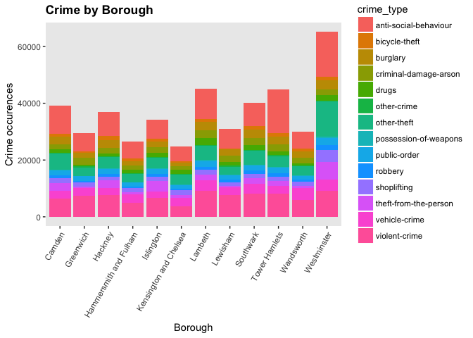
There is significant variation between crime in the boroughs with
Westminster having the most recorded crimes particularly for other-theft
and theft-from-the-person, and Kensingston and Chelsea the least.

The normalisation process will be repeated to the crime categories.
Colours are specified for the boroughs to make identification easier.

    boroughpop <- select(borough.rate, borough, pop)
    crime.borough.norm <- left_join(crime.rate.by.borough, boroughpop) %>%
      mutate(norm = Count/pop*100) %>% arrange(desc(norm))

    ## Joining, by = "borough"

    borough.col <- c("Camden" = "red3", "Greenwich" = "orange", "Hackney" = "yellow", "Hammersmith and Fulham" = "limegreen", "Islington" = "green", "Kensington and Chelsea" = "royalblue", "Lambeth" = "lightblue", "Lewisham" = "aquamarine", "Southwark" = "lightpink", "Tower Hamlets" = "violet", "Wandsworth" = "deeppink", "Westminster" = "darkgrey")

    ggplot(crime.borough.norm) +
      geom_bar(stat="identity",aes(x = borough, y = norm, fill = crime_type)) +
      theme(panel.grid = element_blank(), axis.text.x=element_text(angle=60, hjust=1), plot.title = element_text(lineheight=.8, face="bold")) +
      ggtitle("Normalised Crime Breakdown") +
      ylab("Crime occurence per 100 people") +
      xlab("Borough") 

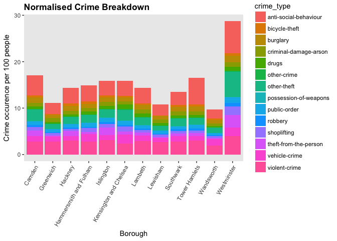

    ggplot(crime.borough.norm, aes(x = crime_type, y = norm)) +
      geom_point(aes(col = borough)) +
      geom_line(aes(col = borough, group = borough)) +
      xlab("Crime type") +
      ylab("Crime occurence per 100 people") +
      ggtitle("Normalised Crime Breakdown") +
      scale_colour_manual(values = borough.col) +
      theme(panel.grid = element_blank(), axis.line = element_line(colour = "black"), axis.text.x=element_text(angle=60, hjust=1))

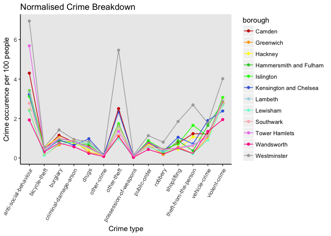

Relative to its population, Wesminster has even more crimes per 100
residents.This does take the large number of tourists and workers. This
is three times the number of crimes recorded in Wandsworth per 100
residents, which has consistently low records all crimes. The line plot
shows Westminster is considerably elevated above the main trend for
other-theft, shoplifting, theft-from-the-person and violent-crime.
Interestingly, this plot also shows that Kensington and Chelsea has the
largest number of drug offences once normalised.

The analysis of this dataset has so far focussed on the full dataset, a
quick analysis of the `monthlycrime16` dataset will be carried out.

    ggplot(monthlycrime16, aes(x = month, y = Count)) +
      geom_point(aes(col = crime_abb)) +
      geom_line(aes(col = crime_abb)) +
      xlab("Month") +
      theme(panel.grid = element_blank(), axis.line = element_line(colour = "black")) +
      scale_colour_manual(values = crime.col) +
       ggtitle("Monthly Variation in Crime Type (2016)")

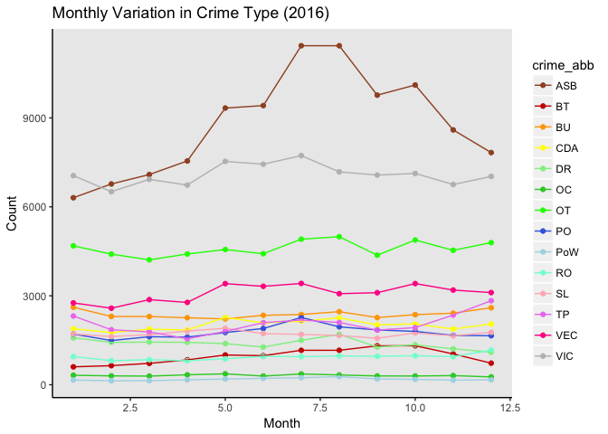

The anti-social behaviour peak in summer is very clear still across the
inner borough dataset, as is a peak in violent crime and vehicle crime
from May through to August. A tiled heatmap also allows these seasonal
trends to be easily identified.

    ggplot(monthlycrime16,aes(x=crime_abb,y=month,fill=Count))+
      geom_tile(aes(fill=Count))

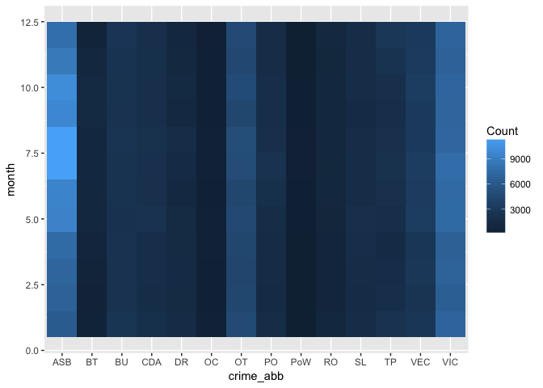

Another option for interactively displaying crime density is to use
chloropleth mapping. The borough polygons needs to be loaded and then
subset to include the 12 inner boroughs of interest.

    boroughs <- readOGR(dsn = "statistical-gis-boundaries-london/ESRI", "London_Borough_Excluding_MHW", verbose = FALSE)
    central <- boroughs %>% 
      subset(NAME %in% c('Camden','Greenwich','Hackney', 'Hammersmith and Fulham','Islington', 'Kensington and Chelsea','Lambeth','Lewisham', 'Southwark','Tower Hamlets','Wandsworth','Westminster'))

The `crime16` data is then converted to a SpatialPointsDataFrame with
latitude - longitude projection and then the borough boundaries are
transformed to geographic coordinates.

    coords <- SpatialPoints(crime16[,c("longitude","latitude")])
    crime16 <- SpatialPointsDataFrame(coords, crime16)
    proj4string(crime16) <- CRS("+init=epsg:4326")
    central <- spTransform(central, CRS("+init=epsg:4326"))
    central@proj4string

    ## CRS arguments:
    ##  +init=epsg:4326 +proj=longlat +datum=WGS84 +no_defs +ellps=WGS84
    ## +towgs84=0,0,0

Bicycle theft will be looked at first by subsetting those offences and
counting the number of points within boroughs using `over()`, then the
occurences of bicycle theft are added to the central SpatialPolygons
dataframe using `unlist()`.

    bicycle_theft <- crime16[crime16$crime_type == "bicycle-theft",]
    proj4string(crime16) <- proj4string(central)
    proj4string(bicycle_theft) <- proj4string(central)
    pointsinpolygon <- over(SpatialPolygons(central@polygons), SpatialPoints(bicycle_theft), returnList = TRUE)
    central$bicycle_theft <- unlist(lapply(pointsinpolygon, length))

The thematic ranges are calulcated using natural breaks with
`classIntervals()` and the central shapefile is fortified for plotting
using ggplot2.

    classes <- classIntervals(central$bicycle_theft, n=5, style="jenks")
    central_f <- fortify(central, region="NAME")
    central_f <- left_join(central_f, central@data, by = c("id" = "NAME"))

    ## Warning in left_join_impl(x, y, by$x, by$y, suffix$x, suffix$y): joining
    ## factor and character vector, coercing into character vector

A chloropleth map can then be plotted for bicycle thefts in 2016 \[2\].

    ggplot() +
      geom_polygon(data = central_f, aes(x = long, y = lat, group = group, fill = bicycle_theft), color = "white", size = 0.2) +
      coord_map() +
      scale_fill_gradientn('Frequency\n', colours = brewer.pal(5,"YlOrRd"), breaks = classes$brks) +
      labs(title = "Reported bicycle thefts by London borough (2016)")

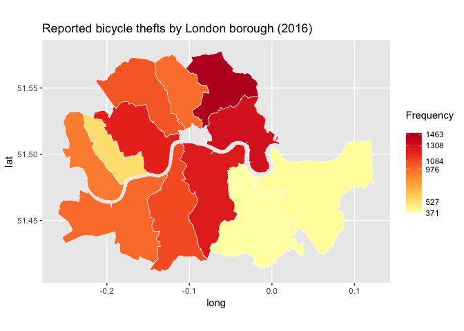

This would be better if it was interactive. First, the text for a pop-up
box needs to be set using html, then the colour table using
`findColours()` and the labels for the legend.

    central_popup <- paste0("<strong>Borough: </strong>",
                             central$NAME,
                             " <strong>Offences (2016): </strong>",
                             central$bicycle_theft)
    colcode2 <- findColours(classes, c("darkgrey", "yellow", "orange", "red", "sienna"))
    breaks <- round(classes$brks, 1)
    labels = matrix(1:(length(breaks)-1))
    for(j in 1:length(labels)){labels [j] =
      paste(as.character(breaks[j]),"-",as.character(breaks[j+1]))}

An interactive chloropleth plot can then be made using OpenStreetMap
raster layer in Leaflet. When you roll over the borough it provides the
number of records of that offence in a pop up box.

    leaflet(data = central) %>% 
      addProviderTiles("OpenStreetMap.BlackAndWhite") %>%
      addPolygons(data = central, 
                  fillColor = colcode2, 
                  fillOpacity = 0.6, 
                  color = "#636363", 
                  weight = 2, 
                  popup = central_popup)  %>%
      addLegend(position = "bottomright",
                colors = c("darkgrey", "yellow", "orange", "red", "sienna"),
                labels = labels,
                opacity = 0.8,
                title = "Number of bike thefts")

<!--html_preserve-->

<script type="application/json" data-for="htmlwidget-cc1ef6cee2d171233c27">{"x":{"options":{"crs":{"crsClass":"L.CRS.EPSG3857","code":null,"proj4def":null,"projectedBounds":null,"options":{}}},"calls":[{"method":"addProviderTiles","args":["OpenStreetMap.BlackAndWhite",null,null,{"errorTileUrl":"","noWrap":false,"zIndex":null,"unloadInvisibleTiles":null,"updateWhenIdle":null,"detectRetina":false,"reuseTiles":false}]},{"method":"addPolygons","args":[[[[{"lng":[-0.128455634947445,-0.128432163388321,-0.128301372654514,-0.128156854308154,-0.12797731179261,-0.127363536973151,-0.12717576338257,-0.126934071360691,-0.126744745580826,-0.126378532706936,-0.125871477636893,-0.125657235544201,-0.125550171273484,-0.1255336372682,-0.125398741957919,-0.125195165768775,-0.125023439786387,-0.124902202125567,-0.124733387560771,-0.124701055725083,-0.124650416489954,-0.124275047094054,-0.124206397783297,-0.124201673693253,-0.124366588080307,-0.124125652094317,-0.12407888998423,-0.124002970980199,-0.123788612190135,-0.123768238482684,-0.123601001161347,-0.123477316281386,-0.123022320593474,-0.122692369352852,-0.122399063697235,-0.122132880100655,-0.121930919718916,-0.121757819790942,-0.121347662750312,-0.121319161122614,-0.121195663971159,-0.121007212872539,-0.120881533371428,-0.120632506801388,-0.120411409539012,-0.120000911599154,-0.119803367688059,-0.119897066540083,-0.119753324891885,-0.119703738975734,-0.119375794170394,-0.119335503196735,-0.119303666830593,-0.119231797813058,-0.119153394301821,-0.119051210234673,-0.118936139309758,-0.118820589630902,-0.118350300596186,-0.118188813670015,-0.11782141713826,-0.117512810994673,-0.117440665261988,-0.117418397908751,-0.116992879752831,-0.117013290058702,-0.116837662754509,-0.116087888653272,-0.115902034512927,-0.115692767931238,-0.115408134799704,-0.114946068097897,-0.114488319095693,-0.113948111681145,-0.113620863574718,-0.113102408981944,-0.112677826373962,-0.111457495390538,-0.111307576802072,-0.11121353396892,-0.111104913908871,-0.110813654614294,-0.110303630729712,-0.110293232526115,-0.109901443323428,-0.109799074858124,-0.10952071732036,-0.109141913845772,-0.108924883868241,-0.108921568267822,-0.10886237549233,-0.108799719202591,-0.108593107544482,-0.108506405348497,-0.108424487434246,-0.108406410812298,-0.108290974950897,-0.108245002506987,-0.108175580065139,-0.107363630164876,-0.106596874979164,-0.106592704003045,-0.106465728355404,-0.106434584829859,-0.106434673905379,-0.106467163087679,-0.106545656312531,-0.106566499178206,-0.106599583456355,-0.106519907059012,-0.106518467116097,-0.106395616843142,-0.10745801285948,-0.106751587115696,-0.10613685599522,-0.106080850925115,-0.106050665746304,-0.106065016598483,-0.106086926292777,-0.106115551072437,-0.105947706082938,-0.105986633675907,-0.106527342844517,-0.106704050046637,-0.106825807325895,-0.107846543368885,-0.108188874403924,-0.10822802224583,-0.108353632044803,-0.109121121078204,-0.109470475554524,-0.10952016608596,-0.109516292974489,-0.11029541411803,-0.110303913665922,-0.110295109091069,-0.111442589512862,-0.110972915771445,-0.110957394970709,-0.11081359340432,-0.11066442329476,-0.110584358238957,-0.1105073955807,-0.109399474041069,-0.107159019799374,-0.105742098371294,-0.105337813426614,-0.104896248847506,-0.104886954160455,-0.104793933162109,-0.104699091394382,-0.104519085271602,-0.104400601497136,-0.10425736181815,-0.104105127695954,-0.103943131118745,-0.103883362891612,-0.103731670897859,-0.10371218810034,-0.103582932172555,-0.103405723630887,-0.103527460263388,-0.10315625592931,-0.103395991081152,-0.103159816116721,-0.103258608574527,-0.103260234612508,-0.10339300874218,-0.103803304252124,-0.10418850124072,-0.104711053563001,-0.105519911267549,-0.108121530597101,-0.108452541587564,-0.108281139575671,-0.108136714556622,-0.107991843755115,-0.107844529680475,-0.106357649718072,-0.106550188188595,-0.106615938990546,-0.106926337015,-0.107222609284364,-0.106823372783598,-0.106328661096587,-0.105663970716248,-0.105635780758837,-0.105904955448762,-0.106043785424585,-0.105634091348254,-0.105421903314004,-0.105326802752964,-0.105280783570095,-0.10515564216261,-0.104898594072733,-0.104623756311086,-0.104640486552907,-0.104621119600515,-0.104046927654568,-0.104086010341361,-0.105006647314523,-0.105557089603563,-0.108085430623045,-0.108178395566074,-0.108214970868019,-0.108237786209294,-0.108245960180632,-0.108219433323344,-0.108068152901533,-0.107854291844197,-0.107203048506367,-0.10555431759098,-0.10362194567469,-0.101511453065508,-0.099997740976233,-0.100111647754198,-0.100169880524097,-0.100337881317932,-0.100591397569127,-0.100682692442977,-0.100654260990389,-0.100619683547777,-0.100573444801043,-0.100368029436796,-0.0997752893702828,-0.0995429098908314,-0.0993751360650362,-0.0992474334474209,-0.0991772221429038,-0.0989171233913251,-0.0971357628188549,-0.0959975000282025,-0.0950698926553567,-0.0947971482659646,-0.0944529229086342,-0.0943231924644651,-0.0942006935322806,-0.0941056830613472,-0.094065184945073,-0.0939992673298241,-0.0937270775084951,-0.0936632491155117,-0.0936237391186136,-0.0934869520590795,-0.0930802884450569,-0.0930310949395317,-0.0930244998512468,-0.0929465616748272,-0.0929288684510765,-0.0928490504994044,-0.0927819718339203,-0.0927401629361927,-0.0927176510412408,-0.0922653723477624,-0.0911462831738996,-0.090136374203225,-0.0900946118561343,-0.0900797108957687,-0.0900711653544129,-0.0900718902215393,-0.0901060546855581,-0.0906671562090707,-0.0909398247524394,-0.0911241995488632,-0.091539165570828,-0.0922118378358392,-0.0923277579504083,-0.0925519020649065,-0.0927585114361575,-0.0928400309874869,-0.0929383112076425,-0.0930942160572327,-0.093650403610643,-0.0941425734491183,-0.0945719628974304,-0.0947296329092198,-0.0948668631366539,-0.0950254124268761,-0.0951226615459069,-0.0951486128456053,-0.0952081568287627,-0.0955036731893316,-0.0956649090738962,-0.0958371617594443,-0.0962014601447046,-0.0965759929453036,-0.0972070722877583,-0.0976021978497242,-0.097848936725316,-0.0985913504025859,-0.0991175250084095,-0.10004487902922,-0.100627648453566,-0.10093841598063,-0.101005807066658,-0.101118639871499,-0.101162717913169,-0.101034847931043,-0.101038816918812,-0.101060647912818,-0.101106088960169,-0.101335188613494,-0.10138748479303,-0.101468839693784,-0.101478955014478,-0.101474537969342,-0.1014571760995,-0.101425356614144,-0.101380517914753,-0.101340314102183,-0.101322660081619,-0.101132041690351,-0.100957917362107,-0.100877831540179,-0.100830922413783,-0.100802263621038,-0.10078923954874,-0.100792576239457,-0.100766310965807,-0.100760984341784,-0.100322240532102,-0.100205144650602,-0.1001476142623,-0.100068808441065,-0.0999931776377308,-0.0999236730201163,-0.0998587817389451,-0.099808683540341,-0.09972346696146,-0.09964555393108,-0.0995648937906818,-0.099427350284342,-0.0994170155869637,-0.0994035088333959,-0.0993447224436567,-0.0993041508536991,-0.0992533625468289,-0.0988920973634439,-0.098451457449247,-0.097958563115656,-0.097429907456029,-0.0961080468773939,-0.0959035206901986,-0.0956977828041644,-0.095251652472972,-0.0951405711764687,-0.0950965917468412,-0.09504008451223,-0.0950250543923147,-0.0950131827949268,-0.095017096373745,-0.0950433085822126,-0.0950375597891429,-0.0950162370568107,-0.0949531018357642,-0.0945074150140546,-0.0941057388709957,-0.0940045637343108,-0.0937990397597614,-0.0936341132154877,-0.0933570520452688,-0.093206695995834,-0.0930026842035505,-0.0928745131757003,-0.0927679966850386,-0.0925404975299914,-0.0922584223039,-0.0920401011941158,-0.0919894908791749,-0.0918980808233454,-0.0918379222241825,-0.0917263598700368,-0.0914889791340815,-0.0911946296091531,-0.0909813439119362,-0.0906654019874723,-0.0905778370374286,-0.0904647872654138,-0.0902254332143741,-0.0900233120684781,-0.0895930476435753,-0.0893087716693844,-0.0888910059982563,-0.0884971370860261,-0.0883196140646263,-0.0882261339818956,-0.0881149531044068,-0.0878738409981819,-0.0876807568947271,-0.0872577249751485,-0.0866133848147125,-0.0861213555364493,-0.0860455025418357,-0.0859971510839545,-0.0859168623493054,-0.0858904875510219,-0.0858687259179832,-0.0858563408143665,-0.0858874372061276,-0.0859453211509348,-0.0860665215240595,-0.0860986896810659,-0.0861005672503296,-0.0860923820133391,-0.0860740588964802,-0.0860401106320127,-0.085991599286027,-0.0859043120813636,-0.0857947484327235,-0.0854381514165939,-0.0852617560662454,-0.0852507817952168,-0.0851727123874748,-0.084955258032014,-0.0846522792419742,-0.0843723902865001,-0.0840788454897497,-0.0838627587636848,-0.0836831665506885,-0.0836317237734448,-0.0836183955943412,-0.0835855386706141,-0.0835369659417258,-0.0835111353768931,-0.0834953204861383,-0.0834766833972043,-0.0834389353396013,-0.0828437769747725,-0.0820318096750869,-0.0817794448168125,-0.0817265621244566,-0.0816945482574275,-0.0811585421920842,-0.0808969591287436,-0.0808519118866049,-0.0803434169897717,-0.0800773684175798,-0.07985629752438,-0.0798288686933545,-0.0796298318661041,-0.0795159189868912,-0.0794651482853821,-0.0789308926627323,-0.0791498725630449,-0.0792617243026313,-0.0792690880220753,-0.0792555060306174,-0.0792228942259612,-0.0791975500004482,-0.0791609333273337,-0.0783067237968765,-0.0783251777099196,-0.0783359550463311,-0.0784042423494057,-0.078445069759069,-0.0784952693731978,-0.0785298723391818,-0.0785598618731803,-0.0785894967354631,-0.0785486445997827,-0.0786747059325303,-0.0791036085662879,-0.0793248690412652,-0.079714667797454,-0.0800921016149498,-0.0802920342861109,-0.0805951500253867,-0.0817429064416849,-0.0823460019433232,-0.0828770290740143,-0.0828871652757861,-0.08333403082541,-0.0838952582914956,-0.0850113927836352,-0.0855390023342146,-0.0858634776856259,-0.0860791812806259,-0.0861853518142108,-0.0864256877898429,-0.0866194683313222,-0.0868266838852326,-0.0869707722655463,-0.0877645474663679,-0.0880109231579662,-0.0881903844331427,-0.0884521347707611,-0.0890476957522391,-0.089367409966179,-0.0895841620288754,-0.0897204354039209,-0.0898148257028126,-0.0899094784705271,-0.0900440021702079,-0.0901972864901477,-0.0908428636510858,-0.0911014421539691,-0.0913948325904475,-0.0917688965447009,-0.0921406961310636,-0.0923077918887945,-0.0927344339409969,-0.0930086314427238,-0.0932064454061299,-0.0934344075584487,-0.0936442451236628,-0.0939189525833113,-0.094101089929529,-0.0943467342977041,-0.0945914646606739,-0.0948395182438721,-0.096186056839888,-0.0969061337633325,-0.0972356501212261,-0.0975128602203416,-0.0978099322460667,-0.0981081429681758,-0.0983887691919363,-0.0988127984673237,-0.100144453835513,-0.100773263613555,-0.104228232419493,-0.10461684949332,-0.105115860798123,-0.105797569041782,-0.105987342138693,-0.106054936793053,-0.106185553873346,-0.106515114513129,-0.107020796152175,-0.107887061591383,-0.108688241856067,-0.109212025319865,-0.109373711327656,-0.109603363937253,-0.109850051863475,-0.109940720234624,-0.11006736105115,-0.110491073122996,-0.110904752155902,-0.111524752597918,-0.112052907389508,-0.112685587274532,-0.112712090229928,-0.112753461548745,-0.113026867288626,-0.113295063982963,-0.113822753528229,-0.113959994177693,-0.1139863536728,-0.114082352918961,-0.114130568866933,-0.11422091797691,-0.114456393427084,-0.114462179902226,-0.114492475674703,-0.114512709840579,-0.114536304609901,-0.114580471321397,-0.114872110404472,-0.114854275239501,-0.115327058368022,-0.115382093072854,-0.115448548071108,-0.115593995642348,-0.115715110187881,-0.115907873400006,-0.116166457416875,-0.1165593400993,-0.116925613497111,-0.117107827643242,-0.117746315730853,-0.117782836813534,-0.117847518559311,-0.118108272496984,-0.118234575721536,-0.118369982236669,-0.118452390539855,-0.11886700734038,-0.119095542682318,-0.119507095318385,-0.119846669759458,-0.120021950576688,-0.120052765641598,-0.120132960667734,-0.12022852331484,-0.120334552709457,-0.120473232186037,-0.12068414144419,-0.120786333369108,-0.120849240293247,-0.120846439536881,-0.120852409603601,-0.120795657396348,-0.120771703578704,-0.12085657424786,-0.120921839203336,-0.120968199161626,-0.121050526563229,-0.121135064743232,-0.121212010969504,-0.121334100018215,-0.1214847848346,-0.121574185327428,-0.121603739486433,-0.121703677571218,-0.121936131330097,-0.12220576489015,-0.122274453288241,-0.122481401069547,-0.122504210656441,-0.122531626304488,-0.122494332177642,-0.122480986764987,-0.122582878602635,-0.122993357363086,-0.123015908816914,-0.123122733020249,-0.123405659797363,-0.123675768415499,-0.12391525674219,-0.124074337571853,-0.124192316842671,-0.124310662835905,-0.124393856913719,-0.124458712119612,-0.124495880228078,-0.124528001079933,-0.124547891912492,-0.124508970919817,-0.124467543652168,-0.124497943846299,-0.124936516733132,-0.124937990621449,-0.125589076176547,-0.125676945612457,-0.125786040177035,-0.126018645265098,-0.126230430141373,-0.126259874516405,-0.126271555097447,-0.126615043153648,-0.127339194090277,-0.127428252325597,-0.127751756082711,-0.127758055147565,-0.127780230341002,-0.127888157980778,-0.127924011565335,-0.132099896662756,-0.132101333755385,-0.132714542131917,-0.133203924326635,-0.133572399927683,-0.133567795818375,-0.133480829893482,-0.13337404632703,-0.133354229133978,-0.133577952551379,-0.133739316321646,-0.133753055402708,-0.133768853713552,-0.133803324465828,-0.133832136691109,-0.133858337511393,-0.133865649467516,-0.133922321275203,-0.134096157977635,-0.134099983365213,-0.134424266121947,-0.134792696669797,-0.13501692543501,-0.135215057072569,-0.135479659249554,-0.13590770747438,-0.136652228681157,-0.137542801528669,-0.13810202345136,-0.138273062866413,-0.138524360690671,-0.138673466401289,-0.139375872491717,-0.13940856083909,-0.139550140177419,-0.140016182868894,-0.141209586053554,-0.142046367516001,-0.142582260404961,-0.142675492012331,-0.143029852879177,-0.144235592020628,-0.144402806774704,-0.144485449703617,-0.144575314497773,-0.144623084731567,-0.144806470399126,-0.144832447448117,-0.144869994100105,-0.145170023528612,-0.145506343956206,-0.145823982018076,-0.146804383532772,-0.147530627349595,-0.148090403757366,-0.147891820766353,-0.147611998350463,-0.147568614011584,-0.147329625308052,-0.147083375858757,-0.146865080820767,-0.146684239992983,-0.146407801831631,-0.146141058478898,-0.146139621310394,-0.145676568197194,-0.145185020261458,-0.144347519788092,-0.144351685814041,-0.14466754172554,-0.145009452488029,-0.144916361334944,-0.1437336431634,-0.143048790040508,-0.143260352866332,-0.141598529051137,-0.140405494752076,-0.139509898827732,-0.139046762255499,-0.138519110930354,-0.138171703589366,-0.137851931036043,-0.138302061314228,-0.138516606450055,-0.138530592292179,-0.138825117852714,-0.138866506581606,-0.138922158756224,-0.138932923226227,-0.138926413757535,-0.138871916501968,-0.138764492707366,-0.138541377515274,-0.138489413983481,-0.138437233308592,-0.138411108755534,-0.138394222797694,-0.138364627100931,-0.138385737843622,-0.138382463270683,-0.138382390212501,-0.138387045012409,-0.138398535918847,-0.137711865188074,-0.137223228720877,-0.136707716433853,-0.135930953451802,-0.135495550897682,-0.13537942978969,-0.135332096812983,-0.135264182248907,-0.135364988199971,-0.135594044813573,-0.135869692057119,-0.136150255057233,-0.136455597568822,-0.136522574237384,-0.13668618801318,-0.136931901315918,-0.137598979853489,-0.137857583541824,-0.138228777521511,-0.139110238463698,-0.139489628323096,-0.139648099374187,-0.139697625222881,-0.139759061017731,-0.139805082744063,-0.139877384990536,-0.139972939086074,-0.139912604839843,-0.139737149598729,-0.139381248135705,-0.139325293548115,-0.139119203996465,-0.138981959773895,-0.138508993160534,-0.138306848405831,-0.138003196962673,-0.137815477505515,-0.13768372603967,-0.13750418086666,-0.137401295266007,-0.137383478701173,-0.137381492348265,-0.137303354429347,-0.137259898657787,-0.13725980095914,-0.137301879418514,-0.137286305256631,-0.13747598205927,-0.137487863544698,-0.13751834113913,-0.137497636786352,-0.137477224864496,-0.137433244803409,-0.137371898974046,-0.137048586543168,-0.137047038864715,-0.137011418628809,-0.136807525528614,-0.136688365263256,-0.136424240542724,-0.136104211428924,-0.135941865685118,-0.135904030302223,-0.13598006283615,-0.136023276867431,-0.136395509492335,-0.136416885660881,-0.136751142692421,-0.137351542017351,-0.137370345974172,-0.137885144957469,-0.13904175197888,-0.140804329352142,-0.141615520990297,-0.142358688306549,-0.142768671607667,-0.143271215544749,-0.143620746018612,-0.143823619507832,-0.144003546047174,-0.144337834134178,-0.144467146896157,-0.144594185015967,-0.14474971375206,-0.144854929024878,-0.145146059783223,-0.145406958130769,-0.145603491085663,-0.145687979027091,-0.145696480678902,-0.145678603887794,-0.145589219755579,-0.145586470909457,-0.145566209467677,-0.145440413773798,-0.145283375391459,-0.145174942972024,-0.144937083514845,-0.144795221274943,-0.144647607053157,-0.144068747593553,-0.14361726891556,-0.143360173809905,-0.143073614191755,-0.142953301005233,-0.142820933837657,-0.142583743483739,-0.142443739774792,-0.14237261191223,-0.142327935919123,-0.142322636054121,-0.143147423439467,-0.143612289191087,-0.143768645666085,-0.144621475243336,-0.146569772482711,-0.147359944859507,-0.147729989815446,-0.147378014758044,-0.147631060829538,-0.147651125425807,-0.147780674414259,-0.147958023813109,-0.148001656770303,-0.1479699417333,-0.147976942510853,-0.148080133856551,-0.148153901906247,-0.148333429116793,-0.148340791231727,-0.148365722793896,-0.148664622769225,-0.14896436596369,-0.149217219484626,-0.14929908852732,-0.149390467703309,-0.149671310636056,-0.149693477708396,-0.149702639551016,-0.149785293435531,-0.149930470525412,-0.150054847132415,-0.150384793337291,-0.150462437872661,-0.150535730391458,-0.150660554465939,-0.150731777235593,-0.150793133141798,-0.150967264984522,-0.150982575894671,-0.150991820536176,-0.151231440776376,-0.150470385432594,-0.150565707922629,-0.150641475648971,-0.150643219361426,-0.150618707584456,-0.15034529735977,-0.149429105499227,-0.147298420822349,-0.146114549751295,-0.143240731508532,-0.143100405044462,-0.142676865558519,-0.141583978595376,-0.141495707066829,-0.141784401177271,-0.140981336509298,-0.140342638428323,-0.139866906594007,-0.139741292312205,-0.139316231136524,-0.139455972006275,-0.139578566067387,-0.13959971183484,-0.139502107721296,-0.139448975615883,-0.139270423241419,-0.139209474594352,-0.139159732313647,-0.139066285214347,-0.138746615389697,-0.138726920290969,-0.138678677816737,-0.138516013519783,-0.138349190603968,-0.138042859248309,-0.137849022389014,-0.137492551566589,-0.136918036893619,-0.136660960608793,-0.136492601886568,-0.136388350136404,-0.136374363044888,-0.136358900340684,-0.136343401018312,-0.136327901701608,-0.136310963396635,-0.136293988472524,-0.13627557456055,-0.136258599647836,-0.136080091248305,-0.135909923757828,-0.135787169730419,-0.135704414379685,-0.135596573204696,-0.135348765997193,-0.135238908700959,-0.135071693474869,-0.134798788605454,-0.134747570687607,-0.134721998398648,-0.134557768238402,-0.134486349288335,-0.134494241129245,-0.134502032056657,-0.13453725629124,-0.134479218523145,-0.134449154728915,-0.134461785208729,-0.134533929325043,-0.134706485337658,-0.135230572700357,-0.134872832032163,-0.134857818342357,-0.134952915412768,-0.134710816358809,-0.134527853658549,-0.134520328388082,-0.134244027297499,-0.134111659568437,-0.134057228864073,-0.133980314972322,-0.133883428269518,-0.133883435069424,-0.133833679708412,-0.133646005365873,-0.133319289629018,-0.13309478670857,-0.132632231914222,-0.132275060519122,-0.13210720693736,-0.132061425051187,-0.131992638614136,-0.131989613404247,-0.131988174234073,-0.131969545631798,-0.131877099887468,-0.131829554833591,-0.131736233738392,-0.131611697163077,-0.131544406160754,-0.131412327669543,-0.131344882250843,-0.131168547730105,-0.130985059354685,-0.130853681715717,-0.130661757702418,-0.130644934085059,-0.130583341377803,-0.130567883443736,-0.130441377616564,-0.13037057894711,-0.130352830338586,-0.130348292115677,-0.130311392382061,-0.130219991155674,-0.130188995280464,-0.129947544105655,-0.129459037650374,-0.129168138126041,-0.128635486439486,-0.127989872366079,-0.127496477292734,-0.127405731835023,-0.127279859397038,-0.127161070390208,-0.127049050673229,-0.1268735114221,-0.12636370163664,-0.126531888111467,-0.127052352814204,-0.127727240296149,-0.128035930845084,-0.128171746425765,-0.128368339650401,-0.128455634947445],"lat":[51.4850487577115,51.4850591741619,51.4851227322577,51.48520495545,51.4852983096526,51.4855843646141,51.4857027653205,51.4858715620724,51.4859926350706,51.4862826394758,51.4866351382742,51.4868016733688,51.486918663779,51.4869354853446,51.4870286500733,51.4872511087148,51.48746958,51.4876510896298,51.4878336368096,51.4878493063642,51.4878547913119,51.4877705522877,51.4878288050618,51.4878386213096,51.4879617595473,51.4882519622316,51.4883384419964,51.4885035898172,51.489163811181,51.489203951719,51.4894179964762,51.4895886744116,51.4902153678943,51.490743344872,51.4912907920471,51.4919142102888,51.4924469323997,51.4930133888558,51.4943700902219,51.4944676524683,51.4949135031617,51.4957476905483,51.4961413490885,51.4973621441001,51.4986391398795,51.5008771001186,51.5016859601867,51.5017549064445,51.5023766846624,51.5023911769912,51.5038472071491,51.5039508745622,51.5040591738124,51.5042648497906,51.5044542343481,51.5046612225422,51.5048662054434,51.5050477999406,51.5057254872634,51.505902747095,51.5062511576633,51.5065015927944,51.5064689608539,51.5064847899986,51.5067747127528,51.5068388875009,51.5069394818541,51.5072997317538,51.507368686544,51.5074462574311,51.5075343072176,51.5076617695407,51.5077892994698,51.5079244941545,51.5079974662463,51.5080943389869,51.5081513543758,51.5083547254226,51.5083559082741,51.5083301139095,51.5082735100342,51.5081033558958,51.5081356057504,51.5082127741263,51.5082433302168,51.5082794491234,51.5083199253306,51.5083848598956,51.5084407114991,51.5084163781536,51.508071009038,51.5077049011519,51.5077528268325,51.5077586225888,51.5074749352899,51.5074242854496,51.5071148782822,51.5070071253768,51.5069088859945,51.5070639465731,51.5052944250877,51.5052907607269,51.5049820645071,51.5048295874517,51.504688405735,51.5044955903041,51.5043053161161,51.5042543950409,51.5040472010799,51.5036403503096,51.5036403270612,51.5033712645254,51.503012524634,51.5022223669249,51.5025226847534,51.5024138695951,51.5022730981663,51.5022049864567,51.5021630752432,51.5021329627974,51.5020457220739,51.502010380516,51.5015838717798,51.5016658592178,51.5015787984448,51.5007985308127,51.5005342767682,51.5004935424916,51.5003480906476,51.4991060054832,51.498497445846,51.4983759480334,51.4983650945218,51.4968749944281,51.4968436574153,51.496777869821,51.4964474432471,51.4955765923826,51.4954990063073,51.4954229507544,51.4954070587184,51.4953922799127,51.4953721554995,51.4949559282866,51.4941626120676,51.4936954996991,51.4936134308592,51.4935271611335,51.4935081265191,51.4933195776455,51.4930707490032,51.4929302531488,51.4927305012599,51.4925024720469,51.4922482187509,51.4919515422729,51.4919685610311,51.4920137688372,51.4919972671453,51.4918836689267,51.4917800861051,51.4916930284119,51.4914739004137,51.4913204078911,51.4911799006381,51.4910556025052,51.4910511325159,51.490871629915,51.4904610094687,51.4900301981615,51.4895521465094,51.4887693736197,51.4861549680086,51.4858482654888,51.4857438842786,51.4856489306401,51.4855647607247,51.4855048311731,51.4848900160455,51.4846925905776,51.4845308864821,51.4840610895701,51.4836540119241,51.483521670582,51.4832951623668,51.482965189098,51.4829503455346,51.4827802376843,51.4826970505754,51.4824350428954,51.4822032028865,51.4821000499927,51.4820984071315,51.4820945864213,51.4818332441989,51.4815842034551,51.4814585776044,51.4814393801073,51.4809076275622,51.4809028639439,51.4807900513685,51.4807135162815,51.480415317648,51.480396134646,51.4803823366114,51.4803530291657,51.4802947092123,51.4802744975379,51.4802064107969,51.4801193288296,51.4798480327598,51.479146961825,51.4783414624043,51.4775267518895,51.4768727506239,51.4767307147164,51.4766462285461,51.4762766567624,51.4747843944652,51.4744585425299,51.4743456743893,51.4742767704482,51.4742112746263,51.473991224903,51.4734240782876,51.4730561112497,51.4726235449547,51.4722662666638,51.4721886912187,51.471933580318,51.4706924786734,51.469880850578,51.470200308365,51.4703532474712,51.4705284050227,51.4706009352195,51.4706726835596,51.4707412815706,51.4707801907646,51.4708762394752,51.4716029141915,51.4717178811781,51.4717675974287,51.4719056580878,51.4721274572327,51.4720295368535,51.4720150413975,51.4709490476284,51.47075182146,51.4701453197711,51.4699239094002,51.4698216126626,51.4697744848178,51.4690881834427,51.4676131634509,51.4663179646841,51.4662147683868,51.4661578720751,51.4660866910871,51.4660003736482,51.4657338490899,51.4632942948095,51.4628320175052,51.4625535502386,51.4619928708741,51.4611207425392,51.4610336017781,51.4608367131138,51.4607150768916,51.4606588502011,51.460580414515,51.4604318742517,51.4600047769236,51.4595937222896,51.459169055564,51.4590124484711,51.4588627031173,51.4586503555875,51.4584927661555,51.4584572172859,51.4583754525244,51.4578811624385,51.457604110722,51.4574081714419,51.4571631935137,51.4568797123064,51.4564151459301,51.4561553765739,51.4560370804857,51.4556984115118,51.4554020942286,51.454768758596,51.4543915188628,51.4541519539034,51.4540541266138,51.4538671090198,51.453776098121,51.4532155842652,51.4530852553517,51.4530100708503,51.4529208805709,51.4526026550121,51.4525216690228,51.4523647162235,51.4522596662065,51.4521579778885,51.4520560799239,51.451955746333,51.4518570003999,51.4517853074248,51.4517598421106,51.4515670099667,51.4513582579496,51.4512418547966,51.451158362574,51.4510859571719,51.4510183013821,51.450660448433,51.4503569709723,51.4503119214777,51.450306610881,51.4503191014799,51.4503181691149,51.4503096977922,51.4502940837651,51.4502695763461,51.4502379495516,51.4501966706075,51.4500999672569,51.450000684447,51.4498635879537,51.4495367236917,51.4494043642998,51.4493483909325,51.449204454791,51.4491417477348,51.4490824720616,51.4487366918479,51.4484309890868,51.4481361272053,51.4477669430884,51.4467463982053,51.4465083680161,51.4462649221739,51.4457118198803,51.4455454493195,51.4454611029744,51.4452974176793,51.445209045427,51.4450793582976,51.4448815835292,51.4447012571748,51.4446319203185,51.4445218634237,51.4443445813597,51.4434012018594,51.4428182423082,51.4426907000246,51.4424427576938,51.4422566253173,51.441964353945,51.4417739616028,51.4414208282636,51.4410779211494,51.4408369832835,51.440322498223,51.4395984946164,51.4391057401892,51.4389736234664,51.4388192601623,51.4387436417222,51.4386240216039,51.4383126075818,51.4378491885237,51.4374086713512,51.4366697234783,51.436457868583,51.4360981186371,51.4351445928934,51.4343679295929,51.4327836023129,51.4318041623016,51.4305419732414,51.4297073244399,51.4294454398531,51.4293413985321,51.4292478596134,51.4290964462825,51.4290006714468,51.4288651731174,51.4287242620282,51.4285876331423,51.4285783010699,51.4285649217199,51.4285240427242,51.4285011302757,51.4284710990119,51.4284232355052,51.4282987450126,51.4281872817401,51.4280408816589,51.4279595735069,51.4279146407323,51.4278695436353,51.4278260795251,51.4277778639078,51.4277339068011,51.4276884171499,51.4276596497162,51.4274838633296,51.4273676738437,51.4273549047939,51.4272610046567,51.4269570959407,51.4265312871155,51.4261382285314,51.4257278598775,51.425391597638,51.4250082704014,51.4247250586757,51.424527900738,51.4241442746833,51.423689349313,51.4234128511613,51.4231032437949,51.4229986237489,51.4230069991578,51.4231366518318,51.423325702512,51.4233755284858,51.4233674687778,51.423307592975,51.422333901801,51.4218485092207,51.4218594620816,51.4219806291575,51.422048212711,51.4221408128698,51.422108889023,51.4218817095502,51.4217512473026,51.4216928620287,51.4215707978361,51.4211850029972,51.4209871981437,51.4209144779208,51.4208953706468,51.4208498726442,51.4208368674811,51.4208182819367,51.4206091367607,51.4205806626913,51.4205637532652,51.4204101984003,51.4202597903478,51.4200573782445,51.420021075479,51.4199918912313,51.4198682777411,51.4198478240153,51.4198256104374,51.4197499082287,51.4197211608369,51.4196861819843,51.419671682498,51.4196713605462,51.4196799223661,51.4197481742434,51.4197715331573,51.4197298618904,51.4197282291599,51.4196698914764,51.4195594657099,51.4193519919254,51.4192886703076,51.4192678915146,51.4192687165465,51.4192749467124,51.4193058492556,51.4193494802811,51.4194158120492,51.4194784152104,51.4197575533628,51.4198506007776,51.4199272685405,51.420065529292,51.420545559611,51.4208115603489,51.4209598761326,51.4210376360312,51.4210850372478,51.4211261477802,51.4211769007031,51.4212261606466,51.4214731866372,51.4215844115972,51.4217231809704,51.421928010508,51.422221829573,51.4223540442694,51.422539942557,51.4226217415385,51.4226726213016,51.4227248904408,51.4227633752941,51.4227984184579,51.4228112724646,51.4228188639414,51.4228138502851,51.4227980989184,51.4227579305446,51.4226671088118,51.4226292941751,51.4226041185673,51.4225855595488,51.422574212401,51.4225706725929,51.4225775518623,51.4225838585307,51.4225778632731,51.4226463898669,51.4226400855572,51.4226076875728,51.4225746433085,51.4225768110216,51.4225770040978,51.4225836111212,51.4226141154387,51.4226987218233,51.4228637870699,51.4230376875179,51.4231369647667,51.4231575584492,51.4231693562639,51.4231517525668,51.4231505169796,51.4231489621376,51.4231288159753,51.4231426786923,51.423176051407,51.4232043442993,51.4232442099705,51.4232293492234,51.4231328946608,51.4229205737274,51.4227648220829,51.4224549754291,51.4223007117185,51.4222543740592,51.422088655338,51.4220354752156,51.4219371104349,51.4216675221162,51.4216667159443,51.4216645055471,51.4216621332733,51.4216130532139,51.4215184415167,51.4212470580776,51.4212260880766,51.4209216464197,51.4208424967178,51.4208004005461,51.4206561588383,51.4205789707076,51.4204732585149,51.4203757981507,51.4202652080192,51.4201371029822,51.4200779811802,51.4198004721269,51.4198217417871,51.4197877091859,51.4196372227168,51.4195736043176,51.419498441479,51.4194530026887,51.4192681147202,51.4191665685698,51.4189861255109,51.418807224121,51.4185663348533,51.4183060419938,51.4181742369857,51.4180183982268,51.417782692576,51.4175574023829,51.4172541348773,51.4171469623422,51.4170859216599,51.4170840782194,51.417078778348,51.4170598830309,51.4170478084746,51.4169772280457,51.4169989576234,51.4169556368919,51.4168769221515,51.4167793582069,51.4166564930403,51.4165199632218,51.4163524173237,51.4162414420099,51.4161870604671,51.4159944207241,51.415796710426,51.4155690203542,51.4155071722849,51.4153000595878,51.4152698499561,51.41523251998,51.4151950526,51.4150293738062,51.4150346031968,51.415054667235,51.4150307482344,51.4149155544793,51.4147141532915,51.4146501339335,51.4146314863526,51.4146097526906,51.4143976157874,51.4141764919724,51.41400606363,51.4140026052504,51.4138323394991,51.4136799782852,51.4135804780504,51.4134773388324,51.4133651668259,51.4133602577449,51.4132908380406,51.4132899623564,51.4129118948266,51.4127676190805,51.4126317761136,51.4127811769892,51.412912259178,51.4129307152793,51.4129264057043,51.412790712285,51.4125244128204,51.4124916637775,51.4123169792889,51.4123035909315,51.4122535862989,51.4120053145048,51.4120076857862,51.4122928405978,51.4122928635033,51.4123484982471,51.4124785949235,51.4125761889936,51.4125833097904,51.4127060233369,51.4128562983937,51.412883859972,51.4129341850279,51.4126795649368,51.4126599998906,51.4126251801244,51.4125555863539,51.412413061974,51.4121580878294,51.4120844645017,51.4118227814186,51.4110144119031,51.4109910919072,51.4110789870809,51.4111774759309,51.411215216618,51.4112228658529,51.4112225796702,51.4113049274575,51.4114552545982,51.4116564584921,51.4118020328185,51.4118748927676,51.411954422904,51.4120008551819,51.4121972577334,51.4122067693592,51.4122261030754,51.4123647933105,51.4127587212662,51.4131173079436,51.4133425253229,51.4133484992498,51.4131562766313,51.4125719695787,51.4124909857635,51.4124743089969,51.4124568472468,51.4124135396053,51.4123948604578,51.4123925738868,51.4123886719263,51.4125435980305,51.4125480212824,51.4125521479851,51.4125604612692,51.4127374077934,51.412870353219,51.4130515640621,51.4133214168798,51.4133629965224,51.413583135342,51.4138049574099,51.4139399924233,51.4140378502685,51.414188151693,51.4143475984679,51.4143475757339,51.4146316113884,51.41490889941,51.4153479712016,51.4153516342208,51.4155778538641,51.415799988714,51.4158614636728,51.4166565702113,51.4171250284305,51.4172632699317,51.4184158648187,51.4192494429033,51.4198764040928,51.4201954838109,51.4205800825663,51.4208470411073,51.4211063443373,51.4220280464566,51.4226240688383,51.4226692541406,51.4236334455354,51.4238184517378,51.4245729179728,51.4247682289893,51.4252825040799,51.4260927738902,51.4268248665218,51.4279966596388,51.4283195689062,51.4287539832496,51.4290782021023,51.4295644349164,51.4299740285207,51.4303394643492,51.4304554171828,51.4304572145471,51.4304842663487,51.4305554905799,51.4304960222205,51.4304486899236,51.4303901371859,51.4303175356987,51.4302701435183,51.4302602028985,51.4302567521039,51.4303348067567,51.4306502531583,51.4312078426559,51.431964010353,51.4328470514101,51.4338285051506,51.4339149998816,51.4339247950402,51.4339322979041,51.4338026142022,51.4337761479896,51.434059017179,51.4348140063573,51.4351788343334,51.4353153395706,51.4354420222166,51.4356651148318,51.4358780709077,51.4362587066309,51.4368816125406,51.4370209398735,51.4373023220141,51.4375628545124,51.4375943397148,51.4377088713204,51.4377579502959,51.4379248968475,51.4380484822979,51.4382621796591,51.4384201653471,51.4385817377412,51.4388216855846,51.439087131363,51.4393836044642,51.4393970618189,51.4396907778392,51.4397332518185,51.4397710192357,51.4397977664805,51.4398622657969,51.4400100608375,51.4400363281984,51.4401006599993,51.4401497903873,51.4401917313293,51.4402117155133,51.4403402343295,51.4402586591892,51.4402613323754,51.440252672908,51.4405956477395,51.4407304413194,51.4411390033521,51.4415421795707,51.4417832977705,51.4420057128362,51.4420114182251,51.4420103068787,51.4419155081129,51.4418852730829,51.441804257623,51.4417247727867,51.4417223738009,51.441695481668,51.4417030582683,51.4417418183878,51.44175108461,51.441770058346,51.44177295777,51.4417998034283,51.4418386119693,51.4423004472909,51.4426540076805,51.4432465168195,51.4434643861824,51.4437029023606,51.4439130929894,51.4440865167669,51.4444661150691,51.4449171750586,51.4453941939943,51.4458307720598,51.4458695746963,51.4458845793221,51.4459596024076,51.4459919322604,51.4463144458458,51.4468619031975,51.447327932746,51.4476598422747,51.4482378991606,51.4485423015284,51.4487045297469,51.4490316896301,51.4493051098527,51.4495051701131,51.4497928904889,51.4499204779466,51.4500613632054,51.450338174146,51.4505607705653,51.4507529841874,51.4509671991546,51.4509913951646,51.4510952874546,51.4511664971551,51.4512148352395,51.4514792291836,51.4520235250046,51.4522365497011,51.4523395169742,51.4529634359405,51.4529701323652,51.4529722479201,51.4538609633168,51.4547423402576,51.4548734219547,51.4549457608176,51.4551284207594,51.455957368058,51.4564108599432,51.4572032437787,51.457305875415,51.4573656201852,51.4579116936398,51.4584370966412,51.4588763291392,51.459094342527,51.4593619651056,51.4612449456535,51.4613019486817,51.4613245746962,51.461487745348,51.4617067572417,51.4618705860711,51.4622552781671,51.4623644138719,51.4624743801249,51.4626984655116,51.4628596566012,51.4630512667326,51.4638363661604,51.463956208716,51.4642261313913,51.465884541388,51.4659777511042,51.4663263676108,51.4672654866954,51.4674004025778,51.4676149380845,51.4676825655692,51.4680152209962,51.4688637417347,51.4693342238085,51.4704676732921,51.4705194063444,51.4700639688947,51.4706320672454,51.4706783286697,51.4709086177792,51.4712888626441,51.4715925745952,51.4713233444947,51.4713672136523,51.47151604026,51.4716558440552,51.4717216365707,51.4717327631732,51.4717959609037,51.4717924200242,51.4718633255806,51.4718749479057,51.471858871102,51.4718906604699,51.4719970941558,51.4719149491591,51.4718620264395,51.4718963135554,51.4719620083984,51.4721298014106,51.4722930855262,51.4725958685407,51.4730903246869,51.4729324666137,51.4728236786356,51.472767167003,51.4727570528616,51.4727478145209,51.4727394748528,51.4727311351827,51.4727227726377,51.4727153087648,51.4727078220162,51.4727003581383,51.4726993190309,51.472705606314,51.4727144457262,51.4727311150603,51.4727626728109,51.4728720384854,51.4729530229722,51.4730987408068,51.473329105807,51.4733139029167,51.4733054027896,51.4734484696174,51.4736460690835,51.473770292086,51.4737910989492,51.4738806857966,51.4738914527356,51.4739224483874,51.4739658136733,51.4739975362445,51.4740740205498,51.4742873873899,51.4746557880718,51.4746708366094,51.4747047225399,51.4749562602447,51.4748877037151,51.4748956772974,51.4751736475882,51.4752767542519,51.4755519598381,51.4756370644433,51.4756822838344,51.4758585382347,51.4759485712626,51.4762423387938,51.4766966579858,51.4770105212182,51.4776524187271,51.4781467165327,51.4783778493797,51.4784409672619,51.4784326773803,51.4784362262108,51.4784362032831,51.4784691789933,51.4786169827365,51.4787232367463,51.4789276795852,51.4791559048763,51.4792519523079,51.4794180085172,51.4794825794014,51.4796038664784,51.479759211006,51.4799432628917,51.4801991891607,51.4802232008734,51.4802150248665,51.4802408568541,51.4804465681056,51.4805578463004,51.480569253634,51.4805745768103,51.4805964698483,51.4806480685198,51.4806664586374,51.4811823782946,51.4813652287741,51.48147029713,51.4816407495308,51.4818615530206,51.4820227351864,51.4824097648112,51.4828807634482,51.4833545728354,51.4836279560563,51.4838697497978,51.4844659051229,51.4845090588933,51.4846019032901,51.4847223902695,51.4847462030356,51.484735781553,51.4849646328526,51.4850487577115]}]],[[{"lng":[-0.108924883868241,-0.108894269735679,-0.108847580077174,-0.108416904920587,-0.108017178666722,-0.107833206420274,-0.107808537267913,-0.10767567608851,-0.107574125383989,-0.107468104351737,-0.107277973872567,-0.106989320644951,-0.106937439786594,-0.106397104252605,-0.105833689961095,-0.105036457774036,-0.104702205726018,-0.104801056010178,-0.104734318180435,-0.104709133781234,-0.104140283183395,-0.104139149247433,-0.104082336569763,-0.103881641066779,-0.10331413829883,-0.102885907117428,-0.101511458427887,-0.0999529210181413,-0.0998470453163452,-0.0991075498695526,-0.0982274508495596,-0.096666006711308,-0.0960880298077279,-0.0958513904326843,-0.0958341257573212,-0.0955439411965939,-0.0951370413950688,-0.0950840801133748,-0.0951027321195401,-0.0947654987933977,-0.0946357644322794,-0.0945146706837239,-0.0942914670883751,-0.0934364680660061,-0.0928587604725235,-0.0920135693305049,-0.0920627532517626,-0.0919169950484884,-0.0918742092612161,-0.0915691692447875,-0.0915972679395417,-0.0910206869347411,-0.0909486225145941,-0.0903720438158509,-0.0903668481519349,-0.0903947102916085,-0.0904423699856017,-0.0904112660273967,-0.0903508977654027,-0.0902774809255495,-0.0902234594080765,-0.0901611475799723,-0.0895714732167299,-0.0881776029004634,-0.0881257995057577,-0.0880524333155159,-0.0878262360886095,-0.0877884294327518,-0.0874760836377062,-0.0870307667799352,-0.0867772374041851,-0.0867711289619036,-0.0867552319851851,-0.0864797081035306,-0.0862721856903547,-0.0855700602577835,-0.084665956898028,-0.0844651840767512,-0.0837548514907782,-0.0835922813769113,-0.083496441875686,-0.083225027862722,-0.0830670421540706,-0.0825249022135211,-0.0817663061992942,-0.0814571920278087,-0.0810639873388767,-0.0809681067395115,-0.0801787800328016,-0.0799448469783681,-0.0796444113828586,-0.0793672810576449,-0.0792014988566701,-0.0780042061793385,-0.077682972358831,-0.077732908698923,-0.0776923601639343,-0.0767961605426609,-0.0765424231803539,-0.0759700761174213,-0.0758964863195631,-0.0755130817479243,-0.0753251317037996,-0.075155104819539,-0.0743446852371163,-0.0741113413091058,-0.0735620878863626,-0.0730220459212559,-0.0729044288323569,-0.0728458466465828,-0.0726152741963103,-0.0719816520565024,-0.0718705872261429,-0.0716205809917952,-0.0708602010213442,-0.0716278677748496,-0.0719098610644109,-0.0720678054345285,-0.0722192220129915,-0.0723278572899559,-0.0724491852992149,-0.0731586920211186,-0.0734243035997624,-0.0736525918781122,-0.0736794938178409,-0.073540362371588,-0.0733552686845405,-0.0723950055819223,-0.072136550592677,-0.0720055969212796,-0.0718370140111797,-0.0717160999329131,-0.0712005756471161,-0.0708183514506304,-0.0698116398374846,-0.0697390741871995,-0.0695044181965448,-0.0693830556279111,-0.068998130689135,-0.0676047885989576,-0.0676340888990937,-0.067381975046876,-0.0672553159328218,-0.0649321109517321,-0.0649906439804338,-0.0648800511401162,-0.0647889864831422,-0.0638078830763874,-0.0637968822658085,-0.0633312977150162,-0.0632943802170419,-0.0624798025226181,-0.0619613171571533,-0.0616110612789007,-0.0606961416804167,-0.0606603937053945,-0.0602793774910435,-0.0602698050123019,-0.0596856512608642,-0.0594048118582146,-0.0592301366827519,-0.0592011877602706,-0.0589637606343534,-0.0584733731930514,-0.0576625439444893,-0.0573303168854261,-0.0571493464931778,-0.0564339232697607,-0.0564324452181619,-0.056320049785904,-0.0562509397442944,-0.0561737117745469,-0.0561323262150531,-0.0561829478117725,-0.0559462168065337,-0.05591280836531,-0.0550571599820841,-0.0549724154297804,-0.0545238911249605,-0.0545396765768685,-0.0540673978334703,-0.0539652689636337,-0.0539085408141657,-0.0538565150163539,-0.0538234368951691,-0.0537877005932667,-0.0536861459388802,-0.0536952525234609,-0.0533871566191793,-0.0531481494193446,-0.0527816303459077,-0.0522854143207218,-0.0521377722539463,-0.0511569824482229,-0.0511555425806014,-0.0507703001537005,-0.0505065626444662,-0.0502216468780486,-0.0497061031922482,-0.0494389792440179,-0.0488765213400374,-0.0491175651972609,-0.04860539984544,-0.0481189373870965,-0.048035615003083,-0.0479858329892008,-0.047974774559284,-0.0479512562111407,-0.0479164490551618,-0.0478256580841939,-0.047770192278537,-0.0477801172596528,-0.0478256748927183,-0.0479793793036657,-0.0479952180026774,-0.0479810871121204,-0.0479655741098124,-0.0479173841201068,-0.0474876659055679,-0.0475468942732592,-0.0470406429701836,-0.0469641923087415,-0.0467220195211332,-0.0466624799750078,-0.0464466191421546,-0.0461551449407998,-0.0460239534321381,-0.0460149293546273,-0.0462618804127669,-0.0461729849670924,-0.0463728245330359,-0.0455973924773755,-0.0453089511671508,-0.0450493424274001,-0.045113273068998,-0.0451937125505101,-0.0444130275032273,-0.0442500935337531,-0.0439089396566766,-0.0433759564483341,-0.0430198450497262,-0.0410591516179163,-0.0404561487403824,-0.0401622328451109,-0.0398699112655222,-0.0392561470262364,-0.038659277986631,-0.0383966063159048,-0.0372439307563309,-0.0370588940128137,-0.0370375148784212,-0.0370419011593665,-0.0369632422909031,-0.0368815876098637,-0.0367810800827219,-0.0366097102034381,-0.0362561572213708,-0.0358541378335716,-0.0356491760385551,-0.035016386069043,-0.0346667052204087,-0.0343547751882994,-0.0338965165659108,-0.0337358732382559,-0.0335740834095758,-0.0334393223007222,-0.0333994985359632,-0.0333683144992818,-0.0333409307648381,-0.0332532328686868,-0.0330885203786507,-0.0328620466336809,-0.0330370730205787,-0.0330005092398638,-0.0328428156860284,-0.0328296084249224,-0.0328221608223436,-0.0329712451688139,-0.0329735590843252,-0.0327249977149844,-0.0325094845649951,-0.0324007874491513,-0.0323543158817234,-0.0324273795439972,-0.0323710071438988,-0.0323736705667193,-0.0323983581235057,-0.0323670531354539,-0.032390339328656,-0.032318285605414,-0.032326754771516,-0.0323772197492056,-0.0323205786295061,-0.0322879972384056,-0.0322459329976404,-0.0322375065395526,-0.0322391484084724,-0.0322617066796678,-0.0323110638345718,-0.0323171948751147,-0.0323595396665861,-0.0326165925738282,-0.032774533501946,-0.0326163342097975,-0.0324791249788296,-0.032615693289219,-0.0328467806154559,-0.0329182363514938,-0.0328831726333417,-0.0329684845049852,-0.0326565405708577,-0.0325454346084431,-0.0325796298087926,-0.0326562322974322,-0.0327308533268769,-0.0328980366216175,-0.0329258539819287,-0.0329326184207869,-0.0329345141379313,-0.0329217427022165,-0.0329027871845362,-0.0328135524946784,-0.0327222754238407,-0.0326733666856454,-0.0326390477219462,-0.0325754252195417,-0.0325691557543459,-0.0325673986530093,-0.0325993790192481,-0.0326697551809135,-0.0327395497910403,-0.0327423661236241,-0.0327086187754525,-0.0327125812878119,-0.0327265822226111,-0.0327461093540497,-0.032806409170658,-0.0329847549666623,-0.0331191006716737,-0.0331758247433232,-0.0332168680679663,-0.0332496993317146,-0.0332459825828436,-0.0332124769877582,-0.0331500637820537,-0.0330826356114241,-0.032998482343752,-0.0329705887288576,-0.032903602481509,-0.0328699891605102,-0.0328238064576831,-0.0327649770215819,-0.0327051723015694,-0.0326557929139546,-0.0326306155996324,-0.0325519942996068,-0.0326171686781728,-0.0325485179007975,-0.0323548492125667,-0.0324074003682295,-0.0324180110758208,-0.0324128719994269,-0.0325812136090533,-0.0325503561272178,-0.0329109223829939,-0.0332477972770693,-0.0333040894353065,-0.0333273155477514,-0.0352387216093306,-0.0373150803555925,-0.0373768641237583,-0.0374759597680906,-0.0375003930996977,-0.0375305459405504,-0.0375606987846505,-0.0375908516319976,-0.0376209658916403,-0.0376510415653411,-0.0376538820262686,-0.0376939186185477,-0.0377324771084342,-0.0377709584357728,-0.0378094011923315,-0.0378464044396457,-0.0378833305324785,-0.0379174161744925,-0.0379543423060225,-0.0379897517611017,-0.0380237217087604,-0.0380576530949278,-0.0380915845034432,-0.0381240378221065,-0.0382350216555107,-0.0383867879246394,-0.0384104113684262,-0.0384439187181648,-0.0384788656425555,-0.0385138126049014,-0.0385516772583601,-0.038589619096696,-0.0386275224001525,-0.0386669424263213,-0.0387078406025489,-0.0387177245516686,-0.0387515793330585,-0.0387883132275287,-0.0388236461726279,-0.0388604186875652,-0.0388986693406106,-0.0389355190388399,-0.0389738468718505,-0.0390136142743198,-0.0390519807163834,-0.0390932648380807,-0.0391331479947705,-0.0391745092801416,-0.039191668179801,-0.0392230683278661,-0.0392559080346489,-0.0392873467612856,-0.0393202250458505,-0.0393531418971023,-0.0393860587558628,-0.0394204537288545,-0.0394534477140681,-0.0394864417042225,-0.0395194742539676,-0.0395539849119167,-0.0395870560217481,-0.0396201656866091,-0.0396547920072385,-0.0396879787756461,-0.0397038523839454,-0.0397370777003999,-0.0397718196639302,-0.0398036825209442,-0.0398369849229717,-0.0398703644149626,-0.0399023043487938,-0.0399342828212423,-0.0399662612845775,-0.0403702577611139,-0.0405530663800994,-0.0405633744023205,-0.040070409203359,-0.0410557121601089,-0.0403437766702011,-0.0425080684437328,-0.0422258811866002,-0.0423572954926337,-0.0427407306956685,-0.0444988076356961,-0.0445526997878397,-0.0445765170177732,-0.0447370694698301,-0.0447581570706375,-0.0451354574348735,-0.0451157873883516,-0.0455218198795633,-0.0458317699635167,-0.045927271388187,-0.0461644328441216,-0.0465673905348454,-0.046566139140508,-0.0465674553881514,-0.0475957693621637,-0.0475500521624245,-0.0492201398236527,-0.0492609454962062,-0.0493583486646747,-0.0497130681987174,-0.0496574634469883,-0.0503452504160159,-0.0508174990507022,-0.0511516775852039,-0.051466140834449,-0.0519587310682263,-0.0501695864249432,-0.0501087651461758,-0.0503442218803046,-0.0503089650995889,-0.0503845004887595,-0.0504643921379732,-0.0506442364707914,-0.050738069966401,-0.0507700434024619,-0.0511157415114141,-0.0513084841981151,-0.0517503026451615,-0.0521198449866822,-0.0521749634268724,-0.052412862924674,-0.0525005444236586,-0.052622128758287,-0.0526311862879402,-0.052889862968115,-0.0539775072559336,-0.0537288209688645,-0.0535645669101784,-0.0535154281407876,-0.0534061718232386,-0.0533219526531397,-0.0532545851097408,-0.0531861076360356,-0.0531561104779202,-0.0530305481515667,-0.0529942347054072,-0.0529339421701074,-0.0529017326674303,-0.0528805558539071,-0.0528443655520426,-0.0528567992104907,-0.0528940235493211,-0.0529203683954727,-0.052940550036634,-0.0529464607207172,-0.0529491940219821,-0.0530797300699865,-0.0531812877966295,-0.0531402049168991,-0.0535601768769731,-0.053551889513163,-0.0534231287634101,-0.0533148653948933,-0.0532493839686831,-0.0531958612950243,-0.0531691418265712,-0.0530973674088207,-0.0530409272411823,-0.053001215946034,-0.053000006316441,-0.0529644218628848,-0.0530137022762819,-0.0531180202217174,-0.0529847470341148,-0.0529824043813377,-0.0528902531118909,-0.0528326824957764,-0.0528009500090838,-0.052922307376246,-0.052921534147532,-0.0529786987831155,-0.0529495533342771,-0.0529559685457919,-0.0529597043741035,-0.0528575566372399,-0.0528187354491899,-0.0528114705324193,-0.0529427089817337,-0.0529744789124799,-0.0530175472881381,-0.0530527536041904,-0.0531188253693356,-0.0532507230157803,-0.0532604296442414,-0.0531682452106226,-0.0531566934538587,-0.0531877733437085,-0.0532189296970081,-0.0532686189780241,-0.0533060675833338,-0.0534278278993932,-0.0534894209215155,-0.053514345944661,-0.0535069649447489,-0.0533882794933146,-0.0533568091911449,-0.0533588755150366,-0.0534132193428898,-0.0535734491515254,-0.0535735169205681,-0.0535732638472234,-0.0535203209702636,-0.0534702478292754,-0.053478161993343,-0.0535218019155679,-0.0536213682954407,-0.0536541243539517,-0.0536954387962369,-0.0537080231938356,-0.0539998270327222,-0.0540185118811683,-0.0539530004528852,-0.0539473204406874,-0.0543285621615421,-0.052699292258052,-0.0527475093200252,-0.0527630744253158,-0.0527570407700278,-0.0521738080353587,-0.0519805548895314,-0.0518015101368531,-0.0516871207496379,-0.0516866166733845,-0.0517824915579838,-0.0521513384332843,-0.0522818735097796,-0.0520409515551983,-0.0516843797801224,-0.0514464025808392,-0.0509945369054817,-0.0508814383165,-0.0511282812127266,-0.0513266102244651,-0.0513196461773855,-0.0510002810433363,-0.0505751755077384,-0.0506340271449851,-0.0508222829406686,-0.050888481097279,-0.0505200295554414,-0.0502785697874518,-0.0499050330788112,-0.0496700958804346,-0.0496231161817146,-0.0494067681474365,-0.0490558122865472,-0.0486291612404655,-0.0482061191563365,-0.0485401979814378,-0.0477208465331278,-0.047561708582314,-0.0473305408223251,-0.0470375690748176,-0.0467730275416142,-0.0465867888939191,-0.0463636462999198,-0.0462138185378556,-0.0459991210725144,-0.0457204031873131,-0.0454572901389416,-0.0453463769837235,-0.0452368684045048,-0.0451885675392244,-0.0451290897318183,-0.0451056298100588,-0.045114160617049,-0.04512328496918,-0.0451770471803711,-0.0452426796109231,-0.0453035114371167,-0.0453357571257446,-0.0456156165409278,-0.0457174095242005,-0.0457427479421509,-0.0457799593899552,-0.0457813978350305,-0.0460016639346827,-0.0461032181260617,-0.0461603938139329,-0.0449958213687239,-0.0446323674444298,-0.0434522878966957,-0.0427455996056473,-0.042100398294264,-0.0419620921115342,-0.0418251477642915,-0.041648675879561,-0.0424456929522112,-0.0429893823439384,-0.043189696041172,-0.0436628148094154,-0.0438862063115039,-0.044507982427779,-0.0448740643456642,-0.0450006504362564,-0.0451242651737492,-0.0451964712532178,-0.0451789282123866,-0.0454831912892902,-0.0458752607174564,-0.0461507881265284,-0.0465114884891526,-0.0469414918353515,-0.0477579714428508,-0.04823982944232,-0.0487217649753316,-0.0490866665658559,-0.0493664416534309,-0.0499355371056182,-0.0509546346759246,-0.0530700256051657,-0.0534646104341701,-0.0535797164755799,-0.0536450073961008,-0.0537878448152509,-0.0539083836257832,-0.0539539465553027,-0.0540076036051668,-0.054081343190032,-0.0543312884776401,-0.0547487777129806,-0.0554355181402601,-0.0565434617661607,-0.0575613259477832,-0.0581006749022713,-0.0586189647560479,-0.0586875234700805,-0.0590615535876293,-0.0596776817965176,-0.0609726891245249,-0.0613835845986096,-0.0618269592924329,-0.0620797547640144,-0.0622199392777866,-0.0623432380130388,-0.062569075879215,-0.062901464771905,-0.0630839318185606,-0.0632447249422437,-0.0633651287033546,-0.0634841308141428,-0.0636400212637223,-0.0637133757162424,-0.0637497776211496,-0.0636655384775919,-0.0637336327507449,-0.0638704192523374,-0.0640827885853476,-0.0641657971459002,-0.0642188239750291,-0.0642775645117636,-0.0646117174548366,-0.0650262115557385,-0.0646713284288716,-0.0642800753974963,-0.0640535720330939,-0.0638010013280265,-0.0637522900712987,-0.0637335529093145,-0.063706879797289,-0.0637007610365785,-0.0635436126108102,-0.0634574445578468,-0.0634567799006789,-0.0635507772142596,-0.0639828077359947,-0.064158233708068,-0.0642449266097269,-0.0643649608486772,-0.0644203253504574,-0.0644672148151723,-0.0645306095151149,-0.0645603266427423,-0.0646111984679309,-0.0648003323268073,-0.0650864342783182,-0.0654157984326559,-0.0656068035677339,-0.065788088014457,-0.0658343327895136,-0.0659090710461887,-0.0659740439291495,-0.0660429882108064,-0.0661443213587609,-0.0667087897235701,-0.0671515942794402,-0.0677533380073911,-0.0686022227064905,-0.0690216225027414,-0.0695291726021383,-0.0696223205650059,-0.069984203807724,-0.0701872584860904,-0.0703929988493241,-0.0706953281017729,-0.070943213747654,-0.071109946088177,-0.0713349797152959,-0.0716077974293937,-0.072076895954484,-0.0722159720937809,-0.0723833852351975,-0.0724608680115878,-0.0725401287720243,-0.0726301338877578,-0.072708750902332,-0.0727640625003003,-0.0728617463571724,-0.0735861144484096,-0.0748935847951941,-0.0749277404003203,-0.0749702924946027,-0.0750484277439369,-0.0750933443131952,-0.0750286000039398,-0.0749442639811241,-0.0747957259065647,-0.0744907513290357,-0.0743270910245674,-0.0741661834454931,-0.0739848055474314,-0.0739304315367128,-0.0739356493318978,-0.0739544877074705,-0.0740022645879674,-0.0740486417605443,-0.074095018916903,-0.0741414716240365,-0.0741879998763931,-0.0742389538817298,-0.0742899456359079,-0.0743410129153667,-0.0743892052054014,-0.0744374730147285,-0.0744857785609333,-0.0745326465913982,-0.0745546242300664,-0.0745825028522684,-0.0746118189317125,-0.0746396975219562,-0.0746675760964114,-0.0746940549555781,-0.0747219712700869,-0.0747470503969416,-0.0747735669780565,-0.074797208601813,-0.0748208879799709,-0.0748446051110674,-0.0748668847562276,-0.0748863272172978,-0.074893778935654,-0.0749132591439735,-0.0749327393363847,-0.0749493445805205,-0.074965987577779,-0.0749811930957131,-0.0749963986005064,-0.075008766930435,-0.07502113524909,-0.075033503556474,-0.0750429969288797,-0.0754550468419184,-0.0754565220415361,-0.0756648122949164,-0.0765987608919415,-0.0776031908526035,-0.0780424287791363,-0.0782388456395773,-0.0783067237968765,-0.0791609333273337,-0.0791975500004482,-0.0792228942259612,-0.0792555060306174,-0.0792690880220753,-0.0792617243026313,-0.0791498725630449,-0.0789308926627323,-0.0794651482853821,-0.0795159189868912,-0.0796298318661041,-0.0798288686933545,-0.07985629752438,-0.0800773684175798,-0.0803434169897717,-0.0808519118866049,-0.0808969591287436,-0.0811585421920842,-0.0816945482574275,-0.0817265621244566,-0.0817794448168125,-0.0820318096750869,-0.0828437769747725,-0.0834389353396013,-0.0834766833972043,-0.0834953204861383,-0.0835111353768931,-0.0835369659417258,-0.0835855386706141,-0.0836183955943412,-0.0836317237734448,-0.0836831665506885,-0.0838627587636848,-0.0840788454897497,-0.0843723902865001,-0.0846522792419742,-0.084955258032014,-0.0851727123874748,-0.0852507817952168,-0.0852617560662454,-0.0854381514165939,-0.0857947484327235,-0.0859043120813636,-0.085991599286027,-0.0860401106320127,-0.0860740588964802,-0.0860923820133391,-0.0861005672503296,-0.0860986896810659,-0.0860665215240595,-0.0859453211509348,-0.0858874372061276,-0.0858563408143665,-0.0858687259179832,-0.0858904875510219,-0.0859168623493054,-0.0859971510839545,-0.0860455025418357,-0.0861213555364493,-0.0866133848147125,-0.0872577249751485,-0.0876807568947271,-0.0878738409981819,-0.0881149531044068,-0.0882261339818956,-0.0883196140646263,-0.0884971370860261,-0.0888910059982563,-0.0893087716693844,-0.0895930476435753,-0.0900233120684781,-0.0902254332143741,-0.0904647872654138,-0.0905778370374286,-0.0906654019874723,-0.0909813439119362,-0.0911946296091531,-0.0914889791340815,-0.0917263598700368,-0.0918379222241825,-0.0918980808233454,-0.0919894908791749,-0.0920401011941158,-0.0922584223039,-0.0925404975299914,-0.0927679966850386,-0.0928745131757003,-0.0930026842035505,-0.093206695995834,-0.0933570520452688,-0.0936341132154877,-0.0937990397597614,-0.0940045637343108,-0.0941057388709957,-0.0945074150140546,-0.0949531018357642,-0.0950162370568107,-0.0950375597891429,-0.0950433085822126,-0.095017096373745,-0.0950131827949268,-0.0950250543923147,-0.09504008451223,-0.0950965917468412,-0.0951405711764687,-0.095251652472972,-0.0956977828041644,-0.0959035206901986,-0.0961080468773939,-0.097429907456029,-0.097958563115656,-0.098451457449247,-0.0988920973634439,-0.0992533625468289,-0.0993041508536991,-0.0993447224436567,-0.0994035088333959,-0.0994170155869637,-0.099427350284342,-0.0995648937906818,-0.09964555393108,-0.09972346696146,-0.099808683540341,-0.0998587817389451,-0.0999236730201163,-0.0999931776377308,-0.100068808441065,-0.1001476142623,-0.100205144650602,-0.100322240532102,-0.100760984341784,-0.100766310965807,-0.100792576239457,-0.10078923954874,-0.100802263621038,-0.100830922413783,-0.100877831540179,-0.100957917362107,-0.101132041690351,-0.101322660081619,-0.101340314102183,-0.101380517914753,-0.101425356614144,-0.1014571760995,-0.101474537969342,-0.101478955014478,-0.101468839693784,-0.10138748479303,-0.101335188613494,-0.101106088960169,-0.101060647912818,-0.101038816918812,-0.101034847931043,-0.101162717913169,-0.101118639871499,-0.101005807066658,-0.10093841598063,-0.100627648453566,-0.10004487902922,-0.0991175250084095,-0.0985913504025859,-0.097848936725316,-0.0976021978497242,-0.0972070722877583,-0.0965759929453036,-0.0962014601447046,-0.0958371617594443,-0.0956649090738962,-0.0955036731893316,-0.0952081568287627,-0.0951486128456053,-0.0951226615459069,-0.0950254124268761,-0.0948668631366539,-0.0947296329092198,-0.0945719628974304,-0.0941425734491183,-0.093650403610643,-0.0930942160572327,-0.0929383112076425,-0.0928400309874869,-0.0927585114361575,-0.0925519020649065,-0.0923277579504083,-0.0922118378358392,-0.091539165570828,-0.0911241995488632,-0.0909398247524394,-0.0906671562090707,-0.0901060546855581,-0.0900718902215393,-0.0900711653544129,-0.0900797108957687,-0.0900946118561343,-0.090136374203225,-0.0911462831738996,-0.0922653723477624,-0.0927176510412408,-0.0927401629361927,-0.0927819718339203,-0.0928490504994044,-0.0929288684510765,-0.0929465616748272,-0.0930244998512468,-0.0930310949395317,-0.0930802884450569,-0.0934869520590795,-0.0936237391186136,-0.0936632491155117,-0.0937270775084951,-0.0939992673298241,-0.094065184945073,-0.0941056830613472,-0.0942006935322806,-0.0943231924644651,-0.0944529229086342,-0.0947971482659646,-0.0950698926553567,-0.0959975000282025,-0.0971357628188549,-0.0989171233913251,-0.0991772221429038,-0.0992474334474209,-0.0993751360650362,-0.0995429098908314,-0.0997752893702828,-0.100368029436796,-0.100573444801043,-0.100619683547777,-0.100654260990389,-0.100682692442977,-0.100591397569127,-0.100337881317932,-0.100169880524097,-0.100111647754198,-0.099997740976233,-0.101511453065508,-0.10362194567469,-0.10555431759098,-0.107203048506367,-0.107854291844197,-0.108068152901533,-0.108219433323344,-0.108245960180632,-0.108237786209294,-0.108214970868019,-0.108178395566074,-0.108085430623045,-0.105557089603563,-0.105006647314523,-0.104086010341361,-0.104046927654568,-0.104621119600515,-0.104640486552907,-0.104623756311086,-0.104898594072733,-0.10515564216261,-0.105280783570095,-0.105326802752964,-0.105421903314004,-0.105634091348254,-0.106043785424585,-0.105904955448762,-0.105635780758837,-0.105663970716248,-0.106328661096587,-0.106823372783598,-0.107222609284364,-0.106926337015,-0.106615938990546,-0.106550188188595,-0.106357649718072,-0.107844529680475,-0.107991843755115,-0.108136714556622,-0.108281139575671,-0.108452541587564,-0.108121530597101,-0.105519911267549,-0.104711053563001,-0.10418850124072,-0.103803304252124,-0.10339300874218,-0.103260234612508,-0.103258608574527,-0.103159816116721,-0.103395991081152,-0.10315625592931,-0.103527460263388,-0.103405723630887,-0.103582932172555,-0.10371218810034,-0.103731670897859,-0.103883362891612,-0.103943131118745,-0.104105127695954,-0.10425736181815,-0.104400601497136,-0.104519085271602,-0.104699091394382,-0.104793933162109,-0.104886954160455,-0.104896248847506,-0.105337813426614,-0.105742098371294,-0.107159019799374,-0.109399474041069,-0.1105073955807,-0.110584358238957,-0.11066442329476,-0.11081359340432,-0.110957394970709,-0.110972915771445,-0.111442589512862,-0.110295109091069,-0.110303913665922,-0.11029541411803,-0.109516292974489,-0.10952016608596,-0.109470475554524,-0.109121121078204,-0.108353632044803,-0.10822802224583,-0.108188874403924,-0.107846543368885,-0.106825807325895,-0.106704050046637,-0.106527342844517,-0.105986633675907,-0.105947706082938,-0.106115551072437,-0.106086926292777,-0.106065016598483,-0.106050665746304,-0.106080850925115,-0.10613685599522,-0.106751587115696,-0.10745801285948,-0.106395616843142,-0.106518467116097,-0.106519907059012,-0.106599583456355,-0.106566499178206,-0.106545656312531,-0.106467163087679,-0.106434673905379,-0.106434584829859,-0.106465728355404,-0.106592704003045,-0.106596874979164,-0.107363630164876,-0.108175580065139,-0.108245002506987,-0.108290974950897,-0.108406410812298,-0.108424487434246,-0.108506405348497,-0.108593107544482,-0.108799719202591,-0.10886237549233,-0.108921568267822,-0.108924883868241],"lat":[51.5084407114991,51.5084492104179,51.5084979165889,51.5085278407012,51.5085411766563,51.5085642870904,51.5084640717746,51.5084709207114,51.5085915808617,51.5086114522174,51.5086092832665,51.5086199119103,51.5086199737635,51.5086184449565,51.5086174401823,51.5086252446401,51.5086234405714,51.5085333139125,51.5084746831063,51.5083870483464,51.5084129252293,51.5084749555304,51.5085243954498,51.5085337405194,51.508596504676,51.5086021681131,51.5085943155224,51.5085429980704,51.5084900251689,51.5084609559499,51.5084170126077,51.5083665035122,51.5083346408167,51.5083074183727,51.5083413098142,51.5083195121791,51.5082283739673,51.5081852487055,51.5081181074089,51.5080496815622,51.5080160999666,51.5079826586121,51.5079097891996,51.5076791722089,51.5075375885491,51.507348486397,51.5072404764323,51.5072111274029,51.5073039540343,51.5072585241218,51.5072068244369,51.5071075150602,51.5071423123268,51.5070429997824,51.506926011729,51.5068455322359,51.5067051248399,51.5066218867191,51.5066182059919,51.5066853540917,51.5068400459465,51.5070206812353,51.5069589202869,51.5068309933916,51.5068292496536,51.5068262551097,51.5068252650863,51.5068678130323,51.5068249510764,51.506791609791,51.5067551008644,51.5067289227389,51.5066612190683,51.5065649996623,51.5065310387859,51.5065051914665,51.506485034101,51.5064619713421,51.5063226725535,51.5063164191368,51.5062995656304,51.5062429730395,51.5062304990102,51.5061353076118,51.5060131927621,51.5059622742221,51.5058892960348,51.5058391672082,51.5056598858708,51.505568828091,51.5054829757269,51.505391209441,51.5054271624727,51.5050811158098,51.5049760330757,51.5048851271541,51.5048556862315,51.5045802078609,51.5045148969513,51.5043508358577,51.5043190537052,51.5042534116001,51.5042341405467,51.5041998759517,51.5039410739247,51.5038706970008,51.5037061040098,51.5035623427492,51.5035154471064,51.5035378652138,51.5034360567264,51.5031198932231,51.5031909073129,51.5030716913836,51.5025160326429,51.5020799272503,51.5019190999342,51.5015565969292,51.5014170029446,51.501335157476,51.5012598153532,51.5008353337524,51.5006868233237,51.5005350014446,51.5005120625738,51.5004630155869,51.5006155468904,51.5011438195089,51.5012591726483,51.5013577369706,51.5015285225523,51.5016281508821,51.5019622913638,51.5022104949835,51.5019610216056,51.5020074880428,51.501968554345,51.5019422764461,51.5018451136791,51.5014031074183,51.5013235560061,51.5012546547519,51.501455800336,51.5009588660669,51.5008015619153,51.5007592703139,51.5008342048174,51.5007298830913,51.5006154952739,51.500586225119,51.5006413696539,51.5007214375787,51.5007164672908,51.5007196710598,51.5006856603085,51.5007471182046,51.5007282270232,51.5006822063409,51.5006968228017,51.5006939743856,51.5007018749068,51.5007049928665,51.5007316382204,51.5007774762316,51.5008368897692,51.5008565660734,51.5008769488851,51.5010305585027,51.5010314332689,51.5010655409583,51.5009627788736,51.5009830811117,51.5010075744665,51.5011046345994,51.5011825433465,51.5011550116547,51.5014546665207,51.5014145927389,51.5016274721351,51.5016628052347,51.5018582028495,51.5018879823423,51.501900529913,51.5019041628683,51.5019027146699,51.5018283820955,51.5018446819395,51.5019014866066,51.501997090317,51.5020605674773,51.5021408115094,51.5022890428951,51.5024061926242,51.5027334163055,51.5027333923779,51.5028807637164,51.5030508367327,51.5032106651698,51.5035411147103,51.5037228194517,51.5040380968784,51.5042309520798,51.5045155906505,51.5043672101854,51.5042264376446,51.5041437761332,51.5041328009142,51.5041099278822,51.5040814713624,51.5040817586008,51.5041320932734,51.5042033002506,51.5043173657275,51.5045645236727,51.504632232006,51.5046931466645,51.5047189670711,51.5047676243919,51.5050446378352,51.5051085722972,51.5053555335371,51.5053236854696,51.505123612946,51.5052017563977,51.5052961804767,51.5051033788681,51.5051722348719,51.5051810771463,51.5053704395957,51.5054274107047,51.5055728233984,51.5060149303869,51.5058185801925,51.5059923069471,51.5060473283995,51.5064236618151,51.5069205285419,51.5069564798205,51.5070488097919,51.507145132608,51.5072165274125,51.5074724568517,51.5074875624342,51.5074862481936,51.5074813628094,51.5074450243477,51.5074179578558,51.5073937808567,51.5072225197549,51.507169064058,51.5071300378818,51.5070950400152,51.5070811337208,51.507069875017,51.5071284432298,51.5070923016112,51.5070369225668,51.5069357675551,51.5068765803241,51.5066798319217,51.506534586522,51.5063827786904,51.5060819368772,51.5059641377958,51.5057725795926,51.5056561133313,51.5056104823141,51.5055649961657,51.5054647186128,51.5053931053001,51.5051691238519,51.504773245949,51.5046907515483,51.504602909627,51.5045840778232,51.5045227062958,51.5044614313797,51.5044459467611,51.504358756912,51.5043419978501,51.5043608640294,51.5043419543553,51.5043168945113,51.5042263953729,51.5041301275151,51.5040348501489,51.5039300503899,51.503686723688,51.5035810011492,51.5031463465974,51.5030835401629,51.5030493155564,51.5027920747353,51.5025784022873,51.5024176273347,51.5018104821101,51.5016720228516,51.501449383644,51.5011732381836,51.5010978027908,51.5001147172328,51.500101044666,51.5000803133659,51.4993375641606,51.4993118812737,51.4979472891525,51.4979340797941,51.4976798870464,51.4976577165012,51.4969478285265,51.4969318043903,51.4960324732175,51.4960078674887,51.495968685697,51.4959420603347,51.4959070957432,51.4958967711793,51.4958735037407,51.4958294715205,51.4957914881267,51.4957632929182,51.4956943510705,51.4957063088074,51.4957045890273,51.4956986176706,51.4956705722893,51.4956488847246,51.4956227765371,51.4954488555218,51.4950858335666,51.4947362907882,51.4946374187877,51.4944174317471,51.4943923187782,51.4943682734837,51.4943497164919,51.4943210523031,51.4942943682675,51.4942858305388,51.4942732929714,51.4942568953136,51.4942304679851,51.4941494717173,51.4941246295781,51.494102000369,51.4940954737951,51.4941093497517,51.4941214715816,51.4941716060722,51.4941827326649,51.4941846557307,51.4941791724889,51.4941628816639,51.4941386723208,51.4941211638644,51.4938392737959,51.4936973839706,51.4936188952883,51.4931651134331,51.4931156363106,51.4930699517766,51.4930554772886,51.4930268274957,51.4930074251821,51.4929307417494,51.492868947385,51.4930002850896,51.4929961782968,51.4926334420164,51.4922194797959,51.4922232116825,51.4922302657957,51.4922315739782,51.4922338771411,51.4922361802963,51.4922384834437,51.4922416852032,51.4922457855749,51.4922467323746,51.4922536972237,51.4922615365902,51.492271173184,51.4922817083852,51.4922922194864,51.4923045278161,51.4923158893409,51.4923281976485,51.4923422790989,51.4923563364534,51.4923712924183,51.4923862483735,51.4924020788551,51.4924677834784,51.4925566518598,51.4925768308786,51.4926016715564,51.4926265363047,51.492651401043,51.492675415309,51.4926976323226,51.4927207479444,51.4927420903914,51.4927625582822,51.4927672199233,51.4927839729327,51.4928007740849,51.4928166525296,51.4928325550393,51.492847582992,51.4928616882377,51.4928749189256,51.4928881736745,51.4929005057167,51.4929119872709,51.4929225461184,51.4929322304034,51.4929352151213,51.4929420350285,51.4929488789979,51.4929548002674,51.4929607455984,51.4929657922995,51.4929708389915,51.4929750111221,51.4929782605539,51.4929815099766,51.4929838607692,51.4929853369987,51.4929867891516,51.4929873426744,51.4929861230119,51.492984879274,51.492984245369,51.4929821029963,51.4929781874366,51.4929742237391,51.4929702840962,51.4929645472019,51.4929587862356,51.4929521266395,51.4929454670345,51.492829918978,51.4927997009999,51.4927944776531,51.4921630484587,51.491827899945,51.4910624200348,51.4902406702072,51.4900354230128,51.4900277250979,51.4900215361151,51.4901066222792,51.4901264055646,51.490142090245,51.4903623896179,51.4904418765615,51.4903771252066,51.4903318340361,51.4902351869014,51.4901621166045,51.4902194625298,51.4903663975252,51.4903416367326,51.4904720092832,51.4907445084389,51.4904459924315,51.4903696929976,51.4899856255527,51.4900420587978,51.4900211975269,51.4899452646818,51.48986430531,51.489747148073,51.4896174115649,51.4895501255911,51.4894384471075,51.489135486035,51.4883611583471,51.488334967566,51.488116764329,51.4880990920858,51.4880167163851,51.4879335137983,51.4878708574039,51.4879335672805,51.4879269046697,51.4878256382927,51.4877982665792,51.4878074067048,51.4878225386707,51.4878135623609,51.4877743492355,51.487711058484,51.4875620013241,51.4875522598373,51.4876338922406,51.4879352159699,51.4875174269574,51.4872817910724,51.4872180268759,51.4870777264581,51.4870259695083,51.4869843841802,51.4869688590547,51.4869629654288,51.4868673571408,51.4868406755124,51.4867344604243,51.4866790704455,51.4866013820453,51.4864703877203,51.4864490118393,51.486386681445,51.4863430549412,51.4862750459475,51.4861024852866,51.4860045108271,51.4859832974115,51.4859660990531,51.4858485125473,51.4857952339814,51.4855163243805,51.4852929677955,51.4852309197358,51.4852127465731,51.4852181528069,51.4851691488878,51.4851634608619,51.4848315942938,51.4846142120895,51.484608796415,51.4843959790376,51.484388703944,51.4843742492844,51.483580683255,51.4835680546458,51.4835674237079,51.4835664676917,51.4834661223153,51.4834573463942,51.4834078739794,51.4833845430569,51.4829191390695,51.4828023411362,51.4827484472654,51.4827458517673,51.4827443078265,51.482644368754,51.4826402532396,51.4824015762662,51.4819652485481,51.4817473116951,51.4814471549195,51.4810554666987,51.4810304484293,51.4810307163935,51.4810314238564,51.4809779839784,51.4809227468311,51.4808381416214,51.4807704192058,51.4805152507934,51.480489295357,51.4804789179515,51.4803816747637,51.4803617191115,51.4803567003132,51.4803081742886,51.4803171698898,51.4803423115018,51.4802730691949,51.4802451877677,51.4802371147626,51.4801616444713,51.4800772449096,51.4799655612014,51.4797918572896,51.4798004944242,51.4798110721445,51.4797861016055,51.4792576805839,51.4792247178705,51.4792074438014,51.4792055509978,51.4786057730448,51.4780085909345,51.4763016858139,51.4738397535641,51.4729331928316,51.4712104019167,51.4706091787045,51.4700801325446,51.4697571933805,51.4697014304485,51.4696139962116,51.4693377549483,51.4692140261987,51.4689546317002,51.4685710145286,51.468344041298,51.4677304241833,51.4675801648506,51.4674637665334,51.4673708415688,51.467365330213,51.4671226148999,51.46679360936,51.4667640128195,51.4666709212205,51.466637849624,51.4666011484,51.4665575653204,51.4664713178647,51.4664098566615,51.4663973846391,51.4663389299528,51.4662296744965,51.4660723961656,51.4658980902507,51.4656266770296,51.4652254512749,51.4651760392043,51.4650265077319,51.464908319919,51.4647312533201,51.4646085476562,51.464406091108,51.4642399274252,51.4639746620975,51.4635230798466,51.4629422623422,51.4626067844501,51.4622047839536,51.4618190915089,51.4613244010996,51.4609301300892,51.460595744263,51.4602811522376,51.4598315148916,51.4594072549623,51.4590953235874,51.4589807547788,51.4581580929665,51.4578981025653,51.4578103965685,51.4576806228286,51.4576806468074,51.4571744326806,51.4571221691886,51.4569630521805,51.4566612660637,51.4565769678035,51.4559313864576,51.4554924364144,51.4551642199099,51.455099860239,51.4550373216904,51.4549903095195,51.4538894256404,51.4531916769694,51.4531185829332,51.4526570605062,51.4524143883425,51.4517071444634,51.4513247659453,51.4512927048738,51.4512291196535,51.4510549660539,51.4509602501209,51.450643384825,51.4501912934271,51.449873048118,51.4499195268178,51.4499608641919,51.4500518019963,51.4500921996286,51.4501307980241,51.4501125912572,51.4500318164937,51.4498488412895,51.4495078806633,51.4488371071651,51.4487636251127,51.4487304649353,51.4487180599982,51.4487096403463,51.4487179364498,51.4487294841004,51.4487537558774,51.4488134325207,51.4489938382406,51.4491941099586,51.4494932702543,51.4499396963705,51.4503387565189,51.4499403236396,51.4495631219982,51.4495076034629,51.4493078645304,51.4489988240971,51.4484276343352,51.4481385709897,51.4477960871165,51.447535881599,51.4473520504179,51.4471931194788,51.4469576468356,51.4464487583206,51.4461837913699,51.4458528194034,51.4455580499574,51.4452623579589,51.4448090038613,51.4445377370796,51.4441534512234,51.443355307235,51.4428681288813,51.4425259681956,51.4420978265509,51.4419724004949,51.4419094281013,51.4418474493104,51.4415337264664,51.4411574808426,51.441008638123,51.4409032578997,51.4408491580606,51.4395401460636,51.438990786865,51.4382090118449,51.4379891493611,51.4379296964659,51.4377670302802,51.4376271190908,51.4375407781874,51.4374955691047,51.4372823846983,51.4372169376025,51.4371743051404,51.4370917560696,51.4370414119577,51.4369873307908,51.4368831630318,51.4367928274665,51.4366785609103,51.4362887027329,51.4359193297079,51.43541128319,51.4350790078811,51.434704306152,51.4346313291308,51.4345309448959,51.434457377584,51.4343919691962,51.4343091097597,51.433922742819,51.4336917392083,51.4334444695799,51.4329998331386,51.4328457740831,51.432682374212,51.4326569302694,51.4325702650183,51.4325313427822,51.4324969607602,51.4324578734375,51.4324475651971,51.4324512085051,51.4324710985307,51.4324836808855,51.4324815059519,51.4324586139495,51.4324119075396,51.4323826066394,51.4323452415,51.432291866135,51.432235605634,51.432186156031,51.4320870439981,51.4313516588395,51.4297490601947,51.4296551978742,51.4295326968186,51.4291796678253,51.4287955180309,51.4285561481659,51.4283722111994,51.4281071845614,51.4276282592912,51.4274493134904,51.4270680768875,51.4265237357112,51.4262089968115,51.4261533277976,51.4261500402996,51.4261427320018,51.4261345014131,51.4261262708059,51.4261162428812,51.4261044176389,51.4260899672875,51.4260746182641,51.4260574719188,51.4260402783158,51.4260212873932,51.4260013978006,51.4259814845719,51.4259719536596,51.425958922605,51.4259459151583,51.4259328840897,51.4259198530142,51.4259058996684,51.4258919699298,51.4258770943083,51.425862242294,51.4258473430486,51.4258315451483,51.4258148485931,51.4257981284213,51.4257804623724,51.4257742898796,51.425755725176,51.4257371604689,51.4257185485373,51.4256990379531,51.4256795037562,51.4256599695571,51.4256394894862,51.4256190094139,51.42559852934,51.4255780020459,51.4249804593358,51.4249795842896,51.4246781517752,51.4231952983085,51.4217108957348,51.4210121723649,51.4207186340177,51.4206091367607,51.4208182819367,51.4208368674811,51.4208498726442,51.4208953706468,51.4209144779208,51.4209871981437,51.4211850029972,51.4215707978361,51.4216928620287,51.4217512473026,51.4218817095502,51.422108889023,51.4221408128698,51.422048212711,51.4219806291575,51.4218594620816,51.4218485092207,51.422333901801,51.423307592975,51.4233674687778,51.4233755284858,51.423325702512,51.4231366518318,51.4230069991578,51.4229986237489,51.4231032437949,51.4234128511613,51.423689349313,51.4241442746833,51.424527900738,51.4247250586757,51.4250082704014,51.425391597638,51.4257278598775,51.4261382285314,51.4265312871155,51.4269570959407,51.4272610046567,51.4273549047939,51.4273676738437,51.4274838633296,51.4276596497162,51.4276884171499,51.4277339068011,51.4277778639078,51.4278260795251,51.4278695436353,51.4279146407323,51.4279595735069,51.4280408816589,51.4281872817401,51.4282987450126,51.4284232355052,51.4284710990119,51.4285011302757,51.4285240427242,51.4285649217199,51.4285783010699,51.4285876331423,51.4287242620282,51.4288651731174,51.4290006714468,51.4290964462825,51.4292478596134,51.4293413985321,51.4294454398531,51.4297073244399,51.4305419732414,51.4318041623016,51.4327836023129,51.4343679295929,51.4351445928934,51.4360981186371,51.436457868583,51.4366697234783,51.4374086713512,51.4378491885237,51.4383126075818,51.4386240216039,51.4387436417222,51.4388192601623,51.4389736234664,51.4391057401892,51.4395984946164,51.440322498223,51.4408369832835,51.4410779211494,51.4414208282636,51.4417739616028,51.441964353945,51.4422566253173,51.4424427576938,51.4426907000246,51.4428182423082,51.4434012018594,51.4443445813597,51.4445218634237,51.4446319203185,51.4447012571748,51.4448815835292,51.4450793582976,51.445209045427,51.4452974176793,51.4454611029744,51.4455454493195,51.4457118198803,51.4462649221739,51.4465083680161,51.4467463982053,51.4477669430884,51.4481361272053,51.4484309890868,51.4487366918479,51.4490824720616,51.4491417477348,51.449204454791,51.4493483909325,51.4494043642998,51.4495367236917,51.4498635879537,51.450000684447,51.4500999672569,51.4501966706075,51.4502379495516,51.4502695763461,51.4502940837651,51.4503096977922,51.4503181691149,51.4503191014799,51.450306610881,51.4503119214777,51.4503569709723,51.450660448433,51.4510183013821,51.4510859571719,51.451158362574,51.4512418547966,51.4513582579496,51.4515670099667,51.4517598421106,51.4517853074248,51.4518570003999,51.451955746333,51.4520560799239,51.4521579778885,51.4522596662065,51.4523647162235,51.4525216690228,51.4526026550121,51.4529208805709,51.4530100708503,51.4530852553517,51.4532155842652,51.453776098121,51.4538671090198,51.4540541266138,51.4541519539034,51.4543915188628,51.454768758596,51.4554020942286,51.4556984115118,51.4560370804857,51.4561553765739,51.4564151459301,51.4568797123064,51.4571631935137,51.4574081714419,51.457604110722,51.4578811624385,51.4583754525244,51.4584572172859,51.4584927661555,51.4586503555875,51.4588627031173,51.4590124484711,51.459169055564,51.4595937222896,51.4600047769236,51.4604318742517,51.460580414515,51.4606588502011,51.4607150768916,51.4608367131138,51.4610336017781,51.4611207425392,51.4619928708741,51.4625535502386,51.4628320175052,51.4632942948095,51.4657338490899,51.4660003736482,51.4660866910871,51.4661578720751,51.4662147683868,51.4663179646841,51.4676131634509,51.4690881834427,51.4697744848178,51.4698216126626,51.4699239094002,51.4701453197711,51.47075182146,51.4709490476284,51.4720150413975,51.4720295368535,51.4721274572327,51.4719056580878,51.4717675974287,51.4717178811781,51.4716029141915,51.4708762394752,51.4707801907646,51.4707412815706,51.4706726835596,51.4706009352195,51.4705284050227,51.4703532474712,51.470200308365,51.469880850578,51.4706924786734,51.471933580318,51.4721886912187,51.4722662666638,51.4726235449547,51.4730561112497,51.4734240782876,51.473991224903,51.4742112746263,51.4742767704482,51.4743456743893,51.4744585425299,51.4747843944652,51.4762766567624,51.4766462285461,51.4767307147164,51.4768727506239,51.4775267518895,51.4783414624043,51.479146961825,51.4798480327598,51.4801193288296,51.4802064107969,51.4802744975379,51.4802947092123,51.4803530291657,51.4803823366114,51.480396134646,51.480415317648,51.4807135162815,51.4807900513685,51.4809028639439,51.4809076275622,51.4814393801073,51.4814585776044,51.4815842034551,51.4818332441989,51.4820945864213,51.4820984071315,51.4821000499927,51.4822032028865,51.4824350428954,51.4826970505754,51.4827802376843,51.4829503455346,51.482965189098,51.4832951623668,51.483521670582,51.4836540119241,51.4840610895701,51.4845308864821,51.4846925905776,51.4848900160455,51.4855048311731,51.4855647607247,51.4856489306401,51.4857438842786,51.4858482654888,51.4861549680086,51.4887693736197,51.4895521465094,51.4900301981615,51.4904610094687,51.490871629915,51.4910511325159,51.4910556025052,51.4911799006381,51.4913204078911,51.4914739004137,51.4916930284119,51.4917800861051,51.4918836689267,51.4919972671453,51.4920137688372,51.4919685610311,51.4919515422729,51.4922482187509,51.4925024720469,51.4927305012599,51.4929302531488,51.4930707490032,51.4933195776455,51.4935081265191,51.4935271611335,51.4936134308592,51.4936954996991,51.4941626120676,51.4949559282866,51.4953721554995,51.4953922799127,51.4954070587184,51.4954229507544,51.4954990063073,51.4955765923826,51.4964474432471,51.496777869821,51.4968436574153,51.4968749944281,51.4983650945218,51.4983759480334,51.498497445846,51.4991060054832,51.5003480906476,51.5004935424916,51.5005342767682,51.5007985308127,51.5015787984448,51.5016658592178,51.5015838717798,51.502010380516,51.5020457220739,51.5021329627974,51.5021630752432,51.5022049864567,51.5022730981663,51.5024138695951,51.5025226847534,51.5022223669249,51.503012524634,51.5033712645254,51.5036403270612,51.5036403503096,51.5040472010799,51.5042543950409,51.5043053161161,51.5044955903041,51.504688405735,51.5048295874517,51.5049820645071,51.5052907607269,51.5052944250877,51.5070639465731,51.5069088859945,51.5070071253768,51.5071148782822,51.5074242854496,51.5074749352899,51.5077586225888,51.5077528268325,51.5077049011519,51.508071009038,51.5084163781536,51.5084407114991]}]],[[{"lng":[-0.0324128719994269,-0.0324011930050357,-0.0323600805613596,-0.0322068699510436,-0.0321839766956363,-0.0322892488360697,-0.0322831346486498,-0.0322309785220107,-0.0321274638419434,-0.0320263179933056,-0.031835940068215,-0.0316718154093144,-0.0315368914298684,-0.0310421394644653,-0.030648714436613,-0.0304523471742056,-0.0303350611350461,-0.0301237285556351,-0.0301099539234472,-0.0297737238835819,-0.0294453102649563,-0.0293409908982191,-0.0292989654037186,-0.0292313019537886,-0.0291880366640486,-0.0287887592058619,-0.0288516167379015,-0.0282264158135298,-0.0280132482663547,-0.0274176078712739,-0.02680140076737,-0.0264908374095906,-0.0263546364797734,-0.0260002297961062,-0.0256261803286956,-0.0248613273809012,-0.0249073362793187,-0.0248830622718481,-0.024847351506038,-0.0250298114384544,-0.0252012985450697,-0.0252072082312125,-0.0252222333300948,-0.0252896596555573,-0.0252959876837259,-0.0255780902991585,-0.0257391631772635,-0.0258191377097027,-0.0258829925134019,-0.0259521413551235,-0.026065125192995,-0.0263683764539135,-0.026408704876031,-0.0247198681711953,-0.0231612732011441,-0.0231207626681146,-0.0230709522800102,-0.0225235072038224,-0.020367433745228,-0.0204180309005636,-0.020014681004047,-0.01893472633835,-0.0187277581116582,-0.0185837634113886,-0.0184009114557492,-0.0181613892413801,-0.0178753075987566,-0.0176446281667056,-0.0171165672380599,-0.017203430951347,-0.0173576965874433,-0.0174449434961535,-0.0190744448590582,-0.0191362132560537,-0.0191733218499281,-0.0192052968618931,-0.0192126107242759,-0.0191983034888481,-0.0193448310418022,-0.0192039176203872,-0.0194443225127163,-0.0194006456892708,-0.0194424266659154,-0.0196373616215662,-0.0198289503003351,-0.0198265801757289,-0.0195719834755467,-0.0195362794887329,-0.0194808958265305,-0.0194569768327208,-0.019387637538063,-0.0193059258260858,-0.019307727677778,-0.0193391556751917,-0.0193750161534946,-0.019446930330868,-0.0198087530822587,-0.020023401752829,-0.0206175722646229,-0.0207856669692589,-0.0208216038442861,-0.0208472730447052,-0.0209967371781085,-0.0209571450914412,-0.0209762413554389,-0.0210229510307613,-0.0210924513725121,-0.0211378384807322,-0.0212789000482551,-0.0214011378532069,-0.0214805943272655,-0.0216374849688739,-0.0226509641948077,-0.0226992694844643,-0.0228141138922539,-0.0224139931024425,-0.0221762494738503,-0.0219724185000005,-0.0217239392025612,-0.021513651089622,-0.0213109854590796,-0.0209600245005176,-0.0209223381528101,-0.020843078170602,-0.0208619020084484,-0.0209062388940827,-0.0209647321874472,-0.0210344649904471,-0.0210638281604975,-0.0211020197030454,-0.0211777804449914,-0.0212545523223641,-0.0222433691067956,-0.0223980375992196,-0.0224757028780422,-0.022549751676312,-0.0227636148316941,-0.0227676197216116,-0.0228872093137256,-0.022924581348052,-0.0229185120009982,-0.022930602743089,-0.0228305617640013,-0.0228016975064203,-0.0228032117317224,-0.0228110609181191,-0.0226459705909801,-0.022611624725727,-0.0226178856803715,-0.0226727174694333,-0.0225065002190811,-0.0224494518637997,-0.0223414924383319,-0.0221884975178143,-0.0221015773494973,-0.0220320411399307,-0.0218850350674613,-0.0218708400819512,-0.0217724102481319,-0.0215776859923285,-0.0216450041337629,-0.0214631925262071,-0.0212345577965661,-0.0211411440543859,-0.0210523194822924,-0.0209345222387163,-0.0208366757982465,-0.0207965806887384,-0.0207679581034865,-0.0207507302193234,-0.0207361859703979,-0.0206656414203448,-0.0206476357333677,-0.0206208798986052,-0.0205537956897385,-0.0203275366459883,-0.020225918708385,-0.020118040093999,-0.0200506845156283,-0.0200045632354483,-0.0199900193362078,-0.0199784707969347,-0.0199831003849585,-0.020006124340428,-0.0200417091936856,-0.020082699356708,-0.0201560064956726,-0.020337271259174,-0.0203277442374314,-0.0202997068215299,-0.020245108883995,-0.0201452057193089,-0.0201100119564867,-0.0200519907631574,-0.0199992971242298,-0.0198933651826222,-0.019398625013485,-0.0193454657639608,-0.0193192170123857,-0.0192852692193026,-0.0191530292098378,-0.0191100679879703,-0.019023313293334,-0.0188842872196801,-0.0188275930478736,-0.0189586072085558,-0.0189819011907323,-0.0189452384962977,-0.0187925336277823,-0.0186717157493988,-0.0189375549054781,-0.0190317359990129,-0.0190903790467814,-0.0191999648277918,-0.0192726858662177,-0.0191668449662018,-0.0190209491944155,-0.0190181883492471,-0.019118015368569,-0.0187006171517397,-0.0184734480150634,-0.0182004312568594,-0.0178871660052325,-0.017743910022097,-0.0175090000533323,-0.0172738566324334,-0.0171616366371062,-0.0171617145596378,-0.0171404862053621,-0.017113892372567,-0.0169494210089813,-0.0165589895723336,-0.0164673915729687,-0.0164164173964353,-0.0162696759909685,-0.015904495248643,-0.0158067059916341,-0.0155598011082638,-0.0154562188398468,-0.0153012359785024,-0.0150902208456616,-0.0150267210983691,-0.0146525811787033,-0.0144938801605986,-0.0141080746418663,-0.0134761382658151,-0.0131289768663874,-0.0134740157615136,-0.0137168549262372,-0.0138409606620017,-0.0140467463725236,-0.014097055531342,-0.0144229251895495,-0.0148607368880848,-0.0151845092298001,-0.0147546224738431,-0.0145344323988692,-0.0145286379194005,-0.014540974018883,-0.014542954381867,-0.0142576128314974,-0.0140695227898728,-0.0136714068702524,-0.0133632294773132,-0.0131439398851695,-0.012874016458621,-0.0125188480036505,-0.0116787257134317,-0.0103223650771764,-0.0100780519983922,-0.00907176844761832,-0.00889587213305768,-0.00861442832259595,-0.00814348183745376,-0.0073628232088518,-0.00695462194576492,-0.0066892909669118,-0.00563043913890807,-0.00359806928841247,-0.00234966293810762,-0.00149654280764248,-0.00132439119257437,-0.00119221328402646,-0.000983579930577973,-0.000359103918585913,-5.72091177417772e-06,0.000365675363044042,0.000877977602548187,0.00163626299511446,0.00284280072286571,0.00375903128692758,0.00454478351805742,0.00541158796612332,0.00748967029111151,0.00921879267861346,0.0101483341472055,0.0120888979491085,0.0135636251193125,0.0143568054169076,0.0152510675279308,0.0170401577459715,0.0180411475307085,0.0181236009675934,0.017780554148426,0.01655269249871,0.0161948038577966,0.0160291070992007,0.0149849011726023,0.0149531548802695,0.0149952001724695,0.0150789979367915,0.0152127979152547,0.0153575389168242,0.0155158082572472,0.0158930733111621,0.0161437983572912,0.0161961076235313,0.01619923543711,0.0162055702898254,0.0162912359465811,0.0163474003049262,0.0164638866129073,0.0166055666355097,0.0166942642069184,0.016623143122152,0.0166119991033946,0.0165329810554891,0.0163305361017028,0.0161118753629056,0.0160417996451626,0.0160303292409623,0.0159601472744213,0.0158498258283891,0.0158314260769608,0.0155282055888779,0.0152629590410805,0.014987270318406,0.0145451974714295,0.0143584600792347,0.0140251257173851,0.0137560211204445,0.0135875657065924,0.0134968832890945,0.0134860707662861,0.0134811069376531,0.0129924662823368,0.0126017028123875,0.0128898408072729,0.0130134194464148,0.0130516520300416,0.0130689116435409,0.0130531053976542,0.0129767397394718,0.012779908556884,0.0126928402503471,0.0126668061869458,0.0126911662765738,0.0127648222656352,0.0130126438603261,0.0131414582300586,0.0132453792587668,0.0131535557293509,0.0129743041086662,0.0128374863686502,0.0127463355413571,0.0124830878948223,0.0120895370566521,0.0118085056463625,0.0115965790312327,0.0114594475766966,0.0113027283068729,0.0109134922020406,0.0107539357900061,0.0104848439120941,0.0099432309868878,0.00909709402704866,0.00911630549765582,0.00917418983221989,0.00913883845117989,0.00906781982062198,0.00898747742940513,0.00898806153698301,0.00901771597559405,0.00904892733817172,0.00912088924310533,0.00926910140043509,0.00927983828590255,0.00931015407815597,0.00938039473471476,0.00953272071120016,0.00961781417817812,0.00971959940163961,0.00979562537510848,0.0098250300605555,0.00984393045688609,0.00982325250557565,0.00980468460074726,0.00976486022685449,0.00974710482514453,0.00982377400747538,0.00986709054311743,0.00990348335547574,0.00994738894905061,0.0101138498282211,0.0103110232406768,0.0104429462798172,0.0106451970276788,0.0107961487130392,0.0109988119795505,0.0112336697259957,0.0112567791107986,0.0113753998430628,0.0114149004109835,0.0114815880608892,0.0114853194920965,0.0114838344007282,0.0114846406671676,0.0115161193853953,0.0115189566021966,0.011700380189353,0.0119152174376506,0.0122885014773183,0.012606675681277,0.0129790702089518,0.0131602917250542,0.0135285903706087,0.0140305875374421,0.0141972504425816,0.0143952397915083,0.014813266948828,0.0153161931266923,0.0160243348493662,0.0174796500853742,0.0175138921013844,0.0174728314236796,0.0174522713658778,0.0174285970333727,0.0174381463376,0.0174386733695442,0.0174625778566609,0.0174783832958304,0.0174951119061184,0.0175022598802879,0.0175075614134564,0.0176039931965189,0.0177035936917018,0.0178589239959756,0.0179280859014609,0.0180101007548854,0.0180415555413656,0.0183304580039625,0.0183315791351841,0.0192890581675099,0.019535902459459,0.0196396474093886,0.0197106467340929,0.0197448270234822,0.019871629866504,0.0198383933188618,0.0151227125932826,0.0150091306894085,0.0148759486003468,0.0150637514206382,0.0172939381145907,0.0179854379865448,0.0191655399861637,0.0204671609052182,0.021567308843955,0.0219275696907627,0.0221314061664062,0.0221405684636983,0.0221792733506473,0.0221967552271722,0.0222937948679642,0.022401685921474,0.022459473230041,0.0226786787587816,0.0228201046199282,0.0229423975260055,0.0227510733548376,0.021531872166133,0.0212100167753961,0.0212339533340949,0.021262210849074,0.0212630800944214,0.0214210744168901,0.0214964699149955,0.0214833694398462,0.0205968158023713,0.0210981811751772,0.0214828622706499,0.0215539644313345,0.0220743668893495,0.0227761179473422,0.0232590955257821,0.0236384857392285,0.0241737697743997,0.024417542749757,0.0246729772255999,0.0250043407731246,0.0254161851266832,0.0262178588721715,0.0266622086872959,0.0268524118362081,0.0272811029660926,0.0277674675187697,0.028215959700091,0.0285632791030445,0.0286487508233659,0.0288805232483595,0.028895061308463,0.0293589657507601,0.0293447140860753,0.029082562680076,0.0290857292020384,0.0289701145875287,0.0288830229326472,0.0288209811240588,0.0286989570506903,0.0285768105381999,0.0285709747382141,0.0287253603035975,0.0288758592659112,0.0288658155730716,0.0288175132354836,0.0288137115687,0.0286891461118239,0.0259892667508177,0.0259681250140162,0.0247907927110484,0.0247627739227682,0.0247841914708855,0.0248715353260903,0.0248893029279612,0.0249302235936341,0.0250289265918251,0.0251261425387008,0.025289065878042,0.0252855545026453,0.0252692763734571,0.0253759323379871,0.0255002032435892,0.0257446786673127,0.0262715167467248,0.027240267236245,0.0276530513537157,0.0276904320046544,0.0277013020761757,0.0279927603328785,0.0285265595941309,0.0286424569114584,0.0286739671319808,0.0286778423047687,0.0288677635941254,0.0289682178353281,0.0290238238276773,0.0290656853077351,0.0290334174126242,0.0289164673728985,0.0286035259286359,0.0285843191144886,0.0291078510411454,0.0296074949846847,0.0298973110111908,0.0298618522336126,0.0300536664022301,0.0301676462098827,0.0302734348795226,0.0305018213310958,0.0311183783762219,0.0313576270485079,0.0313815877225655,0.0310468620489694,0.0311475803448244,0.0313502230376774,0.0314300423214811,0.0315315826883282,0.0315876836233227,0.0321589363937722,0.0322184512028003,0.032451709677472,0.033223668960353,0.0337005200065479,0.0346459913393774,0.0372093908890649,0.0376692350104944,0.0376985069935347,0.0376272000074704,0.0375903330991619,0.0375517816807752,0.0375506203491894,0.0375389979636507,0.037487476215557,0.0374855917843755,0.0375178801451013,0.0375041336468682,0.0376031175376159,0.0375217716543695,0.0376125659266775,0.037651933686956,0.0377191304466148,0.0378040032654298,0.0378141819426419,0.0378324639071784,0.0379193804255939,0.0380155610013497,0.0381703362125834,0.0381128745861748,0.0381195021521784,0.0382214280162324,0.0382978383493643,0.0382759028030057,0.0383321889397464,0.0382660244631908,0.0381661191860332,0.0378310665395446,0.0378359366644917,0.0378572085840407,0.0378758951382971,0.0384638027052398,0.0384366211343408,0.0385706241135235,0.0386132138567517,0.0386620452093174,0.0387726444327039,0.0388192576511109,0.0388267915979229,0.038940824529665,0.0389430592641094,0.0390048739784385,0.0390215541788999,0.0390326476038912,0.0390452528951355,0.0390394043901449,0.0390291531087286,0.0390286249719404,0.0388245234833565,0.0386661342604485,0.037468740571851,0.0361858840503281,0.0349606106325834,0.0345659509060554,0.0343368573214963,0.0340010795170758,0.0337641159442592,0.0335174105285639,0.0332408785898943,0.0328943141374968,0.0325064193316352,0.0323354909501194,0.032161527874386,0.0314684921748056,0.0312118704409228,0.0307805648703865,0.030292836411125,0.0300845250433333,0.0299480820546236,0.0295803464274439,0.0291207784222704,0.028442861576643,0.0272141118680528,0.0269094226809871,0.0260611473721894,0.025410480178492,0.0253398517557983,0.0250808553209715,0.0244594163443919,0.0242058492431661,0.0240032617363199,0.0237180724641731,0.0237072241818102,0.0234788995690901,0.0231933812300796,0.0229482071844982,0.0225283984176749,0.0222645407239165,0.021893420468078,0.0216708945217731,0.0215138374506583,0.02153789630673,0.0214732615422903,0.0211352786264757,0.0210424115156016,0.0209126077613298,0.0209054603212984,0.020201778034831,0.019962550159285,0.0196898933676542,0.0194948899248791,0.0187751751175989,0.0185877668453898,0.0183408701139374,0.0181403950001912,0.0178938036433278,0.0176466582308318,0.0174356986561623,0.0172151652161639,0.01688617930797,0.0161274643307071,0.0160480646387274,0.015673641769256,0.0149815791639521,0.0145668416723824,0.0144936526568929,0.0141075195584468,0.0142605307541218,0.0143954657130226,0.0135129944479125,0.0133448100201046,0.0122262522728508,0.0122247754553098,0.0118133668493348,0.0116181906678553,0.0112617445849859,0.0109860832833284,0.010690155791762,0.0101478184499764,0.00996666852483571,0.00892814772175081,0.00866463130115571,0.00807671503571464,0.00784034082937348,0.0075019652847112,0.00734933960365103,0.00697057170793628,0.00684810875120334,0.00678619021061816,0.00672263797097754,0.00687081339667825,0.00673587308223655,0.00629778686167673,0.00612412349137128,0.00605334656401851,0.0060237381913314,0.00600610206132902,0.00595706454156812,0.00590141066650918,0.00584382690797287,0.00572499639029841,0.00561951328562905,0.00550692332338204,0.00522808502474571,0.00551492163842039,0.00537339323172204,0.00532874366718473,0.00546731817006421,0.00567197413270319,0.00555712128808527,0.00513885801554344,0.00349338123709569,0.00321357560321165,0.00172874704541813,0.00107644806722606,0.000848350016075435,0.00059970127641002,0.000517974800413111,0.000135344769499783,-7.72535043581219e-05,-0.000132638610677554,-0.000149074781236962,-0.000164073796473473,-0.000176198512972124,-0.000188362443806418,-0.000199128444448119,-0.000200683253199141,-0.000206980929401871,-0.000211802237780038,-0.000215186401076893,-0.000218570562573864,-0.000220556801626762,-0.000221105898080286,-0.00022161577300308,-0.000223602009347013,-0.000224111883191691,-0.000226098117614899,-0.000226647211349422,-0.000280104203313263,-0.000317522097531414,-0.000316673254148665,-0.000303075186996175,-0.000347171536825333,-0.000511382378503738,-0.00087511629910918,-0.000857688606132475,-0.000754050286261716,-0.000852282423714288,-0.00340404433316055,-0.00342701028198036,-0.0035983209669231,-0.00349268443678728,-0.0032839715353679,-0.00499381369933598,-0.00502043169258844,-0.00502679540562824,-0.00504920152940396,-0.00514740941447626,-0.00515352806150595,-0.00516239309101108,-0.00522552510301155,-0.00541605486599758,-0.00551154523793179,-0.00553417348993563,-0.00599948906912914,-0.00606432490271615,-0.00611148528253901,-0.00628937306500431,-0.00656510118030996,-0.00668184166218089,-0.00670352067256428,-0.0066930663805603,-0.00662734861080137,-0.00758494351224531,-0.00769206710748622,-0.00784704320923972,-0.00817917570236421,-0.00848601819581359,-0.00870493443908131,-0.0089235062276198,-0.00905223849536319,-0.00916431140109092,-0.00924298799351773,-0.0105454783280915,-0.0118455673427784,-0.0127906271891114,-0.0135131039958747,-0.0142626478157712,-0.014265623645696,-0.0142661261081258,-0.0143888549683206,-0.0143778148376895,-0.014558882426197,-0.0143097329792448,-0.0143079843715674,-0.0142748537407086,-0.0141524296786357,-0.0141520636798877,-0.0141526439756859,-0.0144261956227712,-0.0152238988870974,-0.0158463519206092,-0.0164625891955469,-0.0165691275860209,-0.016885518519486,-0.017364764598073,-0.01798721420444,-0.0179818923447398,-0.0178467436345292,-0.0202613569242868,-0.0203064127598768,-0.0203571394520766,-0.0204681862577231,-0.0205407408506594,-0.0205829210961373,-0.0205963986025692,-0.0206953645376397,-0.021040468085866,-0.0210404303829545,-0.0210416379562614,-0.0214604693222782,-0.0214949589289808,-0.0217186913441321,-0.021961301927623,-0.0221855415310758,-0.0217362872125255,-0.0225553267691694,-0.0219723210544819,-0.021634868806244,-0.0214790780177668,-0.0213843841401199,-0.0213086862414058,-0.0212657729116044,-0.021235765894043,-0.0212187156486105,-0.0211928867567797,-0.0210882841774718,-0.0210415186236232,-0.0210120375016239,-0.0209043643281027,-0.0208089262088153,-0.0207776183900128,-0.021039860863006,-0.0210989441864026,-0.0213395123980498,-0.0216066136089766,-0.0216747495587708,-0.0216333034403145,-0.0209596709531652,-0.020947823420995,-0.0213242413967161,-0.0221023398328191,-0.0222394702998152,-0.0222632836274842,-0.0223559650416928,-0.022394847610587,-0.0225521290923487,-0.0226061234297507,-0.0227182797838253,-0.0229332701714606,-0.0231134934696653,-0.0231571607256763,-0.0234611562304867,-0.0237065680605744,-0.0239266466811321,-0.0241882963424865,-0.0244274508227861,-0.0247702118166711,-0.0251154193041914,-0.0254883253849997,-0.0255981967684838,-0.0256657224163553,-0.0257489386675235,-0.0257714716766856,-0.0257777677161764,-0.0257968107813083,-0.0258190295964835,-0.0259998092105653,-0.0260153103614663,-0.026190057998781,-0.0268362928276796,-0.02704091863248,-0.0271793818009266,-0.0274237581042985,-0.027792149600839,-0.0277945214013482,-0.0278108145158527,-0.0278247686970358,-0.0278437373737711,-0.0278952514143081,-0.0284136469733677,-0.0294696492156213,-0.0296447578277428,-0.0297932904078553,-0.0301069488216598,-0.0302419971520229,-0.030299223730078,-0.0304250990839904,-0.0305996460549914,-0.0310216540909445,-0.0319974772108056,-0.0319426299293802,-0.031820069004904,-0.0323672067185549,-0.0329949928468872,-0.033129008417032,-0.0333736359711525,-0.0335872294855256,-0.0335868437162126,-0.0335879053963241,-0.0336624958595362,-0.0342390579987833,-0.03423828671301,-0.0342270854316046,-0.0342617761434418,-0.0344930731175562,-0.034884104207963,-0.0356106900605374,-0.0358740058959027,-0.0361572913661098,-0.0364972137167347,-0.0374854853434149,-0.0377576674561904,-0.0380854931193538,-0.0383105171282071,-0.0384762870922166,-0.0386173564360612,-0.0389634470139138,-0.0395373669816914,-0.0398104854168149,-0.0399208568307573,-0.0403156928569908,-0.040711052672594,-0.0410689325355507,-0.0411925170095151,-0.0413537648927697,-0.041666504134563,-0.0417124843115206,-0.0416077451242995,-0.0428367118290073,-0.0428717459938174,-0.0429426833497207,-0.0430151444152246,-0.0433194520827875,-0.0435546287261228,-0.0437791464945014,-0.0438254873655759,-0.0436908676593157,-0.0444295383322379,-0.0462885645575486,-0.0462658749106993,-0.0460187282843123,-0.046017060778081,-0.04601545089378,-0.0468909123798436,-0.0472419325767653,-0.047241741043834,-0.0472312399008371,-0.0485536993232029,-0.0487470702696256,-0.0491040483774693,-0.0493323745768283,-0.0497690782280753,-0.050007886102902,-0.0503809408367899,-0.050487741249916,-0.0507377565396668,-0.051253626474789,-0.051773808013889,-0.0517621199834054,-0.0517646459829437,-0.051809088811562,-0.0518650701794364,-0.0525310976455855,-0.0547803854929087,-0.0547883737822787,-0.0548914577821198,-0.0551547729307864,-0.0557920870999091,-0.0558077837189372,-0.0558307672430035,-0.05584007792043,-0.0563106681236242,-0.0564150353015394,-0.0564308463070896,-0.0565804465604972,-0.056735605672208,-0.0567887881616055,-0.0570143290737724,-0.0577478118452697,-0.0581251443440975,-0.0581218886629745,-0.0580806694341033,-0.0581302156914097,-0.0584303688563497,-0.0592751691203172,-0.0596039995653801,-0.0598748879621021,-0.0599854825682139,-0.0614231834588862,-0.0614932668573276,-0.0614846649707533,-0.0615741423075231,-0.0614453518547666,-0.0616381038341272,-0.0619776497030189,-0.0621660910337841,-0.0623273736789564,-0.0626034998785364,-0.0626189004951489,-0.0628132520364394,-0.0629215474053196,-0.0634623608938845,-0.0634607272447387,-0.0634894761127175,-0.0644291468267526,-0.0645320409425793,-0.0646043304584145,-0.0646626199149026,-0.0648702459237047,-0.0648746237887169,-0.064876663464033,-0.0650583455324878,-0.0650769184109055,-0.0652878430047069,-0.0655356858600688,-0.0658416674082923,-0.0660625753594492,-0.0667429465854755,-0.0669319654554128,-0.0674694762501272,-0.0679674254375625,-0.0680070300504866,-0.0679346961645666,-0.0679151372821519,-0.0682441250346695,-0.0686631080818064,-0.0686903821134829,-0.0687874549224155,-0.0688424620308989,-0.0688818930275111,-0.0692290702072388,-0.0696066995147906,-0.0702744724686309,-0.0703171045270898,-0.0703440758184399,-0.0703596987512783,-0.0704008555252474,-0.0704434497990537,-0.0704846066217371,-0.0705272009451635,-0.070571308477911,-0.0706140164085906,-0.0706596371667882,-0.0706653492259056,-0.070735331433373,-0.0708054272256118,-0.0708769983738088,-0.0709486452418806,-0.0709830312047965,-0.0710547159494027,-0.0711264385557546,-0.0711982368610636,-0.0713460702667367,-0.0715508354360197,-0.0719270394551334,-0.0722189996135898,-0.0723805270901891,-0.0727887713765035,-0.0730719921751957,-0.07339531086593,-0.0736517114888958,-0.0738127078269287,-0.0738589716913031,-0.0739067108122157,-0.0739356493318978,-0.0739304315367128,-0.0739848055474314,-0.0741661834454931,-0.0743270910245674,-0.0744907513290357,-0.0747957259065647,-0.0749442639811241,-0.0750286000039398,-0.0750933443131952,-0.0750484277439369,-0.0749702924946027,-0.0749277404003203,-0.0748935847951941,-0.0735861144484096,-0.0728617463571724,-0.0727640625003003,-0.072708750902332,-0.0726301338877578,-0.0725401287720243,-0.0724608680115878,-0.0723833852351975,-0.0722159720937809,-0.072076895954484,-0.0716077974293937,-0.0713349797152959,-0.071109946088177,-0.070943213747654,-0.0706953281017729,-0.0703929988493241,-0.0701872584860904,-0.069984203807724,-0.0696223205650059,-0.0695291726021383,-0.0690216225027414,-0.0686022227064905,-0.0677533380073911,-0.0671515942794402,-0.0667087897235701,-0.0661443213587609,-0.0660429882108064,-0.0659740439291495,-0.0659090710461887,-0.0658343327895136,-0.065788088014457,-0.0656068035677339,-0.0654157984326559,-0.0650864342783182,-0.0648003323268073,-0.0646111984679309,-0.0645603266427423,-0.0645306095151149,-0.0644672148151723,-0.0644203253504574,-0.0643649608486772,-0.0642449266097269,-0.064158233708068,-0.0639828077359947,-0.0635507772142596,-0.0634567799006789,-0.0634574445578468,-0.0635436126108102,-0.0637007610365785,-0.063706879797289,-0.0637335529093145,-0.0637522900712987,-0.0638010013280265,-0.0640535720330939,-0.0642800753974963,-0.0646713284288716,-0.0650262115557385,-0.0646117174548366,-0.0642775645117636,-0.0642188239750291,-0.0641657971459002,-0.0640827885853476,-0.0638704192523374,-0.0637336327507449,-0.0636655384775919,-0.0637497776211496,-0.0637133757162424,-0.0636400212637223,-0.0634841308141428,-0.0633651287033546,-0.0632447249422437,-0.0630839318185606,-0.062901464771905,-0.062569075879215,-0.0623432380130388,-0.0622199392777866,-0.0620797547640144,-0.0618269592924329,-0.0613835845986096,-0.0609726891245249,-0.0596776817965176,-0.0590615535876293,-0.0586875234700805,-0.0586189647560479,-0.0581006749022713,-0.0575613259477832,-0.0565434617661607,-0.0554355181402601,-0.0547487777129806,-0.0543312884776401,-0.054081343190032,-0.0540076036051668,-0.0539539465553027,-0.0539083836257832,-0.0537878448152509,-0.0536450073961008,-0.0535797164755799,-0.0534646104341701,-0.0530700256051657,-0.0509546346759246,-0.0499355371056182,-0.0493664416534309,-0.0490866665658559,-0.0487217649753316,-0.04823982944232,-0.0477579714428508,-0.0469414918353515,-0.0465114884891526,-0.0461507881265284,-0.0458752607174564,-0.0454831912892902,-0.0451789282123866,-0.0451964712532178,-0.0451242651737492,-0.0450006504362564,-0.0448740643456642,-0.044507982427779,-0.0438862063115039,-0.0436628148094154,-0.043189696041172,-0.0429893823439384,-0.0424456929522112,-0.041648675879561,-0.0418251477642915,-0.0419620921115342,-0.042100398294264,-0.0427455996056473,-0.0434522878966957,-0.0446323674444298,-0.0449958213687239,-0.0461603938139329,-0.0461032181260617,-0.0460016639346827,-0.0457813978350305,-0.0457799593899552,-0.0457427479421509,-0.0457174095242005,-0.0456156165409278,-0.0453357571257446,-0.0453035114371167,-0.0452426796109231,-0.0451770471803711,-0.04512328496918,-0.045114160617049,-0.0451056298100588,-0.0451290897318183,-0.0451885675392244,-0.0452368684045048,-0.0453463769837235,-0.0454572901389416,-0.0457204031873131,-0.0459991210725144,-0.0462138185378556,-0.0463636462999198,-0.0465867888939191,-0.0467730275416142,-0.0470375690748176,-0.0473305408223251,-0.047561708582314,-0.0477208465331278,-0.0485401979814378,-0.0482061191563365,-0.0486291612404655,-0.0490558122865472,-0.0494067681474365,-0.0496231161817146,-0.0496700958804346,-0.0499050330788112,-0.0502785697874518,-0.0505200295554414,-0.050888481097279,-0.0508222829406686,-0.0506340271449851,-0.0505751755077384,-0.0510002810433363,-0.0513196461773855,-0.0513266102244651,-0.0511282812127266,-0.0508814383165,-0.0509945369054817,-0.0514464025808392,-0.0516843797801224,-0.0520409515551983,-0.0522818735097796,-0.0521513384332843,-0.0517824915579838,-0.0516866166733845,-0.0516871207496379,-0.0518015101368531,-0.0519805548895314,-0.0521738080353587,-0.0527570407700278,-0.0527630744253158,-0.0527475093200252,-0.052699292258052,-0.0543285621615421,-0.0539473204406874,-0.0539530004528852,-0.0540185118811683,-0.0539998270327222,-0.0537080231938356,-0.0536954387962369,-0.0536541243539517,-0.0536213682954407,-0.0535218019155679,-0.053478161993343,-0.0534702478292754,-0.0535203209702636,-0.0535732638472234,-0.0535735169205681,-0.0535734491515254,-0.0534132193428898,-0.0533588755150366,-0.0533568091911449,-0.0533882794933146,-0.0535069649447489,-0.053514345944661,-0.0534894209215155,-0.0534278278993932,-0.0533060675833338,-0.0532686189780241,-0.0532189296970081,-0.0531877733437085,-0.0531566934538587,-0.0531682452106226,-0.0532604296442414,-0.0532507230157803,-0.0531188253693356,-0.0530527536041904,-0.0530175472881381,-0.0529744789124799,-0.0529427089817337,-0.0528114705324193,-0.0528187354491899,-0.0528575566372399,-0.0529597043741035,-0.0529559685457919,-0.0529495533342771,-0.0529786987831155,-0.052921534147532,-0.052922307376246,-0.0528009500090838,-0.0528326824957764,-0.0528902531118909,-0.0529824043813377,-0.0529847470341148,-0.0531180202217174,-0.0530137022762819,-0.0529644218628848,-0.053000006316441,-0.053001215946034,-0.0530409272411823,-0.0530973674088207,-0.0531691418265712,-0.0531958612950243,-0.0532493839686831,-0.0533148653948933,-0.0534231287634101,-0.053551889513163,-0.0535601768769731,-0.0531402049168991,-0.0531812877966295,-0.0530797300699865,-0.0529491940219821,-0.0529464607207172,-0.052940550036634,-0.0529203683954727,-0.0528940235493211,-0.0528567992104907,-0.0528443655520426,-0.0528805558539071,-0.0529017326674303,-0.0529339421701074,-0.0529942347054072,-0.0530305481515667,-0.0531561104779202,-0.0531861076360356,-0.0532545851097408,-0.0533219526531397,-0.0534061718232386,-0.0535154281407876,-0.0535645669101784,-0.0537288209688645,-0.0539775072559336,-0.052889862968115,-0.0526311862879402,-0.052622128758287,-0.0525005444236586,-0.052412862924674,-0.0521749634268724,-0.0521198449866822,-0.0517503026451615,-0.0513084841981151,-0.0511157415114141,-0.0507700434024619,-0.050738069966401,-0.0506442364707914,-0.0504643921379732,-0.0503845004887595,-0.0503089650995889,-0.0503442218803046,-0.0501087651461758,-0.0501695864249432,-0.0519587310682263,-0.051466140834449,-0.0511516775852039,-0.0508174990507022,-0.0503452504160159,-0.0496574634469883,-0.0497130681987174,-0.0493583486646747,-0.0492609454962062,-0.0492201398236527,-0.0475500521624245,-0.0475957693621637,-0.0465674553881514,-0.046566139140508,-0.0465673905348454,-0.0461644328441216,-0.045927271388187,-0.0458317699635167,-0.0455218198795633,-0.0451157873883516,-0.0451354574348735,-0.0447581570706375,-0.0447370694698301,-0.0445765170177732,-0.0445526997878397,-0.0444988076356961,-0.0427407306956685,-0.0423572954926337,-0.0422258811866002,-0.0425080684437328,-0.0403437766702011,-0.0410557121601089,-0.040070409203359,-0.0405633744023205,-0.0405530663800994,-0.0403702577611139,-0.0399662612845775,-0.0399342828212423,-0.0399023043487938,-0.0398703644149626,-0.0398369849229717,-0.0398036825209442,-0.0397718196639302,-0.0397370777003999,-0.0397038523839454,-0.0396879787756461,-0.0396547920072385,-0.0396201656866091,-0.0395870560217481,-0.0395539849119167,-0.0395194742539676,-0.0394864417042225,-0.0394534477140681,-0.0394204537288545,-0.0393860587558628,-0.0393531418971023,-0.0393202250458505,-0.0392873467612856,-0.0392559080346489,-0.0392230683278661,-0.039191668179801,-0.0391745092801416,-0.0391331479947705,-0.0390932648380807,-0.0390519807163834,-0.0390136142743198,-0.0389738468718505,-0.0389355190388399,-0.0388986693406106,-0.0388604186875652,-0.0388236461726279,-0.0387883132275287,-0.0387515793330585,-0.0387177245516686,-0.0387078406025489,-0.0386669424263213,-0.0386275224001525,-0.038589619096696,-0.0385516772583601,-0.0385138126049014,-0.0384788656425555,-0.0384439187181648,-0.0384104113684262,-0.0383867879246394,-0.0382350216555107,-0.0381240378221065,-0.0380915845034432,-0.0380576530949278,-0.0380237217087604,-0.0379897517611017,-0.0379543423060225,-0.0379174161744925,-0.0378833305324785,-0.0378464044396457,-0.0378094011923315,-0.0377709584357728,-0.0377324771084342,-0.0376939186185477,-0.0376538820262686,-0.0376510415653411,-0.0376209658916403,-0.0375908516319976,-0.0375606987846505,-0.0375305459405504,-0.0375003930996977,-0.0374759597680906,-0.0373768641237583,-0.0373150803555925,-0.0352387216093306,-0.0333273155477514,-0.0333040894353065,-0.0332477972770693,-0.0329109223829939,-0.0325503561272178,-0.0325812136090533,-0.0324128719994269],"lat":[51.4930554772886,51.4930256055403,51.4929098096239,51.4929216269544,51.4928511000165,51.4928150973832,51.4927898153313,51.4926963157001,51.4925911629739,51.4924644675162,51.4920682929368,51.4917984559867,51.4916199348892,51.4908994093723,51.4904018030082,51.4901116388238,51.4899585919606,51.4897149376804,51.4897003180062,51.4893466527675,51.4889454567147,51.4888258995792,51.4887649423936,51.4886972594278,51.4886650579109,51.4883040351485,51.4882493372497,51.4877163514429,51.4875491000169,51.4871326123698,51.4867256674518,51.4865792558451,51.4864978278491,51.4862994186785,51.4860889871823,51.4856894207427,51.4855580033332,51.4855530981109,51.4855462016976,51.4852902858554,51.4850215951754,51.4849848247126,51.4846370609899,51.4843432365857,51.4841967624392,51.4834344372386,51.4825729525534,51.4821885129631,51.4820439065834,51.4819434534524,51.4818284506856,51.4815763647436,51.4815095984274,51.4811969907373,51.4807372758365,51.4802419948829,51.4796287528176,51.4796995561231,51.479935651693,51.4802305670413,51.4803658410003,51.4807270907599,51.4807838447023,51.4808164829399,51.4808484643004,51.480858804319,51.4808800472752,51.4807196745003,51.4804094900369,51.4802994495581,51.4802292173669,51.4801767364537,51.4798292825804,51.4797664779963,51.4797077531258,51.4796345532048,51.4795987059804,51.4794635738374,51.4792061602523,51.4791678089759,51.478239327449,51.4782170071794,51.4779839028132,51.4779719079102,51.4780039203859,51.4779256438909,51.4779186459854,51.4779117480183,51.4778937263813,51.4778807325693,51.4776862182667,51.4776110977942,51.4773035779401,51.4772429585052,51.4772129891148,51.4771818302016,51.4771070072995,51.4771385096714,51.4767861363083,51.4766621769485,51.4766304098714,51.4766029658123,51.4764436201424,51.4763934920232,51.4763515486723,51.476303776513,51.476261784621,51.4762445652675,51.4762127737372,51.4762166351696,51.4762107818555,51.4762125299888,51.4759202778108,51.4759687537571,51.4758771664503,51.475805670901,51.4758754007679,51.4759268176267,51.4759783800686,51.4760126010581,51.4760370583439,51.476094083773,51.4760997425358,51.475834918554,51.4757992655097,51.4757397628336,51.4756858947121,51.4756385111605,51.475625517722,51.4756081769338,51.4755878731353,51.4755774783216,51.4755554936892,51.4754420968052,51.4754110330591,51.4753969943923,51.4753799179768,51.4753539066932,51.4753190533318,51.4752540368401,51.4751945826924,51.4750814785875,51.474730874914,51.4745325487956,51.4744642298232,51.4742827096788,51.4742709328183,51.4740994922816,51.4740879073666,51.4739854160754,51.4739664258459,51.474086865074,51.4740859433551,51.4740608808172,51.4740396305789,51.4740159757421,51.4739523452287,51.4739476093838,51.4740259836831,51.4739336702666,51.4738754543728,51.4738175309068,51.4737435293246,51.4737059819094,51.4736622169875,51.4735891862992,51.4735209886262,51.4734825424353,51.4734451891724,51.4734107260726,51.4733475316261,51.47321414797,51.4731976571274,51.4731837163677,51.4731699940073,51.4731742672464,51.4731599615862,51.4731239676255,51.4730832622818,51.4730177359324,51.4729878143928,51.4729219726213,51.4728483106333,51.4727821534518,51.4727252010941,51.4726764334406,51.4726129239062,51.4724172459627,51.4723712223053,51.4722871167327,51.4721845772455,51.4720974595456,51.4720788798193,51.4720554182307,51.472041938561,51.4720275597383,51.4720470804206,51.4720111108249,51.4719854878073,51.47193815222,51.4714673980409,51.471229264717,51.471137871821,51.4711894789254,51.4711021909146,51.4710693331866,51.4710634318896,51.4708793611569,51.4707481850378,51.4706454249907,51.4705249186193,51.4706110414512,51.470586852718,51.4705500355877,51.4705000057589,51.4702509181003,51.4700623039624,51.4700595595005,51.4699488373457,51.4697124701874,51.4696052147567,51.4695259605622,51.4694783990321,51.4694615886538,51.4694333363112,51.4694104751749,51.4693420312184,51.4693402339938,51.4692985084868,51.4692476995163,51.4690560707115,51.4692275218192,51.4690488156892,51.468995795525,51.4688602205361,51.4685491879494,51.4684800876072,51.4683302266473,51.4682619272201,51.468150491798,51.4680363089776,51.4680397302334,51.468233932629,51.4683076831326,51.4684720102783,51.4687670566889,51.4689365317918,51.4693794247605,51.4696560185151,51.4697822205324,51.47005009239,51.4701183899372,51.4706715655967,51.4713992957959,51.4717689822952,51.4718867025509,51.4719171461976,51.4719179473406,51.4721312835193,51.4721520002928,51.4725221638653,51.4726754512087,51.4724924498407,51.4723937040686,51.472370204101,51.4723521404454,51.4723407245745,51.472388529621,51.4725525676514,51.4726077731793,51.4727345729836,51.4727396793531,51.4727546832965,51.4727565752291,51.4726291023214,51.4725789988118,51.4725547040651,51.4724009069535,51.4721181180677,51.4719529698045,51.4718368127487,51.471822187566,51.4718154378181,51.4718118807097,51.471834504541,51.4718482607881,51.4718787948176,51.4719374982933,51.4720234747342,51.4721521489131,51.4722605930177,51.4723487790822,51.4724463648098,51.4726814822513,51.4728721844056,51.4729551709283,51.4731727807558,51.4733408063935,51.4734332956729,51.4735321356391,51.4737423752731,51.4738447534653,51.4738532262227,51.473715246704,51.4734315180969,51.4733486450151,51.4733137248298,51.4730798789139,51.4728169370429,51.4725293457962,51.4722743100708,51.4719123003766,51.4715698864688,51.4712731028039,51.4706200377167,51.4701669879978,51.4700797580085,51.4700527259619,51.470000459056,51.4699513242049,51.4699188836316,51.469850333792,51.4696347686058,51.4694911573873,51.4694456184519,51.4693235086924,51.4691315236536,51.4689812295218,51.4691162841922,51.4691597551886,51.4691608517105,51.4691692527472,51.4692143149399,51.469254199426,51.4693655271978,51.4694564173732,51.4695717668402,51.4697016653756,51.4697444420986,51.4697933340848,51.4698294313139,51.4698296268551,51.4698302850281,51.4698790315707,51.4698971023188,51.4698524361052,51.4698069869445,51.468796650857,51.4684312219233,51.4682857821631,51.4681218177365,51.4679916942546,51.46789228668,51.4677382930022,51.4676246805918,51.4674911355442,51.4673576246169,51.4672646340137,51.4670724305142,51.4669569099401,51.466831924677,51.4668065232346,51.4667574432151,51.466723821331,51.4667136957012,51.4666534671283,51.4664785686338,51.4663413061105,51.4662694035586,51.46622859126,51.4662007047069,51.4661237492643,51.466096809921,51.46606725248,51.4659956046915,51.4658743177687,51.4658200320387,51.4655645452223,51.4653169511792,51.4651095364615,51.4648537206243,51.4647359055847,51.4646571604755,51.4645810865013,51.464449458371,51.4640872081961,51.4640366647657,51.4638419017324,51.4636383608983,51.4632715434283,51.4630128920263,51.4627737384579,51.4625053503099,51.4622899193621,51.4620647764564,51.4617252048107,51.4614008846564,51.4611497702282,51.4608766948244,51.4602953475797,51.4598395713902,51.4595538769964,51.4593408951137,51.4590340856703,51.4586727927243,51.458464596121,51.4580879277794,51.4578542246315,51.4575198145187,51.4571974415388,51.4571664696575,51.4570160538191,51.4569650165821,51.4568775417755,51.4567659674711,51.4566994464974,51.4566850442395,51.4566152598046,51.4566143118435,51.4565500477969,51.4564600302581,51.4563070410091,51.4561774786433,51.4560370923041,51.45596833305,51.4558657849046,51.4557267660853,51.4556870321966,51.4556395655434,51.4555550435905,51.4554699598673,51.4553381795585,51.4550460566671,51.4550391724003,51.4547934770639,51.4547515648695,51.4547043106037,51.4545944344101,51.4545737419582,51.4544303454373,51.4543644261618,51.4542868003872,51.4541877568387,51.4541121262829,51.4538182013657,51.4535961640176,51.45326705249,51.4531381644873,51.4530396306161,51.4530022187224,51.4515898748756,51.4515826613479,51.4516884731948,51.4517049041042,51.4513488011027,51.4511964990698,51.4511230686027,51.4507350933078,51.4507320689043,51.4502269015877,51.450621838483,51.4506043436924,51.4500318726188,51.4495276872893,51.4494123678026,51.4492805352427,51.4491304092039,51.4490134196566,51.4489586449244,51.4487186183882,51.4486654028772,51.4485316418972,51.4484387145837,51.4482571846699,51.4481258270635,51.4480331035658,51.4476525232925,51.447433356524,51.4472046276999,51.4471413827951,51.4467775242446,51.4466913481251,51.4457017284022,51.4452336159651,51.4449925941461,51.4446598340689,51.4444445053303,51.4444411341459,51.4442109171529,51.4434091088538,51.4427352097786,51.4427159979137,51.4425739280149,51.442367575287,51.442192872566,51.4420838051661,51.4419531595513,51.4419012876361,51.4418528108932,51.4417967268615,51.4417383519206,51.4416444602538,51.4416053031556,51.4415786329606,51.4415433414031,51.4415106476479,51.4415325640524,51.4415769132338,51.4415898224362,51.4416244798278,51.4416278253004,51.4417052259568,51.4416434223387,51.4414752989506,51.4413844167849,51.4412758066615,51.4411289329146,51.4409303665114,51.4406770828705,51.4404534774851,51.4401918877838,51.4397467695268,51.4393763586122,51.4392146618982,51.4390338432425,51.4387857074951,51.4387671801312,51.4383651386203,51.4384401443608,51.4382374673338,51.4381570161086,51.437925531003,51.43755801486,51.437211484833,51.4370956699369,51.43682238185,51.4367757381254,51.436100260874,51.4360859330548,51.4360106747369,51.4356895869682,51.4357342020427,51.4359916676318,51.4361920932332,51.4365593343684,51.4365557910987,51.4365551444114,51.4365081937355,51.4364941582412,51.4364291653602,51.4364145694865,51.4364113262479,51.4364013670795,51.4359142662663,51.4354862679219,51.4350527508943,51.4346662343973,51.4343601379936,51.4342209753584,51.4340420395439,51.4340306813198,51.4337671220315,51.4335165639711,51.433368559049,51.4333475904074,51.4332282608157,51.4331381569026,51.43309046102,51.4330172598006,51.4327107126913,51.4325905588634,51.4325793521865,51.4322011597969,51.432104090445,51.4322939240727,51.4323743752923,51.4324904212437,51.4325550963998,51.4323626385755,51.4321152032825,51.4318926328472,51.4322353591993,51.431699206935,51.4320937692609,51.4331535593277,51.4333353141009,51.4333464958547,51.432907986268,51.4327584469718,51.4324740445081,51.4324156113066,51.4323807413263,51.4322251617821,51.4320858056812,51.4317767902885,51.4315971726603,51.4314614586332,51.4313792395248,51.4311888115875,51.4311035945304,51.4309648359021,51.4306090426377,51.4305468151137,51.4304403818119,51.4302275389331,51.4300289234159,51.4294983525346,51.4294678768995,51.4294551716766,51.4292240818346,51.4290015292064,51.4287995719146,51.4280279069584,51.4279957841976,51.4279489603656,51.4277902178521,51.4277703489306,51.4276018130132,51.4276014880842,51.4275912638007,51.4271744689266,51.4266946183903,51.426520315769,51.426518567058,51.4265148445284,51.4262370541759,51.4260831455546,51.4260919530992,51.4260775256762,51.425688858813,51.4255788559502,51.4255049216477,51.425368011153,51.4251396947488,51.4247801594535,51.4246713552581,51.4246749061842,51.4246389923525,51.4235581926697,51.4223655560515,51.4231152584533,51.4233945937295,51.4236126002813,51.4238900121669,51.4240928663185,51.424238334862,51.4243924138981,51.424556699929,51.4247945436662,51.4248649542004,51.4249318199696,51.4253602032857,51.4255094358776,51.4256769827794,51.4258697861882,51.4259732151774,51.4260753989811,51.4264441789031,51.4267533963944,51.4271671110513,51.4280714669773,51.4282404062523,51.4287388875968,51.4289893431191,51.4289536931262,51.4288223770453,51.4285300552674,51.4284238233804,51.4283643724865,51.4282586856601,51.4282085132009,51.428087455374,51.4278765569974,51.4277647818377,51.4276074588229,51.4274960046762,51.4273009687212,51.4271807066544,51.4271096747037,51.4270355186167,51.4270051586246,51.4268437214291,51.4268255387435,51.4268178850125,51.4268189075422,51.4269110755197,51.4269664580368,51.4270466967533,51.427028474372,51.4270507660558,51.4270090300215,51.4269557282584,51.4269438928278,51.4269301532442,51.4269038327436,51.4268499103899,51.4267745696969,51.4266210590106,51.4262474226469,51.4262083208739,51.4261662000026,51.4261628129872,51.4261852306613,51.4261891865694,51.4261751396951,51.4256311428619,51.4252322407148,51.4250855349479,51.4246954385696,51.4241840735835,51.4241831996593,51.4240517735028,51.4237017064076,51.423609802551,51.4234904322841,51.4232697903428,51.4226783742913,51.4224836394991,51.4228440723178,51.4229358194141,51.4230430169017,51.422474225096,51.4217767844122,51.4213792188572,51.4214666412681,51.4214948175641,51.4213618850428,51.4212244840593,51.4211922704553,51.4209355883287,51.4210150314955,51.4207608101625,51.4206882807023,51.4206033558607,51.4204633699585,51.4202960438468,51.4201746942775,51.4200749604503,51.4199232172816,51.4198135117606,51.4197057263279,51.4193157135462,51.4191327476036,51.4190209608667,51.4189866529525,51.4186695333349,51.4185149517084,51.4184539676574,51.4182300097577,51.4174047351337,51.4175839788809,51.4185580917362,51.4182769657082,51.4181585582334,51.4180306090667,51.4179375797874,51.4177714491121,51.4176455810702,51.4175628931714,51.4175487851718,51.417534652645,51.4175204710668,51.4175053908763,51.4174893875489,51.4174867162402,51.417474233783,51.4174626254122,51.4174509925171,51.4174393596218,51.4174268035912,51.4174142230365,51.4174025410928,51.4173899850621,51.4173783031184,51.4173657470875,51.4173531665326,51.4170510212523,51.4165561562395,51.4165426525483,51.4164587874307,51.4163381370163,51.4162662986442,51.4161043387268,51.4160752644509,51.4159125252109,51.4159025103776,51.4156609420237,51.4156289592178,51.4155590360778,51.4153099343589,51.4150500834887,51.4145899960194,51.4146722836564,51.414691276874,51.4147051475113,51.4147616754103,51.4148193334928,51.4149130095284,51.4149824294691,51.4152968234127,51.4154819017732,51.4157880420729,51.416034269665,51.4159985023768,51.4159723263958,51.4159825471479,51.4159917341433,51.415490123219,51.4151901325022,51.4149345591956,51.4146600602521,51.4144991870367,51.4144830227051,51.4144577796887,51.4143932815656,51.4143481368769,51.4142745189461,51.4141757149249,51.4140924705194,51.4139954537611,51.4138726897358,51.4135512842761,51.4135499671814,51.4135776876246,51.4135980304174,51.4136574964084,51.4137879423098,51.4138095335232,51.4138313972419,51.4139202388096,51.4139233066873,51.4149271770143,51.4149343416168,51.414935578788,51.4149397992271,51.4150809798251,51.415100773796,51.4150937184042,51.4150379870792,51.4150107579959,51.4149942117447,51.4149915185815,51.4149914774568,51.4150166728021,51.4150559789016,51.4150792701339,51.4157433496269,51.4159775106965,51.4159998545138,51.4160240926657,51.4160502490005,51.4160352875458,51.4159910361062,51.4159786738578,51.4159515685171,51.4160194469251,51.4160536188529,51.4161588547715,51.416351178008,51.4163184870156,51.4164661485219,51.416609631844,51.4167456103837,51.4172910833127,51.4175414164586,51.4178535189465,51.4181077139722,51.4182849394209,51.4184128366675,51.4186004068961,51.4188280988464,51.4193563674009,51.4194181296608,51.4194833408002,51.4196074733848,51.4196912157813,51.4197410774901,51.4198363811799,51.4199148051292,51.4199403554372,51.4200958626574,51.4201265364973,51.4202511016086,51.4203940996804,51.4204483072553,51.4204754852005,51.4209200451849,51.4209279386128,51.4211708044978,51.4216713473302,51.4217599922039,51.4217747825045,51.4216936130334,51.4216591973581,51.4215809163652,51.4215629425907,51.4216970286467,51.4219479568878,51.4221713199457,51.4222260131455,51.4225144127364,51.4227271836385,51.4228603905061,51.4230302688714,51.4231548036063,51.4232783862438,51.4233786279009,51.4234703424302,51.4235576247378,51.4236262080484,51.4236644802388,51.4236756511356,51.423696440552,51.4237552143031,51.4237403008823,51.4236174472807,51.4236249025838,51.4237087806573,51.4240002368382,51.4240918108617,51.4241498968618,51.4242871031378,51.4244839495586,51.42449568006,51.4245849825678,51.4246283826356,51.4246889533275,51.4246952158283,51.424916166909,51.4253799677005,51.4254557531056,51.4255140052454,51.4256460755392,51.4256834171169,51.4256906738363,51.4257071776971,51.4256957224871,51.4256497558507,51.4255366502451,51.4252731408125,51.4247108340091,51.4246984385344,51.4246837970003,51.4246446795161,51.4246424897793,51.4246595628878,51.4246685491685,51.4247108329224,51.4247156815166,51.4247550296646,51.4247730022327,51.4251010498091,51.4250971352952,51.4250704391858,51.4250086514994,51.4250046452476,51.4250027635138,51.4250048129115,51.4249943213863,51.4249928888484,51.4247168725307,51.4243842334933,51.42413440471,51.4239582236002,51.4239893613677,51.4240697927141,51.4242043937121,51.4242422352167,51.4242512753709,51.4243019425885,51.4243067542249,51.4242461903036,51.4241817096011,51.4240773908649,51.4238613955116,51.4238288906586,51.4236544797949,51.4232370629408,51.4232250581543,51.4233827164919,51.4234037105183,51.4232837923694,51.4231995896605,51.4231628701089,51.4231555501378,51.4229060026376,51.4227528640742,51.4223666061741,51.4226288159702,51.4226228970998,51.4227631560611,51.4228008987327,51.4228127938819,51.4228114489685,51.4228159421469,51.4228598315987,51.4228458883105,51.4228311224843,51.4227912024136,51.4227662262076,51.4227456165386,51.4227109214297,51.422664970054,51.4226226822627,51.4225611938936,51.4225391975768,51.4225172706647,51.4226906361447,51.4229694528966,51.4235816975655,51.4235844266795,51.4236170784278,51.4237272740591,51.4237085219138,51.4234827167581,51.4229385301226,51.4230714054517,51.4230743636621,51.4230072994643,51.4229912670042,51.422985583444,51.4229666310181,51.4229668932235,51.4229666762285,51.4229710475783,51.4229719293879,51.4230125389578,51.4231164226397,51.4231730345994,51.4231819733817,51.4232721169401,51.4232909233397,51.42340380893,51.4236983742824,51.4238135302405,51.4239043450184,51.4239421466542,51.4244686294288,51.4245120544308,51.4245793575563,51.4246743617921,51.4247945325857,51.4248624682405,51.4249966793595,51.4250645428525,51.4251283599391,51.4251976723817,51.4251736466236,51.4252038373469,51.4252281090891,51.4252631252425,51.4253017669325,51.4253022419554,51.4253276564086,51.4250712647166,51.4250625665094,51.4250788166791,51.4251353020606,51.4252019204398,51.4252217380914,51.4252454209891,51.4252484254343,51.4252609002213,51.4252847752488,51.4253284939258,51.4250704513742,51.4253433642397,51.4253977404679,51.4256134371254,51.4258122922423,51.4258282327165,51.4259061761694,51.4259265369744,51.4259706285906,51.4259955190934,51.4259968678042,51.4259121373686,51.425835706443,51.425616934026,51.4257413577069,51.4258941593163,51.4260913051844,51.4261036976342,51.4261122351409,51.4261169887163,51.4261302561166,51.4261435471686,51.42615681454,51.426170105562,51.4261816229381,51.4261922179863,51.4262019616982,51.4262029549991,51.4262148982501,51.4262241455166,51.4262325177544,51.4262390926532,51.4262423564269,51.4262480326134,51.4262528101083,51.4262557902637,51.4262636187036,51.42628587279,51.4263019542553,51.4263031598082,51.4262932267745,51.4262657681786,51.4262353534348,51.4262091942398,51.4262008189755,51.4261692927519,51.426163758187,51.4261573485778,51.4261533277976,51.4262089968115,51.4265237357112,51.4270680768875,51.4274493134904,51.4276282592912,51.4281071845614,51.4283722111994,51.4285561481659,51.4287955180309,51.4291796678253,51.4295326968186,51.4296551978742,51.4297490601947,51.4313516588395,51.4320870439981,51.432186156031,51.432235605634,51.432291866135,51.4323452415,51.4323826066394,51.4324119075396,51.4324586139495,51.4324815059519,51.4324836808855,51.4324710985307,51.4324512085051,51.4324475651971,51.4324578734375,51.4324969607602,51.4325313427822,51.4325702650183,51.4326569302694,51.432682374212,51.4328457740831,51.4329998331386,51.4334444695799,51.4336917392083,51.433922742819,51.4343091097597,51.4343919691962,51.434457377584,51.4345309448959,51.4346313291308,51.434704306152,51.4350790078811,51.43541128319,51.4359193297079,51.4362887027329,51.4366785609103,51.4367928274665,51.4368831630318,51.4369873307908,51.4370414119577,51.4370917560696,51.4371743051404,51.4372169376025,51.4372823846983,51.4374955691047,51.4375407781874,51.4376271190908,51.4377670302802,51.4379296964659,51.4379891493611,51.4382090118449,51.438990786865,51.4395401460636,51.4408491580606,51.4409032578997,51.441008638123,51.4411574808426,51.4415337264664,51.4418474493104,51.4419094281013,51.4419724004949,51.4420978265509,51.4425259681956,51.4428681288813,51.443355307235,51.4441534512234,51.4445377370796,51.4448090038613,51.4452623579589,51.4455580499574,51.4458528194034,51.4461837913699,51.4464487583206,51.4469576468356,51.4471931194788,51.4473520504179,51.447535881599,51.4477960871165,51.4481385709897,51.4484276343352,51.4489988240971,51.4493078645304,51.4495076034629,51.4495631219982,51.4499403236396,51.4503387565189,51.4499396963705,51.4494932702543,51.4491941099586,51.4489938382406,51.4488134325207,51.4487537558774,51.4487294841004,51.4487179364498,51.4487096403463,51.4487180599982,51.4487304649353,51.4487636251127,51.4488371071651,51.4495078806633,51.4498488412895,51.4500318164937,51.4501125912572,51.4501307980241,51.4500921996286,51.4500518019963,51.4499608641919,51.4499195268178,51.449873048118,51.4501912934271,51.450643384825,51.4509602501209,51.4510549660539,51.4512291196535,51.4512927048738,51.4513247659453,51.4517071444634,51.4524143883425,51.4526570605062,51.4531185829332,51.4531916769694,51.4538894256404,51.4549903095195,51.4550373216904,51.455099860239,51.4551642199099,51.4554924364144,51.4559313864576,51.4565769678035,51.4566612660637,51.4569630521805,51.4571221691886,51.4571744326806,51.4576806468074,51.4576806228286,51.4578103965685,51.4578981025653,51.4581580929665,51.4589807547788,51.4590953235874,51.4594072549623,51.4598315148916,51.4602811522376,51.460595744263,51.4609301300892,51.4613244010996,51.4618190915089,51.4622047839536,51.4626067844501,51.4629422623422,51.4635230798466,51.4639746620975,51.4642399274252,51.464406091108,51.4646085476562,51.4647312533201,51.464908319919,51.4650265077319,51.4651760392043,51.4652254512749,51.4656266770296,51.4658980902507,51.4660723961656,51.4662296744965,51.4663389299528,51.4663973846391,51.4664098566615,51.4664713178647,51.4665575653204,51.4666011484,51.466637849624,51.4666709212205,51.4667640128195,51.46679360936,51.4671226148999,51.467365330213,51.4673708415688,51.4674637665334,51.4675801648506,51.4677304241833,51.468344041298,51.4685710145286,51.4689546317002,51.4692140261987,51.4693377549483,51.4696139962116,51.4697014304485,51.4697571933805,51.4700801325446,51.4706091787045,51.4712104019167,51.4729331928316,51.4738397535641,51.4763016858139,51.4780085909345,51.4786057730448,51.4792055509978,51.4792074438014,51.4792247178705,51.4792576805839,51.4797861016055,51.4798110721445,51.4798004944242,51.4797918572896,51.4799655612014,51.4800772449096,51.4801616444713,51.4802371147626,51.4802451877677,51.4802730691949,51.4803423115018,51.4803171698898,51.4803081742886,51.4803567003132,51.4803617191115,51.4803816747637,51.4804789179515,51.480489295357,51.4805152507934,51.4807704192058,51.4808381416214,51.4809227468311,51.4809779839784,51.4810314238564,51.4810307163935,51.4810304484293,51.4810554666987,51.4814471549195,51.4817473116951,51.4819652485481,51.4824015762662,51.4826402532396,51.482644368754,51.4827443078265,51.4827458517673,51.4827484472654,51.4828023411362,51.4829191390695,51.4833845430569,51.4834078739794,51.4834573463942,51.4834661223153,51.4835664676917,51.4835674237079,51.4835680546458,51.483580683255,51.4843742492844,51.484388703944,51.4843959790376,51.484608796415,51.4846142120895,51.4848315942938,51.4851634608619,51.4851691488878,51.4852181528069,51.4852127465731,51.4852309197358,51.4852929677955,51.4855163243805,51.4857952339814,51.4858485125473,51.4859660990531,51.4859832974115,51.4860045108271,51.4861024852866,51.4862750459475,51.4863430549412,51.486386681445,51.4864490118393,51.4864703877203,51.4866013820453,51.4866790704455,51.4867344604243,51.4868406755124,51.4868673571408,51.4869629654288,51.4869688590547,51.4869843841802,51.4870259695083,51.4870777264581,51.4872180268759,51.4872817910724,51.4875174269574,51.4879352159699,51.4876338922406,51.4875522598373,51.4875620013241,51.487711058484,51.4877743492355,51.4878135623609,51.4878225386707,51.4878074067048,51.4877982665792,51.4878256382927,51.4879269046697,51.4879335672805,51.4878708574039,51.4879335137983,51.4880167163851,51.4880990920858,51.488116764329,51.488334967566,51.4883611583471,51.489135486035,51.4894384471075,51.4895501255911,51.4896174115649,51.489747148073,51.48986430531,51.4899452646818,51.4900211975269,51.4900420587978,51.4899856255527,51.4903696929976,51.4904459924315,51.4907445084389,51.4904720092832,51.4903416367326,51.4903663975252,51.4902194625298,51.4901621166045,51.4902351869014,51.4903318340361,51.4903771252066,51.4904418765615,51.4903623896179,51.490142090245,51.4901264055646,51.4901066222792,51.4900215361151,51.4900277250979,51.4900354230128,51.4902406702072,51.4910624200348,51.491827899945,51.4921630484587,51.4927944776531,51.4927997009999,51.492829918978,51.4929454670345,51.4929521266395,51.4929587862356,51.4929645472019,51.4929702840962,51.4929742237391,51.4929781874366,51.4929821029963,51.492984245369,51.492984879274,51.4929861230119,51.4929873426744,51.4929867891516,51.4929853369987,51.4929838607692,51.4929815099766,51.4929782605539,51.4929750111221,51.4929708389915,51.4929657922995,51.4929607455984,51.4929548002674,51.4929488789979,51.4929420350285,51.4929352151213,51.4929322304034,51.4929225461184,51.4929119872709,51.4929005057167,51.4928881736745,51.4928749189256,51.4928616882377,51.492847582992,51.4928325550393,51.4928166525296,51.4928007740849,51.4927839729327,51.4927672199233,51.4927625582822,51.4927420903914,51.4927207479444,51.4926976323226,51.492675415309,51.492651401043,51.4926265363047,51.4926016715564,51.4925768308786,51.4925566518598,51.4924677834784,51.4924020788551,51.4923862483735,51.4923712924183,51.4923563364534,51.4923422790989,51.4923281976485,51.4923158893409,51.4923045278161,51.4922922194864,51.4922817083852,51.492271173184,51.4922615365902,51.4922536972237,51.4922467323746,51.4922457855749,51.4922416852032,51.4922384834437,51.4922361802963,51.4922338771411,51.4922315739782,51.4922302657957,51.4922232116825,51.4922194797959,51.4926334420164,51.4929961782968,51.4930002850896,51.492868947385,51.4929307417494,51.4930074251821,51.4930268274957,51.4930554772886]}]],[[{"lng":[-0.024847351506038,-0.0247916458401446,-0.0246827707809883,-0.0240429658213817,-0.024072526787998,-0.0232078084121742,-0.0226596692843988,-0.022768155257719,-0.0226138015249508,-0.0224485218229255,-0.0211830530716015,-0.0208145270655907,-0.0207194201309767,-0.0205332909246194,-0.020154965605345,-0.0192930225178236,-0.0188186248390441,-0.0187933066106674,-0.0187017566133388,-0.0185966435709677,-0.018528547720457,-0.0184905504241619,-0.0184138529431582,-0.0181898611772911,-0.0179572269469665,-0.0165217248960851,-0.0165096971228778,-0.0164947736271763,-0.0170921768430825,-0.0171165672380599,-0.0176446281667056,-0.0178753075987566,-0.0181613892413801,-0.0184009114557492,-0.0185837634113886,-0.0187277581116582,-0.01893472633835,-0.020014681004047,-0.0204180309005636,-0.020367433745228,-0.0225235072038224,-0.0230709522800102,-0.0231207626681146,-0.0231612732011441,-0.0247198681711953,-0.026408704876031,-0.0263683764539135,-0.026065125192995,-0.0259521413551235,-0.0258829925134019,-0.0258191377097027,-0.0257391631772635,-0.0255780902991585,-0.0252959876837259,-0.0252896596555573,-0.0252222333300948,-0.0252072082312125,-0.0252012985450697,-0.0250298114384544,-0.024847351506038],"lat":[51.4855462016976,51.4855353713823,51.4856216655711,51.4853617882287,51.4853110280903,51.4849565296729,51.4847422541513,51.4845984020772,51.4845373466997,51.4846622554271,51.4841831781414,51.4840456649623,51.4840134844297,51.4839545876999,51.4838438850535,51.4836260930636,51.4835056696948,51.4834252069499,51.4831448865765,51.4826790874567,51.482455817205,51.4823688452231,51.48224434915,51.4819959621599,51.4818805205001,51.4816386224958,51.4813515520084,51.4812307974152,51.4804405519957,51.4804094900369,51.4807196745003,51.4808800472752,51.480858804319,51.4808484643004,51.4808164829399,51.4807838447023,51.4807270907599,51.4803658410003,51.4802305670413,51.479935651693,51.4796995561231,51.4796287528176,51.4802419948829,51.4807372758365,51.4811969907373,51.4815095984274,51.4815763647436,51.4818284506856,51.4819434534524,51.4820439065834,51.4821885129631,51.4825729525534,51.4834344372386,51.4841967624392,51.4843432365857,51.4846370609899,51.4849848247126,51.4850215951754,51.4852902858554,51.4855462016976]}],[{"lng":[0.120210839063794,0.120535195752488,0.120579093805514,0.120599945183753,0.120625283019367,0.120679107375322,0.120694740039723,0.120705885978062,0.120697419493382,0.120746048690354,0.120779857207868,0.120847533715224,0.120823296120283,0.120857234593212,0.120929123054872,0.120945194503935,0.120914818726493,0.120919474313938,0.120926758910676,0.120981909154171,0.120999130679548,0.121023340391345,0.121045113760174,0.12108230054855,0.121085242963796,0.121164256379776,0.121196499462521,0.121187803671872,0.121232952496853,0.121241432091199,0.121278565254984,0.12129277509481,0.121334583851675,0.121429186129841,0.121520028661593,0.121527037680806,0.121532565695302,0.121496524050179,0.121454828637739,0.121444399973609,0.121448405452442,0.121467241426457,0.121514695382324,0.121945582994531,0.121964834567165,0.122022630444328,0.122073667446026,0.12206976096573,0.12207749460213,0.12205957522068,0.122097970168065,0.122134967930548,0.122232488068202,0.122506693240974,0.122638160818283,0.122986301222783,0.123302729721168,0.123458480047215,0.123707187432002,0.123908467913461,0.123973670446323,0.12404031139641,0.124160769862762,0.124053707178173,0.123886009703948,0.123814359269416,0.123676833143492,0.123439689607854,0.12293595012094,0.122610484919471,0.122223101775392,0.121856736880489,0.121765166070597,0.121384262726455,0.121010885272865,0.120730975642973,0.120590186686774,0.120232448803471,0.11987287676805,0.119703496675641,0.119373638927753,0.119146094167634,0.119090307972711,0.118848974943788,0.118454273244254,0.118165186710294,0.117090883419509,0.116818478705091,0.116453328936563,0.116109785231371,0.115664127702929,0.115489649700412,0.115339899502769,0.115079375782391,0.115049226619912,0.115025456483708,0.114632493404747,0.114345791111294,0.114024750754055,0.113801966194355,0.113750096055003,0.113512786919962,0.113224401431189,0.113067425975093,0.113005762355125,0.112842564433307,0.112560111886405,0.112527461917921,0.112238095969965,0.111975654320504,0.111772424923444,0.111665912159774,0.111234172630615,0.110885091207108,0.110816705006406,0.110688523601023,0.11056766020268,0.110371020418035,0.110033270544098,0.109753696109368,0.109380966449677,0.108973699996071,0.108722093602039,0.108477258034187,0.108297862349483,0.108230393045804,0.108225549051734,0.108165850283729,0.107666553914176,0.107663032953234,0.107548552598592,0.10739987092263,0.107336259703693,0.107272845012518,0.1071999583997,0.107160300908914,0.107058565266513,0.106897846973372,0.106378553545527,0.106162519683881,0.10563615601751,0.105191067036444,0.104891409477876,0.104814197830778,0.104688815090061,0.104484162749051,0.10412706713215,0.10385655360053,0.10371182518871,0.103377062936818,0.10329113774285,0.103272184766301,0.103141125997779,0.103087689870177,0.103076220444298,0.1026729002185,0.102550653887326,0.102549132391361,0.1024704159408,0.102001822330211,0.101821636665709,0.101744641391862,0.101697572633691,0.101440307233787,0.101428533773549,0.100946342883228,0.100199332303008,0.0997822367546652,0.099242469436262,0.0987129685711638,0.0982239570174837,0.0981672091877798,0.0980973425456926,0.098021152172999,0.0974816839052389,0.0973339990820972,0.0970854472954147,0.0969098198856806,0.0968037755677581,0.0965604666093416,0.0965489941268588,0.0956643742229166,0.0953544561593771,0.0950079499066577,0.0946471357543765,0.0944717243410657,0.0942104748477014,0.0939977749834047,0.0938462461407493,0.0935898892427722,0.0931710698660699,0.0928398117823828,0.0926912852264601,0.0924812614518774,0.0921386645217177,0.0919725461500374,0.0919361243100631,0.0918609375952971,0.0917445196660517,0.0915419809844576,0.0913983917887201,0.0912641750390205,0.0912982540239249,0.0912790983467388,0.0912205611649724,0.0911962263062111,0.091096664622446,0.0911080109629338,0.0911842666482538,0.0908757177636389,0.0905330943069207,0.0901032059856519,0.0898314151166517,0.0895437165566707,0.0890478655408266,0.0888968424578078,0.0885912217003188,0.0881021893908745,0.0875969644113865,0.0872684102357271,0.0870021317657274,0.0866091764520037,0.08634446953497,0.0860187237199257,0.0857631438080938,0.0854451591405431,0.0851768680424518,0.0851067148034219,0.0847966981088761,0.0845319665945813,0.0843338114818869,0.0839780964666111,0.0835428786416328,0.0832182508012237,0.0822955375219704,0.0822739241544246,0.0822228499088156,0.0821900754578289,0.0822043726760751,0.0822007522179082,0.0821453913144333,0.0821757242330732,0.0821888962667415,0.0824692336961939,0.0825850646018766,0.0826299224936314,0.0826024584766348,0.0825308792278428,0.0824117214597305,0.0823752886473861,0.0823077138211729,0.0822792921487593,0.0822664553158975,0.0822636739125369,0.0822270929245033,0.0822273998880543,0.0822309178242501,0.0822444978979556,0.0822741529328277,0.0823115726026842,0.0824098352623675,0.082479615198324,0.0826558976630203,0.0828782412648532,0.0808251426486015,0.0793887804806208,0.0786371531958185,0.0786676136392659,0.0788266989114075,0.0795014310656099,0.0796115490396952,0.0797525729079855,0.0804211830281581,0.0807800746515855,0.0808673719723593,0.0814197889834283,0.0822058707798601,0.0829959660003919,0.083902270014298,0.0849861360717545,0.0856839400070224,0.0856796389135989,0.0858232309955034,0.0860043476398793,0.0860215058617121,0.0860309679364725,0.0860590541290491,0.0860582112445571,0.0860853592752113,0.0861877505220042,0.0862447234661801,0.0862668917510244,0.0862985623155444,0.0863889584429473,0.0864355223349095,0.0865082719495039,0.0865760091864723,0.0866076851944702,0.0866444168729487,0.0866539592621283,0.0867168596616267,0.0868095895673415,0.0868306190025744,0.0867962589303169,0.0870373838859193,0.0874090366883168,0.0878329421757145,0.0878880236722299,0.0879084279740903,0.0880392726232429,0.088040546714613,0.0880056126334396,0.0879096594158045,0.0877667835342681,0.0875320872070688,0.087352933293845,0.0873550042383662,0.0873548922729248,0.0872811578988201,0.0870676598383883,0.0868974572972798,0.0868115613755424,0.086694559516119,0.0865555339325819,0.086356201202258,0.0862942512879285,0.0863886252204654,0.0865045214115341,0.0866714803489353,0.086804542126169,0.0869242436646005,0.0872191357782013,0.087380133692019,0.0869132753187189,0.0864504887291821,0.0863205476011149,0.0857482301574413,0.0855390483917731,0.0852832464554709,0.0853047376648654,0.0849924919458805,0.0849910131572698,0.0847120086589583,0.084348307451276,0.0836665616835476,0.0832160789251565,0.0830323832649065,0.0828101997090192,0.0829437791268959,0.0829729113777051,0.0830978628480523,0.0829319621712314,0.0828258257808113,0.0829136308654015,0.0832242354585676,0.0844155512812635,0.0841698043660733,0.0832386087834724,0.0829416497219145,0.0827900130014803,0.0825738470214144,0.0818331106091743,0.0817854264133966,0.0816422054709127,0.0813266387704681,0.0808515815794826,0.0804157885196483,0.0804037962685718,0.0804867875569493,0.0802927716160908,0.0800462712451706,0.0800327597669304,0.0801329221946656,0.0801962333762383,0.0801042019859237,0.0799593182824917,0.079943879273427,0.0799376383547231,0.0800293368997341,0.0798115959481747,0.079778536754127,0.0797637918977286,0.0797032114981989,0.0796064426712332,0.0794884751995719,0.0795819242840666,0.0794596216744193,0.0792531335654562,0.0791466787322157,0.0790632781471802,0.0788152215451588,0.0787900050710632,0.0788503174030971,0.0790025811371868,0.0790361478121963,0.0789041805413015,0.0788327922432062,0.0786856027904111,0.0785011980499265,0.0784350841663255,0.0784185353276363,0.0783143992153797,0.0781391543046627,0.0779667761121048,0.0778199407101262,0.0773044975356273,0.0770769153898261,0.0769296796339318,0.0765445810653898,0.0765119331769315,0.075900744159111,0.0750018516421018,0.0749603349479641,0.0754508699436126,0.0756484566833744,0.0760061839382498,0.0764068324366088,0.0764181704089322,0.0765031236388848,0.0758895348515517,0.0762901427230383,0.0763882595470839,0.0759123064369605,0.0756958895849379,0.0756547004172297,0.0760800968019528,0.0758926550256685,0.0756297341906888,0.0754240203454049,0.0750471670340944,0.0749040200392058,0.0748327254594257,0.0747846884461995,0.0746871771616261,0.0746526482065255,0.0753075213554673,0.0753431338495797,0.0751821558650335,0.0748359460905595,0.0743047504068093,0.0740221845694381,0.0733277810155808,0.0730351116448012,0.0734713832642181,0.0722376666424686,0.0719427912518565,0.0716365529546059,0.0712307679327272,0.0702889785436929,0.0701251182140692,0.0699287822978387,0.0685415716593301,0.0669350407273906,0.0664041413537243,0.066579480074338,0.0647145161126396,0.0647789311274714,0.0641941559705603,0.0641969496462451,0.0644371825261669,0.0640039802747278,0.0635291014573582,0.0634801121260759,0.0633882673132626,0.0633421323621068,0.0632640126210142,0.0632022699374979,0.0629405419563423,0.0617082310144487,0.0613374748323811,0.0608999054124307,0.0606444069346704,0.0598363222363081,0.0592540812369125,0.0591524590958592,0.0590057551210682,0.0588317186657736,0.0587310257332847,0.0585965548964487,0.058199719801251,0.0577807544865022,0.0564149309746388,0.0563912623049412,0.0559851594726642,0.0548269843510867,0.0547112545856122,0.0544181312342409,0.0538917633503696,0.0534588313313244,0.0529269829354949,0.0524539675395893,0.0521560841811646,0.0513348610165525,0.0510490442071122,0.0501481814645186,0.0495358646186352,0.0492520801474668,0.0483685823005986,0.0477848748031366,0.0471041325108254,0.0466235971883387,0.0464148257698418,0.0461981896588705,0.0458021706495047,0.0451470361697294,0.0451481160897827,0.0451828652878151,0.044884540687737,0.0443189591987707,0.043586609610488,0.0433115785415414,0.0432252977444449,0.0429434941899969,0.0429124706831435,0.0427122714024609,0.0424980635797078,0.0424671995258729,0.0423133539798637,0.0421846657502397,0.0419535265397539,0.0414012523185587,0.0409463778543616,0.0401170124546915,0.0400769570211335,0.0400985722071283,0.039999408728265,0.0398142181241039,0.0397484776095014,0.0396168798327706,0.0393236886894924,0.0390495885525956,0.0388153439935907,0.0384900733517185,0.0382981628530076,0.0378955349825584,0.037596346490621,0.0369923662600654,0.0369531069000105,0.0368209034508451,0.03677633061329,0.036701680704496,0.0365674818957783,0.0361735465584558,0.0360472929182493,0.0359798328042676,0.0359352581190275,0.0358964350044569,0.0357313177780886,0.0355435529418513,0.0354889534366672,0.0354791279034125,0.0352574536801978,0.0352405184899852,0.0351319174707539,0.0348373474086266,0.0346153903827926,0.034606083878026,0.0345707750609024,0.0343092738514787,0.0342965722150506,0.0341297332176121,0.0340317142705889,0.0339896547333814,0.0339714808265923,0.0339395660153284,0.0338351541883252,0.0336388758874423,0.0335972550041887,0.0335847926796625,0.0334704758564555,0.0333771698692601,0.0331804901884312,0.0330875842295694,0.033068731423883,0.0329711900764951,0.0327037296695771,0.0325265024070205,0.0322852041892154,0.0320945941304276,0.031658453609671,0.0313339863845358,0.0312858536562604,0.0310010565442365,0.0307591983168119,0.0305857181283915,0.0305006792665139,0.0303248497376424,0.0299782881286276,0.0295728833296259,0.0295739373456685,0.0295742597023608,0.029576400316634,0.0293589657507601,0.028895061308463,0.0288805232483595,0.0286487508233659,0.0285632791030445,0.028215959700091,0.0277674675187697,0.0272811029660926,0.0268524118362081,0.0266622086872959,0.0262178588721715,0.0254161851266832,0.0250043407731246,0.0246729772255999,0.024417542749757,0.0241737697743997,0.0236384857392285,0.0232590955257821,0.0227761179473422,0.0220743668893495,0.0215539644313345,0.0214828622706499,0.0210981811751772,0.0205968158023713,0.0214833694398462,0.0214964699149955,0.0214210744168901,0.0212630800944214,0.021262210849074,0.0212339533340949,0.0212100167753961,0.021531872166133,0.0227510733548376,0.0229423975260055,0.0228201046199282,0.0226786787587816,0.022459473230041,0.022401685921474,0.0222937948679642,0.0221967552271722,0.0221792733506473,0.0221405684636983,0.0221314061664062,0.0219275696907627,0.021567308843955,0.0204671609052182,0.0191655399861637,0.0179854379865448,0.0172939381145907,0.0150637514206382,0.0148759486003468,0.0150091306894085,0.0151227125932826,0.0198383933188618,0.019871629866504,0.0197448270234822,0.0197106467340929,0.0196396474093886,0.019535902459459,0.0192890581675099,0.0183315791351841,0.0183304580039625,0.0180415555413656,0.0180101007548854,0.0179280859014609,0.0178589239959756,0.0177035936917018,0.0176039931965189,0.0175075614134564,0.0175022598802879,0.0174951119061184,0.0174783832958304,0.0174625778566609,0.0174386733695442,0.0174381463376,0.0174285970333727,0.0174522713658778,0.0174728314236796,0.0175138921013844,0.0174796500853742,0.0160243348493662,0.0153161931266923,0.014813266948828,0.0143952397915083,0.0141972504425816,0.0140305875374421,0.0135285903706087,0.0131602917250542,0.0129790702089518,0.012606675681277,0.0122885014773183,0.0119152174376506,0.011700380189353,0.0115189566021966,0.0115161193853953,0.0114846406671676,0.0114838344007282,0.0114853194920965,0.0114815880608892,0.0114149004109835,0.0113753998430628,0.0112567791107986,0.0112336697259957,0.0109988119795505,0.0107961487130392,0.0106451970276788,0.0104429462798172,0.0103110232406768,0.0101138498282211,0.00994738894905061,0.00990348335547574,0.00986709054311743,0.00982377400747538,0.00974710482514453,0.00976486022685449,0.00980468460074726,0.00982325250557565,0.00984393045688609,0.0098250300605555,0.00979562537510848,0.00971959940163961,0.00961781417817812,0.00953272071120016,0.00938039473471476,0.00931015407815597,0.00927983828590255,0.00926910140043509,0.00912088924310533,0.00904892733817172,0.00901771597559405,0.00898806153698301,0.00898747742940513,0.00906781982062198,0.00913883845117989,0.00917418983221989,0.00911630549765582,0.00909709402704866,0.0099432309868878,0.0104848439120941,0.0107539357900061,0.0109134922020406,0.0113027283068729,0.0114594475766966,0.0115965790312327,0.0118085056463625,0.0120895370566521,0.0124830878948223,0.0127463355413571,0.0128374863686502,0.0129743041086662,0.0131535557293509,0.0132453792587668,0.0131414582300586,0.0130126438603261,0.0127648222656352,0.0126911662765738,0.0126668061869458,0.0126928402503471,0.012779908556884,0.0129767397394718,0.0130531053976542,0.0130689116435409,0.0130516520300416,0.0130134194464148,0.0128898408072729,0.0126017028123875,0.0129924662823368,0.0134811069376531,0.0134860707662861,0.0134968832890945,0.0135875657065924,0.0137560211204445,0.0140251257173851,0.0143584600792347,0.0145451974714295,0.014987270318406,0.0152629590410805,0.0155282055888779,0.0158314260769608,0.0158498258283891,0.0159601472744213,0.0160303292409623,0.0160417996451626,0.0161118753629056,0.0163305361017028,0.0165329810554891,0.0166119991033946,0.016623143122152,0.0166942642069184,0.0166055666355097,0.0164638866129073,0.0163474003049262,0.0162912359465811,0.0162055702898254,0.01619923543711,0.0161961076235313,0.0161437983572912,0.0158930733111621,0.0155158082572472,0.0153575389168242,0.0152127979152547,0.0150789979367915,0.0149952001724695,0.0149531548802695,0.0149849011726023,0.0160291070992007,0.0161948038577966,0.01655269249871,0.017780554148426,0.0181236009675934,0.0180411475307085,0.0170401577459715,0.0152510675279308,0.0143568054169076,0.0135636251193125,0.0120888979491085,0.0101483341472055,0.00921879267861346,0.00748967029111151,0.00541158796612332,0.00454478351805742,0.00375903128692758,0.00284280072286571,0.00163626299511446,0.000877977602548187,0.000365675363044042,-5.72091177417772e-06,-0.000359103918585913,-0.000983579930577973,-0.00119221328402646,-0.00132439119257437,-0.00149654280764248,-0.00234966293810762,-0.00359806928841247,-0.00563043913890807,-0.0066892909669118,-0.00695462194576492,-0.0073628232088518,-0.00814348183745376,-0.00861442832259595,-0.00889587213305768,-0.00907176844761832,-0.0100780519983922,-0.0103223650771764,-0.0116787257134317,-0.0125188480036505,-0.012874016458621,-0.0131439398851695,-0.0133632294773132,-0.0136714068702524,-0.0140695227898728,-0.0142576128314974,-0.014542954381867,-0.014540974018883,-0.0145286379194005,-0.0145344323988692,-0.0147546224738431,-0.0151845092298001,-0.0148607368880848,-0.0144229251895495,-0.014097055531342,-0.0140467463725236,-0.0138409606620017,-0.0137168549262372,-0.0134740157615136,-0.0131289768663874,-0.0134761382658151,-0.0141080746418663,-0.0144938801605986,-0.0146525811787033,-0.0150267210983691,-0.0150902208456616,-0.0153012359785024,-0.0154562188398468,-0.0155598011082638,-0.0158067059916341,-0.015904495248643,-0.0162696759909685,-0.0164164173964353,-0.0164673915729687,-0.0165589895723336,-0.0169494210089813,-0.017113892372567,-0.0171404862053621,-0.0171617145596378,-0.0171616366371062,-0.0172738566324334,-0.0175090000533323,-0.017743910022097,-0.0178871660052325,-0.0182004312568594,-0.0184734480150634,-0.0187006171517397,-0.019118015368569,-0.0190181883492471,-0.0190209491944155,-0.0191668449662018,-0.0192726858662177,-0.0191999648277918,-0.0190903790467814,-0.0190317359990129,-0.0189375549054781,-0.0186717157493988,-0.0187925336277823,-0.0189452384962977,-0.0189819011907323,-0.0189586072085558,-0.0188275930478736,-0.0188842872196801,-0.019023313293334,-0.0191100679879703,-0.0191530292098378,-0.0192852692193026,-0.0193192170123857,-0.0193454657639608,-0.019398625013485,-0.0198933651826222,-0.0199992971242298,-0.0200519907631574,-0.0201100119564867,-0.0201452057193089,-0.020245108883995,-0.0202997068215299,-0.0203277442374314,-0.020337271259174,-0.0201560064956726,-0.020082699356708,-0.0200417091936856,-0.020006124340428,-0.0199831003849585,-0.0199784707969347,-0.0199900193362078,-0.0200045632354483,-0.0200506845156283,-0.020118040093999,-0.020225918708385,-0.0203275366459883,-0.0205537956897385,-0.0206208798986052,-0.0206476357333677,-0.0206656414203448,-0.0207361859703979,-0.0207507302193234,-0.0207679581034865,-0.0207965806887384,-0.0208366757982465,-0.0209345222387163,-0.0210523194822924,-0.0211411440543859,-0.0212345577965661,-0.0214631925262071,-0.0216450041337629,-0.0215776859923285,-0.0217724102481319,-0.0218708400819512,-0.0218850350674613,-0.0220320411399307,-0.0221015773494973,-0.0221884975178143,-0.0223414924383319,-0.0224494518637997,-0.0225065002190811,-0.0226727174694333,-0.0226178856803715,-0.022611624725727,-0.0226459705909801,-0.0228110609181191,-0.0228032117317224,-0.0228016975064203,-0.0228305617640013,-0.022930602743089,-0.0229185120009982,-0.022924581348052,-0.0228872093137256,-0.0227676197216116,-0.0227749688787221,-0.0227504661934768,-0.0227130527452383,-0.0223809207760709,-0.0222394725685756,-0.0220131242977169,-0.0212891261838906,-0.0211540565637645,-0.0211495840714138,-0.0210329879614025,-0.0207563138045827,-0.0204736087976666,-0.0203914296575945,-0.020300926950449,-0.0205236987927726,-0.0206385807642866,-0.0206468627667054,-0.0206400170486285,-0.020524155769192,-0.0203898591822725,-0.019974287964492,-0.0199140036414155,-0.0198688100492998,-0.019768777725656,-0.0196867142657757,-0.0196321090897143,-0.0195938781504182,-0.0195926337441375,-0.0197110263367993,-0.0195547980177443,-0.0190903297528063,-0.0190326891235052,-0.0190011067237284,-0.0189696005338532,-0.018841983529141,-0.0189751295225382,-0.0189954158531304,-0.0189807104337895,-0.0186625908044815,-0.0183724941840758,-0.018267441787958,-0.0178685130162894,-0.0178388735902666,-0.0177827456368611,-0.0176624782507458,-0.017118126739224,-0.0170138833063454,-0.0168866494810568,-0.0159187975734735,-0.0158210317347485,-0.015773223217205,-0.0157453289231841,-0.0156815908601201,-0.0151098142508487,-0.0150255480913524,-0.0150310316524252,-0.0150986684073265,-0.0157135833326791,-0.0160205459378535,-0.0170178387926761,-0.0172876213184715,-0.0178644868055685,-0.017928858783496,-0.0179592354551085,-0.017988560150948,-0.0180291551306703,-0.0180496403316822,-0.0180404960833716,-0.0179853332348957,-0.0179570138857309,-0.0178848164009126,-0.0178438946471457,-0.0177756275934913,-0.0170153662156267,-0.0163328621949515,-0.0163328695188172,-0.0163290027918581,-0.0158034985404782,-0.0156531265099654,-0.0154725618822801,-0.0154579832823194,-0.0153121939435793,-0.0152761437022928,-0.0152660212927291,-0.0146033611408868,-0.0145807531306443,-0.013930733766661,-0.0139482265761575,-0.0135715824750778,-0.013290975255892,-0.0124355369920895,-0.0122826289909726,-0.0121887676775849,-0.0121675502294831,-0.0119125289920188,-0.0116647816296451,-0.0116165590124303,-0.0111748229654621,-0.0111125606455104,-0.0109762188617816,-0.0109630313245657,-0.0110336565729427,-0.0104705142371793,-0.0100483052285882,-0.00993538070139555,-0.00992679027651739,-0.00991460300935174,-0.0088080068682595,-0.00850384909258745,-0.00842989846638376,-0.00836134327580563,-0.00833035535039945,-0.00737304101255028,-0.00726654795860631,-0.00514496628876318,-0.00501251912825157,-0.00470751712778541,-0.00462941703452546,-0.00445765991276881,-0.00365755264861427,-0.00360131653623169,-0.00346903515307675,-0.00336512027389258,-0.00324963869374446,-0.00333293276812654,-0.00204513494517886,-0.00223955121998924,-0.00231048077679785,-0.00168789374580301,-0.00158048557465393,-0.00181849911481557,-0.001695587645979,-0.00133267977854434,-0.00130925332628308,-0.00127176275505146,-0.00121863617750929,-0.00118567454329512,-0.000688574985153877,-0.000583849843104855,-0.000104268833817465,0.000131464775560654,0.000700232465440033,0.000822939829899265,0.000899651048248843,0.00102105443086434,0.00109153677881122,0.00126840310338945,0.00143730082004141,0.00128841126782214,0.0016388442393571,0.00195529241724721,0.00196284355025195,0.00199093440011463,0.00182441691080302,0.00203918059924579,0.00218355280186137,0.00244706115326641,0.00235716527351077,0.00235894466761597,0.00249255396552685,0.00238859829635969,0.00239356417383541,0.00240996703908247,0.00260715323040487,0.00262605923341839,0.00251520664184334,0.00243449931016312,0.00234144816202575,0.00233640296273437,0.00236354344700516,0.00195482715775804,0.001845150240642,0.00175314554250088,0.00171172590954036,0.00157140032035147,0.00167537883265178,0.00151343653606563,0.00155819747274376,0.0014699239123125,0.00139707468925767,0.00127063026769642,0.000967928080016299,0.000954398236342215,0.000938736949729107,0.000934631491372786,0.000939163409950995,0.000969191117161051,0.00108939384840025,0.00113892954474247,0.00118010334985102,0.00121731269974959,0.00124219568612598,0.00119238292405799,0.00114804201984014,0.00114091672522932,0.000862139356073734,-0.000286050782581293,-0.00103917520923243,-0.00106541219074096,-0.0010896834789081,-0.00147294871334493,-0.00114879937309095,-0.00169109200336836,-0.00149060699891602,-0.00166063868232139,-0.00184879284846646,-0.00195887848580534,-0.00210951783759476,-0.00215138394901729,-0.00219535444403992,-0.00219970935487013,-0.00226710215566077,-0.00231394371686314,-0.00230287258023803,-0.00187299277868663,-0.00187282678707914,-0.00185997778618934,-0.00186646921915536,-0.00198436054670062,-0.00192188026592663,-0.00185047548039997,-0.00158448085328703,-0.00154167486647773,-0.00154128172592874,-0.00201548380687731,-0.00202073206974742,-0.00203110660076034,-0.00182275833026525,-0.00170144959568286,-0.0016113101388578,-0.00147799950299246,-0.00132468746003322,-0.00105850055331625,-0.000622204676391358,-0.000374942700620381,-0.000205109483216287,0.000147203084733445,0.000331082945487333,0.000825295056186578,0.00147987278617256,0.00189616941731028,0.00214968574959048,0.00271575482967919,0.00329723318902195,0.00351818750929637,0.00411061454869211,0.00490596312558323,0.00514584970115337,0.00545611017166666,0.00590895046045617,0.00641726463277756,0.00672299309000623,0.00813954645980096,0.00826320568362556,0.00848063848349803,0.00893397824746646,0.0108013098182627,0.0114875601073451,0.0118110423299182,0.0123774394778541,0.0124404037296703,0.0127374181976271,0.0129846218810786,0.0133238569412169,0.0137228947991881,0.0137744584076932,0.0137937419902824,0.0138776673248973,0.0139004774322093,0.0139360857299147,0.0143826099644213,0.0145364905201335,0.0146319671852161,0.0148165143177932,0.0150140696385805,0.0153896190251578,0.0153910586251619,0.0157075698676796,0.0156588862993641,0.0156998812952328,0.015743914026678,0.0158219569358087,0.0168760486292446,0.0169639026695678,0.0171800210211724,0.0172849343682769,0.0173288867140248,0.0174644162754736,0.0175171757868927,0.0177306909022589,0.017842800720655,0.0179413876558518,0.018018099700234,0.0184624916629765,0.0191984557690297,0.0192582023970136,0.0199253117593056,0.0203234813247376,0.020792753098933,0.021702906847766,0.0215768595552318,0.0219800630015685,0.022040889046824,0.022303871283009,0.0227844057129624,0.0237320515348072,0.023800698106302,0.0243793199939858,0.0249954353205619,0.0252635845514517,0.0252862073102404,0.0260571936485738,0.0274592947567724,0.0277559909180227,0.02831091974519,0.0283435205319193,0.028719549939457,0.0287069836159872,0.0289946420186088,0.0290190769637275,0.0290312345674267,0.0294064646394551,0.0294842865569786,0.0299020211821878,0.0300077824527963,0.0313918291319042,0.0316844115568642,0.0318805069935344,0.032078721371319,0.0326919989874211,0.0331213786242954,0.0335580771150853,0.0345229699430929,0.0347327835068556,0.0350669592981871,0.035305966058237,0.0355352953263593,0.0357677825117211,0.0361754094290969,0.0364622408902623,0.036631946647717,0.036876711397841,0.0369020649384924,0.0369929644960886,0.0371627163451461,0.0374892162150919,0.0379889866254123,0.0392968849454516,0.0398322527330741,0.0402481741619404,0.0412701394677739,0.0416008760455381,0.0419300925223837,0.0426351461737147,0.0435525756419818,0.0457151140207589,0.0479896115500076,0.0491620988295476,0.0497044696765225,0.0504111475747402,0.0504470148982683,0.0523690568479223,0.0537777969231434,0.0555781436884326,0.0556137518504418,0.0558509885372075,0.0559377797440143,0.0561766581953082,0.0562266204857789,0.0565234431143415,0.0566114721587632,0.0577076926598475,0.0577444146020929,0.0577573409011105,0.057778852439565,0.0580282498931889,0.0580158923270898,0.0580905620728404,0.058831441989172,0.058920748435193,0.0589394214689624,0.059121568117223,0.0590914668510601,0.0591651431905638,0.0609079404150991,0.062356818888745,0.0624706602443332,0.0629876885102494,0.0631218874734017,0.0638744315999206,0.0640447531107285,0.0640562285747756,0.0641319354307467,0.0641104741503033,0.0648580100186785,0.0650908863421621,0.0679299621466583,0.0688011644219457,0.06914160797684,0.0703267627277179,0.0727544155670998,0.0749082949455116,0.0759258128024582,0.0760954863583723,0.0762073725471526,0.0764056614333905,0.0766970000522161,0.0765892195930007,0.0771804707876382,0.0776297609849954,0.0789798938691804,0.080764739754199,0.082201850365369,0.0823486636044094,0.0824037729834111,0.082457524752191,0.0823450107484621,0.0831642996240154,0.0837338564888071,0.0837352961638998,0.0840321172577857,0.0840984198432118,0.0844169950261861,0.0860017715071749,0.0864041113911451,0.0866308309669743,0.0867602021127847,0.0868026591718773,0.0867626417585746,0.0868682784430989,0.0870465003359638,0.0871346086788119,0.0872312327680196,0.0874586283099416,0.0875906704401921,0.0876187609534666,0.0876903601955624,0.0878318232767808,0.0878342899967148,0.0878829698364063,0.0879268979108319,0.0881522456125316,0.0884377337485822,0.0892565273639715,0.0909517384841496,0.091450897225535,0.0917855420336765,0.0918906178883521,0.0919226690904191,0.0920247011391027,0.0922423386097601,0.092761582638802,0.0931020673766393,0.0941579525186863,0.0945902968870633,0.0957854722732152,0.0967640004354769,0.0973170356728499,0.098571375386997,0.099324274566646,0.1002439202528,0.101121587630557,0.102479161956446,0.103555860297996,0.104475073056696,0.104683698969051,0.105742128042735,0.105791852620137,0.106878156388185,0.106904138883062,0.107665599377936,0.1088902903657,0.110037934588725,0.111516149293187,0.113488367036777,0.114320866294536,0.115902535735371,0.117268725159387,0.119095735835714,0.120210839063794],"lat":[51.5114446653239,51.5110431162127,51.5100953773978,51.5097685605737,51.5094452597312,51.5089595727417,51.5087065914421,51.5084500941348,51.5078333388503,51.5070186078832,51.5066295059676,51.5060698268873,51.5049272756032,51.5037962619441,51.5030791316579,51.502432255693,51.5019642780314,51.5016611350364,51.5013525487705,51.5007715128484,51.4997460170658,51.4988399995761,51.4973539873166,51.496293057721,51.4962012774246,51.4952034402355,51.4936947555716,51.4932902344571,51.4925870757369,51.491342311064,51.491087141422,51.4905554064605,51.4897803649435,51.4889944759802,51.4887482265165,51.4886509767999,51.4885528545926,51.4880247264865,51.4878402279586,51.4877396965967,51.487639803356,51.4875180589076,51.4873301487449,51.4861245019658,51.4860737935078,51.4858605158833,51.4855637269,51.4844558764702,51.4835987162086,51.4827474158645,51.4824265747742,51.4822307598377,51.4818494955343,51.4812411101405,51.4808466408147,51.4799698271723,51.4790926873301,51.478694179943,51.4780646701293,51.4774683932415,51.4772909515877,51.4771134838295,51.47682352925,51.4768128789548,51.4769849831969,51.4770546270662,51.4771632342748,51.477328502187,51.4775831303855,51.4777383050996,51.477893700429,51.4780675991006,51.4781115228602,51.4782515102121,51.4783985544549,51.4785115324723,51.4785500505675,51.4785996863865,51.4786097856347,51.4786218410044,51.4786826608498,51.4787137525851,51.4787219552111,51.4787973606492,51.478919601995,51.4786793198591,51.4777787536182,51.4774941019155,51.4771346845025,51.4768063510371,51.4763251819881,51.4761646602196,51.476040562799,51.4757943620883,51.475765229531,51.4757494711904,51.4755353351523,51.4753768358497,51.475191976434,51.4749208116669,51.4748578975067,51.4745528211671,51.4742019021075,51.4739835069379,51.4738955889353,51.4737294642612,51.4734755596574,51.4734545651079,51.4732691301219,51.4730742165316,51.4731947847727,51.4732893298823,51.4735444094652,51.4737809127128,51.4738280076281,51.4739211433797,51.4740168451036,51.4741867529757,51.474512978271,51.4747581191739,51.4750130290711,51.4752685590252,51.4754646328045,51.4757451171486,51.4760082370204,51.4761065731862,51.4761264445848,51.4761122302263,51.4759962066386,51.4759198306289,51.4758418521912,51.4757716827139,51.4757350561149,51.4756714473706,51.4755585481093,51.475479224439,51.4753965200355,51.4753463505484,51.4751398530238,51.4750142370573,51.475467039801,51.4752457150025,51.4755244782652,51.4755051809183,51.4753779347412,51.4752179385284,51.4750310016012,51.474847905617,51.4747695669945,51.4745984142023,51.4745774736225,51.4745724179306,51.4745720712207,51.4746000083703,51.474601113401,51.4748178811947,51.474883922892,51.4748821516076,51.4749240311252,51.4744728987721,51.4744689349646,51.4744856031491,51.4744954398031,51.4746942970927,51.4748141130749,51.4749756335662,51.4752345226602,51.4753085408035,51.4754081354458,51.4754490902862,51.4754623395538,51.4753554409751,51.4752137050342,51.475122442168,51.4746635674791,51.4745205254354,51.4741562648601,51.4740946577439,51.4738861217465,51.4732591751175,51.4732288045935,51.4732500166068,51.4732744410953,51.4732860293212,51.4732681957637,51.4732740275168,51.4732292338581,51.4731754789135,51.473136818214,51.4730730508226,51.4729519315589,51.4727303264595,51.4726313586238,51.4725415818032,51.4724496740898,51.4723752999671,51.4723345827901,51.4723278308176,51.4722696559595,51.4721860389138,51.4721004706422,51.4720623970839,51.4720204220949,51.4719793967164,51.4719588580727,51.471899040093,51.4718315710818,51.4717962966092,51.4717319865226,51.4715342515527,51.4713155405754,51.4710462259301,51.4708649193145,51.4707135719934,51.470418450669,51.4703905660379,51.4703195720454,51.4702050814224,51.4700827835585,51.4700139930801,51.4699530859149,51.4697982094902,51.4696770208378,51.4695434284516,51.4694328675063,51.4690905015664,51.4687958122495,51.4687098294591,51.4687315300998,51.4683252648114,51.4680212329229,51.4675455405588,51.4669363675341,51.4664790053463,51.4666410824583,51.4666090921353,51.4665308623188,51.4664118396733,51.466061764255,51.4656976185173,51.4651140671274,51.4647367283035,51.4646465659264,51.4641316921527,51.4638931226801,51.4636135476036,51.4632633145837,51.4629876065761,51.4626470959343,51.4625425268254,51.4621966033394,51.4619201285395,51.4616065062255,51.4615454042752,51.4611845416114,51.4610964062588,51.460983933183,51.460902756341,51.4607952147018,51.4607001251143,51.4605185226528,51.4603437210837,51.4600735017349,51.4598348379404,51.4595754351268,51.4593922887342,51.4592932084736,51.459266589093,51.4591243789326,51.4586402870477,51.4585609950701,51.4586232416535,51.4582264835706,51.4580465516224,51.4580036349083,51.4577744019443,51.4575239296091,51.4572985606056,51.4570648253913,51.4568108385743,51.4566455463391,51.4565511978636,51.4561961228696,51.4557801277506,51.4556197495189,51.4555431418312,51.4554014541202,51.4552566840803,51.4550628544629,51.4548461028748,51.45470659885,51.4545614192446,51.4543405304738,51.453766076257,51.4533983386668,51.4529420048649,51.4524704723328,51.4521866332422,51.4518874162596,51.4518126056104,51.4515506927708,51.4509645056478,51.4506997409787,51.450451250281,51.4499631409987,51.449496987481,51.4486620935793,51.4484183049296,51.448171536797,51.4475064313292,51.4470927364784,51.4468001911221,51.4465896685643,51.4464231475115,51.4462312830147,51.4460896883267,51.4459457654663,51.4458486444219,51.4457465394425,51.4456091530651,51.4455375427196,51.4454527404408,51.4454116576733,51.4453925497481,51.445344838658,51.4453117684306,51.4449827479848,51.4446839200879,51.4444003701787,51.4441309128292,51.4439156504445,51.4435659723307,51.4432465559507,51.4432647614808,51.4432460218725,51.4432366441556,51.4429932309069,51.4429501901846,51.4428630141512,51.4428293581563,51.4427350921052,51.4427342191234,51.4426114830959,51.4428724497868,51.4432595742239,51.4435427636147,51.4434273224664,51.4432882842166,51.4431878881309,51.4431639889463,51.4430637460089,51.4429282041274,51.4428410608039,51.442778348925,51.4426469285514,51.4420106358376,51.4417964790486,51.4410972008799,51.4408641674606,51.440725674033,51.4405604490972,51.4399980644706,51.439962040647,51.4400401245567,51.4401887154475,51.440405785099,51.4400304248431,51.4400198462576,51.4399779052108,51.4398248729655,51.4396251096251,51.4396127593892,51.4395687152791,51.4395370158668,51.4394433247664,51.4392948157206,51.4392717082329,51.4392610275366,51.439220730858,51.4390204566412,51.4389895682146,51.4389817362709,51.4389468397362,51.4389071895529,51.4388760089905,51.4387475514379,51.4386525983647,51.4384782028102,51.4384153426146,51.4383214976031,51.4381505365145,51.4381338973072,51.4380995539356,51.4379988308213,51.4379775517927,51.4377964379954,51.4376502210838,51.4374190169397,51.4371920697465,51.4371302920761,51.4371143983702,51.4370074312301,51.4367920117849,51.4366080163161,51.4364478485296,51.4366305478202,51.4366885384892,51.4367415077947,51.4368796273204,51.4368577235711,51.4364521805283,51.4358889573226,51.4358618144402,51.4355105005267,51.4353622161852,51.4351283605918,51.4348892470296,51.4348854490098,51.4348551666956,51.4344595583255,51.4340927469905,51.4340037778514,51.4337559121471,51.4336473342771,51.4336273801419,51.4332996990865,51.4330368301282,51.4328544349596,51.432696206231,51.4324124092055,51.4323331083983,51.432315485539,51.4322713715683,51.4321831690116,51.432151405891,51.4319986233715,51.4319907984545,51.4316132502035,51.4308307044864,51.4314902924167,51.4315726319582,51.4317737688761,51.4313787630888,51.4312595337462,51.4299387178349,51.429653461442,51.4294349524591,51.4292101084422,51.4286799822063,51.4285875522312,51.4284768105834,51.4276074117391,51.4267220806745,51.426337554972,51.4260152161841,51.4256173292345,51.4255145748935,51.4253701989163,51.4253683511353,51.4250493689802,51.4247890117308,51.4244655373539,51.4243998526914,51.4243088432351,51.4242745833133,51.4242327929098,51.4242033041552,51.4241089900564,51.4237349896582,51.4240625571029,51.4250792527642,51.4250594648017,51.424874928432,51.4247223898035,51.424701693242,51.4246700979332,51.4246704576509,51.4246704279937,51.4245909550836,51.4248829989995,51.425162840098,51.426140057749,51.4261575594976,51.4265001183017,51.4275222351801,51.4276681499592,51.4279322829742,51.4284487059122,51.4289958635568,51.4296472707416,51.4301672487091,51.4304863155255,51.4312623865615,51.431529979985,51.4321347733987,51.4325330744301,51.4327178935994,51.433325966431,51.4337534343956,51.4343921273826,51.4348429671977,51.4350327643372,51.435239784783,51.4356504763157,51.4362194655864,51.4364046991155,51.4366028343789,51.4367851984494,51.4371691665967,51.4376531623533,51.4377451878679,51.4378752894665,51.4382992675325,51.438345671699,51.4386315357827,51.4389904855116,51.4390404839014,51.4392688846619,51.4394806597887,51.4396537519498,51.4399502432355,51.4402045681824,51.4407091156966,51.4407466834524,51.440811954825,51.4408793283754,51.4409859688598,51.4409961057528,51.4410460577663,51.4411509796477,51.4412645614882,51.4413360824465,51.4413992939702,51.4414520919753,51.4416524386065,51.4417844388292,51.441922634898,51.4419781733526,51.4420146434826,51.442047792171,51.4420517871861,51.4421404500269,51.4423100640282,51.4423509263209,51.4423871701104,51.4423879443726,51.4423886187162,51.442429256417,51.4424460065975,51.4424802281939,51.4424857945115,51.4426137446921,51.4426212330035,51.442670780591,51.4427775135906,51.4428991724715,51.4429164203599,51.4429637958786,51.4430699535095,51.4430755696428,51.4431423140907,51.4432033676479,51.4432283781061,51.4432403841314,51.4432993912092,51.4434432893819,51.4434952561566,51.4435301509496,51.4435411585377,51.4435917030004,51.4435969188141,51.4436722730781,51.4436541004183,51.4436508303011,51.4436902919258,51.4437920528649,51.4438194067895,51.4438946339506,51.4439447012708,51.4440071178549,51.4441539284681,51.4441718489423,51.444207359626,51.4442376292888,51.4443170736051,51.4443140503726,51.4443081033533,51.443275436908,51.4421160904385,51.4419775829666,51.4419523975262,51.4417410294996,51.4417052259568,51.4416278253004,51.4416244798278,51.4415898224362,51.4415769132338,51.4415325640524,51.4415106476479,51.4415433414031,51.4415786329606,51.4416053031556,51.4416444602538,51.4417383519206,51.4417967268615,51.4418528108932,51.4419012876361,51.4419531595513,51.4420838051661,51.442192872566,51.442367575287,51.4425739280149,51.4427159979137,51.4427352097786,51.4434091088538,51.4442109171529,51.4444411341459,51.4444445053303,51.4446598340689,51.4449925941461,51.4452336159651,51.4457017284022,51.4466913481251,51.4467775242446,51.4471413827951,51.4472046276999,51.447433356524,51.4476525232925,51.4480331035658,51.4481258270635,51.4482571846699,51.4484387145837,51.4485316418972,51.4486654028772,51.4487186183882,51.4489586449244,51.4490134196566,51.4491304092039,51.4492805352427,51.4494123678026,51.4495276872893,51.4500318726188,51.4506043436924,51.450621838483,51.4502269015877,51.4507320689043,51.4507350933078,51.4511230686027,51.4511964990698,51.4513488011027,51.4517049041042,51.4516884731948,51.4515826613479,51.4515898748756,51.4530022187224,51.4530396306161,51.4531381644873,51.45326705249,51.4535961640176,51.4538182013657,51.4541121262829,51.4541877568387,51.4542868003872,51.4543644261618,51.4544303454373,51.4545737419582,51.4545944344101,51.4547043106037,51.4547515648695,51.4547934770639,51.4550391724003,51.4550460566671,51.4553381795585,51.4554699598673,51.4555550435905,51.4556395655434,51.4556870321966,51.4557267660853,51.4558657849046,51.45596833305,51.4560370923041,51.4561774786433,51.4563070410091,51.4564600302581,51.4565500477969,51.4566143118435,51.4566152598046,51.4566850442395,51.4566994464974,51.4567659674711,51.4568775417755,51.4569650165821,51.4570160538191,51.4571664696575,51.4571974415388,51.4575198145187,51.4578542246315,51.4580879277794,51.458464596121,51.4586727927243,51.4590340856703,51.4593408951137,51.4595538769964,51.4598395713902,51.4602953475797,51.4608766948244,51.4611497702282,51.4614008846564,51.4617252048107,51.4620647764564,51.4622899193621,51.4625053503099,51.4627737384579,51.4630128920263,51.4632715434283,51.4636383608983,51.4638419017324,51.4640366647657,51.4640872081961,51.464449458371,51.4645810865013,51.4646571604755,51.4647359055847,51.4648537206243,51.4651095364615,51.4653169511792,51.4655645452223,51.4658200320387,51.4658743177687,51.4659956046915,51.46606725248,51.466096809921,51.4661237492643,51.4662007047069,51.46622859126,51.4662694035586,51.4663413061105,51.4664785686338,51.4666534671283,51.4667136957012,51.466723821331,51.4667574432151,51.4668065232346,51.466831924677,51.4669569099401,51.4670724305142,51.4672646340137,51.4673576246169,51.4674911355442,51.4676246805918,51.4677382930022,51.46789228668,51.4679916942546,51.4681218177365,51.4682857821631,51.4684312219233,51.468796650857,51.4698069869445,51.4698524361052,51.4698971023188,51.4698790315707,51.4698302850281,51.4698296268551,51.4698294313139,51.4697933340848,51.4697444420986,51.4697016653756,51.4695717668402,51.4694564173732,51.4693655271978,51.469254199426,51.4692143149399,51.4691692527472,51.4691608517105,51.4691597551886,51.4691162841922,51.4689812295218,51.4691315236536,51.4693235086924,51.4694456184519,51.4694911573873,51.4696347686058,51.469850333792,51.4699188836316,51.4699513242049,51.470000459056,51.4700527259619,51.4700797580085,51.4701669879978,51.4706200377167,51.4712731028039,51.4715698864688,51.4719123003766,51.4722743100708,51.4725293457962,51.4728169370429,51.4730798789139,51.4733137248298,51.4733486450151,51.4734315180969,51.473715246704,51.4738532262227,51.4738447534653,51.4737423752731,51.4735321356391,51.4734332956729,51.4733408063935,51.4731727807558,51.4729551709283,51.4728721844056,51.4726814822513,51.4724463648098,51.4723487790822,51.4722605930177,51.4721521489131,51.4720234747342,51.4719374982933,51.4718787948176,51.4718482607881,51.471834504541,51.4718118807097,51.4718154378181,51.471822187566,51.4718368127487,51.4719529698045,51.4721181180677,51.4724009069535,51.4725547040651,51.4725789988118,51.4726291023214,51.4727565752291,51.4727546832965,51.4727396793531,51.4727345729836,51.4726077731793,51.4725525676514,51.472388529621,51.4723407245745,51.4723521404454,51.472370204101,51.4723937040686,51.4724924498407,51.4726754512087,51.4725221638653,51.4721520002928,51.4721312835193,51.4719179473406,51.4719171461976,51.4718867025509,51.4717689822952,51.4713992957959,51.4706715655967,51.4701183899372,51.47005009239,51.4697822205324,51.4696560185151,51.4693794247605,51.4689365317918,51.4687670566889,51.4684720102783,51.4683076831326,51.468233932629,51.4680397302334,51.4680363089776,51.468150491798,51.4682619272201,51.4683302266473,51.4684800876072,51.4685491879494,51.4688602205361,51.468995795525,51.4690488156892,51.4692275218192,51.4690560707115,51.4692476995163,51.4692985084868,51.4693402339938,51.4693420312184,51.4694104751749,51.4694333363112,51.4694615886538,51.4694783990321,51.4695259605622,51.4696052147567,51.4697124701874,51.4699488373457,51.4700595595005,51.4700623039624,51.4702509181003,51.4705000057589,51.4705500355877,51.470586852718,51.4706110414512,51.4705249186193,51.4706454249907,51.4707481850378,51.4708793611569,51.4710634318896,51.4710693331866,51.4711021909146,51.4711894789254,51.471137871821,51.471229264717,51.4714673980409,51.47193815222,51.4719854878073,51.4720111108249,51.4720470804206,51.4720275597383,51.472041938561,51.4720554182307,51.4720788798193,51.4720974595456,51.4721845772455,51.4722871167327,51.4723712223053,51.4724172459627,51.4726129239062,51.4726764334406,51.4727252010941,51.4727821534518,51.4728483106333,51.4729219726213,51.4729878143928,51.4730177359324,51.4730832622818,51.4731239676255,51.4731599615862,51.4731742672464,51.4731699940073,51.4731837163677,51.4731976571274,51.47321414797,51.4733475316261,51.4734107260726,51.4734451891724,51.4734825424353,51.4735209886262,51.4735891862992,51.4736622169875,51.4737059819094,51.4737435293246,51.4738175309068,51.4738754543728,51.4739336702666,51.4740259836831,51.4739476093838,51.4739523452287,51.4740159757421,51.4740396305789,51.4740608808172,51.4740859433551,51.474086865074,51.4739664258459,51.4739854160754,51.4740879073666,51.4740994922816,51.4742709328183,51.4742827096788,51.4744642298232,51.4745325487956,51.474730874914,51.4750814785875,51.4751945826924,51.4752540368401,51.4753190533318,51.4753539066932,51.4753171605701,51.4752843736452,51.4752837426932,51.4752718461044,51.4752460791538,51.4751856067754,51.4753442516429,51.4752376567344,51.4752411783284,51.4753066556282,51.4754773430151,51.4756874958135,51.475756251368,51.4758509451516,51.4758610013282,51.4762343392992,51.476408937468,51.4764672744383,51.476548950506,51.4766240203092,51.4768427197585,51.4768713775891,51.4768841033925,51.4768995000786,51.4768990133186,51.4768962924801,51.4768812584138,51.4768767410451,51.4767699290835,51.4766863560058,51.4770031461009,51.4770372437673,51.4770681846064,51.477130601173,51.4773172915543,51.4778006506688,51.478130126184,51.4782036178471,51.4790309663078,51.4793776782093,51.4793426296957,51.479674911076,51.4796941939454,51.4797265180428,51.4797766423925,51.4799418961357,51.4799877944664,51.4800656775712,51.4812282465223,51.4813902592187,51.48142991731,51.4814753080126,51.48168285993,51.4816498009921,51.4817661788065,51.4817725665273,51.481806984523,51.4818416728237,51.4819367942138,51.4821874749208,51.4822765685387,51.4825246281931,51.4825679820339,51.4825981714145,51.482652623276,51.4828457531078,51.4830376437303,51.4830824526255,51.4831588573349,51.4831808603596,51.4832183084902,51.4832320050254,51.4832452392631,51.4832404776027,51.4832361272515,51.4831695814366,51.4829599862351,51.4829223179958,51.4828694141473,51.4828816457705,51.4828193494212,51.4828267737581,51.483059973642,51.4831272475197,51.4830971441577,51.4831534153316,51.4831307163667,51.4829601514115,51.4829438791512,51.482938225651,51.4829363178886,51.4829418192517,51.482947422194,51.4830378887551,51.4830731328738,51.4831067012481,51.4830564236412,51.4831127799682,51.4830541705789,51.4830761381047,51.4830813100166,51.4833118219339,51.4833778066498,51.4834156054119,51.4834289764561,51.4835601241023,51.4836084778428,51.4838172062072,51.4838561048509,51.4837352458532,51.4836558448867,51.4836067579274,51.4838270011064,51.4837919182816,51.4845184239823,51.4846159896022,51.4847070217744,51.4846814124206,51.484623633897,51.4849040756648,51.4848725429795,51.4849332395973,51.4848721182764,51.4849438919691,51.4850154535001,51.4856445891963,51.4858430435541,51.4859009060754,51.4862383151126,51.4861582480028,51.4860184209822,51.4858976225861,51.4860937731456,51.4862012863332,51.4862680925902,51.4863301359439,51.4863592499995,51.4865935781766,51.4865180522545,51.486714008048,51.4868673595824,51.4874223984086,51.487527317874,51.4876015476323,51.4877424599828,51.4878060046637,51.4877661160281,51.4879718641181,51.4880256638452,51.4884953966054,51.48845222486,51.4884601893762,51.4885424426981,51.4885884506254,51.4890847785959,51.4890922054957,51.4899447109206,51.4899642314745,51.4904650949117,51.4904897913924,51.4913719526522,51.4914195291951,51.4914651118909,51.4917899782111,51.4918597984327,51.4920586318272,51.4923207985302,51.492564291265,51.4928107775168,51.4930027579343,51.4929135145676,51.4931393053002,51.49330814021,51.4934149611623,51.4936646558142,51.4937033480947,51.4939857853824,51.4940209921698,51.4941106273583,51.4941577335248,51.4941652871895,51.4943916733273,51.4944116881402,51.4944488254525,51.4944866648479,51.4945243568574,51.4945849948305,51.4946980501965,51.494710693911,51.494729775197,51.4947570175566,51.4947988585904,51.495010137877,51.4951161091686,51.4951836760113,51.4954959834167,51.4952331985656,51.4963935073027,51.4964524070686,51.4965562367951,51.4974116796528,51.4974771970964,51.4983533350216,51.4983912848221,51.4988519104464,51.4988982815317,51.4988848696889,51.4993937246978,51.4994906597437,51.4996712626344,51.4997693571387,51.5001392054798,51.5009790212327,51.5012980730312,51.5013096338411,51.5015110672102,51.5017059895894,51.5017222870321,51.5017611657112,51.5019048834276,51.5019890973155,51.5019431984071,51.5020323958064,51.5020413817937,51.5021366910035,51.5021484709124,51.5022736460036,51.5027215289656,51.5029253944253,51.5030425618633,51.5031913671903,51.503336234408,51.5035250401797,51.5038143611584,51.5039657187703,51.5040599437976,51.5042409832876,51.504326874555,51.5045234769129,51.5046966571915,51.5047920681912,51.5048228117605,51.5048832890843,51.5048679618688,51.5048462018516,51.5047191741864,51.5044223097047,51.5043066989308,51.504087367522,51.5037352024899,51.503301152288,51.5030117519234,51.5018022657916,51.5017309043808,51.5015311397368,51.5011258970839,51.4994563213776,51.4988771122852,51.4986323570715,51.4981783987989,51.4981359517991,51.4979447051468,51.4978001756114,51.4976189939179,51.4973891229027,51.4973495687563,51.4973294536331,51.4970762163988,51.4970380552668,51.4969960772454,51.4966017209597,51.4964974598004,51.4964409639615,51.4963460675451,51.4962194728016,51.4960781281638,51.4960781034216,51.4959701461932,51.4959116311045,51.495893840266,51.4958795942813,51.495917820659,51.4954824333615,51.4954818215445,51.4954169535407,51.4953459048131,51.4953298610643,51.4952996519718,51.495254679924,51.4951961505837,51.4951249775161,51.4950738210362,51.4951471404711,51.4949992054538,51.494766213128,51.4948793918776,51.4947509969272,51.4946982745893,51.4946245416034,51.494454178346,51.4940148086048,51.4939458068871,51.4940832460184,51.4942963348775,51.49424937781,51.4940801504805,51.4939386791598,51.4938621451248,51.4938515069537,51.493855868667,51.4939112328703,51.4938844250438,51.4937954431621,51.4938262837888,51.4938652470117,51.4937558710021,51.4937889339725,51.4938952656599,51.4939496406326,51.4939159447031,51.4938977488618,51.4939452118471,51.4938485419675,51.4939123539128,51.4939581845344,51.4942084943649,51.4942438927113,51.4942476891496,51.4942667361961,51.4943541276219,51.4944204241012,51.4944892899121,51.4946757885761,51.4946964284484,51.494759873416,51.4948213722294,51.4948596574198,51.4948718083849,51.4948053787709,51.4948408650945,51.4948343206111,51.4948633423496,51.4948826859823,51.4949827249741,51.4950418259589,51.4950622322302,51.4951236907497,51.4953122818658,51.4953964946172,51.4954513086403,51.4954308250482,51.4954169736913,51.4954013493199,51.4953495016452,51.4953110349893,51.4951842994179,51.4950807482369,51.4950117036623,51.4949626561755,51.4949152295993,51.4949119045908,51.4947559778875,51.4946548741523,51.4945163137685,51.4944752220898,51.4944647680486,51.4945046130892,51.4944986259884,51.4944563831388,51.4944574727172,51.4944927991683,51.4944582797684,51.4944099736673,51.4940572301876,51.4940550541297,51.494058770688,51.4944240941094,51.4944506611524,51.4944592378468,51.4942031743089,51.4942019471558,51.4942158349946,51.494442981461,51.4944794573179,51.4945666448712,51.4946212066869,51.4944942047925,51.4945543540451,51.4945591871779,51.4946664473425,51.4945141692721,51.4945130679978,51.4945306201795,51.4947252419888,51.4947534475652,51.4947421523179,51.4949547073642,51.4950094837489,51.4950511385897,51.4951669098967,51.4955188056867,51.4959006759455,51.4960993928969,51.4959336194001,51.4958911708269,51.4958795662359,51.495949946392,51.4962728978606,51.4965070297361,51.4966924150957,51.497329455989,51.4981467179195,51.4988882937008,51.4988218378244,51.498861326762,51.4989026383431,51.4989945643837,51.499836126862,51.5004141362828,51.5004141107003,51.5006669291776,51.5006990241666,51.501018001746,51.5028126610095,51.5032929127882,51.5035244900262,51.5035491663246,51.5035007489747,51.5034133316918,51.5034231424695,51.5036654740446,51.5037331504397,51.5037979773593,51.5038865555304,51.503969636551,51.5040482730875,51.5043221780018,51.5050210975422,51.505043535613,51.5054464454073,51.5055562746655,51.5056628735842,51.5058556311606,51.506492124812,51.5079205424308,51.5083414969315,51.5087258156141,51.5088174663865,51.5089194125194,51.5090075203517,51.5090396088648,51.5090807035393,51.5090890154232,51.5090476828791,51.5089536306883,51.509215550699,51.5094039942641,51.5094903279172,51.509596485356,51.5096414630729,51.5096771548194,51.5096461454317,51.5095840445104,51.5095251678254,51.5094888916537,51.5094815504777,51.5094328736436,51.5093861174253,51.5094106708443,51.5094740530226,51.5095170248132,51.5096047199088,51.5097090763385,51.5098875060647,51.5101523391423,51.5102974049631,51.5105305691147,51.5107783939628,51.5111734527899,51.5114446653239]}]],[[{"lng":[-0.223425180211038,-0.223269121948767,-0.223112534958677,-0.222759163639294,-0.22172587754476,-0.220390229911776,-0.2197974915513,-0.219088692181997,-0.218994522965355,-0.217465526517659,-0.216850846832608,-0.21547790905639,-0.21518749771272,-0.214720107487179,-0.214767693644771,-0.213364742041129,-0.212780963813847,-0.212801425107596,-0.212644698937098,-0.212566017905328,-0.21174270265159,-0.210473689597838,-0.209056369329508,-0.207269639716489,-0.206987545290257,-0.205766455395799,-0.203438975932801,-0.202012342002208,-0.202010903261322,-0.200300992077403,-0.199983361355552,-0.199670637446194,-0.199111360561345,-0.199078305095839,-0.195540457849623,-0.195162995636535,-0.195093667336942,-0.195121092722375,-0.195127287975686,-0.195121516712632,-0.194990943362623,-0.195122670998983,-0.195126110051948,-0.195116489277647,-0.195164291353482,-0.195170217556294,-0.194924842932909,-0.19447776125468,-0.1941342110753,-0.194130131716856,-0.194436227083245,-0.194588834078171,-0.194590272720993,-0.194744713871187,-0.194685269896639,-0.194781777897367,-0.194832405440176,-0.194854472109154,-0.194851351557995,-0.194804766140528,-0.194698368688172,-0.194626783918218,-0.194586460441217,-0.194418869879356,-0.193882867039973,-0.194368222474642,-0.194411190508341,-0.194443110113651,-0.194473059030905,-0.194502192238709,-0.194551035474485,-0.194570523594617,-0.194609338044363,-0.194815342560185,-0.194839263716102,-0.194385212105688,-0.194217562274461,-0.194041135014101,-0.194128037825072,-0.192577957937094,-0.19234971433272,-0.191700666649411,-0.191256344623087,-0.190840547512359,-0.190328867827917,-0.190088187422621,-0.188869323838236,-0.188505436580395,-0.188454709089932,-0.187343743212457,-0.18711267887231,-0.18401503506065,-0.183439568213366,-0.182578971011573,-0.182351998965595,-0.182214544655188,-0.182005453812635,-0.181398800468606,-0.181313426748019,-0.18115825570107,-0.180933991241485,-0.180796834577371,-0.180720234834244,-0.180266635453288,-0.179289444088202,-0.179095972779779,-0.17894556345935,-0.178814986510914,-0.178502433452037,-0.178493513418963,-0.17845183409982,-0.178782020368951,-0.178561353250108,-0.177980320441257,-0.177974313971222,-0.177952241882537,-0.178479819232423,-0.178320236251456,-0.178236745952529,-0.177827538280603,-0.177749906847386,-0.177629761432912,-0.177305794256179,-0.177240871222402,-0.177239109801317,-0.177564737875592,-0.17756437972789,-0.177503930045328,-0.177470815431707,-0.177419203753114,-0.177377932522265,-0.177304542163568,-0.177279152929691,-0.177147625575193,-0.177135450569733,-0.177111786557446,-0.176886506965817,-0.176724407022537,-0.176640107387824,-0.176301768159235,-0.175946590356089,-0.175895012023302,-0.175781284725217,-0.175754775778587,-0.175733951603161,-0.175883806009014,-0.175853409909988,-0.175979992603129,-0.175997948578488,-0.176019540851844,-0.176023899289886,-0.176003146981733,-0.175680002772046,-0.175612654122572,-0.175805080901082,-0.175539467286821,-0.175455543148333,-0.175271396270685,-0.175153185769187,-0.174919891961328,-0.174658420987649,-0.174399462611657,-0.174180182181435,-0.17384418590115,-0.173768523779133,-0.173392870419865,-0.173098415559658,-0.172451570357492,-0.172157178853321,-0.172021244063028,-0.171629232220285,-0.171417087431359,-0.171318856846056,-0.171134490272437,-0.170968329090311,-0.170865062712047,-0.170667668650397,-0.16862314826118,-0.16789443509574,-0.167898791606703,-0.167786491706405,-0.167748527259227,-0.166266228565712,-0.165806765005484,-0.165763505127424,-0.165032802019596,-0.164996790771926,-0.164966064209163,-0.164915151508195,-0.164880933161746,-0.161550724742027,-0.157886867781603,-0.156247666570981,-0.153961151006976,-0.152875625519708,-0.15279071461766,-0.152143735109803,-0.150222607248987,-0.150187745254896,-0.150027526532978,-0.150016822882229,-0.149479951512979,-0.149251151962471,-0.149108183425674,-0.14803967747885,-0.147241313311061,-0.146703325845401,-0.146365735694644,-0.146163444177099,-0.143486928059933,-0.141614238499812,-0.140621907378002,-0.140390164104171,-0.140276897043098,-0.140077234717127,-0.138947850425302,-0.138388214816925,-0.138208593894998,-0.138091973229967,-0.13785105947607,-0.137616719768883,-0.137354362574865,-0.137307142024522,-0.136914809867336,-0.136901884798163,-0.13684214063454,-0.136819279840003,-0.136801092404133,-0.136768548464346,-0.136733455539962,-0.136679834691943,-0.136170982474178,-0.136120130089909,-0.135919855472681,-0.135775657267849,-0.135738308363287,-0.135664573417181,-0.134540907682445,-0.134542401786143,-0.134157569411664,-0.133197337953019,-0.133137281690714,-0.13271816537731,-0.132638399392832,-0.132441556058482,-0.13213676917714,-0.131998725485744,-0.131930312542015,-0.13200517224749,-0.131685753582438,-0.13148552102351,-0.131335731740823,-0.131165901286635,-0.130721325070672,-0.130556362114923,-0.13048937970689,-0.129963772457749,-0.129687498889917,-0.129349667829414,-0.129139046893621,-0.129137607524831,-0.128821548942545,-0.128504127792415,-0.128455634947445,-0.128368339650401,-0.128171746425765,-0.128035930845084,-0.127727240296149,-0.127052352814204,-0.126531888111467,-0.12636370163664,-0.1268735114221,-0.127049050673229,-0.127161070390208,-0.127279859397038,-0.127405731835023,-0.127496477292734,-0.127989872366079,-0.128635486439486,-0.129168138126041,-0.129459037650374,-0.129947544105655,-0.130188995280464,-0.130219991155674,-0.130311392382061,-0.130348292115677,-0.130352830338586,-0.13037057894711,-0.130441377616564,-0.130567883443736,-0.130583341377803,-0.130644934085059,-0.130661757702418,-0.130853681715717,-0.130985059354685,-0.131168547730105,-0.131344882250843,-0.131412327669543,-0.131544406160754,-0.131611697163077,-0.131736233738392,-0.131829554833591,-0.131877099887468,-0.131969545631798,-0.131988174234073,-0.131989613404247,-0.131992638614136,-0.132061425051187,-0.13210720693736,-0.132275060519122,-0.132632231914222,-0.13309478670857,-0.133319289629018,-0.133646005365873,-0.133833679708412,-0.133883435069424,-0.133883428269518,-0.133980314972322,-0.134057228864073,-0.134111659568437,-0.134244027297499,-0.134520328388082,-0.134527853658549,-0.134710816358809,-0.134952915412768,-0.134857818342357,-0.134872832032163,-0.135230572700357,-0.134706485337658,-0.134533929325043,-0.134461785208729,-0.134449154728915,-0.134479218523145,-0.13453725629124,-0.134502032056657,-0.134494241129245,-0.134486349288335,-0.134557768238402,-0.134721998398648,-0.134747570687607,-0.134798788605454,-0.135071693474869,-0.135238908700959,-0.135348765997193,-0.135596573204696,-0.135704414379685,-0.135787169730419,-0.135909923757828,-0.136080091248305,-0.136258599647836,-0.13627557456055,-0.136293988472524,-0.136310963396635,-0.136327901701608,-0.136343401018312,-0.136358900340684,-0.136374363044888,-0.136388350136404,-0.136492601886568,-0.136660960608793,-0.136918036893619,-0.137492551566589,-0.137849022389014,-0.138042859248309,-0.138349190603968,-0.138516013519783,-0.138678677816737,-0.138726920290969,-0.138746615389697,-0.139066285214347,-0.139159732313647,-0.139209474594352,-0.139270423241419,-0.139448975615883,-0.139502107721296,-0.13959971183484,-0.139578566067387,-0.139455972006275,-0.139316231136524,-0.139741292312205,-0.139866906594007,-0.140342638428323,-0.140981336509298,-0.141784401177271,-0.141495707066829,-0.141583978595376,-0.142676865558519,-0.143100405044462,-0.143240731508532,-0.146114549751295,-0.147298420822349,-0.149429105499227,-0.15034529735977,-0.150618707584456,-0.150643219361426,-0.150641475648971,-0.150565707922629,-0.150470385432594,-0.151231440776376,-0.150991820536176,-0.150982575894671,-0.150967264984522,-0.150793133141798,-0.150731777235593,-0.150660554465939,-0.150535730391458,-0.150462437872661,-0.150384793337291,-0.150054847132415,-0.149930470525412,-0.149785293435531,-0.149702639551016,-0.149693477708396,-0.149671310636056,-0.149390467703309,-0.14929908852732,-0.149217219484626,-0.14896436596369,-0.148664622769225,-0.148365722793896,-0.148340791231727,-0.148333429116793,-0.148153901906247,-0.148080133856551,-0.147976942510853,-0.1479699417333,-0.148001656770303,-0.147958023813109,-0.147780674414259,-0.147651125425807,-0.147631060829538,-0.147378014758044,-0.147729989815446,-0.147359944859507,-0.146569772482711,-0.144621475243336,-0.143768645666085,-0.143612289191087,-0.143147423439467,-0.142322636054121,-0.142327935919123,-0.14237261191223,-0.142443739774792,-0.142583743483739,-0.142820933837657,-0.142953301005233,-0.143073614191755,-0.143360173809905,-0.14361726891556,-0.144068747593553,-0.144647607053157,-0.144795221274943,-0.144937083514845,-0.145174942972024,-0.145283375391459,-0.145440413773798,-0.145566209467677,-0.145586470909457,-0.145589219755579,-0.145678603887794,-0.145696480678902,-0.145687979027091,-0.145603491085663,-0.145406958130769,-0.145146059783223,-0.144854929024878,-0.14474971375206,-0.144594185015967,-0.144467146896157,-0.144337834134178,-0.144003546047174,-0.143823619507832,-0.143620746018612,-0.143271215544749,-0.142768671607667,-0.142358688306549,-0.141615520990297,-0.140804329352142,-0.13904175197888,-0.137885144957469,-0.137370345974172,-0.137351542017351,-0.136751142692421,-0.136416885660881,-0.136395509492335,-0.136023276867431,-0.13598006283615,-0.135904030302223,-0.135941865685118,-0.136104211428924,-0.136424240542724,-0.136688365263256,-0.136807525528614,-0.137011418628809,-0.137047038864715,-0.137048586543168,-0.137371898974046,-0.137433244803409,-0.137477224864496,-0.137497636786352,-0.13751834113913,-0.137487863544698,-0.13747598205927,-0.137286305256631,-0.137301879418514,-0.13725980095914,-0.137259898657787,-0.137303354429347,-0.137381492348265,-0.137383478701173,-0.137401295266007,-0.13750418086666,-0.13768372603967,-0.137815477505515,-0.138003196962673,-0.138306848405831,-0.138508993160534,-0.138981959773895,-0.139119203996465,-0.139325293548115,-0.139381248135705,-0.139737149598729,-0.139912604839843,-0.139972939086074,-0.139877384990536,-0.139805082744063,-0.139759061017731,-0.139697625222881,-0.139648099374187,-0.139489628323096,-0.139110238463698,-0.138228777521511,-0.137857583541824,-0.137598979853489,-0.136931901315918,-0.13668618801318,-0.136522574237384,-0.136455597568822,-0.136150255057233,-0.135869692057119,-0.135594044813573,-0.135364988199971,-0.135264182248907,-0.135332096812983,-0.13537942978969,-0.135495550897682,-0.135930953451802,-0.136707716433853,-0.137223228720877,-0.137711865188074,-0.138398535918847,-0.138387045012409,-0.138382390212501,-0.138382463270683,-0.138385737843622,-0.138364627100931,-0.138394222797694,-0.138411108755534,-0.138437233308592,-0.138489413983481,-0.138541377515274,-0.138764492707366,-0.138871916501968,-0.138926413757535,-0.138932923226227,-0.138922158756224,-0.138866506581606,-0.138825117852714,-0.138530592292179,-0.138516606450055,-0.138302061314228,-0.137851931036043,-0.138171703589366,-0.138519110930354,-0.139046762255499,-0.139509898827732,-0.140405494752076,-0.140671447917503,-0.140884598857362,-0.140996350362542,-0.14117523852996,-0.141390897083819,-0.141576897391942,-0.141822372935828,-0.142024327768883,-0.142665209211279,-0.142792111039875,-0.143111502274547,-0.143512926228988,-0.143746986166281,-0.144003005062212,-0.144480272756119,-0.144505888939803,-0.144696518701063,-0.145005424234608,-0.145285840607153,-0.145294318797906,-0.145598824732928,-0.14577848716981,-0.145851626109895,-0.145882591925995,-0.145996103447251,-0.146053396177895,-0.146272107079773,-0.146474844395183,-0.146813638313732,-0.146918291124724,-0.147039990311314,-0.147440892015381,-0.147599141980721,-0.14766999042894,-0.147896312417742,-0.148188648831691,-0.148655071548329,-0.149227862473595,-0.149341252662643,-0.149548636735602,-0.149793791661289,-0.149923610528023,-0.150135707290301,-0.150284284728096,-0.150428273860037,-0.150547587781318,-0.15077360541155,-0.151000950837866,-0.151161946881068,-0.151327640493158,-0.151909774734159,-0.153295182873667,-0.155364713937201,-0.155759243191587,-0.156170427320984,-0.156841357728466,-0.157545093139999,-0.158187994772622,-0.158791125097147,-0.159289263753565,-0.159592145023198,-0.159678381579814,-0.159700694595222,-0.159699014197283,-0.159882855445242,-0.159918566829479,-0.160022235824973,-0.160019944804672,-0.160043744025649,-0.15991387673416,-0.160037208381347,-0.159965307705257,-0.15997307230713,-0.160083158712924,-0.160361824647139,-0.160361265428697,-0.16099519592065,-0.161181960509984,-0.161555955655827,-0.161599194616421,-0.161671170495535,-0.162719178104546,-0.163543356446854,-0.164139893187577,-0.164552124836984,-0.165093648178874,-0.165052605475168,-0.16488069740619,-0.164833467743318,-0.165072858628127,-0.166181069777441,-0.16652938173363,-0.166736902783587,-0.167032714780981,-0.167138614402154,-0.167563251978441,-0.167596778748361,-0.168425038152169,-0.168448072980775,-0.169189558712457,-0.169630666780133,-0.170633816545397,-0.17101729391959,-0.171068864172494,-0.171374221257586,-0.17158456354694,-0.172100628365195,-0.17223054279909,-0.172416087896237,-0.172839975134664,-0.173347063712362,-0.17359719541811,-0.173722882348717,-0.173771075406798,-0.174630397596768,-0.174606180497181,-0.174692935463203,-0.174823571997585,-0.175143138098504,-0.175586442506008,-0.175828310008758,-0.1765150263262,-0.177470674623817,-0.178000341513642,-0.178798824699208,-0.179073825989989,-0.180824003650698,-0.181939892038868,-0.183232415260877,-0.183945805579307,-0.184092749662233,-0.184347474928952,-0.184552676493016,-0.18456473748947,-0.184540560661142,-0.184523863897195,-0.184296137372592,-0.184197905032012,-0.184154089151462,-0.184248350398868,-0.184256798628705,-0.18433819178595,-0.184407073052232,-0.184393374902737,-0.184379951320198,-0.184419675963704,-0.184580268501119,-0.184736834092788,-0.184912684372076,-0.185288425131817,-0.185430760225636,-0.18576162641869,-0.186424469738152,-0.18657375024652,-0.18728934056314,-0.187301133240841,-0.187419484394074,-0.187453990598933,-0.188243498089568,-0.188332659018694,-0.188358412197421,-0.189254218530158,-0.18924461619795,-0.189088956918854,-0.189119611510457,-0.189796813190377,-0.189957853705527,-0.190224418281575,-0.190342472268046,-0.190408945079303,-0.190449147881699,-0.190473144860041,-0.190542706388736,-0.190667986604897,-0.190844903586018,-0.191062169196931,-0.191144053193562,-0.191159567405222,-0.191168833481667,-0.191176839261804,-0.191185164531795,-0.191183354182501,-0.191145492438381,-0.191132126173533,-0.19111875990248,-0.191103955814718,-0.191074347618658,-0.191059579010116,-0.191046177207008,-0.19103281089745,-0.190951210597782,-0.190866769946205,-0.190780926754434,-0.190779417925692,-0.19063957542993,-0.190373429215824,-0.190266013985427,-0.190184585662025,-0.190068895143049,-0.189886966137529,-0.189760138675801,-0.189643533172326,-0.189442146872972,-0.189350108782791,-0.189267470380858,-0.189215935152206,-0.189547891311205,-0.189728309642727,-0.189935053177359,-0.190271323786114,-0.190535253341024,-0.190667404992243,-0.190646065845111,-0.190530280074051,-0.190465088863047,-0.190461680109301,-0.190420369181559,-0.190313585784432,-0.190292068621343,-0.190210455706756,-0.189963362532542,-0.189941115590655,-0.189886678741991,-0.189802634601723,-0.189759174501374,-0.189945999801584,-0.19007088601829,-0.190063282946301,-0.190036700959779,-0.190030359842697,-0.190026060744335,-0.190039783085047,-0.190078930331022,-0.190092014938845,-0.190393794559876,-0.1925225132604,-0.192864304164488,-0.193416170744627,-0.194458345396505,-0.19454817699178,-0.194610534649988,-0.196452988874281,-0.196705661483956,-0.197170629580896,-0.198517409964959,-0.201605972422474,-0.202733909900188,-0.203000405713254,-0.203681763386592,-0.204255754594381,-0.204285381242103,-0.204557872934365,-0.205439355455684,-0.205889808031532,-0.206682568578134,-0.207289133318302,-0.207476285821847,-0.207876539504476,-0.208042645088993,-0.208317126025256,-0.20868542640525,-0.20912888738175,-0.209938332252755,-0.210387999286957,-0.210997070458147,-0.211683895869717,-0.212119564734948,-0.212229551457238,-0.212545867881214,-0.212779062713697,-0.212969083698439,-0.213151704448254,-0.21324597847812,-0.213781074797159,-0.214249463371049,-0.215108344415922,-0.215551198969986,-0.215707268986995,-0.215734730277203,-0.215920973551429,-0.215950120287915,-0.215990455638825,-0.216033702001042,-0.216076983443138,-0.216123175900613,-0.216169368424697,-0.216176383212553,-0.216238148417786,-0.21653150834728,-0.216885297993785,-0.217134355422567,-0.217331747670597,-0.217394494226774,-0.21745731079921,-0.217521600381402,-0.217585959968398,-0.217650319584253,-0.217714749194908,-0.217780616818306,-0.217846554426972,-0.217912562013192,-0.217978569613589,-0.218044647181222,-0.218069093006011,-0.218135205559783,-0.218201388066889,-0.218267605547387,-0.218333892968222,-0.218401618372328,-0.218466537726651,-0.218532930025951,-0.218597954252597,-0.218815929756103,-0.219158271219289,-0.219598844433089,-0.21970441146297,-0.220438226716745,-0.221130992468925,-0.223239723935903,-0.22427689451127,-0.224507851358219,-0.224798170198788,-0.225130714575872,-0.22550592724577,-0.225893260597383,-0.226982138649379,-0.227638466748739,-0.228809580410419,-0.229291141805464,-0.230098902664299,-0.230463497886138,-0.23090729984406,-0.231074279576481,-0.231323452736753,-0.231656137340715,-0.232210600086257,-0.233167972736865,-0.235159028956506,-0.236076933231897,-0.236899196999039,-0.237613192646629,-0.238478819471094,-0.239201427172269,-0.239814422873449,-0.240507879382365,-0.240711671387132,-0.241195600263304,-0.241717670851746,-0.242260961509502,-0.242767001989164,-0.243235885755999,-0.243729728241266,-0.244100108404933,-0.245016680538701,-0.245968259212372,-0.246407276287918,-0.247456751695841,-0.248235998992505,-0.248774215798102,-0.249689913160668,-0.25027666929051,-0.250648769989878,-0.250792659431678,-0.25091463804416,-0.251084098979243,-0.251065537247352,-0.251036556386915,-0.251039635417233,-0.251026295048623,-0.251037344257458,-0.251093463572339,-0.251214181109201,-0.251254537389131,-0.251299379015378,-0.251411694675382,-0.251474614850555,-0.251615177556386,-0.251670157047472,-0.251785867789072,-0.25198952722555,-0.252099864536896,-0.252609478368862,-0.252726457932758,-0.252843815004341,-0.252935221485619,-0.253024504565483,-0.253110500699725,-0.253256851396984,-0.253321929109266,-0.253399569547878,-0.253456119705922,-0.253449092647981,-0.253451236323361,-0.253473583385406,-0.253512198937161,-0.253556703554318,-0.253610007449281,-0.253738116637043,-0.253814154336307,-0.254034943401868,-0.254090577576609,-0.253273482903965,-0.252043111502103,-0.251151618974599,-0.249062922788719,-0.24793628154058,-0.245945745755057,-0.245026076157786,-0.244454412720561,-0.243774807414453,-0.243203269186391,-0.242729251502426,-0.242455681461838,-0.241963685538341,-0.241659478487056,-0.241629300276254,-0.242046906210449,-0.24256061541588,-0.243029004642084,-0.244244663129499,-0.244500053307515,-0.245047799014334,-0.245524788571522,-0.246009969965182,-0.246684128045195,-0.247076200532549,-0.247245172551122,-0.247286705187071,-0.247326352166795,-0.249285140936609,-0.252448423409467,-0.254988896444754,-0.259113080888369,-0.259080290727771,-0.259018560461488,-0.258954738462791,-0.258731686859389,-0.2585290765187,-0.258525994104693,-0.258340880578701,-0.25815055497255,-0.257702311774841,-0.257317522738801,-0.257246587437958,-0.25715575082662,-0.257153528102124,-0.257049296454716,-0.256984797866029,-0.256867616239681,-0.256825552634227,-0.256809899408928,-0.256808049824148,-0.258043451373944,-0.25802053637831,-0.258021975077938,-0.257905652882113,-0.25753448260018,-0.257519171199052,-0.257089279760676,-0.256601038801992,-0.256020357589563,-0.255536302906849,-0.253931914977305,-0.253554103744435,-0.252915542564481,-0.251828146434312,-0.251066037375099,-0.24944858348429,-0.249046257919987,-0.248641943371561,-0.248137557312544,-0.245048347320034,-0.243976097896884,-0.243014996135636,-0.241502569637108,-0.235574039193845,-0.235233092946074,-0.234896775897649,-0.234563649402307,-0.2333142397631,-0.233340819642826,-0.233407257358879,-0.233479543155605,-0.233568007474942,-0.233580209466072,-0.233649556609787,-0.233647204563629,-0.233649665835274,-0.23356684964512,-0.233414844451212,-0.233277350254628,-0.232830643675882,-0.23332724157847,-0.233392159623594,-0.233415835395262,-0.233447513761887,-0.23339020567389,-0.233226979126454,-0.233100680150545,-0.233014801368324,-0.232969930119326,-0.232950462614879,-0.232891041631496,-0.232895349002447,-0.2329469056857,-0.232948032198802,-0.233025079971979,-0.233009593658468,-0.232986063299889,-0.232949407769827,-0.232748343543538,-0.232740796470878,-0.232730063149232,-0.232695471238853,-0.232615399889741,-0.232108817183654,-0.231722798311351,-0.231492491372775,-0.231107980781797,-0.230968842659799,-0.230803440083932,-0.230745272645873,-0.230678888099044,-0.230382095551373,-0.229986753793482,-0.229687622671626,-0.229582733214464,-0.229455875475899,-0.229291045900623,-0.22922197154346,-0.229080492323997,-0.228766744821562,-0.228529394054334,-0.22839551653279,-0.228357080170875,-0.228124083226375,-0.227802250751847,-0.227072377103923,-0.226783993664805,-0.226342123686131,-0.225739145441287,-0.225572793510482,-0.224337930334984,-0.223728230121592,-0.223636133991769,-0.223566677909432,-0.223508524364632,-0.223461708256548,-0.223420438657906,-0.223380223988225,-0.223351416568084,-0.223338158877314,-0.223333822091861,-0.223339558374668,-0.223385392832387,-0.223442297861195,-0.223534445441536,-0.223541116906346,-0.22354199737702,-0.223527998885541,-0.223425180211038],"lat":[51.4715212021792,51.4714612857135,51.4715632255274,51.4717269283793,51.4709352114725,51.4698853085276,51.4694293844079,51.4688853665909,51.4688263843427,51.4678643340003,51.4675294594942,51.4668871906307,51.4667289986577,51.4665312421013,51.4664555305137,51.4658460516574,51.4656429166419,51.4655613968607,51.4655194408037,51.4655802895275,51.4653177438238,51.4649296894992,51.464469214486,51.4639212425242,51.4638458880691,51.4635961003888,51.463182773795,51.4629990392714,51.4629990172076,51.4628073202296,51.4627574815835,51.4627292994434,51.46271081837,51.4628191200052,51.4628744319891,51.4624073059232,51.4621211759071,51.4619003822087,51.461852817244,51.4616342102452,51.4610395931738,51.4606927114418,51.4606055369588,51.4604480197805,51.4600755661447,51.4599983217115,51.459905518153,51.4598536712678,51.4598411860107,51.4599445371589,51.4599942141888,51.4600667059697,51.4600667281237,51.460202195577,51.4613073600227,51.4614518270637,51.4615551212816,51.4616525802235,51.4617316663265,51.4617813071475,51.4617050309894,51.461622096793,51.4615495357179,51.4613823917878,51.461467658042,51.4618267414043,51.4618687687211,51.4618989356013,51.4619425608996,51.4620068564168,51.4622647945556,51.4623181505036,51.4623924868381,51.4626807216203,51.4628771267681,51.4628917170191,51.4626895011331,51.4627461342667,51.4629516029633,51.4630877839731,51.4631076456936,51.4631749725721,51.463234663378,51.4633010874343,51.4633894106483,51.4634324565636,51.463674417478,51.4637749074836,51.463747146135,51.4640995678674,51.4641904167393,51.4654113236472,51.4656910689695,51.4662622460905,51.4663945147054,51.4664841074364,51.4666373354228,51.4671575869066,51.4672407923796,51.4674137395445,51.467622483903,51.4677768257822,51.4678565699545,51.4684736119228,51.4697650551569,51.4700677964425,51.4700483746648,51.4702540738186,51.470184472479,51.4701915279223,51.4702619213469,51.4703587742817,51.4706934653408,51.470604404279,51.4706106057066,51.4706947924294,51.4707884186981,51.4711438418005,51.4713601636429,51.4723429823061,51.4725566970818,51.4728255046705,51.4727889951809,51.472864422354,51.4728724882404,51.4729395982958,51.4729485852496,51.4730924252494,51.4732007200267,51.4734840814157,51.4736524992581,51.4738680781488,51.4739270340988,51.4741560971526,51.4742809038926,51.4743326926108,51.4748183830959,51.4751279029752,51.4753280245133,51.4752903896128,51.4759997700801,51.4761014824047,51.4761006123726,51.4761514573037,51.4762041891769,51.4762379943471,51.476277987806,51.476353695641,51.4763728592497,51.4764091652037,51.4764443038198,51.4764952383519,51.4768705946296,51.4768983228212,51.4769840478011,51.4773971680207,51.4775154626325,51.4777634883124,51.477910924448,51.4781995502774,51.4784724497379,51.4787184101924,51.478908335064,51.4791719790036,51.4792274534776,51.4794742919629,51.4796351669658,51.4799650043433,51.4800881094236,51.4801381469685,51.4802534340968,51.4803004841023,51.480271974657,51.4803446364079,51.4803942012997,51.4804195680302,51.4804578542667,51.4809124355334,51.4810916934911,51.4810189221464,51.4810180667272,51.4811029024555,51.4813270255257,51.4813998728484,51.4815089049283,51.4815936925796,51.4815220881132,51.4814982267072,51.4814749486378,51.4814663198521,51.4819078441463,51.4824429509328,51.4826626842671,51.4829693251598,51.4831015066617,51.4831712101052,51.4832500425034,51.4834949241352,51.4833954562798,51.4834396898716,51.4835618195052,51.4836243892666,51.4836549499395,51.4836643836483,51.4836601025692,51.4836358005399,51.4836192056168,51.4835976829565,51.4835782984141,51.4832005313367,51.4829613407179,51.482819713891,51.4827809679744,51.4827683805634,51.4827553219595,51.4827257123218,51.4827105340685,51.4827004882183,51.4826995357606,51.4827091989714,51.4827342534394,51.4827399780295,51.4824496677342,51.4824641176298,51.4826752372645,51.4826922730955,51.4827584547443,51.482780647137,51.4828017121496,51.4828146433519,51.4828227838486,51.4829396932593,51.4829505752717,51.4829878581505,51.4829567895583,51.4829543972567,51.4829613182467,51.4832150225573,51.483284288999,51.483361796907,51.483598305262,51.4835523863562,51.4836581199104,51.4836010958134,51.4836600095563,51.4837522745297,51.4836763365439,51.4837292020171,51.4838005365311,51.4840040749579,51.4841105936608,51.4841810464183,51.4842484818147,51.4844482243652,51.484502247644,51.4845200641178,51.4846231907795,51.484687127967,51.4847770601766,51.484820461272,51.4848204383072,51.4849062200969,51.4850252517628,51.4850487577115,51.4849646328526,51.484735781553,51.4847462030356,51.4847223902695,51.4846019032901,51.4845090588933,51.4844659051229,51.4838697497978,51.4836279560563,51.4833545728354,51.4828807634482,51.4824097648112,51.4820227351864,51.4818615530206,51.4816407495308,51.48147029713,51.4813652287741,51.4811823782946,51.4806664586374,51.4806480685198,51.4805964698483,51.4805745768103,51.480569253634,51.4805578463004,51.4804465681056,51.4802408568541,51.4802150248665,51.4802232008734,51.4801991891607,51.4799432628917,51.479759211006,51.4796038664784,51.4794825794014,51.4794180085172,51.4792519523079,51.4791559048763,51.4789276795852,51.4787232367463,51.4786169827365,51.4784691789933,51.4784362032831,51.4784362262108,51.4784326773803,51.4784409672619,51.4783778493797,51.4781467165327,51.4776524187271,51.4770105212182,51.4766966579858,51.4762423387938,51.4759485712626,51.4758585382347,51.4756822838344,51.4756370644433,51.4755519598381,51.4752767542519,51.4751736475882,51.4748956772974,51.4748877037151,51.4749562602447,51.4747047225399,51.4746708366094,51.4746557880718,51.4742873873899,51.4740740205498,51.4739975362445,51.4739658136733,51.4739224483874,51.4738914527356,51.4738806857966,51.4737910989492,51.473770292086,51.4736460690835,51.4734484696174,51.4733054027896,51.4733139029167,51.473329105807,51.4730987408068,51.4729530229722,51.4728720384854,51.4727626728109,51.4727311150603,51.4727144457262,51.472705606314,51.4726993190309,51.4727003581383,51.4727078220162,51.4727153087648,51.4727227726377,51.4727311351827,51.4727394748528,51.4727478145209,51.4727570528616,51.472767167003,51.4728236786356,51.4729324666137,51.4730903246869,51.4725958685407,51.4722930855262,51.4721298014106,51.4719620083984,51.4718963135554,51.4718620264395,51.4719149491591,51.4719970941558,51.4718906604699,51.471858871102,51.4718749479057,51.4718633255806,51.4717924200242,51.4717959609037,51.4717327631732,51.4717216365707,51.4716558440552,51.47151604026,51.4713672136523,51.4713233444947,51.4715925745952,51.4712888626441,51.4709086177792,51.4706783286697,51.4706320672454,51.4700639688947,51.4705194063444,51.4704676732921,51.4693342238085,51.4688637417347,51.4680152209962,51.4676825655692,51.4676149380845,51.4674004025778,51.4672654866954,51.4663263676108,51.4659777511042,51.465884541388,51.4642261313913,51.463956208716,51.4638363661604,51.4630512667326,51.4628596566012,51.4626984655116,51.4624743801249,51.4623644138719,51.4622552781671,51.4618705860711,51.4617067572417,51.461487745348,51.4613245746962,51.4613019486817,51.4612449456535,51.4593619651056,51.459094342527,51.4588763291392,51.4584370966412,51.4579116936398,51.4573656201852,51.457305875415,51.4572032437787,51.4564108599432,51.455957368058,51.4551284207594,51.4549457608176,51.4548734219547,51.4547423402576,51.4538609633168,51.4529722479201,51.4529701323652,51.4529634359405,51.4523395169742,51.4522365497011,51.4520235250046,51.4514792291836,51.4512148352395,51.4511664971551,51.4510952874546,51.4509913951646,51.4509671991546,51.4507529841874,51.4505607705653,51.450338174146,51.4500613632054,51.4499204779466,51.4497928904889,51.4495051701131,51.4493051098527,51.4490316896301,51.4487045297469,51.4485423015284,51.4482378991606,51.4476598422747,51.447327932746,51.4468619031975,51.4463144458458,51.4459919322604,51.4459596024076,51.4458845793221,51.4458695746963,51.4458307720598,51.4453941939943,51.4449171750586,51.4444661150691,51.4440865167669,51.4439130929894,51.4437029023606,51.4434643861824,51.4432465168195,51.4426540076805,51.4423004472909,51.4418386119693,51.4417998034283,51.44177295777,51.441770058346,51.44175108461,51.4417418183878,51.4417030582683,51.441695481668,51.4417223738009,51.4417247727867,51.441804257623,51.4418852730829,51.4419155081129,51.4420103068787,51.4420114182251,51.4420057128362,51.4417832977705,51.4415421795707,51.4411390033521,51.4407304413194,51.4405956477395,51.440252672908,51.4402613323754,51.4402586591892,51.4403402343295,51.4402117155133,51.4401917313293,51.4401497903873,51.4401006599993,51.4400363281984,51.4400100608375,51.4398622657969,51.4397977664805,51.4397710192357,51.4397332518185,51.4396907778392,51.4393970618189,51.4393836044642,51.439087131363,51.4388216855846,51.4385817377412,51.4384201653471,51.4382621796591,51.4380484822979,51.4379248968475,51.4377579502959,51.4377088713204,51.4375943397148,51.4375628545124,51.4373023220141,51.4370209398735,51.4368816125406,51.4362587066309,51.4358780709077,51.4356651148318,51.4354420222166,51.4353153395706,51.4351788343334,51.4348140063573,51.434059017179,51.4337761479896,51.4338026142022,51.4339322979041,51.4339247950402,51.4339149998816,51.4338285051506,51.4328470514101,51.431964010353,51.4312078426559,51.4306502531583,51.4303348067567,51.4302567521039,51.4302602028985,51.4302701435183,51.4303175356987,51.4303901371859,51.4304486899236,51.4304960222205,51.4305554905799,51.4304842663487,51.4304572145471,51.4304554171828,51.4303394643492,51.4299740285207,51.4295644349164,51.4290782021023,51.4287539832496,51.4283195689062,51.4279966596388,51.4268248665218,51.4260927738902,51.4252825040799,51.4247682289893,51.4245729179728,51.4238184517378,51.4236334455354,51.4226692541406,51.4226240688383,51.4220280464566,51.4211063443373,51.4208470411073,51.4205800825663,51.4201954838109,51.4198764040928,51.4192494429033,51.4191106795604,51.4189971566788,51.4189368801419,51.4188524889563,51.4187479975711,51.418665517094,51.4185704903643,51.4184846650865,51.4182502237195,51.4182063723288,51.4180972267404,51.4179866819756,51.4179247431638,51.4178532597434,51.4177520061267,51.4177587065332,51.4178102846836,51.4178889140102,51.4180318386202,51.4180355698444,51.4181518970189,51.4182257814348,51.4182665061412,51.4182831827726,51.4183569195622,51.4183982927246,51.4185735115339,51.418717003089,51.4189103066712,51.4189542267875,51.4189678413793,51.4189768768885,51.4189757811796,51.4190020803211,51.4191315539177,51.4193358096964,51.419574289004,51.4198144461885,51.4198558042977,51.4199202286884,51.4199753571047,51.4200016865355,51.4200562923823,51.4200811189658,51.4200770965531,51.4200430089248,51.4199665409767,51.419892791331,51.4198593606691,51.4198520824932,51.4200393173566,51.420458629017,51.4211054156362,51.421237521107,51.4213132337698,51.4215108333921,51.4217512101275,51.422002317006,51.4222411051255,51.4224440692917,51.4225666289491,51.4224250005601,51.4224424368773,51.422591687825,51.4226341418061,51.4222821921557,51.4223152938471,51.4222648992621,51.4222095187017,51.422184099066,51.4219783060057,51.4219421060321,51.4219278397557,51.4218369441199,51.4219177556513,51.4218242237236,51.4209376090716,51.4206204024796,51.4199383348661,51.4198643744381,51.4198628056412,51.4199107134213,51.4199452129027,51.4199896298836,51.4200392509662,51.4200926933844,51.4201837754091,51.4201666956483,51.4203404127147,51.4203963180362,51.420521574442,51.4205513038996,51.4205770316354,51.4206248228475,51.4206021989773,51.420701462741,51.420726266955,51.4209109722546,51.4209823737919,51.421215176873,51.4213704444843,51.4217143364207,51.4218722962381,51.4219135676875,51.4220828968742,51.4222183696696,51.4225141824309,51.4225746603711,51.4226467967541,51.4228377539578,51.4230704730174,51.4231822822345,51.4230241725809,51.4230420094442,51.4233512522037,51.4233814498538,51.4234061817204,51.4234486828039,51.4235507788203,51.42368807272,51.4237547855177,51.4239201440584,51.4241229532843,51.4242229127303,51.424327047077,51.4243564991031,51.424546442814,51.4247355157295,51.425548703343,51.4262036277109,51.4263794611736,51.426957133795,51.4276230652147,51.428589054586,51.4291264360419,51.4294750892757,51.4305021106396,51.4309115494352,51.4312184165914,51.431272033752,51.4312766609096,51.4313282801413,51.4313689144252,51.4314604264642,51.4316175885177,51.4317405027981,51.4319354311926,51.4321231029335,51.4322598154406,51.4325075333833,51.4326913868077,51.4331641219059,51.4329558601218,51.4329644645364,51.4329863243469,51.4329064728879,51.4320971736746,51.4320977072706,51.4321054169715,51.4320699255694,51.4321098908982,51.4318305753605,51.4318187366864,51.4316077043923,51.4315964876585,51.431351559268,51.4315356960225,51.4317799135478,51.4318869492355,51.431988692198,51.4320999213841,51.4322207921909,51.43239002697,51.4325691143563,51.432788565873,51.4330428115327,51.4332643929338,51.4333086958944,51.4333654920176,51.4334177724109,51.433461964429,51.4335077985498,51.4336286138389,51.4336391986432,51.433649783446,51.4336603460585,51.4336814712776,51.4336911351761,51.4337026186783,51.4337132034708,51.4337757912933,51.4338374359648,51.433898159672,51.4338999348953,51.4340893178738,51.4345986844664,51.4348047542261,51.4350085273578,51.435278316333,51.4358042695042,51.4361737035769,51.4365756685826,51.4373387240123,51.4376286611945,51.4381174789883,51.43854742631,51.4385579493555,51.4386164896057,51.4387734549241,51.4388568822173,51.4389140127204,51.438919649621,51.4389498949234,51.4391126713785,51.4393059041844,51.4393193403928,51.4393088108588,51.4392801846934,51.4393149234601,51.4394503502594,51.4397315990195,51.4398211810259,51.4400334639307,51.4400483526976,51.440055774851,51.4404255559659,51.4407970781752,51.4409894013776,51.4411886255737,51.4413126248641,51.4414213683458,51.4414746362724,51.4414671474186,51.4414637524246,51.4414009673656,51.4410956900078,51.4410398103335,51.4409476002498,51.4407550301262,51.4407393279059,51.440836508566,51.4404548104687,51.4403597797623,51.4402815025526,51.4400261367375,51.4394584718271,51.4392419650449,51.4391974910154,51.4390676506436,51.4389604414498,51.4390121527739,51.4389614722902,51.4387915226478,51.4387156865242,51.4386432875128,51.4385122819988,51.4384728791439,51.4384295401471,51.4384131952054,51.4383850177624,51.4383492808896,51.4383047993864,51.4382101519725,51.4381540701957,51.4380689457486,51.437945437253,51.4378792435122,51.4378629359496,51.4378317896579,51.4378290505661,51.4378265520834,51.4378293360054,51.4378469595878,51.4378506184099,51.4378307772499,51.4377961980056,51.4377669703153,51.4377495625082,51.4377463835013,51.4379146807472,51.4379421019334,51.4379777866692,51.4380126164401,51.4380465474757,51.4380796235423,51.4381126995912,51.4381173026031,51.4381569103711,51.438345720875,51.4384976812642,51.438568014231,51.4385979938575,51.4386124368593,51.4386250823872,51.4386368510274,51.4386468221918,51.4386567933211,51.4386649669743,51.4386731624553,51.4386795604583,51.4386841609833,51.4386887614711,51.4386915644806,51.4386919360942,51.438693840332,51.4386939470911,51.4386931550921,51.438690565614,51.4386879979538,51.4386835891034,51.4386783033498,51.4386711982636,51.4386529285576,51.4386185628503,51.4385371285465,51.4385234446025,51.4384491581481,51.4385055349795,51.4387434452755,51.4388607767861,51.4385819101612,51.4386645419951,51.4387343236782,51.4387427019707,51.4386982066638,51.4385950809105,51.4385150811139,51.4384059877608,51.4383431214491,51.4382537050356,51.438201657334,51.4381849754462,51.4381829991078,51.4381390986723,51.4380191219648,51.4378566273175,51.4375437340129,51.43691547604,51.4366550206946,51.4364120039846,51.4361781448032,51.4359294742763,51.4356957349004,51.4355062069739,51.4352819136096,51.4352202263728,51.4350943993756,51.4349493590144,51.4348136270487,51.4346737371641,51.4345647620018,51.4344426701756,51.4343510999222,51.4340851595307,51.4338440156026,51.4337255883971,51.4334822999499,51.4332700347801,51.4331530812071,51.4329086734066,51.4327636617632,51.4326640033621,51.4326256844421,51.4325960308979,51.4325661864372,51.432637849463,51.4328316549777,51.4332030910096,51.4334393946005,51.4335267866679,51.4337902048461,51.4340950529665,51.4341684942388,51.4342375061621,51.4343479908377,51.4343956903859,51.4344823164768,51.4345119124905,51.434571190221,51.4346632531109,51.4347125586534,51.4349683493536,51.4350321412981,51.4350860470097,51.4351413643309,51.4352146349151,51.4352986474336,51.4354599954375,51.4355643788051,51.4357166095167,51.4358937049056,51.436077946238,51.4363612415844,51.4365675025368,51.4366490102754,51.4367270087436,51.4368006420428,51.4369500273713,51.4370311932275,51.4372404099467,51.4372906972564,51.4376265338274,51.4381216647019,51.4384833546584,51.4393361365531,51.4397878115491,51.4405916474787,51.4409726530675,51.4412086890838,51.4414826722056,51.4417151070471,51.4419184265693,51.4422227677999,51.4427441489427,51.4430965883233,51.4431330048795,51.4436122731486,51.4441748122881,51.4447186848525,51.4460776779953,51.4463602697295,51.4468999266181,51.4473710783049,51.4478540407513,51.4485133824218,51.44891041838,51.4490829026469,51.4491257882413,51.4491803358498,51.4501187432523,51.4516658834049,51.4529060175436,51.4549321834559,51.4552644174444,51.4556384862018,51.4559918412,51.4564822144134,51.456927029304,51.4569323789912,51.4573333904131,51.4576821678667,51.4583400498434,51.4588055355567,51.458967244564,51.4591601312763,51.4593318540848,51.4594984634762,51.4596045148014,51.4597331632072,51.4597792985664,51.4598501062076,51.4598608696507,51.4602686043611,51.4603033344555,51.4603033558313,51.4604850734814,51.4610083138734,51.4610323659326,51.4616608431035,51.4623846702857,51.463040576353,51.4634650128488,51.4646515146128,51.4648940791931,51.4652163872739,51.4652280558532,51.465204100908,51.4650720535668,51.4650516581032,51.4650456194725,51.4650587669146,51.4652382794111,51.4652303184444,51.4651772524978,51.4650475684045,51.4644126586005,51.4643688596472,51.4643170361662,51.464257166534,51.4639910539573,51.464272019577,51.4644528700585,51.4649296608853,51.4653230654006,51.4653799017916,51.4657091716637,51.466031066613,51.4660418946545,51.4661359671622,51.4662694632679,51.4663627117255,51.4666338471012,51.4675684541472,51.4677142110016,51.4678467569788,51.4681448848931,51.4683985082257,51.4688222916428,51.4691845832948,51.4696931618629,51.4700719676212,51.4703522390981,51.4707721908509,51.4712569494916,51.4716740774616,51.4716821876538,51.4720358532403,51.4721012648301,51.4721512680109,51.4722055696181,51.4724156606735,51.4724991768074,51.472516100709,51.4725542469112,51.4726141887484,51.4727935950825,51.4727967667569,51.4728319609321,51.4728333548398,51.4728195655312,51.4727775031355,51.4727550435511,51.4727216689901,51.4725400386182,51.4723749047919,51.4722166177287,51.4721736687132,51.4721402795923,51.4721207048506,51.4721196617034,51.4721292151897,51.4721253753925,51.471970716312,51.4719327237465,51.4719213520393,51.471877365241,51.4717106370252,51.4714469148988,51.4713832037424,51.4713045807587,51.4711848507101,51.4710933079101,51.4708569959439,51.4707623326044,51.4707609373898,51.4707697768339,51.4707841829663,51.4708032570853,51.4708278107092,51.4708622720234,51.470899603913,51.4709443653916,51.4710189372031,51.4710936616455,51.4712481274199,51.4713029444661,51.4713771796306,51.4713907694161,51.4714051707111,51.4714319360398,51.4715212021792]}]],[[{"lng":[-0.244562394525054,-0.244599320172113,-0.244844556993495,-0.245004706957631,-0.245283551174249,-0.245434317047997,-0.245329344589783,-0.24551515163453,-0.245577086880902,-0.245607040187852,-0.245609220137082,-0.245578976104535,-0.245466992646855,-0.245464517860844,-0.24542475783049,-0.245358808258378,-0.245285675777181,-0.24504492678347,-0.244973820562021,-0.244887748292518,-0.244840800740008,-0.24482189490852,-0.2447158229274,-0.244621356052257,-0.244556827507824,-0.244776670495564,-0.244771453453947,-0.244727310425948,-0.244709404830595,-0.244652229769563,-0.244640462909713,-0.244763480396168,-0.244638417252131,-0.244545102381268,-0.244420592949063,-0.244559708256374,-0.244595912291178,-0.245004511458192,-0.24513164422449,-0.245292566355505,-0.245372899178943,-0.246005375524221,-0.246355362270452,-0.246905748151743,-0.247253988462307,-0.247496350307261,-0.247767447302033,-0.247979845785135,-0.24858278277138,-0.248890587028638,-0.249234592733949,-0.249246897069326,-0.249394171043947,-0.250015417310079,-0.250735588193815,-0.251025894293462,-0.251128222137811,-0.250992657651919,-0.25127158636315,-0.2513207754035,-0.251348099849478,-0.251363320020469,-0.251646229640746,-0.25184351532412,-0.252142481576564,-0.252366275288255,-0.252839275573415,-0.252762093597656,-0.253023194689765,-0.253083914815465,-0.253144868826358,-0.253114687674095,-0.253110264592396,-0.253080743001875,-0.253075938499289,-0.25307333004509,-0.25311035088739,-0.253183142627614,-0.253258987305624,-0.253243377793592,-0.253325346629864,-0.25335598690028,-0.253365857799825,-0.253407546993714,-0.253492365640373,-0.253666120751196,-0.253923531627042,-0.254175285061423,-0.254372217898176,-0.254425392650876,-0.254479803879035,-0.254502123824569,-0.254511963927278,-0.254562501533756,-0.255072305081513,-0.255067881842855,-0.255090373884579,-0.254868045882763,-0.254568042559866,-0.254558305413356,-0.254539756100215,-0.254307488997205,-0.253659207082728,-0.253684163589159,-0.253764450304664,-0.253712332228431,-0.252794262611858,-0.25259151514012,-0.252543717018517,-0.252527242264868,-0.252515381661655,-0.251246439352748,-0.251046473256993,-0.250838152613411,-0.250334650055854,-0.250027809007362,-0.249928994172562,-0.249891602651306,-0.249875376848276,-0.249868996703081,-0.249676782517271,-0.249487448702362,-0.249440457551052,-0.24943109373773,-0.249348188497358,-0.249280406029551,-0.24903980217263,-0.248080849107024,-0.248034183965734,-0.248011192399308,-0.246645032038061,-0.24628458832787,-0.245702706526587,-0.245715899364,-0.24571154458975,-0.24602277191114,-0.246229150076639,-0.246281243279912,-0.246380187420774,-0.246435463135824,-0.24647668277433,-0.246511098092239,-0.246517211459951,-0.246513770215146,-0.245176273651589,-0.245086811603223,-0.245356445068534,-0.245466599367844,-0.245746582357116,-0.245779806939912,-0.245775823973405,-0.245850407232831,-0.245951226269274,-0.246053973386426,-0.24621675177377,-0.246230291619569,-0.24643976234593,-0.246447644853864,-0.24665028167628,-0.247208584852578,-0.247721363459645,-0.248401810341311,-0.248813460360818,-0.248996318319941,-0.249051893374373,-0.249070542479002,-0.24909190008604,-0.249132816635406,-0.249284038419299,-0.249361235452203,-0.249439929147136,-0.249752191367409,-0.250226572055469,-0.250604863702891,-0.250704794516096,-0.250713535397642,-0.250720835744296,-0.250728136101554,-0.250732555369497,-0.250735499658461,-0.250737037833223,-0.250736934531,-0.250736997719915,-0.250735654787873,-0.250732836863194,-0.250727172254257,-0.250721507635991,-0.250713065194904,-0.25070331992161,-0.250692134075013,-0.250679542088001,-0.250666915649485,-0.25065144250433,-0.250637409904213,-0.250628112222328,-0.250598709693493,-0.250567900965658,-0.25053421102778,-0.250499080441353,-0.250485392066104,-0.250305077651119,-0.250589175341629,-0.250691904702017,-0.251923483032,-0.252018637736867,-0.252093019474351,-0.252255220266168,-0.252452516700966,-0.252641202285754,-0.252660594468171,-0.252639134608468,-0.252529260877861,-0.252392820564475,-0.252303584391726,-0.251134966394311,-0.250667991457703,-0.25036494664748,-0.250295362523473,-0.25029501799867,-0.250294758215163,-0.250295676023826,-0.250621129544056,-0.250560505778765,-0.250236800342279,-0.250066102393603,-0.250135772842784,-0.25046851820038,-0.250392417153112,-0.249644603297306,-0.249568741084899,-0.249434857985348,-0.249342925460516,-0.249325945367021,-0.248854516826423,-0.248477230004065,-0.248508162827453,-0.247725957460845,-0.246955728808846,-0.246634955717952,-0.246329729637181,-0.246048869479986,-0.246006806506412,-0.245922749610662,-0.245840168138947,-0.245550750681565,-0.245406486036937,-0.24526907319431,-0.245340220957068,-0.246286728371059,-0.246372537872892,-0.246994553483826,-0.246944654718952,-0.246938683792923,-0.246582745699876,-0.246435469374151,-0.246371174883184,-0.24631140053296,-0.246214011225903,-0.246037921512863,-0.244757884720161,-0.244504437385978,-0.243934178505555,-0.243649413842306,-0.243513665891102,-0.243428996317394,-0.243230250342031,-0.24210321491244,-0.241101872723953,-0.240935471656608,-0.240499530679852,-0.240129436347384,-0.23949146478875,-0.239252094835645,-0.238569226713508,-0.237350121473597,-0.236799819777431,-0.236485762083832,-0.235452872846361,-0.23538750860816,-0.235104297929368,-0.235088343134675,-0.234628794138668,-0.234423880320177,-0.23421838388005,-0.234188645420058,-0.233860032960838,-0.233253089486244,-0.232949154571273,-0.232354928363234,-0.231614106594473,-0.231394108866028,-0.23109812717038,-0.230742430263379,-0.230469634713913,-0.2300772560577,-0.229918885131167,-0.229428517109283,-0.229198137884288,-0.228811992964182,-0.2287163820221,-0.228503133845418,-0.228727736883045,-0.228365715692301,-0.228324897504622,-0.228269915210838,-0.228207589317707,-0.228019321662021,-0.227826792586197,-0.227740068544771,-0.22758837354478,-0.227507857825671,-0.227457923542368,-0.227412162581181,-0.227377709176939,-0.227355061621034,-0.227347659812505,-0.227350562640496,-0.227414195723221,-0.22741689294067,-0.227392007892025,-0.227375003814033,-0.227298787993804,-0.227271445308323,-0.227195200341853,-0.226619904418706,-0.226733526512725,-0.226729425739927,-0.226820454554121,-0.228070953387758,-0.228077162486972,-0.228301584422097,-0.226722789415285,-0.226768458702075,-0.226701127616814,-0.226625886495167,-0.226563156635885,-0.226528714071974,-0.226484162042741,-0.226472672629347,-0.226426810604511,-0.226369686901501,-0.225894806936765,-0.225677559266973,-0.225299074589942,-0.225077188216975,-0.224917540572112,-0.224747461150394,-0.224464288172443,-0.224277205852929,-0.224299896491486,-0.224315070170865,-0.223668166055854,-0.222927844888432,-0.222751236352168,-0.222604056713716,-0.222402234233289,-0.222277029878832,-0.222032251472028,-0.221757252879562,-0.221480113547305,-0.221478918210335,-0.221463308851173,-0.22149718611154,-0.221359907007877,-0.221131687685811,-0.2205380573209,-0.220435988082761,-0.220345962877528,-0.220333910833618,-0.22026897968613,-0.220139363489357,-0.220040387872764,-0.219937127150377,-0.219882139602648,-0.219834423694162,-0.219789588527418,-0.219768471149151,-0.219570826371373,-0.219518402069586,-0.219300798800552,-0.219286533196688,-0.218844567065654,-0.217888690136023,-0.218053329699148,-0.217840877864895,-0.217793139485831,-0.217647008735966,-0.21760050011064,-0.217555326479745,-0.217511557989651,-0.217489673734852,-0.217246206341242,-0.217209744146115,-0.216994995526059,-0.216960252749917,-0.216963270251018,-0.216993513466116,-0.217010092830102,-0.216984307328735,-0.216913062881079,-0.216859664502065,-0.216815363850062,-0.216841809405103,-0.216613021640298,-0.216511079900056,-0.216462181739443,-0.216430775462868,-0.21609201252124,-0.216086215626471,-0.215817108111949,-0.215611887457056,-0.215393008852008,-0.215202938433216,-0.215397394315217,-0.215862105978483,-0.215882408548981,-0.216086980557,-0.216144586703762,-0.216155298519084,-0.21616959259841,-0.216189292960502,-0.216227430802089,-0.216056923243772,-0.21596345095575,-0.216243253954332,-0.216319404691149,-0.216322284925979,-0.216363488070688,-0.216388217020718,-0.217180977271116,-0.217990768220564,-0.217748347453506,-0.217588445618971,-0.217573446286486,-0.217636387141352,-0.217598414254117,-0.217418598908043,-0.217040565650993,-0.217008882540175,-0.216582148736682,-0.216409721728814,-0.216375580687913,-0.216342179208344,-0.216236039111496,-0.216019112329823,-0.215375939353821,-0.214966555472043,-0.215075186373401,-0.214718491010783,-0.214369671329203,-0.214133102245247,-0.213062662539836,-0.212592458409812,-0.211943332096072,-0.211678613630008,-0.211507906061807,-0.210825117913299,-0.210270104137537,-0.210051793000912,-0.209922221933528,-0.209587096245981,-0.208967478642069,-0.208209520972362,-0.208001442231423,-0.20738852918937,-0.207317785538581,-0.207308694307668,-0.207298163303027,-0.207281837919211,-0.207264037510546,-0.207248834598561,-0.207225204577821,-0.207198624496844,-0.207169094356588,-0.207136614157336,-0.207135597529847,-0.207103575784085,-0.206840057095897,-0.206719270014038,-0.206590896517518,-0.206327544980217,-0.206009208581044,-0.205616959971942,-0.2051915371277,-0.204783854041628,-0.204865405109336,-0.204385818448325,-0.204036969121935,-0.203787693676196,-0.203638369645479,-0.20344836354293,-0.203189580207646,-0.203027937570033,-0.20313142816292,-0.203094111305379,-0.203002766938825,-0.202780413813434,-0.20256979252703,-0.202425555501858,-0.202247545462532,-0.20186438880457,-0.201835358462155,-0.202308238900199,-0.202387075562236,-0.201774496576937,-0.200935695760961,-0.200934291537185,-0.200623285182677,-0.200374824690992,-0.199580953709077,-0.199374554403709,-0.198950762812088,-0.199025844298593,-0.198298986428992,-0.198222044334158,-0.198066473187583,-0.197902053063379,-0.197727415325437,-0.197543928635016,-0.197099720482075,-0.196448207380711,-0.195987919658517,-0.195324355913779,-0.195115640812524,-0.194912862135314,-0.194717459372576,-0.194680920311796,-0.194494404127428,-0.194316703318757,-0.194143392944143,-0.194005075876118,-0.193621050694398,-0.193251780272023,-0.193190576249717,-0.192953314067629,-0.192724832922275,-0.192575380432471,-0.192029931734661,-0.19182106076753,-0.191775657457326,-0.191733026248532,-0.191707987711064,-0.191391539377364,-0.191213504056228,-0.191026691753717,-0.190864366965506,-0.190794817159049,-0.190658561265531,-0.190445347000209,-0.190221916641018,-0.190156224037511,-0.189519654494324,-0.189041343427686,-0.188353225932725,-0.188281089174773,-0.188195022714351,-0.187589566070851,-0.187403379772714,-0.187224533458732,-0.187217550915632,-0.187046080237996,-0.186881949491882,-0.186880581512771,-0.186729882007114,-0.186549979478732,-0.186364333396036,-0.186236949048999,-0.18616679181048,-0.186042416725161,-0.185770473351311,-0.185685164041403,-0.185632434953115,-0.185374787072255,-0.184669046393364,-0.184576985109622,-0.1843394828217,-0.184033354486064,-0.183880909825793,-0.183890580095698,-0.183930437407759,-0.183960981410607,-0.184024448033593,-0.184126011424206,-0.184084002448833,-0.184174551889495,-0.184108469603037,-0.184019312311738,-0.183972711988975,-0.183312511374606,-0.183044886078751,-0.182988829840454,-0.182901147569985,-0.182818068563204,-0.182688175665803,-0.18262650571632,-0.182494173628563,-0.182424950634428,-0.182211177666197,-0.180748640891739,-0.1806599566389,-0.180532342766469,-0.180402136520918,-0.180291033057729,-0.180000067073506,-0.179895078049359,-0.179744464440219,-0.179461473895254,-0.179436141139776,-0.179424118883787,-0.179807780461627,-0.179861015052596,-0.179927424080957,-0.180158150164809,-0.180202907088918,-0.180288573163552,-0.180355192015845,-0.180295242273053,-0.180265155891069,-0.18024898698503,-0.180563936438062,-0.180672679955841,-0.180823833170808,-0.18117377204016,-0.181675649184227,-0.182325730608322,-0.182842000085317,-0.183415557214096,-0.183580500022752,-0.183637451108001,-0.183719184372487,-0.183812428410837,-0.184493534158898,-0.184819097393861,-0.185367379492398,-0.185907009725315,-0.186381234866558,-0.18703528737866,-0.188508169450471,-0.188795744635679,-0.18899679190107,-0.189214997666091,-0.190247454167504,-0.190434003088665,-0.190521148890987,-0.190703575428641,-0.190853601737029,-0.193426628990155,-0.19370951953134,-0.193852066413916,-0.194307115078057,-0.195413780410738,-0.197172529023138,-0.197268941562482,-0.197399142516845,-0.197471578649145,-0.197481109979751,-0.197517646699898,-0.197550105647911,-0.198108219072257,-0.19840936589168,-0.19861154126062,-0.198787464216734,-0.198962997897548,-0.199131125314994,-0.199222996317955,-0.199437649181895,-0.199735457331993,-0.19988098853054,-0.200050731806315,-0.200175624717476,-0.200274513153675,-0.200972690602901,-0.201485734215076,-0.201739934485942,-0.201849107501459,-0.201922910805554,-0.201924349616768,-0.202391141866249,-0.203480054274932,-0.204148413561347,-0.204712651905212,-0.205546324641078,-0.205743715007427,-0.205915876476656,-0.206089618174454,-0.206242270906577,-0.20766115339492,-0.208799583616872,-0.208792909051462,-0.209351390513656,-0.20943404662915,-0.210445172272519,-0.210741083883564,-0.210588692680726,-0.210686672383037,-0.210460434243595,-0.210554378958841,-0.210564310593277,-0.21093650915194,-0.210815155205946,-0.211006709827209,-0.21271223000199,-0.21424793212987,-0.215493634956408,-0.215871801867131,-0.21623888234265,-0.216687815623711,-0.216923709552856,-0.217155007895868,-0.217823192332962,-0.217922243765642,-0.218960164018384,-0.218890500147677,-0.219014298961698,-0.219104183240448,-0.220278452549659,-0.221948383194271,-0.221904301670318,-0.222238763163273,-0.222337977135155,-0.222671111017894,-0.222788079388947,-0.222727258280535,-0.22286992927564,-0.223359381326742,-0.223375960649395,-0.223420605536233,-0.223549525920173,-0.22363599774768,-0.223702391623162,-0.223834187237167,-0.224063277367887,-0.224051526148347,-0.224034890325853,-0.224011127567255,-0.223971531939448,-0.223900270569021,-0.223685543297511,-0.22376375310593,-0.223892736601768,-0.224078772601687,-0.224088010287568,-0.224320953136397,-0.22433953368227,-0.224382842411845,-0.224466787497297,-0.22502104366422,-0.225628056008595,-0.226781103848992,-0.226727573355008,-0.227166582264118,-0.227198495685072,-0.22738063527844,-0.227455664872556,-0.22762139255938,-0.228600955427594,-0.228635945884376,-0.228658758138213,-0.2286593384716,-0.228630430454398,-0.228690300442841,-0.228820024622525,-0.229186455260918,-0.229333514519904,-0.230711940381685,-0.23085721351408,-0.231039220748838,-0.233138021538308,-0.233240011269784,-0.234152155997532,-0.234396997142455,-0.234409953807082,-0.23501664606706,-0.235056884846441,-0.235278050668861,-0.235376310344294,-0.235425604731527,-0.235474309226041,-0.235511149721992,-0.235645607542012,-0.23598310554346,-0.236053179051512,-0.236105421959156,-0.236157526103973,-0.23620935276195,-0.236282496403399,-0.236480524226529,-0.23748075419545,-0.238258724819408,-0.23826786301098,-0.239141504865721,-0.239735525281617,-0.239797172738399,-0.240558741380663,-0.240597015415333,-0.240837307247833,-0.240914216619794,-0.241212175203326,-0.241510236637256,-0.242075376584754,-0.24308987755215,-0.243245296413374,-0.243301728427659,-0.243407970212202,-0.243643958942519,-0.243632280442898,-0.244562394525054],"lat":[51.48870217634,51.4887908548443,51.4890813838325,51.489037020032,51.4892776934373,51.489477782548,51.4895481513295,51.4898485805091,51.4899987813079,51.4901565968009,51.4902123824288,51.4908126237272,51.4916283594098,51.4916552996444,51.4920530689795,51.4927202190023,51.4930491465394,51.4942541250319,51.4946802007398,51.495045803223,51.495367928339,51.4955600830821,51.4955836743143,51.4957926829082,51.4960848697699,51.4960998503754,51.4961231525726,51.4963347128792,51.4965008045498,51.4966015630788,51.4967578549597,51.4973433037742,51.4975986149705,51.4975900243217,51.4979433608692,51.497959831094,51.4979549775443,51.497894548785,51.4981104705547,51.4983844491541,51.4983559760891,51.4981307349837,51.4980208659008,51.4978321605931,51.4976925877888,51.4976089832828,51.4974898379693,51.4973985908662,51.4971540106132,51.4970542949559,51.4969497234813,51.4969669927392,51.4971841097309,51.4979658290921,51.4990241880434,51.4993441510196,51.4994185154229,51.4994596573684,51.4997758530578,51.49984582798,51.4998471346275,51.4998635478813,51.5001887943873,51.500379676398,51.500661997455,51.5008379865152,51.5011660624124,51.5012251616796,51.5014053021866,51.5013999119423,51.5014637666151,51.5015748228172,51.5015774546565,51.5015958989752,51.5016461848405,51.5016767201403,51.501763598575,51.502120781689,51.5024735140016,51.5025802910413,51.5026975137152,51.5028382514029,51.5028815619035,51.5029217492847,51.5030021454478,51.5031306262727,51.5033322914427,51.5035689421525,51.5037697060499,51.5038487312912,51.5038954022932,51.5039146184968,51.5039210596166,51.5039559828191,51.504302581765,51.5043052136755,51.5043199361278,51.5044443202217,51.5041880690148,51.5041789317147,51.5041741594668,51.5042192615327,51.5042914414332,51.5043547597772,51.5045537878192,51.5045602057525,51.5046787210908,51.5047053754974,51.5047118572743,51.5045398570847,51.5045109047081,51.5046484591094,51.5046400819751,51.5045488498588,51.504452314986,51.5044504348602,51.5044345726081,51.5045455203933,51.50459293798,51.504609029091,51.5045863774552,51.5045637684931,51.5046619835057,51.5046807277798,51.5046633040207,51.50443928079,51.5044761548509,51.5046084108146,51.5044350596952,51.5043582808593,51.5045132172818,51.5045563872624,51.5046250198793,51.5046566906153,51.5046575247195,51.505370780627,51.5058126958599,51.5059195850998,51.5061197965229,51.5062564081836,51.5063838172687,51.5065758698745,51.506679373847,51.5067314783066,51.5067384519138,51.5067416095751,51.5075999214916,51.5078083944971,51.5084726243642,51.5086205965814,51.5089118906315,51.5091836771949,51.5094477628919,51.5099618658676,51.5102637466105,51.5102864300455,51.5107985313365,51.5108184324457,51.5112459026448,51.5119439634761,51.5124767806787,51.513222521358,51.5136872796411,51.5138797488615,51.5139714015735,51.5140112464543,51.514055627955,51.5142288925088,51.5147203353877,51.5149247154437,51.5152028553141,51.5158171986854,51.5173538800469,51.5185402217133,51.5190920454629,51.5191272460815,51.5191624252166,51.5191976043512,51.5192327405201,51.5192687539303,51.5193038471336,51.5193065433057,51.5193425137503,51.5193775639881,51.519413491467,51.5194484772562,51.5194834630449,51.5195157096952,51.5195443399656,51.5195729487517,51.5196006373292,51.519629224629,51.5196568702359,51.5196845373244,51.5197014841757,51.5197541006879,51.5198057969831,51.5198574502987,51.5199090821178,51.5199277619469,51.5201570757329,51.5204166965063,51.5206322470503,51.5222350628573,51.5227616352293,51.5231907803587,51.5235852644024,51.5239667824743,51.5243850406102,51.5245939523689,51.5247779762114,51.5250874753568,51.5252248244315,51.5253341010651,51.5265252584276,51.5268986726827,51.5270946829173,51.5271799717588,51.5271889589851,51.5273085535641,51.5273598237332,51.5277828225146,51.5278223840743,51.5280306751782,51.5281962861442,51.5282216048043,51.5283416700631,51.5284088770357,51.5290748463253,51.5291357616784,51.5292434706985,51.5291971369732,51.5291887904444,51.5294892929458,51.5297408419773,51.5297988549479,51.5303078315265,51.5307297559902,51.5308607467496,51.5309622942491,51.5310300342799,51.5310365992686,51.5310479317607,51.5310583870183,51.5310486635676,51.5310510021081,51.5312126078196,51.5312370521679,51.5315560466587,51.5315366469738,51.5317833418596,51.5318437442688,51.5318490504592,51.5322196116705,51.5324503124772,51.5325851360616,51.5327523996826,51.5326978888524,51.5326278135236,51.5321707403672,51.5320878151698,51.5319201153815,51.5318268279143,51.5317951206577,51.5317848605197,51.5317791867118,51.5318054670424,51.5318623967593,51.5318778864646,51.5319288999707,51.5319548218169,51.5319731257949,51.5319740294865,51.5319601812835,51.5320183052791,51.532155711944,51.5322238294447,51.5324250139795,51.532437519346,51.5324908101279,51.5324932678077,51.5325951609081,51.5326370389551,51.5325449214904,51.5325309853003,51.5323416947776,51.5320052331062,51.5318118154335,51.5315196032223,51.5311784178218,51.5310887744329,51.5309880932823,51.530865828297,51.5308365350427,51.5307308002251,51.530687944966,51.530543860594,51.5304990182619,51.5304185519455,51.5304674656842,51.530352740047,51.5298777367233,51.5292131280763,51.5291504641541,51.5290812916237,51.529015605105,51.5288517976861,51.5286492583101,51.5285436364399,51.5283291242113,51.5281750370624,51.5280501875923,51.5278921293199,51.5277027685304,51.527506392213,51.5272886645324,51.5271025659256,51.5262807237463,51.5262483918953,51.5259611585723,51.5258422020503,51.5253176930807,51.5251680061563,51.5247927703447,51.5247957646602,51.5223533491727,51.5219765057186,51.5219338190358,51.5213574187822,51.5211974479015,51.5210974251924,51.5197723682849,51.5197469807206,51.5196992023609,51.5196324203319,51.5195775175323,51.5195365309856,51.5195331596643,51.5195320867082,51.5194882297506,51.5195116455052,51.5190836196373,51.5188878962018,51.5185017917226,51.5182772212487,51.5181201360194,51.5179718850879,51.5176555625344,51.517499859591,51.5174723266341,51.5174527730448,51.5167424695921,51.5159147450171,51.5157124376722,51.5156427644395,51.5152737148511,51.5150838758997,51.5147447487663,51.5143305258961,51.513897385795,51.5138910729796,51.5138108037998,51.5136440585591,51.5134684233105,51.5131115603956,51.5122203996726,51.512065979995,51.5118613854184,51.5118378222633,51.5117289280117,51.5115048484306,51.5113450798679,51.5111843469388,51.5110792003285,51.51097236557,51.5108655745125,51.5108157956792,51.5103406935238,51.5102068098771,51.5096154019559,51.5095747194677,51.509637250254,51.509759415244,51.5102304219867,51.5102460781679,51.5102507482514,51.5102656133217,51.5102756974691,51.5102884996131,51.5103022223367,51.5103090836923,51.5103809197102,51.5103920556469,51.5101343056717,51.5101014047853,51.5100241158002,51.5099877066108,51.5099690745521,51.5099282166533,51.5097967434126,51.5096880225028,51.5095677497277,51.5094440563046,51.5093245754872,51.5092411943241,51.5092017833334,51.5091203739089,51.5091601840964,51.509124126218,51.509114637429,51.5085395969992,51.5080560711002,51.5076467210492,51.507611911782,51.5075200650383,51.5075167769018,51.5075180900967,51.5075189662613,51.507466073845,51.5073952510507,51.5072228960195,51.5069474084433,51.506590513348,51.5064011497651,51.5063577456313,51.5063633999701,51.5063634437726,51.5064153272376,51.506446277568,51.5062928699756,51.5061460105095,51.5057484585407,51.505488845066,51.5054670352821,51.5054419137519,51.5053810873894,51.5051148763226,51.5045003423991,51.5044629917713,51.5039520281084,51.5037183004829,51.5036701213726,51.5036768073517,51.5037012711742,51.5033895311966,51.5027026156967,51.5023016175716,51.5022502155009,51.5016440914465,51.501131607489,51.5007701062691,51.4998473631744,51.4995290593492,51.4991441794712,51.4989872716286,51.4988947440034,51.4985237323621,51.4981276892979,51.4979265236391,51.4977770698077,51.4973951704061,51.4968101924149,51.4961898253867,51.4960220841635,51.4961485031743,51.4960422100764,51.4960168922316,51.4959915523773,51.4959670231923,51.4959433707025,51.4959269518813,51.4959050087608,51.4958848190286,51.4958663826827,51.495849699721,51.4958388932321,51.4958105270769,51.4956239512601,51.4955447692111,51.4954753627231,51.4953580302006,51.4952101808561,51.4950369201075,51.4948280797271,51.4946078191352,51.4945488179977,51.4942887877407,51.4940379516767,51.4938560831748,51.4937701660602,51.4936197790463,51.4934233756372,51.4933210825479,51.4932902954213,51.4932501567998,51.4931552355162,51.4929117293258,51.4926630070265,51.4924845438881,51.4922857794063,51.4918824380212,51.4918514185028,51.4916950055095,51.4916683373519,51.4911283900995,51.4903709484275,51.4903700276379,51.4900738999385,51.489981961089,51.4892917431343,51.4891195156098,51.4887982710309,51.4887571595063,51.488121916519,51.4880640817509,51.4879546808702,51.4878505392774,51.4877498374053,51.4876543947411,51.4874497316546,51.4872059087829,51.4873723835456,51.4869961795246,51.48688325903,51.486765933295,51.4866442245108,51.486621180788,51.4864933136938,51.4863610857943,51.4862271267318,51.4861188852943,51.4858135205837,51.4854993894198,51.4854444914923,51.4852160233696,51.484984093084,51.4848298165934,51.4842728663761,51.4840187553676,51.4840378387238,51.4840596625567,51.4840736644282,51.4837720319508,51.4835759473382,51.4833833240375,51.4832270481887,51.4831648262042,51.4830413252339,51.4828608830718,51.4826838798332,51.4826334072266,51.4820876278941,51.4816917661315,51.4810300801567,51.4809606226553,51.4808792596311,51.4804580466116,51.4803229789558,51.4801844274683,51.4801789240213,51.4800359900264,51.4798895722651,51.4798877526126,51.4797658220615,51.4798718492042,51.4797232994572,51.4795945348694,51.4795116178868,51.4793433326166,51.4789380597835,51.4788378223017,51.4787875476517,51.4786028113753,51.4780972997548,51.4780221359148,51.4778017391684,51.4775326188343,51.4774187507175,51.4773928222234,51.4773682605205,51.4773606403261,51.4773580262617,51.4773389163857,51.4772726205099,51.4772407505122,51.4771641900852,51.4771610108132,51.4771378078226,51.4771905285397,51.4771486132952,51.4771459461548,51.4771418896376,51.477130710387,51.4771017197673,51.4770953684443,51.4770915188286,51.4770940428339,51.477146482524,51.4776390709631,51.4776601762571,51.4776824759227,51.4776975412128,51.4777030110551,51.477704789939,51.4777013618002,51.4776864342997,51.4776325820805,51.4776178007391,51.4775942335456,51.4760597724103,51.4758438791966,51.4756587650022,51.4748907884641,51.4747431066097,51.4747615219084,51.4747157946987,51.47466630475,51.4746262707573,51.4745621729624,51.4737037790008,51.4733592544721,51.4729983020492,51.4723095085543,51.4714567087757,51.4703885855315,51.4695710746897,51.4687607439384,51.4685591691647,51.4684665292367,51.4683661799151,51.4682660088415,51.4676470809262,51.4673886408019,51.4669960614684,51.466676185145,51.4664443206097,51.4662521042975,51.4658144531694,51.4657145827586,51.4656547407301,51.4655978611182,51.4653017618963,51.4652443913822,51.465225053572,51.4651990928181,51.4651915161201,51.464855303759,51.4648371810612,51.4648366793149,51.4648337966477,51.4648814097357,51.4649678169954,51.4652246867192,51.4652087035578,51.4651972276976,51.4651380236706,51.4651241973616,51.4650311742707,51.4650433499972,51.4650003175048,51.4649845396863,51.4649773507212,51.4649800472712,51.464988025304,51.4649948318949,51.4650278038339,51.4649964069273,51.4649932459154,51.4649967511832,51.4650058624744,51.4650172722167,51.4651287032632,51.4651887308531,51.4652411894573,51.4652473601022,51.4652377009649,51.4652377230304,51.4653024328261,51.4655826032381,51.4657205358686,51.4658703591509,51.4661250196677,51.4661945850364,51.4662466782779,51.4662951984425,51.4663308062127,51.4666051941831,51.4668357137403,51.4668958614851,51.4670096043149,51.4669209417014,51.467130616718,51.4672214607596,51.4673630149732,51.4674346517064,51.4676605074319,51.4677248886918,51.4677286372642,51.4674888221206,51.4674258214075,51.4673136404446,51.4679178681854,51.4684844138345,51.4689566009257,51.4691170266074,51.4693033605901,51.4695691729562,51.4697229349665,51.4698838205969,51.4704353259756,51.4705168645425,51.471372532436,51.4714236306038,51.4714983501501,51.4714826296889,51.4724617547835,51.4738782250426,51.4739009370067,51.4742612109682,51.474376020265,51.4749188199047,51.4751696841704,51.4752155231429,51.4753237966562,51.4765505921022,51.4766056973404,51.4767538501887,51.4772162175636,51.4776221884281,51.4780260565534,51.4799344547399,51.4817112373475,51.4817542231691,51.4817746538689,51.481793178135,51.4818114625973,51.4818292674311,51.4819069470214,51.4820439178296,51.4820602594618,51.4824245738249,51.4824462956212,51.48297498262,51.4830157300234,51.4832726707739,51.4834474962106,51.4842697040484,51.4851061960003,51.4865705222254,51.4866137757625,51.4871042070788,51.4870983948227,51.4873043774552,51.4873010153515,51.4874473993829,51.4884109030558,51.4884743786939,51.4885547560115,51.4886141148976,51.4888025195309,51.488818711009,51.4887793051332,51.4889134308506,51.4890586312167,51.4893950706631,51.489437728321,51.4894989247939,51.4903165041317,51.4902865671865,51.4904270989368,51.4904280877126,51.4904282827832,51.4903843599553,51.4904614012381,51.49044134926,51.4903960671965,51.4903878165023,51.490394844047,51.4904106854966,51.4904351895761,51.490424080378,51.4903999556037,51.4903899504881,51.4903835402351,51.4903843197308,51.4903926137497,51.4904495464289,51.4903980395303,51.4903575732625,51.4903073529369,51.4902512324044,51.4901621327743,51.4902071209939,51.4901061440348,51.4900473682379,51.4900168018223,51.4900395373221,51.4899702684546,51.489898302648,51.4897359194842,51.4894624658477,51.4893164191485,51.4892723023757,51.4892064506195,51.4891002776503,51.4890668307671,51.48870217634]}]],[[{"lng":[-0.183880909825793,-0.184033354486064,-0.1843394828217,-0.184576985109622,-0.184669046393364,-0.185374787072255,-0.185632434953115,-0.185685164041403,-0.185770473351311,-0.186042416725161,-0.18616679181048,-0.186236949048999,-0.186364333396036,-0.186549979478732,-0.186729882007114,-0.186880581512771,-0.186881949491882,-0.187046080237996,-0.187217550915632,-0.187224533458732,-0.187403379772714,-0.187589566070851,-0.188195022714351,-0.188281089174773,-0.188353225932725,-0.189041343427686,-0.189519654494324,-0.190156224037511,-0.190221916641018,-0.190445347000209,-0.190658561265531,-0.190794817159049,-0.190864366965506,-0.191026691753717,-0.191213504056228,-0.191391539377364,-0.191707987711064,-0.191733026248532,-0.191775657457326,-0.19182106076753,-0.192029931734661,-0.192575380432471,-0.192724832922275,-0.192953314067629,-0.193190576249717,-0.193251780272023,-0.193621050694398,-0.194005075876118,-0.194143392944143,-0.194316703318757,-0.194494404127428,-0.194680920311796,-0.194717459372576,-0.194912862135314,-0.195115640812524,-0.195324355913779,-0.195987919658517,-0.196448207380711,-0.197099720482075,-0.197543928635016,-0.197727415325437,-0.197902053063379,-0.198066473187583,-0.198222044334158,-0.198298986428992,-0.199025844298593,-0.198950762812088,-0.199374554403709,-0.199580953709077,-0.200374824690992,-0.200623285182677,-0.200934291537185,-0.200935695760961,-0.201774496576937,-0.202387075562236,-0.202308238900199,-0.201835358462155,-0.20186438880457,-0.202247545462532,-0.202425555501858,-0.20256979252703,-0.202780413813434,-0.203002766938825,-0.203094111305379,-0.20313142816292,-0.203027937570033,-0.203189580207646,-0.20344836354293,-0.203638369645479,-0.203787693676196,-0.204036969121935,-0.204385818448325,-0.204865405109336,-0.204783854041628,-0.2051915371277,-0.205616959971942,-0.206009208581044,-0.206327544980217,-0.206590896517518,-0.206719270014038,-0.206840057095897,-0.207103575784085,-0.207135597529847,-0.207136614157336,-0.207169094356588,-0.207198624496844,-0.207225204577821,-0.207248834598561,-0.207264037510546,-0.207281837919211,-0.207298163303027,-0.207308694307668,-0.207317785538581,-0.20738852918937,-0.208001442231423,-0.208209520972362,-0.208967478642069,-0.209587096245981,-0.209922221933528,-0.210051793000912,-0.210270104137537,-0.210825117913299,-0.211507906061807,-0.211678613630008,-0.211943332096072,-0.212592458409812,-0.213062662539836,-0.214133102245247,-0.214369671329203,-0.214718491010783,-0.215075186373401,-0.214966555472043,-0.215375939353821,-0.216019112329823,-0.216236039111496,-0.216342179208344,-0.216375580687913,-0.216409721728814,-0.216582148736682,-0.217008882540175,-0.217040565650993,-0.217418598908043,-0.217598414254117,-0.217636387141352,-0.217573446286486,-0.217588445618971,-0.217748347453506,-0.217990768220564,-0.217180977271116,-0.216388217020718,-0.216363488070688,-0.216322284925979,-0.216319404691149,-0.216243253954332,-0.21596345095575,-0.216056923243772,-0.216227430802089,-0.216189292960502,-0.21616959259841,-0.216155298519084,-0.216144586703762,-0.216086980557,-0.215882408548981,-0.215862105978483,-0.215397394315217,-0.215202938433216,-0.215393008852008,-0.215611887457056,-0.215817108111949,-0.216086215626471,-0.21609201252124,-0.216430775462868,-0.216462181739443,-0.216511079900056,-0.216613021640298,-0.216841809405103,-0.216815363850062,-0.216859664502065,-0.216913062881079,-0.216984307328735,-0.217010092830102,-0.216993513466116,-0.216963270251018,-0.216960252749917,-0.216994995526059,-0.217209744146115,-0.217246206341242,-0.217489673734852,-0.217511557989651,-0.217555326479745,-0.21760050011064,-0.217647008735966,-0.217793139485831,-0.217840877864895,-0.218053329699148,-0.217888690136023,-0.218844567065654,-0.219286533196688,-0.219300798800552,-0.219518402069586,-0.219570826371373,-0.219768471149151,-0.219789588527418,-0.219834423694162,-0.219882139602648,-0.219937127150377,-0.220040387872764,-0.220139363489357,-0.22026897968613,-0.220333910833618,-0.220345962877528,-0.220435988082761,-0.2205380573209,-0.221131687685811,-0.221359907007877,-0.22149718611154,-0.221463308851173,-0.221478918210335,-0.221480113547305,-0.221757252879562,-0.222032251472028,-0.222277029878832,-0.222402234233289,-0.222604056713716,-0.222751236352168,-0.222927844888432,-0.223668166055854,-0.224315070170865,-0.224299896491486,-0.224277205852929,-0.224464288172443,-0.224747461150394,-0.224917540572112,-0.225077188216975,-0.225299074589942,-0.225677559266973,-0.225894806936765,-0.226369686901501,-0.226426810604511,-0.226472672629347,-0.226484162042741,-0.226528714071974,-0.226563156635885,-0.226625886495167,-0.226701127616814,-0.226768458702075,-0.226722789415285,-0.228301584422097,-0.228077162486972,-0.228070953387758,-0.226820454554121,-0.226729425739927,-0.226733526512725,-0.226619904418706,-0.227195200341853,-0.227271445308323,-0.227298787993804,-0.227375003814033,-0.227392007892025,-0.22741689294067,-0.227414195723221,-0.227350562640496,-0.227347659812505,-0.227355061621034,-0.227377709176939,-0.227412162581181,-0.227457923542368,-0.227507857825671,-0.22758837354478,-0.227740068544771,-0.227826792586197,-0.228019321662021,-0.228207589317707,-0.228269915210838,-0.228324897504622,-0.228365715692301,-0.228727736883045,-0.228503133845418,-0.228372526283082,-0.228164390631489,-0.228009927153637,-0.227846644140604,-0.227718859739387,-0.227590935805096,-0.227588054051548,-0.227680559654567,-0.227685266174766,-0.226716881012173,-0.226200350868218,-0.22546537552265,-0.225463235753812,-0.225446606772199,-0.225016833694184,-0.224600798302995,-0.224296732173658,-0.223803836025501,-0.223633772012012,-0.223388182100981,-0.223087448980374,-0.222819926779955,-0.222669015799653,-0.222296587439579,-0.221903814386359,-0.221526652712881,-0.221005513506038,-0.220714669577998,-0.219517351094429,-0.21905778998803,-0.218712409306281,-0.218260300807012,-0.217979055243607,-0.217331767635156,-0.217067146453923,-0.216666947718953,-0.216391926792549,-0.216028912668804,-0.215815146558774,-0.215889960702285,-0.215906863291273,-0.21592394103855,-0.215923201903312,-0.21588788402686,-0.215832957093495,-0.215674961083377,-0.21557301710733,-0.215071211170088,-0.214599554914724,-0.213753439231859,-0.213315727381536,-0.212698449761644,-0.211962434934481,-0.211261176210331,-0.210278024902375,-0.209994059810701,-0.209578568491271,-0.209223942393915,-0.208837726890686,-0.208236600989933,-0.208069792657094,-0.207831441458454,-0.207607497906178,-0.207341455552617,-0.207319915087572,-0.206976044622541,-0.20672469970775,-0.206507897703639,-0.206178274992854,-0.205902293920771,-0.205691253411537,-0.205490060327286,-0.205190298326982,-0.205044343036734,-0.204537094331867,-0.20436531896786,-0.204076012796598,-0.203881526182531,-0.203558434669561,-0.203017960332364,-0.202803775626638,-0.202694014499424,-0.202584182752064,-0.201639382466434,-0.201625575667971,-0.201555487481827,-0.20153154578007,-0.201528049365372,-0.201488254791436,-0.201132043942382,-0.200636447521602,-0.200634014953012,-0.200772379322207,-0.200768022742394,-0.201244529885214,-0.201546658497729,-0.201768186574868,-0.202225613347033,-0.202669094959747,-0.203109052863386,-0.203498210021965,-0.203725907692483,-0.203766809070086,-0.203715488680131,-0.203580352086827,-0.203453656742638,-0.203419234568914,-0.203353300093716,-0.203303652670764,-0.203279041275292,-0.203209606292591,-0.20297027405548,-0.202379446752235,-0.201488156453198,-0.200747521940279,-0.199944566782896,-0.1998954393524,-0.199894034351093,-0.199207786505696,-0.195767416747427,-0.195072628010524,-0.194367326226598,-0.194065017616948,-0.193655411114073,-0.192984780234594,-0.192143783578032,-0.19172302732439,-0.190937397643279,-0.189720271093802,-0.188562739637679,-0.187933557981193,-0.18688345664662,-0.185621723102513,-0.184409386770161,-0.184259245084354,-0.183081020952099,-0.182615471711526,-0.182408800108748,-0.182061301101535,-0.181657502056413,-0.181374774115422,-0.180931310237058,-0.180336124702437,-0.179749340976717,-0.17957082679056,-0.173566988556587,-0.17355947166654,-0.172482485600115,-0.172472194953766,-0.171805482965793,-0.171801022412434,-0.171499595158254,-0.169643964900317,-0.16841458484227,-0.168202316105295,-0.168051244967279,-0.167928946898481,-0.167643871468101,-0.165803723309799,-0.165505763405361,-0.162857677138862,-0.162599011802781,-0.162367087973629,-0.161570182674098,-0.161344371426333,-0.161187652635932,-0.161023878256785,-0.16088861953193,-0.160781551203976,-0.160588875583255,-0.159173340985544,-0.158600390801092,-0.158477235016292,-0.158468667821866,-0.158502548937415,-0.158525361398007,-0.158525814331277,-0.15851715686422,-0.15850061158732,-0.158436531542903,-0.157874184757461,-0.157239735375327,-0.156096538714404,-0.156047626216785,-0.155678439444211,-0.155633091102271,-0.155547514651791,-0.155319441425502,-0.155636633577182,-0.155781823533485,-0.155847382975007,-0.155938831622515,-0.156013776089579,-0.155015262810514,-0.156008944250223,-0.155989586906043,-0.154818002812629,-0.155821108896499,-0.155701853393331,-0.155654790636846,-0.155568845789481,-0.155461163168996,-0.155196336823537,-0.155873929628211,-0.154917500051635,-0.15348565250178,-0.151724828798669,-0.151413832697195,-0.150366753224664,-0.150195267851164,-0.150119279124638,-0.150086567010071,-0.150003833152949,-0.150522871121193,-0.150855352340955,-0.151947299422473,-0.152326057600726,-0.152530284531463,-0.1529061762031,-0.154279581519952,-0.155114947620715,-0.155592350789745,-0.156103499880389,-0.156701807846061,-0.159477574068235,-0.161808774365441,-0.166440028951755,-0.167189074368584,-0.168371325457975,-0.169060592936136,-0.170063884911639,-0.170767897354412,-0.171096027210176,-0.17126885360469,-0.171603062851832,-0.171879482337563,-0.172315122870523,-0.172751299862532,-0.173211475738704,-0.173474071444501,-0.173906569895718,-0.174088622456442,-0.174246150087912,-0.174336141154606,-0.174546276849842,-0.175532473738462,-0.175675032158489,-0.175762609852758,-0.175900522292734,-0.176054399923141,-0.176173129206658,-0.176235264713118,-0.17629527965575,-0.176352236700193,-0.176461295056694,-0.177286236134306,-0.177342505118942,-0.177741927483923,-0.177838703558799,-0.177844854623368,-0.177549559032447,-0.17781470184709,-0.177993894639497,-0.178787626366516,-0.178936974830599,-0.179308568229568,-0.179405531059776,-0.1797867664585,-0.180409285254054,-0.180744465654514,-0.180821896051273,-0.182100359591511,-0.182773195568884,-0.182801811002327,-0.182814049262583,-0.183316086867093,-0.183369336440733,-0.183416579367894,-0.183463643787463,-0.183535899386768,-0.183650284022481,-0.183830145851882,-0.183880909825793],"lat":[51.4774187507175,51.4775326188343,51.4778017391684,51.4780221359148,51.4780972997548,51.4786028113753,51.4787875476517,51.4788378223017,51.4789380597835,51.4793433326166,51.4795116178868,51.4795945348694,51.4797232994572,51.4798718492042,51.4797658220615,51.4798877526126,51.4798895722651,51.4800359900264,51.4801789240213,51.4801844274683,51.4803229789558,51.4804580466116,51.4808792596311,51.4809606226553,51.4810300801567,51.4816917661315,51.4820876278941,51.4826334072266,51.4826838798332,51.4828608830718,51.4830413252339,51.4831648262042,51.4832270481887,51.4833833240375,51.4835759473382,51.4837720319508,51.4840736644282,51.4840596625567,51.4840378387238,51.4840187553676,51.4842728663761,51.4848298165934,51.484984093084,51.4852160233696,51.4854444914923,51.4854993894198,51.4858135205837,51.4861188852943,51.4862271267318,51.4863610857943,51.4864933136938,51.486621180788,51.4866442245108,51.486765933295,51.48688325903,51.4869961795246,51.4873723835456,51.4872059087829,51.4874497316546,51.4876543947411,51.4877498374053,51.4878505392774,51.4879546808702,51.4880640817509,51.488121916519,51.4887571595063,51.4887982710309,51.4891195156098,51.4892917431343,51.489981961089,51.4900738999385,51.4903700276379,51.4903709484275,51.4911283900995,51.4916683373519,51.4916950055095,51.4918514185028,51.4918824380212,51.4922857794063,51.4924845438881,51.4926630070265,51.4929117293258,51.4931552355162,51.4932501567998,51.4932902954213,51.4933210825479,51.4934233756372,51.4936197790463,51.4937701660602,51.4938560831748,51.4940379516767,51.4942887877407,51.4945488179977,51.4946078191352,51.4948280797271,51.4950369201075,51.4952101808561,51.4953580302006,51.4954753627231,51.4955447692111,51.4956239512601,51.4958105270769,51.4958388932321,51.495849699721,51.4958663826827,51.4958848190286,51.4959050087608,51.4959269518813,51.4959433707025,51.4959670231923,51.4959915523773,51.4960168922316,51.4960422100764,51.4961485031743,51.4960220841635,51.4961898253867,51.4968101924149,51.4973951704061,51.4977770698077,51.4979265236391,51.4981276892979,51.4985237323621,51.4988947440034,51.4989872716286,51.4991441794712,51.4995290593492,51.4998473631744,51.5007701062691,51.501131607489,51.5016440914465,51.5022502155009,51.5023016175716,51.5027026156967,51.5033895311966,51.5037012711742,51.5036768073517,51.5036701213726,51.5037183004829,51.5039520281084,51.5044629917713,51.5045003423991,51.5051148763226,51.5053810873894,51.5054419137519,51.5054670352821,51.505488845066,51.5057484585407,51.5061460105095,51.5062928699756,51.506446277568,51.5064153272376,51.5063634437726,51.5063633999701,51.5063577456313,51.5064011497651,51.506590513348,51.5069474084433,51.5072228960195,51.5073952510507,51.507466073845,51.5075189662613,51.5075180900967,51.5075167769018,51.5075200650383,51.507611911782,51.5076467210492,51.5080560711002,51.5085395969992,51.509114637429,51.509124126218,51.5091601840964,51.5091203739089,51.5092017833334,51.5092411943241,51.5093245754872,51.5094440563046,51.5095677497277,51.5096880225028,51.5097967434126,51.5099282166533,51.5099690745521,51.5099877066108,51.5100241158002,51.5101014047853,51.5101343056717,51.5103920556469,51.5103809197102,51.5103090836923,51.5103022223367,51.5102884996131,51.5102756974691,51.5102656133217,51.5102507482514,51.5102460781679,51.5102304219867,51.509759415244,51.509637250254,51.5095747194677,51.5096154019559,51.5102068098771,51.5103406935238,51.5108157956792,51.5108655745125,51.51097236557,51.5110792003285,51.5111843469388,51.5113450798679,51.5115048484306,51.5117289280117,51.5118378222633,51.5118613854184,51.512065979995,51.5122203996726,51.5131115603956,51.5134684233105,51.5136440585591,51.5138108037998,51.5138910729796,51.513897385795,51.5143305258961,51.5147447487663,51.5150838758997,51.5152737148511,51.5156427644395,51.5157124376722,51.5159147450171,51.5167424695921,51.5174527730448,51.5174723266341,51.517499859591,51.5176555625344,51.5179718850879,51.5181201360194,51.5182772212487,51.5185017917226,51.5188878962018,51.5190836196373,51.5195116455052,51.5194882297506,51.5195320867082,51.5195331596643,51.5195365309856,51.5195775175323,51.5196324203319,51.5196992023609,51.5197469807206,51.5197723682849,51.5210974251924,51.5211974479015,51.5213574187822,51.5219338190358,51.5219765057186,51.5223533491727,51.5247957646602,51.5247927703447,51.5251680061563,51.5253176930807,51.5258422020503,51.5259611585723,51.5262483918953,51.5262807237463,51.5271025659256,51.5272886645324,51.527506392213,51.5277027685304,51.5278921293199,51.5280501875923,51.5281750370624,51.5283291242113,51.5285436364399,51.5286492583101,51.5288517976861,51.529015605105,51.5290812916237,51.5291504641541,51.5292131280763,51.5298777367233,51.530352740047,51.5303004103107,51.5302397155645,51.5302077075839,51.5301800623577,51.5301664417908,51.5301564159302,51.5301563723902,51.5299275649373,51.5299177444195,51.5299804445097,51.5299906201067,51.5300199701818,51.5300379225896,51.5301689599062,51.5301354807146,51.5300824246002,51.5300418527996,51.5299633509295,51.5299248062751,51.5298635358392,51.529774452453,51.5296840729465,51.5296350261701,51.529498993265,51.5293671469857,51.5292786995444,51.5291853698094,51.5291386945018,51.5289352845326,51.5288527723361,51.5287998686181,51.5287111717655,51.5286403559462,51.5284551694045,51.5283648207316,51.528202269723,51.5280829857241,51.5279281917981,51.52782782276,51.5276841829613,51.5276574628257,51.5275893803027,51.5274976465609,51.5274053869135,51.5272615723167,51.5269147601344,51.5267198727557,51.5267598980479,51.5268030778034,51.5268738261523,51.5268968350993,51.5268667491566,51.5268132683782,51.5267558167516,51.526681471055,51.5266438663432,51.5265781755446,51.5265044200395,51.526427483387,51.5263166888126,51.5263060476174,51.5262817238031,51.5262576196499,51.5262409648891,51.526238837221,51.5261850225577,51.526124528217,51.5260654607141,51.525942619938,51.5257387676717,51.5255332103765,51.525297229114,51.5249284500699,51.5247175926801,51.5240533831343,51.5238394318987,51.5236083939092,51.5234588396414,51.5233172072242,51.5231317780356,51.523079937582,51.5230485808622,51.5230190214411,51.5227419615848,51.5226167552075,51.5223468071364,51.5220397983558,51.521982193224,51.5219312254935,51.5214599556291,51.5207950077999,51.5207104416576,51.520710765602,51.520821305644,51.5208367069361,51.520851231296,51.5208627207864,51.520886818003,51.5208990096026,51.520817624319,51.5207084820846,51.5206364328147,51.5206226712767,51.5205715278,51.5204525567442,51.5203022413226,51.5202612481904,51.5200686996214,51.5199384482254,51.5198679303141,51.5197643530536,51.5194729290038,51.5188469952925,51.5177992030149,51.5179766855319,51.5168466064156,51.5167766107297,51.516775689924,51.5145512181872,51.514956063125,51.5150317010896,51.5127124850431,51.5117564298167,51.5116916713935,51.5118135302975,51.5098680926941,51.5099398408195,51.5100185496,51.5100762060669,51.5101572514768,51.5101790060885,51.5077716824876,51.5048907681723,51.5021122177485,51.5017933582974,51.5015664855504,51.5014981234077,51.5014778348994,51.5014481691743,51.5014212265233,51.5014294321292,51.501421655342,51.5014609815418,51.4986857887716,51.4977783741105,51.4982209772381,51.4983008933307,51.498392025421,51.4984692004819,51.4985325475512,51.4986080149441,51.4986878450744,51.4989025950631,51.4990209865796,51.4989969885012,51.4988840210572,51.4985206122765,51.4983003385982,51.4992418635257,51.4986967539444,51.5001300712244,51.5002923801936,51.5004703948663,51.5012258648341,51.5013949808279,51.5014941389717,51.501589589274,51.501656710526,51.5017035909736,51.5017653151792,51.5021028052436,51.5022331944934,51.5022501450081,51.5022482119847,51.5015149558394,51.501413698761,51.50133097485,51.5012597981415,51.5012055833323,51.5010795813384,51.4990177607874,51.4985662612443,51.4977623471358,51.4975106870336,51.4956281442407,51.4955024351049,51.4953383246886,51.4950640626455,51.4948793095762,51.4947799775127,51.4947261541456,51.4946376670383,51.4944940660079,51.4938560788893,51.4932215490546,51.4932014611355,51.4919627479213,51.4914506662725,51.4910504221607,51.4908959098913,51.4906697451387,51.4904468354,51.4900487971086,51.48960623172,51.4890345498865,51.4881802035728,51.4870562742295,51.4868751184032,51.4862327269607,51.48609243618,51.485977032273,51.4858955834175,51.4854842186522,51.4854357531713,51.4854059257569,51.4852945466952,51.4852600489152,51.4852317928319,51.4851612778952,51.4849634857537,51.4848210607893,51.4847332500028,51.4846657514893,51.4845798373196,51.4842142782128,51.483907330836,51.4833134932386,51.4832029050862,51.483028038796,51.4829353892605,51.4827694017894,51.4826320097817,51.4825660871849,51.482530114803,51.4824561923419,51.4823867634991,51.4822613644832,51.4821224834489,51.4819956649491,51.4819116289893,51.4817564998648,51.4819220992992,51.4818723955576,51.4818549124188,51.4818222138583,51.4816864881995,51.4816509376565,51.4816217256166,51.4815582257404,51.4814194369514,51.4813313585896,51.4812900602131,51.4812658145932,51.4812460176411,51.481219836907,51.4806490490128,51.4806103566176,51.4803449906957,51.4802655620109,51.4802557658351,51.4800767219852,51.4798560298095,51.4796960498702,51.4789314276081,51.4787251209001,51.4780006994338,51.4779887162059,51.4779622618205,51.4779521401961,51.4779249680094,51.4779333633353,51.4773983532562,51.4773539284248,51.4773948381887,51.4774130128692,51.4773542475831,51.4773550725807,51.4773620992523,51.4773736193932,51.4774035147794,51.4774241709653,51.4774278562101,51.4774187507175]}]],[[{"lng":[-0.150003833152949,-0.150086567010071,-0.150119279124638,-0.150195267851164,-0.150366753224664,-0.151413832697195,-0.151724828798669,-0.15348565250178,-0.154917500051635,-0.155873929628211,-0.155196336823537,-0.155461163168996,-0.155568845789481,-0.155654790636846,-0.155701853393331,-0.155821108896499,-0.154818002812629,-0.155989586906043,-0.156008944250223,-0.155015262810514,-0.156013776089579,-0.155938831622515,-0.155847382975007,-0.155781823533485,-0.155636633577182,-0.155319441425502,-0.155547514651791,-0.155633091102271,-0.155678439444211,-0.156047626216785,-0.156096538714404,-0.157239735375327,-0.157874184757461,-0.158436531542903,-0.15850061158732,-0.15851715686422,-0.158525814331277,-0.158525361398007,-0.158502548937415,-0.158468667821866,-0.158477235016292,-0.158600390801092,-0.159173340985544,-0.160588875583255,-0.160781551203976,-0.16088861953193,-0.161023878256785,-0.161187652635932,-0.161344371426333,-0.161570182674098,-0.162367087973629,-0.162599011802781,-0.162857677138862,-0.165505763405361,-0.165803723309799,-0.167643871468101,-0.167928946898481,-0.168051244967279,-0.168202316105295,-0.16841458484227,-0.169643964900317,-0.171499595158254,-0.171801022412434,-0.171805482965793,-0.172472194953766,-0.172482485600115,-0.17355947166654,-0.173566988556587,-0.17957082679056,-0.179749340976717,-0.180336124702437,-0.180931310237058,-0.181374774115422,-0.181657502056413,-0.182061301101535,-0.182408800108748,-0.182615471711526,-0.183081020952099,-0.184259245084354,-0.184409386770161,-0.185621723102513,-0.18688345664662,-0.187933557981193,-0.188562739637679,-0.189720271093802,-0.190937397643279,-0.19172302732439,-0.192143783578032,-0.192984780234594,-0.193655411114073,-0.194065017616948,-0.194367326226598,-0.195072628010524,-0.195767416747427,-0.199207786505696,-0.199894034351093,-0.1998954393524,-0.199944566782896,-0.200747521940279,-0.201488156453198,-0.202379446752235,-0.20297027405548,-0.203209606292591,-0.203279041275292,-0.203303652670764,-0.203353300093716,-0.203419234568914,-0.203453656742638,-0.203580352086827,-0.203715488680131,-0.203766809070086,-0.203725907692483,-0.203498210021965,-0.203109052863386,-0.202669094959747,-0.202225613347033,-0.201768186574868,-0.201546658497729,-0.201244529885214,-0.200768022742394,-0.200772379322207,-0.200634014953012,-0.200636447521602,-0.201132043942382,-0.201488254791436,-0.201528049365372,-0.20153154578007,-0.201555487481827,-0.201625575667971,-0.201639382466434,-0.202584182752064,-0.202694014499424,-0.202803775626638,-0.203017960332364,-0.203558434669561,-0.203881526182531,-0.204076012796598,-0.20436531896786,-0.204537094331867,-0.205044343036734,-0.205190298326982,-0.205490060327286,-0.205691253411537,-0.205902293920771,-0.206178274992854,-0.206507897703639,-0.20672469970775,-0.206976044622541,-0.207319915087572,-0.207341455552617,-0.207607497906178,-0.207831441458454,-0.208069792657094,-0.208236600989933,-0.208837726890686,-0.209223942393915,-0.209578568491271,-0.209994059810701,-0.210278024902375,-0.211261176210331,-0.211962434934481,-0.212698449761644,-0.213315727381536,-0.213753439231859,-0.214599554914724,-0.215071211170088,-0.21557301710733,-0.215674961083377,-0.215832957093495,-0.21588788402686,-0.215923201903312,-0.21592394103855,-0.215906863291273,-0.215889960702285,-0.215815146558774,-0.216028912668804,-0.216088527539379,-0.216076441698279,-0.216040423525487,-0.215947791862616,-0.215883693442289,-0.215847285619922,-0.215687175356208,-0.215562242752985,-0.215471047188781,-0.215375985727122,-0.215314134180448,-0.215265039414525,-0.215228771735869,-0.215178095174686,-0.215129491752185,-0.215104504429221,-0.215097053529372,-0.215103484360993,-0.215167549665311,-0.215292342751319,-0.215324815364383,-0.215360486152227,-0.215362805572767,-0.215351032274643,-0.215328153471604,-0.215305731541336,-0.215268865391086,-0.215207328063976,-0.214694785140485,-0.214185825588366,-0.214046618789007,-0.213820112882728,-0.21363261681159,-0.213267815716612,-0.21306271292888,-0.212817123614278,-0.212662593542353,-0.212258256724859,-0.211735130532179,-0.211402483426695,-0.211051455757333,-0.210841778604526,-0.210185080440801,-0.210101784289352,-0.209687166026778,-0.209335775238745,-0.208958692952579,-0.208682021879315,-0.207946906532891,-0.207648201228931,-0.207336074465788,-0.207105276030972,-0.206797719001897,-0.206608601949399,-0.206259567777482,-0.205869134223336,-0.2055308217132,-0.205309967938651,-0.204604045212176,-0.204057228365523,-0.20359845134645,-0.203265593302609,-0.203073204630143,-0.202992228638342,-0.202849762343316,-0.202601941027182,-0.202291781454559,-0.202035245680564,-0.201877982404058,-0.201689361903765,-0.201550238568234,-0.201476076789356,-0.201434596024456,-0.20139964699243,-0.201297305196128,-0.201108060201973,-0.20100763323077,-0.200903096337293,-0.200675185243801,-0.200449058403337,-0.199843649034713,-0.199562961612535,-0.19941211968803,-0.19933092417643,-0.199329518753192,-0.199174674297062,-0.199018340884816,-0.198858607452008,-0.198767327091795,-0.198685955718616,-0.198595207949339,-0.198298116959511,-0.198215944603958,-0.197993760256978,-0.19797525617624,-0.197940483780256,-0.197925812004206,-0.198002770704472,-0.198001840706624,-0.197972427757352,-0.197954534106205,-0.197973576658108,-0.197995451231674,-0.198074773097614,-0.197950465579662,-0.197798833993943,-0.197500854994505,-0.197249846000278,-0.197183037514215,-0.197129480043711,-0.197021492318765,-0.196931397573892,-0.196846243793752,-0.196846679197002,-0.196568746300418,-0.196562577412083,-0.196528019123812,-0.196413177757086,-0.19569638900668,-0.194283561510633,-0.19351675941689,-0.193138639078923,-0.192892507859075,-0.192664678031266,-0.192558562382893,-0.192411101384362,-0.192385001769624,-0.192374074237233,-0.192382380840699,-0.192407943239607,-0.192769864867025,-0.193035300847187,-0.192983140385852,-0.191483522125869,-0.191427732843279,-0.191284507043934,-0.191082183920034,-0.190825388423809,-0.19040617218486,-0.189835674899122,-0.189669644190361,-0.189556574533773,-0.189425592334303,-0.189324764576995,-0.189216182791447,-0.189059142731784,-0.188773585175777,-0.188583331763713,-0.187978082434233,-0.18790180784115,-0.187841049456651,-0.187751221121209,-0.185490767572745,-0.18539338109459,-0.184701469788078,-0.184643157614281,-0.184468173927297,-0.184224338583977,-0.184078629609818,-0.183873523195251,-0.182749207874515,-0.181600661096019,-0.1804199529174,-0.180180989926901,-0.18003699093421,-0.179752197365744,-0.179312914226571,-0.179088969921379,-0.1790382071282,-0.178764647452515,-0.178571103840707,-0.178379288389096,-0.178353347829828,-0.17829858442891,-0.175790769494294,-0.173921648853743,-0.174152796062991,-0.17414147822684,-0.174123101300231,-0.17409474471006,-0.174035439655837,-0.173510971795143,-0.171981257188363,-0.170890244332954,-0.169542887017973,-0.169436030731126,-0.169261156030793,-0.169044131048258,-0.16845027364138,-0.168206090325869,-0.168044191560813,-0.166582893485816,-0.164961075174877,-0.163792745226817,-0.163619160448262,-0.163390237356192,-0.161919867347132,-0.160486835217735,-0.159445330378009,-0.1594381615381,-0.15863150541849,-0.157579594041988,-0.155849441531381,-0.155481976228795,-0.155221449794836,-0.154994684546225,-0.154746557595262,-0.154423277681548,-0.154181350326848,-0.153928112481956,-0.153416453870501,-0.152732436524032,-0.151481176416183,-0.150885298265325,-0.14992283102557,-0.147195842738457,-0.145815598878895,-0.145198552321867,-0.144852982830852,-0.144708482687922,-0.144646645682092,-0.144154815619383,-0.144179003205598,-0.143989710702594,-0.143496470808722,-0.143414726580513,-0.143513537606399,-0.143521002786906,-0.14352124348559,-0.143311974152749,-0.143093184030647,-0.142901144036028,-0.141415963227077,-0.140473926503575,-0.139804034023297,-0.139179887377623,-0.138736900605656,-0.138344067490447,-0.138255625541467,-0.138206857720262,-0.138170871098403,-0.138035886922184,-0.137033157371586,-0.136321947136129,-0.135851796445352,-0.135258286800735,-0.13434280120238,-0.134474009614734,-0.134070421110412,-0.134013392592561,-0.133977382491427,-0.13394255568256,-0.133910315825321,-0.133867185012613,-0.133622567196582,-0.133004706726135,-0.132568930419663,-0.13247477548678,-0.131586326946513,-0.131162792423058,-0.131114818301953,-0.131076890071506,-0.130831814913578,-0.130427397671815,-0.130369472856184,-0.130372900384501,-0.130466114061374,-0.130471565280648,-0.13043841609463,-0.129852548059181,-0.129689672967984,-0.129361463501879,-0.12912019739449,-0.129008739974038,-0.128997401922354,-0.128869508373046,-0.128364426985142,-0.128272909750902,-0.127989047781049,-0.127714204833264,-0.127602673155178,-0.127452408670868,-0.127352810674775,-0.12727873166272,-0.127177991045854,-0.127042990090057,-0.126944505361675,-0.126867326636922,-0.126668765450667,-0.12619825769088,-0.125262138038102,-0.124492964067321,-0.12397726975416,-0.123584880950591,-0.123380024793705,-0.122894192447536,-0.12209822949033,-0.121843397667666,-0.121316247961204,-0.120346897393076,-0.119493176283105,-0.11932170376564,-0.118853629857244,-0.118700472890899,-0.118657841186778,-0.118623962185677,-0.118405508587872,-0.118379286714726,-0.117617223503495,-0.117276474070387,-0.114718366080205,-0.11468598723881,-0.113859293860586,-0.112307966611989,-0.112325233052086,-0.111707906350371,-0.111687732808344,-0.111606814954749,-0.111575917745851,-0.111552482347103,-0.111410226575459,-0.111137755824273,-0.11110152702447,-0.111332090789191,-0.111980720788797,-0.111858315001003,-0.111738660287467,-0.112337586731119,-0.112213983404122,-0.112374935834319,-0.112347468453124,-0.112414908058147,-0.112200596696276,-0.112058355387402,-0.112189015570229,-0.112167160899902,-0.112157599490283,-0.111887466956159,-0.111770726641328,-0.111710767084118,-0.111567209906137,-0.1115304891266,-0.111557461911558,-0.111574223362741,-0.111586737167839,-0.111574406694964,-0.111671083980626,-0.111675832304812,-0.11187365623919,-0.111892173329909,-0.112228476223039,-0.112568142143346,-0.112608635954042,-0.113021053286844,-0.113437938926931,-0.114282531220206,-0.115125203754204,-0.115322697994694,-0.115380786659149,-0.115813514853439,-0.116175970356777,-0.116219657020405,-0.116915908742452,-0.116869023740572,-0.117675210359518,-0.117771177059154,-0.117784360589098,-0.117888499686302,-0.118216864391959,-0.118357450541322,-0.11837524669019,-0.118454273058552,-0.118533373372364,-0.11852484738149,-0.118859269245492,-0.118885743378232,-0.11932260372991,-0.119949973421279,-0.120175825076932,-0.120073656327189,-0.120362764581867,-0.120499202143895,-0.12080514846705,-0.120986056772022,-0.121374826631237,-0.121246219716249,-0.121309107082208,-0.121310695012852,-0.121313538185502,-0.121371804768954,-0.121451492063808,-0.121465302800761,-0.121646170420322,-0.121592926575832,-0.121643885587791,-0.121812747466111,-0.12194501567292,-0.121998075593544,-0.122011443472686,-0.122279965436834,-0.122364446975884,-0.122490620129297,-0.122596521498428,-0.122686913952481,-0.122872864250556,-0.12298238040129,-0.123089272538637,-0.122981902687297,-0.123054898455911,-0.123414958829949,-0.123489868091283,-0.123623187916958,-0.123670846019951,-0.123547385235192,-0.123585299899404,-0.123599290426761,-0.123749774345652,-0.123762510787629,-0.123769450849494,-0.123651234470161,-0.124121242914599,-0.124494898721828,-0.124515532154403,-0.124553215104186,-0.12455073574472,-0.124640596511021,-0.12468182708295,-0.124816895606112,-0.124924804129716,-0.124834068128141,-0.124903417839164,-0.124947412986136,-0.125282913820859,-0.125376514524237,-0.125468566259239,-0.125601070861683,-0.125791339156452,-0.126408888020058,-0.126604756188259,-0.126818817376949,-0.126921901396523,-0.126975234224896,-0.127044475337078,-0.127249764195921,-0.12730424149962,-0.127511470178373,-0.12773298491912,-0.12839274871076,-0.128483966508269,-0.128490239597538,-0.128550017759316,-0.128967243103442,-0.129016332003862,-0.129065420898767,-0.13121921443167,-0.131346347858368,-0.131464330024162,-0.131667450799979,-0.13190707004406,-0.132109491022176,-0.132337710298596,-0.132353800768143,-0.132663653517375,-0.133491259225204,-0.133880575708658,-0.134010149038628,-0.134376131126578,-0.134380522647748,-0.134896904957158,-0.134989649709854,-0.136034219264511,-0.136022197321267,-0.136628035196887,-0.136878403053282,-0.137151397770196,-0.138134055153737,-0.138487251287635,-0.138939691098784,-0.139028932427373,-0.139911197331192,-0.140339291004007,-0.140575838040386,-0.140903555429147,-0.142233722428807,-0.142846203737334,-0.143470766308356,-0.14359670345735,-0.14372282319979,-0.143997091861568,-0.144230583210376,-0.145514145621239,-0.146133327700994,-0.14682971061126,-0.147807360204865,-0.148254851461058,-0.148986633666613,-0.149028784535068,-0.149025181713708,-0.149018700037449,-0.148968631622113,-0.148965582045581,-0.14905265918454,-0.149082325032322,-0.149080194162342,-0.149089797073553,-0.149106706310524,-0.149125382501617,-0.149153277515171,-0.149162605500939,-0.1492674815501,-0.14935804031908,-0.149603616432892,-0.149675526035722,-0.149643401523564,-0.149567418928137,-0.149499563646605,-0.149299334176909,-0.149255237690833,-0.149237835228247,-0.149219082271819,-0.149216255952997,-0.149239714860001,-0.14926449199055,-0.150003833152949],"lat":[51.4854842186522,51.4858955834175,51.485977032273,51.48609243618,51.4862327269607,51.4868751184032,51.4870562742295,51.4881802035728,51.4890345498865,51.48960623172,51.4900487971086,51.4904468354,51.4906697451387,51.4908959098913,51.4910504221607,51.4914506662725,51.4919627479213,51.4932014611355,51.4932215490546,51.4938560788893,51.4944940660079,51.4946376670383,51.4947261541456,51.4947799775127,51.4948793095762,51.4950640626455,51.4953383246886,51.4955024351049,51.4956281442407,51.4975106870336,51.4977623471358,51.4985662612443,51.4990177607874,51.5010795813384,51.5012055833323,51.5012597981415,51.50133097485,51.501413698761,51.5015149558394,51.5022482119847,51.5022501450081,51.5022331944934,51.5021028052436,51.5017653151792,51.5017035909736,51.501656710526,51.501589589274,51.5014941389717,51.5013949808279,51.5012258648341,51.5004703948663,51.5002923801936,51.5001300712244,51.4986967539444,51.4992418635257,51.4983003385982,51.4985206122765,51.4988840210572,51.4989969885012,51.4990209865796,51.4989025950631,51.4986878450744,51.4986080149441,51.4985325475512,51.4984692004819,51.498392025421,51.4983008933307,51.4982209772381,51.4977783741105,51.4986857887716,51.5014609815418,51.501421655342,51.5014294321292,51.5014212265233,51.5014481691743,51.5014778348994,51.5014981234077,51.5015664855504,51.5017933582974,51.5021122177485,51.5048907681723,51.5077716824876,51.5101790060885,51.5101572514768,51.5100762060669,51.5100185496,51.5099398408195,51.5098680926941,51.5118135302975,51.5116916713935,51.5117564298167,51.5127124850431,51.5150317010896,51.514956063125,51.5145512181872,51.516775689924,51.5167766107297,51.5168466064156,51.5179766855319,51.5177992030149,51.5188469952925,51.5194729290038,51.5197643530536,51.5198679303141,51.5199384482254,51.5200686996214,51.5202612481904,51.5203022413226,51.5204525567442,51.5205715278,51.5206226712767,51.5206364328147,51.5207084820846,51.520817624319,51.5208990096026,51.520886818003,51.5208627207864,51.520851231296,51.5208367069361,51.520821305644,51.520710765602,51.5207104416576,51.5207950077999,51.5214599556291,51.5219312254935,51.521982193224,51.5220397983558,51.5223468071364,51.5226167552075,51.5227419615848,51.5230190214411,51.5230485808622,51.523079937582,51.5231317780356,51.5233172072242,51.5234588396414,51.5236083939092,51.5238394318987,51.5240533831343,51.5247175926801,51.5249284500699,51.525297229114,51.5255332103765,51.5257387676717,51.525942619938,51.5260654607141,51.526124528217,51.5261850225577,51.526238837221,51.5262409648891,51.5262576196499,51.5262817238031,51.5263060476174,51.5263166888126,51.526427483387,51.5265044200395,51.5265781755446,51.5266438663432,51.526681471055,51.5267558167516,51.5268132683782,51.5268667491566,51.5268968350993,51.5268738261523,51.5268030778034,51.5267598980479,51.5267198727557,51.5269147601344,51.5272615723167,51.5274053869135,51.5274976465609,51.5275893803027,51.5276574628257,51.5276841829613,51.52782782276,51.5279281917981,51.528874199699,51.529072747944,51.5292565443946,51.529560877241,51.5297253625424,51.529734700457,51.5297736302525,51.5297978078625,51.5298440803208,51.5298786037776,51.5299118339257,51.5299506535638,51.5299932652977,51.5300725266309,51.5301725020037,51.5302584488471,51.5303383678306,51.5303951177918,51.5305633511674,51.5309851947972,51.5310765120382,51.5311966535944,51.5312479455457,51.5312909299453,51.5313229545155,51.5313432959154,51.5313643167999,51.5313894585184,51.5315183438419,51.5315924278587,51.5316127896224,51.5316534037815,51.5316919138235,51.5317663905116,51.5317758558027,51.5317883009028,51.5317949389836,51.5318112588096,51.5318419528093,51.5319052237423,51.5319592210377,51.5320117762196,51.5322130801881,51.5322414842282,51.5323727410895,51.5324725889865,51.5325657489133,51.5326352622141,51.5327769056643,51.5328200019688,51.5328377136869,51.5328404812394,51.5328519666834,51.5328580681105,51.5328976937511,51.5329267935623,51.5329503946834,51.5329569077881,51.5329425090811,51.5329152549318,51.5328857494691,51.5328806518766,51.5328965891455,51.5329025426808,51.5328589951621,51.5327814606234,51.5326759930478,51.5326001222362,51.5325662383878,51.5325597501132,51.5323948546966,51.5323010958825,51.5322195282149,51.5321551462578,51.5320447689208,51.5319078801452,51.5318586803124,51.5318040219132,51.5316971136232,51.531618108735,51.531358830939,51.5312376219429,51.5311507780468,51.5310892825553,51.5310883617407,51.5309933629193,51.5309361091764,51.5308554227366,51.5307937720026,51.5307367695605,51.5306616382416,51.5304448546396,51.5303716532076,51.5301200496323,51.5300775010169,51.5299357858846,51.5296136319042,51.5291615961869,51.5291121235928,51.529017251357,51.5288497174678,51.528769078214,51.5287262506258,51.5286159630929,51.528368560475,51.5279004235994,51.5278526816541,51.5279297562188,51.5279422181215,51.5279476897042,51.527944231506,51.527925761119,51.5278552105605,51.527734718788,51.5276540106305,51.527700676392,51.5277361147851,51.5279061044225,51.5287520594589,51.5304640592374,51.5313694804287,51.5318159758023,51.5321332139349,51.5324615244222,51.5326289470145,51.5328937498279,51.533006652165,51.5332097124844,51.5332548025808,51.5333010578074,51.5336645322507,51.5339887512216,51.5340679802974,51.5362893788329,51.5362417581968,51.5361082607612,51.5359378822304,51.5357594693534,51.5355317900255,51.5352649060294,51.5351975985797,51.5351401006564,51.535061643596,51.5349863495408,51.5348884546545,51.5347763229909,51.5345237236383,51.5345945239389,51.5348765311815,51.5349454939022,51.5349868197486,51.5350339911873,51.5371626268331,51.537254641697,51.5379012833074,51.5379534362754,51.5380748238303,51.5381870522946,51.5382612325405,51.5383785559741,51.5387658043691,51.5391454725423,51.5394994519396,51.5395613900607,51.5395924282151,51.5396464605324,51.5397052886008,51.5397521704663,51.5397594757283,51.539784904264,51.5397926904102,51.5397933091299,51.5397929063358,51.5397920559741,51.5396146039827,51.5394767166221,51.5382771268123,51.5381996157342,51.5381543675483,51.5381062663036,51.5380387992387,51.5376322699843,51.5383826922363,51.5377928684696,51.5385973591516,51.5385651175327,51.5385030385752,51.5384133241923,51.5381198930797,51.5379883878833,51.5378905399305,51.5369001244485,51.5357794866656,51.5362189209256,51.5363043297789,51.5364032599441,51.5368586292672,51.5372812937002,51.5363621156099,51.5363611038893,51.5365193017063,51.536751876803,51.5371041731177,51.5372054062115,51.53726515607,51.5373101491532,51.5373485110754,51.5373910856555,51.5374187529702,51.537440846327,51.5374705618878,51.5375191431907,51.5346272409583,51.5333202369789,51.5312053201574,51.5250411001184,51.5252701807763,51.5239942834452,51.5240553629894,51.5240638685384,51.524060192715,51.5239957595937,51.5246418028463,51.5246882665357,51.5246229091363,51.5245415822002,51.5240260780606,51.5239488608122,51.5239074991753,51.5238781086844,51.5238701490726,51.5238778998001,51.5226484835626,51.5218880754033,51.5213477955626,51.5208172299913,51.5204397105202,51.5201403208356,51.5200822643413,51.5200410240228,51.5200044828107,51.5198152961155,51.5188848367814,51.5191469106287,51.5186943105288,51.5189330694953,51.5180210593297,51.5179494076993,51.5175617056484,51.5175464103904,51.517545837505,51.5175515781899,51.5175645540287,51.517597140101,51.5177281355759,51.5173639975772,51.517164620582,51.5167179922015,51.5169439429314,51.5170091355048,51.5170191621254,51.5170302480493,51.5171018798722,51.5165945513677,51.5164956096567,51.5164471047174,51.5161770165942,51.5160790850788,51.5159382734765,51.5144775414204,51.5141260346205,51.5134832308953,51.513462296885,51.5134389369109,51.5134342597848,51.5133899546883,51.5131247097973,51.5130719919931,51.5128597344136,51.5127087692476,51.5126521344013,51.5126614257306,51.512665231071,51.5126793355654,51.5127109993337,51.5128752052539,51.5129572629747,51.5130117840619,51.513144399878,51.5133715887808,51.5137765803566,51.5141518611142,51.5144610498467,51.5147155561685,51.5147905136155,51.5151442387934,51.5146279160214,51.514866633854,51.5147880496795,51.514598063987,51.5145052449987,51.5145393649956,51.5146712428806,51.5147155475113,51.5148407591101,51.5149634133317,51.5150183604607,51.5150251338202,51.5152260288338,51.5153806266667,51.5160400543908,51.5159864779962,51.5148203439119,51.5151469946228,51.5152174142986,51.5152983018929,51.5153330480016,51.5153380399993,51.5152835873165,51.5152229599901,51.5147944231786,51.5139600241667,51.5138254518724,51.5137913961781,51.5136849362033,51.5134734395637,51.5131954422792,51.5130360234332,51.5128883549021,51.5128297961315,51.5127969809219,51.5127692901735,51.5125149490259,51.5123301108989,51.512307034936,51.512277907036,51.5122651635785,51.5119667591017,51.512001749131,51.5119531233328,51.5117304947098,51.5116426757976,51.5114434756567,51.5113169506866,51.5109097899796,51.5107549197,51.5107519800121,51.5108114072474,51.5108020025571,51.5107375543465,51.5107249827591,51.5107007740232,51.5107670712317,51.5107260468222,51.5106814958236,51.5105745782929,51.5104442432423,51.5104078498269,51.5103970929549,51.5103177172036,51.5102300171303,51.5102190285186,51.5100395676041,51.5099533857072,51.5096938533036,51.5097430539132,51.5097378699656,51.5096936792413,51.5095937355255,51.50953933812,51.5095621049743,51.5095327981697,51.509501693991,51.5094637885609,51.5093216753058,51.5093436820168,51.5091285723659,51.5087663397673,51.5086009002745,51.5085273223649,51.5082954524154,51.5083417023891,51.5080507504572,51.5078567124323,51.5074088173005,51.507347406456,51.5072548914576,51.5072513198792,51.5072522646766,51.5072720823376,51.5071915266633,51.5071710650401,51.5069077828207,51.5068709599179,51.5067881454837,51.5066065028133,51.5064386619824,51.5064449071572,51.5064001585279,51.5060024915767,51.5060155344366,51.5057855469069,51.5055228615984,51.5052518346545,51.5047593221803,51.5043384256807,51.5040164050026,51.503999399305,51.5039061458984,51.5024722021384,51.5018412250946,51.5018226753858,51.5011885644112,51.5011425256055,51.5008859455188,51.5006505647341,51.5006349872847,51.5005704447385,51.5005067087114,51.5004733434637,51.4981149239305,51.4961371443478,51.4960556421417,51.4958044534219,51.4956191672592,51.4947986852785,51.4947067213551,51.493697219248,51.4930334958632,51.4929628023391,51.4927121197739,51.4925878267564,51.4918189319404,51.4916441742203,51.4915071603906,51.4913321251155,51.4911184456751,51.4903207826721,51.4900757174548,51.4898084611411,51.4897183836906,51.4896823660904,51.489644804043,51.4895563586763,51.4895275532491,51.489286264981,51.4890829731742,51.4884136681131,51.4882262803204,51.488213790861,51.4880906476364,51.4878212340987,51.4878184203192,51.487815606519,51.4863616828399,51.4862818766233,51.4862145140241,51.4861080413558,51.4859895602242,51.485900161502,51.4858138710995,51.4858078325884,51.4856976625669,51.4855004131375,51.4854193816717,51.4853854734429,51.485276192104,51.4852744634625,51.4851855583714,51.4853129292113,51.4851281050153,51.4850343913895,51.4849415051191,51.4849122109597,51.4848931675316,51.4848134532127,51.4848055718887,51.4848010631565,51.4848024794784,51.4848182764862,51.4848457493163,51.4848728811252,51.4849248385504,51.4851896177919,51.4852874465948,51.4854070455552,51.4854270244483,51.4854425098252,51.485463037797,51.4854946101006,51.4856309202603,51.4856703862749,51.4856885877458,51.4856257990011,51.4856013925215,51.4855634872066,51.4856963428251,51.4857853120505,51.4858742358322,51.4859013223537,51.4861188935521,51.4861382531301,51.4861881803278,51.4862052325084,51.4862170743781,51.4862263338108,51.4862275278499,51.4862144793391,51.4861975407543,51.4861686214178,51.486208718545,51.4861910118824,51.4860869339421,51.486062147195,51.4860177840361,51.4859861386303,51.4859155346721,51.4858662790246,51.4858336312379,51.4857631934878,51.4857262794872,51.4855737766514,51.4855310035404,51.4854842186522]}]],[[{"lng":[-0.142415881006558,-0.142501030797427,-0.142536491732009,-0.142224516478278,-0.141890202569618,-0.141670491574708,-0.141541451009308,-0.141303437710259,-0.141202057802073,-0.141197279648517,-0.141145612425643,-0.141111787658669,-0.141036305843825,-0.140690308365341,-0.14068164481597,-0.140670891832684,-0.140667384989428,-0.140672981555935,-0.140682573825803,-0.140816937110218,-0.140817266536634,-0.140802884325849,-0.140755314917982,-0.140718791936926,-0.140622603546761,-0.140592691824904,-0.140597506691602,-0.140638819059633,-0.140659053474364,-0.140699094474202,-0.140805275155435,-0.140996580622733,-0.141018109283277,-0.141043302679164,-0.141043240988706,-0.141032182216857,-0.141077863935089,-0.141056431153774,-0.141031590353402,-0.141005943410488,-0.140937800944196,-0.140884321136182,-0.140804071249631,-0.140702232063821,-0.140529124705522,-0.139693035224613,-0.139451093461727,-0.139267809779572,-0.138515281916148,-0.138394434283573,-0.137445614683876,-0.137384266604767,-0.137272379403083,-0.13717894952942,-0.13701742479802,-0.136544149109666,-0.13591279950435,-0.135474818664507,-0.135337594930336,-0.135255968183567,-0.135204173599614,-0.135147164143671,-0.135089227836075,-0.134883424418701,-0.134722445380085,-0.134639481535653,-0.134379545100974,-0.134005060841134,-0.133250486225784,-0.132161839674472,-0.131840732202357,-0.131354913736951,-0.131244982587744,-0.131027115163055,-0.130925607850139,-0.130879065802476,-0.130837363982543,-0.130814143476399,-0.130762018457591,-0.130714495487674,-0.130344870235105,-0.130162847563555,-0.13002552769981,-0.129834688260511,-0.129350007314999,-0.129347124530419,-0.129137592123756,-0.128235731042259,-0.127972394100059,-0.127781754030544,-0.127699443582272,-0.127609889675736,-0.127268638604243,-0.127204105619686,-0.127173131885963,-0.127138978207029,-0.127088637738488,-0.126888229439867,-0.12665369245887,-0.126509391853384,-0.126395659313426,-0.126361950176798,-0.126155334267936,-0.12599407699568,-0.125909697405353,-0.125938516506039,-0.125900560326803,-0.125827201019105,-0.125741164753912,-0.125689972869206,-0.125479478539465,-0.125266808372827,-0.125093200182192,-0.125086251733335,-0.12500890622097,-0.124861094222693,-0.124297613672376,-0.124050336957998,-0.123734371749593,-0.123378024644622,-0.123176280451748,-0.123075520511935,-0.12272443836027,-0.122606985467736,-0.122520976356958,-0.122400724785628,-0.122352307278812,-0.122340604054314,-0.122329122819241,-0.122338704102011,-0.122341030660235,-0.122340403315935,-0.122360522142287,-0.122464719851335,-0.122563452971613,-0.122553265107461,-0.122556113049131,-0.121995523906944,-0.121218885239303,-0.119895987894153,-0.119011421037366,-0.118141158591545,-0.117557690913294,-0.117102934308749,-0.116532520664817,-0.116052924025181,-0.1160166880765,-0.115943332060229,-0.115880247197116,-0.115841099094965,-0.115807015470925,-0.115783314149998,-0.115726922909826,-0.115680264420048,-0.11556976348858,-0.11552873769624,-0.115476112151255,-0.115432421413322,-0.115303556683591,-0.114705667403184,-0.114494835383188,-0.113824851888912,-0.113760400661362,-0.113625356606437,-0.113437713776847,-0.112949388983406,-0.113224671473578,-0.113735337654034,-0.11425342179999,-0.114206816346068,-0.114103165008543,-0.113880834858294,-0.113679656167517,-0.113612148880428,-0.113506859725837,-0.113212170965062,-0.112563048219487,-0.112357917145219,-0.112194220247546,-0.111885071783423,-0.111201357912202,-0.110602557799403,-0.109985219809988,-0.109809631003374,-0.10960467311539,-0.109481577706053,-0.1093216609607,-0.109244466628781,-0.10899126745988,-0.108966752160185,-0.10875833635703,-0.10860216878104,-0.10833695578676,-0.108285741772481,-0.108274441011435,-0.107020549148219,-0.106647748219447,-0.106501627746717,-0.106352529031939,-0.106165063664447,-0.106036470718735,-0.105884415279116,-0.10548951763617,-0.105349923289653,-0.105837359341725,-0.106199873885832,-0.106531131797356,-0.107049293021372,-0.107406188855007,-0.107591391006849,-0.107826646104367,-0.108191685838847,-0.10903384549072,-0.109532285560698,-0.110476002325436,-0.111626484179056,-0.112339142515622,-0.113029796095814,-0.113821071839928,-0.113812548325567,-0.113786977862585,-0.113742430012431,-0.11371913133018,-0.113448621712555,-0.112860897630063,-0.11215391548118,-0.112133313578149,-0.111868761143522,-0.111606814954749,-0.111687732808344,-0.111707906350371,-0.112325233052086,-0.112307966611989,-0.113859293860586,-0.11468598723881,-0.114718366080205,-0.117276474070387,-0.117617223503495,-0.118379286714726,-0.118405508587872,-0.118623962185677,-0.118657841186778,-0.118700472890899,-0.118853629857244,-0.11932170376564,-0.119493176283105,-0.120346897393076,-0.121316247961204,-0.121843397667666,-0.12209822949033,-0.122894192447536,-0.123380024793705,-0.123584880950591,-0.12397726975416,-0.124492964067321,-0.125262138038102,-0.12619825769088,-0.126668765450667,-0.126867326636922,-0.126944505361675,-0.127042990090057,-0.127177991045854,-0.12727873166272,-0.127352810674775,-0.127452408670868,-0.127602673155178,-0.127714204833264,-0.127989047781049,-0.128272909750902,-0.128364426985142,-0.128869508373046,-0.128997401922354,-0.129008739974038,-0.12912019739449,-0.129361463501879,-0.129689672967984,-0.129852548059181,-0.13043841609463,-0.130471565280648,-0.130466114061374,-0.130372900384501,-0.130369472856184,-0.130427397671815,-0.130831814913578,-0.131076890071506,-0.131114818301953,-0.131162792423058,-0.131586326946513,-0.13247477548678,-0.132568930419663,-0.133004706726135,-0.133622567196582,-0.133867185012613,-0.133910315825321,-0.13394255568256,-0.133977382491427,-0.134013392592561,-0.134070421110412,-0.134474009614734,-0.13434280120238,-0.135258286800735,-0.135851796445352,-0.136321947136129,-0.137033157371586,-0.138035886922184,-0.138170871098403,-0.138206857720262,-0.138255625541467,-0.138344067490447,-0.138736900605656,-0.139179887377623,-0.139804034023297,-0.140473926503575,-0.141415963227077,-0.142901144036028,-0.143093184030647,-0.143311974152749,-0.14352124348559,-0.143521002786906,-0.143513537606399,-0.143414726580513,-0.143496470808722,-0.143989710702594,-0.144179003205598,-0.144154815619383,-0.144646645682092,-0.144708482687922,-0.144852982830852,-0.145198552321867,-0.145815598878895,-0.147195842738457,-0.14992283102557,-0.150885298265325,-0.151481176416183,-0.152732436524032,-0.153416453870501,-0.153928112481956,-0.154181350326848,-0.154423277681548,-0.154746557595262,-0.154994684546225,-0.155221449794836,-0.155481976228795,-0.155849441531381,-0.157579594041988,-0.15863150541849,-0.1594381615381,-0.159445330378009,-0.160486835217735,-0.161919867347132,-0.163390237356192,-0.163619160448262,-0.163792745226817,-0.164961075174877,-0.166582893485816,-0.168044191560813,-0.168206090325869,-0.16845027364138,-0.169044131048258,-0.169261156030793,-0.169436030731126,-0.169542887017973,-0.170890244332954,-0.171981257188363,-0.173510971795143,-0.174035439655837,-0.17409474471006,-0.174123101300231,-0.17414147822684,-0.174152796062991,-0.173921648853743,-0.175790769494294,-0.17829858442891,-0.178353347829828,-0.178379288389096,-0.178571103840707,-0.178764647452515,-0.1790382071282,-0.179088969921379,-0.179312914226571,-0.179752197365744,-0.18003699093421,-0.180180989926901,-0.1804199529174,-0.181600661096019,-0.182749207874515,-0.183873523195251,-0.184078629609818,-0.184224338583977,-0.184468173927297,-0.184643157614281,-0.184701469788078,-0.18539338109459,-0.185490767572745,-0.187751221121209,-0.187841049456651,-0.18790180784115,-0.187978082434233,-0.188583331763713,-0.188773585175777,-0.189059142731784,-0.189216182791447,-0.189324764576995,-0.189425592334303,-0.189556574533773,-0.189669644190361,-0.189835674899122,-0.19040617218486,-0.190825388423809,-0.191082183920034,-0.191284507043934,-0.191427732843279,-0.191483522125869,-0.192462486244892,-0.192650587008638,-0.193755575219978,-0.195442191329178,-0.196391447558528,-0.196539487669122,-0.196692242913947,-0.196855158305484,-0.197796486915674,-0.198874653757356,-0.198876095004917,-0.199405903487094,-0.201228997636206,-0.201931838038752,-0.201958266863474,-0.20272246986189,-0.20321809402436,-0.203589429303565,-0.203736552976979,-0.204272371214599,-0.205136467387009,-0.2057674720151,-0.206336808220783,-0.206813747681064,-0.207254248438303,-0.207309293919007,-0.207562928131721,-0.207973945667937,-0.208601915386492,-0.2091721058982,-0.209756681464636,-0.210318348591523,-0.210749515736036,-0.211280292260074,-0.211430171517426,-0.211729967514755,-0.211941059513216,-0.212380048576633,-0.212491185904601,-0.21280793287146,-0.21289927931977,-0.2132391712601,-0.21346240525241,-0.213501363117314,-0.213285319323126,-0.213000283650929,-0.212511748455117,-0.212129439791493,-0.21169772237359,-0.21124687852563,-0.210844630077308,-0.210031158006928,-0.210026974027358,-0.209566493317584,-0.209538577096314,-0.209237166915551,-0.208856362843739,-0.208845147222668,-0.208334029620933,-0.208038367454926,-0.207522785055855,-0.206991447375961,-0.206496043020589,-0.206335901825987,-0.206215640632906,-0.206089577256377,-0.205992276867574,-0.205966149647765,-0.205893866922465,-0.20589799620958,-0.205903425708287,-0.205865409179887,-0.205877555193832,-0.205837425570728,-0.205815267913235,-0.205779120466556,-0.205346615652161,-0.205104621102037,-0.204975880266507,-0.20478934040396,-0.204310814019473,-0.204082136983353,-0.203948937619088,-0.203676772031354,-0.203347743839881,-0.202790673297245,-0.201850200466337,-0.201648851248015,-0.201338312920117,-0.200981841009886,-0.200551452267322,-0.200169253281652,-0.199991607657849,-0.199410043942753,-0.199464126536513,-0.199484957564976,-0.199501898181465,-0.199517565901497,-0.199604120356709,-0.199669249571492,-0.199675699582656,-0.19967367683673,-0.199660262414608,-0.199624122282022,-0.199498094606404,-0.199126239032266,-0.199052306774677,-0.198906735619305,-0.19879129834346,-0.198639022061463,-0.198580344229701,-0.198533271169692,-0.198507646534196,-0.198499017366628,-0.198500103828517,-0.198479166063002,-0.198231075947562,-0.198229634184465,-0.197984674281006,-0.197623271048067,-0.197564250449301,-0.197346747655628,-0.197034300487128,-0.196817790890171,-0.196680273824528,-0.196766361983845,-0.196817476891547,-0.196842644359842,-0.19693210651446,-0.196944585016122,-0.196922540506125,-0.196903748117593,-0.196918712657358,-0.196919621285461,-0.196813104705793,-0.196750790874219,-0.196649310624145,-0.196594667704257,-0.196243946890923,-0.196124845136566,-0.19595810878671,-0.195594805028179,-0.195348378930915,-0.195077781350578,-0.194852005137339,-0.194612131717607,-0.194612826848974,-0.194569021068512,-0.194481818290482,-0.194402749893686,-0.194301733727536,-0.194279821649871,-0.194110327680844,-0.193982236874729,-0.193852775792493,-0.193788819671964,-0.193615782206007,-0.192980519620864,-0.192320004437164,-0.191747039383658,-0.191406515272388,-0.191140340407698,-0.190960104942282,-0.190766408050286,-0.190663068086933,-0.190618716008472,-0.190515036495342,-0.190405201585453,-0.190371226555404,-0.190144608283544,-0.190160428595275,-0.190143070390611,-0.190021488473088,-0.190018826422111,-0.189997154884331,-0.189935230382091,-0.189900360011681,-0.189847407838962,-0.189643378402645,-0.189495991660818,-0.189422943895181,-0.189364972089387,-0.189311240683042,-0.189252134048403,-0.189187616508182,-0.189149661261221,-0.188701259375126,-0.188384820323114,-0.188415007731734,-0.18809345091538,-0.187918604403378,-0.187813316976565,-0.187728681649852,-0.187529843889691,-0.18744675751984,-0.187391104466374,-0.187277712853212,-0.187192898246747,-0.187016810342974,-0.186776593290015,-0.186721987991138,-0.186643810050383,-0.186564297235449,-0.186484784280905,-0.18647011394606,-0.186421562347075,-0.186371568694813,-0.186321610753865,-0.18627168852727,-0.18622036001279,-0.186167589445911,-0.18611489036498,-0.185681892178961,-0.185241467127211,-0.184750666403697,-0.184194875675629,-0.184008148814741,-0.183811408522525,-0.183481832505599,-0.183718919300307,-0.183567514704273,-0.183493254362695,-0.182210678020822,-0.182132098090761,-0.182000106107711,-0.181890059119457,-0.181828201606646,-0.181710935871843,-0.180918745732617,-0.180833813610361,-0.180974606975224,-0.180752453590255,-0.180515448781098,-0.180181177985309,-0.179724628904107,-0.179087247607361,-0.179061253985987,-0.179007824646885,-0.178955765577569,-0.178902264407275,-0.17884869140322,-0.178796560484424,-0.178744357723688,-0.17869211903184,-0.17863984440576,-0.178588975938524,-0.178538107451474,-0.178487167102338,-0.178437632904247,-0.178388062757782,-0.178385178562891,-0.178370613894669,-0.178357455398231,-0.178342890725581,-0.178328326050816,-0.178313761373935,-0.178299160770033,-0.178284596088629,-0.178271437577912,-0.178258243139018,-0.178245048697137,-0.178233296351028,-0.178222950174714,-0.178211161896488,-0.178200779787522,-0.178190397675346,-0.178179979632635,-0.178171039613838,-0.178162063664563,-0.178153087712135,-0.178145517929256,-0.178137948143395,-0.178131820455884,-0.178125692765941,-0.178119601002175,-0.178114915409636,-0.17811163598885,-0.178106950392738,-0.178105113071813,-0.178101833646699,-0.178099996323766,-0.178099637033028,-0.178099241812999,-0.178100288697303,-0.178101335582008,-0.178078358370704,-0.177695062010472,-0.177678044248188,-0.177386370905165,-0.176953812125973,-0.176514319651131,-0.175993022664532,-0.175924665574917,-0.175933599415306,-0.175192782018679,-0.175157405848761,-0.17488788154988,-0.174406904116158,-0.174351423414044,-0.17426140675537,-0.174106138018045,-0.173995643256281,-0.173851547960614,-0.173853539806975,-0.173730962087429,-0.173739592128894,-0.173743565778181,-0.173651861424396,-0.173548145011186,-0.173506722228513,-0.173461369186186,-0.173443199122646,-0.173376827573649,-0.173307607572411,-0.173295566156545,-0.173223497655923,-0.173149986794835,-0.173073699516416,-0.172694636932883,-0.172296174155066,-0.17209081171531,-0.171843049772249,-0.171811105868876,-0.171697030610583,-0.171358480996698,-0.171285290636148,-0.171008608687262,-0.170504566126702,-0.169946979958326,-0.169913485023669,-0.16914847658363,-0.168448330495342,-0.167373031807514,-0.167107164220429,-0.166853629405315,-0.166595483105598,-0.166321116070508,-0.166214295401422,-0.165956512422034,-0.165889810698426,-0.16577111833178,-0.1656335740724,-0.165271273441427,-0.164912039239224,-0.164894877991308,-0.164857707362073,-0.164820572941193,-0.164783402341506,-0.164746267951614,-0.164709097381474,-0.164671890628918,-0.164633241723429,-0.16459448423646,-0.164560017056032,-0.164473704330627,-0.16438728302517,-0.164300825532582,-0.164263329245814,-0.164176799358118,-0.164090233268932,-0.164003594763178,-0.163384827144251,-0.16260835550138,-0.161552911912002,-0.161494717535026,-0.161401693498899,-0.161308741923803,-0.161215862820854,-0.161123019934043,-0.16102877109826,-0.160933188860029,-0.160839085032276,-0.160820264263224,-0.160791312021919,-0.160760917606814,-0.160731929085264,-0.160701534664071,-0.160671176516164,-0.160642260537981,-0.160611938664193,-0.160583058961303,-0.16055280964356,-0.160545598787601,-0.160515385751345,-0.160485208998014,-0.160455032249074,-0.160424891785426,-0.160394787608836,-0.160366125609319,-0.16033749989879,-0.160331767501041,-0.160303178082672,-0.160274624956737,-0.160246071840524,-0.160218997187983,-0.160191922545686,-0.160166326367984,-0.15981360448335,-0.158862787285178,-0.156981423617426,-0.155391323001349,-0.153933217704961,-0.152706247313435,-0.151177331232014,-0.150350754842312,-0.150113697132124,-0.149775724964313,-0.149543159376401,-0.149162751166224,-0.14806753865107,-0.147096666420971,-0.146119448939136,-0.145128753727885,-0.144602694860356,-0.144417164702107,-0.144153419037327,-0.14385543073456,-0.142418012893595,-0.142412354607208,-0.142415881006558],"lat":[51.5691202668882,51.5690137056909,51.5689225442649,51.5686820038445,51.5683170133174,51.5676894593661,51.5672800585809,51.5661108694858,51.5656956116313,51.5656712563693,51.565416851255,51.5653263910674,51.5651606337104,51.5645877290024,51.5645525212232,51.564462426477,51.5643715473072,51.5643050919653,51.5642467931303,51.5638532549713,51.5636329454979,51.563525707617,51.5633478028651,51.5632528035489,51.5630642366381,51.5628425486671,51.5625476729959,51.5622776552594,51.5622060363927,51.5621086533064,51.5619107036557,51.5614650120493,51.5613970105983,51.5612391428083,51.5611699000452,51.5610519238764,51.560710035649,51.5605280487903,51.5604296376269,51.560350997054,51.5602177285266,51.5601494378588,51.5600654358354,51.5599801924023,51.5598029957931,51.5585847551629,51.5582562916355,51.558010589092,51.5570085840267,51.5568591905219,51.5556841062357,51.5555968048078,51.5554754289197,51.5553966104915,51.5552897334175,51.5550457161254,51.5548576364988,51.5547032008725,51.5546371736627,51.5545873171035,51.5545487255852,51.5544965624727,51.5544317951609,51.5541380674215,51.5539475659327,51.5538599193503,51.5536201839984,51.5533597421406,51.5528351685492,51.5521209264907,51.5519665390888,51.5517133081798,51.5516504084898,51.5515111518746,51.5514187109342,51.5513577199584,51.5512842166239,51.55121730244,51.5508702620593,51.5506572827032,51.5498924287712,51.5496179553924,51.5494844767331,51.5493195704017,51.5489692303079,51.5489691843432,51.5488381501721,51.5484262980332,51.5483060935326,51.548171761347,51.5481039035044,51.5480368292475,51.5477418248877,51.547662560238,51.5476090102002,51.5475275327187,51.5474538900475,51.5469956712978,51.5461043690544,51.5456146724942,51.5451884112365,51.5450610789365,51.5441927024285,51.5435543582396,51.5431861170814,51.5430462947317,51.5429170958996,51.542736973574,51.5424793133102,51.5421107028708,51.5417584312932,51.5414591801917,51.541192026665,51.541115479486,51.5408570582246,51.5405939135914,51.539813350123,51.5395144425504,51.5392378163323,51.5388913010742,51.5386425786226,51.5384979859461,51.5379186472698,51.5376191161383,51.5373614535799,51.5368847252629,51.536309329862,51.5360681436518,51.535821565486,51.5355186717107,51.5345861869671,51.5345663934299,51.5340424527963,51.5327366111148,51.5311078508197,51.5308298194279,51.5307255519734,51.5307894177393,51.5308480222188,51.5309374346623,51.530746101477,51.530557688801,51.5304071446188,51.5302820441078,51.530094835017,51.5298731116716,51.5298428544092,51.5297688368811,51.5296904880243,51.529626012383,51.5295436330511,51.5294542264672,51.52872492707,51.5283186151765,51.5279571394574,51.5278683537273,51.5277811801263,51.5277220268451,51.5275958597057,51.5272022713081,51.5270711888052,51.5266782354254,51.5266331356934,51.5265869006973,51.5265227338091,51.526408767201,51.5262360428225,51.5258791595275,51.5255169977782,51.5254586963913,51.5252807765616,51.5249049114155,51.5246103186499,51.5245345950832,51.5244312862712,51.5242368042073,51.5237938205528,51.5236996950945,51.5236494002499,51.5235607938452,51.5233969132327,51.5232712657728,51.5231408202658,51.5230993229712,51.5230708408838,51.5230149017886,51.5229430817505,51.5229274493943,51.5230195877409,51.5229850208986,51.5226921011927,51.522460273561,51.5221466536113,51.5220954694765,51.5220898917006,51.5221892630408,51.5216895558655,51.5214938576327,51.5212657379967,51.5209200957278,51.520684213452,51.520284287967,51.5191367571904,51.5185409947628,51.5183959942896,51.5182741539851,51.5181760878434,51.5180198880693,51.5178943563686,51.5178424901352,51.5177653527299,51.5177910246711,51.5178855378118,51.517926844972,51.5180751412422,51.5182078746157,51.5182625102648,51.5182916084764,51.5182575745493,51.5182196688536,51.5181059517624,51.5179631533752,51.5179340025893,51.517643689442,51.5170425261569,51.5162236194747,51.5161990080284,51.515799977237,51.5153380399993,51.5153330480016,51.5152983018929,51.5152174142986,51.5151469946228,51.5148203439119,51.5159864779962,51.5160400543908,51.5153806266667,51.5152260288338,51.5150251338202,51.5150183604607,51.5149634133317,51.5148407591101,51.5147155475113,51.5146712428806,51.5145393649956,51.5145052449987,51.514598063987,51.5147880496795,51.514866633854,51.5146279160214,51.5151442387934,51.5147905136155,51.5147155561685,51.5144610498467,51.5141518611142,51.5137765803566,51.5133715887808,51.513144399878,51.5130117840619,51.5129572629747,51.5128752052539,51.5127109993337,51.5126793355654,51.512665231071,51.5126614257306,51.5126521344013,51.5127087692476,51.5128597344136,51.5130719919931,51.5131247097973,51.5133899546883,51.5134342597848,51.5134389369109,51.513462296885,51.5134832308953,51.5141260346205,51.5144775414204,51.5159382734765,51.5160790850788,51.5161770165942,51.5164471047174,51.5164956096567,51.5165945513677,51.5171018798722,51.5170302480493,51.5170191621254,51.5170091355048,51.5169439429314,51.5167179922015,51.517164620582,51.5173639975772,51.5177281355759,51.517597140101,51.5175645540287,51.5175515781899,51.517545837505,51.5175464103904,51.5175617056484,51.5179494076993,51.5180210593297,51.5189330694953,51.5186943105288,51.5191469106287,51.5188848367814,51.5198152961155,51.5200044828107,51.5200410240228,51.5200822643413,51.5201403208356,51.5204397105202,51.5208172299913,51.5213477955626,51.5218880754033,51.5226484835626,51.5238778998001,51.5238701490726,51.5238781086844,51.5239074991753,51.5239488608122,51.5240260780606,51.5245415822002,51.5246229091363,51.5246882665357,51.5246418028463,51.5239957595937,51.524060192715,51.5240638685384,51.5240553629894,51.5239942834452,51.5252701807763,51.5250411001184,51.5312053201574,51.5333202369789,51.5346272409583,51.5375191431907,51.5374705618878,51.537440846327,51.5374187529702,51.5373910856555,51.5373485110754,51.5373101491532,51.53726515607,51.5372054062115,51.5371041731177,51.536751876803,51.5365193017063,51.5363611038893,51.5363621156099,51.5372812937002,51.5368586292672,51.5364032599441,51.5363043297789,51.5362189209256,51.5357794866656,51.5369001244485,51.5378905399305,51.5379883878833,51.5381198930797,51.5384133241923,51.5385030385752,51.5385651175327,51.5385973591516,51.5377928684696,51.5383826922363,51.5376322699843,51.5380387992387,51.5381062663036,51.5381543675483,51.5381996157342,51.5382771268123,51.5394767166221,51.5396146039827,51.5397920559741,51.5397929063358,51.5397933091299,51.5397926904102,51.539784904264,51.5397594757283,51.5397521704663,51.5397052886008,51.5396464605324,51.5395924282151,51.5395613900607,51.5394994519396,51.5391454725423,51.5387658043691,51.5383785559741,51.5382612325405,51.5381870522946,51.5380748238303,51.5379534362754,51.5379012833074,51.537254641697,51.5371626268331,51.5350339911873,51.5349868197486,51.5349454939022,51.5348765311815,51.5345945239389,51.5345237236383,51.5347763229909,51.5348884546545,51.5349863495408,51.535061643596,51.5351401006564,51.5351975985797,51.5352649060294,51.5355317900255,51.5357594693534,51.5359378822304,51.5361082607612,51.5362417581968,51.5362893788329,51.5371290710511,51.5372947317929,51.5382667442603,51.5397377801691,51.5406030593135,51.5407249341343,51.540836989593,51.5409474025246,51.5417226239704,51.5426123434436,51.54261236557,51.5430368462015,51.5446034111747,51.5452859167442,51.5453106012458,51.5460102285804,51.5464989128711,51.5468112396464,51.5469573704577,51.5474880304536,51.5482898850008,51.5488948323111,51.5494179018812,51.5498334463555,51.5501854853828,51.5502528700671,51.5504419881767,51.5507737907466,51.5512374954932,51.5516301743538,51.5520608378281,51.5524506831873,51.5527845815327,51.5531901373366,51.5533039275691,51.5535306087751,51.5537019832078,51.5541313136714,51.5542400160512,51.5545865511368,51.5546481913448,51.5549564105539,51.5551495487198,51.5551861113603,51.5552880323824,51.5554203755552,51.555702488276,51.5559241703305,51.556154989718,51.5563216701457,51.556463012002,51.5567536478203,51.5567499870451,51.5563535917827,51.5563297856372,51.5560338330871,51.5557393654798,51.5557311011341,51.5558896563851,51.5559615764346,51.5560867882116,51.5562090592633,51.5563345748982,51.5563716933855,51.556385141938,51.5563994008955,51.5564158979767,51.5564199946799,51.556203971737,51.55613569284,51.5560710307727,51.5559373623429,51.5555553721785,51.5554387569262,51.5553053309642,51.5553074759237,51.5553377300995,51.5553655017464,51.5554111918501,51.5554227257023,51.5555592811925,51.5556151309182,51.5556274798676,51.5556520890251,51.5556920131379,51.5557716069915,51.555916362901,51.5559375564314,51.5559840529821,51.5560613177676,51.5561473395084,51.5561819430931,51.5561873111036,51.5561927756869,51.5562844286659,51.5563414003219,51.5564603596963,51.5565019650665,51.5566480705276,51.5568253205055,51.5568811722233,51.5569323977481,51.5569798515303,51.5570548329834,51.5572507314786,51.5577171246227,51.5577627502405,51.5578324548323,51.557906218787,51.5580360690566,51.5580972156139,51.5581567418376,51.5582210935406,51.5582569305673,51.5584484849088,51.5587592997221,51.5589407333711,51.5589407112318,51.5591158977676,51.5588792427345,51.5589125071502,51.5590134773996,51.5591075929569,51.5591833988338,51.5592316427539,51.5593894331963,51.5595925472469,51.5598681007873,51.5598676770798,51.5598804581612,51.5600365867876,51.5604022877777,51.5606075439345,51.5606210464626,51.5606149134211,51.5606948871867,51.5606708466415,51.5607392481288,51.5606700113466,51.5606537925991,51.5606017710898,51.5605224472747,51.5604790910134,51.5604632387943,51.5604813473091,51.5605639836204,51.5606557165882,51.5607053998953,51.5607580123772,51.5607873697811,51.5608244825224,51.5608313392199,51.5608853827216,51.56091398535,51.5608679299923,51.5608435653231,51.5609506086111,51.561180923716,51.5615385381844,51.561580067147,51.5615811136179,51.5616354610957,51.5617055207743,51.5618239314816,51.5619194557667,51.5620554560647,51.5623775830093,51.562636668256,51.5627656345825,51.5634950184641,51.5637506460814,51.5639697924238,51.5645245453818,51.5646279166813,51.5647013199048,51.5648073740028,51.5649588073023,51.5650569066186,51.5652533898084,51.5652951784695,51.565354300303,51.5654334379555,51.5654784699734,51.565513527403,51.5655395089233,51.5655506132848,51.5655787628299,51.5657717101591,51.5658108434441,51.5659146864282,51.5659938171007,51.5660290598827,51.5660529314376,51.5660822329139,51.5661034304777,51.5661241525172,51.5661817505845,51.5662101151758,51.5664654759883,51.5666281233298,51.5666587528639,51.5667016074266,51.5667417435943,51.5667818797066,51.5667879476435,51.5668114766948,51.5668349834381,51.5668575914742,51.5668793008032,51.566900089136,51.5669208551559,51.5669398237812,51.5670518291149,51.5671691134292,51.567246949579,51.5673624452662,51.5674135099357,51.5674985903789,51.5677668572973,51.5679728558386,51.5680064817793,51.5680233169986,51.5686697909636,51.5687225279428,51.5688481749116,51.5689300990732,51.568961513226,51.5690073558419,51.5694051306002,51.5694361865285,51.5696685741201,51.5696669286735,51.5696758433887,51.5696994355281,51.5697858751423,51.5699198644006,51.5699203602782,51.5699213296374,51.5699241187138,51.5699268853871,51.569931449398,51.5699360357657,51.5699424194722,51.5699497018363,51.569957882858,51.5699669849211,51.5699760869619,51.5699869863422,51.5699988067668,51.570011525851,51.5700114810781,51.5700148519358,51.5700191438593,51.5700225147135,51.5700258855659,51.5700292564164,51.5700335259459,51.5700368967928,51.5700411887064,51.5700463792994,51.5700515698908,51.5700567828691,51.5700629169154,51.5700690285721,51.5700760612971,51.5700830940211,51.5700910254249,51.5700980805362,51.5701060343274,51.5701139881179,51.5701228629779,51.5701317378373,51.5701406350858,51.5701495323339,51.5701575309011,51.5701664505384,51.570176291246,51.5701852108829,51.5701950739802,51.5702049146875,51.5702147777847,51.5702237645913,51.5702336500784,51.5702435579556,51.5702534658328,51.5704311583055,51.5702732352672,51.570265777082,51.5701983004642,51.5701897826667,51.5700660529758,51.5698951889071,51.5698725446161,51.569793550475,51.5695554243066,51.5694298799621,51.5694220912826,51.5692536456495,51.5693058375946,51.5693916632641,51.5695214355057,51.5696141362428,51.5697171048502,51.5699194646283,51.5699175569838,51.5702423165745,51.5704312185996,51.5707750991136,51.5709866044661,51.5710480072105,51.5710994571364,51.571120756044,51.5711925612654,51.5712634228699,51.5712758247687,51.5713457427431,51.5714156382191,51.5714827927078,51.5716873125032,51.5719077152258,51.5719189042999,51.572051728974,51.5721285658619,51.5722382942171,51.5724038744244,51.5724297110323,51.5725279121952,51.5726459484968,51.5727676438312,51.572775214619,51.5728514069096,51.5728935362794,51.5729702690527,51.5729787060243,51.5729675517845,51.572927549286,51.5728603155675,51.5727894048913,51.5727404142587,51.5727483641403,51.5727572998205,51.572732668827,51.5726631587879,51.5725891993774,51.5725853340478,51.5725766596003,51.5725670864677,51.572558411997,51.572548838841,51.5725401643471,51.572532388515,51.5725245901151,51.5725194877232,51.5725153516634,51.5725086061639,51.5725045566214,51.5725014056888,51.5725008191152,51.5724994654381,51.5724990103704,51.5725003525854,51.5725284378571,51.5725666400384,51.5726876931103,51.5726993707387,51.5727158980709,51.572730627985,51.5727435604811,51.5727555942315,51.5727667066356,51.5727751003469,51.5727826179112,51.572784121415,51.5727863653632,51.5727885867004,51.5727917293055,51.5727939506272,51.5727952732695,51.5727966185093,51.5727970424647,51.5727974890184,51.5727961156156,51.5727960025832,51.5727937304994,51.5727905597364,51.5727873889657,51.5727833195158,51.5727783513869,51.5727734058591,51.572767561653,51.5727665725452,51.5727598296594,51.5727521880955,51.5727445465246,51.5727360288861,51.5727275112415,51.5727181175306,51.5725902901479,51.5721931987854,51.5720764391785,51.5719300570258,51.5718028154377,51.571705272499,51.571616448426,51.5715737475047,51.5715124591985,51.5713065998886,51.5712058146122,51.5710856114994,51.5708003579202,51.5706159740798,51.5704458697781,51.5702170934963,51.5701305427331,51.5700799492008,51.5700011411082,51.5699127983444,51.5692803658388,51.5692775785376,51.5691202668882]}]],[[{"lng":[-0.0793794679952908,-0.0793450658328605,-0.0792433132778058,-0.0791027549534167,-0.0790548282792321,-0.0790471062324555,-0.07887132945488,-0.0787364332869772,-0.0787212763552402,-0.0787369282447463,-0.0787909331361159,-0.0787483081921752,-0.0790892798592161,-0.0790992470989345,-0.0790492293600214,-0.0789625214053599,-0.0788825890062166,-0.0785441684989222,-0.0785152152122937,-0.0785022608992913,-0.0783982081493266,-0.078166787953061,-0.0779632893376501,-0.0777894969809648,-0.0775781067686937,-0.0770781588534066,-0.0769192153049312,-0.0768826844426672,-0.0768865170161536,-0.0768939908941509,-0.0768954331090376,-0.0765587463298985,-0.076285614490146,-0.0762764388450584,-0.0761725600335151,-0.0761509201905723,-0.0760821198057568,-0.0757814386890466,-0.0757762070610501,-0.0757585016575725,-0.0756992285896379,-0.0756935817364355,-0.0756408644135954,-0.0756214223397679,-0.0755840919508136,-0.0755665834244084,-0.0754118867349699,-0.074834519324432,-0.0746180847022504,-0.0744215088260629,-0.0741969268839624,-0.0740496180799881,-0.0738330695955609,-0.0735211699505754,-0.0731407510723234,-0.072990978731522,-0.072914234425376,-0.0728354042122366,-0.072781056805717,-0.0727597183896207,-0.0727493259301498,-0.0727640256061321,-0.0727712242837251,-0.0728271564621701,-0.0729165549395869,-0.0729835553082207,-0.0730440363017684,-0.0730632102891492,-0.0731430901776385,-0.0732674651134013,-0.0733892690211323,-0.0733919219669636,-0.0734873889167792,-0.0736641909438215,-0.0739691045271914,-0.0743065798380701,-0.0744420409548168,-0.074813823405628,-0.0751461155995787,-0.0764340393791842,-0.0768191905377155,-0.0768576649037952,-0.0768769210408802,-0.0769181247724686,-0.0773705103229474,-0.0774029974183903,-0.0776433394817361,-0.0776863310482862,-0.0777341332611016,-0.0778032007014793,-0.0779658605104961,-0.0781469115757869,-0.0780482086537291,-0.0780826659079651,-0.0783344307488403,-0.0794297679793971,-0.0791736309902736,-0.0789900830164836,-0.0788405955223366,-0.0788432873400365,-0.0788109988139041,-0.0787305892848478,-0.0784714989901411,-0.0784528135681574,-0.0782365019386912,-0.0779228606541731,-0.0771314330910912,-0.0767179388606556,-0.0764539010805481,-0.0761871114605987,-0.0761634208893119,-0.0760795370328528,-0.0760145685720931,-0.07586313589412,-0.0758384217773724,-0.0758152617524103,-0.0757704956607028,-0.0757272882234803,-0.0757186477875529,-0.075776504773504,-0.0759154570792695,-0.0764430828692708,-0.0765605363683075,-0.0766013463939545,-0.0766292608494441,-0.0766425373187151,-0.076640457636826,-0.0766356481458915,-0.0765396617851449,-0.0763572079411812,-0.0763153638733536,-0.0772533170276193,-0.0768885364894057,-0.0763495131690883,-0.076039205975887,-0.0756803672168023,-0.075635327443339,-0.0754784840453982,-0.0753184175354619,-0.0749322357210175,-0.0746496634404512,-0.0743736086375631,-0.0741706135214572,-0.0740450776114171,-0.0737730001640364,-0.0731491444664572,-0.0729224106256887,-0.072787924579839,-0.0722654485239092,-0.0719265233782881,-0.0716333227280287,-0.0712324811621416,-0.0705313117840919,-0.0699146563933718,-0.0692959553480491,-0.0679957197980599,-0.0673088773025682,-0.0663132818583332,-0.0661789719332997,-0.0658962503080176,-0.0656236596175847,-0.065364176403,-0.0651402946467993,-0.0651103490333893,-0.0649807318040677,-0.0632631349891491,-0.0626747132097853,-0.0622380443817036,-0.0623141808912635,-0.06245756146081,-0.0625711523781979,-0.0627166360343566,-0.062754138948088,-0.0628380602001606,-0.0628503284679396,-0.0627966832079861,-0.0626641805958108,-0.0624704334773673,-0.0620951667226883,-0.0617015421562737,-0.0613410913741274,-0.0609386125695339,-0.0606831916439668,-0.0606551380365017,-0.0604604609815163,-0.0603712522872703,-0.0601992374010285,-0.0599097214448177,-0.059684728326365,-0.0593558022445841,-0.0590633451541702,-0.0587538152191519,-0.0581126701116175,-0.0575659949088571,-0.0572999686772776,-0.0568150795307674,-0.0562119437475241,-0.0556483334691501,-0.055425196554523,-0.0552474927873734,-0.0552402883294353,-0.0552257261997168,-0.0550387402816159,-0.0548638176750106,-0.0547036337113635,-0.0543899635569778,-0.0541411105407796,-0.0538568103390698,-0.0534668430424416,-0.0530158934595942,-0.0528360675901365,-0.0528099014630887,-0.0527108733675247,-0.0525817059608839,-0.0523945939803683,-0.052142195514783,-0.0518797258544417,-0.0517651464712763,-0.0516039582684983,-0.0514285906284435,-0.0509568720366007,-0.0508092059977941,-0.0506547191699535,-0.0504990985725379,-0.0503581561185097,-0.0502490678087521,-0.0499183254603088,-0.0496255474222156,-0.049551426021299,-0.0492995519451368,-0.0489018203146133,-0.0485864546856649,-0.0485146980363245,-0.048428494029586,-0.048310705619068,-0.0481866540740136,-0.0480793168513998,-0.0479917678687259,-0.0478536335937185,-0.0475748114002997,-0.0473277844441899,-0.0471595070813359,-0.0469232768274565,-0.0459826314088135,-0.0449262794998573,-0.0448607071109111,-0.0447889859527289,-0.0447066392046949,-0.0446431011588687,-0.0442999280535345,-0.0439705596257117,-0.0438324542088806,-0.0437294548965901,-0.0435767401109554,-0.0434697798898746,-0.0423914104948979,-0.0414372349043811,-0.0411027059877436,-0.0407348502977221,-0.0401554967971121,-0.0391113523538649,-0.0386563049285759,-0.0379497598011524,-0.0375511791170602,-0.0375339075797831,-0.0374683741169156,-0.0373788554250846,-0.0372655623874342,-0.0371701629058197,-0.0371567292037753,-0.0377626801075587,-0.0367850118587683,-0.0358728340855019,-0.035149757809608,-0.0345371960603436,-0.034070013467758,-0.0338843762752997,-0.0337793886970375,-0.0336534107791605,-0.0334264491677781,-0.0333877000219078,-0.0332630690185987,-0.033173173623215,-0.0330625518686994,-0.0329204108913928,-0.0319949180916163,-0.0315140268142501,-0.0310650464113901,-0.0309507582246979,-0.03051672718009,-0.0299258041100434,-0.0296521695060485,-0.029474780687862,-0.0293862278867555,-0.0291557254777019,-0.0290162525281695,-0.0290069802767257,-0.0287174837199035,-0.0283869753496574,-0.0278432677146857,-0.0273778430845133,-0.0270511094318777,-0.026506655205091,-0.0258581688584779,-0.0257628235796505,-0.025707673987125,-0.0256595743246659,-0.0256127249975469,-0.0255429655440688,-0.0255056093101388,-0.0253485639507192,-0.0238635092354698,-0.0230707351730638,-0.0230835885046009,-0.0230098573863434,-0.0227529863936484,-0.0225534876997365,-0.0223716720543015,-0.0223550404213382,-0.0222974332767819,-0.0214567867704041,-0.0203520987952522,-0.0198933904696857,-0.0192281714248171,-0.0185558279202014,-0.017784367644796,-0.017421052321568,-0.017050531994022,-0.0168233082684128,-0.016764955636411,-0.0165715766344541,-0.0165681958066512,-0.0165402863723021,-0.0165020939200255,-0.0164548203813701,-0.0163123314194165,-0.0160925865784974,-0.0161142961911571,-0.0161958669539343,-0.0162079428004263,-0.0163420711274287,-0.0164365753926709,-0.0165153247784009,-0.0166349903755701,-0.0167872134540903,-0.0170046649489548,-0.0172338395873434,-0.0174612210494867,-0.0176226652918501,-0.0177517069994284,-0.0178018852028367,-0.0177694743347328,-0.0178119504561301,-0.0178795761889421,-0.0179459911500074,-0.0181067389320155,-0.0183110281969801,-0.0186465675619923,-0.0188104635086122,-0.0189163675714606,-0.0190286288625147,-0.0191478316905776,-0.0192343089363414,-0.0194270288770765,-0.0194964315733657,-0.0195009105005287,-0.0195085444260672,-0.0196717700186449,-0.0197678895984699,-0.0199035387458571,-0.0200049925816294,-0.0202027578705953,-0.0205586029602439,-0.0206000801055894,-0.0208253022076937,-0.0210899764782705,-0.021245955091998,-0.0212641850691437,-0.0212424188074996,-0.0212206124802305,-0.0211750548069302,-0.0211704263018731,-0.0209752895473749,-0.0208678485736474,-0.0205987158661691,-0.0204395190732293,-0.0201424669856484,-0.0199178157431013,-0.019705005254502,-0.0195555948233036,-0.0193462983355822,-0.0191641073743943,-0.0190830064581858,-0.0190371052477223,-0.0190315170130963,-0.0190033744943493,-0.0189632735726708,-0.0188763250484639,-0.0186680804602877,-0.0183760389003951,-0.0181905382238606,-0.0181260207089915,-0.0179879580677601,-0.0179868295393146,-0.0179729853621597,-0.0180109603842472,-0.0180416498340237,-0.0181783889100516,-0.0182373213929252,-0.018232547056418,-0.0181974318936768,-0.0180333924994301,-0.017779026116678,-0.0175466011446638,-0.0174522611933346,-0.0174439681010646,-0.0171844587783443,-0.0168589899902874,-0.0164721147109567,-0.0155124074087377,-0.0149589209773634,-0.0145788643174785,-0.0142805448063547,-0.0141753137527626,-0.0140835187132416,-0.0140674035528755,-0.0140482114844531,-0.0139661827138503,-0.0136473398338302,-0.0131746647060738,-0.0126758500236176,-0.0118751204417922,-0.0111785143416858,-0.0109286286724293,-0.01078660680271,-0.0106362635656063,-0.0105687440733577,-0.0104872366865416,-0.0104313306214251,-0.0103536799031393,-0.0102124935728949,-0.0100517477828134,-0.00943424102672676,-0.00893301179766897,-0.00872649478249836,-0.00858620778283095,-0.00845861445134184,-0.00836870288403433,-0.00822921341698215,-0.00804441069294165,-0.00776020962792085,-0.00763698020535915,-0.0075245807747193,-0.00746846448895908,-0.00750556431318685,-0.0075490208455047,-0.00769360086044019,-0.00778971826188052,-0.00782726156865512,-0.00789688171769511,-0.0079810562048484,-0.00808203849076723,-0.00811129583047556,-0.00815326092940677,-0.00814330816508978,-0.00811277570410499,-0.00785701524549015,-0.00786258436007955,-0.00790356609557779,-0.0080700428594067,-0.00833980149497804,-0.00839629673221156,-0.00849193885275929,-0.00851783913920303,-0.00858591390683806,-0.0093168009830305,-0.00926692323980065,-0.00916265377178553,-0.00909536528826308,-0.00904329429559126,-0.00912407407061178,-0.00914882507401085,-0.00918787060211997,-0.00915850261218123,-0.009159011416961,-0.00919667627601488,-0.00911869972341189,-0.00904580909866656,-0.00864290990602892,-0.00797662824449941,-0.00755082076887368,-0.00736972363891892,-0.00705020384314636,-0.00695147127315187,-0.00666606417153401,-0.00655372614382306,-0.00648699624664033,-0.00641544714798028,-0.00630356566156483,-0.00627971593390169,-0.00627939779296399,-0.00630246153924096,-0.00629942713095658,-0.00626749710169292,-0.00622666685127778,-0.00616964068781902,-0.00613166787820533,-0.00602991556156972,-0.00587572573561737,-0.00583906402279124,-0.00574993712178386,-0.0056562148357522,-0.00549067627603032,-0.00531843475600206,-0.00514197791555786,-0.00484997385116636,-0.00431546933774774,-0.00405429624449273,-0.00347225584767049,-0.00343607758029388,-0.00338230131742591,-0.00330820359657122,-0.00323157885456952,-0.00314810623093155,-0.00303310413771719,-0.00289381336421339,-0.00277523703969998,-0.00267749321146965,-0.00259166496284724,-0.00219232826159079,-0.00221978715010053,-0.00105015468608735,-0.000661100051820315,-0.00059581580802014,-0.000129321791032673,6.02480564742555e-05,0.000251336215383225,0.000794328933396297,0.00185736975323118,0.00247626846344522,0.00274354404158497,0.00327156472673613,0.00330611117062313,0.00339410507163174,0.00349508111489114,0.00357721571600253,0.00361446546851397,0.00362638487078503,0.00359302745891281,0.00344489536060774,0.00332761672413649,0.0032853786431381,0.00318857901817716,0.00315768630943584,0.00274081508040952,0.00270499001681219,0.00264762335347074,0.00261041900868837,0.00255465710808722,0.0025508016336574,0.00265080524343454,0.00186874730182931,0.00177399877927152,0.00175373299232171,0.00173112948624537,0.00163427182194462,0.00139657884250277,0.0013841009088112,0.00168677655637834,0.00175521798155839,0.00187840377563824,0.00208059552131546,0.00217378822288758,0.0022022349493333,0.00248804139133004,0.00299094171087202,0.00360168523503972,0.00367832386988901,0.0037523189810732,0.00382962799648124,0.0041085445452373,0.00430650285116265,0.00439551004987325,0.00443900754706067,0.00451830902780936,0.00459774917494576,0.00468001035478561,0.00478318193100085,0.00480383620634675,0.00491598551123823,0.00494906823505822,0.00502931945968259,0.00512432786051398,0.00513381768469187,0.00526266451078045,0.00529746578759538,0.00533654825837342,0.00538508057004063,0.00544904084604462,0.00549707994669126,0.00557822365862593,0.00564954261843071,0.00570647931090627,0.00581321075986631,0.0059881831601711,0.00604665848347719,0.0061659763426332,0.00626278362744611,0.0064127982679321,0.00662759957129394,0.00673819504584893,0.00681010329815712,0.006877453962142,0.00695129436590359,0.00703026324414462,0.00710027491925782,0.00721496395922405,0.00734307319466855,0.00735474876550554,0.00735716588367079,0.00718428786644329,0.00679292869269355,0.00654476254349,0.00610939354036255,0.00584985924754046,0.00570289143811117,0.00564365058031604,0.00557480220888662,0.00554162048172404,0.00553883862667391,0.00555943176910191,0.00559945576432419,0.00570560202365268,0.00609253341003948,0.00638404948504486,0.00638063343578701,0.00720392685984135,0.00724628315826376,0.00813693683423268,0.00873090207468709,0.00882700459472529,0.00888606198862121,0.00893075874426432,0.00902752709671382,0.00907231953834701,0.00911251512497881,0.00918507341264158,0.00920009990472575,0.00920613059837523,0.00920255575444604,0.00918730286818039,0.00915725480854464,0.00908850218854704,0.00904598576158049,0.00899064517887741,0.0090398132251822,0.00906225408153552,0.00875668806738981,0.00867845595388799,0.0081933565012678,0.00705514518943598,0.00694016572867863,0.0068116129442826,0.00617102552200621,0.00613693959452486,0.00617655192287085,0.00583407277697322,0.00575723811082626,0.00571212496188809,0.00561440324544135,0.00391683022424925,0.00392183945574076,0.00370011927471367,0.00367844045868311,0.00348711028686999,0.00347359851161445,0.0034294922581134,0.00339905546082655,0.00336169467329773,0.00326503698616493,0.00323450035393657,0.00322664875428797,0.00322743708096891,0.00324576021079239,0.00323997925917876,0.00321968012534969,0.00319314800085412,0.00316190171985958,0.00310154023478695,0.00305958335215165,0.00299040600092019,0.0029556126828053,0.00285631401303981,0.00274324609310226,0.00141228953751587,0.00113473185725486,-0.00133686768261484,-0.00171369865633334,-0.00174307309072733,-0.00207310648738974,-0.00205974342620989,-0.00212899434362388,-0.00224881562027447,-0.00233406306457458,-0.00242071102660503,-0.00248413377689821,-0.00259408196982481,-0.00279455408458512,-0.00283021342768854,-0.00280897037711743,-0.00282731083956308,-0.00319505341635923,-0.00339628070791801,-0.00337872776711262,-0.00370821513152926,-0.0041289253306491,-0.00480763379481526,-0.00524078958045959,-0.00535854475832822,-0.00554184711908163,-0.00565939725134791,-0.00574920506888112,-0.00563419359631534,-0.00569259805382592,-0.00552023865422942,-0.00583895331695266,-0.00600953387154628,-0.00617995643653678,-0.00640116567623105,-0.00652394143386051,-0.00656539507351511,-0.00667784463648047,-0.00670692754773766,-0.00672733201428577,-0.00672151628993904,-0.00668359230998752,-0.00661469744957593,-0.0065870768186328,-0.00661930268569442,-0.00692260708810013,-0.00701017873166163,-0.00714810504887671,-0.00733844848014525,-0.00736750146497984,-0.007403599715952,-0.0074745485852253,-0.00751839372447862,-0.00764015705516507,-0.00768187405788725,-0.00848225091030702,-0.00888363816311896,-0.00898592101396124,-0.00898414748721032,-0.00894225590572956,-0.00890522269541034,-0.00848508114948648,-0.00780119981548231,-0.00779724518589224,-0.00775016593801807,-0.00783185053741609,-0.00777020011779611,-0.00766055445893911,-0.0076531700939693,-0.00765442420794803,-0.00779541188518804,-0.0078302502546208,-0.00783399186351346,-0.00782505010527007,-0.00780595179582721,-0.00776790175512114,-0.0076447792192689,-0.00760303120061576,-0.0074253359119668,-0.00736754694255012,-0.00733807907592556,-0.00729302044239999,-0.00700518945126999,-0.00692746512144418,-0.00642621441436921,-0.00632585366655785,-0.00565705628004331,-0.00616707709278319,-0.00615562209747293,-0.00621601839129994,-0.00617386112349945,-0.00599529972193948,-0.0058806204612469,-0.00571607787829944,-0.00561088941381999,-0.00539500364460788,-0.00516753899178057,-0.0050089055267863,-0.00477225469655117,-0.00422507886694044,-0.00369988018134978,-0.0032704131995847,-0.00324551158717997,-0.0031720997554962,-0.00310945934323953,-0.00304954513977758,-0.00305394322828535,-0.00304504634024398,-0.00314340474691253,-0.00320316906868891,-0.00325364145247722,-0.00336149430231979,-0.00361488281350598,-0.00369230874533282,-0.00381351826711487,-0.00386298064670333,-0.00407649158976003,-0.00430881734913144,-0.00444583071173354,-0.00450657137989052,-0.00518207880057236,-0.00519530779344749,-0.00532488743804989,-0.00466873234349848,-0.00502403806770527,-0.00524446419442612,-0.00539772595768836,-0.00555798786815943,-0.00621770254089805,-0.00634734371054773,-0.00652639232605562,-0.00725336955123211,-0.00796002278614001,-0.00821974731393518,-0.00845266260084746,-0.00859940450960726,-0.00983891567057277,-0.00994040839284071,-0.010287644857845,-0.0102326394651475,-0.0110631544712786,-0.0116529738344137,-0.0123593436005193,-0.012983312786495,-0.0130287003937921,-0.0132002125969991,-0.0132028297749598,-0.0132031032109396,-0.013804382403232,-0.0138187364375711,-0.0138959905148512,-0.0139320513349858,-0.0139932442009269,-0.0140540129006616,-0.014813147790921,-0.0151666324995362,-0.015353352599997,-0.0164066833743212,-0.0165410430876496,-0.0166978861022953,-0.0168870928903231,-0.0178658979577297,-0.0182031628520952,-0.0184143131629852,-0.0186095144112785,-0.0186394286994893,-0.0188287173017525,-0.0191344738977091,-0.0207686188266965,-0.0213979666103853,-0.0217068076071686,-0.0227225475930495,-0.0229736665997847,-0.0234323002515389,-0.0235972916735066,-0.0238724222673209,-0.0241555312840985,-0.0244298510316427,-0.0249526273231223,-0.0254567480102748,-0.0255632764458435,-0.025698988838789,-0.0258822528773772,-0.0261375062516144,-0.0263974387304658,-0.0265607591828269,-0.0266099499181528,-0.0266190175260145,-0.0267653347358881,-0.0271241625246485,-0.0274181766687405,-0.0274086470382089,-0.0274249561625028,-0.0274218442713454,-0.0268254565191647,-0.0255149829659077,-0.0255690018499565,-0.0255770956692699,-0.026812251265453,-0.0269156291249124,-0.02711596704874,-0.0277105603841391,-0.0277791604701747,-0.0278121589731381,-0.0278367184449229,-0.0278784340322692,-0.027884990725299,-0.0278800306056337,-0.0278211169738321,-0.0276964446443947,-0.0275946987982572,-0.0274855570689318,-0.0274800048107892,-0.0274812450225368,-0.0275087879094485,-0.0275159768960742,-0.027468978304417,-0.027750077784934,-0.0277493924503646,-0.0277646263053443,-0.0274636790627328,-0.0274705988563871,-0.0274290870072489,-0.0273948269852376,-0.0273159277937581,-0.0273144879592304,-0.0269970723839157,-0.0268935614590756,-0.0265949670596337,-0.0264438982998021,-0.0262972656428383,-0.0261717230078734,-0.0260887549168141,-0.0259297463221542,-0.0258593487058484,-0.0258319583160567,-0.0257960840353765,-0.0261970704798041,-0.0263766262034217,-0.0268049362228011,-0.0268766578165483,-0.0269064680278637,-0.0269276002324854,-0.0269603326953024,-0.0269566063428666,-0.0270529650277934,-0.027221402915244,-0.0273458887351037,-0.0275973014155431,-0.0275672269373575,-0.027649947121442,-0.0277494812948907,-0.0278504950301402,-0.0280903811494131,-0.0276746030532046,-0.0277666288556808,-0.0281437288406487,-0.0283761780021999,-0.0287588701490028,-0.0288102044676489,-0.0288592844201241,-0.0288713520633681,-0.0288732236413618,-0.028859216855641,-0.0288146605668449,-0.0279362749841574,-0.0279508342122244,-0.0280147492294436,-0.0280218326948984,-0.0289932312811623,-0.0290795904896863,-0.0297372528029268,-0.0296736663608986,-0.0300234421219953,-0.0304144200218413,-0.0315550507100256,-0.0315667713989595,-0.0312729398857067,-0.0308092789819041,-0.0303360884106152,-0.0298767962861861,-0.0299132351613968,-0.0300515121983981,-0.0304791801303884,-0.0308943116310044,-0.0310995194132502,-0.0312235104300756,-0.0312948466967759,-0.0315016231944613,-0.0314639931865393,-0.0315674287129605,-0.0315980177799864,-0.0316254944064105,-0.0318707314489237,-0.0322040813612604,-0.0325294883133629,-0.0326630545477252,-0.0330417664416609,-0.0330319731679868,-0.0332479166504736,-0.0331586669814077,-0.0333169631533381,-0.0333915881867094,-0.0347103668268869,-0.0351310441118621,-0.0355393715076657,-0.0359298781972221,-0.0359713794250499,-0.0359676610417019,-0.0361270159448436,-0.0361456208582545,-0.0364056690855027,-0.0374768210862945,-0.037460450911884,-0.0374350429163744,-0.037427031583477,-0.037429023494695,-0.0374427290628077,-0.0374651909195417,-0.0374807999924724,-0.037496409069309,-0.0375336578370993,-0.0375683353978229,-0.0376672528593171,-0.0377156246438823,-0.0377753624902026,-0.0378390730082518,-0.0378965599224501,-0.0379607066778418,-0.0380606738375488,-0.0380932666596293,-0.0382845765192463,-0.0387335059151573,-0.0390975751035683,-0.0396209144879694,-0.0397411095831999,-0.0407260739879189,-0.0412783334168328,-0.0414442513654449,-0.0415641960887993,-0.041658033079313,-0.0417491825500698,-0.0415998290498247,-0.0421252132345421,-0.0429412472634341,-0.0438381395438181,-0.0438013655605944,-0.0439250964919808,-0.0439903551636168,-0.0450454584263116,-0.0450504376110769,-0.0454449835070957,-0.0454418215240184,-0.0457024009751613,-0.0467169330204509,-0.0468868731486395,-0.0478276218789008,-0.0480986787263528,-0.0484023561721399,-0.0486884244645342,-0.0488104047656476,-0.0489310215177516,-0.0491198371980856,-0.0491934323501403,-0.0495393670401587,-0.0496757096618281,-0.0497095959817282,-0.0497272782948578,-0.0497305420972948,-0.0495872299853267,-0.0494132352797319,-0.0493296341688267,-0.049398733813951,-0.0494765132512096,-0.0495347280390157,-0.0495955541932141,-0.0496863137064818,-0.049808620376765,-0.0507550898942721,-0.0508023032256292,-0.0514221560752793,-0.0513572368249422,-0.0518445473891015,-0.0523513602993249,-0.0524268744040229,-0.0525646623152061,-0.0527130245606258,-0.0530485185543298,-0.0529101370567218,-0.0538430953116842,-0.054010008451613,-0.0542025624190529,-0.0540528137935514,-0.0547528545603013,-0.054857725994085,-0.0553113937563664,-0.0553695056303844,-0.0563161691107266,-0.0564379884878895,-0.0569487457868653,-0.0573536353909069,-0.0578613015721647,-0.0582565150378364,-0.0583025796154597,-0.0584515104120578,-0.0584940424610767,-0.0587462240228291,-0.0587901347198002,-0.0588379181146534,-0.0593556208398096,-0.0593613803554587,-0.0597543634546082,-0.0598828179877282,-0.060287385740284,-0.0603932600665603,-0.0605510744030316,-0.0606414815750322,-0.0608315456953509,-0.0611092899647184,-0.0613930514745814,-0.0613959312379979,-0.0618375666148259,-0.062302708702604,-0.0623180311509193,-0.0626337391112797,-0.062773925143365,-0.0628194514687115,-0.0628190156389042,-0.062876154129999,-0.0629348849804684,-0.0629912859191306,-0.0630502915842816,-0.0630896259470115,-0.0631315733464126,-0.0631732540147398,-0.0634241605897958,-0.0634285710129865,-0.0644712984083288,-0.0648147757510269,-0.0651511690817842,-0.0652212496345052,-0.0659323081290914,-0.0660247613807036,-0.0668099368080646,-0.0668879696935969,-0.0676168099388753,-0.0680063767164443,-0.068019099198417,-0.0680603588777917,-0.0680606965493058,-0.0680416643905809,-0.0680238484923183,-0.0679348670214013,-0.0678629320474099,-0.0679760328887808,-0.068048875568493,-0.0681380427687785,-0.0681278578366477,-0.0681911817920393,-0.0683035735535436,-0.0684580103343508,-0.068976639937593,-0.0699735840555047,-0.0700175012567486,-0.0700297394195564,-0.0701381481871533,-0.0707785721518378,-0.0711647009395228,-0.0712837234738273,-0.0713196449830621,-0.0712408175111141,-0.0712937532645605,-0.0712445959006985,-0.071402499223542,-0.0714196652490252,-0.0715691693496784,-0.0718755790020437,-0.0719884289305143,-0.0720430724966346,-0.0721018842994232,-0.072293401101616,-0.0722835841315734,-0.0724058302830356,-0.0724887083779253,-0.0725244816221627,-0.0726538918155184,-0.0726905720718476,-0.0726425195691015,-0.0733993453627405,-0.0734575900783778,-0.0735999978233313,-0.0736996613313785,-0.0745969335888284,-0.0745018572768899,-0.0748859624119128,-0.0753004607870471,-0.0754962661340019,-0.0756904424877725,-0.0761798297648967,-0.0772274612522625,-0.0776946072394042,-0.0778654041450743,-0.0781203344651409,-0.0785813460853838,-0.0788570926115041,-0.0790604529526717,-0.0791859679821384,-0.0791906282897162,-0.079222007069388,-0.0792947316488694,-0.0793104588477768,-0.0793794679952908],"lat":[51.5078427881949,51.5079069714204,51.5078936146488,51.5082204411849,51.5083320635111,51.5084128702943,51.508651891623,51.508809749873,51.5088274867445,51.5088322394427,51.5088502100339,51.508938538362,51.5090547323129,51.5090575933379,51.5091161251601,51.5091218990039,51.5094119494182,51.5094405772849,51.5094436999649,51.5095118313649,51.5096558064162,51.5098813253737,51.5100254689544,51.5101143450445,51.5101720298174,51.5102034012611,51.5102133847822,51.5102595472193,51.5103396440675,51.5104701590952,51.5105043545645,51.5105258111104,51.5105438128699,51.5104537365149,51.5104565288891,51.5104570731789,51.5101061330022,51.5101281779399,51.5100813306568,51.5098859010389,51.5098561522532,51.5098533618262,51.5098048361416,51.509787431219,51.5097499490825,51.5097550573447,51.509801078849,51.5099939360693,51.509966103136,51.5099457899225,51.5100086475849,51.5100502923197,51.5100934975167,51.5101081583439,51.5101073044956,51.5101048437438,51.5101476464541,51.5102398740824,51.5102983321305,51.5103600303564,51.5106404283698,51.5108043350431,51.5108727970101,51.5110841426681,51.511253773017,51.5114419197144,51.5116821162591,51.5118083275067,51.5123402025033,51.5129447490413,51.5133711999642,51.5133766390943,51.5136758618066,51.5141310927564,51.5144535385221,51.5146874915205,51.514790432457,51.5150995856068,51.5153541339664,51.5162574355087,51.5165919805395,51.516636675022,51.5166585729403,51.5167069091844,51.5173959628866,51.5174459545772,51.5178653509131,51.5179739664104,51.518036798608,51.5181080726064,51.518250123111,51.5184689115946,51.5184852794041,51.5189678458729,51.5189449932938,51.5188451312934,51.5194515324032,51.5201139764975,51.5206519814618,51.5206565218358,51.5207387245977,51.5210395577889,51.5215101211485,51.5215430875368,51.5218533842309,51.5219417677387,51.5221140429224,51.522211577314,51.5220121087994,51.5221516144073,51.5222006849707,51.5223782612154,51.5225516513875,51.5228953812262,51.5229687148675,51.5230393762271,51.523178026654,51.5234848636576,51.5235872371821,51.5238561648567,51.5243215614823,51.5242870510023,51.5253312154003,51.5257311544497,51.5259923965263,51.5261562788792,51.5262740473562,51.5263881740445,51.5265106974581,51.5268719042175,51.5271463903968,51.5272966574217,51.5275029018534,51.5278753479424,51.5281229496151,51.5283931349778,51.5284355603784,51.5285993495571,51.5288053506811,51.5294159031964,51.5297916507703,51.530012832619,51.5301425899539,51.5302133686034,51.5303401924706,51.5305691484946,51.5306463568904,51.5306900094865,51.5308396933708,51.5308763880332,51.5309228259722,51.5309576014951,51.5310027233735,51.5310267502796,51.5310309566319,51.5310931793254,51.5311403164423,51.5312264238283,51.5315038785739,51.5320171892734,51.5324614235818,51.5329364481649,51.533217819952,51.5331759602014,51.5329004480694,51.5330789313429,51.533184319631,51.5332472490644,51.5333896901134,51.5336123764336,51.5337896077035,51.5340986570764,51.5342341649652,51.5346348209058,51.5349911291906,51.5350999526186,51.5353000971393,51.5355163158341,51.5354570608282,51.5352868926876,51.5350147561677,51.5346798750467,51.5344472413325,51.5344287923958,51.5343275546951,51.5342892101198,51.534231511038,51.5341565810411,51.5341240834398,51.5340943623017,51.5340886243575,51.534111379385,51.5342014842621,51.5343417099112,51.5344263309917,51.5346053452161,51.5348183684188,51.5349834837841,51.5350427330658,51.53508475,51.5350846305599,51.5350879861688,51.5351109644898,51.5351215529389,51.5351584640169,51.5351766426287,51.5351626230721,51.5351345260386,51.5350821934946,51.5349721942493,51.5349287428114,51.5351702088631,51.5355309659607,51.5357194643617,51.5359141946541,51.5360844598843,51.5362203855237,51.5362697403268,51.5363300112305,51.5363846508329,51.5364568481158,51.5364705811898,51.536475208153,51.5364726220063,51.5364639848004,51.5364522798469,51.5363973228883,51.5363313058515,51.536311189033,51.5361990898524,51.5359910413549,51.5357789661458,51.5357373057991,51.53569630431,51.5356520794926,51.535619440704,51.5356005687825,51.5355910186339,51.5355842236424,51.5355292247754,51.5355062285625,51.5354962332053,51.5354905017896,51.5356034306508,51.5357917598727,51.535807752904,51.535832636001,51.5358699315665,51.5359057420806,51.5361410226031,51.5364241930422,51.5364839389614,51.5364984079771,51.536461689261,51.5365012712376,51.537000354159,51.5374610342336,51.5377629950051,51.5381021670933,51.5386985898678,51.5396406502162,51.5400952620416,51.5407641859153,51.5411459986919,51.5412122549228,51.5412606178441,51.5413301616686,51.5413489491524,51.5414210922039,51.5414316585383,51.5417943052892,51.5424622839144,51.5430153466091,51.5433629416213,51.5436557305349,51.5440552666964,51.5442131229897,51.5443066848432,51.5444187792136,51.5445984235971,51.5446274495667,51.5446748194543,51.5446859019606,51.5446759539318,51.5446277084138,51.5440834218525,51.5437974824056,51.5435408528285,51.543482281238,51.5433805730714,51.5432384597119,51.5431295499747,51.543029450388,51.542875988002,51.5425699644614,51.5422933469519,51.5422743067073,51.5423323905582,51.5424050718468,51.5425389149372,51.5426632807869,51.5427486114475,51.5428995217669,51.5431215190115,51.5431585826621,51.5431999197586,51.5432449725203,51.5433610878566,51.5433401300378,51.5432702582601,51.5432334429965,51.5433244408274,51.5433479533334,51.5433841403549,51.543388293384,51.5433920575178,51.5434030830188,51.5434054136777,51.5434231185111,51.5434877933666,51.5435176819932,51.5435835758778,51.5435857260583,51.5435942796078,51.543567637871,51.5434655781213,51.54342976296,51.5433938248803,51.5433459200105,51.5433943928919,51.5433641456641,51.5433092335672,51.5431882606767,51.5430716102168,51.5429979707362,51.5428256009804,51.5425395168656,51.5424382674702,51.5423533178309,51.542340932383,51.5421417659561,51.5417593793117,51.5415071191106,51.5413751524195,51.5412572249495,51.5411979526646,51.5411343818188,51.5410788735763,51.5410141572993,51.5409318073099,51.5408058593371,51.5405229435786,51.5403087378231,51.54017948758,51.5400780939471,51.5399297339323,51.5397749151682,51.5395863425197,51.539465012572,51.5393507963975,51.5391233805346,51.5387692859028,51.5385378373962,51.5382839025911,51.5382464061056,51.538242884678,51.5382331216855,51.5381270666822,51.5380720358316,51.5380032839758,51.5379582348512,51.5378869340444,51.5377283743379,51.5377029956421,51.5375638132216,51.5373461609173,51.5371410627302,51.537019969936,51.5369233817899,51.5368609649009,51.5366812433409,51.5365219959605,51.5363001834208,51.5362174371967,51.5361391566703,51.5360861115987,51.5359866758358,51.5358138227235,51.5356339749643,51.5354551972111,51.5351944745191,51.534940503984,51.5347493901433,51.534611027886,51.5343744275711,51.5342255740465,51.534119683139,51.5340300869922,51.5338781914693,51.5336970028447,51.5335526847658,51.5334778552075,51.5332704906451,51.5332632774771,51.5330840903268,51.5330064961485,51.5329638500946,51.5327701211928,51.5326083503472,51.5324526972727,51.5323648755382,51.5322245167843,51.5319729213734,51.53158141123,51.5314961853376,51.531487951806,51.5313216980727,51.5311471345063,51.5309922146929,51.5306486503101,51.5305124888557,51.5303999434694,51.5302645004723,51.5301646992832,51.5300543343149,51.5300270835746,51.5300042770539,51.5299345441905,51.5298401181649,51.5297026188402,51.5296357165419,51.5295493069831,51.5294556648013,51.5294001695777,51.5293177266632,51.5291946755666,51.5290568422963,51.5288099607901,51.5286372531107,51.5285334198829,51.5283988330969,51.5283160716211,51.5279629742122,51.527720658304,51.5275966511093,51.5274746672663,51.527227001756,51.5270078531205,51.5268346242874,51.5266426404596,51.5264489680845,51.5263326683564,51.5261994664342,51.5259988764066,51.5257764889854,51.5256396396804,51.5254649404076,51.5253766465169,51.5253422128554,51.5252004122086,51.5249563425168,51.5241289353127,51.523821883576,51.523586988822,51.523418657254,51.5233255144486,51.523009125759,51.5228815247073,51.5228012869024,51.5227852297096,51.5227808180289,51.5225101992912,51.522168304007,51.5220041782587,51.521798503112,51.521797421311,51.5215528739199,51.5214647746732,51.521388094245,51.5211938683542,51.5209281577888,51.5208233638848,51.5204238536075,51.5200726416597,51.5199287678451,51.519858365201,51.519729345946,51.5196489732985,51.5194676758976,51.5191452156832,51.5189275547525,51.5188165662777,51.5185746304937,51.5184920188498,51.5182281800063,51.5180940786255,51.5180048163737,51.5178938897833,51.5176833582982,51.5175363725244,51.517444641983,51.5172795690901,51.5170520031969,51.5168590174777,51.516737821734,51.5166244440389,51.5165698425272,51.516457502924,51.516357760663,51.5163391519918,51.5163007666331,51.5162685979277,51.516230711543,51.516214293315,51.5162283781906,51.5162809642383,51.5164076596449,51.5167440372504,51.5175290821462,51.5175653362037,51.5176084848009,51.5176548844837,51.5176931477007,51.5177232008818,51.517749120104,51.5177701293028,51.5177789013505,51.5177727405204,51.5177577898713,51.5176277888417,51.5175931851734,51.5169833374104,51.5167833635118,51.516793041798,51.5165512789192,51.5164698100885,51.5163901135854,51.5161839122142,51.5158402377586,51.5155904672921,51.5154734951283,51.5151236549775,51.5150897919951,51.5149929665751,51.5148635456835,51.5147317487736,51.5146609695411,51.5145384655153,51.5144023467026,51.5140811408823,51.5138718163175,51.5138617465832,51.5136592662169,51.5136121326798,51.5134726714644,51.5134445066584,51.5133852353123,51.5133256196614,51.5131386248574,51.5129192693688,51.512866303513,51.5117276931893,51.5114073725615,51.5112080810052,51.5111527122002,51.5111129990207,51.5111152570294,51.5109949680792,51.5109628244266,51.510847449239,51.5106987659168,51.5105442374153,51.5105003808688,51.5104918018101,51.5104365630865,51.5103695226994,51.510362687281,51.5103685720895,51.5103798976232,51.510401058439,51.5104844207797,51.5105619719378,51.5106198024571,51.5106586268382,51.5107579894888,51.5108276738637,51.5109287843537,51.5112435631824,51.5112872742555,51.511445426825,51.5115096085727,51.5116961836599,51.5119562463786,51.5121395348351,51.5128747317148,51.5130108254202,51.5131459466433,51.5132665179808,51.5134102064553,51.5134867220467,51.5135950451609,51.5136765581954,51.5137259435016,51.513793361798,51.51387220257,51.5138909862837,51.5139168226473,51.5139223608031,51.5139251900984,51.5138936378292,51.51385217774,51.5138158758741,51.5137742563426,51.51371633889,51.5136439453348,51.5135645108691,51.5133539178376,51.5128912998602,51.5128290505085,51.5126545510794,51.5121970845247,51.5116543288272,51.5112215305564,51.5108575807197,51.5105922393849,51.5104616612115,51.5103925314041,51.510268710491,51.5101694591311,51.5101389315752,51.5100171781697,51.5099112792986,51.5097359051803,51.509522455355,51.5094662101192,51.5093556585148,51.5092012847125,51.5092796954253,51.509116967964,51.5089584165372,51.5089154040584,51.5088820187618,51.5088497787014,51.5087563955805,51.5086935786756,51.5086245456195,51.5084722253495,51.5084207095709,51.5083612544868,51.5083127551973,51.5082608589018,51.5082002233835,51.5081114743123,51.5080294699047,51.5079180092841,51.5078236429996,51.5077441228716,51.5073168086923,51.5073073574462,51.5074505555949,51.5077506125265,51.5077903495331,51.5077835567078,51.5079959529027,51.5080073272144,51.5081217560012,51.50819865636,51.5080569867492,51.5080469670832,51.5080531346784,51.5083159636338,51.5083644385396,51.5083691261847,51.5083676980359,51.5080139572013,51.508001598271,51.5079816685749,51.5079776921832,51.5079801289424,51.5080105566502,51.508037157049,51.5080552765345,51.5080732484381,51.5081295893658,51.5081620617773,51.508192084373,51.5082114222097,51.5082218478774,51.5082255766882,51.5082217969731,51.5081888062953,51.5081183583312,51.5080885798197,51.5080734246605,51.5079882339526,51.5079354172226,51.507470378198,51.5074210451155,51.5074413295255,51.5073417381622,51.5072848566268,51.507250065672,51.5071792661563,51.5071411505058,51.5071039579173,51.5071365125739,51.5071266947588,51.5070239953816,51.5069994231584,51.5068920485148,51.5068680806187,51.5066639139647,51.5066097868942,51.5065168634646,51.5062976556276,51.5059693894761,51.5054746505893,51.5051250098129,51.5050352873925,51.505127432458,51.505174394953,51.5050976858875,51.5050255871563,51.5049420492048,51.5048303065867,51.5045272777222,51.5043826983077,51.5042417130336,51.5040925982079,51.5039867731611,51.503961399045,51.5038940668266,51.5038549933731,51.5038166716732,51.5037518255402,51.5036963256007,51.5036241123885,51.5035966648547,51.5035846228824,51.50346927615,51.503311594022,51.5031556668087,51.5027560292522,51.5026845814837,51.5024846581063,51.5022124861566,51.5020001046094,51.5016199844745,51.5014894000892,51.5013411268587,51.5013551368126,51.5012894283297,51.501230945806,51.5011672858069,51.5011243914428,51.5011109623271,51.5008016886813,51.5006280627547,51.5004851785841,51.5004622860326,51.5001249124035,51.5000951723121,51.5000662702722,51.5000375149963,51.5000093351163,51.4999703591584,51.4999506388207,51.4999244081391,51.4998998034507,51.4998802724056,51.4998952667517,51.49963017259,51.4987161945468,51.4984885969495,51.4984044642525,51.4982813980694,51.4983070817554,51.4980081028821,51.4969816103297,51.4969043655244,51.4958552367656,51.4957227244653,51.4956550845226,51.4956246370105,51.4955672662775,51.4955984023108,51.4954201954723,51.4951961770506,51.4950316203695,51.4946637444181,51.4946931480702,51.4944989050029,51.4945407413711,51.4937760435929,51.4928714311381,51.4921500987548,51.4919617273283,51.4917626378504,51.4914818981863,51.49090804288,51.4908073995373,51.4906813502158,51.4901776354612,51.4899637276436,51.4898305958769,51.4896040177918,51.4891784810043,51.4889558809232,51.4888851035613,51.4888409820851,51.488602712916,51.4883953387757,51.4882924560186,51.4882539218362,51.4885522829029,51.4885462130671,51.4884485984505,51.488102906193,51.4878499619884,51.4877170229874,51.487637796572,51.4875631853766,51.4872659551062,51.4871998148765,51.487123723251,51.4869022701381,51.4867173373417,51.4866408151744,51.4865845203022,51.4865555381224,51.4863391754507,51.486489277542,51.4864538039031,51.4862945990266,51.4861755975892,51.4861262490735,51.4860464996399,51.4860067160221,51.486056045705,51.4860535563499,51.4859933496433,51.4859870593904,51.4860053394533,51.4860064818654,51.486018581673,51.4860173939363,51.4860013442845,51.485961906414,51.4859936460138,51.4860131191679,51.4860252723993,51.4861483106254,51.4861721659423,51.4862089911621,51.4862634496434,51.4864112930316,51.4864727484428,51.4865194818941,51.4865686432628,51.4865763428987,51.4866290010633,51.4867195972683,51.4872678686015,51.4874700340759,51.4876227250426,51.4881497425282,51.4883050537994,51.4886248316224,51.4887400211603,51.488939799287,51.4891549987363,51.4893736464683,51.4898096050478,51.4903441664754,51.4904457789321,51.4906054357654,51.4908648123845,51.4912584920573,51.491710702236,51.4920317914553,51.4921603152036,51.4921838487423,51.4924650837445,51.493096111822,51.4936936748169,51.4937141976446,51.4937702265262,51.4937755697788,51.4939417922611,51.493930525053,51.4941139857803,51.4941267117954,51.4941475021313,51.4941555364799,51.4941867844609,51.4942624330205,51.4943085501265,51.4943450757722,51.4944102360086,51.4947454647138,51.4948939539479,51.4950422494929,51.4955727251321,51.4966920133972,51.4967127837466,51.4976389906526,51.4977342194683,51.4980058186896,51.498268867663,51.4985027977491,51.4994911997451,51.4994878342623,51.4996038280286,51.4997515638259,51.4997474013781,51.5009552316833,51.5019832932898,51.5021760591015,51.5023348011884,51.5023347769682,51.5031117981174,51.5031397323557,51.5031472978541,51.50314205785,51.5031341945143,51.5031051035925,51.5030911173993,51.5030695563084,51.5030647742083,51.5031317580395,51.5031950019816,51.5032521104969,51.5032650243615,51.503356762709,51.5033642643098,51.5033746577844,51.5033858045128,51.5034286206938,51.5035148874781,51.5035524792273,51.503656030546,51.5039431916919,51.5043943552458,51.5044567979893,51.5046434378565,51.5048411516063,51.5050379908764,51.5053558681747,51.5054406013968,51.5056453829412,51.5055887755381,51.5058453771372,51.506226803738,51.5062393570277,51.5062707569643,51.5062916428835,51.5063150552245,51.5063390999518,51.5063698253199,51.506588866885,51.5066187874459,51.5067070908771,51.5067099077791,51.5064726450078,51.5064749956434,51.5070966470313,51.5071342471292,51.5074440744789,51.5072330193407,51.5078169079006,51.507845881082,51.5080765561564,51.5084023988562,51.5085814996205,51.5088057951851,51.508863060957,51.5088312116651,51.5087053034092,51.5085692912115,51.5084891049129,51.5084543166166,51.5084375288523,51.5084212159458,51.5082578175064,51.5081984036868,51.5081908237233,51.5081885870983,51.5082160837377,51.5082387634862,51.5082451222792,51.5082221835373,51.5083292533915,51.5083893398279,51.5084613054602,51.508592899775,51.5086315249682,51.5085383536487,51.5089021807217,51.5090054506562,51.5090608512329,51.5091285416277,51.5091688042371,51.5093557887773,51.5094034205048,51.5094064298384,51.5092237372935,51.5094152244482,51.509460812941,51.5094819700827,51.5095007205493,51.5095214369382,51.509537853028,51.5095517178529,51.5095573746315,51.5095630314081,51.5095681510239,51.5095660334977,51.5095110350526,51.5094920606138,51.5094768733768,51.5094698459444,51.5094735055146,51.5094898661589,51.5095445950601,51.5095910027173,51.509632871202,51.5096826448815,51.5096950274891,51.5097235602879,51.5097435545986,51.5098283575246,51.5098546682521,51.5098502450721,51.5100105183129,51.5100066896645,51.5099983197534,51.5097844991233,51.5097653939457,51.5097232597349,51.5096438002619,51.5094930100446,51.5094977715718,51.5095555135231,51.5094831797152,51.5094005305738,51.5093405612339,51.5092460859885,51.5091847823167,51.5088141016493,51.5089850939174,51.5086545409915,51.5085502418451,51.5083232859982,51.5082048471085,51.5081493238084,51.5080919791743,51.5079899065314,51.5079875336856,51.5080193660412,51.508032424622,51.5079475582485,51.5079046877187,51.5078957493734,51.5078771793746,51.5078347180732,51.5077002367884,51.507600668735,51.5075677903974,51.5075543703948,51.5075472886269,51.5075478987145,51.5075859030719,51.5070863607532,51.5070943395615,51.5067854021003,51.5067195765775,51.5064435057763,51.5061830443088,51.506203182868,51.5061146455221,51.5061836544324,51.5059868906282,51.5058865736781,51.5053643008439,51.5054713849653,51.5053486832361,51.5052445819824,51.5048110609696,51.5048523679414,51.5045532433439,51.5044067280131,51.5037641619039,51.5036780531877,51.5034590034873,51.5033236278032,51.5031431912144,51.5030319322598,51.5030668668991,51.5030207725062,51.502969319467,51.5029348258797,51.5029526387018,51.5029471348072,51.5028693737446,51.5028694690525,51.5028444972785,51.5028394283362,51.5028470198405,51.5028307857231,51.5028468846427,51.5028555738289,51.5028587167576,51.5028669060691,51.5029030712915,51.5029031188955,51.5030219269202,51.5030961586029,51.5030406575768,51.5030710527885,51.5031291227583,51.5032108082871,51.5032890368045,51.5033007717555,51.5033089359356,51.5032361281056,51.5032038300185,51.5031936885391,51.5031898850303,51.503192371929,51.5032558666881,51.5033557574924,51.503673324652,51.5037626242099,51.5038491080954,51.5037594389515,51.5039474227484,51.5039759252383,51.5042172830003,51.5041439306572,51.5043546787586,51.5044447283019,51.5045186772364,51.5045652192075,51.5045913033189,51.5046665276581,51.5047129957008,51.5047726795128,51.5048722115542,51.5049577060472,51.5048707785352,51.5048407732854,51.5047749595121,51.5047427299886,51.5047427827618,51.5045663736474,51.5047053070657,51.505050847253,51.505068655931,51.5050859432695,51.5051461791509,51.5054040124303,51.5055758274566,51.5056236471828,51.5056602083246,51.5057866068323,51.5058297426157,51.5059701179608,51.5060185769853,51.5060215570532,51.5058252790904,51.5059058548873,51.5058951205263,51.5058978173572,51.5059041797218,51.5059414997257,51.506003387276,51.5060431654965,51.5059572994824,51.5059291111189,51.5059015623548,51.5059543222085,51.5060344658788,51.5062663204981,51.5062178180366,51.5062579261959,51.5061840254265,51.5064343656807,51.5066045632601,51.5066882052234,51.5067687476792,51.5068070320466,51.5068497856517,51.5070340692568,51.5072391947976,51.5073358792596,51.5073521675175,51.5074237897888,51.5075293627526,51.5076885525259,51.5077872049727,51.5078180370022,51.5078100200018,51.5078177279872,51.5078360049393,51.5078389602796,51.5078427881949]}]],[[{"lng":[-0.138394434283573,-0.138515281916148,-0.139267809779572,-0.139451093461727,-0.139693035224613,-0.140529124705522,-0.140702232063821,-0.140804071249631,-0.140884321136182,-0.140937800944196,-0.141005943410488,-0.141031590353402,-0.141056431153774,-0.141077863935089,-0.141032182216857,-0.141043240988706,-0.141043302679164,-0.141018109283277,-0.140996580622733,-0.140805275155435,-0.140699094474202,-0.140659053474364,-0.140638819059633,-0.140597506691602,-0.140592691824904,-0.140622603546761,-0.140718791936926,-0.140755314917982,-0.140802884325849,-0.140817266536634,-0.140816937110218,-0.140682573825803,-0.140672981555935,-0.140667384989428,-0.140670891832684,-0.14068164481597,-0.140690308365341,-0.141036305843825,-0.141111787658669,-0.141145612425643,-0.141197279648517,-0.141202057802073,-0.141303437710259,-0.141541451009308,-0.141670491574708,-0.141890202569618,-0.142224516478278,-0.142536491732009,-0.142501030797427,-0.142415881006558,-0.142170893988015,-0.141587651701218,-0.140915879542213,-0.140706208319351,-0.140521136806211,-0.139489688669225,-0.139094370968029,-0.138856912205427,-0.13867724543688,-0.138448206116726,-0.138429055217863,-0.138343945893209,-0.138072423724491,-0.137595528084261,-0.137285065452077,-0.136892998620553,-0.136703880912813,-0.13655085198714,-0.136170334738106,-0.135904937869728,-0.13560319272984,-0.135258190393837,-0.135190602367761,-0.134225266305539,-0.133427141780264,-0.133396120324002,-0.133112151655482,-0.132977190338525,-0.132801590473596,-0.132681749810683,-0.132353653994059,-0.131915552452282,-0.131732665527008,-0.131612123067446,-0.131389743842079,-0.131197571139766,-0.131024846733895,-0.130529821000367,-0.129751909343077,-0.129375061490465,-0.128755339104799,-0.127496513185537,-0.127124279649869,-0.126777416220127,-0.126699649033582,-0.126530210166773,-0.126232416223177,-0.12615546231611,-0.125477822174501,-0.125476379992523,-0.125105628351109,-0.124880980554637,-0.124713687009928,-0.124623198927723,-0.124578009107818,-0.124554082459255,-0.124506601120827,-0.124404501499241,-0.124283542457206,-0.124119353216273,-0.1239603393834,-0.123845256827408,-0.123822920751524,-0.123775364149982,-0.123609104036657,-0.123435484823613,-0.12327369926892,-0.122407621931928,-0.122371126548633,-0.121794860903579,-0.121775889882872,-0.121758734129032,-0.119928333609406,-0.119650680991575,-0.119568325895935,-0.119539444335979,-0.119393922020324,-0.119238862262055,-0.119264010402861,-0.119140360850381,-0.118890252873418,-0.118899054473159,-0.119487436382917,-0.119567057770283,-0.1190640310866,-0.118868004974715,-0.118234455708463,-0.117800110147212,-0.117585305356948,-0.11745120041637,-0.117184434592066,-0.11658697931527,-0.115818827532522,-0.115585327057362,-0.116127865634468,-0.116099469171427,-0.115749063872006,-0.115405685522471,-0.11560153559105,-0.115606047698299,-0.115507590961773,-0.11519956294778,-0.115142771440666,-0.115139315361853,-0.115159536590889,-0.115166078631039,-0.115093499696273,-0.115047911178011,-0.115045919194829,-0.115043117087164,-0.111621277183244,-0.110707657609256,-0.110672315536938,-0.11033730684805,-0.109308563850008,-0.109056118739808,-0.108815397341792,-0.108614492833722,-0.108422539587206,-0.108320484931447,-0.107843778759654,-0.107770079766654,-0.107611272231092,-0.10733036365445,-0.107021576148462,-0.106903963966815,-0.106634186539727,-0.106204650874996,-0.104871506019498,-0.104603517967653,-0.104463625071842,-0.104402313023013,-0.104391151801867,-0.1045107463265,-0.103793755081595,-0.10216455294488,-0.10208598116461,-0.101929923375745,-0.101515722107294,-0.101417378415665,-0.101329970493532,-0.101101846080516,-0.100999140596893,-0.100961185506978,-0.100864846652823,-0.099479677742761,-0.0985876643478763,-0.0960322224603798,-0.0957588374850519,-0.0948255252344271,-0.0944990851080576,-0.0942915215266815,-0.0937563908299642,-0.0936353471379203,-0.0933406575294207,-0.0931261034378695,-0.0929852654248271,-0.0927685800513219,-0.0922825557013479,-0.0921679703429673,-0.0917028097383454,-0.0915914347458792,-0.0915565716077115,-0.0915115414098301,-0.0912501112121983,-0.0910476415833458,-0.0908841490569881,-0.0907708648771016,-0.0905577639766322,-0.0903753782512794,-0.0903115735945013,-0.0902925952343952,-0.0903834336182492,-0.0904203289974384,-0.0903199662962509,-0.0902663735579687,-0.0903079578840019,-0.0903330820417211,-0.0903933820061461,-0.0904033820548894,-0.0902578634536242,-0.0900374609696838,-0.0898728795983009,-0.0897535237212139,-0.0896460767276933,-0.089529141824452,-0.0892997000337032,-0.0890500005637066,-0.0885885307597679,-0.0877448976084251,-0.0876560816778331,-0.0875523896214625,-0.087356669542959,-0.0869934752749689,-0.0867890035725979,-0.0865098774690641,-0.0863514205316179,-0.0862703882640759,-0.0860789207883859,-0.085639679794982,-0.0855044391444076,-0.0854044050223605,-0.0853012239500309,-0.0851804813396128,-0.0846986438457913,-0.0846324880280443,-0.0845126210063509,-0.0843789881007326,-0.0837143024843843,-0.0832176868612835,-0.0811214566995024,-0.0802876498239067,-0.0799633591819839,-0.0797248710484784,-0.0795793925380997,-0.0795091751693119,-0.0794613396290114,-0.0793333106216917,-0.079041095999017,-0.0788687927358819,-0.0788029742546003,-0.0786840103983635,-0.0779052314044019,-0.0777182942282319,-0.0770904734434622,-0.0769162893764613,-0.0767575436331477,-0.0767289433574269,-0.076635744461442,-0.0764411109456302,-0.0764151577062647,-0.0763739202824152,-0.0763576805061269,-0.076377932100921,-0.0768394296666316,-0.0783210150052257,-0.0797198087747298,-0.0831659168394279,-0.0838383143867261,-0.0836294495595803,-0.0836606713593608,-0.0840862143821458,-0.0846891372133748,-0.0854943852125483,-0.0856823054146681,-0.0860362846549191,-0.0864042133788767,-0.0864622622088026,-0.0865709047733542,-0.0866174334372028,-0.0868158750953402,-0.0870860841540877,-0.0874096750171737,-0.0877013274876202,-0.0881990358379903,-0.0886615156570533,-0.0891393789587155,-0.0896906013930412,-0.0897186190758981,-0.0902576412880254,-0.0907729893686098,-0.0913750880818496,-0.0915885706465277,-0.091981602552744,-0.092548265387384,-0.0932846196313856,-0.093779251004127,-0.0939862085002684,-0.0944841053445598,-0.0945532076601539,-0.0950498098630195,-0.0950455693398057,-0.0960118120268072,-0.096163874635718,-0.0965525061912998,-0.0970336505939184,-0.0962614701673013,-0.0958952090292385,-0.0955248748931577,-0.095317711951786,-0.0951128997659889,-0.095083573033645,-0.095081989103873,-0.0950934845348046,-0.0951419587339395,-0.0954053613566806,-0.08960135390934,-0.0890500164416511,-0.0887804640592242,-0.0886629952752175,-0.0885982295735787,-0.0885522303837174,-0.0884847989329962,-0.0883102755669578,-0.0881319758358304,-0.0878378746317354,-0.0878041730634457,-0.0874399548462025,-0.0872945169049234,-0.0870321906503501,-0.0867954197623538,-0.0864563633676289,-0.086299117776423,-0.0850207111969484,-0.084908988032221,-0.084751022915619,-0.0850308690361957,-0.0852707205278882,-0.0854097519419759,-0.0854434344307641,-0.0851110961993634,-0.0851393733799046,-0.0845278500755477,-0.0842235517992884,-0.084315417477097,-0.0843382333919926,-0.084441335924436,-0.0845237696046524,-0.0847032725466779,-0.0849063156702261,-0.0850671459460576,-0.0852179066789452,-0.0853764576910552,-0.0855561364685949,-0.0858137962458454,-0.0859046213571104,-0.0862274520889507,-0.0863571351435002,-0.0875429141789208,-0.088129376760466,-0.0893030593988927,-0.0897805297137452,-0.0900043104292443,-0.0897046758767502,-0.0896935020542595,-0.0902636502587206,-0.0909262916151637,-0.0913720621695657,-0.0918215037438154,-0.0921761374615342,-0.0923745104683138,-0.0925168061004088,-0.0933015796358246,-0.0934146612999673,-0.0935931933852074,-0.0936153693639897,-0.0938753198999408,-0.0943447045212244,-0.0944101717987648,-0.094622858168302,-0.0950886678636239,-0.0959876073646706,-0.0960174250862479,-0.0964698396850375,-0.0966236937908779,-0.0966846840480718,-0.0966977614147548,-0.0967138489608534,-0.0967863181050472,-0.0979724532826793,-0.0979335410503358,-0.0979017192376215,-0.0977872474590479,-0.097701100087772,-0.0976400961769656,-0.0975121426091989,-0.0973837096209099,-0.0973745857891337,-0.097393148378212,-0.097403252135706,-0.0975167146795032,-0.0975681170595543,-0.0976241197029784,-0.0976701706728193,-0.0984513225154881,-0.098901910272571,-0.0993483432803946,-0.0996545817405544,-0.100110214344748,-0.10025751502651,-0.100301027928546,-0.1004301261057,-0.100802751543213,-0.101072674498257,-0.101575140789388,-0.101820797686006,-0.10208400050911,-0.103256768007067,-0.104756125491624,-0.105341131640742,-0.105349923289653,-0.10548951763617,-0.105884415279116,-0.106036470718735,-0.106165063664447,-0.106352529031939,-0.106501627746717,-0.106647748219447,-0.107020549148219,-0.108274441011435,-0.108285741772481,-0.10833695578676,-0.10860216878104,-0.10875833635703,-0.108966752160185,-0.10899126745988,-0.109244466628781,-0.1093216609607,-0.109481577706053,-0.10960467311539,-0.109809631003374,-0.109985219809988,-0.110602557799403,-0.111201357912202,-0.111885071783423,-0.112194220247546,-0.112357917145219,-0.112563048219487,-0.113212170965062,-0.113506859725837,-0.113612148880428,-0.113679656167517,-0.113880834858294,-0.114103165008543,-0.114206816346068,-0.11425342179999,-0.113735337654034,-0.113224671473578,-0.112949388983406,-0.113437713776847,-0.113625356606437,-0.113760400661362,-0.113824851888912,-0.114494835383188,-0.114705667403184,-0.115303556683591,-0.115432421413322,-0.115476112151255,-0.11552873769624,-0.11556976348858,-0.115680264420048,-0.115726922909826,-0.115783314149998,-0.115807015470925,-0.115841099094965,-0.115880247197116,-0.115943332060229,-0.1160166880765,-0.116052924025181,-0.116532520664817,-0.117102934308749,-0.117557690913294,-0.118141158591545,-0.119011421037366,-0.119895987894153,-0.121218885239303,-0.121995523906944,-0.122556113049131,-0.122553265107461,-0.122563452971613,-0.122464719851335,-0.122360522142287,-0.122340403315935,-0.122341030660235,-0.122338704102011,-0.122329122819241,-0.122340604054314,-0.122352307278812,-0.122400724785628,-0.122520976356958,-0.122606985467736,-0.12272443836027,-0.123075520511935,-0.123176280451748,-0.123378024644622,-0.123734371749593,-0.124050336957998,-0.124297613672376,-0.124861094222693,-0.12500890622097,-0.125086251733335,-0.125093200182192,-0.125266808372827,-0.125479478539465,-0.125689972869206,-0.125741164753912,-0.125827201019105,-0.125900560326803,-0.125938516506039,-0.125909697405353,-0.12599407699568,-0.126155334267936,-0.126361950176798,-0.126395659313426,-0.126509391853384,-0.12665369245887,-0.126888229439867,-0.127088637738488,-0.127138978207029,-0.127173131885963,-0.127204105619686,-0.127268638604243,-0.127609889675736,-0.127699443582272,-0.127781754030544,-0.127972394100059,-0.128235731042259,-0.129137592123756,-0.129347124530419,-0.129350007314999,-0.129834688260511,-0.13002552769981,-0.130162847563555,-0.130344870235105,-0.130714495487674,-0.130762018457591,-0.130814143476399,-0.130837363982543,-0.130879065802476,-0.130925607850139,-0.131027115163055,-0.131244982587744,-0.131354913736951,-0.131840732202357,-0.132161839674472,-0.133250486225784,-0.134005060841134,-0.134379545100974,-0.134639481535653,-0.134722445380085,-0.134883424418701,-0.135089227836075,-0.135147164143671,-0.135204173599614,-0.135255968183567,-0.135337594930336,-0.135474818664507,-0.13591279950435,-0.136544149109666,-0.13701742479802,-0.13717894952942,-0.137272379403083,-0.137384266604767,-0.137445614683876,-0.138394434283573],"lat":[51.5568591905219,51.5570085840267,51.558010589092,51.5582562916355,51.5585847551629,51.5598029957931,51.5599801924023,51.5600654358354,51.5601494378588,51.5602177285266,51.560350997054,51.5604296376269,51.5605280487903,51.560710035649,51.5610519238764,51.5611699000452,51.5612391428083,51.5613970105983,51.5614650120493,51.5619107036557,51.5621086533064,51.5622060363927,51.5622776552594,51.5625476729959,51.5628425486671,51.5630642366381,51.5632528035489,51.5633478028651,51.563525707617,51.5636329454979,51.5638532549713,51.5642467931303,51.5643050919653,51.5643715473072,51.564462426477,51.5645525212232,51.5645877290024,51.5651606337104,51.5653263910674,51.565416851255,51.5656712563693,51.5656956116313,51.5661108694858,51.5672800585809,51.5676894593661,51.5683170133174,51.5686820038445,51.5689225442649,51.5690137056909,51.5691202668882,51.5691478618736,51.5692609232394,51.5693509973269,51.5693971336318,51.5694769313746,51.5700001277107,51.570210576721,51.5703363016958,51.5704602451864,51.5705564278752,51.5705660157345,51.5706006352262,51.5707123295643,51.5709412624733,51.5710523369625,51.5711827976025,51.5712553311935,51.5713275383413,51.5715283209575,51.571631115184,51.571740525257,51.5718843176455,51.5719138178432,51.5724407167043,51.5728659553809,51.5728834467949,51.573016513613,51.573070119479,51.5731293732635,51.5731661337678,51.5732490381838,51.5733751526755,51.5734360873522,51.5734899212223,51.5735637152153,51.5736047178435,51.5736289442885,51.5737001923865,51.5738073961097,51.5738472507827,51.573932689941,51.5741536068569,51.5741161929881,51.5741286413356,51.5741247021671,51.5741040122724,51.5740462021377,51.5740224922271,51.5740422436722,51.5740422206343,51.5740740658062,51.574097453616,51.5741298507731,51.5741544827469,51.574270662266,51.5743611035213,51.5743576469276,51.574348821122,51.5743423915041,51.5744045124962,51.574516174427,51.5746123521376,51.5746290806618,51.5746624915791,51.5746697248621,51.5746804372026,51.5746841445894,51.5749688393202,51.5749089052562,51.5750597486988,51.5750648405214,51.5750258984253,51.5754570001751,51.5755056068829,51.5755078841922,51.5755083206212,51.5752577970858,51.5749936318221,51.5749787477194,51.5748976323784,51.5747335577778,51.5747301018916,51.5744256959728,51.5743847074052,51.5743694515472,51.57436361156,51.574259032965,51.5741882205993,51.5741479059493,51.5740405429611,51.5738258396782,51.5733720248838,51.5728237432077,51.5725727012314,51.5721902408005,51.5721789939685,51.5720330855769,51.5718917852053,51.5716224591066,51.5716180353383,51.5715562047519,51.5714325571154,51.5714100630068,51.5713191836889,51.5708303188812,51.5706721567275,51.5706476105059,51.5706333895101,51.5706117756148,51.570574861529,51.5690531735006,51.5686059294094,51.5685882746791,51.5684201165102,51.5677920571941,51.5676513037581,51.5675062424866,51.567375311227,51.5672373299386,51.5671583494694,51.566789165959,51.5667223324556,51.566550712916,51.566331262108,51.5661230510576,51.5660366243478,51.5658272431235,51.5655388468722,51.5646351606688,51.5647648199245,51.5648327013976,51.5647804537804,51.5647712809899,51.5647057694411,51.5643218961093,51.5632883981157,51.5632349708289,51.5631020554571,51.5627932069246,51.5627295675296,51.5626804929847,51.5625805817281,51.5625177706324,51.5624937758785,51.5624166797295,51.5614851110883,51.560837587887,51.5612268884868,51.561174791702,51.5609645037007,51.5608701769909,51.5607966644605,51.5605523682366,51.5605144316368,51.5604889605027,51.5604791790128,51.5604660990289,51.5604382972491,51.5602964076579,51.5602765595341,51.5602222340008,51.5601601727799,51.5600624867305,51.5599664337927,51.5595602163671,51.5592619683654,51.5589976264565,51.5587745675745,51.5583169783591,51.5579183398909,51.5578228801117,51.5577937951991,51.557726031422,51.5576717776451,51.5566926589085,51.5558024277647,51.5553606732959,51.5549330388853,51.5544232459007,51.5541500364071,51.5541458693395,51.5541386845616,51.554073057624,51.5540297488297,51.5539776413106,51.5539109911784,51.553740893376,51.5538132629523,51.5539478274411,51.5529449038628,51.5528957959017,51.5528230648472,51.5527434379591,51.552667374887,51.552624473652,51.5525731604913,51.5525337067124,51.5525054074291,51.5524276462525,51.5522046595902,51.5521619864633,51.552139671258,51.552123599371,51.5521135355357,51.5520463198883,51.5520416428652,51.552045081412,51.5520671793599,51.5521291640443,51.5521390365916,51.5519761772494,51.5519094810005,51.5518691034374,51.5518121443297,51.5517387221728,51.5516935094083,51.5516648495335,51.5515881156974,51.5513342385574,51.5511443726919,51.5510632614157,51.5509426119111,51.5496735993803,51.5494205442454,51.5486773644391,51.5484299124831,51.5481584334948,51.5481183974922,51.5479343211657,51.5473169400257,51.5469747981675,51.5466530885043,51.5464226133087,51.5463528035918,51.5460798026587,51.5462416665468,51.5463491005795,51.5465763148424,51.5466034856726,51.5452242173001,51.5450646602918,51.5439295594757,51.5423818982071,51.5403762188508,51.5397812820491,51.5387340321024,51.5377319712475,51.5375512689248,51.5374019664417,51.5372552477707,51.537268376108,51.5372206259212,51.5371377753176,51.5370256270764,51.5367792506504,51.536547585459,51.53629278846,51.5360077103129,51.5359928792584,51.535757957992,51.5355028653933,51.5352419880216,51.5351366516099,51.5349443100261,51.5346684622614,51.5343342208819,51.5341255396415,51.5340380779415,51.5338546259029,51.5338917185068,51.5337046460427,51.5336335361832,51.5332832272609,51.5332326393672,51.5331103529358,51.5329823720159,51.5318610637422,51.5313092723211,51.5307861896399,51.5304644903141,51.530052004149,51.529925632397,51.5298599611593,51.529791804561,51.5296666962288,51.5291934696191,51.5277043438624,51.5275469861968,51.5274427772794,51.5273905049749,51.5273534794401,51.527315860425,51.5272392241761,51.5270691186054,51.5268171190178,51.5262323056062,51.5261076590166,51.525957840142,51.5259194984586,51.5258495749412,51.5257890602112,51.5258644624482,51.525901464336,51.5262034329531,51.5258769777458,51.5254157783055,51.5252054252957,51.5248487393819,51.5245929224982,51.5245116400303,51.5244270805152,51.5239248582661,51.5238977876547,51.5239009112833,51.5236011610023,51.5234009995934,51.5224899387321,51.522071332427,51.5216066505714,51.5209930762788,51.5206297048976,51.5203345123723,51.5201284731734,51.5198310544866,51.5194269974537,51.5192890949706,51.518808764519,51.518844152895,51.5191998150475,51.519410809285,51.5197806443484,51.5199098209209,51.5199701183022,51.5206891393914,51.5207150358184,51.5207998576839,51.5208789881829,51.5209392988001,51.5209807830762,51.5210144287875,51.5210275470443,51.5214857835618,51.5213330803424,51.5215246613205,51.521495190004,51.5215854759294,51.5215393423545,51.5214831222118,51.5217449697375,51.5223131568962,51.5231372459448,51.5229090428104,51.5229544895509,51.5228215487472,51.5231765531979,51.5231658525744,51.5231633670124,51.5231924041963,51.5233212742045,51.5228773982187,51.522842595561,51.5228106056333,51.5226864506823,51.5225744452901,51.5224817319659,51.5222314624589,51.5218543901384,51.5217274472598,51.5216279311123,51.5215930240774,51.5216029577579,51.5213034404761,51.5210318746649,51.5207223787253,51.5205866682893,51.5204968528314,51.5203683003851,51.5202833369209,51.5201414418269,51.5201348351407,51.5201283458573,51.5201088545809,51.5199871945798,51.5199088334474,51.5197497058261,51.5196655547009,51.5195753921985,51.519206784417,51.5187481216769,51.5185444497641,51.5185409947628,51.5191367571904,51.520284287967,51.520684213452,51.5209200957278,51.5212657379967,51.5214938576327,51.5216895558655,51.5221892630408,51.5220898917006,51.5220954694765,51.5221466536113,51.522460273561,51.5226921011927,51.5229850208986,51.5230195877409,51.5229274493943,51.5229430817505,51.5230149017886,51.5230708408838,51.5230993229712,51.5231408202658,51.5232712657728,51.5233969132327,51.5235607938452,51.5236494002499,51.5236996950945,51.5237938205528,51.5242368042073,51.5244312862712,51.5245345950832,51.5246103186499,51.5249049114155,51.5252807765616,51.5254586963913,51.5255169977782,51.5258791595275,51.5262360428225,51.526408767201,51.5265227338091,51.5265869006973,51.5266331356934,51.5266782354254,51.5270711888052,51.5272022713081,51.5275958597057,51.5277220268451,51.5277811801263,51.5278683537273,51.5279571394574,51.5283186151765,51.52872492707,51.5294542264672,51.5295436330511,51.529626012383,51.5296904880243,51.5297688368811,51.5298428544092,51.5298731116716,51.530094835017,51.5302820441078,51.5304071446188,51.530557688801,51.530746101477,51.5309374346623,51.5308480222188,51.5307894177393,51.5307255519734,51.5308298194279,51.5311078508197,51.5327366111148,51.5340424527963,51.5345663934299,51.5345861869671,51.5355186717107,51.535821565486,51.5360681436518,51.536309329862,51.5368847252629,51.5373614535799,51.5376191161383,51.5379186472698,51.5384979859461,51.5386425786226,51.5388913010742,51.5392378163323,51.5395144425504,51.539813350123,51.5405939135914,51.5408570582246,51.541115479486,51.541192026665,51.5414591801917,51.5417584312932,51.5421107028708,51.5424793133102,51.542736973574,51.5429170958996,51.5430462947317,51.5431861170814,51.5435543582396,51.5441927024285,51.5450610789365,51.5451884112365,51.5456146724942,51.5461043690544,51.5469956712978,51.5474538900475,51.5475275327187,51.5476090102002,51.547662560238,51.5477418248877,51.5480368292475,51.5481039035044,51.548171761347,51.5483060935326,51.5484262980332,51.5488381501721,51.5489691843432,51.5489692303079,51.5493195704017,51.5494844767331,51.5496179553924,51.5498924287712,51.5506572827032,51.5508702620593,51.55121730244,51.5512842166239,51.5513577199584,51.5514187109342,51.5515111518746,51.5516504084898,51.5517133081798,51.5519665390888,51.5521209264907,51.5528351685492,51.5533597421406,51.5536201839984,51.5538599193503,51.5539475659327,51.5541380674215,51.5544317951609,51.5544965624727,51.5545487255852,51.5545873171035,51.5546371736627,51.5547032008725,51.5548576364988,51.5550457161254,51.5552897334175,51.5553966104915,51.5554754289197,51.5555968048078,51.5556841062357,51.5568591905219]}]],[[{"lng":[-0.097664742057559,-0.0975583772371069,-0.0973421250217411,-0.0973013695802717,-0.0972257773661489,-0.0971502601693015,-0.0970747429359762,-0.0969993382648534,-0.0969500424138574,-0.0969021887022062,-0.096854410050995,-0.0968080735433473,-0.0967777133009711,-0.0967314518590737,-0.0966867076427997,-0.0966419634266331,-0.0966131204101544,-0.096568451277565,-0.0965237821486064,-0.0961275358061571,-0.0955653692069792,-0.0955394857293372,-0.0954432001290099,-0.0953468394410451,-0.0952504036541027,-0.0951539303258613,-0.0951236828893458,-0.0950948775979129,-0.0950661098791543,-0.0950373045921154,-0.0950084993069915,-0.0949796940237803,-0.0949508887424839,-0.0949220458895106,-0.0948931654631565,-0.0947104267216594,-0.0945759458009506,-0.0943027082711573,-0.093826566816763,-0.0937243002888384,-0.093583095488787,-0.093541009834309,-0.0932464851876812,-0.0931508140840239,-0.0930653132455323,-0.0930465652329062,-0.0929642495738699,-0.0928834512949494,-0.0928012860963371,-0.0927191585249127,-0.092680408448942,-0.0925122783682081,-0.0923425933922756,-0.0921742377978003,-0.0921555274454161,-0.0921152600688163,-0.0920749926985023,-0.0920332455514954,-0.0919929405612575,-0.0919525979430861,-0.0919107379094356,-0.0918861836963461,-0.0918442860275638,-0.0918009085697635,-0.0917589356239046,-0.0916317627993938,-0.0915883100459846,-0.0915462617970907,-0.0914883122245499,-0.0913897565135133,-0.091264564381111,-0.0909974123608049,-0.0906605951874119,-0.0903518553473425,-0.0902961115656023,-0.0901886758791384,-0.0901479563091015,-0.090092739756748,-0.0899810904575697,-0.0898364597114429,-0.0895436628939381,-0.0894213428222456,-0.0893536365463699,-0.0892875231855012,-0.0892198923082317,-0.089153703607811,-0.0890172636034908,-0.0889856114393208,-0.0888388879554837,-0.0886388423220118,-0.088413186717504,-0.0881023019126017,-0.0879964207420834,-0.0879009363556798,-0.0877912189031705,-0.0877133044444012,-0.0876067353475025,-0.0874211491874527,-0.086872159930911,-0.086865917342945,-0.0869547820135865,-0.0870437517792086,-0.0871739615966876,-0.0871801915046357,-0.0872316617929614,-0.0866637270062244,-0.0860885123044767,-0.0860551157911914,-0.0858532943917567,-0.0856892254405891,-0.0849050022316088,-0.0838213689606061,-0.0836118744029766,-0.0828000219799452,-0.08223495937572,-0.0818473271218904,-0.0808768318773252,-0.080861758894836,-0.0798365082143287,-0.0798407939187874,-0.0793482090671755,-0.0789588537055198,-0.0784683546301846,-0.0780684871800226,-0.0780240828095572,-0.0780293191701767,-0.0780310646225613,-0.0775683495771634,-0.0775457702288951,-0.0775214427692701,-0.0770520490998348,-0.0770934151974016,-0.077056184159772,-0.0762467061732945,-0.0759733782071929,-0.0758986506888704,-0.075784300656244,-0.0757530280066513,-0.0754302830183486,-0.0753749110323778,-0.0753237897163608,-0.0752051892267895,-0.0751755453202607,-0.074434372870528,-0.074435587177725,-0.0744485647737354,-0.0743935716030175,-0.0743747493696972,-0.0742357674412373,-0.073999664901789,-0.0737621199729847,-0.0737620424171756,-0.0736406323751799,-0.0736287562137896,-0.0736240513530326,-0.0735445409885974,-0.073545604928284,-0.0730431894333162,-0.0727684133475517,-0.0725133005172486,-0.0723782265787384,-0.0723667270967133,-0.0723216010321876,-0.071920742975783,-0.0718931512198288,-0.0718578630934837,-0.0718526267826345,-0.0709340193611116,-0.070487686078116,-0.0699763801620249,-0.0697305554175827,-0.0694893233320931,-0.069330905379059,-0.0687492652594784,-0.0683315877316726,-0.0679945583384081,-0.0674301493252381,-0.0673722324564335,-0.0672346512583752,-0.0670894014626017,-0.0667377949638913,-0.0667829445089865,-0.0661287985954596,-0.0654722915655292,-0.0646213392911983,-0.0642332694378973,-0.0637659982300895,-0.0627159849145162,-0.0611841808668271,-0.0609947194151374,-0.0606904487697277,-0.060333880727025,-0.0600835109105559,-0.0600045567533071,-0.0597416525888876,-0.0596860832573559,-0.0593728231939065,-0.0590794032364498,-0.0588647938289094,-0.0587480718888053,-0.0587427628940713,-0.0585938440197456,-0.0585329964623619,-0.0584964222721699,-0.0584502126920271,-0.0584308790036937,-0.0582258382720557,-0.0575903167559816,-0.0571061274379445,-0.0567706898719246,-0.0566216276578108,-0.0563992207671516,-0.0561721537716918,-0.0560103324012,-0.0558696049221785,-0.0557805451737945,-0.0555760861243201,-0.0552903376056226,-0.0549803205887061,-0.0547916247060671,-0.0546792404987993,-0.0545561260948454,-0.0544390869547427,-0.054291935651201,-0.0541759878800241,-0.0535346995995235,-0.0533842934752595,-0.0532939446056047,-0.0531592411631898,-0.0528249484630776,-0.0519344852142432,-0.0511755245052704,-0.0508527242430557,-0.0507879720276494,-0.0506885943005065,-0.0504468699021447,-0.0498519804451365,-0.0491502301176432,-0.0490538950777029,-0.048959579272128,-0.0485676499830015,-0.0484336950627285,-0.0483063728035603,-0.0482391264797872,-0.0476665742850638,-0.0475475594961698,-0.0474835448032629,-0.046836839490547,-0.0468004906657559,-0.0467703497193057,-0.0467273095534931,-0.0467014387531334,-0.0466866957124104,-0.0466733944944407,-0.046662976901936,-0.0466525593210511,-0.0466436220679119,-0.0466386251068055,-0.0466311296722232,-0.0466250760473706,-0.046620464229663,-0.0466173327294239,-0.0466156045182718,-0.0466153181065189,-0.0466179538013116,-0.0466196266746649,-0.0466233575465894,-0.0466284916980454,-0.0466351061523509,-0.0466431238828535,-0.0466511416065635,-0.0466606011166337,-0.0466700606187432,-0.0466809619048736,-0.0466932664622338,-0.0467056095206201,-0.0467179140582042,-0.0467255466237166,-0.0467424075741572,-0.0467621135748287,-0.0467818195561365,-0.0468029287966183,-0.0468240380172644,-0.0468480307899954,-0.0468539904720413,-0.0470282667679211,-0.0472001372765132,-0.0472167667955982,-0.0472319160285983,-0.0472456619767046,-0.0472594464129896,-0.0472717505673282,-0.0472826514392335,-0.0472935523020115,-0.0472998198605072,-0.0473030113856477,-0.0473110671897856,-0.0473159699648282,-0.0473225839888092,-0.0473291595094017,-0.0473328899873738,-0.0473381007256503,-0.0473403509329432,-0.0473412363670802,-0.047342083303092,-0.0473414884741278,-0.0473394518820682,-0.0473373767944662,-0.0473324566811748,-0.0473312843992359,-0.0473248070380105,-0.0473183681788808,-0.0473118908272037,-0.0473025299608124,-0.0472945723627423,-0.0472837697508493,-0.0472729286488442,-0.0472606457969088,-0.0472483629536846,-0.0472345998638096,-0.0472193950271591,-0.047204151701392,-0.0471874666302508,-0.0471861018746264,-0.0471679365606319,-0.0471512130117281,-0.0471329707177546,-0.0471132866800337,-0.0470921608997549,-0.0470724383813333,-0.0470512741203489,-0.0470286681179138,-0.0470060236234688,-0.0469833791392853,-0.0469606961613639,-0.0469380131928375,-0.0469138884835107,-0.0469039502525758,-0.0468713290817674,-0.0468357859251563,-0.0468016460296411,-0.0467660258951728,-0.0467289640292312,-0.0466933054192142,-0.0466561665671556,-0.046617547471816,-0.0465803316256118,-0.0465689131850458,-0.0460642304982795,-0.0457263676994381,-0.0457055121402847,-0.0453547944268143,-0.0451040085479064,-0.0447404700067879,-0.0444744604793765,-0.0443643111950713,-0.0441454927482939,-0.0437350642298272,-0.0433736497021588,-0.0427934681343253,-0.0427121007740713,-0.0425391585252577,-0.0423896836466128,-0.0421928390425222,-0.0418884584150044,-0.0417141017758471,-0.0410791559576641,-0.0407414455589291,-0.0406104546106312,-0.0404768504843072,-0.0403145663311149,-0.0401915949450421,-0.040076566268276,-0.0399105897409193,-0.0397253184948148,-0.0393751824108842,-0.0392337830902709,-0.0391090663194092,-0.0389829969390851,-0.0388378489983079,-0.0387265286795637,-0.0384857645585843,-0.0383671970268649,-0.0381382866496569,-0.0379496276853228,-0.0376833590194272,-0.0372411157375087,-0.037086630699151,-0.0369644822409278,-0.0368150185738045,-0.0366919313315113,-0.0366081185882798,-0.0364165646486249,-0.0360147443544662,-0.0352633780317757,-0.0350270382977146,-0.0349079500067852,-0.034728457503097,-0.0342669129936788,-0.033877975750723,-0.0336710636983176,-0.0335164088187715,-0.0333080242865287,-0.0328748612586953,-0.0325697815128326,-0.0321780125952556,-0.0316909477708852,-0.0311977304290622,-0.0311462620066049,-0.0310934294687102,-0.0310391940040109,-0.0309835556140547,-0.0309279559967943,-0.030872395155587,-0.0308388091117712,-0.030781845329607,-0.030723517454463,-0.0306652283668474,-0.0306055363717054,-0.0305458831704592,-0.0304862687666864,-0.03042525146454,-0.0303643117960313,-0.0303019692379524,-0.0302917996776514,-0.0302309376296461,-0.0301701143993394,-0.0301179801913988,-0.0301092911557971,-0.0300485455705359,-0.0297934423385479,-0.029756113509381,-0.0297202652291613,-0.0295894201875132,-0.0293765537874032,-0.0291705033614774,-0.0285520711531717,-0.0281277699460439,-0.0278911686206558,-0.0275318672773367,-0.02685273801006,-0.0265063770372068,-0.0263719482294242,-0.0262007370925504,-0.0258909297214364,-0.0255344810738956,-0.0251389926143283,-0.0249496659260556,-0.0247592104211056,-0.0246563463135029,-0.0245454559574192,-0.0244471894043707,-0.0243776004886119,-0.0242782431584421,-0.0242041726703103,-0.0240716182769625,-0.0239825477445652,-0.023968713323319,-0.0239198557898686,-0.0235535414828386,-0.0230942274250868,-0.0230339934410689,-0.0225573070011304,-0.0219339010813984,-0.020774925928154,-0.0191599341745464,-0.0188275454503905,-0.0184711612626579,-0.0180756541085653,-0.0179505049237363,-0.0177996872625498,-0.0176758680230889,-0.0175042998171077,-0.0173071098588016,-0.0171894720092721,-0.0171700092930507,-0.0171678689757021,-0.0180824071082889,-0.0189957351694609,-0.0189724450396035,-0.0188880378063371,-0.0188443408120642,-0.0188555754077637,-0.0189030391752442,-0.0189220627131491,-0.0189487644784744,-0.0189419636874805,-0.0188754854981085,-0.0187245580609752,-0.0183413480189121,-0.0181922798813338,-0.0179309621739037,-0.0176212216514895,-0.0175086014892385,-0.0174588340421846,-0.0173424166842159,-0.0172256801852221,-0.0170516791154886,-0.0169853409184411,-0.0169078044855739,-0.0168851722870818,-0.0168756145434111,-0.016838240304358,-0.0168426946325872,-0.0167484786291705,-0.0166208690160278,-0.0165272559830553,-0.0165334835283397,-0.0165721971542413,-0.0165715766344541,-0.016764955636411,-0.0168233082684128,-0.017050531994022,-0.017421052321568,-0.017784367644796,-0.0185558279202014,-0.0192281714248171,-0.0198933904696857,-0.0203520987952522,-0.0214567867704041,-0.0222974332767819,-0.0223550404213382,-0.0223716720543015,-0.0225534876997365,-0.0227529863936484,-0.0230098573863434,-0.0230835885046009,-0.0230707351730638,-0.0238635092354698,-0.0253485639507192,-0.0255056093101388,-0.0255429655440688,-0.0256127249975469,-0.0256595743246659,-0.025707673987125,-0.0257628235796505,-0.0258581688584779,-0.026506655205091,-0.0270511094318777,-0.0273778430845133,-0.0278432677146857,-0.0283869753496574,-0.0287174837199035,-0.0290069802767257,-0.0290162525281695,-0.0291557254777019,-0.0293862278867555,-0.029474780687862,-0.0296521695060485,-0.0299258041100434,-0.03051672718009,-0.0309507582246979,-0.0310650464113901,-0.0315140268142501,-0.0319949180916163,-0.0329204108913928,-0.0330625518686994,-0.033173173623215,-0.0332630690185987,-0.0333877000219078,-0.0334264491677781,-0.0336534107791605,-0.0337793886970375,-0.0338843762752997,-0.034070013467758,-0.0345371960603436,-0.035149757809608,-0.0358728340855019,-0.0367850118587683,-0.0377626801075587,-0.0371567292037753,-0.0371701629058197,-0.0372655623874342,-0.0373788554250846,-0.0374683741169156,-0.0375339075797831,-0.0375511791170602,-0.0379497598011524,-0.0386563049285759,-0.0391113523538649,-0.0401554967971121,-0.0407348502977221,-0.0411027059877436,-0.0414372349043811,-0.0423914104948979,-0.0434697798898746,-0.0435767401109554,-0.0437294548965901,-0.0438324542088806,-0.0439705596257117,-0.0442999280535345,-0.0446431011588687,-0.0447066392046949,-0.0447889859527289,-0.0448607071109111,-0.0449262794998573,-0.0459826314088135,-0.0469232768274565,-0.0471595070813359,-0.0473277844441899,-0.0475748114002997,-0.0478536335937185,-0.0479917678687259,-0.0480793168513998,-0.0481866540740136,-0.048310705619068,-0.048428494029586,-0.0485146980363245,-0.0485864546856649,-0.0489018203146133,-0.0492995519451368,-0.049551426021299,-0.0496255474222156,-0.0499183254603088,-0.0502490678087521,-0.0503581561185097,-0.0504990985725379,-0.0506547191699535,-0.0508092059977941,-0.0509568720366007,-0.0514285906284435,-0.0516039582684983,-0.0517651464712763,-0.0518797258544417,-0.052142195514783,-0.0523945939803683,-0.0525817059608839,-0.0527108733675247,-0.0528099014630887,-0.0528360675901365,-0.0530158934595942,-0.0534668430424416,-0.0538568103390698,-0.0541411105407796,-0.0543899635569778,-0.0547036337113635,-0.0548638176750106,-0.0550387402816159,-0.0552257261997168,-0.0552402883294353,-0.0552474927873734,-0.055425196554523,-0.0556483334691501,-0.0562119437475241,-0.0568150795307674,-0.0572999686772776,-0.0575659949088571,-0.0581126701116175,-0.0587538152191519,-0.0590633451541702,-0.0593558022445841,-0.059684728326365,-0.0599097214448177,-0.0601992374010285,-0.0603712522872703,-0.0604604609815163,-0.0606551380365017,-0.0606831916439668,-0.0609386125695339,-0.0613410913741274,-0.0617015421562737,-0.0620951667226883,-0.0624704334773673,-0.0626641805958108,-0.0627966832079861,-0.0628503284679396,-0.0628380602001606,-0.062754138948088,-0.0627166360343566,-0.0625711523781979,-0.06245756146081,-0.0623141808912635,-0.0622380443817036,-0.0626747132097853,-0.0632631349891491,-0.0649807318040677,-0.0651103490333893,-0.0651402946467993,-0.065364176403,-0.0656236596175847,-0.0658962503080176,-0.0661789719332997,-0.0663132818583332,-0.0673088773025682,-0.0679957197980599,-0.0692959553480491,-0.0699146563933718,-0.0705313117840919,-0.0712324811621416,-0.0716333227280287,-0.0719265233782881,-0.0722654485239092,-0.072787924579839,-0.0729224106256887,-0.0731491444664572,-0.0737730001640364,-0.0740450776114171,-0.0741706135214572,-0.0743736086375631,-0.0746496634404512,-0.0749322357210175,-0.0753184175354619,-0.0754784840453982,-0.075635327443339,-0.0756803672168023,-0.076039205975887,-0.0763495131690883,-0.0768885364894057,-0.0772533170276193,-0.0763153638733536,-0.0763572079411812,-0.0765396617851449,-0.0766356481458915,-0.076640457636826,-0.0766425373187151,-0.0766292608494441,-0.0766013463939545,-0.0765605363683075,-0.0764430828692708,-0.0759154570792695,-0.075776504773504,-0.0757186477875529,-0.0757272882234803,-0.0757704956607028,-0.0758152617524103,-0.0758384217773724,-0.07586313589412,-0.0760145685720931,-0.0760795370328528,-0.0761634208893119,-0.0761871114605987,-0.0764539010805481,-0.0767179388606556,-0.0771314330910912,-0.0779228606541731,-0.0782365019386912,-0.0784528135681574,-0.0784714989901411,-0.0797692775155339,-0.0807590358040503,-0.0810504038961764,-0.0812842164179335,-0.081549389894373,-0.0817623087712737,-0.0817950562407943,-0.0820172740361689,-0.082325791973831,-0.0827339612652505,-0.0833255139948035,-0.0852179066789452,-0.0850671459460576,-0.0849063156702261,-0.0847032725466779,-0.0845237696046524,-0.084441335924436,-0.0843382333919926,-0.084315417477097,-0.0842235517992884,-0.0845278500755477,-0.0851393733799046,-0.0851110961993634,-0.0854434344307641,-0.0854097519419759,-0.0852707205278882,-0.0850308690361957,-0.084751022915619,-0.084908988032221,-0.0850207111969484,-0.086299117776423,-0.0864563633676289,-0.0867954197623538,-0.0870321906503501,-0.0872945169049234,-0.0874399548462025,-0.0878041730634457,-0.0878378746317354,-0.0881319758358304,-0.0883102755669578,-0.0884847989329962,-0.0885522303837174,-0.0885982295735787,-0.0886629952752175,-0.0887804640592242,-0.0890500164416511,-0.08960135390934,-0.0954053613566806,-0.0951419587339395,-0.0950934845348046,-0.095081989103873,-0.095083573033645,-0.0951128997659889,-0.095317711951786,-0.0955248748931577,-0.0958952090292385,-0.0962614701673013,-0.0970336505939184,-0.0965525061912998,-0.096163874635718,-0.0960118120268072,-0.0950455693398057,-0.0950498098630195,-0.0945532076601539,-0.0944841053445598,-0.0939862085002684,-0.093779251004127,-0.0932846196313856,-0.092548265387384,-0.091981602552744,-0.0915885706465277,-0.0913750880818496,-0.0907729893686098,-0.0902576412880254,-0.0897186190758981,-0.0896906013930412,-0.0891393789587155,-0.0886615156570533,-0.0881990358379903,-0.0877013274876202,-0.0874096750171737,-0.0870860841540877,-0.0868158750953402,-0.0866174334372028,-0.0865709047733542,-0.0864622622088026,-0.0864042133788767,-0.0860362846549191,-0.0856823054146681,-0.0854943852125483,-0.0846891372133748,-0.0840862143821458,-0.0836606713593608,-0.0836294495595803,-0.0838383143867261,-0.0831659168394279,-0.0797198087747298,-0.0783210150052257,-0.0768394296666316,-0.076377932100921,-0.0763576805061269,-0.0763739202824152,-0.0764151577062647,-0.0764411109456302,-0.076635744461442,-0.0767289433574269,-0.0767575436331477,-0.0769162893764613,-0.0770904734434622,-0.0777182942282319,-0.0779052314044019,-0.0786840103983635,-0.0788029742546003,-0.0788687927358819,-0.079041095999017,-0.0793333106216917,-0.0794613396290114,-0.0795091751693119,-0.0795793925380997,-0.0797248710484784,-0.0799633591819839,-0.0802876498239067,-0.0811214566995024,-0.0832176868612835,-0.0837143024843843,-0.0843789881007326,-0.0845126210063509,-0.0846324880280443,-0.0846986438457913,-0.0851804813396128,-0.0853012239500309,-0.0854044050223605,-0.0855044391444076,-0.085639679794982,-0.0860789207883859,-0.0862703882640759,-0.0863514205316179,-0.0865098774690641,-0.0867890035725979,-0.0869934752749689,-0.087356669542959,-0.0875523896214625,-0.0876560816778331,-0.0877448976084251,-0.0885885307597679,-0.0890500005637066,-0.0892997000337032,-0.089529141824452,-0.0896460767276933,-0.0897535237212139,-0.0898728795983009,-0.0900374609696838,-0.0902578634536242,-0.0904033820548894,-0.0903933820061461,-0.0903330820417211,-0.0903079578840019,-0.0902663735579687,-0.0903199662962509,-0.0904203289974384,-0.0903834336182492,-0.0902925952343952,-0.0903115735945013,-0.0903753782512794,-0.0905577639766322,-0.0907708648771016,-0.0908841490569881,-0.0910476415833458,-0.0912501112121983,-0.0915115414098301,-0.0915565716077115,-0.0915914347458792,-0.0917028097383454,-0.0921679703429673,-0.0922825557013479,-0.0927685800513219,-0.0929852654248271,-0.0931261034378695,-0.0933406575294207,-0.0936353471379203,-0.0937563908299642,-0.0942915215266815,-0.0944990851080576,-0.0948255252344271,-0.0957588374850519,-0.0960322224603798,-0.0985876643478763,-0.099479677742761,-0.100864846652823,-0.100961185506978,-0.100999140596893,-0.101101846080516,-0.101329970493532,-0.101417378415665,-0.101515722107294,-0.101929923375745,-0.10208598116461,-0.10216455294488,-0.103793755081595,-0.1045107463265,-0.104391151801867,-0.104307208440957,-0.103095555338208,-0.10138056401568,-0.100700387141474,-0.0990420541413356,-0.0987408388348103,-0.0963531831841775,-0.0960553877412082,-0.096115593693588,-0.0962177251406877,-0.0963676261597201,-0.096442509788194,-0.0966045372874013,-0.0966922882156991,-0.096762155802613,-0.0968648796116913,-0.0969122534165248,-0.0974537510923706,-0.0977989952576554,-0.097664742057559],"lat":[51.5736522020517,51.5736765558378,51.5737404932113,51.5737488248573,51.5737619870906,51.5737733519972,51.5737847168548,51.5737933857472,51.5737988810277,51.5738043996762,51.5738081210278,51.5738118657499,51.5738131718331,51.5738151192476,51.5738152927583,51.573815466252,51.5738149984075,51.5738133745961,51.5738117507678,51.5737279872001,51.573643328101,51.5736411095282,51.5736314535763,51.5736235948215,51.5736175332636,51.5736123702643,51.5736109800071,51.5736096131532,51.5736073476544,51.5736059807863,51.5736046139112,51.573603247029,51.5736018801397,51.5736014118811,51.5736018422529,51.5735889835872,51.5736299638656,51.5737451266908,51.5739154441411,51.5739452565248,51.5739744362229,51.5739800472128,51.5740175264427,51.5740276620478,51.5740361643542,51.5740358596838,51.5740372196961,51.5740368058157,51.5740345711675,51.5740314378254,51.5740263117484,51.5740091908736,51.5739947422229,51.5739830126834,51.5739818092348,51.5739784567972,51.5739751043459,51.5739726270682,51.5739701732248,51.5739686180037,51.5739688365906,51.5739693365702,51.5739704537693,51.5739724461379,51.5739753605784,51.5739795871766,51.5739833767381,51.573988088374,51.5739934406219,51.5740035278766,51.5740293682459,51.5741023577564,51.5742191755503,51.5743202628485,51.5743418368729,51.5743571740967,51.5743646046027,51.5743735976385,51.5743861683475,51.5743937058353,51.5743898385074,51.5743815522478,51.5743786513545,51.5743721793664,51.574367481127,51.5743628063329,51.5743470957345,51.5743447817715,51.5743333997343,51.5743202497421,51.5743327604163,51.5743816504783,51.5743943132812,51.5743999514151,51.5744008612931,51.5744004908479,51.574395157121,51.5743813414514,51.5742923591708,51.5743722905119,51.5744555709008,51.5745019837458,51.5744942146241,51.5745176966368,51.5747010830662,51.5747538722745,51.574842509945,51.5748473607302,51.5748764417148,51.575037428525,51.5751199528283,51.5751840943634,51.57518966574,51.575311291732,51.5753641064901,51.5754530911945,51.575640453537,51.5755871513314,51.5755326108108,51.5754994087194,51.5754760601205,51.5754346159653,51.5753618390942,51.5752959401004,51.5752880188208,51.5752665225999,51.5752593571928,51.5751780391059,51.5752343219105,51.5752294271052,51.5751354080623,51.5750785339556,51.5750716291044,51.5749315670782,51.575252614198,51.5753476086322,51.5754923112805,51.5754810074736,51.5753660061275,51.5753444152164,51.5753246924974,51.5753308404146,51.5755542673535,51.5756077527133,51.5756131681383,51.575681724078,51.575685317915,51.5756184645585,51.5756287732897,51.575649178092,51.5756695587432,51.5757055274656,51.5757098291884,51.5756493844829,51.5756241282489,51.5756273192028,51.5756021576716,51.5756406694353,51.5756541419365,51.5756121832785,51.5756324457533,51.5756313576012,51.5756405080547,51.5757004668051,51.5757045096963,51.5756176018572,51.5756049263154,51.5756905446928,51.5758019074855,51.5758798269661,51.575925242296,51.5759644379173,51.5759906076006,51.5760934427939,51.5761414222547,51.5761934258252,51.5762641651826,51.5762686068343,51.5762798296089,51.5763017169131,51.5763570737743,51.5766194995323,51.5767301197874,51.5768622795038,51.5770191055285,51.5771511891054,51.5772450953124,51.577466965944,51.5777842818744,51.5774205516958,51.5768382042794,51.5761623686332,51.5756024924169,51.5754231353233,51.5750222185852,51.5749376693367,51.5744316058368,51.5740697498896,51.5737550587581,51.5735139268044,51.573503047951,51.5732047302903,51.5729393434491,51.5727139252792,51.5725791721276,51.5725248970977,51.5723245680102,51.5718976957714,51.571610911439,51.5713553646622,51.5709931949701,51.5707943734366,51.5706710114912,51.5706080807358,51.5705580887875,51.5705485198954,51.5705379379663,51.5705385980039,51.5704992879461,51.5704574920859,51.570419658847,51.5703627632847,51.5702987742994,51.5701965172545,51.5700731953986,51.5690059367056,51.5687435573868,51.5686629241809,51.568573461706,51.5683934595338,51.5679920001268,51.5677213113052,51.5675765651739,51.5675386201091,51.5674668273862,51.5672146172897,51.5668531232882,51.5663927300896,51.5663173895099,51.5662285936115,51.5659127324962,51.565806191066,51.5657132486177,51.565666268076,51.5653231193217,51.5652384075441,51.5651833870411,51.5645170669877,51.5644562118441,51.5644188406521,51.564379456206,51.5643097829122,51.5642834590895,51.5642571592679,51.5642309074508,51.5642046556329,51.5641775292036,51.5641594609193,51.5641323584923,51.5641052800682,51.5640782256473,51.564050296616,51.5640232902017,51.5639963077907,51.563968474773,51.5639631070949,51.5639433856026,51.5639245867271,51.5639049132408,51.5638861623708,51.5638674115001,51.5638486846316,51.5638299577622,51.5638112548946,51.5637934746419,51.5637747957741,51.5637570155186,51.5637472507786,51.5637241508442,51.563701997524,51.5636798442002,51.5636586134877,51.5636373827711,51.5636162000514,51.5636118029845,51.5634168678645,51.5632443738182,51.5632266654934,51.5632098317843,51.5631920754637,51.5631734205272,51.5631556402079,51.563136937278,51.563118234347,51.5631066483432,51.56309950742,51.5630798578834,51.5630664506557,51.5630467771236,51.563028002205,51.5630082806832,51.5629876845413,51.5629688376388,51.5629481695138,51.5629284000028,51.5629086064975,51.562888788998,51.5628698701125,51.5628500046241,51.5628436903308,51.5628264966903,51.5628084044352,51.562791210794,51.5627739691631,51.5627576501404,51.5627403845134,51.5627240174995,51.5627076264895,51.5626912354783,51.5626757190845,51.5626601786936,51.5626455369148,51.5626308711381,51.5626290499139,51.5626152587526,51.5626014915851,51.5625894976467,51.5625774797086,51.5625654377702,51.5625543184396,51.562543175108,51.5625320077748,51.5625217390513,51.5625114703236,51.5625021002056,51.5624927300833,51.5624833359574,51.5624795735057,51.5624664409183,51.5624541589354,51.5624427995565,51.5624323147807,51.5624218059926,51.5624122198088,51.5624035082258,51.562395671242,51.5623887568629,51.5623858689938,51.5623118198639,51.5622504390501,51.5622321065731,51.5619322079432,51.5617580705068,51.5616899642271,51.5617026168291,51.5617142697618,51.5617367007357,51.5617190672366,51.5616015330671,51.5614380836533,51.5614178419474,51.5613798858354,51.5613666009173,51.5613813015684,51.5614139908967,51.5614425548809,51.5616136052817,51.561716776379,51.5617433651088,51.5617636152598,51.5617797892153,51.5617876270523,51.5617785115777,51.5617127910113,51.5616260649571,51.5614142849481,51.5613139031142,51.5612281880132,51.5611739241309,51.5611607069934,51.5611660402651,51.5611620154059,51.5611681264334,51.5611903774725,51.5612159989504,51.5612681990812,51.5614199701389,51.5614560537332,51.5614782900521,51.5614982706899,51.5615088006862,51.5615118944737,51.5615041925682,51.561454302847,51.5612798570808,51.5612066564562,51.5611579006172,51.5610712633731,51.5608674935856,51.5607197933453,51.5606668667276,51.5606399948009,51.5606212146174,51.5606292403775,51.5606780804321,51.560763234577,51.5609169308158,51.5611127868881,51.5611353039077,51.5611559994995,51.5611757722674,51.5611946222095,51.561212573519,51.5612296261961,51.5612389543447,51.5612550841762,51.5612693925709,51.5612828023307,51.5612952892565,51.5613068775462,51.5613175671999,51.5613273340161,51.5613353035899,51.5613423503235,51.5613439781123,51.5613501504059,51.5613554240625,51.5613599443144,51.5613606976874,51.5613641740705,51.5613580920956,51.5613538682287,51.5613487699553,51.5613384793127,51.5613232139144,51.5612837826745,51.5610719592825,51.5609083582725,51.5608081610568,51.5606762251426,51.5603671516706,51.5602030569097,51.5601423439358,51.5600648253814,51.5599229258909,51.5596921133876,51.559396795335,51.5592380367654,51.5590720648092,51.5589822057065,51.5588778232395,51.558748473996,51.5586564771496,51.5584857435083,51.5582974504487,51.5579274214719,51.557619274257,51.5573726444501,51.5573682245271,51.5573323786525,51.5572787779772,51.5572705689571,51.5570521091082,51.5567574344908,51.5562387998864,51.5554921367544,51.5553399450602,51.5551756567622,51.5540862676659,51.5542109490382,51.5539638023786,51.5537261042874,51.5533922776579,51.552387169879,51.5517089382428,51.5515926047565,51.5515754826417,51.5515747492293,51.5516018653048,51.5515403223655,51.5514246910462,51.5513016538026,51.5511426745207,51.5509798107253,51.5508407466776,51.5506577485433,51.5504822780107,51.5502860160042,51.5500415662644,51.5494002162494,51.5489471687812,51.5483888097092,51.5479159607412,51.5476532720936,51.5475373257182,51.5471297917545,51.5467959916201,51.5462202215291,51.5459547175176,51.5455487394571,51.5452731830325,51.5450949677948,51.5449594468443,51.5448570063915,51.5445361759699,51.5443199944191,51.5438858670651,51.543643171839,51.5433830406414,51.5433641456641,51.5433943928919,51.5433459200105,51.5433938248803,51.54342976296,51.5434655781213,51.543567637871,51.5435942796078,51.5435857260583,51.5435835758778,51.5435176819932,51.5434877933666,51.5434231185111,51.5434054136777,51.5434030830188,51.5433920575178,51.543388293384,51.5433841403549,51.5433479533334,51.5433244408274,51.5432334429965,51.5432702582601,51.5433401300378,51.5433610878566,51.5432449725203,51.5431999197586,51.5431585826621,51.5431215190115,51.5428995217669,51.5427486114475,51.5426632807869,51.5425389149372,51.5424050718468,51.5423323905582,51.5422743067073,51.5422933469519,51.5425699644614,51.542875988002,51.543029450388,51.5431295499747,51.5432384597119,51.5433805730714,51.543482281238,51.5435408528285,51.5437974824056,51.5440834218525,51.5446277084138,51.5446759539318,51.5446859019606,51.5446748194543,51.5446274495667,51.5445984235971,51.5444187792136,51.5443066848432,51.5442131229897,51.5440552666964,51.5436557305349,51.5433629416213,51.5430153466091,51.5424622839144,51.5417943052892,51.5414316585383,51.5414210922039,51.5413489491524,51.5413301616686,51.5412606178441,51.5412122549228,51.5411459986919,51.5407641859153,51.5400952620416,51.5396406502162,51.5386985898678,51.5381021670933,51.5377629950051,51.5374610342336,51.537000354159,51.5365012712376,51.536461689261,51.5364984079771,51.5364839389614,51.5364241930422,51.5361410226031,51.5359057420806,51.5358699315665,51.535832636001,51.535807752904,51.5357917598727,51.5356034306508,51.5354905017896,51.5354962332053,51.5355062285625,51.5355292247754,51.5355842236424,51.5355910186339,51.5356005687825,51.535619440704,51.5356520794926,51.53569630431,51.5357373057991,51.5357789661458,51.5359910413549,51.5361990898524,51.536311189033,51.5363313058515,51.5363973228883,51.5364522798469,51.5364639848004,51.5364726220063,51.536475208153,51.5364705811898,51.5364568481158,51.5363846508329,51.5363300112305,51.5362697403268,51.5362203855237,51.5360844598843,51.5359141946541,51.5357194643617,51.5355309659607,51.5351702088631,51.5349287428114,51.5349721942493,51.5350821934946,51.5351345260386,51.5351626230721,51.5351766426287,51.5351584640169,51.5351215529389,51.5351109644898,51.5350879861688,51.5350846305599,51.53508475,51.5350427330658,51.5349834837841,51.5348183684188,51.5346053452161,51.5344263309917,51.5343417099112,51.5342014842621,51.534111379385,51.5340886243575,51.5340943623017,51.5341240834398,51.5341565810411,51.534231511038,51.5342892101198,51.5343275546951,51.5344287923958,51.5344472413325,51.5346798750467,51.5350147561677,51.5352868926876,51.5354570608282,51.5355163158341,51.5353000971393,51.5350999526186,51.5349911291906,51.5346348209058,51.5342341649652,51.5340986570764,51.5337896077035,51.5336123764336,51.5333896901134,51.5332472490644,51.533184319631,51.5330789313429,51.5329004480694,51.5331759602014,51.533217819952,51.5329364481649,51.5324614235818,51.5320171892734,51.5315038785739,51.5312264238283,51.5311403164423,51.5310931793254,51.5310309566319,51.5310267502796,51.5310027233735,51.5309576014951,51.5309228259722,51.5308763880332,51.5308396933708,51.5306900094865,51.5306463568904,51.5305691484946,51.5303401924706,51.5302133686034,51.5301425899539,51.530012832619,51.5297916507703,51.5294159031964,51.5288053506811,51.5285993495571,51.5284355603784,51.5283931349778,51.5281229496151,51.5278753479424,51.5275029018534,51.5272966574217,51.5271463903968,51.5268719042175,51.5265106974581,51.5263881740445,51.5262740473562,51.5261562788792,51.5259923965263,51.5257311544497,51.5253312154003,51.5242870510023,51.5243215614823,51.5238561648567,51.5235872371821,51.5234848636576,51.523178026654,51.5230393762271,51.5229687148675,51.5228953812262,51.5225516513875,51.5223782612154,51.5222006849707,51.5221516144073,51.5220121087994,51.522211577314,51.5221140429224,51.5219417677387,51.5218533842309,51.5215430875368,51.5215101211485,51.5216707593097,51.521889291349,51.5219534094813,51.52143206874,51.5210218490146,51.5207573529203,51.520732709297,51.5205555926966,51.5203142409595,51.5200682225799,51.5198144085483,51.5203345123723,51.5206297048976,51.5209930762788,51.5216066505714,51.522071332427,51.5224899387321,51.5234009995934,51.5236011610023,51.5239009112833,51.5238977876547,51.5239248582661,51.5244270805152,51.5245116400303,51.5245929224982,51.5248487393819,51.5252054252957,51.5254157783055,51.5258769777458,51.5262034329531,51.525901464336,51.5258644624482,51.5257890602112,51.5258495749412,51.5259194984586,51.525957840142,51.5261076590166,51.5262323056062,51.5268171190178,51.5270691186054,51.5272392241761,51.527315860425,51.5273534794401,51.5273905049749,51.5274427772794,51.5275469861968,51.5277043438624,51.5291934696191,51.5296666962288,51.529791804561,51.5298599611593,51.529925632397,51.530052004149,51.5304644903141,51.5307861896399,51.5313092723211,51.5318610637422,51.5329823720159,51.5331103529358,51.5332326393672,51.5332832272609,51.5336335361832,51.5337046460427,51.5338917185068,51.5338546259029,51.5340380779415,51.5341255396415,51.5343342208819,51.5346684622614,51.5349443100261,51.5351366516099,51.5352419880216,51.5355028653933,51.535757957992,51.5359928792584,51.5360077103129,51.53629278846,51.536547585459,51.5367792506504,51.5370256270764,51.5371377753176,51.5372206259212,51.537268376108,51.5372552477707,51.5374019664417,51.5375512689248,51.5377319712475,51.5387340321024,51.5397812820491,51.5403762188508,51.5423818982071,51.5439295594757,51.5450646602918,51.5452242173001,51.5466034856726,51.5465763148424,51.5463491005795,51.5462416665468,51.5460798026587,51.5463528035918,51.5464226133087,51.5466530885043,51.5469747981675,51.5473169400257,51.5479343211657,51.5481183974922,51.5481584334948,51.5484299124831,51.5486773644391,51.5494205442454,51.5496735993803,51.5509426119111,51.5510632614157,51.5511443726919,51.5513342385574,51.5515881156974,51.5516648495335,51.5516935094083,51.5517387221728,51.5518121443297,51.5518691034374,51.5519094810005,51.5519761772494,51.5521390365916,51.5521291640443,51.5520671793599,51.552045081412,51.5520416428652,51.5520463198883,51.5521135355357,51.552123599371,51.552139671258,51.5521619864633,51.5522046595902,51.5524276462525,51.5525054074291,51.5525337067124,51.5525731604913,51.552624473652,51.552667374887,51.5527434379591,51.5528230648472,51.5528957959017,51.5529449038628,51.5539478274411,51.5538132629523,51.553740893376,51.5539109911784,51.5539776413106,51.5540297488297,51.554073057624,51.5541386845616,51.5541458693395,51.5541500364071,51.5544232459007,51.5549330388853,51.5553606732959,51.5558024277647,51.5566926589085,51.5576717776451,51.557726031422,51.5577937951991,51.5578228801117,51.5579183398909,51.5583169783591,51.5587745675745,51.5589976264565,51.5592619683654,51.5595602163671,51.5599664337927,51.5600624867305,51.5601601727799,51.5602222340008,51.5602765595341,51.5602964076579,51.5604382972491,51.5604660990289,51.5604791790128,51.5604889605027,51.5605144316368,51.5605523682366,51.5607966644605,51.5608701769909,51.5609645037007,51.561174791702,51.5612268884868,51.560837587887,51.5614851110883,51.5624166797295,51.5624937758785,51.5625177706324,51.5625805817281,51.5626804929847,51.5627295675296,51.5627932069246,51.5631020554571,51.5632349708289,51.5632883981157,51.5643218961093,51.5647057694411,51.5647712809899,51.5648121894692,51.5655668600477,51.5666613838322,51.5671251789482,51.5683806521707,51.5686140726379,51.5704341067433,51.5706540871652,51.5706982279318,51.5708095932288,51.5709864792511,51.5710938053053,51.5713949839167,51.5715052162587,51.5715944757755,51.5718299462591,51.571939523553,51.5729680510944,51.5736166100399,51.5736522020517]}]]],null,null,{"lineCap":null,"lineJoin":null,"clickable":true,"pointerEvents":null,"className":"","stroke":true,"color":"#636363","weight":2,"opacity":0.5,"fill":true,"fillColor":["#FFA500","#FF0000","#A9A9A9","#A9A9A9","#FFFF00","#FFFF00","#A9A9A9","#FF0000","#FFA500","#FF0000","#FFFF00","#A0522D"],"fillOpacity":0.6,"dashArray":null,"smoothFactor":1,"noClip":false},["<strong>Borough: <\/strong>Lambeth <strong>Offences (2016): <\/strong>1084","<strong>Borough: <\/strong>Southwark <strong>Offences (2016): <\/strong>1251","<strong>Borough: <\/strong>Lewisham <strong>Offences (2016): <\/strong>371","<strong>Borough: <\/strong>Greenwich <strong>Offences (2016): <\/strong>394","<strong>Borough: <\/strong>Wandsworth <strong>Offences (2016): <\/strong>976","<strong>Borough: <\/strong>Hammersmith and Fulham <strong>Offences (2016): <\/strong>910","<strong>Borough: <\/strong>Kensington and Chelsea <strong>Offences (2016): <\/strong>527","<strong>Borough: <\/strong>Westminster <strong>Offences (2016): <\/strong>1221","<strong>Borough: <\/strong>Camden <strong>Offences (2016): <\/strong>1043","<strong>Borough: <\/strong>Tower Hamlets <strong>Offences (2016): <\/strong>1308","<strong>Borough: <\/strong>Islington <strong>Offences (2016): <\/strong>964","<strong>Borough: <\/strong>Hackney <strong>Offences (2016): <\/strong>1463"],null,null,null,null]},{"method":"addLegend","args":[{"colors":["darkgrey","yellow","orange","red","sienna"],"labels":[["371 - 527"],["527 - 976"],["976 - 1084"],["1084 - 1308"],["1308 - 1463"]],"na_color":null,"na_label":"NA","opacity":0.8,"position":"bottomright","type":"unknown","title":"Number of bike thefts","extra":null,"layerId":null,"className":"info legend"}]}],"limits":{"lat":[51.4109910919072,51.5777842818744],"lng":[-0.259113080888369,0.124160769862762]}},"evals":[],"jsHooks":[]}</script>
<!--/html_preserve-->
Hackney is the borough with the highest recorded number of bicycle
thefts at 1463, Lewisham is the lowest at 371. This is repeated for
violent crime and for burglaries.

<!--html_preserve-->

<script type="application/json" data-for="htmlwidget-12221dde6666b5ba9c7f">{"x":{"options":{"crs":{"crsClass":"L.CRS.EPSG3857","code":null,"proj4def":null,"projectedBounds":null,"options":{}}},"calls":[{"method":"addProviderTiles","args":["OpenStreetMap.BlackAndWhite",null,null,{"errorTileUrl":"","noWrap":false,"zIndex":null,"unloadInvisibleTiles":null,"updateWhenIdle":null,"detectRetina":false,"reuseTiles":false}]},{"method":"addPolygons","args":[[[[{"lng":[-0.128455634947445,-0.128432163388321,-0.128301372654514,-0.128156854308154,-0.12797731179261,-0.127363536973151,-0.12717576338257,-0.126934071360691,-0.126744745580826,-0.126378532706936,-0.125871477636893,-0.125657235544201,-0.125550171273484,-0.1255336372682,-0.125398741957919,-0.125195165768775,-0.125023439786387,-0.124902202125567,-0.124733387560771,-0.124701055725083,-0.124650416489954,-0.124275047094054,-0.124206397783297,-0.124201673693253,-0.124366588080307,-0.124125652094317,-0.12407888998423,-0.124002970980199,-0.123788612190135,-0.123768238482684,-0.123601001161347,-0.123477316281386,-0.123022320593474,-0.122692369352852,-0.122399063697235,-0.122132880100655,-0.121930919718916,-0.121757819790942,-0.121347662750312,-0.121319161122614,-0.121195663971159,-0.121007212872539,-0.120881533371428,-0.120632506801388,-0.120411409539012,-0.120000911599154,-0.119803367688059,-0.119897066540083,-0.119753324891885,-0.119703738975734,-0.119375794170394,-0.119335503196735,-0.119303666830593,-0.119231797813058,-0.119153394301821,-0.119051210234673,-0.118936139309758,-0.118820589630902,-0.118350300596186,-0.118188813670015,-0.11782141713826,-0.117512810994673,-0.117440665261988,-0.117418397908751,-0.116992879752831,-0.117013290058702,-0.116837662754509,-0.116087888653272,-0.115902034512927,-0.115692767931238,-0.115408134799704,-0.114946068097897,-0.114488319095693,-0.113948111681145,-0.113620863574718,-0.113102408981944,-0.112677826373962,-0.111457495390538,-0.111307576802072,-0.11121353396892,-0.111104913908871,-0.110813654614294,-0.110303630729712,-0.110293232526115,-0.109901443323428,-0.109799074858124,-0.10952071732036,-0.109141913845772,-0.108924883868241,-0.108921568267822,-0.10886237549233,-0.108799719202591,-0.108593107544482,-0.108506405348497,-0.108424487434246,-0.108406410812298,-0.108290974950897,-0.108245002506987,-0.108175580065139,-0.107363630164876,-0.106596874979164,-0.106592704003045,-0.106465728355404,-0.106434584829859,-0.106434673905379,-0.106467163087679,-0.106545656312531,-0.106566499178206,-0.106599583456355,-0.106519907059012,-0.106518467116097,-0.106395616843142,-0.10745801285948,-0.106751587115696,-0.10613685599522,-0.106080850925115,-0.106050665746304,-0.106065016598483,-0.106086926292777,-0.106115551072437,-0.105947706082938,-0.105986633675907,-0.106527342844517,-0.106704050046637,-0.106825807325895,-0.107846543368885,-0.108188874403924,-0.10822802224583,-0.108353632044803,-0.109121121078204,-0.109470475554524,-0.10952016608596,-0.109516292974489,-0.11029541411803,-0.110303913665922,-0.110295109091069,-0.111442589512862,-0.110972915771445,-0.110957394970709,-0.11081359340432,-0.11066442329476,-0.110584358238957,-0.1105073955807,-0.109399474041069,-0.107159019799374,-0.105742098371294,-0.105337813426614,-0.104896248847506,-0.104886954160455,-0.104793933162109,-0.104699091394382,-0.104519085271602,-0.104400601497136,-0.10425736181815,-0.104105127695954,-0.103943131118745,-0.103883362891612,-0.103731670897859,-0.10371218810034,-0.103582932172555,-0.103405723630887,-0.103527460263388,-0.10315625592931,-0.103395991081152,-0.103159816116721,-0.103258608574527,-0.103260234612508,-0.10339300874218,-0.103803304252124,-0.10418850124072,-0.104711053563001,-0.105519911267549,-0.108121530597101,-0.108452541587564,-0.108281139575671,-0.108136714556622,-0.107991843755115,-0.107844529680475,-0.106357649718072,-0.106550188188595,-0.106615938990546,-0.106926337015,-0.107222609284364,-0.106823372783598,-0.106328661096587,-0.105663970716248,-0.105635780758837,-0.105904955448762,-0.106043785424585,-0.105634091348254,-0.105421903314004,-0.105326802752964,-0.105280783570095,-0.10515564216261,-0.104898594072733,-0.104623756311086,-0.104640486552907,-0.104621119600515,-0.104046927654568,-0.104086010341361,-0.105006647314523,-0.105557089603563,-0.108085430623045,-0.108178395566074,-0.108214970868019,-0.108237786209294,-0.108245960180632,-0.108219433323344,-0.108068152901533,-0.107854291844197,-0.107203048506367,-0.10555431759098,-0.10362194567469,-0.101511453065508,-0.099997740976233,-0.100111647754198,-0.100169880524097,-0.100337881317932,-0.100591397569127,-0.100682692442977,-0.100654260990389,-0.100619683547777,-0.100573444801043,-0.100368029436796,-0.0997752893702828,-0.0995429098908314,-0.0993751360650362,-0.0992474334474209,-0.0991772221429038,-0.0989171233913251,-0.0971357628188549,-0.0959975000282025,-0.0950698926553567,-0.0947971482659646,-0.0944529229086342,-0.0943231924644651,-0.0942006935322806,-0.0941056830613472,-0.094065184945073,-0.0939992673298241,-0.0937270775084951,-0.0936632491155117,-0.0936237391186136,-0.0934869520590795,-0.0930802884450569,-0.0930310949395317,-0.0930244998512468,-0.0929465616748272,-0.0929288684510765,-0.0928490504994044,-0.0927819718339203,-0.0927401629361927,-0.0927176510412408,-0.0922653723477624,-0.0911462831738996,-0.090136374203225,-0.0900946118561343,-0.0900797108957687,-0.0900711653544129,-0.0900718902215393,-0.0901060546855581,-0.0906671562090707,-0.0909398247524394,-0.0911241995488632,-0.091539165570828,-0.0922118378358392,-0.0923277579504083,-0.0925519020649065,-0.0927585114361575,-0.0928400309874869,-0.0929383112076425,-0.0930942160572327,-0.093650403610643,-0.0941425734491183,-0.0945719628974304,-0.0947296329092198,-0.0948668631366539,-0.0950254124268761,-0.0951226615459069,-0.0951486128456053,-0.0952081568287627,-0.0955036731893316,-0.0956649090738962,-0.0958371617594443,-0.0962014601447046,-0.0965759929453036,-0.0972070722877583,-0.0976021978497242,-0.097848936725316,-0.0985913504025859,-0.0991175250084095,-0.10004487902922,-0.100627648453566,-0.10093841598063,-0.101005807066658,-0.101118639871499,-0.101162717913169,-0.101034847931043,-0.101038816918812,-0.101060647912818,-0.101106088960169,-0.101335188613494,-0.10138748479303,-0.101468839693784,-0.101478955014478,-0.101474537969342,-0.1014571760995,-0.101425356614144,-0.101380517914753,-0.101340314102183,-0.101322660081619,-0.101132041690351,-0.100957917362107,-0.100877831540179,-0.100830922413783,-0.100802263621038,-0.10078923954874,-0.100792576239457,-0.100766310965807,-0.100760984341784,-0.100322240532102,-0.100205144650602,-0.1001476142623,-0.100068808441065,-0.0999931776377308,-0.0999236730201163,-0.0998587817389451,-0.099808683540341,-0.09972346696146,-0.09964555393108,-0.0995648937906818,-0.099427350284342,-0.0994170155869637,-0.0994035088333959,-0.0993447224436567,-0.0993041508536991,-0.0992533625468289,-0.0988920973634439,-0.098451457449247,-0.097958563115656,-0.097429907456029,-0.0961080468773939,-0.0959035206901986,-0.0956977828041644,-0.095251652472972,-0.0951405711764687,-0.0950965917468412,-0.09504008451223,-0.0950250543923147,-0.0950131827949268,-0.095017096373745,-0.0950433085822126,-0.0950375597891429,-0.0950162370568107,-0.0949531018357642,-0.0945074150140546,-0.0941057388709957,-0.0940045637343108,-0.0937990397597614,-0.0936341132154877,-0.0933570520452688,-0.093206695995834,-0.0930026842035505,-0.0928745131757003,-0.0927679966850386,-0.0925404975299914,-0.0922584223039,-0.0920401011941158,-0.0919894908791749,-0.0918980808233454,-0.0918379222241825,-0.0917263598700368,-0.0914889791340815,-0.0911946296091531,-0.0909813439119362,-0.0906654019874723,-0.0905778370374286,-0.0904647872654138,-0.0902254332143741,-0.0900233120684781,-0.0895930476435753,-0.0893087716693844,-0.0888910059982563,-0.0884971370860261,-0.0883196140646263,-0.0882261339818956,-0.0881149531044068,-0.0878738409981819,-0.0876807568947271,-0.0872577249751485,-0.0866133848147125,-0.0861213555364493,-0.0860455025418357,-0.0859971510839545,-0.0859168623493054,-0.0858904875510219,-0.0858687259179832,-0.0858563408143665,-0.0858874372061276,-0.0859453211509348,-0.0860665215240595,-0.0860986896810659,-0.0861005672503296,-0.0860923820133391,-0.0860740588964802,-0.0860401106320127,-0.085991599286027,-0.0859043120813636,-0.0857947484327235,-0.0854381514165939,-0.0852617560662454,-0.0852507817952168,-0.0851727123874748,-0.084955258032014,-0.0846522792419742,-0.0843723902865001,-0.0840788454897497,-0.0838627587636848,-0.0836831665506885,-0.0836317237734448,-0.0836183955943412,-0.0835855386706141,-0.0835369659417258,-0.0835111353768931,-0.0834953204861383,-0.0834766833972043,-0.0834389353396013,-0.0828437769747725,-0.0820318096750869,-0.0817794448168125,-0.0817265621244566,-0.0816945482574275,-0.0811585421920842,-0.0808969591287436,-0.0808519118866049,-0.0803434169897717,-0.0800773684175798,-0.07985629752438,-0.0798288686933545,-0.0796298318661041,-0.0795159189868912,-0.0794651482853821,-0.0789308926627323,-0.0791498725630449,-0.0792617243026313,-0.0792690880220753,-0.0792555060306174,-0.0792228942259612,-0.0791975500004482,-0.0791609333273337,-0.0783067237968765,-0.0783251777099196,-0.0783359550463311,-0.0784042423494057,-0.078445069759069,-0.0784952693731978,-0.0785298723391818,-0.0785598618731803,-0.0785894967354631,-0.0785486445997827,-0.0786747059325303,-0.0791036085662879,-0.0793248690412652,-0.079714667797454,-0.0800921016149498,-0.0802920342861109,-0.0805951500253867,-0.0817429064416849,-0.0823460019433232,-0.0828770290740143,-0.0828871652757861,-0.08333403082541,-0.0838952582914956,-0.0850113927836352,-0.0855390023342146,-0.0858634776856259,-0.0860791812806259,-0.0861853518142108,-0.0864256877898429,-0.0866194683313222,-0.0868266838852326,-0.0869707722655463,-0.0877645474663679,-0.0880109231579662,-0.0881903844331427,-0.0884521347707611,-0.0890476957522391,-0.089367409966179,-0.0895841620288754,-0.0897204354039209,-0.0898148257028126,-0.0899094784705271,-0.0900440021702079,-0.0901972864901477,-0.0908428636510858,-0.0911014421539691,-0.0913948325904475,-0.0917688965447009,-0.0921406961310636,-0.0923077918887945,-0.0927344339409969,-0.0930086314427238,-0.0932064454061299,-0.0934344075584487,-0.0936442451236628,-0.0939189525833113,-0.094101089929529,-0.0943467342977041,-0.0945914646606739,-0.0948395182438721,-0.096186056839888,-0.0969061337633325,-0.0972356501212261,-0.0975128602203416,-0.0978099322460667,-0.0981081429681758,-0.0983887691919363,-0.0988127984673237,-0.100144453835513,-0.100773263613555,-0.104228232419493,-0.10461684949332,-0.105115860798123,-0.105797569041782,-0.105987342138693,-0.106054936793053,-0.106185553873346,-0.106515114513129,-0.107020796152175,-0.107887061591383,-0.108688241856067,-0.109212025319865,-0.109373711327656,-0.109603363937253,-0.109850051863475,-0.109940720234624,-0.11006736105115,-0.110491073122996,-0.110904752155902,-0.111524752597918,-0.112052907389508,-0.112685587274532,-0.112712090229928,-0.112753461548745,-0.113026867288626,-0.113295063982963,-0.113822753528229,-0.113959994177693,-0.1139863536728,-0.114082352918961,-0.114130568866933,-0.11422091797691,-0.114456393427084,-0.114462179902226,-0.114492475674703,-0.114512709840579,-0.114536304609901,-0.114580471321397,-0.114872110404472,-0.114854275239501,-0.115327058368022,-0.115382093072854,-0.115448548071108,-0.115593995642348,-0.115715110187881,-0.115907873400006,-0.116166457416875,-0.1165593400993,-0.116925613497111,-0.117107827643242,-0.117746315730853,-0.117782836813534,-0.117847518559311,-0.118108272496984,-0.118234575721536,-0.118369982236669,-0.118452390539855,-0.11886700734038,-0.119095542682318,-0.119507095318385,-0.119846669759458,-0.120021950576688,-0.120052765641598,-0.120132960667734,-0.12022852331484,-0.120334552709457,-0.120473232186037,-0.12068414144419,-0.120786333369108,-0.120849240293247,-0.120846439536881,-0.120852409603601,-0.120795657396348,-0.120771703578704,-0.12085657424786,-0.120921839203336,-0.120968199161626,-0.121050526563229,-0.121135064743232,-0.121212010969504,-0.121334100018215,-0.1214847848346,-0.121574185327428,-0.121603739486433,-0.121703677571218,-0.121936131330097,-0.12220576489015,-0.122274453288241,-0.122481401069547,-0.122504210656441,-0.122531626304488,-0.122494332177642,-0.122480986764987,-0.122582878602635,-0.122993357363086,-0.123015908816914,-0.123122733020249,-0.123405659797363,-0.123675768415499,-0.12391525674219,-0.124074337571853,-0.124192316842671,-0.124310662835905,-0.124393856913719,-0.124458712119612,-0.124495880228078,-0.124528001079933,-0.124547891912492,-0.124508970919817,-0.124467543652168,-0.124497943846299,-0.124936516733132,-0.124937990621449,-0.125589076176547,-0.125676945612457,-0.125786040177035,-0.126018645265098,-0.126230430141373,-0.126259874516405,-0.126271555097447,-0.126615043153648,-0.127339194090277,-0.127428252325597,-0.127751756082711,-0.127758055147565,-0.127780230341002,-0.127888157980778,-0.127924011565335,-0.132099896662756,-0.132101333755385,-0.132714542131917,-0.133203924326635,-0.133572399927683,-0.133567795818375,-0.133480829893482,-0.13337404632703,-0.133354229133978,-0.133577952551379,-0.133739316321646,-0.133753055402708,-0.133768853713552,-0.133803324465828,-0.133832136691109,-0.133858337511393,-0.133865649467516,-0.133922321275203,-0.134096157977635,-0.134099983365213,-0.134424266121947,-0.134792696669797,-0.13501692543501,-0.135215057072569,-0.135479659249554,-0.13590770747438,-0.136652228681157,-0.137542801528669,-0.13810202345136,-0.138273062866413,-0.138524360690671,-0.138673466401289,-0.139375872491717,-0.13940856083909,-0.139550140177419,-0.140016182868894,-0.141209586053554,-0.142046367516001,-0.142582260404961,-0.142675492012331,-0.143029852879177,-0.144235592020628,-0.144402806774704,-0.144485449703617,-0.144575314497773,-0.144623084731567,-0.144806470399126,-0.144832447448117,-0.144869994100105,-0.145170023528612,-0.145506343956206,-0.145823982018076,-0.146804383532772,-0.147530627349595,-0.148090403757366,-0.147891820766353,-0.147611998350463,-0.147568614011584,-0.147329625308052,-0.147083375858757,-0.146865080820767,-0.146684239992983,-0.146407801831631,-0.146141058478898,-0.146139621310394,-0.145676568197194,-0.145185020261458,-0.144347519788092,-0.144351685814041,-0.14466754172554,-0.145009452488029,-0.144916361334944,-0.1437336431634,-0.143048790040508,-0.143260352866332,-0.141598529051137,-0.140405494752076,-0.139509898827732,-0.139046762255499,-0.138519110930354,-0.138171703589366,-0.137851931036043,-0.138302061314228,-0.138516606450055,-0.138530592292179,-0.138825117852714,-0.138866506581606,-0.138922158756224,-0.138932923226227,-0.138926413757535,-0.138871916501968,-0.138764492707366,-0.138541377515274,-0.138489413983481,-0.138437233308592,-0.138411108755534,-0.138394222797694,-0.138364627100931,-0.138385737843622,-0.138382463270683,-0.138382390212501,-0.138387045012409,-0.138398535918847,-0.137711865188074,-0.137223228720877,-0.136707716433853,-0.135930953451802,-0.135495550897682,-0.13537942978969,-0.135332096812983,-0.135264182248907,-0.135364988199971,-0.135594044813573,-0.135869692057119,-0.136150255057233,-0.136455597568822,-0.136522574237384,-0.13668618801318,-0.136931901315918,-0.137598979853489,-0.137857583541824,-0.138228777521511,-0.139110238463698,-0.139489628323096,-0.139648099374187,-0.139697625222881,-0.139759061017731,-0.139805082744063,-0.139877384990536,-0.139972939086074,-0.139912604839843,-0.139737149598729,-0.139381248135705,-0.139325293548115,-0.139119203996465,-0.138981959773895,-0.138508993160534,-0.138306848405831,-0.138003196962673,-0.137815477505515,-0.13768372603967,-0.13750418086666,-0.137401295266007,-0.137383478701173,-0.137381492348265,-0.137303354429347,-0.137259898657787,-0.13725980095914,-0.137301879418514,-0.137286305256631,-0.13747598205927,-0.137487863544698,-0.13751834113913,-0.137497636786352,-0.137477224864496,-0.137433244803409,-0.137371898974046,-0.137048586543168,-0.137047038864715,-0.137011418628809,-0.136807525528614,-0.136688365263256,-0.136424240542724,-0.136104211428924,-0.135941865685118,-0.135904030302223,-0.13598006283615,-0.136023276867431,-0.136395509492335,-0.136416885660881,-0.136751142692421,-0.137351542017351,-0.137370345974172,-0.137885144957469,-0.13904175197888,-0.140804329352142,-0.141615520990297,-0.142358688306549,-0.142768671607667,-0.143271215544749,-0.143620746018612,-0.143823619507832,-0.144003546047174,-0.144337834134178,-0.144467146896157,-0.144594185015967,-0.14474971375206,-0.144854929024878,-0.145146059783223,-0.145406958130769,-0.145603491085663,-0.145687979027091,-0.145696480678902,-0.145678603887794,-0.145589219755579,-0.145586470909457,-0.145566209467677,-0.145440413773798,-0.145283375391459,-0.145174942972024,-0.144937083514845,-0.144795221274943,-0.144647607053157,-0.144068747593553,-0.14361726891556,-0.143360173809905,-0.143073614191755,-0.142953301005233,-0.142820933837657,-0.142583743483739,-0.142443739774792,-0.14237261191223,-0.142327935919123,-0.142322636054121,-0.143147423439467,-0.143612289191087,-0.143768645666085,-0.144621475243336,-0.146569772482711,-0.147359944859507,-0.147729989815446,-0.147378014758044,-0.147631060829538,-0.147651125425807,-0.147780674414259,-0.147958023813109,-0.148001656770303,-0.1479699417333,-0.147976942510853,-0.148080133856551,-0.148153901906247,-0.148333429116793,-0.148340791231727,-0.148365722793896,-0.148664622769225,-0.14896436596369,-0.149217219484626,-0.14929908852732,-0.149390467703309,-0.149671310636056,-0.149693477708396,-0.149702639551016,-0.149785293435531,-0.149930470525412,-0.150054847132415,-0.150384793337291,-0.150462437872661,-0.150535730391458,-0.150660554465939,-0.150731777235593,-0.150793133141798,-0.150967264984522,-0.150982575894671,-0.150991820536176,-0.151231440776376,-0.150470385432594,-0.150565707922629,-0.150641475648971,-0.150643219361426,-0.150618707584456,-0.15034529735977,-0.149429105499227,-0.147298420822349,-0.146114549751295,-0.143240731508532,-0.143100405044462,-0.142676865558519,-0.141583978595376,-0.141495707066829,-0.141784401177271,-0.140981336509298,-0.140342638428323,-0.139866906594007,-0.139741292312205,-0.139316231136524,-0.139455972006275,-0.139578566067387,-0.13959971183484,-0.139502107721296,-0.139448975615883,-0.139270423241419,-0.139209474594352,-0.139159732313647,-0.139066285214347,-0.138746615389697,-0.138726920290969,-0.138678677816737,-0.138516013519783,-0.138349190603968,-0.138042859248309,-0.137849022389014,-0.137492551566589,-0.136918036893619,-0.136660960608793,-0.136492601886568,-0.136388350136404,-0.136374363044888,-0.136358900340684,-0.136343401018312,-0.136327901701608,-0.136310963396635,-0.136293988472524,-0.13627557456055,-0.136258599647836,-0.136080091248305,-0.135909923757828,-0.135787169730419,-0.135704414379685,-0.135596573204696,-0.135348765997193,-0.135238908700959,-0.135071693474869,-0.134798788605454,-0.134747570687607,-0.134721998398648,-0.134557768238402,-0.134486349288335,-0.134494241129245,-0.134502032056657,-0.13453725629124,-0.134479218523145,-0.134449154728915,-0.134461785208729,-0.134533929325043,-0.134706485337658,-0.135230572700357,-0.134872832032163,-0.134857818342357,-0.134952915412768,-0.134710816358809,-0.134527853658549,-0.134520328388082,-0.134244027297499,-0.134111659568437,-0.134057228864073,-0.133980314972322,-0.133883428269518,-0.133883435069424,-0.133833679708412,-0.133646005365873,-0.133319289629018,-0.13309478670857,-0.132632231914222,-0.132275060519122,-0.13210720693736,-0.132061425051187,-0.131992638614136,-0.131989613404247,-0.131988174234073,-0.131969545631798,-0.131877099887468,-0.131829554833591,-0.131736233738392,-0.131611697163077,-0.131544406160754,-0.131412327669543,-0.131344882250843,-0.131168547730105,-0.130985059354685,-0.130853681715717,-0.130661757702418,-0.130644934085059,-0.130583341377803,-0.130567883443736,-0.130441377616564,-0.13037057894711,-0.130352830338586,-0.130348292115677,-0.130311392382061,-0.130219991155674,-0.130188995280464,-0.129947544105655,-0.129459037650374,-0.129168138126041,-0.128635486439486,-0.127989872366079,-0.127496477292734,-0.127405731835023,-0.127279859397038,-0.127161070390208,-0.127049050673229,-0.1268735114221,-0.12636370163664,-0.126531888111467,-0.127052352814204,-0.127727240296149,-0.128035930845084,-0.128171746425765,-0.128368339650401,-0.128455634947445],"lat":[51.4850487577115,51.4850591741619,51.4851227322577,51.48520495545,51.4852983096526,51.4855843646141,51.4857027653205,51.4858715620724,51.4859926350706,51.4862826394758,51.4866351382742,51.4868016733688,51.486918663779,51.4869354853446,51.4870286500733,51.4872511087148,51.48746958,51.4876510896298,51.4878336368096,51.4878493063642,51.4878547913119,51.4877705522877,51.4878288050618,51.4878386213096,51.4879617595473,51.4882519622316,51.4883384419964,51.4885035898172,51.489163811181,51.489203951719,51.4894179964762,51.4895886744116,51.4902153678943,51.490743344872,51.4912907920471,51.4919142102888,51.4924469323997,51.4930133888558,51.4943700902219,51.4944676524683,51.4949135031617,51.4957476905483,51.4961413490885,51.4973621441001,51.4986391398795,51.5008771001186,51.5016859601867,51.5017549064445,51.5023766846624,51.5023911769912,51.5038472071491,51.5039508745622,51.5040591738124,51.5042648497906,51.5044542343481,51.5046612225422,51.5048662054434,51.5050477999406,51.5057254872634,51.505902747095,51.5062511576633,51.5065015927944,51.5064689608539,51.5064847899986,51.5067747127528,51.5068388875009,51.5069394818541,51.5072997317538,51.507368686544,51.5074462574311,51.5075343072176,51.5076617695407,51.5077892994698,51.5079244941545,51.5079974662463,51.5080943389869,51.5081513543758,51.5083547254226,51.5083559082741,51.5083301139095,51.5082735100342,51.5081033558958,51.5081356057504,51.5082127741263,51.5082433302168,51.5082794491234,51.5083199253306,51.5083848598956,51.5084407114991,51.5084163781536,51.508071009038,51.5077049011519,51.5077528268325,51.5077586225888,51.5074749352899,51.5074242854496,51.5071148782822,51.5070071253768,51.5069088859945,51.5070639465731,51.5052944250877,51.5052907607269,51.5049820645071,51.5048295874517,51.504688405735,51.5044955903041,51.5043053161161,51.5042543950409,51.5040472010799,51.5036403503096,51.5036403270612,51.5033712645254,51.503012524634,51.5022223669249,51.5025226847534,51.5024138695951,51.5022730981663,51.5022049864567,51.5021630752432,51.5021329627974,51.5020457220739,51.502010380516,51.5015838717798,51.5016658592178,51.5015787984448,51.5007985308127,51.5005342767682,51.5004935424916,51.5003480906476,51.4991060054832,51.498497445846,51.4983759480334,51.4983650945218,51.4968749944281,51.4968436574153,51.496777869821,51.4964474432471,51.4955765923826,51.4954990063073,51.4954229507544,51.4954070587184,51.4953922799127,51.4953721554995,51.4949559282866,51.4941626120676,51.4936954996991,51.4936134308592,51.4935271611335,51.4935081265191,51.4933195776455,51.4930707490032,51.4929302531488,51.4927305012599,51.4925024720469,51.4922482187509,51.4919515422729,51.4919685610311,51.4920137688372,51.4919972671453,51.4918836689267,51.4917800861051,51.4916930284119,51.4914739004137,51.4913204078911,51.4911799006381,51.4910556025052,51.4910511325159,51.490871629915,51.4904610094687,51.4900301981615,51.4895521465094,51.4887693736197,51.4861549680086,51.4858482654888,51.4857438842786,51.4856489306401,51.4855647607247,51.4855048311731,51.4848900160455,51.4846925905776,51.4845308864821,51.4840610895701,51.4836540119241,51.483521670582,51.4832951623668,51.482965189098,51.4829503455346,51.4827802376843,51.4826970505754,51.4824350428954,51.4822032028865,51.4821000499927,51.4820984071315,51.4820945864213,51.4818332441989,51.4815842034551,51.4814585776044,51.4814393801073,51.4809076275622,51.4809028639439,51.4807900513685,51.4807135162815,51.480415317648,51.480396134646,51.4803823366114,51.4803530291657,51.4802947092123,51.4802744975379,51.4802064107969,51.4801193288296,51.4798480327598,51.479146961825,51.4783414624043,51.4775267518895,51.4768727506239,51.4767307147164,51.4766462285461,51.4762766567624,51.4747843944652,51.4744585425299,51.4743456743893,51.4742767704482,51.4742112746263,51.473991224903,51.4734240782876,51.4730561112497,51.4726235449547,51.4722662666638,51.4721886912187,51.471933580318,51.4706924786734,51.469880850578,51.470200308365,51.4703532474712,51.4705284050227,51.4706009352195,51.4706726835596,51.4707412815706,51.4707801907646,51.4708762394752,51.4716029141915,51.4717178811781,51.4717675974287,51.4719056580878,51.4721274572327,51.4720295368535,51.4720150413975,51.4709490476284,51.47075182146,51.4701453197711,51.4699239094002,51.4698216126626,51.4697744848178,51.4690881834427,51.4676131634509,51.4663179646841,51.4662147683868,51.4661578720751,51.4660866910871,51.4660003736482,51.4657338490899,51.4632942948095,51.4628320175052,51.4625535502386,51.4619928708741,51.4611207425392,51.4610336017781,51.4608367131138,51.4607150768916,51.4606588502011,51.460580414515,51.4604318742517,51.4600047769236,51.4595937222896,51.459169055564,51.4590124484711,51.4588627031173,51.4586503555875,51.4584927661555,51.4584572172859,51.4583754525244,51.4578811624385,51.457604110722,51.4574081714419,51.4571631935137,51.4568797123064,51.4564151459301,51.4561553765739,51.4560370804857,51.4556984115118,51.4554020942286,51.454768758596,51.4543915188628,51.4541519539034,51.4540541266138,51.4538671090198,51.453776098121,51.4532155842652,51.4530852553517,51.4530100708503,51.4529208805709,51.4526026550121,51.4525216690228,51.4523647162235,51.4522596662065,51.4521579778885,51.4520560799239,51.451955746333,51.4518570003999,51.4517853074248,51.4517598421106,51.4515670099667,51.4513582579496,51.4512418547966,51.451158362574,51.4510859571719,51.4510183013821,51.450660448433,51.4503569709723,51.4503119214777,51.450306610881,51.4503191014799,51.4503181691149,51.4503096977922,51.4502940837651,51.4502695763461,51.4502379495516,51.4501966706075,51.4500999672569,51.450000684447,51.4498635879537,51.4495367236917,51.4494043642998,51.4493483909325,51.449204454791,51.4491417477348,51.4490824720616,51.4487366918479,51.4484309890868,51.4481361272053,51.4477669430884,51.4467463982053,51.4465083680161,51.4462649221739,51.4457118198803,51.4455454493195,51.4454611029744,51.4452974176793,51.445209045427,51.4450793582976,51.4448815835292,51.4447012571748,51.4446319203185,51.4445218634237,51.4443445813597,51.4434012018594,51.4428182423082,51.4426907000246,51.4424427576938,51.4422566253173,51.441964353945,51.4417739616028,51.4414208282636,51.4410779211494,51.4408369832835,51.440322498223,51.4395984946164,51.4391057401892,51.4389736234664,51.4388192601623,51.4387436417222,51.4386240216039,51.4383126075818,51.4378491885237,51.4374086713512,51.4366697234783,51.436457868583,51.4360981186371,51.4351445928934,51.4343679295929,51.4327836023129,51.4318041623016,51.4305419732414,51.4297073244399,51.4294454398531,51.4293413985321,51.4292478596134,51.4290964462825,51.4290006714468,51.4288651731174,51.4287242620282,51.4285876331423,51.4285783010699,51.4285649217199,51.4285240427242,51.4285011302757,51.4284710990119,51.4284232355052,51.4282987450126,51.4281872817401,51.4280408816589,51.4279595735069,51.4279146407323,51.4278695436353,51.4278260795251,51.4277778639078,51.4277339068011,51.4276884171499,51.4276596497162,51.4274838633296,51.4273676738437,51.4273549047939,51.4272610046567,51.4269570959407,51.4265312871155,51.4261382285314,51.4257278598775,51.425391597638,51.4250082704014,51.4247250586757,51.424527900738,51.4241442746833,51.423689349313,51.4234128511613,51.4231032437949,51.4229986237489,51.4230069991578,51.4231366518318,51.423325702512,51.4233755284858,51.4233674687778,51.423307592975,51.422333901801,51.4218485092207,51.4218594620816,51.4219806291575,51.422048212711,51.4221408128698,51.422108889023,51.4218817095502,51.4217512473026,51.4216928620287,51.4215707978361,51.4211850029972,51.4209871981437,51.4209144779208,51.4208953706468,51.4208498726442,51.4208368674811,51.4208182819367,51.4206091367607,51.4205806626913,51.4205637532652,51.4204101984003,51.4202597903478,51.4200573782445,51.420021075479,51.4199918912313,51.4198682777411,51.4198478240153,51.4198256104374,51.4197499082287,51.4197211608369,51.4196861819843,51.419671682498,51.4196713605462,51.4196799223661,51.4197481742434,51.4197715331573,51.4197298618904,51.4197282291599,51.4196698914764,51.4195594657099,51.4193519919254,51.4192886703076,51.4192678915146,51.4192687165465,51.4192749467124,51.4193058492556,51.4193494802811,51.4194158120492,51.4194784152104,51.4197575533628,51.4198506007776,51.4199272685405,51.420065529292,51.420545559611,51.4208115603489,51.4209598761326,51.4210376360312,51.4210850372478,51.4211261477802,51.4211769007031,51.4212261606466,51.4214731866372,51.4215844115972,51.4217231809704,51.421928010508,51.422221829573,51.4223540442694,51.422539942557,51.4226217415385,51.4226726213016,51.4227248904408,51.4227633752941,51.4227984184579,51.4228112724646,51.4228188639414,51.4228138502851,51.4227980989184,51.4227579305446,51.4226671088118,51.4226292941751,51.4226041185673,51.4225855595488,51.422574212401,51.4225706725929,51.4225775518623,51.4225838585307,51.4225778632731,51.4226463898669,51.4226400855572,51.4226076875728,51.4225746433085,51.4225768110216,51.4225770040978,51.4225836111212,51.4226141154387,51.4226987218233,51.4228637870699,51.4230376875179,51.4231369647667,51.4231575584492,51.4231693562639,51.4231517525668,51.4231505169796,51.4231489621376,51.4231288159753,51.4231426786923,51.423176051407,51.4232043442993,51.4232442099705,51.4232293492234,51.4231328946608,51.4229205737274,51.4227648220829,51.4224549754291,51.4223007117185,51.4222543740592,51.422088655338,51.4220354752156,51.4219371104349,51.4216675221162,51.4216667159443,51.4216645055471,51.4216621332733,51.4216130532139,51.4215184415167,51.4212470580776,51.4212260880766,51.4209216464197,51.4208424967178,51.4208004005461,51.4206561588383,51.4205789707076,51.4204732585149,51.4203757981507,51.4202652080192,51.4201371029822,51.4200779811802,51.4198004721269,51.4198217417871,51.4197877091859,51.4196372227168,51.4195736043176,51.419498441479,51.4194530026887,51.4192681147202,51.4191665685698,51.4189861255109,51.418807224121,51.4185663348533,51.4183060419938,51.4181742369857,51.4180183982268,51.417782692576,51.4175574023829,51.4172541348773,51.4171469623422,51.4170859216599,51.4170840782194,51.417078778348,51.4170598830309,51.4170478084746,51.4169772280457,51.4169989576234,51.4169556368919,51.4168769221515,51.4167793582069,51.4166564930403,51.4165199632218,51.4163524173237,51.4162414420099,51.4161870604671,51.4159944207241,51.415796710426,51.4155690203542,51.4155071722849,51.4153000595878,51.4152698499561,51.41523251998,51.4151950526,51.4150293738062,51.4150346031968,51.415054667235,51.4150307482344,51.4149155544793,51.4147141532915,51.4146501339335,51.4146314863526,51.4146097526906,51.4143976157874,51.4141764919724,51.41400606363,51.4140026052504,51.4138323394991,51.4136799782852,51.4135804780504,51.4134773388324,51.4133651668259,51.4133602577449,51.4132908380406,51.4132899623564,51.4129118948266,51.4127676190805,51.4126317761136,51.4127811769892,51.412912259178,51.4129307152793,51.4129264057043,51.412790712285,51.4125244128204,51.4124916637775,51.4123169792889,51.4123035909315,51.4122535862989,51.4120053145048,51.4120076857862,51.4122928405978,51.4122928635033,51.4123484982471,51.4124785949235,51.4125761889936,51.4125833097904,51.4127060233369,51.4128562983937,51.412883859972,51.4129341850279,51.4126795649368,51.4126599998906,51.4126251801244,51.4125555863539,51.412413061974,51.4121580878294,51.4120844645017,51.4118227814186,51.4110144119031,51.4109910919072,51.4110789870809,51.4111774759309,51.411215216618,51.4112228658529,51.4112225796702,51.4113049274575,51.4114552545982,51.4116564584921,51.4118020328185,51.4118748927676,51.411954422904,51.4120008551819,51.4121972577334,51.4122067693592,51.4122261030754,51.4123647933105,51.4127587212662,51.4131173079436,51.4133425253229,51.4133484992498,51.4131562766313,51.4125719695787,51.4124909857635,51.4124743089969,51.4124568472468,51.4124135396053,51.4123948604578,51.4123925738868,51.4123886719263,51.4125435980305,51.4125480212824,51.4125521479851,51.4125604612692,51.4127374077934,51.412870353219,51.4130515640621,51.4133214168798,51.4133629965224,51.413583135342,51.4138049574099,51.4139399924233,51.4140378502685,51.414188151693,51.4143475984679,51.4143475757339,51.4146316113884,51.41490889941,51.4153479712016,51.4153516342208,51.4155778538641,51.415799988714,51.4158614636728,51.4166565702113,51.4171250284305,51.4172632699317,51.4184158648187,51.4192494429033,51.4198764040928,51.4201954838109,51.4205800825663,51.4208470411073,51.4211063443373,51.4220280464566,51.4226240688383,51.4226692541406,51.4236334455354,51.4238184517378,51.4245729179728,51.4247682289893,51.4252825040799,51.4260927738902,51.4268248665218,51.4279966596388,51.4283195689062,51.4287539832496,51.4290782021023,51.4295644349164,51.4299740285207,51.4303394643492,51.4304554171828,51.4304572145471,51.4304842663487,51.4305554905799,51.4304960222205,51.4304486899236,51.4303901371859,51.4303175356987,51.4302701435183,51.4302602028985,51.4302567521039,51.4303348067567,51.4306502531583,51.4312078426559,51.431964010353,51.4328470514101,51.4338285051506,51.4339149998816,51.4339247950402,51.4339322979041,51.4338026142022,51.4337761479896,51.434059017179,51.4348140063573,51.4351788343334,51.4353153395706,51.4354420222166,51.4356651148318,51.4358780709077,51.4362587066309,51.4368816125406,51.4370209398735,51.4373023220141,51.4375628545124,51.4375943397148,51.4377088713204,51.4377579502959,51.4379248968475,51.4380484822979,51.4382621796591,51.4384201653471,51.4385817377412,51.4388216855846,51.439087131363,51.4393836044642,51.4393970618189,51.4396907778392,51.4397332518185,51.4397710192357,51.4397977664805,51.4398622657969,51.4400100608375,51.4400363281984,51.4401006599993,51.4401497903873,51.4401917313293,51.4402117155133,51.4403402343295,51.4402586591892,51.4402613323754,51.440252672908,51.4405956477395,51.4407304413194,51.4411390033521,51.4415421795707,51.4417832977705,51.4420057128362,51.4420114182251,51.4420103068787,51.4419155081129,51.4418852730829,51.441804257623,51.4417247727867,51.4417223738009,51.441695481668,51.4417030582683,51.4417418183878,51.44175108461,51.441770058346,51.44177295777,51.4417998034283,51.4418386119693,51.4423004472909,51.4426540076805,51.4432465168195,51.4434643861824,51.4437029023606,51.4439130929894,51.4440865167669,51.4444661150691,51.4449171750586,51.4453941939943,51.4458307720598,51.4458695746963,51.4458845793221,51.4459596024076,51.4459919322604,51.4463144458458,51.4468619031975,51.447327932746,51.4476598422747,51.4482378991606,51.4485423015284,51.4487045297469,51.4490316896301,51.4493051098527,51.4495051701131,51.4497928904889,51.4499204779466,51.4500613632054,51.450338174146,51.4505607705653,51.4507529841874,51.4509671991546,51.4509913951646,51.4510952874546,51.4511664971551,51.4512148352395,51.4514792291836,51.4520235250046,51.4522365497011,51.4523395169742,51.4529634359405,51.4529701323652,51.4529722479201,51.4538609633168,51.4547423402576,51.4548734219547,51.4549457608176,51.4551284207594,51.455957368058,51.4564108599432,51.4572032437787,51.457305875415,51.4573656201852,51.4579116936398,51.4584370966412,51.4588763291392,51.459094342527,51.4593619651056,51.4612449456535,51.4613019486817,51.4613245746962,51.461487745348,51.4617067572417,51.4618705860711,51.4622552781671,51.4623644138719,51.4624743801249,51.4626984655116,51.4628596566012,51.4630512667326,51.4638363661604,51.463956208716,51.4642261313913,51.465884541388,51.4659777511042,51.4663263676108,51.4672654866954,51.4674004025778,51.4676149380845,51.4676825655692,51.4680152209962,51.4688637417347,51.4693342238085,51.4704676732921,51.4705194063444,51.4700639688947,51.4706320672454,51.4706783286697,51.4709086177792,51.4712888626441,51.4715925745952,51.4713233444947,51.4713672136523,51.47151604026,51.4716558440552,51.4717216365707,51.4717327631732,51.4717959609037,51.4717924200242,51.4718633255806,51.4718749479057,51.471858871102,51.4718906604699,51.4719970941558,51.4719149491591,51.4718620264395,51.4718963135554,51.4719620083984,51.4721298014106,51.4722930855262,51.4725958685407,51.4730903246869,51.4729324666137,51.4728236786356,51.472767167003,51.4727570528616,51.4727478145209,51.4727394748528,51.4727311351827,51.4727227726377,51.4727153087648,51.4727078220162,51.4727003581383,51.4726993190309,51.472705606314,51.4727144457262,51.4727311150603,51.4727626728109,51.4728720384854,51.4729530229722,51.4730987408068,51.473329105807,51.4733139029167,51.4733054027896,51.4734484696174,51.4736460690835,51.473770292086,51.4737910989492,51.4738806857966,51.4738914527356,51.4739224483874,51.4739658136733,51.4739975362445,51.4740740205498,51.4742873873899,51.4746557880718,51.4746708366094,51.4747047225399,51.4749562602447,51.4748877037151,51.4748956772974,51.4751736475882,51.4752767542519,51.4755519598381,51.4756370644433,51.4756822838344,51.4758585382347,51.4759485712626,51.4762423387938,51.4766966579858,51.4770105212182,51.4776524187271,51.4781467165327,51.4783778493797,51.4784409672619,51.4784326773803,51.4784362262108,51.4784362032831,51.4784691789933,51.4786169827365,51.4787232367463,51.4789276795852,51.4791559048763,51.4792519523079,51.4794180085172,51.4794825794014,51.4796038664784,51.479759211006,51.4799432628917,51.4801991891607,51.4802232008734,51.4802150248665,51.4802408568541,51.4804465681056,51.4805578463004,51.480569253634,51.4805745768103,51.4805964698483,51.4806480685198,51.4806664586374,51.4811823782946,51.4813652287741,51.48147029713,51.4816407495308,51.4818615530206,51.4820227351864,51.4824097648112,51.4828807634482,51.4833545728354,51.4836279560563,51.4838697497978,51.4844659051229,51.4845090588933,51.4846019032901,51.4847223902695,51.4847462030356,51.484735781553,51.4849646328526,51.4850487577115]}]],[[{"lng":[-0.108924883868241,-0.108894269735679,-0.108847580077174,-0.108416904920587,-0.108017178666722,-0.107833206420274,-0.107808537267913,-0.10767567608851,-0.107574125383989,-0.107468104351737,-0.107277973872567,-0.106989320644951,-0.106937439786594,-0.106397104252605,-0.105833689961095,-0.105036457774036,-0.104702205726018,-0.104801056010178,-0.104734318180435,-0.104709133781234,-0.104140283183395,-0.104139149247433,-0.104082336569763,-0.103881641066779,-0.10331413829883,-0.102885907117428,-0.101511458427887,-0.0999529210181413,-0.0998470453163452,-0.0991075498695526,-0.0982274508495596,-0.096666006711308,-0.0960880298077279,-0.0958513904326843,-0.0958341257573212,-0.0955439411965939,-0.0951370413950688,-0.0950840801133748,-0.0951027321195401,-0.0947654987933977,-0.0946357644322794,-0.0945146706837239,-0.0942914670883751,-0.0934364680660061,-0.0928587604725235,-0.0920135693305049,-0.0920627532517626,-0.0919169950484884,-0.0918742092612161,-0.0915691692447875,-0.0915972679395417,-0.0910206869347411,-0.0909486225145941,-0.0903720438158509,-0.0903668481519349,-0.0903947102916085,-0.0904423699856017,-0.0904112660273967,-0.0903508977654027,-0.0902774809255495,-0.0902234594080765,-0.0901611475799723,-0.0895714732167299,-0.0881776029004634,-0.0881257995057577,-0.0880524333155159,-0.0878262360886095,-0.0877884294327518,-0.0874760836377062,-0.0870307667799352,-0.0867772374041851,-0.0867711289619036,-0.0867552319851851,-0.0864797081035306,-0.0862721856903547,-0.0855700602577835,-0.084665956898028,-0.0844651840767512,-0.0837548514907782,-0.0835922813769113,-0.083496441875686,-0.083225027862722,-0.0830670421540706,-0.0825249022135211,-0.0817663061992942,-0.0814571920278087,-0.0810639873388767,-0.0809681067395115,-0.0801787800328016,-0.0799448469783681,-0.0796444113828586,-0.0793672810576449,-0.0792014988566701,-0.0780042061793385,-0.077682972358831,-0.077732908698923,-0.0776923601639343,-0.0767961605426609,-0.0765424231803539,-0.0759700761174213,-0.0758964863195631,-0.0755130817479243,-0.0753251317037996,-0.075155104819539,-0.0743446852371163,-0.0741113413091058,-0.0735620878863626,-0.0730220459212559,-0.0729044288323569,-0.0728458466465828,-0.0726152741963103,-0.0719816520565024,-0.0718705872261429,-0.0716205809917952,-0.0708602010213442,-0.0716278677748496,-0.0719098610644109,-0.0720678054345285,-0.0722192220129915,-0.0723278572899559,-0.0724491852992149,-0.0731586920211186,-0.0734243035997624,-0.0736525918781122,-0.0736794938178409,-0.073540362371588,-0.0733552686845405,-0.0723950055819223,-0.072136550592677,-0.0720055969212796,-0.0718370140111797,-0.0717160999329131,-0.0712005756471161,-0.0708183514506304,-0.0698116398374846,-0.0697390741871995,-0.0695044181965448,-0.0693830556279111,-0.068998130689135,-0.0676047885989576,-0.0676340888990937,-0.067381975046876,-0.0672553159328218,-0.0649321109517321,-0.0649906439804338,-0.0648800511401162,-0.0647889864831422,-0.0638078830763874,-0.0637968822658085,-0.0633312977150162,-0.0632943802170419,-0.0624798025226181,-0.0619613171571533,-0.0616110612789007,-0.0606961416804167,-0.0606603937053945,-0.0602793774910435,-0.0602698050123019,-0.0596856512608642,-0.0594048118582146,-0.0592301366827519,-0.0592011877602706,-0.0589637606343534,-0.0584733731930514,-0.0576625439444893,-0.0573303168854261,-0.0571493464931778,-0.0564339232697607,-0.0564324452181619,-0.056320049785904,-0.0562509397442944,-0.0561737117745469,-0.0561323262150531,-0.0561829478117725,-0.0559462168065337,-0.05591280836531,-0.0550571599820841,-0.0549724154297804,-0.0545238911249605,-0.0545396765768685,-0.0540673978334703,-0.0539652689636337,-0.0539085408141657,-0.0538565150163539,-0.0538234368951691,-0.0537877005932667,-0.0536861459388802,-0.0536952525234609,-0.0533871566191793,-0.0531481494193446,-0.0527816303459077,-0.0522854143207218,-0.0521377722539463,-0.0511569824482229,-0.0511555425806014,-0.0507703001537005,-0.0505065626444662,-0.0502216468780486,-0.0497061031922482,-0.0494389792440179,-0.0488765213400374,-0.0491175651972609,-0.04860539984544,-0.0481189373870965,-0.048035615003083,-0.0479858329892008,-0.047974774559284,-0.0479512562111407,-0.0479164490551618,-0.0478256580841939,-0.047770192278537,-0.0477801172596528,-0.0478256748927183,-0.0479793793036657,-0.0479952180026774,-0.0479810871121204,-0.0479655741098124,-0.0479173841201068,-0.0474876659055679,-0.0475468942732592,-0.0470406429701836,-0.0469641923087415,-0.0467220195211332,-0.0466624799750078,-0.0464466191421546,-0.0461551449407998,-0.0460239534321381,-0.0460149293546273,-0.0462618804127669,-0.0461729849670924,-0.0463728245330359,-0.0455973924773755,-0.0453089511671508,-0.0450493424274001,-0.045113273068998,-0.0451937125505101,-0.0444130275032273,-0.0442500935337531,-0.0439089396566766,-0.0433759564483341,-0.0430198450497262,-0.0410591516179163,-0.0404561487403824,-0.0401622328451109,-0.0398699112655222,-0.0392561470262364,-0.038659277986631,-0.0383966063159048,-0.0372439307563309,-0.0370588940128137,-0.0370375148784212,-0.0370419011593665,-0.0369632422909031,-0.0368815876098637,-0.0367810800827219,-0.0366097102034381,-0.0362561572213708,-0.0358541378335716,-0.0356491760385551,-0.035016386069043,-0.0346667052204087,-0.0343547751882994,-0.0338965165659108,-0.0337358732382559,-0.0335740834095758,-0.0334393223007222,-0.0333994985359632,-0.0333683144992818,-0.0333409307648381,-0.0332532328686868,-0.0330885203786507,-0.0328620466336809,-0.0330370730205787,-0.0330005092398638,-0.0328428156860284,-0.0328296084249224,-0.0328221608223436,-0.0329712451688139,-0.0329735590843252,-0.0327249977149844,-0.0325094845649951,-0.0324007874491513,-0.0323543158817234,-0.0324273795439972,-0.0323710071438988,-0.0323736705667193,-0.0323983581235057,-0.0323670531354539,-0.032390339328656,-0.032318285605414,-0.032326754771516,-0.0323772197492056,-0.0323205786295061,-0.0322879972384056,-0.0322459329976404,-0.0322375065395526,-0.0322391484084724,-0.0322617066796678,-0.0323110638345718,-0.0323171948751147,-0.0323595396665861,-0.0326165925738282,-0.032774533501946,-0.0326163342097975,-0.0324791249788296,-0.032615693289219,-0.0328467806154559,-0.0329182363514938,-0.0328831726333417,-0.0329684845049852,-0.0326565405708577,-0.0325454346084431,-0.0325796298087926,-0.0326562322974322,-0.0327308533268769,-0.0328980366216175,-0.0329258539819287,-0.0329326184207869,-0.0329345141379313,-0.0329217427022165,-0.0329027871845362,-0.0328135524946784,-0.0327222754238407,-0.0326733666856454,-0.0326390477219462,-0.0325754252195417,-0.0325691557543459,-0.0325673986530093,-0.0325993790192481,-0.0326697551809135,-0.0327395497910403,-0.0327423661236241,-0.0327086187754525,-0.0327125812878119,-0.0327265822226111,-0.0327461093540497,-0.032806409170658,-0.0329847549666623,-0.0331191006716737,-0.0331758247433232,-0.0332168680679663,-0.0332496993317146,-0.0332459825828436,-0.0332124769877582,-0.0331500637820537,-0.0330826356114241,-0.032998482343752,-0.0329705887288576,-0.032903602481509,-0.0328699891605102,-0.0328238064576831,-0.0327649770215819,-0.0327051723015694,-0.0326557929139546,-0.0326306155996324,-0.0325519942996068,-0.0326171686781728,-0.0325485179007975,-0.0323548492125667,-0.0324074003682295,-0.0324180110758208,-0.0324128719994269,-0.0325812136090533,-0.0325503561272178,-0.0329109223829939,-0.0332477972770693,-0.0333040894353065,-0.0333273155477514,-0.0352387216093306,-0.0373150803555925,-0.0373768641237583,-0.0374759597680906,-0.0375003930996977,-0.0375305459405504,-0.0375606987846505,-0.0375908516319976,-0.0376209658916403,-0.0376510415653411,-0.0376538820262686,-0.0376939186185477,-0.0377324771084342,-0.0377709584357728,-0.0378094011923315,-0.0378464044396457,-0.0378833305324785,-0.0379174161744925,-0.0379543423060225,-0.0379897517611017,-0.0380237217087604,-0.0380576530949278,-0.0380915845034432,-0.0381240378221065,-0.0382350216555107,-0.0383867879246394,-0.0384104113684262,-0.0384439187181648,-0.0384788656425555,-0.0385138126049014,-0.0385516772583601,-0.038589619096696,-0.0386275224001525,-0.0386669424263213,-0.0387078406025489,-0.0387177245516686,-0.0387515793330585,-0.0387883132275287,-0.0388236461726279,-0.0388604186875652,-0.0388986693406106,-0.0389355190388399,-0.0389738468718505,-0.0390136142743198,-0.0390519807163834,-0.0390932648380807,-0.0391331479947705,-0.0391745092801416,-0.039191668179801,-0.0392230683278661,-0.0392559080346489,-0.0392873467612856,-0.0393202250458505,-0.0393531418971023,-0.0393860587558628,-0.0394204537288545,-0.0394534477140681,-0.0394864417042225,-0.0395194742539676,-0.0395539849119167,-0.0395870560217481,-0.0396201656866091,-0.0396547920072385,-0.0396879787756461,-0.0397038523839454,-0.0397370777003999,-0.0397718196639302,-0.0398036825209442,-0.0398369849229717,-0.0398703644149626,-0.0399023043487938,-0.0399342828212423,-0.0399662612845775,-0.0403702577611139,-0.0405530663800994,-0.0405633744023205,-0.040070409203359,-0.0410557121601089,-0.0403437766702011,-0.0425080684437328,-0.0422258811866002,-0.0423572954926337,-0.0427407306956685,-0.0444988076356961,-0.0445526997878397,-0.0445765170177732,-0.0447370694698301,-0.0447581570706375,-0.0451354574348735,-0.0451157873883516,-0.0455218198795633,-0.0458317699635167,-0.045927271388187,-0.0461644328441216,-0.0465673905348454,-0.046566139140508,-0.0465674553881514,-0.0475957693621637,-0.0475500521624245,-0.0492201398236527,-0.0492609454962062,-0.0493583486646747,-0.0497130681987174,-0.0496574634469883,-0.0503452504160159,-0.0508174990507022,-0.0511516775852039,-0.051466140834449,-0.0519587310682263,-0.0501695864249432,-0.0501087651461758,-0.0503442218803046,-0.0503089650995889,-0.0503845004887595,-0.0504643921379732,-0.0506442364707914,-0.050738069966401,-0.0507700434024619,-0.0511157415114141,-0.0513084841981151,-0.0517503026451615,-0.0521198449866822,-0.0521749634268724,-0.052412862924674,-0.0525005444236586,-0.052622128758287,-0.0526311862879402,-0.052889862968115,-0.0539775072559336,-0.0537288209688645,-0.0535645669101784,-0.0535154281407876,-0.0534061718232386,-0.0533219526531397,-0.0532545851097408,-0.0531861076360356,-0.0531561104779202,-0.0530305481515667,-0.0529942347054072,-0.0529339421701074,-0.0529017326674303,-0.0528805558539071,-0.0528443655520426,-0.0528567992104907,-0.0528940235493211,-0.0529203683954727,-0.052940550036634,-0.0529464607207172,-0.0529491940219821,-0.0530797300699865,-0.0531812877966295,-0.0531402049168991,-0.0535601768769731,-0.053551889513163,-0.0534231287634101,-0.0533148653948933,-0.0532493839686831,-0.0531958612950243,-0.0531691418265712,-0.0530973674088207,-0.0530409272411823,-0.053001215946034,-0.053000006316441,-0.0529644218628848,-0.0530137022762819,-0.0531180202217174,-0.0529847470341148,-0.0529824043813377,-0.0528902531118909,-0.0528326824957764,-0.0528009500090838,-0.052922307376246,-0.052921534147532,-0.0529786987831155,-0.0529495533342771,-0.0529559685457919,-0.0529597043741035,-0.0528575566372399,-0.0528187354491899,-0.0528114705324193,-0.0529427089817337,-0.0529744789124799,-0.0530175472881381,-0.0530527536041904,-0.0531188253693356,-0.0532507230157803,-0.0532604296442414,-0.0531682452106226,-0.0531566934538587,-0.0531877733437085,-0.0532189296970081,-0.0532686189780241,-0.0533060675833338,-0.0534278278993932,-0.0534894209215155,-0.053514345944661,-0.0535069649447489,-0.0533882794933146,-0.0533568091911449,-0.0533588755150366,-0.0534132193428898,-0.0535734491515254,-0.0535735169205681,-0.0535732638472234,-0.0535203209702636,-0.0534702478292754,-0.053478161993343,-0.0535218019155679,-0.0536213682954407,-0.0536541243539517,-0.0536954387962369,-0.0537080231938356,-0.0539998270327222,-0.0540185118811683,-0.0539530004528852,-0.0539473204406874,-0.0543285621615421,-0.052699292258052,-0.0527475093200252,-0.0527630744253158,-0.0527570407700278,-0.0521738080353587,-0.0519805548895314,-0.0518015101368531,-0.0516871207496379,-0.0516866166733845,-0.0517824915579838,-0.0521513384332843,-0.0522818735097796,-0.0520409515551983,-0.0516843797801224,-0.0514464025808392,-0.0509945369054817,-0.0508814383165,-0.0511282812127266,-0.0513266102244651,-0.0513196461773855,-0.0510002810433363,-0.0505751755077384,-0.0506340271449851,-0.0508222829406686,-0.050888481097279,-0.0505200295554414,-0.0502785697874518,-0.0499050330788112,-0.0496700958804346,-0.0496231161817146,-0.0494067681474365,-0.0490558122865472,-0.0486291612404655,-0.0482061191563365,-0.0485401979814378,-0.0477208465331278,-0.047561708582314,-0.0473305408223251,-0.0470375690748176,-0.0467730275416142,-0.0465867888939191,-0.0463636462999198,-0.0462138185378556,-0.0459991210725144,-0.0457204031873131,-0.0454572901389416,-0.0453463769837235,-0.0452368684045048,-0.0451885675392244,-0.0451290897318183,-0.0451056298100588,-0.045114160617049,-0.04512328496918,-0.0451770471803711,-0.0452426796109231,-0.0453035114371167,-0.0453357571257446,-0.0456156165409278,-0.0457174095242005,-0.0457427479421509,-0.0457799593899552,-0.0457813978350305,-0.0460016639346827,-0.0461032181260617,-0.0461603938139329,-0.0449958213687239,-0.0446323674444298,-0.0434522878966957,-0.0427455996056473,-0.042100398294264,-0.0419620921115342,-0.0418251477642915,-0.041648675879561,-0.0424456929522112,-0.0429893823439384,-0.043189696041172,-0.0436628148094154,-0.0438862063115039,-0.044507982427779,-0.0448740643456642,-0.0450006504362564,-0.0451242651737492,-0.0451964712532178,-0.0451789282123866,-0.0454831912892902,-0.0458752607174564,-0.0461507881265284,-0.0465114884891526,-0.0469414918353515,-0.0477579714428508,-0.04823982944232,-0.0487217649753316,-0.0490866665658559,-0.0493664416534309,-0.0499355371056182,-0.0509546346759246,-0.0530700256051657,-0.0534646104341701,-0.0535797164755799,-0.0536450073961008,-0.0537878448152509,-0.0539083836257832,-0.0539539465553027,-0.0540076036051668,-0.054081343190032,-0.0543312884776401,-0.0547487777129806,-0.0554355181402601,-0.0565434617661607,-0.0575613259477832,-0.0581006749022713,-0.0586189647560479,-0.0586875234700805,-0.0590615535876293,-0.0596776817965176,-0.0609726891245249,-0.0613835845986096,-0.0618269592924329,-0.0620797547640144,-0.0622199392777866,-0.0623432380130388,-0.062569075879215,-0.062901464771905,-0.0630839318185606,-0.0632447249422437,-0.0633651287033546,-0.0634841308141428,-0.0636400212637223,-0.0637133757162424,-0.0637497776211496,-0.0636655384775919,-0.0637336327507449,-0.0638704192523374,-0.0640827885853476,-0.0641657971459002,-0.0642188239750291,-0.0642775645117636,-0.0646117174548366,-0.0650262115557385,-0.0646713284288716,-0.0642800753974963,-0.0640535720330939,-0.0638010013280265,-0.0637522900712987,-0.0637335529093145,-0.063706879797289,-0.0637007610365785,-0.0635436126108102,-0.0634574445578468,-0.0634567799006789,-0.0635507772142596,-0.0639828077359947,-0.064158233708068,-0.0642449266097269,-0.0643649608486772,-0.0644203253504574,-0.0644672148151723,-0.0645306095151149,-0.0645603266427423,-0.0646111984679309,-0.0648003323268073,-0.0650864342783182,-0.0654157984326559,-0.0656068035677339,-0.065788088014457,-0.0658343327895136,-0.0659090710461887,-0.0659740439291495,-0.0660429882108064,-0.0661443213587609,-0.0667087897235701,-0.0671515942794402,-0.0677533380073911,-0.0686022227064905,-0.0690216225027414,-0.0695291726021383,-0.0696223205650059,-0.069984203807724,-0.0701872584860904,-0.0703929988493241,-0.0706953281017729,-0.070943213747654,-0.071109946088177,-0.0713349797152959,-0.0716077974293937,-0.072076895954484,-0.0722159720937809,-0.0723833852351975,-0.0724608680115878,-0.0725401287720243,-0.0726301338877578,-0.072708750902332,-0.0727640625003003,-0.0728617463571724,-0.0735861144484096,-0.0748935847951941,-0.0749277404003203,-0.0749702924946027,-0.0750484277439369,-0.0750933443131952,-0.0750286000039398,-0.0749442639811241,-0.0747957259065647,-0.0744907513290357,-0.0743270910245674,-0.0741661834454931,-0.0739848055474314,-0.0739304315367128,-0.0739356493318978,-0.0739544877074705,-0.0740022645879674,-0.0740486417605443,-0.074095018916903,-0.0741414716240365,-0.0741879998763931,-0.0742389538817298,-0.0742899456359079,-0.0743410129153667,-0.0743892052054014,-0.0744374730147285,-0.0744857785609333,-0.0745326465913982,-0.0745546242300664,-0.0745825028522684,-0.0746118189317125,-0.0746396975219562,-0.0746675760964114,-0.0746940549555781,-0.0747219712700869,-0.0747470503969416,-0.0747735669780565,-0.074797208601813,-0.0748208879799709,-0.0748446051110674,-0.0748668847562276,-0.0748863272172978,-0.074893778935654,-0.0749132591439735,-0.0749327393363847,-0.0749493445805205,-0.074965987577779,-0.0749811930957131,-0.0749963986005064,-0.075008766930435,-0.07502113524909,-0.075033503556474,-0.0750429969288797,-0.0754550468419184,-0.0754565220415361,-0.0756648122949164,-0.0765987608919415,-0.0776031908526035,-0.0780424287791363,-0.0782388456395773,-0.0783067237968765,-0.0791609333273337,-0.0791975500004482,-0.0792228942259612,-0.0792555060306174,-0.0792690880220753,-0.0792617243026313,-0.0791498725630449,-0.0789308926627323,-0.0794651482853821,-0.0795159189868912,-0.0796298318661041,-0.0798288686933545,-0.07985629752438,-0.0800773684175798,-0.0803434169897717,-0.0808519118866049,-0.0808969591287436,-0.0811585421920842,-0.0816945482574275,-0.0817265621244566,-0.0817794448168125,-0.0820318096750869,-0.0828437769747725,-0.0834389353396013,-0.0834766833972043,-0.0834953204861383,-0.0835111353768931,-0.0835369659417258,-0.0835855386706141,-0.0836183955943412,-0.0836317237734448,-0.0836831665506885,-0.0838627587636848,-0.0840788454897497,-0.0843723902865001,-0.0846522792419742,-0.084955258032014,-0.0851727123874748,-0.0852507817952168,-0.0852617560662454,-0.0854381514165939,-0.0857947484327235,-0.0859043120813636,-0.085991599286027,-0.0860401106320127,-0.0860740588964802,-0.0860923820133391,-0.0861005672503296,-0.0860986896810659,-0.0860665215240595,-0.0859453211509348,-0.0858874372061276,-0.0858563408143665,-0.0858687259179832,-0.0858904875510219,-0.0859168623493054,-0.0859971510839545,-0.0860455025418357,-0.0861213555364493,-0.0866133848147125,-0.0872577249751485,-0.0876807568947271,-0.0878738409981819,-0.0881149531044068,-0.0882261339818956,-0.0883196140646263,-0.0884971370860261,-0.0888910059982563,-0.0893087716693844,-0.0895930476435753,-0.0900233120684781,-0.0902254332143741,-0.0904647872654138,-0.0905778370374286,-0.0906654019874723,-0.0909813439119362,-0.0911946296091531,-0.0914889791340815,-0.0917263598700368,-0.0918379222241825,-0.0918980808233454,-0.0919894908791749,-0.0920401011941158,-0.0922584223039,-0.0925404975299914,-0.0927679966850386,-0.0928745131757003,-0.0930026842035505,-0.093206695995834,-0.0933570520452688,-0.0936341132154877,-0.0937990397597614,-0.0940045637343108,-0.0941057388709957,-0.0945074150140546,-0.0949531018357642,-0.0950162370568107,-0.0950375597891429,-0.0950433085822126,-0.095017096373745,-0.0950131827949268,-0.0950250543923147,-0.09504008451223,-0.0950965917468412,-0.0951405711764687,-0.095251652472972,-0.0956977828041644,-0.0959035206901986,-0.0961080468773939,-0.097429907456029,-0.097958563115656,-0.098451457449247,-0.0988920973634439,-0.0992533625468289,-0.0993041508536991,-0.0993447224436567,-0.0994035088333959,-0.0994170155869637,-0.099427350284342,-0.0995648937906818,-0.09964555393108,-0.09972346696146,-0.099808683540341,-0.0998587817389451,-0.0999236730201163,-0.0999931776377308,-0.100068808441065,-0.1001476142623,-0.100205144650602,-0.100322240532102,-0.100760984341784,-0.100766310965807,-0.100792576239457,-0.10078923954874,-0.100802263621038,-0.100830922413783,-0.100877831540179,-0.100957917362107,-0.101132041690351,-0.101322660081619,-0.101340314102183,-0.101380517914753,-0.101425356614144,-0.1014571760995,-0.101474537969342,-0.101478955014478,-0.101468839693784,-0.10138748479303,-0.101335188613494,-0.101106088960169,-0.101060647912818,-0.101038816918812,-0.101034847931043,-0.101162717913169,-0.101118639871499,-0.101005807066658,-0.10093841598063,-0.100627648453566,-0.10004487902922,-0.0991175250084095,-0.0985913504025859,-0.097848936725316,-0.0976021978497242,-0.0972070722877583,-0.0965759929453036,-0.0962014601447046,-0.0958371617594443,-0.0956649090738962,-0.0955036731893316,-0.0952081568287627,-0.0951486128456053,-0.0951226615459069,-0.0950254124268761,-0.0948668631366539,-0.0947296329092198,-0.0945719628974304,-0.0941425734491183,-0.093650403610643,-0.0930942160572327,-0.0929383112076425,-0.0928400309874869,-0.0927585114361575,-0.0925519020649065,-0.0923277579504083,-0.0922118378358392,-0.091539165570828,-0.0911241995488632,-0.0909398247524394,-0.0906671562090707,-0.0901060546855581,-0.0900718902215393,-0.0900711653544129,-0.0900797108957687,-0.0900946118561343,-0.090136374203225,-0.0911462831738996,-0.0922653723477624,-0.0927176510412408,-0.0927401629361927,-0.0927819718339203,-0.0928490504994044,-0.0929288684510765,-0.0929465616748272,-0.0930244998512468,-0.0930310949395317,-0.0930802884450569,-0.0934869520590795,-0.0936237391186136,-0.0936632491155117,-0.0937270775084951,-0.0939992673298241,-0.094065184945073,-0.0941056830613472,-0.0942006935322806,-0.0943231924644651,-0.0944529229086342,-0.0947971482659646,-0.0950698926553567,-0.0959975000282025,-0.0971357628188549,-0.0989171233913251,-0.0991772221429038,-0.0992474334474209,-0.0993751360650362,-0.0995429098908314,-0.0997752893702828,-0.100368029436796,-0.100573444801043,-0.100619683547777,-0.100654260990389,-0.100682692442977,-0.100591397569127,-0.100337881317932,-0.100169880524097,-0.100111647754198,-0.099997740976233,-0.101511453065508,-0.10362194567469,-0.10555431759098,-0.107203048506367,-0.107854291844197,-0.108068152901533,-0.108219433323344,-0.108245960180632,-0.108237786209294,-0.108214970868019,-0.108178395566074,-0.108085430623045,-0.105557089603563,-0.105006647314523,-0.104086010341361,-0.104046927654568,-0.104621119600515,-0.104640486552907,-0.104623756311086,-0.104898594072733,-0.10515564216261,-0.105280783570095,-0.105326802752964,-0.105421903314004,-0.105634091348254,-0.106043785424585,-0.105904955448762,-0.105635780758837,-0.105663970716248,-0.106328661096587,-0.106823372783598,-0.107222609284364,-0.106926337015,-0.106615938990546,-0.106550188188595,-0.106357649718072,-0.107844529680475,-0.107991843755115,-0.108136714556622,-0.108281139575671,-0.108452541587564,-0.108121530597101,-0.105519911267549,-0.104711053563001,-0.10418850124072,-0.103803304252124,-0.10339300874218,-0.103260234612508,-0.103258608574527,-0.103159816116721,-0.103395991081152,-0.10315625592931,-0.103527460263388,-0.103405723630887,-0.103582932172555,-0.10371218810034,-0.103731670897859,-0.103883362891612,-0.103943131118745,-0.104105127695954,-0.10425736181815,-0.104400601497136,-0.104519085271602,-0.104699091394382,-0.104793933162109,-0.104886954160455,-0.104896248847506,-0.105337813426614,-0.105742098371294,-0.107159019799374,-0.109399474041069,-0.1105073955807,-0.110584358238957,-0.11066442329476,-0.11081359340432,-0.110957394970709,-0.110972915771445,-0.111442589512862,-0.110295109091069,-0.110303913665922,-0.11029541411803,-0.109516292974489,-0.10952016608596,-0.109470475554524,-0.109121121078204,-0.108353632044803,-0.10822802224583,-0.108188874403924,-0.107846543368885,-0.106825807325895,-0.106704050046637,-0.106527342844517,-0.105986633675907,-0.105947706082938,-0.106115551072437,-0.106086926292777,-0.106065016598483,-0.106050665746304,-0.106080850925115,-0.10613685599522,-0.106751587115696,-0.10745801285948,-0.106395616843142,-0.106518467116097,-0.106519907059012,-0.106599583456355,-0.106566499178206,-0.106545656312531,-0.106467163087679,-0.106434673905379,-0.106434584829859,-0.106465728355404,-0.106592704003045,-0.106596874979164,-0.107363630164876,-0.108175580065139,-0.108245002506987,-0.108290974950897,-0.108406410812298,-0.108424487434246,-0.108506405348497,-0.108593107544482,-0.108799719202591,-0.10886237549233,-0.108921568267822,-0.108924883868241],"lat":[51.5084407114991,51.5084492104179,51.5084979165889,51.5085278407012,51.5085411766563,51.5085642870904,51.5084640717746,51.5084709207114,51.5085915808617,51.5086114522174,51.5086092832665,51.5086199119103,51.5086199737635,51.5086184449565,51.5086174401823,51.5086252446401,51.5086234405714,51.5085333139125,51.5084746831063,51.5083870483464,51.5084129252293,51.5084749555304,51.5085243954498,51.5085337405194,51.508596504676,51.5086021681131,51.5085943155224,51.5085429980704,51.5084900251689,51.5084609559499,51.5084170126077,51.5083665035122,51.5083346408167,51.5083074183727,51.5083413098142,51.5083195121791,51.5082283739673,51.5081852487055,51.5081181074089,51.5080496815622,51.5080160999666,51.5079826586121,51.5079097891996,51.5076791722089,51.5075375885491,51.507348486397,51.5072404764323,51.5072111274029,51.5073039540343,51.5072585241218,51.5072068244369,51.5071075150602,51.5071423123268,51.5070429997824,51.506926011729,51.5068455322359,51.5067051248399,51.5066218867191,51.5066182059919,51.5066853540917,51.5068400459465,51.5070206812353,51.5069589202869,51.5068309933916,51.5068292496536,51.5068262551097,51.5068252650863,51.5068678130323,51.5068249510764,51.506791609791,51.5067551008644,51.5067289227389,51.5066612190683,51.5065649996623,51.5065310387859,51.5065051914665,51.506485034101,51.5064619713421,51.5063226725535,51.5063164191368,51.5062995656304,51.5062429730395,51.5062304990102,51.5061353076118,51.5060131927621,51.5059622742221,51.5058892960348,51.5058391672082,51.5056598858708,51.505568828091,51.5054829757269,51.505391209441,51.5054271624727,51.5050811158098,51.5049760330757,51.5048851271541,51.5048556862315,51.5045802078609,51.5045148969513,51.5043508358577,51.5043190537052,51.5042534116001,51.5042341405467,51.5041998759517,51.5039410739247,51.5038706970008,51.5037061040098,51.5035623427492,51.5035154471064,51.5035378652138,51.5034360567264,51.5031198932231,51.5031909073129,51.5030716913836,51.5025160326429,51.5020799272503,51.5019190999342,51.5015565969292,51.5014170029446,51.501335157476,51.5012598153532,51.5008353337524,51.5006868233237,51.5005350014446,51.5005120625738,51.5004630155869,51.5006155468904,51.5011438195089,51.5012591726483,51.5013577369706,51.5015285225523,51.5016281508821,51.5019622913638,51.5022104949835,51.5019610216056,51.5020074880428,51.501968554345,51.5019422764461,51.5018451136791,51.5014031074183,51.5013235560061,51.5012546547519,51.501455800336,51.5009588660669,51.5008015619153,51.5007592703139,51.5008342048174,51.5007298830913,51.5006154952739,51.500586225119,51.5006413696539,51.5007214375787,51.5007164672908,51.5007196710598,51.5006856603085,51.5007471182046,51.5007282270232,51.5006822063409,51.5006968228017,51.5006939743856,51.5007018749068,51.5007049928665,51.5007316382204,51.5007774762316,51.5008368897692,51.5008565660734,51.5008769488851,51.5010305585027,51.5010314332689,51.5010655409583,51.5009627788736,51.5009830811117,51.5010075744665,51.5011046345994,51.5011825433465,51.5011550116547,51.5014546665207,51.5014145927389,51.5016274721351,51.5016628052347,51.5018582028495,51.5018879823423,51.501900529913,51.5019041628683,51.5019027146699,51.5018283820955,51.5018446819395,51.5019014866066,51.501997090317,51.5020605674773,51.5021408115094,51.5022890428951,51.5024061926242,51.5027334163055,51.5027333923779,51.5028807637164,51.5030508367327,51.5032106651698,51.5035411147103,51.5037228194517,51.5040380968784,51.5042309520798,51.5045155906505,51.5043672101854,51.5042264376446,51.5041437761332,51.5041328009142,51.5041099278822,51.5040814713624,51.5040817586008,51.5041320932734,51.5042033002506,51.5043173657275,51.5045645236727,51.504632232006,51.5046931466645,51.5047189670711,51.5047676243919,51.5050446378352,51.5051085722972,51.5053555335371,51.5053236854696,51.505123612946,51.5052017563977,51.5052961804767,51.5051033788681,51.5051722348719,51.5051810771463,51.5053704395957,51.5054274107047,51.5055728233984,51.5060149303869,51.5058185801925,51.5059923069471,51.5060473283995,51.5064236618151,51.5069205285419,51.5069564798205,51.5070488097919,51.507145132608,51.5072165274125,51.5074724568517,51.5074875624342,51.5074862481936,51.5074813628094,51.5074450243477,51.5074179578558,51.5073937808567,51.5072225197549,51.507169064058,51.5071300378818,51.5070950400152,51.5070811337208,51.507069875017,51.5071284432298,51.5070923016112,51.5070369225668,51.5069357675551,51.5068765803241,51.5066798319217,51.506534586522,51.5063827786904,51.5060819368772,51.5059641377958,51.5057725795926,51.5056561133313,51.5056104823141,51.5055649961657,51.5054647186128,51.5053931053001,51.5051691238519,51.504773245949,51.5046907515483,51.504602909627,51.5045840778232,51.5045227062958,51.5044614313797,51.5044459467611,51.504358756912,51.5043419978501,51.5043608640294,51.5043419543553,51.5043168945113,51.5042263953729,51.5041301275151,51.5040348501489,51.5039300503899,51.503686723688,51.5035810011492,51.5031463465974,51.5030835401629,51.5030493155564,51.5027920747353,51.5025784022873,51.5024176273347,51.5018104821101,51.5016720228516,51.501449383644,51.5011732381836,51.5010978027908,51.5001147172328,51.500101044666,51.5000803133659,51.4993375641606,51.4993118812737,51.4979472891525,51.4979340797941,51.4976798870464,51.4976577165012,51.4969478285265,51.4969318043903,51.4960324732175,51.4960078674887,51.495968685697,51.4959420603347,51.4959070957432,51.4958967711793,51.4958735037407,51.4958294715205,51.4957914881267,51.4957632929182,51.4956943510705,51.4957063088074,51.4957045890273,51.4956986176706,51.4956705722893,51.4956488847246,51.4956227765371,51.4954488555218,51.4950858335666,51.4947362907882,51.4946374187877,51.4944174317471,51.4943923187782,51.4943682734837,51.4943497164919,51.4943210523031,51.4942943682675,51.4942858305388,51.4942732929714,51.4942568953136,51.4942304679851,51.4941494717173,51.4941246295781,51.494102000369,51.4940954737951,51.4941093497517,51.4941214715816,51.4941716060722,51.4941827326649,51.4941846557307,51.4941791724889,51.4941628816639,51.4941386723208,51.4941211638644,51.4938392737959,51.4936973839706,51.4936188952883,51.4931651134331,51.4931156363106,51.4930699517766,51.4930554772886,51.4930268274957,51.4930074251821,51.4929307417494,51.492868947385,51.4930002850896,51.4929961782968,51.4926334420164,51.4922194797959,51.4922232116825,51.4922302657957,51.4922315739782,51.4922338771411,51.4922361802963,51.4922384834437,51.4922416852032,51.4922457855749,51.4922467323746,51.4922536972237,51.4922615365902,51.492271173184,51.4922817083852,51.4922922194864,51.4923045278161,51.4923158893409,51.4923281976485,51.4923422790989,51.4923563364534,51.4923712924183,51.4923862483735,51.4924020788551,51.4924677834784,51.4925566518598,51.4925768308786,51.4926016715564,51.4926265363047,51.492651401043,51.492675415309,51.4926976323226,51.4927207479444,51.4927420903914,51.4927625582822,51.4927672199233,51.4927839729327,51.4928007740849,51.4928166525296,51.4928325550393,51.492847582992,51.4928616882377,51.4928749189256,51.4928881736745,51.4929005057167,51.4929119872709,51.4929225461184,51.4929322304034,51.4929352151213,51.4929420350285,51.4929488789979,51.4929548002674,51.4929607455984,51.4929657922995,51.4929708389915,51.4929750111221,51.4929782605539,51.4929815099766,51.4929838607692,51.4929853369987,51.4929867891516,51.4929873426744,51.4929861230119,51.492984879274,51.492984245369,51.4929821029963,51.4929781874366,51.4929742237391,51.4929702840962,51.4929645472019,51.4929587862356,51.4929521266395,51.4929454670345,51.492829918978,51.4927997009999,51.4927944776531,51.4921630484587,51.491827899945,51.4910624200348,51.4902406702072,51.4900354230128,51.4900277250979,51.4900215361151,51.4901066222792,51.4901264055646,51.490142090245,51.4903623896179,51.4904418765615,51.4903771252066,51.4903318340361,51.4902351869014,51.4901621166045,51.4902194625298,51.4903663975252,51.4903416367326,51.4904720092832,51.4907445084389,51.4904459924315,51.4903696929976,51.4899856255527,51.4900420587978,51.4900211975269,51.4899452646818,51.48986430531,51.489747148073,51.4896174115649,51.4895501255911,51.4894384471075,51.489135486035,51.4883611583471,51.488334967566,51.488116764329,51.4880990920858,51.4880167163851,51.4879335137983,51.4878708574039,51.4879335672805,51.4879269046697,51.4878256382927,51.4877982665792,51.4878074067048,51.4878225386707,51.4878135623609,51.4877743492355,51.487711058484,51.4875620013241,51.4875522598373,51.4876338922406,51.4879352159699,51.4875174269574,51.4872817910724,51.4872180268759,51.4870777264581,51.4870259695083,51.4869843841802,51.4869688590547,51.4869629654288,51.4868673571408,51.4868406755124,51.4867344604243,51.4866790704455,51.4866013820453,51.4864703877203,51.4864490118393,51.486386681445,51.4863430549412,51.4862750459475,51.4861024852866,51.4860045108271,51.4859832974115,51.4859660990531,51.4858485125473,51.4857952339814,51.4855163243805,51.4852929677955,51.4852309197358,51.4852127465731,51.4852181528069,51.4851691488878,51.4851634608619,51.4848315942938,51.4846142120895,51.484608796415,51.4843959790376,51.484388703944,51.4843742492844,51.483580683255,51.4835680546458,51.4835674237079,51.4835664676917,51.4834661223153,51.4834573463942,51.4834078739794,51.4833845430569,51.4829191390695,51.4828023411362,51.4827484472654,51.4827458517673,51.4827443078265,51.482644368754,51.4826402532396,51.4824015762662,51.4819652485481,51.4817473116951,51.4814471549195,51.4810554666987,51.4810304484293,51.4810307163935,51.4810314238564,51.4809779839784,51.4809227468311,51.4808381416214,51.4807704192058,51.4805152507934,51.480489295357,51.4804789179515,51.4803816747637,51.4803617191115,51.4803567003132,51.4803081742886,51.4803171698898,51.4803423115018,51.4802730691949,51.4802451877677,51.4802371147626,51.4801616444713,51.4800772449096,51.4799655612014,51.4797918572896,51.4798004944242,51.4798110721445,51.4797861016055,51.4792576805839,51.4792247178705,51.4792074438014,51.4792055509978,51.4786057730448,51.4780085909345,51.4763016858139,51.4738397535641,51.4729331928316,51.4712104019167,51.4706091787045,51.4700801325446,51.4697571933805,51.4697014304485,51.4696139962116,51.4693377549483,51.4692140261987,51.4689546317002,51.4685710145286,51.468344041298,51.4677304241833,51.4675801648506,51.4674637665334,51.4673708415688,51.467365330213,51.4671226148999,51.46679360936,51.4667640128195,51.4666709212205,51.466637849624,51.4666011484,51.4665575653204,51.4664713178647,51.4664098566615,51.4663973846391,51.4663389299528,51.4662296744965,51.4660723961656,51.4658980902507,51.4656266770296,51.4652254512749,51.4651760392043,51.4650265077319,51.464908319919,51.4647312533201,51.4646085476562,51.464406091108,51.4642399274252,51.4639746620975,51.4635230798466,51.4629422623422,51.4626067844501,51.4622047839536,51.4618190915089,51.4613244010996,51.4609301300892,51.460595744263,51.4602811522376,51.4598315148916,51.4594072549623,51.4590953235874,51.4589807547788,51.4581580929665,51.4578981025653,51.4578103965685,51.4576806228286,51.4576806468074,51.4571744326806,51.4571221691886,51.4569630521805,51.4566612660637,51.4565769678035,51.4559313864576,51.4554924364144,51.4551642199099,51.455099860239,51.4550373216904,51.4549903095195,51.4538894256404,51.4531916769694,51.4531185829332,51.4526570605062,51.4524143883425,51.4517071444634,51.4513247659453,51.4512927048738,51.4512291196535,51.4510549660539,51.4509602501209,51.450643384825,51.4501912934271,51.449873048118,51.4499195268178,51.4499608641919,51.4500518019963,51.4500921996286,51.4501307980241,51.4501125912572,51.4500318164937,51.4498488412895,51.4495078806633,51.4488371071651,51.4487636251127,51.4487304649353,51.4487180599982,51.4487096403463,51.4487179364498,51.4487294841004,51.4487537558774,51.4488134325207,51.4489938382406,51.4491941099586,51.4494932702543,51.4499396963705,51.4503387565189,51.4499403236396,51.4495631219982,51.4495076034629,51.4493078645304,51.4489988240971,51.4484276343352,51.4481385709897,51.4477960871165,51.447535881599,51.4473520504179,51.4471931194788,51.4469576468356,51.4464487583206,51.4461837913699,51.4458528194034,51.4455580499574,51.4452623579589,51.4448090038613,51.4445377370796,51.4441534512234,51.443355307235,51.4428681288813,51.4425259681956,51.4420978265509,51.4419724004949,51.4419094281013,51.4418474493104,51.4415337264664,51.4411574808426,51.441008638123,51.4409032578997,51.4408491580606,51.4395401460636,51.438990786865,51.4382090118449,51.4379891493611,51.4379296964659,51.4377670302802,51.4376271190908,51.4375407781874,51.4374955691047,51.4372823846983,51.4372169376025,51.4371743051404,51.4370917560696,51.4370414119577,51.4369873307908,51.4368831630318,51.4367928274665,51.4366785609103,51.4362887027329,51.4359193297079,51.43541128319,51.4350790078811,51.434704306152,51.4346313291308,51.4345309448959,51.434457377584,51.4343919691962,51.4343091097597,51.433922742819,51.4336917392083,51.4334444695799,51.4329998331386,51.4328457740831,51.432682374212,51.4326569302694,51.4325702650183,51.4325313427822,51.4324969607602,51.4324578734375,51.4324475651971,51.4324512085051,51.4324710985307,51.4324836808855,51.4324815059519,51.4324586139495,51.4324119075396,51.4323826066394,51.4323452415,51.432291866135,51.432235605634,51.432186156031,51.4320870439981,51.4313516588395,51.4297490601947,51.4296551978742,51.4295326968186,51.4291796678253,51.4287955180309,51.4285561481659,51.4283722111994,51.4281071845614,51.4276282592912,51.4274493134904,51.4270680768875,51.4265237357112,51.4262089968115,51.4261533277976,51.4261500402996,51.4261427320018,51.4261345014131,51.4261262708059,51.4261162428812,51.4261044176389,51.4260899672875,51.4260746182641,51.4260574719188,51.4260402783158,51.4260212873932,51.4260013978006,51.4259814845719,51.4259719536596,51.425958922605,51.4259459151583,51.4259328840897,51.4259198530142,51.4259058996684,51.4258919699298,51.4258770943083,51.425862242294,51.4258473430486,51.4258315451483,51.4258148485931,51.4257981284213,51.4257804623724,51.4257742898796,51.425755725176,51.4257371604689,51.4257185485373,51.4256990379531,51.4256795037562,51.4256599695571,51.4256394894862,51.4256190094139,51.42559852934,51.4255780020459,51.4249804593358,51.4249795842896,51.4246781517752,51.4231952983085,51.4217108957348,51.4210121723649,51.4207186340177,51.4206091367607,51.4208182819367,51.4208368674811,51.4208498726442,51.4208953706468,51.4209144779208,51.4209871981437,51.4211850029972,51.4215707978361,51.4216928620287,51.4217512473026,51.4218817095502,51.422108889023,51.4221408128698,51.422048212711,51.4219806291575,51.4218594620816,51.4218485092207,51.422333901801,51.423307592975,51.4233674687778,51.4233755284858,51.423325702512,51.4231366518318,51.4230069991578,51.4229986237489,51.4231032437949,51.4234128511613,51.423689349313,51.4241442746833,51.424527900738,51.4247250586757,51.4250082704014,51.425391597638,51.4257278598775,51.4261382285314,51.4265312871155,51.4269570959407,51.4272610046567,51.4273549047939,51.4273676738437,51.4274838633296,51.4276596497162,51.4276884171499,51.4277339068011,51.4277778639078,51.4278260795251,51.4278695436353,51.4279146407323,51.4279595735069,51.4280408816589,51.4281872817401,51.4282987450126,51.4284232355052,51.4284710990119,51.4285011302757,51.4285240427242,51.4285649217199,51.4285783010699,51.4285876331423,51.4287242620282,51.4288651731174,51.4290006714468,51.4290964462825,51.4292478596134,51.4293413985321,51.4294454398531,51.4297073244399,51.4305419732414,51.4318041623016,51.4327836023129,51.4343679295929,51.4351445928934,51.4360981186371,51.436457868583,51.4366697234783,51.4374086713512,51.4378491885237,51.4383126075818,51.4386240216039,51.4387436417222,51.4388192601623,51.4389736234664,51.4391057401892,51.4395984946164,51.440322498223,51.4408369832835,51.4410779211494,51.4414208282636,51.4417739616028,51.441964353945,51.4422566253173,51.4424427576938,51.4426907000246,51.4428182423082,51.4434012018594,51.4443445813597,51.4445218634237,51.4446319203185,51.4447012571748,51.4448815835292,51.4450793582976,51.445209045427,51.4452974176793,51.4454611029744,51.4455454493195,51.4457118198803,51.4462649221739,51.4465083680161,51.4467463982053,51.4477669430884,51.4481361272053,51.4484309890868,51.4487366918479,51.4490824720616,51.4491417477348,51.449204454791,51.4493483909325,51.4494043642998,51.4495367236917,51.4498635879537,51.450000684447,51.4500999672569,51.4501966706075,51.4502379495516,51.4502695763461,51.4502940837651,51.4503096977922,51.4503181691149,51.4503191014799,51.450306610881,51.4503119214777,51.4503569709723,51.450660448433,51.4510183013821,51.4510859571719,51.451158362574,51.4512418547966,51.4513582579496,51.4515670099667,51.4517598421106,51.4517853074248,51.4518570003999,51.451955746333,51.4520560799239,51.4521579778885,51.4522596662065,51.4523647162235,51.4525216690228,51.4526026550121,51.4529208805709,51.4530100708503,51.4530852553517,51.4532155842652,51.453776098121,51.4538671090198,51.4540541266138,51.4541519539034,51.4543915188628,51.454768758596,51.4554020942286,51.4556984115118,51.4560370804857,51.4561553765739,51.4564151459301,51.4568797123064,51.4571631935137,51.4574081714419,51.457604110722,51.4578811624385,51.4583754525244,51.4584572172859,51.4584927661555,51.4586503555875,51.4588627031173,51.4590124484711,51.459169055564,51.4595937222896,51.4600047769236,51.4604318742517,51.460580414515,51.4606588502011,51.4607150768916,51.4608367131138,51.4610336017781,51.4611207425392,51.4619928708741,51.4625535502386,51.4628320175052,51.4632942948095,51.4657338490899,51.4660003736482,51.4660866910871,51.4661578720751,51.4662147683868,51.4663179646841,51.4676131634509,51.4690881834427,51.4697744848178,51.4698216126626,51.4699239094002,51.4701453197711,51.47075182146,51.4709490476284,51.4720150413975,51.4720295368535,51.4721274572327,51.4719056580878,51.4717675974287,51.4717178811781,51.4716029141915,51.4708762394752,51.4707801907646,51.4707412815706,51.4706726835596,51.4706009352195,51.4705284050227,51.4703532474712,51.470200308365,51.469880850578,51.4706924786734,51.471933580318,51.4721886912187,51.4722662666638,51.4726235449547,51.4730561112497,51.4734240782876,51.473991224903,51.4742112746263,51.4742767704482,51.4743456743893,51.4744585425299,51.4747843944652,51.4762766567624,51.4766462285461,51.4767307147164,51.4768727506239,51.4775267518895,51.4783414624043,51.479146961825,51.4798480327598,51.4801193288296,51.4802064107969,51.4802744975379,51.4802947092123,51.4803530291657,51.4803823366114,51.480396134646,51.480415317648,51.4807135162815,51.4807900513685,51.4809028639439,51.4809076275622,51.4814393801073,51.4814585776044,51.4815842034551,51.4818332441989,51.4820945864213,51.4820984071315,51.4821000499927,51.4822032028865,51.4824350428954,51.4826970505754,51.4827802376843,51.4829503455346,51.482965189098,51.4832951623668,51.483521670582,51.4836540119241,51.4840610895701,51.4845308864821,51.4846925905776,51.4848900160455,51.4855048311731,51.4855647607247,51.4856489306401,51.4857438842786,51.4858482654888,51.4861549680086,51.4887693736197,51.4895521465094,51.4900301981615,51.4904610094687,51.490871629915,51.4910511325159,51.4910556025052,51.4911799006381,51.4913204078911,51.4914739004137,51.4916930284119,51.4917800861051,51.4918836689267,51.4919972671453,51.4920137688372,51.4919685610311,51.4919515422729,51.4922482187509,51.4925024720469,51.4927305012599,51.4929302531488,51.4930707490032,51.4933195776455,51.4935081265191,51.4935271611335,51.4936134308592,51.4936954996991,51.4941626120676,51.4949559282866,51.4953721554995,51.4953922799127,51.4954070587184,51.4954229507544,51.4954990063073,51.4955765923826,51.4964474432471,51.496777869821,51.4968436574153,51.4968749944281,51.4983650945218,51.4983759480334,51.498497445846,51.4991060054832,51.5003480906476,51.5004935424916,51.5005342767682,51.5007985308127,51.5015787984448,51.5016658592178,51.5015838717798,51.502010380516,51.5020457220739,51.5021329627974,51.5021630752432,51.5022049864567,51.5022730981663,51.5024138695951,51.5025226847534,51.5022223669249,51.503012524634,51.5033712645254,51.5036403270612,51.5036403503096,51.5040472010799,51.5042543950409,51.5043053161161,51.5044955903041,51.504688405735,51.5048295874517,51.5049820645071,51.5052907607269,51.5052944250877,51.5070639465731,51.5069088859945,51.5070071253768,51.5071148782822,51.5074242854496,51.5074749352899,51.5077586225888,51.5077528268325,51.5077049011519,51.508071009038,51.5084163781536,51.5084407114991]}]],[[{"lng":[-0.0324128719994269,-0.0324011930050357,-0.0323600805613596,-0.0322068699510436,-0.0321839766956363,-0.0322892488360697,-0.0322831346486498,-0.0322309785220107,-0.0321274638419434,-0.0320263179933056,-0.031835940068215,-0.0316718154093144,-0.0315368914298684,-0.0310421394644653,-0.030648714436613,-0.0304523471742056,-0.0303350611350461,-0.0301237285556351,-0.0301099539234472,-0.0297737238835819,-0.0294453102649563,-0.0293409908982191,-0.0292989654037186,-0.0292313019537886,-0.0291880366640486,-0.0287887592058619,-0.0288516167379015,-0.0282264158135298,-0.0280132482663547,-0.0274176078712739,-0.02680140076737,-0.0264908374095906,-0.0263546364797734,-0.0260002297961062,-0.0256261803286956,-0.0248613273809012,-0.0249073362793187,-0.0248830622718481,-0.024847351506038,-0.0250298114384544,-0.0252012985450697,-0.0252072082312125,-0.0252222333300948,-0.0252896596555573,-0.0252959876837259,-0.0255780902991585,-0.0257391631772635,-0.0258191377097027,-0.0258829925134019,-0.0259521413551235,-0.026065125192995,-0.0263683764539135,-0.026408704876031,-0.0247198681711953,-0.0231612732011441,-0.0231207626681146,-0.0230709522800102,-0.0225235072038224,-0.020367433745228,-0.0204180309005636,-0.020014681004047,-0.01893472633835,-0.0187277581116582,-0.0185837634113886,-0.0184009114557492,-0.0181613892413801,-0.0178753075987566,-0.0176446281667056,-0.0171165672380599,-0.017203430951347,-0.0173576965874433,-0.0174449434961535,-0.0190744448590582,-0.0191362132560537,-0.0191733218499281,-0.0192052968618931,-0.0192126107242759,-0.0191983034888481,-0.0193448310418022,-0.0192039176203872,-0.0194443225127163,-0.0194006456892708,-0.0194424266659154,-0.0196373616215662,-0.0198289503003351,-0.0198265801757289,-0.0195719834755467,-0.0195362794887329,-0.0194808958265305,-0.0194569768327208,-0.019387637538063,-0.0193059258260858,-0.019307727677778,-0.0193391556751917,-0.0193750161534946,-0.019446930330868,-0.0198087530822587,-0.020023401752829,-0.0206175722646229,-0.0207856669692589,-0.0208216038442861,-0.0208472730447052,-0.0209967371781085,-0.0209571450914412,-0.0209762413554389,-0.0210229510307613,-0.0210924513725121,-0.0211378384807322,-0.0212789000482551,-0.0214011378532069,-0.0214805943272655,-0.0216374849688739,-0.0226509641948077,-0.0226992694844643,-0.0228141138922539,-0.0224139931024425,-0.0221762494738503,-0.0219724185000005,-0.0217239392025612,-0.021513651089622,-0.0213109854590796,-0.0209600245005176,-0.0209223381528101,-0.020843078170602,-0.0208619020084484,-0.0209062388940827,-0.0209647321874472,-0.0210344649904471,-0.0210638281604975,-0.0211020197030454,-0.0211777804449914,-0.0212545523223641,-0.0222433691067956,-0.0223980375992196,-0.0224757028780422,-0.022549751676312,-0.0227636148316941,-0.0227676197216116,-0.0228872093137256,-0.022924581348052,-0.0229185120009982,-0.022930602743089,-0.0228305617640013,-0.0228016975064203,-0.0228032117317224,-0.0228110609181191,-0.0226459705909801,-0.022611624725727,-0.0226178856803715,-0.0226727174694333,-0.0225065002190811,-0.0224494518637997,-0.0223414924383319,-0.0221884975178143,-0.0221015773494973,-0.0220320411399307,-0.0218850350674613,-0.0218708400819512,-0.0217724102481319,-0.0215776859923285,-0.0216450041337629,-0.0214631925262071,-0.0212345577965661,-0.0211411440543859,-0.0210523194822924,-0.0209345222387163,-0.0208366757982465,-0.0207965806887384,-0.0207679581034865,-0.0207507302193234,-0.0207361859703979,-0.0206656414203448,-0.0206476357333677,-0.0206208798986052,-0.0205537956897385,-0.0203275366459883,-0.020225918708385,-0.020118040093999,-0.0200506845156283,-0.0200045632354483,-0.0199900193362078,-0.0199784707969347,-0.0199831003849585,-0.020006124340428,-0.0200417091936856,-0.020082699356708,-0.0201560064956726,-0.020337271259174,-0.0203277442374314,-0.0202997068215299,-0.020245108883995,-0.0201452057193089,-0.0201100119564867,-0.0200519907631574,-0.0199992971242298,-0.0198933651826222,-0.019398625013485,-0.0193454657639608,-0.0193192170123857,-0.0192852692193026,-0.0191530292098378,-0.0191100679879703,-0.019023313293334,-0.0188842872196801,-0.0188275930478736,-0.0189586072085558,-0.0189819011907323,-0.0189452384962977,-0.0187925336277823,-0.0186717157493988,-0.0189375549054781,-0.0190317359990129,-0.0190903790467814,-0.0191999648277918,-0.0192726858662177,-0.0191668449662018,-0.0190209491944155,-0.0190181883492471,-0.019118015368569,-0.0187006171517397,-0.0184734480150634,-0.0182004312568594,-0.0178871660052325,-0.017743910022097,-0.0175090000533323,-0.0172738566324334,-0.0171616366371062,-0.0171617145596378,-0.0171404862053621,-0.017113892372567,-0.0169494210089813,-0.0165589895723336,-0.0164673915729687,-0.0164164173964353,-0.0162696759909685,-0.015904495248643,-0.0158067059916341,-0.0155598011082638,-0.0154562188398468,-0.0153012359785024,-0.0150902208456616,-0.0150267210983691,-0.0146525811787033,-0.0144938801605986,-0.0141080746418663,-0.0134761382658151,-0.0131289768663874,-0.0134740157615136,-0.0137168549262372,-0.0138409606620017,-0.0140467463725236,-0.014097055531342,-0.0144229251895495,-0.0148607368880848,-0.0151845092298001,-0.0147546224738431,-0.0145344323988692,-0.0145286379194005,-0.014540974018883,-0.014542954381867,-0.0142576128314974,-0.0140695227898728,-0.0136714068702524,-0.0133632294773132,-0.0131439398851695,-0.012874016458621,-0.0125188480036505,-0.0116787257134317,-0.0103223650771764,-0.0100780519983922,-0.00907176844761832,-0.00889587213305768,-0.00861442832259595,-0.00814348183745376,-0.0073628232088518,-0.00695462194576492,-0.0066892909669118,-0.00563043913890807,-0.00359806928841247,-0.00234966293810762,-0.00149654280764248,-0.00132439119257437,-0.00119221328402646,-0.000983579930577973,-0.000359103918585913,-5.72091177417772e-06,0.000365675363044042,0.000877977602548187,0.00163626299511446,0.00284280072286571,0.00375903128692758,0.00454478351805742,0.00541158796612332,0.00748967029111151,0.00921879267861346,0.0101483341472055,0.0120888979491085,0.0135636251193125,0.0143568054169076,0.0152510675279308,0.0170401577459715,0.0180411475307085,0.0181236009675934,0.017780554148426,0.01655269249871,0.0161948038577966,0.0160291070992007,0.0149849011726023,0.0149531548802695,0.0149952001724695,0.0150789979367915,0.0152127979152547,0.0153575389168242,0.0155158082572472,0.0158930733111621,0.0161437983572912,0.0161961076235313,0.01619923543711,0.0162055702898254,0.0162912359465811,0.0163474003049262,0.0164638866129073,0.0166055666355097,0.0166942642069184,0.016623143122152,0.0166119991033946,0.0165329810554891,0.0163305361017028,0.0161118753629056,0.0160417996451626,0.0160303292409623,0.0159601472744213,0.0158498258283891,0.0158314260769608,0.0155282055888779,0.0152629590410805,0.014987270318406,0.0145451974714295,0.0143584600792347,0.0140251257173851,0.0137560211204445,0.0135875657065924,0.0134968832890945,0.0134860707662861,0.0134811069376531,0.0129924662823368,0.0126017028123875,0.0128898408072729,0.0130134194464148,0.0130516520300416,0.0130689116435409,0.0130531053976542,0.0129767397394718,0.012779908556884,0.0126928402503471,0.0126668061869458,0.0126911662765738,0.0127648222656352,0.0130126438603261,0.0131414582300586,0.0132453792587668,0.0131535557293509,0.0129743041086662,0.0128374863686502,0.0127463355413571,0.0124830878948223,0.0120895370566521,0.0118085056463625,0.0115965790312327,0.0114594475766966,0.0113027283068729,0.0109134922020406,0.0107539357900061,0.0104848439120941,0.0099432309868878,0.00909709402704866,0.00911630549765582,0.00917418983221989,0.00913883845117989,0.00906781982062198,0.00898747742940513,0.00898806153698301,0.00901771597559405,0.00904892733817172,0.00912088924310533,0.00926910140043509,0.00927983828590255,0.00931015407815597,0.00938039473471476,0.00953272071120016,0.00961781417817812,0.00971959940163961,0.00979562537510848,0.0098250300605555,0.00984393045688609,0.00982325250557565,0.00980468460074726,0.00976486022685449,0.00974710482514453,0.00982377400747538,0.00986709054311743,0.00990348335547574,0.00994738894905061,0.0101138498282211,0.0103110232406768,0.0104429462798172,0.0106451970276788,0.0107961487130392,0.0109988119795505,0.0112336697259957,0.0112567791107986,0.0113753998430628,0.0114149004109835,0.0114815880608892,0.0114853194920965,0.0114838344007282,0.0114846406671676,0.0115161193853953,0.0115189566021966,0.011700380189353,0.0119152174376506,0.0122885014773183,0.012606675681277,0.0129790702089518,0.0131602917250542,0.0135285903706087,0.0140305875374421,0.0141972504425816,0.0143952397915083,0.014813266948828,0.0153161931266923,0.0160243348493662,0.0174796500853742,0.0175138921013844,0.0174728314236796,0.0174522713658778,0.0174285970333727,0.0174381463376,0.0174386733695442,0.0174625778566609,0.0174783832958304,0.0174951119061184,0.0175022598802879,0.0175075614134564,0.0176039931965189,0.0177035936917018,0.0178589239959756,0.0179280859014609,0.0180101007548854,0.0180415555413656,0.0183304580039625,0.0183315791351841,0.0192890581675099,0.019535902459459,0.0196396474093886,0.0197106467340929,0.0197448270234822,0.019871629866504,0.0198383933188618,0.0151227125932826,0.0150091306894085,0.0148759486003468,0.0150637514206382,0.0172939381145907,0.0179854379865448,0.0191655399861637,0.0204671609052182,0.021567308843955,0.0219275696907627,0.0221314061664062,0.0221405684636983,0.0221792733506473,0.0221967552271722,0.0222937948679642,0.022401685921474,0.022459473230041,0.0226786787587816,0.0228201046199282,0.0229423975260055,0.0227510733548376,0.021531872166133,0.0212100167753961,0.0212339533340949,0.021262210849074,0.0212630800944214,0.0214210744168901,0.0214964699149955,0.0214833694398462,0.0205968158023713,0.0210981811751772,0.0214828622706499,0.0215539644313345,0.0220743668893495,0.0227761179473422,0.0232590955257821,0.0236384857392285,0.0241737697743997,0.024417542749757,0.0246729772255999,0.0250043407731246,0.0254161851266832,0.0262178588721715,0.0266622086872959,0.0268524118362081,0.0272811029660926,0.0277674675187697,0.028215959700091,0.0285632791030445,0.0286487508233659,0.0288805232483595,0.028895061308463,0.0293589657507601,0.0293447140860753,0.029082562680076,0.0290857292020384,0.0289701145875287,0.0288830229326472,0.0288209811240588,0.0286989570506903,0.0285768105381999,0.0285709747382141,0.0287253603035975,0.0288758592659112,0.0288658155730716,0.0288175132354836,0.0288137115687,0.0286891461118239,0.0259892667508177,0.0259681250140162,0.0247907927110484,0.0247627739227682,0.0247841914708855,0.0248715353260903,0.0248893029279612,0.0249302235936341,0.0250289265918251,0.0251261425387008,0.025289065878042,0.0252855545026453,0.0252692763734571,0.0253759323379871,0.0255002032435892,0.0257446786673127,0.0262715167467248,0.027240267236245,0.0276530513537157,0.0276904320046544,0.0277013020761757,0.0279927603328785,0.0285265595941309,0.0286424569114584,0.0286739671319808,0.0286778423047687,0.0288677635941254,0.0289682178353281,0.0290238238276773,0.0290656853077351,0.0290334174126242,0.0289164673728985,0.0286035259286359,0.0285843191144886,0.0291078510411454,0.0296074949846847,0.0298973110111908,0.0298618522336126,0.0300536664022301,0.0301676462098827,0.0302734348795226,0.0305018213310958,0.0311183783762219,0.0313576270485079,0.0313815877225655,0.0310468620489694,0.0311475803448244,0.0313502230376774,0.0314300423214811,0.0315315826883282,0.0315876836233227,0.0321589363937722,0.0322184512028003,0.032451709677472,0.033223668960353,0.0337005200065479,0.0346459913393774,0.0372093908890649,0.0376692350104944,0.0376985069935347,0.0376272000074704,0.0375903330991619,0.0375517816807752,0.0375506203491894,0.0375389979636507,0.037487476215557,0.0374855917843755,0.0375178801451013,0.0375041336468682,0.0376031175376159,0.0375217716543695,0.0376125659266775,0.037651933686956,0.0377191304466148,0.0378040032654298,0.0378141819426419,0.0378324639071784,0.0379193804255939,0.0380155610013497,0.0381703362125834,0.0381128745861748,0.0381195021521784,0.0382214280162324,0.0382978383493643,0.0382759028030057,0.0383321889397464,0.0382660244631908,0.0381661191860332,0.0378310665395446,0.0378359366644917,0.0378572085840407,0.0378758951382971,0.0384638027052398,0.0384366211343408,0.0385706241135235,0.0386132138567517,0.0386620452093174,0.0387726444327039,0.0388192576511109,0.0388267915979229,0.038940824529665,0.0389430592641094,0.0390048739784385,0.0390215541788999,0.0390326476038912,0.0390452528951355,0.0390394043901449,0.0390291531087286,0.0390286249719404,0.0388245234833565,0.0386661342604485,0.037468740571851,0.0361858840503281,0.0349606106325834,0.0345659509060554,0.0343368573214963,0.0340010795170758,0.0337641159442592,0.0335174105285639,0.0332408785898943,0.0328943141374968,0.0325064193316352,0.0323354909501194,0.032161527874386,0.0314684921748056,0.0312118704409228,0.0307805648703865,0.030292836411125,0.0300845250433333,0.0299480820546236,0.0295803464274439,0.0291207784222704,0.028442861576643,0.0272141118680528,0.0269094226809871,0.0260611473721894,0.025410480178492,0.0253398517557983,0.0250808553209715,0.0244594163443919,0.0242058492431661,0.0240032617363199,0.0237180724641731,0.0237072241818102,0.0234788995690901,0.0231933812300796,0.0229482071844982,0.0225283984176749,0.0222645407239165,0.021893420468078,0.0216708945217731,0.0215138374506583,0.02153789630673,0.0214732615422903,0.0211352786264757,0.0210424115156016,0.0209126077613298,0.0209054603212984,0.020201778034831,0.019962550159285,0.0196898933676542,0.0194948899248791,0.0187751751175989,0.0185877668453898,0.0183408701139374,0.0181403950001912,0.0178938036433278,0.0176466582308318,0.0174356986561623,0.0172151652161639,0.01688617930797,0.0161274643307071,0.0160480646387274,0.015673641769256,0.0149815791639521,0.0145668416723824,0.0144936526568929,0.0141075195584468,0.0142605307541218,0.0143954657130226,0.0135129944479125,0.0133448100201046,0.0122262522728508,0.0122247754553098,0.0118133668493348,0.0116181906678553,0.0112617445849859,0.0109860832833284,0.010690155791762,0.0101478184499764,0.00996666852483571,0.00892814772175081,0.00866463130115571,0.00807671503571464,0.00784034082937348,0.0075019652847112,0.00734933960365103,0.00697057170793628,0.00684810875120334,0.00678619021061816,0.00672263797097754,0.00687081339667825,0.00673587308223655,0.00629778686167673,0.00612412349137128,0.00605334656401851,0.0060237381913314,0.00600610206132902,0.00595706454156812,0.00590141066650918,0.00584382690797287,0.00572499639029841,0.00561951328562905,0.00550692332338204,0.00522808502474571,0.00551492163842039,0.00537339323172204,0.00532874366718473,0.00546731817006421,0.00567197413270319,0.00555712128808527,0.00513885801554344,0.00349338123709569,0.00321357560321165,0.00172874704541813,0.00107644806722606,0.000848350016075435,0.00059970127641002,0.000517974800413111,0.000135344769499783,-7.72535043581219e-05,-0.000132638610677554,-0.000149074781236962,-0.000164073796473473,-0.000176198512972124,-0.000188362443806418,-0.000199128444448119,-0.000200683253199141,-0.000206980929401871,-0.000211802237780038,-0.000215186401076893,-0.000218570562573864,-0.000220556801626762,-0.000221105898080286,-0.00022161577300308,-0.000223602009347013,-0.000224111883191691,-0.000226098117614899,-0.000226647211349422,-0.000280104203313263,-0.000317522097531414,-0.000316673254148665,-0.000303075186996175,-0.000347171536825333,-0.000511382378503738,-0.00087511629910918,-0.000857688606132475,-0.000754050286261716,-0.000852282423714288,-0.00340404433316055,-0.00342701028198036,-0.0035983209669231,-0.00349268443678728,-0.0032839715353679,-0.00499381369933598,-0.00502043169258844,-0.00502679540562824,-0.00504920152940396,-0.00514740941447626,-0.00515352806150595,-0.00516239309101108,-0.00522552510301155,-0.00541605486599758,-0.00551154523793179,-0.00553417348993563,-0.00599948906912914,-0.00606432490271615,-0.00611148528253901,-0.00628937306500431,-0.00656510118030996,-0.00668184166218089,-0.00670352067256428,-0.0066930663805603,-0.00662734861080137,-0.00758494351224531,-0.00769206710748622,-0.00784704320923972,-0.00817917570236421,-0.00848601819581359,-0.00870493443908131,-0.0089235062276198,-0.00905223849536319,-0.00916431140109092,-0.00924298799351773,-0.0105454783280915,-0.0118455673427784,-0.0127906271891114,-0.0135131039958747,-0.0142626478157712,-0.014265623645696,-0.0142661261081258,-0.0143888549683206,-0.0143778148376895,-0.014558882426197,-0.0143097329792448,-0.0143079843715674,-0.0142748537407086,-0.0141524296786357,-0.0141520636798877,-0.0141526439756859,-0.0144261956227712,-0.0152238988870974,-0.0158463519206092,-0.0164625891955469,-0.0165691275860209,-0.016885518519486,-0.017364764598073,-0.01798721420444,-0.0179818923447398,-0.0178467436345292,-0.0202613569242868,-0.0203064127598768,-0.0203571394520766,-0.0204681862577231,-0.0205407408506594,-0.0205829210961373,-0.0205963986025692,-0.0206953645376397,-0.021040468085866,-0.0210404303829545,-0.0210416379562614,-0.0214604693222782,-0.0214949589289808,-0.0217186913441321,-0.021961301927623,-0.0221855415310758,-0.0217362872125255,-0.0225553267691694,-0.0219723210544819,-0.021634868806244,-0.0214790780177668,-0.0213843841401199,-0.0213086862414058,-0.0212657729116044,-0.021235765894043,-0.0212187156486105,-0.0211928867567797,-0.0210882841774718,-0.0210415186236232,-0.0210120375016239,-0.0209043643281027,-0.0208089262088153,-0.0207776183900128,-0.021039860863006,-0.0210989441864026,-0.0213395123980498,-0.0216066136089766,-0.0216747495587708,-0.0216333034403145,-0.0209596709531652,-0.020947823420995,-0.0213242413967161,-0.0221023398328191,-0.0222394702998152,-0.0222632836274842,-0.0223559650416928,-0.022394847610587,-0.0225521290923487,-0.0226061234297507,-0.0227182797838253,-0.0229332701714606,-0.0231134934696653,-0.0231571607256763,-0.0234611562304867,-0.0237065680605744,-0.0239266466811321,-0.0241882963424865,-0.0244274508227861,-0.0247702118166711,-0.0251154193041914,-0.0254883253849997,-0.0255981967684838,-0.0256657224163553,-0.0257489386675235,-0.0257714716766856,-0.0257777677161764,-0.0257968107813083,-0.0258190295964835,-0.0259998092105653,-0.0260153103614663,-0.026190057998781,-0.0268362928276796,-0.02704091863248,-0.0271793818009266,-0.0274237581042985,-0.027792149600839,-0.0277945214013482,-0.0278108145158527,-0.0278247686970358,-0.0278437373737711,-0.0278952514143081,-0.0284136469733677,-0.0294696492156213,-0.0296447578277428,-0.0297932904078553,-0.0301069488216598,-0.0302419971520229,-0.030299223730078,-0.0304250990839904,-0.0305996460549914,-0.0310216540909445,-0.0319974772108056,-0.0319426299293802,-0.031820069004904,-0.0323672067185549,-0.0329949928468872,-0.033129008417032,-0.0333736359711525,-0.0335872294855256,-0.0335868437162126,-0.0335879053963241,-0.0336624958595362,-0.0342390579987833,-0.03423828671301,-0.0342270854316046,-0.0342617761434418,-0.0344930731175562,-0.034884104207963,-0.0356106900605374,-0.0358740058959027,-0.0361572913661098,-0.0364972137167347,-0.0374854853434149,-0.0377576674561904,-0.0380854931193538,-0.0383105171282071,-0.0384762870922166,-0.0386173564360612,-0.0389634470139138,-0.0395373669816914,-0.0398104854168149,-0.0399208568307573,-0.0403156928569908,-0.040711052672594,-0.0410689325355507,-0.0411925170095151,-0.0413537648927697,-0.041666504134563,-0.0417124843115206,-0.0416077451242995,-0.0428367118290073,-0.0428717459938174,-0.0429426833497207,-0.0430151444152246,-0.0433194520827875,-0.0435546287261228,-0.0437791464945014,-0.0438254873655759,-0.0436908676593157,-0.0444295383322379,-0.0462885645575486,-0.0462658749106993,-0.0460187282843123,-0.046017060778081,-0.04601545089378,-0.0468909123798436,-0.0472419325767653,-0.047241741043834,-0.0472312399008371,-0.0485536993232029,-0.0487470702696256,-0.0491040483774693,-0.0493323745768283,-0.0497690782280753,-0.050007886102902,-0.0503809408367899,-0.050487741249916,-0.0507377565396668,-0.051253626474789,-0.051773808013889,-0.0517621199834054,-0.0517646459829437,-0.051809088811562,-0.0518650701794364,-0.0525310976455855,-0.0547803854929087,-0.0547883737822787,-0.0548914577821198,-0.0551547729307864,-0.0557920870999091,-0.0558077837189372,-0.0558307672430035,-0.05584007792043,-0.0563106681236242,-0.0564150353015394,-0.0564308463070896,-0.0565804465604972,-0.056735605672208,-0.0567887881616055,-0.0570143290737724,-0.0577478118452697,-0.0581251443440975,-0.0581218886629745,-0.0580806694341033,-0.0581302156914097,-0.0584303688563497,-0.0592751691203172,-0.0596039995653801,-0.0598748879621021,-0.0599854825682139,-0.0614231834588862,-0.0614932668573276,-0.0614846649707533,-0.0615741423075231,-0.0614453518547666,-0.0616381038341272,-0.0619776497030189,-0.0621660910337841,-0.0623273736789564,-0.0626034998785364,-0.0626189004951489,-0.0628132520364394,-0.0629215474053196,-0.0634623608938845,-0.0634607272447387,-0.0634894761127175,-0.0644291468267526,-0.0645320409425793,-0.0646043304584145,-0.0646626199149026,-0.0648702459237047,-0.0648746237887169,-0.064876663464033,-0.0650583455324878,-0.0650769184109055,-0.0652878430047069,-0.0655356858600688,-0.0658416674082923,-0.0660625753594492,-0.0667429465854755,-0.0669319654554128,-0.0674694762501272,-0.0679674254375625,-0.0680070300504866,-0.0679346961645666,-0.0679151372821519,-0.0682441250346695,-0.0686631080818064,-0.0686903821134829,-0.0687874549224155,-0.0688424620308989,-0.0688818930275111,-0.0692290702072388,-0.0696066995147906,-0.0702744724686309,-0.0703171045270898,-0.0703440758184399,-0.0703596987512783,-0.0704008555252474,-0.0704434497990537,-0.0704846066217371,-0.0705272009451635,-0.070571308477911,-0.0706140164085906,-0.0706596371667882,-0.0706653492259056,-0.070735331433373,-0.0708054272256118,-0.0708769983738088,-0.0709486452418806,-0.0709830312047965,-0.0710547159494027,-0.0711264385557546,-0.0711982368610636,-0.0713460702667367,-0.0715508354360197,-0.0719270394551334,-0.0722189996135898,-0.0723805270901891,-0.0727887713765035,-0.0730719921751957,-0.07339531086593,-0.0736517114888958,-0.0738127078269287,-0.0738589716913031,-0.0739067108122157,-0.0739356493318978,-0.0739304315367128,-0.0739848055474314,-0.0741661834454931,-0.0743270910245674,-0.0744907513290357,-0.0747957259065647,-0.0749442639811241,-0.0750286000039398,-0.0750933443131952,-0.0750484277439369,-0.0749702924946027,-0.0749277404003203,-0.0748935847951941,-0.0735861144484096,-0.0728617463571724,-0.0727640625003003,-0.072708750902332,-0.0726301338877578,-0.0725401287720243,-0.0724608680115878,-0.0723833852351975,-0.0722159720937809,-0.072076895954484,-0.0716077974293937,-0.0713349797152959,-0.071109946088177,-0.070943213747654,-0.0706953281017729,-0.0703929988493241,-0.0701872584860904,-0.069984203807724,-0.0696223205650059,-0.0695291726021383,-0.0690216225027414,-0.0686022227064905,-0.0677533380073911,-0.0671515942794402,-0.0667087897235701,-0.0661443213587609,-0.0660429882108064,-0.0659740439291495,-0.0659090710461887,-0.0658343327895136,-0.065788088014457,-0.0656068035677339,-0.0654157984326559,-0.0650864342783182,-0.0648003323268073,-0.0646111984679309,-0.0645603266427423,-0.0645306095151149,-0.0644672148151723,-0.0644203253504574,-0.0643649608486772,-0.0642449266097269,-0.064158233708068,-0.0639828077359947,-0.0635507772142596,-0.0634567799006789,-0.0634574445578468,-0.0635436126108102,-0.0637007610365785,-0.063706879797289,-0.0637335529093145,-0.0637522900712987,-0.0638010013280265,-0.0640535720330939,-0.0642800753974963,-0.0646713284288716,-0.0650262115557385,-0.0646117174548366,-0.0642775645117636,-0.0642188239750291,-0.0641657971459002,-0.0640827885853476,-0.0638704192523374,-0.0637336327507449,-0.0636655384775919,-0.0637497776211496,-0.0637133757162424,-0.0636400212637223,-0.0634841308141428,-0.0633651287033546,-0.0632447249422437,-0.0630839318185606,-0.062901464771905,-0.062569075879215,-0.0623432380130388,-0.0622199392777866,-0.0620797547640144,-0.0618269592924329,-0.0613835845986096,-0.0609726891245249,-0.0596776817965176,-0.0590615535876293,-0.0586875234700805,-0.0586189647560479,-0.0581006749022713,-0.0575613259477832,-0.0565434617661607,-0.0554355181402601,-0.0547487777129806,-0.0543312884776401,-0.054081343190032,-0.0540076036051668,-0.0539539465553027,-0.0539083836257832,-0.0537878448152509,-0.0536450073961008,-0.0535797164755799,-0.0534646104341701,-0.0530700256051657,-0.0509546346759246,-0.0499355371056182,-0.0493664416534309,-0.0490866665658559,-0.0487217649753316,-0.04823982944232,-0.0477579714428508,-0.0469414918353515,-0.0465114884891526,-0.0461507881265284,-0.0458752607174564,-0.0454831912892902,-0.0451789282123866,-0.0451964712532178,-0.0451242651737492,-0.0450006504362564,-0.0448740643456642,-0.044507982427779,-0.0438862063115039,-0.0436628148094154,-0.043189696041172,-0.0429893823439384,-0.0424456929522112,-0.041648675879561,-0.0418251477642915,-0.0419620921115342,-0.042100398294264,-0.0427455996056473,-0.0434522878966957,-0.0446323674444298,-0.0449958213687239,-0.0461603938139329,-0.0461032181260617,-0.0460016639346827,-0.0457813978350305,-0.0457799593899552,-0.0457427479421509,-0.0457174095242005,-0.0456156165409278,-0.0453357571257446,-0.0453035114371167,-0.0452426796109231,-0.0451770471803711,-0.04512328496918,-0.045114160617049,-0.0451056298100588,-0.0451290897318183,-0.0451885675392244,-0.0452368684045048,-0.0453463769837235,-0.0454572901389416,-0.0457204031873131,-0.0459991210725144,-0.0462138185378556,-0.0463636462999198,-0.0465867888939191,-0.0467730275416142,-0.0470375690748176,-0.0473305408223251,-0.047561708582314,-0.0477208465331278,-0.0485401979814378,-0.0482061191563365,-0.0486291612404655,-0.0490558122865472,-0.0494067681474365,-0.0496231161817146,-0.0496700958804346,-0.0499050330788112,-0.0502785697874518,-0.0505200295554414,-0.050888481097279,-0.0508222829406686,-0.0506340271449851,-0.0505751755077384,-0.0510002810433363,-0.0513196461773855,-0.0513266102244651,-0.0511282812127266,-0.0508814383165,-0.0509945369054817,-0.0514464025808392,-0.0516843797801224,-0.0520409515551983,-0.0522818735097796,-0.0521513384332843,-0.0517824915579838,-0.0516866166733845,-0.0516871207496379,-0.0518015101368531,-0.0519805548895314,-0.0521738080353587,-0.0527570407700278,-0.0527630744253158,-0.0527475093200252,-0.052699292258052,-0.0543285621615421,-0.0539473204406874,-0.0539530004528852,-0.0540185118811683,-0.0539998270327222,-0.0537080231938356,-0.0536954387962369,-0.0536541243539517,-0.0536213682954407,-0.0535218019155679,-0.053478161993343,-0.0534702478292754,-0.0535203209702636,-0.0535732638472234,-0.0535735169205681,-0.0535734491515254,-0.0534132193428898,-0.0533588755150366,-0.0533568091911449,-0.0533882794933146,-0.0535069649447489,-0.053514345944661,-0.0534894209215155,-0.0534278278993932,-0.0533060675833338,-0.0532686189780241,-0.0532189296970081,-0.0531877733437085,-0.0531566934538587,-0.0531682452106226,-0.0532604296442414,-0.0532507230157803,-0.0531188253693356,-0.0530527536041904,-0.0530175472881381,-0.0529744789124799,-0.0529427089817337,-0.0528114705324193,-0.0528187354491899,-0.0528575566372399,-0.0529597043741035,-0.0529559685457919,-0.0529495533342771,-0.0529786987831155,-0.052921534147532,-0.052922307376246,-0.0528009500090838,-0.0528326824957764,-0.0528902531118909,-0.0529824043813377,-0.0529847470341148,-0.0531180202217174,-0.0530137022762819,-0.0529644218628848,-0.053000006316441,-0.053001215946034,-0.0530409272411823,-0.0530973674088207,-0.0531691418265712,-0.0531958612950243,-0.0532493839686831,-0.0533148653948933,-0.0534231287634101,-0.053551889513163,-0.0535601768769731,-0.0531402049168991,-0.0531812877966295,-0.0530797300699865,-0.0529491940219821,-0.0529464607207172,-0.052940550036634,-0.0529203683954727,-0.0528940235493211,-0.0528567992104907,-0.0528443655520426,-0.0528805558539071,-0.0529017326674303,-0.0529339421701074,-0.0529942347054072,-0.0530305481515667,-0.0531561104779202,-0.0531861076360356,-0.0532545851097408,-0.0533219526531397,-0.0534061718232386,-0.0535154281407876,-0.0535645669101784,-0.0537288209688645,-0.0539775072559336,-0.052889862968115,-0.0526311862879402,-0.052622128758287,-0.0525005444236586,-0.052412862924674,-0.0521749634268724,-0.0521198449866822,-0.0517503026451615,-0.0513084841981151,-0.0511157415114141,-0.0507700434024619,-0.050738069966401,-0.0506442364707914,-0.0504643921379732,-0.0503845004887595,-0.0503089650995889,-0.0503442218803046,-0.0501087651461758,-0.0501695864249432,-0.0519587310682263,-0.051466140834449,-0.0511516775852039,-0.0508174990507022,-0.0503452504160159,-0.0496574634469883,-0.0497130681987174,-0.0493583486646747,-0.0492609454962062,-0.0492201398236527,-0.0475500521624245,-0.0475957693621637,-0.0465674553881514,-0.046566139140508,-0.0465673905348454,-0.0461644328441216,-0.045927271388187,-0.0458317699635167,-0.0455218198795633,-0.0451157873883516,-0.0451354574348735,-0.0447581570706375,-0.0447370694698301,-0.0445765170177732,-0.0445526997878397,-0.0444988076356961,-0.0427407306956685,-0.0423572954926337,-0.0422258811866002,-0.0425080684437328,-0.0403437766702011,-0.0410557121601089,-0.040070409203359,-0.0405633744023205,-0.0405530663800994,-0.0403702577611139,-0.0399662612845775,-0.0399342828212423,-0.0399023043487938,-0.0398703644149626,-0.0398369849229717,-0.0398036825209442,-0.0397718196639302,-0.0397370777003999,-0.0397038523839454,-0.0396879787756461,-0.0396547920072385,-0.0396201656866091,-0.0395870560217481,-0.0395539849119167,-0.0395194742539676,-0.0394864417042225,-0.0394534477140681,-0.0394204537288545,-0.0393860587558628,-0.0393531418971023,-0.0393202250458505,-0.0392873467612856,-0.0392559080346489,-0.0392230683278661,-0.039191668179801,-0.0391745092801416,-0.0391331479947705,-0.0390932648380807,-0.0390519807163834,-0.0390136142743198,-0.0389738468718505,-0.0389355190388399,-0.0388986693406106,-0.0388604186875652,-0.0388236461726279,-0.0387883132275287,-0.0387515793330585,-0.0387177245516686,-0.0387078406025489,-0.0386669424263213,-0.0386275224001525,-0.038589619096696,-0.0385516772583601,-0.0385138126049014,-0.0384788656425555,-0.0384439187181648,-0.0384104113684262,-0.0383867879246394,-0.0382350216555107,-0.0381240378221065,-0.0380915845034432,-0.0380576530949278,-0.0380237217087604,-0.0379897517611017,-0.0379543423060225,-0.0379174161744925,-0.0378833305324785,-0.0378464044396457,-0.0378094011923315,-0.0377709584357728,-0.0377324771084342,-0.0376939186185477,-0.0376538820262686,-0.0376510415653411,-0.0376209658916403,-0.0375908516319976,-0.0375606987846505,-0.0375305459405504,-0.0375003930996977,-0.0374759597680906,-0.0373768641237583,-0.0373150803555925,-0.0352387216093306,-0.0333273155477514,-0.0333040894353065,-0.0332477972770693,-0.0329109223829939,-0.0325503561272178,-0.0325812136090533,-0.0324128719994269],"lat":[51.4930554772886,51.4930256055403,51.4929098096239,51.4929216269544,51.4928511000165,51.4928150973832,51.4927898153313,51.4926963157001,51.4925911629739,51.4924644675162,51.4920682929368,51.4917984559867,51.4916199348892,51.4908994093723,51.4904018030082,51.4901116388238,51.4899585919606,51.4897149376804,51.4897003180062,51.4893466527675,51.4889454567147,51.4888258995792,51.4887649423936,51.4886972594278,51.4886650579109,51.4883040351485,51.4882493372497,51.4877163514429,51.4875491000169,51.4871326123698,51.4867256674518,51.4865792558451,51.4864978278491,51.4862994186785,51.4860889871823,51.4856894207427,51.4855580033332,51.4855530981109,51.4855462016976,51.4852902858554,51.4850215951754,51.4849848247126,51.4846370609899,51.4843432365857,51.4841967624392,51.4834344372386,51.4825729525534,51.4821885129631,51.4820439065834,51.4819434534524,51.4818284506856,51.4815763647436,51.4815095984274,51.4811969907373,51.4807372758365,51.4802419948829,51.4796287528176,51.4796995561231,51.479935651693,51.4802305670413,51.4803658410003,51.4807270907599,51.4807838447023,51.4808164829399,51.4808484643004,51.480858804319,51.4808800472752,51.4807196745003,51.4804094900369,51.4802994495581,51.4802292173669,51.4801767364537,51.4798292825804,51.4797664779963,51.4797077531258,51.4796345532048,51.4795987059804,51.4794635738374,51.4792061602523,51.4791678089759,51.478239327449,51.4782170071794,51.4779839028132,51.4779719079102,51.4780039203859,51.4779256438909,51.4779186459854,51.4779117480183,51.4778937263813,51.4778807325693,51.4776862182667,51.4776110977942,51.4773035779401,51.4772429585052,51.4772129891148,51.4771818302016,51.4771070072995,51.4771385096714,51.4767861363083,51.4766621769485,51.4766304098714,51.4766029658123,51.4764436201424,51.4763934920232,51.4763515486723,51.476303776513,51.476261784621,51.4762445652675,51.4762127737372,51.4762166351696,51.4762107818555,51.4762125299888,51.4759202778108,51.4759687537571,51.4758771664503,51.475805670901,51.4758754007679,51.4759268176267,51.4759783800686,51.4760126010581,51.4760370583439,51.476094083773,51.4760997425358,51.475834918554,51.4757992655097,51.4757397628336,51.4756858947121,51.4756385111605,51.475625517722,51.4756081769338,51.4755878731353,51.4755774783216,51.4755554936892,51.4754420968052,51.4754110330591,51.4753969943923,51.4753799179768,51.4753539066932,51.4753190533318,51.4752540368401,51.4751945826924,51.4750814785875,51.474730874914,51.4745325487956,51.4744642298232,51.4742827096788,51.4742709328183,51.4740994922816,51.4740879073666,51.4739854160754,51.4739664258459,51.474086865074,51.4740859433551,51.4740608808172,51.4740396305789,51.4740159757421,51.4739523452287,51.4739476093838,51.4740259836831,51.4739336702666,51.4738754543728,51.4738175309068,51.4737435293246,51.4737059819094,51.4736622169875,51.4735891862992,51.4735209886262,51.4734825424353,51.4734451891724,51.4734107260726,51.4733475316261,51.47321414797,51.4731976571274,51.4731837163677,51.4731699940073,51.4731742672464,51.4731599615862,51.4731239676255,51.4730832622818,51.4730177359324,51.4729878143928,51.4729219726213,51.4728483106333,51.4727821534518,51.4727252010941,51.4726764334406,51.4726129239062,51.4724172459627,51.4723712223053,51.4722871167327,51.4721845772455,51.4720974595456,51.4720788798193,51.4720554182307,51.472041938561,51.4720275597383,51.4720470804206,51.4720111108249,51.4719854878073,51.47193815222,51.4714673980409,51.471229264717,51.471137871821,51.4711894789254,51.4711021909146,51.4710693331866,51.4710634318896,51.4708793611569,51.4707481850378,51.4706454249907,51.4705249186193,51.4706110414512,51.470586852718,51.4705500355877,51.4705000057589,51.4702509181003,51.4700623039624,51.4700595595005,51.4699488373457,51.4697124701874,51.4696052147567,51.4695259605622,51.4694783990321,51.4694615886538,51.4694333363112,51.4694104751749,51.4693420312184,51.4693402339938,51.4692985084868,51.4692476995163,51.4690560707115,51.4692275218192,51.4690488156892,51.468995795525,51.4688602205361,51.4685491879494,51.4684800876072,51.4683302266473,51.4682619272201,51.468150491798,51.4680363089776,51.4680397302334,51.468233932629,51.4683076831326,51.4684720102783,51.4687670566889,51.4689365317918,51.4693794247605,51.4696560185151,51.4697822205324,51.47005009239,51.4701183899372,51.4706715655967,51.4713992957959,51.4717689822952,51.4718867025509,51.4719171461976,51.4719179473406,51.4721312835193,51.4721520002928,51.4725221638653,51.4726754512087,51.4724924498407,51.4723937040686,51.472370204101,51.4723521404454,51.4723407245745,51.472388529621,51.4725525676514,51.4726077731793,51.4727345729836,51.4727396793531,51.4727546832965,51.4727565752291,51.4726291023214,51.4725789988118,51.4725547040651,51.4724009069535,51.4721181180677,51.4719529698045,51.4718368127487,51.471822187566,51.4718154378181,51.4718118807097,51.471834504541,51.4718482607881,51.4718787948176,51.4719374982933,51.4720234747342,51.4721521489131,51.4722605930177,51.4723487790822,51.4724463648098,51.4726814822513,51.4728721844056,51.4729551709283,51.4731727807558,51.4733408063935,51.4734332956729,51.4735321356391,51.4737423752731,51.4738447534653,51.4738532262227,51.473715246704,51.4734315180969,51.4733486450151,51.4733137248298,51.4730798789139,51.4728169370429,51.4725293457962,51.4722743100708,51.4719123003766,51.4715698864688,51.4712731028039,51.4706200377167,51.4701669879978,51.4700797580085,51.4700527259619,51.470000459056,51.4699513242049,51.4699188836316,51.469850333792,51.4696347686058,51.4694911573873,51.4694456184519,51.4693235086924,51.4691315236536,51.4689812295218,51.4691162841922,51.4691597551886,51.4691608517105,51.4691692527472,51.4692143149399,51.469254199426,51.4693655271978,51.4694564173732,51.4695717668402,51.4697016653756,51.4697444420986,51.4697933340848,51.4698294313139,51.4698296268551,51.4698302850281,51.4698790315707,51.4698971023188,51.4698524361052,51.4698069869445,51.468796650857,51.4684312219233,51.4682857821631,51.4681218177365,51.4679916942546,51.46789228668,51.4677382930022,51.4676246805918,51.4674911355442,51.4673576246169,51.4672646340137,51.4670724305142,51.4669569099401,51.466831924677,51.4668065232346,51.4667574432151,51.466723821331,51.4667136957012,51.4666534671283,51.4664785686338,51.4663413061105,51.4662694035586,51.46622859126,51.4662007047069,51.4661237492643,51.466096809921,51.46606725248,51.4659956046915,51.4658743177687,51.4658200320387,51.4655645452223,51.4653169511792,51.4651095364615,51.4648537206243,51.4647359055847,51.4646571604755,51.4645810865013,51.464449458371,51.4640872081961,51.4640366647657,51.4638419017324,51.4636383608983,51.4632715434283,51.4630128920263,51.4627737384579,51.4625053503099,51.4622899193621,51.4620647764564,51.4617252048107,51.4614008846564,51.4611497702282,51.4608766948244,51.4602953475797,51.4598395713902,51.4595538769964,51.4593408951137,51.4590340856703,51.4586727927243,51.458464596121,51.4580879277794,51.4578542246315,51.4575198145187,51.4571974415388,51.4571664696575,51.4570160538191,51.4569650165821,51.4568775417755,51.4567659674711,51.4566994464974,51.4566850442395,51.4566152598046,51.4566143118435,51.4565500477969,51.4564600302581,51.4563070410091,51.4561774786433,51.4560370923041,51.45596833305,51.4558657849046,51.4557267660853,51.4556870321966,51.4556395655434,51.4555550435905,51.4554699598673,51.4553381795585,51.4550460566671,51.4550391724003,51.4547934770639,51.4547515648695,51.4547043106037,51.4545944344101,51.4545737419582,51.4544303454373,51.4543644261618,51.4542868003872,51.4541877568387,51.4541121262829,51.4538182013657,51.4535961640176,51.45326705249,51.4531381644873,51.4530396306161,51.4530022187224,51.4515898748756,51.4515826613479,51.4516884731948,51.4517049041042,51.4513488011027,51.4511964990698,51.4511230686027,51.4507350933078,51.4507320689043,51.4502269015877,51.450621838483,51.4506043436924,51.4500318726188,51.4495276872893,51.4494123678026,51.4492805352427,51.4491304092039,51.4490134196566,51.4489586449244,51.4487186183882,51.4486654028772,51.4485316418972,51.4484387145837,51.4482571846699,51.4481258270635,51.4480331035658,51.4476525232925,51.447433356524,51.4472046276999,51.4471413827951,51.4467775242446,51.4466913481251,51.4457017284022,51.4452336159651,51.4449925941461,51.4446598340689,51.4444445053303,51.4444411341459,51.4442109171529,51.4434091088538,51.4427352097786,51.4427159979137,51.4425739280149,51.442367575287,51.442192872566,51.4420838051661,51.4419531595513,51.4419012876361,51.4418528108932,51.4417967268615,51.4417383519206,51.4416444602538,51.4416053031556,51.4415786329606,51.4415433414031,51.4415106476479,51.4415325640524,51.4415769132338,51.4415898224362,51.4416244798278,51.4416278253004,51.4417052259568,51.4416434223387,51.4414752989506,51.4413844167849,51.4412758066615,51.4411289329146,51.4409303665114,51.4406770828705,51.4404534774851,51.4401918877838,51.4397467695268,51.4393763586122,51.4392146618982,51.4390338432425,51.4387857074951,51.4387671801312,51.4383651386203,51.4384401443608,51.4382374673338,51.4381570161086,51.437925531003,51.43755801486,51.437211484833,51.4370956699369,51.43682238185,51.4367757381254,51.436100260874,51.4360859330548,51.4360106747369,51.4356895869682,51.4357342020427,51.4359916676318,51.4361920932332,51.4365593343684,51.4365557910987,51.4365551444114,51.4365081937355,51.4364941582412,51.4364291653602,51.4364145694865,51.4364113262479,51.4364013670795,51.4359142662663,51.4354862679219,51.4350527508943,51.4346662343973,51.4343601379936,51.4342209753584,51.4340420395439,51.4340306813198,51.4337671220315,51.4335165639711,51.433368559049,51.4333475904074,51.4332282608157,51.4331381569026,51.43309046102,51.4330172598006,51.4327107126913,51.4325905588634,51.4325793521865,51.4322011597969,51.432104090445,51.4322939240727,51.4323743752923,51.4324904212437,51.4325550963998,51.4323626385755,51.4321152032825,51.4318926328472,51.4322353591993,51.431699206935,51.4320937692609,51.4331535593277,51.4333353141009,51.4333464958547,51.432907986268,51.4327584469718,51.4324740445081,51.4324156113066,51.4323807413263,51.4322251617821,51.4320858056812,51.4317767902885,51.4315971726603,51.4314614586332,51.4313792395248,51.4311888115875,51.4311035945304,51.4309648359021,51.4306090426377,51.4305468151137,51.4304403818119,51.4302275389331,51.4300289234159,51.4294983525346,51.4294678768995,51.4294551716766,51.4292240818346,51.4290015292064,51.4287995719146,51.4280279069584,51.4279957841976,51.4279489603656,51.4277902178521,51.4277703489306,51.4276018130132,51.4276014880842,51.4275912638007,51.4271744689266,51.4266946183903,51.426520315769,51.426518567058,51.4265148445284,51.4262370541759,51.4260831455546,51.4260919530992,51.4260775256762,51.425688858813,51.4255788559502,51.4255049216477,51.425368011153,51.4251396947488,51.4247801594535,51.4246713552581,51.4246749061842,51.4246389923525,51.4235581926697,51.4223655560515,51.4231152584533,51.4233945937295,51.4236126002813,51.4238900121669,51.4240928663185,51.424238334862,51.4243924138981,51.424556699929,51.4247945436662,51.4248649542004,51.4249318199696,51.4253602032857,51.4255094358776,51.4256769827794,51.4258697861882,51.4259732151774,51.4260753989811,51.4264441789031,51.4267533963944,51.4271671110513,51.4280714669773,51.4282404062523,51.4287388875968,51.4289893431191,51.4289536931262,51.4288223770453,51.4285300552674,51.4284238233804,51.4283643724865,51.4282586856601,51.4282085132009,51.428087455374,51.4278765569974,51.4277647818377,51.4276074588229,51.4274960046762,51.4273009687212,51.4271807066544,51.4271096747037,51.4270355186167,51.4270051586246,51.4268437214291,51.4268255387435,51.4268178850125,51.4268189075422,51.4269110755197,51.4269664580368,51.4270466967533,51.427028474372,51.4270507660558,51.4270090300215,51.4269557282584,51.4269438928278,51.4269301532442,51.4269038327436,51.4268499103899,51.4267745696969,51.4266210590106,51.4262474226469,51.4262083208739,51.4261662000026,51.4261628129872,51.4261852306613,51.4261891865694,51.4261751396951,51.4256311428619,51.4252322407148,51.4250855349479,51.4246954385696,51.4241840735835,51.4241831996593,51.4240517735028,51.4237017064076,51.423609802551,51.4234904322841,51.4232697903428,51.4226783742913,51.4224836394991,51.4228440723178,51.4229358194141,51.4230430169017,51.422474225096,51.4217767844122,51.4213792188572,51.4214666412681,51.4214948175641,51.4213618850428,51.4212244840593,51.4211922704553,51.4209355883287,51.4210150314955,51.4207608101625,51.4206882807023,51.4206033558607,51.4204633699585,51.4202960438468,51.4201746942775,51.4200749604503,51.4199232172816,51.4198135117606,51.4197057263279,51.4193157135462,51.4191327476036,51.4190209608667,51.4189866529525,51.4186695333349,51.4185149517084,51.4184539676574,51.4182300097577,51.4174047351337,51.4175839788809,51.4185580917362,51.4182769657082,51.4181585582334,51.4180306090667,51.4179375797874,51.4177714491121,51.4176455810702,51.4175628931714,51.4175487851718,51.417534652645,51.4175204710668,51.4175053908763,51.4174893875489,51.4174867162402,51.417474233783,51.4174626254122,51.4174509925171,51.4174393596218,51.4174268035912,51.4174142230365,51.4174025410928,51.4173899850621,51.4173783031184,51.4173657470875,51.4173531665326,51.4170510212523,51.4165561562395,51.4165426525483,51.4164587874307,51.4163381370163,51.4162662986442,51.4161043387268,51.4160752644509,51.4159125252109,51.4159025103776,51.4156609420237,51.4156289592178,51.4155590360778,51.4153099343589,51.4150500834887,51.4145899960194,51.4146722836564,51.414691276874,51.4147051475113,51.4147616754103,51.4148193334928,51.4149130095284,51.4149824294691,51.4152968234127,51.4154819017732,51.4157880420729,51.416034269665,51.4159985023768,51.4159723263958,51.4159825471479,51.4159917341433,51.415490123219,51.4151901325022,51.4149345591956,51.4146600602521,51.4144991870367,51.4144830227051,51.4144577796887,51.4143932815656,51.4143481368769,51.4142745189461,51.4141757149249,51.4140924705194,51.4139954537611,51.4138726897358,51.4135512842761,51.4135499671814,51.4135776876246,51.4135980304174,51.4136574964084,51.4137879423098,51.4138095335232,51.4138313972419,51.4139202388096,51.4139233066873,51.4149271770143,51.4149343416168,51.414935578788,51.4149397992271,51.4150809798251,51.415100773796,51.4150937184042,51.4150379870792,51.4150107579959,51.4149942117447,51.4149915185815,51.4149914774568,51.4150166728021,51.4150559789016,51.4150792701339,51.4157433496269,51.4159775106965,51.4159998545138,51.4160240926657,51.4160502490005,51.4160352875458,51.4159910361062,51.4159786738578,51.4159515685171,51.4160194469251,51.4160536188529,51.4161588547715,51.416351178008,51.4163184870156,51.4164661485219,51.416609631844,51.4167456103837,51.4172910833127,51.4175414164586,51.4178535189465,51.4181077139722,51.4182849394209,51.4184128366675,51.4186004068961,51.4188280988464,51.4193563674009,51.4194181296608,51.4194833408002,51.4196074733848,51.4196912157813,51.4197410774901,51.4198363811799,51.4199148051292,51.4199403554372,51.4200958626574,51.4201265364973,51.4202511016086,51.4203940996804,51.4204483072553,51.4204754852005,51.4209200451849,51.4209279386128,51.4211708044978,51.4216713473302,51.4217599922039,51.4217747825045,51.4216936130334,51.4216591973581,51.4215809163652,51.4215629425907,51.4216970286467,51.4219479568878,51.4221713199457,51.4222260131455,51.4225144127364,51.4227271836385,51.4228603905061,51.4230302688714,51.4231548036063,51.4232783862438,51.4233786279009,51.4234703424302,51.4235576247378,51.4236262080484,51.4236644802388,51.4236756511356,51.423696440552,51.4237552143031,51.4237403008823,51.4236174472807,51.4236249025838,51.4237087806573,51.4240002368382,51.4240918108617,51.4241498968618,51.4242871031378,51.4244839495586,51.42449568006,51.4245849825678,51.4246283826356,51.4246889533275,51.4246952158283,51.424916166909,51.4253799677005,51.4254557531056,51.4255140052454,51.4256460755392,51.4256834171169,51.4256906738363,51.4257071776971,51.4256957224871,51.4256497558507,51.4255366502451,51.4252731408125,51.4247108340091,51.4246984385344,51.4246837970003,51.4246446795161,51.4246424897793,51.4246595628878,51.4246685491685,51.4247108329224,51.4247156815166,51.4247550296646,51.4247730022327,51.4251010498091,51.4250971352952,51.4250704391858,51.4250086514994,51.4250046452476,51.4250027635138,51.4250048129115,51.4249943213863,51.4249928888484,51.4247168725307,51.4243842334933,51.42413440471,51.4239582236002,51.4239893613677,51.4240697927141,51.4242043937121,51.4242422352167,51.4242512753709,51.4243019425885,51.4243067542249,51.4242461903036,51.4241817096011,51.4240773908649,51.4238613955116,51.4238288906586,51.4236544797949,51.4232370629408,51.4232250581543,51.4233827164919,51.4234037105183,51.4232837923694,51.4231995896605,51.4231628701089,51.4231555501378,51.4229060026376,51.4227528640742,51.4223666061741,51.4226288159702,51.4226228970998,51.4227631560611,51.4228008987327,51.4228127938819,51.4228114489685,51.4228159421469,51.4228598315987,51.4228458883105,51.4228311224843,51.4227912024136,51.4227662262076,51.4227456165386,51.4227109214297,51.422664970054,51.4226226822627,51.4225611938936,51.4225391975768,51.4225172706647,51.4226906361447,51.4229694528966,51.4235816975655,51.4235844266795,51.4236170784278,51.4237272740591,51.4237085219138,51.4234827167581,51.4229385301226,51.4230714054517,51.4230743636621,51.4230072994643,51.4229912670042,51.422985583444,51.4229666310181,51.4229668932235,51.4229666762285,51.4229710475783,51.4229719293879,51.4230125389578,51.4231164226397,51.4231730345994,51.4231819733817,51.4232721169401,51.4232909233397,51.42340380893,51.4236983742824,51.4238135302405,51.4239043450184,51.4239421466542,51.4244686294288,51.4245120544308,51.4245793575563,51.4246743617921,51.4247945325857,51.4248624682405,51.4249966793595,51.4250645428525,51.4251283599391,51.4251976723817,51.4251736466236,51.4252038373469,51.4252281090891,51.4252631252425,51.4253017669325,51.4253022419554,51.4253276564086,51.4250712647166,51.4250625665094,51.4250788166791,51.4251353020606,51.4252019204398,51.4252217380914,51.4252454209891,51.4252484254343,51.4252609002213,51.4252847752488,51.4253284939258,51.4250704513742,51.4253433642397,51.4253977404679,51.4256134371254,51.4258122922423,51.4258282327165,51.4259061761694,51.4259265369744,51.4259706285906,51.4259955190934,51.4259968678042,51.4259121373686,51.425835706443,51.425616934026,51.4257413577069,51.4258941593163,51.4260913051844,51.4261036976342,51.4261122351409,51.4261169887163,51.4261302561166,51.4261435471686,51.42615681454,51.426170105562,51.4261816229381,51.4261922179863,51.4262019616982,51.4262029549991,51.4262148982501,51.4262241455166,51.4262325177544,51.4262390926532,51.4262423564269,51.4262480326134,51.4262528101083,51.4262557902637,51.4262636187036,51.42628587279,51.4263019542553,51.4263031598082,51.4262932267745,51.4262657681786,51.4262353534348,51.4262091942398,51.4262008189755,51.4261692927519,51.426163758187,51.4261573485778,51.4261533277976,51.4262089968115,51.4265237357112,51.4270680768875,51.4274493134904,51.4276282592912,51.4281071845614,51.4283722111994,51.4285561481659,51.4287955180309,51.4291796678253,51.4295326968186,51.4296551978742,51.4297490601947,51.4313516588395,51.4320870439981,51.432186156031,51.432235605634,51.432291866135,51.4323452415,51.4323826066394,51.4324119075396,51.4324586139495,51.4324815059519,51.4324836808855,51.4324710985307,51.4324512085051,51.4324475651971,51.4324578734375,51.4324969607602,51.4325313427822,51.4325702650183,51.4326569302694,51.432682374212,51.4328457740831,51.4329998331386,51.4334444695799,51.4336917392083,51.433922742819,51.4343091097597,51.4343919691962,51.434457377584,51.4345309448959,51.4346313291308,51.434704306152,51.4350790078811,51.43541128319,51.4359193297079,51.4362887027329,51.4366785609103,51.4367928274665,51.4368831630318,51.4369873307908,51.4370414119577,51.4370917560696,51.4371743051404,51.4372169376025,51.4372823846983,51.4374955691047,51.4375407781874,51.4376271190908,51.4377670302802,51.4379296964659,51.4379891493611,51.4382090118449,51.438990786865,51.4395401460636,51.4408491580606,51.4409032578997,51.441008638123,51.4411574808426,51.4415337264664,51.4418474493104,51.4419094281013,51.4419724004949,51.4420978265509,51.4425259681956,51.4428681288813,51.443355307235,51.4441534512234,51.4445377370796,51.4448090038613,51.4452623579589,51.4455580499574,51.4458528194034,51.4461837913699,51.4464487583206,51.4469576468356,51.4471931194788,51.4473520504179,51.447535881599,51.4477960871165,51.4481385709897,51.4484276343352,51.4489988240971,51.4493078645304,51.4495076034629,51.4495631219982,51.4499403236396,51.4503387565189,51.4499396963705,51.4494932702543,51.4491941099586,51.4489938382406,51.4488134325207,51.4487537558774,51.4487294841004,51.4487179364498,51.4487096403463,51.4487180599982,51.4487304649353,51.4487636251127,51.4488371071651,51.4495078806633,51.4498488412895,51.4500318164937,51.4501125912572,51.4501307980241,51.4500921996286,51.4500518019963,51.4499608641919,51.4499195268178,51.449873048118,51.4501912934271,51.450643384825,51.4509602501209,51.4510549660539,51.4512291196535,51.4512927048738,51.4513247659453,51.4517071444634,51.4524143883425,51.4526570605062,51.4531185829332,51.4531916769694,51.4538894256404,51.4549903095195,51.4550373216904,51.455099860239,51.4551642199099,51.4554924364144,51.4559313864576,51.4565769678035,51.4566612660637,51.4569630521805,51.4571221691886,51.4571744326806,51.4576806468074,51.4576806228286,51.4578103965685,51.4578981025653,51.4581580929665,51.4589807547788,51.4590953235874,51.4594072549623,51.4598315148916,51.4602811522376,51.460595744263,51.4609301300892,51.4613244010996,51.4618190915089,51.4622047839536,51.4626067844501,51.4629422623422,51.4635230798466,51.4639746620975,51.4642399274252,51.464406091108,51.4646085476562,51.4647312533201,51.464908319919,51.4650265077319,51.4651760392043,51.4652254512749,51.4656266770296,51.4658980902507,51.4660723961656,51.4662296744965,51.4663389299528,51.4663973846391,51.4664098566615,51.4664713178647,51.4665575653204,51.4666011484,51.466637849624,51.4666709212205,51.4667640128195,51.46679360936,51.4671226148999,51.467365330213,51.4673708415688,51.4674637665334,51.4675801648506,51.4677304241833,51.468344041298,51.4685710145286,51.4689546317002,51.4692140261987,51.4693377549483,51.4696139962116,51.4697014304485,51.4697571933805,51.4700801325446,51.4706091787045,51.4712104019167,51.4729331928316,51.4738397535641,51.4763016858139,51.4780085909345,51.4786057730448,51.4792055509978,51.4792074438014,51.4792247178705,51.4792576805839,51.4797861016055,51.4798110721445,51.4798004944242,51.4797918572896,51.4799655612014,51.4800772449096,51.4801616444713,51.4802371147626,51.4802451877677,51.4802730691949,51.4803423115018,51.4803171698898,51.4803081742886,51.4803567003132,51.4803617191115,51.4803816747637,51.4804789179515,51.480489295357,51.4805152507934,51.4807704192058,51.4808381416214,51.4809227468311,51.4809779839784,51.4810314238564,51.4810307163935,51.4810304484293,51.4810554666987,51.4814471549195,51.4817473116951,51.4819652485481,51.4824015762662,51.4826402532396,51.482644368754,51.4827443078265,51.4827458517673,51.4827484472654,51.4828023411362,51.4829191390695,51.4833845430569,51.4834078739794,51.4834573463942,51.4834661223153,51.4835664676917,51.4835674237079,51.4835680546458,51.483580683255,51.4843742492844,51.484388703944,51.4843959790376,51.484608796415,51.4846142120895,51.4848315942938,51.4851634608619,51.4851691488878,51.4852181528069,51.4852127465731,51.4852309197358,51.4852929677955,51.4855163243805,51.4857952339814,51.4858485125473,51.4859660990531,51.4859832974115,51.4860045108271,51.4861024852866,51.4862750459475,51.4863430549412,51.486386681445,51.4864490118393,51.4864703877203,51.4866013820453,51.4866790704455,51.4867344604243,51.4868406755124,51.4868673571408,51.4869629654288,51.4869688590547,51.4869843841802,51.4870259695083,51.4870777264581,51.4872180268759,51.4872817910724,51.4875174269574,51.4879352159699,51.4876338922406,51.4875522598373,51.4875620013241,51.487711058484,51.4877743492355,51.4878135623609,51.4878225386707,51.4878074067048,51.4877982665792,51.4878256382927,51.4879269046697,51.4879335672805,51.4878708574039,51.4879335137983,51.4880167163851,51.4880990920858,51.488116764329,51.488334967566,51.4883611583471,51.489135486035,51.4894384471075,51.4895501255911,51.4896174115649,51.489747148073,51.48986430531,51.4899452646818,51.4900211975269,51.4900420587978,51.4899856255527,51.4903696929976,51.4904459924315,51.4907445084389,51.4904720092832,51.4903416367326,51.4903663975252,51.4902194625298,51.4901621166045,51.4902351869014,51.4903318340361,51.4903771252066,51.4904418765615,51.4903623896179,51.490142090245,51.4901264055646,51.4901066222792,51.4900215361151,51.4900277250979,51.4900354230128,51.4902406702072,51.4910624200348,51.491827899945,51.4921630484587,51.4927944776531,51.4927997009999,51.492829918978,51.4929454670345,51.4929521266395,51.4929587862356,51.4929645472019,51.4929702840962,51.4929742237391,51.4929781874366,51.4929821029963,51.492984245369,51.492984879274,51.4929861230119,51.4929873426744,51.4929867891516,51.4929853369987,51.4929838607692,51.4929815099766,51.4929782605539,51.4929750111221,51.4929708389915,51.4929657922995,51.4929607455984,51.4929548002674,51.4929488789979,51.4929420350285,51.4929352151213,51.4929322304034,51.4929225461184,51.4929119872709,51.4929005057167,51.4928881736745,51.4928749189256,51.4928616882377,51.492847582992,51.4928325550393,51.4928166525296,51.4928007740849,51.4927839729327,51.4927672199233,51.4927625582822,51.4927420903914,51.4927207479444,51.4926976323226,51.492675415309,51.492651401043,51.4926265363047,51.4926016715564,51.4925768308786,51.4925566518598,51.4924677834784,51.4924020788551,51.4923862483735,51.4923712924183,51.4923563364534,51.4923422790989,51.4923281976485,51.4923158893409,51.4923045278161,51.4922922194864,51.4922817083852,51.492271173184,51.4922615365902,51.4922536972237,51.4922467323746,51.4922457855749,51.4922416852032,51.4922384834437,51.4922361802963,51.4922338771411,51.4922315739782,51.4922302657957,51.4922232116825,51.4922194797959,51.4926334420164,51.4929961782968,51.4930002850896,51.492868947385,51.4929307417494,51.4930074251821,51.4930268274957,51.4930554772886]}]],[[{"lng":[-0.024847351506038,-0.0247916458401446,-0.0246827707809883,-0.0240429658213817,-0.024072526787998,-0.0232078084121742,-0.0226596692843988,-0.022768155257719,-0.0226138015249508,-0.0224485218229255,-0.0211830530716015,-0.0208145270655907,-0.0207194201309767,-0.0205332909246194,-0.020154965605345,-0.0192930225178236,-0.0188186248390441,-0.0187933066106674,-0.0187017566133388,-0.0185966435709677,-0.018528547720457,-0.0184905504241619,-0.0184138529431582,-0.0181898611772911,-0.0179572269469665,-0.0165217248960851,-0.0165096971228778,-0.0164947736271763,-0.0170921768430825,-0.0171165672380599,-0.0176446281667056,-0.0178753075987566,-0.0181613892413801,-0.0184009114557492,-0.0185837634113886,-0.0187277581116582,-0.01893472633835,-0.020014681004047,-0.0204180309005636,-0.020367433745228,-0.0225235072038224,-0.0230709522800102,-0.0231207626681146,-0.0231612732011441,-0.0247198681711953,-0.026408704876031,-0.0263683764539135,-0.026065125192995,-0.0259521413551235,-0.0258829925134019,-0.0258191377097027,-0.0257391631772635,-0.0255780902991585,-0.0252959876837259,-0.0252896596555573,-0.0252222333300948,-0.0252072082312125,-0.0252012985450697,-0.0250298114384544,-0.024847351506038],"lat":[51.4855462016976,51.4855353713823,51.4856216655711,51.4853617882287,51.4853110280903,51.4849565296729,51.4847422541513,51.4845984020772,51.4845373466997,51.4846622554271,51.4841831781414,51.4840456649623,51.4840134844297,51.4839545876999,51.4838438850535,51.4836260930636,51.4835056696948,51.4834252069499,51.4831448865765,51.4826790874567,51.482455817205,51.4823688452231,51.48224434915,51.4819959621599,51.4818805205001,51.4816386224958,51.4813515520084,51.4812307974152,51.4804405519957,51.4804094900369,51.4807196745003,51.4808800472752,51.480858804319,51.4808484643004,51.4808164829399,51.4807838447023,51.4807270907599,51.4803658410003,51.4802305670413,51.479935651693,51.4796995561231,51.4796287528176,51.4802419948829,51.4807372758365,51.4811969907373,51.4815095984274,51.4815763647436,51.4818284506856,51.4819434534524,51.4820439065834,51.4821885129631,51.4825729525534,51.4834344372386,51.4841967624392,51.4843432365857,51.4846370609899,51.4849848247126,51.4850215951754,51.4852902858554,51.4855462016976]}],[{"lng":[0.120210839063794,0.120535195752488,0.120579093805514,0.120599945183753,0.120625283019367,0.120679107375322,0.120694740039723,0.120705885978062,0.120697419493382,0.120746048690354,0.120779857207868,0.120847533715224,0.120823296120283,0.120857234593212,0.120929123054872,0.120945194503935,0.120914818726493,0.120919474313938,0.120926758910676,0.120981909154171,0.120999130679548,0.121023340391345,0.121045113760174,0.12108230054855,0.121085242963796,0.121164256379776,0.121196499462521,0.121187803671872,0.121232952496853,0.121241432091199,0.121278565254984,0.12129277509481,0.121334583851675,0.121429186129841,0.121520028661593,0.121527037680806,0.121532565695302,0.121496524050179,0.121454828637739,0.121444399973609,0.121448405452442,0.121467241426457,0.121514695382324,0.121945582994531,0.121964834567165,0.122022630444328,0.122073667446026,0.12206976096573,0.12207749460213,0.12205957522068,0.122097970168065,0.122134967930548,0.122232488068202,0.122506693240974,0.122638160818283,0.122986301222783,0.123302729721168,0.123458480047215,0.123707187432002,0.123908467913461,0.123973670446323,0.12404031139641,0.124160769862762,0.124053707178173,0.123886009703948,0.123814359269416,0.123676833143492,0.123439689607854,0.12293595012094,0.122610484919471,0.122223101775392,0.121856736880489,0.121765166070597,0.121384262726455,0.121010885272865,0.120730975642973,0.120590186686774,0.120232448803471,0.11987287676805,0.119703496675641,0.119373638927753,0.119146094167634,0.119090307972711,0.118848974943788,0.118454273244254,0.118165186710294,0.117090883419509,0.116818478705091,0.116453328936563,0.116109785231371,0.115664127702929,0.115489649700412,0.115339899502769,0.115079375782391,0.115049226619912,0.115025456483708,0.114632493404747,0.114345791111294,0.114024750754055,0.113801966194355,0.113750096055003,0.113512786919962,0.113224401431189,0.113067425975093,0.113005762355125,0.112842564433307,0.112560111886405,0.112527461917921,0.112238095969965,0.111975654320504,0.111772424923444,0.111665912159774,0.111234172630615,0.110885091207108,0.110816705006406,0.110688523601023,0.11056766020268,0.110371020418035,0.110033270544098,0.109753696109368,0.109380966449677,0.108973699996071,0.108722093602039,0.108477258034187,0.108297862349483,0.108230393045804,0.108225549051734,0.108165850283729,0.107666553914176,0.107663032953234,0.107548552598592,0.10739987092263,0.107336259703693,0.107272845012518,0.1071999583997,0.107160300908914,0.107058565266513,0.106897846973372,0.106378553545527,0.106162519683881,0.10563615601751,0.105191067036444,0.104891409477876,0.104814197830778,0.104688815090061,0.104484162749051,0.10412706713215,0.10385655360053,0.10371182518871,0.103377062936818,0.10329113774285,0.103272184766301,0.103141125997779,0.103087689870177,0.103076220444298,0.1026729002185,0.102550653887326,0.102549132391361,0.1024704159408,0.102001822330211,0.101821636665709,0.101744641391862,0.101697572633691,0.101440307233787,0.101428533773549,0.100946342883228,0.100199332303008,0.0997822367546652,0.099242469436262,0.0987129685711638,0.0982239570174837,0.0981672091877798,0.0980973425456926,0.098021152172999,0.0974816839052389,0.0973339990820972,0.0970854472954147,0.0969098198856806,0.0968037755677581,0.0965604666093416,0.0965489941268588,0.0956643742229166,0.0953544561593771,0.0950079499066577,0.0946471357543765,0.0944717243410657,0.0942104748477014,0.0939977749834047,0.0938462461407493,0.0935898892427722,0.0931710698660699,0.0928398117823828,0.0926912852264601,0.0924812614518774,0.0921386645217177,0.0919725461500374,0.0919361243100631,0.0918609375952971,0.0917445196660517,0.0915419809844576,0.0913983917887201,0.0912641750390205,0.0912982540239249,0.0912790983467388,0.0912205611649724,0.0911962263062111,0.091096664622446,0.0911080109629338,0.0911842666482538,0.0908757177636389,0.0905330943069207,0.0901032059856519,0.0898314151166517,0.0895437165566707,0.0890478655408266,0.0888968424578078,0.0885912217003188,0.0881021893908745,0.0875969644113865,0.0872684102357271,0.0870021317657274,0.0866091764520037,0.08634446953497,0.0860187237199257,0.0857631438080938,0.0854451591405431,0.0851768680424518,0.0851067148034219,0.0847966981088761,0.0845319665945813,0.0843338114818869,0.0839780964666111,0.0835428786416328,0.0832182508012237,0.0822955375219704,0.0822739241544246,0.0822228499088156,0.0821900754578289,0.0822043726760751,0.0822007522179082,0.0821453913144333,0.0821757242330732,0.0821888962667415,0.0824692336961939,0.0825850646018766,0.0826299224936314,0.0826024584766348,0.0825308792278428,0.0824117214597305,0.0823752886473861,0.0823077138211729,0.0822792921487593,0.0822664553158975,0.0822636739125369,0.0822270929245033,0.0822273998880543,0.0822309178242501,0.0822444978979556,0.0822741529328277,0.0823115726026842,0.0824098352623675,0.082479615198324,0.0826558976630203,0.0828782412648532,0.0808251426486015,0.0793887804806208,0.0786371531958185,0.0786676136392659,0.0788266989114075,0.0795014310656099,0.0796115490396952,0.0797525729079855,0.0804211830281581,0.0807800746515855,0.0808673719723593,0.0814197889834283,0.0822058707798601,0.0829959660003919,0.083902270014298,0.0849861360717545,0.0856839400070224,0.0856796389135989,0.0858232309955034,0.0860043476398793,0.0860215058617121,0.0860309679364725,0.0860590541290491,0.0860582112445571,0.0860853592752113,0.0861877505220042,0.0862447234661801,0.0862668917510244,0.0862985623155444,0.0863889584429473,0.0864355223349095,0.0865082719495039,0.0865760091864723,0.0866076851944702,0.0866444168729487,0.0866539592621283,0.0867168596616267,0.0868095895673415,0.0868306190025744,0.0867962589303169,0.0870373838859193,0.0874090366883168,0.0878329421757145,0.0878880236722299,0.0879084279740903,0.0880392726232429,0.088040546714613,0.0880056126334396,0.0879096594158045,0.0877667835342681,0.0875320872070688,0.087352933293845,0.0873550042383662,0.0873548922729248,0.0872811578988201,0.0870676598383883,0.0868974572972798,0.0868115613755424,0.086694559516119,0.0865555339325819,0.086356201202258,0.0862942512879285,0.0863886252204654,0.0865045214115341,0.0866714803489353,0.086804542126169,0.0869242436646005,0.0872191357782013,0.087380133692019,0.0869132753187189,0.0864504887291821,0.0863205476011149,0.0857482301574413,0.0855390483917731,0.0852832464554709,0.0853047376648654,0.0849924919458805,0.0849910131572698,0.0847120086589583,0.084348307451276,0.0836665616835476,0.0832160789251565,0.0830323832649065,0.0828101997090192,0.0829437791268959,0.0829729113777051,0.0830978628480523,0.0829319621712314,0.0828258257808113,0.0829136308654015,0.0832242354585676,0.0844155512812635,0.0841698043660733,0.0832386087834724,0.0829416497219145,0.0827900130014803,0.0825738470214144,0.0818331106091743,0.0817854264133966,0.0816422054709127,0.0813266387704681,0.0808515815794826,0.0804157885196483,0.0804037962685718,0.0804867875569493,0.0802927716160908,0.0800462712451706,0.0800327597669304,0.0801329221946656,0.0801962333762383,0.0801042019859237,0.0799593182824917,0.079943879273427,0.0799376383547231,0.0800293368997341,0.0798115959481747,0.079778536754127,0.0797637918977286,0.0797032114981989,0.0796064426712332,0.0794884751995719,0.0795819242840666,0.0794596216744193,0.0792531335654562,0.0791466787322157,0.0790632781471802,0.0788152215451588,0.0787900050710632,0.0788503174030971,0.0790025811371868,0.0790361478121963,0.0789041805413015,0.0788327922432062,0.0786856027904111,0.0785011980499265,0.0784350841663255,0.0784185353276363,0.0783143992153797,0.0781391543046627,0.0779667761121048,0.0778199407101262,0.0773044975356273,0.0770769153898261,0.0769296796339318,0.0765445810653898,0.0765119331769315,0.075900744159111,0.0750018516421018,0.0749603349479641,0.0754508699436126,0.0756484566833744,0.0760061839382498,0.0764068324366088,0.0764181704089322,0.0765031236388848,0.0758895348515517,0.0762901427230383,0.0763882595470839,0.0759123064369605,0.0756958895849379,0.0756547004172297,0.0760800968019528,0.0758926550256685,0.0756297341906888,0.0754240203454049,0.0750471670340944,0.0749040200392058,0.0748327254594257,0.0747846884461995,0.0746871771616261,0.0746526482065255,0.0753075213554673,0.0753431338495797,0.0751821558650335,0.0748359460905595,0.0743047504068093,0.0740221845694381,0.0733277810155808,0.0730351116448012,0.0734713832642181,0.0722376666424686,0.0719427912518565,0.0716365529546059,0.0712307679327272,0.0702889785436929,0.0701251182140692,0.0699287822978387,0.0685415716593301,0.0669350407273906,0.0664041413537243,0.066579480074338,0.0647145161126396,0.0647789311274714,0.0641941559705603,0.0641969496462451,0.0644371825261669,0.0640039802747278,0.0635291014573582,0.0634801121260759,0.0633882673132626,0.0633421323621068,0.0632640126210142,0.0632022699374979,0.0629405419563423,0.0617082310144487,0.0613374748323811,0.0608999054124307,0.0606444069346704,0.0598363222363081,0.0592540812369125,0.0591524590958592,0.0590057551210682,0.0588317186657736,0.0587310257332847,0.0585965548964487,0.058199719801251,0.0577807544865022,0.0564149309746388,0.0563912623049412,0.0559851594726642,0.0548269843510867,0.0547112545856122,0.0544181312342409,0.0538917633503696,0.0534588313313244,0.0529269829354949,0.0524539675395893,0.0521560841811646,0.0513348610165525,0.0510490442071122,0.0501481814645186,0.0495358646186352,0.0492520801474668,0.0483685823005986,0.0477848748031366,0.0471041325108254,0.0466235971883387,0.0464148257698418,0.0461981896588705,0.0458021706495047,0.0451470361697294,0.0451481160897827,0.0451828652878151,0.044884540687737,0.0443189591987707,0.043586609610488,0.0433115785415414,0.0432252977444449,0.0429434941899969,0.0429124706831435,0.0427122714024609,0.0424980635797078,0.0424671995258729,0.0423133539798637,0.0421846657502397,0.0419535265397539,0.0414012523185587,0.0409463778543616,0.0401170124546915,0.0400769570211335,0.0400985722071283,0.039999408728265,0.0398142181241039,0.0397484776095014,0.0396168798327706,0.0393236886894924,0.0390495885525956,0.0388153439935907,0.0384900733517185,0.0382981628530076,0.0378955349825584,0.037596346490621,0.0369923662600654,0.0369531069000105,0.0368209034508451,0.03677633061329,0.036701680704496,0.0365674818957783,0.0361735465584558,0.0360472929182493,0.0359798328042676,0.0359352581190275,0.0358964350044569,0.0357313177780886,0.0355435529418513,0.0354889534366672,0.0354791279034125,0.0352574536801978,0.0352405184899852,0.0351319174707539,0.0348373474086266,0.0346153903827926,0.034606083878026,0.0345707750609024,0.0343092738514787,0.0342965722150506,0.0341297332176121,0.0340317142705889,0.0339896547333814,0.0339714808265923,0.0339395660153284,0.0338351541883252,0.0336388758874423,0.0335972550041887,0.0335847926796625,0.0334704758564555,0.0333771698692601,0.0331804901884312,0.0330875842295694,0.033068731423883,0.0329711900764951,0.0327037296695771,0.0325265024070205,0.0322852041892154,0.0320945941304276,0.031658453609671,0.0313339863845358,0.0312858536562604,0.0310010565442365,0.0307591983168119,0.0305857181283915,0.0305006792665139,0.0303248497376424,0.0299782881286276,0.0295728833296259,0.0295739373456685,0.0295742597023608,0.029576400316634,0.0293589657507601,0.028895061308463,0.0288805232483595,0.0286487508233659,0.0285632791030445,0.028215959700091,0.0277674675187697,0.0272811029660926,0.0268524118362081,0.0266622086872959,0.0262178588721715,0.0254161851266832,0.0250043407731246,0.0246729772255999,0.024417542749757,0.0241737697743997,0.0236384857392285,0.0232590955257821,0.0227761179473422,0.0220743668893495,0.0215539644313345,0.0214828622706499,0.0210981811751772,0.0205968158023713,0.0214833694398462,0.0214964699149955,0.0214210744168901,0.0212630800944214,0.021262210849074,0.0212339533340949,0.0212100167753961,0.021531872166133,0.0227510733548376,0.0229423975260055,0.0228201046199282,0.0226786787587816,0.022459473230041,0.022401685921474,0.0222937948679642,0.0221967552271722,0.0221792733506473,0.0221405684636983,0.0221314061664062,0.0219275696907627,0.021567308843955,0.0204671609052182,0.0191655399861637,0.0179854379865448,0.0172939381145907,0.0150637514206382,0.0148759486003468,0.0150091306894085,0.0151227125932826,0.0198383933188618,0.019871629866504,0.0197448270234822,0.0197106467340929,0.0196396474093886,0.019535902459459,0.0192890581675099,0.0183315791351841,0.0183304580039625,0.0180415555413656,0.0180101007548854,0.0179280859014609,0.0178589239959756,0.0177035936917018,0.0176039931965189,0.0175075614134564,0.0175022598802879,0.0174951119061184,0.0174783832958304,0.0174625778566609,0.0174386733695442,0.0174381463376,0.0174285970333727,0.0174522713658778,0.0174728314236796,0.0175138921013844,0.0174796500853742,0.0160243348493662,0.0153161931266923,0.014813266948828,0.0143952397915083,0.0141972504425816,0.0140305875374421,0.0135285903706087,0.0131602917250542,0.0129790702089518,0.012606675681277,0.0122885014773183,0.0119152174376506,0.011700380189353,0.0115189566021966,0.0115161193853953,0.0114846406671676,0.0114838344007282,0.0114853194920965,0.0114815880608892,0.0114149004109835,0.0113753998430628,0.0112567791107986,0.0112336697259957,0.0109988119795505,0.0107961487130392,0.0106451970276788,0.0104429462798172,0.0103110232406768,0.0101138498282211,0.00994738894905061,0.00990348335547574,0.00986709054311743,0.00982377400747538,0.00974710482514453,0.00976486022685449,0.00980468460074726,0.00982325250557565,0.00984393045688609,0.0098250300605555,0.00979562537510848,0.00971959940163961,0.00961781417817812,0.00953272071120016,0.00938039473471476,0.00931015407815597,0.00927983828590255,0.00926910140043509,0.00912088924310533,0.00904892733817172,0.00901771597559405,0.00898806153698301,0.00898747742940513,0.00906781982062198,0.00913883845117989,0.00917418983221989,0.00911630549765582,0.00909709402704866,0.0099432309868878,0.0104848439120941,0.0107539357900061,0.0109134922020406,0.0113027283068729,0.0114594475766966,0.0115965790312327,0.0118085056463625,0.0120895370566521,0.0124830878948223,0.0127463355413571,0.0128374863686502,0.0129743041086662,0.0131535557293509,0.0132453792587668,0.0131414582300586,0.0130126438603261,0.0127648222656352,0.0126911662765738,0.0126668061869458,0.0126928402503471,0.012779908556884,0.0129767397394718,0.0130531053976542,0.0130689116435409,0.0130516520300416,0.0130134194464148,0.0128898408072729,0.0126017028123875,0.0129924662823368,0.0134811069376531,0.0134860707662861,0.0134968832890945,0.0135875657065924,0.0137560211204445,0.0140251257173851,0.0143584600792347,0.0145451974714295,0.014987270318406,0.0152629590410805,0.0155282055888779,0.0158314260769608,0.0158498258283891,0.0159601472744213,0.0160303292409623,0.0160417996451626,0.0161118753629056,0.0163305361017028,0.0165329810554891,0.0166119991033946,0.016623143122152,0.0166942642069184,0.0166055666355097,0.0164638866129073,0.0163474003049262,0.0162912359465811,0.0162055702898254,0.01619923543711,0.0161961076235313,0.0161437983572912,0.0158930733111621,0.0155158082572472,0.0153575389168242,0.0152127979152547,0.0150789979367915,0.0149952001724695,0.0149531548802695,0.0149849011726023,0.0160291070992007,0.0161948038577966,0.01655269249871,0.017780554148426,0.0181236009675934,0.0180411475307085,0.0170401577459715,0.0152510675279308,0.0143568054169076,0.0135636251193125,0.0120888979491085,0.0101483341472055,0.00921879267861346,0.00748967029111151,0.00541158796612332,0.00454478351805742,0.00375903128692758,0.00284280072286571,0.00163626299511446,0.000877977602548187,0.000365675363044042,-5.72091177417772e-06,-0.000359103918585913,-0.000983579930577973,-0.00119221328402646,-0.00132439119257437,-0.00149654280764248,-0.00234966293810762,-0.00359806928841247,-0.00563043913890807,-0.0066892909669118,-0.00695462194576492,-0.0073628232088518,-0.00814348183745376,-0.00861442832259595,-0.00889587213305768,-0.00907176844761832,-0.0100780519983922,-0.0103223650771764,-0.0116787257134317,-0.0125188480036505,-0.012874016458621,-0.0131439398851695,-0.0133632294773132,-0.0136714068702524,-0.0140695227898728,-0.0142576128314974,-0.014542954381867,-0.014540974018883,-0.0145286379194005,-0.0145344323988692,-0.0147546224738431,-0.0151845092298001,-0.0148607368880848,-0.0144229251895495,-0.014097055531342,-0.0140467463725236,-0.0138409606620017,-0.0137168549262372,-0.0134740157615136,-0.0131289768663874,-0.0134761382658151,-0.0141080746418663,-0.0144938801605986,-0.0146525811787033,-0.0150267210983691,-0.0150902208456616,-0.0153012359785024,-0.0154562188398468,-0.0155598011082638,-0.0158067059916341,-0.015904495248643,-0.0162696759909685,-0.0164164173964353,-0.0164673915729687,-0.0165589895723336,-0.0169494210089813,-0.017113892372567,-0.0171404862053621,-0.0171617145596378,-0.0171616366371062,-0.0172738566324334,-0.0175090000533323,-0.017743910022097,-0.0178871660052325,-0.0182004312568594,-0.0184734480150634,-0.0187006171517397,-0.019118015368569,-0.0190181883492471,-0.0190209491944155,-0.0191668449662018,-0.0192726858662177,-0.0191999648277918,-0.0190903790467814,-0.0190317359990129,-0.0189375549054781,-0.0186717157493988,-0.0187925336277823,-0.0189452384962977,-0.0189819011907323,-0.0189586072085558,-0.0188275930478736,-0.0188842872196801,-0.019023313293334,-0.0191100679879703,-0.0191530292098378,-0.0192852692193026,-0.0193192170123857,-0.0193454657639608,-0.019398625013485,-0.0198933651826222,-0.0199992971242298,-0.0200519907631574,-0.0201100119564867,-0.0201452057193089,-0.020245108883995,-0.0202997068215299,-0.0203277442374314,-0.020337271259174,-0.0201560064956726,-0.020082699356708,-0.0200417091936856,-0.020006124340428,-0.0199831003849585,-0.0199784707969347,-0.0199900193362078,-0.0200045632354483,-0.0200506845156283,-0.020118040093999,-0.020225918708385,-0.0203275366459883,-0.0205537956897385,-0.0206208798986052,-0.0206476357333677,-0.0206656414203448,-0.0207361859703979,-0.0207507302193234,-0.0207679581034865,-0.0207965806887384,-0.0208366757982465,-0.0209345222387163,-0.0210523194822924,-0.0211411440543859,-0.0212345577965661,-0.0214631925262071,-0.0216450041337629,-0.0215776859923285,-0.0217724102481319,-0.0218708400819512,-0.0218850350674613,-0.0220320411399307,-0.0221015773494973,-0.0221884975178143,-0.0223414924383319,-0.0224494518637997,-0.0225065002190811,-0.0226727174694333,-0.0226178856803715,-0.022611624725727,-0.0226459705909801,-0.0228110609181191,-0.0228032117317224,-0.0228016975064203,-0.0228305617640013,-0.022930602743089,-0.0229185120009982,-0.022924581348052,-0.0228872093137256,-0.0227676197216116,-0.0227749688787221,-0.0227504661934768,-0.0227130527452383,-0.0223809207760709,-0.0222394725685756,-0.0220131242977169,-0.0212891261838906,-0.0211540565637645,-0.0211495840714138,-0.0210329879614025,-0.0207563138045827,-0.0204736087976666,-0.0203914296575945,-0.020300926950449,-0.0205236987927726,-0.0206385807642866,-0.0206468627667054,-0.0206400170486285,-0.020524155769192,-0.0203898591822725,-0.019974287964492,-0.0199140036414155,-0.0198688100492998,-0.019768777725656,-0.0196867142657757,-0.0196321090897143,-0.0195938781504182,-0.0195926337441375,-0.0197110263367993,-0.0195547980177443,-0.0190903297528063,-0.0190326891235052,-0.0190011067237284,-0.0189696005338532,-0.018841983529141,-0.0189751295225382,-0.0189954158531304,-0.0189807104337895,-0.0186625908044815,-0.0183724941840758,-0.018267441787958,-0.0178685130162894,-0.0178388735902666,-0.0177827456368611,-0.0176624782507458,-0.017118126739224,-0.0170138833063454,-0.0168866494810568,-0.0159187975734735,-0.0158210317347485,-0.015773223217205,-0.0157453289231841,-0.0156815908601201,-0.0151098142508487,-0.0150255480913524,-0.0150310316524252,-0.0150986684073265,-0.0157135833326791,-0.0160205459378535,-0.0170178387926761,-0.0172876213184715,-0.0178644868055685,-0.017928858783496,-0.0179592354551085,-0.017988560150948,-0.0180291551306703,-0.0180496403316822,-0.0180404960833716,-0.0179853332348957,-0.0179570138857309,-0.0178848164009126,-0.0178438946471457,-0.0177756275934913,-0.0170153662156267,-0.0163328621949515,-0.0163328695188172,-0.0163290027918581,-0.0158034985404782,-0.0156531265099654,-0.0154725618822801,-0.0154579832823194,-0.0153121939435793,-0.0152761437022928,-0.0152660212927291,-0.0146033611408868,-0.0145807531306443,-0.013930733766661,-0.0139482265761575,-0.0135715824750778,-0.013290975255892,-0.0124355369920895,-0.0122826289909726,-0.0121887676775849,-0.0121675502294831,-0.0119125289920188,-0.0116647816296451,-0.0116165590124303,-0.0111748229654621,-0.0111125606455104,-0.0109762188617816,-0.0109630313245657,-0.0110336565729427,-0.0104705142371793,-0.0100483052285882,-0.00993538070139555,-0.00992679027651739,-0.00991460300935174,-0.0088080068682595,-0.00850384909258745,-0.00842989846638376,-0.00836134327580563,-0.00833035535039945,-0.00737304101255028,-0.00726654795860631,-0.00514496628876318,-0.00501251912825157,-0.00470751712778541,-0.00462941703452546,-0.00445765991276881,-0.00365755264861427,-0.00360131653623169,-0.00346903515307675,-0.00336512027389258,-0.00324963869374446,-0.00333293276812654,-0.00204513494517886,-0.00223955121998924,-0.00231048077679785,-0.00168789374580301,-0.00158048557465393,-0.00181849911481557,-0.001695587645979,-0.00133267977854434,-0.00130925332628308,-0.00127176275505146,-0.00121863617750929,-0.00118567454329512,-0.000688574985153877,-0.000583849843104855,-0.000104268833817465,0.000131464775560654,0.000700232465440033,0.000822939829899265,0.000899651048248843,0.00102105443086434,0.00109153677881122,0.00126840310338945,0.00143730082004141,0.00128841126782214,0.0016388442393571,0.00195529241724721,0.00196284355025195,0.00199093440011463,0.00182441691080302,0.00203918059924579,0.00218355280186137,0.00244706115326641,0.00235716527351077,0.00235894466761597,0.00249255396552685,0.00238859829635969,0.00239356417383541,0.00240996703908247,0.00260715323040487,0.00262605923341839,0.00251520664184334,0.00243449931016312,0.00234144816202575,0.00233640296273437,0.00236354344700516,0.00195482715775804,0.001845150240642,0.00175314554250088,0.00171172590954036,0.00157140032035147,0.00167537883265178,0.00151343653606563,0.00155819747274376,0.0014699239123125,0.00139707468925767,0.00127063026769642,0.000967928080016299,0.000954398236342215,0.000938736949729107,0.000934631491372786,0.000939163409950995,0.000969191117161051,0.00108939384840025,0.00113892954474247,0.00118010334985102,0.00121731269974959,0.00124219568612598,0.00119238292405799,0.00114804201984014,0.00114091672522932,0.000862139356073734,-0.000286050782581293,-0.00103917520923243,-0.00106541219074096,-0.0010896834789081,-0.00147294871334493,-0.00114879937309095,-0.00169109200336836,-0.00149060699891602,-0.00166063868232139,-0.00184879284846646,-0.00195887848580534,-0.00210951783759476,-0.00215138394901729,-0.00219535444403992,-0.00219970935487013,-0.00226710215566077,-0.00231394371686314,-0.00230287258023803,-0.00187299277868663,-0.00187282678707914,-0.00185997778618934,-0.00186646921915536,-0.00198436054670062,-0.00192188026592663,-0.00185047548039997,-0.00158448085328703,-0.00154167486647773,-0.00154128172592874,-0.00201548380687731,-0.00202073206974742,-0.00203110660076034,-0.00182275833026525,-0.00170144959568286,-0.0016113101388578,-0.00147799950299246,-0.00132468746003322,-0.00105850055331625,-0.000622204676391358,-0.000374942700620381,-0.000205109483216287,0.000147203084733445,0.000331082945487333,0.000825295056186578,0.00147987278617256,0.00189616941731028,0.00214968574959048,0.00271575482967919,0.00329723318902195,0.00351818750929637,0.00411061454869211,0.00490596312558323,0.00514584970115337,0.00545611017166666,0.00590895046045617,0.00641726463277756,0.00672299309000623,0.00813954645980096,0.00826320568362556,0.00848063848349803,0.00893397824746646,0.0108013098182627,0.0114875601073451,0.0118110423299182,0.0123774394778541,0.0124404037296703,0.0127374181976271,0.0129846218810786,0.0133238569412169,0.0137228947991881,0.0137744584076932,0.0137937419902824,0.0138776673248973,0.0139004774322093,0.0139360857299147,0.0143826099644213,0.0145364905201335,0.0146319671852161,0.0148165143177932,0.0150140696385805,0.0153896190251578,0.0153910586251619,0.0157075698676796,0.0156588862993641,0.0156998812952328,0.015743914026678,0.0158219569358087,0.0168760486292446,0.0169639026695678,0.0171800210211724,0.0172849343682769,0.0173288867140248,0.0174644162754736,0.0175171757868927,0.0177306909022589,0.017842800720655,0.0179413876558518,0.018018099700234,0.0184624916629765,0.0191984557690297,0.0192582023970136,0.0199253117593056,0.0203234813247376,0.020792753098933,0.021702906847766,0.0215768595552318,0.0219800630015685,0.022040889046824,0.022303871283009,0.0227844057129624,0.0237320515348072,0.023800698106302,0.0243793199939858,0.0249954353205619,0.0252635845514517,0.0252862073102404,0.0260571936485738,0.0274592947567724,0.0277559909180227,0.02831091974519,0.0283435205319193,0.028719549939457,0.0287069836159872,0.0289946420186088,0.0290190769637275,0.0290312345674267,0.0294064646394551,0.0294842865569786,0.0299020211821878,0.0300077824527963,0.0313918291319042,0.0316844115568642,0.0318805069935344,0.032078721371319,0.0326919989874211,0.0331213786242954,0.0335580771150853,0.0345229699430929,0.0347327835068556,0.0350669592981871,0.035305966058237,0.0355352953263593,0.0357677825117211,0.0361754094290969,0.0364622408902623,0.036631946647717,0.036876711397841,0.0369020649384924,0.0369929644960886,0.0371627163451461,0.0374892162150919,0.0379889866254123,0.0392968849454516,0.0398322527330741,0.0402481741619404,0.0412701394677739,0.0416008760455381,0.0419300925223837,0.0426351461737147,0.0435525756419818,0.0457151140207589,0.0479896115500076,0.0491620988295476,0.0497044696765225,0.0504111475747402,0.0504470148982683,0.0523690568479223,0.0537777969231434,0.0555781436884326,0.0556137518504418,0.0558509885372075,0.0559377797440143,0.0561766581953082,0.0562266204857789,0.0565234431143415,0.0566114721587632,0.0577076926598475,0.0577444146020929,0.0577573409011105,0.057778852439565,0.0580282498931889,0.0580158923270898,0.0580905620728404,0.058831441989172,0.058920748435193,0.0589394214689624,0.059121568117223,0.0590914668510601,0.0591651431905638,0.0609079404150991,0.062356818888745,0.0624706602443332,0.0629876885102494,0.0631218874734017,0.0638744315999206,0.0640447531107285,0.0640562285747756,0.0641319354307467,0.0641104741503033,0.0648580100186785,0.0650908863421621,0.0679299621466583,0.0688011644219457,0.06914160797684,0.0703267627277179,0.0727544155670998,0.0749082949455116,0.0759258128024582,0.0760954863583723,0.0762073725471526,0.0764056614333905,0.0766970000522161,0.0765892195930007,0.0771804707876382,0.0776297609849954,0.0789798938691804,0.080764739754199,0.082201850365369,0.0823486636044094,0.0824037729834111,0.082457524752191,0.0823450107484621,0.0831642996240154,0.0837338564888071,0.0837352961638998,0.0840321172577857,0.0840984198432118,0.0844169950261861,0.0860017715071749,0.0864041113911451,0.0866308309669743,0.0867602021127847,0.0868026591718773,0.0867626417585746,0.0868682784430989,0.0870465003359638,0.0871346086788119,0.0872312327680196,0.0874586283099416,0.0875906704401921,0.0876187609534666,0.0876903601955624,0.0878318232767808,0.0878342899967148,0.0878829698364063,0.0879268979108319,0.0881522456125316,0.0884377337485822,0.0892565273639715,0.0909517384841496,0.091450897225535,0.0917855420336765,0.0918906178883521,0.0919226690904191,0.0920247011391027,0.0922423386097601,0.092761582638802,0.0931020673766393,0.0941579525186863,0.0945902968870633,0.0957854722732152,0.0967640004354769,0.0973170356728499,0.098571375386997,0.099324274566646,0.1002439202528,0.101121587630557,0.102479161956446,0.103555860297996,0.104475073056696,0.104683698969051,0.105742128042735,0.105791852620137,0.106878156388185,0.106904138883062,0.107665599377936,0.1088902903657,0.110037934588725,0.111516149293187,0.113488367036777,0.114320866294536,0.115902535735371,0.117268725159387,0.119095735835714,0.120210839063794],"lat":[51.5114446653239,51.5110431162127,51.5100953773978,51.5097685605737,51.5094452597312,51.5089595727417,51.5087065914421,51.5084500941348,51.5078333388503,51.5070186078832,51.5066295059676,51.5060698268873,51.5049272756032,51.5037962619441,51.5030791316579,51.502432255693,51.5019642780314,51.5016611350364,51.5013525487705,51.5007715128484,51.4997460170658,51.4988399995761,51.4973539873166,51.496293057721,51.4962012774246,51.4952034402355,51.4936947555716,51.4932902344571,51.4925870757369,51.491342311064,51.491087141422,51.4905554064605,51.4897803649435,51.4889944759802,51.4887482265165,51.4886509767999,51.4885528545926,51.4880247264865,51.4878402279586,51.4877396965967,51.487639803356,51.4875180589076,51.4873301487449,51.4861245019658,51.4860737935078,51.4858605158833,51.4855637269,51.4844558764702,51.4835987162086,51.4827474158645,51.4824265747742,51.4822307598377,51.4818494955343,51.4812411101405,51.4808466408147,51.4799698271723,51.4790926873301,51.478694179943,51.4780646701293,51.4774683932415,51.4772909515877,51.4771134838295,51.47682352925,51.4768128789548,51.4769849831969,51.4770546270662,51.4771632342748,51.477328502187,51.4775831303855,51.4777383050996,51.477893700429,51.4780675991006,51.4781115228602,51.4782515102121,51.4783985544549,51.4785115324723,51.4785500505675,51.4785996863865,51.4786097856347,51.4786218410044,51.4786826608498,51.4787137525851,51.4787219552111,51.4787973606492,51.478919601995,51.4786793198591,51.4777787536182,51.4774941019155,51.4771346845025,51.4768063510371,51.4763251819881,51.4761646602196,51.476040562799,51.4757943620883,51.475765229531,51.4757494711904,51.4755353351523,51.4753768358497,51.475191976434,51.4749208116669,51.4748578975067,51.4745528211671,51.4742019021075,51.4739835069379,51.4738955889353,51.4737294642612,51.4734755596574,51.4734545651079,51.4732691301219,51.4730742165316,51.4731947847727,51.4732893298823,51.4735444094652,51.4737809127128,51.4738280076281,51.4739211433797,51.4740168451036,51.4741867529757,51.474512978271,51.4747581191739,51.4750130290711,51.4752685590252,51.4754646328045,51.4757451171486,51.4760082370204,51.4761065731862,51.4761264445848,51.4761122302263,51.4759962066386,51.4759198306289,51.4758418521912,51.4757716827139,51.4757350561149,51.4756714473706,51.4755585481093,51.475479224439,51.4753965200355,51.4753463505484,51.4751398530238,51.4750142370573,51.475467039801,51.4752457150025,51.4755244782652,51.4755051809183,51.4753779347412,51.4752179385284,51.4750310016012,51.474847905617,51.4747695669945,51.4745984142023,51.4745774736225,51.4745724179306,51.4745720712207,51.4746000083703,51.474601113401,51.4748178811947,51.474883922892,51.4748821516076,51.4749240311252,51.4744728987721,51.4744689349646,51.4744856031491,51.4744954398031,51.4746942970927,51.4748141130749,51.4749756335662,51.4752345226602,51.4753085408035,51.4754081354458,51.4754490902862,51.4754623395538,51.4753554409751,51.4752137050342,51.475122442168,51.4746635674791,51.4745205254354,51.4741562648601,51.4740946577439,51.4738861217465,51.4732591751175,51.4732288045935,51.4732500166068,51.4732744410953,51.4732860293212,51.4732681957637,51.4732740275168,51.4732292338581,51.4731754789135,51.473136818214,51.4730730508226,51.4729519315589,51.4727303264595,51.4726313586238,51.4725415818032,51.4724496740898,51.4723752999671,51.4723345827901,51.4723278308176,51.4722696559595,51.4721860389138,51.4721004706422,51.4720623970839,51.4720204220949,51.4719793967164,51.4719588580727,51.471899040093,51.4718315710818,51.4717962966092,51.4717319865226,51.4715342515527,51.4713155405754,51.4710462259301,51.4708649193145,51.4707135719934,51.470418450669,51.4703905660379,51.4703195720454,51.4702050814224,51.4700827835585,51.4700139930801,51.4699530859149,51.4697982094902,51.4696770208378,51.4695434284516,51.4694328675063,51.4690905015664,51.4687958122495,51.4687098294591,51.4687315300998,51.4683252648114,51.4680212329229,51.4675455405588,51.4669363675341,51.4664790053463,51.4666410824583,51.4666090921353,51.4665308623188,51.4664118396733,51.466061764255,51.4656976185173,51.4651140671274,51.4647367283035,51.4646465659264,51.4641316921527,51.4638931226801,51.4636135476036,51.4632633145837,51.4629876065761,51.4626470959343,51.4625425268254,51.4621966033394,51.4619201285395,51.4616065062255,51.4615454042752,51.4611845416114,51.4610964062588,51.460983933183,51.460902756341,51.4607952147018,51.4607001251143,51.4605185226528,51.4603437210837,51.4600735017349,51.4598348379404,51.4595754351268,51.4593922887342,51.4592932084736,51.459266589093,51.4591243789326,51.4586402870477,51.4585609950701,51.4586232416535,51.4582264835706,51.4580465516224,51.4580036349083,51.4577744019443,51.4575239296091,51.4572985606056,51.4570648253913,51.4568108385743,51.4566455463391,51.4565511978636,51.4561961228696,51.4557801277506,51.4556197495189,51.4555431418312,51.4554014541202,51.4552566840803,51.4550628544629,51.4548461028748,51.45470659885,51.4545614192446,51.4543405304738,51.453766076257,51.4533983386668,51.4529420048649,51.4524704723328,51.4521866332422,51.4518874162596,51.4518126056104,51.4515506927708,51.4509645056478,51.4506997409787,51.450451250281,51.4499631409987,51.449496987481,51.4486620935793,51.4484183049296,51.448171536797,51.4475064313292,51.4470927364784,51.4468001911221,51.4465896685643,51.4464231475115,51.4462312830147,51.4460896883267,51.4459457654663,51.4458486444219,51.4457465394425,51.4456091530651,51.4455375427196,51.4454527404408,51.4454116576733,51.4453925497481,51.445344838658,51.4453117684306,51.4449827479848,51.4446839200879,51.4444003701787,51.4441309128292,51.4439156504445,51.4435659723307,51.4432465559507,51.4432647614808,51.4432460218725,51.4432366441556,51.4429932309069,51.4429501901846,51.4428630141512,51.4428293581563,51.4427350921052,51.4427342191234,51.4426114830959,51.4428724497868,51.4432595742239,51.4435427636147,51.4434273224664,51.4432882842166,51.4431878881309,51.4431639889463,51.4430637460089,51.4429282041274,51.4428410608039,51.442778348925,51.4426469285514,51.4420106358376,51.4417964790486,51.4410972008799,51.4408641674606,51.440725674033,51.4405604490972,51.4399980644706,51.439962040647,51.4400401245567,51.4401887154475,51.440405785099,51.4400304248431,51.4400198462576,51.4399779052108,51.4398248729655,51.4396251096251,51.4396127593892,51.4395687152791,51.4395370158668,51.4394433247664,51.4392948157206,51.4392717082329,51.4392610275366,51.439220730858,51.4390204566412,51.4389895682146,51.4389817362709,51.4389468397362,51.4389071895529,51.4388760089905,51.4387475514379,51.4386525983647,51.4384782028102,51.4384153426146,51.4383214976031,51.4381505365145,51.4381338973072,51.4380995539356,51.4379988308213,51.4379775517927,51.4377964379954,51.4376502210838,51.4374190169397,51.4371920697465,51.4371302920761,51.4371143983702,51.4370074312301,51.4367920117849,51.4366080163161,51.4364478485296,51.4366305478202,51.4366885384892,51.4367415077947,51.4368796273204,51.4368577235711,51.4364521805283,51.4358889573226,51.4358618144402,51.4355105005267,51.4353622161852,51.4351283605918,51.4348892470296,51.4348854490098,51.4348551666956,51.4344595583255,51.4340927469905,51.4340037778514,51.4337559121471,51.4336473342771,51.4336273801419,51.4332996990865,51.4330368301282,51.4328544349596,51.432696206231,51.4324124092055,51.4323331083983,51.432315485539,51.4322713715683,51.4321831690116,51.432151405891,51.4319986233715,51.4319907984545,51.4316132502035,51.4308307044864,51.4314902924167,51.4315726319582,51.4317737688761,51.4313787630888,51.4312595337462,51.4299387178349,51.429653461442,51.4294349524591,51.4292101084422,51.4286799822063,51.4285875522312,51.4284768105834,51.4276074117391,51.4267220806745,51.426337554972,51.4260152161841,51.4256173292345,51.4255145748935,51.4253701989163,51.4253683511353,51.4250493689802,51.4247890117308,51.4244655373539,51.4243998526914,51.4243088432351,51.4242745833133,51.4242327929098,51.4242033041552,51.4241089900564,51.4237349896582,51.4240625571029,51.4250792527642,51.4250594648017,51.424874928432,51.4247223898035,51.424701693242,51.4246700979332,51.4246704576509,51.4246704279937,51.4245909550836,51.4248829989995,51.425162840098,51.426140057749,51.4261575594976,51.4265001183017,51.4275222351801,51.4276681499592,51.4279322829742,51.4284487059122,51.4289958635568,51.4296472707416,51.4301672487091,51.4304863155255,51.4312623865615,51.431529979985,51.4321347733987,51.4325330744301,51.4327178935994,51.433325966431,51.4337534343956,51.4343921273826,51.4348429671977,51.4350327643372,51.435239784783,51.4356504763157,51.4362194655864,51.4364046991155,51.4366028343789,51.4367851984494,51.4371691665967,51.4376531623533,51.4377451878679,51.4378752894665,51.4382992675325,51.438345671699,51.4386315357827,51.4389904855116,51.4390404839014,51.4392688846619,51.4394806597887,51.4396537519498,51.4399502432355,51.4402045681824,51.4407091156966,51.4407466834524,51.440811954825,51.4408793283754,51.4409859688598,51.4409961057528,51.4410460577663,51.4411509796477,51.4412645614882,51.4413360824465,51.4413992939702,51.4414520919753,51.4416524386065,51.4417844388292,51.441922634898,51.4419781733526,51.4420146434826,51.442047792171,51.4420517871861,51.4421404500269,51.4423100640282,51.4423509263209,51.4423871701104,51.4423879443726,51.4423886187162,51.442429256417,51.4424460065975,51.4424802281939,51.4424857945115,51.4426137446921,51.4426212330035,51.442670780591,51.4427775135906,51.4428991724715,51.4429164203599,51.4429637958786,51.4430699535095,51.4430755696428,51.4431423140907,51.4432033676479,51.4432283781061,51.4432403841314,51.4432993912092,51.4434432893819,51.4434952561566,51.4435301509496,51.4435411585377,51.4435917030004,51.4435969188141,51.4436722730781,51.4436541004183,51.4436508303011,51.4436902919258,51.4437920528649,51.4438194067895,51.4438946339506,51.4439447012708,51.4440071178549,51.4441539284681,51.4441718489423,51.444207359626,51.4442376292888,51.4443170736051,51.4443140503726,51.4443081033533,51.443275436908,51.4421160904385,51.4419775829666,51.4419523975262,51.4417410294996,51.4417052259568,51.4416278253004,51.4416244798278,51.4415898224362,51.4415769132338,51.4415325640524,51.4415106476479,51.4415433414031,51.4415786329606,51.4416053031556,51.4416444602538,51.4417383519206,51.4417967268615,51.4418528108932,51.4419012876361,51.4419531595513,51.4420838051661,51.442192872566,51.442367575287,51.4425739280149,51.4427159979137,51.4427352097786,51.4434091088538,51.4442109171529,51.4444411341459,51.4444445053303,51.4446598340689,51.4449925941461,51.4452336159651,51.4457017284022,51.4466913481251,51.4467775242446,51.4471413827951,51.4472046276999,51.447433356524,51.4476525232925,51.4480331035658,51.4481258270635,51.4482571846699,51.4484387145837,51.4485316418972,51.4486654028772,51.4487186183882,51.4489586449244,51.4490134196566,51.4491304092039,51.4492805352427,51.4494123678026,51.4495276872893,51.4500318726188,51.4506043436924,51.450621838483,51.4502269015877,51.4507320689043,51.4507350933078,51.4511230686027,51.4511964990698,51.4513488011027,51.4517049041042,51.4516884731948,51.4515826613479,51.4515898748756,51.4530022187224,51.4530396306161,51.4531381644873,51.45326705249,51.4535961640176,51.4538182013657,51.4541121262829,51.4541877568387,51.4542868003872,51.4543644261618,51.4544303454373,51.4545737419582,51.4545944344101,51.4547043106037,51.4547515648695,51.4547934770639,51.4550391724003,51.4550460566671,51.4553381795585,51.4554699598673,51.4555550435905,51.4556395655434,51.4556870321966,51.4557267660853,51.4558657849046,51.45596833305,51.4560370923041,51.4561774786433,51.4563070410091,51.4564600302581,51.4565500477969,51.4566143118435,51.4566152598046,51.4566850442395,51.4566994464974,51.4567659674711,51.4568775417755,51.4569650165821,51.4570160538191,51.4571664696575,51.4571974415388,51.4575198145187,51.4578542246315,51.4580879277794,51.458464596121,51.4586727927243,51.4590340856703,51.4593408951137,51.4595538769964,51.4598395713902,51.4602953475797,51.4608766948244,51.4611497702282,51.4614008846564,51.4617252048107,51.4620647764564,51.4622899193621,51.4625053503099,51.4627737384579,51.4630128920263,51.4632715434283,51.4636383608983,51.4638419017324,51.4640366647657,51.4640872081961,51.464449458371,51.4645810865013,51.4646571604755,51.4647359055847,51.4648537206243,51.4651095364615,51.4653169511792,51.4655645452223,51.4658200320387,51.4658743177687,51.4659956046915,51.46606725248,51.466096809921,51.4661237492643,51.4662007047069,51.46622859126,51.4662694035586,51.4663413061105,51.4664785686338,51.4666534671283,51.4667136957012,51.466723821331,51.4667574432151,51.4668065232346,51.466831924677,51.4669569099401,51.4670724305142,51.4672646340137,51.4673576246169,51.4674911355442,51.4676246805918,51.4677382930022,51.46789228668,51.4679916942546,51.4681218177365,51.4682857821631,51.4684312219233,51.468796650857,51.4698069869445,51.4698524361052,51.4698971023188,51.4698790315707,51.4698302850281,51.4698296268551,51.4698294313139,51.4697933340848,51.4697444420986,51.4697016653756,51.4695717668402,51.4694564173732,51.4693655271978,51.469254199426,51.4692143149399,51.4691692527472,51.4691608517105,51.4691597551886,51.4691162841922,51.4689812295218,51.4691315236536,51.4693235086924,51.4694456184519,51.4694911573873,51.4696347686058,51.469850333792,51.4699188836316,51.4699513242049,51.470000459056,51.4700527259619,51.4700797580085,51.4701669879978,51.4706200377167,51.4712731028039,51.4715698864688,51.4719123003766,51.4722743100708,51.4725293457962,51.4728169370429,51.4730798789139,51.4733137248298,51.4733486450151,51.4734315180969,51.473715246704,51.4738532262227,51.4738447534653,51.4737423752731,51.4735321356391,51.4734332956729,51.4733408063935,51.4731727807558,51.4729551709283,51.4728721844056,51.4726814822513,51.4724463648098,51.4723487790822,51.4722605930177,51.4721521489131,51.4720234747342,51.4719374982933,51.4718787948176,51.4718482607881,51.471834504541,51.4718118807097,51.4718154378181,51.471822187566,51.4718368127487,51.4719529698045,51.4721181180677,51.4724009069535,51.4725547040651,51.4725789988118,51.4726291023214,51.4727565752291,51.4727546832965,51.4727396793531,51.4727345729836,51.4726077731793,51.4725525676514,51.472388529621,51.4723407245745,51.4723521404454,51.472370204101,51.4723937040686,51.4724924498407,51.4726754512087,51.4725221638653,51.4721520002928,51.4721312835193,51.4719179473406,51.4719171461976,51.4718867025509,51.4717689822952,51.4713992957959,51.4706715655967,51.4701183899372,51.47005009239,51.4697822205324,51.4696560185151,51.4693794247605,51.4689365317918,51.4687670566889,51.4684720102783,51.4683076831326,51.468233932629,51.4680397302334,51.4680363089776,51.468150491798,51.4682619272201,51.4683302266473,51.4684800876072,51.4685491879494,51.4688602205361,51.468995795525,51.4690488156892,51.4692275218192,51.4690560707115,51.4692476995163,51.4692985084868,51.4693402339938,51.4693420312184,51.4694104751749,51.4694333363112,51.4694615886538,51.4694783990321,51.4695259605622,51.4696052147567,51.4697124701874,51.4699488373457,51.4700595595005,51.4700623039624,51.4702509181003,51.4705000057589,51.4705500355877,51.470586852718,51.4706110414512,51.4705249186193,51.4706454249907,51.4707481850378,51.4708793611569,51.4710634318896,51.4710693331866,51.4711021909146,51.4711894789254,51.471137871821,51.471229264717,51.4714673980409,51.47193815222,51.4719854878073,51.4720111108249,51.4720470804206,51.4720275597383,51.472041938561,51.4720554182307,51.4720788798193,51.4720974595456,51.4721845772455,51.4722871167327,51.4723712223053,51.4724172459627,51.4726129239062,51.4726764334406,51.4727252010941,51.4727821534518,51.4728483106333,51.4729219726213,51.4729878143928,51.4730177359324,51.4730832622818,51.4731239676255,51.4731599615862,51.4731742672464,51.4731699940073,51.4731837163677,51.4731976571274,51.47321414797,51.4733475316261,51.4734107260726,51.4734451891724,51.4734825424353,51.4735209886262,51.4735891862992,51.4736622169875,51.4737059819094,51.4737435293246,51.4738175309068,51.4738754543728,51.4739336702666,51.4740259836831,51.4739476093838,51.4739523452287,51.4740159757421,51.4740396305789,51.4740608808172,51.4740859433551,51.474086865074,51.4739664258459,51.4739854160754,51.4740879073666,51.4740994922816,51.4742709328183,51.4742827096788,51.4744642298232,51.4745325487956,51.474730874914,51.4750814785875,51.4751945826924,51.4752540368401,51.4753190533318,51.4753539066932,51.4753171605701,51.4752843736452,51.4752837426932,51.4752718461044,51.4752460791538,51.4751856067754,51.4753442516429,51.4752376567344,51.4752411783284,51.4753066556282,51.4754773430151,51.4756874958135,51.475756251368,51.4758509451516,51.4758610013282,51.4762343392992,51.476408937468,51.4764672744383,51.476548950506,51.4766240203092,51.4768427197585,51.4768713775891,51.4768841033925,51.4768995000786,51.4768990133186,51.4768962924801,51.4768812584138,51.4768767410451,51.4767699290835,51.4766863560058,51.4770031461009,51.4770372437673,51.4770681846064,51.477130601173,51.4773172915543,51.4778006506688,51.478130126184,51.4782036178471,51.4790309663078,51.4793776782093,51.4793426296957,51.479674911076,51.4796941939454,51.4797265180428,51.4797766423925,51.4799418961357,51.4799877944664,51.4800656775712,51.4812282465223,51.4813902592187,51.48142991731,51.4814753080126,51.48168285993,51.4816498009921,51.4817661788065,51.4817725665273,51.481806984523,51.4818416728237,51.4819367942138,51.4821874749208,51.4822765685387,51.4825246281931,51.4825679820339,51.4825981714145,51.482652623276,51.4828457531078,51.4830376437303,51.4830824526255,51.4831588573349,51.4831808603596,51.4832183084902,51.4832320050254,51.4832452392631,51.4832404776027,51.4832361272515,51.4831695814366,51.4829599862351,51.4829223179958,51.4828694141473,51.4828816457705,51.4828193494212,51.4828267737581,51.483059973642,51.4831272475197,51.4830971441577,51.4831534153316,51.4831307163667,51.4829601514115,51.4829438791512,51.482938225651,51.4829363178886,51.4829418192517,51.482947422194,51.4830378887551,51.4830731328738,51.4831067012481,51.4830564236412,51.4831127799682,51.4830541705789,51.4830761381047,51.4830813100166,51.4833118219339,51.4833778066498,51.4834156054119,51.4834289764561,51.4835601241023,51.4836084778428,51.4838172062072,51.4838561048509,51.4837352458532,51.4836558448867,51.4836067579274,51.4838270011064,51.4837919182816,51.4845184239823,51.4846159896022,51.4847070217744,51.4846814124206,51.484623633897,51.4849040756648,51.4848725429795,51.4849332395973,51.4848721182764,51.4849438919691,51.4850154535001,51.4856445891963,51.4858430435541,51.4859009060754,51.4862383151126,51.4861582480028,51.4860184209822,51.4858976225861,51.4860937731456,51.4862012863332,51.4862680925902,51.4863301359439,51.4863592499995,51.4865935781766,51.4865180522545,51.486714008048,51.4868673595824,51.4874223984086,51.487527317874,51.4876015476323,51.4877424599828,51.4878060046637,51.4877661160281,51.4879718641181,51.4880256638452,51.4884953966054,51.48845222486,51.4884601893762,51.4885424426981,51.4885884506254,51.4890847785959,51.4890922054957,51.4899447109206,51.4899642314745,51.4904650949117,51.4904897913924,51.4913719526522,51.4914195291951,51.4914651118909,51.4917899782111,51.4918597984327,51.4920586318272,51.4923207985302,51.492564291265,51.4928107775168,51.4930027579343,51.4929135145676,51.4931393053002,51.49330814021,51.4934149611623,51.4936646558142,51.4937033480947,51.4939857853824,51.4940209921698,51.4941106273583,51.4941577335248,51.4941652871895,51.4943916733273,51.4944116881402,51.4944488254525,51.4944866648479,51.4945243568574,51.4945849948305,51.4946980501965,51.494710693911,51.494729775197,51.4947570175566,51.4947988585904,51.495010137877,51.4951161091686,51.4951836760113,51.4954959834167,51.4952331985656,51.4963935073027,51.4964524070686,51.4965562367951,51.4974116796528,51.4974771970964,51.4983533350216,51.4983912848221,51.4988519104464,51.4988982815317,51.4988848696889,51.4993937246978,51.4994906597437,51.4996712626344,51.4997693571387,51.5001392054798,51.5009790212327,51.5012980730312,51.5013096338411,51.5015110672102,51.5017059895894,51.5017222870321,51.5017611657112,51.5019048834276,51.5019890973155,51.5019431984071,51.5020323958064,51.5020413817937,51.5021366910035,51.5021484709124,51.5022736460036,51.5027215289656,51.5029253944253,51.5030425618633,51.5031913671903,51.503336234408,51.5035250401797,51.5038143611584,51.5039657187703,51.5040599437976,51.5042409832876,51.504326874555,51.5045234769129,51.5046966571915,51.5047920681912,51.5048228117605,51.5048832890843,51.5048679618688,51.5048462018516,51.5047191741864,51.5044223097047,51.5043066989308,51.504087367522,51.5037352024899,51.503301152288,51.5030117519234,51.5018022657916,51.5017309043808,51.5015311397368,51.5011258970839,51.4994563213776,51.4988771122852,51.4986323570715,51.4981783987989,51.4981359517991,51.4979447051468,51.4978001756114,51.4976189939179,51.4973891229027,51.4973495687563,51.4973294536331,51.4970762163988,51.4970380552668,51.4969960772454,51.4966017209597,51.4964974598004,51.4964409639615,51.4963460675451,51.4962194728016,51.4960781281638,51.4960781034216,51.4959701461932,51.4959116311045,51.495893840266,51.4958795942813,51.495917820659,51.4954824333615,51.4954818215445,51.4954169535407,51.4953459048131,51.4953298610643,51.4952996519718,51.495254679924,51.4951961505837,51.4951249775161,51.4950738210362,51.4951471404711,51.4949992054538,51.494766213128,51.4948793918776,51.4947509969272,51.4946982745893,51.4946245416034,51.494454178346,51.4940148086048,51.4939458068871,51.4940832460184,51.4942963348775,51.49424937781,51.4940801504805,51.4939386791598,51.4938621451248,51.4938515069537,51.493855868667,51.4939112328703,51.4938844250438,51.4937954431621,51.4938262837888,51.4938652470117,51.4937558710021,51.4937889339725,51.4938952656599,51.4939496406326,51.4939159447031,51.4938977488618,51.4939452118471,51.4938485419675,51.4939123539128,51.4939581845344,51.4942084943649,51.4942438927113,51.4942476891496,51.4942667361961,51.4943541276219,51.4944204241012,51.4944892899121,51.4946757885761,51.4946964284484,51.494759873416,51.4948213722294,51.4948596574198,51.4948718083849,51.4948053787709,51.4948408650945,51.4948343206111,51.4948633423496,51.4948826859823,51.4949827249741,51.4950418259589,51.4950622322302,51.4951236907497,51.4953122818658,51.4953964946172,51.4954513086403,51.4954308250482,51.4954169736913,51.4954013493199,51.4953495016452,51.4953110349893,51.4951842994179,51.4950807482369,51.4950117036623,51.4949626561755,51.4949152295993,51.4949119045908,51.4947559778875,51.4946548741523,51.4945163137685,51.4944752220898,51.4944647680486,51.4945046130892,51.4944986259884,51.4944563831388,51.4944574727172,51.4944927991683,51.4944582797684,51.4944099736673,51.4940572301876,51.4940550541297,51.494058770688,51.4944240941094,51.4944506611524,51.4944592378468,51.4942031743089,51.4942019471558,51.4942158349946,51.494442981461,51.4944794573179,51.4945666448712,51.4946212066869,51.4944942047925,51.4945543540451,51.4945591871779,51.4946664473425,51.4945141692721,51.4945130679978,51.4945306201795,51.4947252419888,51.4947534475652,51.4947421523179,51.4949547073642,51.4950094837489,51.4950511385897,51.4951669098967,51.4955188056867,51.4959006759455,51.4960993928969,51.4959336194001,51.4958911708269,51.4958795662359,51.495949946392,51.4962728978606,51.4965070297361,51.4966924150957,51.497329455989,51.4981467179195,51.4988882937008,51.4988218378244,51.498861326762,51.4989026383431,51.4989945643837,51.499836126862,51.5004141362828,51.5004141107003,51.5006669291776,51.5006990241666,51.501018001746,51.5028126610095,51.5032929127882,51.5035244900262,51.5035491663246,51.5035007489747,51.5034133316918,51.5034231424695,51.5036654740446,51.5037331504397,51.5037979773593,51.5038865555304,51.503969636551,51.5040482730875,51.5043221780018,51.5050210975422,51.505043535613,51.5054464454073,51.5055562746655,51.5056628735842,51.5058556311606,51.506492124812,51.5079205424308,51.5083414969315,51.5087258156141,51.5088174663865,51.5089194125194,51.5090075203517,51.5090396088648,51.5090807035393,51.5090890154232,51.5090476828791,51.5089536306883,51.509215550699,51.5094039942641,51.5094903279172,51.509596485356,51.5096414630729,51.5096771548194,51.5096461454317,51.5095840445104,51.5095251678254,51.5094888916537,51.5094815504777,51.5094328736436,51.5093861174253,51.5094106708443,51.5094740530226,51.5095170248132,51.5096047199088,51.5097090763385,51.5098875060647,51.5101523391423,51.5102974049631,51.5105305691147,51.5107783939628,51.5111734527899,51.5114446653239]}]],[[{"lng":[-0.223425180211038,-0.223269121948767,-0.223112534958677,-0.222759163639294,-0.22172587754476,-0.220390229911776,-0.2197974915513,-0.219088692181997,-0.218994522965355,-0.217465526517659,-0.216850846832608,-0.21547790905639,-0.21518749771272,-0.214720107487179,-0.214767693644771,-0.213364742041129,-0.212780963813847,-0.212801425107596,-0.212644698937098,-0.212566017905328,-0.21174270265159,-0.210473689597838,-0.209056369329508,-0.207269639716489,-0.206987545290257,-0.205766455395799,-0.203438975932801,-0.202012342002208,-0.202010903261322,-0.200300992077403,-0.199983361355552,-0.199670637446194,-0.199111360561345,-0.199078305095839,-0.195540457849623,-0.195162995636535,-0.195093667336942,-0.195121092722375,-0.195127287975686,-0.195121516712632,-0.194990943362623,-0.195122670998983,-0.195126110051948,-0.195116489277647,-0.195164291353482,-0.195170217556294,-0.194924842932909,-0.19447776125468,-0.1941342110753,-0.194130131716856,-0.194436227083245,-0.194588834078171,-0.194590272720993,-0.194744713871187,-0.194685269896639,-0.194781777897367,-0.194832405440176,-0.194854472109154,-0.194851351557995,-0.194804766140528,-0.194698368688172,-0.194626783918218,-0.194586460441217,-0.194418869879356,-0.193882867039973,-0.194368222474642,-0.194411190508341,-0.194443110113651,-0.194473059030905,-0.194502192238709,-0.194551035474485,-0.194570523594617,-0.194609338044363,-0.194815342560185,-0.194839263716102,-0.194385212105688,-0.194217562274461,-0.194041135014101,-0.194128037825072,-0.192577957937094,-0.19234971433272,-0.191700666649411,-0.191256344623087,-0.190840547512359,-0.190328867827917,-0.190088187422621,-0.188869323838236,-0.188505436580395,-0.188454709089932,-0.187343743212457,-0.18711267887231,-0.18401503506065,-0.183439568213366,-0.182578971011573,-0.182351998965595,-0.182214544655188,-0.182005453812635,-0.181398800468606,-0.181313426748019,-0.18115825570107,-0.180933991241485,-0.180796834577371,-0.180720234834244,-0.180266635453288,-0.179289444088202,-0.179095972779779,-0.17894556345935,-0.178814986510914,-0.178502433452037,-0.178493513418963,-0.17845183409982,-0.178782020368951,-0.178561353250108,-0.177980320441257,-0.177974313971222,-0.177952241882537,-0.178479819232423,-0.178320236251456,-0.178236745952529,-0.177827538280603,-0.177749906847386,-0.177629761432912,-0.177305794256179,-0.177240871222402,-0.177239109801317,-0.177564737875592,-0.17756437972789,-0.177503930045328,-0.177470815431707,-0.177419203753114,-0.177377932522265,-0.177304542163568,-0.177279152929691,-0.177147625575193,-0.177135450569733,-0.177111786557446,-0.176886506965817,-0.176724407022537,-0.176640107387824,-0.176301768159235,-0.175946590356089,-0.175895012023302,-0.175781284725217,-0.175754775778587,-0.175733951603161,-0.175883806009014,-0.175853409909988,-0.175979992603129,-0.175997948578488,-0.176019540851844,-0.176023899289886,-0.176003146981733,-0.175680002772046,-0.175612654122572,-0.175805080901082,-0.175539467286821,-0.175455543148333,-0.175271396270685,-0.175153185769187,-0.174919891961328,-0.174658420987649,-0.174399462611657,-0.174180182181435,-0.17384418590115,-0.173768523779133,-0.173392870419865,-0.173098415559658,-0.172451570357492,-0.172157178853321,-0.172021244063028,-0.171629232220285,-0.171417087431359,-0.171318856846056,-0.171134490272437,-0.170968329090311,-0.170865062712047,-0.170667668650397,-0.16862314826118,-0.16789443509574,-0.167898791606703,-0.167786491706405,-0.167748527259227,-0.166266228565712,-0.165806765005484,-0.165763505127424,-0.165032802019596,-0.164996790771926,-0.164966064209163,-0.164915151508195,-0.164880933161746,-0.161550724742027,-0.157886867781603,-0.156247666570981,-0.153961151006976,-0.152875625519708,-0.15279071461766,-0.152143735109803,-0.150222607248987,-0.150187745254896,-0.150027526532978,-0.150016822882229,-0.149479951512979,-0.149251151962471,-0.149108183425674,-0.14803967747885,-0.147241313311061,-0.146703325845401,-0.146365735694644,-0.146163444177099,-0.143486928059933,-0.141614238499812,-0.140621907378002,-0.140390164104171,-0.140276897043098,-0.140077234717127,-0.138947850425302,-0.138388214816925,-0.138208593894998,-0.138091973229967,-0.13785105947607,-0.137616719768883,-0.137354362574865,-0.137307142024522,-0.136914809867336,-0.136901884798163,-0.13684214063454,-0.136819279840003,-0.136801092404133,-0.136768548464346,-0.136733455539962,-0.136679834691943,-0.136170982474178,-0.136120130089909,-0.135919855472681,-0.135775657267849,-0.135738308363287,-0.135664573417181,-0.134540907682445,-0.134542401786143,-0.134157569411664,-0.133197337953019,-0.133137281690714,-0.13271816537731,-0.132638399392832,-0.132441556058482,-0.13213676917714,-0.131998725485744,-0.131930312542015,-0.13200517224749,-0.131685753582438,-0.13148552102351,-0.131335731740823,-0.131165901286635,-0.130721325070672,-0.130556362114923,-0.13048937970689,-0.129963772457749,-0.129687498889917,-0.129349667829414,-0.129139046893621,-0.129137607524831,-0.128821548942545,-0.128504127792415,-0.128455634947445,-0.128368339650401,-0.128171746425765,-0.128035930845084,-0.127727240296149,-0.127052352814204,-0.126531888111467,-0.12636370163664,-0.1268735114221,-0.127049050673229,-0.127161070390208,-0.127279859397038,-0.127405731835023,-0.127496477292734,-0.127989872366079,-0.128635486439486,-0.129168138126041,-0.129459037650374,-0.129947544105655,-0.130188995280464,-0.130219991155674,-0.130311392382061,-0.130348292115677,-0.130352830338586,-0.13037057894711,-0.130441377616564,-0.130567883443736,-0.130583341377803,-0.130644934085059,-0.130661757702418,-0.130853681715717,-0.130985059354685,-0.131168547730105,-0.131344882250843,-0.131412327669543,-0.131544406160754,-0.131611697163077,-0.131736233738392,-0.131829554833591,-0.131877099887468,-0.131969545631798,-0.131988174234073,-0.131989613404247,-0.131992638614136,-0.132061425051187,-0.13210720693736,-0.132275060519122,-0.132632231914222,-0.13309478670857,-0.133319289629018,-0.133646005365873,-0.133833679708412,-0.133883435069424,-0.133883428269518,-0.133980314972322,-0.134057228864073,-0.134111659568437,-0.134244027297499,-0.134520328388082,-0.134527853658549,-0.134710816358809,-0.134952915412768,-0.134857818342357,-0.134872832032163,-0.135230572700357,-0.134706485337658,-0.134533929325043,-0.134461785208729,-0.134449154728915,-0.134479218523145,-0.13453725629124,-0.134502032056657,-0.134494241129245,-0.134486349288335,-0.134557768238402,-0.134721998398648,-0.134747570687607,-0.134798788605454,-0.135071693474869,-0.135238908700959,-0.135348765997193,-0.135596573204696,-0.135704414379685,-0.135787169730419,-0.135909923757828,-0.136080091248305,-0.136258599647836,-0.13627557456055,-0.136293988472524,-0.136310963396635,-0.136327901701608,-0.136343401018312,-0.136358900340684,-0.136374363044888,-0.136388350136404,-0.136492601886568,-0.136660960608793,-0.136918036893619,-0.137492551566589,-0.137849022389014,-0.138042859248309,-0.138349190603968,-0.138516013519783,-0.138678677816737,-0.138726920290969,-0.138746615389697,-0.139066285214347,-0.139159732313647,-0.139209474594352,-0.139270423241419,-0.139448975615883,-0.139502107721296,-0.13959971183484,-0.139578566067387,-0.139455972006275,-0.139316231136524,-0.139741292312205,-0.139866906594007,-0.140342638428323,-0.140981336509298,-0.141784401177271,-0.141495707066829,-0.141583978595376,-0.142676865558519,-0.143100405044462,-0.143240731508532,-0.146114549751295,-0.147298420822349,-0.149429105499227,-0.15034529735977,-0.150618707584456,-0.150643219361426,-0.150641475648971,-0.150565707922629,-0.150470385432594,-0.151231440776376,-0.150991820536176,-0.150982575894671,-0.150967264984522,-0.150793133141798,-0.150731777235593,-0.150660554465939,-0.150535730391458,-0.150462437872661,-0.150384793337291,-0.150054847132415,-0.149930470525412,-0.149785293435531,-0.149702639551016,-0.149693477708396,-0.149671310636056,-0.149390467703309,-0.14929908852732,-0.149217219484626,-0.14896436596369,-0.148664622769225,-0.148365722793896,-0.148340791231727,-0.148333429116793,-0.148153901906247,-0.148080133856551,-0.147976942510853,-0.1479699417333,-0.148001656770303,-0.147958023813109,-0.147780674414259,-0.147651125425807,-0.147631060829538,-0.147378014758044,-0.147729989815446,-0.147359944859507,-0.146569772482711,-0.144621475243336,-0.143768645666085,-0.143612289191087,-0.143147423439467,-0.142322636054121,-0.142327935919123,-0.14237261191223,-0.142443739774792,-0.142583743483739,-0.142820933837657,-0.142953301005233,-0.143073614191755,-0.143360173809905,-0.14361726891556,-0.144068747593553,-0.144647607053157,-0.144795221274943,-0.144937083514845,-0.145174942972024,-0.145283375391459,-0.145440413773798,-0.145566209467677,-0.145586470909457,-0.145589219755579,-0.145678603887794,-0.145696480678902,-0.145687979027091,-0.145603491085663,-0.145406958130769,-0.145146059783223,-0.144854929024878,-0.14474971375206,-0.144594185015967,-0.144467146896157,-0.144337834134178,-0.144003546047174,-0.143823619507832,-0.143620746018612,-0.143271215544749,-0.142768671607667,-0.142358688306549,-0.141615520990297,-0.140804329352142,-0.13904175197888,-0.137885144957469,-0.137370345974172,-0.137351542017351,-0.136751142692421,-0.136416885660881,-0.136395509492335,-0.136023276867431,-0.13598006283615,-0.135904030302223,-0.135941865685118,-0.136104211428924,-0.136424240542724,-0.136688365263256,-0.136807525528614,-0.137011418628809,-0.137047038864715,-0.137048586543168,-0.137371898974046,-0.137433244803409,-0.137477224864496,-0.137497636786352,-0.13751834113913,-0.137487863544698,-0.13747598205927,-0.137286305256631,-0.137301879418514,-0.13725980095914,-0.137259898657787,-0.137303354429347,-0.137381492348265,-0.137383478701173,-0.137401295266007,-0.13750418086666,-0.13768372603967,-0.137815477505515,-0.138003196962673,-0.138306848405831,-0.138508993160534,-0.138981959773895,-0.139119203996465,-0.139325293548115,-0.139381248135705,-0.139737149598729,-0.139912604839843,-0.139972939086074,-0.139877384990536,-0.139805082744063,-0.139759061017731,-0.139697625222881,-0.139648099374187,-0.139489628323096,-0.139110238463698,-0.138228777521511,-0.137857583541824,-0.137598979853489,-0.136931901315918,-0.13668618801318,-0.136522574237384,-0.136455597568822,-0.136150255057233,-0.135869692057119,-0.135594044813573,-0.135364988199971,-0.135264182248907,-0.135332096812983,-0.13537942978969,-0.135495550897682,-0.135930953451802,-0.136707716433853,-0.137223228720877,-0.137711865188074,-0.138398535918847,-0.138387045012409,-0.138382390212501,-0.138382463270683,-0.138385737843622,-0.138364627100931,-0.138394222797694,-0.138411108755534,-0.138437233308592,-0.138489413983481,-0.138541377515274,-0.138764492707366,-0.138871916501968,-0.138926413757535,-0.138932923226227,-0.138922158756224,-0.138866506581606,-0.138825117852714,-0.138530592292179,-0.138516606450055,-0.138302061314228,-0.137851931036043,-0.138171703589366,-0.138519110930354,-0.139046762255499,-0.139509898827732,-0.140405494752076,-0.140671447917503,-0.140884598857362,-0.140996350362542,-0.14117523852996,-0.141390897083819,-0.141576897391942,-0.141822372935828,-0.142024327768883,-0.142665209211279,-0.142792111039875,-0.143111502274547,-0.143512926228988,-0.143746986166281,-0.144003005062212,-0.144480272756119,-0.144505888939803,-0.144696518701063,-0.145005424234608,-0.145285840607153,-0.145294318797906,-0.145598824732928,-0.14577848716981,-0.145851626109895,-0.145882591925995,-0.145996103447251,-0.146053396177895,-0.146272107079773,-0.146474844395183,-0.146813638313732,-0.146918291124724,-0.147039990311314,-0.147440892015381,-0.147599141980721,-0.14766999042894,-0.147896312417742,-0.148188648831691,-0.148655071548329,-0.149227862473595,-0.149341252662643,-0.149548636735602,-0.149793791661289,-0.149923610528023,-0.150135707290301,-0.150284284728096,-0.150428273860037,-0.150547587781318,-0.15077360541155,-0.151000950837866,-0.151161946881068,-0.151327640493158,-0.151909774734159,-0.153295182873667,-0.155364713937201,-0.155759243191587,-0.156170427320984,-0.156841357728466,-0.157545093139999,-0.158187994772622,-0.158791125097147,-0.159289263753565,-0.159592145023198,-0.159678381579814,-0.159700694595222,-0.159699014197283,-0.159882855445242,-0.159918566829479,-0.160022235824973,-0.160019944804672,-0.160043744025649,-0.15991387673416,-0.160037208381347,-0.159965307705257,-0.15997307230713,-0.160083158712924,-0.160361824647139,-0.160361265428697,-0.16099519592065,-0.161181960509984,-0.161555955655827,-0.161599194616421,-0.161671170495535,-0.162719178104546,-0.163543356446854,-0.164139893187577,-0.164552124836984,-0.165093648178874,-0.165052605475168,-0.16488069740619,-0.164833467743318,-0.165072858628127,-0.166181069777441,-0.16652938173363,-0.166736902783587,-0.167032714780981,-0.167138614402154,-0.167563251978441,-0.167596778748361,-0.168425038152169,-0.168448072980775,-0.169189558712457,-0.169630666780133,-0.170633816545397,-0.17101729391959,-0.171068864172494,-0.171374221257586,-0.17158456354694,-0.172100628365195,-0.17223054279909,-0.172416087896237,-0.172839975134664,-0.173347063712362,-0.17359719541811,-0.173722882348717,-0.173771075406798,-0.174630397596768,-0.174606180497181,-0.174692935463203,-0.174823571997585,-0.175143138098504,-0.175586442506008,-0.175828310008758,-0.1765150263262,-0.177470674623817,-0.178000341513642,-0.178798824699208,-0.179073825989989,-0.180824003650698,-0.181939892038868,-0.183232415260877,-0.183945805579307,-0.184092749662233,-0.184347474928952,-0.184552676493016,-0.18456473748947,-0.184540560661142,-0.184523863897195,-0.184296137372592,-0.184197905032012,-0.184154089151462,-0.184248350398868,-0.184256798628705,-0.18433819178595,-0.184407073052232,-0.184393374902737,-0.184379951320198,-0.184419675963704,-0.184580268501119,-0.184736834092788,-0.184912684372076,-0.185288425131817,-0.185430760225636,-0.18576162641869,-0.186424469738152,-0.18657375024652,-0.18728934056314,-0.187301133240841,-0.187419484394074,-0.187453990598933,-0.188243498089568,-0.188332659018694,-0.188358412197421,-0.189254218530158,-0.18924461619795,-0.189088956918854,-0.189119611510457,-0.189796813190377,-0.189957853705527,-0.190224418281575,-0.190342472268046,-0.190408945079303,-0.190449147881699,-0.190473144860041,-0.190542706388736,-0.190667986604897,-0.190844903586018,-0.191062169196931,-0.191144053193562,-0.191159567405222,-0.191168833481667,-0.191176839261804,-0.191185164531795,-0.191183354182501,-0.191145492438381,-0.191132126173533,-0.19111875990248,-0.191103955814718,-0.191074347618658,-0.191059579010116,-0.191046177207008,-0.19103281089745,-0.190951210597782,-0.190866769946205,-0.190780926754434,-0.190779417925692,-0.19063957542993,-0.190373429215824,-0.190266013985427,-0.190184585662025,-0.190068895143049,-0.189886966137529,-0.189760138675801,-0.189643533172326,-0.189442146872972,-0.189350108782791,-0.189267470380858,-0.189215935152206,-0.189547891311205,-0.189728309642727,-0.189935053177359,-0.190271323786114,-0.190535253341024,-0.190667404992243,-0.190646065845111,-0.190530280074051,-0.190465088863047,-0.190461680109301,-0.190420369181559,-0.190313585784432,-0.190292068621343,-0.190210455706756,-0.189963362532542,-0.189941115590655,-0.189886678741991,-0.189802634601723,-0.189759174501374,-0.189945999801584,-0.19007088601829,-0.190063282946301,-0.190036700959779,-0.190030359842697,-0.190026060744335,-0.190039783085047,-0.190078930331022,-0.190092014938845,-0.190393794559876,-0.1925225132604,-0.192864304164488,-0.193416170744627,-0.194458345396505,-0.19454817699178,-0.194610534649988,-0.196452988874281,-0.196705661483956,-0.197170629580896,-0.198517409964959,-0.201605972422474,-0.202733909900188,-0.203000405713254,-0.203681763386592,-0.204255754594381,-0.204285381242103,-0.204557872934365,-0.205439355455684,-0.205889808031532,-0.206682568578134,-0.207289133318302,-0.207476285821847,-0.207876539504476,-0.208042645088993,-0.208317126025256,-0.20868542640525,-0.20912888738175,-0.209938332252755,-0.210387999286957,-0.210997070458147,-0.211683895869717,-0.212119564734948,-0.212229551457238,-0.212545867881214,-0.212779062713697,-0.212969083698439,-0.213151704448254,-0.21324597847812,-0.213781074797159,-0.214249463371049,-0.215108344415922,-0.215551198969986,-0.215707268986995,-0.215734730277203,-0.215920973551429,-0.215950120287915,-0.215990455638825,-0.216033702001042,-0.216076983443138,-0.216123175900613,-0.216169368424697,-0.216176383212553,-0.216238148417786,-0.21653150834728,-0.216885297993785,-0.217134355422567,-0.217331747670597,-0.217394494226774,-0.21745731079921,-0.217521600381402,-0.217585959968398,-0.217650319584253,-0.217714749194908,-0.217780616818306,-0.217846554426972,-0.217912562013192,-0.217978569613589,-0.218044647181222,-0.218069093006011,-0.218135205559783,-0.218201388066889,-0.218267605547387,-0.218333892968222,-0.218401618372328,-0.218466537726651,-0.218532930025951,-0.218597954252597,-0.218815929756103,-0.219158271219289,-0.219598844433089,-0.21970441146297,-0.220438226716745,-0.221130992468925,-0.223239723935903,-0.22427689451127,-0.224507851358219,-0.224798170198788,-0.225130714575872,-0.22550592724577,-0.225893260597383,-0.226982138649379,-0.227638466748739,-0.228809580410419,-0.229291141805464,-0.230098902664299,-0.230463497886138,-0.23090729984406,-0.231074279576481,-0.231323452736753,-0.231656137340715,-0.232210600086257,-0.233167972736865,-0.235159028956506,-0.236076933231897,-0.236899196999039,-0.237613192646629,-0.238478819471094,-0.239201427172269,-0.239814422873449,-0.240507879382365,-0.240711671387132,-0.241195600263304,-0.241717670851746,-0.242260961509502,-0.242767001989164,-0.243235885755999,-0.243729728241266,-0.244100108404933,-0.245016680538701,-0.245968259212372,-0.246407276287918,-0.247456751695841,-0.248235998992505,-0.248774215798102,-0.249689913160668,-0.25027666929051,-0.250648769989878,-0.250792659431678,-0.25091463804416,-0.251084098979243,-0.251065537247352,-0.251036556386915,-0.251039635417233,-0.251026295048623,-0.251037344257458,-0.251093463572339,-0.251214181109201,-0.251254537389131,-0.251299379015378,-0.251411694675382,-0.251474614850555,-0.251615177556386,-0.251670157047472,-0.251785867789072,-0.25198952722555,-0.252099864536896,-0.252609478368862,-0.252726457932758,-0.252843815004341,-0.252935221485619,-0.253024504565483,-0.253110500699725,-0.253256851396984,-0.253321929109266,-0.253399569547878,-0.253456119705922,-0.253449092647981,-0.253451236323361,-0.253473583385406,-0.253512198937161,-0.253556703554318,-0.253610007449281,-0.253738116637043,-0.253814154336307,-0.254034943401868,-0.254090577576609,-0.253273482903965,-0.252043111502103,-0.251151618974599,-0.249062922788719,-0.24793628154058,-0.245945745755057,-0.245026076157786,-0.244454412720561,-0.243774807414453,-0.243203269186391,-0.242729251502426,-0.242455681461838,-0.241963685538341,-0.241659478487056,-0.241629300276254,-0.242046906210449,-0.24256061541588,-0.243029004642084,-0.244244663129499,-0.244500053307515,-0.245047799014334,-0.245524788571522,-0.246009969965182,-0.246684128045195,-0.247076200532549,-0.247245172551122,-0.247286705187071,-0.247326352166795,-0.249285140936609,-0.252448423409467,-0.254988896444754,-0.259113080888369,-0.259080290727771,-0.259018560461488,-0.258954738462791,-0.258731686859389,-0.2585290765187,-0.258525994104693,-0.258340880578701,-0.25815055497255,-0.257702311774841,-0.257317522738801,-0.257246587437958,-0.25715575082662,-0.257153528102124,-0.257049296454716,-0.256984797866029,-0.256867616239681,-0.256825552634227,-0.256809899408928,-0.256808049824148,-0.258043451373944,-0.25802053637831,-0.258021975077938,-0.257905652882113,-0.25753448260018,-0.257519171199052,-0.257089279760676,-0.256601038801992,-0.256020357589563,-0.255536302906849,-0.253931914977305,-0.253554103744435,-0.252915542564481,-0.251828146434312,-0.251066037375099,-0.24944858348429,-0.249046257919987,-0.248641943371561,-0.248137557312544,-0.245048347320034,-0.243976097896884,-0.243014996135636,-0.241502569637108,-0.235574039193845,-0.235233092946074,-0.234896775897649,-0.234563649402307,-0.2333142397631,-0.233340819642826,-0.233407257358879,-0.233479543155605,-0.233568007474942,-0.233580209466072,-0.233649556609787,-0.233647204563629,-0.233649665835274,-0.23356684964512,-0.233414844451212,-0.233277350254628,-0.232830643675882,-0.23332724157847,-0.233392159623594,-0.233415835395262,-0.233447513761887,-0.23339020567389,-0.233226979126454,-0.233100680150545,-0.233014801368324,-0.232969930119326,-0.232950462614879,-0.232891041631496,-0.232895349002447,-0.2329469056857,-0.232948032198802,-0.233025079971979,-0.233009593658468,-0.232986063299889,-0.232949407769827,-0.232748343543538,-0.232740796470878,-0.232730063149232,-0.232695471238853,-0.232615399889741,-0.232108817183654,-0.231722798311351,-0.231492491372775,-0.231107980781797,-0.230968842659799,-0.230803440083932,-0.230745272645873,-0.230678888099044,-0.230382095551373,-0.229986753793482,-0.229687622671626,-0.229582733214464,-0.229455875475899,-0.229291045900623,-0.22922197154346,-0.229080492323997,-0.228766744821562,-0.228529394054334,-0.22839551653279,-0.228357080170875,-0.228124083226375,-0.227802250751847,-0.227072377103923,-0.226783993664805,-0.226342123686131,-0.225739145441287,-0.225572793510482,-0.224337930334984,-0.223728230121592,-0.223636133991769,-0.223566677909432,-0.223508524364632,-0.223461708256548,-0.223420438657906,-0.223380223988225,-0.223351416568084,-0.223338158877314,-0.223333822091861,-0.223339558374668,-0.223385392832387,-0.223442297861195,-0.223534445441536,-0.223541116906346,-0.22354199737702,-0.223527998885541,-0.223425180211038],"lat":[51.4715212021792,51.4714612857135,51.4715632255274,51.4717269283793,51.4709352114725,51.4698853085276,51.4694293844079,51.4688853665909,51.4688263843427,51.4678643340003,51.4675294594942,51.4668871906307,51.4667289986577,51.4665312421013,51.4664555305137,51.4658460516574,51.4656429166419,51.4655613968607,51.4655194408037,51.4655802895275,51.4653177438238,51.4649296894992,51.464469214486,51.4639212425242,51.4638458880691,51.4635961003888,51.463182773795,51.4629990392714,51.4629990172076,51.4628073202296,51.4627574815835,51.4627292994434,51.46271081837,51.4628191200052,51.4628744319891,51.4624073059232,51.4621211759071,51.4619003822087,51.461852817244,51.4616342102452,51.4610395931738,51.4606927114418,51.4606055369588,51.4604480197805,51.4600755661447,51.4599983217115,51.459905518153,51.4598536712678,51.4598411860107,51.4599445371589,51.4599942141888,51.4600667059697,51.4600667281237,51.460202195577,51.4613073600227,51.4614518270637,51.4615551212816,51.4616525802235,51.4617316663265,51.4617813071475,51.4617050309894,51.461622096793,51.4615495357179,51.4613823917878,51.461467658042,51.4618267414043,51.4618687687211,51.4618989356013,51.4619425608996,51.4620068564168,51.4622647945556,51.4623181505036,51.4623924868381,51.4626807216203,51.4628771267681,51.4628917170191,51.4626895011331,51.4627461342667,51.4629516029633,51.4630877839731,51.4631076456936,51.4631749725721,51.463234663378,51.4633010874343,51.4633894106483,51.4634324565636,51.463674417478,51.4637749074836,51.463747146135,51.4640995678674,51.4641904167393,51.4654113236472,51.4656910689695,51.4662622460905,51.4663945147054,51.4664841074364,51.4666373354228,51.4671575869066,51.4672407923796,51.4674137395445,51.467622483903,51.4677768257822,51.4678565699545,51.4684736119228,51.4697650551569,51.4700677964425,51.4700483746648,51.4702540738186,51.470184472479,51.4701915279223,51.4702619213469,51.4703587742817,51.4706934653408,51.470604404279,51.4706106057066,51.4706947924294,51.4707884186981,51.4711438418005,51.4713601636429,51.4723429823061,51.4725566970818,51.4728255046705,51.4727889951809,51.472864422354,51.4728724882404,51.4729395982958,51.4729485852496,51.4730924252494,51.4732007200267,51.4734840814157,51.4736524992581,51.4738680781488,51.4739270340988,51.4741560971526,51.4742809038926,51.4743326926108,51.4748183830959,51.4751279029752,51.4753280245133,51.4752903896128,51.4759997700801,51.4761014824047,51.4761006123726,51.4761514573037,51.4762041891769,51.4762379943471,51.476277987806,51.476353695641,51.4763728592497,51.4764091652037,51.4764443038198,51.4764952383519,51.4768705946296,51.4768983228212,51.4769840478011,51.4773971680207,51.4775154626325,51.4777634883124,51.477910924448,51.4781995502774,51.4784724497379,51.4787184101924,51.478908335064,51.4791719790036,51.4792274534776,51.4794742919629,51.4796351669658,51.4799650043433,51.4800881094236,51.4801381469685,51.4802534340968,51.4803004841023,51.480271974657,51.4803446364079,51.4803942012997,51.4804195680302,51.4804578542667,51.4809124355334,51.4810916934911,51.4810189221464,51.4810180667272,51.4811029024555,51.4813270255257,51.4813998728484,51.4815089049283,51.4815936925796,51.4815220881132,51.4814982267072,51.4814749486378,51.4814663198521,51.4819078441463,51.4824429509328,51.4826626842671,51.4829693251598,51.4831015066617,51.4831712101052,51.4832500425034,51.4834949241352,51.4833954562798,51.4834396898716,51.4835618195052,51.4836243892666,51.4836549499395,51.4836643836483,51.4836601025692,51.4836358005399,51.4836192056168,51.4835976829565,51.4835782984141,51.4832005313367,51.4829613407179,51.482819713891,51.4827809679744,51.4827683805634,51.4827553219595,51.4827257123218,51.4827105340685,51.4827004882183,51.4826995357606,51.4827091989714,51.4827342534394,51.4827399780295,51.4824496677342,51.4824641176298,51.4826752372645,51.4826922730955,51.4827584547443,51.482780647137,51.4828017121496,51.4828146433519,51.4828227838486,51.4829396932593,51.4829505752717,51.4829878581505,51.4829567895583,51.4829543972567,51.4829613182467,51.4832150225573,51.483284288999,51.483361796907,51.483598305262,51.4835523863562,51.4836581199104,51.4836010958134,51.4836600095563,51.4837522745297,51.4836763365439,51.4837292020171,51.4838005365311,51.4840040749579,51.4841105936608,51.4841810464183,51.4842484818147,51.4844482243652,51.484502247644,51.4845200641178,51.4846231907795,51.484687127967,51.4847770601766,51.484820461272,51.4848204383072,51.4849062200969,51.4850252517628,51.4850487577115,51.4849646328526,51.484735781553,51.4847462030356,51.4847223902695,51.4846019032901,51.4845090588933,51.4844659051229,51.4838697497978,51.4836279560563,51.4833545728354,51.4828807634482,51.4824097648112,51.4820227351864,51.4818615530206,51.4816407495308,51.48147029713,51.4813652287741,51.4811823782946,51.4806664586374,51.4806480685198,51.4805964698483,51.4805745768103,51.480569253634,51.4805578463004,51.4804465681056,51.4802408568541,51.4802150248665,51.4802232008734,51.4801991891607,51.4799432628917,51.479759211006,51.4796038664784,51.4794825794014,51.4794180085172,51.4792519523079,51.4791559048763,51.4789276795852,51.4787232367463,51.4786169827365,51.4784691789933,51.4784362032831,51.4784362262108,51.4784326773803,51.4784409672619,51.4783778493797,51.4781467165327,51.4776524187271,51.4770105212182,51.4766966579858,51.4762423387938,51.4759485712626,51.4758585382347,51.4756822838344,51.4756370644433,51.4755519598381,51.4752767542519,51.4751736475882,51.4748956772974,51.4748877037151,51.4749562602447,51.4747047225399,51.4746708366094,51.4746557880718,51.4742873873899,51.4740740205498,51.4739975362445,51.4739658136733,51.4739224483874,51.4738914527356,51.4738806857966,51.4737910989492,51.473770292086,51.4736460690835,51.4734484696174,51.4733054027896,51.4733139029167,51.473329105807,51.4730987408068,51.4729530229722,51.4728720384854,51.4727626728109,51.4727311150603,51.4727144457262,51.472705606314,51.4726993190309,51.4727003581383,51.4727078220162,51.4727153087648,51.4727227726377,51.4727311351827,51.4727394748528,51.4727478145209,51.4727570528616,51.472767167003,51.4728236786356,51.4729324666137,51.4730903246869,51.4725958685407,51.4722930855262,51.4721298014106,51.4719620083984,51.4718963135554,51.4718620264395,51.4719149491591,51.4719970941558,51.4718906604699,51.471858871102,51.4718749479057,51.4718633255806,51.4717924200242,51.4717959609037,51.4717327631732,51.4717216365707,51.4716558440552,51.47151604026,51.4713672136523,51.4713233444947,51.4715925745952,51.4712888626441,51.4709086177792,51.4706783286697,51.4706320672454,51.4700639688947,51.4705194063444,51.4704676732921,51.4693342238085,51.4688637417347,51.4680152209962,51.4676825655692,51.4676149380845,51.4674004025778,51.4672654866954,51.4663263676108,51.4659777511042,51.465884541388,51.4642261313913,51.463956208716,51.4638363661604,51.4630512667326,51.4628596566012,51.4626984655116,51.4624743801249,51.4623644138719,51.4622552781671,51.4618705860711,51.4617067572417,51.461487745348,51.4613245746962,51.4613019486817,51.4612449456535,51.4593619651056,51.459094342527,51.4588763291392,51.4584370966412,51.4579116936398,51.4573656201852,51.457305875415,51.4572032437787,51.4564108599432,51.455957368058,51.4551284207594,51.4549457608176,51.4548734219547,51.4547423402576,51.4538609633168,51.4529722479201,51.4529701323652,51.4529634359405,51.4523395169742,51.4522365497011,51.4520235250046,51.4514792291836,51.4512148352395,51.4511664971551,51.4510952874546,51.4509913951646,51.4509671991546,51.4507529841874,51.4505607705653,51.450338174146,51.4500613632054,51.4499204779466,51.4497928904889,51.4495051701131,51.4493051098527,51.4490316896301,51.4487045297469,51.4485423015284,51.4482378991606,51.4476598422747,51.447327932746,51.4468619031975,51.4463144458458,51.4459919322604,51.4459596024076,51.4458845793221,51.4458695746963,51.4458307720598,51.4453941939943,51.4449171750586,51.4444661150691,51.4440865167669,51.4439130929894,51.4437029023606,51.4434643861824,51.4432465168195,51.4426540076805,51.4423004472909,51.4418386119693,51.4417998034283,51.44177295777,51.441770058346,51.44175108461,51.4417418183878,51.4417030582683,51.441695481668,51.4417223738009,51.4417247727867,51.441804257623,51.4418852730829,51.4419155081129,51.4420103068787,51.4420114182251,51.4420057128362,51.4417832977705,51.4415421795707,51.4411390033521,51.4407304413194,51.4405956477395,51.440252672908,51.4402613323754,51.4402586591892,51.4403402343295,51.4402117155133,51.4401917313293,51.4401497903873,51.4401006599993,51.4400363281984,51.4400100608375,51.4398622657969,51.4397977664805,51.4397710192357,51.4397332518185,51.4396907778392,51.4393970618189,51.4393836044642,51.439087131363,51.4388216855846,51.4385817377412,51.4384201653471,51.4382621796591,51.4380484822979,51.4379248968475,51.4377579502959,51.4377088713204,51.4375943397148,51.4375628545124,51.4373023220141,51.4370209398735,51.4368816125406,51.4362587066309,51.4358780709077,51.4356651148318,51.4354420222166,51.4353153395706,51.4351788343334,51.4348140063573,51.434059017179,51.4337761479896,51.4338026142022,51.4339322979041,51.4339247950402,51.4339149998816,51.4338285051506,51.4328470514101,51.431964010353,51.4312078426559,51.4306502531583,51.4303348067567,51.4302567521039,51.4302602028985,51.4302701435183,51.4303175356987,51.4303901371859,51.4304486899236,51.4304960222205,51.4305554905799,51.4304842663487,51.4304572145471,51.4304554171828,51.4303394643492,51.4299740285207,51.4295644349164,51.4290782021023,51.4287539832496,51.4283195689062,51.4279966596388,51.4268248665218,51.4260927738902,51.4252825040799,51.4247682289893,51.4245729179728,51.4238184517378,51.4236334455354,51.4226692541406,51.4226240688383,51.4220280464566,51.4211063443373,51.4208470411073,51.4205800825663,51.4201954838109,51.4198764040928,51.4192494429033,51.4191106795604,51.4189971566788,51.4189368801419,51.4188524889563,51.4187479975711,51.418665517094,51.4185704903643,51.4184846650865,51.4182502237195,51.4182063723288,51.4180972267404,51.4179866819756,51.4179247431638,51.4178532597434,51.4177520061267,51.4177587065332,51.4178102846836,51.4178889140102,51.4180318386202,51.4180355698444,51.4181518970189,51.4182257814348,51.4182665061412,51.4182831827726,51.4183569195622,51.4183982927246,51.4185735115339,51.418717003089,51.4189103066712,51.4189542267875,51.4189678413793,51.4189768768885,51.4189757811796,51.4190020803211,51.4191315539177,51.4193358096964,51.419574289004,51.4198144461885,51.4198558042977,51.4199202286884,51.4199753571047,51.4200016865355,51.4200562923823,51.4200811189658,51.4200770965531,51.4200430089248,51.4199665409767,51.419892791331,51.4198593606691,51.4198520824932,51.4200393173566,51.420458629017,51.4211054156362,51.421237521107,51.4213132337698,51.4215108333921,51.4217512101275,51.422002317006,51.4222411051255,51.4224440692917,51.4225666289491,51.4224250005601,51.4224424368773,51.422591687825,51.4226341418061,51.4222821921557,51.4223152938471,51.4222648992621,51.4222095187017,51.422184099066,51.4219783060057,51.4219421060321,51.4219278397557,51.4218369441199,51.4219177556513,51.4218242237236,51.4209376090716,51.4206204024796,51.4199383348661,51.4198643744381,51.4198628056412,51.4199107134213,51.4199452129027,51.4199896298836,51.4200392509662,51.4200926933844,51.4201837754091,51.4201666956483,51.4203404127147,51.4203963180362,51.420521574442,51.4205513038996,51.4205770316354,51.4206248228475,51.4206021989773,51.420701462741,51.420726266955,51.4209109722546,51.4209823737919,51.421215176873,51.4213704444843,51.4217143364207,51.4218722962381,51.4219135676875,51.4220828968742,51.4222183696696,51.4225141824309,51.4225746603711,51.4226467967541,51.4228377539578,51.4230704730174,51.4231822822345,51.4230241725809,51.4230420094442,51.4233512522037,51.4233814498538,51.4234061817204,51.4234486828039,51.4235507788203,51.42368807272,51.4237547855177,51.4239201440584,51.4241229532843,51.4242229127303,51.424327047077,51.4243564991031,51.424546442814,51.4247355157295,51.425548703343,51.4262036277109,51.4263794611736,51.426957133795,51.4276230652147,51.428589054586,51.4291264360419,51.4294750892757,51.4305021106396,51.4309115494352,51.4312184165914,51.431272033752,51.4312766609096,51.4313282801413,51.4313689144252,51.4314604264642,51.4316175885177,51.4317405027981,51.4319354311926,51.4321231029335,51.4322598154406,51.4325075333833,51.4326913868077,51.4331641219059,51.4329558601218,51.4329644645364,51.4329863243469,51.4329064728879,51.4320971736746,51.4320977072706,51.4321054169715,51.4320699255694,51.4321098908982,51.4318305753605,51.4318187366864,51.4316077043923,51.4315964876585,51.431351559268,51.4315356960225,51.4317799135478,51.4318869492355,51.431988692198,51.4320999213841,51.4322207921909,51.43239002697,51.4325691143563,51.432788565873,51.4330428115327,51.4332643929338,51.4333086958944,51.4333654920176,51.4334177724109,51.433461964429,51.4335077985498,51.4336286138389,51.4336391986432,51.433649783446,51.4336603460585,51.4336814712776,51.4336911351761,51.4337026186783,51.4337132034708,51.4337757912933,51.4338374359648,51.433898159672,51.4338999348953,51.4340893178738,51.4345986844664,51.4348047542261,51.4350085273578,51.435278316333,51.4358042695042,51.4361737035769,51.4365756685826,51.4373387240123,51.4376286611945,51.4381174789883,51.43854742631,51.4385579493555,51.4386164896057,51.4387734549241,51.4388568822173,51.4389140127204,51.438919649621,51.4389498949234,51.4391126713785,51.4393059041844,51.4393193403928,51.4393088108588,51.4392801846934,51.4393149234601,51.4394503502594,51.4397315990195,51.4398211810259,51.4400334639307,51.4400483526976,51.440055774851,51.4404255559659,51.4407970781752,51.4409894013776,51.4411886255737,51.4413126248641,51.4414213683458,51.4414746362724,51.4414671474186,51.4414637524246,51.4414009673656,51.4410956900078,51.4410398103335,51.4409476002498,51.4407550301262,51.4407393279059,51.440836508566,51.4404548104687,51.4403597797623,51.4402815025526,51.4400261367375,51.4394584718271,51.4392419650449,51.4391974910154,51.4390676506436,51.4389604414498,51.4390121527739,51.4389614722902,51.4387915226478,51.4387156865242,51.4386432875128,51.4385122819988,51.4384728791439,51.4384295401471,51.4384131952054,51.4383850177624,51.4383492808896,51.4383047993864,51.4382101519725,51.4381540701957,51.4380689457486,51.437945437253,51.4378792435122,51.4378629359496,51.4378317896579,51.4378290505661,51.4378265520834,51.4378293360054,51.4378469595878,51.4378506184099,51.4378307772499,51.4377961980056,51.4377669703153,51.4377495625082,51.4377463835013,51.4379146807472,51.4379421019334,51.4379777866692,51.4380126164401,51.4380465474757,51.4380796235423,51.4381126995912,51.4381173026031,51.4381569103711,51.438345720875,51.4384976812642,51.438568014231,51.4385979938575,51.4386124368593,51.4386250823872,51.4386368510274,51.4386468221918,51.4386567933211,51.4386649669743,51.4386731624553,51.4386795604583,51.4386841609833,51.4386887614711,51.4386915644806,51.4386919360942,51.438693840332,51.4386939470911,51.4386931550921,51.438690565614,51.4386879979538,51.4386835891034,51.4386783033498,51.4386711982636,51.4386529285576,51.4386185628503,51.4385371285465,51.4385234446025,51.4384491581481,51.4385055349795,51.4387434452755,51.4388607767861,51.4385819101612,51.4386645419951,51.4387343236782,51.4387427019707,51.4386982066638,51.4385950809105,51.4385150811139,51.4384059877608,51.4383431214491,51.4382537050356,51.438201657334,51.4381849754462,51.4381829991078,51.4381390986723,51.4380191219648,51.4378566273175,51.4375437340129,51.43691547604,51.4366550206946,51.4364120039846,51.4361781448032,51.4359294742763,51.4356957349004,51.4355062069739,51.4352819136096,51.4352202263728,51.4350943993756,51.4349493590144,51.4348136270487,51.4346737371641,51.4345647620018,51.4344426701756,51.4343510999222,51.4340851595307,51.4338440156026,51.4337255883971,51.4334822999499,51.4332700347801,51.4331530812071,51.4329086734066,51.4327636617632,51.4326640033621,51.4326256844421,51.4325960308979,51.4325661864372,51.432637849463,51.4328316549777,51.4332030910096,51.4334393946005,51.4335267866679,51.4337902048461,51.4340950529665,51.4341684942388,51.4342375061621,51.4343479908377,51.4343956903859,51.4344823164768,51.4345119124905,51.434571190221,51.4346632531109,51.4347125586534,51.4349683493536,51.4350321412981,51.4350860470097,51.4351413643309,51.4352146349151,51.4352986474336,51.4354599954375,51.4355643788051,51.4357166095167,51.4358937049056,51.436077946238,51.4363612415844,51.4365675025368,51.4366490102754,51.4367270087436,51.4368006420428,51.4369500273713,51.4370311932275,51.4372404099467,51.4372906972564,51.4376265338274,51.4381216647019,51.4384833546584,51.4393361365531,51.4397878115491,51.4405916474787,51.4409726530675,51.4412086890838,51.4414826722056,51.4417151070471,51.4419184265693,51.4422227677999,51.4427441489427,51.4430965883233,51.4431330048795,51.4436122731486,51.4441748122881,51.4447186848525,51.4460776779953,51.4463602697295,51.4468999266181,51.4473710783049,51.4478540407513,51.4485133824218,51.44891041838,51.4490829026469,51.4491257882413,51.4491803358498,51.4501187432523,51.4516658834049,51.4529060175436,51.4549321834559,51.4552644174444,51.4556384862018,51.4559918412,51.4564822144134,51.456927029304,51.4569323789912,51.4573333904131,51.4576821678667,51.4583400498434,51.4588055355567,51.458967244564,51.4591601312763,51.4593318540848,51.4594984634762,51.4596045148014,51.4597331632072,51.4597792985664,51.4598501062076,51.4598608696507,51.4602686043611,51.4603033344555,51.4603033558313,51.4604850734814,51.4610083138734,51.4610323659326,51.4616608431035,51.4623846702857,51.463040576353,51.4634650128488,51.4646515146128,51.4648940791931,51.4652163872739,51.4652280558532,51.465204100908,51.4650720535668,51.4650516581032,51.4650456194725,51.4650587669146,51.4652382794111,51.4652303184444,51.4651772524978,51.4650475684045,51.4644126586005,51.4643688596472,51.4643170361662,51.464257166534,51.4639910539573,51.464272019577,51.4644528700585,51.4649296608853,51.4653230654006,51.4653799017916,51.4657091716637,51.466031066613,51.4660418946545,51.4661359671622,51.4662694632679,51.4663627117255,51.4666338471012,51.4675684541472,51.4677142110016,51.4678467569788,51.4681448848931,51.4683985082257,51.4688222916428,51.4691845832948,51.4696931618629,51.4700719676212,51.4703522390981,51.4707721908509,51.4712569494916,51.4716740774616,51.4716821876538,51.4720358532403,51.4721012648301,51.4721512680109,51.4722055696181,51.4724156606735,51.4724991768074,51.472516100709,51.4725542469112,51.4726141887484,51.4727935950825,51.4727967667569,51.4728319609321,51.4728333548398,51.4728195655312,51.4727775031355,51.4727550435511,51.4727216689901,51.4725400386182,51.4723749047919,51.4722166177287,51.4721736687132,51.4721402795923,51.4721207048506,51.4721196617034,51.4721292151897,51.4721253753925,51.471970716312,51.4719327237465,51.4719213520393,51.471877365241,51.4717106370252,51.4714469148988,51.4713832037424,51.4713045807587,51.4711848507101,51.4710933079101,51.4708569959439,51.4707623326044,51.4707609373898,51.4707697768339,51.4707841829663,51.4708032570853,51.4708278107092,51.4708622720234,51.470899603913,51.4709443653916,51.4710189372031,51.4710936616455,51.4712481274199,51.4713029444661,51.4713771796306,51.4713907694161,51.4714051707111,51.4714319360398,51.4715212021792]}]],[[{"lng":[-0.244562394525054,-0.244599320172113,-0.244844556993495,-0.245004706957631,-0.245283551174249,-0.245434317047997,-0.245329344589783,-0.24551515163453,-0.245577086880902,-0.245607040187852,-0.245609220137082,-0.245578976104535,-0.245466992646855,-0.245464517860844,-0.24542475783049,-0.245358808258378,-0.245285675777181,-0.24504492678347,-0.244973820562021,-0.244887748292518,-0.244840800740008,-0.24482189490852,-0.2447158229274,-0.244621356052257,-0.244556827507824,-0.244776670495564,-0.244771453453947,-0.244727310425948,-0.244709404830595,-0.244652229769563,-0.244640462909713,-0.244763480396168,-0.244638417252131,-0.244545102381268,-0.244420592949063,-0.244559708256374,-0.244595912291178,-0.245004511458192,-0.24513164422449,-0.245292566355505,-0.245372899178943,-0.246005375524221,-0.246355362270452,-0.246905748151743,-0.247253988462307,-0.247496350307261,-0.247767447302033,-0.247979845785135,-0.24858278277138,-0.248890587028638,-0.249234592733949,-0.249246897069326,-0.249394171043947,-0.250015417310079,-0.250735588193815,-0.251025894293462,-0.251128222137811,-0.250992657651919,-0.25127158636315,-0.2513207754035,-0.251348099849478,-0.251363320020469,-0.251646229640746,-0.25184351532412,-0.252142481576564,-0.252366275288255,-0.252839275573415,-0.252762093597656,-0.253023194689765,-0.253083914815465,-0.253144868826358,-0.253114687674095,-0.253110264592396,-0.253080743001875,-0.253075938499289,-0.25307333004509,-0.25311035088739,-0.253183142627614,-0.253258987305624,-0.253243377793592,-0.253325346629864,-0.25335598690028,-0.253365857799825,-0.253407546993714,-0.253492365640373,-0.253666120751196,-0.253923531627042,-0.254175285061423,-0.254372217898176,-0.254425392650876,-0.254479803879035,-0.254502123824569,-0.254511963927278,-0.254562501533756,-0.255072305081513,-0.255067881842855,-0.255090373884579,-0.254868045882763,-0.254568042559866,-0.254558305413356,-0.254539756100215,-0.254307488997205,-0.253659207082728,-0.253684163589159,-0.253764450304664,-0.253712332228431,-0.252794262611858,-0.25259151514012,-0.252543717018517,-0.252527242264868,-0.252515381661655,-0.251246439352748,-0.251046473256993,-0.250838152613411,-0.250334650055854,-0.250027809007362,-0.249928994172562,-0.249891602651306,-0.249875376848276,-0.249868996703081,-0.249676782517271,-0.249487448702362,-0.249440457551052,-0.24943109373773,-0.249348188497358,-0.249280406029551,-0.24903980217263,-0.248080849107024,-0.248034183965734,-0.248011192399308,-0.246645032038061,-0.24628458832787,-0.245702706526587,-0.245715899364,-0.24571154458975,-0.24602277191114,-0.246229150076639,-0.246281243279912,-0.246380187420774,-0.246435463135824,-0.24647668277433,-0.246511098092239,-0.246517211459951,-0.246513770215146,-0.245176273651589,-0.245086811603223,-0.245356445068534,-0.245466599367844,-0.245746582357116,-0.245779806939912,-0.245775823973405,-0.245850407232831,-0.245951226269274,-0.246053973386426,-0.24621675177377,-0.246230291619569,-0.24643976234593,-0.246447644853864,-0.24665028167628,-0.247208584852578,-0.247721363459645,-0.248401810341311,-0.248813460360818,-0.248996318319941,-0.249051893374373,-0.249070542479002,-0.24909190008604,-0.249132816635406,-0.249284038419299,-0.249361235452203,-0.249439929147136,-0.249752191367409,-0.250226572055469,-0.250604863702891,-0.250704794516096,-0.250713535397642,-0.250720835744296,-0.250728136101554,-0.250732555369497,-0.250735499658461,-0.250737037833223,-0.250736934531,-0.250736997719915,-0.250735654787873,-0.250732836863194,-0.250727172254257,-0.250721507635991,-0.250713065194904,-0.25070331992161,-0.250692134075013,-0.250679542088001,-0.250666915649485,-0.25065144250433,-0.250637409904213,-0.250628112222328,-0.250598709693493,-0.250567900965658,-0.25053421102778,-0.250499080441353,-0.250485392066104,-0.250305077651119,-0.250589175341629,-0.250691904702017,-0.251923483032,-0.252018637736867,-0.252093019474351,-0.252255220266168,-0.252452516700966,-0.252641202285754,-0.252660594468171,-0.252639134608468,-0.252529260877861,-0.252392820564475,-0.252303584391726,-0.251134966394311,-0.250667991457703,-0.25036494664748,-0.250295362523473,-0.25029501799867,-0.250294758215163,-0.250295676023826,-0.250621129544056,-0.250560505778765,-0.250236800342279,-0.250066102393603,-0.250135772842784,-0.25046851820038,-0.250392417153112,-0.249644603297306,-0.249568741084899,-0.249434857985348,-0.249342925460516,-0.249325945367021,-0.248854516826423,-0.248477230004065,-0.248508162827453,-0.247725957460845,-0.246955728808846,-0.246634955717952,-0.246329729637181,-0.246048869479986,-0.246006806506412,-0.245922749610662,-0.245840168138947,-0.245550750681565,-0.245406486036937,-0.24526907319431,-0.245340220957068,-0.246286728371059,-0.246372537872892,-0.246994553483826,-0.246944654718952,-0.246938683792923,-0.246582745699876,-0.246435469374151,-0.246371174883184,-0.24631140053296,-0.246214011225903,-0.246037921512863,-0.244757884720161,-0.244504437385978,-0.243934178505555,-0.243649413842306,-0.243513665891102,-0.243428996317394,-0.243230250342031,-0.24210321491244,-0.241101872723953,-0.240935471656608,-0.240499530679852,-0.240129436347384,-0.23949146478875,-0.239252094835645,-0.238569226713508,-0.237350121473597,-0.236799819777431,-0.236485762083832,-0.235452872846361,-0.23538750860816,-0.235104297929368,-0.235088343134675,-0.234628794138668,-0.234423880320177,-0.23421838388005,-0.234188645420058,-0.233860032960838,-0.233253089486244,-0.232949154571273,-0.232354928363234,-0.231614106594473,-0.231394108866028,-0.23109812717038,-0.230742430263379,-0.230469634713913,-0.2300772560577,-0.229918885131167,-0.229428517109283,-0.229198137884288,-0.228811992964182,-0.2287163820221,-0.228503133845418,-0.228727736883045,-0.228365715692301,-0.228324897504622,-0.228269915210838,-0.228207589317707,-0.228019321662021,-0.227826792586197,-0.227740068544771,-0.22758837354478,-0.227507857825671,-0.227457923542368,-0.227412162581181,-0.227377709176939,-0.227355061621034,-0.227347659812505,-0.227350562640496,-0.227414195723221,-0.22741689294067,-0.227392007892025,-0.227375003814033,-0.227298787993804,-0.227271445308323,-0.227195200341853,-0.226619904418706,-0.226733526512725,-0.226729425739927,-0.226820454554121,-0.228070953387758,-0.228077162486972,-0.228301584422097,-0.226722789415285,-0.226768458702075,-0.226701127616814,-0.226625886495167,-0.226563156635885,-0.226528714071974,-0.226484162042741,-0.226472672629347,-0.226426810604511,-0.226369686901501,-0.225894806936765,-0.225677559266973,-0.225299074589942,-0.225077188216975,-0.224917540572112,-0.224747461150394,-0.224464288172443,-0.224277205852929,-0.224299896491486,-0.224315070170865,-0.223668166055854,-0.222927844888432,-0.222751236352168,-0.222604056713716,-0.222402234233289,-0.222277029878832,-0.222032251472028,-0.221757252879562,-0.221480113547305,-0.221478918210335,-0.221463308851173,-0.22149718611154,-0.221359907007877,-0.221131687685811,-0.2205380573209,-0.220435988082761,-0.220345962877528,-0.220333910833618,-0.22026897968613,-0.220139363489357,-0.220040387872764,-0.219937127150377,-0.219882139602648,-0.219834423694162,-0.219789588527418,-0.219768471149151,-0.219570826371373,-0.219518402069586,-0.219300798800552,-0.219286533196688,-0.218844567065654,-0.217888690136023,-0.218053329699148,-0.217840877864895,-0.217793139485831,-0.217647008735966,-0.21760050011064,-0.217555326479745,-0.217511557989651,-0.217489673734852,-0.217246206341242,-0.217209744146115,-0.216994995526059,-0.216960252749917,-0.216963270251018,-0.216993513466116,-0.217010092830102,-0.216984307328735,-0.216913062881079,-0.216859664502065,-0.216815363850062,-0.216841809405103,-0.216613021640298,-0.216511079900056,-0.216462181739443,-0.216430775462868,-0.21609201252124,-0.216086215626471,-0.215817108111949,-0.215611887457056,-0.215393008852008,-0.215202938433216,-0.215397394315217,-0.215862105978483,-0.215882408548981,-0.216086980557,-0.216144586703762,-0.216155298519084,-0.21616959259841,-0.216189292960502,-0.216227430802089,-0.216056923243772,-0.21596345095575,-0.216243253954332,-0.216319404691149,-0.216322284925979,-0.216363488070688,-0.216388217020718,-0.217180977271116,-0.217990768220564,-0.217748347453506,-0.217588445618971,-0.217573446286486,-0.217636387141352,-0.217598414254117,-0.217418598908043,-0.217040565650993,-0.217008882540175,-0.216582148736682,-0.216409721728814,-0.216375580687913,-0.216342179208344,-0.216236039111496,-0.216019112329823,-0.215375939353821,-0.214966555472043,-0.215075186373401,-0.214718491010783,-0.214369671329203,-0.214133102245247,-0.213062662539836,-0.212592458409812,-0.211943332096072,-0.211678613630008,-0.211507906061807,-0.210825117913299,-0.210270104137537,-0.210051793000912,-0.209922221933528,-0.209587096245981,-0.208967478642069,-0.208209520972362,-0.208001442231423,-0.20738852918937,-0.207317785538581,-0.207308694307668,-0.207298163303027,-0.207281837919211,-0.207264037510546,-0.207248834598561,-0.207225204577821,-0.207198624496844,-0.207169094356588,-0.207136614157336,-0.207135597529847,-0.207103575784085,-0.206840057095897,-0.206719270014038,-0.206590896517518,-0.206327544980217,-0.206009208581044,-0.205616959971942,-0.2051915371277,-0.204783854041628,-0.204865405109336,-0.204385818448325,-0.204036969121935,-0.203787693676196,-0.203638369645479,-0.20344836354293,-0.203189580207646,-0.203027937570033,-0.20313142816292,-0.203094111305379,-0.203002766938825,-0.202780413813434,-0.20256979252703,-0.202425555501858,-0.202247545462532,-0.20186438880457,-0.201835358462155,-0.202308238900199,-0.202387075562236,-0.201774496576937,-0.200935695760961,-0.200934291537185,-0.200623285182677,-0.200374824690992,-0.199580953709077,-0.199374554403709,-0.198950762812088,-0.199025844298593,-0.198298986428992,-0.198222044334158,-0.198066473187583,-0.197902053063379,-0.197727415325437,-0.197543928635016,-0.197099720482075,-0.196448207380711,-0.195987919658517,-0.195324355913779,-0.195115640812524,-0.194912862135314,-0.194717459372576,-0.194680920311796,-0.194494404127428,-0.194316703318757,-0.194143392944143,-0.194005075876118,-0.193621050694398,-0.193251780272023,-0.193190576249717,-0.192953314067629,-0.192724832922275,-0.192575380432471,-0.192029931734661,-0.19182106076753,-0.191775657457326,-0.191733026248532,-0.191707987711064,-0.191391539377364,-0.191213504056228,-0.191026691753717,-0.190864366965506,-0.190794817159049,-0.190658561265531,-0.190445347000209,-0.190221916641018,-0.190156224037511,-0.189519654494324,-0.189041343427686,-0.188353225932725,-0.188281089174773,-0.188195022714351,-0.187589566070851,-0.187403379772714,-0.187224533458732,-0.187217550915632,-0.187046080237996,-0.186881949491882,-0.186880581512771,-0.186729882007114,-0.186549979478732,-0.186364333396036,-0.186236949048999,-0.18616679181048,-0.186042416725161,-0.185770473351311,-0.185685164041403,-0.185632434953115,-0.185374787072255,-0.184669046393364,-0.184576985109622,-0.1843394828217,-0.184033354486064,-0.183880909825793,-0.183890580095698,-0.183930437407759,-0.183960981410607,-0.184024448033593,-0.184126011424206,-0.184084002448833,-0.184174551889495,-0.184108469603037,-0.184019312311738,-0.183972711988975,-0.183312511374606,-0.183044886078751,-0.182988829840454,-0.182901147569985,-0.182818068563204,-0.182688175665803,-0.18262650571632,-0.182494173628563,-0.182424950634428,-0.182211177666197,-0.180748640891739,-0.1806599566389,-0.180532342766469,-0.180402136520918,-0.180291033057729,-0.180000067073506,-0.179895078049359,-0.179744464440219,-0.179461473895254,-0.179436141139776,-0.179424118883787,-0.179807780461627,-0.179861015052596,-0.179927424080957,-0.180158150164809,-0.180202907088918,-0.180288573163552,-0.180355192015845,-0.180295242273053,-0.180265155891069,-0.18024898698503,-0.180563936438062,-0.180672679955841,-0.180823833170808,-0.18117377204016,-0.181675649184227,-0.182325730608322,-0.182842000085317,-0.183415557214096,-0.183580500022752,-0.183637451108001,-0.183719184372487,-0.183812428410837,-0.184493534158898,-0.184819097393861,-0.185367379492398,-0.185907009725315,-0.186381234866558,-0.18703528737866,-0.188508169450471,-0.188795744635679,-0.18899679190107,-0.189214997666091,-0.190247454167504,-0.190434003088665,-0.190521148890987,-0.190703575428641,-0.190853601737029,-0.193426628990155,-0.19370951953134,-0.193852066413916,-0.194307115078057,-0.195413780410738,-0.197172529023138,-0.197268941562482,-0.197399142516845,-0.197471578649145,-0.197481109979751,-0.197517646699898,-0.197550105647911,-0.198108219072257,-0.19840936589168,-0.19861154126062,-0.198787464216734,-0.198962997897548,-0.199131125314994,-0.199222996317955,-0.199437649181895,-0.199735457331993,-0.19988098853054,-0.200050731806315,-0.200175624717476,-0.200274513153675,-0.200972690602901,-0.201485734215076,-0.201739934485942,-0.201849107501459,-0.201922910805554,-0.201924349616768,-0.202391141866249,-0.203480054274932,-0.204148413561347,-0.204712651905212,-0.205546324641078,-0.205743715007427,-0.205915876476656,-0.206089618174454,-0.206242270906577,-0.20766115339492,-0.208799583616872,-0.208792909051462,-0.209351390513656,-0.20943404662915,-0.210445172272519,-0.210741083883564,-0.210588692680726,-0.210686672383037,-0.210460434243595,-0.210554378958841,-0.210564310593277,-0.21093650915194,-0.210815155205946,-0.211006709827209,-0.21271223000199,-0.21424793212987,-0.215493634956408,-0.215871801867131,-0.21623888234265,-0.216687815623711,-0.216923709552856,-0.217155007895868,-0.217823192332962,-0.217922243765642,-0.218960164018384,-0.218890500147677,-0.219014298961698,-0.219104183240448,-0.220278452549659,-0.221948383194271,-0.221904301670318,-0.222238763163273,-0.222337977135155,-0.222671111017894,-0.222788079388947,-0.222727258280535,-0.22286992927564,-0.223359381326742,-0.223375960649395,-0.223420605536233,-0.223549525920173,-0.22363599774768,-0.223702391623162,-0.223834187237167,-0.224063277367887,-0.224051526148347,-0.224034890325853,-0.224011127567255,-0.223971531939448,-0.223900270569021,-0.223685543297511,-0.22376375310593,-0.223892736601768,-0.224078772601687,-0.224088010287568,-0.224320953136397,-0.22433953368227,-0.224382842411845,-0.224466787497297,-0.22502104366422,-0.225628056008595,-0.226781103848992,-0.226727573355008,-0.227166582264118,-0.227198495685072,-0.22738063527844,-0.227455664872556,-0.22762139255938,-0.228600955427594,-0.228635945884376,-0.228658758138213,-0.2286593384716,-0.228630430454398,-0.228690300442841,-0.228820024622525,-0.229186455260918,-0.229333514519904,-0.230711940381685,-0.23085721351408,-0.231039220748838,-0.233138021538308,-0.233240011269784,-0.234152155997532,-0.234396997142455,-0.234409953807082,-0.23501664606706,-0.235056884846441,-0.235278050668861,-0.235376310344294,-0.235425604731527,-0.235474309226041,-0.235511149721992,-0.235645607542012,-0.23598310554346,-0.236053179051512,-0.236105421959156,-0.236157526103973,-0.23620935276195,-0.236282496403399,-0.236480524226529,-0.23748075419545,-0.238258724819408,-0.23826786301098,-0.239141504865721,-0.239735525281617,-0.239797172738399,-0.240558741380663,-0.240597015415333,-0.240837307247833,-0.240914216619794,-0.241212175203326,-0.241510236637256,-0.242075376584754,-0.24308987755215,-0.243245296413374,-0.243301728427659,-0.243407970212202,-0.243643958942519,-0.243632280442898,-0.244562394525054],"lat":[51.48870217634,51.4887908548443,51.4890813838325,51.489037020032,51.4892776934373,51.489477782548,51.4895481513295,51.4898485805091,51.4899987813079,51.4901565968009,51.4902123824288,51.4908126237272,51.4916283594098,51.4916552996444,51.4920530689795,51.4927202190023,51.4930491465394,51.4942541250319,51.4946802007398,51.495045803223,51.495367928339,51.4955600830821,51.4955836743143,51.4957926829082,51.4960848697699,51.4960998503754,51.4961231525726,51.4963347128792,51.4965008045498,51.4966015630788,51.4967578549597,51.4973433037742,51.4975986149705,51.4975900243217,51.4979433608692,51.497959831094,51.4979549775443,51.497894548785,51.4981104705547,51.4983844491541,51.4983559760891,51.4981307349837,51.4980208659008,51.4978321605931,51.4976925877888,51.4976089832828,51.4974898379693,51.4973985908662,51.4971540106132,51.4970542949559,51.4969497234813,51.4969669927392,51.4971841097309,51.4979658290921,51.4990241880434,51.4993441510196,51.4994185154229,51.4994596573684,51.4997758530578,51.49984582798,51.4998471346275,51.4998635478813,51.5001887943873,51.500379676398,51.500661997455,51.5008379865152,51.5011660624124,51.5012251616796,51.5014053021866,51.5013999119423,51.5014637666151,51.5015748228172,51.5015774546565,51.5015958989752,51.5016461848405,51.5016767201403,51.501763598575,51.502120781689,51.5024735140016,51.5025802910413,51.5026975137152,51.5028382514029,51.5028815619035,51.5029217492847,51.5030021454478,51.5031306262727,51.5033322914427,51.5035689421525,51.5037697060499,51.5038487312912,51.5038954022932,51.5039146184968,51.5039210596166,51.5039559828191,51.504302581765,51.5043052136755,51.5043199361278,51.5044443202217,51.5041880690148,51.5041789317147,51.5041741594668,51.5042192615327,51.5042914414332,51.5043547597772,51.5045537878192,51.5045602057525,51.5046787210908,51.5047053754974,51.5047118572743,51.5045398570847,51.5045109047081,51.5046484591094,51.5046400819751,51.5045488498588,51.504452314986,51.5044504348602,51.5044345726081,51.5045455203933,51.50459293798,51.504609029091,51.5045863774552,51.5045637684931,51.5046619835057,51.5046807277798,51.5046633040207,51.50443928079,51.5044761548509,51.5046084108146,51.5044350596952,51.5043582808593,51.5045132172818,51.5045563872624,51.5046250198793,51.5046566906153,51.5046575247195,51.505370780627,51.5058126958599,51.5059195850998,51.5061197965229,51.5062564081836,51.5063838172687,51.5065758698745,51.506679373847,51.5067314783066,51.5067384519138,51.5067416095751,51.5075999214916,51.5078083944971,51.5084726243642,51.5086205965814,51.5089118906315,51.5091836771949,51.5094477628919,51.5099618658676,51.5102637466105,51.5102864300455,51.5107985313365,51.5108184324457,51.5112459026448,51.5119439634761,51.5124767806787,51.513222521358,51.5136872796411,51.5138797488615,51.5139714015735,51.5140112464543,51.514055627955,51.5142288925088,51.5147203353877,51.5149247154437,51.5152028553141,51.5158171986854,51.5173538800469,51.5185402217133,51.5190920454629,51.5191272460815,51.5191624252166,51.5191976043512,51.5192327405201,51.5192687539303,51.5193038471336,51.5193065433057,51.5193425137503,51.5193775639881,51.519413491467,51.5194484772562,51.5194834630449,51.5195157096952,51.5195443399656,51.5195729487517,51.5196006373292,51.519629224629,51.5196568702359,51.5196845373244,51.5197014841757,51.5197541006879,51.5198057969831,51.5198574502987,51.5199090821178,51.5199277619469,51.5201570757329,51.5204166965063,51.5206322470503,51.5222350628573,51.5227616352293,51.5231907803587,51.5235852644024,51.5239667824743,51.5243850406102,51.5245939523689,51.5247779762114,51.5250874753568,51.5252248244315,51.5253341010651,51.5265252584276,51.5268986726827,51.5270946829173,51.5271799717588,51.5271889589851,51.5273085535641,51.5273598237332,51.5277828225146,51.5278223840743,51.5280306751782,51.5281962861442,51.5282216048043,51.5283416700631,51.5284088770357,51.5290748463253,51.5291357616784,51.5292434706985,51.5291971369732,51.5291887904444,51.5294892929458,51.5297408419773,51.5297988549479,51.5303078315265,51.5307297559902,51.5308607467496,51.5309622942491,51.5310300342799,51.5310365992686,51.5310479317607,51.5310583870183,51.5310486635676,51.5310510021081,51.5312126078196,51.5312370521679,51.5315560466587,51.5315366469738,51.5317833418596,51.5318437442688,51.5318490504592,51.5322196116705,51.5324503124772,51.5325851360616,51.5327523996826,51.5326978888524,51.5326278135236,51.5321707403672,51.5320878151698,51.5319201153815,51.5318268279143,51.5317951206577,51.5317848605197,51.5317791867118,51.5318054670424,51.5318623967593,51.5318778864646,51.5319288999707,51.5319548218169,51.5319731257949,51.5319740294865,51.5319601812835,51.5320183052791,51.532155711944,51.5322238294447,51.5324250139795,51.532437519346,51.5324908101279,51.5324932678077,51.5325951609081,51.5326370389551,51.5325449214904,51.5325309853003,51.5323416947776,51.5320052331062,51.5318118154335,51.5315196032223,51.5311784178218,51.5310887744329,51.5309880932823,51.530865828297,51.5308365350427,51.5307308002251,51.530687944966,51.530543860594,51.5304990182619,51.5304185519455,51.5304674656842,51.530352740047,51.5298777367233,51.5292131280763,51.5291504641541,51.5290812916237,51.529015605105,51.5288517976861,51.5286492583101,51.5285436364399,51.5283291242113,51.5281750370624,51.5280501875923,51.5278921293199,51.5277027685304,51.527506392213,51.5272886645324,51.5271025659256,51.5262807237463,51.5262483918953,51.5259611585723,51.5258422020503,51.5253176930807,51.5251680061563,51.5247927703447,51.5247957646602,51.5223533491727,51.5219765057186,51.5219338190358,51.5213574187822,51.5211974479015,51.5210974251924,51.5197723682849,51.5197469807206,51.5196992023609,51.5196324203319,51.5195775175323,51.5195365309856,51.5195331596643,51.5195320867082,51.5194882297506,51.5195116455052,51.5190836196373,51.5188878962018,51.5185017917226,51.5182772212487,51.5181201360194,51.5179718850879,51.5176555625344,51.517499859591,51.5174723266341,51.5174527730448,51.5167424695921,51.5159147450171,51.5157124376722,51.5156427644395,51.5152737148511,51.5150838758997,51.5147447487663,51.5143305258961,51.513897385795,51.5138910729796,51.5138108037998,51.5136440585591,51.5134684233105,51.5131115603956,51.5122203996726,51.512065979995,51.5118613854184,51.5118378222633,51.5117289280117,51.5115048484306,51.5113450798679,51.5111843469388,51.5110792003285,51.51097236557,51.5108655745125,51.5108157956792,51.5103406935238,51.5102068098771,51.5096154019559,51.5095747194677,51.509637250254,51.509759415244,51.5102304219867,51.5102460781679,51.5102507482514,51.5102656133217,51.5102756974691,51.5102884996131,51.5103022223367,51.5103090836923,51.5103809197102,51.5103920556469,51.5101343056717,51.5101014047853,51.5100241158002,51.5099877066108,51.5099690745521,51.5099282166533,51.5097967434126,51.5096880225028,51.5095677497277,51.5094440563046,51.5093245754872,51.5092411943241,51.5092017833334,51.5091203739089,51.5091601840964,51.509124126218,51.509114637429,51.5085395969992,51.5080560711002,51.5076467210492,51.507611911782,51.5075200650383,51.5075167769018,51.5075180900967,51.5075189662613,51.507466073845,51.5073952510507,51.5072228960195,51.5069474084433,51.506590513348,51.5064011497651,51.5063577456313,51.5063633999701,51.5063634437726,51.5064153272376,51.506446277568,51.5062928699756,51.5061460105095,51.5057484585407,51.505488845066,51.5054670352821,51.5054419137519,51.5053810873894,51.5051148763226,51.5045003423991,51.5044629917713,51.5039520281084,51.5037183004829,51.5036701213726,51.5036768073517,51.5037012711742,51.5033895311966,51.5027026156967,51.5023016175716,51.5022502155009,51.5016440914465,51.501131607489,51.5007701062691,51.4998473631744,51.4995290593492,51.4991441794712,51.4989872716286,51.4988947440034,51.4985237323621,51.4981276892979,51.4979265236391,51.4977770698077,51.4973951704061,51.4968101924149,51.4961898253867,51.4960220841635,51.4961485031743,51.4960422100764,51.4960168922316,51.4959915523773,51.4959670231923,51.4959433707025,51.4959269518813,51.4959050087608,51.4958848190286,51.4958663826827,51.495849699721,51.4958388932321,51.4958105270769,51.4956239512601,51.4955447692111,51.4954753627231,51.4953580302006,51.4952101808561,51.4950369201075,51.4948280797271,51.4946078191352,51.4945488179977,51.4942887877407,51.4940379516767,51.4938560831748,51.4937701660602,51.4936197790463,51.4934233756372,51.4933210825479,51.4932902954213,51.4932501567998,51.4931552355162,51.4929117293258,51.4926630070265,51.4924845438881,51.4922857794063,51.4918824380212,51.4918514185028,51.4916950055095,51.4916683373519,51.4911283900995,51.4903709484275,51.4903700276379,51.4900738999385,51.489981961089,51.4892917431343,51.4891195156098,51.4887982710309,51.4887571595063,51.488121916519,51.4880640817509,51.4879546808702,51.4878505392774,51.4877498374053,51.4876543947411,51.4874497316546,51.4872059087829,51.4873723835456,51.4869961795246,51.48688325903,51.486765933295,51.4866442245108,51.486621180788,51.4864933136938,51.4863610857943,51.4862271267318,51.4861188852943,51.4858135205837,51.4854993894198,51.4854444914923,51.4852160233696,51.484984093084,51.4848298165934,51.4842728663761,51.4840187553676,51.4840378387238,51.4840596625567,51.4840736644282,51.4837720319508,51.4835759473382,51.4833833240375,51.4832270481887,51.4831648262042,51.4830413252339,51.4828608830718,51.4826838798332,51.4826334072266,51.4820876278941,51.4816917661315,51.4810300801567,51.4809606226553,51.4808792596311,51.4804580466116,51.4803229789558,51.4801844274683,51.4801789240213,51.4800359900264,51.4798895722651,51.4798877526126,51.4797658220615,51.4798718492042,51.4797232994572,51.4795945348694,51.4795116178868,51.4793433326166,51.4789380597835,51.4788378223017,51.4787875476517,51.4786028113753,51.4780972997548,51.4780221359148,51.4778017391684,51.4775326188343,51.4774187507175,51.4773928222234,51.4773682605205,51.4773606403261,51.4773580262617,51.4773389163857,51.4772726205099,51.4772407505122,51.4771641900852,51.4771610108132,51.4771378078226,51.4771905285397,51.4771486132952,51.4771459461548,51.4771418896376,51.477130710387,51.4771017197673,51.4770953684443,51.4770915188286,51.4770940428339,51.477146482524,51.4776390709631,51.4776601762571,51.4776824759227,51.4776975412128,51.4777030110551,51.477704789939,51.4777013618002,51.4776864342997,51.4776325820805,51.4776178007391,51.4775942335456,51.4760597724103,51.4758438791966,51.4756587650022,51.4748907884641,51.4747431066097,51.4747615219084,51.4747157946987,51.47466630475,51.4746262707573,51.4745621729624,51.4737037790008,51.4733592544721,51.4729983020492,51.4723095085543,51.4714567087757,51.4703885855315,51.4695710746897,51.4687607439384,51.4685591691647,51.4684665292367,51.4683661799151,51.4682660088415,51.4676470809262,51.4673886408019,51.4669960614684,51.466676185145,51.4664443206097,51.4662521042975,51.4658144531694,51.4657145827586,51.4656547407301,51.4655978611182,51.4653017618963,51.4652443913822,51.465225053572,51.4651990928181,51.4651915161201,51.464855303759,51.4648371810612,51.4648366793149,51.4648337966477,51.4648814097357,51.4649678169954,51.4652246867192,51.4652087035578,51.4651972276976,51.4651380236706,51.4651241973616,51.4650311742707,51.4650433499972,51.4650003175048,51.4649845396863,51.4649773507212,51.4649800472712,51.464988025304,51.4649948318949,51.4650278038339,51.4649964069273,51.4649932459154,51.4649967511832,51.4650058624744,51.4650172722167,51.4651287032632,51.4651887308531,51.4652411894573,51.4652473601022,51.4652377009649,51.4652377230304,51.4653024328261,51.4655826032381,51.4657205358686,51.4658703591509,51.4661250196677,51.4661945850364,51.4662466782779,51.4662951984425,51.4663308062127,51.4666051941831,51.4668357137403,51.4668958614851,51.4670096043149,51.4669209417014,51.467130616718,51.4672214607596,51.4673630149732,51.4674346517064,51.4676605074319,51.4677248886918,51.4677286372642,51.4674888221206,51.4674258214075,51.4673136404446,51.4679178681854,51.4684844138345,51.4689566009257,51.4691170266074,51.4693033605901,51.4695691729562,51.4697229349665,51.4698838205969,51.4704353259756,51.4705168645425,51.471372532436,51.4714236306038,51.4714983501501,51.4714826296889,51.4724617547835,51.4738782250426,51.4739009370067,51.4742612109682,51.474376020265,51.4749188199047,51.4751696841704,51.4752155231429,51.4753237966562,51.4765505921022,51.4766056973404,51.4767538501887,51.4772162175636,51.4776221884281,51.4780260565534,51.4799344547399,51.4817112373475,51.4817542231691,51.4817746538689,51.481793178135,51.4818114625973,51.4818292674311,51.4819069470214,51.4820439178296,51.4820602594618,51.4824245738249,51.4824462956212,51.48297498262,51.4830157300234,51.4832726707739,51.4834474962106,51.4842697040484,51.4851061960003,51.4865705222254,51.4866137757625,51.4871042070788,51.4870983948227,51.4873043774552,51.4873010153515,51.4874473993829,51.4884109030558,51.4884743786939,51.4885547560115,51.4886141148976,51.4888025195309,51.488818711009,51.4887793051332,51.4889134308506,51.4890586312167,51.4893950706631,51.489437728321,51.4894989247939,51.4903165041317,51.4902865671865,51.4904270989368,51.4904280877126,51.4904282827832,51.4903843599553,51.4904614012381,51.49044134926,51.4903960671965,51.4903878165023,51.490394844047,51.4904106854966,51.4904351895761,51.490424080378,51.4903999556037,51.4903899504881,51.4903835402351,51.4903843197308,51.4903926137497,51.4904495464289,51.4903980395303,51.4903575732625,51.4903073529369,51.4902512324044,51.4901621327743,51.4902071209939,51.4901061440348,51.4900473682379,51.4900168018223,51.4900395373221,51.4899702684546,51.489898302648,51.4897359194842,51.4894624658477,51.4893164191485,51.4892723023757,51.4892064506195,51.4891002776503,51.4890668307671,51.48870217634]}]],[[{"lng":[-0.183880909825793,-0.184033354486064,-0.1843394828217,-0.184576985109622,-0.184669046393364,-0.185374787072255,-0.185632434953115,-0.185685164041403,-0.185770473351311,-0.186042416725161,-0.18616679181048,-0.186236949048999,-0.186364333396036,-0.186549979478732,-0.186729882007114,-0.186880581512771,-0.186881949491882,-0.187046080237996,-0.187217550915632,-0.187224533458732,-0.187403379772714,-0.187589566070851,-0.188195022714351,-0.188281089174773,-0.188353225932725,-0.189041343427686,-0.189519654494324,-0.190156224037511,-0.190221916641018,-0.190445347000209,-0.190658561265531,-0.190794817159049,-0.190864366965506,-0.191026691753717,-0.191213504056228,-0.191391539377364,-0.191707987711064,-0.191733026248532,-0.191775657457326,-0.19182106076753,-0.192029931734661,-0.192575380432471,-0.192724832922275,-0.192953314067629,-0.193190576249717,-0.193251780272023,-0.193621050694398,-0.194005075876118,-0.194143392944143,-0.194316703318757,-0.194494404127428,-0.194680920311796,-0.194717459372576,-0.194912862135314,-0.195115640812524,-0.195324355913779,-0.195987919658517,-0.196448207380711,-0.197099720482075,-0.197543928635016,-0.197727415325437,-0.197902053063379,-0.198066473187583,-0.198222044334158,-0.198298986428992,-0.199025844298593,-0.198950762812088,-0.199374554403709,-0.199580953709077,-0.200374824690992,-0.200623285182677,-0.200934291537185,-0.200935695760961,-0.201774496576937,-0.202387075562236,-0.202308238900199,-0.201835358462155,-0.20186438880457,-0.202247545462532,-0.202425555501858,-0.20256979252703,-0.202780413813434,-0.203002766938825,-0.203094111305379,-0.20313142816292,-0.203027937570033,-0.203189580207646,-0.20344836354293,-0.203638369645479,-0.203787693676196,-0.204036969121935,-0.204385818448325,-0.204865405109336,-0.204783854041628,-0.2051915371277,-0.205616959971942,-0.206009208581044,-0.206327544980217,-0.206590896517518,-0.206719270014038,-0.206840057095897,-0.207103575784085,-0.207135597529847,-0.207136614157336,-0.207169094356588,-0.207198624496844,-0.207225204577821,-0.207248834598561,-0.207264037510546,-0.207281837919211,-0.207298163303027,-0.207308694307668,-0.207317785538581,-0.20738852918937,-0.208001442231423,-0.208209520972362,-0.208967478642069,-0.209587096245981,-0.209922221933528,-0.210051793000912,-0.210270104137537,-0.210825117913299,-0.211507906061807,-0.211678613630008,-0.211943332096072,-0.212592458409812,-0.213062662539836,-0.214133102245247,-0.214369671329203,-0.214718491010783,-0.215075186373401,-0.214966555472043,-0.215375939353821,-0.216019112329823,-0.216236039111496,-0.216342179208344,-0.216375580687913,-0.216409721728814,-0.216582148736682,-0.217008882540175,-0.217040565650993,-0.217418598908043,-0.217598414254117,-0.217636387141352,-0.217573446286486,-0.217588445618971,-0.217748347453506,-0.217990768220564,-0.217180977271116,-0.216388217020718,-0.216363488070688,-0.216322284925979,-0.216319404691149,-0.216243253954332,-0.21596345095575,-0.216056923243772,-0.216227430802089,-0.216189292960502,-0.21616959259841,-0.216155298519084,-0.216144586703762,-0.216086980557,-0.215882408548981,-0.215862105978483,-0.215397394315217,-0.215202938433216,-0.215393008852008,-0.215611887457056,-0.215817108111949,-0.216086215626471,-0.21609201252124,-0.216430775462868,-0.216462181739443,-0.216511079900056,-0.216613021640298,-0.216841809405103,-0.216815363850062,-0.216859664502065,-0.216913062881079,-0.216984307328735,-0.217010092830102,-0.216993513466116,-0.216963270251018,-0.216960252749917,-0.216994995526059,-0.217209744146115,-0.217246206341242,-0.217489673734852,-0.217511557989651,-0.217555326479745,-0.21760050011064,-0.217647008735966,-0.217793139485831,-0.217840877864895,-0.218053329699148,-0.217888690136023,-0.218844567065654,-0.219286533196688,-0.219300798800552,-0.219518402069586,-0.219570826371373,-0.219768471149151,-0.219789588527418,-0.219834423694162,-0.219882139602648,-0.219937127150377,-0.220040387872764,-0.220139363489357,-0.22026897968613,-0.220333910833618,-0.220345962877528,-0.220435988082761,-0.2205380573209,-0.221131687685811,-0.221359907007877,-0.22149718611154,-0.221463308851173,-0.221478918210335,-0.221480113547305,-0.221757252879562,-0.222032251472028,-0.222277029878832,-0.222402234233289,-0.222604056713716,-0.222751236352168,-0.222927844888432,-0.223668166055854,-0.224315070170865,-0.224299896491486,-0.224277205852929,-0.224464288172443,-0.224747461150394,-0.224917540572112,-0.225077188216975,-0.225299074589942,-0.225677559266973,-0.225894806936765,-0.226369686901501,-0.226426810604511,-0.226472672629347,-0.226484162042741,-0.226528714071974,-0.226563156635885,-0.226625886495167,-0.226701127616814,-0.226768458702075,-0.226722789415285,-0.228301584422097,-0.228077162486972,-0.228070953387758,-0.226820454554121,-0.226729425739927,-0.226733526512725,-0.226619904418706,-0.227195200341853,-0.227271445308323,-0.227298787993804,-0.227375003814033,-0.227392007892025,-0.22741689294067,-0.227414195723221,-0.227350562640496,-0.227347659812505,-0.227355061621034,-0.227377709176939,-0.227412162581181,-0.227457923542368,-0.227507857825671,-0.22758837354478,-0.227740068544771,-0.227826792586197,-0.228019321662021,-0.228207589317707,-0.228269915210838,-0.228324897504622,-0.228365715692301,-0.228727736883045,-0.228503133845418,-0.228372526283082,-0.228164390631489,-0.228009927153637,-0.227846644140604,-0.227718859739387,-0.227590935805096,-0.227588054051548,-0.227680559654567,-0.227685266174766,-0.226716881012173,-0.226200350868218,-0.22546537552265,-0.225463235753812,-0.225446606772199,-0.225016833694184,-0.224600798302995,-0.224296732173658,-0.223803836025501,-0.223633772012012,-0.223388182100981,-0.223087448980374,-0.222819926779955,-0.222669015799653,-0.222296587439579,-0.221903814386359,-0.221526652712881,-0.221005513506038,-0.220714669577998,-0.219517351094429,-0.21905778998803,-0.218712409306281,-0.218260300807012,-0.217979055243607,-0.217331767635156,-0.217067146453923,-0.216666947718953,-0.216391926792549,-0.216028912668804,-0.215815146558774,-0.215889960702285,-0.215906863291273,-0.21592394103855,-0.215923201903312,-0.21588788402686,-0.215832957093495,-0.215674961083377,-0.21557301710733,-0.215071211170088,-0.214599554914724,-0.213753439231859,-0.213315727381536,-0.212698449761644,-0.211962434934481,-0.211261176210331,-0.210278024902375,-0.209994059810701,-0.209578568491271,-0.209223942393915,-0.208837726890686,-0.208236600989933,-0.208069792657094,-0.207831441458454,-0.207607497906178,-0.207341455552617,-0.207319915087572,-0.206976044622541,-0.20672469970775,-0.206507897703639,-0.206178274992854,-0.205902293920771,-0.205691253411537,-0.205490060327286,-0.205190298326982,-0.205044343036734,-0.204537094331867,-0.20436531896786,-0.204076012796598,-0.203881526182531,-0.203558434669561,-0.203017960332364,-0.202803775626638,-0.202694014499424,-0.202584182752064,-0.201639382466434,-0.201625575667971,-0.201555487481827,-0.20153154578007,-0.201528049365372,-0.201488254791436,-0.201132043942382,-0.200636447521602,-0.200634014953012,-0.200772379322207,-0.200768022742394,-0.201244529885214,-0.201546658497729,-0.201768186574868,-0.202225613347033,-0.202669094959747,-0.203109052863386,-0.203498210021965,-0.203725907692483,-0.203766809070086,-0.203715488680131,-0.203580352086827,-0.203453656742638,-0.203419234568914,-0.203353300093716,-0.203303652670764,-0.203279041275292,-0.203209606292591,-0.20297027405548,-0.202379446752235,-0.201488156453198,-0.200747521940279,-0.199944566782896,-0.1998954393524,-0.199894034351093,-0.199207786505696,-0.195767416747427,-0.195072628010524,-0.194367326226598,-0.194065017616948,-0.193655411114073,-0.192984780234594,-0.192143783578032,-0.19172302732439,-0.190937397643279,-0.189720271093802,-0.188562739637679,-0.187933557981193,-0.18688345664662,-0.185621723102513,-0.184409386770161,-0.184259245084354,-0.183081020952099,-0.182615471711526,-0.182408800108748,-0.182061301101535,-0.181657502056413,-0.181374774115422,-0.180931310237058,-0.180336124702437,-0.179749340976717,-0.17957082679056,-0.173566988556587,-0.17355947166654,-0.172482485600115,-0.172472194953766,-0.171805482965793,-0.171801022412434,-0.171499595158254,-0.169643964900317,-0.16841458484227,-0.168202316105295,-0.168051244967279,-0.167928946898481,-0.167643871468101,-0.165803723309799,-0.165505763405361,-0.162857677138862,-0.162599011802781,-0.162367087973629,-0.161570182674098,-0.161344371426333,-0.161187652635932,-0.161023878256785,-0.16088861953193,-0.160781551203976,-0.160588875583255,-0.159173340985544,-0.158600390801092,-0.158477235016292,-0.158468667821866,-0.158502548937415,-0.158525361398007,-0.158525814331277,-0.15851715686422,-0.15850061158732,-0.158436531542903,-0.157874184757461,-0.157239735375327,-0.156096538714404,-0.156047626216785,-0.155678439444211,-0.155633091102271,-0.155547514651791,-0.155319441425502,-0.155636633577182,-0.155781823533485,-0.155847382975007,-0.155938831622515,-0.156013776089579,-0.155015262810514,-0.156008944250223,-0.155989586906043,-0.154818002812629,-0.155821108896499,-0.155701853393331,-0.155654790636846,-0.155568845789481,-0.155461163168996,-0.155196336823537,-0.155873929628211,-0.154917500051635,-0.15348565250178,-0.151724828798669,-0.151413832697195,-0.150366753224664,-0.150195267851164,-0.150119279124638,-0.150086567010071,-0.150003833152949,-0.150522871121193,-0.150855352340955,-0.151947299422473,-0.152326057600726,-0.152530284531463,-0.1529061762031,-0.154279581519952,-0.155114947620715,-0.155592350789745,-0.156103499880389,-0.156701807846061,-0.159477574068235,-0.161808774365441,-0.166440028951755,-0.167189074368584,-0.168371325457975,-0.169060592936136,-0.170063884911639,-0.170767897354412,-0.171096027210176,-0.17126885360469,-0.171603062851832,-0.171879482337563,-0.172315122870523,-0.172751299862532,-0.173211475738704,-0.173474071444501,-0.173906569895718,-0.174088622456442,-0.174246150087912,-0.174336141154606,-0.174546276849842,-0.175532473738462,-0.175675032158489,-0.175762609852758,-0.175900522292734,-0.176054399923141,-0.176173129206658,-0.176235264713118,-0.17629527965575,-0.176352236700193,-0.176461295056694,-0.177286236134306,-0.177342505118942,-0.177741927483923,-0.177838703558799,-0.177844854623368,-0.177549559032447,-0.17781470184709,-0.177993894639497,-0.178787626366516,-0.178936974830599,-0.179308568229568,-0.179405531059776,-0.1797867664585,-0.180409285254054,-0.180744465654514,-0.180821896051273,-0.182100359591511,-0.182773195568884,-0.182801811002327,-0.182814049262583,-0.183316086867093,-0.183369336440733,-0.183416579367894,-0.183463643787463,-0.183535899386768,-0.183650284022481,-0.183830145851882,-0.183880909825793],"lat":[51.4774187507175,51.4775326188343,51.4778017391684,51.4780221359148,51.4780972997548,51.4786028113753,51.4787875476517,51.4788378223017,51.4789380597835,51.4793433326166,51.4795116178868,51.4795945348694,51.4797232994572,51.4798718492042,51.4797658220615,51.4798877526126,51.4798895722651,51.4800359900264,51.4801789240213,51.4801844274683,51.4803229789558,51.4804580466116,51.4808792596311,51.4809606226553,51.4810300801567,51.4816917661315,51.4820876278941,51.4826334072266,51.4826838798332,51.4828608830718,51.4830413252339,51.4831648262042,51.4832270481887,51.4833833240375,51.4835759473382,51.4837720319508,51.4840736644282,51.4840596625567,51.4840378387238,51.4840187553676,51.4842728663761,51.4848298165934,51.484984093084,51.4852160233696,51.4854444914923,51.4854993894198,51.4858135205837,51.4861188852943,51.4862271267318,51.4863610857943,51.4864933136938,51.486621180788,51.4866442245108,51.486765933295,51.48688325903,51.4869961795246,51.4873723835456,51.4872059087829,51.4874497316546,51.4876543947411,51.4877498374053,51.4878505392774,51.4879546808702,51.4880640817509,51.488121916519,51.4887571595063,51.4887982710309,51.4891195156098,51.4892917431343,51.489981961089,51.4900738999385,51.4903700276379,51.4903709484275,51.4911283900995,51.4916683373519,51.4916950055095,51.4918514185028,51.4918824380212,51.4922857794063,51.4924845438881,51.4926630070265,51.4929117293258,51.4931552355162,51.4932501567998,51.4932902954213,51.4933210825479,51.4934233756372,51.4936197790463,51.4937701660602,51.4938560831748,51.4940379516767,51.4942887877407,51.4945488179977,51.4946078191352,51.4948280797271,51.4950369201075,51.4952101808561,51.4953580302006,51.4954753627231,51.4955447692111,51.4956239512601,51.4958105270769,51.4958388932321,51.495849699721,51.4958663826827,51.4958848190286,51.4959050087608,51.4959269518813,51.4959433707025,51.4959670231923,51.4959915523773,51.4960168922316,51.4960422100764,51.4961485031743,51.4960220841635,51.4961898253867,51.4968101924149,51.4973951704061,51.4977770698077,51.4979265236391,51.4981276892979,51.4985237323621,51.4988947440034,51.4989872716286,51.4991441794712,51.4995290593492,51.4998473631744,51.5007701062691,51.501131607489,51.5016440914465,51.5022502155009,51.5023016175716,51.5027026156967,51.5033895311966,51.5037012711742,51.5036768073517,51.5036701213726,51.5037183004829,51.5039520281084,51.5044629917713,51.5045003423991,51.5051148763226,51.5053810873894,51.5054419137519,51.5054670352821,51.505488845066,51.5057484585407,51.5061460105095,51.5062928699756,51.506446277568,51.5064153272376,51.5063634437726,51.5063633999701,51.5063577456313,51.5064011497651,51.506590513348,51.5069474084433,51.5072228960195,51.5073952510507,51.507466073845,51.5075189662613,51.5075180900967,51.5075167769018,51.5075200650383,51.507611911782,51.5076467210492,51.5080560711002,51.5085395969992,51.509114637429,51.509124126218,51.5091601840964,51.5091203739089,51.5092017833334,51.5092411943241,51.5093245754872,51.5094440563046,51.5095677497277,51.5096880225028,51.5097967434126,51.5099282166533,51.5099690745521,51.5099877066108,51.5100241158002,51.5101014047853,51.5101343056717,51.5103920556469,51.5103809197102,51.5103090836923,51.5103022223367,51.5102884996131,51.5102756974691,51.5102656133217,51.5102507482514,51.5102460781679,51.5102304219867,51.509759415244,51.509637250254,51.5095747194677,51.5096154019559,51.5102068098771,51.5103406935238,51.5108157956792,51.5108655745125,51.51097236557,51.5110792003285,51.5111843469388,51.5113450798679,51.5115048484306,51.5117289280117,51.5118378222633,51.5118613854184,51.512065979995,51.5122203996726,51.5131115603956,51.5134684233105,51.5136440585591,51.5138108037998,51.5138910729796,51.513897385795,51.5143305258961,51.5147447487663,51.5150838758997,51.5152737148511,51.5156427644395,51.5157124376722,51.5159147450171,51.5167424695921,51.5174527730448,51.5174723266341,51.517499859591,51.5176555625344,51.5179718850879,51.5181201360194,51.5182772212487,51.5185017917226,51.5188878962018,51.5190836196373,51.5195116455052,51.5194882297506,51.5195320867082,51.5195331596643,51.5195365309856,51.5195775175323,51.5196324203319,51.5196992023609,51.5197469807206,51.5197723682849,51.5210974251924,51.5211974479015,51.5213574187822,51.5219338190358,51.5219765057186,51.5223533491727,51.5247957646602,51.5247927703447,51.5251680061563,51.5253176930807,51.5258422020503,51.5259611585723,51.5262483918953,51.5262807237463,51.5271025659256,51.5272886645324,51.527506392213,51.5277027685304,51.5278921293199,51.5280501875923,51.5281750370624,51.5283291242113,51.5285436364399,51.5286492583101,51.5288517976861,51.529015605105,51.5290812916237,51.5291504641541,51.5292131280763,51.5298777367233,51.530352740047,51.5303004103107,51.5302397155645,51.5302077075839,51.5301800623577,51.5301664417908,51.5301564159302,51.5301563723902,51.5299275649373,51.5299177444195,51.5299804445097,51.5299906201067,51.5300199701818,51.5300379225896,51.5301689599062,51.5301354807146,51.5300824246002,51.5300418527996,51.5299633509295,51.5299248062751,51.5298635358392,51.529774452453,51.5296840729465,51.5296350261701,51.529498993265,51.5293671469857,51.5292786995444,51.5291853698094,51.5291386945018,51.5289352845326,51.5288527723361,51.5287998686181,51.5287111717655,51.5286403559462,51.5284551694045,51.5283648207316,51.528202269723,51.5280829857241,51.5279281917981,51.52782782276,51.5276841829613,51.5276574628257,51.5275893803027,51.5274976465609,51.5274053869135,51.5272615723167,51.5269147601344,51.5267198727557,51.5267598980479,51.5268030778034,51.5268738261523,51.5268968350993,51.5268667491566,51.5268132683782,51.5267558167516,51.526681471055,51.5266438663432,51.5265781755446,51.5265044200395,51.526427483387,51.5263166888126,51.5263060476174,51.5262817238031,51.5262576196499,51.5262409648891,51.526238837221,51.5261850225577,51.526124528217,51.5260654607141,51.525942619938,51.5257387676717,51.5255332103765,51.525297229114,51.5249284500699,51.5247175926801,51.5240533831343,51.5238394318987,51.5236083939092,51.5234588396414,51.5233172072242,51.5231317780356,51.523079937582,51.5230485808622,51.5230190214411,51.5227419615848,51.5226167552075,51.5223468071364,51.5220397983558,51.521982193224,51.5219312254935,51.5214599556291,51.5207950077999,51.5207104416576,51.520710765602,51.520821305644,51.5208367069361,51.520851231296,51.5208627207864,51.520886818003,51.5208990096026,51.520817624319,51.5207084820846,51.5206364328147,51.5206226712767,51.5205715278,51.5204525567442,51.5203022413226,51.5202612481904,51.5200686996214,51.5199384482254,51.5198679303141,51.5197643530536,51.5194729290038,51.5188469952925,51.5177992030149,51.5179766855319,51.5168466064156,51.5167766107297,51.516775689924,51.5145512181872,51.514956063125,51.5150317010896,51.5127124850431,51.5117564298167,51.5116916713935,51.5118135302975,51.5098680926941,51.5099398408195,51.5100185496,51.5100762060669,51.5101572514768,51.5101790060885,51.5077716824876,51.5048907681723,51.5021122177485,51.5017933582974,51.5015664855504,51.5014981234077,51.5014778348994,51.5014481691743,51.5014212265233,51.5014294321292,51.501421655342,51.5014609815418,51.4986857887716,51.4977783741105,51.4982209772381,51.4983008933307,51.498392025421,51.4984692004819,51.4985325475512,51.4986080149441,51.4986878450744,51.4989025950631,51.4990209865796,51.4989969885012,51.4988840210572,51.4985206122765,51.4983003385982,51.4992418635257,51.4986967539444,51.5001300712244,51.5002923801936,51.5004703948663,51.5012258648341,51.5013949808279,51.5014941389717,51.501589589274,51.501656710526,51.5017035909736,51.5017653151792,51.5021028052436,51.5022331944934,51.5022501450081,51.5022482119847,51.5015149558394,51.501413698761,51.50133097485,51.5012597981415,51.5012055833323,51.5010795813384,51.4990177607874,51.4985662612443,51.4977623471358,51.4975106870336,51.4956281442407,51.4955024351049,51.4953383246886,51.4950640626455,51.4948793095762,51.4947799775127,51.4947261541456,51.4946376670383,51.4944940660079,51.4938560788893,51.4932215490546,51.4932014611355,51.4919627479213,51.4914506662725,51.4910504221607,51.4908959098913,51.4906697451387,51.4904468354,51.4900487971086,51.48960623172,51.4890345498865,51.4881802035728,51.4870562742295,51.4868751184032,51.4862327269607,51.48609243618,51.485977032273,51.4858955834175,51.4854842186522,51.4854357531713,51.4854059257569,51.4852945466952,51.4852600489152,51.4852317928319,51.4851612778952,51.4849634857537,51.4848210607893,51.4847332500028,51.4846657514893,51.4845798373196,51.4842142782128,51.483907330836,51.4833134932386,51.4832029050862,51.483028038796,51.4829353892605,51.4827694017894,51.4826320097817,51.4825660871849,51.482530114803,51.4824561923419,51.4823867634991,51.4822613644832,51.4821224834489,51.4819956649491,51.4819116289893,51.4817564998648,51.4819220992992,51.4818723955576,51.4818549124188,51.4818222138583,51.4816864881995,51.4816509376565,51.4816217256166,51.4815582257404,51.4814194369514,51.4813313585896,51.4812900602131,51.4812658145932,51.4812460176411,51.481219836907,51.4806490490128,51.4806103566176,51.4803449906957,51.4802655620109,51.4802557658351,51.4800767219852,51.4798560298095,51.4796960498702,51.4789314276081,51.4787251209001,51.4780006994338,51.4779887162059,51.4779622618205,51.4779521401961,51.4779249680094,51.4779333633353,51.4773983532562,51.4773539284248,51.4773948381887,51.4774130128692,51.4773542475831,51.4773550725807,51.4773620992523,51.4773736193932,51.4774035147794,51.4774241709653,51.4774278562101,51.4774187507175]}]],[[{"lng":[-0.150003833152949,-0.150086567010071,-0.150119279124638,-0.150195267851164,-0.150366753224664,-0.151413832697195,-0.151724828798669,-0.15348565250178,-0.154917500051635,-0.155873929628211,-0.155196336823537,-0.155461163168996,-0.155568845789481,-0.155654790636846,-0.155701853393331,-0.155821108896499,-0.154818002812629,-0.155989586906043,-0.156008944250223,-0.155015262810514,-0.156013776089579,-0.155938831622515,-0.155847382975007,-0.155781823533485,-0.155636633577182,-0.155319441425502,-0.155547514651791,-0.155633091102271,-0.155678439444211,-0.156047626216785,-0.156096538714404,-0.157239735375327,-0.157874184757461,-0.158436531542903,-0.15850061158732,-0.15851715686422,-0.158525814331277,-0.158525361398007,-0.158502548937415,-0.158468667821866,-0.158477235016292,-0.158600390801092,-0.159173340985544,-0.160588875583255,-0.160781551203976,-0.16088861953193,-0.161023878256785,-0.161187652635932,-0.161344371426333,-0.161570182674098,-0.162367087973629,-0.162599011802781,-0.162857677138862,-0.165505763405361,-0.165803723309799,-0.167643871468101,-0.167928946898481,-0.168051244967279,-0.168202316105295,-0.16841458484227,-0.169643964900317,-0.171499595158254,-0.171801022412434,-0.171805482965793,-0.172472194953766,-0.172482485600115,-0.17355947166654,-0.173566988556587,-0.17957082679056,-0.179749340976717,-0.180336124702437,-0.180931310237058,-0.181374774115422,-0.181657502056413,-0.182061301101535,-0.182408800108748,-0.182615471711526,-0.183081020952099,-0.184259245084354,-0.184409386770161,-0.185621723102513,-0.18688345664662,-0.187933557981193,-0.188562739637679,-0.189720271093802,-0.190937397643279,-0.19172302732439,-0.192143783578032,-0.192984780234594,-0.193655411114073,-0.194065017616948,-0.194367326226598,-0.195072628010524,-0.195767416747427,-0.199207786505696,-0.199894034351093,-0.1998954393524,-0.199944566782896,-0.200747521940279,-0.201488156453198,-0.202379446752235,-0.20297027405548,-0.203209606292591,-0.203279041275292,-0.203303652670764,-0.203353300093716,-0.203419234568914,-0.203453656742638,-0.203580352086827,-0.203715488680131,-0.203766809070086,-0.203725907692483,-0.203498210021965,-0.203109052863386,-0.202669094959747,-0.202225613347033,-0.201768186574868,-0.201546658497729,-0.201244529885214,-0.200768022742394,-0.200772379322207,-0.200634014953012,-0.200636447521602,-0.201132043942382,-0.201488254791436,-0.201528049365372,-0.20153154578007,-0.201555487481827,-0.201625575667971,-0.201639382466434,-0.202584182752064,-0.202694014499424,-0.202803775626638,-0.203017960332364,-0.203558434669561,-0.203881526182531,-0.204076012796598,-0.20436531896786,-0.204537094331867,-0.205044343036734,-0.205190298326982,-0.205490060327286,-0.205691253411537,-0.205902293920771,-0.206178274992854,-0.206507897703639,-0.20672469970775,-0.206976044622541,-0.207319915087572,-0.207341455552617,-0.207607497906178,-0.207831441458454,-0.208069792657094,-0.208236600989933,-0.208837726890686,-0.209223942393915,-0.209578568491271,-0.209994059810701,-0.210278024902375,-0.211261176210331,-0.211962434934481,-0.212698449761644,-0.213315727381536,-0.213753439231859,-0.214599554914724,-0.215071211170088,-0.21557301710733,-0.215674961083377,-0.215832957093495,-0.21588788402686,-0.215923201903312,-0.21592394103855,-0.215906863291273,-0.215889960702285,-0.215815146558774,-0.216028912668804,-0.216088527539379,-0.216076441698279,-0.216040423525487,-0.215947791862616,-0.215883693442289,-0.215847285619922,-0.215687175356208,-0.215562242752985,-0.215471047188781,-0.215375985727122,-0.215314134180448,-0.215265039414525,-0.215228771735869,-0.215178095174686,-0.215129491752185,-0.215104504429221,-0.215097053529372,-0.215103484360993,-0.215167549665311,-0.215292342751319,-0.215324815364383,-0.215360486152227,-0.215362805572767,-0.215351032274643,-0.215328153471604,-0.215305731541336,-0.215268865391086,-0.215207328063976,-0.214694785140485,-0.214185825588366,-0.214046618789007,-0.213820112882728,-0.21363261681159,-0.213267815716612,-0.21306271292888,-0.212817123614278,-0.212662593542353,-0.212258256724859,-0.211735130532179,-0.211402483426695,-0.211051455757333,-0.210841778604526,-0.210185080440801,-0.210101784289352,-0.209687166026778,-0.209335775238745,-0.208958692952579,-0.208682021879315,-0.207946906532891,-0.207648201228931,-0.207336074465788,-0.207105276030972,-0.206797719001897,-0.206608601949399,-0.206259567777482,-0.205869134223336,-0.2055308217132,-0.205309967938651,-0.204604045212176,-0.204057228365523,-0.20359845134645,-0.203265593302609,-0.203073204630143,-0.202992228638342,-0.202849762343316,-0.202601941027182,-0.202291781454559,-0.202035245680564,-0.201877982404058,-0.201689361903765,-0.201550238568234,-0.201476076789356,-0.201434596024456,-0.20139964699243,-0.201297305196128,-0.201108060201973,-0.20100763323077,-0.200903096337293,-0.200675185243801,-0.200449058403337,-0.199843649034713,-0.199562961612535,-0.19941211968803,-0.19933092417643,-0.199329518753192,-0.199174674297062,-0.199018340884816,-0.198858607452008,-0.198767327091795,-0.198685955718616,-0.198595207949339,-0.198298116959511,-0.198215944603958,-0.197993760256978,-0.19797525617624,-0.197940483780256,-0.197925812004206,-0.198002770704472,-0.198001840706624,-0.197972427757352,-0.197954534106205,-0.197973576658108,-0.197995451231674,-0.198074773097614,-0.197950465579662,-0.197798833993943,-0.197500854994505,-0.197249846000278,-0.197183037514215,-0.197129480043711,-0.197021492318765,-0.196931397573892,-0.196846243793752,-0.196846679197002,-0.196568746300418,-0.196562577412083,-0.196528019123812,-0.196413177757086,-0.19569638900668,-0.194283561510633,-0.19351675941689,-0.193138639078923,-0.192892507859075,-0.192664678031266,-0.192558562382893,-0.192411101384362,-0.192385001769624,-0.192374074237233,-0.192382380840699,-0.192407943239607,-0.192769864867025,-0.193035300847187,-0.192983140385852,-0.191483522125869,-0.191427732843279,-0.191284507043934,-0.191082183920034,-0.190825388423809,-0.19040617218486,-0.189835674899122,-0.189669644190361,-0.189556574533773,-0.189425592334303,-0.189324764576995,-0.189216182791447,-0.189059142731784,-0.188773585175777,-0.188583331763713,-0.187978082434233,-0.18790180784115,-0.187841049456651,-0.187751221121209,-0.185490767572745,-0.18539338109459,-0.184701469788078,-0.184643157614281,-0.184468173927297,-0.184224338583977,-0.184078629609818,-0.183873523195251,-0.182749207874515,-0.181600661096019,-0.1804199529174,-0.180180989926901,-0.18003699093421,-0.179752197365744,-0.179312914226571,-0.179088969921379,-0.1790382071282,-0.178764647452515,-0.178571103840707,-0.178379288389096,-0.178353347829828,-0.17829858442891,-0.175790769494294,-0.173921648853743,-0.174152796062991,-0.17414147822684,-0.174123101300231,-0.17409474471006,-0.174035439655837,-0.173510971795143,-0.171981257188363,-0.170890244332954,-0.169542887017973,-0.169436030731126,-0.169261156030793,-0.169044131048258,-0.16845027364138,-0.168206090325869,-0.168044191560813,-0.166582893485816,-0.164961075174877,-0.163792745226817,-0.163619160448262,-0.163390237356192,-0.161919867347132,-0.160486835217735,-0.159445330378009,-0.1594381615381,-0.15863150541849,-0.157579594041988,-0.155849441531381,-0.155481976228795,-0.155221449794836,-0.154994684546225,-0.154746557595262,-0.154423277681548,-0.154181350326848,-0.153928112481956,-0.153416453870501,-0.152732436524032,-0.151481176416183,-0.150885298265325,-0.14992283102557,-0.147195842738457,-0.145815598878895,-0.145198552321867,-0.144852982830852,-0.144708482687922,-0.144646645682092,-0.144154815619383,-0.144179003205598,-0.143989710702594,-0.143496470808722,-0.143414726580513,-0.143513537606399,-0.143521002786906,-0.14352124348559,-0.143311974152749,-0.143093184030647,-0.142901144036028,-0.141415963227077,-0.140473926503575,-0.139804034023297,-0.139179887377623,-0.138736900605656,-0.138344067490447,-0.138255625541467,-0.138206857720262,-0.138170871098403,-0.138035886922184,-0.137033157371586,-0.136321947136129,-0.135851796445352,-0.135258286800735,-0.13434280120238,-0.134474009614734,-0.134070421110412,-0.134013392592561,-0.133977382491427,-0.13394255568256,-0.133910315825321,-0.133867185012613,-0.133622567196582,-0.133004706726135,-0.132568930419663,-0.13247477548678,-0.131586326946513,-0.131162792423058,-0.131114818301953,-0.131076890071506,-0.130831814913578,-0.130427397671815,-0.130369472856184,-0.130372900384501,-0.130466114061374,-0.130471565280648,-0.13043841609463,-0.129852548059181,-0.129689672967984,-0.129361463501879,-0.12912019739449,-0.129008739974038,-0.128997401922354,-0.128869508373046,-0.128364426985142,-0.128272909750902,-0.127989047781049,-0.127714204833264,-0.127602673155178,-0.127452408670868,-0.127352810674775,-0.12727873166272,-0.127177991045854,-0.127042990090057,-0.126944505361675,-0.126867326636922,-0.126668765450667,-0.12619825769088,-0.125262138038102,-0.124492964067321,-0.12397726975416,-0.123584880950591,-0.123380024793705,-0.122894192447536,-0.12209822949033,-0.121843397667666,-0.121316247961204,-0.120346897393076,-0.119493176283105,-0.11932170376564,-0.118853629857244,-0.118700472890899,-0.118657841186778,-0.118623962185677,-0.118405508587872,-0.118379286714726,-0.117617223503495,-0.117276474070387,-0.114718366080205,-0.11468598723881,-0.113859293860586,-0.112307966611989,-0.112325233052086,-0.111707906350371,-0.111687732808344,-0.111606814954749,-0.111575917745851,-0.111552482347103,-0.111410226575459,-0.111137755824273,-0.11110152702447,-0.111332090789191,-0.111980720788797,-0.111858315001003,-0.111738660287467,-0.112337586731119,-0.112213983404122,-0.112374935834319,-0.112347468453124,-0.112414908058147,-0.112200596696276,-0.112058355387402,-0.112189015570229,-0.112167160899902,-0.112157599490283,-0.111887466956159,-0.111770726641328,-0.111710767084118,-0.111567209906137,-0.1115304891266,-0.111557461911558,-0.111574223362741,-0.111586737167839,-0.111574406694964,-0.111671083980626,-0.111675832304812,-0.11187365623919,-0.111892173329909,-0.112228476223039,-0.112568142143346,-0.112608635954042,-0.113021053286844,-0.113437938926931,-0.114282531220206,-0.115125203754204,-0.115322697994694,-0.115380786659149,-0.115813514853439,-0.116175970356777,-0.116219657020405,-0.116915908742452,-0.116869023740572,-0.117675210359518,-0.117771177059154,-0.117784360589098,-0.117888499686302,-0.118216864391959,-0.118357450541322,-0.11837524669019,-0.118454273058552,-0.118533373372364,-0.11852484738149,-0.118859269245492,-0.118885743378232,-0.11932260372991,-0.119949973421279,-0.120175825076932,-0.120073656327189,-0.120362764581867,-0.120499202143895,-0.12080514846705,-0.120986056772022,-0.121374826631237,-0.121246219716249,-0.121309107082208,-0.121310695012852,-0.121313538185502,-0.121371804768954,-0.121451492063808,-0.121465302800761,-0.121646170420322,-0.121592926575832,-0.121643885587791,-0.121812747466111,-0.12194501567292,-0.121998075593544,-0.122011443472686,-0.122279965436834,-0.122364446975884,-0.122490620129297,-0.122596521498428,-0.122686913952481,-0.122872864250556,-0.12298238040129,-0.123089272538637,-0.122981902687297,-0.123054898455911,-0.123414958829949,-0.123489868091283,-0.123623187916958,-0.123670846019951,-0.123547385235192,-0.123585299899404,-0.123599290426761,-0.123749774345652,-0.123762510787629,-0.123769450849494,-0.123651234470161,-0.124121242914599,-0.124494898721828,-0.124515532154403,-0.124553215104186,-0.12455073574472,-0.124640596511021,-0.12468182708295,-0.124816895606112,-0.124924804129716,-0.124834068128141,-0.124903417839164,-0.124947412986136,-0.125282913820859,-0.125376514524237,-0.125468566259239,-0.125601070861683,-0.125791339156452,-0.126408888020058,-0.126604756188259,-0.126818817376949,-0.126921901396523,-0.126975234224896,-0.127044475337078,-0.127249764195921,-0.12730424149962,-0.127511470178373,-0.12773298491912,-0.12839274871076,-0.128483966508269,-0.128490239597538,-0.128550017759316,-0.128967243103442,-0.129016332003862,-0.129065420898767,-0.13121921443167,-0.131346347858368,-0.131464330024162,-0.131667450799979,-0.13190707004406,-0.132109491022176,-0.132337710298596,-0.132353800768143,-0.132663653517375,-0.133491259225204,-0.133880575708658,-0.134010149038628,-0.134376131126578,-0.134380522647748,-0.134896904957158,-0.134989649709854,-0.136034219264511,-0.136022197321267,-0.136628035196887,-0.136878403053282,-0.137151397770196,-0.138134055153737,-0.138487251287635,-0.138939691098784,-0.139028932427373,-0.139911197331192,-0.140339291004007,-0.140575838040386,-0.140903555429147,-0.142233722428807,-0.142846203737334,-0.143470766308356,-0.14359670345735,-0.14372282319979,-0.143997091861568,-0.144230583210376,-0.145514145621239,-0.146133327700994,-0.14682971061126,-0.147807360204865,-0.148254851461058,-0.148986633666613,-0.149028784535068,-0.149025181713708,-0.149018700037449,-0.148968631622113,-0.148965582045581,-0.14905265918454,-0.149082325032322,-0.149080194162342,-0.149089797073553,-0.149106706310524,-0.149125382501617,-0.149153277515171,-0.149162605500939,-0.1492674815501,-0.14935804031908,-0.149603616432892,-0.149675526035722,-0.149643401523564,-0.149567418928137,-0.149499563646605,-0.149299334176909,-0.149255237690833,-0.149237835228247,-0.149219082271819,-0.149216255952997,-0.149239714860001,-0.14926449199055,-0.150003833152949],"lat":[51.4854842186522,51.4858955834175,51.485977032273,51.48609243618,51.4862327269607,51.4868751184032,51.4870562742295,51.4881802035728,51.4890345498865,51.48960623172,51.4900487971086,51.4904468354,51.4906697451387,51.4908959098913,51.4910504221607,51.4914506662725,51.4919627479213,51.4932014611355,51.4932215490546,51.4938560788893,51.4944940660079,51.4946376670383,51.4947261541456,51.4947799775127,51.4948793095762,51.4950640626455,51.4953383246886,51.4955024351049,51.4956281442407,51.4975106870336,51.4977623471358,51.4985662612443,51.4990177607874,51.5010795813384,51.5012055833323,51.5012597981415,51.50133097485,51.501413698761,51.5015149558394,51.5022482119847,51.5022501450081,51.5022331944934,51.5021028052436,51.5017653151792,51.5017035909736,51.501656710526,51.501589589274,51.5014941389717,51.5013949808279,51.5012258648341,51.5004703948663,51.5002923801936,51.5001300712244,51.4986967539444,51.4992418635257,51.4983003385982,51.4985206122765,51.4988840210572,51.4989969885012,51.4990209865796,51.4989025950631,51.4986878450744,51.4986080149441,51.4985325475512,51.4984692004819,51.498392025421,51.4983008933307,51.4982209772381,51.4977783741105,51.4986857887716,51.5014609815418,51.501421655342,51.5014294321292,51.5014212265233,51.5014481691743,51.5014778348994,51.5014981234077,51.5015664855504,51.5017933582974,51.5021122177485,51.5048907681723,51.5077716824876,51.5101790060885,51.5101572514768,51.5100762060669,51.5100185496,51.5099398408195,51.5098680926941,51.5118135302975,51.5116916713935,51.5117564298167,51.5127124850431,51.5150317010896,51.514956063125,51.5145512181872,51.516775689924,51.5167766107297,51.5168466064156,51.5179766855319,51.5177992030149,51.5188469952925,51.5194729290038,51.5197643530536,51.5198679303141,51.5199384482254,51.5200686996214,51.5202612481904,51.5203022413226,51.5204525567442,51.5205715278,51.5206226712767,51.5206364328147,51.5207084820846,51.520817624319,51.5208990096026,51.520886818003,51.5208627207864,51.520851231296,51.5208367069361,51.520821305644,51.520710765602,51.5207104416576,51.5207950077999,51.5214599556291,51.5219312254935,51.521982193224,51.5220397983558,51.5223468071364,51.5226167552075,51.5227419615848,51.5230190214411,51.5230485808622,51.523079937582,51.5231317780356,51.5233172072242,51.5234588396414,51.5236083939092,51.5238394318987,51.5240533831343,51.5247175926801,51.5249284500699,51.525297229114,51.5255332103765,51.5257387676717,51.525942619938,51.5260654607141,51.526124528217,51.5261850225577,51.526238837221,51.5262409648891,51.5262576196499,51.5262817238031,51.5263060476174,51.5263166888126,51.526427483387,51.5265044200395,51.5265781755446,51.5266438663432,51.526681471055,51.5267558167516,51.5268132683782,51.5268667491566,51.5268968350993,51.5268738261523,51.5268030778034,51.5267598980479,51.5267198727557,51.5269147601344,51.5272615723167,51.5274053869135,51.5274976465609,51.5275893803027,51.5276574628257,51.5276841829613,51.52782782276,51.5279281917981,51.528874199699,51.529072747944,51.5292565443946,51.529560877241,51.5297253625424,51.529734700457,51.5297736302525,51.5297978078625,51.5298440803208,51.5298786037776,51.5299118339257,51.5299506535638,51.5299932652977,51.5300725266309,51.5301725020037,51.5302584488471,51.5303383678306,51.5303951177918,51.5305633511674,51.5309851947972,51.5310765120382,51.5311966535944,51.5312479455457,51.5312909299453,51.5313229545155,51.5313432959154,51.5313643167999,51.5313894585184,51.5315183438419,51.5315924278587,51.5316127896224,51.5316534037815,51.5316919138235,51.5317663905116,51.5317758558027,51.5317883009028,51.5317949389836,51.5318112588096,51.5318419528093,51.5319052237423,51.5319592210377,51.5320117762196,51.5322130801881,51.5322414842282,51.5323727410895,51.5324725889865,51.5325657489133,51.5326352622141,51.5327769056643,51.5328200019688,51.5328377136869,51.5328404812394,51.5328519666834,51.5328580681105,51.5328976937511,51.5329267935623,51.5329503946834,51.5329569077881,51.5329425090811,51.5329152549318,51.5328857494691,51.5328806518766,51.5328965891455,51.5329025426808,51.5328589951621,51.5327814606234,51.5326759930478,51.5326001222362,51.5325662383878,51.5325597501132,51.5323948546966,51.5323010958825,51.5322195282149,51.5321551462578,51.5320447689208,51.5319078801452,51.5318586803124,51.5318040219132,51.5316971136232,51.531618108735,51.531358830939,51.5312376219429,51.5311507780468,51.5310892825553,51.5310883617407,51.5309933629193,51.5309361091764,51.5308554227366,51.5307937720026,51.5307367695605,51.5306616382416,51.5304448546396,51.5303716532076,51.5301200496323,51.5300775010169,51.5299357858846,51.5296136319042,51.5291615961869,51.5291121235928,51.529017251357,51.5288497174678,51.528769078214,51.5287262506258,51.5286159630929,51.528368560475,51.5279004235994,51.5278526816541,51.5279297562188,51.5279422181215,51.5279476897042,51.527944231506,51.527925761119,51.5278552105605,51.527734718788,51.5276540106305,51.527700676392,51.5277361147851,51.5279061044225,51.5287520594589,51.5304640592374,51.5313694804287,51.5318159758023,51.5321332139349,51.5324615244222,51.5326289470145,51.5328937498279,51.533006652165,51.5332097124844,51.5332548025808,51.5333010578074,51.5336645322507,51.5339887512216,51.5340679802974,51.5362893788329,51.5362417581968,51.5361082607612,51.5359378822304,51.5357594693534,51.5355317900255,51.5352649060294,51.5351975985797,51.5351401006564,51.535061643596,51.5349863495408,51.5348884546545,51.5347763229909,51.5345237236383,51.5345945239389,51.5348765311815,51.5349454939022,51.5349868197486,51.5350339911873,51.5371626268331,51.537254641697,51.5379012833074,51.5379534362754,51.5380748238303,51.5381870522946,51.5382612325405,51.5383785559741,51.5387658043691,51.5391454725423,51.5394994519396,51.5395613900607,51.5395924282151,51.5396464605324,51.5397052886008,51.5397521704663,51.5397594757283,51.539784904264,51.5397926904102,51.5397933091299,51.5397929063358,51.5397920559741,51.5396146039827,51.5394767166221,51.5382771268123,51.5381996157342,51.5381543675483,51.5381062663036,51.5380387992387,51.5376322699843,51.5383826922363,51.5377928684696,51.5385973591516,51.5385651175327,51.5385030385752,51.5384133241923,51.5381198930797,51.5379883878833,51.5378905399305,51.5369001244485,51.5357794866656,51.5362189209256,51.5363043297789,51.5364032599441,51.5368586292672,51.5372812937002,51.5363621156099,51.5363611038893,51.5365193017063,51.536751876803,51.5371041731177,51.5372054062115,51.53726515607,51.5373101491532,51.5373485110754,51.5373910856555,51.5374187529702,51.537440846327,51.5374705618878,51.5375191431907,51.5346272409583,51.5333202369789,51.5312053201574,51.5250411001184,51.5252701807763,51.5239942834452,51.5240553629894,51.5240638685384,51.524060192715,51.5239957595937,51.5246418028463,51.5246882665357,51.5246229091363,51.5245415822002,51.5240260780606,51.5239488608122,51.5239074991753,51.5238781086844,51.5238701490726,51.5238778998001,51.5226484835626,51.5218880754033,51.5213477955626,51.5208172299913,51.5204397105202,51.5201403208356,51.5200822643413,51.5200410240228,51.5200044828107,51.5198152961155,51.5188848367814,51.5191469106287,51.5186943105288,51.5189330694953,51.5180210593297,51.5179494076993,51.5175617056484,51.5175464103904,51.517545837505,51.5175515781899,51.5175645540287,51.517597140101,51.5177281355759,51.5173639975772,51.517164620582,51.5167179922015,51.5169439429314,51.5170091355048,51.5170191621254,51.5170302480493,51.5171018798722,51.5165945513677,51.5164956096567,51.5164471047174,51.5161770165942,51.5160790850788,51.5159382734765,51.5144775414204,51.5141260346205,51.5134832308953,51.513462296885,51.5134389369109,51.5134342597848,51.5133899546883,51.5131247097973,51.5130719919931,51.5128597344136,51.5127087692476,51.5126521344013,51.5126614257306,51.512665231071,51.5126793355654,51.5127109993337,51.5128752052539,51.5129572629747,51.5130117840619,51.513144399878,51.5133715887808,51.5137765803566,51.5141518611142,51.5144610498467,51.5147155561685,51.5147905136155,51.5151442387934,51.5146279160214,51.514866633854,51.5147880496795,51.514598063987,51.5145052449987,51.5145393649956,51.5146712428806,51.5147155475113,51.5148407591101,51.5149634133317,51.5150183604607,51.5150251338202,51.5152260288338,51.5153806266667,51.5160400543908,51.5159864779962,51.5148203439119,51.5151469946228,51.5152174142986,51.5152983018929,51.5153330480016,51.5153380399993,51.5152835873165,51.5152229599901,51.5147944231786,51.5139600241667,51.5138254518724,51.5137913961781,51.5136849362033,51.5134734395637,51.5131954422792,51.5130360234332,51.5128883549021,51.5128297961315,51.5127969809219,51.5127692901735,51.5125149490259,51.5123301108989,51.512307034936,51.512277907036,51.5122651635785,51.5119667591017,51.512001749131,51.5119531233328,51.5117304947098,51.5116426757976,51.5114434756567,51.5113169506866,51.5109097899796,51.5107549197,51.5107519800121,51.5108114072474,51.5108020025571,51.5107375543465,51.5107249827591,51.5107007740232,51.5107670712317,51.5107260468222,51.5106814958236,51.5105745782929,51.5104442432423,51.5104078498269,51.5103970929549,51.5103177172036,51.5102300171303,51.5102190285186,51.5100395676041,51.5099533857072,51.5096938533036,51.5097430539132,51.5097378699656,51.5096936792413,51.5095937355255,51.50953933812,51.5095621049743,51.5095327981697,51.509501693991,51.5094637885609,51.5093216753058,51.5093436820168,51.5091285723659,51.5087663397673,51.5086009002745,51.5085273223649,51.5082954524154,51.5083417023891,51.5080507504572,51.5078567124323,51.5074088173005,51.507347406456,51.5072548914576,51.5072513198792,51.5072522646766,51.5072720823376,51.5071915266633,51.5071710650401,51.5069077828207,51.5068709599179,51.5067881454837,51.5066065028133,51.5064386619824,51.5064449071572,51.5064001585279,51.5060024915767,51.5060155344366,51.5057855469069,51.5055228615984,51.5052518346545,51.5047593221803,51.5043384256807,51.5040164050026,51.503999399305,51.5039061458984,51.5024722021384,51.5018412250946,51.5018226753858,51.5011885644112,51.5011425256055,51.5008859455188,51.5006505647341,51.5006349872847,51.5005704447385,51.5005067087114,51.5004733434637,51.4981149239305,51.4961371443478,51.4960556421417,51.4958044534219,51.4956191672592,51.4947986852785,51.4947067213551,51.493697219248,51.4930334958632,51.4929628023391,51.4927121197739,51.4925878267564,51.4918189319404,51.4916441742203,51.4915071603906,51.4913321251155,51.4911184456751,51.4903207826721,51.4900757174548,51.4898084611411,51.4897183836906,51.4896823660904,51.489644804043,51.4895563586763,51.4895275532491,51.489286264981,51.4890829731742,51.4884136681131,51.4882262803204,51.488213790861,51.4880906476364,51.4878212340987,51.4878184203192,51.487815606519,51.4863616828399,51.4862818766233,51.4862145140241,51.4861080413558,51.4859895602242,51.485900161502,51.4858138710995,51.4858078325884,51.4856976625669,51.4855004131375,51.4854193816717,51.4853854734429,51.485276192104,51.4852744634625,51.4851855583714,51.4853129292113,51.4851281050153,51.4850343913895,51.4849415051191,51.4849122109597,51.4848931675316,51.4848134532127,51.4848055718887,51.4848010631565,51.4848024794784,51.4848182764862,51.4848457493163,51.4848728811252,51.4849248385504,51.4851896177919,51.4852874465948,51.4854070455552,51.4854270244483,51.4854425098252,51.485463037797,51.4854946101006,51.4856309202603,51.4856703862749,51.4856885877458,51.4856257990011,51.4856013925215,51.4855634872066,51.4856963428251,51.4857853120505,51.4858742358322,51.4859013223537,51.4861188935521,51.4861382531301,51.4861881803278,51.4862052325084,51.4862170743781,51.4862263338108,51.4862275278499,51.4862144793391,51.4861975407543,51.4861686214178,51.486208718545,51.4861910118824,51.4860869339421,51.486062147195,51.4860177840361,51.4859861386303,51.4859155346721,51.4858662790246,51.4858336312379,51.4857631934878,51.4857262794872,51.4855737766514,51.4855310035404,51.4854842186522]}]],[[{"lng":[-0.142415881006558,-0.142501030797427,-0.142536491732009,-0.142224516478278,-0.141890202569618,-0.141670491574708,-0.141541451009308,-0.141303437710259,-0.141202057802073,-0.141197279648517,-0.141145612425643,-0.141111787658669,-0.141036305843825,-0.140690308365341,-0.14068164481597,-0.140670891832684,-0.140667384989428,-0.140672981555935,-0.140682573825803,-0.140816937110218,-0.140817266536634,-0.140802884325849,-0.140755314917982,-0.140718791936926,-0.140622603546761,-0.140592691824904,-0.140597506691602,-0.140638819059633,-0.140659053474364,-0.140699094474202,-0.140805275155435,-0.140996580622733,-0.141018109283277,-0.141043302679164,-0.141043240988706,-0.141032182216857,-0.141077863935089,-0.141056431153774,-0.141031590353402,-0.141005943410488,-0.140937800944196,-0.140884321136182,-0.140804071249631,-0.140702232063821,-0.140529124705522,-0.139693035224613,-0.139451093461727,-0.139267809779572,-0.138515281916148,-0.138394434283573,-0.137445614683876,-0.137384266604767,-0.137272379403083,-0.13717894952942,-0.13701742479802,-0.136544149109666,-0.13591279950435,-0.135474818664507,-0.135337594930336,-0.135255968183567,-0.135204173599614,-0.135147164143671,-0.135089227836075,-0.134883424418701,-0.134722445380085,-0.134639481535653,-0.134379545100974,-0.134005060841134,-0.133250486225784,-0.132161839674472,-0.131840732202357,-0.131354913736951,-0.131244982587744,-0.131027115163055,-0.130925607850139,-0.130879065802476,-0.130837363982543,-0.130814143476399,-0.130762018457591,-0.130714495487674,-0.130344870235105,-0.130162847563555,-0.13002552769981,-0.129834688260511,-0.129350007314999,-0.129347124530419,-0.129137592123756,-0.128235731042259,-0.127972394100059,-0.127781754030544,-0.127699443582272,-0.127609889675736,-0.127268638604243,-0.127204105619686,-0.127173131885963,-0.127138978207029,-0.127088637738488,-0.126888229439867,-0.12665369245887,-0.126509391853384,-0.126395659313426,-0.126361950176798,-0.126155334267936,-0.12599407699568,-0.125909697405353,-0.125938516506039,-0.125900560326803,-0.125827201019105,-0.125741164753912,-0.125689972869206,-0.125479478539465,-0.125266808372827,-0.125093200182192,-0.125086251733335,-0.12500890622097,-0.124861094222693,-0.124297613672376,-0.124050336957998,-0.123734371749593,-0.123378024644622,-0.123176280451748,-0.123075520511935,-0.12272443836027,-0.122606985467736,-0.122520976356958,-0.122400724785628,-0.122352307278812,-0.122340604054314,-0.122329122819241,-0.122338704102011,-0.122341030660235,-0.122340403315935,-0.122360522142287,-0.122464719851335,-0.122563452971613,-0.122553265107461,-0.122556113049131,-0.121995523906944,-0.121218885239303,-0.119895987894153,-0.119011421037366,-0.118141158591545,-0.117557690913294,-0.117102934308749,-0.116532520664817,-0.116052924025181,-0.1160166880765,-0.115943332060229,-0.115880247197116,-0.115841099094965,-0.115807015470925,-0.115783314149998,-0.115726922909826,-0.115680264420048,-0.11556976348858,-0.11552873769624,-0.115476112151255,-0.115432421413322,-0.115303556683591,-0.114705667403184,-0.114494835383188,-0.113824851888912,-0.113760400661362,-0.113625356606437,-0.113437713776847,-0.112949388983406,-0.113224671473578,-0.113735337654034,-0.11425342179999,-0.114206816346068,-0.114103165008543,-0.113880834858294,-0.113679656167517,-0.113612148880428,-0.113506859725837,-0.113212170965062,-0.112563048219487,-0.112357917145219,-0.112194220247546,-0.111885071783423,-0.111201357912202,-0.110602557799403,-0.109985219809988,-0.109809631003374,-0.10960467311539,-0.109481577706053,-0.1093216609607,-0.109244466628781,-0.10899126745988,-0.108966752160185,-0.10875833635703,-0.10860216878104,-0.10833695578676,-0.108285741772481,-0.108274441011435,-0.107020549148219,-0.106647748219447,-0.106501627746717,-0.106352529031939,-0.106165063664447,-0.106036470718735,-0.105884415279116,-0.10548951763617,-0.105349923289653,-0.105837359341725,-0.106199873885832,-0.106531131797356,-0.107049293021372,-0.107406188855007,-0.107591391006849,-0.107826646104367,-0.108191685838847,-0.10903384549072,-0.109532285560698,-0.110476002325436,-0.111626484179056,-0.112339142515622,-0.113029796095814,-0.113821071839928,-0.113812548325567,-0.113786977862585,-0.113742430012431,-0.11371913133018,-0.113448621712555,-0.112860897630063,-0.11215391548118,-0.112133313578149,-0.111868761143522,-0.111606814954749,-0.111687732808344,-0.111707906350371,-0.112325233052086,-0.112307966611989,-0.113859293860586,-0.11468598723881,-0.114718366080205,-0.117276474070387,-0.117617223503495,-0.118379286714726,-0.118405508587872,-0.118623962185677,-0.118657841186778,-0.118700472890899,-0.118853629857244,-0.11932170376564,-0.119493176283105,-0.120346897393076,-0.121316247961204,-0.121843397667666,-0.12209822949033,-0.122894192447536,-0.123380024793705,-0.123584880950591,-0.12397726975416,-0.124492964067321,-0.125262138038102,-0.12619825769088,-0.126668765450667,-0.126867326636922,-0.126944505361675,-0.127042990090057,-0.127177991045854,-0.12727873166272,-0.127352810674775,-0.127452408670868,-0.127602673155178,-0.127714204833264,-0.127989047781049,-0.128272909750902,-0.128364426985142,-0.128869508373046,-0.128997401922354,-0.129008739974038,-0.12912019739449,-0.129361463501879,-0.129689672967984,-0.129852548059181,-0.13043841609463,-0.130471565280648,-0.130466114061374,-0.130372900384501,-0.130369472856184,-0.130427397671815,-0.130831814913578,-0.131076890071506,-0.131114818301953,-0.131162792423058,-0.131586326946513,-0.13247477548678,-0.132568930419663,-0.133004706726135,-0.133622567196582,-0.133867185012613,-0.133910315825321,-0.13394255568256,-0.133977382491427,-0.134013392592561,-0.134070421110412,-0.134474009614734,-0.13434280120238,-0.135258286800735,-0.135851796445352,-0.136321947136129,-0.137033157371586,-0.138035886922184,-0.138170871098403,-0.138206857720262,-0.138255625541467,-0.138344067490447,-0.138736900605656,-0.139179887377623,-0.139804034023297,-0.140473926503575,-0.141415963227077,-0.142901144036028,-0.143093184030647,-0.143311974152749,-0.14352124348559,-0.143521002786906,-0.143513537606399,-0.143414726580513,-0.143496470808722,-0.143989710702594,-0.144179003205598,-0.144154815619383,-0.144646645682092,-0.144708482687922,-0.144852982830852,-0.145198552321867,-0.145815598878895,-0.147195842738457,-0.14992283102557,-0.150885298265325,-0.151481176416183,-0.152732436524032,-0.153416453870501,-0.153928112481956,-0.154181350326848,-0.154423277681548,-0.154746557595262,-0.154994684546225,-0.155221449794836,-0.155481976228795,-0.155849441531381,-0.157579594041988,-0.15863150541849,-0.1594381615381,-0.159445330378009,-0.160486835217735,-0.161919867347132,-0.163390237356192,-0.163619160448262,-0.163792745226817,-0.164961075174877,-0.166582893485816,-0.168044191560813,-0.168206090325869,-0.16845027364138,-0.169044131048258,-0.169261156030793,-0.169436030731126,-0.169542887017973,-0.170890244332954,-0.171981257188363,-0.173510971795143,-0.174035439655837,-0.17409474471006,-0.174123101300231,-0.17414147822684,-0.174152796062991,-0.173921648853743,-0.175790769494294,-0.17829858442891,-0.178353347829828,-0.178379288389096,-0.178571103840707,-0.178764647452515,-0.1790382071282,-0.179088969921379,-0.179312914226571,-0.179752197365744,-0.18003699093421,-0.180180989926901,-0.1804199529174,-0.181600661096019,-0.182749207874515,-0.183873523195251,-0.184078629609818,-0.184224338583977,-0.184468173927297,-0.184643157614281,-0.184701469788078,-0.18539338109459,-0.185490767572745,-0.187751221121209,-0.187841049456651,-0.18790180784115,-0.187978082434233,-0.188583331763713,-0.188773585175777,-0.189059142731784,-0.189216182791447,-0.189324764576995,-0.189425592334303,-0.189556574533773,-0.189669644190361,-0.189835674899122,-0.19040617218486,-0.190825388423809,-0.191082183920034,-0.191284507043934,-0.191427732843279,-0.191483522125869,-0.192462486244892,-0.192650587008638,-0.193755575219978,-0.195442191329178,-0.196391447558528,-0.196539487669122,-0.196692242913947,-0.196855158305484,-0.197796486915674,-0.198874653757356,-0.198876095004917,-0.199405903487094,-0.201228997636206,-0.201931838038752,-0.201958266863474,-0.20272246986189,-0.20321809402436,-0.203589429303565,-0.203736552976979,-0.204272371214599,-0.205136467387009,-0.2057674720151,-0.206336808220783,-0.206813747681064,-0.207254248438303,-0.207309293919007,-0.207562928131721,-0.207973945667937,-0.208601915386492,-0.2091721058982,-0.209756681464636,-0.210318348591523,-0.210749515736036,-0.211280292260074,-0.211430171517426,-0.211729967514755,-0.211941059513216,-0.212380048576633,-0.212491185904601,-0.21280793287146,-0.21289927931977,-0.2132391712601,-0.21346240525241,-0.213501363117314,-0.213285319323126,-0.213000283650929,-0.212511748455117,-0.212129439791493,-0.21169772237359,-0.21124687852563,-0.210844630077308,-0.210031158006928,-0.210026974027358,-0.209566493317584,-0.209538577096314,-0.209237166915551,-0.208856362843739,-0.208845147222668,-0.208334029620933,-0.208038367454926,-0.207522785055855,-0.206991447375961,-0.206496043020589,-0.206335901825987,-0.206215640632906,-0.206089577256377,-0.205992276867574,-0.205966149647765,-0.205893866922465,-0.20589799620958,-0.205903425708287,-0.205865409179887,-0.205877555193832,-0.205837425570728,-0.205815267913235,-0.205779120466556,-0.205346615652161,-0.205104621102037,-0.204975880266507,-0.20478934040396,-0.204310814019473,-0.204082136983353,-0.203948937619088,-0.203676772031354,-0.203347743839881,-0.202790673297245,-0.201850200466337,-0.201648851248015,-0.201338312920117,-0.200981841009886,-0.200551452267322,-0.200169253281652,-0.199991607657849,-0.199410043942753,-0.199464126536513,-0.199484957564976,-0.199501898181465,-0.199517565901497,-0.199604120356709,-0.199669249571492,-0.199675699582656,-0.19967367683673,-0.199660262414608,-0.199624122282022,-0.199498094606404,-0.199126239032266,-0.199052306774677,-0.198906735619305,-0.19879129834346,-0.198639022061463,-0.198580344229701,-0.198533271169692,-0.198507646534196,-0.198499017366628,-0.198500103828517,-0.198479166063002,-0.198231075947562,-0.198229634184465,-0.197984674281006,-0.197623271048067,-0.197564250449301,-0.197346747655628,-0.197034300487128,-0.196817790890171,-0.196680273824528,-0.196766361983845,-0.196817476891547,-0.196842644359842,-0.19693210651446,-0.196944585016122,-0.196922540506125,-0.196903748117593,-0.196918712657358,-0.196919621285461,-0.196813104705793,-0.196750790874219,-0.196649310624145,-0.196594667704257,-0.196243946890923,-0.196124845136566,-0.19595810878671,-0.195594805028179,-0.195348378930915,-0.195077781350578,-0.194852005137339,-0.194612131717607,-0.194612826848974,-0.194569021068512,-0.194481818290482,-0.194402749893686,-0.194301733727536,-0.194279821649871,-0.194110327680844,-0.193982236874729,-0.193852775792493,-0.193788819671964,-0.193615782206007,-0.192980519620864,-0.192320004437164,-0.191747039383658,-0.191406515272388,-0.191140340407698,-0.190960104942282,-0.190766408050286,-0.190663068086933,-0.190618716008472,-0.190515036495342,-0.190405201585453,-0.190371226555404,-0.190144608283544,-0.190160428595275,-0.190143070390611,-0.190021488473088,-0.190018826422111,-0.189997154884331,-0.189935230382091,-0.189900360011681,-0.189847407838962,-0.189643378402645,-0.189495991660818,-0.189422943895181,-0.189364972089387,-0.189311240683042,-0.189252134048403,-0.189187616508182,-0.189149661261221,-0.188701259375126,-0.188384820323114,-0.188415007731734,-0.18809345091538,-0.187918604403378,-0.187813316976565,-0.187728681649852,-0.187529843889691,-0.18744675751984,-0.187391104466374,-0.187277712853212,-0.187192898246747,-0.187016810342974,-0.186776593290015,-0.186721987991138,-0.186643810050383,-0.186564297235449,-0.186484784280905,-0.18647011394606,-0.186421562347075,-0.186371568694813,-0.186321610753865,-0.18627168852727,-0.18622036001279,-0.186167589445911,-0.18611489036498,-0.185681892178961,-0.185241467127211,-0.184750666403697,-0.184194875675629,-0.184008148814741,-0.183811408522525,-0.183481832505599,-0.183718919300307,-0.183567514704273,-0.183493254362695,-0.182210678020822,-0.182132098090761,-0.182000106107711,-0.181890059119457,-0.181828201606646,-0.181710935871843,-0.180918745732617,-0.180833813610361,-0.180974606975224,-0.180752453590255,-0.180515448781098,-0.180181177985309,-0.179724628904107,-0.179087247607361,-0.179061253985987,-0.179007824646885,-0.178955765577569,-0.178902264407275,-0.17884869140322,-0.178796560484424,-0.178744357723688,-0.17869211903184,-0.17863984440576,-0.178588975938524,-0.178538107451474,-0.178487167102338,-0.178437632904247,-0.178388062757782,-0.178385178562891,-0.178370613894669,-0.178357455398231,-0.178342890725581,-0.178328326050816,-0.178313761373935,-0.178299160770033,-0.178284596088629,-0.178271437577912,-0.178258243139018,-0.178245048697137,-0.178233296351028,-0.178222950174714,-0.178211161896488,-0.178200779787522,-0.178190397675346,-0.178179979632635,-0.178171039613838,-0.178162063664563,-0.178153087712135,-0.178145517929256,-0.178137948143395,-0.178131820455884,-0.178125692765941,-0.178119601002175,-0.178114915409636,-0.17811163598885,-0.178106950392738,-0.178105113071813,-0.178101833646699,-0.178099996323766,-0.178099637033028,-0.178099241812999,-0.178100288697303,-0.178101335582008,-0.178078358370704,-0.177695062010472,-0.177678044248188,-0.177386370905165,-0.176953812125973,-0.176514319651131,-0.175993022664532,-0.175924665574917,-0.175933599415306,-0.175192782018679,-0.175157405848761,-0.17488788154988,-0.174406904116158,-0.174351423414044,-0.17426140675537,-0.174106138018045,-0.173995643256281,-0.173851547960614,-0.173853539806975,-0.173730962087429,-0.173739592128894,-0.173743565778181,-0.173651861424396,-0.173548145011186,-0.173506722228513,-0.173461369186186,-0.173443199122646,-0.173376827573649,-0.173307607572411,-0.173295566156545,-0.173223497655923,-0.173149986794835,-0.173073699516416,-0.172694636932883,-0.172296174155066,-0.17209081171531,-0.171843049772249,-0.171811105868876,-0.171697030610583,-0.171358480996698,-0.171285290636148,-0.171008608687262,-0.170504566126702,-0.169946979958326,-0.169913485023669,-0.16914847658363,-0.168448330495342,-0.167373031807514,-0.167107164220429,-0.166853629405315,-0.166595483105598,-0.166321116070508,-0.166214295401422,-0.165956512422034,-0.165889810698426,-0.16577111833178,-0.1656335740724,-0.165271273441427,-0.164912039239224,-0.164894877991308,-0.164857707362073,-0.164820572941193,-0.164783402341506,-0.164746267951614,-0.164709097381474,-0.164671890628918,-0.164633241723429,-0.16459448423646,-0.164560017056032,-0.164473704330627,-0.16438728302517,-0.164300825532582,-0.164263329245814,-0.164176799358118,-0.164090233268932,-0.164003594763178,-0.163384827144251,-0.16260835550138,-0.161552911912002,-0.161494717535026,-0.161401693498899,-0.161308741923803,-0.161215862820854,-0.161123019934043,-0.16102877109826,-0.160933188860029,-0.160839085032276,-0.160820264263224,-0.160791312021919,-0.160760917606814,-0.160731929085264,-0.160701534664071,-0.160671176516164,-0.160642260537981,-0.160611938664193,-0.160583058961303,-0.16055280964356,-0.160545598787601,-0.160515385751345,-0.160485208998014,-0.160455032249074,-0.160424891785426,-0.160394787608836,-0.160366125609319,-0.16033749989879,-0.160331767501041,-0.160303178082672,-0.160274624956737,-0.160246071840524,-0.160218997187983,-0.160191922545686,-0.160166326367984,-0.15981360448335,-0.158862787285178,-0.156981423617426,-0.155391323001349,-0.153933217704961,-0.152706247313435,-0.151177331232014,-0.150350754842312,-0.150113697132124,-0.149775724964313,-0.149543159376401,-0.149162751166224,-0.14806753865107,-0.147096666420971,-0.146119448939136,-0.145128753727885,-0.144602694860356,-0.144417164702107,-0.144153419037327,-0.14385543073456,-0.142418012893595,-0.142412354607208,-0.142415881006558],"lat":[51.5691202668882,51.5690137056909,51.5689225442649,51.5686820038445,51.5683170133174,51.5676894593661,51.5672800585809,51.5661108694858,51.5656956116313,51.5656712563693,51.565416851255,51.5653263910674,51.5651606337104,51.5645877290024,51.5645525212232,51.564462426477,51.5643715473072,51.5643050919653,51.5642467931303,51.5638532549713,51.5636329454979,51.563525707617,51.5633478028651,51.5632528035489,51.5630642366381,51.5628425486671,51.5625476729959,51.5622776552594,51.5622060363927,51.5621086533064,51.5619107036557,51.5614650120493,51.5613970105983,51.5612391428083,51.5611699000452,51.5610519238764,51.560710035649,51.5605280487903,51.5604296376269,51.560350997054,51.5602177285266,51.5601494378588,51.5600654358354,51.5599801924023,51.5598029957931,51.5585847551629,51.5582562916355,51.558010589092,51.5570085840267,51.5568591905219,51.5556841062357,51.5555968048078,51.5554754289197,51.5553966104915,51.5552897334175,51.5550457161254,51.5548576364988,51.5547032008725,51.5546371736627,51.5545873171035,51.5545487255852,51.5544965624727,51.5544317951609,51.5541380674215,51.5539475659327,51.5538599193503,51.5536201839984,51.5533597421406,51.5528351685492,51.5521209264907,51.5519665390888,51.5517133081798,51.5516504084898,51.5515111518746,51.5514187109342,51.5513577199584,51.5512842166239,51.55121730244,51.5508702620593,51.5506572827032,51.5498924287712,51.5496179553924,51.5494844767331,51.5493195704017,51.5489692303079,51.5489691843432,51.5488381501721,51.5484262980332,51.5483060935326,51.548171761347,51.5481039035044,51.5480368292475,51.5477418248877,51.547662560238,51.5476090102002,51.5475275327187,51.5474538900475,51.5469956712978,51.5461043690544,51.5456146724942,51.5451884112365,51.5450610789365,51.5441927024285,51.5435543582396,51.5431861170814,51.5430462947317,51.5429170958996,51.542736973574,51.5424793133102,51.5421107028708,51.5417584312932,51.5414591801917,51.541192026665,51.541115479486,51.5408570582246,51.5405939135914,51.539813350123,51.5395144425504,51.5392378163323,51.5388913010742,51.5386425786226,51.5384979859461,51.5379186472698,51.5376191161383,51.5373614535799,51.5368847252629,51.536309329862,51.5360681436518,51.535821565486,51.5355186717107,51.5345861869671,51.5345663934299,51.5340424527963,51.5327366111148,51.5311078508197,51.5308298194279,51.5307255519734,51.5307894177393,51.5308480222188,51.5309374346623,51.530746101477,51.530557688801,51.5304071446188,51.5302820441078,51.530094835017,51.5298731116716,51.5298428544092,51.5297688368811,51.5296904880243,51.529626012383,51.5295436330511,51.5294542264672,51.52872492707,51.5283186151765,51.5279571394574,51.5278683537273,51.5277811801263,51.5277220268451,51.5275958597057,51.5272022713081,51.5270711888052,51.5266782354254,51.5266331356934,51.5265869006973,51.5265227338091,51.526408767201,51.5262360428225,51.5258791595275,51.5255169977782,51.5254586963913,51.5252807765616,51.5249049114155,51.5246103186499,51.5245345950832,51.5244312862712,51.5242368042073,51.5237938205528,51.5236996950945,51.5236494002499,51.5235607938452,51.5233969132327,51.5232712657728,51.5231408202658,51.5230993229712,51.5230708408838,51.5230149017886,51.5229430817505,51.5229274493943,51.5230195877409,51.5229850208986,51.5226921011927,51.522460273561,51.5221466536113,51.5220954694765,51.5220898917006,51.5221892630408,51.5216895558655,51.5214938576327,51.5212657379967,51.5209200957278,51.520684213452,51.520284287967,51.5191367571904,51.5185409947628,51.5183959942896,51.5182741539851,51.5181760878434,51.5180198880693,51.5178943563686,51.5178424901352,51.5177653527299,51.5177910246711,51.5178855378118,51.517926844972,51.5180751412422,51.5182078746157,51.5182625102648,51.5182916084764,51.5182575745493,51.5182196688536,51.5181059517624,51.5179631533752,51.5179340025893,51.517643689442,51.5170425261569,51.5162236194747,51.5161990080284,51.515799977237,51.5153380399993,51.5153330480016,51.5152983018929,51.5152174142986,51.5151469946228,51.5148203439119,51.5159864779962,51.5160400543908,51.5153806266667,51.5152260288338,51.5150251338202,51.5150183604607,51.5149634133317,51.5148407591101,51.5147155475113,51.5146712428806,51.5145393649956,51.5145052449987,51.514598063987,51.5147880496795,51.514866633854,51.5146279160214,51.5151442387934,51.5147905136155,51.5147155561685,51.5144610498467,51.5141518611142,51.5137765803566,51.5133715887808,51.513144399878,51.5130117840619,51.5129572629747,51.5128752052539,51.5127109993337,51.5126793355654,51.512665231071,51.5126614257306,51.5126521344013,51.5127087692476,51.5128597344136,51.5130719919931,51.5131247097973,51.5133899546883,51.5134342597848,51.5134389369109,51.513462296885,51.5134832308953,51.5141260346205,51.5144775414204,51.5159382734765,51.5160790850788,51.5161770165942,51.5164471047174,51.5164956096567,51.5165945513677,51.5171018798722,51.5170302480493,51.5170191621254,51.5170091355048,51.5169439429314,51.5167179922015,51.517164620582,51.5173639975772,51.5177281355759,51.517597140101,51.5175645540287,51.5175515781899,51.517545837505,51.5175464103904,51.5175617056484,51.5179494076993,51.5180210593297,51.5189330694953,51.5186943105288,51.5191469106287,51.5188848367814,51.5198152961155,51.5200044828107,51.5200410240228,51.5200822643413,51.5201403208356,51.5204397105202,51.5208172299913,51.5213477955626,51.5218880754033,51.5226484835626,51.5238778998001,51.5238701490726,51.5238781086844,51.5239074991753,51.5239488608122,51.5240260780606,51.5245415822002,51.5246229091363,51.5246882665357,51.5246418028463,51.5239957595937,51.524060192715,51.5240638685384,51.5240553629894,51.5239942834452,51.5252701807763,51.5250411001184,51.5312053201574,51.5333202369789,51.5346272409583,51.5375191431907,51.5374705618878,51.537440846327,51.5374187529702,51.5373910856555,51.5373485110754,51.5373101491532,51.53726515607,51.5372054062115,51.5371041731177,51.536751876803,51.5365193017063,51.5363611038893,51.5363621156099,51.5372812937002,51.5368586292672,51.5364032599441,51.5363043297789,51.5362189209256,51.5357794866656,51.5369001244485,51.5378905399305,51.5379883878833,51.5381198930797,51.5384133241923,51.5385030385752,51.5385651175327,51.5385973591516,51.5377928684696,51.5383826922363,51.5376322699843,51.5380387992387,51.5381062663036,51.5381543675483,51.5381996157342,51.5382771268123,51.5394767166221,51.5396146039827,51.5397920559741,51.5397929063358,51.5397933091299,51.5397926904102,51.539784904264,51.5397594757283,51.5397521704663,51.5397052886008,51.5396464605324,51.5395924282151,51.5395613900607,51.5394994519396,51.5391454725423,51.5387658043691,51.5383785559741,51.5382612325405,51.5381870522946,51.5380748238303,51.5379534362754,51.5379012833074,51.537254641697,51.5371626268331,51.5350339911873,51.5349868197486,51.5349454939022,51.5348765311815,51.5345945239389,51.5345237236383,51.5347763229909,51.5348884546545,51.5349863495408,51.535061643596,51.5351401006564,51.5351975985797,51.5352649060294,51.5355317900255,51.5357594693534,51.5359378822304,51.5361082607612,51.5362417581968,51.5362893788329,51.5371290710511,51.5372947317929,51.5382667442603,51.5397377801691,51.5406030593135,51.5407249341343,51.540836989593,51.5409474025246,51.5417226239704,51.5426123434436,51.54261236557,51.5430368462015,51.5446034111747,51.5452859167442,51.5453106012458,51.5460102285804,51.5464989128711,51.5468112396464,51.5469573704577,51.5474880304536,51.5482898850008,51.5488948323111,51.5494179018812,51.5498334463555,51.5501854853828,51.5502528700671,51.5504419881767,51.5507737907466,51.5512374954932,51.5516301743538,51.5520608378281,51.5524506831873,51.5527845815327,51.5531901373366,51.5533039275691,51.5535306087751,51.5537019832078,51.5541313136714,51.5542400160512,51.5545865511368,51.5546481913448,51.5549564105539,51.5551495487198,51.5551861113603,51.5552880323824,51.5554203755552,51.555702488276,51.5559241703305,51.556154989718,51.5563216701457,51.556463012002,51.5567536478203,51.5567499870451,51.5563535917827,51.5563297856372,51.5560338330871,51.5557393654798,51.5557311011341,51.5558896563851,51.5559615764346,51.5560867882116,51.5562090592633,51.5563345748982,51.5563716933855,51.556385141938,51.5563994008955,51.5564158979767,51.5564199946799,51.556203971737,51.55613569284,51.5560710307727,51.5559373623429,51.5555553721785,51.5554387569262,51.5553053309642,51.5553074759237,51.5553377300995,51.5553655017464,51.5554111918501,51.5554227257023,51.5555592811925,51.5556151309182,51.5556274798676,51.5556520890251,51.5556920131379,51.5557716069915,51.555916362901,51.5559375564314,51.5559840529821,51.5560613177676,51.5561473395084,51.5561819430931,51.5561873111036,51.5561927756869,51.5562844286659,51.5563414003219,51.5564603596963,51.5565019650665,51.5566480705276,51.5568253205055,51.5568811722233,51.5569323977481,51.5569798515303,51.5570548329834,51.5572507314786,51.5577171246227,51.5577627502405,51.5578324548323,51.557906218787,51.5580360690566,51.5580972156139,51.5581567418376,51.5582210935406,51.5582569305673,51.5584484849088,51.5587592997221,51.5589407333711,51.5589407112318,51.5591158977676,51.5588792427345,51.5589125071502,51.5590134773996,51.5591075929569,51.5591833988338,51.5592316427539,51.5593894331963,51.5595925472469,51.5598681007873,51.5598676770798,51.5598804581612,51.5600365867876,51.5604022877777,51.5606075439345,51.5606210464626,51.5606149134211,51.5606948871867,51.5606708466415,51.5607392481288,51.5606700113466,51.5606537925991,51.5606017710898,51.5605224472747,51.5604790910134,51.5604632387943,51.5604813473091,51.5605639836204,51.5606557165882,51.5607053998953,51.5607580123772,51.5607873697811,51.5608244825224,51.5608313392199,51.5608853827216,51.56091398535,51.5608679299923,51.5608435653231,51.5609506086111,51.561180923716,51.5615385381844,51.561580067147,51.5615811136179,51.5616354610957,51.5617055207743,51.5618239314816,51.5619194557667,51.5620554560647,51.5623775830093,51.562636668256,51.5627656345825,51.5634950184641,51.5637506460814,51.5639697924238,51.5645245453818,51.5646279166813,51.5647013199048,51.5648073740028,51.5649588073023,51.5650569066186,51.5652533898084,51.5652951784695,51.565354300303,51.5654334379555,51.5654784699734,51.565513527403,51.5655395089233,51.5655506132848,51.5655787628299,51.5657717101591,51.5658108434441,51.5659146864282,51.5659938171007,51.5660290598827,51.5660529314376,51.5660822329139,51.5661034304777,51.5661241525172,51.5661817505845,51.5662101151758,51.5664654759883,51.5666281233298,51.5666587528639,51.5667016074266,51.5667417435943,51.5667818797066,51.5667879476435,51.5668114766948,51.5668349834381,51.5668575914742,51.5668793008032,51.566900089136,51.5669208551559,51.5669398237812,51.5670518291149,51.5671691134292,51.567246949579,51.5673624452662,51.5674135099357,51.5674985903789,51.5677668572973,51.5679728558386,51.5680064817793,51.5680233169986,51.5686697909636,51.5687225279428,51.5688481749116,51.5689300990732,51.568961513226,51.5690073558419,51.5694051306002,51.5694361865285,51.5696685741201,51.5696669286735,51.5696758433887,51.5696994355281,51.5697858751423,51.5699198644006,51.5699203602782,51.5699213296374,51.5699241187138,51.5699268853871,51.569931449398,51.5699360357657,51.5699424194722,51.5699497018363,51.569957882858,51.5699669849211,51.5699760869619,51.5699869863422,51.5699988067668,51.570011525851,51.5700114810781,51.5700148519358,51.5700191438593,51.5700225147135,51.5700258855659,51.5700292564164,51.5700335259459,51.5700368967928,51.5700411887064,51.5700463792994,51.5700515698908,51.5700567828691,51.5700629169154,51.5700690285721,51.5700760612971,51.5700830940211,51.5700910254249,51.5700980805362,51.5701060343274,51.5701139881179,51.5701228629779,51.5701317378373,51.5701406350858,51.5701495323339,51.5701575309011,51.5701664505384,51.570176291246,51.5701852108829,51.5701950739802,51.5702049146875,51.5702147777847,51.5702237645913,51.5702336500784,51.5702435579556,51.5702534658328,51.5704311583055,51.5702732352672,51.570265777082,51.5701983004642,51.5701897826667,51.5700660529758,51.5698951889071,51.5698725446161,51.569793550475,51.5695554243066,51.5694298799621,51.5694220912826,51.5692536456495,51.5693058375946,51.5693916632641,51.5695214355057,51.5696141362428,51.5697171048502,51.5699194646283,51.5699175569838,51.5702423165745,51.5704312185996,51.5707750991136,51.5709866044661,51.5710480072105,51.5710994571364,51.571120756044,51.5711925612654,51.5712634228699,51.5712758247687,51.5713457427431,51.5714156382191,51.5714827927078,51.5716873125032,51.5719077152258,51.5719189042999,51.572051728974,51.5721285658619,51.5722382942171,51.5724038744244,51.5724297110323,51.5725279121952,51.5726459484968,51.5727676438312,51.572775214619,51.5728514069096,51.5728935362794,51.5729702690527,51.5729787060243,51.5729675517845,51.572927549286,51.5728603155675,51.5727894048913,51.5727404142587,51.5727483641403,51.5727572998205,51.572732668827,51.5726631587879,51.5725891993774,51.5725853340478,51.5725766596003,51.5725670864677,51.572558411997,51.572548838841,51.5725401643471,51.572532388515,51.5725245901151,51.5725194877232,51.5725153516634,51.5725086061639,51.5725045566214,51.5725014056888,51.5725008191152,51.5724994654381,51.5724990103704,51.5725003525854,51.5725284378571,51.5725666400384,51.5726876931103,51.5726993707387,51.5727158980709,51.572730627985,51.5727435604811,51.5727555942315,51.5727667066356,51.5727751003469,51.5727826179112,51.572784121415,51.5727863653632,51.5727885867004,51.5727917293055,51.5727939506272,51.5727952732695,51.5727966185093,51.5727970424647,51.5727974890184,51.5727961156156,51.5727960025832,51.5727937304994,51.5727905597364,51.5727873889657,51.5727833195158,51.5727783513869,51.5727734058591,51.572767561653,51.5727665725452,51.5727598296594,51.5727521880955,51.5727445465246,51.5727360288861,51.5727275112415,51.5727181175306,51.5725902901479,51.5721931987854,51.5720764391785,51.5719300570258,51.5718028154377,51.571705272499,51.571616448426,51.5715737475047,51.5715124591985,51.5713065998886,51.5712058146122,51.5710856114994,51.5708003579202,51.5706159740798,51.5704458697781,51.5702170934963,51.5701305427331,51.5700799492008,51.5700011411082,51.5699127983444,51.5692803658388,51.5692775785376,51.5691202668882]}]],[[{"lng":[-0.0793794679952908,-0.0793450658328605,-0.0792433132778058,-0.0791027549534167,-0.0790548282792321,-0.0790471062324555,-0.07887132945488,-0.0787364332869772,-0.0787212763552402,-0.0787369282447463,-0.0787909331361159,-0.0787483081921752,-0.0790892798592161,-0.0790992470989345,-0.0790492293600214,-0.0789625214053599,-0.0788825890062166,-0.0785441684989222,-0.0785152152122937,-0.0785022608992913,-0.0783982081493266,-0.078166787953061,-0.0779632893376501,-0.0777894969809648,-0.0775781067686937,-0.0770781588534066,-0.0769192153049312,-0.0768826844426672,-0.0768865170161536,-0.0768939908941509,-0.0768954331090376,-0.0765587463298985,-0.076285614490146,-0.0762764388450584,-0.0761725600335151,-0.0761509201905723,-0.0760821198057568,-0.0757814386890466,-0.0757762070610501,-0.0757585016575725,-0.0756992285896379,-0.0756935817364355,-0.0756408644135954,-0.0756214223397679,-0.0755840919508136,-0.0755665834244084,-0.0754118867349699,-0.074834519324432,-0.0746180847022504,-0.0744215088260629,-0.0741969268839624,-0.0740496180799881,-0.0738330695955609,-0.0735211699505754,-0.0731407510723234,-0.072990978731522,-0.072914234425376,-0.0728354042122366,-0.072781056805717,-0.0727597183896207,-0.0727493259301498,-0.0727640256061321,-0.0727712242837251,-0.0728271564621701,-0.0729165549395869,-0.0729835553082207,-0.0730440363017684,-0.0730632102891492,-0.0731430901776385,-0.0732674651134013,-0.0733892690211323,-0.0733919219669636,-0.0734873889167792,-0.0736641909438215,-0.0739691045271914,-0.0743065798380701,-0.0744420409548168,-0.074813823405628,-0.0751461155995787,-0.0764340393791842,-0.0768191905377155,-0.0768576649037952,-0.0768769210408802,-0.0769181247724686,-0.0773705103229474,-0.0774029974183903,-0.0776433394817361,-0.0776863310482862,-0.0777341332611016,-0.0778032007014793,-0.0779658605104961,-0.0781469115757869,-0.0780482086537291,-0.0780826659079651,-0.0783344307488403,-0.0794297679793971,-0.0791736309902736,-0.0789900830164836,-0.0788405955223366,-0.0788432873400365,-0.0788109988139041,-0.0787305892848478,-0.0784714989901411,-0.0784528135681574,-0.0782365019386912,-0.0779228606541731,-0.0771314330910912,-0.0767179388606556,-0.0764539010805481,-0.0761871114605987,-0.0761634208893119,-0.0760795370328528,-0.0760145685720931,-0.07586313589412,-0.0758384217773724,-0.0758152617524103,-0.0757704956607028,-0.0757272882234803,-0.0757186477875529,-0.075776504773504,-0.0759154570792695,-0.0764430828692708,-0.0765605363683075,-0.0766013463939545,-0.0766292608494441,-0.0766425373187151,-0.076640457636826,-0.0766356481458915,-0.0765396617851449,-0.0763572079411812,-0.0763153638733536,-0.0772533170276193,-0.0768885364894057,-0.0763495131690883,-0.076039205975887,-0.0756803672168023,-0.075635327443339,-0.0754784840453982,-0.0753184175354619,-0.0749322357210175,-0.0746496634404512,-0.0743736086375631,-0.0741706135214572,-0.0740450776114171,-0.0737730001640364,-0.0731491444664572,-0.0729224106256887,-0.072787924579839,-0.0722654485239092,-0.0719265233782881,-0.0716333227280287,-0.0712324811621416,-0.0705313117840919,-0.0699146563933718,-0.0692959553480491,-0.0679957197980599,-0.0673088773025682,-0.0663132818583332,-0.0661789719332997,-0.0658962503080176,-0.0656236596175847,-0.065364176403,-0.0651402946467993,-0.0651103490333893,-0.0649807318040677,-0.0632631349891491,-0.0626747132097853,-0.0622380443817036,-0.0623141808912635,-0.06245756146081,-0.0625711523781979,-0.0627166360343566,-0.062754138948088,-0.0628380602001606,-0.0628503284679396,-0.0627966832079861,-0.0626641805958108,-0.0624704334773673,-0.0620951667226883,-0.0617015421562737,-0.0613410913741274,-0.0609386125695339,-0.0606831916439668,-0.0606551380365017,-0.0604604609815163,-0.0603712522872703,-0.0601992374010285,-0.0599097214448177,-0.059684728326365,-0.0593558022445841,-0.0590633451541702,-0.0587538152191519,-0.0581126701116175,-0.0575659949088571,-0.0572999686772776,-0.0568150795307674,-0.0562119437475241,-0.0556483334691501,-0.055425196554523,-0.0552474927873734,-0.0552402883294353,-0.0552257261997168,-0.0550387402816159,-0.0548638176750106,-0.0547036337113635,-0.0543899635569778,-0.0541411105407796,-0.0538568103390698,-0.0534668430424416,-0.0530158934595942,-0.0528360675901365,-0.0528099014630887,-0.0527108733675247,-0.0525817059608839,-0.0523945939803683,-0.052142195514783,-0.0518797258544417,-0.0517651464712763,-0.0516039582684983,-0.0514285906284435,-0.0509568720366007,-0.0508092059977941,-0.0506547191699535,-0.0504990985725379,-0.0503581561185097,-0.0502490678087521,-0.0499183254603088,-0.0496255474222156,-0.049551426021299,-0.0492995519451368,-0.0489018203146133,-0.0485864546856649,-0.0485146980363245,-0.048428494029586,-0.048310705619068,-0.0481866540740136,-0.0480793168513998,-0.0479917678687259,-0.0478536335937185,-0.0475748114002997,-0.0473277844441899,-0.0471595070813359,-0.0469232768274565,-0.0459826314088135,-0.0449262794998573,-0.0448607071109111,-0.0447889859527289,-0.0447066392046949,-0.0446431011588687,-0.0442999280535345,-0.0439705596257117,-0.0438324542088806,-0.0437294548965901,-0.0435767401109554,-0.0434697798898746,-0.0423914104948979,-0.0414372349043811,-0.0411027059877436,-0.0407348502977221,-0.0401554967971121,-0.0391113523538649,-0.0386563049285759,-0.0379497598011524,-0.0375511791170602,-0.0375339075797831,-0.0374683741169156,-0.0373788554250846,-0.0372655623874342,-0.0371701629058197,-0.0371567292037753,-0.0377626801075587,-0.0367850118587683,-0.0358728340855019,-0.035149757809608,-0.0345371960603436,-0.034070013467758,-0.0338843762752997,-0.0337793886970375,-0.0336534107791605,-0.0334264491677781,-0.0333877000219078,-0.0332630690185987,-0.033173173623215,-0.0330625518686994,-0.0329204108913928,-0.0319949180916163,-0.0315140268142501,-0.0310650464113901,-0.0309507582246979,-0.03051672718009,-0.0299258041100434,-0.0296521695060485,-0.029474780687862,-0.0293862278867555,-0.0291557254777019,-0.0290162525281695,-0.0290069802767257,-0.0287174837199035,-0.0283869753496574,-0.0278432677146857,-0.0273778430845133,-0.0270511094318777,-0.026506655205091,-0.0258581688584779,-0.0257628235796505,-0.025707673987125,-0.0256595743246659,-0.0256127249975469,-0.0255429655440688,-0.0255056093101388,-0.0253485639507192,-0.0238635092354698,-0.0230707351730638,-0.0230835885046009,-0.0230098573863434,-0.0227529863936484,-0.0225534876997365,-0.0223716720543015,-0.0223550404213382,-0.0222974332767819,-0.0214567867704041,-0.0203520987952522,-0.0198933904696857,-0.0192281714248171,-0.0185558279202014,-0.017784367644796,-0.017421052321568,-0.017050531994022,-0.0168233082684128,-0.016764955636411,-0.0165715766344541,-0.0165681958066512,-0.0165402863723021,-0.0165020939200255,-0.0164548203813701,-0.0163123314194165,-0.0160925865784974,-0.0161142961911571,-0.0161958669539343,-0.0162079428004263,-0.0163420711274287,-0.0164365753926709,-0.0165153247784009,-0.0166349903755701,-0.0167872134540903,-0.0170046649489548,-0.0172338395873434,-0.0174612210494867,-0.0176226652918501,-0.0177517069994284,-0.0178018852028367,-0.0177694743347328,-0.0178119504561301,-0.0178795761889421,-0.0179459911500074,-0.0181067389320155,-0.0183110281969801,-0.0186465675619923,-0.0188104635086122,-0.0189163675714606,-0.0190286288625147,-0.0191478316905776,-0.0192343089363414,-0.0194270288770765,-0.0194964315733657,-0.0195009105005287,-0.0195085444260672,-0.0196717700186449,-0.0197678895984699,-0.0199035387458571,-0.0200049925816294,-0.0202027578705953,-0.0205586029602439,-0.0206000801055894,-0.0208253022076937,-0.0210899764782705,-0.021245955091998,-0.0212641850691437,-0.0212424188074996,-0.0212206124802305,-0.0211750548069302,-0.0211704263018731,-0.0209752895473749,-0.0208678485736474,-0.0205987158661691,-0.0204395190732293,-0.0201424669856484,-0.0199178157431013,-0.019705005254502,-0.0195555948233036,-0.0193462983355822,-0.0191641073743943,-0.0190830064581858,-0.0190371052477223,-0.0190315170130963,-0.0190033744943493,-0.0189632735726708,-0.0188763250484639,-0.0186680804602877,-0.0183760389003951,-0.0181905382238606,-0.0181260207089915,-0.0179879580677601,-0.0179868295393146,-0.0179729853621597,-0.0180109603842472,-0.0180416498340237,-0.0181783889100516,-0.0182373213929252,-0.018232547056418,-0.0181974318936768,-0.0180333924994301,-0.017779026116678,-0.0175466011446638,-0.0174522611933346,-0.0174439681010646,-0.0171844587783443,-0.0168589899902874,-0.0164721147109567,-0.0155124074087377,-0.0149589209773634,-0.0145788643174785,-0.0142805448063547,-0.0141753137527626,-0.0140835187132416,-0.0140674035528755,-0.0140482114844531,-0.0139661827138503,-0.0136473398338302,-0.0131746647060738,-0.0126758500236176,-0.0118751204417922,-0.0111785143416858,-0.0109286286724293,-0.01078660680271,-0.0106362635656063,-0.0105687440733577,-0.0104872366865416,-0.0104313306214251,-0.0103536799031393,-0.0102124935728949,-0.0100517477828134,-0.00943424102672676,-0.00893301179766897,-0.00872649478249836,-0.00858620778283095,-0.00845861445134184,-0.00836870288403433,-0.00822921341698215,-0.00804441069294165,-0.00776020962792085,-0.00763698020535915,-0.0075245807747193,-0.00746846448895908,-0.00750556431318685,-0.0075490208455047,-0.00769360086044019,-0.00778971826188052,-0.00782726156865512,-0.00789688171769511,-0.0079810562048484,-0.00808203849076723,-0.00811129583047556,-0.00815326092940677,-0.00814330816508978,-0.00811277570410499,-0.00785701524549015,-0.00786258436007955,-0.00790356609557779,-0.0080700428594067,-0.00833980149497804,-0.00839629673221156,-0.00849193885275929,-0.00851783913920303,-0.00858591390683806,-0.0093168009830305,-0.00926692323980065,-0.00916265377178553,-0.00909536528826308,-0.00904329429559126,-0.00912407407061178,-0.00914882507401085,-0.00918787060211997,-0.00915850261218123,-0.009159011416961,-0.00919667627601488,-0.00911869972341189,-0.00904580909866656,-0.00864290990602892,-0.00797662824449941,-0.00755082076887368,-0.00736972363891892,-0.00705020384314636,-0.00695147127315187,-0.00666606417153401,-0.00655372614382306,-0.00648699624664033,-0.00641544714798028,-0.00630356566156483,-0.00627971593390169,-0.00627939779296399,-0.00630246153924096,-0.00629942713095658,-0.00626749710169292,-0.00622666685127778,-0.00616964068781902,-0.00613166787820533,-0.00602991556156972,-0.00587572573561737,-0.00583906402279124,-0.00574993712178386,-0.0056562148357522,-0.00549067627603032,-0.00531843475600206,-0.00514197791555786,-0.00484997385116636,-0.00431546933774774,-0.00405429624449273,-0.00347225584767049,-0.00343607758029388,-0.00338230131742591,-0.00330820359657122,-0.00323157885456952,-0.00314810623093155,-0.00303310413771719,-0.00289381336421339,-0.00277523703969998,-0.00267749321146965,-0.00259166496284724,-0.00219232826159079,-0.00221978715010053,-0.00105015468608735,-0.000661100051820315,-0.00059581580802014,-0.000129321791032673,6.02480564742555e-05,0.000251336215383225,0.000794328933396297,0.00185736975323118,0.00247626846344522,0.00274354404158497,0.00327156472673613,0.00330611117062313,0.00339410507163174,0.00349508111489114,0.00357721571600253,0.00361446546851397,0.00362638487078503,0.00359302745891281,0.00344489536060774,0.00332761672413649,0.0032853786431381,0.00318857901817716,0.00315768630943584,0.00274081508040952,0.00270499001681219,0.00264762335347074,0.00261041900868837,0.00255465710808722,0.0025508016336574,0.00265080524343454,0.00186874730182931,0.00177399877927152,0.00175373299232171,0.00173112948624537,0.00163427182194462,0.00139657884250277,0.0013841009088112,0.00168677655637834,0.00175521798155839,0.00187840377563824,0.00208059552131546,0.00217378822288758,0.0022022349493333,0.00248804139133004,0.00299094171087202,0.00360168523503972,0.00367832386988901,0.0037523189810732,0.00382962799648124,0.0041085445452373,0.00430650285116265,0.00439551004987325,0.00443900754706067,0.00451830902780936,0.00459774917494576,0.00468001035478561,0.00478318193100085,0.00480383620634675,0.00491598551123823,0.00494906823505822,0.00502931945968259,0.00512432786051398,0.00513381768469187,0.00526266451078045,0.00529746578759538,0.00533654825837342,0.00538508057004063,0.00544904084604462,0.00549707994669126,0.00557822365862593,0.00564954261843071,0.00570647931090627,0.00581321075986631,0.0059881831601711,0.00604665848347719,0.0061659763426332,0.00626278362744611,0.0064127982679321,0.00662759957129394,0.00673819504584893,0.00681010329815712,0.006877453962142,0.00695129436590359,0.00703026324414462,0.00710027491925782,0.00721496395922405,0.00734307319466855,0.00735474876550554,0.00735716588367079,0.00718428786644329,0.00679292869269355,0.00654476254349,0.00610939354036255,0.00584985924754046,0.00570289143811117,0.00564365058031604,0.00557480220888662,0.00554162048172404,0.00553883862667391,0.00555943176910191,0.00559945576432419,0.00570560202365268,0.00609253341003948,0.00638404948504486,0.00638063343578701,0.00720392685984135,0.00724628315826376,0.00813693683423268,0.00873090207468709,0.00882700459472529,0.00888606198862121,0.00893075874426432,0.00902752709671382,0.00907231953834701,0.00911251512497881,0.00918507341264158,0.00920009990472575,0.00920613059837523,0.00920255575444604,0.00918730286818039,0.00915725480854464,0.00908850218854704,0.00904598576158049,0.00899064517887741,0.0090398132251822,0.00906225408153552,0.00875668806738981,0.00867845595388799,0.0081933565012678,0.00705514518943598,0.00694016572867863,0.0068116129442826,0.00617102552200621,0.00613693959452486,0.00617655192287085,0.00583407277697322,0.00575723811082626,0.00571212496188809,0.00561440324544135,0.00391683022424925,0.00392183945574076,0.00370011927471367,0.00367844045868311,0.00348711028686999,0.00347359851161445,0.0034294922581134,0.00339905546082655,0.00336169467329773,0.00326503698616493,0.00323450035393657,0.00322664875428797,0.00322743708096891,0.00324576021079239,0.00323997925917876,0.00321968012534969,0.00319314800085412,0.00316190171985958,0.00310154023478695,0.00305958335215165,0.00299040600092019,0.0029556126828053,0.00285631401303981,0.00274324609310226,0.00141228953751587,0.00113473185725486,-0.00133686768261484,-0.00171369865633334,-0.00174307309072733,-0.00207310648738974,-0.00205974342620989,-0.00212899434362388,-0.00224881562027447,-0.00233406306457458,-0.00242071102660503,-0.00248413377689821,-0.00259408196982481,-0.00279455408458512,-0.00283021342768854,-0.00280897037711743,-0.00282731083956308,-0.00319505341635923,-0.00339628070791801,-0.00337872776711262,-0.00370821513152926,-0.0041289253306491,-0.00480763379481526,-0.00524078958045959,-0.00535854475832822,-0.00554184711908163,-0.00565939725134791,-0.00574920506888112,-0.00563419359631534,-0.00569259805382592,-0.00552023865422942,-0.00583895331695266,-0.00600953387154628,-0.00617995643653678,-0.00640116567623105,-0.00652394143386051,-0.00656539507351511,-0.00667784463648047,-0.00670692754773766,-0.00672733201428577,-0.00672151628993904,-0.00668359230998752,-0.00661469744957593,-0.0065870768186328,-0.00661930268569442,-0.00692260708810013,-0.00701017873166163,-0.00714810504887671,-0.00733844848014525,-0.00736750146497984,-0.007403599715952,-0.0074745485852253,-0.00751839372447862,-0.00764015705516507,-0.00768187405788725,-0.00848225091030702,-0.00888363816311896,-0.00898592101396124,-0.00898414748721032,-0.00894225590572956,-0.00890522269541034,-0.00848508114948648,-0.00780119981548231,-0.00779724518589224,-0.00775016593801807,-0.00783185053741609,-0.00777020011779611,-0.00766055445893911,-0.0076531700939693,-0.00765442420794803,-0.00779541188518804,-0.0078302502546208,-0.00783399186351346,-0.00782505010527007,-0.00780595179582721,-0.00776790175512114,-0.0076447792192689,-0.00760303120061576,-0.0074253359119668,-0.00736754694255012,-0.00733807907592556,-0.00729302044239999,-0.00700518945126999,-0.00692746512144418,-0.00642621441436921,-0.00632585366655785,-0.00565705628004331,-0.00616707709278319,-0.00615562209747293,-0.00621601839129994,-0.00617386112349945,-0.00599529972193948,-0.0058806204612469,-0.00571607787829944,-0.00561088941381999,-0.00539500364460788,-0.00516753899178057,-0.0050089055267863,-0.00477225469655117,-0.00422507886694044,-0.00369988018134978,-0.0032704131995847,-0.00324551158717997,-0.0031720997554962,-0.00310945934323953,-0.00304954513977758,-0.00305394322828535,-0.00304504634024398,-0.00314340474691253,-0.00320316906868891,-0.00325364145247722,-0.00336149430231979,-0.00361488281350598,-0.00369230874533282,-0.00381351826711487,-0.00386298064670333,-0.00407649158976003,-0.00430881734913144,-0.00444583071173354,-0.00450657137989052,-0.00518207880057236,-0.00519530779344749,-0.00532488743804989,-0.00466873234349848,-0.00502403806770527,-0.00524446419442612,-0.00539772595768836,-0.00555798786815943,-0.00621770254089805,-0.00634734371054773,-0.00652639232605562,-0.00725336955123211,-0.00796002278614001,-0.00821974731393518,-0.00845266260084746,-0.00859940450960726,-0.00983891567057277,-0.00994040839284071,-0.010287644857845,-0.0102326394651475,-0.0110631544712786,-0.0116529738344137,-0.0123593436005193,-0.012983312786495,-0.0130287003937921,-0.0132002125969991,-0.0132028297749598,-0.0132031032109396,-0.013804382403232,-0.0138187364375711,-0.0138959905148512,-0.0139320513349858,-0.0139932442009269,-0.0140540129006616,-0.014813147790921,-0.0151666324995362,-0.015353352599997,-0.0164066833743212,-0.0165410430876496,-0.0166978861022953,-0.0168870928903231,-0.0178658979577297,-0.0182031628520952,-0.0184143131629852,-0.0186095144112785,-0.0186394286994893,-0.0188287173017525,-0.0191344738977091,-0.0207686188266965,-0.0213979666103853,-0.0217068076071686,-0.0227225475930495,-0.0229736665997847,-0.0234323002515389,-0.0235972916735066,-0.0238724222673209,-0.0241555312840985,-0.0244298510316427,-0.0249526273231223,-0.0254567480102748,-0.0255632764458435,-0.025698988838789,-0.0258822528773772,-0.0261375062516144,-0.0263974387304658,-0.0265607591828269,-0.0266099499181528,-0.0266190175260145,-0.0267653347358881,-0.0271241625246485,-0.0274181766687405,-0.0274086470382089,-0.0274249561625028,-0.0274218442713454,-0.0268254565191647,-0.0255149829659077,-0.0255690018499565,-0.0255770956692699,-0.026812251265453,-0.0269156291249124,-0.02711596704874,-0.0277105603841391,-0.0277791604701747,-0.0278121589731381,-0.0278367184449229,-0.0278784340322692,-0.027884990725299,-0.0278800306056337,-0.0278211169738321,-0.0276964446443947,-0.0275946987982572,-0.0274855570689318,-0.0274800048107892,-0.0274812450225368,-0.0275087879094485,-0.0275159768960742,-0.027468978304417,-0.027750077784934,-0.0277493924503646,-0.0277646263053443,-0.0274636790627328,-0.0274705988563871,-0.0274290870072489,-0.0273948269852376,-0.0273159277937581,-0.0273144879592304,-0.0269970723839157,-0.0268935614590756,-0.0265949670596337,-0.0264438982998021,-0.0262972656428383,-0.0261717230078734,-0.0260887549168141,-0.0259297463221542,-0.0258593487058484,-0.0258319583160567,-0.0257960840353765,-0.0261970704798041,-0.0263766262034217,-0.0268049362228011,-0.0268766578165483,-0.0269064680278637,-0.0269276002324854,-0.0269603326953024,-0.0269566063428666,-0.0270529650277934,-0.027221402915244,-0.0273458887351037,-0.0275973014155431,-0.0275672269373575,-0.027649947121442,-0.0277494812948907,-0.0278504950301402,-0.0280903811494131,-0.0276746030532046,-0.0277666288556808,-0.0281437288406487,-0.0283761780021999,-0.0287588701490028,-0.0288102044676489,-0.0288592844201241,-0.0288713520633681,-0.0288732236413618,-0.028859216855641,-0.0288146605668449,-0.0279362749841574,-0.0279508342122244,-0.0280147492294436,-0.0280218326948984,-0.0289932312811623,-0.0290795904896863,-0.0297372528029268,-0.0296736663608986,-0.0300234421219953,-0.0304144200218413,-0.0315550507100256,-0.0315667713989595,-0.0312729398857067,-0.0308092789819041,-0.0303360884106152,-0.0298767962861861,-0.0299132351613968,-0.0300515121983981,-0.0304791801303884,-0.0308943116310044,-0.0310995194132502,-0.0312235104300756,-0.0312948466967759,-0.0315016231944613,-0.0314639931865393,-0.0315674287129605,-0.0315980177799864,-0.0316254944064105,-0.0318707314489237,-0.0322040813612604,-0.0325294883133629,-0.0326630545477252,-0.0330417664416609,-0.0330319731679868,-0.0332479166504736,-0.0331586669814077,-0.0333169631533381,-0.0333915881867094,-0.0347103668268869,-0.0351310441118621,-0.0355393715076657,-0.0359298781972221,-0.0359713794250499,-0.0359676610417019,-0.0361270159448436,-0.0361456208582545,-0.0364056690855027,-0.0374768210862945,-0.037460450911884,-0.0374350429163744,-0.037427031583477,-0.037429023494695,-0.0374427290628077,-0.0374651909195417,-0.0374807999924724,-0.037496409069309,-0.0375336578370993,-0.0375683353978229,-0.0376672528593171,-0.0377156246438823,-0.0377753624902026,-0.0378390730082518,-0.0378965599224501,-0.0379607066778418,-0.0380606738375488,-0.0380932666596293,-0.0382845765192463,-0.0387335059151573,-0.0390975751035683,-0.0396209144879694,-0.0397411095831999,-0.0407260739879189,-0.0412783334168328,-0.0414442513654449,-0.0415641960887993,-0.041658033079313,-0.0417491825500698,-0.0415998290498247,-0.0421252132345421,-0.0429412472634341,-0.0438381395438181,-0.0438013655605944,-0.0439250964919808,-0.0439903551636168,-0.0450454584263116,-0.0450504376110769,-0.0454449835070957,-0.0454418215240184,-0.0457024009751613,-0.0467169330204509,-0.0468868731486395,-0.0478276218789008,-0.0480986787263528,-0.0484023561721399,-0.0486884244645342,-0.0488104047656476,-0.0489310215177516,-0.0491198371980856,-0.0491934323501403,-0.0495393670401587,-0.0496757096618281,-0.0497095959817282,-0.0497272782948578,-0.0497305420972948,-0.0495872299853267,-0.0494132352797319,-0.0493296341688267,-0.049398733813951,-0.0494765132512096,-0.0495347280390157,-0.0495955541932141,-0.0496863137064818,-0.049808620376765,-0.0507550898942721,-0.0508023032256292,-0.0514221560752793,-0.0513572368249422,-0.0518445473891015,-0.0523513602993249,-0.0524268744040229,-0.0525646623152061,-0.0527130245606258,-0.0530485185543298,-0.0529101370567218,-0.0538430953116842,-0.054010008451613,-0.0542025624190529,-0.0540528137935514,-0.0547528545603013,-0.054857725994085,-0.0553113937563664,-0.0553695056303844,-0.0563161691107266,-0.0564379884878895,-0.0569487457868653,-0.0573536353909069,-0.0578613015721647,-0.0582565150378364,-0.0583025796154597,-0.0584515104120578,-0.0584940424610767,-0.0587462240228291,-0.0587901347198002,-0.0588379181146534,-0.0593556208398096,-0.0593613803554587,-0.0597543634546082,-0.0598828179877282,-0.060287385740284,-0.0603932600665603,-0.0605510744030316,-0.0606414815750322,-0.0608315456953509,-0.0611092899647184,-0.0613930514745814,-0.0613959312379979,-0.0618375666148259,-0.062302708702604,-0.0623180311509193,-0.0626337391112797,-0.062773925143365,-0.0628194514687115,-0.0628190156389042,-0.062876154129999,-0.0629348849804684,-0.0629912859191306,-0.0630502915842816,-0.0630896259470115,-0.0631315733464126,-0.0631732540147398,-0.0634241605897958,-0.0634285710129865,-0.0644712984083288,-0.0648147757510269,-0.0651511690817842,-0.0652212496345052,-0.0659323081290914,-0.0660247613807036,-0.0668099368080646,-0.0668879696935969,-0.0676168099388753,-0.0680063767164443,-0.068019099198417,-0.0680603588777917,-0.0680606965493058,-0.0680416643905809,-0.0680238484923183,-0.0679348670214013,-0.0678629320474099,-0.0679760328887808,-0.068048875568493,-0.0681380427687785,-0.0681278578366477,-0.0681911817920393,-0.0683035735535436,-0.0684580103343508,-0.068976639937593,-0.0699735840555047,-0.0700175012567486,-0.0700297394195564,-0.0701381481871533,-0.0707785721518378,-0.0711647009395228,-0.0712837234738273,-0.0713196449830621,-0.0712408175111141,-0.0712937532645605,-0.0712445959006985,-0.071402499223542,-0.0714196652490252,-0.0715691693496784,-0.0718755790020437,-0.0719884289305143,-0.0720430724966346,-0.0721018842994232,-0.072293401101616,-0.0722835841315734,-0.0724058302830356,-0.0724887083779253,-0.0725244816221627,-0.0726538918155184,-0.0726905720718476,-0.0726425195691015,-0.0733993453627405,-0.0734575900783778,-0.0735999978233313,-0.0736996613313785,-0.0745969335888284,-0.0745018572768899,-0.0748859624119128,-0.0753004607870471,-0.0754962661340019,-0.0756904424877725,-0.0761798297648967,-0.0772274612522625,-0.0776946072394042,-0.0778654041450743,-0.0781203344651409,-0.0785813460853838,-0.0788570926115041,-0.0790604529526717,-0.0791859679821384,-0.0791906282897162,-0.079222007069388,-0.0792947316488694,-0.0793104588477768,-0.0793794679952908],"lat":[51.5078427881949,51.5079069714204,51.5078936146488,51.5082204411849,51.5083320635111,51.5084128702943,51.508651891623,51.508809749873,51.5088274867445,51.5088322394427,51.5088502100339,51.508938538362,51.5090547323129,51.5090575933379,51.5091161251601,51.5091218990039,51.5094119494182,51.5094405772849,51.5094436999649,51.5095118313649,51.5096558064162,51.5098813253737,51.5100254689544,51.5101143450445,51.5101720298174,51.5102034012611,51.5102133847822,51.5102595472193,51.5103396440675,51.5104701590952,51.5105043545645,51.5105258111104,51.5105438128699,51.5104537365149,51.5104565288891,51.5104570731789,51.5101061330022,51.5101281779399,51.5100813306568,51.5098859010389,51.5098561522532,51.5098533618262,51.5098048361416,51.509787431219,51.5097499490825,51.5097550573447,51.509801078849,51.5099939360693,51.509966103136,51.5099457899225,51.5100086475849,51.5100502923197,51.5100934975167,51.5101081583439,51.5101073044956,51.5101048437438,51.5101476464541,51.5102398740824,51.5102983321305,51.5103600303564,51.5106404283698,51.5108043350431,51.5108727970101,51.5110841426681,51.511253773017,51.5114419197144,51.5116821162591,51.5118083275067,51.5123402025033,51.5129447490413,51.5133711999642,51.5133766390943,51.5136758618066,51.5141310927564,51.5144535385221,51.5146874915205,51.514790432457,51.5150995856068,51.5153541339664,51.5162574355087,51.5165919805395,51.516636675022,51.5166585729403,51.5167069091844,51.5173959628866,51.5174459545772,51.5178653509131,51.5179739664104,51.518036798608,51.5181080726064,51.518250123111,51.5184689115946,51.5184852794041,51.5189678458729,51.5189449932938,51.5188451312934,51.5194515324032,51.5201139764975,51.5206519814618,51.5206565218358,51.5207387245977,51.5210395577889,51.5215101211485,51.5215430875368,51.5218533842309,51.5219417677387,51.5221140429224,51.522211577314,51.5220121087994,51.5221516144073,51.5222006849707,51.5223782612154,51.5225516513875,51.5228953812262,51.5229687148675,51.5230393762271,51.523178026654,51.5234848636576,51.5235872371821,51.5238561648567,51.5243215614823,51.5242870510023,51.5253312154003,51.5257311544497,51.5259923965263,51.5261562788792,51.5262740473562,51.5263881740445,51.5265106974581,51.5268719042175,51.5271463903968,51.5272966574217,51.5275029018534,51.5278753479424,51.5281229496151,51.5283931349778,51.5284355603784,51.5285993495571,51.5288053506811,51.5294159031964,51.5297916507703,51.530012832619,51.5301425899539,51.5302133686034,51.5303401924706,51.5305691484946,51.5306463568904,51.5306900094865,51.5308396933708,51.5308763880332,51.5309228259722,51.5309576014951,51.5310027233735,51.5310267502796,51.5310309566319,51.5310931793254,51.5311403164423,51.5312264238283,51.5315038785739,51.5320171892734,51.5324614235818,51.5329364481649,51.533217819952,51.5331759602014,51.5329004480694,51.5330789313429,51.533184319631,51.5332472490644,51.5333896901134,51.5336123764336,51.5337896077035,51.5340986570764,51.5342341649652,51.5346348209058,51.5349911291906,51.5350999526186,51.5353000971393,51.5355163158341,51.5354570608282,51.5352868926876,51.5350147561677,51.5346798750467,51.5344472413325,51.5344287923958,51.5343275546951,51.5342892101198,51.534231511038,51.5341565810411,51.5341240834398,51.5340943623017,51.5340886243575,51.534111379385,51.5342014842621,51.5343417099112,51.5344263309917,51.5346053452161,51.5348183684188,51.5349834837841,51.5350427330658,51.53508475,51.5350846305599,51.5350879861688,51.5351109644898,51.5351215529389,51.5351584640169,51.5351766426287,51.5351626230721,51.5351345260386,51.5350821934946,51.5349721942493,51.5349287428114,51.5351702088631,51.5355309659607,51.5357194643617,51.5359141946541,51.5360844598843,51.5362203855237,51.5362697403268,51.5363300112305,51.5363846508329,51.5364568481158,51.5364705811898,51.536475208153,51.5364726220063,51.5364639848004,51.5364522798469,51.5363973228883,51.5363313058515,51.536311189033,51.5361990898524,51.5359910413549,51.5357789661458,51.5357373057991,51.53569630431,51.5356520794926,51.535619440704,51.5356005687825,51.5355910186339,51.5355842236424,51.5355292247754,51.5355062285625,51.5354962332053,51.5354905017896,51.5356034306508,51.5357917598727,51.535807752904,51.535832636001,51.5358699315665,51.5359057420806,51.5361410226031,51.5364241930422,51.5364839389614,51.5364984079771,51.536461689261,51.5365012712376,51.537000354159,51.5374610342336,51.5377629950051,51.5381021670933,51.5386985898678,51.5396406502162,51.5400952620416,51.5407641859153,51.5411459986919,51.5412122549228,51.5412606178441,51.5413301616686,51.5413489491524,51.5414210922039,51.5414316585383,51.5417943052892,51.5424622839144,51.5430153466091,51.5433629416213,51.5436557305349,51.5440552666964,51.5442131229897,51.5443066848432,51.5444187792136,51.5445984235971,51.5446274495667,51.5446748194543,51.5446859019606,51.5446759539318,51.5446277084138,51.5440834218525,51.5437974824056,51.5435408528285,51.543482281238,51.5433805730714,51.5432384597119,51.5431295499747,51.543029450388,51.542875988002,51.5425699644614,51.5422933469519,51.5422743067073,51.5423323905582,51.5424050718468,51.5425389149372,51.5426632807869,51.5427486114475,51.5428995217669,51.5431215190115,51.5431585826621,51.5431999197586,51.5432449725203,51.5433610878566,51.5433401300378,51.5432702582601,51.5432334429965,51.5433244408274,51.5433479533334,51.5433841403549,51.543388293384,51.5433920575178,51.5434030830188,51.5434054136777,51.5434231185111,51.5434877933666,51.5435176819932,51.5435835758778,51.5435857260583,51.5435942796078,51.543567637871,51.5434655781213,51.54342976296,51.5433938248803,51.5433459200105,51.5433943928919,51.5433641456641,51.5433092335672,51.5431882606767,51.5430716102168,51.5429979707362,51.5428256009804,51.5425395168656,51.5424382674702,51.5423533178309,51.542340932383,51.5421417659561,51.5417593793117,51.5415071191106,51.5413751524195,51.5412572249495,51.5411979526646,51.5411343818188,51.5410788735763,51.5410141572993,51.5409318073099,51.5408058593371,51.5405229435786,51.5403087378231,51.54017948758,51.5400780939471,51.5399297339323,51.5397749151682,51.5395863425197,51.539465012572,51.5393507963975,51.5391233805346,51.5387692859028,51.5385378373962,51.5382839025911,51.5382464061056,51.538242884678,51.5382331216855,51.5381270666822,51.5380720358316,51.5380032839758,51.5379582348512,51.5378869340444,51.5377283743379,51.5377029956421,51.5375638132216,51.5373461609173,51.5371410627302,51.537019969936,51.5369233817899,51.5368609649009,51.5366812433409,51.5365219959605,51.5363001834208,51.5362174371967,51.5361391566703,51.5360861115987,51.5359866758358,51.5358138227235,51.5356339749643,51.5354551972111,51.5351944745191,51.534940503984,51.5347493901433,51.534611027886,51.5343744275711,51.5342255740465,51.534119683139,51.5340300869922,51.5338781914693,51.5336970028447,51.5335526847658,51.5334778552075,51.5332704906451,51.5332632774771,51.5330840903268,51.5330064961485,51.5329638500946,51.5327701211928,51.5326083503472,51.5324526972727,51.5323648755382,51.5322245167843,51.5319729213734,51.53158141123,51.5314961853376,51.531487951806,51.5313216980727,51.5311471345063,51.5309922146929,51.5306486503101,51.5305124888557,51.5303999434694,51.5302645004723,51.5301646992832,51.5300543343149,51.5300270835746,51.5300042770539,51.5299345441905,51.5298401181649,51.5297026188402,51.5296357165419,51.5295493069831,51.5294556648013,51.5294001695777,51.5293177266632,51.5291946755666,51.5290568422963,51.5288099607901,51.5286372531107,51.5285334198829,51.5283988330969,51.5283160716211,51.5279629742122,51.527720658304,51.5275966511093,51.5274746672663,51.527227001756,51.5270078531205,51.5268346242874,51.5266426404596,51.5264489680845,51.5263326683564,51.5261994664342,51.5259988764066,51.5257764889854,51.5256396396804,51.5254649404076,51.5253766465169,51.5253422128554,51.5252004122086,51.5249563425168,51.5241289353127,51.523821883576,51.523586988822,51.523418657254,51.5233255144486,51.523009125759,51.5228815247073,51.5228012869024,51.5227852297096,51.5227808180289,51.5225101992912,51.522168304007,51.5220041782587,51.521798503112,51.521797421311,51.5215528739199,51.5214647746732,51.521388094245,51.5211938683542,51.5209281577888,51.5208233638848,51.5204238536075,51.5200726416597,51.5199287678451,51.519858365201,51.519729345946,51.5196489732985,51.5194676758976,51.5191452156832,51.5189275547525,51.5188165662777,51.5185746304937,51.5184920188498,51.5182281800063,51.5180940786255,51.5180048163737,51.5178938897833,51.5176833582982,51.5175363725244,51.517444641983,51.5172795690901,51.5170520031969,51.5168590174777,51.516737821734,51.5166244440389,51.5165698425272,51.516457502924,51.516357760663,51.5163391519918,51.5163007666331,51.5162685979277,51.516230711543,51.516214293315,51.5162283781906,51.5162809642383,51.5164076596449,51.5167440372504,51.5175290821462,51.5175653362037,51.5176084848009,51.5176548844837,51.5176931477007,51.5177232008818,51.517749120104,51.5177701293028,51.5177789013505,51.5177727405204,51.5177577898713,51.5176277888417,51.5175931851734,51.5169833374104,51.5167833635118,51.516793041798,51.5165512789192,51.5164698100885,51.5163901135854,51.5161839122142,51.5158402377586,51.5155904672921,51.5154734951283,51.5151236549775,51.5150897919951,51.5149929665751,51.5148635456835,51.5147317487736,51.5146609695411,51.5145384655153,51.5144023467026,51.5140811408823,51.5138718163175,51.5138617465832,51.5136592662169,51.5136121326798,51.5134726714644,51.5134445066584,51.5133852353123,51.5133256196614,51.5131386248574,51.5129192693688,51.512866303513,51.5117276931893,51.5114073725615,51.5112080810052,51.5111527122002,51.5111129990207,51.5111152570294,51.5109949680792,51.5109628244266,51.510847449239,51.5106987659168,51.5105442374153,51.5105003808688,51.5104918018101,51.5104365630865,51.5103695226994,51.510362687281,51.5103685720895,51.5103798976232,51.510401058439,51.5104844207797,51.5105619719378,51.5106198024571,51.5106586268382,51.5107579894888,51.5108276738637,51.5109287843537,51.5112435631824,51.5112872742555,51.511445426825,51.5115096085727,51.5116961836599,51.5119562463786,51.5121395348351,51.5128747317148,51.5130108254202,51.5131459466433,51.5132665179808,51.5134102064553,51.5134867220467,51.5135950451609,51.5136765581954,51.5137259435016,51.513793361798,51.51387220257,51.5138909862837,51.5139168226473,51.5139223608031,51.5139251900984,51.5138936378292,51.51385217774,51.5138158758741,51.5137742563426,51.51371633889,51.5136439453348,51.5135645108691,51.5133539178376,51.5128912998602,51.5128290505085,51.5126545510794,51.5121970845247,51.5116543288272,51.5112215305564,51.5108575807197,51.5105922393849,51.5104616612115,51.5103925314041,51.510268710491,51.5101694591311,51.5101389315752,51.5100171781697,51.5099112792986,51.5097359051803,51.509522455355,51.5094662101192,51.5093556585148,51.5092012847125,51.5092796954253,51.509116967964,51.5089584165372,51.5089154040584,51.5088820187618,51.5088497787014,51.5087563955805,51.5086935786756,51.5086245456195,51.5084722253495,51.5084207095709,51.5083612544868,51.5083127551973,51.5082608589018,51.5082002233835,51.5081114743123,51.5080294699047,51.5079180092841,51.5078236429996,51.5077441228716,51.5073168086923,51.5073073574462,51.5074505555949,51.5077506125265,51.5077903495331,51.5077835567078,51.5079959529027,51.5080073272144,51.5081217560012,51.50819865636,51.5080569867492,51.5080469670832,51.5080531346784,51.5083159636338,51.5083644385396,51.5083691261847,51.5083676980359,51.5080139572013,51.508001598271,51.5079816685749,51.5079776921832,51.5079801289424,51.5080105566502,51.508037157049,51.5080552765345,51.5080732484381,51.5081295893658,51.5081620617773,51.508192084373,51.5082114222097,51.5082218478774,51.5082255766882,51.5082217969731,51.5081888062953,51.5081183583312,51.5080885798197,51.5080734246605,51.5079882339526,51.5079354172226,51.507470378198,51.5074210451155,51.5074413295255,51.5073417381622,51.5072848566268,51.507250065672,51.5071792661563,51.5071411505058,51.5071039579173,51.5071365125739,51.5071266947588,51.5070239953816,51.5069994231584,51.5068920485148,51.5068680806187,51.5066639139647,51.5066097868942,51.5065168634646,51.5062976556276,51.5059693894761,51.5054746505893,51.5051250098129,51.5050352873925,51.505127432458,51.505174394953,51.5050976858875,51.5050255871563,51.5049420492048,51.5048303065867,51.5045272777222,51.5043826983077,51.5042417130336,51.5040925982079,51.5039867731611,51.503961399045,51.5038940668266,51.5038549933731,51.5038166716732,51.5037518255402,51.5036963256007,51.5036241123885,51.5035966648547,51.5035846228824,51.50346927615,51.503311594022,51.5031556668087,51.5027560292522,51.5026845814837,51.5024846581063,51.5022124861566,51.5020001046094,51.5016199844745,51.5014894000892,51.5013411268587,51.5013551368126,51.5012894283297,51.501230945806,51.5011672858069,51.5011243914428,51.5011109623271,51.5008016886813,51.5006280627547,51.5004851785841,51.5004622860326,51.5001249124035,51.5000951723121,51.5000662702722,51.5000375149963,51.5000093351163,51.4999703591584,51.4999506388207,51.4999244081391,51.4998998034507,51.4998802724056,51.4998952667517,51.49963017259,51.4987161945468,51.4984885969495,51.4984044642525,51.4982813980694,51.4983070817554,51.4980081028821,51.4969816103297,51.4969043655244,51.4958552367656,51.4957227244653,51.4956550845226,51.4956246370105,51.4955672662775,51.4955984023108,51.4954201954723,51.4951961770506,51.4950316203695,51.4946637444181,51.4946931480702,51.4944989050029,51.4945407413711,51.4937760435929,51.4928714311381,51.4921500987548,51.4919617273283,51.4917626378504,51.4914818981863,51.49090804288,51.4908073995373,51.4906813502158,51.4901776354612,51.4899637276436,51.4898305958769,51.4896040177918,51.4891784810043,51.4889558809232,51.4888851035613,51.4888409820851,51.488602712916,51.4883953387757,51.4882924560186,51.4882539218362,51.4885522829029,51.4885462130671,51.4884485984505,51.488102906193,51.4878499619884,51.4877170229874,51.487637796572,51.4875631853766,51.4872659551062,51.4871998148765,51.487123723251,51.4869022701381,51.4867173373417,51.4866408151744,51.4865845203022,51.4865555381224,51.4863391754507,51.486489277542,51.4864538039031,51.4862945990266,51.4861755975892,51.4861262490735,51.4860464996399,51.4860067160221,51.486056045705,51.4860535563499,51.4859933496433,51.4859870593904,51.4860053394533,51.4860064818654,51.486018581673,51.4860173939363,51.4860013442845,51.485961906414,51.4859936460138,51.4860131191679,51.4860252723993,51.4861483106254,51.4861721659423,51.4862089911621,51.4862634496434,51.4864112930316,51.4864727484428,51.4865194818941,51.4865686432628,51.4865763428987,51.4866290010633,51.4867195972683,51.4872678686015,51.4874700340759,51.4876227250426,51.4881497425282,51.4883050537994,51.4886248316224,51.4887400211603,51.488939799287,51.4891549987363,51.4893736464683,51.4898096050478,51.4903441664754,51.4904457789321,51.4906054357654,51.4908648123845,51.4912584920573,51.491710702236,51.4920317914553,51.4921603152036,51.4921838487423,51.4924650837445,51.493096111822,51.4936936748169,51.4937141976446,51.4937702265262,51.4937755697788,51.4939417922611,51.493930525053,51.4941139857803,51.4941267117954,51.4941475021313,51.4941555364799,51.4941867844609,51.4942624330205,51.4943085501265,51.4943450757722,51.4944102360086,51.4947454647138,51.4948939539479,51.4950422494929,51.4955727251321,51.4966920133972,51.4967127837466,51.4976389906526,51.4977342194683,51.4980058186896,51.498268867663,51.4985027977491,51.4994911997451,51.4994878342623,51.4996038280286,51.4997515638259,51.4997474013781,51.5009552316833,51.5019832932898,51.5021760591015,51.5023348011884,51.5023347769682,51.5031117981174,51.5031397323557,51.5031472978541,51.50314205785,51.5031341945143,51.5031051035925,51.5030911173993,51.5030695563084,51.5030647742083,51.5031317580395,51.5031950019816,51.5032521104969,51.5032650243615,51.503356762709,51.5033642643098,51.5033746577844,51.5033858045128,51.5034286206938,51.5035148874781,51.5035524792273,51.503656030546,51.5039431916919,51.5043943552458,51.5044567979893,51.5046434378565,51.5048411516063,51.5050379908764,51.5053558681747,51.5054406013968,51.5056453829412,51.5055887755381,51.5058453771372,51.506226803738,51.5062393570277,51.5062707569643,51.5062916428835,51.5063150552245,51.5063390999518,51.5063698253199,51.506588866885,51.5066187874459,51.5067070908771,51.5067099077791,51.5064726450078,51.5064749956434,51.5070966470313,51.5071342471292,51.5074440744789,51.5072330193407,51.5078169079006,51.507845881082,51.5080765561564,51.5084023988562,51.5085814996205,51.5088057951851,51.508863060957,51.5088312116651,51.5087053034092,51.5085692912115,51.5084891049129,51.5084543166166,51.5084375288523,51.5084212159458,51.5082578175064,51.5081984036868,51.5081908237233,51.5081885870983,51.5082160837377,51.5082387634862,51.5082451222792,51.5082221835373,51.5083292533915,51.5083893398279,51.5084613054602,51.508592899775,51.5086315249682,51.5085383536487,51.5089021807217,51.5090054506562,51.5090608512329,51.5091285416277,51.5091688042371,51.5093557887773,51.5094034205048,51.5094064298384,51.5092237372935,51.5094152244482,51.509460812941,51.5094819700827,51.5095007205493,51.5095214369382,51.509537853028,51.5095517178529,51.5095573746315,51.5095630314081,51.5095681510239,51.5095660334977,51.5095110350526,51.5094920606138,51.5094768733768,51.5094698459444,51.5094735055146,51.5094898661589,51.5095445950601,51.5095910027173,51.509632871202,51.5096826448815,51.5096950274891,51.5097235602879,51.5097435545986,51.5098283575246,51.5098546682521,51.5098502450721,51.5100105183129,51.5100066896645,51.5099983197534,51.5097844991233,51.5097653939457,51.5097232597349,51.5096438002619,51.5094930100446,51.5094977715718,51.5095555135231,51.5094831797152,51.5094005305738,51.5093405612339,51.5092460859885,51.5091847823167,51.5088141016493,51.5089850939174,51.5086545409915,51.5085502418451,51.5083232859982,51.5082048471085,51.5081493238084,51.5080919791743,51.5079899065314,51.5079875336856,51.5080193660412,51.508032424622,51.5079475582485,51.5079046877187,51.5078957493734,51.5078771793746,51.5078347180732,51.5077002367884,51.507600668735,51.5075677903974,51.5075543703948,51.5075472886269,51.5075478987145,51.5075859030719,51.5070863607532,51.5070943395615,51.5067854021003,51.5067195765775,51.5064435057763,51.5061830443088,51.506203182868,51.5061146455221,51.5061836544324,51.5059868906282,51.5058865736781,51.5053643008439,51.5054713849653,51.5053486832361,51.5052445819824,51.5048110609696,51.5048523679414,51.5045532433439,51.5044067280131,51.5037641619039,51.5036780531877,51.5034590034873,51.5033236278032,51.5031431912144,51.5030319322598,51.5030668668991,51.5030207725062,51.502969319467,51.5029348258797,51.5029526387018,51.5029471348072,51.5028693737446,51.5028694690525,51.5028444972785,51.5028394283362,51.5028470198405,51.5028307857231,51.5028468846427,51.5028555738289,51.5028587167576,51.5028669060691,51.5029030712915,51.5029031188955,51.5030219269202,51.5030961586029,51.5030406575768,51.5030710527885,51.5031291227583,51.5032108082871,51.5032890368045,51.5033007717555,51.5033089359356,51.5032361281056,51.5032038300185,51.5031936885391,51.5031898850303,51.503192371929,51.5032558666881,51.5033557574924,51.503673324652,51.5037626242099,51.5038491080954,51.5037594389515,51.5039474227484,51.5039759252383,51.5042172830003,51.5041439306572,51.5043546787586,51.5044447283019,51.5045186772364,51.5045652192075,51.5045913033189,51.5046665276581,51.5047129957008,51.5047726795128,51.5048722115542,51.5049577060472,51.5048707785352,51.5048407732854,51.5047749595121,51.5047427299886,51.5047427827618,51.5045663736474,51.5047053070657,51.505050847253,51.505068655931,51.5050859432695,51.5051461791509,51.5054040124303,51.5055758274566,51.5056236471828,51.5056602083246,51.5057866068323,51.5058297426157,51.5059701179608,51.5060185769853,51.5060215570532,51.5058252790904,51.5059058548873,51.5058951205263,51.5058978173572,51.5059041797218,51.5059414997257,51.506003387276,51.5060431654965,51.5059572994824,51.5059291111189,51.5059015623548,51.5059543222085,51.5060344658788,51.5062663204981,51.5062178180366,51.5062579261959,51.5061840254265,51.5064343656807,51.5066045632601,51.5066882052234,51.5067687476792,51.5068070320466,51.5068497856517,51.5070340692568,51.5072391947976,51.5073358792596,51.5073521675175,51.5074237897888,51.5075293627526,51.5076885525259,51.5077872049727,51.5078180370022,51.5078100200018,51.5078177279872,51.5078360049393,51.5078389602796,51.5078427881949]}]],[[{"lng":[-0.138394434283573,-0.138515281916148,-0.139267809779572,-0.139451093461727,-0.139693035224613,-0.140529124705522,-0.140702232063821,-0.140804071249631,-0.140884321136182,-0.140937800944196,-0.141005943410488,-0.141031590353402,-0.141056431153774,-0.141077863935089,-0.141032182216857,-0.141043240988706,-0.141043302679164,-0.141018109283277,-0.140996580622733,-0.140805275155435,-0.140699094474202,-0.140659053474364,-0.140638819059633,-0.140597506691602,-0.140592691824904,-0.140622603546761,-0.140718791936926,-0.140755314917982,-0.140802884325849,-0.140817266536634,-0.140816937110218,-0.140682573825803,-0.140672981555935,-0.140667384989428,-0.140670891832684,-0.14068164481597,-0.140690308365341,-0.141036305843825,-0.141111787658669,-0.141145612425643,-0.141197279648517,-0.141202057802073,-0.141303437710259,-0.141541451009308,-0.141670491574708,-0.141890202569618,-0.142224516478278,-0.142536491732009,-0.142501030797427,-0.142415881006558,-0.142170893988015,-0.141587651701218,-0.140915879542213,-0.140706208319351,-0.140521136806211,-0.139489688669225,-0.139094370968029,-0.138856912205427,-0.13867724543688,-0.138448206116726,-0.138429055217863,-0.138343945893209,-0.138072423724491,-0.137595528084261,-0.137285065452077,-0.136892998620553,-0.136703880912813,-0.13655085198714,-0.136170334738106,-0.135904937869728,-0.13560319272984,-0.135258190393837,-0.135190602367761,-0.134225266305539,-0.133427141780264,-0.133396120324002,-0.133112151655482,-0.132977190338525,-0.132801590473596,-0.132681749810683,-0.132353653994059,-0.131915552452282,-0.131732665527008,-0.131612123067446,-0.131389743842079,-0.131197571139766,-0.131024846733895,-0.130529821000367,-0.129751909343077,-0.129375061490465,-0.128755339104799,-0.127496513185537,-0.127124279649869,-0.126777416220127,-0.126699649033582,-0.126530210166773,-0.126232416223177,-0.12615546231611,-0.125477822174501,-0.125476379992523,-0.125105628351109,-0.124880980554637,-0.124713687009928,-0.124623198927723,-0.124578009107818,-0.124554082459255,-0.124506601120827,-0.124404501499241,-0.124283542457206,-0.124119353216273,-0.1239603393834,-0.123845256827408,-0.123822920751524,-0.123775364149982,-0.123609104036657,-0.123435484823613,-0.12327369926892,-0.122407621931928,-0.122371126548633,-0.121794860903579,-0.121775889882872,-0.121758734129032,-0.119928333609406,-0.119650680991575,-0.119568325895935,-0.119539444335979,-0.119393922020324,-0.119238862262055,-0.119264010402861,-0.119140360850381,-0.118890252873418,-0.118899054473159,-0.119487436382917,-0.119567057770283,-0.1190640310866,-0.118868004974715,-0.118234455708463,-0.117800110147212,-0.117585305356948,-0.11745120041637,-0.117184434592066,-0.11658697931527,-0.115818827532522,-0.115585327057362,-0.116127865634468,-0.116099469171427,-0.115749063872006,-0.115405685522471,-0.11560153559105,-0.115606047698299,-0.115507590961773,-0.11519956294778,-0.115142771440666,-0.115139315361853,-0.115159536590889,-0.115166078631039,-0.115093499696273,-0.115047911178011,-0.115045919194829,-0.115043117087164,-0.111621277183244,-0.110707657609256,-0.110672315536938,-0.11033730684805,-0.109308563850008,-0.109056118739808,-0.108815397341792,-0.108614492833722,-0.108422539587206,-0.108320484931447,-0.107843778759654,-0.107770079766654,-0.107611272231092,-0.10733036365445,-0.107021576148462,-0.106903963966815,-0.106634186539727,-0.106204650874996,-0.104871506019498,-0.104603517967653,-0.104463625071842,-0.104402313023013,-0.104391151801867,-0.1045107463265,-0.103793755081595,-0.10216455294488,-0.10208598116461,-0.101929923375745,-0.101515722107294,-0.101417378415665,-0.101329970493532,-0.101101846080516,-0.100999140596893,-0.100961185506978,-0.100864846652823,-0.099479677742761,-0.0985876643478763,-0.0960322224603798,-0.0957588374850519,-0.0948255252344271,-0.0944990851080576,-0.0942915215266815,-0.0937563908299642,-0.0936353471379203,-0.0933406575294207,-0.0931261034378695,-0.0929852654248271,-0.0927685800513219,-0.0922825557013479,-0.0921679703429673,-0.0917028097383454,-0.0915914347458792,-0.0915565716077115,-0.0915115414098301,-0.0912501112121983,-0.0910476415833458,-0.0908841490569881,-0.0907708648771016,-0.0905577639766322,-0.0903753782512794,-0.0903115735945013,-0.0902925952343952,-0.0903834336182492,-0.0904203289974384,-0.0903199662962509,-0.0902663735579687,-0.0903079578840019,-0.0903330820417211,-0.0903933820061461,-0.0904033820548894,-0.0902578634536242,-0.0900374609696838,-0.0898728795983009,-0.0897535237212139,-0.0896460767276933,-0.089529141824452,-0.0892997000337032,-0.0890500005637066,-0.0885885307597679,-0.0877448976084251,-0.0876560816778331,-0.0875523896214625,-0.087356669542959,-0.0869934752749689,-0.0867890035725979,-0.0865098774690641,-0.0863514205316179,-0.0862703882640759,-0.0860789207883859,-0.085639679794982,-0.0855044391444076,-0.0854044050223605,-0.0853012239500309,-0.0851804813396128,-0.0846986438457913,-0.0846324880280443,-0.0845126210063509,-0.0843789881007326,-0.0837143024843843,-0.0832176868612835,-0.0811214566995024,-0.0802876498239067,-0.0799633591819839,-0.0797248710484784,-0.0795793925380997,-0.0795091751693119,-0.0794613396290114,-0.0793333106216917,-0.079041095999017,-0.0788687927358819,-0.0788029742546003,-0.0786840103983635,-0.0779052314044019,-0.0777182942282319,-0.0770904734434622,-0.0769162893764613,-0.0767575436331477,-0.0767289433574269,-0.076635744461442,-0.0764411109456302,-0.0764151577062647,-0.0763739202824152,-0.0763576805061269,-0.076377932100921,-0.0768394296666316,-0.0783210150052257,-0.0797198087747298,-0.0831659168394279,-0.0838383143867261,-0.0836294495595803,-0.0836606713593608,-0.0840862143821458,-0.0846891372133748,-0.0854943852125483,-0.0856823054146681,-0.0860362846549191,-0.0864042133788767,-0.0864622622088026,-0.0865709047733542,-0.0866174334372028,-0.0868158750953402,-0.0870860841540877,-0.0874096750171737,-0.0877013274876202,-0.0881990358379903,-0.0886615156570533,-0.0891393789587155,-0.0896906013930412,-0.0897186190758981,-0.0902576412880254,-0.0907729893686098,-0.0913750880818496,-0.0915885706465277,-0.091981602552744,-0.092548265387384,-0.0932846196313856,-0.093779251004127,-0.0939862085002684,-0.0944841053445598,-0.0945532076601539,-0.0950498098630195,-0.0950455693398057,-0.0960118120268072,-0.096163874635718,-0.0965525061912998,-0.0970336505939184,-0.0962614701673013,-0.0958952090292385,-0.0955248748931577,-0.095317711951786,-0.0951128997659889,-0.095083573033645,-0.095081989103873,-0.0950934845348046,-0.0951419587339395,-0.0954053613566806,-0.08960135390934,-0.0890500164416511,-0.0887804640592242,-0.0886629952752175,-0.0885982295735787,-0.0885522303837174,-0.0884847989329962,-0.0883102755669578,-0.0881319758358304,-0.0878378746317354,-0.0878041730634457,-0.0874399548462025,-0.0872945169049234,-0.0870321906503501,-0.0867954197623538,-0.0864563633676289,-0.086299117776423,-0.0850207111969484,-0.084908988032221,-0.084751022915619,-0.0850308690361957,-0.0852707205278882,-0.0854097519419759,-0.0854434344307641,-0.0851110961993634,-0.0851393733799046,-0.0845278500755477,-0.0842235517992884,-0.084315417477097,-0.0843382333919926,-0.084441335924436,-0.0845237696046524,-0.0847032725466779,-0.0849063156702261,-0.0850671459460576,-0.0852179066789452,-0.0853764576910552,-0.0855561364685949,-0.0858137962458454,-0.0859046213571104,-0.0862274520889507,-0.0863571351435002,-0.0875429141789208,-0.088129376760466,-0.0893030593988927,-0.0897805297137452,-0.0900043104292443,-0.0897046758767502,-0.0896935020542595,-0.0902636502587206,-0.0909262916151637,-0.0913720621695657,-0.0918215037438154,-0.0921761374615342,-0.0923745104683138,-0.0925168061004088,-0.0933015796358246,-0.0934146612999673,-0.0935931933852074,-0.0936153693639897,-0.0938753198999408,-0.0943447045212244,-0.0944101717987648,-0.094622858168302,-0.0950886678636239,-0.0959876073646706,-0.0960174250862479,-0.0964698396850375,-0.0966236937908779,-0.0966846840480718,-0.0966977614147548,-0.0967138489608534,-0.0967863181050472,-0.0979724532826793,-0.0979335410503358,-0.0979017192376215,-0.0977872474590479,-0.097701100087772,-0.0976400961769656,-0.0975121426091989,-0.0973837096209099,-0.0973745857891337,-0.097393148378212,-0.097403252135706,-0.0975167146795032,-0.0975681170595543,-0.0976241197029784,-0.0976701706728193,-0.0984513225154881,-0.098901910272571,-0.0993483432803946,-0.0996545817405544,-0.100110214344748,-0.10025751502651,-0.100301027928546,-0.1004301261057,-0.100802751543213,-0.101072674498257,-0.101575140789388,-0.101820797686006,-0.10208400050911,-0.103256768007067,-0.104756125491624,-0.105341131640742,-0.105349923289653,-0.10548951763617,-0.105884415279116,-0.106036470718735,-0.106165063664447,-0.106352529031939,-0.106501627746717,-0.106647748219447,-0.107020549148219,-0.108274441011435,-0.108285741772481,-0.10833695578676,-0.10860216878104,-0.10875833635703,-0.108966752160185,-0.10899126745988,-0.109244466628781,-0.1093216609607,-0.109481577706053,-0.10960467311539,-0.109809631003374,-0.109985219809988,-0.110602557799403,-0.111201357912202,-0.111885071783423,-0.112194220247546,-0.112357917145219,-0.112563048219487,-0.113212170965062,-0.113506859725837,-0.113612148880428,-0.113679656167517,-0.113880834858294,-0.114103165008543,-0.114206816346068,-0.11425342179999,-0.113735337654034,-0.113224671473578,-0.112949388983406,-0.113437713776847,-0.113625356606437,-0.113760400661362,-0.113824851888912,-0.114494835383188,-0.114705667403184,-0.115303556683591,-0.115432421413322,-0.115476112151255,-0.11552873769624,-0.11556976348858,-0.115680264420048,-0.115726922909826,-0.115783314149998,-0.115807015470925,-0.115841099094965,-0.115880247197116,-0.115943332060229,-0.1160166880765,-0.116052924025181,-0.116532520664817,-0.117102934308749,-0.117557690913294,-0.118141158591545,-0.119011421037366,-0.119895987894153,-0.121218885239303,-0.121995523906944,-0.122556113049131,-0.122553265107461,-0.122563452971613,-0.122464719851335,-0.122360522142287,-0.122340403315935,-0.122341030660235,-0.122338704102011,-0.122329122819241,-0.122340604054314,-0.122352307278812,-0.122400724785628,-0.122520976356958,-0.122606985467736,-0.12272443836027,-0.123075520511935,-0.123176280451748,-0.123378024644622,-0.123734371749593,-0.124050336957998,-0.124297613672376,-0.124861094222693,-0.12500890622097,-0.125086251733335,-0.125093200182192,-0.125266808372827,-0.125479478539465,-0.125689972869206,-0.125741164753912,-0.125827201019105,-0.125900560326803,-0.125938516506039,-0.125909697405353,-0.12599407699568,-0.126155334267936,-0.126361950176798,-0.126395659313426,-0.126509391853384,-0.12665369245887,-0.126888229439867,-0.127088637738488,-0.127138978207029,-0.127173131885963,-0.127204105619686,-0.127268638604243,-0.127609889675736,-0.127699443582272,-0.127781754030544,-0.127972394100059,-0.128235731042259,-0.129137592123756,-0.129347124530419,-0.129350007314999,-0.129834688260511,-0.13002552769981,-0.130162847563555,-0.130344870235105,-0.130714495487674,-0.130762018457591,-0.130814143476399,-0.130837363982543,-0.130879065802476,-0.130925607850139,-0.131027115163055,-0.131244982587744,-0.131354913736951,-0.131840732202357,-0.132161839674472,-0.133250486225784,-0.134005060841134,-0.134379545100974,-0.134639481535653,-0.134722445380085,-0.134883424418701,-0.135089227836075,-0.135147164143671,-0.135204173599614,-0.135255968183567,-0.135337594930336,-0.135474818664507,-0.13591279950435,-0.136544149109666,-0.13701742479802,-0.13717894952942,-0.137272379403083,-0.137384266604767,-0.137445614683876,-0.138394434283573],"lat":[51.5568591905219,51.5570085840267,51.558010589092,51.5582562916355,51.5585847551629,51.5598029957931,51.5599801924023,51.5600654358354,51.5601494378588,51.5602177285266,51.560350997054,51.5604296376269,51.5605280487903,51.560710035649,51.5610519238764,51.5611699000452,51.5612391428083,51.5613970105983,51.5614650120493,51.5619107036557,51.5621086533064,51.5622060363927,51.5622776552594,51.5625476729959,51.5628425486671,51.5630642366381,51.5632528035489,51.5633478028651,51.563525707617,51.5636329454979,51.5638532549713,51.5642467931303,51.5643050919653,51.5643715473072,51.564462426477,51.5645525212232,51.5645877290024,51.5651606337104,51.5653263910674,51.565416851255,51.5656712563693,51.5656956116313,51.5661108694858,51.5672800585809,51.5676894593661,51.5683170133174,51.5686820038445,51.5689225442649,51.5690137056909,51.5691202668882,51.5691478618736,51.5692609232394,51.5693509973269,51.5693971336318,51.5694769313746,51.5700001277107,51.570210576721,51.5703363016958,51.5704602451864,51.5705564278752,51.5705660157345,51.5706006352262,51.5707123295643,51.5709412624733,51.5710523369625,51.5711827976025,51.5712553311935,51.5713275383413,51.5715283209575,51.571631115184,51.571740525257,51.5718843176455,51.5719138178432,51.5724407167043,51.5728659553809,51.5728834467949,51.573016513613,51.573070119479,51.5731293732635,51.5731661337678,51.5732490381838,51.5733751526755,51.5734360873522,51.5734899212223,51.5735637152153,51.5736047178435,51.5736289442885,51.5737001923865,51.5738073961097,51.5738472507827,51.573932689941,51.5741536068569,51.5741161929881,51.5741286413356,51.5741247021671,51.5741040122724,51.5740462021377,51.5740224922271,51.5740422436722,51.5740422206343,51.5740740658062,51.574097453616,51.5741298507731,51.5741544827469,51.574270662266,51.5743611035213,51.5743576469276,51.574348821122,51.5743423915041,51.5744045124962,51.574516174427,51.5746123521376,51.5746290806618,51.5746624915791,51.5746697248621,51.5746804372026,51.5746841445894,51.5749688393202,51.5749089052562,51.5750597486988,51.5750648405214,51.5750258984253,51.5754570001751,51.5755056068829,51.5755078841922,51.5755083206212,51.5752577970858,51.5749936318221,51.5749787477194,51.5748976323784,51.5747335577778,51.5747301018916,51.5744256959728,51.5743847074052,51.5743694515472,51.57436361156,51.574259032965,51.5741882205993,51.5741479059493,51.5740405429611,51.5738258396782,51.5733720248838,51.5728237432077,51.5725727012314,51.5721902408005,51.5721789939685,51.5720330855769,51.5718917852053,51.5716224591066,51.5716180353383,51.5715562047519,51.5714325571154,51.5714100630068,51.5713191836889,51.5708303188812,51.5706721567275,51.5706476105059,51.5706333895101,51.5706117756148,51.570574861529,51.5690531735006,51.5686059294094,51.5685882746791,51.5684201165102,51.5677920571941,51.5676513037581,51.5675062424866,51.567375311227,51.5672373299386,51.5671583494694,51.566789165959,51.5667223324556,51.566550712916,51.566331262108,51.5661230510576,51.5660366243478,51.5658272431235,51.5655388468722,51.5646351606688,51.5647648199245,51.5648327013976,51.5647804537804,51.5647712809899,51.5647057694411,51.5643218961093,51.5632883981157,51.5632349708289,51.5631020554571,51.5627932069246,51.5627295675296,51.5626804929847,51.5625805817281,51.5625177706324,51.5624937758785,51.5624166797295,51.5614851110883,51.560837587887,51.5612268884868,51.561174791702,51.5609645037007,51.5608701769909,51.5607966644605,51.5605523682366,51.5605144316368,51.5604889605027,51.5604791790128,51.5604660990289,51.5604382972491,51.5602964076579,51.5602765595341,51.5602222340008,51.5601601727799,51.5600624867305,51.5599664337927,51.5595602163671,51.5592619683654,51.5589976264565,51.5587745675745,51.5583169783591,51.5579183398909,51.5578228801117,51.5577937951991,51.557726031422,51.5576717776451,51.5566926589085,51.5558024277647,51.5553606732959,51.5549330388853,51.5544232459007,51.5541500364071,51.5541458693395,51.5541386845616,51.554073057624,51.5540297488297,51.5539776413106,51.5539109911784,51.553740893376,51.5538132629523,51.5539478274411,51.5529449038628,51.5528957959017,51.5528230648472,51.5527434379591,51.552667374887,51.552624473652,51.5525731604913,51.5525337067124,51.5525054074291,51.5524276462525,51.5522046595902,51.5521619864633,51.552139671258,51.552123599371,51.5521135355357,51.5520463198883,51.5520416428652,51.552045081412,51.5520671793599,51.5521291640443,51.5521390365916,51.5519761772494,51.5519094810005,51.5518691034374,51.5518121443297,51.5517387221728,51.5516935094083,51.5516648495335,51.5515881156974,51.5513342385574,51.5511443726919,51.5510632614157,51.5509426119111,51.5496735993803,51.5494205442454,51.5486773644391,51.5484299124831,51.5481584334948,51.5481183974922,51.5479343211657,51.5473169400257,51.5469747981675,51.5466530885043,51.5464226133087,51.5463528035918,51.5460798026587,51.5462416665468,51.5463491005795,51.5465763148424,51.5466034856726,51.5452242173001,51.5450646602918,51.5439295594757,51.5423818982071,51.5403762188508,51.5397812820491,51.5387340321024,51.5377319712475,51.5375512689248,51.5374019664417,51.5372552477707,51.537268376108,51.5372206259212,51.5371377753176,51.5370256270764,51.5367792506504,51.536547585459,51.53629278846,51.5360077103129,51.5359928792584,51.535757957992,51.5355028653933,51.5352419880216,51.5351366516099,51.5349443100261,51.5346684622614,51.5343342208819,51.5341255396415,51.5340380779415,51.5338546259029,51.5338917185068,51.5337046460427,51.5336335361832,51.5332832272609,51.5332326393672,51.5331103529358,51.5329823720159,51.5318610637422,51.5313092723211,51.5307861896399,51.5304644903141,51.530052004149,51.529925632397,51.5298599611593,51.529791804561,51.5296666962288,51.5291934696191,51.5277043438624,51.5275469861968,51.5274427772794,51.5273905049749,51.5273534794401,51.527315860425,51.5272392241761,51.5270691186054,51.5268171190178,51.5262323056062,51.5261076590166,51.525957840142,51.5259194984586,51.5258495749412,51.5257890602112,51.5258644624482,51.525901464336,51.5262034329531,51.5258769777458,51.5254157783055,51.5252054252957,51.5248487393819,51.5245929224982,51.5245116400303,51.5244270805152,51.5239248582661,51.5238977876547,51.5239009112833,51.5236011610023,51.5234009995934,51.5224899387321,51.522071332427,51.5216066505714,51.5209930762788,51.5206297048976,51.5203345123723,51.5201284731734,51.5198310544866,51.5194269974537,51.5192890949706,51.518808764519,51.518844152895,51.5191998150475,51.519410809285,51.5197806443484,51.5199098209209,51.5199701183022,51.5206891393914,51.5207150358184,51.5207998576839,51.5208789881829,51.5209392988001,51.5209807830762,51.5210144287875,51.5210275470443,51.5214857835618,51.5213330803424,51.5215246613205,51.521495190004,51.5215854759294,51.5215393423545,51.5214831222118,51.5217449697375,51.5223131568962,51.5231372459448,51.5229090428104,51.5229544895509,51.5228215487472,51.5231765531979,51.5231658525744,51.5231633670124,51.5231924041963,51.5233212742045,51.5228773982187,51.522842595561,51.5228106056333,51.5226864506823,51.5225744452901,51.5224817319659,51.5222314624589,51.5218543901384,51.5217274472598,51.5216279311123,51.5215930240774,51.5216029577579,51.5213034404761,51.5210318746649,51.5207223787253,51.5205866682893,51.5204968528314,51.5203683003851,51.5202833369209,51.5201414418269,51.5201348351407,51.5201283458573,51.5201088545809,51.5199871945798,51.5199088334474,51.5197497058261,51.5196655547009,51.5195753921985,51.519206784417,51.5187481216769,51.5185444497641,51.5185409947628,51.5191367571904,51.520284287967,51.520684213452,51.5209200957278,51.5212657379967,51.5214938576327,51.5216895558655,51.5221892630408,51.5220898917006,51.5220954694765,51.5221466536113,51.522460273561,51.5226921011927,51.5229850208986,51.5230195877409,51.5229274493943,51.5229430817505,51.5230149017886,51.5230708408838,51.5230993229712,51.5231408202658,51.5232712657728,51.5233969132327,51.5235607938452,51.5236494002499,51.5236996950945,51.5237938205528,51.5242368042073,51.5244312862712,51.5245345950832,51.5246103186499,51.5249049114155,51.5252807765616,51.5254586963913,51.5255169977782,51.5258791595275,51.5262360428225,51.526408767201,51.5265227338091,51.5265869006973,51.5266331356934,51.5266782354254,51.5270711888052,51.5272022713081,51.5275958597057,51.5277220268451,51.5277811801263,51.5278683537273,51.5279571394574,51.5283186151765,51.52872492707,51.5294542264672,51.5295436330511,51.529626012383,51.5296904880243,51.5297688368811,51.5298428544092,51.5298731116716,51.530094835017,51.5302820441078,51.5304071446188,51.530557688801,51.530746101477,51.5309374346623,51.5308480222188,51.5307894177393,51.5307255519734,51.5308298194279,51.5311078508197,51.5327366111148,51.5340424527963,51.5345663934299,51.5345861869671,51.5355186717107,51.535821565486,51.5360681436518,51.536309329862,51.5368847252629,51.5373614535799,51.5376191161383,51.5379186472698,51.5384979859461,51.5386425786226,51.5388913010742,51.5392378163323,51.5395144425504,51.539813350123,51.5405939135914,51.5408570582246,51.541115479486,51.541192026665,51.5414591801917,51.5417584312932,51.5421107028708,51.5424793133102,51.542736973574,51.5429170958996,51.5430462947317,51.5431861170814,51.5435543582396,51.5441927024285,51.5450610789365,51.5451884112365,51.5456146724942,51.5461043690544,51.5469956712978,51.5474538900475,51.5475275327187,51.5476090102002,51.547662560238,51.5477418248877,51.5480368292475,51.5481039035044,51.548171761347,51.5483060935326,51.5484262980332,51.5488381501721,51.5489691843432,51.5489692303079,51.5493195704017,51.5494844767331,51.5496179553924,51.5498924287712,51.5506572827032,51.5508702620593,51.55121730244,51.5512842166239,51.5513577199584,51.5514187109342,51.5515111518746,51.5516504084898,51.5517133081798,51.5519665390888,51.5521209264907,51.5528351685492,51.5533597421406,51.5536201839984,51.5538599193503,51.5539475659327,51.5541380674215,51.5544317951609,51.5544965624727,51.5545487255852,51.5545873171035,51.5546371736627,51.5547032008725,51.5548576364988,51.5550457161254,51.5552897334175,51.5553966104915,51.5554754289197,51.5555968048078,51.5556841062357,51.5568591905219]}]],[[{"lng":[-0.097664742057559,-0.0975583772371069,-0.0973421250217411,-0.0973013695802717,-0.0972257773661489,-0.0971502601693015,-0.0970747429359762,-0.0969993382648534,-0.0969500424138574,-0.0969021887022062,-0.096854410050995,-0.0968080735433473,-0.0967777133009711,-0.0967314518590737,-0.0966867076427997,-0.0966419634266331,-0.0966131204101544,-0.096568451277565,-0.0965237821486064,-0.0961275358061571,-0.0955653692069792,-0.0955394857293372,-0.0954432001290099,-0.0953468394410451,-0.0952504036541027,-0.0951539303258613,-0.0951236828893458,-0.0950948775979129,-0.0950661098791543,-0.0950373045921154,-0.0950084993069915,-0.0949796940237803,-0.0949508887424839,-0.0949220458895106,-0.0948931654631565,-0.0947104267216594,-0.0945759458009506,-0.0943027082711573,-0.093826566816763,-0.0937243002888384,-0.093583095488787,-0.093541009834309,-0.0932464851876812,-0.0931508140840239,-0.0930653132455323,-0.0930465652329062,-0.0929642495738699,-0.0928834512949494,-0.0928012860963371,-0.0927191585249127,-0.092680408448942,-0.0925122783682081,-0.0923425933922756,-0.0921742377978003,-0.0921555274454161,-0.0921152600688163,-0.0920749926985023,-0.0920332455514954,-0.0919929405612575,-0.0919525979430861,-0.0919107379094356,-0.0918861836963461,-0.0918442860275638,-0.0918009085697635,-0.0917589356239046,-0.0916317627993938,-0.0915883100459846,-0.0915462617970907,-0.0914883122245499,-0.0913897565135133,-0.091264564381111,-0.0909974123608049,-0.0906605951874119,-0.0903518553473425,-0.0902961115656023,-0.0901886758791384,-0.0901479563091015,-0.090092739756748,-0.0899810904575697,-0.0898364597114429,-0.0895436628939381,-0.0894213428222456,-0.0893536365463699,-0.0892875231855012,-0.0892198923082317,-0.089153703607811,-0.0890172636034908,-0.0889856114393208,-0.0888388879554837,-0.0886388423220118,-0.088413186717504,-0.0881023019126017,-0.0879964207420834,-0.0879009363556798,-0.0877912189031705,-0.0877133044444012,-0.0876067353475025,-0.0874211491874527,-0.086872159930911,-0.086865917342945,-0.0869547820135865,-0.0870437517792086,-0.0871739615966876,-0.0871801915046357,-0.0872316617929614,-0.0866637270062244,-0.0860885123044767,-0.0860551157911914,-0.0858532943917567,-0.0856892254405891,-0.0849050022316088,-0.0838213689606061,-0.0836118744029766,-0.0828000219799452,-0.08223495937572,-0.0818473271218904,-0.0808768318773252,-0.080861758894836,-0.0798365082143287,-0.0798407939187874,-0.0793482090671755,-0.0789588537055198,-0.0784683546301846,-0.0780684871800226,-0.0780240828095572,-0.0780293191701767,-0.0780310646225613,-0.0775683495771634,-0.0775457702288951,-0.0775214427692701,-0.0770520490998348,-0.0770934151974016,-0.077056184159772,-0.0762467061732945,-0.0759733782071929,-0.0758986506888704,-0.075784300656244,-0.0757530280066513,-0.0754302830183486,-0.0753749110323778,-0.0753237897163608,-0.0752051892267895,-0.0751755453202607,-0.074434372870528,-0.074435587177725,-0.0744485647737354,-0.0743935716030175,-0.0743747493696972,-0.0742357674412373,-0.073999664901789,-0.0737621199729847,-0.0737620424171756,-0.0736406323751799,-0.0736287562137896,-0.0736240513530326,-0.0735445409885974,-0.073545604928284,-0.0730431894333162,-0.0727684133475517,-0.0725133005172486,-0.0723782265787384,-0.0723667270967133,-0.0723216010321876,-0.071920742975783,-0.0718931512198288,-0.0718578630934837,-0.0718526267826345,-0.0709340193611116,-0.070487686078116,-0.0699763801620249,-0.0697305554175827,-0.0694893233320931,-0.069330905379059,-0.0687492652594784,-0.0683315877316726,-0.0679945583384081,-0.0674301493252381,-0.0673722324564335,-0.0672346512583752,-0.0670894014626017,-0.0667377949638913,-0.0667829445089865,-0.0661287985954596,-0.0654722915655292,-0.0646213392911983,-0.0642332694378973,-0.0637659982300895,-0.0627159849145162,-0.0611841808668271,-0.0609947194151374,-0.0606904487697277,-0.060333880727025,-0.0600835109105559,-0.0600045567533071,-0.0597416525888876,-0.0596860832573559,-0.0593728231939065,-0.0590794032364498,-0.0588647938289094,-0.0587480718888053,-0.0587427628940713,-0.0585938440197456,-0.0585329964623619,-0.0584964222721699,-0.0584502126920271,-0.0584308790036937,-0.0582258382720557,-0.0575903167559816,-0.0571061274379445,-0.0567706898719246,-0.0566216276578108,-0.0563992207671516,-0.0561721537716918,-0.0560103324012,-0.0558696049221785,-0.0557805451737945,-0.0555760861243201,-0.0552903376056226,-0.0549803205887061,-0.0547916247060671,-0.0546792404987993,-0.0545561260948454,-0.0544390869547427,-0.054291935651201,-0.0541759878800241,-0.0535346995995235,-0.0533842934752595,-0.0532939446056047,-0.0531592411631898,-0.0528249484630776,-0.0519344852142432,-0.0511755245052704,-0.0508527242430557,-0.0507879720276494,-0.0506885943005065,-0.0504468699021447,-0.0498519804451365,-0.0491502301176432,-0.0490538950777029,-0.048959579272128,-0.0485676499830015,-0.0484336950627285,-0.0483063728035603,-0.0482391264797872,-0.0476665742850638,-0.0475475594961698,-0.0474835448032629,-0.046836839490547,-0.0468004906657559,-0.0467703497193057,-0.0467273095534931,-0.0467014387531334,-0.0466866957124104,-0.0466733944944407,-0.046662976901936,-0.0466525593210511,-0.0466436220679119,-0.0466386251068055,-0.0466311296722232,-0.0466250760473706,-0.046620464229663,-0.0466173327294239,-0.0466156045182718,-0.0466153181065189,-0.0466179538013116,-0.0466196266746649,-0.0466233575465894,-0.0466284916980454,-0.0466351061523509,-0.0466431238828535,-0.0466511416065635,-0.0466606011166337,-0.0466700606187432,-0.0466809619048736,-0.0466932664622338,-0.0467056095206201,-0.0467179140582042,-0.0467255466237166,-0.0467424075741572,-0.0467621135748287,-0.0467818195561365,-0.0468029287966183,-0.0468240380172644,-0.0468480307899954,-0.0468539904720413,-0.0470282667679211,-0.0472001372765132,-0.0472167667955982,-0.0472319160285983,-0.0472456619767046,-0.0472594464129896,-0.0472717505673282,-0.0472826514392335,-0.0472935523020115,-0.0472998198605072,-0.0473030113856477,-0.0473110671897856,-0.0473159699648282,-0.0473225839888092,-0.0473291595094017,-0.0473328899873738,-0.0473381007256503,-0.0473403509329432,-0.0473412363670802,-0.047342083303092,-0.0473414884741278,-0.0473394518820682,-0.0473373767944662,-0.0473324566811748,-0.0473312843992359,-0.0473248070380105,-0.0473183681788808,-0.0473118908272037,-0.0473025299608124,-0.0472945723627423,-0.0472837697508493,-0.0472729286488442,-0.0472606457969088,-0.0472483629536846,-0.0472345998638096,-0.0472193950271591,-0.047204151701392,-0.0471874666302508,-0.0471861018746264,-0.0471679365606319,-0.0471512130117281,-0.0471329707177546,-0.0471132866800337,-0.0470921608997549,-0.0470724383813333,-0.0470512741203489,-0.0470286681179138,-0.0470060236234688,-0.0469833791392853,-0.0469606961613639,-0.0469380131928375,-0.0469138884835107,-0.0469039502525758,-0.0468713290817674,-0.0468357859251563,-0.0468016460296411,-0.0467660258951728,-0.0467289640292312,-0.0466933054192142,-0.0466561665671556,-0.046617547471816,-0.0465803316256118,-0.0465689131850458,-0.0460642304982795,-0.0457263676994381,-0.0457055121402847,-0.0453547944268143,-0.0451040085479064,-0.0447404700067879,-0.0444744604793765,-0.0443643111950713,-0.0441454927482939,-0.0437350642298272,-0.0433736497021588,-0.0427934681343253,-0.0427121007740713,-0.0425391585252577,-0.0423896836466128,-0.0421928390425222,-0.0418884584150044,-0.0417141017758471,-0.0410791559576641,-0.0407414455589291,-0.0406104546106312,-0.0404768504843072,-0.0403145663311149,-0.0401915949450421,-0.040076566268276,-0.0399105897409193,-0.0397253184948148,-0.0393751824108842,-0.0392337830902709,-0.0391090663194092,-0.0389829969390851,-0.0388378489983079,-0.0387265286795637,-0.0384857645585843,-0.0383671970268649,-0.0381382866496569,-0.0379496276853228,-0.0376833590194272,-0.0372411157375087,-0.037086630699151,-0.0369644822409278,-0.0368150185738045,-0.0366919313315113,-0.0366081185882798,-0.0364165646486249,-0.0360147443544662,-0.0352633780317757,-0.0350270382977146,-0.0349079500067852,-0.034728457503097,-0.0342669129936788,-0.033877975750723,-0.0336710636983176,-0.0335164088187715,-0.0333080242865287,-0.0328748612586953,-0.0325697815128326,-0.0321780125952556,-0.0316909477708852,-0.0311977304290622,-0.0311462620066049,-0.0310934294687102,-0.0310391940040109,-0.0309835556140547,-0.0309279559967943,-0.030872395155587,-0.0308388091117712,-0.030781845329607,-0.030723517454463,-0.0306652283668474,-0.0306055363717054,-0.0305458831704592,-0.0304862687666864,-0.03042525146454,-0.0303643117960313,-0.0303019692379524,-0.0302917996776514,-0.0302309376296461,-0.0301701143993394,-0.0301179801913988,-0.0301092911557971,-0.0300485455705359,-0.0297934423385479,-0.029756113509381,-0.0297202652291613,-0.0295894201875132,-0.0293765537874032,-0.0291705033614774,-0.0285520711531717,-0.0281277699460439,-0.0278911686206558,-0.0275318672773367,-0.02685273801006,-0.0265063770372068,-0.0263719482294242,-0.0262007370925504,-0.0258909297214364,-0.0255344810738956,-0.0251389926143283,-0.0249496659260556,-0.0247592104211056,-0.0246563463135029,-0.0245454559574192,-0.0244471894043707,-0.0243776004886119,-0.0242782431584421,-0.0242041726703103,-0.0240716182769625,-0.0239825477445652,-0.023968713323319,-0.0239198557898686,-0.0235535414828386,-0.0230942274250868,-0.0230339934410689,-0.0225573070011304,-0.0219339010813984,-0.020774925928154,-0.0191599341745464,-0.0188275454503905,-0.0184711612626579,-0.0180756541085653,-0.0179505049237363,-0.0177996872625498,-0.0176758680230889,-0.0175042998171077,-0.0173071098588016,-0.0171894720092721,-0.0171700092930507,-0.0171678689757021,-0.0180824071082889,-0.0189957351694609,-0.0189724450396035,-0.0188880378063371,-0.0188443408120642,-0.0188555754077637,-0.0189030391752442,-0.0189220627131491,-0.0189487644784744,-0.0189419636874805,-0.0188754854981085,-0.0187245580609752,-0.0183413480189121,-0.0181922798813338,-0.0179309621739037,-0.0176212216514895,-0.0175086014892385,-0.0174588340421846,-0.0173424166842159,-0.0172256801852221,-0.0170516791154886,-0.0169853409184411,-0.0169078044855739,-0.0168851722870818,-0.0168756145434111,-0.016838240304358,-0.0168426946325872,-0.0167484786291705,-0.0166208690160278,-0.0165272559830553,-0.0165334835283397,-0.0165721971542413,-0.0165715766344541,-0.016764955636411,-0.0168233082684128,-0.017050531994022,-0.017421052321568,-0.017784367644796,-0.0185558279202014,-0.0192281714248171,-0.0198933904696857,-0.0203520987952522,-0.0214567867704041,-0.0222974332767819,-0.0223550404213382,-0.0223716720543015,-0.0225534876997365,-0.0227529863936484,-0.0230098573863434,-0.0230835885046009,-0.0230707351730638,-0.0238635092354698,-0.0253485639507192,-0.0255056093101388,-0.0255429655440688,-0.0256127249975469,-0.0256595743246659,-0.025707673987125,-0.0257628235796505,-0.0258581688584779,-0.026506655205091,-0.0270511094318777,-0.0273778430845133,-0.0278432677146857,-0.0283869753496574,-0.0287174837199035,-0.0290069802767257,-0.0290162525281695,-0.0291557254777019,-0.0293862278867555,-0.029474780687862,-0.0296521695060485,-0.0299258041100434,-0.03051672718009,-0.0309507582246979,-0.0310650464113901,-0.0315140268142501,-0.0319949180916163,-0.0329204108913928,-0.0330625518686994,-0.033173173623215,-0.0332630690185987,-0.0333877000219078,-0.0334264491677781,-0.0336534107791605,-0.0337793886970375,-0.0338843762752997,-0.034070013467758,-0.0345371960603436,-0.035149757809608,-0.0358728340855019,-0.0367850118587683,-0.0377626801075587,-0.0371567292037753,-0.0371701629058197,-0.0372655623874342,-0.0373788554250846,-0.0374683741169156,-0.0375339075797831,-0.0375511791170602,-0.0379497598011524,-0.0386563049285759,-0.0391113523538649,-0.0401554967971121,-0.0407348502977221,-0.0411027059877436,-0.0414372349043811,-0.0423914104948979,-0.0434697798898746,-0.0435767401109554,-0.0437294548965901,-0.0438324542088806,-0.0439705596257117,-0.0442999280535345,-0.0446431011588687,-0.0447066392046949,-0.0447889859527289,-0.0448607071109111,-0.0449262794998573,-0.0459826314088135,-0.0469232768274565,-0.0471595070813359,-0.0473277844441899,-0.0475748114002997,-0.0478536335937185,-0.0479917678687259,-0.0480793168513998,-0.0481866540740136,-0.048310705619068,-0.048428494029586,-0.0485146980363245,-0.0485864546856649,-0.0489018203146133,-0.0492995519451368,-0.049551426021299,-0.0496255474222156,-0.0499183254603088,-0.0502490678087521,-0.0503581561185097,-0.0504990985725379,-0.0506547191699535,-0.0508092059977941,-0.0509568720366007,-0.0514285906284435,-0.0516039582684983,-0.0517651464712763,-0.0518797258544417,-0.052142195514783,-0.0523945939803683,-0.0525817059608839,-0.0527108733675247,-0.0528099014630887,-0.0528360675901365,-0.0530158934595942,-0.0534668430424416,-0.0538568103390698,-0.0541411105407796,-0.0543899635569778,-0.0547036337113635,-0.0548638176750106,-0.0550387402816159,-0.0552257261997168,-0.0552402883294353,-0.0552474927873734,-0.055425196554523,-0.0556483334691501,-0.0562119437475241,-0.0568150795307674,-0.0572999686772776,-0.0575659949088571,-0.0581126701116175,-0.0587538152191519,-0.0590633451541702,-0.0593558022445841,-0.059684728326365,-0.0599097214448177,-0.0601992374010285,-0.0603712522872703,-0.0604604609815163,-0.0606551380365017,-0.0606831916439668,-0.0609386125695339,-0.0613410913741274,-0.0617015421562737,-0.0620951667226883,-0.0624704334773673,-0.0626641805958108,-0.0627966832079861,-0.0628503284679396,-0.0628380602001606,-0.062754138948088,-0.0627166360343566,-0.0625711523781979,-0.06245756146081,-0.0623141808912635,-0.0622380443817036,-0.0626747132097853,-0.0632631349891491,-0.0649807318040677,-0.0651103490333893,-0.0651402946467993,-0.065364176403,-0.0656236596175847,-0.0658962503080176,-0.0661789719332997,-0.0663132818583332,-0.0673088773025682,-0.0679957197980599,-0.0692959553480491,-0.0699146563933718,-0.0705313117840919,-0.0712324811621416,-0.0716333227280287,-0.0719265233782881,-0.0722654485239092,-0.072787924579839,-0.0729224106256887,-0.0731491444664572,-0.0737730001640364,-0.0740450776114171,-0.0741706135214572,-0.0743736086375631,-0.0746496634404512,-0.0749322357210175,-0.0753184175354619,-0.0754784840453982,-0.075635327443339,-0.0756803672168023,-0.076039205975887,-0.0763495131690883,-0.0768885364894057,-0.0772533170276193,-0.0763153638733536,-0.0763572079411812,-0.0765396617851449,-0.0766356481458915,-0.076640457636826,-0.0766425373187151,-0.0766292608494441,-0.0766013463939545,-0.0765605363683075,-0.0764430828692708,-0.0759154570792695,-0.075776504773504,-0.0757186477875529,-0.0757272882234803,-0.0757704956607028,-0.0758152617524103,-0.0758384217773724,-0.07586313589412,-0.0760145685720931,-0.0760795370328528,-0.0761634208893119,-0.0761871114605987,-0.0764539010805481,-0.0767179388606556,-0.0771314330910912,-0.0779228606541731,-0.0782365019386912,-0.0784528135681574,-0.0784714989901411,-0.0797692775155339,-0.0807590358040503,-0.0810504038961764,-0.0812842164179335,-0.081549389894373,-0.0817623087712737,-0.0817950562407943,-0.0820172740361689,-0.082325791973831,-0.0827339612652505,-0.0833255139948035,-0.0852179066789452,-0.0850671459460576,-0.0849063156702261,-0.0847032725466779,-0.0845237696046524,-0.084441335924436,-0.0843382333919926,-0.084315417477097,-0.0842235517992884,-0.0845278500755477,-0.0851393733799046,-0.0851110961993634,-0.0854434344307641,-0.0854097519419759,-0.0852707205278882,-0.0850308690361957,-0.084751022915619,-0.084908988032221,-0.0850207111969484,-0.086299117776423,-0.0864563633676289,-0.0867954197623538,-0.0870321906503501,-0.0872945169049234,-0.0874399548462025,-0.0878041730634457,-0.0878378746317354,-0.0881319758358304,-0.0883102755669578,-0.0884847989329962,-0.0885522303837174,-0.0885982295735787,-0.0886629952752175,-0.0887804640592242,-0.0890500164416511,-0.08960135390934,-0.0954053613566806,-0.0951419587339395,-0.0950934845348046,-0.095081989103873,-0.095083573033645,-0.0951128997659889,-0.095317711951786,-0.0955248748931577,-0.0958952090292385,-0.0962614701673013,-0.0970336505939184,-0.0965525061912998,-0.096163874635718,-0.0960118120268072,-0.0950455693398057,-0.0950498098630195,-0.0945532076601539,-0.0944841053445598,-0.0939862085002684,-0.093779251004127,-0.0932846196313856,-0.092548265387384,-0.091981602552744,-0.0915885706465277,-0.0913750880818496,-0.0907729893686098,-0.0902576412880254,-0.0897186190758981,-0.0896906013930412,-0.0891393789587155,-0.0886615156570533,-0.0881990358379903,-0.0877013274876202,-0.0874096750171737,-0.0870860841540877,-0.0868158750953402,-0.0866174334372028,-0.0865709047733542,-0.0864622622088026,-0.0864042133788767,-0.0860362846549191,-0.0856823054146681,-0.0854943852125483,-0.0846891372133748,-0.0840862143821458,-0.0836606713593608,-0.0836294495595803,-0.0838383143867261,-0.0831659168394279,-0.0797198087747298,-0.0783210150052257,-0.0768394296666316,-0.076377932100921,-0.0763576805061269,-0.0763739202824152,-0.0764151577062647,-0.0764411109456302,-0.076635744461442,-0.0767289433574269,-0.0767575436331477,-0.0769162893764613,-0.0770904734434622,-0.0777182942282319,-0.0779052314044019,-0.0786840103983635,-0.0788029742546003,-0.0788687927358819,-0.079041095999017,-0.0793333106216917,-0.0794613396290114,-0.0795091751693119,-0.0795793925380997,-0.0797248710484784,-0.0799633591819839,-0.0802876498239067,-0.0811214566995024,-0.0832176868612835,-0.0837143024843843,-0.0843789881007326,-0.0845126210063509,-0.0846324880280443,-0.0846986438457913,-0.0851804813396128,-0.0853012239500309,-0.0854044050223605,-0.0855044391444076,-0.085639679794982,-0.0860789207883859,-0.0862703882640759,-0.0863514205316179,-0.0865098774690641,-0.0867890035725979,-0.0869934752749689,-0.087356669542959,-0.0875523896214625,-0.0876560816778331,-0.0877448976084251,-0.0885885307597679,-0.0890500005637066,-0.0892997000337032,-0.089529141824452,-0.0896460767276933,-0.0897535237212139,-0.0898728795983009,-0.0900374609696838,-0.0902578634536242,-0.0904033820548894,-0.0903933820061461,-0.0903330820417211,-0.0903079578840019,-0.0902663735579687,-0.0903199662962509,-0.0904203289974384,-0.0903834336182492,-0.0902925952343952,-0.0903115735945013,-0.0903753782512794,-0.0905577639766322,-0.0907708648771016,-0.0908841490569881,-0.0910476415833458,-0.0912501112121983,-0.0915115414098301,-0.0915565716077115,-0.0915914347458792,-0.0917028097383454,-0.0921679703429673,-0.0922825557013479,-0.0927685800513219,-0.0929852654248271,-0.0931261034378695,-0.0933406575294207,-0.0936353471379203,-0.0937563908299642,-0.0942915215266815,-0.0944990851080576,-0.0948255252344271,-0.0957588374850519,-0.0960322224603798,-0.0985876643478763,-0.099479677742761,-0.100864846652823,-0.100961185506978,-0.100999140596893,-0.101101846080516,-0.101329970493532,-0.101417378415665,-0.101515722107294,-0.101929923375745,-0.10208598116461,-0.10216455294488,-0.103793755081595,-0.1045107463265,-0.104391151801867,-0.104307208440957,-0.103095555338208,-0.10138056401568,-0.100700387141474,-0.0990420541413356,-0.0987408388348103,-0.0963531831841775,-0.0960553877412082,-0.096115593693588,-0.0962177251406877,-0.0963676261597201,-0.096442509788194,-0.0966045372874013,-0.0966922882156991,-0.096762155802613,-0.0968648796116913,-0.0969122534165248,-0.0974537510923706,-0.0977989952576554,-0.097664742057559],"lat":[51.5736522020517,51.5736765558378,51.5737404932113,51.5737488248573,51.5737619870906,51.5737733519972,51.5737847168548,51.5737933857472,51.5737988810277,51.5738043996762,51.5738081210278,51.5738118657499,51.5738131718331,51.5738151192476,51.5738152927583,51.573815466252,51.5738149984075,51.5738133745961,51.5738117507678,51.5737279872001,51.573643328101,51.5736411095282,51.5736314535763,51.5736235948215,51.5736175332636,51.5736123702643,51.5736109800071,51.5736096131532,51.5736073476544,51.5736059807863,51.5736046139112,51.573603247029,51.5736018801397,51.5736014118811,51.5736018422529,51.5735889835872,51.5736299638656,51.5737451266908,51.5739154441411,51.5739452565248,51.5739744362229,51.5739800472128,51.5740175264427,51.5740276620478,51.5740361643542,51.5740358596838,51.5740372196961,51.5740368058157,51.5740345711675,51.5740314378254,51.5740263117484,51.5740091908736,51.5739947422229,51.5739830126834,51.5739818092348,51.5739784567972,51.5739751043459,51.5739726270682,51.5739701732248,51.5739686180037,51.5739688365906,51.5739693365702,51.5739704537693,51.5739724461379,51.5739753605784,51.5739795871766,51.5739833767381,51.573988088374,51.5739934406219,51.5740035278766,51.5740293682459,51.5741023577564,51.5742191755503,51.5743202628485,51.5743418368729,51.5743571740967,51.5743646046027,51.5743735976385,51.5743861683475,51.5743937058353,51.5743898385074,51.5743815522478,51.5743786513545,51.5743721793664,51.574367481127,51.5743628063329,51.5743470957345,51.5743447817715,51.5743333997343,51.5743202497421,51.5743327604163,51.5743816504783,51.5743943132812,51.5743999514151,51.5744008612931,51.5744004908479,51.574395157121,51.5743813414514,51.5742923591708,51.5743722905119,51.5744555709008,51.5745019837458,51.5744942146241,51.5745176966368,51.5747010830662,51.5747538722745,51.574842509945,51.5748473607302,51.5748764417148,51.575037428525,51.5751199528283,51.5751840943634,51.57518966574,51.575311291732,51.5753641064901,51.5754530911945,51.575640453537,51.5755871513314,51.5755326108108,51.5754994087194,51.5754760601205,51.5754346159653,51.5753618390942,51.5752959401004,51.5752880188208,51.5752665225999,51.5752593571928,51.5751780391059,51.5752343219105,51.5752294271052,51.5751354080623,51.5750785339556,51.5750716291044,51.5749315670782,51.575252614198,51.5753476086322,51.5754923112805,51.5754810074736,51.5753660061275,51.5753444152164,51.5753246924974,51.5753308404146,51.5755542673535,51.5756077527133,51.5756131681383,51.575681724078,51.575685317915,51.5756184645585,51.5756287732897,51.575649178092,51.5756695587432,51.5757055274656,51.5757098291884,51.5756493844829,51.5756241282489,51.5756273192028,51.5756021576716,51.5756406694353,51.5756541419365,51.5756121832785,51.5756324457533,51.5756313576012,51.5756405080547,51.5757004668051,51.5757045096963,51.5756176018572,51.5756049263154,51.5756905446928,51.5758019074855,51.5758798269661,51.575925242296,51.5759644379173,51.5759906076006,51.5760934427939,51.5761414222547,51.5761934258252,51.5762641651826,51.5762686068343,51.5762798296089,51.5763017169131,51.5763570737743,51.5766194995323,51.5767301197874,51.5768622795038,51.5770191055285,51.5771511891054,51.5772450953124,51.577466965944,51.5777842818744,51.5774205516958,51.5768382042794,51.5761623686332,51.5756024924169,51.5754231353233,51.5750222185852,51.5749376693367,51.5744316058368,51.5740697498896,51.5737550587581,51.5735139268044,51.573503047951,51.5732047302903,51.5729393434491,51.5727139252792,51.5725791721276,51.5725248970977,51.5723245680102,51.5718976957714,51.571610911439,51.5713553646622,51.5709931949701,51.5707943734366,51.5706710114912,51.5706080807358,51.5705580887875,51.5705485198954,51.5705379379663,51.5705385980039,51.5704992879461,51.5704574920859,51.570419658847,51.5703627632847,51.5702987742994,51.5701965172545,51.5700731953986,51.5690059367056,51.5687435573868,51.5686629241809,51.568573461706,51.5683934595338,51.5679920001268,51.5677213113052,51.5675765651739,51.5675386201091,51.5674668273862,51.5672146172897,51.5668531232882,51.5663927300896,51.5663173895099,51.5662285936115,51.5659127324962,51.565806191066,51.5657132486177,51.565666268076,51.5653231193217,51.5652384075441,51.5651833870411,51.5645170669877,51.5644562118441,51.5644188406521,51.564379456206,51.5643097829122,51.5642834590895,51.5642571592679,51.5642309074508,51.5642046556329,51.5641775292036,51.5641594609193,51.5641323584923,51.5641052800682,51.5640782256473,51.564050296616,51.5640232902017,51.5639963077907,51.563968474773,51.5639631070949,51.5639433856026,51.5639245867271,51.5639049132408,51.5638861623708,51.5638674115001,51.5638486846316,51.5638299577622,51.5638112548946,51.5637934746419,51.5637747957741,51.5637570155186,51.5637472507786,51.5637241508442,51.563701997524,51.5636798442002,51.5636586134877,51.5636373827711,51.5636162000514,51.5636118029845,51.5634168678645,51.5632443738182,51.5632266654934,51.5632098317843,51.5631920754637,51.5631734205272,51.5631556402079,51.563136937278,51.563118234347,51.5631066483432,51.56309950742,51.5630798578834,51.5630664506557,51.5630467771236,51.563028002205,51.5630082806832,51.5629876845413,51.5629688376388,51.5629481695138,51.5629284000028,51.5629086064975,51.562888788998,51.5628698701125,51.5628500046241,51.5628436903308,51.5628264966903,51.5628084044352,51.562791210794,51.5627739691631,51.5627576501404,51.5627403845134,51.5627240174995,51.5627076264895,51.5626912354783,51.5626757190845,51.5626601786936,51.5626455369148,51.5626308711381,51.5626290499139,51.5626152587526,51.5626014915851,51.5625894976467,51.5625774797086,51.5625654377702,51.5625543184396,51.562543175108,51.5625320077748,51.5625217390513,51.5625114703236,51.5625021002056,51.5624927300833,51.5624833359574,51.5624795735057,51.5624664409183,51.5624541589354,51.5624427995565,51.5624323147807,51.5624218059926,51.5624122198088,51.5624035082258,51.562395671242,51.5623887568629,51.5623858689938,51.5623118198639,51.5622504390501,51.5622321065731,51.5619322079432,51.5617580705068,51.5616899642271,51.5617026168291,51.5617142697618,51.5617367007357,51.5617190672366,51.5616015330671,51.5614380836533,51.5614178419474,51.5613798858354,51.5613666009173,51.5613813015684,51.5614139908967,51.5614425548809,51.5616136052817,51.561716776379,51.5617433651088,51.5617636152598,51.5617797892153,51.5617876270523,51.5617785115777,51.5617127910113,51.5616260649571,51.5614142849481,51.5613139031142,51.5612281880132,51.5611739241309,51.5611607069934,51.5611660402651,51.5611620154059,51.5611681264334,51.5611903774725,51.5612159989504,51.5612681990812,51.5614199701389,51.5614560537332,51.5614782900521,51.5614982706899,51.5615088006862,51.5615118944737,51.5615041925682,51.561454302847,51.5612798570808,51.5612066564562,51.5611579006172,51.5610712633731,51.5608674935856,51.5607197933453,51.5606668667276,51.5606399948009,51.5606212146174,51.5606292403775,51.5606780804321,51.560763234577,51.5609169308158,51.5611127868881,51.5611353039077,51.5611559994995,51.5611757722674,51.5611946222095,51.561212573519,51.5612296261961,51.5612389543447,51.5612550841762,51.5612693925709,51.5612828023307,51.5612952892565,51.5613068775462,51.5613175671999,51.5613273340161,51.5613353035899,51.5613423503235,51.5613439781123,51.5613501504059,51.5613554240625,51.5613599443144,51.5613606976874,51.5613641740705,51.5613580920956,51.5613538682287,51.5613487699553,51.5613384793127,51.5613232139144,51.5612837826745,51.5610719592825,51.5609083582725,51.5608081610568,51.5606762251426,51.5603671516706,51.5602030569097,51.5601423439358,51.5600648253814,51.5599229258909,51.5596921133876,51.559396795335,51.5592380367654,51.5590720648092,51.5589822057065,51.5588778232395,51.558748473996,51.5586564771496,51.5584857435083,51.5582974504487,51.5579274214719,51.557619274257,51.5573726444501,51.5573682245271,51.5573323786525,51.5572787779772,51.5572705689571,51.5570521091082,51.5567574344908,51.5562387998864,51.5554921367544,51.5553399450602,51.5551756567622,51.5540862676659,51.5542109490382,51.5539638023786,51.5537261042874,51.5533922776579,51.552387169879,51.5517089382428,51.5515926047565,51.5515754826417,51.5515747492293,51.5516018653048,51.5515403223655,51.5514246910462,51.5513016538026,51.5511426745207,51.5509798107253,51.5508407466776,51.5506577485433,51.5504822780107,51.5502860160042,51.5500415662644,51.5494002162494,51.5489471687812,51.5483888097092,51.5479159607412,51.5476532720936,51.5475373257182,51.5471297917545,51.5467959916201,51.5462202215291,51.5459547175176,51.5455487394571,51.5452731830325,51.5450949677948,51.5449594468443,51.5448570063915,51.5445361759699,51.5443199944191,51.5438858670651,51.543643171839,51.5433830406414,51.5433641456641,51.5433943928919,51.5433459200105,51.5433938248803,51.54342976296,51.5434655781213,51.543567637871,51.5435942796078,51.5435857260583,51.5435835758778,51.5435176819932,51.5434877933666,51.5434231185111,51.5434054136777,51.5434030830188,51.5433920575178,51.543388293384,51.5433841403549,51.5433479533334,51.5433244408274,51.5432334429965,51.5432702582601,51.5433401300378,51.5433610878566,51.5432449725203,51.5431999197586,51.5431585826621,51.5431215190115,51.5428995217669,51.5427486114475,51.5426632807869,51.5425389149372,51.5424050718468,51.5423323905582,51.5422743067073,51.5422933469519,51.5425699644614,51.542875988002,51.543029450388,51.5431295499747,51.5432384597119,51.5433805730714,51.543482281238,51.5435408528285,51.5437974824056,51.5440834218525,51.5446277084138,51.5446759539318,51.5446859019606,51.5446748194543,51.5446274495667,51.5445984235971,51.5444187792136,51.5443066848432,51.5442131229897,51.5440552666964,51.5436557305349,51.5433629416213,51.5430153466091,51.5424622839144,51.5417943052892,51.5414316585383,51.5414210922039,51.5413489491524,51.5413301616686,51.5412606178441,51.5412122549228,51.5411459986919,51.5407641859153,51.5400952620416,51.5396406502162,51.5386985898678,51.5381021670933,51.5377629950051,51.5374610342336,51.537000354159,51.5365012712376,51.536461689261,51.5364984079771,51.5364839389614,51.5364241930422,51.5361410226031,51.5359057420806,51.5358699315665,51.535832636001,51.535807752904,51.5357917598727,51.5356034306508,51.5354905017896,51.5354962332053,51.5355062285625,51.5355292247754,51.5355842236424,51.5355910186339,51.5356005687825,51.535619440704,51.5356520794926,51.53569630431,51.5357373057991,51.5357789661458,51.5359910413549,51.5361990898524,51.536311189033,51.5363313058515,51.5363973228883,51.5364522798469,51.5364639848004,51.5364726220063,51.536475208153,51.5364705811898,51.5364568481158,51.5363846508329,51.5363300112305,51.5362697403268,51.5362203855237,51.5360844598843,51.5359141946541,51.5357194643617,51.5355309659607,51.5351702088631,51.5349287428114,51.5349721942493,51.5350821934946,51.5351345260386,51.5351626230721,51.5351766426287,51.5351584640169,51.5351215529389,51.5351109644898,51.5350879861688,51.5350846305599,51.53508475,51.5350427330658,51.5349834837841,51.5348183684188,51.5346053452161,51.5344263309917,51.5343417099112,51.5342014842621,51.534111379385,51.5340886243575,51.5340943623017,51.5341240834398,51.5341565810411,51.534231511038,51.5342892101198,51.5343275546951,51.5344287923958,51.5344472413325,51.5346798750467,51.5350147561677,51.5352868926876,51.5354570608282,51.5355163158341,51.5353000971393,51.5350999526186,51.5349911291906,51.5346348209058,51.5342341649652,51.5340986570764,51.5337896077035,51.5336123764336,51.5333896901134,51.5332472490644,51.533184319631,51.5330789313429,51.5329004480694,51.5331759602014,51.533217819952,51.5329364481649,51.5324614235818,51.5320171892734,51.5315038785739,51.5312264238283,51.5311403164423,51.5310931793254,51.5310309566319,51.5310267502796,51.5310027233735,51.5309576014951,51.5309228259722,51.5308763880332,51.5308396933708,51.5306900094865,51.5306463568904,51.5305691484946,51.5303401924706,51.5302133686034,51.5301425899539,51.530012832619,51.5297916507703,51.5294159031964,51.5288053506811,51.5285993495571,51.5284355603784,51.5283931349778,51.5281229496151,51.5278753479424,51.5275029018534,51.5272966574217,51.5271463903968,51.5268719042175,51.5265106974581,51.5263881740445,51.5262740473562,51.5261562788792,51.5259923965263,51.5257311544497,51.5253312154003,51.5242870510023,51.5243215614823,51.5238561648567,51.5235872371821,51.5234848636576,51.523178026654,51.5230393762271,51.5229687148675,51.5228953812262,51.5225516513875,51.5223782612154,51.5222006849707,51.5221516144073,51.5220121087994,51.522211577314,51.5221140429224,51.5219417677387,51.5218533842309,51.5215430875368,51.5215101211485,51.5216707593097,51.521889291349,51.5219534094813,51.52143206874,51.5210218490146,51.5207573529203,51.520732709297,51.5205555926966,51.5203142409595,51.5200682225799,51.5198144085483,51.5203345123723,51.5206297048976,51.5209930762788,51.5216066505714,51.522071332427,51.5224899387321,51.5234009995934,51.5236011610023,51.5239009112833,51.5238977876547,51.5239248582661,51.5244270805152,51.5245116400303,51.5245929224982,51.5248487393819,51.5252054252957,51.5254157783055,51.5258769777458,51.5262034329531,51.525901464336,51.5258644624482,51.5257890602112,51.5258495749412,51.5259194984586,51.525957840142,51.5261076590166,51.5262323056062,51.5268171190178,51.5270691186054,51.5272392241761,51.527315860425,51.5273534794401,51.5273905049749,51.5274427772794,51.5275469861968,51.5277043438624,51.5291934696191,51.5296666962288,51.529791804561,51.5298599611593,51.529925632397,51.530052004149,51.5304644903141,51.5307861896399,51.5313092723211,51.5318610637422,51.5329823720159,51.5331103529358,51.5332326393672,51.5332832272609,51.5336335361832,51.5337046460427,51.5338917185068,51.5338546259029,51.5340380779415,51.5341255396415,51.5343342208819,51.5346684622614,51.5349443100261,51.5351366516099,51.5352419880216,51.5355028653933,51.535757957992,51.5359928792584,51.5360077103129,51.53629278846,51.536547585459,51.5367792506504,51.5370256270764,51.5371377753176,51.5372206259212,51.537268376108,51.5372552477707,51.5374019664417,51.5375512689248,51.5377319712475,51.5387340321024,51.5397812820491,51.5403762188508,51.5423818982071,51.5439295594757,51.5450646602918,51.5452242173001,51.5466034856726,51.5465763148424,51.5463491005795,51.5462416665468,51.5460798026587,51.5463528035918,51.5464226133087,51.5466530885043,51.5469747981675,51.5473169400257,51.5479343211657,51.5481183974922,51.5481584334948,51.5484299124831,51.5486773644391,51.5494205442454,51.5496735993803,51.5509426119111,51.5510632614157,51.5511443726919,51.5513342385574,51.5515881156974,51.5516648495335,51.5516935094083,51.5517387221728,51.5518121443297,51.5518691034374,51.5519094810005,51.5519761772494,51.5521390365916,51.5521291640443,51.5520671793599,51.552045081412,51.5520416428652,51.5520463198883,51.5521135355357,51.552123599371,51.552139671258,51.5521619864633,51.5522046595902,51.5524276462525,51.5525054074291,51.5525337067124,51.5525731604913,51.552624473652,51.552667374887,51.5527434379591,51.5528230648472,51.5528957959017,51.5529449038628,51.5539478274411,51.5538132629523,51.553740893376,51.5539109911784,51.5539776413106,51.5540297488297,51.554073057624,51.5541386845616,51.5541458693395,51.5541500364071,51.5544232459007,51.5549330388853,51.5553606732959,51.5558024277647,51.5566926589085,51.5576717776451,51.557726031422,51.5577937951991,51.5578228801117,51.5579183398909,51.5583169783591,51.5587745675745,51.5589976264565,51.5592619683654,51.5595602163671,51.5599664337927,51.5600624867305,51.5601601727799,51.5602222340008,51.5602765595341,51.5602964076579,51.5604382972491,51.5604660990289,51.5604791790128,51.5604889605027,51.5605144316368,51.5605523682366,51.5607966644605,51.5608701769909,51.5609645037007,51.561174791702,51.5612268884868,51.560837587887,51.5614851110883,51.5624166797295,51.5624937758785,51.5625177706324,51.5625805817281,51.5626804929847,51.5627295675296,51.5627932069246,51.5631020554571,51.5632349708289,51.5632883981157,51.5643218961093,51.5647057694411,51.5647712809899,51.5648121894692,51.5655668600477,51.5666613838322,51.5671251789482,51.5683806521707,51.5686140726379,51.5704341067433,51.5706540871652,51.5706982279318,51.5708095932288,51.5709864792511,51.5710938053053,51.5713949839167,51.5715052162587,51.5715944757755,51.5718299462591,51.571939523553,51.5729680510944,51.5736166100399,51.5736522020517]}]]],null,null,{"lineCap":null,"lineJoin":null,"clickable":true,"pointerEvents":null,"className":"","stroke":true,"color":"#636363","weight":2,"opacity":0.5,"fill":true,"fillColor":["#A0522D","#FF0000","#FF0000","#FF0000","#FFA500","#FFFF00","#A9A9A9","#A0522D","#FFA500","#FF0000","#FFA500","#FF0000"],"fillOpacity":0.6,"dashArray":null,"smoothFactor":1,"noClip":false},["<strong>Borough: <\/strong>Lambeth <strong>Offences (2016): <\/strong>9210","<strong>Borough: <\/strong>Southwark <strong>Offences (2016): <\/strong>8227","<strong>Borough: <\/strong>Lewisham <strong>Offences (2016): <\/strong>7669","<strong>Borough: <\/strong>Greenwich <strong>Offences (2016): <\/strong>7451","<strong>Borough: <\/strong>Wandsworth <strong>Offences (2016): <\/strong>6046","<strong>Borough: <\/strong>Hammersmith and Fulham <strong>Offences (2016): <\/strong>4996","<strong>Borough: <\/strong>Kensington and Chelsea <strong>Offences (2016): <\/strong>3708","<strong>Borough: <\/strong>Westminster <strong>Offences (2016): <\/strong>9113","<strong>Borough: <\/strong>Camden <strong>Offences (2016): <\/strong>6341","<strong>Borough: <\/strong>Tower Hamlets <strong>Offences (2016): <\/strong>8083","<strong>Borough: <\/strong>Islington <strong>Offences (2016): <\/strong>6615","<strong>Borough: <\/strong>Hackney <strong>Offences (2016): <\/strong>7622"],null,null,null,null]},{"method":"addLegend","args":[{"colors":["darkgrey","yellow","orange","red","sienna"],"labels":[["3708 - 3708"],["3708 - 4996"],["4996 - 6615"],["6615 - 8227"],["8227 - 9210"]],"na_color":null,"na_label":"NA","opacity":0.8,"position":"bottomright","type":"unknown","title":"Number of violent crimes","extra":null,"layerId":null,"className":"info legend"}]}],"limits":{"lat":[51.4109910919072,51.5777842818744],"lng":[-0.259113080888369,0.124160769862762]}},"evals":[],"jsHooks":[]}</script>
<!--/html_preserve-->
<!--html_preserve-->

<script type="application/json" data-for="htmlwidget-6233f46fe4acedf3ce11">{"x":{"options":{"crs":{"crsClass":"L.CRS.EPSG3857","code":null,"proj4def":null,"projectedBounds":null,"options":{}}},"calls":[{"method":"addProviderTiles","args":["OpenStreetMap.BlackAndWhite",null,null,{"errorTileUrl":"","noWrap":false,"zIndex":null,"unloadInvisibleTiles":null,"updateWhenIdle":null,"detectRetina":false,"reuseTiles":false}]},{"method":"addPolygons","args":[[[[{"lng":[-0.128455634947445,-0.128432163388321,-0.128301372654514,-0.128156854308154,-0.12797731179261,-0.127363536973151,-0.12717576338257,-0.126934071360691,-0.126744745580826,-0.126378532706936,-0.125871477636893,-0.125657235544201,-0.125550171273484,-0.1255336372682,-0.125398741957919,-0.125195165768775,-0.125023439786387,-0.124902202125567,-0.124733387560771,-0.124701055725083,-0.124650416489954,-0.124275047094054,-0.124206397783297,-0.124201673693253,-0.124366588080307,-0.124125652094317,-0.12407888998423,-0.124002970980199,-0.123788612190135,-0.123768238482684,-0.123601001161347,-0.123477316281386,-0.123022320593474,-0.122692369352852,-0.122399063697235,-0.122132880100655,-0.121930919718916,-0.121757819790942,-0.121347662750312,-0.121319161122614,-0.121195663971159,-0.121007212872539,-0.120881533371428,-0.120632506801388,-0.120411409539012,-0.120000911599154,-0.119803367688059,-0.119897066540083,-0.119753324891885,-0.119703738975734,-0.119375794170394,-0.119335503196735,-0.119303666830593,-0.119231797813058,-0.119153394301821,-0.119051210234673,-0.118936139309758,-0.118820589630902,-0.118350300596186,-0.118188813670015,-0.11782141713826,-0.117512810994673,-0.117440665261988,-0.117418397908751,-0.116992879752831,-0.117013290058702,-0.116837662754509,-0.116087888653272,-0.115902034512927,-0.115692767931238,-0.115408134799704,-0.114946068097897,-0.114488319095693,-0.113948111681145,-0.113620863574718,-0.113102408981944,-0.112677826373962,-0.111457495390538,-0.111307576802072,-0.11121353396892,-0.111104913908871,-0.110813654614294,-0.110303630729712,-0.110293232526115,-0.109901443323428,-0.109799074858124,-0.10952071732036,-0.109141913845772,-0.108924883868241,-0.108921568267822,-0.10886237549233,-0.108799719202591,-0.108593107544482,-0.108506405348497,-0.108424487434246,-0.108406410812298,-0.108290974950897,-0.108245002506987,-0.108175580065139,-0.107363630164876,-0.106596874979164,-0.106592704003045,-0.106465728355404,-0.106434584829859,-0.106434673905379,-0.106467163087679,-0.106545656312531,-0.106566499178206,-0.106599583456355,-0.106519907059012,-0.106518467116097,-0.106395616843142,-0.10745801285948,-0.106751587115696,-0.10613685599522,-0.106080850925115,-0.106050665746304,-0.106065016598483,-0.106086926292777,-0.106115551072437,-0.105947706082938,-0.105986633675907,-0.106527342844517,-0.106704050046637,-0.106825807325895,-0.107846543368885,-0.108188874403924,-0.10822802224583,-0.108353632044803,-0.109121121078204,-0.109470475554524,-0.10952016608596,-0.109516292974489,-0.11029541411803,-0.110303913665922,-0.110295109091069,-0.111442589512862,-0.110972915771445,-0.110957394970709,-0.11081359340432,-0.11066442329476,-0.110584358238957,-0.1105073955807,-0.109399474041069,-0.107159019799374,-0.105742098371294,-0.105337813426614,-0.104896248847506,-0.104886954160455,-0.104793933162109,-0.104699091394382,-0.104519085271602,-0.104400601497136,-0.10425736181815,-0.104105127695954,-0.103943131118745,-0.103883362891612,-0.103731670897859,-0.10371218810034,-0.103582932172555,-0.103405723630887,-0.103527460263388,-0.10315625592931,-0.103395991081152,-0.103159816116721,-0.103258608574527,-0.103260234612508,-0.10339300874218,-0.103803304252124,-0.10418850124072,-0.104711053563001,-0.105519911267549,-0.108121530597101,-0.108452541587564,-0.108281139575671,-0.108136714556622,-0.107991843755115,-0.107844529680475,-0.106357649718072,-0.106550188188595,-0.106615938990546,-0.106926337015,-0.107222609284364,-0.106823372783598,-0.106328661096587,-0.105663970716248,-0.105635780758837,-0.105904955448762,-0.106043785424585,-0.105634091348254,-0.105421903314004,-0.105326802752964,-0.105280783570095,-0.10515564216261,-0.104898594072733,-0.104623756311086,-0.104640486552907,-0.104621119600515,-0.104046927654568,-0.104086010341361,-0.105006647314523,-0.105557089603563,-0.108085430623045,-0.108178395566074,-0.108214970868019,-0.108237786209294,-0.108245960180632,-0.108219433323344,-0.108068152901533,-0.107854291844197,-0.107203048506367,-0.10555431759098,-0.10362194567469,-0.101511453065508,-0.099997740976233,-0.100111647754198,-0.100169880524097,-0.100337881317932,-0.100591397569127,-0.100682692442977,-0.100654260990389,-0.100619683547777,-0.100573444801043,-0.100368029436796,-0.0997752893702828,-0.0995429098908314,-0.0993751360650362,-0.0992474334474209,-0.0991772221429038,-0.0989171233913251,-0.0971357628188549,-0.0959975000282025,-0.0950698926553567,-0.0947971482659646,-0.0944529229086342,-0.0943231924644651,-0.0942006935322806,-0.0941056830613472,-0.094065184945073,-0.0939992673298241,-0.0937270775084951,-0.0936632491155117,-0.0936237391186136,-0.0934869520590795,-0.0930802884450569,-0.0930310949395317,-0.0930244998512468,-0.0929465616748272,-0.0929288684510765,-0.0928490504994044,-0.0927819718339203,-0.0927401629361927,-0.0927176510412408,-0.0922653723477624,-0.0911462831738996,-0.090136374203225,-0.0900946118561343,-0.0900797108957687,-0.0900711653544129,-0.0900718902215393,-0.0901060546855581,-0.0906671562090707,-0.0909398247524394,-0.0911241995488632,-0.091539165570828,-0.0922118378358392,-0.0923277579504083,-0.0925519020649065,-0.0927585114361575,-0.0928400309874869,-0.0929383112076425,-0.0930942160572327,-0.093650403610643,-0.0941425734491183,-0.0945719628974304,-0.0947296329092198,-0.0948668631366539,-0.0950254124268761,-0.0951226615459069,-0.0951486128456053,-0.0952081568287627,-0.0955036731893316,-0.0956649090738962,-0.0958371617594443,-0.0962014601447046,-0.0965759929453036,-0.0972070722877583,-0.0976021978497242,-0.097848936725316,-0.0985913504025859,-0.0991175250084095,-0.10004487902922,-0.100627648453566,-0.10093841598063,-0.101005807066658,-0.101118639871499,-0.101162717913169,-0.101034847931043,-0.101038816918812,-0.101060647912818,-0.101106088960169,-0.101335188613494,-0.10138748479303,-0.101468839693784,-0.101478955014478,-0.101474537969342,-0.1014571760995,-0.101425356614144,-0.101380517914753,-0.101340314102183,-0.101322660081619,-0.101132041690351,-0.100957917362107,-0.100877831540179,-0.100830922413783,-0.100802263621038,-0.10078923954874,-0.100792576239457,-0.100766310965807,-0.100760984341784,-0.100322240532102,-0.100205144650602,-0.1001476142623,-0.100068808441065,-0.0999931776377308,-0.0999236730201163,-0.0998587817389451,-0.099808683540341,-0.09972346696146,-0.09964555393108,-0.0995648937906818,-0.099427350284342,-0.0994170155869637,-0.0994035088333959,-0.0993447224436567,-0.0993041508536991,-0.0992533625468289,-0.0988920973634439,-0.098451457449247,-0.097958563115656,-0.097429907456029,-0.0961080468773939,-0.0959035206901986,-0.0956977828041644,-0.095251652472972,-0.0951405711764687,-0.0950965917468412,-0.09504008451223,-0.0950250543923147,-0.0950131827949268,-0.095017096373745,-0.0950433085822126,-0.0950375597891429,-0.0950162370568107,-0.0949531018357642,-0.0945074150140546,-0.0941057388709957,-0.0940045637343108,-0.0937990397597614,-0.0936341132154877,-0.0933570520452688,-0.093206695995834,-0.0930026842035505,-0.0928745131757003,-0.0927679966850386,-0.0925404975299914,-0.0922584223039,-0.0920401011941158,-0.0919894908791749,-0.0918980808233454,-0.0918379222241825,-0.0917263598700368,-0.0914889791340815,-0.0911946296091531,-0.0909813439119362,-0.0906654019874723,-0.0905778370374286,-0.0904647872654138,-0.0902254332143741,-0.0900233120684781,-0.0895930476435753,-0.0893087716693844,-0.0888910059982563,-0.0884971370860261,-0.0883196140646263,-0.0882261339818956,-0.0881149531044068,-0.0878738409981819,-0.0876807568947271,-0.0872577249751485,-0.0866133848147125,-0.0861213555364493,-0.0860455025418357,-0.0859971510839545,-0.0859168623493054,-0.0858904875510219,-0.0858687259179832,-0.0858563408143665,-0.0858874372061276,-0.0859453211509348,-0.0860665215240595,-0.0860986896810659,-0.0861005672503296,-0.0860923820133391,-0.0860740588964802,-0.0860401106320127,-0.085991599286027,-0.0859043120813636,-0.0857947484327235,-0.0854381514165939,-0.0852617560662454,-0.0852507817952168,-0.0851727123874748,-0.084955258032014,-0.0846522792419742,-0.0843723902865001,-0.0840788454897497,-0.0838627587636848,-0.0836831665506885,-0.0836317237734448,-0.0836183955943412,-0.0835855386706141,-0.0835369659417258,-0.0835111353768931,-0.0834953204861383,-0.0834766833972043,-0.0834389353396013,-0.0828437769747725,-0.0820318096750869,-0.0817794448168125,-0.0817265621244566,-0.0816945482574275,-0.0811585421920842,-0.0808969591287436,-0.0808519118866049,-0.0803434169897717,-0.0800773684175798,-0.07985629752438,-0.0798288686933545,-0.0796298318661041,-0.0795159189868912,-0.0794651482853821,-0.0789308926627323,-0.0791498725630449,-0.0792617243026313,-0.0792690880220753,-0.0792555060306174,-0.0792228942259612,-0.0791975500004482,-0.0791609333273337,-0.0783067237968765,-0.0783251777099196,-0.0783359550463311,-0.0784042423494057,-0.078445069759069,-0.0784952693731978,-0.0785298723391818,-0.0785598618731803,-0.0785894967354631,-0.0785486445997827,-0.0786747059325303,-0.0791036085662879,-0.0793248690412652,-0.079714667797454,-0.0800921016149498,-0.0802920342861109,-0.0805951500253867,-0.0817429064416849,-0.0823460019433232,-0.0828770290740143,-0.0828871652757861,-0.08333403082541,-0.0838952582914956,-0.0850113927836352,-0.0855390023342146,-0.0858634776856259,-0.0860791812806259,-0.0861853518142108,-0.0864256877898429,-0.0866194683313222,-0.0868266838852326,-0.0869707722655463,-0.0877645474663679,-0.0880109231579662,-0.0881903844331427,-0.0884521347707611,-0.0890476957522391,-0.089367409966179,-0.0895841620288754,-0.0897204354039209,-0.0898148257028126,-0.0899094784705271,-0.0900440021702079,-0.0901972864901477,-0.0908428636510858,-0.0911014421539691,-0.0913948325904475,-0.0917688965447009,-0.0921406961310636,-0.0923077918887945,-0.0927344339409969,-0.0930086314427238,-0.0932064454061299,-0.0934344075584487,-0.0936442451236628,-0.0939189525833113,-0.094101089929529,-0.0943467342977041,-0.0945914646606739,-0.0948395182438721,-0.096186056839888,-0.0969061337633325,-0.0972356501212261,-0.0975128602203416,-0.0978099322460667,-0.0981081429681758,-0.0983887691919363,-0.0988127984673237,-0.100144453835513,-0.100773263613555,-0.104228232419493,-0.10461684949332,-0.105115860798123,-0.105797569041782,-0.105987342138693,-0.106054936793053,-0.106185553873346,-0.106515114513129,-0.107020796152175,-0.107887061591383,-0.108688241856067,-0.109212025319865,-0.109373711327656,-0.109603363937253,-0.109850051863475,-0.109940720234624,-0.11006736105115,-0.110491073122996,-0.110904752155902,-0.111524752597918,-0.112052907389508,-0.112685587274532,-0.112712090229928,-0.112753461548745,-0.113026867288626,-0.113295063982963,-0.113822753528229,-0.113959994177693,-0.1139863536728,-0.114082352918961,-0.114130568866933,-0.11422091797691,-0.114456393427084,-0.114462179902226,-0.114492475674703,-0.114512709840579,-0.114536304609901,-0.114580471321397,-0.114872110404472,-0.114854275239501,-0.115327058368022,-0.115382093072854,-0.115448548071108,-0.115593995642348,-0.115715110187881,-0.115907873400006,-0.116166457416875,-0.1165593400993,-0.116925613497111,-0.117107827643242,-0.117746315730853,-0.117782836813534,-0.117847518559311,-0.118108272496984,-0.118234575721536,-0.118369982236669,-0.118452390539855,-0.11886700734038,-0.119095542682318,-0.119507095318385,-0.119846669759458,-0.120021950576688,-0.120052765641598,-0.120132960667734,-0.12022852331484,-0.120334552709457,-0.120473232186037,-0.12068414144419,-0.120786333369108,-0.120849240293247,-0.120846439536881,-0.120852409603601,-0.120795657396348,-0.120771703578704,-0.12085657424786,-0.120921839203336,-0.120968199161626,-0.121050526563229,-0.121135064743232,-0.121212010969504,-0.121334100018215,-0.1214847848346,-0.121574185327428,-0.121603739486433,-0.121703677571218,-0.121936131330097,-0.12220576489015,-0.122274453288241,-0.122481401069547,-0.122504210656441,-0.122531626304488,-0.122494332177642,-0.122480986764987,-0.122582878602635,-0.122993357363086,-0.123015908816914,-0.123122733020249,-0.123405659797363,-0.123675768415499,-0.12391525674219,-0.124074337571853,-0.124192316842671,-0.124310662835905,-0.124393856913719,-0.124458712119612,-0.124495880228078,-0.124528001079933,-0.124547891912492,-0.124508970919817,-0.124467543652168,-0.124497943846299,-0.124936516733132,-0.124937990621449,-0.125589076176547,-0.125676945612457,-0.125786040177035,-0.126018645265098,-0.126230430141373,-0.126259874516405,-0.126271555097447,-0.126615043153648,-0.127339194090277,-0.127428252325597,-0.127751756082711,-0.127758055147565,-0.127780230341002,-0.127888157980778,-0.127924011565335,-0.132099896662756,-0.132101333755385,-0.132714542131917,-0.133203924326635,-0.133572399927683,-0.133567795818375,-0.133480829893482,-0.13337404632703,-0.133354229133978,-0.133577952551379,-0.133739316321646,-0.133753055402708,-0.133768853713552,-0.133803324465828,-0.133832136691109,-0.133858337511393,-0.133865649467516,-0.133922321275203,-0.134096157977635,-0.134099983365213,-0.134424266121947,-0.134792696669797,-0.13501692543501,-0.135215057072569,-0.135479659249554,-0.13590770747438,-0.136652228681157,-0.137542801528669,-0.13810202345136,-0.138273062866413,-0.138524360690671,-0.138673466401289,-0.139375872491717,-0.13940856083909,-0.139550140177419,-0.140016182868894,-0.141209586053554,-0.142046367516001,-0.142582260404961,-0.142675492012331,-0.143029852879177,-0.144235592020628,-0.144402806774704,-0.144485449703617,-0.144575314497773,-0.144623084731567,-0.144806470399126,-0.144832447448117,-0.144869994100105,-0.145170023528612,-0.145506343956206,-0.145823982018076,-0.146804383532772,-0.147530627349595,-0.148090403757366,-0.147891820766353,-0.147611998350463,-0.147568614011584,-0.147329625308052,-0.147083375858757,-0.146865080820767,-0.146684239992983,-0.146407801831631,-0.146141058478898,-0.146139621310394,-0.145676568197194,-0.145185020261458,-0.144347519788092,-0.144351685814041,-0.14466754172554,-0.145009452488029,-0.144916361334944,-0.1437336431634,-0.143048790040508,-0.143260352866332,-0.141598529051137,-0.140405494752076,-0.139509898827732,-0.139046762255499,-0.138519110930354,-0.138171703589366,-0.137851931036043,-0.138302061314228,-0.138516606450055,-0.138530592292179,-0.138825117852714,-0.138866506581606,-0.138922158756224,-0.138932923226227,-0.138926413757535,-0.138871916501968,-0.138764492707366,-0.138541377515274,-0.138489413983481,-0.138437233308592,-0.138411108755534,-0.138394222797694,-0.138364627100931,-0.138385737843622,-0.138382463270683,-0.138382390212501,-0.138387045012409,-0.138398535918847,-0.137711865188074,-0.137223228720877,-0.136707716433853,-0.135930953451802,-0.135495550897682,-0.13537942978969,-0.135332096812983,-0.135264182248907,-0.135364988199971,-0.135594044813573,-0.135869692057119,-0.136150255057233,-0.136455597568822,-0.136522574237384,-0.13668618801318,-0.136931901315918,-0.137598979853489,-0.137857583541824,-0.138228777521511,-0.139110238463698,-0.139489628323096,-0.139648099374187,-0.139697625222881,-0.139759061017731,-0.139805082744063,-0.139877384990536,-0.139972939086074,-0.139912604839843,-0.139737149598729,-0.139381248135705,-0.139325293548115,-0.139119203996465,-0.138981959773895,-0.138508993160534,-0.138306848405831,-0.138003196962673,-0.137815477505515,-0.13768372603967,-0.13750418086666,-0.137401295266007,-0.137383478701173,-0.137381492348265,-0.137303354429347,-0.137259898657787,-0.13725980095914,-0.137301879418514,-0.137286305256631,-0.13747598205927,-0.137487863544698,-0.13751834113913,-0.137497636786352,-0.137477224864496,-0.137433244803409,-0.137371898974046,-0.137048586543168,-0.137047038864715,-0.137011418628809,-0.136807525528614,-0.136688365263256,-0.136424240542724,-0.136104211428924,-0.135941865685118,-0.135904030302223,-0.13598006283615,-0.136023276867431,-0.136395509492335,-0.136416885660881,-0.136751142692421,-0.137351542017351,-0.137370345974172,-0.137885144957469,-0.13904175197888,-0.140804329352142,-0.141615520990297,-0.142358688306549,-0.142768671607667,-0.143271215544749,-0.143620746018612,-0.143823619507832,-0.144003546047174,-0.144337834134178,-0.144467146896157,-0.144594185015967,-0.14474971375206,-0.144854929024878,-0.145146059783223,-0.145406958130769,-0.145603491085663,-0.145687979027091,-0.145696480678902,-0.145678603887794,-0.145589219755579,-0.145586470909457,-0.145566209467677,-0.145440413773798,-0.145283375391459,-0.145174942972024,-0.144937083514845,-0.144795221274943,-0.144647607053157,-0.144068747593553,-0.14361726891556,-0.143360173809905,-0.143073614191755,-0.142953301005233,-0.142820933837657,-0.142583743483739,-0.142443739774792,-0.14237261191223,-0.142327935919123,-0.142322636054121,-0.143147423439467,-0.143612289191087,-0.143768645666085,-0.144621475243336,-0.146569772482711,-0.147359944859507,-0.147729989815446,-0.147378014758044,-0.147631060829538,-0.147651125425807,-0.147780674414259,-0.147958023813109,-0.148001656770303,-0.1479699417333,-0.147976942510853,-0.148080133856551,-0.148153901906247,-0.148333429116793,-0.148340791231727,-0.148365722793896,-0.148664622769225,-0.14896436596369,-0.149217219484626,-0.14929908852732,-0.149390467703309,-0.149671310636056,-0.149693477708396,-0.149702639551016,-0.149785293435531,-0.149930470525412,-0.150054847132415,-0.150384793337291,-0.150462437872661,-0.150535730391458,-0.150660554465939,-0.150731777235593,-0.150793133141798,-0.150967264984522,-0.150982575894671,-0.150991820536176,-0.151231440776376,-0.150470385432594,-0.150565707922629,-0.150641475648971,-0.150643219361426,-0.150618707584456,-0.15034529735977,-0.149429105499227,-0.147298420822349,-0.146114549751295,-0.143240731508532,-0.143100405044462,-0.142676865558519,-0.141583978595376,-0.141495707066829,-0.141784401177271,-0.140981336509298,-0.140342638428323,-0.139866906594007,-0.139741292312205,-0.139316231136524,-0.139455972006275,-0.139578566067387,-0.13959971183484,-0.139502107721296,-0.139448975615883,-0.139270423241419,-0.139209474594352,-0.139159732313647,-0.139066285214347,-0.138746615389697,-0.138726920290969,-0.138678677816737,-0.138516013519783,-0.138349190603968,-0.138042859248309,-0.137849022389014,-0.137492551566589,-0.136918036893619,-0.136660960608793,-0.136492601886568,-0.136388350136404,-0.136374363044888,-0.136358900340684,-0.136343401018312,-0.136327901701608,-0.136310963396635,-0.136293988472524,-0.13627557456055,-0.136258599647836,-0.136080091248305,-0.135909923757828,-0.135787169730419,-0.135704414379685,-0.135596573204696,-0.135348765997193,-0.135238908700959,-0.135071693474869,-0.134798788605454,-0.134747570687607,-0.134721998398648,-0.134557768238402,-0.134486349288335,-0.134494241129245,-0.134502032056657,-0.13453725629124,-0.134479218523145,-0.134449154728915,-0.134461785208729,-0.134533929325043,-0.134706485337658,-0.135230572700357,-0.134872832032163,-0.134857818342357,-0.134952915412768,-0.134710816358809,-0.134527853658549,-0.134520328388082,-0.134244027297499,-0.134111659568437,-0.134057228864073,-0.133980314972322,-0.133883428269518,-0.133883435069424,-0.133833679708412,-0.133646005365873,-0.133319289629018,-0.13309478670857,-0.132632231914222,-0.132275060519122,-0.13210720693736,-0.132061425051187,-0.131992638614136,-0.131989613404247,-0.131988174234073,-0.131969545631798,-0.131877099887468,-0.131829554833591,-0.131736233738392,-0.131611697163077,-0.131544406160754,-0.131412327669543,-0.131344882250843,-0.131168547730105,-0.130985059354685,-0.130853681715717,-0.130661757702418,-0.130644934085059,-0.130583341377803,-0.130567883443736,-0.130441377616564,-0.13037057894711,-0.130352830338586,-0.130348292115677,-0.130311392382061,-0.130219991155674,-0.130188995280464,-0.129947544105655,-0.129459037650374,-0.129168138126041,-0.128635486439486,-0.127989872366079,-0.127496477292734,-0.127405731835023,-0.127279859397038,-0.127161070390208,-0.127049050673229,-0.1268735114221,-0.12636370163664,-0.126531888111467,-0.127052352814204,-0.127727240296149,-0.128035930845084,-0.128171746425765,-0.128368339650401,-0.128455634947445],"lat":[51.4850487577115,51.4850591741619,51.4851227322577,51.48520495545,51.4852983096526,51.4855843646141,51.4857027653205,51.4858715620724,51.4859926350706,51.4862826394758,51.4866351382742,51.4868016733688,51.486918663779,51.4869354853446,51.4870286500733,51.4872511087148,51.48746958,51.4876510896298,51.4878336368096,51.4878493063642,51.4878547913119,51.4877705522877,51.4878288050618,51.4878386213096,51.4879617595473,51.4882519622316,51.4883384419964,51.4885035898172,51.489163811181,51.489203951719,51.4894179964762,51.4895886744116,51.4902153678943,51.490743344872,51.4912907920471,51.4919142102888,51.4924469323997,51.4930133888558,51.4943700902219,51.4944676524683,51.4949135031617,51.4957476905483,51.4961413490885,51.4973621441001,51.4986391398795,51.5008771001186,51.5016859601867,51.5017549064445,51.5023766846624,51.5023911769912,51.5038472071491,51.5039508745622,51.5040591738124,51.5042648497906,51.5044542343481,51.5046612225422,51.5048662054434,51.5050477999406,51.5057254872634,51.505902747095,51.5062511576633,51.5065015927944,51.5064689608539,51.5064847899986,51.5067747127528,51.5068388875009,51.5069394818541,51.5072997317538,51.507368686544,51.5074462574311,51.5075343072176,51.5076617695407,51.5077892994698,51.5079244941545,51.5079974662463,51.5080943389869,51.5081513543758,51.5083547254226,51.5083559082741,51.5083301139095,51.5082735100342,51.5081033558958,51.5081356057504,51.5082127741263,51.5082433302168,51.5082794491234,51.5083199253306,51.5083848598956,51.5084407114991,51.5084163781536,51.508071009038,51.5077049011519,51.5077528268325,51.5077586225888,51.5074749352899,51.5074242854496,51.5071148782822,51.5070071253768,51.5069088859945,51.5070639465731,51.5052944250877,51.5052907607269,51.5049820645071,51.5048295874517,51.504688405735,51.5044955903041,51.5043053161161,51.5042543950409,51.5040472010799,51.5036403503096,51.5036403270612,51.5033712645254,51.503012524634,51.5022223669249,51.5025226847534,51.5024138695951,51.5022730981663,51.5022049864567,51.5021630752432,51.5021329627974,51.5020457220739,51.502010380516,51.5015838717798,51.5016658592178,51.5015787984448,51.5007985308127,51.5005342767682,51.5004935424916,51.5003480906476,51.4991060054832,51.498497445846,51.4983759480334,51.4983650945218,51.4968749944281,51.4968436574153,51.496777869821,51.4964474432471,51.4955765923826,51.4954990063073,51.4954229507544,51.4954070587184,51.4953922799127,51.4953721554995,51.4949559282866,51.4941626120676,51.4936954996991,51.4936134308592,51.4935271611335,51.4935081265191,51.4933195776455,51.4930707490032,51.4929302531488,51.4927305012599,51.4925024720469,51.4922482187509,51.4919515422729,51.4919685610311,51.4920137688372,51.4919972671453,51.4918836689267,51.4917800861051,51.4916930284119,51.4914739004137,51.4913204078911,51.4911799006381,51.4910556025052,51.4910511325159,51.490871629915,51.4904610094687,51.4900301981615,51.4895521465094,51.4887693736197,51.4861549680086,51.4858482654888,51.4857438842786,51.4856489306401,51.4855647607247,51.4855048311731,51.4848900160455,51.4846925905776,51.4845308864821,51.4840610895701,51.4836540119241,51.483521670582,51.4832951623668,51.482965189098,51.4829503455346,51.4827802376843,51.4826970505754,51.4824350428954,51.4822032028865,51.4821000499927,51.4820984071315,51.4820945864213,51.4818332441989,51.4815842034551,51.4814585776044,51.4814393801073,51.4809076275622,51.4809028639439,51.4807900513685,51.4807135162815,51.480415317648,51.480396134646,51.4803823366114,51.4803530291657,51.4802947092123,51.4802744975379,51.4802064107969,51.4801193288296,51.4798480327598,51.479146961825,51.4783414624043,51.4775267518895,51.4768727506239,51.4767307147164,51.4766462285461,51.4762766567624,51.4747843944652,51.4744585425299,51.4743456743893,51.4742767704482,51.4742112746263,51.473991224903,51.4734240782876,51.4730561112497,51.4726235449547,51.4722662666638,51.4721886912187,51.471933580318,51.4706924786734,51.469880850578,51.470200308365,51.4703532474712,51.4705284050227,51.4706009352195,51.4706726835596,51.4707412815706,51.4707801907646,51.4708762394752,51.4716029141915,51.4717178811781,51.4717675974287,51.4719056580878,51.4721274572327,51.4720295368535,51.4720150413975,51.4709490476284,51.47075182146,51.4701453197711,51.4699239094002,51.4698216126626,51.4697744848178,51.4690881834427,51.4676131634509,51.4663179646841,51.4662147683868,51.4661578720751,51.4660866910871,51.4660003736482,51.4657338490899,51.4632942948095,51.4628320175052,51.4625535502386,51.4619928708741,51.4611207425392,51.4610336017781,51.4608367131138,51.4607150768916,51.4606588502011,51.460580414515,51.4604318742517,51.4600047769236,51.4595937222896,51.459169055564,51.4590124484711,51.4588627031173,51.4586503555875,51.4584927661555,51.4584572172859,51.4583754525244,51.4578811624385,51.457604110722,51.4574081714419,51.4571631935137,51.4568797123064,51.4564151459301,51.4561553765739,51.4560370804857,51.4556984115118,51.4554020942286,51.454768758596,51.4543915188628,51.4541519539034,51.4540541266138,51.4538671090198,51.453776098121,51.4532155842652,51.4530852553517,51.4530100708503,51.4529208805709,51.4526026550121,51.4525216690228,51.4523647162235,51.4522596662065,51.4521579778885,51.4520560799239,51.451955746333,51.4518570003999,51.4517853074248,51.4517598421106,51.4515670099667,51.4513582579496,51.4512418547966,51.451158362574,51.4510859571719,51.4510183013821,51.450660448433,51.4503569709723,51.4503119214777,51.450306610881,51.4503191014799,51.4503181691149,51.4503096977922,51.4502940837651,51.4502695763461,51.4502379495516,51.4501966706075,51.4500999672569,51.450000684447,51.4498635879537,51.4495367236917,51.4494043642998,51.4493483909325,51.449204454791,51.4491417477348,51.4490824720616,51.4487366918479,51.4484309890868,51.4481361272053,51.4477669430884,51.4467463982053,51.4465083680161,51.4462649221739,51.4457118198803,51.4455454493195,51.4454611029744,51.4452974176793,51.445209045427,51.4450793582976,51.4448815835292,51.4447012571748,51.4446319203185,51.4445218634237,51.4443445813597,51.4434012018594,51.4428182423082,51.4426907000246,51.4424427576938,51.4422566253173,51.441964353945,51.4417739616028,51.4414208282636,51.4410779211494,51.4408369832835,51.440322498223,51.4395984946164,51.4391057401892,51.4389736234664,51.4388192601623,51.4387436417222,51.4386240216039,51.4383126075818,51.4378491885237,51.4374086713512,51.4366697234783,51.436457868583,51.4360981186371,51.4351445928934,51.4343679295929,51.4327836023129,51.4318041623016,51.4305419732414,51.4297073244399,51.4294454398531,51.4293413985321,51.4292478596134,51.4290964462825,51.4290006714468,51.4288651731174,51.4287242620282,51.4285876331423,51.4285783010699,51.4285649217199,51.4285240427242,51.4285011302757,51.4284710990119,51.4284232355052,51.4282987450126,51.4281872817401,51.4280408816589,51.4279595735069,51.4279146407323,51.4278695436353,51.4278260795251,51.4277778639078,51.4277339068011,51.4276884171499,51.4276596497162,51.4274838633296,51.4273676738437,51.4273549047939,51.4272610046567,51.4269570959407,51.4265312871155,51.4261382285314,51.4257278598775,51.425391597638,51.4250082704014,51.4247250586757,51.424527900738,51.4241442746833,51.423689349313,51.4234128511613,51.4231032437949,51.4229986237489,51.4230069991578,51.4231366518318,51.423325702512,51.4233755284858,51.4233674687778,51.423307592975,51.422333901801,51.4218485092207,51.4218594620816,51.4219806291575,51.422048212711,51.4221408128698,51.422108889023,51.4218817095502,51.4217512473026,51.4216928620287,51.4215707978361,51.4211850029972,51.4209871981437,51.4209144779208,51.4208953706468,51.4208498726442,51.4208368674811,51.4208182819367,51.4206091367607,51.4205806626913,51.4205637532652,51.4204101984003,51.4202597903478,51.4200573782445,51.420021075479,51.4199918912313,51.4198682777411,51.4198478240153,51.4198256104374,51.4197499082287,51.4197211608369,51.4196861819843,51.419671682498,51.4196713605462,51.4196799223661,51.4197481742434,51.4197715331573,51.4197298618904,51.4197282291599,51.4196698914764,51.4195594657099,51.4193519919254,51.4192886703076,51.4192678915146,51.4192687165465,51.4192749467124,51.4193058492556,51.4193494802811,51.4194158120492,51.4194784152104,51.4197575533628,51.4198506007776,51.4199272685405,51.420065529292,51.420545559611,51.4208115603489,51.4209598761326,51.4210376360312,51.4210850372478,51.4211261477802,51.4211769007031,51.4212261606466,51.4214731866372,51.4215844115972,51.4217231809704,51.421928010508,51.422221829573,51.4223540442694,51.422539942557,51.4226217415385,51.4226726213016,51.4227248904408,51.4227633752941,51.4227984184579,51.4228112724646,51.4228188639414,51.4228138502851,51.4227980989184,51.4227579305446,51.4226671088118,51.4226292941751,51.4226041185673,51.4225855595488,51.422574212401,51.4225706725929,51.4225775518623,51.4225838585307,51.4225778632731,51.4226463898669,51.4226400855572,51.4226076875728,51.4225746433085,51.4225768110216,51.4225770040978,51.4225836111212,51.4226141154387,51.4226987218233,51.4228637870699,51.4230376875179,51.4231369647667,51.4231575584492,51.4231693562639,51.4231517525668,51.4231505169796,51.4231489621376,51.4231288159753,51.4231426786923,51.423176051407,51.4232043442993,51.4232442099705,51.4232293492234,51.4231328946608,51.4229205737274,51.4227648220829,51.4224549754291,51.4223007117185,51.4222543740592,51.422088655338,51.4220354752156,51.4219371104349,51.4216675221162,51.4216667159443,51.4216645055471,51.4216621332733,51.4216130532139,51.4215184415167,51.4212470580776,51.4212260880766,51.4209216464197,51.4208424967178,51.4208004005461,51.4206561588383,51.4205789707076,51.4204732585149,51.4203757981507,51.4202652080192,51.4201371029822,51.4200779811802,51.4198004721269,51.4198217417871,51.4197877091859,51.4196372227168,51.4195736043176,51.419498441479,51.4194530026887,51.4192681147202,51.4191665685698,51.4189861255109,51.418807224121,51.4185663348533,51.4183060419938,51.4181742369857,51.4180183982268,51.417782692576,51.4175574023829,51.4172541348773,51.4171469623422,51.4170859216599,51.4170840782194,51.417078778348,51.4170598830309,51.4170478084746,51.4169772280457,51.4169989576234,51.4169556368919,51.4168769221515,51.4167793582069,51.4166564930403,51.4165199632218,51.4163524173237,51.4162414420099,51.4161870604671,51.4159944207241,51.415796710426,51.4155690203542,51.4155071722849,51.4153000595878,51.4152698499561,51.41523251998,51.4151950526,51.4150293738062,51.4150346031968,51.415054667235,51.4150307482344,51.4149155544793,51.4147141532915,51.4146501339335,51.4146314863526,51.4146097526906,51.4143976157874,51.4141764919724,51.41400606363,51.4140026052504,51.4138323394991,51.4136799782852,51.4135804780504,51.4134773388324,51.4133651668259,51.4133602577449,51.4132908380406,51.4132899623564,51.4129118948266,51.4127676190805,51.4126317761136,51.4127811769892,51.412912259178,51.4129307152793,51.4129264057043,51.412790712285,51.4125244128204,51.4124916637775,51.4123169792889,51.4123035909315,51.4122535862989,51.4120053145048,51.4120076857862,51.4122928405978,51.4122928635033,51.4123484982471,51.4124785949235,51.4125761889936,51.4125833097904,51.4127060233369,51.4128562983937,51.412883859972,51.4129341850279,51.4126795649368,51.4126599998906,51.4126251801244,51.4125555863539,51.412413061974,51.4121580878294,51.4120844645017,51.4118227814186,51.4110144119031,51.4109910919072,51.4110789870809,51.4111774759309,51.411215216618,51.4112228658529,51.4112225796702,51.4113049274575,51.4114552545982,51.4116564584921,51.4118020328185,51.4118748927676,51.411954422904,51.4120008551819,51.4121972577334,51.4122067693592,51.4122261030754,51.4123647933105,51.4127587212662,51.4131173079436,51.4133425253229,51.4133484992498,51.4131562766313,51.4125719695787,51.4124909857635,51.4124743089969,51.4124568472468,51.4124135396053,51.4123948604578,51.4123925738868,51.4123886719263,51.4125435980305,51.4125480212824,51.4125521479851,51.4125604612692,51.4127374077934,51.412870353219,51.4130515640621,51.4133214168798,51.4133629965224,51.413583135342,51.4138049574099,51.4139399924233,51.4140378502685,51.414188151693,51.4143475984679,51.4143475757339,51.4146316113884,51.41490889941,51.4153479712016,51.4153516342208,51.4155778538641,51.415799988714,51.4158614636728,51.4166565702113,51.4171250284305,51.4172632699317,51.4184158648187,51.4192494429033,51.4198764040928,51.4201954838109,51.4205800825663,51.4208470411073,51.4211063443373,51.4220280464566,51.4226240688383,51.4226692541406,51.4236334455354,51.4238184517378,51.4245729179728,51.4247682289893,51.4252825040799,51.4260927738902,51.4268248665218,51.4279966596388,51.4283195689062,51.4287539832496,51.4290782021023,51.4295644349164,51.4299740285207,51.4303394643492,51.4304554171828,51.4304572145471,51.4304842663487,51.4305554905799,51.4304960222205,51.4304486899236,51.4303901371859,51.4303175356987,51.4302701435183,51.4302602028985,51.4302567521039,51.4303348067567,51.4306502531583,51.4312078426559,51.431964010353,51.4328470514101,51.4338285051506,51.4339149998816,51.4339247950402,51.4339322979041,51.4338026142022,51.4337761479896,51.434059017179,51.4348140063573,51.4351788343334,51.4353153395706,51.4354420222166,51.4356651148318,51.4358780709077,51.4362587066309,51.4368816125406,51.4370209398735,51.4373023220141,51.4375628545124,51.4375943397148,51.4377088713204,51.4377579502959,51.4379248968475,51.4380484822979,51.4382621796591,51.4384201653471,51.4385817377412,51.4388216855846,51.439087131363,51.4393836044642,51.4393970618189,51.4396907778392,51.4397332518185,51.4397710192357,51.4397977664805,51.4398622657969,51.4400100608375,51.4400363281984,51.4401006599993,51.4401497903873,51.4401917313293,51.4402117155133,51.4403402343295,51.4402586591892,51.4402613323754,51.440252672908,51.4405956477395,51.4407304413194,51.4411390033521,51.4415421795707,51.4417832977705,51.4420057128362,51.4420114182251,51.4420103068787,51.4419155081129,51.4418852730829,51.441804257623,51.4417247727867,51.4417223738009,51.441695481668,51.4417030582683,51.4417418183878,51.44175108461,51.441770058346,51.44177295777,51.4417998034283,51.4418386119693,51.4423004472909,51.4426540076805,51.4432465168195,51.4434643861824,51.4437029023606,51.4439130929894,51.4440865167669,51.4444661150691,51.4449171750586,51.4453941939943,51.4458307720598,51.4458695746963,51.4458845793221,51.4459596024076,51.4459919322604,51.4463144458458,51.4468619031975,51.447327932746,51.4476598422747,51.4482378991606,51.4485423015284,51.4487045297469,51.4490316896301,51.4493051098527,51.4495051701131,51.4497928904889,51.4499204779466,51.4500613632054,51.450338174146,51.4505607705653,51.4507529841874,51.4509671991546,51.4509913951646,51.4510952874546,51.4511664971551,51.4512148352395,51.4514792291836,51.4520235250046,51.4522365497011,51.4523395169742,51.4529634359405,51.4529701323652,51.4529722479201,51.4538609633168,51.4547423402576,51.4548734219547,51.4549457608176,51.4551284207594,51.455957368058,51.4564108599432,51.4572032437787,51.457305875415,51.4573656201852,51.4579116936398,51.4584370966412,51.4588763291392,51.459094342527,51.4593619651056,51.4612449456535,51.4613019486817,51.4613245746962,51.461487745348,51.4617067572417,51.4618705860711,51.4622552781671,51.4623644138719,51.4624743801249,51.4626984655116,51.4628596566012,51.4630512667326,51.4638363661604,51.463956208716,51.4642261313913,51.465884541388,51.4659777511042,51.4663263676108,51.4672654866954,51.4674004025778,51.4676149380845,51.4676825655692,51.4680152209962,51.4688637417347,51.4693342238085,51.4704676732921,51.4705194063444,51.4700639688947,51.4706320672454,51.4706783286697,51.4709086177792,51.4712888626441,51.4715925745952,51.4713233444947,51.4713672136523,51.47151604026,51.4716558440552,51.4717216365707,51.4717327631732,51.4717959609037,51.4717924200242,51.4718633255806,51.4718749479057,51.471858871102,51.4718906604699,51.4719970941558,51.4719149491591,51.4718620264395,51.4718963135554,51.4719620083984,51.4721298014106,51.4722930855262,51.4725958685407,51.4730903246869,51.4729324666137,51.4728236786356,51.472767167003,51.4727570528616,51.4727478145209,51.4727394748528,51.4727311351827,51.4727227726377,51.4727153087648,51.4727078220162,51.4727003581383,51.4726993190309,51.472705606314,51.4727144457262,51.4727311150603,51.4727626728109,51.4728720384854,51.4729530229722,51.4730987408068,51.473329105807,51.4733139029167,51.4733054027896,51.4734484696174,51.4736460690835,51.473770292086,51.4737910989492,51.4738806857966,51.4738914527356,51.4739224483874,51.4739658136733,51.4739975362445,51.4740740205498,51.4742873873899,51.4746557880718,51.4746708366094,51.4747047225399,51.4749562602447,51.4748877037151,51.4748956772974,51.4751736475882,51.4752767542519,51.4755519598381,51.4756370644433,51.4756822838344,51.4758585382347,51.4759485712626,51.4762423387938,51.4766966579858,51.4770105212182,51.4776524187271,51.4781467165327,51.4783778493797,51.4784409672619,51.4784326773803,51.4784362262108,51.4784362032831,51.4784691789933,51.4786169827365,51.4787232367463,51.4789276795852,51.4791559048763,51.4792519523079,51.4794180085172,51.4794825794014,51.4796038664784,51.479759211006,51.4799432628917,51.4801991891607,51.4802232008734,51.4802150248665,51.4802408568541,51.4804465681056,51.4805578463004,51.480569253634,51.4805745768103,51.4805964698483,51.4806480685198,51.4806664586374,51.4811823782946,51.4813652287741,51.48147029713,51.4816407495308,51.4818615530206,51.4820227351864,51.4824097648112,51.4828807634482,51.4833545728354,51.4836279560563,51.4838697497978,51.4844659051229,51.4845090588933,51.4846019032901,51.4847223902695,51.4847462030356,51.484735781553,51.4849646328526,51.4850487577115]}]],[[{"lng":[-0.108924883868241,-0.108894269735679,-0.108847580077174,-0.108416904920587,-0.108017178666722,-0.107833206420274,-0.107808537267913,-0.10767567608851,-0.107574125383989,-0.107468104351737,-0.107277973872567,-0.106989320644951,-0.106937439786594,-0.106397104252605,-0.105833689961095,-0.105036457774036,-0.104702205726018,-0.104801056010178,-0.104734318180435,-0.104709133781234,-0.104140283183395,-0.104139149247433,-0.104082336569763,-0.103881641066779,-0.10331413829883,-0.102885907117428,-0.101511458427887,-0.0999529210181413,-0.0998470453163452,-0.0991075498695526,-0.0982274508495596,-0.096666006711308,-0.0960880298077279,-0.0958513904326843,-0.0958341257573212,-0.0955439411965939,-0.0951370413950688,-0.0950840801133748,-0.0951027321195401,-0.0947654987933977,-0.0946357644322794,-0.0945146706837239,-0.0942914670883751,-0.0934364680660061,-0.0928587604725235,-0.0920135693305049,-0.0920627532517626,-0.0919169950484884,-0.0918742092612161,-0.0915691692447875,-0.0915972679395417,-0.0910206869347411,-0.0909486225145941,-0.0903720438158509,-0.0903668481519349,-0.0903947102916085,-0.0904423699856017,-0.0904112660273967,-0.0903508977654027,-0.0902774809255495,-0.0902234594080765,-0.0901611475799723,-0.0895714732167299,-0.0881776029004634,-0.0881257995057577,-0.0880524333155159,-0.0878262360886095,-0.0877884294327518,-0.0874760836377062,-0.0870307667799352,-0.0867772374041851,-0.0867711289619036,-0.0867552319851851,-0.0864797081035306,-0.0862721856903547,-0.0855700602577835,-0.084665956898028,-0.0844651840767512,-0.0837548514907782,-0.0835922813769113,-0.083496441875686,-0.083225027862722,-0.0830670421540706,-0.0825249022135211,-0.0817663061992942,-0.0814571920278087,-0.0810639873388767,-0.0809681067395115,-0.0801787800328016,-0.0799448469783681,-0.0796444113828586,-0.0793672810576449,-0.0792014988566701,-0.0780042061793385,-0.077682972358831,-0.077732908698923,-0.0776923601639343,-0.0767961605426609,-0.0765424231803539,-0.0759700761174213,-0.0758964863195631,-0.0755130817479243,-0.0753251317037996,-0.075155104819539,-0.0743446852371163,-0.0741113413091058,-0.0735620878863626,-0.0730220459212559,-0.0729044288323569,-0.0728458466465828,-0.0726152741963103,-0.0719816520565024,-0.0718705872261429,-0.0716205809917952,-0.0708602010213442,-0.0716278677748496,-0.0719098610644109,-0.0720678054345285,-0.0722192220129915,-0.0723278572899559,-0.0724491852992149,-0.0731586920211186,-0.0734243035997624,-0.0736525918781122,-0.0736794938178409,-0.073540362371588,-0.0733552686845405,-0.0723950055819223,-0.072136550592677,-0.0720055969212796,-0.0718370140111797,-0.0717160999329131,-0.0712005756471161,-0.0708183514506304,-0.0698116398374846,-0.0697390741871995,-0.0695044181965448,-0.0693830556279111,-0.068998130689135,-0.0676047885989576,-0.0676340888990937,-0.067381975046876,-0.0672553159328218,-0.0649321109517321,-0.0649906439804338,-0.0648800511401162,-0.0647889864831422,-0.0638078830763874,-0.0637968822658085,-0.0633312977150162,-0.0632943802170419,-0.0624798025226181,-0.0619613171571533,-0.0616110612789007,-0.0606961416804167,-0.0606603937053945,-0.0602793774910435,-0.0602698050123019,-0.0596856512608642,-0.0594048118582146,-0.0592301366827519,-0.0592011877602706,-0.0589637606343534,-0.0584733731930514,-0.0576625439444893,-0.0573303168854261,-0.0571493464931778,-0.0564339232697607,-0.0564324452181619,-0.056320049785904,-0.0562509397442944,-0.0561737117745469,-0.0561323262150531,-0.0561829478117725,-0.0559462168065337,-0.05591280836531,-0.0550571599820841,-0.0549724154297804,-0.0545238911249605,-0.0545396765768685,-0.0540673978334703,-0.0539652689636337,-0.0539085408141657,-0.0538565150163539,-0.0538234368951691,-0.0537877005932667,-0.0536861459388802,-0.0536952525234609,-0.0533871566191793,-0.0531481494193446,-0.0527816303459077,-0.0522854143207218,-0.0521377722539463,-0.0511569824482229,-0.0511555425806014,-0.0507703001537005,-0.0505065626444662,-0.0502216468780486,-0.0497061031922482,-0.0494389792440179,-0.0488765213400374,-0.0491175651972609,-0.04860539984544,-0.0481189373870965,-0.048035615003083,-0.0479858329892008,-0.047974774559284,-0.0479512562111407,-0.0479164490551618,-0.0478256580841939,-0.047770192278537,-0.0477801172596528,-0.0478256748927183,-0.0479793793036657,-0.0479952180026774,-0.0479810871121204,-0.0479655741098124,-0.0479173841201068,-0.0474876659055679,-0.0475468942732592,-0.0470406429701836,-0.0469641923087415,-0.0467220195211332,-0.0466624799750078,-0.0464466191421546,-0.0461551449407998,-0.0460239534321381,-0.0460149293546273,-0.0462618804127669,-0.0461729849670924,-0.0463728245330359,-0.0455973924773755,-0.0453089511671508,-0.0450493424274001,-0.045113273068998,-0.0451937125505101,-0.0444130275032273,-0.0442500935337531,-0.0439089396566766,-0.0433759564483341,-0.0430198450497262,-0.0410591516179163,-0.0404561487403824,-0.0401622328451109,-0.0398699112655222,-0.0392561470262364,-0.038659277986631,-0.0383966063159048,-0.0372439307563309,-0.0370588940128137,-0.0370375148784212,-0.0370419011593665,-0.0369632422909031,-0.0368815876098637,-0.0367810800827219,-0.0366097102034381,-0.0362561572213708,-0.0358541378335716,-0.0356491760385551,-0.035016386069043,-0.0346667052204087,-0.0343547751882994,-0.0338965165659108,-0.0337358732382559,-0.0335740834095758,-0.0334393223007222,-0.0333994985359632,-0.0333683144992818,-0.0333409307648381,-0.0332532328686868,-0.0330885203786507,-0.0328620466336809,-0.0330370730205787,-0.0330005092398638,-0.0328428156860284,-0.0328296084249224,-0.0328221608223436,-0.0329712451688139,-0.0329735590843252,-0.0327249977149844,-0.0325094845649951,-0.0324007874491513,-0.0323543158817234,-0.0324273795439972,-0.0323710071438988,-0.0323736705667193,-0.0323983581235057,-0.0323670531354539,-0.032390339328656,-0.032318285605414,-0.032326754771516,-0.0323772197492056,-0.0323205786295061,-0.0322879972384056,-0.0322459329976404,-0.0322375065395526,-0.0322391484084724,-0.0322617066796678,-0.0323110638345718,-0.0323171948751147,-0.0323595396665861,-0.0326165925738282,-0.032774533501946,-0.0326163342097975,-0.0324791249788296,-0.032615693289219,-0.0328467806154559,-0.0329182363514938,-0.0328831726333417,-0.0329684845049852,-0.0326565405708577,-0.0325454346084431,-0.0325796298087926,-0.0326562322974322,-0.0327308533268769,-0.0328980366216175,-0.0329258539819287,-0.0329326184207869,-0.0329345141379313,-0.0329217427022165,-0.0329027871845362,-0.0328135524946784,-0.0327222754238407,-0.0326733666856454,-0.0326390477219462,-0.0325754252195417,-0.0325691557543459,-0.0325673986530093,-0.0325993790192481,-0.0326697551809135,-0.0327395497910403,-0.0327423661236241,-0.0327086187754525,-0.0327125812878119,-0.0327265822226111,-0.0327461093540497,-0.032806409170658,-0.0329847549666623,-0.0331191006716737,-0.0331758247433232,-0.0332168680679663,-0.0332496993317146,-0.0332459825828436,-0.0332124769877582,-0.0331500637820537,-0.0330826356114241,-0.032998482343752,-0.0329705887288576,-0.032903602481509,-0.0328699891605102,-0.0328238064576831,-0.0327649770215819,-0.0327051723015694,-0.0326557929139546,-0.0326306155996324,-0.0325519942996068,-0.0326171686781728,-0.0325485179007975,-0.0323548492125667,-0.0324074003682295,-0.0324180110758208,-0.0324128719994269,-0.0325812136090533,-0.0325503561272178,-0.0329109223829939,-0.0332477972770693,-0.0333040894353065,-0.0333273155477514,-0.0352387216093306,-0.0373150803555925,-0.0373768641237583,-0.0374759597680906,-0.0375003930996977,-0.0375305459405504,-0.0375606987846505,-0.0375908516319976,-0.0376209658916403,-0.0376510415653411,-0.0376538820262686,-0.0376939186185477,-0.0377324771084342,-0.0377709584357728,-0.0378094011923315,-0.0378464044396457,-0.0378833305324785,-0.0379174161744925,-0.0379543423060225,-0.0379897517611017,-0.0380237217087604,-0.0380576530949278,-0.0380915845034432,-0.0381240378221065,-0.0382350216555107,-0.0383867879246394,-0.0384104113684262,-0.0384439187181648,-0.0384788656425555,-0.0385138126049014,-0.0385516772583601,-0.038589619096696,-0.0386275224001525,-0.0386669424263213,-0.0387078406025489,-0.0387177245516686,-0.0387515793330585,-0.0387883132275287,-0.0388236461726279,-0.0388604186875652,-0.0388986693406106,-0.0389355190388399,-0.0389738468718505,-0.0390136142743198,-0.0390519807163834,-0.0390932648380807,-0.0391331479947705,-0.0391745092801416,-0.039191668179801,-0.0392230683278661,-0.0392559080346489,-0.0392873467612856,-0.0393202250458505,-0.0393531418971023,-0.0393860587558628,-0.0394204537288545,-0.0394534477140681,-0.0394864417042225,-0.0395194742539676,-0.0395539849119167,-0.0395870560217481,-0.0396201656866091,-0.0396547920072385,-0.0396879787756461,-0.0397038523839454,-0.0397370777003999,-0.0397718196639302,-0.0398036825209442,-0.0398369849229717,-0.0398703644149626,-0.0399023043487938,-0.0399342828212423,-0.0399662612845775,-0.0403702577611139,-0.0405530663800994,-0.0405633744023205,-0.040070409203359,-0.0410557121601089,-0.0403437766702011,-0.0425080684437328,-0.0422258811866002,-0.0423572954926337,-0.0427407306956685,-0.0444988076356961,-0.0445526997878397,-0.0445765170177732,-0.0447370694698301,-0.0447581570706375,-0.0451354574348735,-0.0451157873883516,-0.0455218198795633,-0.0458317699635167,-0.045927271388187,-0.0461644328441216,-0.0465673905348454,-0.046566139140508,-0.0465674553881514,-0.0475957693621637,-0.0475500521624245,-0.0492201398236527,-0.0492609454962062,-0.0493583486646747,-0.0497130681987174,-0.0496574634469883,-0.0503452504160159,-0.0508174990507022,-0.0511516775852039,-0.051466140834449,-0.0519587310682263,-0.0501695864249432,-0.0501087651461758,-0.0503442218803046,-0.0503089650995889,-0.0503845004887595,-0.0504643921379732,-0.0506442364707914,-0.050738069966401,-0.0507700434024619,-0.0511157415114141,-0.0513084841981151,-0.0517503026451615,-0.0521198449866822,-0.0521749634268724,-0.052412862924674,-0.0525005444236586,-0.052622128758287,-0.0526311862879402,-0.052889862968115,-0.0539775072559336,-0.0537288209688645,-0.0535645669101784,-0.0535154281407876,-0.0534061718232386,-0.0533219526531397,-0.0532545851097408,-0.0531861076360356,-0.0531561104779202,-0.0530305481515667,-0.0529942347054072,-0.0529339421701074,-0.0529017326674303,-0.0528805558539071,-0.0528443655520426,-0.0528567992104907,-0.0528940235493211,-0.0529203683954727,-0.052940550036634,-0.0529464607207172,-0.0529491940219821,-0.0530797300699865,-0.0531812877966295,-0.0531402049168991,-0.0535601768769731,-0.053551889513163,-0.0534231287634101,-0.0533148653948933,-0.0532493839686831,-0.0531958612950243,-0.0531691418265712,-0.0530973674088207,-0.0530409272411823,-0.053001215946034,-0.053000006316441,-0.0529644218628848,-0.0530137022762819,-0.0531180202217174,-0.0529847470341148,-0.0529824043813377,-0.0528902531118909,-0.0528326824957764,-0.0528009500090838,-0.052922307376246,-0.052921534147532,-0.0529786987831155,-0.0529495533342771,-0.0529559685457919,-0.0529597043741035,-0.0528575566372399,-0.0528187354491899,-0.0528114705324193,-0.0529427089817337,-0.0529744789124799,-0.0530175472881381,-0.0530527536041904,-0.0531188253693356,-0.0532507230157803,-0.0532604296442414,-0.0531682452106226,-0.0531566934538587,-0.0531877733437085,-0.0532189296970081,-0.0532686189780241,-0.0533060675833338,-0.0534278278993932,-0.0534894209215155,-0.053514345944661,-0.0535069649447489,-0.0533882794933146,-0.0533568091911449,-0.0533588755150366,-0.0534132193428898,-0.0535734491515254,-0.0535735169205681,-0.0535732638472234,-0.0535203209702636,-0.0534702478292754,-0.053478161993343,-0.0535218019155679,-0.0536213682954407,-0.0536541243539517,-0.0536954387962369,-0.0537080231938356,-0.0539998270327222,-0.0540185118811683,-0.0539530004528852,-0.0539473204406874,-0.0543285621615421,-0.052699292258052,-0.0527475093200252,-0.0527630744253158,-0.0527570407700278,-0.0521738080353587,-0.0519805548895314,-0.0518015101368531,-0.0516871207496379,-0.0516866166733845,-0.0517824915579838,-0.0521513384332843,-0.0522818735097796,-0.0520409515551983,-0.0516843797801224,-0.0514464025808392,-0.0509945369054817,-0.0508814383165,-0.0511282812127266,-0.0513266102244651,-0.0513196461773855,-0.0510002810433363,-0.0505751755077384,-0.0506340271449851,-0.0508222829406686,-0.050888481097279,-0.0505200295554414,-0.0502785697874518,-0.0499050330788112,-0.0496700958804346,-0.0496231161817146,-0.0494067681474365,-0.0490558122865472,-0.0486291612404655,-0.0482061191563365,-0.0485401979814378,-0.0477208465331278,-0.047561708582314,-0.0473305408223251,-0.0470375690748176,-0.0467730275416142,-0.0465867888939191,-0.0463636462999198,-0.0462138185378556,-0.0459991210725144,-0.0457204031873131,-0.0454572901389416,-0.0453463769837235,-0.0452368684045048,-0.0451885675392244,-0.0451290897318183,-0.0451056298100588,-0.045114160617049,-0.04512328496918,-0.0451770471803711,-0.0452426796109231,-0.0453035114371167,-0.0453357571257446,-0.0456156165409278,-0.0457174095242005,-0.0457427479421509,-0.0457799593899552,-0.0457813978350305,-0.0460016639346827,-0.0461032181260617,-0.0461603938139329,-0.0449958213687239,-0.0446323674444298,-0.0434522878966957,-0.0427455996056473,-0.042100398294264,-0.0419620921115342,-0.0418251477642915,-0.041648675879561,-0.0424456929522112,-0.0429893823439384,-0.043189696041172,-0.0436628148094154,-0.0438862063115039,-0.044507982427779,-0.0448740643456642,-0.0450006504362564,-0.0451242651737492,-0.0451964712532178,-0.0451789282123866,-0.0454831912892902,-0.0458752607174564,-0.0461507881265284,-0.0465114884891526,-0.0469414918353515,-0.0477579714428508,-0.04823982944232,-0.0487217649753316,-0.0490866665658559,-0.0493664416534309,-0.0499355371056182,-0.0509546346759246,-0.0530700256051657,-0.0534646104341701,-0.0535797164755799,-0.0536450073961008,-0.0537878448152509,-0.0539083836257832,-0.0539539465553027,-0.0540076036051668,-0.054081343190032,-0.0543312884776401,-0.0547487777129806,-0.0554355181402601,-0.0565434617661607,-0.0575613259477832,-0.0581006749022713,-0.0586189647560479,-0.0586875234700805,-0.0590615535876293,-0.0596776817965176,-0.0609726891245249,-0.0613835845986096,-0.0618269592924329,-0.0620797547640144,-0.0622199392777866,-0.0623432380130388,-0.062569075879215,-0.062901464771905,-0.0630839318185606,-0.0632447249422437,-0.0633651287033546,-0.0634841308141428,-0.0636400212637223,-0.0637133757162424,-0.0637497776211496,-0.0636655384775919,-0.0637336327507449,-0.0638704192523374,-0.0640827885853476,-0.0641657971459002,-0.0642188239750291,-0.0642775645117636,-0.0646117174548366,-0.0650262115557385,-0.0646713284288716,-0.0642800753974963,-0.0640535720330939,-0.0638010013280265,-0.0637522900712987,-0.0637335529093145,-0.063706879797289,-0.0637007610365785,-0.0635436126108102,-0.0634574445578468,-0.0634567799006789,-0.0635507772142596,-0.0639828077359947,-0.064158233708068,-0.0642449266097269,-0.0643649608486772,-0.0644203253504574,-0.0644672148151723,-0.0645306095151149,-0.0645603266427423,-0.0646111984679309,-0.0648003323268073,-0.0650864342783182,-0.0654157984326559,-0.0656068035677339,-0.065788088014457,-0.0658343327895136,-0.0659090710461887,-0.0659740439291495,-0.0660429882108064,-0.0661443213587609,-0.0667087897235701,-0.0671515942794402,-0.0677533380073911,-0.0686022227064905,-0.0690216225027414,-0.0695291726021383,-0.0696223205650059,-0.069984203807724,-0.0701872584860904,-0.0703929988493241,-0.0706953281017729,-0.070943213747654,-0.071109946088177,-0.0713349797152959,-0.0716077974293937,-0.072076895954484,-0.0722159720937809,-0.0723833852351975,-0.0724608680115878,-0.0725401287720243,-0.0726301338877578,-0.072708750902332,-0.0727640625003003,-0.0728617463571724,-0.0735861144484096,-0.0748935847951941,-0.0749277404003203,-0.0749702924946027,-0.0750484277439369,-0.0750933443131952,-0.0750286000039398,-0.0749442639811241,-0.0747957259065647,-0.0744907513290357,-0.0743270910245674,-0.0741661834454931,-0.0739848055474314,-0.0739304315367128,-0.0739356493318978,-0.0739544877074705,-0.0740022645879674,-0.0740486417605443,-0.074095018916903,-0.0741414716240365,-0.0741879998763931,-0.0742389538817298,-0.0742899456359079,-0.0743410129153667,-0.0743892052054014,-0.0744374730147285,-0.0744857785609333,-0.0745326465913982,-0.0745546242300664,-0.0745825028522684,-0.0746118189317125,-0.0746396975219562,-0.0746675760964114,-0.0746940549555781,-0.0747219712700869,-0.0747470503969416,-0.0747735669780565,-0.074797208601813,-0.0748208879799709,-0.0748446051110674,-0.0748668847562276,-0.0748863272172978,-0.074893778935654,-0.0749132591439735,-0.0749327393363847,-0.0749493445805205,-0.074965987577779,-0.0749811930957131,-0.0749963986005064,-0.075008766930435,-0.07502113524909,-0.075033503556474,-0.0750429969288797,-0.0754550468419184,-0.0754565220415361,-0.0756648122949164,-0.0765987608919415,-0.0776031908526035,-0.0780424287791363,-0.0782388456395773,-0.0783067237968765,-0.0791609333273337,-0.0791975500004482,-0.0792228942259612,-0.0792555060306174,-0.0792690880220753,-0.0792617243026313,-0.0791498725630449,-0.0789308926627323,-0.0794651482853821,-0.0795159189868912,-0.0796298318661041,-0.0798288686933545,-0.07985629752438,-0.0800773684175798,-0.0803434169897717,-0.0808519118866049,-0.0808969591287436,-0.0811585421920842,-0.0816945482574275,-0.0817265621244566,-0.0817794448168125,-0.0820318096750869,-0.0828437769747725,-0.0834389353396013,-0.0834766833972043,-0.0834953204861383,-0.0835111353768931,-0.0835369659417258,-0.0835855386706141,-0.0836183955943412,-0.0836317237734448,-0.0836831665506885,-0.0838627587636848,-0.0840788454897497,-0.0843723902865001,-0.0846522792419742,-0.084955258032014,-0.0851727123874748,-0.0852507817952168,-0.0852617560662454,-0.0854381514165939,-0.0857947484327235,-0.0859043120813636,-0.085991599286027,-0.0860401106320127,-0.0860740588964802,-0.0860923820133391,-0.0861005672503296,-0.0860986896810659,-0.0860665215240595,-0.0859453211509348,-0.0858874372061276,-0.0858563408143665,-0.0858687259179832,-0.0858904875510219,-0.0859168623493054,-0.0859971510839545,-0.0860455025418357,-0.0861213555364493,-0.0866133848147125,-0.0872577249751485,-0.0876807568947271,-0.0878738409981819,-0.0881149531044068,-0.0882261339818956,-0.0883196140646263,-0.0884971370860261,-0.0888910059982563,-0.0893087716693844,-0.0895930476435753,-0.0900233120684781,-0.0902254332143741,-0.0904647872654138,-0.0905778370374286,-0.0906654019874723,-0.0909813439119362,-0.0911946296091531,-0.0914889791340815,-0.0917263598700368,-0.0918379222241825,-0.0918980808233454,-0.0919894908791749,-0.0920401011941158,-0.0922584223039,-0.0925404975299914,-0.0927679966850386,-0.0928745131757003,-0.0930026842035505,-0.093206695995834,-0.0933570520452688,-0.0936341132154877,-0.0937990397597614,-0.0940045637343108,-0.0941057388709957,-0.0945074150140546,-0.0949531018357642,-0.0950162370568107,-0.0950375597891429,-0.0950433085822126,-0.095017096373745,-0.0950131827949268,-0.0950250543923147,-0.09504008451223,-0.0950965917468412,-0.0951405711764687,-0.095251652472972,-0.0956977828041644,-0.0959035206901986,-0.0961080468773939,-0.097429907456029,-0.097958563115656,-0.098451457449247,-0.0988920973634439,-0.0992533625468289,-0.0993041508536991,-0.0993447224436567,-0.0994035088333959,-0.0994170155869637,-0.099427350284342,-0.0995648937906818,-0.09964555393108,-0.09972346696146,-0.099808683540341,-0.0998587817389451,-0.0999236730201163,-0.0999931776377308,-0.100068808441065,-0.1001476142623,-0.100205144650602,-0.100322240532102,-0.100760984341784,-0.100766310965807,-0.100792576239457,-0.10078923954874,-0.100802263621038,-0.100830922413783,-0.100877831540179,-0.100957917362107,-0.101132041690351,-0.101322660081619,-0.101340314102183,-0.101380517914753,-0.101425356614144,-0.1014571760995,-0.101474537969342,-0.101478955014478,-0.101468839693784,-0.10138748479303,-0.101335188613494,-0.101106088960169,-0.101060647912818,-0.101038816918812,-0.101034847931043,-0.101162717913169,-0.101118639871499,-0.101005807066658,-0.10093841598063,-0.100627648453566,-0.10004487902922,-0.0991175250084095,-0.0985913504025859,-0.097848936725316,-0.0976021978497242,-0.0972070722877583,-0.0965759929453036,-0.0962014601447046,-0.0958371617594443,-0.0956649090738962,-0.0955036731893316,-0.0952081568287627,-0.0951486128456053,-0.0951226615459069,-0.0950254124268761,-0.0948668631366539,-0.0947296329092198,-0.0945719628974304,-0.0941425734491183,-0.093650403610643,-0.0930942160572327,-0.0929383112076425,-0.0928400309874869,-0.0927585114361575,-0.0925519020649065,-0.0923277579504083,-0.0922118378358392,-0.091539165570828,-0.0911241995488632,-0.0909398247524394,-0.0906671562090707,-0.0901060546855581,-0.0900718902215393,-0.0900711653544129,-0.0900797108957687,-0.0900946118561343,-0.090136374203225,-0.0911462831738996,-0.0922653723477624,-0.0927176510412408,-0.0927401629361927,-0.0927819718339203,-0.0928490504994044,-0.0929288684510765,-0.0929465616748272,-0.0930244998512468,-0.0930310949395317,-0.0930802884450569,-0.0934869520590795,-0.0936237391186136,-0.0936632491155117,-0.0937270775084951,-0.0939992673298241,-0.094065184945073,-0.0941056830613472,-0.0942006935322806,-0.0943231924644651,-0.0944529229086342,-0.0947971482659646,-0.0950698926553567,-0.0959975000282025,-0.0971357628188549,-0.0989171233913251,-0.0991772221429038,-0.0992474334474209,-0.0993751360650362,-0.0995429098908314,-0.0997752893702828,-0.100368029436796,-0.100573444801043,-0.100619683547777,-0.100654260990389,-0.100682692442977,-0.100591397569127,-0.100337881317932,-0.100169880524097,-0.100111647754198,-0.099997740976233,-0.101511453065508,-0.10362194567469,-0.10555431759098,-0.107203048506367,-0.107854291844197,-0.108068152901533,-0.108219433323344,-0.108245960180632,-0.108237786209294,-0.108214970868019,-0.108178395566074,-0.108085430623045,-0.105557089603563,-0.105006647314523,-0.104086010341361,-0.104046927654568,-0.104621119600515,-0.104640486552907,-0.104623756311086,-0.104898594072733,-0.10515564216261,-0.105280783570095,-0.105326802752964,-0.105421903314004,-0.105634091348254,-0.106043785424585,-0.105904955448762,-0.105635780758837,-0.105663970716248,-0.106328661096587,-0.106823372783598,-0.107222609284364,-0.106926337015,-0.106615938990546,-0.106550188188595,-0.106357649718072,-0.107844529680475,-0.107991843755115,-0.108136714556622,-0.108281139575671,-0.108452541587564,-0.108121530597101,-0.105519911267549,-0.104711053563001,-0.10418850124072,-0.103803304252124,-0.10339300874218,-0.103260234612508,-0.103258608574527,-0.103159816116721,-0.103395991081152,-0.10315625592931,-0.103527460263388,-0.103405723630887,-0.103582932172555,-0.10371218810034,-0.103731670897859,-0.103883362891612,-0.103943131118745,-0.104105127695954,-0.10425736181815,-0.104400601497136,-0.104519085271602,-0.104699091394382,-0.104793933162109,-0.104886954160455,-0.104896248847506,-0.105337813426614,-0.105742098371294,-0.107159019799374,-0.109399474041069,-0.1105073955807,-0.110584358238957,-0.11066442329476,-0.11081359340432,-0.110957394970709,-0.110972915771445,-0.111442589512862,-0.110295109091069,-0.110303913665922,-0.11029541411803,-0.109516292974489,-0.10952016608596,-0.109470475554524,-0.109121121078204,-0.108353632044803,-0.10822802224583,-0.108188874403924,-0.107846543368885,-0.106825807325895,-0.106704050046637,-0.106527342844517,-0.105986633675907,-0.105947706082938,-0.106115551072437,-0.106086926292777,-0.106065016598483,-0.106050665746304,-0.106080850925115,-0.10613685599522,-0.106751587115696,-0.10745801285948,-0.106395616843142,-0.106518467116097,-0.106519907059012,-0.106599583456355,-0.106566499178206,-0.106545656312531,-0.106467163087679,-0.106434673905379,-0.106434584829859,-0.106465728355404,-0.106592704003045,-0.106596874979164,-0.107363630164876,-0.108175580065139,-0.108245002506987,-0.108290974950897,-0.108406410812298,-0.108424487434246,-0.108506405348497,-0.108593107544482,-0.108799719202591,-0.10886237549233,-0.108921568267822,-0.108924883868241],"lat":[51.5084407114991,51.5084492104179,51.5084979165889,51.5085278407012,51.5085411766563,51.5085642870904,51.5084640717746,51.5084709207114,51.5085915808617,51.5086114522174,51.5086092832665,51.5086199119103,51.5086199737635,51.5086184449565,51.5086174401823,51.5086252446401,51.5086234405714,51.5085333139125,51.5084746831063,51.5083870483464,51.5084129252293,51.5084749555304,51.5085243954498,51.5085337405194,51.508596504676,51.5086021681131,51.5085943155224,51.5085429980704,51.5084900251689,51.5084609559499,51.5084170126077,51.5083665035122,51.5083346408167,51.5083074183727,51.5083413098142,51.5083195121791,51.5082283739673,51.5081852487055,51.5081181074089,51.5080496815622,51.5080160999666,51.5079826586121,51.5079097891996,51.5076791722089,51.5075375885491,51.507348486397,51.5072404764323,51.5072111274029,51.5073039540343,51.5072585241218,51.5072068244369,51.5071075150602,51.5071423123268,51.5070429997824,51.506926011729,51.5068455322359,51.5067051248399,51.5066218867191,51.5066182059919,51.5066853540917,51.5068400459465,51.5070206812353,51.5069589202869,51.5068309933916,51.5068292496536,51.5068262551097,51.5068252650863,51.5068678130323,51.5068249510764,51.506791609791,51.5067551008644,51.5067289227389,51.5066612190683,51.5065649996623,51.5065310387859,51.5065051914665,51.506485034101,51.5064619713421,51.5063226725535,51.5063164191368,51.5062995656304,51.5062429730395,51.5062304990102,51.5061353076118,51.5060131927621,51.5059622742221,51.5058892960348,51.5058391672082,51.5056598858708,51.505568828091,51.5054829757269,51.505391209441,51.5054271624727,51.5050811158098,51.5049760330757,51.5048851271541,51.5048556862315,51.5045802078609,51.5045148969513,51.5043508358577,51.5043190537052,51.5042534116001,51.5042341405467,51.5041998759517,51.5039410739247,51.5038706970008,51.5037061040098,51.5035623427492,51.5035154471064,51.5035378652138,51.5034360567264,51.5031198932231,51.5031909073129,51.5030716913836,51.5025160326429,51.5020799272503,51.5019190999342,51.5015565969292,51.5014170029446,51.501335157476,51.5012598153532,51.5008353337524,51.5006868233237,51.5005350014446,51.5005120625738,51.5004630155869,51.5006155468904,51.5011438195089,51.5012591726483,51.5013577369706,51.5015285225523,51.5016281508821,51.5019622913638,51.5022104949835,51.5019610216056,51.5020074880428,51.501968554345,51.5019422764461,51.5018451136791,51.5014031074183,51.5013235560061,51.5012546547519,51.501455800336,51.5009588660669,51.5008015619153,51.5007592703139,51.5008342048174,51.5007298830913,51.5006154952739,51.500586225119,51.5006413696539,51.5007214375787,51.5007164672908,51.5007196710598,51.5006856603085,51.5007471182046,51.5007282270232,51.5006822063409,51.5006968228017,51.5006939743856,51.5007018749068,51.5007049928665,51.5007316382204,51.5007774762316,51.5008368897692,51.5008565660734,51.5008769488851,51.5010305585027,51.5010314332689,51.5010655409583,51.5009627788736,51.5009830811117,51.5010075744665,51.5011046345994,51.5011825433465,51.5011550116547,51.5014546665207,51.5014145927389,51.5016274721351,51.5016628052347,51.5018582028495,51.5018879823423,51.501900529913,51.5019041628683,51.5019027146699,51.5018283820955,51.5018446819395,51.5019014866066,51.501997090317,51.5020605674773,51.5021408115094,51.5022890428951,51.5024061926242,51.5027334163055,51.5027333923779,51.5028807637164,51.5030508367327,51.5032106651698,51.5035411147103,51.5037228194517,51.5040380968784,51.5042309520798,51.5045155906505,51.5043672101854,51.5042264376446,51.5041437761332,51.5041328009142,51.5041099278822,51.5040814713624,51.5040817586008,51.5041320932734,51.5042033002506,51.5043173657275,51.5045645236727,51.504632232006,51.5046931466645,51.5047189670711,51.5047676243919,51.5050446378352,51.5051085722972,51.5053555335371,51.5053236854696,51.505123612946,51.5052017563977,51.5052961804767,51.5051033788681,51.5051722348719,51.5051810771463,51.5053704395957,51.5054274107047,51.5055728233984,51.5060149303869,51.5058185801925,51.5059923069471,51.5060473283995,51.5064236618151,51.5069205285419,51.5069564798205,51.5070488097919,51.507145132608,51.5072165274125,51.5074724568517,51.5074875624342,51.5074862481936,51.5074813628094,51.5074450243477,51.5074179578558,51.5073937808567,51.5072225197549,51.507169064058,51.5071300378818,51.5070950400152,51.5070811337208,51.507069875017,51.5071284432298,51.5070923016112,51.5070369225668,51.5069357675551,51.5068765803241,51.5066798319217,51.506534586522,51.5063827786904,51.5060819368772,51.5059641377958,51.5057725795926,51.5056561133313,51.5056104823141,51.5055649961657,51.5054647186128,51.5053931053001,51.5051691238519,51.504773245949,51.5046907515483,51.504602909627,51.5045840778232,51.5045227062958,51.5044614313797,51.5044459467611,51.504358756912,51.5043419978501,51.5043608640294,51.5043419543553,51.5043168945113,51.5042263953729,51.5041301275151,51.5040348501489,51.5039300503899,51.503686723688,51.5035810011492,51.5031463465974,51.5030835401629,51.5030493155564,51.5027920747353,51.5025784022873,51.5024176273347,51.5018104821101,51.5016720228516,51.501449383644,51.5011732381836,51.5010978027908,51.5001147172328,51.500101044666,51.5000803133659,51.4993375641606,51.4993118812737,51.4979472891525,51.4979340797941,51.4976798870464,51.4976577165012,51.4969478285265,51.4969318043903,51.4960324732175,51.4960078674887,51.495968685697,51.4959420603347,51.4959070957432,51.4958967711793,51.4958735037407,51.4958294715205,51.4957914881267,51.4957632929182,51.4956943510705,51.4957063088074,51.4957045890273,51.4956986176706,51.4956705722893,51.4956488847246,51.4956227765371,51.4954488555218,51.4950858335666,51.4947362907882,51.4946374187877,51.4944174317471,51.4943923187782,51.4943682734837,51.4943497164919,51.4943210523031,51.4942943682675,51.4942858305388,51.4942732929714,51.4942568953136,51.4942304679851,51.4941494717173,51.4941246295781,51.494102000369,51.4940954737951,51.4941093497517,51.4941214715816,51.4941716060722,51.4941827326649,51.4941846557307,51.4941791724889,51.4941628816639,51.4941386723208,51.4941211638644,51.4938392737959,51.4936973839706,51.4936188952883,51.4931651134331,51.4931156363106,51.4930699517766,51.4930554772886,51.4930268274957,51.4930074251821,51.4929307417494,51.492868947385,51.4930002850896,51.4929961782968,51.4926334420164,51.4922194797959,51.4922232116825,51.4922302657957,51.4922315739782,51.4922338771411,51.4922361802963,51.4922384834437,51.4922416852032,51.4922457855749,51.4922467323746,51.4922536972237,51.4922615365902,51.492271173184,51.4922817083852,51.4922922194864,51.4923045278161,51.4923158893409,51.4923281976485,51.4923422790989,51.4923563364534,51.4923712924183,51.4923862483735,51.4924020788551,51.4924677834784,51.4925566518598,51.4925768308786,51.4926016715564,51.4926265363047,51.492651401043,51.492675415309,51.4926976323226,51.4927207479444,51.4927420903914,51.4927625582822,51.4927672199233,51.4927839729327,51.4928007740849,51.4928166525296,51.4928325550393,51.492847582992,51.4928616882377,51.4928749189256,51.4928881736745,51.4929005057167,51.4929119872709,51.4929225461184,51.4929322304034,51.4929352151213,51.4929420350285,51.4929488789979,51.4929548002674,51.4929607455984,51.4929657922995,51.4929708389915,51.4929750111221,51.4929782605539,51.4929815099766,51.4929838607692,51.4929853369987,51.4929867891516,51.4929873426744,51.4929861230119,51.492984879274,51.492984245369,51.4929821029963,51.4929781874366,51.4929742237391,51.4929702840962,51.4929645472019,51.4929587862356,51.4929521266395,51.4929454670345,51.492829918978,51.4927997009999,51.4927944776531,51.4921630484587,51.491827899945,51.4910624200348,51.4902406702072,51.4900354230128,51.4900277250979,51.4900215361151,51.4901066222792,51.4901264055646,51.490142090245,51.4903623896179,51.4904418765615,51.4903771252066,51.4903318340361,51.4902351869014,51.4901621166045,51.4902194625298,51.4903663975252,51.4903416367326,51.4904720092832,51.4907445084389,51.4904459924315,51.4903696929976,51.4899856255527,51.4900420587978,51.4900211975269,51.4899452646818,51.48986430531,51.489747148073,51.4896174115649,51.4895501255911,51.4894384471075,51.489135486035,51.4883611583471,51.488334967566,51.488116764329,51.4880990920858,51.4880167163851,51.4879335137983,51.4878708574039,51.4879335672805,51.4879269046697,51.4878256382927,51.4877982665792,51.4878074067048,51.4878225386707,51.4878135623609,51.4877743492355,51.487711058484,51.4875620013241,51.4875522598373,51.4876338922406,51.4879352159699,51.4875174269574,51.4872817910724,51.4872180268759,51.4870777264581,51.4870259695083,51.4869843841802,51.4869688590547,51.4869629654288,51.4868673571408,51.4868406755124,51.4867344604243,51.4866790704455,51.4866013820453,51.4864703877203,51.4864490118393,51.486386681445,51.4863430549412,51.4862750459475,51.4861024852866,51.4860045108271,51.4859832974115,51.4859660990531,51.4858485125473,51.4857952339814,51.4855163243805,51.4852929677955,51.4852309197358,51.4852127465731,51.4852181528069,51.4851691488878,51.4851634608619,51.4848315942938,51.4846142120895,51.484608796415,51.4843959790376,51.484388703944,51.4843742492844,51.483580683255,51.4835680546458,51.4835674237079,51.4835664676917,51.4834661223153,51.4834573463942,51.4834078739794,51.4833845430569,51.4829191390695,51.4828023411362,51.4827484472654,51.4827458517673,51.4827443078265,51.482644368754,51.4826402532396,51.4824015762662,51.4819652485481,51.4817473116951,51.4814471549195,51.4810554666987,51.4810304484293,51.4810307163935,51.4810314238564,51.4809779839784,51.4809227468311,51.4808381416214,51.4807704192058,51.4805152507934,51.480489295357,51.4804789179515,51.4803816747637,51.4803617191115,51.4803567003132,51.4803081742886,51.4803171698898,51.4803423115018,51.4802730691949,51.4802451877677,51.4802371147626,51.4801616444713,51.4800772449096,51.4799655612014,51.4797918572896,51.4798004944242,51.4798110721445,51.4797861016055,51.4792576805839,51.4792247178705,51.4792074438014,51.4792055509978,51.4786057730448,51.4780085909345,51.4763016858139,51.4738397535641,51.4729331928316,51.4712104019167,51.4706091787045,51.4700801325446,51.4697571933805,51.4697014304485,51.4696139962116,51.4693377549483,51.4692140261987,51.4689546317002,51.4685710145286,51.468344041298,51.4677304241833,51.4675801648506,51.4674637665334,51.4673708415688,51.467365330213,51.4671226148999,51.46679360936,51.4667640128195,51.4666709212205,51.466637849624,51.4666011484,51.4665575653204,51.4664713178647,51.4664098566615,51.4663973846391,51.4663389299528,51.4662296744965,51.4660723961656,51.4658980902507,51.4656266770296,51.4652254512749,51.4651760392043,51.4650265077319,51.464908319919,51.4647312533201,51.4646085476562,51.464406091108,51.4642399274252,51.4639746620975,51.4635230798466,51.4629422623422,51.4626067844501,51.4622047839536,51.4618190915089,51.4613244010996,51.4609301300892,51.460595744263,51.4602811522376,51.4598315148916,51.4594072549623,51.4590953235874,51.4589807547788,51.4581580929665,51.4578981025653,51.4578103965685,51.4576806228286,51.4576806468074,51.4571744326806,51.4571221691886,51.4569630521805,51.4566612660637,51.4565769678035,51.4559313864576,51.4554924364144,51.4551642199099,51.455099860239,51.4550373216904,51.4549903095195,51.4538894256404,51.4531916769694,51.4531185829332,51.4526570605062,51.4524143883425,51.4517071444634,51.4513247659453,51.4512927048738,51.4512291196535,51.4510549660539,51.4509602501209,51.450643384825,51.4501912934271,51.449873048118,51.4499195268178,51.4499608641919,51.4500518019963,51.4500921996286,51.4501307980241,51.4501125912572,51.4500318164937,51.4498488412895,51.4495078806633,51.4488371071651,51.4487636251127,51.4487304649353,51.4487180599982,51.4487096403463,51.4487179364498,51.4487294841004,51.4487537558774,51.4488134325207,51.4489938382406,51.4491941099586,51.4494932702543,51.4499396963705,51.4503387565189,51.4499403236396,51.4495631219982,51.4495076034629,51.4493078645304,51.4489988240971,51.4484276343352,51.4481385709897,51.4477960871165,51.447535881599,51.4473520504179,51.4471931194788,51.4469576468356,51.4464487583206,51.4461837913699,51.4458528194034,51.4455580499574,51.4452623579589,51.4448090038613,51.4445377370796,51.4441534512234,51.443355307235,51.4428681288813,51.4425259681956,51.4420978265509,51.4419724004949,51.4419094281013,51.4418474493104,51.4415337264664,51.4411574808426,51.441008638123,51.4409032578997,51.4408491580606,51.4395401460636,51.438990786865,51.4382090118449,51.4379891493611,51.4379296964659,51.4377670302802,51.4376271190908,51.4375407781874,51.4374955691047,51.4372823846983,51.4372169376025,51.4371743051404,51.4370917560696,51.4370414119577,51.4369873307908,51.4368831630318,51.4367928274665,51.4366785609103,51.4362887027329,51.4359193297079,51.43541128319,51.4350790078811,51.434704306152,51.4346313291308,51.4345309448959,51.434457377584,51.4343919691962,51.4343091097597,51.433922742819,51.4336917392083,51.4334444695799,51.4329998331386,51.4328457740831,51.432682374212,51.4326569302694,51.4325702650183,51.4325313427822,51.4324969607602,51.4324578734375,51.4324475651971,51.4324512085051,51.4324710985307,51.4324836808855,51.4324815059519,51.4324586139495,51.4324119075396,51.4323826066394,51.4323452415,51.432291866135,51.432235605634,51.432186156031,51.4320870439981,51.4313516588395,51.4297490601947,51.4296551978742,51.4295326968186,51.4291796678253,51.4287955180309,51.4285561481659,51.4283722111994,51.4281071845614,51.4276282592912,51.4274493134904,51.4270680768875,51.4265237357112,51.4262089968115,51.4261533277976,51.4261500402996,51.4261427320018,51.4261345014131,51.4261262708059,51.4261162428812,51.4261044176389,51.4260899672875,51.4260746182641,51.4260574719188,51.4260402783158,51.4260212873932,51.4260013978006,51.4259814845719,51.4259719536596,51.425958922605,51.4259459151583,51.4259328840897,51.4259198530142,51.4259058996684,51.4258919699298,51.4258770943083,51.425862242294,51.4258473430486,51.4258315451483,51.4258148485931,51.4257981284213,51.4257804623724,51.4257742898796,51.425755725176,51.4257371604689,51.4257185485373,51.4256990379531,51.4256795037562,51.4256599695571,51.4256394894862,51.4256190094139,51.42559852934,51.4255780020459,51.4249804593358,51.4249795842896,51.4246781517752,51.4231952983085,51.4217108957348,51.4210121723649,51.4207186340177,51.4206091367607,51.4208182819367,51.4208368674811,51.4208498726442,51.4208953706468,51.4209144779208,51.4209871981437,51.4211850029972,51.4215707978361,51.4216928620287,51.4217512473026,51.4218817095502,51.422108889023,51.4221408128698,51.422048212711,51.4219806291575,51.4218594620816,51.4218485092207,51.422333901801,51.423307592975,51.4233674687778,51.4233755284858,51.423325702512,51.4231366518318,51.4230069991578,51.4229986237489,51.4231032437949,51.4234128511613,51.423689349313,51.4241442746833,51.424527900738,51.4247250586757,51.4250082704014,51.425391597638,51.4257278598775,51.4261382285314,51.4265312871155,51.4269570959407,51.4272610046567,51.4273549047939,51.4273676738437,51.4274838633296,51.4276596497162,51.4276884171499,51.4277339068011,51.4277778639078,51.4278260795251,51.4278695436353,51.4279146407323,51.4279595735069,51.4280408816589,51.4281872817401,51.4282987450126,51.4284232355052,51.4284710990119,51.4285011302757,51.4285240427242,51.4285649217199,51.4285783010699,51.4285876331423,51.4287242620282,51.4288651731174,51.4290006714468,51.4290964462825,51.4292478596134,51.4293413985321,51.4294454398531,51.4297073244399,51.4305419732414,51.4318041623016,51.4327836023129,51.4343679295929,51.4351445928934,51.4360981186371,51.436457868583,51.4366697234783,51.4374086713512,51.4378491885237,51.4383126075818,51.4386240216039,51.4387436417222,51.4388192601623,51.4389736234664,51.4391057401892,51.4395984946164,51.440322498223,51.4408369832835,51.4410779211494,51.4414208282636,51.4417739616028,51.441964353945,51.4422566253173,51.4424427576938,51.4426907000246,51.4428182423082,51.4434012018594,51.4443445813597,51.4445218634237,51.4446319203185,51.4447012571748,51.4448815835292,51.4450793582976,51.445209045427,51.4452974176793,51.4454611029744,51.4455454493195,51.4457118198803,51.4462649221739,51.4465083680161,51.4467463982053,51.4477669430884,51.4481361272053,51.4484309890868,51.4487366918479,51.4490824720616,51.4491417477348,51.449204454791,51.4493483909325,51.4494043642998,51.4495367236917,51.4498635879537,51.450000684447,51.4500999672569,51.4501966706075,51.4502379495516,51.4502695763461,51.4502940837651,51.4503096977922,51.4503181691149,51.4503191014799,51.450306610881,51.4503119214777,51.4503569709723,51.450660448433,51.4510183013821,51.4510859571719,51.451158362574,51.4512418547966,51.4513582579496,51.4515670099667,51.4517598421106,51.4517853074248,51.4518570003999,51.451955746333,51.4520560799239,51.4521579778885,51.4522596662065,51.4523647162235,51.4525216690228,51.4526026550121,51.4529208805709,51.4530100708503,51.4530852553517,51.4532155842652,51.453776098121,51.4538671090198,51.4540541266138,51.4541519539034,51.4543915188628,51.454768758596,51.4554020942286,51.4556984115118,51.4560370804857,51.4561553765739,51.4564151459301,51.4568797123064,51.4571631935137,51.4574081714419,51.457604110722,51.4578811624385,51.4583754525244,51.4584572172859,51.4584927661555,51.4586503555875,51.4588627031173,51.4590124484711,51.459169055564,51.4595937222896,51.4600047769236,51.4604318742517,51.460580414515,51.4606588502011,51.4607150768916,51.4608367131138,51.4610336017781,51.4611207425392,51.4619928708741,51.4625535502386,51.4628320175052,51.4632942948095,51.4657338490899,51.4660003736482,51.4660866910871,51.4661578720751,51.4662147683868,51.4663179646841,51.4676131634509,51.4690881834427,51.4697744848178,51.4698216126626,51.4699239094002,51.4701453197711,51.47075182146,51.4709490476284,51.4720150413975,51.4720295368535,51.4721274572327,51.4719056580878,51.4717675974287,51.4717178811781,51.4716029141915,51.4708762394752,51.4707801907646,51.4707412815706,51.4706726835596,51.4706009352195,51.4705284050227,51.4703532474712,51.470200308365,51.469880850578,51.4706924786734,51.471933580318,51.4721886912187,51.4722662666638,51.4726235449547,51.4730561112497,51.4734240782876,51.473991224903,51.4742112746263,51.4742767704482,51.4743456743893,51.4744585425299,51.4747843944652,51.4762766567624,51.4766462285461,51.4767307147164,51.4768727506239,51.4775267518895,51.4783414624043,51.479146961825,51.4798480327598,51.4801193288296,51.4802064107969,51.4802744975379,51.4802947092123,51.4803530291657,51.4803823366114,51.480396134646,51.480415317648,51.4807135162815,51.4807900513685,51.4809028639439,51.4809076275622,51.4814393801073,51.4814585776044,51.4815842034551,51.4818332441989,51.4820945864213,51.4820984071315,51.4821000499927,51.4822032028865,51.4824350428954,51.4826970505754,51.4827802376843,51.4829503455346,51.482965189098,51.4832951623668,51.483521670582,51.4836540119241,51.4840610895701,51.4845308864821,51.4846925905776,51.4848900160455,51.4855048311731,51.4855647607247,51.4856489306401,51.4857438842786,51.4858482654888,51.4861549680086,51.4887693736197,51.4895521465094,51.4900301981615,51.4904610094687,51.490871629915,51.4910511325159,51.4910556025052,51.4911799006381,51.4913204078911,51.4914739004137,51.4916930284119,51.4917800861051,51.4918836689267,51.4919972671453,51.4920137688372,51.4919685610311,51.4919515422729,51.4922482187509,51.4925024720469,51.4927305012599,51.4929302531488,51.4930707490032,51.4933195776455,51.4935081265191,51.4935271611335,51.4936134308592,51.4936954996991,51.4941626120676,51.4949559282866,51.4953721554995,51.4953922799127,51.4954070587184,51.4954229507544,51.4954990063073,51.4955765923826,51.4964474432471,51.496777869821,51.4968436574153,51.4968749944281,51.4983650945218,51.4983759480334,51.498497445846,51.4991060054832,51.5003480906476,51.5004935424916,51.5005342767682,51.5007985308127,51.5015787984448,51.5016658592178,51.5015838717798,51.502010380516,51.5020457220739,51.5021329627974,51.5021630752432,51.5022049864567,51.5022730981663,51.5024138695951,51.5025226847534,51.5022223669249,51.503012524634,51.5033712645254,51.5036403270612,51.5036403503096,51.5040472010799,51.5042543950409,51.5043053161161,51.5044955903041,51.504688405735,51.5048295874517,51.5049820645071,51.5052907607269,51.5052944250877,51.5070639465731,51.5069088859945,51.5070071253768,51.5071148782822,51.5074242854496,51.5074749352899,51.5077586225888,51.5077528268325,51.5077049011519,51.508071009038,51.5084163781536,51.5084407114991]}]],[[{"lng":[-0.0324128719994269,-0.0324011930050357,-0.0323600805613596,-0.0322068699510436,-0.0321839766956363,-0.0322892488360697,-0.0322831346486498,-0.0322309785220107,-0.0321274638419434,-0.0320263179933056,-0.031835940068215,-0.0316718154093144,-0.0315368914298684,-0.0310421394644653,-0.030648714436613,-0.0304523471742056,-0.0303350611350461,-0.0301237285556351,-0.0301099539234472,-0.0297737238835819,-0.0294453102649563,-0.0293409908982191,-0.0292989654037186,-0.0292313019537886,-0.0291880366640486,-0.0287887592058619,-0.0288516167379015,-0.0282264158135298,-0.0280132482663547,-0.0274176078712739,-0.02680140076737,-0.0264908374095906,-0.0263546364797734,-0.0260002297961062,-0.0256261803286956,-0.0248613273809012,-0.0249073362793187,-0.0248830622718481,-0.024847351506038,-0.0250298114384544,-0.0252012985450697,-0.0252072082312125,-0.0252222333300948,-0.0252896596555573,-0.0252959876837259,-0.0255780902991585,-0.0257391631772635,-0.0258191377097027,-0.0258829925134019,-0.0259521413551235,-0.026065125192995,-0.0263683764539135,-0.026408704876031,-0.0247198681711953,-0.0231612732011441,-0.0231207626681146,-0.0230709522800102,-0.0225235072038224,-0.020367433745228,-0.0204180309005636,-0.020014681004047,-0.01893472633835,-0.0187277581116582,-0.0185837634113886,-0.0184009114557492,-0.0181613892413801,-0.0178753075987566,-0.0176446281667056,-0.0171165672380599,-0.017203430951347,-0.0173576965874433,-0.0174449434961535,-0.0190744448590582,-0.0191362132560537,-0.0191733218499281,-0.0192052968618931,-0.0192126107242759,-0.0191983034888481,-0.0193448310418022,-0.0192039176203872,-0.0194443225127163,-0.0194006456892708,-0.0194424266659154,-0.0196373616215662,-0.0198289503003351,-0.0198265801757289,-0.0195719834755467,-0.0195362794887329,-0.0194808958265305,-0.0194569768327208,-0.019387637538063,-0.0193059258260858,-0.019307727677778,-0.0193391556751917,-0.0193750161534946,-0.019446930330868,-0.0198087530822587,-0.020023401752829,-0.0206175722646229,-0.0207856669692589,-0.0208216038442861,-0.0208472730447052,-0.0209967371781085,-0.0209571450914412,-0.0209762413554389,-0.0210229510307613,-0.0210924513725121,-0.0211378384807322,-0.0212789000482551,-0.0214011378532069,-0.0214805943272655,-0.0216374849688739,-0.0226509641948077,-0.0226992694844643,-0.0228141138922539,-0.0224139931024425,-0.0221762494738503,-0.0219724185000005,-0.0217239392025612,-0.021513651089622,-0.0213109854590796,-0.0209600245005176,-0.0209223381528101,-0.020843078170602,-0.0208619020084484,-0.0209062388940827,-0.0209647321874472,-0.0210344649904471,-0.0210638281604975,-0.0211020197030454,-0.0211777804449914,-0.0212545523223641,-0.0222433691067956,-0.0223980375992196,-0.0224757028780422,-0.022549751676312,-0.0227636148316941,-0.0227676197216116,-0.0228872093137256,-0.022924581348052,-0.0229185120009982,-0.022930602743089,-0.0228305617640013,-0.0228016975064203,-0.0228032117317224,-0.0228110609181191,-0.0226459705909801,-0.022611624725727,-0.0226178856803715,-0.0226727174694333,-0.0225065002190811,-0.0224494518637997,-0.0223414924383319,-0.0221884975178143,-0.0221015773494973,-0.0220320411399307,-0.0218850350674613,-0.0218708400819512,-0.0217724102481319,-0.0215776859923285,-0.0216450041337629,-0.0214631925262071,-0.0212345577965661,-0.0211411440543859,-0.0210523194822924,-0.0209345222387163,-0.0208366757982465,-0.0207965806887384,-0.0207679581034865,-0.0207507302193234,-0.0207361859703979,-0.0206656414203448,-0.0206476357333677,-0.0206208798986052,-0.0205537956897385,-0.0203275366459883,-0.020225918708385,-0.020118040093999,-0.0200506845156283,-0.0200045632354483,-0.0199900193362078,-0.0199784707969347,-0.0199831003849585,-0.020006124340428,-0.0200417091936856,-0.020082699356708,-0.0201560064956726,-0.020337271259174,-0.0203277442374314,-0.0202997068215299,-0.020245108883995,-0.0201452057193089,-0.0201100119564867,-0.0200519907631574,-0.0199992971242298,-0.0198933651826222,-0.019398625013485,-0.0193454657639608,-0.0193192170123857,-0.0192852692193026,-0.0191530292098378,-0.0191100679879703,-0.019023313293334,-0.0188842872196801,-0.0188275930478736,-0.0189586072085558,-0.0189819011907323,-0.0189452384962977,-0.0187925336277823,-0.0186717157493988,-0.0189375549054781,-0.0190317359990129,-0.0190903790467814,-0.0191999648277918,-0.0192726858662177,-0.0191668449662018,-0.0190209491944155,-0.0190181883492471,-0.019118015368569,-0.0187006171517397,-0.0184734480150634,-0.0182004312568594,-0.0178871660052325,-0.017743910022097,-0.0175090000533323,-0.0172738566324334,-0.0171616366371062,-0.0171617145596378,-0.0171404862053621,-0.017113892372567,-0.0169494210089813,-0.0165589895723336,-0.0164673915729687,-0.0164164173964353,-0.0162696759909685,-0.015904495248643,-0.0158067059916341,-0.0155598011082638,-0.0154562188398468,-0.0153012359785024,-0.0150902208456616,-0.0150267210983691,-0.0146525811787033,-0.0144938801605986,-0.0141080746418663,-0.0134761382658151,-0.0131289768663874,-0.0134740157615136,-0.0137168549262372,-0.0138409606620017,-0.0140467463725236,-0.014097055531342,-0.0144229251895495,-0.0148607368880848,-0.0151845092298001,-0.0147546224738431,-0.0145344323988692,-0.0145286379194005,-0.014540974018883,-0.014542954381867,-0.0142576128314974,-0.0140695227898728,-0.0136714068702524,-0.0133632294773132,-0.0131439398851695,-0.012874016458621,-0.0125188480036505,-0.0116787257134317,-0.0103223650771764,-0.0100780519983922,-0.00907176844761832,-0.00889587213305768,-0.00861442832259595,-0.00814348183745376,-0.0073628232088518,-0.00695462194576492,-0.0066892909669118,-0.00563043913890807,-0.00359806928841247,-0.00234966293810762,-0.00149654280764248,-0.00132439119257437,-0.00119221328402646,-0.000983579930577973,-0.000359103918585913,-5.72091177417772e-06,0.000365675363044042,0.000877977602548187,0.00163626299511446,0.00284280072286571,0.00375903128692758,0.00454478351805742,0.00541158796612332,0.00748967029111151,0.00921879267861346,0.0101483341472055,0.0120888979491085,0.0135636251193125,0.0143568054169076,0.0152510675279308,0.0170401577459715,0.0180411475307085,0.0181236009675934,0.017780554148426,0.01655269249871,0.0161948038577966,0.0160291070992007,0.0149849011726023,0.0149531548802695,0.0149952001724695,0.0150789979367915,0.0152127979152547,0.0153575389168242,0.0155158082572472,0.0158930733111621,0.0161437983572912,0.0161961076235313,0.01619923543711,0.0162055702898254,0.0162912359465811,0.0163474003049262,0.0164638866129073,0.0166055666355097,0.0166942642069184,0.016623143122152,0.0166119991033946,0.0165329810554891,0.0163305361017028,0.0161118753629056,0.0160417996451626,0.0160303292409623,0.0159601472744213,0.0158498258283891,0.0158314260769608,0.0155282055888779,0.0152629590410805,0.014987270318406,0.0145451974714295,0.0143584600792347,0.0140251257173851,0.0137560211204445,0.0135875657065924,0.0134968832890945,0.0134860707662861,0.0134811069376531,0.0129924662823368,0.0126017028123875,0.0128898408072729,0.0130134194464148,0.0130516520300416,0.0130689116435409,0.0130531053976542,0.0129767397394718,0.012779908556884,0.0126928402503471,0.0126668061869458,0.0126911662765738,0.0127648222656352,0.0130126438603261,0.0131414582300586,0.0132453792587668,0.0131535557293509,0.0129743041086662,0.0128374863686502,0.0127463355413571,0.0124830878948223,0.0120895370566521,0.0118085056463625,0.0115965790312327,0.0114594475766966,0.0113027283068729,0.0109134922020406,0.0107539357900061,0.0104848439120941,0.0099432309868878,0.00909709402704866,0.00911630549765582,0.00917418983221989,0.00913883845117989,0.00906781982062198,0.00898747742940513,0.00898806153698301,0.00901771597559405,0.00904892733817172,0.00912088924310533,0.00926910140043509,0.00927983828590255,0.00931015407815597,0.00938039473471476,0.00953272071120016,0.00961781417817812,0.00971959940163961,0.00979562537510848,0.0098250300605555,0.00984393045688609,0.00982325250557565,0.00980468460074726,0.00976486022685449,0.00974710482514453,0.00982377400747538,0.00986709054311743,0.00990348335547574,0.00994738894905061,0.0101138498282211,0.0103110232406768,0.0104429462798172,0.0106451970276788,0.0107961487130392,0.0109988119795505,0.0112336697259957,0.0112567791107986,0.0113753998430628,0.0114149004109835,0.0114815880608892,0.0114853194920965,0.0114838344007282,0.0114846406671676,0.0115161193853953,0.0115189566021966,0.011700380189353,0.0119152174376506,0.0122885014773183,0.012606675681277,0.0129790702089518,0.0131602917250542,0.0135285903706087,0.0140305875374421,0.0141972504425816,0.0143952397915083,0.014813266948828,0.0153161931266923,0.0160243348493662,0.0174796500853742,0.0175138921013844,0.0174728314236796,0.0174522713658778,0.0174285970333727,0.0174381463376,0.0174386733695442,0.0174625778566609,0.0174783832958304,0.0174951119061184,0.0175022598802879,0.0175075614134564,0.0176039931965189,0.0177035936917018,0.0178589239959756,0.0179280859014609,0.0180101007548854,0.0180415555413656,0.0183304580039625,0.0183315791351841,0.0192890581675099,0.019535902459459,0.0196396474093886,0.0197106467340929,0.0197448270234822,0.019871629866504,0.0198383933188618,0.0151227125932826,0.0150091306894085,0.0148759486003468,0.0150637514206382,0.0172939381145907,0.0179854379865448,0.0191655399861637,0.0204671609052182,0.021567308843955,0.0219275696907627,0.0221314061664062,0.0221405684636983,0.0221792733506473,0.0221967552271722,0.0222937948679642,0.022401685921474,0.022459473230041,0.0226786787587816,0.0228201046199282,0.0229423975260055,0.0227510733548376,0.021531872166133,0.0212100167753961,0.0212339533340949,0.021262210849074,0.0212630800944214,0.0214210744168901,0.0214964699149955,0.0214833694398462,0.0205968158023713,0.0210981811751772,0.0214828622706499,0.0215539644313345,0.0220743668893495,0.0227761179473422,0.0232590955257821,0.0236384857392285,0.0241737697743997,0.024417542749757,0.0246729772255999,0.0250043407731246,0.0254161851266832,0.0262178588721715,0.0266622086872959,0.0268524118362081,0.0272811029660926,0.0277674675187697,0.028215959700091,0.0285632791030445,0.0286487508233659,0.0288805232483595,0.028895061308463,0.0293589657507601,0.0293447140860753,0.029082562680076,0.0290857292020384,0.0289701145875287,0.0288830229326472,0.0288209811240588,0.0286989570506903,0.0285768105381999,0.0285709747382141,0.0287253603035975,0.0288758592659112,0.0288658155730716,0.0288175132354836,0.0288137115687,0.0286891461118239,0.0259892667508177,0.0259681250140162,0.0247907927110484,0.0247627739227682,0.0247841914708855,0.0248715353260903,0.0248893029279612,0.0249302235936341,0.0250289265918251,0.0251261425387008,0.025289065878042,0.0252855545026453,0.0252692763734571,0.0253759323379871,0.0255002032435892,0.0257446786673127,0.0262715167467248,0.027240267236245,0.0276530513537157,0.0276904320046544,0.0277013020761757,0.0279927603328785,0.0285265595941309,0.0286424569114584,0.0286739671319808,0.0286778423047687,0.0288677635941254,0.0289682178353281,0.0290238238276773,0.0290656853077351,0.0290334174126242,0.0289164673728985,0.0286035259286359,0.0285843191144886,0.0291078510411454,0.0296074949846847,0.0298973110111908,0.0298618522336126,0.0300536664022301,0.0301676462098827,0.0302734348795226,0.0305018213310958,0.0311183783762219,0.0313576270485079,0.0313815877225655,0.0310468620489694,0.0311475803448244,0.0313502230376774,0.0314300423214811,0.0315315826883282,0.0315876836233227,0.0321589363937722,0.0322184512028003,0.032451709677472,0.033223668960353,0.0337005200065479,0.0346459913393774,0.0372093908890649,0.0376692350104944,0.0376985069935347,0.0376272000074704,0.0375903330991619,0.0375517816807752,0.0375506203491894,0.0375389979636507,0.037487476215557,0.0374855917843755,0.0375178801451013,0.0375041336468682,0.0376031175376159,0.0375217716543695,0.0376125659266775,0.037651933686956,0.0377191304466148,0.0378040032654298,0.0378141819426419,0.0378324639071784,0.0379193804255939,0.0380155610013497,0.0381703362125834,0.0381128745861748,0.0381195021521784,0.0382214280162324,0.0382978383493643,0.0382759028030057,0.0383321889397464,0.0382660244631908,0.0381661191860332,0.0378310665395446,0.0378359366644917,0.0378572085840407,0.0378758951382971,0.0384638027052398,0.0384366211343408,0.0385706241135235,0.0386132138567517,0.0386620452093174,0.0387726444327039,0.0388192576511109,0.0388267915979229,0.038940824529665,0.0389430592641094,0.0390048739784385,0.0390215541788999,0.0390326476038912,0.0390452528951355,0.0390394043901449,0.0390291531087286,0.0390286249719404,0.0388245234833565,0.0386661342604485,0.037468740571851,0.0361858840503281,0.0349606106325834,0.0345659509060554,0.0343368573214963,0.0340010795170758,0.0337641159442592,0.0335174105285639,0.0332408785898943,0.0328943141374968,0.0325064193316352,0.0323354909501194,0.032161527874386,0.0314684921748056,0.0312118704409228,0.0307805648703865,0.030292836411125,0.0300845250433333,0.0299480820546236,0.0295803464274439,0.0291207784222704,0.028442861576643,0.0272141118680528,0.0269094226809871,0.0260611473721894,0.025410480178492,0.0253398517557983,0.0250808553209715,0.0244594163443919,0.0242058492431661,0.0240032617363199,0.0237180724641731,0.0237072241818102,0.0234788995690901,0.0231933812300796,0.0229482071844982,0.0225283984176749,0.0222645407239165,0.021893420468078,0.0216708945217731,0.0215138374506583,0.02153789630673,0.0214732615422903,0.0211352786264757,0.0210424115156016,0.0209126077613298,0.0209054603212984,0.020201778034831,0.019962550159285,0.0196898933676542,0.0194948899248791,0.0187751751175989,0.0185877668453898,0.0183408701139374,0.0181403950001912,0.0178938036433278,0.0176466582308318,0.0174356986561623,0.0172151652161639,0.01688617930797,0.0161274643307071,0.0160480646387274,0.015673641769256,0.0149815791639521,0.0145668416723824,0.0144936526568929,0.0141075195584468,0.0142605307541218,0.0143954657130226,0.0135129944479125,0.0133448100201046,0.0122262522728508,0.0122247754553098,0.0118133668493348,0.0116181906678553,0.0112617445849859,0.0109860832833284,0.010690155791762,0.0101478184499764,0.00996666852483571,0.00892814772175081,0.00866463130115571,0.00807671503571464,0.00784034082937348,0.0075019652847112,0.00734933960365103,0.00697057170793628,0.00684810875120334,0.00678619021061816,0.00672263797097754,0.00687081339667825,0.00673587308223655,0.00629778686167673,0.00612412349137128,0.00605334656401851,0.0060237381913314,0.00600610206132902,0.00595706454156812,0.00590141066650918,0.00584382690797287,0.00572499639029841,0.00561951328562905,0.00550692332338204,0.00522808502474571,0.00551492163842039,0.00537339323172204,0.00532874366718473,0.00546731817006421,0.00567197413270319,0.00555712128808527,0.00513885801554344,0.00349338123709569,0.00321357560321165,0.00172874704541813,0.00107644806722606,0.000848350016075435,0.00059970127641002,0.000517974800413111,0.000135344769499783,-7.72535043581219e-05,-0.000132638610677554,-0.000149074781236962,-0.000164073796473473,-0.000176198512972124,-0.000188362443806418,-0.000199128444448119,-0.000200683253199141,-0.000206980929401871,-0.000211802237780038,-0.000215186401076893,-0.000218570562573864,-0.000220556801626762,-0.000221105898080286,-0.00022161577300308,-0.000223602009347013,-0.000224111883191691,-0.000226098117614899,-0.000226647211349422,-0.000280104203313263,-0.000317522097531414,-0.000316673254148665,-0.000303075186996175,-0.000347171536825333,-0.000511382378503738,-0.00087511629910918,-0.000857688606132475,-0.000754050286261716,-0.000852282423714288,-0.00340404433316055,-0.00342701028198036,-0.0035983209669231,-0.00349268443678728,-0.0032839715353679,-0.00499381369933598,-0.00502043169258844,-0.00502679540562824,-0.00504920152940396,-0.00514740941447626,-0.00515352806150595,-0.00516239309101108,-0.00522552510301155,-0.00541605486599758,-0.00551154523793179,-0.00553417348993563,-0.00599948906912914,-0.00606432490271615,-0.00611148528253901,-0.00628937306500431,-0.00656510118030996,-0.00668184166218089,-0.00670352067256428,-0.0066930663805603,-0.00662734861080137,-0.00758494351224531,-0.00769206710748622,-0.00784704320923972,-0.00817917570236421,-0.00848601819581359,-0.00870493443908131,-0.0089235062276198,-0.00905223849536319,-0.00916431140109092,-0.00924298799351773,-0.0105454783280915,-0.0118455673427784,-0.0127906271891114,-0.0135131039958747,-0.0142626478157712,-0.014265623645696,-0.0142661261081258,-0.0143888549683206,-0.0143778148376895,-0.014558882426197,-0.0143097329792448,-0.0143079843715674,-0.0142748537407086,-0.0141524296786357,-0.0141520636798877,-0.0141526439756859,-0.0144261956227712,-0.0152238988870974,-0.0158463519206092,-0.0164625891955469,-0.0165691275860209,-0.016885518519486,-0.017364764598073,-0.01798721420444,-0.0179818923447398,-0.0178467436345292,-0.0202613569242868,-0.0203064127598768,-0.0203571394520766,-0.0204681862577231,-0.0205407408506594,-0.0205829210961373,-0.0205963986025692,-0.0206953645376397,-0.021040468085866,-0.0210404303829545,-0.0210416379562614,-0.0214604693222782,-0.0214949589289808,-0.0217186913441321,-0.021961301927623,-0.0221855415310758,-0.0217362872125255,-0.0225553267691694,-0.0219723210544819,-0.021634868806244,-0.0214790780177668,-0.0213843841401199,-0.0213086862414058,-0.0212657729116044,-0.021235765894043,-0.0212187156486105,-0.0211928867567797,-0.0210882841774718,-0.0210415186236232,-0.0210120375016239,-0.0209043643281027,-0.0208089262088153,-0.0207776183900128,-0.021039860863006,-0.0210989441864026,-0.0213395123980498,-0.0216066136089766,-0.0216747495587708,-0.0216333034403145,-0.0209596709531652,-0.020947823420995,-0.0213242413967161,-0.0221023398328191,-0.0222394702998152,-0.0222632836274842,-0.0223559650416928,-0.022394847610587,-0.0225521290923487,-0.0226061234297507,-0.0227182797838253,-0.0229332701714606,-0.0231134934696653,-0.0231571607256763,-0.0234611562304867,-0.0237065680605744,-0.0239266466811321,-0.0241882963424865,-0.0244274508227861,-0.0247702118166711,-0.0251154193041914,-0.0254883253849997,-0.0255981967684838,-0.0256657224163553,-0.0257489386675235,-0.0257714716766856,-0.0257777677161764,-0.0257968107813083,-0.0258190295964835,-0.0259998092105653,-0.0260153103614663,-0.026190057998781,-0.0268362928276796,-0.02704091863248,-0.0271793818009266,-0.0274237581042985,-0.027792149600839,-0.0277945214013482,-0.0278108145158527,-0.0278247686970358,-0.0278437373737711,-0.0278952514143081,-0.0284136469733677,-0.0294696492156213,-0.0296447578277428,-0.0297932904078553,-0.0301069488216598,-0.0302419971520229,-0.030299223730078,-0.0304250990839904,-0.0305996460549914,-0.0310216540909445,-0.0319974772108056,-0.0319426299293802,-0.031820069004904,-0.0323672067185549,-0.0329949928468872,-0.033129008417032,-0.0333736359711525,-0.0335872294855256,-0.0335868437162126,-0.0335879053963241,-0.0336624958595362,-0.0342390579987833,-0.03423828671301,-0.0342270854316046,-0.0342617761434418,-0.0344930731175562,-0.034884104207963,-0.0356106900605374,-0.0358740058959027,-0.0361572913661098,-0.0364972137167347,-0.0374854853434149,-0.0377576674561904,-0.0380854931193538,-0.0383105171282071,-0.0384762870922166,-0.0386173564360612,-0.0389634470139138,-0.0395373669816914,-0.0398104854168149,-0.0399208568307573,-0.0403156928569908,-0.040711052672594,-0.0410689325355507,-0.0411925170095151,-0.0413537648927697,-0.041666504134563,-0.0417124843115206,-0.0416077451242995,-0.0428367118290073,-0.0428717459938174,-0.0429426833497207,-0.0430151444152246,-0.0433194520827875,-0.0435546287261228,-0.0437791464945014,-0.0438254873655759,-0.0436908676593157,-0.0444295383322379,-0.0462885645575486,-0.0462658749106993,-0.0460187282843123,-0.046017060778081,-0.04601545089378,-0.0468909123798436,-0.0472419325767653,-0.047241741043834,-0.0472312399008371,-0.0485536993232029,-0.0487470702696256,-0.0491040483774693,-0.0493323745768283,-0.0497690782280753,-0.050007886102902,-0.0503809408367899,-0.050487741249916,-0.0507377565396668,-0.051253626474789,-0.051773808013889,-0.0517621199834054,-0.0517646459829437,-0.051809088811562,-0.0518650701794364,-0.0525310976455855,-0.0547803854929087,-0.0547883737822787,-0.0548914577821198,-0.0551547729307864,-0.0557920870999091,-0.0558077837189372,-0.0558307672430035,-0.05584007792043,-0.0563106681236242,-0.0564150353015394,-0.0564308463070896,-0.0565804465604972,-0.056735605672208,-0.0567887881616055,-0.0570143290737724,-0.0577478118452697,-0.0581251443440975,-0.0581218886629745,-0.0580806694341033,-0.0581302156914097,-0.0584303688563497,-0.0592751691203172,-0.0596039995653801,-0.0598748879621021,-0.0599854825682139,-0.0614231834588862,-0.0614932668573276,-0.0614846649707533,-0.0615741423075231,-0.0614453518547666,-0.0616381038341272,-0.0619776497030189,-0.0621660910337841,-0.0623273736789564,-0.0626034998785364,-0.0626189004951489,-0.0628132520364394,-0.0629215474053196,-0.0634623608938845,-0.0634607272447387,-0.0634894761127175,-0.0644291468267526,-0.0645320409425793,-0.0646043304584145,-0.0646626199149026,-0.0648702459237047,-0.0648746237887169,-0.064876663464033,-0.0650583455324878,-0.0650769184109055,-0.0652878430047069,-0.0655356858600688,-0.0658416674082923,-0.0660625753594492,-0.0667429465854755,-0.0669319654554128,-0.0674694762501272,-0.0679674254375625,-0.0680070300504866,-0.0679346961645666,-0.0679151372821519,-0.0682441250346695,-0.0686631080818064,-0.0686903821134829,-0.0687874549224155,-0.0688424620308989,-0.0688818930275111,-0.0692290702072388,-0.0696066995147906,-0.0702744724686309,-0.0703171045270898,-0.0703440758184399,-0.0703596987512783,-0.0704008555252474,-0.0704434497990537,-0.0704846066217371,-0.0705272009451635,-0.070571308477911,-0.0706140164085906,-0.0706596371667882,-0.0706653492259056,-0.070735331433373,-0.0708054272256118,-0.0708769983738088,-0.0709486452418806,-0.0709830312047965,-0.0710547159494027,-0.0711264385557546,-0.0711982368610636,-0.0713460702667367,-0.0715508354360197,-0.0719270394551334,-0.0722189996135898,-0.0723805270901891,-0.0727887713765035,-0.0730719921751957,-0.07339531086593,-0.0736517114888958,-0.0738127078269287,-0.0738589716913031,-0.0739067108122157,-0.0739356493318978,-0.0739304315367128,-0.0739848055474314,-0.0741661834454931,-0.0743270910245674,-0.0744907513290357,-0.0747957259065647,-0.0749442639811241,-0.0750286000039398,-0.0750933443131952,-0.0750484277439369,-0.0749702924946027,-0.0749277404003203,-0.0748935847951941,-0.0735861144484096,-0.0728617463571724,-0.0727640625003003,-0.072708750902332,-0.0726301338877578,-0.0725401287720243,-0.0724608680115878,-0.0723833852351975,-0.0722159720937809,-0.072076895954484,-0.0716077974293937,-0.0713349797152959,-0.071109946088177,-0.070943213747654,-0.0706953281017729,-0.0703929988493241,-0.0701872584860904,-0.069984203807724,-0.0696223205650059,-0.0695291726021383,-0.0690216225027414,-0.0686022227064905,-0.0677533380073911,-0.0671515942794402,-0.0667087897235701,-0.0661443213587609,-0.0660429882108064,-0.0659740439291495,-0.0659090710461887,-0.0658343327895136,-0.065788088014457,-0.0656068035677339,-0.0654157984326559,-0.0650864342783182,-0.0648003323268073,-0.0646111984679309,-0.0645603266427423,-0.0645306095151149,-0.0644672148151723,-0.0644203253504574,-0.0643649608486772,-0.0642449266097269,-0.064158233708068,-0.0639828077359947,-0.0635507772142596,-0.0634567799006789,-0.0634574445578468,-0.0635436126108102,-0.0637007610365785,-0.063706879797289,-0.0637335529093145,-0.0637522900712987,-0.0638010013280265,-0.0640535720330939,-0.0642800753974963,-0.0646713284288716,-0.0650262115557385,-0.0646117174548366,-0.0642775645117636,-0.0642188239750291,-0.0641657971459002,-0.0640827885853476,-0.0638704192523374,-0.0637336327507449,-0.0636655384775919,-0.0637497776211496,-0.0637133757162424,-0.0636400212637223,-0.0634841308141428,-0.0633651287033546,-0.0632447249422437,-0.0630839318185606,-0.062901464771905,-0.062569075879215,-0.0623432380130388,-0.0622199392777866,-0.0620797547640144,-0.0618269592924329,-0.0613835845986096,-0.0609726891245249,-0.0596776817965176,-0.0590615535876293,-0.0586875234700805,-0.0586189647560479,-0.0581006749022713,-0.0575613259477832,-0.0565434617661607,-0.0554355181402601,-0.0547487777129806,-0.0543312884776401,-0.054081343190032,-0.0540076036051668,-0.0539539465553027,-0.0539083836257832,-0.0537878448152509,-0.0536450073961008,-0.0535797164755799,-0.0534646104341701,-0.0530700256051657,-0.0509546346759246,-0.0499355371056182,-0.0493664416534309,-0.0490866665658559,-0.0487217649753316,-0.04823982944232,-0.0477579714428508,-0.0469414918353515,-0.0465114884891526,-0.0461507881265284,-0.0458752607174564,-0.0454831912892902,-0.0451789282123866,-0.0451964712532178,-0.0451242651737492,-0.0450006504362564,-0.0448740643456642,-0.044507982427779,-0.0438862063115039,-0.0436628148094154,-0.043189696041172,-0.0429893823439384,-0.0424456929522112,-0.041648675879561,-0.0418251477642915,-0.0419620921115342,-0.042100398294264,-0.0427455996056473,-0.0434522878966957,-0.0446323674444298,-0.0449958213687239,-0.0461603938139329,-0.0461032181260617,-0.0460016639346827,-0.0457813978350305,-0.0457799593899552,-0.0457427479421509,-0.0457174095242005,-0.0456156165409278,-0.0453357571257446,-0.0453035114371167,-0.0452426796109231,-0.0451770471803711,-0.04512328496918,-0.045114160617049,-0.0451056298100588,-0.0451290897318183,-0.0451885675392244,-0.0452368684045048,-0.0453463769837235,-0.0454572901389416,-0.0457204031873131,-0.0459991210725144,-0.0462138185378556,-0.0463636462999198,-0.0465867888939191,-0.0467730275416142,-0.0470375690748176,-0.0473305408223251,-0.047561708582314,-0.0477208465331278,-0.0485401979814378,-0.0482061191563365,-0.0486291612404655,-0.0490558122865472,-0.0494067681474365,-0.0496231161817146,-0.0496700958804346,-0.0499050330788112,-0.0502785697874518,-0.0505200295554414,-0.050888481097279,-0.0508222829406686,-0.0506340271449851,-0.0505751755077384,-0.0510002810433363,-0.0513196461773855,-0.0513266102244651,-0.0511282812127266,-0.0508814383165,-0.0509945369054817,-0.0514464025808392,-0.0516843797801224,-0.0520409515551983,-0.0522818735097796,-0.0521513384332843,-0.0517824915579838,-0.0516866166733845,-0.0516871207496379,-0.0518015101368531,-0.0519805548895314,-0.0521738080353587,-0.0527570407700278,-0.0527630744253158,-0.0527475093200252,-0.052699292258052,-0.0543285621615421,-0.0539473204406874,-0.0539530004528852,-0.0540185118811683,-0.0539998270327222,-0.0537080231938356,-0.0536954387962369,-0.0536541243539517,-0.0536213682954407,-0.0535218019155679,-0.053478161993343,-0.0534702478292754,-0.0535203209702636,-0.0535732638472234,-0.0535735169205681,-0.0535734491515254,-0.0534132193428898,-0.0533588755150366,-0.0533568091911449,-0.0533882794933146,-0.0535069649447489,-0.053514345944661,-0.0534894209215155,-0.0534278278993932,-0.0533060675833338,-0.0532686189780241,-0.0532189296970081,-0.0531877733437085,-0.0531566934538587,-0.0531682452106226,-0.0532604296442414,-0.0532507230157803,-0.0531188253693356,-0.0530527536041904,-0.0530175472881381,-0.0529744789124799,-0.0529427089817337,-0.0528114705324193,-0.0528187354491899,-0.0528575566372399,-0.0529597043741035,-0.0529559685457919,-0.0529495533342771,-0.0529786987831155,-0.052921534147532,-0.052922307376246,-0.0528009500090838,-0.0528326824957764,-0.0528902531118909,-0.0529824043813377,-0.0529847470341148,-0.0531180202217174,-0.0530137022762819,-0.0529644218628848,-0.053000006316441,-0.053001215946034,-0.0530409272411823,-0.0530973674088207,-0.0531691418265712,-0.0531958612950243,-0.0532493839686831,-0.0533148653948933,-0.0534231287634101,-0.053551889513163,-0.0535601768769731,-0.0531402049168991,-0.0531812877966295,-0.0530797300699865,-0.0529491940219821,-0.0529464607207172,-0.052940550036634,-0.0529203683954727,-0.0528940235493211,-0.0528567992104907,-0.0528443655520426,-0.0528805558539071,-0.0529017326674303,-0.0529339421701074,-0.0529942347054072,-0.0530305481515667,-0.0531561104779202,-0.0531861076360356,-0.0532545851097408,-0.0533219526531397,-0.0534061718232386,-0.0535154281407876,-0.0535645669101784,-0.0537288209688645,-0.0539775072559336,-0.052889862968115,-0.0526311862879402,-0.052622128758287,-0.0525005444236586,-0.052412862924674,-0.0521749634268724,-0.0521198449866822,-0.0517503026451615,-0.0513084841981151,-0.0511157415114141,-0.0507700434024619,-0.050738069966401,-0.0506442364707914,-0.0504643921379732,-0.0503845004887595,-0.0503089650995889,-0.0503442218803046,-0.0501087651461758,-0.0501695864249432,-0.0519587310682263,-0.051466140834449,-0.0511516775852039,-0.0508174990507022,-0.0503452504160159,-0.0496574634469883,-0.0497130681987174,-0.0493583486646747,-0.0492609454962062,-0.0492201398236527,-0.0475500521624245,-0.0475957693621637,-0.0465674553881514,-0.046566139140508,-0.0465673905348454,-0.0461644328441216,-0.045927271388187,-0.0458317699635167,-0.0455218198795633,-0.0451157873883516,-0.0451354574348735,-0.0447581570706375,-0.0447370694698301,-0.0445765170177732,-0.0445526997878397,-0.0444988076356961,-0.0427407306956685,-0.0423572954926337,-0.0422258811866002,-0.0425080684437328,-0.0403437766702011,-0.0410557121601089,-0.040070409203359,-0.0405633744023205,-0.0405530663800994,-0.0403702577611139,-0.0399662612845775,-0.0399342828212423,-0.0399023043487938,-0.0398703644149626,-0.0398369849229717,-0.0398036825209442,-0.0397718196639302,-0.0397370777003999,-0.0397038523839454,-0.0396879787756461,-0.0396547920072385,-0.0396201656866091,-0.0395870560217481,-0.0395539849119167,-0.0395194742539676,-0.0394864417042225,-0.0394534477140681,-0.0394204537288545,-0.0393860587558628,-0.0393531418971023,-0.0393202250458505,-0.0392873467612856,-0.0392559080346489,-0.0392230683278661,-0.039191668179801,-0.0391745092801416,-0.0391331479947705,-0.0390932648380807,-0.0390519807163834,-0.0390136142743198,-0.0389738468718505,-0.0389355190388399,-0.0388986693406106,-0.0388604186875652,-0.0388236461726279,-0.0387883132275287,-0.0387515793330585,-0.0387177245516686,-0.0387078406025489,-0.0386669424263213,-0.0386275224001525,-0.038589619096696,-0.0385516772583601,-0.0385138126049014,-0.0384788656425555,-0.0384439187181648,-0.0384104113684262,-0.0383867879246394,-0.0382350216555107,-0.0381240378221065,-0.0380915845034432,-0.0380576530949278,-0.0380237217087604,-0.0379897517611017,-0.0379543423060225,-0.0379174161744925,-0.0378833305324785,-0.0378464044396457,-0.0378094011923315,-0.0377709584357728,-0.0377324771084342,-0.0376939186185477,-0.0376538820262686,-0.0376510415653411,-0.0376209658916403,-0.0375908516319976,-0.0375606987846505,-0.0375305459405504,-0.0375003930996977,-0.0374759597680906,-0.0373768641237583,-0.0373150803555925,-0.0352387216093306,-0.0333273155477514,-0.0333040894353065,-0.0332477972770693,-0.0329109223829939,-0.0325503561272178,-0.0325812136090533,-0.0324128719994269],"lat":[51.4930554772886,51.4930256055403,51.4929098096239,51.4929216269544,51.4928511000165,51.4928150973832,51.4927898153313,51.4926963157001,51.4925911629739,51.4924644675162,51.4920682929368,51.4917984559867,51.4916199348892,51.4908994093723,51.4904018030082,51.4901116388238,51.4899585919606,51.4897149376804,51.4897003180062,51.4893466527675,51.4889454567147,51.4888258995792,51.4887649423936,51.4886972594278,51.4886650579109,51.4883040351485,51.4882493372497,51.4877163514429,51.4875491000169,51.4871326123698,51.4867256674518,51.4865792558451,51.4864978278491,51.4862994186785,51.4860889871823,51.4856894207427,51.4855580033332,51.4855530981109,51.4855462016976,51.4852902858554,51.4850215951754,51.4849848247126,51.4846370609899,51.4843432365857,51.4841967624392,51.4834344372386,51.4825729525534,51.4821885129631,51.4820439065834,51.4819434534524,51.4818284506856,51.4815763647436,51.4815095984274,51.4811969907373,51.4807372758365,51.4802419948829,51.4796287528176,51.4796995561231,51.479935651693,51.4802305670413,51.4803658410003,51.4807270907599,51.4807838447023,51.4808164829399,51.4808484643004,51.480858804319,51.4808800472752,51.4807196745003,51.4804094900369,51.4802994495581,51.4802292173669,51.4801767364537,51.4798292825804,51.4797664779963,51.4797077531258,51.4796345532048,51.4795987059804,51.4794635738374,51.4792061602523,51.4791678089759,51.478239327449,51.4782170071794,51.4779839028132,51.4779719079102,51.4780039203859,51.4779256438909,51.4779186459854,51.4779117480183,51.4778937263813,51.4778807325693,51.4776862182667,51.4776110977942,51.4773035779401,51.4772429585052,51.4772129891148,51.4771818302016,51.4771070072995,51.4771385096714,51.4767861363083,51.4766621769485,51.4766304098714,51.4766029658123,51.4764436201424,51.4763934920232,51.4763515486723,51.476303776513,51.476261784621,51.4762445652675,51.4762127737372,51.4762166351696,51.4762107818555,51.4762125299888,51.4759202778108,51.4759687537571,51.4758771664503,51.475805670901,51.4758754007679,51.4759268176267,51.4759783800686,51.4760126010581,51.4760370583439,51.476094083773,51.4760997425358,51.475834918554,51.4757992655097,51.4757397628336,51.4756858947121,51.4756385111605,51.475625517722,51.4756081769338,51.4755878731353,51.4755774783216,51.4755554936892,51.4754420968052,51.4754110330591,51.4753969943923,51.4753799179768,51.4753539066932,51.4753190533318,51.4752540368401,51.4751945826924,51.4750814785875,51.474730874914,51.4745325487956,51.4744642298232,51.4742827096788,51.4742709328183,51.4740994922816,51.4740879073666,51.4739854160754,51.4739664258459,51.474086865074,51.4740859433551,51.4740608808172,51.4740396305789,51.4740159757421,51.4739523452287,51.4739476093838,51.4740259836831,51.4739336702666,51.4738754543728,51.4738175309068,51.4737435293246,51.4737059819094,51.4736622169875,51.4735891862992,51.4735209886262,51.4734825424353,51.4734451891724,51.4734107260726,51.4733475316261,51.47321414797,51.4731976571274,51.4731837163677,51.4731699940073,51.4731742672464,51.4731599615862,51.4731239676255,51.4730832622818,51.4730177359324,51.4729878143928,51.4729219726213,51.4728483106333,51.4727821534518,51.4727252010941,51.4726764334406,51.4726129239062,51.4724172459627,51.4723712223053,51.4722871167327,51.4721845772455,51.4720974595456,51.4720788798193,51.4720554182307,51.472041938561,51.4720275597383,51.4720470804206,51.4720111108249,51.4719854878073,51.47193815222,51.4714673980409,51.471229264717,51.471137871821,51.4711894789254,51.4711021909146,51.4710693331866,51.4710634318896,51.4708793611569,51.4707481850378,51.4706454249907,51.4705249186193,51.4706110414512,51.470586852718,51.4705500355877,51.4705000057589,51.4702509181003,51.4700623039624,51.4700595595005,51.4699488373457,51.4697124701874,51.4696052147567,51.4695259605622,51.4694783990321,51.4694615886538,51.4694333363112,51.4694104751749,51.4693420312184,51.4693402339938,51.4692985084868,51.4692476995163,51.4690560707115,51.4692275218192,51.4690488156892,51.468995795525,51.4688602205361,51.4685491879494,51.4684800876072,51.4683302266473,51.4682619272201,51.468150491798,51.4680363089776,51.4680397302334,51.468233932629,51.4683076831326,51.4684720102783,51.4687670566889,51.4689365317918,51.4693794247605,51.4696560185151,51.4697822205324,51.47005009239,51.4701183899372,51.4706715655967,51.4713992957959,51.4717689822952,51.4718867025509,51.4719171461976,51.4719179473406,51.4721312835193,51.4721520002928,51.4725221638653,51.4726754512087,51.4724924498407,51.4723937040686,51.472370204101,51.4723521404454,51.4723407245745,51.472388529621,51.4725525676514,51.4726077731793,51.4727345729836,51.4727396793531,51.4727546832965,51.4727565752291,51.4726291023214,51.4725789988118,51.4725547040651,51.4724009069535,51.4721181180677,51.4719529698045,51.4718368127487,51.471822187566,51.4718154378181,51.4718118807097,51.471834504541,51.4718482607881,51.4718787948176,51.4719374982933,51.4720234747342,51.4721521489131,51.4722605930177,51.4723487790822,51.4724463648098,51.4726814822513,51.4728721844056,51.4729551709283,51.4731727807558,51.4733408063935,51.4734332956729,51.4735321356391,51.4737423752731,51.4738447534653,51.4738532262227,51.473715246704,51.4734315180969,51.4733486450151,51.4733137248298,51.4730798789139,51.4728169370429,51.4725293457962,51.4722743100708,51.4719123003766,51.4715698864688,51.4712731028039,51.4706200377167,51.4701669879978,51.4700797580085,51.4700527259619,51.470000459056,51.4699513242049,51.4699188836316,51.469850333792,51.4696347686058,51.4694911573873,51.4694456184519,51.4693235086924,51.4691315236536,51.4689812295218,51.4691162841922,51.4691597551886,51.4691608517105,51.4691692527472,51.4692143149399,51.469254199426,51.4693655271978,51.4694564173732,51.4695717668402,51.4697016653756,51.4697444420986,51.4697933340848,51.4698294313139,51.4698296268551,51.4698302850281,51.4698790315707,51.4698971023188,51.4698524361052,51.4698069869445,51.468796650857,51.4684312219233,51.4682857821631,51.4681218177365,51.4679916942546,51.46789228668,51.4677382930022,51.4676246805918,51.4674911355442,51.4673576246169,51.4672646340137,51.4670724305142,51.4669569099401,51.466831924677,51.4668065232346,51.4667574432151,51.466723821331,51.4667136957012,51.4666534671283,51.4664785686338,51.4663413061105,51.4662694035586,51.46622859126,51.4662007047069,51.4661237492643,51.466096809921,51.46606725248,51.4659956046915,51.4658743177687,51.4658200320387,51.4655645452223,51.4653169511792,51.4651095364615,51.4648537206243,51.4647359055847,51.4646571604755,51.4645810865013,51.464449458371,51.4640872081961,51.4640366647657,51.4638419017324,51.4636383608983,51.4632715434283,51.4630128920263,51.4627737384579,51.4625053503099,51.4622899193621,51.4620647764564,51.4617252048107,51.4614008846564,51.4611497702282,51.4608766948244,51.4602953475797,51.4598395713902,51.4595538769964,51.4593408951137,51.4590340856703,51.4586727927243,51.458464596121,51.4580879277794,51.4578542246315,51.4575198145187,51.4571974415388,51.4571664696575,51.4570160538191,51.4569650165821,51.4568775417755,51.4567659674711,51.4566994464974,51.4566850442395,51.4566152598046,51.4566143118435,51.4565500477969,51.4564600302581,51.4563070410091,51.4561774786433,51.4560370923041,51.45596833305,51.4558657849046,51.4557267660853,51.4556870321966,51.4556395655434,51.4555550435905,51.4554699598673,51.4553381795585,51.4550460566671,51.4550391724003,51.4547934770639,51.4547515648695,51.4547043106037,51.4545944344101,51.4545737419582,51.4544303454373,51.4543644261618,51.4542868003872,51.4541877568387,51.4541121262829,51.4538182013657,51.4535961640176,51.45326705249,51.4531381644873,51.4530396306161,51.4530022187224,51.4515898748756,51.4515826613479,51.4516884731948,51.4517049041042,51.4513488011027,51.4511964990698,51.4511230686027,51.4507350933078,51.4507320689043,51.4502269015877,51.450621838483,51.4506043436924,51.4500318726188,51.4495276872893,51.4494123678026,51.4492805352427,51.4491304092039,51.4490134196566,51.4489586449244,51.4487186183882,51.4486654028772,51.4485316418972,51.4484387145837,51.4482571846699,51.4481258270635,51.4480331035658,51.4476525232925,51.447433356524,51.4472046276999,51.4471413827951,51.4467775242446,51.4466913481251,51.4457017284022,51.4452336159651,51.4449925941461,51.4446598340689,51.4444445053303,51.4444411341459,51.4442109171529,51.4434091088538,51.4427352097786,51.4427159979137,51.4425739280149,51.442367575287,51.442192872566,51.4420838051661,51.4419531595513,51.4419012876361,51.4418528108932,51.4417967268615,51.4417383519206,51.4416444602538,51.4416053031556,51.4415786329606,51.4415433414031,51.4415106476479,51.4415325640524,51.4415769132338,51.4415898224362,51.4416244798278,51.4416278253004,51.4417052259568,51.4416434223387,51.4414752989506,51.4413844167849,51.4412758066615,51.4411289329146,51.4409303665114,51.4406770828705,51.4404534774851,51.4401918877838,51.4397467695268,51.4393763586122,51.4392146618982,51.4390338432425,51.4387857074951,51.4387671801312,51.4383651386203,51.4384401443608,51.4382374673338,51.4381570161086,51.437925531003,51.43755801486,51.437211484833,51.4370956699369,51.43682238185,51.4367757381254,51.436100260874,51.4360859330548,51.4360106747369,51.4356895869682,51.4357342020427,51.4359916676318,51.4361920932332,51.4365593343684,51.4365557910987,51.4365551444114,51.4365081937355,51.4364941582412,51.4364291653602,51.4364145694865,51.4364113262479,51.4364013670795,51.4359142662663,51.4354862679219,51.4350527508943,51.4346662343973,51.4343601379936,51.4342209753584,51.4340420395439,51.4340306813198,51.4337671220315,51.4335165639711,51.433368559049,51.4333475904074,51.4332282608157,51.4331381569026,51.43309046102,51.4330172598006,51.4327107126913,51.4325905588634,51.4325793521865,51.4322011597969,51.432104090445,51.4322939240727,51.4323743752923,51.4324904212437,51.4325550963998,51.4323626385755,51.4321152032825,51.4318926328472,51.4322353591993,51.431699206935,51.4320937692609,51.4331535593277,51.4333353141009,51.4333464958547,51.432907986268,51.4327584469718,51.4324740445081,51.4324156113066,51.4323807413263,51.4322251617821,51.4320858056812,51.4317767902885,51.4315971726603,51.4314614586332,51.4313792395248,51.4311888115875,51.4311035945304,51.4309648359021,51.4306090426377,51.4305468151137,51.4304403818119,51.4302275389331,51.4300289234159,51.4294983525346,51.4294678768995,51.4294551716766,51.4292240818346,51.4290015292064,51.4287995719146,51.4280279069584,51.4279957841976,51.4279489603656,51.4277902178521,51.4277703489306,51.4276018130132,51.4276014880842,51.4275912638007,51.4271744689266,51.4266946183903,51.426520315769,51.426518567058,51.4265148445284,51.4262370541759,51.4260831455546,51.4260919530992,51.4260775256762,51.425688858813,51.4255788559502,51.4255049216477,51.425368011153,51.4251396947488,51.4247801594535,51.4246713552581,51.4246749061842,51.4246389923525,51.4235581926697,51.4223655560515,51.4231152584533,51.4233945937295,51.4236126002813,51.4238900121669,51.4240928663185,51.424238334862,51.4243924138981,51.424556699929,51.4247945436662,51.4248649542004,51.4249318199696,51.4253602032857,51.4255094358776,51.4256769827794,51.4258697861882,51.4259732151774,51.4260753989811,51.4264441789031,51.4267533963944,51.4271671110513,51.4280714669773,51.4282404062523,51.4287388875968,51.4289893431191,51.4289536931262,51.4288223770453,51.4285300552674,51.4284238233804,51.4283643724865,51.4282586856601,51.4282085132009,51.428087455374,51.4278765569974,51.4277647818377,51.4276074588229,51.4274960046762,51.4273009687212,51.4271807066544,51.4271096747037,51.4270355186167,51.4270051586246,51.4268437214291,51.4268255387435,51.4268178850125,51.4268189075422,51.4269110755197,51.4269664580368,51.4270466967533,51.427028474372,51.4270507660558,51.4270090300215,51.4269557282584,51.4269438928278,51.4269301532442,51.4269038327436,51.4268499103899,51.4267745696969,51.4266210590106,51.4262474226469,51.4262083208739,51.4261662000026,51.4261628129872,51.4261852306613,51.4261891865694,51.4261751396951,51.4256311428619,51.4252322407148,51.4250855349479,51.4246954385696,51.4241840735835,51.4241831996593,51.4240517735028,51.4237017064076,51.423609802551,51.4234904322841,51.4232697903428,51.4226783742913,51.4224836394991,51.4228440723178,51.4229358194141,51.4230430169017,51.422474225096,51.4217767844122,51.4213792188572,51.4214666412681,51.4214948175641,51.4213618850428,51.4212244840593,51.4211922704553,51.4209355883287,51.4210150314955,51.4207608101625,51.4206882807023,51.4206033558607,51.4204633699585,51.4202960438468,51.4201746942775,51.4200749604503,51.4199232172816,51.4198135117606,51.4197057263279,51.4193157135462,51.4191327476036,51.4190209608667,51.4189866529525,51.4186695333349,51.4185149517084,51.4184539676574,51.4182300097577,51.4174047351337,51.4175839788809,51.4185580917362,51.4182769657082,51.4181585582334,51.4180306090667,51.4179375797874,51.4177714491121,51.4176455810702,51.4175628931714,51.4175487851718,51.417534652645,51.4175204710668,51.4175053908763,51.4174893875489,51.4174867162402,51.417474233783,51.4174626254122,51.4174509925171,51.4174393596218,51.4174268035912,51.4174142230365,51.4174025410928,51.4173899850621,51.4173783031184,51.4173657470875,51.4173531665326,51.4170510212523,51.4165561562395,51.4165426525483,51.4164587874307,51.4163381370163,51.4162662986442,51.4161043387268,51.4160752644509,51.4159125252109,51.4159025103776,51.4156609420237,51.4156289592178,51.4155590360778,51.4153099343589,51.4150500834887,51.4145899960194,51.4146722836564,51.414691276874,51.4147051475113,51.4147616754103,51.4148193334928,51.4149130095284,51.4149824294691,51.4152968234127,51.4154819017732,51.4157880420729,51.416034269665,51.4159985023768,51.4159723263958,51.4159825471479,51.4159917341433,51.415490123219,51.4151901325022,51.4149345591956,51.4146600602521,51.4144991870367,51.4144830227051,51.4144577796887,51.4143932815656,51.4143481368769,51.4142745189461,51.4141757149249,51.4140924705194,51.4139954537611,51.4138726897358,51.4135512842761,51.4135499671814,51.4135776876246,51.4135980304174,51.4136574964084,51.4137879423098,51.4138095335232,51.4138313972419,51.4139202388096,51.4139233066873,51.4149271770143,51.4149343416168,51.414935578788,51.4149397992271,51.4150809798251,51.415100773796,51.4150937184042,51.4150379870792,51.4150107579959,51.4149942117447,51.4149915185815,51.4149914774568,51.4150166728021,51.4150559789016,51.4150792701339,51.4157433496269,51.4159775106965,51.4159998545138,51.4160240926657,51.4160502490005,51.4160352875458,51.4159910361062,51.4159786738578,51.4159515685171,51.4160194469251,51.4160536188529,51.4161588547715,51.416351178008,51.4163184870156,51.4164661485219,51.416609631844,51.4167456103837,51.4172910833127,51.4175414164586,51.4178535189465,51.4181077139722,51.4182849394209,51.4184128366675,51.4186004068961,51.4188280988464,51.4193563674009,51.4194181296608,51.4194833408002,51.4196074733848,51.4196912157813,51.4197410774901,51.4198363811799,51.4199148051292,51.4199403554372,51.4200958626574,51.4201265364973,51.4202511016086,51.4203940996804,51.4204483072553,51.4204754852005,51.4209200451849,51.4209279386128,51.4211708044978,51.4216713473302,51.4217599922039,51.4217747825045,51.4216936130334,51.4216591973581,51.4215809163652,51.4215629425907,51.4216970286467,51.4219479568878,51.4221713199457,51.4222260131455,51.4225144127364,51.4227271836385,51.4228603905061,51.4230302688714,51.4231548036063,51.4232783862438,51.4233786279009,51.4234703424302,51.4235576247378,51.4236262080484,51.4236644802388,51.4236756511356,51.423696440552,51.4237552143031,51.4237403008823,51.4236174472807,51.4236249025838,51.4237087806573,51.4240002368382,51.4240918108617,51.4241498968618,51.4242871031378,51.4244839495586,51.42449568006,51.4245849825678,51.4246283826356,51.4246889533275,51.4246952158283,51.424916166909,51.4253799677005,51.4254557531056,51.4255140052454,51.4256460755392,51.4256834171169,51.4256906738363,51.4257071776971,51.4256957224871,51.4256497558507,51.4255366502451,51.4252731408125,51.4247108340091,51.4246984385344,51.4246837970003,51.4246446795161,51.4246424897793,51.4246595628878,51.4246685491685,51.4247108329224,51.4247156815166,51.4247550296646,51.4247730022327,51.4251010498091,51.4250971352952,51.4250704391858,51.4250086514994,51.4250046452476,51.4250027635138,51.4250048129115,51.4249943213863,51.4249928888484,51.4247168725307,51.4243842334933,51.42413440471,51.4239582236002,51.4239893613677,51.4240697927141,51.4242043937121,51.4242422352167,51.4242512753709,51.4243019425885,51.4243067542249,51.4242461903036,51.4241817096011,51.4240773908649,51.4238613955116,51.4238288906586,51.4236544797949,51.4232370629408,51.4232250581543,51.4233827164919,51.4234037105183,51.4232837923694,51.4231995896605,51.4231628701089,51.4231555501378,51.4229060026376,51.4227528640742,51.4223666061741,51.4226288159702,51.4226228970998,51.4227631560611,51.4228008987327,51.4228127938819,51.4228114489685,51.4228159421469,51.4228598315987,51.4228458883105,51.4228311224843,51.4227912024136,51.4227662262076,51.4227456165386,51.4227109214297,51.422664970054,51.4226226822627,51.4225611938936,51.4225391975768,51.4225172706647,51.4226906361447,51.4229694528966,51.4235816975655,51.4235844266795,51.4236170784278,51.4237272740591,51.4237085219138,51.4234827167581,51.4229385301226,51.4230714054517,51.4230743636621,51.4230072994643,51.4229912670042,51.422985583444,51.4229666310181,51.4229668932235,51.4229666762285,51.4229710475783,51.4229719293879,51.4230125389578,51.4231164226397,51.4231730345994,51.4231819733817,51.4232721169401,51.4232909233397,51.42340380893,51.4236983742824,51.4238135302405,51.4239043450184,51.4239421466542,51.4244686294288,51.4245120544308,51.4245793575563,51.4246743617921,51.4247945325857,51.4248624682405,51.4249966793595,51.4250645428525,51.4251283599391,51.4251976723817,51.4251736466236,51.4252038373469,51.4252281090891,51.4252631252425,51.4253017669325,51.4253022419554,51.4253276564086,51.4250712647166,51.4250625665094,51.4250788166791,51.4251353020606,51.4252019204398,51.4252217380914,51.4252454209891,51.4252484254343,51.4252609002213,51.4252847752488,51.4253284939258,51.4250704513742,51.4253433642397,51.4253977404679,51.4256134371254,51.4258122922423,51.4258282327165,51.4259061761694,51.4259265369744,51.4259706285906,51.4259955190934,51.4259968678042,51.4259121373686,51.425835706443,51.425616934026,51.4257413577069,51.4258941593163,51.4260913051844,51.4261036976342,51.4261122351409,51.4261169887163,51.4261302561166,51.4261435471686,51.42615681454,51.426170105562,51.4261816229381,51.4261922179863,51.4262019616982,51.4262029549991,51.4262148982501,51.4262241455166,51.4262325177544,51.4262390926532,51.4262423564269,51.4262480326134,51.4262528101083,51.4262557902637,51.4262636187036,51.42628587279,51.4263019542553,51.4263031598082,51.4262932267745,51.4262657681786,51.4262353534348,51.4262091942398,51.4262008189755,51.4261692927519,51.426163758187,51.4261573485778,51.4261533277976,51.4262089968115,51.4265237357112,51.4270680768875,51.4274493134904,51.4276282592912,51.4281071845614,51.4283722111994,51.4285561481659,51.4287955180309,51.4291796678253,51.4295326968186,51.4296551978742,51.4297490601947,51.4313516588395,51.4320870439981,51.432186156031,51.432235605634,51.432291866135,51.4323452415,51.4323826066394,51.4324119075396,51.4324586139495,51.4324815059519,51.4324836808855,51.4324710985307,51.4324512085051,51.4324475651971,51.4324578734375,51.4324969607602,51.4325313427822,51.4325702650183,51.4326569302694,51.432682374212,51.4328457740831,51.4329998331386,51.4334444695799,51.4336917392083,51.433922742819,51.4343091097597,51.4343919691962,51.434457377584,51.4345309448959,51.4346313291308,51.434704306152,51.4350790078811,51.43541128319,51.4359193297079,51.4362887027329,51.4366785609103,51.4367928274665,51.4368831630318,51.4369873307908,51.4370414119577,51.4370917560696,51.4371743051404,51.4372169376025,51.4372823846983,51.4374955691047,51.4375407781874,51.4376271190908,51.4377670302802,51.4379296964659,51.4379891493611,51.4382090118449,51.438990786865,51.4395401460636,51.4408491580606,51.4409032578997,51.441008638123,51.4411574808426,51.4415337264664,51.4418474493104,51.4419094281013,51.4419724004949,51.4420978265509,51.4425259681956,51.4428681288813,51.443355307235,51.4441534512234,51.4445377370796,51.4448090038613,51.4452623579589,51.4455580499574,51.4458528194034,51.4461837913699,51.4464487583206,51.4469576468356,51.4471931194788,51.4473520504179,51.447535881599,51.4477960871165,51.4481385709897,51.4484276343352,51.4489988240971,51.4493078645304,51.4495076034629,51.4495631219982,51.4499403236396,51.4503387565189,51.4499396963705,51.4494932702543,51.4491941099586,51.4489938382406,51.4488134325207,51.4487537558774,51.4487294841004,51.4487179364498,51.4487096403463,51.4487180599982,51.4487304649353,51.4487636251127,51.4488371071651,51.4495078806633,51.4498488412895,51.4500318164937,51.4501125912572,51.4501307980241,51.4500921996286,51.4500518019963,51.4499608641919,51.4499195268178,51.449873048118,51.4501912934271,51.450643384825,51.4509602501209,51.4510549660539,51.4512291196535,51.4512927048738,51.4513247659453,51.4517071444634,51.4524143883425,51.4526570605062,51.4531185829332,51.4531916769694,51.4538894256404,51.4549903095195,51.4550373216904,51.455099860239,51.4551642199099,51.4554924364144,51.4559313864576,51.4565769678035,51.4566612660637,51.4569630521805,51.4571221691886,51.4571744326806,51.4576806468074,51.4576806228286,51.4578103965685,51.4578981025653,51.4581580929665,51.4589807547788,51.4590953235874,51.4594072549623,51.4598315148916,51.4602811522376,51.460595744263,51.4609301300892,51.4613244010996,51.4618190915089,51.4622047839536,51.4626067844501,51.4629422623422,51.4635230798466,51.4639746620975,51.4642399274252,51.464406091108,51.4646085476562,51.4647312533201,51.464908319919,51.4650265077319,51.4651760392043,51.4652254512749,51.4656266770296,51.4658980902507,51.4660723961656,51.4662296744965,51.4663389299528,51.4663973846391,51.4664098566615,51.4664713178647,51.4665575653204,51.4666011484,51.466637849624,51.4666709212205,51.4667640128195,51.46679360936,51.4671226148999,51.467365330213,51.4673708415688,51.4674637665334,51.4675801648506,51.4677304241833,51.468344041298,51.4685710145286,51.4689546317002,51.4692140261987,51.4693377549483,51.4696139962116,51.4697014304485,51.4697571933805,51.4700801325446,51.4706091787045,51.4712104019167,51.4729331928316,51.4738397535641,51.4763016858139,51.4780085909345,51.4786057730448,51.4792055509978,51.4792074438014,51.4792247178705,51.4792576805839,51.4797861016055,51.4798110721445,51.4798004944242,51.4797918572896,51.4799655612014,51.4800772449096,51.4801616444713,51.4802371147626,51.4802451877677,51.4802730691949,51.4803423115018,51.4803171698898,51.4803081742886,51.4803567003132,51.4803617191115,51.4803816747637,51.4804789179515,51.480489295357,51.4805152507934,51.4807704192058,51.4808381416214,51.4809227468311,51.4809779839784,51.4810314238564,51.4810307163935,51.4810304484293,51.4810554666987,51.4814471549195,51.4817473116951,51.4819652485481,51.4824015762662,51.4826402532396,51.482644368754,51.4827443078265,51.4827458517673,51.4827484472654,51.4828023411362,51.4829191390695,51.4833845430569,51.4834078739794,51.4834573463942,51.4834661223153,51.4835664676917,51.4835674237079,51.4835680546458,51.483580683255,51.4843742492844,51.484388703944,51.4843959790376,51.484608796415,51.4846142120895,51.4848315942938,51.4851634608619,51.4851691488878,51.4852181528069,51.4852127465731,51.4852309197358,51.4852929677955,51.4855163243805,51.4857952339814,51.4858485125473,51.4859660990531,51.4859832974115,51.4860045108271,51.4861024852866,51.4862750459475,51.4863430549412,51.486386681445,51.4864490118393,51.4864703877203,51.4866013820453,51.4866790704455,51.4867344604243,51.4868406755124,51.4868673571408,51.4869629654288,51.4869688590547,51.4869843841802,51.4870259695083,51.4870777264581,51.4872180268759,51.4872817910724,51.4875174269574,51.4879352159699,51.4876338922406,51.4875522598373,51.4875620013241,51.487711058484,51.4877743492355,51.4878135623609,51.4878225386707,51.4878074067048,51.4877982665792,51.4878256382927,51.4879269046697,51.4879335672805,51.4878708574039,51.4879335137983,51.4880167163851,51.4880990920858,51.488116764329,51.488334967566,51.4883611583471,51.489135486035,51.4894384471075,51.4895501255911,51.4896174115649,51.489747148073,51.48986430531,51.4899452646818,51.4900211975269,51.4900420587978,51.4899856255527,51.4903696929976,51.4904459924315,51.4907445084389,51.4904720092832,51.4903416367326,51.4903663975252,51.4902194625298,51.4901621166045,51.4902351869014,51.4903318340361,51.4903771252066,51.4904418765615,51.4903623896179,51.490142090245,51.4901264055646,51.4901066222792,51.4900215361151,51.4900277250979,51.4900354230128,51.4902406702072,51.4910624200348,51.491827899945,51.4921630484587,51.4927944776531,51.4927997009999,51.492829918978,51.4929454670345,51.4929521266395,51.4929587862356,51.4929645472019,51.4929702840962,51.4929742237391,51.4929781874366,51.4929821029963,51.492984245369,51.492984879274,51.4929861230119,51.4929873426744,51.4929867891516,51.4929853369987,51.4929838607692,51.4929815099766,51.4929782605539,51.4929750111221,51.4929708389915,51.4929657922995,51.4929607455984,51.4929548002674,51.4929488789979,51.4929420350285,51.4929352151213,51.4929322304034,51.4929225461184,51.4929119872709,51.4929005057167,51.4928881736745,51.4928749189256,51.4928616882377,51.492847582992,51.4928325550393,51.4928166525296,51.4928007740849,51.4927839729327,51.4927672199233,51.4927625582822,51.4927420903914,51.4927207479444,51.4926976323226,51.492675415309,51.492651401043,51.4926265363047,51.4926016715564,51.4925768308786,51.4925566518598,51.4924677834784,51.4924020788551,51.4923862483735,51.4923712924183,51.4923563364534,51.4923422790989,51.4923281976485,51.4923158893409,51.4923045278161,51.4922922194864,51.4922817083852,51.492271173184,51.4922615365902,51.4922536972237,51.4922467323746,51.4922457855749,51.4922416852032,51.4922384834437,51.4922361802963,51.4922338771411,51.4922315739782,51.4922302657957,51.4922232116825,51.4922194797959,51.4926334420164,51.4929961782968,51.4930002850896,51.492868947385,51.4929307417494,51.4930074251821,51.4930268274957,51.4930554772886]}]],[[{"lng":[-0.024847351506038,-0.0247916458401446,-0.0246827707809883,-0.0240429658213817,-0.024072526787998,-0.0232078084121742,-0.0226596692843988,-0.022768155257719,-0.0226138015249508,-0.0224485218229255,-0.0211830530716015,-0.0208145270655907,-0.0207194201309767,-0.0205332909246194,-0.020154965605345,-0.0192930225178236,-0.0188186248390441,-0.0187933066106674,-0.0187017566133388,-0.0185966435709677,-0.018528547720457,-0.0184905504241619,-0.0184138529431582,-0.0181898611772911,-0.0179572269469665,-0.0165217248960851,-0.0165096971228778,-0.0164947736271763,-0.0170921768430825,-0.0171165672380599,-0.0176446281667056,-0.0178753075987566,-0.0181613892413801,-0.0184009114557492,-0.0185837634113886,-0.0187277581116582,-0.01893472633835,-0.020014681004047,-0.0204180309005636,-0.020367433745228,-0.0225235072038224,-0.0230709522800102,-0.0231207626681146,-0.0231612732011441,-0.0247198681711953,-0.026408704876031,-0.0263683764539135,-0.026065125192995,-0.0259521413551235,-0.0258829925134019,-0.0258191377097027,-0.0257391631772635,-0.0255780902991585,-0.0252959876837259,-0.0252896596555573,-0.0252222333300948,-0.0252072082312125,-0.0252012985450697,-0.0250298114384544,-0.024847351506038],"lat":[51.4855462016976,51.4855353713823,51.4856216655711,51.4853617882287,51.4853110280903,51.4849565296729,51.4847422541513,51.4845984020772,51.4845373466997,51.4846622554271,51.4841831781414,51.4840456649623,51.4840134844297,51.4839545876999,51.4838438850535,51.4836260930636,51.4835056696948,51.4834252069499,51.4831448865765,51.4826790874567,51.482455817205,51.4823688452231,51.48224434915,51.4819959621599,51.4818805205001,51.4816386224958,51.4813515520084,51.4812307974152,51.4804405519957,51.4804094900369,51.4807196745003,51.4808800472752,51.480858804319,51.4808484643004,51.4808164829399,51.4807838447023,51.4807270907599,51.4803658410003,51.4802305670413,51.479935651693,51.4796995561231,51.4796287528176,51.4802419948829,51.4807372758365,51.4811969907373,51.4815095984274,51.4815763647436,51.4818284506856,51.4819434534524,51.4820439065834,51.4821885129631,51.4825729525534,51.4834344372386,51.4841967624392,51.4843432365857,51.4846370609899,51.4849848247126,51.4850215951754,51.4852902858554,51.4855462016976]}],[{"lng":[0.120210839063794,0.120535195752488,0.120579093805514,0.120599945183753,0.120625283019367,0.120679107375322,0.120694740039723,0.120705885978062,0.120697419493382,0.120746048690354,0.120779857207868,0.120847533715224,0.120823296120283,0.120857234593212,0.120929123054872,0.120945194503935,0.120914818726493,0.120919474313938,0.120926758910676,0.120981909154171,0.120999130679548,0.121023340391345,0.121045113760174,0.12108230054855,0.121085242963796,0.121164256379776,0.121196499462521,0.121187803671872,0.121232952496853,0.121241432091199,0.121278565254984,0.12129277509481,0.121334583851675,0.121429186129841,0.121520028661593,0.121527037680806,0.121532565695302,0.121496524050179,0.121454828637739,0.121444399973609,0.121448405452442,0.121467241426457,0.121514695382324,0.121945582994531,0.121964834567165,0.122022630444328,0.122073667446026,0.12206976096573,0.12207749460213,0.12205957522068,0.122097970168065,0.122134967930548,0.122232488068202,0.122506693240974,0.122638160818283,0.122986301222783,0.123302729721168,0.123458480047215,0.123707187432002,0.123908467913461,0.123973670446323,0.12404031139641,0.124160769862762,0.124053707178173,0.123886009703948,0.123814359269416,0.123676833143492,0.123439689607854,0.12293595012094,0.122610484919471,0.122223101775392,0.121856736880489,0.121765166070597,0.121384262726455,0.121010885272865,0.120730975642973,0.120590186686774,0.120232448803471,0.11987287676805,0.119703496675641,0.119373638927753,0.119146094167634,0.119090307972711,0.118848974943788,0.118454273244254,0.118165186710294,0.117090883419509,0.116818478705091,0.116453328936563,0.116109785231371,0.115664127702929,0.115489649700412,0.115339899502769,0.115079375782391,0.115049226619912,0.115025456483708,0.114632493404747,0.114345791111294,0.114024750754055,0.113801966194355,0.113750096055003,0.113512786919962,0.113224401431189,0.113067425975093,0.113005762355125,0.112842564433307,0.112560111886405,0.112527461917921,0.112238095969965,0.111975654320504,0.111772424923444,0.111665912159774,0.111234172630615,0.110885091207108,0.110816705006406,0.110688523601023,0.11056766020268,0.110371020418035,0.110033270544098,0.109753696109368,0.109380966449677,0.108973699996071,0.108722093602039,0.108477258034187,0.108297862349483,0.108230393045804,0.108225549051734,0.108165850283729,0.107666553914176,0.107663032953234,0.107548552598592,0.10739987092263,0.107336259703693,0.107272845012518,0.1071999583997,0.107160300908914,0.107058565266513,0.106897846973372,0.106378553545527,0.106162519683881,0.10563615601751,0.105191067036444,0.104891409477876,0.104814197830778,0.104688815090061,0.104484162749051,0.10412706713215,0.10385655360053,0.10371182518871,0.103377062936818,0.10329113774285,0.103272184766301,0.103141125997779,0.103087689870177,0.103076220444298,0.1026729002185,0.102550653887326,0.102549132391361,0.1024704159408,0.102001822330211,0.101821636665709,0.101744641391862,0.101697572633691,0.101440307233787,0.101428533773549,0.100946342883228,0.100199332303008,0.0997822367546652,0.099242469436262,0.0987129685711638,0.0982239570174837,0.0981672091877798,0.0980973425456926,0.098021152172999,0.0974816839052389,0.0973339990820972,0.0970854472954147,0.0969098198856806,0.0968037755677581,0.0965604666093416,0.0965489941268588,0.0956643742229166,0.0953544561593771,0.0950079499066577,0.0946471357543765,0.0944717243410657,0.0942104748477014,0.0939977749834047,0.0938462461407493,0.0935898892427722,0.0931710698660699,0.0928398117823828,0.0926912852264601,0.0924812614518774,0.0921386645217177,0.0919725461500374,0.0919361243100631,0.0918609375952971,0.0917445196660517,0.0915419809844576,0.0913983917887201,0.0912641750390205,0.0912982540239249,0.0912790983467388,0.0912205611649724,0.0911962263062111,0.091096664622446,0.0911080109629338,0.0911842666482538,0.0908757177636389,0.0905330943069207,0.0901032059856519,0.0898314151166517,0.0895437165566707,0.0890478655408266,0.0888968424578078,0.0885912217003188,0.0881021893908745,0.0875969644113865,0.0872684102357271,0.0870021317657274,0.0866091764520037,0.08634446953497,0.0860187237199257,0.0857631438080938,0.0854451591405431,0.0851768680424518,0.0851067148034219,0.0847966981088761,0.0845319665945813,0.0843338114818869,0.0839780964666111,0.0835428786416328,0.0832182508012237,0.0822955375219704,0.0822739241544246,0.0822228499088156,0.0821900754578289,0.0822043726760751,0.0822007522179082,0.0821453913144333,0.0821757242330732,0.0821888962667415,0.0824692336961939,0.0825850646018766,0.0826299224936314,0.0826024584766348,0.0825308792278428,0.0824117214597305,0.0823752886473861,0.0823077138211729,0.0822792921487593,0.0822664553158975,0.0822636739125369,0.0822270929245033,0.0822273998880543,0.0822309178242501,0.0822444978979556,0.0822741529328277,0.0823115726026842,0.0824098352623675,0.082479615198324,0.0826558976630203,0.0828782412648532,0.0808251426486015,0.0793887804806208,0.0786371531958185,0.0786676136392659,0.0788266989114075,0.0795014310656099,0.0796115490396952,0.0797525729079855,0.0804211830281581,0.0807800746515855,0.0808673719723593,0.0814197889834283,0.0822058707798601,0.0829959660003919,0.083902270014298,0.0849861360717545,0.0856839400070224,0.0856796389135989,0.0858232309955034,0.0860043476398793,0.0860215058617121,0.0860309679364725,0.0860590541290491,0.0860582112445571,0.0860853592752113,0.0861877505220042,0.0862447234661801,0.0862668917510244,0.0862985623155444,0.0863889584429473,0.0864355223349095,0.0865082719495039,0.0865760091864723,0.0866076851944702,0.0866444168729487,0.0866539592621283,0.0867168596616267,0.0868095895673415,0.0868306190025744,0.0867962589303169,0.0870373838859193,0.0874090366883168,0.0878329421757145,0.0878880236722299,0.0879084279740903,0.0880392726232429,0.088040546714613,0.0880056126334396,0.0879096594158045,0.0877667835342681,0.0875320872070688,0.087352933293845,0.0873550042383662,0.0873548922729248,0.0872811578988201,0.0870676598383883,0.0868974572972798,0.0868115613755424,0.086694559516119,0.0865555339325819,0.086356201202258,0.0862942512879285,0.0863886252204654,0.0865045214115341,0.0866714803489353,0.086804542126169,0.0869242436646005,0.0872191357782013,0.087380133692019,0.0869132753187189,0.0864504887291821,0.0863205476011149,0.0857482301574413,0.0855390483917731,0.0852832464554709,0.0853047376648654,0.0849924919458805,0.0849910131572698,0.0847120086589583,0.084348307451276,0.0836665616835476,0.0832160789251565,0.0830323832649065,0.0828101997090192,0.0829437791268959,0.0829729113777051,0.0830978628480523,0.0829319621712314,0.0828258257808113,0.0829136308654015,0.0832242354585676,0.0844155512812635,0.0841698043660733,0.0832386087834724,0.0829416497219145,0.0827900130014803,0.0825738470214144,0.0818331106091743,0.0817854264133966,0.0816422054709127,0.0813266387704681,0.0808515815794826,0.0804157885196483,0.0804037962685718,0.0804867875569493,0.0802927716160908,0.0800462712451706,0.0800327597669304,0.0801329221946656,0.0801962333762383,0.0801042019859237,0.0799593182824917,0.079943879273427,0.0799376383547231,0.0800293368997341,0.0798115959481747,0.079778536754127,0.0797637918977286,0.0797032114981989,0.0796064426712332,0.0794884751995719,0.0795819242840666,0.0794596216744193,0.0792531335654562,0.0791466787322157,0.0790632781471802,0.0788152215451588,0.0787900050710632,0.0788503174030971,0.0790025811371868,0.0790361478121963,0.0789041805413015,0.0788327922432062,0.0786856027904111,0.0785011980499265,0.0784350841663255,0.0784185353276363,0.0783143992153797,0.0781391543046627,0.0779667761121048,0.0778199407101262,0.0773044975356273,0.0770769153898261,0.0769296796339318,0.0765445810653898,0.0765119331769315,0.075900744159111,0.0750018516421018,0.0749603349479641,0.0754508699436126,0.0756484566833744,0.0760061839382498,0.0764068324366088,0.0764181704089322,0.0765031236388848,0.0758895348515517,0.0762901427230383,0.0763882595470839,0.0759123064369605,0.0756958895849379,0.0756547004172297,0.0760800968019528,0.0758926550256685,0.0756297341906888,0.0754240203454049,0.0750471670340944,0.0749040200392058,0.0748327254594257,0.0747846884461995,0.0746871771616261,0.0746526482065255,0.0753075213554673,0.0753431338495797,0.0751821558650335,0.0748359460905595,0.0743047504068093,0.0740221845694381,0.0733277810155808,0.0730351116448012,0.0734713832642181,0.0722376666424686,0.0719427912518565,0.0716365529546059,0.0712307679327272,0.0702889785436929,0.0701251182140692,0.0699287822978387,0.0685415716593301,0.0669350407273906,0.0664041413537243,0.066579480074338,0.0647145161126396,0.0647789311274714,0.0641941559705603,0.0641969496462451,0.0644371825261669,0.0640039802747278,0.0635291014573582,0.0634801121260759,0.0633882673132626,0.0633421323621068,0.0632640126210142,0.0632022699374979,0.0629405419563423,0.0617082310144487,0.0613374748323811,0.0608999054124307,0.0606444069346704,0.0598363222363081,0.0592540812369125,0.0591524590958592,0.0590057551210682,0.0588317186657736,0.0587310257332847,0.0585965548964487,0.058199719801251,0.0577807544865022,0.0564149309746388,0.0563912623049412,0.0559851594726642,0.0548269843510867,0.0547112545856122,0.0544181312342409,0.0538917633503696,0.0534588313313244,0.0529269829354949,0.0524539675395893,0.0521560841811646,0.0513348610165525,0.0510490442071122,0.0501481814645186,0.0495358646186352,0.0492520801474668,0.0483685823005986,0.0477848748031366,0.0471041325108254,0.0466235971883387,0.0464148257698418,0.0461981896588705,0.0458021706495047,0.0451470361697294,0.0451481160897827,0.0451828652878151,0.044884540687737,0.0443189591987707,0.043586609610488,0.0433115785415414,0.0432252977444449,0.0429434941899969,0.0429124706831435,0.0427122714024609,0.0424980635797078,0.0424671995258729,0.0423133539798637,0.0421846657502397,0.0419535265397539,0.0414012523185587,0.0409463778543616,0.0401170124546915,0.0400769570211335,0.0400985722071283,0.039999408728265,0.0398142181241039,0.0397484776095014,0.0396168798327706,0.0393236886894924,0.0390495885525956,0.0388153439935907,0.0384900733517185,0.0382981628530076,0.0378955349825584,0.037596346490621,0.0369923662600654,0.0369531069000105,0.0368209034508451,0.03677633061329,0.036701680704496,0.0365674818957783,0.0361735465584558,0.0360472929182493,0.0359798328042676,0.0359352581190275,0.0358964350044569,0.0357313177780886,0.0355435529418513,0.0354889534366672,0.0354791279034125,0.0352574536801978,0.0352405184899852,0.0351319174707539,0.0348373474086266,0.0346153903827926,0.034606083878026,0.0345707750609024,0.0343092738514787,0.0342965722150506,0.0341297332176121,0.0340317142705889,0.0339896547333814,0.0339714808265923,0.0339395660153284,0.0338351541883252,0.0336388758874423,0.0335972550041887,0.0335847926796625,0.0334704758564555,0.0333771698692601,0.0331804901884312,0.0330875842295694,0.033068731423883,0.0329711900764951,0.0327037296695771,0.0325265024070205,0.0322852041892154,0.0320945941304276,0.031658453609671,0.0313339863845358,0.0312858536562604,0.0310010565442365,0.0307591983168119,0.0305857181283915,0.0305006792665139,0.0303248497376424,0.0299782881286276,0.0295728833296259,0.0295739373456685,0.0295742597023608,0.029576400316634,0.0293589657507601,0.028895061308463,0.0288805232483595,0.0286487508233659,0.0285632791030445,0.028215959700091,0.0277674675187697,0.0272811029660926,0.0268524118362081,0.0266622086872959,0.0262178588721715,0.0254161851266832,0.0250043407731246,0.0246729772255999,0.024417542749757,0.0241737697743997,0.0236384857392285,0.0232590955257821,0.0227761179473422,0.0220743668893495,0.0215539644313345,0.0214828622706499,0.0210981811751772,0.0205968158023713,0.0214833694398462,0.0214964699149955,0.0214210744168901,0.0212630800944214,0.021262210849074,0.0212339533340949,0.0212100167753961,0.021531872166133,0.0227510733548376,0.0229423975260055,0.0228201046199282,0.0226786787587816,0.022459473230041,0.022401685921474,0.0222937948679642,0.0221967552271722,0.0221792733506473,0.0221405684636983,0.0221314061664062,0.0219275696907627,0.021567308843955,0.0204671609052182,0.0191655399861637,0.0179854379865448,0.0172939381145907,0.0150637514206382,0.0148759486003468,0.0150091306894085,0.0151227125932826,0.0198383933188618,0.019871629866504,0.0197448270234822,0.0197106467340929,0.0196396474093886,0.019535902459459,0.0192890581675099,0.0183315791351841,0.0183304580039625,0.0180415555413656,0.0180101007548854,0.0179280859014609,0.0178589239959756,0.0177035936917018,0.0176039931965189,0.0175075614134564,0.0175022598802879,0.0174951119061184,0.0174783832958304,0.0174625778566609,0.0174386733695442,0.0174381463376,0.0174285970333727,0.0174522713658778,0.0174728314236796,0.0175138921013844,0.0174796500853742,0.0160243348493662,0.0153161931266923,0.014813266948828,0.0143952397915083,0.0141972504425816,0.0140305875374421,0.0135285903706087,0.0131602917250542,0.0129790702089518,0.012606675681277,0.0122885014773183,0.0119152174376506,0.011700380189353,0.0115189566021966,0.0115161193853953,0.0114846406671676,0.0114838344007282,0.0114853194920965,0.0114815880608892,0.0114149004109835,0.0113753998430628,0.0112567791107986,0.0112336697259957,0.0109988119795505,0.0107961487130392,0.0106451970276788,0.0104429462798172,0.0103110232406768,0.0101138498282211,0.00994738894905061,0.00990348335547574,0.00986709054311743,0.00982377400747538,0.00974710482514453,0.00976486022685449,0.00980468460074726,0.00982325250557565,0.00984393045688609,0.0098250300605555,0.00979562537510848,0.00971959940163961,0.00961781417817812,0.00953272071120016,0.00938039473471476,0.00931015407815597,0.00927983828590255,0.00926910140043509,0.00912088924310533,0.00904892733817172,0.00901771597559405,0.00898806153698301,0.00898747742940513,0.00906781982062198,0.00913883845117989,0.00917418983221989,0.00911630549765582,0.00909709402704866,0.0099432309868878,0.0104848439120941,0.0107539357900061,0.0109134922020406,0.0113027283068729,0.0114594475766966,0.0115965790312327,0.0118085056463625,0.0120895370566521,0.0124830878948223,0.0127463355413571,0.0128374863686502,0.0129743041086662,0.0131535557293509,0.0132453792587668,0.0131414582300586,0.0130126438603261,0.0127648222656352,0.0126911662765738,0.0126668061869458,0.0126928402503471,0.012779908556884,0.0129767397394718,0.0130531053976542,0.0130689116435409,0.0130516520300416,0.0130134194464148,0.0128898408072729,0.0126017028123875,0.0129924662823368,0.0134811069376531,0.0134860707662861,0.0134968832890945,0.0135875657065924,0.0137560211204445,0.0140251257173851,0.0143584600792347,0.0145451974714295,0.014987270318406,0.0152629590410805,0.0155282055888779,0.0158314260769608,0.0158498258283891,0.0159601472744213,0.0160303292409623,0.0160417996451626,0.0161118753629056,0.0163305361017028,0.0165329810554891,0.0166119991033946,0.016623143122152,0.0166942642069184,0.0166055666355097,0.0164638866129073,0.0163474003049262,0.0162912359465811,0.0162055702898254,0.01619923543711,0.0161961076235313,0.0161437983572912,0.0158930733111621,0.0155158082572472,0.0153575389168242,0.0152127979152547,0.0150789979367915,0.0149952001724695,0.0149531548802695,0.0149849011726023,0.0160291070992007,0.0161948038577966,0.01655269249871,0.017780554148426,0.0181236009675934,0.0180411475307085,0.0170401577459715,0.0152510675279308,0.0143568054169076,0.0135636251193125,0.0120888979491085,0.0101483341472055,0.00921879267861346,0.00748967029111151,0.00541158796612332,0.00454478351805742,0.00375903128692758,0.00284280072286571,0.00163626299511446,0.000877977602548187,0.000365675363044042,-5.72091177417772e-06,-0.000359103918585913,-0.000983579930577973,-0.00119221328402646,-0.00132439119257437,-0.00149654280764248,-0.00234966293810762,-0.00359806928841247,-0.00563043913890807,-0.0066892909669118,-0.00695462194576492,-0.0073628232088518,-0.00814348183745376,-0.00861442832259595,-0.00889587213305768,-0.00907176844761832,-0.0100780519983922,-0.0103223650771764,-0.0116787257134317,-0.0125188480036505,-0.012874016458621,-0.0131439398851695,-0.0133632294773132,-0.0136714068702524,-0.0140695227898728,-0.0142576128314974,-0.014542954381867,-0.014540974018883,-0.0145286379194005,-0.0145344323988692,-0.0147546224738431,-0.0151845092298001,-0.0148607368880848,-0.0144229251895495,-0.014097055531342,-0.0140467463725236,-0.0138409606620017,-0.0137168549262372,-0.0134740157615136,-0.0131289768663874,-0.0134761382658151,-0.0141080746418663,-0.0144938801605986,-0.0146525811787033,-0.0150267210983691,-0.0150902208456616,-0.0153012359785024,-0.0154562188398468,-0.0155598011082638,-0.0158067059916341,-0.015904495248643,-0.0162696759909685,-0.0164164173964353,-0.0164673915729687,-0.0165589895723336,-0.0169494210089813,-0.017113892372567,-0.0171404862053621,-0.0171617145596378,-0.0171616366371062,-0.0172738566324334,-0.0175090000533323,-0.017743910022097,-0.0178871660052325,-0.0182004312568594,-0.0184734480150634,-0.0187006171517397,-0.019118015368569,-0.0190181883492471,-0.0190209491944155,-0.0191668449662018,-0.0192726858662177,-0.0191999648277918,-0.0190903790467814,-0.0190317359990129,-0.0189375549054781,-0.0186717157493988,-0.0187925336277823,-0.0189452384962977,-0.0189819011907323,-0.0189586072085558,-0.0188275930478736,-0.0188842872196801,-0.019023313293334,-0.0191100679879703,-0.0191530292098378,-0.0192852692193026,-0.0193192170123857,-0.0193454657639608,-0.019398625013485,-0.0198933651826222,-0.0199992971242298,-0.0200519907631574,-0.0201100119564867,-0.0201452057193089,-0.020245108883995,-0.0202997068215299,-0.0203277442374314,-0.020337271259174,-0.0201560064956726,-0.020082699356708,-0.0200417091936856,-0.020006124340428,-0.0199831003849585,-0.0199784707969347,-0.0199900193362078,-0.0200045632354483,-0.0200506845156283,-0.020118040093999,-0.020225918708385,-0.0203275366459883,-0.0205537956897385,-0.0206208798986052,-0.0206476357333677,-0.0206656414203448,-0.0207361859703979,-0.0207507302193234,-0.0207679581034865,-0.0207965806887384,-0.0208366757982465,-0.0209345222387163,-0.0210523194822924,-0.0211411440543859,-0.0212345577965661,-0.0214631925262071,-0.0216450041337629,-0.0215776859923285,-0.0217724102481319,-0.0218708400819512,-0.0218850350674613,-0.0220320411399307,-0.0221015773494973,-0.0221884975178143,-0.0223414924383319,-0.0224494518637997,-0.0225065002190811,-0.0226727174694333,-0.0226178856803715,-0.022611624725727,-0.0226459705909801,-0.0228110609181191,-0.0228032117317224,-0.0228016975064203,-0.0228305617640013,-0.022930602743089,-0.0229185120009982,-0.022924581348052,-0.0228872093137256,-0.0227676197216116,-0.0227749688787221,-0.0227504661934768,-0.0227130527452383,-0.0223809207760709,-0.0222394725685756,-0.0220131242977169,-0.0212891261838906,-0.0211540565637645,-0.0211495840714138,-0.0210329879614025,-0.0207563138045827,-0.0204736087976666,-0.0203914296575945,-0.020300926950449,-0.0205236987927726,-0.0206385807642866,-0.0206468627667054,-0.0206400170486285,-0.020524155769192,-0.0203898591822725,-0.019974287964492,-0.0199140036414155,-0.0198688100492998,-0.019768777725656,-0.0196867142657757,-0.0196321090897143,-0.0195938781504182,-0.0195926337441375,-0.0197110263367993,-0.0195547980177443,-0.0190903297528063,-0.0190326891235052,-0.0190011067237284,-0.0189696005338532,-0.018841983529141,-0.0189751295225382,-0.0189954158531304,-0.0189807104337895,-0.0186625908044815,-0.0183724941840758,-0.018267441787958,-0.0178685130162894,-0.0178388735902666,-0.0177827456368611,-0.0176624782507458,-0.017118126739224,-0.0170138833063454,-0.0168866494810568,-0.0159187975734735,-0.0158210317347485,-0.015773223217205,-0.0157453289231841,-0.0156815908601201,-0.0151098142508487,-0.0150255480913524,-0.0150310316524252,-0.0150986684073265,-0.0157135833326791,-0.0160205459378535,-0.0170178387926761,-0.0172876213184715,-0.0178644868055685,-0.017928858783496,-0.0179592354551085,-0.017988560150948,-0.0180291551306703,-0.0180496403316822,-0.0180404960833716,-0.0179853332348957,-0.0179570138857309,-0.0178848164009126,-0.0178438946471457,-0.0177756275934913,-0.0170153662156267,-0.0163328621949515,-0.0163328695188172,-0.0163290027918581,-0.0158034985404782,-0.0156531265099654,-0.0154725618822801,-0.0154579832823194,-0.0153121939435793,-0.0152761437022928,-0.0152660212927291,-0.0146033611408868,-0.0145807531306443,-0.013930733766661,-0.0139482265761575,-0.0135715824750778,-0.013290975255892,-0.0124355369920895,-0.0122826289909726,-0.0121887676775849,-0.0121675502294831,-0.0119125289920188,-0.0116647816296451,-0.0116165590124303,-0.0111748229654621,-0.0111125606455104,-0.0109762188617816,-0.0109630313245657,-0.0110336565729427,-0.0104705142371793,-0.0100483052285882,-0.00993538070139555,-0.00992679027651739,-0.00991460300935174,-0.0088080068682595,-0.00850384909258745,-0.00842989846638376,-0.00836134327580563,-0.00833035535039945,-0.00737304101255028,-0.00726654795860631,-0.00514496628876318,-0.00501251912825157,-0.00470751712778541,-0.00462941703452546,-0.00445765991276881,-0.00365755264861427,-0.00360131653623169,-0.00346903515307675,-0.00336512027389258,-0.00324963869374446,-0.00333293276812654,-0.00204513494517886,-0.00223955121998924,-0.00231048077679785,-0.00168789374580301,-0.00158048557465393,-0.00181849911481557,-0.001695587645979,-0.00133267977854434,-0.00130925332628308,-0.00127176275505146,-0.00121863617750929,-0.00118567454329512,-0.000688574985153877,-0.000583849843104855,-0.000104268833817465,0.000131464775560654,0.000700232465440033,0.000822939829899265,0.000899651048248843,0.00102105443086434,0.00109153677881122,0.00126840310338945,0.00143730082004141,0.00128841126782214,0.0016388442393571,0.00195529241724721,0.00196284355025195,0.00199093440011463,0.00182441691080302,0.00203918059924579,0.00218355280186137,0.00244706115326641,0.00235716527351077,0.00235894466761597,0.00249255396552685,0.00238859829635969,0.00239356417383541,0.00240996703908247,0.00260715323040487,0.00262605923341839,0.00251520664184334,0.00243449931016312,0.00234144816202575,0.00233640296273437,0.00236354344700516,0.00195482715775804,0.001845150240642,0.00175314554250088,0.00171172590954036,0.00157140032035147,0.00167537883265178,0.00151343653606563,0.00155819747274376,0.0014699239123125,0.00139707468925767,0.00127063026769642,0.000967928080016299,0.000954398236342215,0.000938736949729107,0.000934631491372786,0.000939163409950995,0.000969191117161051,0.00108939384840025,0.00113892954474247,0.00118010334985102,0.00121731269974959,0.00124219568612598,0.00119238292405799,0.00114804201984014,0.00114091672522932,0.000862139356073734,-0.000286050782581293,-0.00103917520923243,-0.00106541219074096,-0.0010896834789081,-0.00147294871334493,-0.00114879937309095,-0.00169109200336836,-0.00149060699891602,-0.00166063868232139,-0.00184879284846646,-0.00195887848580534,-0.00210951783759476,-0.00215138394901729,-0.00219535444403992,-0.00219970935487013,-0.00226710215566077,-0.00231394371686314,-0.00230287258023803,-0.00187299277868663,-0.00187282678707914,-0.00185997778618934,-0.00186646921915536,-0.00198436054670062,-0.00192188026592663,-0.00185047548039997,-0.00158448085328703,-0.00154167486647773,-0.00154128172592874,-0.00201548380687731,-0.00202073206974742,-0.00203110660076034,-0.00182275833026525,-0.00170144959568286,-0.0016113101388578,-0.00147799950299246,-0.00132468746003322,-0.00105850055331625,-0.000622204676391358,-0.000374942700620381,-0.000205109483216287,0.000147203084733445,0.000331082945487333,0.000825295056186578,0.00147987278617256,0.00189616941731028,0.00214968574959048,0.00271575482967919,0.00329723318902195,0.00351818750929637,0.00411061454869211,0.00490596312558323,0.00514584970115337,0.00545611017166666,0.00590895046045617,0.00641726463277756,0.00672299309000623,0.00813954645980096,0.00826320568362556,0.00848063848349803,0.00893397824746646,0.0108013098182627,0.0114875601073451,0.0118110423299182,0.0123774394778541,0.0124404037296703,0.0127374181976271,0.0129846218810786,0.0133238569412169,0.0137228947991881,0.0137744584076932,0.0137937419902824,0.0138776673248973,0.0139004774322093,0.0139360857299147,0.0143826099644213,0.0145364905201335,0.0146319671852161,0.0148165143177932,0.0150140696385805,0.0153896190251578,0.0153910586251619,0.0157075698676796,0.0156588862993641,0.0156998812952328,0.015743914026678,0.0158219569358087,0.0168760486292446,0.0169639026695678,0.0171800210211724,0.0172849343682769,0.0173288867140248,0.0174644162754736,0.0175171757868927,0.0177306909022589,0.017842800720655,0.0179413876558518,0.018018099700234,0.0184624916629765,0.0191984557690297,0.0192582023970136,0.0199253117593056,0.0203234813247376,0.020792753098933,0.021702906847766,0.0215768595552318,0.0219800630015685,0.022040889046824,0.022303871283009,0.0227844057129624,0.0237320515348072,0.023800698106302,0.0243793199939858,0.0249954353205619,0.0252635845514517,0.0252862073102404,0.0260571936485738,0.0274592947567724,0.0277559909180227,0.02831091974519,0.0283435205319193,0.028719549939457,0.0287069836159872,0.0289946420186088,0.0290190769637275,0.0290312345674267,0.0294064646394551,0.0294842865569786,0.0299020211821878,0.0300077824527963,0.0313918291319042,0.0316844115568642,0.0318805069935344,0.032078721371319,0.0326919989874211,0.0331213786242954,0.0335580771150853,0.0345229699430929,0.0347327835068556,0.0350669592981871,0.035305966058237,0.0355352953263593,0.0357677825117211,0.0361754094290969,0.0364622408902623,0.036631946647717,0.036876711397841,0.0369020649384924,0.0369929644960886,0.0371627163451461,0.0374892162150919,0.0379889866254123,0.0392968849454516,0.0398322527330741,0.0402481741619404,0.0412701394677739,0.0416008760455381,0.0419300925223837,0.0426351461737147,0.0435525756419818,0.0457151140207589,0.0479896115500076,0.0491620988295476,0.0497044696765225,0.0504111475747402,0.0504470148982683,0.0523690568479223,0.0537777969231434,0.0555781436884326,0.0556137518504418,0.0558509885372075,0.0559377797440143,0.0561766581953082,0.0562266204857789,0.0565234431143415,0.0566114721587632,0.0577076926598475,0.0577444146020929,0.0577573409011105,0.057778852439565,0.0580282498931889,0.0580158923270898,0.0580905620728404,0.058831441989172,0.058920748435193,0.0589394214689624,0.059121568117223,0.0590914668510601,0.0591651431905638,0.0609079404150991,0.062356818888745,0.0624706602443332,0.0629876885102494,0.0631218874734017,0.0638744315999206,0.0640447531107285,0.0640562285747756,0.0641319354307467,0.0641104741503033,0.0648580100186785,0.0650908863421621,0.0679299621466583,0.0688011644219457,0.06914160797684,0.0703267627277179,0.0727544155670998,0.0749082949455116,0.0759258128024582,0.0760954863583723,0.0762073725471526,0.0764056614333905,0.0766970000522161,0.0765892195930007,0.0771804707876382,0.0776297609849954,0.0789798938691804,0.080764739754199,0.082201850365369,0.0823486636044094,0.0824037729834111,0.082457524752191,0.0823450107484621,0.0831642996240154,0.0837338564888071,0.0837352961638998,0.0840321172577857,0.0840984198432118,0.0844169950261861,0.0860017715071749,0.0864041113911451,0.0866308309669743,0.0867602021127847,0.0868026591718773,0.0867626417585746,0.0868682784430989,0.0870465003359638,0.0871346086788119,0.0872312327680196,0.0874586283099416,0.0875906704401921,0.0876187609534666,0.0876903601955624,0.0878318232767808,0.0878342899967148,0.0878829698364063,0.0879268979108319,0.0881522456125316,0.0884377337485822,0.0892565273639715,0.0909517384841496,0.091450897225535,0.0917855420336765,0.0918906178883521,0.0919226690904191,0.0920247011391027,0.0922423386097601,0.092761582638802,0.0931020673766393,0.0941579525186863,0.0945902968870633,0.0957854722732152,0.0967640004354769,0.0973170356728499,0.098571375386997,0.099324274566646,0.1002439202528,0.101121587630557,0.102479161956446,0.103555860297996,0.104475073056696,0.104683698969051,0.105742128042735,0.105791852620137,0.106878156388185,0.106904138883062,0.107665599377936,0.1088902903657,0.110037934588725,0.111516149293187,0.113488367036777,0.114320866294536,0.115902535735371,0.117268725159387,0.119095735835714,0.120210839063794],"lat":[51.5114446653239,51.5110431162127,51.5100953773978,51.5097685605737,51.5094452597312,51.5089595727417,51.5087065914421,51.5084500941348,51.5078333388503,51.5070186078832,51.5066295059676,51.5060698268873,51.5049272756032,51.5037962619441,51.5030791316579,51.502432255693,51.5019642780314,51.5016611350364,51.5013525487705,51.5007715128484,51.4997460170658,51.4988399995761,51.4973539873166,51.496293057721,51.4962012774246,51.4952034402355,51.4936947555716,51.4932902344571,51.4925870757369,51.491342311064,51.491087141422,51.4905554064605,51.4897803649435,51.4889944759802,51.4887482265165,51.4886509767999,51.4885528545926,51.4880247264865,51.4878402279586,51.4877396965967,51.487639803356,51.4875180589076,51.4873301487449,51.4861245019658,51.4860737935078,51.4858605158833,51.4855637269,51.4844558764702,51.4835987162086,51.4827474158645,51.4824265747742,51.4822307598377,51.4818494955343,51.4812411101405,51.4808466408147,51.4799698271723,51.4790926873301,51.478694179943,51.4780646701293,51.4774683932415,51.4772909515877,51.4771134838295,51.47682352925,51.4768128789548,51.4769849831969,51.4770546270662,51.4771632342748,51.477328502187,51.4775831303855,51.4777383050996,51.477893700429,51.4780675991006,51.4781115228602,51.4782515102121,51.4783985544549,51.4785115324723,51.4785500505675,51.4785996863865,51.4786097856347,51.4786218410044,51.4786826608498,51.4787137525851,51.4787219552111,51.4787973606492,51.478919601995,51.4786793198591,51.4777787536182,51.4774941019155,51.4771346845025,51.4768063510371,51.4763251819881,51.4761646602196,51.476040562799,51.4757943620883,51.475765229531,51.4757494711904,51.4755353351523,51.4753768358497,51.475191976434,51.4749208116669,51.4748578975067,51.4745528211671,51.4742019021075,51.4739835069379,51.4738955889353,51.4737294642612,51.4734755596574,51.4734545651079,51.4732691301219,51.4730742165316,51.4731947847727,51.4732893298823,51.4735444094652,51.4737809127128,51.4738280076281,51.4739211433797,51.4740168451036,51.4741867529757,51.474512978271,51.4747581191739,51.4750130290711,51.4752685590252,51.4754646328045,51.4757451171486,51.4760082370204,51.4761065731862,51.4761264445848,51.4761122302263,51.4759962066386,51.4759198306289,51.4758418521912,51.4757716827139,51.4757350561149,51.4756714473706,51.4755585481093,51.475479224439,51.4753965200355,51.4753463505484,51.4751398530238,51.4750142370573,51.475467039801,51.4752457150025,51.4755244782652,51.4755051809183,51.4753779347412,51.4752179385284,51.4750310016012,51.474847905617,51.4747695669945,51.4745984142023,51.4745774736225,51.4745724179306,51.4745720712207,51.4746000083703,51.474601113401,51.4748178811947,51.474883922892,51.4748821516076,51.4749240311252,51.4744728987721,51.4744689349646,51.4744856031491,51.4744954398031,51.4746942970927,51.4748141130749,51.4749756335662,51.4752345226602,51.4753085408035,51.4754081354458,51.4754490902862,51.4754623395538,51.4753554409751,51.4752137050342,51.475122442168,51.4746635674791,51.4745205254354,51.4741562648601,51.4740946577439,51.4738861217465,51.4732591751175,51.4732288045935,51.4732500166068,51.4732744410953,51.4732860293212,51.4732681957637,51.4732740275168,51.4732292338581,51.4731754789135,51.473136818214,51.4730730508226,51.4729519315589,51.4727303264595,51.4726313586238,51.4725415818032,51.4724496740898,51.4723752999671,51.4723345827901,51.4723278308176,51.4722696559595,51.4721860389138,51.4721004706422,51.4720623970839,51.4720204220949,51.4719793967164,51.4719588580727,51.471899040093,51.4718315710818,51.4717962966092,51.4717319865226,51.4715342515527,51.4713155405754,51.4710462259301,51.4708649193145,51.4707135719934,51.470418450669,51.4703905660379,51.4703195720454,51.4702050814224,51.4700827835585,51.4700139930801,51.4699530859149,51.4697982094902,51.4696770208378,51.4695434284516,51.4694328675063,51.4690905015664,51.4687958122495,51.4687098294591,51.4687315300998,51.4683252648114,51.4680212329229,51.4675455405588,51.4669363675341,51.4664790053463,51.4666410824583,51.4666090921353,51.4665308623188,51.4664118396733,51.466061764255,51.4656976185173,51.4651140671274,51.4647367283035,51.4646465659264,51.4641316921527,51.4638931226801,51.4636135476036,51.4632633145837,51.4629876065761,51.4626470959343,51.4625425268254,51.4621966033394,51.4619201285395,51.4616065062255,51.4615454042752,51.4611845416114,51.4610964062588,51.460983933183,51.460902756341,51.4607952147018,51.4607001251143,51.4605185226528,51.4603437210837,51.4600735017349,51.4598348379404,51.4595754351268,51.4593922887342,51.4592932084736,51.459266589093,51.4591243789326,51.4586402870477,51.4585609950701,51.4586232416535,51.4582264835706,51.4580465516224,51.4580036349083,51.4577744019443,51.4575239296091,51.4572985606056,51.4570648253913,51.4568108385743,51.4566455463391,51.4565511978636,51.4561961228696,51.4557801277506,51.4556197495189,51.4555431418312,51.4554014541202,51.4552566840803,51.4550628544629,51.4548461028748,51.45470659885,51.4545614192446,51.4543405304738,51.453766076257,51.4533983386668,51.4529420048649,51.4524704723328,51.4521866332422,51.4518874162596,51.4518126056104,51.4515506927708,51.4509645056478,51.4506997409787,51.450451250281,51.4499631409987,51.449496987481,51.4486620935793,51.4484183049296,51.448171536797,51.4475064313292,51.4470927364784,51.4468001911221,51.4465896685643,51.4464231475115,51.4462312830147,51.4460896883267,51.4459457654663,51.4458486444219,51.4457465394425,51.4456091530651,51.4455375427196,51.4454527404408,51.4454116576733,51.4453925497481,51.445344838658,51.4453117684306,51.4449827479848,51.4446839200879,51.4444003701787,51.4441309128292,51.4439156504445,51.4435659723307,51.4432465559507,51.4432647614808,51.4432460218725,51.4432366441556,51.4429932309069,51.4429501901846,51.4428630141512,51.4428293581563,51.4427350921052,51.4427342191234,51.4426114830959,51.4428724497868,51.4432595742239,51.4435427636147,51.4434273224664,51.4432882842166,51.4431878881309,51.4431639889463,51.4430637460089,51.4429282041274,51.4428410608039,51.442778348925,51.4426469285514,51.4420106358376,51.4417964790486,51.4410972008799,51.4408641674606,51.440725674033,51.4405604490972,51.4399980644706,51.439962040647,51.4400401245567,51.4401887154475,51.440405785099,51.4400304248431,51.4400198462576,51.4399779052108,51.4398248729655,51.4396251096251,51.4396127593892,51.4395687152791,51.4395370158668,51.4394433247664,51.4392948157206,51.4392717082329,51.4392610275366,51.439220730858,51.4390204566412,51.4389895682146,51.4389817362709,51.4389468397362,51.4389071895529,51.4388760089905,51.4387475514379,51.4386525983647,51.4384782028102,51.4384153426146,51.4383214976031,51.4381505365145,51.4381338973072,51.4380995539356,51.4379988308213,51.4379775517927,51.4377964379954,51.4376502210838,51.4374190169397,51.4371920697465,51.4371302920761,51.4371143983702,51.4370074312301,51.4367920117849,51.4366080163161,51.4364478485296,51.4366305478202,51.4366885384892,51.4367415077947,51.4368796273204,51.4368577235711,51.4364521805283,51.4358889573226,51.4358618144402,51.4355105005267,51.4353622161852,51.4351283605918,51.4348892470296,51.4348854490098,51.4348551666956,51.4344595583255,51.4340927469905,51.4340037778514,51.4337559121471,51.4336473342771,51.4336273801419,51.4332996990865,51.4330368301282,51.4328544349596,51.432696206231,51.4324124092055,51.4323331083983,51.432315485539,51.4322713715683,51.4321831690116,51.432151405891,51.4319986233715,51.4319907984545,51.4316132502035,51.4308307044864,51.4314902924167,51.4315726319582,51.4317737688761,51.4313787630888,51.4312595337462,51.4299387178349,51.429653461442,51.4294349524591,51.4292101084422,51.4286799822063,51.4285875522312,51.4284768105834,51.4276074117391,51.4267220806745,51.426337554972,51.4260152161841,51.4256173292345,51.4255145748935,51.4253701989163,51.4253683511353,51.4250493689802,51.4247890117308,51.4244655373539,51.4243998526914,51.4243088432351,51.4242745833133,51.4242327929098,51.4242033041552,51.4241089900564,51.4237349896582,51.4240625571029,51.4250792527642,51.4250594648017,51.424874928432,51.4247223898035,51.424701693242,51.4246700979332,51.4246704576509,51.4246704279937,51.4245909550836,51.4248829989995,51.425162840098,51.426140057749,51.4261575594976,51.4265001183017,51.4275222351801,51.4276681499592,51.4279322829742,51.4284487059122,51.4289958635568,51.4296472707416,51.4301672487091,51.4304863155255,51.4312623865615,51.431529979985,51.4321347733987,51.4325330744301,51.4327178935994,51.433325966431,51.4337534343956,51.4343921273826,51.4348429671977,51.4350327643372,51.435239784783,51.4356504763157,51.4362194655864,51.4364046991155,51.4366028343789,51.4367851984494,51.4371691665967,51.4376531623533,51.4377451878679,51.4378752894665,51.4382992675325,51.438345671699,51.4386315357827,51.4389904855116,51.4390404839014,51.4392688846619,51.4394806597887,51.4396537519498,51.4399502432355,51.4402045681824,51.4407091156966,51.4407466834524,51.440811954825,51.4408793283754,51.4409859688598,51.4409961057528,51.4410460577663,51.4411509796477,51.4412645614882,51.4413360824465,51.4413992939702,51.4414520919753,51.4416524386065,51.4417844388292,51.441922634898,51.4419781733526,51.4420146434826,51.442047792171,51.4420517871861,51.4421404500269,51.4423100640282,51.4423509263209,51.4423871701104,51.4423879443726,51.4423886187162,51.442429256417,51.4424460065975,51.4424802281939,51.4424857945115,51.4426137446921,51.4426212330035,51.442670780591,51.4427775135906,51.4428991724715,51.4429164203599,51.4429637958786,51.4430699535095,51.4430755696428,51.4431423140907,51.4432033676479,51.4432283781061,51.4432403841314,51.4432993912092,51.4434432893819,51.4434952561566,51.4435301509496,51.4435411585377,51.4435917030004,51.4435969188141,51.4436722730781,51.4436541004183,51.4436508303011,51.4436902919258,51.4437920528649,51.4438194067895,51.4438946339506,51.4439447012708,51.4440071178549,51.4441539284681,51.4441718489423,51.444207359626,51.4442376292888,51.4443170736051,51.4443140503726,51.4443081033533,51.443275436908,51.4421160904385,51.4419775829666,51.4419523975262,51.4417410294996,51.4417052259568,51.4416278253004,51.4416244798278,51.4415898224362,51.4415769132338,51.4415325640524,51.4415106476479,51.4415433414031,51.4415786329606,51.4416053031556,51.4416444602538,51.4417383519206,51.4417967268615,51.4418528108932,51.4419012876361,51.4419531595513,51.4420838051661,51.442192872566,51.442367575287,51.4425739280149,51.4427159979137,51.4427352097786,51.4434091088538,51.4442109171529,51.4444411341459,51.4444445053303,51.4446598340689,51.4449925941461,51.4452336159651,51.4457017284022,51.4466913481251,51.4467775242446,51.4471413827951,51.4472046276999,51.447433356524,51.4476525232925,51.4480331035658,51.4481258270635,51.4482571846699,51.4484387145837,51.4485316418972,51.4486654028772,51.4487186183882,51.4489586449244,51.4490134196566,51.4491304092039,51.4492805352427,51.4494123678026,51.4495276872893,51.4500318726188,51.4506043436924,51.450621838483,51.4502269015877,51.4507320689043,51.4507350933078,51.4511230686027,51.4511964990698,51.4513488011027,51.4517049041042,51.4516884731948,51.4515826613479,51.4515898748756,51.4530022187224,51.4530396306161,51.4531381644873,51.45326705249,51.4535961640176,51.4538182013657,51.4541121262829,51.4541877568387,51.4542868003872,51.4543644261618,51.4544303454373,51.4545737419582,51.4545944344101,51.4547043106037,51.4547515648695,51.4547934770639,51.4550391724003,51.4550460566671,51.4553381795585,51.4554699598673,51.4555550435905,51.4556395655434,51.4556870321966,51.4557267660853,51.4558657849046,51.45596833305,51.4560370923041,51.4561774786433,51.4563070410091,51.4564600302581,51.4565500477969,51.4566143118435,51.4566152598046,51.4566850442395,51.4566994464974,51.4567659674711,51.4568775417755,51.4569650165821,51.4570160538191,51.4571664696575,51.4571974415388,51.4575198145187,51.4578542246315,51.4580879277794,51.458464596121,51.4586727927243,51.4590340856703,51.4593408951137,51.4595538769964,51.4598395713902,51.4602953475797,51.4608766948244,51.4611497702282,51.4614008846564,51.4617252048107,51.4620647764564,51.4622899193621,51.4625053503099,51.4627737384579,51.4630128920263,51.4632715434283,51.4636383608983,51.4638419017324,51.4640366647657,51.4640872081961,51.464449458371,51.4645810865013,51.4646571604755,51.4647359055847,51.4648537206243,51.4651095364615,51.4653169511792,51.4655645452223,51.4658200320387,51.4658743177687,51.4659956046915,51.46606725248,51.466096809921,51.4661237492643,51.4662007047069,51.46622859126,51.4662694035586,51.4663413061105,51.4664785686338,51.4666534671283,51.4667136957012,51.466723821331,51.4667574432151,51.4668065232346,51.466831924677,51.4669569099401,51.4670724305142,51.4672646340137,51.4673576246169,51.4674911355442,51.4676246805918,51.4677382930022,51.46789228668,51.4679916942546,51.4681218177365,51.4682857821631,51.4684312219233,51.468796650857,51.4698069869445,51.4698524361052,51.4698971023188,51.4698790315707,51.4698302850281,51.4698296268551,51.4698294313139,51.4697933340848,51.4697444420986,51.4697016653756,51.4695717668402,51.4694564173732,51.4693655271978,51.469254199426,51.4692143149399,51.4691692527472,51.4691608517105,51.4691597551886,51.4691162841922,51.4689812295218,51.4691315236536,51.4693235086924,51.4694456184519,51.4694911573873,51.4696347686058,51.469850333792,51.4699188836316,51.4699513242049,51.470000459056,51.4700527259619,51.4700797580085,51.4701669879978,51.4706200377167,51.4712731028039,51.4715698864688,51.4719123003766,51.4722743100708,51.4725293457962,51.4728169370429,51.4730798789139,51.4733137248298,51.4733486450151,51.4734315180969,51.473715246704,51.4738532262227,51.4738447534653,51.4737423752731,51.4735321356391,51.4734332956729,51.4733408063935,51.4731727807558,51.4729551709283,51.4728721844056,51.4726814822513,51.4724463648098,51.4723487790822,51.4722605930177,51.4721521489131,51.4720234747342,51.4719374982933,51.4718787948176,51.4718482607881,51.471834504541,51.4718118807097,51.4718154378181,51.471822187566,51.4718368127487,51.4719529698045,51.4721181180677,51.4724009069535,51.4725547040651,51.4725789988118,51.4726291023214,51.4727565752291,51.4727546832965,51.4727396793531,51.4727345729836,51.4726077731793,51.4725525676514,51.472388529621,51.4723407245745,51.4723521404454,51.472370204101,51.4723937040686,51.4724924498407,51.4726754512087,51.4725221638653,51.4721520002928,51.4721312835193,51.4719179473406,51.4719171461976,51.4718867025509,51.4717689822952,51.4713992957959,51.4706715655967,51.4701183899372,51.47005009239,51.4697822205324,51.4696560185151,51.4693794247605,51.4689365317918,51.4687670566889,51.4684720102783,51.4683076831326,51.468233932629,51.4680397302334,51.4680363089776,51.468150491798,51.4682619272201,51.4683302266473,51.4684800876072,51.4685491879494,51.4688602205361,51.468995795525,51.4690488156892,51.4692275218192,51.4690560707115,51.4692476995163,51.4692985084868,51.4693402339938,51.4693420312184,51.4694104751749,51.4694333363112,51.4694615886538,51.4694783990321,51.4695259605622,51.4696052147567,51.4697124701874,51.4699488373457,51.4700595595005,51.4700623039624,51.4702509181003,51.4705000057589,51.4705500355877,51.470586852718,51.4706110414512,51.4705249186193,51.4706454249907,51.4707481850378,51.4708793611569,51.4710634318896,51.4710693331866,51.4711021909146,51.4711894789254,51.471137871821,51.471229264717,51.4714673980409,51.47193815222,51.4719854878073,51.4720111108249,51.4720470804206,51.4720275597383,51.472041938561,51.4720554182307,51.4720788798193,51.4720974595456,51.4721845772455,51.4722871167327,51.4723712223053,51.4724172459627,51.4726129239062,51.4726764334406,51.4727252010941,51.4727821534518,51.4728483106333,51.4729219726213,51.4729878143928,51.4730177359324,51.4730832622818,51.4731239676255,51.4731599615862,51.4731742672464,51.4731699940073,51.4731837163677,51.4731976571274,51.47321414797,51.4733475316261,51.4734107260726,51.4734451891724,51.4734825424353,51.4735209886262,51.4735891862992,51.4736622169875,51.4737059819094,51.4737435293246,51.4738175309068,51.4738754543728,51.4739336702666,51.4740259836831,51.4739476093838,51.4739523452287,51.4740159757421,51.4740396305789,51.4740608808172,51.4740859433551,51.474086865074,51.4739664258459,51.4739854160754,51.4740879073666,51.4740994922816,51.4742709328183,51.4742827096788,51.4744642298232,51.4745325487956,51.474730874914,51.4750814785875,51.4751945826924,51.4752540368401,51.4753190533318,51.4753539066932,51.4753171605701,51.4752843736452,51.4752837426932,51.4752718461044,51.4752460791538,51.4751856067754,51.4753442516429,51.4752376567344,51.4752411783284,51.4753066556282,51.4754773430151,51.4756874958135,51.475756251368,51.4758509451516,51.4758610013282,51.4762343392992,51.476408937468,51.4764672744383,51.476548950506,51.4766240203092,51.4768427197585,51.4768713775891,51.4768841033925,51.4768995000786,51.4768990133186,51.4768962924801,51.4768812584138,51.4768767410451,51.4767699290835,51.4766863560058,51.4770031461009,51.4770372437673,51.4770681846064,51.477130601173,51.4773172915543,51.4778006506688,51.478130126184,51.4782036178471,51.4790309663078,51.4793776782093,51.4793426296957,51.479674911076,51.4796941939454,51.4797265180428,51.4797766423925,51.4799418961357,51.4799877944664,51.4800656775712,51.4812282465223,51.4813902592187,51.48142991731,51.4814753080126,51.48168285993,51.4816498009921,51.4817661788065,51.4817725665273,51.481806984523,51.4818416728237,51.4819367942138,51.4821874749208,51.4822765685387,51.4825246281931,51.4825679820339,51.4825981714145,51.482652623276,51.4828457531078,51.4830376437303,51.4830824526255,51.4831588573349,51.4831808603596,51.4832183084902,51.4832320050254,51.4832452392631,51.4832404776027,51.4832361272515,51.4831695814366,51.4829599862351,51.4829223179958,51.4828694141473,51.4828816457705,51.4828193494212,51.4828267737581,51.483059973642,51.4831272475197,51.4830971441577,51.4831534153316,51.4831307163667,51.4829601514115,51.4829438791512,51.482938225651,51.4829363178886,51.4829418192517,51.482947422194,51.4830378887551,51.4830731328738,51.4831067012481,51.4830564236412,51.4831127799682,51.4830541705789,51.4830761381047,51.4830813100166,51.4833118219339,51.4833778066498,51.4834156054119,51.4834289764561,51.4835601241023,51.4836084778428,51.4838172062072,51.4838561048509,51.4837352458532,51.4836558448867,51.4836067579274,51.4838270011064,51.4837919182816,51.4845184239823,51.4846159896022,51.4847070217744,51.4846814124206,51.484623633897,51.4849040756648,51.4848725429795,51.4849332395973,51.4848721182764,51.4849438919691,51.4850154535001,51.4856445891963,51.4858430435541,51.4859009060754,51.4862383151126,51.4861582480028,51.4860184209822,51.4858976225861,51.4860937731456,51.4862012863332,51.4862680925902,51.4863301359439,51.4863592499995,51.4865935781766,51.4865180522545,51.486714008048,51.4868673595824,51.4874223984086,51.487527317874,51.4876015476323,51.4877424599828,51.4878060046637,51.4877661160281,51.4879718641181,51.4880256638452,51.4884953966054,51.48845222486,51.4884601893762,51.4885424426981,51.4885884506254,51.4890847785959,51.4890922054957,51.4899447109206,51.4899642314745,51.4904650949117,51.4904897913924,51.4913719526522,51.4914195291951,51.4914651118909,51.4917899782111,51.4918597984327,51.4920586318272,51.4923207985302,51.492564291265,51.4928107775168,51.4930027579343,51.4929135145676,51.4931393053002,51.49330814021,51.4934149611623,51.4936646558142,51.4937033480947,51.4939857853824,51.4940209921698,51.4941106273583,51.4941577335248,51.4941652871895,51.4943916733273,51.4944116881402,51.4944488254525,51.4944866648479,51.4945243568574,51.4945849948305,51.4946980501965,51.494710693911,51.494729775197,51.4947570175566,51.4947988585904,51.495010137877,51.4951161091686,51.4951836760113,51.4954959834167,51.4952331985656,51.4963935073027,51.4964524070686,51.4965562367951,51.4974116796528,51.4974771970964,51.4983533350216,51.4983912848221,51.4988519104464,51.4988982815317,51.4988848696889,51.4993937246978,51.4994906597437,51.4996712626344,51.4997693571387,51.5001392054798,51.5009790212327,51.5012980730312,51.5013096338411,51.5015110672102,51.5017059895894,51.5017222870321,51.5017611657112,51.5019048834276,51.5019890973155,51.5019431984071,51.5020323958064,51.5020413817937,51.5021366910035,51.5021484709124,51.5022736460036,51.5027215289656,51.5029253944253,51.5030425618633,51.5031913671903,51.503336234408,51.5035250401797,51.5038143611584,51.5039657187703,51.5040599437976,51.5042409832876,51.504326874555,51.5045234769129,51.5046966571915,51.5047920681912,51.5048228117605,51.5048832890843,51.5048679618688,51.5048462018516,51.5047191741864,51.5044223097047,51.5043066989308,51.504087367522,51.5037352024899,51.503301152288,51.5030117519234,51.5018022657916,51.5017309043808,51.5015311397368,51.5011258970839,51.4994563213776,51.4988771122852,51.4986323570715,51.4981783987989,51.4981359517991,51.4979447051468,51.4978001756114,51.4976189939179,51.4973891229027,51.4973495687563,51.4973294536331,51.4970762163988,51.4970380552668,51.4969960772454,51.4966017209597,51.4964974598004,51.4964409639615,51.4963460675451,51.4962194728016,51.4960781281638,51.4960781034216,51.4959701461932,51.4959116311045,51.495893840266,51.4958795942813,51.495917820659,51.4954824333615,51.4954818215445,51.4954169535407,51.4953459048131,51.4953298610643,51.4952996519718,51.495254679924,51.4951961505837,51.4951249775161,51.4950738210362,51.4951471404711,51.4949992054538,51.494766213128,51.4948793918776,51.4947509969272,51.4946982745893,51.4946245416034,51.494454178346,51.4940148086048,51.4939458068871,51.4940832460184,51.4942963348775,51.49424937781,51.4940801504805,51.4939386791598,51.4938621451248,51.4938515069537,51.493855868667,51.4939112328703,51.4938844250438,51.4937954431621,51.4938262837888,51.4938652470117,51.4937558710021,51.4937889339725,51.4938952656599,51.4939496406326,51.4939159447031,51.4938977488618,51.4939452118471,51.4938485419675,51.4939123539128,51.4939581845344,51.4942084943649,51.4942438927113,51.4942476891496,51.4942667361961,51.4943541276219,51.4944204241012,51.4944892899121,51.4946757885761,51.4946964284484,51.494759873416,51.4948213722294,51.4948596574198,51.4948718083849,51.4948053787709,51.4948408650945,51.4948343206111,51.4948633423496,51.4948826859823,51.4949827249741,51.4950418259589,51.4950622322302,51.4951236907497,51.4953122818658,51.4953964946172,51.4954513086403,51.4954308250482,51.4954169736913,51.4954013493199,51.4953495016452,51.4953110349893,51.4951842994179,51.4950807482369,51.4950117036623,51.4949626561755,51.4949152295993,51.4949119045908,51.4947559778875,51.4946548741523,51.4945163137685,51.4944752220898,51.4944647680486,51.4945046130892,51.4944986259884,51.4944563831388,51.4944574727172,51.4944927991683,51.4944582797684,51.4944099736673,51.4940572301876,51.4940550541297,51.494058770688,51.4944240941094,51.4944506611524,51.4944592378468,51.4942031743089,51.4942019471558,51.4942158349946,51.494442981461,51.4944794573179,51.4945666448712,51.4946212066869,51.4944942047925,51.4945543540451,51.4945591871779,51.4946664473425,51.4945141692721,51.4945130679978,51.4945306201795,51.4947252419888,51.4947534475652,51.4947421523179,51.4949547073642,51.4950094837489,51.4950511385897,51.4951669098967,51.4955188056867,51.4959006759455,51.4960993928969,51.4959336194001,51.4958911708269,51.4958795662359,51.495949946392,51.4962728978606,51.4965070297361,51.4966924150957,51.497329455989,51.4981467179195,51.4988882937008,51.4988218378244,51.498861326762,51.4989026383431,51.4989945643837,51.499836126862,51.5004141362828,51.5004141107003,51.5006669291776,51.5006990241666,51.501018001746,51.5028126610095,51.5032929127882,51.5035244900262,51.5035491663246,51.5035007489747,51.5034133316918,51.5034231424695,51.5036654740446,51.5037331504397,51.5037979773593,51.5038865555304,51.503969636551,51.5040482730875,51.5043221780018,51.5050210975422,51.505043535613,51.5054464454073,51.5055562746655,51.5056628735842,51.5058556311606,51.506492124812,51.5079205424308,51.5083414969315,51.5087258156141,51.5088174663865,51.5089194125194,51.5090075203517,51.5090396088648,51.5090807035393,51.5090890154232,51.5090476828791,51.5089536306883,51.509215550699,51.5094039942641,51.5094903279172,51.509596485356,51.5096414630729,51.5096771548194,51.5096461454317,51.5095840445104,51.5095251678254,51.5094888916537,51.5094815504777,51.5094328736436,51.5093861174253,51.5094106708443,51.5094740530226,51.5095170248132,51.5096047199088,51.5097090763385,51.5098875060647,51.5101523391423,51.5102974049631,51.5105305691147,51.5107783939628,51.5111734527899,51.5114446653239]}]],[[{"lng":[-0.223425180211038,-0.223269121948767,-0.223112534958677,-0.222759163639294,-0.22172587754476,-0.220390229911776,-0.2197974915513,-0.219088692181997,-0.218994522965355,-0.217465526517659,-0.216850846832608,-0.21547790905639,-0.21518749771272,-0.214720107487179,-0.214767693644771,-0.213364742041129,-0.212780963813847,-0.212801425107596,-0.212644698937098,-0.212566017905328,-0.21174270265159,-0.210473689597838,-0.209056369329508,-0.207269639716489,-0.206987545290257,-0.205766455395799,-0.203438975932801,-0.202012342002208,-0.202010903261322,-0.200300992077403,-0.199983361355552,-0.199670637446194,-0.199111360561345,-0.199078305095839,-0.195540457849623,-0.195162995636535,-0.195093667336942,-0.195121092722375,-0.195127287975686,-0.195121516712632,-0.194990943362623,-0.195122670998983,-0.195126110051948,-0.195116489277647,-0.195164291353482,-0.195170217556294,-0.194924842932909,-0.19447776125468,-0.1941342110753,-0.194130131716856,-0.194436227083245,-0.194588834078171,-0.194590272720993,-0.194744713871187,-0.194685269896639,-0.194781777897367,-0.194832405440176,-0.194854472109154,-0.194851351557995,-0.194804766140528,-0.194698368688172,-0.194626783918218,-0.194586460441217,-0.194418869879356,-0.193882867039973,-0.194368222474642,-0.194411190508341,-0.194443110113651,-0.194473059030905,-0.194502192238709,-0.194551035474485,-0.194570523594617,-0.194609338044363,-0.194815342560185,-0.194839263716102,-0.194385212105688,-0.194217562274461,-0.194041135014101,-0.194128037825072,-0.192577957937094,-0.19234971433272,-0.191700666649411,-0.191256344623087,-0.190840547512359,-0.190328867827917,-0.190088187422621,-0.188869323838236,-0.188505436580395,-0.188454709089932,-0.187343743212457,-0.18711267887231,-0.18401503506065,-0.183439568213366,-0.182578971011573,-0.182351998965595,-0.182214544655188,-0.182005453812635,-0.181398800468606,-0.181313426748019,-0.18115825570107,-0.180933991241485,-0.180796834577371,-0.180720234834244,-0.180266635453288,-0.179289444088202,-0.179095972779779,-0.17894556345935,-0.178814986510914,-0.178502433452037,-0.178493513418963,-0.17845183409982,-0.178782020368951,-0.178561353250108,-0.177980320441257,-0.177974313971222,-0.177952241882537,-0.178479819232423,-0.178320236251456,-0.178236745952529,-0.177827538280603,-0.177749906847386,-0.177629761432912,-0.177305794256179,-0.177240871222402,-0.177239109801317,-0.177564737875592,-0.17756437972789,-0.177503930045328,-0.177470815431707,-0.177419203753114,-0.177377932522265,-0.177304542163568,-0.177279152929691,-0.177147625575193,-0.177135450569733,-0.177111786557446,-0.176886506965817,-0.176724407022537,-0.176640107387824,-0.176301768159235,-0.175946590356089,-0.175895012023302,-0.175781284725217,-0.175754775778587,-0.175733951603161,-0.175883806009014,-0.175853409909988,-0.175979992603129,-0.175997948578488,-0.176019540851844,-0.176023899289886,-0.176003146981733,-0.175680002772046,-0.175612654122572,-0.175805080901082,-0.175539467286821,-0.175455543148333,-0.175271396270685,-0.175153185769187,-0.174919891961328,-0.174658420987649,-0.174399462611657,-0.174180182181435,-0.17384418590115,-0.173768523779133,-0.173392870419865,-0.173098415559658,-0.172451570357492,-0.172157178853321,-0.172021244063028,-0.171629232220285,-0.171417087431359,-0.171318856846056,-0.171134490272437,-0.170968329090311,-0.170865062712047,-0.170667668650397,-0.16862314826118,-0.16789443509574,-0.167898791606703,-0.167786491706405,-0.167748527259227,-0.166266228565712,-0.165806765005484,-0.165763505127424,-0.165032802019596,-0.164996790771926,-0.164966064209163,-0.164915151508195,-0.164880933161746,-0.161550724742027,-0.157886867781603,-0.156247666570981,-0.153961151006976,-0.152875625519708,-0.15279071461766,-0.152143735109803,-0.150222607248987,-0.150187745254896,-0.150027526532978,-0.150016822882229,-0.149479951512979,-0.149251151962471,-0.149108183425674,-0.14803967747885,-0.147241313311061,-0.146703325845401,-0.146365735694644,-0.146163444177099,-0.143486928059933,-0.141614238499812,-0.140621907378002,-0.140390164104171,-0.140276897043098,-0.140077234717127,-0.138947850425302,-0.138388214816925,-0.138208593894998,-0.138091973229967,-0.13785105947607,-0.137616719768883,-0.137354362574865,-0.137307142024522,-0.136914809867336,-0.136901884798163,-0.13684214063454,-0.136819279840003,-0.136801092404133,-0.136768548464346,-0.136733455539962,-0.136679834691943,-0.136170982474178,-0.136120130089909,-0.135919855472681,-0.135775657267849,-0.135738308363287,-0.135664573417181,-0.134540907682445,-0.134542401786143,-0.134157569411664,-0.133197337953019,-0.133137281690714,-0.13271816537731,-0.132638399392832,-0.132441556058482,-0.13213676917714,-0.131998725485744,-0.131930312542015,-0.13200517224749,-0.131685753582438,-0.13148552102351,-0.131335731740823,-0.131165901286635,-0.130721325070672,-0.130556362114923,-0.13048937970689,-0.129963772457749,-0.129687498889917,-0.129349667829414,-0.129139046893621,-0.129137607524831,-0.128821548942545,-0.128504127792415,-0.128455634947445,-0.128368339650401,-0.128171746425765,-0.128035930845084,-0.127727240296149,-0.127052352814204,-0.126531888111467,-0.12636370163664,-0.1268735114221,-0.127049050673229,-0.127161070390208,-0.127279859397038,-0.127405731835023,-0.127496477292734,-0.127989872366079,-0.128635486439486,-0.129168138126041,-0.129459037650374,-0.129947544105655,-0.130188995280464,-0.130219991155674,-0.130311392382061,-0.130348292115677,-0.130352830338586,-0.13037057894711,-0.130441377616564,-0.130567883443736,-0.130583341377803,-0.130644934085059,-0.130661757702418,-0.130853681715717,-0.130985059354685,-0.131168547730105,-0.131344882250843,-0.131412327669543,-0.131544406160754,-0.131611697163077,-0.131736233738392,-0.131829554833591,-0.131877099887468,-0.131969545631798,-0.131988174234073,-0.131989613404247,-0.131992638614136,-0.132061425051187,-0.13210720693736,-0.132275060519122,-0.132632231914222,-0.13309478670857,-0.133319289629018,-0.133646005365873,-0.133833679708412,-0.133883435069424,-0.133883428269518,-0.133980314972322,-0.134057228864073,-0.134111659568437,-0.134244027297499,-0.134520328388082,-0.134527853658549,-0.134710816358809,-0.134952915412768,-0.134857818342357,-0.134872832032163,-0.135230572700357,-0.134706485337658,-0.134533929325043,-0.134461785208729,-0.134449154728915,-0.134479218523145,-0.13453725629124,-0.134502032056657,-0.134494241129245,-0.134486349288335,-0.134557768238402,-0.134721998398648,-0.134747570687607,-0.134798788605454,-0.135071693474869,-0.135238908700959,-0.135348765997193,-0.135596573204696,-0.135704414379685,-0.135787169730419,-0.135909923757828,-0.136080091248305,-0.136258599647836,-0.13627557456055,-0.136293988472524,-0.136310963396635,-0.136327901701608,-0.136343401018312,-0.136358900340684,-0.136374363044888,-0.136388350136404,-0.136492601886568,-0.136660960608793,-0.136918036893619,-0.137492551566589,-0.137849022389014,-0.138042859248309,-0.138349190603968,-0.138516013519783,-0.138678677816737,-0.138726920290969,-0.138746615389697,-0.139066285214347,-0.139159732313647,-0.139209474594352,-0.139270423241419,-0.139448975615883,-0.139502107721296,-0.13959971183484,-0.139578566067387,-0.139455972006275,-0.139316231136524,-0.139741292312205,-0.139866906594007,-0.140342638428323,-0.140981336509298,-0.141784401177271,-0.141495707066829,-0.141583978595376,-0.142676865558519,-0.143100405044462,-0.143240731508532,-0.146114549751295,-0.147298420822349,-0.149429105499227,-0.15034529735977,-0.150618707584456,-0.150643219361426,-0.150641475648971,-0.150565707922629,-0.150470385432594,-0.151231440776376,-0.150991820536176,-0.150982575894671,-0.150967264984522,-0.150793133141798,-0.150731777235593,-0.150660554465939,-0.150535730391458,-0.150462437872661,-0.150384793337291,-0.150054847132415,-0.149930470525412,-0.149785293435531,-0.149702639551016,-0.149693477708396,-0.149671310636056,-0.149390467703309,-0.14929908852732,-0.149217219484626,-0.14896436596369,-0.148664622769225,-0.148365722793896,-0.148340791231727,-0.148333429116793,-0.148153901906247,-0.148080133856551,-0.147976942510853,-0.1479699417333,-0.148001656770303,-0.147958023813109,-0.147780674414259,-0.147651125425807,-0.147631060829538,-0.147378014758044,-0.147729989815446,-0.147359944859507,-0.146569772482711,-0.144621475243336,-0.143768645666085,-0.143612289191087,-0.143147423439467,-0.142322636054121,-0.142327935919123,-0.14237261191223,-0.142443739774792,-0.142583743483739,-0.142820933837657,-0.142953301005233,-0.143073614191755,-0.143360173809905,-0.14361726891556,-0.144068747593553,-0.144647607053157,-0.144795221274943,-0.144937083514845,-0.145174942972024,-0.145283375391459,-0.145440413773798,-0.145566209467677,-0.145586470909457,-0.145589219755579,-0.145678603887794,-0.145696480678902,-0.145687979027091,-0.145603491085663,-0.145406958130769,-0.145146059783223,-0.144854929024878,-0.14474971375206,-0.144594185015967,-0.144467146896157,-0.144337834134178,-0.144003546047174,-0.143823619507832,-0.143620746018612,-0.143271215544749,-0.142768671607667,-0.142358688306549,-0.141615520990297,-0.140804329352142,-0.13904175197888,-0.137885144957469,-0.137370345974172,-0.137351542017351,-0.136751142692421,-0.136416885660881,-0.136395509492335,-0.136023276867431,-0.13598006283615,-0.135904030302223,-0.135941865685118,-0.136104211428924,-0.136424240542724,-0.136688365263256,-0.136807525528614,-0.137011418628809,-0.137047038864715,-0.137048586543168,-0.137371898974046,-0.137433244803409,-0.137477224864496,-0.137497636786352,-0.13751834113913,-0.137487863544698,-0.13747598205927,-0.137286305256631,-0.137301879418514,-0.13725980095914,-0.137259898657787,-0.137303354429347,-0.137381492348265,-0.137383478701173,-0.137401295266007,-0.13750418086666,-0.13768372603967,-0.137815477505515,-0.138003196962673,-0.138306848405831,-0.138508993160534,-0.138981959773895,-0.139119203996465,-0.139325293548115,-0.139381248135705,-0.139737149598729,-0.139912604839843,-0.139972939086074,-0.139877384990536,-0.139805082744063,-0.139759061017731,-0.139697625222881,-0.139648099374187,-0.139489628323096,-0.139110238463698,-0.138228777521511,-0.137857583541824,-0.137598979853489,-0.136931901315918,-0.13668618801318,-0.136522574237384,-0.136455597568822,-0.136150255057233,-0.135869692057119,-0.135594044813573,-0.135364988199971,-0.135264182248907,-0.135332096812983,-0.13537942978969,-0.135495550897682,-0.135930953451802,-0.136707716433853,-0.137223228720877,-0.137711865188074,-0.138398535918847,-0.138387045012409,-0.138382390212501,-0.138382463270683,-0.138385737843622,-0.138364627100931,-0.138394222797694,-0.138411108755534,-0.138437233308592,-0.138489413983481,-0.138541377515274,-0.138764492707366,-0.138871916501968,-0.138926413757535,-0.138932923226227,-0.138922158756224,-0.138866506581606,-0.138825117852714,-0.138530592292179,-0.138516606450055,-0.138302061314228,-0.137851931036043,-0.138171703589366,-0.138519110930354,-0.139046762255499,-0.139509898827732,-0.140405494752076,-0.140671447917503,-0.140884598857362,-0.140996350362542,-0.14117523852996,-0.141390897083819,-0.141576897391942,-0.141822372935828,-0.142024327768883,-0.142665209211279,-0.142792111039875,-0.143111502274547,-0.143512926228988,-0.143746986166281,-0.144003005062212,-0.144480272756119,-0.144505888939803,-0.144696518701063,-0.145005424234608,-0.145285840607153,-0.145294318797906,-0.145598824732928,-0.14577848716981,-0.145851626109895,-0.145882591925995,-0.145996103447251,-0.146053396177895,-0.146272107079773,-0.146474844395183,-0.146813638313732,-0.146918291124724,-0.147039990311314,-0.147440892015381,-0.147599141980721,-0.14766999042894,-0.147896312417742,-0.148188648831691,-0.148655071548329,-0.149227862473595,-0.149341252662643,-0.149548636735602,-0.149793791661289,-0.149923610528023,-0.150135707290301,-0.150284284728096,-0.150428273860037,-0.150547587781318,-0.15077360541155,-0.151000950837866,-0.151161946881068,-0.151327640493158,-0.151909774734159,-0.153295182873667,-0.155364713937201,-0.155759243191587,-0.156170427320984,-0.156841357728466,-0.157545093139999,-0.158187994772622,-0.158791125097147,-0.159289263753565,-0.159592145023198,-0.159678381579814,-0.159700694595222,-0.159699014197283,-0.159882855445242,-0.159918566829479,-0.160022235824973,-0.160019944804672,-0.160043744025649,-0.15991387673416,-0.160037208381347,-0.159965307705257,-0.15997307230713,-0.160083158712924,-0.160361824647139,-0.160361265428697,-0.16099519592065,-0.161181960509984,-0.161555955655827,-0.161599194616421,-0.161671170495535,-0.162719178104546,-0.163543356446854,-0.164139893187577,-0.164552124836984,-0.165093648178874,-0.165052605475168,-0.16488069740619,-0.164833467743318,-0.165072858628127,-0.166181069777441,-0.16652938173363,-0.166736902783587,-0.167032714780981,-0.167138614402154,-0.167563251978441,-0.167596778748361,-0.168425038152169,-0.168448072980775,-0.169189558712457,-0.169630666780133,-0.170633816545397,-0.17101729391959,-0.171068864172494,-0.171374221257586,-0.17158456354694,-0.172100628365195,-0.17223054279909,-0.172416087896237,-0.172839975134664,-0.173347063712362,-0.17359719541811,-0.173722882348717,-0.173771075406798,-0.174630397596768,-0.174606180497181,-0.174692935463203,-0.174823571997585,-0.175143138098504,-0.175586442506008,-0.175828310008758,-0.1765150263262,-0.177470674623817,-0.178000341513642,-0.178798824699208,-0.179073825989989,-0.180824003650698,-0.181939892038868,-0.183232415260877,-0.183945805579307,-0.184092749662233,-0.184347474928952,-0.184552676493016,-0.18456473748947,-0.184540560661142,-0.184523863897195,-0.184296137372592,-0.184197905032012,-0.184154089151462,-0.184248350398868,-0.184256798628705,-0.18433819178595,-0.184407073052232,-0.184393374902737,-0.184379951320198,-0.184419675963704,-0.184580268501119,-0.184736834092788,-0.184912684372076,-0.185288425131817,-0.185430760225636,-0.18576162641869,-0.186424469738152,-0.18657375024652,-0.18728934056314,-0.187301133240841,-0.187419484394074,-0.187453990598933,-0.188243498089568,-0.188332659018694,-0.188358412197421,-0.189254218530158,-0.18924461619795,-0.189088956918854,-0.189119611510457,-0.189796813190377,-0.189957853705527,-0.190224418281575,-0.190342472268046,-0.190408945079303,-0.190449147881699,-0.190473144860041,-0.190542706388736,-0.190667986604897,-0.190844903586018,-0.191062169196931,-0.191144053193562,-0.191159567405222,-0.191168833481667,-0.191176839261804,-0.191185164531795,-0.191183354182501,-0.191145492438381,-0.191132126173533,-0.19111875990248,-0.191103955814718,-0.191074347618658,-0.191059579010116,-0.191046177207008,-0.19103281089745,-0.190951210597782,-0.190866769946205,-0.190780926754434,-0.190779417925692,-0.19063957542993,-0.190373429215824,-0.190266013985427,-0.190184585662025,-0.190068895143049,-0.189886966137529,-0.189760138675801,-0.189643533172326,-0.189442146872972,-0.189350108782791,-0.189267470380858,-0.189215935152206,-0.189547891311205,-0.189728309642727,-0.189935053177359,-0.190271323786114,-0.190535253341024,-0.190667404992243,-0.190646065845111,-0.190530280074051,-0.190465088863047,-0.190461680109301,-0.190420369181559,-0.190313585784432,-0.190292068621343,-0.190210455706756,-0.189963362532542,-0.189941115590655,-0.189886678741991,-0.189802634601723,-0.189759174501374,-0.189945999801584,-0.19007088601829,-0.190063282946301,-0.190036700959779,-0.190030359842697,-0.190026060744335,-0.190039783085047,-0.190078930331022,-0.190092014938845,-0.190393794559876,-0.1925225132604,-0.192864304164488,-0.193416170744627,-0.194458345396505,-0.19454817699178,-0.194610534649988,-0.196452988874281,-0.196705661483956,-0.197170629580896,-0.198517409964959,-0.201605972422474,-0.202733909900188,-0.203000405713254,-0.203681763386592,-0.204255754594381,-0.204285381242103,-0.204557872934365,-0.205439355455684,-0.205889808031532,-0.206682568578134,-0.207289133318302,-0.207476285821847,-0.207876539504476,-0.208042645088993,-0.208317126025256,-0.20868542640525,-0.20912888738175,-0.209938332252755,-0.210387999286957,-0.210997070458147,-0.211683895869717,-0.212119564734948,-0.212229551457238,-0.212545867881214,-0.212779062713697,-0.212969083698439,-0.213151704448254,-0.21324597847812,-0.213781074797159,-0.214249463371049,-0.215108344415922,-0.215551198969986,-0.215707268986995,-0.215734730277203,-0.215920973551429,-0.215950120287915,-0.215990455638825,-0.216033702001042,-0.216076983443138,-0.216123175900613,-0.216169368424697,-0.216176383212553,-0.216238148417786,-0.21653150834728,-0.216885297993785,-0.217134355422567,-0.217331747670597,-0.217394494226774,-0.21745731079921,-0.217521600381402,-0.217585959968398,-0.217650319584253,-0.217714749194908,-0.217780616818306,-0.217846554426972,-0.217912562013192,-0.217978569613589,-0.218044647181222,-0.218069093006011,-0.218135205559783,-0.218201388066889,-0.218267605547387,-0.218333892968222,-0.218401618372328,-0.218466537726651,-0.218532930025951,-0.218597954252597,-0.218815929756103,-0.219158271219289,-0.219598844433089,-0.21970441146297,-0.220438226716745,-0.221130992468925,-0.223239723935903,-0.22427689451127,-0.224507851358219,-0.224798170198788,-0.225130714575872,-0.22550592724577,-0.225893260597383,-0.226982138649379,-0.227638466748739,-0.228809580410419,-0.229291141805464,-0.230098902664299,-0.230463497886138,-0.23090729984406,-0.231074279576481,-0.231323452736753,-0.231656137340715,-0.232210600086257,-0.233167972736865,-0.235159028956506,-0.236076933231897,-0.236899196999039,-0.237613192646629,-0.238478819471094,-0.239201427172269,-0.239814422873449,-0.240507879382365,-0.240711671387132,-0.241195600263304,-0.241717670851746,-0.242260961509502,-0.242767001989164,-0.243235885755999,-0.243729728241266,-0.244100108404933,-0.245016680538701,-0.245968259212372,-0.246407276287918,-0.247456751695841,-0.248235998992505,-0.248774215798102,-0.249689913160668,-0.25027666929051,-0.250648769989878,-0.250792659431678,-0.25091463804416,-0.251084098979243,-0.251065537247352,-0.251036556386915,-0.251039635417233,-0.251026295048623,-0.251037344257458,-0.251093463572339,-0.251214181109201,-0.251254537389131,-0.251299379015378,-0.251411694675382,-0.251474614850555,-0.251615177556386,-0.251670157047472,-0.251785867789072,-0.25198952722555,-0.252099864536896,-0.252609478368862,-0.252726457932758,-0.252843815004341,-0.252935221485619,-0.253024504565483,-0.253110500699725,-0.253256851396984,-0.253321929109266,-0.253399569547878,-0.253456119705922,-0.253449092647981,-0.253451236323361,-0.253473583385406,-0.253512198937161,-0.253556703554318,-0.253610007449281,-0.253738116637043,-0.253814154336307,-0.254034943401868,-0.254090577576609,-0.253273482903965,-0.252043111502103,-0.251151618974599,-0.249062922788719,-0.24793628154058,-0.245945745755057,-0.245026076157786,-0.244454412720561,-0.243774807414453,-0.243203269186391,-0.242729251502426,-0.242455681461838,-0.241963685538341,-0.241659478487056,-0.241629300276254,-0.242046906210449,-0.24256061541588,-0.243029004642084,-0.244244663129499,-0.244500053307515,-0.245047799014334,-0.245524788571522,-0.246009969965182,-0.246684128045195,-0.247076200532549,-0.247245172551122,-0.247286705187071,-0.247326352166795,-0.249285140936609,-0.252448423409467,-0.254988896444754,-0.259113080888369,-0.259080290727771,-0.259018560461488,-0.258954738462791,-0.258731686859389,-0.2585290765187,-0.258525994104693,-0.258340880578701,-0.25815055497255,-0.257702311774841,-0.257317522738801,-0.257246587437958,-0.25715575082662,-0.257153528102124,-0.257049296454716,-0.256984797866029,-0.256867616239681,-0.256825552634227,-0.256809899408928,-0.256808049824148,-0.258043451373944,-0.25802053637831,-0.258021975077938,-0.257905652882113,-0.25753448260018,-0.257519171199052,-0.257089279760676,-0.256601038801992,-0.256020357589563,-0.255536302906849,-0.253931914977305,-0.253554103744435,-0.252915542564481,-0.251828146434312,-0.251066037375099,-0.24944858348429,-0.249046257919987,-0.248641943371561,-0.248137557312544,-0.245048347320034,-0.243976097896884,-0.243014996135636,-0.241502569637108,-0.235574039193845,-0.235233092946074,-0.234896775897649,-0.234563649402307,-0.2333142397631,-0.233340819642826,-0.233407257358879,-0.233479543155605,-0.233568007474942,-0.233580209466072,-0.233649556609787,-0.233647204563629,-0.233649665835274,-0.23356684964512,-0.233414844451212,-0.233277350254628,-0.232830643675882,-0.23332724157847,-0.233392159623594,-0.233415835395262,-0.233447513761887,-0.23339020567389,-0.233226979126454,-0.233100680150545,-0.233014801368324,-0.232969930119326,-0.232950462614879,-0.232891041631496,-0.232895349002447,-0.2329469056857,-0.232948032198802,-0.233025079971979,-0.233009593658468,-0.232986063299889,-0.232949407769827,-0.232748343543538,-0.232740796470878,-0.232730063149232,-0.232695471238853,-0.232615399889741,-0.232108817183654,-0.231722798311351,-0.231492491372775,-0.231107980781797,-0.230968842659799,-0.230803440083932,-0.230745272645873,-0.230678888099044,-0.230382095551373,-0.229986753793482,-0.229687622671626,-0.229582733214464,-0.229455875475899,-0.229291045900623,-0.22922197154346,-0.229080492323997,-0.228766744821562,-0.228529394054334,-0.22839551653279,-0.228357080170875,-0.228124083226375,-0.227802250751847,-0.227072377103923,-0.226783993664805,-0.226342123686131,-0.225739145441287,-0.225572793510482,-0.224337930334984,-0.223728230121592,-0.223636133991769,-0.223566677909432,-0.223508524364632,-0.223461708256548,-0.223420438657906,-0.223380223988225,-0.223351416568084,-0.223338158877314,-0.223333822091861,-0.223339558374668,-0.223385392832387,-0.223442297861195,-0.223534445441536,-0.223541116906346,-0.22354199737702,-0.223527998885541,-0.223425180211038],"lat":[51.4715212021792,51.4714612857135,51.4715632255274,51.4717269283793,51.4709352114725,51.4698853085276,51.4694293844079,51.4688853665909,51.4688263843427,51.4678643340003,51.4675294594942,51.4668871906307,51.4667289986577,51.4665312421013,51.4664555305137,51.4658460516574,51.4656429166419,51.4655613968607,51.4655194408037,51.4655802895275,51.4653177438238,51.4649296894992,51.464469214486,51.4639212425242,51.4638458880691,51.4635961003888,51.463182773795,51.4629990392714,51.4629990172076,51.4628073202296,51.4627574815835,51.4627292994434,51.46271081837,51.4628191200052,51.4628744319891,51.4624073059232,51.4621211759071,51.4619003822087,51.461852817244,51.4616342102452,51.4610395931738,51.4606927114418,51.4606055369588,51.4604480197805,51.4600755661447,51.4599983217115,51.459905518153,51.4598536712678,51.4598411860107,51.4599445371589,51.4599942141888,51.4600667059697,51.4600667281237,51.460202195577,51.4613073600227,51.4614518270637,51.4615551212816,51.4616525802235,51.4617316663265,51.4617813071475,51.4617050309894,51.461622096793,51.4615495357179,51.4613823917878,51.461467658042,51.4618267414043,51.4618687687211,51.4618989356013,51.4619425608996,51.4620068564168,51.4622647945556,51.4623181505036,51.4623924868381,51.4626807216203,51.4628771267681,51.4628917170191,51.4626895011331,51.4627461342667,51.4629516029633,51.4630877839731,51.4631076456936,51.4631749725721,51.463234663378,51.4633010874343,51.4633894106483,51.4634324565636,51.463674417478,51.4637749074836,51.463747146135,51.4640995678674,51.4641904167393,51.4654113236472,51.4656910689695,51.4662622460905,51.4663945147054,51.4664841074364,51.4666373354228,51.4671575869066,51.4672407923796,51.4674137395445,51.467622483903,51.4677768257822,51.4678565699545,51.4684736119228,51.4697650551569,51.4700677964425,51.4700483746648,51.4702540738186,51.470184472479,51.4701915279223,51.4702619213469,51.4703587742817,51.4706934653408,51.470604404279,51.4706106057066,51.4706947924294,51.4707884186981,51.4711438418005,51.4713601636429,51.4723429823061,51.4725566970818,51.4728255046705,51.4727889951809,51.472864422354,51.4728724882404,51.4729395982958,51.4729485852496,51.4730924252494,51.4732007200267,51.4734840814157,51.4736524992581,51.4738680781488,51.4739270340988,51.4741560971526,51.4742809038926,51.4743326926108,51.4748183830959,51.4751279029752,51.4753280245133,51.4752903896128,51.4759997700801,51.4761014824047,51.4761006123726,51.4761514573037,51.4762041891769,51.4762379943471,51.476277987806,51.476353695641,51.4763728592497,51.4764091652037,51.4764443038198,51.4764952383519,51.4768705946296,51.4768983228212,51.4769840478011,51.4773971680207,51.4775154626325,51.4777634883124,51.477910924448,51.4781995502774,51.4784724497379,51.4787184101924,51.478908335064,51.4791719790036,51.4792274534776,51.4794742919629,51.4796351669658,51.4799650043433,51.4800881094236,51.4801381469685,51.4802534340968,51.4803004841023,51.480271974657,51.4803446364079,51.4803942012997,51.4804195680302,51.4804578542667,51.4809124355334,51.4810916934911,51.4810189221464,51.4810180667272,51.4811029024555,51.4813270255257,51.4813998728484,51.4815089049283,51.4815936925796,51.4815220881132,51.4814982267072,51.4814749486378,51.4814663198521,51.4819078441463,51.4824429509328,51.4826626842671,51.4829693251598,51.4831015066617,51.4831712101052,51.4832500425034,51.4834949241352,51.4833954562798,51.4834396898716,51.4835618195052,51.4836243892666,51.4836549499395,51.4836643836483,51.4836601025692,51.4836358005399,51.4836192056168,51.4835976829565,51.4835782984141,51.4832005313367,51.4829613407179,51.482819713891,51.4827809679744,51.4827683805634,51.4827553219595,51.4827257123218,51.4827105340685,51.4827004882183,51.4826995357606,51.4827091989714,51.4827342534394,51.4827399780295,51.4824496677342,51.4824641176298,51.4826752372645,51.4826922730955,51.4827584547443,51.482780647137,51.4828017121496,51.4828146433519,51.4828227838486,51.4829396932593,51.4829505752717,51.4829878581505,51.4829567895583,51.4829543972567,51.4829613182467,51.4832150225573,51.483284288999,51.483361796907,51.483598305262,51.4835523863562,51.4836581199104,51.4836010958134,51.4836600095563,51.4837522745297,51.4836763365439,51.4837292020171,51.4838005365311,51.4840040749579,51.4841105936608,51.4841810464183,51.4842484818147,51.4844482243652,51.484502247644,51.4845200641178,51.4846231907795,51.484687127967,51.4847770601766,51.484820461272,51.4848204383072,51.4849062200969,51.4850252517628,51.4850487577115,51.4849646328526,51.484735781553,51.4847462030356,51.4847223902695,51.4846019032901,51.4845090588933,51.4844659051229,51.4838697497978,51.4836279560563,51.4833545728354,51.4828807634482,51.4824097648112,51.4820227351864,51.4818615530206,51.4816407495308,51.48147029713,51.4813652287741,51.4811823782946,51.4806664586374,51.4806480685198,51.4805964698483,51.4805745768103,51.480569253634,51.4805578463004,51.4804465681056,51.4802408568541,51.4802150248665,51.4802232008734,51.4801991891607,51.4799432628917,51.479759211006,51.4796038664784,51.4794825794014,51.4794180085172,51.4792519523079,51.4791559048763,51.4789276795852,51.4787232367463,51.4786169827365,51.4784691789933,51.4784362032831,51.4784362262108,51.4784326773803,51.4784409672619,51.4783778493797,51.4781467165327,51.4776524187271,51.4770105212182,51.4766966579858,51.4762423387938,51.4759485712626,51.4758585382347,51.4756822838344,51.4756370644433,51.4755519598381,51.4752767542519,51.4751736475882,51.4748956772974,51.4748877037151,51.4749562602447,51.4747047225399,51.4746708366094,51.4746557880718,51.4742873873899,51.4740740205498,51.4739975362445,51.4739658136733,51.4739224483874,51.4738914527356,51.4738806857966,51.4737910989492,51.473770292086,51.4736460690835,51.4734484696174,51.4733054027896,51.4733139029167,51.473329105807,51.4730987408068,51.4729530229722,51.4728720384854,51.4727626728109,51.4727311150603,51.4727144457262,51.472705606314,51.4726993190309,51.4727003581383,51.4727078220162,51.4727153087648,51.4727227726377,51.4727311351827,51.4727394748528,51.4727478145209,51.4727570528616,51.472767167003,51.4728236786356,51.4729324666137,51.4730903246869,51.4725958685407,51.4722930855262,51.4721298014106,51.4719620083984,51.4718963135554,51.4718620264395,51.4719149491591,51.4719970941558,51.4718906604699,51.471858871102,51.4718749479057,51.4718633255806,51.4717924200242,51.4717959609037,51.4717327631732,51.4717216365707,51.4716558440552,51.47151604026,51.4713672136523,51.4713233444947,51.4715925745952,51.4712888626441,51.4709086177792,51.4706783286697,51.4706320672454,51.4700639688947,51.4705194063444,51.4704676732921,51.4693342238085,51.4688637417347,51.4680152209962,51.4676825655692,51.4676149380845,51.4674004025778,51.4672654866954,51.4663263676108,51.4659777511042,51.465884541388,51.4642261313913,51.463956208716,51.4638363661604,51.4630512667326,51.4628596566012,51.4626984655116,51.4624743801249,51.4623644138719,51.4622552781671,51.4618705860711,51.4617067572417,51.461487745348,51.4613245746962,51.4613019486817,51.4612449456535,51.4593619651056,51.459094342527,51.4588763291392,51.4584370966412,51.4579116936398,51.4573656201852,51.457305875415,51.4572032437787,51.4564108599432,51.455957368058,51.4551284207594,51.4549457608176,51.4548734219547,51.4547423402576,51.4538609633168,51.4529722479201,51.4529701323652,51.4529634359405,51.4523395169742,51.4522365497011,51.4520235250046,51.4514792291836,51.4512148352395,51.4511664971551,51.4510952874546,51.4509913951646,51.4509671991546,51.4507529841874,51.4505607705653,51.450338174146,51.4500613632054,51.4499204779466,51.4497928904889,51.4495051701131,51.4493051098527,51.4490316896301,51.4487045297469,51.4485423015284,51.4482378991606,51.4476598422747,51.447327932746,51.4468619031975,51.4463144458458,51.4459919322604,51.4459596024076,51.4458845793221,51.4458695746963,51.4458307720598,51.4453941939943,51.4449171750586,51.4444661150691,51.4440865167669,51.4439130929894,51.4437029023606,51.4434643861824,51.4432465168195,51.4426540076805,51.4423004472909,51.4418386119693,51.4417998034283,51.44177295777,51.441770058346,51.44175108461,51.4417418183878,51.4417030582683,51.441695481668,51.4417223738009,51.4417247727867,51.441804257623,51.4418852730829,51.4419155081129,51.4420103068787,51.4420114182251,51.4420057128362,51.4417832977705,51.4415421795707,51.4411390033521,51.4407304413194,51.4405956477395,51.440252672908,51.4402613323754,51.4402586591892,51.4403402343295,51.4402117155133,51.4401917313293,51.4401497903873,51.4401006599993,51.4400363281984,51.4400100608375,51.4398622657969,51.4397977664805,51.4397710192357,51.4397332518185,51.4396907778392,51.4393970618189,51.4393836044642,51.439087131363,51.4388216855846,51.4385817377412,51.4384201653471,51.4382621796591,51.4380484822979,51.4379248968475,51.4377579502959,51.4377088713204,51.4375943397148,51.4375628545124,51.4373023220141,51.4370209398735,51.4368816125406,51.4362587066309,51.4358780709077,51.4356651148318,51.4354420222166,51.4353153395706,51.4351788343334,51.4348140063573,51.434059017179,51.4337761479896,51.4338026142022,51.4339322979041,51.4339247950402,51.4339149998816,51.4338285051506,51.4328470514101,51.431964010353,51.4312078426559,51.4306502531583,51.4303348067567,51.4302567521039,51.4302602028985,51.4302701435183,51.4303175356987,51.4303901371859,51.4304486899236,51.4304960222205,51.4305554905799,51.4304842663487,51.4304572145471,51.4304554171828,51.4303394643492,51.4299740285207,51.4295644349164,51.4290782021023,51.4287539832496,51.4283195689062,51.4279966596388,51.4268248665218,51.4260927738902,51.4252825040799,51.4247682289893,51.4245729179728,51.4238184517378,51.4236334455354,51.4226692541406,51.4226240688383,51.4220280464566,51.4211063443373,51.4208470411073,51.4205800825663,51.4201954838109,51.4198764040928,51.4192494429033,51.4191106795604,51.4189971566788,51.4189368801419,51.4188524889563,51.4187479975711,51.418665517094,51.4185704903643,51.4184846650865,51.4182502237195,51.4182063723288,51.4180972267404,51.4179866819756,51.4179247431638,51.4178532597434,51.4177520061267,51.4177587065332,51.4178102846836,51.4178889140102,51.4180318386202,51.4180355698444,51.4181518970189,51.4182257814348,51.4182665061412,51.4182831827726,51.4183569195622,51.4183982927246,51.4185735115339,51.418717003089,51.4189103066712,51.4189542267875,51.4189678413793,51.4189768768885,51.4189757811796,51.4190020803211,51.4191315539177,51.4193358096964,51.419574289004,51.4198144461885,51.4198558042977,51.4199202286884,51.4199753571047,51.4200016865355,51.4200562923823,51.4200811189658,51.4200770965531,51.4200430089248,51.4199665409767,51.419892791331,51.4198593606691,51.4198520824932,51.4200393173566,51.420458629017,51.4211054156362,51.421237521107,51.4213132337698,51.4215108333921,51.4217512101275,51.422002317006,51.4222411051255,51.4224440692917,51.4225666289491,51.4224250005601,51.4224424368773,51.422591687825,51.4226341418061,51.4222821921557,51.4223152938471,51.4222648992621,51.4222095187017,51.422184099066,51.4219783060057,51.4219421060321,51.4219278397557,51.4218369441199,51.4219177556513,51.4218242237236,51.4209376090716,51.4206204024796,51.4199383348661,51.4198643744381,51.4198628056412,51.4199107134213,51.4199452129027,51.4199896298836,51.4200392509662,51.4200926933844,51.4201837754091,51.4201666956483,51.4203404127147,51.4203963180362,51.420521574442,51.4205513038996,51.4205770316354,51.4206248228475,51.4206021989773,51.420701462741,51.420726266955,51.4209109722546,51.4209823737919,51.421215176873,51.4213704444843,51.4217143364207,51.4218722962381,51.4219135676875,51.4220828968742,51.4222183696696,51.4225141824309,51.4225746603711,51.4226467967541,51.4228377539578,51.4230704730174,51.4231822822345,51.4230241725809,51.4230420094442,51.4233512522037,51.4233814498538,51.4234061817204,51.4234486828039,51.4235507788203,51.42368807272,51.4237547855177,51.4239201440584,51.4241229532843,51.4242229127303,51.424327047077,51.4243564991031,51.424546442814,51.4247355157295,51.425548703343,51.4262036277109,51.4263794611736,51.426957133795,51.4276230652147,51.428589054586,51.4291264360419,51.4294750892757,51.4305021106396,51.4309115494352,51.4312184165914,51.431272033752,51.4312766609096,51.4313282801413,51.4313689144252,51.4314604264642,51.4316175885177,51.4317405027981,51.4319354311926,51.4321231029335,51.4322598154406,51.4325075333833,51.4326913868077,51.4331641219059,51.4329558601218,51.4329644645364,51.4329863243469,51.4329064728879,51.4320971736746,51.4320977072706,51.4321054169715,51.4320699255694,51.4321098908982,51.4318305753605,51.4318187366864,51.4316077043923,51.4315964876585,51.431351559268,51.4315356960225,51.4317799135478,51.4318869492355,51.431988692198,51.4320999213841,51.4322207921909,51.43239002697,51.4325691143563,51.432788565873,51.4330428115327,51.4332643929338,51.4333086958944,51.4333654920176,51.4334177724109,51.433461964429,51.4335077985498,51.4336286138389,51.4336391986432,51.433649783446,51.4336603460585,51.4336814712776,51.4336911351761,51.4337026186783,51.4337132034708,51.4337757912933,51.4338374359648,51.433898159672,51.4338999348953,51.4340893178738,51.4345986844664,51.4348047542261,51.4350085273578,51.435278316333,51.4358042695042,51.4361737035769,51.4365756685826,51.4373387240123,51.4376286611945,51.4381174789883,51.43854742631,51.4385579493555,51.4386164896057,51.4387734549241,51.4388568822173,51.4389140127204,51.438919649621,51.4389498949234,51.4391126713785,51.4393059041844,51.4393193403928,51.4393088108588,51.4392801846934,51.4393149234601,51.4394503502594,51.4397315990195,51.4398211810259,51.4400334639307,51.4400483526976,51.440055774851,51.4404255559659,51.4407970781752,51.4409894013776,51.4411886255737,51.4413126248641,51.4414213683458,51.4414746362724,51.4414671474186,51.4414637524246,51.4414009673656,51.4410956900078,51.4410398103335,51.4409476002498,51.4407550301262,51.4407393279059,51.440836508566,51.4404548104687,51.4403597797623,51.4402815025526,51.4400261367375,51.4394584718271,51.4392419650449,51.4391974910154,51.4390676506436,51.4389604414498,51.4390121527739,51.4389614722902,51.4387915226478,51.4387156865242,51.4386432875128,51.4385122819988,51.4384728791439,51.4384295401471,51.4384131952054,51.4383850177624,51.4383492808896,51.4383047993864,51.4382101519725,51.4381540701957,51.4380689457486,51.437945437253,51.4378792435122,51.4378629359496,51.4378317896579,51.4378290505661,51.4378265520834,51.4378293360054,51.4378469595878,51.4378506184099,51.4378307772499,51.4377961980056,51.4377669703153,51.4377495625082,51.4377463835013,51.4379146807472,51.4379421019334,51.4379777866692,51.4380126164401,51.4380465474757,51.4380796235423,51.4381126995912,51.4381173026031,51.4381569103711,51.438345720875,51.4384976812642,51.438568014231,51.4385979938575,51.4386124368593,51.4386250823872,51.4386368510274,51.4386468221918,51.4386567933211,51.4386649669743,51.4386731624553,51.4386795604583,51.4386841609833,51.4386887614711,51.4386915644806,51.4386919360942,51.438693840332,51.4386939470911,51.4386931550921,51.438690565614,51.4386879979538,51.4386835891034,51.4386783033498,51.4386711982636,51.4386529285576,51.4386185628503,51.4385371285465,51.4385234446025,51.4384491581481,51.4385055349795,51.4387434452755,51.4388607767861,51.4385819101612,51.4386645419951,51.4387343236782,51.4387427019707,51.4386982066638,51.4385950809105,51.4385150811139,51.4384059877608,51.4383431214491,51.4382537050356,51.438201657334,51.4381849754462,51.4381829991078,51.4381390986723,51.4380191219648,51.4378566273175,51.4375437340129,51.43691547604,51.4366550206946,51.4364120039846,51.4361781448032,51.4359294742763,51.4356957349004,51.4355062069739,51.4352819136096,51.4352202263728,51.4350943993756,51.4349493590144,51.4348136270487,51.4346737371641,51.4345647620018,51.4344426701756,51.4343510999222,51.4340851595307,51.4338440156026,51.4337255883971,51.4334822999499,51.4332700347801,51.4331530812071,51.4329086734066,51.4327636617632,51.4326640033621,51.4326256844421,51.4325960308979,51.4325661864372,51.432637849463,51.4328316549777,51.4332030910096,51.4334393946005,51.4335267866679,51.4337902048461,51.4340950529665,51.4341684942388,51.4342375061621,51.4343479908377,51.4343956903859,51.4344823164768,51.4345119124905,51.434571190221,51.4346632531109,51.4347125586534,51.4349683493536,51.4350321412981,51.4350860470097,51.4351413643309,51.4352146349151,51.4352986474336,51.4354599954375,51.4355643788051,51.4357166095167,51.4358937049056,51.436077946238,51.4363612415844,51.4365675025368,51.4366490102754,51.4367270087436,51.4368006420428,51.4369500273713,51.4370311932275,51.4372404099467,51.4372906972564,51.4376265338274,51.4381216647019,51.4384833546584,51.4393361365531,51.4397878115491,51.4405916474787,51.4409726530675,51.4412086890838,51.4414826722056,51.4417151070471,51.4419184265693,51.4422227677999,51.4427441489427,51.4430965883233,51.4431330048795,51.4436122731486,51.4441748122881,51.4447186848525,51.4460776779953,51.4463602697295,51.4468999266181,51.4473710783049,51.4478540407513,51.4485133824218,51.44891041838,51.4490829026469,51.4491257882413,51.4491803358498,51.4501187432523,51.4516658834049,51.4529060175436,51.4549321834559,51.4552644174444,51.4556384862018,51.4559918412,51.4564822144134,51.456927029304,51.4569323789912,51.4573333904131,51.4576821678667,51.4583400498434,51.4588055355567,51.458967244564,51.4591601312763,51.4593318540848,51.4594984634762,51.4596045148014,51.4597331632072,51.4597792985664,51.4598501062076,51.4598608696507,51.4602686043611,51.4603033344555,51.4603033558313,51.4604850734814,51.4610083138734,51.4610323659326,51.4616608431035,51.4623846702857,51.463040576353,51.4634650128488,51.4646515146128,51.4648940791931,51.4652163872739,51.4652280558532,51.465204100908,51.4650720535668,51.4650516581032,51.4650456194725,51.4650587669146,51.4652382794111,51.4652303184444,51.4651772524978,51.4650475684045,51.4644126586005,51.4643688596472,51.4643170361662,51.464257166534,51.4639910539573,51.464272019577,51.4644528700585,51.4649296608853,51.4653230654006,51.4653799017916,51.4657091716637,51.466031066613,51.4660418946545,51.4661359671622,51.4662694632679,51.4663627117255,51.4666338471012,51.4675684541472,51.4677142110016,51.4678467569788,51.4681448848931,51.4683985082257,51.4688222916428,51.4691845832948,51.4696931618629,51.4700719676212,51.4703522390981,51.4707721908509,51.4712569494916,51.4716740774616,51.4716821876538,51.4720358532403,51.4721012648301,51.4721512680109,51.4722055696181,51.4724156606735,51.4724991768074,51.472516100709,51.4725542469112,51.4726141887484,51.4727935950825,51.4727967667569,51.4728319609321,51.4728333548398,51.4728195655312,51.4727775031355,51.4727550435511,51.4727216689901,51.4725400386182,51.4723749047919,51.4722166177287,51.4721736687132,51.4721402795923,51.4721207048506,51.4721196617034,51.4721292151897,51.4721253753925,51.471970716312,51.4719327237465,51.4719213520393,51.471877365241,51.4717106370252,51.4714469148988,51.4713832037424,51.4713045807587,51.4711848507101,51.4710933079101,51.4708569959439,51.4707623326044,51.4707609373898,51.4707697768339,51.4707841829663,51.4708032570853,51.4708278107092,51.4708622720234,51.470899603913,51.4709443653916,51.4710189372031,51.4710936616455,51.4712481274199,51.4713029444661,51.4713771796306,51.4713907694161,51.4714051707111,51.4714319360398,51.4715212021792]}]],[[{"lng":[-0.244562394525054,-0.244599320172113,-0.244844556993495,-0.245004706957631,-0.245283551174249,-0.245434317047997,-0.245329344589783,-0.24551515163453,-0.245577086880902,-0.245607040187852,-0.245609220137082,-0.245578976104535,-0.245466992646855,-0.245464517860844,-0.24542475783049,-0.245358808258378,-0.245285675777181,-0.24504492678347,-0.244973820562021,-0.244887748292518,-0.244840800740008,-0.24482189490852,-0.2447158229274,-0.244621356052257,-0.244556827507824,-0.244776670495564,-0.244771453453947,-0.244727310425948,-0.244709404830595,-0.244652229769563,-0.244640462909713,-0.244763480396168,-0.244638417252131,-0.244545102381268,-0.244420592949063,-0.244559708256374,-0.244595912291178,-0.245004511458192,-0.24513164422449,-0.245292566355505,-0.245372899178943,-0.246005375524221,-0.246355362270452,-0.246905748151743,-0.247253988462307,-0.247496350307261,-0.247767447302033,-0.247979845785135,-0.24858278277138,-0.248890587028638,-0.249234592733949,-0.249246897069326,-0.249394171043947,-0.250015417310079,-0.250735588193815,-0.251025894293462,-0.251128222137811,-0.250992657651919,-0.25127158636315,-0.2513207754035,-0.251348099849478,-0.251363320020469,-0.251646229640746,-0.25184351532412,-0.252142481576564,-0.252366275288255,-0.252839275573415,-0.252762093597656,-0.253023194689765,-0.253083914815465,-0.253144868826358,-0.253114687674095,-0.253110264592396,-0.253080743001875,-0.253075938499289,-0.25307333004509,-0.25311035088739,-0.253183142627614,-0.253258987305624,-0.253243377793592,-0.253325346629864,-0.25335598690028,-0.253365857799825,-0.253407546993714,-0.253492365640373,-0.253666120751196,-0.253923531627042,-0.254175285061423,-0.254372217898176,-0.254425392650876,-0.254479803879035,-0.254502123824569,-0.254511963927278,-0.254562501533756,-0.255072305081513,-0.255067881842855,-0.255090373884579,-0.254868045882763,-0.254568042559866,-0.254558305413356,-0.254539756100215,-0.254307488997205,-0.253659207082728,-0.253684163589159,-0.253764450304664,-0.253712332228431,-0.252794262611858,-0.25259151514012,-0.252543717018517,-0.252527242264868,-0.252515381661655,-0.251246439352748,-0.251046473256993,-0.250838152613411,-0.250334650055854,-0.250027809007362,-0.249928994172562,-0.249891602651306,-0.249875376848276,-0.249868996703081,-0.249676782517271,-0.249487448702362,-0.249440457551052,-0.24943109373773,-0.249348188497358,-0.249280406029551,-0.24903980217263,-0.248080849107024,-0.248034183965734,-0.248011192399308,-0.246645032038061,-0.24628458832787,-0.245702706526587,-0.245715899364,-0.24571154458975,-0.24602277191114,-0.246229150076639,-0.246281243279912,-0.246380187420774,-0.246435463135824,-0.24647668277433,-0.246511098092239,-0.246517211459951,-0.246513770215146,-0.245176273651589,-0.245086811603223,-0.245356445068534,-0.245466599367844,-0.245746582357116,-0.245779806939912,-0.245775823973405,-0.245850407232831,-0.245951226269274,-0.246053973386426,-0.24621675177377,-0.246230291619569,-0.24643976234593,-0.246447644853864,-0.24665028167628,-0.247208584852578,-0.247721363459645,-0.248401810341311,-0.248813460360818,-0.248996318319941,-0.249051893374373,-0.249070542479002,-0.24909190008604,-0.249132816635406,-0.249284038419299,-0.249361235452203,-0.249439929147136,-0.249752191367409,-0.250226572055469,-0.250604863702891,-0.250704794516096,-0.250713535397642,-0.250720835744296,-0.250728136101554,-0.250732555369497,-0.250735499658461,-0.250737037833223,-0.250736934531,-0.250736997719915,-0.250735654787873,-0.250732836863194,-0.250727172254257,-0.250721507635991,-0.250713065194904,-0.25070331992161,-0.250692134075013,-0.250679542088001,-0.250666915649485,-0.25065144250433,-0.250637409904213,-0.250628112222328,-0.250598709693493,-0.250567900965658,-0.25053421102778,-0.250499080441353,-0.250485392066104,-0.250305077651119,-0.250589175341629,-0.250691904702017,-0.251923483032,-0.252018637736867,-0.252093019474351,-0.252255220266168,-0.252452516700966,-0.252641202285754,-0.252660594468171,-0.252639134608468,-0.252529260877861,-0.252392820564475,-0.252303584391726,-0.251134966394311,-0.250667991457703,-0.25036494664748,-0.250295362523473,-0.25029501799867,-0.250294758215163,-0.250295676023826,-0.250621129544056,-0.250560505778765,-0.250236800342279,-0.250066102393603,-0.250135772842784,-0.25046851820038,-0.250392417153112,-0.249644603297306,-0.249568741084899,-0.249434857985348,-0.249342925460516,-0.249325945367021,-0.248854516826423,-0.248477230004065,-0.248508162827453,-0.247725957460845,-0.246955728808846,-0.246634955717952,-0.246329729637181,-0.246048869479986,-0.246006806506412,-0.245922749610662,-0.245840168138947,-0.245550750681565,-0.245406486036937,-0.24526907319431,-0.245340220957068,-0.246286728371059,-0.246372537872892,-0.246994553483826,-0.246944654718952,-0.246938683792923,-0.246582745699876,-0.246435469374151,-0.246371174883184,-0.24631140053296,-0.246214011225903,-0.246037921512863,-0.244757884720161,-0.244504437385978,-0.243934178505555,-0.243649413842306,-0.243513665891102,-0.243428996317394,-0.243230250342031,-0.24210321491244,-0.241101872723953,-0.240935471656608,-0.240499530679852,-0.240129436347384,-0.23949146478875,-0.239252094835645,-0.238569226713508,-0.237350121473597,-0.236799819777431,-0.236485762083832,-0.235452872846361,-0.23538750860816,-0.235104297929368,-0.235088343134675,-0.234628794138668,-0.234423880320177,-0.23421838388005,-0.234188645420058,-0.233860032960838,-0.233253089486244,-0.232949154571273,-0.232354928363234,-0.231614106594473,-0.231394108866028,-0.23109812717038,-0.230742430263379,-0.230469634713913,-0.2300772560577,-0.229918885131167,-0.229428517109283,-0.229198137884288,-0.228811992964182,-0.2287163820221,-0.228503133845418,-0.228727736883045,-0.228365715692301,-0.228324897504622,-0.228269915210838,-0.228207589317707,-0.228019321662021,-0.227826792586197,-0.227740068544771,-0.22758837354478,-0.227507857825671,-0.227457923542368,-0.227412162581181,-0.227377709176939,-0.227355061621034,-0.227347659812505,-0.227350562640496,-0.227414195723221,-0.22741689294067,-0.227392007892025,-0.227375003814033,-0.227298787993804,-0.227271445308323,-0.227195200341853,-0.226619904418706,-0.226733526512725,-0.226729425739927,-0.226820454554121,-0.228070953387758,-0.228077162486972,-0.228301584422097,-0.226722789415285,-0.226768458702075,-0.226701127616814,-0.226625886495167,-0.226563156635885,-0.226528714071974,-0.226484162042741,-0.226472672629347,-0.226426810604511,-0.226369686901501,-0.225894806936765,-0.225677559266973,-0.225299074589942,-0.225077188216975,-0.224917540572112,-0.224747461150394,-0.224464288172443,-0.224277205852929,-0.224299896491486,-0.224315070170865,-0.223668166055854,-0.222927844888432,-0.222751236352168,-0.222604056713716,-0.222402234233289,-0.222277029878832,-0.222032251472028,-0.221757252879562,-0.221480113547305,-0.221478918210335,-0.221463308851173,-0.22149718611154,-0.221359907007877,-0.221131687685811,-0.2205380573209,-0.220435988082761,-0.220345962877528,-0.220333910833618,-0.22026897968613,-0.220139363489357,-0.220040387872764,-0.219937127150377,-0.219882139602648,-0.219834423694162,-0.219789588527418,-0.219768471149151,-0.219570826371373,-0.219518402069586,-0.219300798800552,-0.219286533196688,-0.218844567065654,-0.217888690136023,-0.218053329699148,-0.217840877864895,-0.217793139485831,-0.217647008735966,-0.21760050011064,-0.217555326479745,-0.217511557989651,-0.217489673734852,-0.217246206341242,-0.217209744146115,-0.216994995526059,-0.216960252749917,-0.216963270251018,-0.216993513466116,-0.217010092830102,-0.216984307328735,-0.216913062881079,-0.216859664502065,-0.216815363850062,-0.216841809405103,-0.216613021640298,-0.216511079900056,-0.216462181739443,-0.216430775462868,-0.21609201252124,-0.216086215626471,-0.215817108111949,-0.215611887457056,-0.215393008852008,-0.215202938433216,-0.215397394315217,-0.215862105978483,-0.215882408548981,-0.216086980557,-0.216144586703762,-0.216155298519084,-0.21616959259841,-0.216189292960502,-0.216227430802089,-0.216056923243772,-0.21596345095575,-0.216243253954332,-0.216319404691149,-0.216322284925979,-0.216363488070688,-0.216388217020718,-0.217180977271116,-0.217990768220564,-0.217748347453506,-0.217588445618971,-0.217573446286486,-0.217636387141352,-0.217598414254117,-0.217418598908043,-0.217040565650993,-0.217008882540175,-0.216582148736682,-0.216409721728814,-0.216375580687913,-0.216342179208344,-0.216236039111496,-0.216019112329823,-0.215375939353821,-0.214966555472043,-0.215075186373401,-0.214718491010783,-0.214369671329203,-0.214133102245247,-0.213062662539836,-0.212592458409812,-0.211943332096072,-0.211678613630008,-0.211507906061807,-0.210825117913299,-0.210270104137537,-0.210051793000912,-0.209922221933528,-0.209587096245981,-0.208967478642069,-0.208209520972362,-0.208001442231423,-0.20738852918937,-0.207317785538581,-0.207308694307668,-0.207298163303027,-0.207281837919211,-0.207264037510546,-0.207248834598561,-0.207225204577821,-0.207198624496844,-0.207169094356588,-0.207136614157336,-0.207135597529847,-0.207103575784085,-0.206840057095897,-0.206719270014038,-0.206590896517518,-0.206327544980217,-0.206009208581044,-0.205616959971942,-0.2051915371277,-0.204783854041628,-0.204865405109336,-0.204385818448325,-0.204036969121935,-0.203787693676196,-0.203638369645479,-0.20344836354293,-0.203189580207646,-0.203027937570033,-0.20313142816292,-0.203094111305379,-0.203002766938825,-0.202780413813434,-0.20256979252703,-0.202425555501858,-0.202247545462532,-0.20186438880457,-0.201835358462155,-0.202308238900199,-0.202387075562236,-0.201774496576937,-0.200935695760961,-0.200934291537185,-0.200623285182677,-0.200374824690992,-0.199580953709077,-0.199374554403709,-0.198950762812088,-0.199025844298593,-0.198298986428992,-0.198222044334158,-0.198066473187583,-0.197902053063379,-0.197727415325437,-0.197543928635016,-0.197099720482075,-0.196448207380711,-0.195987919658517,-0.195324355913779,-0.195115640812524,-0.194912862135314,-0.194717459372576,-0.194680920311796,-0.194494404127428,-0.194316703318757,-0.194143392944143,-0.194005075876118,-0.193621050694398,-0.193251780272023,-0.193190576249717,-0.192953314067629,-0.192724832922275,-0.192575380432471,-0.192029931734661,-0.19182106076753,-0.191775657457326,-0.191733026248532,-0.191707987711064,-0.191391539377364,-0.191213504056228,-0.191026691753717,-0.190864366965506,-0.190794817159049,-0.190658561265531,-0.190445347000209,-0.190221916641018,-0.190156224037511,-0.189519654494324,-0.189041343427686,-0.188353225932725,-0.188281089174773,-0.188195022714351,-0.187589566070851,-0.187403379772714,-0.187224533458732,-0.187217550915632,-0.187046080237996,-0.186881949491882,-0.186880581512771,-0.186729882007114,-0.186549979478732,-0.186364333396036,-0.186236949048999,-0.18616679181048,-0.186042416725161,-0.185770473351311,-0.185685164041403,-0.185632434953115,-0.185374787072255,-0.184669046393364,-0.184576985109622,-0.1843394828217,-0.184033354486064,-0.183880909825793,-0.183890580095698,-0.183930437407759,-0.183960981410607,-0.184024448033593,-0.184126011424206,-0.184084002448833,-0.184174551889495,-0.184108469603037,-0.184019312311738,-0.183972711988975,-0.183312511374606,-0.183044886078751,-0.182988829840454,-0.182901147569985,-0.182818068563204,-0.182688175665803,-0.18262650571632,-0.182494173628563,-0.182424950634428,-0.182211177666197,-0.180748640891739,-0.1806599566389,-0.180532342766469,-0.180402136520918,-0.180291033057729,-0.180000067073506,-0.179895078049359,-0.179744464440219,-0.179461473895254,-0.179436141139776,-0.179424118883787,-0.179807780461627,-0.179861015052596,-0.179927424080957,-0.180158150164809,-0.180202907088918,-0.180288573163552,-0.180355192015845,-0.180295242273053,-0.180265155891069,-0.18024898698503,-0.180563936438062,-0.180672679955841,-0.180823833170808,-0.18117377204016,-0.181675649184227,-0.182325730608322,-0.182842000085317,-0.183415557214096,-0.183580500022752,-0.183637451108001,-0.183719184372487,-0.183812428410837,-0.184493534158898,-0.184819097393861,-0.185367379492398,-0.185907009725315,-0.186381234866558,-0.18703528737866,-0.188508169450471,-0.188795744635679,-0.18899679190107,-0.189214997666091,-0.190247454167504,-0.190434003088665,-0.190521148890987,-0.190703575428641,-0.190853601737029,-0.193426628990155,-0.19370951953134,-0.193852066413916,-0.194307115078057,-0.195413780410738,-0.197172529023138,-0.197268941562482,-0.197399142516845,-0.197471578649145,-0.197481109979751,-0.197517646699898,-0.197550105647911,-0.198108219072257,-0.19840936589168,-0.19861154126062,-0.198787464216734,-0.198962997897548,-0.199131125314994,-0.199222996317955,-0.199437649181895,-0.199735457331993,-0.19988098853054,-0.200050731806315,-0.200175624717476,-0.200274513153675,-0.200972690602901,-0.201485734215076,-0.201739934485942,-0.201849107501459,-0.201922910805554,-0.201924349616768,-0.202391141866249,-0.203480054274932,-0.204148413561347,-0.204712651905212,-0.205546324641078,-0.205743715007427,-0.205915876476656,-0.206089618174454,-0.206242270906577,-0.20766115339492,-0.208799583616872,-0.208792909051462,-0.209351390513656,-0.20943404662915,-0.210445172272519,-0.210741083883564,-0.210588692680726,-0.210686672383037,-0.210460434243595,-0.210554378958841,-0.210564310593277,-0.21093650915194,-0.210815155205946,-0.211006709827209,-0.21271223000199,-0.21424793212987,-0.215493634956408,-0.215871801867131,-0.21623888234265,-0.216687815623711,-0.216923709552856,-0.217155007895868,-0.217823192332962,-0.217922243765642,-0.218960164018384,-0.218890500147677,-0.219014298961698,-0.219104183240448,-0.220278452549659,-0.221948383194271,-0.221904301670318,-0.222238763163273,-0.222337977135155,-0.222671111017894,-0.222788079388947,-0.222727258280535,-0.22286992927564,-0.223359381326742,-0.223375960649395,-0.223420605536233,-0.223549525920173,-0.22363599774768,-0.223702391623162,-0.223834187237167,-0.224063277367887,-0.224051526148347,-0.224034890325853,-0.224011127567255,-0.223971531939448,-0.223900270569021,-0.223685543297511,-0.22376375310593,-0.223892736601768,-0.224078772601687,-0.224088010287568,-0.224320953136397,-0.22433953368227,-0.224382842411845,-0.224466787497297,-0.22502104366422,-0.225628056008595,-0.226781103848992,-0.226727573355008,-0.227166582264118,-0.227198495685072,-0.22738063527844,-0.227455664872556,-0.22762139255938,-0.228600955427594,-0.228635945884376,-0.228658758138213,-0.2286593384716,-0.228630430454398,-0.228690300442841,-0.228820024622525,-0.229186455260918,-0.229333514519904,-0.230711940381685,-0.23085721351408,-0.231039220748838,-0.233138021538308,-0.233240011269784,-0.234152155997532,-0.234396997142455,-0.234409953807082,-0.23501664606706,-0.235056884846441,-0.235278050668861,-0.235376310344294,-0.235425604731527,-0.235474309226041,-0.235511149721992,-0.235645607542012,-0.23598310554346,-0.236053179051512,-0.236105421959156,-0.236157526103973,-0.23620935276195,-0.236282496403399,-0.236480524226529,-0.23748075419545,-0.238258724819408,-0.23826786301098,-0.239141504865721,-0.239735525281617,-0.239797172738399,-0.240558741380663,-0.240597015415333,-0.240837307247833,-0.240914216619794,-0.241212175203326,-0.241510236637256,-0.242075376584754,-0.24308987755215,-0.243245296413374,-0.243301728427659,-0.243407970212202,-0.243643958942519,-0.243632280442898,-0.244562394525054],"lat":[51.48870217634,51.4887908548443,51.4890813838325,51.489037020032,51.4892776934373,51.489477782548,51.4895481513295,51.4898485805091,51.4899987813079,51.4901565968009,51.4902123824288,51.4908126237272,51.4916283594098,51.4916552996444,51.4920530689795,51.4927202190023,51.4930491465394,51.4942541250319,51.4946802007398,51.495045803223,51.495367928339,51.4955600830821,51.4955836743143,51.4957926829082,51.4960848697699,51.4960998503754,51.4961231525726,51.4963347128792,51.4965008045498,51.4966015630788,51.4967578549597,51.4973433037742,51.4975986149705,51.4975900243217,51.4979433608692,51.497959831094,51.4979549775443,51.497894548785,51.4981104705547,51.4983844491541,51.4983559760891,51.4981307349837,51.4980208659008,51.4978321605931,51.4976925877888,51.4976089832828,51.4974898379693,51.4973985908662,51.4971540106132,51.4970542949559,51.4969497234813,51.4969669927392,51.4971841097309,51.4979658290921,51.4990241880434,51.4993441510196,51.4994185154229,51.4994596573684,51.4997758530578,51.49984582798,51.4998471346275,51.4998635478813,51.5001887943873,51.500379676398,51.500661997455,51.5008379865152,51.5011660624124,51.5012251616796,51.5014053021866,51.5013999119423,51.5014637666151,51.5015748228172,51.5015774546565,51.5015958989752,51.5016461848405,51.5016767201403,51.501763598575,51.502120781689,51.5024735140016,51.5025802910413,51.5026975137152,51.5028382514029,51.5028815619035,51.5029217492847,51.5030021454478,51.5031306262727,51.5033322914427,51.5035689421525,51.5037697060499,51.5038487312912,51.5038954022932,51.5039146184968,51.5039210596166,51.5039559828191,51.504302581765,51.5043052136755,51.5043199361278,51.5044443202217,51.5041880690148,51.5041789317147,51.5041741594668,51.5042192615327,51.5042914414332,51.5043547597772,51.5045537878192,51.5045602057525,51.5046787210908,51.5047053754974,51.5047118572743,51.5045398570847,51.5045109047081,51.5046484591094,51.5046400819751,51.5045488498588,51.504452314986,51.5044504348602,51.5044345726081,51.5045455203933,51.50459293798,51.504609029091,51.5045863774552,51.5045637684931,51.5046619835057,51.5046807277798,51.5046633040207,51.50443928079,51.5044761548509,51.5046084108146,51.5044350596952,51.5043582808593,51.5045132172818,51.5045563872624,51.5046250198793,51.5046566906153,51.5046575247195,51.505370780627,51.5058126958599,51.5059195850998,51.5061197965229,51.5062564081836,51.5063838172687,51.5065758698745,51.506679373847,51.5067314783066,51.5067384519138,51.5067416095751,51.5075999214916,51.5078083944971,51.5084726243642,51.5086205965814,51.5089118906315,51.5091836771949,51.5094477628919,51.5099618658676,51.5102637466105,51.5102864300455,51.5107985313365,51.5108184324457,51.5112459026448,51.5119439634761,51.5124767806787,51.513222521358,51.5136872796411,51.5138797488615,51.5139714015735,51.5140112464543,51.514055627955,51.5142288925088,51.5147203353877,51.5149247154437,51.5152028553141,51.5158171986854,51.5173538800469,51.5185402217133,51.5190920454629,51.5191272460815,51.5191624252166,51.5191976043512,51.5192327405201,51.5192687539303,51.5193038471336,51.5193065433057,51.5193425137503,51.5193775639881,51.519413491467,51.5194484772562,51.5194834630449,51.5195157096952,51.5195443399656,51.5195729487517,51.5196006373292,51.519629224629,51.5196568702359,51.5196845373244,51.5197014841757,51.5197541006879,51.5198057969831,51.5198574502987,51.5199090821178,51.5199277619469,51.5201570757329,51.5204166965063,51.5206322470503,51.5222350628573,51.5227616352293,51.5231907803587,51.5235852644024,51.5239667824743,51.5243850406102,51.5245939523689,51.5247779762114,51.5250874753568,51.5252248244315,51.5253341010651,51.5265252584276,51.5268986726827,51.5270946829173,51.5271799717588,51.5271889589851,51.5273085535641,51.5273598237332,51.5277828225146,51.5278223840743,51.5280306751782,51.5281962861442,51.5282216048043,51.5283416700631,51.5284088770357,51.5290748463253,51.5291357616784,51.5292434706985,51.5291971369732,51.5291887904444,51.5294892929458,51.5297408419773,51.5297988549479,51.5303078315265,51.5307297559902,51.5308607467496,51.5309622942491,51.5310300342799,51.5310365992686,51.5310479317607,51.5310583870183,51.5310486635676,51.5310510021081,51.5312126078196,51.5312370521679,51.5315560466587,51.5315366469738,51.5317833418596,51.5318437442688,51.5318490504592,51.5322196116705,51.5324503124772,51.5325851360616,51.5327523996826,51.5326978888524,51.5326278135236,51.5321707403672,51.5320878151698,51.5319201153815,51.5318268279143,51.5317951206577,51.5317848605197,51.5317791867118,51.5318054670424,51.5318623967593,51.5318778864646,51.5319288999707,51.5319548218169,51.5319731257949,51.5319740294865,51.5319601812835,51.5320183052791,51.532155711944,51.5322238294447,51.5324250139795,51.532437519346,51.5324908101279,51.5324932678077,51.5325951609081,51.5326370389551,51.5325449214904,51.5325309853003,51.5323416947776,51.5320052331062,51.5318118154335,51.5315196032223,51.5311784178218,51.5310887744329,51.5309880932823,51.530865828297,51.5308365350427,51.5307308002251,51.530687944966,51.530543860594,51.5304990182619,51.5304185519455,51.5304674656842,51.530352740047,51.5298777367233,51.5292131280763,51.5291504641541,51.5290812916237,51.529015605105,51.5288517976861,51.5286492583101,51.5285436364399,51.5283291242113,51.5281750370624,51.5280501875923,51.5278921293199,51.5277027685304,51.527506392213,51.5272886645324,51.5271025659256,51.5262807237463,51.5262483918953,51.5259611585723,51.5258422020503,51.5253176930807,51.5251680061563,51.5247927703447,51.5247957646602,51.5223533491727,51.5219765057186,51.5219338190358,51.5213574187822,51.5211974479015,51.5210974251924,51.5197723682849,51.5197469807206,51.5196992023609,51.5196324203319,51.5195775175323,51.5195365309856,51.5195331596643,51.5195320867082,51.5194882297506,51.5195116455052,51.5190836196373,51.5188878962018,51.5185017917226,51.5182772212487,51.5181201360194,51.5179718850879,51.5176555625344,51.517499859591,51.5174723266341,51.5174527730448,51.5167424695921,51.5159147450171,51.5157124376722,51.5156427644395,51.5152737148511,51.5150838758997,51.5147447487663,51.5143305258961,51.513897385795,51.5138910729796,51.5138108037998,51.5136440585591,51.5134684233105,51.5131115603956,51.5122203996726,51.512065979995,51.5118613854184,51.5118378222633,51.5117289280117,51.5115048484306,51.5113450798679,51.5111843469388,51.5110792003285,51.51097236557,51.5108655745125,51.5108157956792,51.5103406935238,51.5102068098771,51.5096154019559,51.5095747194677,51.509637250254,51.509759415244,51.5102304219867,51.5102460781679,51.5102507482514,51.5102656133217,51.5102756974691,51.5102884996131,51.5103022223367,51.5103090836923,51.5103809197102,51.5103920556469,51.5101343056717,51.5101014047853,51.5100241158002,51.5099877066108,51.5099690745521,51.5099282166533,51.5097967434126,51.5096880225028,51.5095677497277,51.5094440563046,51.5093245754872,51.5092411943241,51.5092017833334,51.5091203739089,51.5091601840964,51.509124126218,51.509114637429,51.5085395969992,51.5080560711002,51.5076467210492,51.507611911782,51.5075200650383,51.5075167769018,51.5075180900967,51.5075189662613,51.507466073845,51.5073952510507,51.5072228960195,51.5069474084433,51.506590513348,51.5064011497651,51.5063577456313,51.5063633999701,51.5063634437726,51.5064153272376,51.506446277568,51.5062928699756,51.5061460105095,51.5057484585407,51.505488845066,51.5054670352821,51.5054419137519,51.5053810873894,51.5051148763226,51.5045003423991,51.5044629917713,51.5039520281084,51.5037183004829,51.5036701213726,51.5036768073517,51.5037012711742,51.5033895311966,51.5027026156967,51.5023016175716,51.5022502155009,51.5016440914465,51.501131607489,51.5007701062691,51.4998473631744,51.4995290593492,51.4991441794712,51.4989872716286,51.4988947440034,51.4985237323621,51.4981276892979,51.4979265236391,51.4977770698077,51.4973951704061,51.4968101924149,51.4961898253867,51.4960220841635,51.4961485031743,51.4960422100764,51.4960168922316,51.4959915523773,51.4959670231923,51.4959433707025,51.4959269518813,51.4959050087608,51.4958848190286,51.4958663826827,51.495849699721,51.4958388932321,51.4958105270769,51.4956239512601,51.4955447692111,51.4954753627231,51.4953580302006,51.4952101808561,51.4950369201075,51.4948280797271,51.4946078191352,51.4945488179977,51.4942887877407,51.4940379516767,51.4938560831748,51.4937701660602,51.4936197790463,51.4934233756372,51.4933210825479,51.4932902954213,51.4932501567998,51.4931552355162,51.4929117293258,51.4926630070265,51.4924845438881,51.4922857794063,51.4918824380212,51.4918514185028,51.4916950055095,51.4916683373519,51.4911283900995,51.4903709484275,51.4903700276379,51.4900738999385,51.489981961089,51.4892917431343,51.4891195156098,51.4887982710309,51.4887571595063,51.488121916519,51.4880640817509,51.4879546808702,51.4878505392774,51.4877498374053,51.4876543947411,51.4874497316546,51.4872059087829,51.4873723835456,51.4869961795246,51.48688325903,51.486765933295,51.4866442245108,51.486621180788,51.4864933136938,51.4863610857943,51.4862271267318,51.4861188852943,51.4858135205837,51.4854993894198,51.4854444914923,51.4852160233696,51.484984093084,51.4848298165934,51.4842728663761,51.4840187553676,51.4840378387238,51.4840596625567,51.4840736644282,51.4837720319508,51.4835759473382,51.4833833240375,51.4832270481887,51.4831648262042,51.4830413252339,51.4828608830718,51.4826838798332,51.4826334072266,51.4820876278941,51.4816917661315,51.4810300801567,51.4809606226553,51.4808792596311,51.4804580466116,51.4803229789558,51.4801844274683,51.4801789240213,51.4800359900264,51.4798895722651,51.4798877526126,51.4797658220615,51.4798718492042,51.4797232994572,51.4795945348694,51.4795116178868,51.4793433326166,51.4789380597835,51.4788378223017,51.4787875476517,51.4786028113753,51.4780972997548,51.4780221359148,51.4778017391684,51.4775326188343,51.4774187507175,51.4773928222234,51.4773682605205,51.4773606403261,51.4773580262617,51.4773389163857,51.4772726205099,51.4772407505122,51.4771641900852,51.4771610108132,51.4771378078226,51.4771905285397,51.4771486132952,51.4771459461548,51.4771418896376,51.477130710387,51.4771017197673,51.4770953684443,51.4770915188286,51.4770940428339,51.477146482524,51.4776390709631,51.4776601762571,51.4776824759227,51.4776975412128,51.4777030110551,51.477704789939,51.4777013618002,51.4776864342997,51.4776325820805,51.4776178007391,51.4775942335456,51.4760597724103,51.4758438791966,51.4756587650022,51.4748907884641,51.4747431066097,51.4747615219084,51.4747157946987,51.47466630475,51.4746262707573,51.4745621729624,51.4737037790008,51.4733592544721,51.4729983020492,51.4723095085543,51.4714567087757,51.4703885855315,51.4695710746897,51.4687607439384,51.4685591691647,51.4684665292367,51.4683661799151,51.4682660088415,51.4676470809262,51.4673886408019,51.4669960614684,51.466676185145,51.4664443206097,51.4662521042975,51.4658144531694,51.4657145827586,51.4656547407301,51.4655978611182,51.4653017618963,51.4652443913822,51.465225053572,51.4651990928181,51.4651915161201,51.464855303759,51.4648371810612,51.4648366793149,51.4648337966477,51.4648814097357,51.4649678169954,51.4652246867192,51.4652087035578,51.4651972276976,51.4651380236706,51.4651241973616,51.4650311742707,51.4650433499972,51.4650003175048,51.4649845396863,51.4649773507212,51.4649800472712,51.464988025304,51.4649948318949,51.4650278038339,51.4649964069273,51.4649932459154,51.4649967511832,51.4650058624744,51.4650172722167,51.4651287032632,51.4651887308531,51.4652411894573,51.4652473601022,51.4652377009649,51.4652377230304,51.4653024328261,51.4655826032381,51.4657205358686,51.4658703591509,51.4661250196677,51.4661945850364,51.4662466782779,51.4662951984425,51.4663308062127,51.4666051941831,51.4668357137403,51.4668958614851,51.4670096043149,51.4669209417014,51.467130616718,51.4672214607596,51.4673630149732,51.4674346517064,51.4676605074319,51.4677248886918,51.4677286372642,51.4674888221206,51.4674258214075,51.4673136404446,51.4679178681854,51.4684844138345,51.4689566009257,51.4691170266074,51.4693033605901,51.4695691729562,51.4697229349665,51.4698838205969,51.4704353259756,51.4705168645425,51.471372532436,51.4714236306038,51.4714983501501,51.4714826296889,51.4724617547835,51.4738782250426,51.4739009370067,51.4742612109682,51.474376020265,51.4749188199047,51.4751696841704,51.4752155231429,51.4753237966562,51.4765505921022,51.4766056973404,51.4767538501887,51.4772162175636,51.4776221884281,51.4780260565534,51.4799344547399,51.4817112373475,51.4817542231691,51.4817746538689,51.481793178135,51.4818114625973,51.4818292674311,51.4819069470214,51.4820439178296,51.4820602594618,51.4824245738249,51.4824462956212,51.48297498262,51.4830157300234,51.4832726707739,51.4834474962106,51.4842697040484,51.4851061960003,51.4865705222254,51.4866137757625,51.4871042070788,51.4870983948227,51.4873043774552,51.4873010153515,51.4874473993829,51.4884109030558,51.4884743786939,51.4885547560115,51.4886141148976,51.4888025195309,51.488818711009,51.4887793051332,51.4889134308506,51.4890586312167,51.4893950706631,51.489437728321,51.4894989247939,51.4903165041317,51.4902865671865,51.4904270989368,51.4904280877126,51.4904282827832,51.4903843599553,51.4904614012381,51.49044134926,51.4903960671965,51.4903878165023,51.490394844047,51.4904106854966,51.4904351895761,51.490424080378,51.4903999556037,51.4903899504881,51.4903835402351,51.4903843197308,51.4903926137497,51.4904495464289,51.4903980395303,51.4903575732625,51.4903073529369,51.4902512324044,51.4901621327743,51.4902071209939,51.4901061440348,51.4900473682379,51.4900168018223,51.4900395373221,51.4899702684546,51.489898302648,51.4897359194842,51.4894624658477,51.4893164191485,51.4892723023757,51.4892064506195,51.4891002776503,51.4890668307671,51.48870217634]}]],[[{"lng":[-0.183880909825793,-0.184033354486064,-0.1843394828217,-0.184576985109622,-0.184669046393364,-0.185374787072255,-0.185632434953115,-0.185685164041403,-0.185770473351311,-0.186042416725161,-0.18616679181048,-0.186236949048999,-0.186364333396036,-0.186549979478732,-0.186729882007114,-0.186880581512771,-0.186881949491882,-0.187046080237996,-0.187217550915632,-0.187224533458732,-0.187403379772714,-0.187589566070851,-0.188195022714351,-0.188281089174773,-0.188353225932725,-0.189041343427686,-0.189519654494324,-0.190156224037511,-0.190221916641018,-0.190445347000209,-0.190658561265531,-0.190794817159049,-0.190864366965506,-0.191026691753717,-0.191213504056228,-0.191391539377364,-0.191707987711064,-0.191733026248532,-0.191775657457326,-0.19182106076753,-0.192029931734661,-0.192575380432471,-0.192724832922275,-0.192953314067629,-0.193190576249717,-0.193251780272023,-0.193621050694398,-0.194005075876118,-0.194143392944143,-0.194316703318757,-0.194494404127428,-0.194680920311796,-0.194717459372576,-0.194912862135314,-0.195115640812524,-0.195324355913779,-0.195987919658517,-0.196448207380711,-0.197099720482075,-0.197543928635016,-0.197727415325437,-0.197902053063379,-0.198066473187583,-0.198222044334158,-0.198298986428992,-0.199025844298593,-0.198950762812088,-0.199374554403709,-0.199580953709077,-0.200374824690992,-0.200623285182677,-0.200934291537185,-0.200935695760961,-0.201774496576937,-0.202387075562236,-0.202308238900199,-0.201835358462155,-0.20186438880457,-0.202247545462532,-0.202425555501858,-0.20256979252703,-0.202780413813434,-0.203002766938825,-0.203094111305379,-0.20313142816292,-0.203027937570033,-0.203189580207646,-0.20344836354293,-0.203638369645479,-0.203787693676196,-0.204036969121935,-0.204385818448325,-0.204865405109336,-0.204783854041628,-0.2051915371277,-0.205616959971942,-0.206009208581044,-0.206327544980217,-0.206590896517518,-0.206719270014038,-0.206840057095897,-0.207103575784085,-0.207135597529847,-0.207136614157336,-0.207169094356588,-0.207198624496844,-0.207225204577821,-0.207248834598561,-0.207264037510546,-0.207281837919211,-0.207298163303027,-0.207308694307668,-0.207317785538581,-0.20738852918937,-0.208001442231423,-0.208209520972362,-0.208967478642069,-0.209587096245981,-0.209922221933528,-0.210051793000912,-0.210270104137537,-0.210825117913299,-0.211507906061807,-0.211678613630008,-0.211943332096072,-0.212592458409812,-0.213062662539836,-0.214133102245247,-0.214369671329203,-0.214718491010783,-0.215075186373401,-0.214966555472043,-0.215375939353821,-0.216019112329823,-0.216236039111496,-0.216342179208344,-0.216375580687913,-0.216409721728814,-0.216582148736682,-0.217008882540175,-0.217040565650993,-0.217418598908043,-0.217598414254117,-0.217636387141352,-0.217573446286486,-0.217588445618971,-0.217748347453506,-0.217990768220564,-0.217180977271116,-0.216388217020718,-0.216363488070688,-0.216322284925979,-0.216319404691149,-0.216243253954332,-0.21596345095575,-0.216056923243772,-0.216227430802089,-0.216189292960502,-0.21616959259841,-0.216155298519084,-0.216144586703762,-0.216086980557,-0.215882408548981,-0.215862105978483,-0.215397394315217,-0.215202938433216,-0.215393008852008,-0.215611887457056,-0.215817108111949,-0.216086215626471,-0.21609201252124,-0.216430775462868,-0.216462181739443,-0.216511079900056,-0.216613021640298,-0.216841809405103,-0.216815363850062,-0.216859664502065,-0.216913062881079,-0.216984307328735,-0.217010092830102,-0.216993513466116,-0.216963270251018,-0.216960252749917,-0.216994995526059,-0.217209744146115,-0.217246206341242,-0.217489673734852,-0.217511557989651,-0.217555326479745,-0.21760050011064,-0.217647008735966,-0.217793139485831,-0.217840877864895,-0.218053329699148,-0.217888690136023,-0.218844567065654,-0.219286533196688,-0.219300798800552,-0.219518402069586,-0.219570826371373,-0.219768471149151,-0.219789588527418,-0.219834423694162,-0.219882139602648,-0.219937127150377,-0.220040387872764,-0.220139363489357,-0.22026897968613,-0.220333910833618,-0.220345962877528,-0.220435988082761,-0.2205380573209,-0.221131687685811,-0.221359907007877,-0.22149718611154,-0.221463308851173,-0.221478918210335,-0.221480113547305,-0.221757252879562,-0.222032251472028,-0.222277029878832,-0.222402234233289,-0.222604056713716,-0.222751236352168,-0.222927844888432,-0.223668166055854,-0.224315070170865,-0.224299896491486,-0.224277205852929,-0.224464288172443,-0.224747461150394,-0.224917540572112,-0.225077188216975,-0.225299074589942,-0.225677559266973,-0.225894806936765,-0.226369686901501,-0.226426810604511,-0.226472672629347,-0.226484162042741,-0.226528714071974,-0.226563156635885,-0.226625886495167,-0.226701127616814,-0.226768458702075,-0.226722789415285,-0.228301584422097,-0.228077162486972,-0.228070953387758,-0.226820454554121,-0.226729425739927,-0.226733526512725,-0.226619904418706,-0.227195200341853,-0.227271445308323,-0.227298787993804,-0.227375003814033,-0.227392007892025,-0.22741689294067,-0.227414195723221,-0.227350562640496,-0.227347659812505,-0.227355061621034,-0.227377709176939,-0.227412162581181,-0.227457923542368,-0.227507857825671,-0.22758837354478,-0.227740068544771,-0.227826792586197,-0.228019321662021,-0.228207589317707,-0.228269915210838,-0.228324897504622,-0.228365715692301,-0.228727736883045,-0.228503133845418,-0.228372526283082,-0.228164390631489,-0.228009927153637,-0.227846644140604,-0.227718859739387,-0.227590935805096,-0.227588054051548,-0.227680559654567,-0.227685266174766,-0.226716881012173,-0.226200350868218,-0.22546537552265,-0.225463235753812,-0.225446606772199,-0.225016833694184,-0.224600798302995,-0.224296732173658,-0.223803836025501,-0.223633772012012,-0.223388182100981,-0.223087448980374,-0.222819926779955,-0.222669015799653,-0.222296587439579,-0.221903814386359,-0.221526652712881,-0.221005513506038,-0.220714669577998,-0.219517351094429,-0.21905778998803,-0.218712409306281,-0.218260300807012,-0.217979055243607,-0.217331767635156,-0.217067146453923,-0.216666947718953,-0.216391926792549,-0.216028912668804,-0.215815146558774,-0.215889960702285,-0.215906863291273,-0.21592394103855,-0.215923201903312,-0.21588788402686,-0.215832957093495,-0.215674961083377,-0.21557301710733,-0.215071211170088,-0.214599554914724,-0.213753439231859,-0.213315727381536,-0.212698449761644,-0.211962434934481,-0.211261176210331,-0.210278024902375,-0.209994059810701,-0.209578568491271,-0.209223942393915,-0.208837726890686,-0.208236600989933,-0.208069792657094,-0.207831441458454,-0.207607497906178,-0.207341455552617,-0.207319915087572,-0.206976044622541,-0.20672469970775,-0.206507897703639,-0.206178274992854,-0.205902293920771,-0.205691253411537,-0.205490060327286,-0.205190298326982,-0.205044343036734,-0.204537094331867,-0.20436531896786,-0.204076012796598,-0.203881526182531,-0.203558434669561,-0.203017960332364,-0.202803775626638,-0.202694014499424,-0.202584182752064,-0.201639382466434,-0.201625575667971,-0.201555487481827,-0.20153154578007,-0.201528049365372,-0.201488254791436,-0.201132043942382,-0.200636447521602,-0.200634014953012,-0.200772379322207,-0.200768022742394,-0.201244529885214,-0.201546658497729,-0.201768186574868,-0.202225613347033,-0.202669094959747,-0.203109052863386,-0.203498210021965,-0.203725907692483,-0.203766809070086,-0.203715488680131,-0.203580352086827,-0.203453656742638,-0.203419234568914,-0.203353300093716,-0.203303652670764,-0.203279041275292,-0.203209606292591,-0.20297027405548,-0.202379446752235,-0.201488156453198,-0.200747521940279,-0.199944566782896,-0.1998954393524,-0.199894034351093,-0.199207786505696,-0.195767416747427,-0.195072628010524,-0.194367326226598,-0.194065017616948,-0.193655411114073,-0.192984780234594,-0.192143783578032,-0.19172302732439,-0.190937397643279,-0.189720271093802,-0.188562739637679,-0.187933557981193,-0.18688345664662,-0.185621723102513,-0.184409386770161,-0.184259245084354,-0.183081020952099,-0.182615471711526,-0.182408800108748,-0.182061301101535,-0.181657502056413,-0.181374774115422,-0.180931310237058,-0.180336124702437,-0.179749340976717,-0.17957082679056,-0.173566988556587,-0.17355947166654,-0.172482485600115,-0.172472194953766,-0.171805482965793,-0.171801022412434,-0.171499595158254,-0.169643964900317,-0.16841458484227,-0.168202316105295,-0.168051244967279,-0.167928946898481,-0.167643871468101,-0.165803723309799,-0.165505763405361,-0.162857677138862,-0.162599011802781,-0.162367087973629,-0.161570182674098,-0.161344371426333,-0.161187652635932,-0.161023878256785,-0.16088861953193,-0.160781551203976,-0.160588875583255,-0.159173340985544,-0.158600390801092,-0.158477235016292,-0.158468667821866,-0.158502548937415,-0.158525361398007,-0.158525814331277,-0.15851715686422,-0.15850061158732,-0.158436531542903,-0.157874184757461,-0.157239735375327,-0.156096538714404,-0.156047626216785,-0.155678439444211,-0.155633091102271,-0.155547514651791,-0.155319441425502,-0.155636633577182,-0.155781823533485,-0.155847382975007,-0.155938831622515,-0.156013776089579,-0.155015262810514,-0.156008944250223,-0.155989586906043,-0.154818002812629,-0.155821108896499,-0.155701853393331,-0.155654790636846,-0.155568845789481,-0.155461163168996,-0.155196336823537,-0.155873929628211,-0.154917500051635,-0.15348565250178,-0.151724828798669,-0.151413832697195,-0.150366753224664,-0.150195267851164,-0.150119279124638,-0.150086567010071,-0.150003833152949,-0.150522871121193,-0.150855352340955,-0.151947299422473,-0.152326057600726,-0.152530284531463,-0.1529061762031,-0.154279581519952,-0.155114947620715,-0.155592350789745,-0.156103499880389,-0.156701807846061,-0.159477574068235,-0.161808774365441,-0.166440028951755,-0.167189074368584,-0.168371325457975,-0.169060592936136,-0.170063884911639,-0.170767897354412,-0.171096027210176,-0.17126885360469,-0.171603062851832,-0.171879482337563,-0.172315122870523,-0.172751299862532,-0.173211475738704,-0.173474071444501,-0.173906569895718,-0.174088622456442,-0.174246150087912,-0.174336141154606,-0.174546276849842,-0.175532473738462,-0.175675032158489,-0.175762609852758,-0.175900522292734,-0.176054399923141,-0.176173129206658,-0.176235264713118,-0.17629527965575,-0.176352236700193,-0.176461295056694,-0.177286236134306,-0.177342505118942,-0.177741927483923,-0.177838703558799,-0.177844854623368,-0.177549559032447,-0.17781470184709,-0.177993894639497,-0.178787626366516,-0.178936974830599,-0.179308568229568,-0.179405531059776,-0.1797867664585,-0.180409285254054,-0.180744465654514,-0.180821896051273,-0.182100359591511,-0.182773195568884,-0.182801811002327,-0.182814049262583,-0.183316086867093,-0.183369336440733,-0.183416579367894,-0.183463643787463,-0.183535899386768,-0.183650284022481,-0.183830145851882,-0.183880909825793],"lat":[51.4774187507175,51.4775326188343,51.4778017391684,51.4780221359148,51.4780972997548,51.4786028113753,51.4787875476517,51.4788378223017,51.4789380597835,51.4793433326166,51.4795116178868,51.4795945348694,51.4797232994572,51.4798718492042,51.4797658220615,51.4798877526126,51.4798895722651,51.4800359900264,51.4801789240213,51.4801844274683,51.4803229789558,51.4804580466116,51.4808792596311,51.4809606226553,51.4810300801567,51.4816917661315,51.4820876278941,51.4826334072266,51.4826838798332,51.4828608830718,51.4830413252339,51.4831648262042,51.4832270481887,51.4833833240375,51.4835759473382,51.4837720319508,51.4840736644282,51.4840596625567,51.4840378387238,51.4840187553676,51.4842728663761,51.4848298165934,51.484984093084,51.4852160233696,51.4854444914923,51.4854993894198,51.4858135205837,51.4861188852943,51.4862271267318,51.4863610857943,51.4864933136938,51.486621180788,51.4866442245108,51.486765933295,51.48688325903,51.4869961795246,51.4873723835456,51.4872059087829,51.4874497316546,51.4876543947411,51.4877498374053,51.4878505392774,51.4879546808702,51.4880640817509,51.488121916519,51.4887571595063,51.4887982710309,51.4891195156098,51.4892917431343,51.489981961089,51.4900738999385,51.4903700276379,51.4903709484275,51.4911283900995,51.4916683373519,51.4916950055095,51.4918514185028,51.4918824380212,51.4922857794063,51.4924845438881,51.4926630070265,51.4929117293258,51.4931552355162,51.4932501567998,51.4932902954213,51.4933210825479,51.4934233756372,51.4936197790463,51.4937701660602,51.4938560831748,51.4940379516767,51.4942887877407,51.4945488179977,51.4946078191352,51.4948280797271,51.4950369201075,51.4952101808561,51.4953580302006,51.4954753627231,51.4955447692111,51.4956239512601,51.4958105270769,51.4958388932321,51.495849699721,51.4958663826827,51.4958848190286,51.4959050087608,51.4959269518813,51.4959433707025,51.4959670231923,51.4959915523773,51.4960168922316,51.4960422100764,51.4961485031743,51.4960220841635,51.4961898253867,51.4968101924149,51.4973951704061,51.4977770698077,51.4979265236391,51.4981276892979,51.4985237323621,51.4988947440034,51.4989872716286,51.4991441794712,51.4995290593492,51.4998473631744,51.5007701062691,51.501131607489,51.5016440914465,51.5022502155009,51.5023016175716,51.5027026156967,51.5033895311966,51.5037012711742,51.5036768073517,51.5036701213726,51.5037183004829,51.5039520281084,51.5044629917713,51.5045003423991,51.5051148763226,51.5053810873894,51.5054419137519,51.5054670352821,51.505488845066,51.5057484585407,51.5061460105095,51.5062928699756,51.506446277568,51.5064153272376,51.5063634437726,51.5063633999701,51.5063577456313,51.5064011497651,51.506590513348,51.5069474084433,51.5072228960195,51.5073952510507,51.507466073845,51.5075189662613,51.5075180900967,51.5075167769018,51.5075200650383,51.507611911782,51.5076467210492,51.5080560711002,51.5085395969992,51.509114637429,51.509124126218,51.5091601840964,51.5091203739089,51.5092017833334,51.5092411943241,51.5093245754872,51.5094440563046,51.5095677497277,51.5096880225028,51.5097967434126,51.5099282166533,51.5099690745521,51.5099877066108,51.5100241158002,51.5101014047853,51.5101343056717,51.5103920556469,51.5103809197102,51.5103090836923,51.5103022223367,51.5102884996131,51.5102756974691,51.5102656133217,51.5102507482514,51.5102460781679,51.5102304219867,51.509759415244,51.509637250254,51.5095747194677,51.5096154019559,51.5102068098771,51.5103406935238,51.5108157956792,51.5108655745125,51.51097236557,51.5110792003285,51.5111843469388,51.5113450798679,51.5115048484306,51.5117289280117,51.5118378222633,51.5118613854184,51.512065979995,51.5122203996726,51.5131115603956,51.5134684233105,51.5136440585591,51.5138108037998,51.5138910729796,51.513897385795,51.5143305258961,51.5147447487663,51.5150838758997,51.5152737148511,51.5156427644395,51.5157124376722,51.5159147450171,51.5167424695921,51.5174527730448,51.5174723266341,51.517499859591,51.5176555625344,51.5179718850879,51.5181201360194,51.5182772212487,51.5185017917226,51.5188878962018,51.5190836196373,51.5195116455052,51.5194882297506,51.5195320867082,51.5195331596643,51.5195365309856,51.5195775175323,51.5196324203319,51.5196992023609,51.5197469807206,51.5197723682849,51.5210974251924,51.5211974479015,51.5213574187822,51.5219338190358,51.5219765057186,51.5223533491727,51.5247957646602,51.5247927703447,51.5251680061563,51.5253176930807,51.5258422020503,51.5259611585723,51.5262483918953,51.5262807237463,51.5271025659256,51.5272886645324,51.527506392213,51.5277027685304,51.5278921293199,51.5280501875923,51.5281750370624,51.5283291242113,51.5285436364399,51.5286492583101,51.5288517976861,51.529015605105,51.5290812916237,51.5291504641541,51.5292131280763,51.5298777367233,51.530352740047,51.5303004103107,51.5302397155645,51.5302077075839,51.5301800623577,51.5301664417908,51.5301564159302,51.5301563723902,51.5299275649373,51.5299177444195,51.5299804445097,51.5299906201067,51.5300199701818,51.5300379225896,51.5301689599062,51.5301354807146,51.5300824246002,51.5300418527996,51.5299633509295,51.5299248062751,51.5298635358392,51.529774452453,51.5296840729465,51.5296350261701,51.529498993265,51.5293671469857,51.5292786995444,51.5291853698094,51.5291386945018,51.5289352845326,51.5288527723361,51.5287998686181,51.5287111717655,51.5286403559462,51.5284551694045,51.5283648207316,51.528202269723,51.5280829857241,51.5279281917981,51.52782782276,51.5276841829613,51.5276574628257,51.5275893803027,51.5274976465609,51.5274053869135,51.5272615723167,51.5269147601344,51.5267198727557,51.5267598980479,51.5268030778034,51.5268738261523,51.5268968350993,51.5268667491566,51.5268132683782,51.5267558167516,51.526681471055,51.5266438663432,51.5265781755446,51.5265044200395,51.526427483387,51.5263166888126,51.5263060476174,51.5262817238031,51.5262576196499,51.5262409648891,51.526238837221,51.5261850225577,51.526124528217,51.5260654607141,51.525942619938,51.5257387676717,51.5255332103765,51.525297229114,51.5249284500699,51.5247175926801,51.5240533831343,51.5238394318987,51.5236083939092,51.5234588396414,51.5233172072242,51.5231317780356,51.523079937582,51.5230485808622,51.5230190214411,51.5227419615848,51.5226167552075,51.5223468071364,51.5220397983558,51.521982193224,51.5219312254935,51.5214599556291,51.5207950077999,51.5207104416576,51.520710765602,51.520821305644,51.5208367069361,51.520851231296,51.5208627207864,51.520886818003,51.5208990096026,51.520817624319,51.5207084820846,51.5206364328147,51.5206226712767,51.5205715278,51.5204525567442,51.5203022413226,51.5202612481904,51.5200686996214,51.5199384482254,51.5198679303141,51.5197643530536,51.5194729290038,51.5188469952925,51.5177992030149,51.5179766855319,51.5168466064156,51.5167766107297,51.516775689924,51.5145512181872,51.514956063125,51.5150317010896,51.5127124850431,51.5117564298167,51.5116916713935,51.5118135302975,51.5098680926941,51.5099398408195,51.5100185496,51.5100762060669,51.5101572514768,51.5101790060885,51.5077716824876,51.5048907681723,51.5021122177485,51.5017933582974,51.5015664855504,51.5014981234077,51.5014778348994,51.5014481691743,51.5014212265233,51.5014294321292,51.501421655342,51.5014609815418,51.4986857887716,51.4977783741105,51.4982209772381,51.4983008933307,51.498392025421,51.4984692004819,51.4985325475512,51.4986080149441,51.4986878450744,51.4989025950631,51.4990209865796,51.4989969885012,51.4988840210572,51.4985206122765,51.4983003385982,51.4992418635257,51.4986967539444,51.5001300712244,51.5002923801936,51.5004703948663,51.5012258648341,51.5013949808279,51.5014941389717,51.501589589274,51.501656710526,51.5017035909736,51.5017653151792,51.5021028052436,51.5022331944934,51.5022501450081,51.5022482119847,51.5015149558394,51.501413698761,51.50133097485,51.5012597981415,51.5012055833323,51.5010795813384,51.4990177607874,51.4985662612443,51.4977623471358,51.4975106870336,51.4956281442407,51.4955024351049,51.4953383246886,51.4950640626455,51.4948793095762,51.4947799775127,51.4947261541456,51.4946376670383,51.4944940660079,51.4938560788893,51.4932215490546,51.4932014611355,51.4919627479213,51.4914506662725,51.4910504221607,51.4908959098913,51.4906697451387,51.4904468354,51.4900487971086,51.48960623172,51.4890345498865,51.4881802035728,51.4870562742295,51.4868751184032,51.4862327269607,51.48609243618,51.485977032273,51.4858955834175,51.4854842186522,51.4854357531713,51.4854059257569,51.4852945466952,51.4852600489152,51.4852317928319,51.4851612778952,51.4849634857537,51.4848210607893,51.4847332500028,51.4846657514893,51.4845798373196,51.4842142782128,51.483907330836,51.4833134932386,51.4832029050862,51.483028038796,51.4829353892605,51.4827694017894,51.4826320097817,51.4825660871849,51.482530114803,51.4824561923419,51.4823867634991,51.4822613644832,51.4821224834489,51.4819956649491,51.4819116289893,51.4817564998648,51.4819220992992,51.4818723955576,51.4818549124188,51.4818222138583,51.4816864881995,51.4816509376565,51.4816217256166,51.4815582257404,51.4814194369514,51.4813313585896,51.4812900602131,51.4812658145932,51.4812460176411,51.481219836907,51.4806490490128,51.4806103566176,51.4803449906957,51.4802655620109,51.4802557658351,51.4800767219852,51.4798560298095,51.4796960498702,51.4789314276081,51.4787251209001,51.4780006994338,51.4779887162059,51.4779622618205,51.4779521401961,51.4779249680094,51.4779333633353,51.4773983532562,51.4773539284248,51.4773948381887,51.4774130128692,51.4773542475831,51.4773550725807,51.4773620992523,51.4773736193932,51.4774035147794,51.4774241709653,51.4774278562101,51.4774187507175]}]],[[{"lng":[-0.150003833152949,-0.150086567010071,-0.150119279124638,-0.150195267851164,-0.150366753224664,-0.151413832697195,-0.151724828798669,-0.15348565250178,-0.154917500051635,-0.155873929628211,-0.155196336823537,-0.155461163168996,-0.155568845789481,-0.155654790636846,-0.155701853393331,-0.155821108896499,-0.154818002812629,-0.155989586906043,-0.156008944250223,-0.155015262810514,-0.156013776089579,-0.155938831622515,-0.155847382975007,-0.155781823533485,-0.155636633577182,-0.155319441425502,-0.155547514651791,-0.155633091102271,-0.155678439444211,-0.156047626216785,-0.156096538714404,-0.157239735375327,-0.157874184757461,-0.158436531542903,-0.15850061158732,-0.15851715686422,-0.158525814331277,-0.158525361398007,-0.158502548937415,-0.158468667821866,-0.158477235016292,-0.158600390801092,-0.159173340985544,-0.160588875583255,-0.160781551203976,-0.16088861953193,-0.161023878256785,-0.161187652635932,-0.161344371426333,-0.161570182674098,-0.162367087973629,-0.162599011802781,-0.162857677138862,-0.165505763405361,-0.165803723309799,-0.167643871468101,-0.167928946898481,-0.168051244967279,-0.168202316105295,-0.16841458484227,-0.169643964900317,-0.171499595158254,-0.171801022412434,-0.171805482965793,-0.172472194953766,-0.172482485600115,-0.17355947166654,-0.173566988556587,-0.17957082679056,-0.179749340976717,-0.180336124702437,-0.180931310237058,-0.181374774115422,-0.181657502056413,-0.182061301101535,-0.182408800108748,-0.182615471711526,-0.183081020952099,-0.184259245084354,-0.184409386770161,-0.185621723102513,-0.18688345664662,-0.187933557981193,-0.188562739637679,-0.189720271093802,-0.190937397643279,-0.19172302732439,-0.192143783578032,-0.192984780234594,-0.193655411114073,-0.194065017616948,-0.194367326226598,-0.195072628010524,-0.195767416747427,-0.199207786505696,-0.199894034351093,-0.1998954393524,-0.199944566782896,-0.200747521940279,-0.201488156453198,-0.202379446752235,-0.20297027405548,-0.203209606292591,-0.203279041275292,-0.203303652670764,-0.203353300093716,-0.203419234568914,-0.203453656742638,-0.203580352086827,-0.203715488680131,-0.203766809070086,-0.203725907692483,-0.203498210021965,-0.203109052863386,-0.202669094959747,-0.202225613347033,-0.201768186574868,-0.201546658497729,-0.201244529885214,-0.200768022742394,-0.200772379322207,-0.200634014953012,-0.200636447521602,-0.201132043942382,-0.201488254791436,-0.201528049365372,-0.20153154578007,-0.201555487481827,-0.201625575667971,-0.201639382466434,-0.202584182752064,-0.202694014499424,-0.202803775626638,-0.203017960332364,-0.203558434669561,-0.203881526182531,-0.204076012796598,-0.20436531896786,-0.204537094331867,-0.205044343036734,-0.205190298326982,-0.205490060327286,-0.205691253411537,-0.205902293920771,-0.206178274992854,-0.206507897703639,-0.20672469970775,-0.206976044622541,-0.207319915087572,-0.207341455552617,-0.207607497906178,-0.207831441458454,-0.208069792657094,-0.208236600989933,-0.208837726890686,-0.209223942393915,-0.209578568491271,-0.209994059810701,-0.210278024902375,-0.211261176210331,-0.211962434934481,-0.212698449761644,-0.213315727381536,-0.213753439231859,-0.214599554914724,-0.215071211170088,-0.21557301710733,-0.215674961083377,-0.215832957093495,-0.21588788402686,-0.215923201903312,-0.21592394103855,-0.215906863291273,-0.215889960702285,-0.215815146558774,-0.216028912668804,-0.216088527539379,-0.216076441698279,-0.216040423525487,-0.215947791862616,-0.215883693442289,-0.215847285619922,-0.215687175356208,-0.215562242752985,-0.215471047188781,-0.215375985727122,-0.215314134180448,-0.215265039414525,-0.215228771735869,-0.215178095174686,-0.215129491752185,-0.215104504429221,-0.215097053529372,-0.215103484360993,-0.215167549665311,-0.215292342751319,-0.215324815364383,-0.215360486152227,-0.215362805572767,-0.215351032274643,-0.215328153471604,-0.215305731541336,-0.215268865391086,-0.215207328063976,-0.214694785140485,-0.214185825588366,-0.214046618789007,-0.213820112882728,-0.21363261681159,-0.213267815716612,-0.21306271292888,-0.212817123614278,-0.212662593542353,-0.212258256724859,-0.211735130532179,-0.211402483426695,-0.211051455757333,-0.210841778604526,-0.210185080440801,-0.210101784289352,-0.209687166026778,-0.209335775238745,-0.208958692952579,-0.208682021879315,-0.207946906532891,-0.207648201228931,-0.207336074465788,-0.207105276030972,-0.206797719001897,-0.206608601949399,-0.206259567777482,-0.205869134223336,-0.2055308217132,-0.205309967938651,-0.204604045212176,-0.204057228365523,-0.20359845134645,-0.203265593302609,-0.203073204630143,-0.202992228638342,-0.202849762343316,-0.202601941027182,-0.202291781454559,-0.202035245680564,-0.201877982404058,-0.201689361903765,-0.201550238568234,-0.201476076789356,-0.201434596024456,-0.20139964699243,-0.201297305196128,-0.201108060201973,-0.20100763323077,-0.200903096337293,-0.200675185243801,-0.200449058403337,-0.199843649034713,-0.199562961612535,-0.19941211968803,-0.19933092417643,-0.199329518753192,-0.199174674297062,-0.199018340884816,-0.198858607452008,-0.198767327091795,-0.198685955718616,-0.198595207949339,-0.198298116959511,-0.198215944603958,-0.197993760256978,-0.19797525617624,-0.197940483780256,-0.197925812004206,-0.198002770704472,-0.198001840706624,-0.197972427757352,-0.197954534106205,-0.197973576658108,-0.197995451231674,-0.198074773097614,-0.197950465579662,-0.197798833993943,-0.197500854994505,-0.197249846000278,-0.197183037514215,-0.197129480043711,-0.197021492318765,-0.196931397573892,-0.196846243793752,-0.196846679197002,-0.196568746300418,-0.196562577412083,-0.196528019123812,-0.196413177757086,-0.19569638900668,-0.194283561510633,-0.19351675941689,-0.193138639078923,-0.192892507859075,-0.192664678031266,-0.192558562382893,-0.192411101384362,-0.192385001769624,-0.192374074237233,-0.192382380840699,-0.192407943239607,-0.192769864867025,-0.193035300847187,-0.192983140385852,-0.191483522125869,-0.191427732843279,-0.191284507043934,-0.191082183920034,-0.190825388423809,-0.19040617218486,-0.189835674899122,-0.189669644190361,-0.189556574533773,-0.189425592334303,-0.189324764576995,-0.189216182791447,-0.189059142731784,-0.188773585175777,-0.188583331763713,-0.187978082434233,-0.18790180784115,-0.187841049456651,-0.187751221121209,-0.185490767572745,-0.18539338109459,-0.184701469788078,-0.184643157614281,-0.184468173927297,-0.184224338583977,-0.184078629609818,-0.183873523195251,-0.182749207874515,-0.181600661096019,-0.1804199529174,-0.180180989926901,-0.18003699093421,-0.179752197365744,-0.179312914226571,-0.179088969921379,-0.1790382071282,-0.178764647452515,-0.178571103840707,-0.178379288389096,-0.178353347829828,-0.17829858442891,-0.175790769494294,-0.173921648853743,-0.174152796062991,-0.17414147822684,-0.174123101300231,-0.17409474471006,-0.174035439655837,-0.173510971795143,-0.171981257188363,-0.170890244332954,-0.169542887017973,-0.169436030731126,-0.169261156030793,-0.169044131048258,-0.16845027364138,-0.168206090325869,-0.168044191560813,-0.166582893485816,-0.164961075174877,-0.163792745226817,-0.163619160448262,-0.163390237356192,-0.161919867347132,-0.160486835217735,-0.159445330378009,-0.1594381615381,-0.15863150541849,-0.157579594041988,-0.155849441531381,-0.155481976228795,-0.155221449794836,-0.154994684546225,-0.154746557595262,-0.154423277681548,-0.154181350326848,-0.153928112481956,-0.153416453870501,-0.152732436524032,-0.151481176416183,-0.150885298265325,-0.14992283102557,-0.147195842738457,-0.145815598878895,-0.145198552321867,-0.144852982830852,-0.144708482687922,-0.144646645682092,-0.144154815619383,-0.144179003205598,-0.143989710702594,-0.143496470808722,-0.143414726580513,-0.143513537606399,-0.143521002786906,-0.14352124348559,-0.143311974152749,-0.143093184030647,-0.142901144036028,-0.141415963227077,-0.140473926503575,-0.139804034023297,-0.139179887377623,-0.138736900605656,-0.138344067490447,-0.138255625541467,-0.138206857720262,-0.138170871098403,-0.138035886922184,-0.137033157371586,-0.136321947136129,-0.135851796445352,-0.135258286800735,-0.13434280120238,-0.134474009614734,-0.134070421110412,-0.134013392592561,-0.133977382491427,-0.13394255568256,-0.133910315825321,-0.133867185012613,-0.133622567196582,-0.133004706726135,-0.132568930419663,-0.13247477548678,-0.131586326946513,-0.131162792423058,-0.131114818301953,-0.131076890071506,-0.130831814913578,-0.130427397671815,-0.130369472856184,-0.130372900384501,-0.130466114061374,-0.130471565280648,-0.13043841609463,-0.129852548059181,-0.129689672967984,-0.129361463501879,-0.12912019739449,-0.129008739974038,-0.128997401922354,-0.128869508373046,-0.128364426985142,-0.128272909750902,-0.127989047781049,-0.127714204833264,-0.127602673155178,-0.127452408670868,-0.127352810674775,-0.12727873166272,-0.127177991045854,-0.127042990090057,-0.126944505361675,-0.126867326636922,-0.126668765450667,-0.12619825769088,-0.125262138038102,-0.124492964067321,-0.12397726975416,-0.123584880950591,-0.123380024793705,-0.122894192447536,-0.12209822949033,-0.121843397667666,-0.121316247961204,-0.120346897393076,-0.119493176283105,-0.11932170376564,-0.118853629857244,-0.118700472890899,-0.118657841186778,-0.118623962185677,-0.118405508587872,-0.118379286714726,-0.117617223503495,-0.117276474070387,-0.114718366080205,-0.11468598723881,-0.113859293860586,-0.112307966611989,-0.112325233052086,-0.111707906350371,-0.111687732808344,-0.111606814954749,-0.111575917745851,-0.111552482347103,-0.111410226575459,-0.111137755824273,-0.11110152702447,-0.111332090789191,-0.111980720788797,-0.111858315001003,-0.111738660287467,-0.112337586731119,-0.112213983404122,-0.112374935834319,-0.112347468453124,-0.112414908058147,-0.112200596696276,-0.112058355387402,-0.112189015570229,-0.112167160899902,-0.112157599490283,-0.111887466956159,-0.111770726641328,-0.111710767084118,-0.111567209906137,-0.1115304891266,-0.111557461911558,-0.111574223362741,-0.111586737167839,-0.111574406694964,-0.111671083980626,-0.111675832304812,-0.11187365623919,-0.111892173329909,-0.112228476223039,-0.112568142143346,-0.112608635954042,-0.113021053286844,-0.113437938926931,-0.114282531220206,-0.115125203754204,-0.115322697994694,-0.115380786659149,-0.115813514853439,-0.116175970356777,-0.116219657020405,-0.116915908742452,-0.116869023740572,-0.117675210359518,-0.117771177059154,-0.117784360589098,-0.117888499686302,-0.118216864391959,-0.118357450541322,-0.11837524669019,-0.118454273058552,-0.118533373372364,-0.11852484738149,-0.118859269245492,-0.118885743378232,-0.11932260372991,-0.119949973421279,-0.120175825076932,-0.120073656327189,-0.120362764581867,-0.120499202143895,-0.12080514846705,-0.120986056772022,-0.121374826631237,-0.121246219716249,-0.121309107082208,-0.121310695012852,-0.121313538185502,-0.121371804768954,-0.121451492063808,-0.121465302800761,-0.121646170420322,-0.121592926575832,-0.121643885587791,-0.121812747466111,-0.12194501567292,-0.121998075593544,-0.122011443472686,-0.122279965436834,-0.122364446975884,-0.122490620129297,-0.122596521498428,-0.122686913952481,-0.122872864250556,-0.12298238040129,-0.123089272538637,-0.122981902687297,-0.123054898455911,-0.123414958829949,-0.123489868091283,-0.123623187916958,-0.123670846019951,-0.123547385235192,-0.123585299899404,-0.123599290426761,-0.123749774345652,-0.123762510787629,-0.123769450849494,-0.123651234470161,-0.124121242914599,-0.124494898721828,-0.124515532154403,-0.124553215104186,-0.12455073574472,-0.124640596511021,-0.12468182708295,-0.124816895606112,-0.124924804129716,-0.124834068128141,-0.124903417839164,-0.124947412986136,-0.125282913820859,-0.125376514524237,-0.125468566259239,-0.125601070861683,-0.125791339156452,-0.126408888020058,-0.126604756188259,-0.126818817376949,-0.126921901396523,-0.126975234224896,-0.127044475337078,-0.127249764195921,-0.12730424149962,-0.127511470178373,-0.12773298491912,-0.12839274871076,-0.128483966508269,-0.128490239597538,-0.128550017759316,-0.128967243103442,-0.129016332003862,-0.129065420898767,-0.13121921443167,-0.131346347858368,-0.131464330024162,-0.131667450799979,-0.13190707004406,-0.132109491022176,-0.132337710298596,-0.132353800768143,-0.132663653517375,-0.133491259225204,-0.133880575708658,-0.134010149038628,-0.134376131126578,-0.134380522647748,-0.134896904957158,-0.134989649709854,-0.136034219264511,-0.136022197321267,-0.136628035196887,-0.136878403053282,-0.137151397770196,-0.138134055153737,-0.138487251287635,-0.138939691098784,-0.139028932427373,-0.139911197331192,-0.140339291004007,-0.140575838040386,-0.140903555429147,-0.142233722428807,-0.142846203737334,-0.143470766308356,-0.14359670345735,-0.14372282319979,-0.143997091861568,-0.144230583210376,-0.145514145621239,-0.146133327700994,-0.14682971061126,-0.147807360204865,-0.148254851461058,-0.148986633666613,-0.149028784535068,-0.149025181713708,-0.149018700037449,-0.148968631622113,-0.148965582045581,-0.14905265918454,-0.149082325032322,-0.149080194162342,-0.149089797073553,-0.149106706310524,-0.149125382501617,-0.149153277515171,-0.149162605500939,-0.1492674815501,-0.14935804031908,-0.149603616432892,-0.149675526035722,-0.149643401523564,-0.149567418928137,-0.149499563646605,-0.149299334176909,-0.149255237690833,-0.149237835228247,-0.149219082271819,-0.149216255952997,-0.149239714860001,-0.14926449199055,-0.150003833152949],"lat":[51.4854842186522,51.4858955834175,51.485977032273,51.48609243618,51.4862327269607,51.4868751184032,51.4870562742295,51.4881802035728,51.4890345498865,51.48960623172,51.4900487971086,51.4904468354,51.4906697451387,51.4908959098913,51.4910504221607,51.4914506662725,51.4919627479213,51.4932014611355,51.4932215490546,51.4938560788893,51.4944940660079,51.4946376670383,51.4947261541456,51.4947799775127,51.4948793095762,51.4950640626455,51.4953383246886,51.4955024351049,51.4956281442407,51.4975106870336,51.4977623471358,51.4985662612443,51.4990177607874,51.5010795813384,51.5012055833323,51.5012597981415,51.50133097485,51.501413698761,51.5015149558394,51.5022482119847,51.5022501450081,51.5022331944934,51.5021028052436,51.5017653151792,51.5017035909736,51.501656710526,51.501589589274,51.5014941389717,51.5013949808279,51.5012258648341,51.5004703948663,51.5002923801936,51.5001300712244,51.4986967539444,51.4992418635257,51.4983003385982,51.4985206122765,51.4988840210572,51.4989969885012,51.4990209865796,51.4989025950631,51.4986878450744,51.4986080149441,51.4985325475512,51.4984692004819,51.498392025421,51.4983008933307,51.4982209772381,51.4977783741105,51.4986857887716,51.5014609815418,51.501421655342,51.5014294321292,51.5014212265233,51.5014481691743,51.5014778348994,51.5014981234077,51.5015664855504,51.5017933582974,51.5021122177485,51.5048907681723,51.5077716824876,51.5101790060885,51.5101572514768,51.5100762060669,51.5100185496,51.5099398408195,51.5098680926941,51.5118135302975,51.5116916713935,51.5117564298167,51.5127124850431,51.5150317010896,51.514956063125,51.5145512181872,51.516775689924,51.5167766107297,51.5168466064156,51.5179766855319,51.5177992030149,51.5188469952925,51.5194729290038,51.5197643530536,51.5198679303141,51.5199384482254,51.5200686996214,51.5202612481904,51.5203022413226,51.5204525567442,51.5205715278,51.5206226712767,51.5206364328147,51.5207084820846,51.520817624319,51.5208990096026,51.520886818003,51.5208627207864,51.520851231296,51.5208367069361,51.520821305644,51.520710765602,51.5207104416576,51.5207950077999,51.5214599556291,51.5219312254935,51.521982193224,51.5220397983558,51.5223468071364,51.5226167552075,51.5227419615848,51.5230190214411,51.5230485808622,51.523079937582,51.5231317780356,51.5233172072242,51.5234588396414,51.5236083939092,51.5238394318987,51.5240533831343,51.5247175926801,51.5249284500699,51.525297229114,51.5255332103765,51.5257387676717,51.525942619938,51.5260654607141,51.526124528217,51.5261850225577,51.526238837221,51.5262409648891,51.5262576196499,51.5262817238031,51.5263060476174,51.5263166888126,51.526427483387,51.5265044200395,51.5265781755446,51.5266438663432,51.526681471055,51.5267558167516,51.5268132683782,51.5268667491566,51.5268968350993,51.5268738261523,51.5268030778034,51.5267598980479,51.5267198727557,51.5269147601344,51.5272615723167,51.5274053869135,51.5274976465609,51.5275893803027,51.5276574628257,51.5276841829613,51.52782782276,51.5279281917981,51.528874199699,51.529072747944,51.5292565443946,51.529560877241,51.5297253625424,51.529734700457,51.5297736302525,51.5297978078625,51.5298440803208,51.5298786037776,51.5299118339257,51.5299506535638,51.5299932652977,51.5300725266309,51.5301725020037,51.5302584488471,51.5303383678306,51.5303951177918,51.5305633511674,51.5309851947972,51.5310765120382,51.5311966535944,51.5312479455457,51.5312909299453,51.5313229545155,51.5313432959154,51.5313643167999,51.5313894585184,51.5315183438419,51.5315924278587,51.5316127896224,51.5316534037815,51.5316919138235,51.5317663905116,51.5317758558027,51.5317883009028,51.5317949389836,51.5318112588096,51.5318419528093,51.5319052237423,51.5319592210377,51.5320117762196,51.5322130801881,51.5322414842282,51.5323727410895,51.5324725889865,51.5325657489133,51.5326352622141,51.5327769056643,51.5328200019688,51.5328377136869,51.5328404812394,51.5328519666834,51.5328580681105,51.5328976937511,51.5329267935623,51.5329503946834,51.5329569077881,51.5329425090811,51.5329152549318,51.5328857494691,51.5328806518766,51.5328965891455,51.5329025426808,51.5328589951621,51.5327814606234,51.5326759930478,51.5326001222362,51.5325662383878,51.5325597501132,51.5323948546966,51.5323010958825,51.5322195282149,51.5321551462578,51.5320447689208,51.5319078801452,51.5318586803124,51.5318040219132,51.5316971136232,51.531618108735,51.531358830939,51.5312376219429,51.5311507780468,51.5310892825553,51.5310883617407,51.5309933629193,51.5309361091764,51.5308554227366,51.5307937720026,51.5307367695605,51.5306616382416,51.5304448546396,51.5303716532076,51.5301200496323,51.5300775010169,51.5299357858846,51.5296136319042,51.5291615961869,51.5291121235928,51.529017251357,51.5288497174678,51.528769078214,51.5287262506258,51.5286159630929,51.528368560475,51.5279004235994,51.5278526816541,51.5279297562188,51.5279422181215,51.5279476897042,51.527944231506,51.527925761119,51.5278552105605,51.527734718788,51.5276540106305,51.527700676392,51.5277361147851,51.5279061044225,51.5287520594589,51.5304640592374,51.5313694804287,51.5318159758023,51.5321332139349,51.5324615244222,51.5326289470145,51.5328937498279,51.533006652165,51.5332097124844,51.5332548025808,51.5333010578074,51.5336645322507,51.5339887512216,51.5340679802974,51.5362893788329,51.5362417581968,51.5361082607612,51.5359378822304,51.5357594693534,51.5355317900255,51.5352649060294,51.5351975985797,51.5351401006564,51.535061643596,51.5349863495408,51.5348884546545,51.5347763229909,51.5345237236383,51.5345945239389,51.5348765311815,51.5349454939022,51.5349868197486,51.5350339911873,51.5371626268331,51.537254641697,51.5379012833074,51.5379534362754,51.5380748238303,51.5381870522946,51.5382612325405,51.5383785559741,51.5387658043691,51.5391454725423,51.5394994519396,51.5395613900607,51.5395924282151,51.5396464605324,51.5397052886008,51.5397521704663,51.5397594757283,51.539784904264,51.5397926904102,51.5397933091299,51.5397929063358,51.5397920559741,51.5396146039827,51.5394767166221,51.5382771268123,51.5381996157342,51.5381543675483,51.5381062663036,51.5380387992387,51.5376322699843,51.5383826922363,51.5377928684696,51.5385973591516,51.5385651175327,51.5385030385752,51.5384133241923,51.5381198930797,51.5379883878833,51.5378905399305,51.5369001244485,51.5357794866656,51.5362189209256,51.5363043297789,51.5364032599441,51.5368586292672,51.5372812937002,51.5363621156099,51.5363611038893,51.5365193017063,51.536751876803,51.5371041731177,51.5372054062115,51.53726515607,51.5373101491532,51.5373485110754,51.5373910856555,51.5374187529702,51.537440846327,51.5374705618878,51.5375191431907,51.5346272409583,51.5333202369789,51.5312053201574,51.5250411001184,51.5252701807763,51.5239942834452,51.5240553629894,51.5240638685384,51.524060192715,51.5239957595937,51.5246418028463,51.5246882665357,51.5246229091363,51.5245415822002,51.5240260780606,51.5239488608122,51.5239074991753,51.5238781086844,51.5238701490726,51.5238778998001,51.5226484835626,51.5218880754033,51.5213477955626,51.5208172299913,51.5204397105202,51.5201403208356,51.5200822643413,51.5200410240228,51.5200044828107,51.5198152961155,51.5188848367814,51.5191469106287,51.5186943105288,51.5189330694953,51.5180210593297,51.5179494076993,51.5175617056484,51.5175464103904,51.517545837505,51.5175515781899,51.5175645540287,51.517597140101,51.5177281355759,51.5173639975772,51.517164620582,51.5167179922015,51.5169439429314,51.5170091355048,51.5170191621254,51.5170302480493,51.5171018798722,51.5165945513677,51.5164956096567,51.5164471047174,51.5161770165942,51.5160790850788,51.5159382734765,51.5144775414204,51.5141260346205,51.5134832308953,51.513462296885,51.5134389369109,51.5134342597848,51.5133899546883,51.5131247097973,51.5130719919931,51.5128597344136,51.5127087692476,51.5126521344013,51.5126614257306,51.512665231071,51.5126793355654,51.5127109993337,51.5128752052539,51.5129572629747,51.5130117840619,51.513144399878,51.5133715887808,51.5137765803566,51.5141518611142,51.5144610498467,51.5147155561685,51.5147905136155,51.5151442387934,51.5146279160214,51.514866633854,51.5147880496795,51.514598063987,51.5145052449987,51.5145393649956,51.5146712428806,51.5147155475113,51.5148407591101,51.5149634133317,51.5150183604607,51.5150251338202,51.5152260288338,51.5153806266667,51.5160400543908,51.5159864779962,51.5148203439119,51.5151469946228,51.5152174142986,51.5152983018929,51.5153330480016,51.5153380399993,51.5152835873165,51.5152229599901,51.5147944231786,51.5139600241667,51.5138254518724,51.5137913961781,51.5136849362033,51.5134734395637,51.5131954422792,51.5130360234332,51.5128883549021,51.5128297961315,51.5127969809219,51.5127692901735,51.5125149490259,51.5123301108989,51.512307034936,51.512277907036,51.5122651635785,51.5119667591017,51.512001749131,51.5119531233328,51.5117304947098,51.5116426757976,51.5114434756567,51.5113169506866,51.5109097899796,51.5107549197,51.5107519800121,51.5108114072474,51.5108020025571,51.5107375543465,51.5107249827591,51.5107007740232,51.5107670712317,51.5107260468222,51.5106814958236,51.5105745782929,51.5104442432423,51.5104078498269,51.5103970929549,51.5103177172036,51.5102300171303,51.5102190285186,51.5100395676041,51.5099533857072,51.5096938533036,51.5097430539132,51.5097378699656,51.5096936792413,51.5095937355255,51.50953933812,51.5095621049743,51.5095327981697,51.509501693991,51.5094637885609,51.5093216753058,51.5093436820168,51.5091285723659,51.5087663397673,51.5086009002745,51.5085273223649,51.5082954524154,51.5083417023891,51.5080507504572,51.5078567124323,51.5074088173005,51.507347406456,51.5072548914576,51.5072513198792,51.5072522646766,51.5072720823376,51.5071915266633,51.5071710650401,51.5069077828207,51.5068709599179,51.5067881454837,51.5066065028133,51.5064386619824,51.5064449071572,51.5064001585279,51.5060024915767,51.5060155344366,51.5057855469069,51.5055228615984,51.5052518346545,51.5047593221803,51.5043384256807,51.5040164050026,51.503999399305,51.5039061458984,51.5024722021384,51.5018412250946,51.5018226753858,51.5011885644112,51.5011425256055,51.5008859455188,51.5006505647341,51.5006349872847,51.5005704447385,51.5005067087114,51.5004733434637,51.4981149239305,51.4961371443478,51.4960556421417,51.4958044534219,51.4956191672592,51.4947986852785,51.4947067213551,51.493697219248,51.4930334958632,51.4929628023391,51.4927121197739,51.4925878267564,51.4918189319404,51.4916441742203,51.4915071603906,51.4913321251155,51.4911184456751,51.4903207826721,51.4900757174548,51.4898084611411,51.4897183836906,51.4896823660904,51.489644804043,51.4895563586763,51.4895275532491,51.489286264981,51.4890829731742,51.4884136681131,51.4882262803204,51.488213790861,51.4880906476364,51.4878212340987,51.4878184203192,51.487815606519,51.4863616828399,51.4862818766233,51.4862145140241,51.4861080413558,51.4859895602242,51.485900161502,51.4858138710995,51.4858078325884,51.4856976625669,51.4855004131375,51.4854193816717,51.4853854734429,51.485276192104,51.4852744634625,51.4851855583714,51.4853129292113,51.4851281050153,51.4850343913895,51.4849415051191,51.4849122109597,51.4848931675316,51.4848134532127,51.4848055718887,51.4848010631565,51.4848024794784,51.4848182764862,51.4848457493163,51.4848728811252,51.4849248385504,51.4851896177919,51.4852874465948,51.4854070455552,51.4854270244483,51.4854425098252,51.485463037797,51.4854946101006,51.4856309202603,51.4856703862749,51.4856885877458,51.4856257990011,51.4856013925215,51.4855634872066,51.4856963428251,51.4857853120505,51.4858742358322,51.4859013223537,51.4861188935521,51.4861382531301,51.4861881803278,51.4862052325084,51.4862170743781,51.4862263338108,51.4862275278499,51.4862144793391,51.4861975407543,51.4861686214178,51.486208718545,51.4861910118824,51.4860869339421,51.486062147195,51.4860177840361,51.4859861386303,51.4859155346721,51.4858662790246,51.4858336312379,51.4857631934878,51.4857262794872,51.4855737766514,51.4855310035404,51.4854842186522]}]],[[{"lng":[-0.142415881006558,-0.142501030797427,-0.142536491732009,-0.142224516478278,-0.141890202569618,-0.141670491574708,-0.141541451009308,-0.141303437710259,-0.141202057802073,-0.141197279648517,-0.141145612425643,-0.141111787658669,-0.141036305843825,-0.140690308365341,-0.14068164481597,-0.140670891832684,-0.140667384989428,-0.140672981555935,-0.140682573825803,-0.140816937110218,-0.140817266536634,-0.140802884325849,-0.140755314917982,-0.140718791936926,-0.140622603546761,-0.140592691824904,-0.140597506691602,-0.140638819059633,-0.140659053474364,-0.140699094474202,-0.140805275155435,-0.140996580622733,-0.141018109283277,-0.141043302679164,-0.141043240988706,-0.141032182216857,-0.141077863935089,-0.141056431153774,-0.141031590353402,-0.141005943410488,-0.140937800944196,-0.140884321136182,-0.140804071249631,-0.140702232063821,-0.140529124705522,-0.139693035224613,-0.139451093461727,-0.139267809779572,-0.138515281916148,-0.138394434283573,-0.137445614683876,-0.137384266604767,-0.137272379403083,-0.13717894952942,-0.13701742479802,-0.136544149109666,-0.13591279950435,-0.135474818664507,-0.135337594930336,-0.135255968183567,-0.135204173599614,-0.135147164143671,-0.135089227836075,-0.134883424418701,-0.134722445380085,-0.134639481535653,-0.134379545100974,-0.134005060841134,-0.133250486225784,-0.132161839674472,-0.131840732202357,-0.131354913736951,-0.131244982587744,-0.131027115163055,-0.130925607850139,-0.130879065802476,-0.130837363982543,-0.130814143476399,-0.130762018457591,-0.130714495487674,-0.130344870235105,-0.130162847563555,-0.13002552769981,-0.129834688260511,-0.129350007314999,-0.129347124530419,-0.129137592123756,-0.128235731042259,-0.127972394100059,-0.127781754030544,-0.127699443582272,-0.127609889675736,-0.127268638604243,-0.127204105619686,-0.127173131885963,-0.127138978207029,-0.127088637738488,-0.126888229439867,-0.12665369245887,-0.126509391853384,-0.126395659313426,-0.126361950176798,-0.126155334267936,-0.12599407699568,-0.125909697405353,-0.125938516506039,-0.125900560326803,-0.125827201019105,-0.125741164753912,-0.125689972869206,-0.125479478539465,-0.125266808372827,-0.125093200182192,-0.125086251733335,-0.12500890622097,-0.124861094222693,-0.124297613672376,-0.124050336957998,-0.123734371749593,-0.123378024644622,-0.123176280451748,-0.123075520511935,-0.12272443836027,-0.122606985467736,-0.122520976356958,-0.122400724785628,-0.122352307278812,-0.122340604054314,-0.122329122819241,-0.122338704102011,-0.122341030660235,-0.122340403315935,-0.122360522142287,-0.122464719851335,-0.122563452971613,-0.122553265107461,-0.122556113049131,-0.121995523906944,-0.121218885239303,-0.119895987894153,-0.119011421037366,-0.118141158591545,-0.117557690913294,-0.117102934308749,-0.116532520664817,-0.116052924025181,-0.1160166880765,-0.115943332060229,-0.115880247197116,-0.115841099094965,-0.115807015470925,-0.115783314149998,-0.115726922909826,-0.115680264420048,-0.11556976348858,-0.11552873769624,-0.115476112151255,-0.115432421413322,-0.115303556683591,-0.114705667403184,-0.114494835383188,-0.113824851888912,-0.113760400661362,-0.113625356606437,-0.113437713776847,-0.112949388983406,-0.113224671473578,-0.113735337654034,-0.11425342179999,-0.114206816346068,-0.114103165008543,-0.113880834858294,-0.113679656167517,-0.113612148880428,-0.113506859725837,-0.113212170965062,-0.112563048219487,-0.112357917145219,-0.112194220247546,-0.111885071783423,-0.111201357912202,-0.110602557799403,-0.109985219809988,-0.109809631003374,-0.10960467311539,-0.109481577706053,-0.1093216609607,-0.109244466628781,-0.10899126745988,-0.108966752160185,-0.10875833635703,-0.10860216878104,-0.10833695578676,-0.108285741772481,-0.108274441011435,-0.107020549148219,-0.106647748219447,-0.106501627746717,-0.106352529031939,-0.106165063664447,-0.106036470718735,-0.105884415279116,-0.10548951763617,-0.105349923289653,-0.105837359341725,-0.106199873885832,-0.106531131797356,-0.107049293021372,-0.107406188855007,-0.107591391006849,-0.107826646104367,-0.108191685838847,-0.10903384549072,-0.109532285560698,-0.110476002325436,-0.111626484179056,-0.112339142515622,-0.113029796095814,-0.113821071839928,-0.113812548325567,-0.113786977862585,-0.113742430012431,-0.11371913133018,-0.113448621712555,-0.112860897630063,-0.11215391548118,-0.112133313578149,-0.111868761143522,-0.111606814954749,-0.111687732808344,-0.111707906350371,-0.112325233052086,-0.112307966611989,-0.113859293860586,-0.11468598723881,-0.114718366080205,-0.117276474070387,-0.117617223503495,-0.118379286714726,-0.118405508587872,-0.118623962185677,-0.118657841186778,-0.118700472890899,-0.118853629857244,-0.11932170376564,-0.119493176283105,-0.120346897393076,-0.121316247961204,-0.121843397667666,-0.12209822949033,-0.122894192447536,-0.123380024793705,-0.123584880950591,-0.12397726975416,-0.124492964067321,-0.125262138038102,-0.12619825769088,-0.126668765450667,-0.126867326636922,-0.126944505361675,-0.127042990090057,-0.127177991045854,-0.12727873166272,-0.127352810674775,-0.127452408670868,-0.127602673155178,-0.127714204833264,-0.127989047781049,-0.128272909750902,-0.128364426985142,-0.128869508373046,-0.128997401922354,-0.129008739974038,-0.12912019739449,-0.129361463501879,-0.129689672967984,-0.129852548059181,-0.13043841609463,-0.130471565280648,-0.130466114061374,-0.130372900384501,-0.130369472856184,-0.130427397671815,-0.130831814913578,-0.131076890071506,-0.131114818301953,-0.131162792423058,-0.131586326946513,-0.13247477548678,-0.132568930419663,-0.133004706726135,-0.133622567196582,-0.133867185012613,-0.133910315825321,-0.13394255568256,-0.133977382491427,-0.134013392592561,-0.134070421110412,-0.134474009614734,-0.13434280120238,-0.135258286800735,-0.135851796445352,-0.136321947136129,-0.137033157371586,-0.138035886922184,-0.138170871098403,-0.138206857720262,-0.138255625541467,-0.138344067490447,-0.138736900605656,-0.139179887377623,-0.139804034023297,-0.140473926503575,-0.141415963227077,-0.142901144036028,-0.143093184030647,-0.143311974152749,-0.14352124348559,-0.143521002786906,-0.143513537606399,-0.143414726580513,-0.143496470808722,-0.143989710702594,-0.144179003205598,-0.144154815619383,-0.144646645682092,-0.144708482687922,-0.144852982830852,-0.145198552321867,-0.145815598878895,-0.147195842738457,-0.14992283102557,-0.150885298265325,-0.151481176416183,-0.152732436524032,-0.153416453870501,-0.153928112481956,-0.154181350326848,-0.154423277681548,-0.154746557595262,-0.154994684546225,-0.155221449794836,-0.155481976228795,-0.155849441531381,-0.157579594041988,-0.15863150541849,-0.1594381615381,-0.159445330378009,-0.160486835217735,-0.161919867347132,-0.163390237356192,-0.163619160448262,-0.163792745226817,-0.164961075174877,-0.166582893485816,-0.168044191560813,-0.168206090325869,-0.16845027364138,-0.169044131048258,-0.169261156030793,-0.169436030731126,-0.169542887017973,-0.170890244332954,-0.171981257188363,-0.173510971795143,-0.174035439655837,-0.17409474471006,-0.174123101300231,-0.17414147822684,-0.174152796062991,-0.173921648853743,-0.175790769494294,-0.17829858442891,-0.178353347829828,-0.178379288389096,-0.178571103840707,-0.178764647452515,-0.1790382071282,-0.179088969921379,-0.179312914226571,-0.179752197365744,-0.18003699093421,-0.180180989926901,-0.1804199529174,-0.181600661096019,-0.182749207874515,-0.183873523195251,-0.184078629609818,-0.184224338583977,-0.184468173927297,-0.184643157614281,-0.184701469788078,-0.18539338109459,-0.185490767572745,-0.187751221121209,-0.187841049456651,-0.18790180784115,-0.187978082434233,-0.188583331763713,-0.188773585175777,-0.189059142731784,-0.189216182791447,-0.189324764576995,-0.189425592334303,-0.189556574533773,-0.189669644190361,-0.189835674899122,-0.19040617218486,-0.190825388423809,-0.191082183920034,-0.191284507043934,-0.191427732843279,-0.191483522125869,-0.192462486244892,-0.192650587008638,-0.193755575219978,-0.195442191329178,-0.196391447558528,-0.196539487669122,-0.196692242913947,-0.196855158305484,-0.197796486915674,-0.198874653757356,-0.198876095004917,-0.199405903487094,-0.201228997636206,-0.201931838038752,-0.201958266863474,-0.20272246986189,-0.20321809402436,-0.203589429303565,-0.203736552976979,-0.204272371214599,-0.205136467387009,-0.2057674720151,-0.206336808220783,-0.206813747681064,-0.207254248438303,-0.207309293919007,-0.207562928131721,-0.207973945667937,-0.208601915386492,-0.2091721058982,-0.209756681464636,-0.210318348591523,-0.210749515736036,-0.211280292260074,-0.211430171517426,-0.211729967514755,-0.211941059513216,-0.212380048576633,-0.212491185904601,-0.21280793287146,-0.21289927931977,-0.2132391712601,-0.21346240525241,-0.213501363117314,-0.213285319323126,-0.213000283650929,-0.212511748455117,-0.212129439791493,-0.21169772237359,-0.21124687852563,-0.210844630077308,-0.210031158006928,-0.210026974027358,-0.209566493317584,-0.209538577096314,-0.209237166915551,-0.208856362843739,-0.208845147222668,-0.208334029620933,-0.208038367454926,-0.207522785055855,-0.206991447375961,-0.206496043020589,-0.206335901825987,-0.206215640632906,-0.206089577256377,-0.205992276867574,-0.205966149647765,-0.205893866922465,-0.20589799620958,-0.205903425708287,-0.205865409179887,-0.205877555193832,-0.205837425570728,-0.205815267913235,-0.205779120466556,-0.205346615652161,-0.205104621102037,-0.204975880266507,-0.20478934040396,-0.204310814019473,-0.204082136983353,-0.203948937619088,-0.203676772031354,-0.203347743839881,-0.202790673297245,-0.201850200466337,-0.201648851248015,-0.201338312920117,-0.200981841009886,-0.200551452267322,-0.200169253281652,-0.199991607657849,-0.199410043942753,-0.199464126536513,-0.199484957564976,-0.199501898181465,-0.199517565901497,-0.199604120356709,-0.199669249571492,-0.199675699582656,-0.19967367683673,-0.199660262414608,-0.199624122282022,-0.199498094606404,-0.199126239032266,-0.199052306774677,-0.198906735619305,-0.19879129834346,-0.198639022061463,-0.198580344229701,-0.198533271169692,-0.198507646534196,-0.198499017366628,-0.198500103828517,-0.198479166063002,-0.198231075947562,-0.198229634184465,-0.197984674281006,-0.197623271048067,-0.197564250449301,-0.197346747655628,-0.197034300487128,-0.196817790890171,-0.196680273824528,-0.196766361983845,-0.196817476891547,-0.196842644359842,-0.19693210651446,-0.196944585016122,-0.196922540506125,-0.196903748117593,-0.196918712657358,-0.196919621285461,-0.196813104705793,-0.196750790874219,-0.196649310624145,-0.196594667704257,-0.196243946890923,-0.196124845136566,-0.19595810878671,-0.195594805028179,-0.195348378930915,-0.195077781350578,-0.194852005137339,-0.194612131717607,-0.194612826848974,-0.194569021068512,-0.194481818290482,-0.194402749893686,-0.194301733727536,-0.194279821649871,-0.194110327680844,-0.193982236874729,-0.193852775792493,-0.193788819671964,-0.193615782206007,-0.192980519620864,-0.192320004437164,-0.191747039383658,-0.191406515272388,-0.191140340407698,-0.190960104942282,-0.190766408050286,-0.190663068086933,-0.190618716008472,-0.190515036495342,-0.190405201585453,-0.190371226555404,-0.190144608283544,-0.190160428595275,-0.190143070390611,-0.190021488473088,-0.190018826422111,-0.189997154884331,-0.189935230382091,-0.189900360011681,-0.189847407838962,-0.189643378402645,-0.189495991660818,-0.189422943895181,-0.189364972089387,-0.189311240683042,-0.189252134048403,-0.189187616508182,-0.189149661261221,-0.188701259375126,-0.188384820323114,-0.188415007731734,-0.18809345091538,-0.187918604403378,-0.187813316976565,-0.187728681649852,-0.187529843889691,-0.18744675751984,-0.187391104466374,-0.187277712853212,-0.187192898246747,-0.187016810342974,-0.186776593290015,-0.186721987991138,-0.186643810050383,-0.186564297235449,-0.186484784280905,-0.18647011394606,-0.186421562347075,-0.186371568694813,-0.186321610753865,-0.18627168852727,-0.18622036001279,-0.186167589445911,-0.18611489036498,-0.185681892178961,-0.185241467127211,-0.184750666403697,-0.184194875675629,-0.184008148814741,-0.183811408522525,-0.183481832505599,-0.183718919300307,-0.183567514704273,-0.183493254362695,-0.182210678020822,-0.182132098090761,-0.182000106107711,-0.181890059119457,-0.181828201606646,-0.181710935871843,-0.180918745732617,-0.180833813610361,-0.180974606975224,-0.180752453590255,-0.180515448781098,-0.180181177985309,-0.179724628904107,-0.179087247607361,-0.179061253985987,-0.179007824646885,-0.178955765577569,-0.178902264407275,-0.17884869140322,-0.178796560484424,-0.178744357723688,-0.17869211903184,-0.17863984440576,-0.178588975938524,-0.178538107451474,-0.178487167102338,-0.178437632904247,-0.178388062757782,-0.178385178562891,-0.178370613894669,-0.178357455398231,-0.178342890725581,-0.178328326050816,-0.178313761373935,-0.178299160770033,-0.178284596088629,-0.178271437577912,-0.178258243139018,-0.178245048697137,-0.178233296351028,-0.178222950174714,-0.178211161896488,-0.178200779787522,-0.178190397675346,-0.178179979632635,-0.178171039613838,-0.178162063664563,-0.178153087712135,-0.178145517929256,-0.178137948143395,-0.178131820455884,-0.178125692765941,-0.178119601002175,-0.178114915409636,-0.17811163598885,-0.178106950392738,-0.178105113071813,-0.178101833646699,-0.178099996323766,-0.178099637033028,-0.178099241812999,-0.178100288697303,-0.178101335582008,-0.178078358370704,-0.177695062010472,-0.177678044248188,-0.177386370905165,-0.176953812125973,-0.176514319651131,-0.175993022664532,-0.175924665574917,-0.175933599415306,-0.175192782018679,-0.175157405848761,-0.17488788154988,-0.174406904116158,-0.174351423414044,-0.17426140675537,-0.174106138018045,-0.173995643256281,-0.173851547960614,-0.173853539806975,-0.173730962087429,-0.173739592128894,-0.173743565778181,-0.173651861424396,-0.173548145011186,-0.173506722228513,-0.173461369186186,-0.173443199122646,-0.173376827573649,-0.173307607572411,-0.173295566156545,-0.173223497655923,-0.173149986794835,-0.173073699516416,-0.172694636932883,-0.172296174155066,-0.17209081171531,-0.171843049772249,-0.171811105868876,-0.171697030610583,-0.171358480996698,-0.171285290636148,-0.171008608687262,-0.170504566126702,-0.169946979958326,-0.169913485023669,-0.16914847658363,-0.168448330495342,-0.167373031807514,-0.167107164220429,-0.166853629405315,-0.166595483105598,-0.166321116070508,-0.166214295401422,-0.165956512422034,-0.165889810698426,-0.16577111833178,-0.1656335740724,-0.165271273441427,-0.164912039239224,-0.164894877991308,-0.164857707362073,-0.164820572941193,-0.164783402341506,-0.164746267951614,-0.164709097381474,-0.164671890628918,-0.164633241723429,-0.16459448423646,-0.164560017056032,-0.164473704330627,-0.16438728302517,-0.164300825532582,-0.164263329245814,-0.164176799358118,-0.164090233268932,-0.164003594763178,-0.163384827144251,-0.16260835550138,-0.161552911912002,-0.161494717535026,-0.161401693498899,-0.161308741923803,-0.161215862820854,-0.161123019934043,-0.16102877109826,-0.160933188860029,-0.160839085032276,-0.160820264263224,-0.160791312021919,-0.160760917606814,-0.160731929085264,-0.160701534664071,-0.160671176516164,-0.160642260537981,-0.160611938664193,-0.160583058961303,-0.16055280964356,-0.160545598787601,-0.160515385751345,-0.160485208998014,-0.160455032249074,-0.160424891785426,-0.160394787608836,-0.160366125609319,-0.16033749989879,-0.160331767501041,-0.160303178082672,-0.160274624956737,-0.160246071840524,-0.160218997187983,-0.160191922545686,-0.160166326367984,-0.15981360448335,-0.158862787285178,-0.156981423617426,-0.155391323001349,-0.153933217704961,-0.152706247313435,-0.151177331232014,-0.150350754842312,-0.150113697132124,-0.149775724964313,-0.149543159376401,-0.149162751166224,-0.14806753865107,-0.147096666420971,-0.146119448939136,-0.145128753727885,-0.144602694860356,-0.144417164702107,-0.144153419037327,-0.14385543073456,-0.142418012893595,-0.142412354607208,-0.142415881006558],"lat":[51.5691202668882,51.5690137056909,51.5689225442649,51.5686820038445,51.5683170133174,51.5676894593661,51.5672800585809,51.5661108694858,51.5656956116313,51.5656712563693,51.565416851255,51.5653263910674,51.5651606337104,51.5645877290024,51.5645525212232,51.564462426477,51.5643715473072,51.5643050919653,51.5642467931303,51.5638532549713,51.5636329454979,51.563525707617,51.5633478028651,51.5632528035489,51.5630642366381,51.5628425486671,51.5625476729959,51.5622776552594,51.5622060363927,51.5621086533064,51.5619107036557,51.5614650120493,51.5613970105983,51.5612391428083,51.5611699000452,51.5610519238764,51.560710035649,51.5605280487903,51.5604296376269,51.560350997054,51.5602177285266,51.5601494378588,51.5600654358354,51.5599801924023,51.5598029957931,51.5585847551629,51.5582562916355,51.558010589092,51.5570085840267,51.5568591905219,51.5556841062357,51.5555968048078,51.5554754289197,51.5553966104915,51.5552897334175,51.5550457161254,51.5548576364988,51.5547032008725,51.5546371736627,51.5545873171035,51.5545487255852,51.5544965624727,51.5544317951609,51.5541380674215,51.5539475659327,51.5538599193503,51.5536201839984,51.5533597421406,51.5528351685492,51.5521209264907,51.5519665390888,51.5517133081798,51.5516504084898,51.5515111518746,51.5514187109342,51.5513577199584,51.5512842166239,51.55121730244,51.5508702620593,51.5506572827032,51.5498924287712,51.5496179553924,51.5494844767331,51.5493195704017,51.5489692303079,51.5489691843432,51.5488381501721,51.5484262980332,51.5483060935326,51.548171761347,51.5481039035044,51.5480368292475,51.5477418248877,51.547662560238,51.5476090102002,51.5475275327187,51.5474538900475,51.5469956712978,51.5461043690544,51.5456146724942,51.5451884112365,51.5450610789365,51.5441927024285,51.5435543582396,51.5431861170814,51.5430462947317,51.5429170958996,51.542736973574,51.5424793133102,51.5421107028708,51.5417584312932,51.5414591801917,51.541192026665,51.541115479486,51.5408570582246,51.5405939135914,51.539813350123,51.5395144425504,51.5392378163323,51.5388913010742,51.5386425786226,51.5384979859461,51.5379186472698,51.5376191161383,51.5373614535799,51.5368847252629,51.536309329862,51.5360681436518,51.535821565486,51.5355186717107,51.5345861869671,51.5345663934299,51.5340424527963,51.5327366111148,51.5311078508197,51.5308298194279,51.5307255519734,51.5307894177393,51.5308480222188,51.5309374346623,51.530746101477,51.530557688801,51.5304071446188,51.5302820441078,51.530094835017,51.5298731116716,51.5298428544092,51.5297688368811,51.5296904880243,51.529626012383,51.5295436330511,51.5294542264672,51.52872492707,51.5283186151765,51.5279571394574,51.5278683537273,51.5277811801263,51.5277220268451,51.5275958597057,51.5272022713081,51.5270711888052,51.5266782354254,51.5266331356934,51.5265869006973,51.5265227338091,51.526408767201,51.5262360428225,51.5258791595275,51.5255169977782,51.5254586963913,51.5252807765616,51.5249049114155,51.5246103186499,51.5245345950832,51.5244312862712,51.5242368042073,51.5237938205528,51.5236996950945,51.5236494002499,51.5235607938452,51.5233969132327,51.5232712657728,51.5231408202658,51.5230993229712,51.5230708408838,51.5230149017886,51.5229430817505,51.5229274493943,51.5230195877409,51.5229850208986,51.5226921011927,51.522460273561,51.5221466536113,51.5220954694765,51.5220898917006,51.5221892630408,51.5216895558655,51.5214938576327,51.5212657379967,51.5209200957278,51.520684213452,51.520284287967,51.5191367571904,51.5185409947628,51.5183959942896,51.5182741539851,51.5181760878434,51.5180198880693,51.5178943563686,51.5178424901352,51.5177653527299,51.5177910246711,51.5178855378118,51.517926844972,51.5180751412422,51.5182078746157,51.5182625102648,51.5182916084764,51.5182575745493,51.5182196688536,51.5181059517624,51.5179631533752,51.5179340025893,51.517643689442,51.5170425261569,51.5162236194747,51.5161990080284,51.515799977237,51.5153380399993,51.5153330480016,51.5152983018929,51.5152174142986,51.5151469946228,51.5148203439119,51.5159864779962,51.5160400543908,51.5153806266667,51.5152260288338,51.5150251338202,51.5150183604607,51.5149634133317,51.5148407591101,51.5147155475113,51.5146712428806,51.5145393649956,51.5145052449987,51.514598063987,51.5147880496795,51.514866633854,51.5146279160214,51.5151442387934,51.5147905136155,51.5147155561685,51.5144610498467,51.5141518611142,51.5137765803566,51.5133715887808,51.513144399878,51.5130117840619,51.5129572629747,51.5128752052539,51.5127109993337,51.5126793355654,51.512665231071,51.5126614257306,51.5126521344013,51.5127087692476,51.5128597344136,51.5130719919931,51.5131247097973,51.5133899546883,51.5134342597848,51.5134389369109,51.513462296885,51.5134832308953,51.5141260346205,51.5144775414204,51.5159382734765,51.5160790850788,51.5161770165942,51.5164471047174,51.5164956096567,51.5165945513677,51.5171018798722,51.5170302480493,51.5170191621254,51.5170091355048,51.5169439429314,51.5167179922015,51.517164620582,51.5173639975772,51.5177281355759,51.517597140101,51.5175645540287,51.5175515781899,51.517545837505,51.5175464103904,51.5175617056484,51.5179494076993,51.5180210593297,51.5189330694953,51.5186943105288,51.5191469106287,51.5188848367814,51.5198152961155,51.5200044828107,51.5200410240228,51.5200822643413,51.5201403208356,51.5204397105202,51.5208172299913,51.5213477955626,51.5218880754033,51.5226484835626,51.5238778998001,51.5238701490726,51.5238781086844,51.5239074991753,51.5239488608122,51.5240260780606,51.5245415822002,51.5246229091363,51.5246882665357,51.5246418028463,51.5239957595937,51.524060192715,51.5240638685384,51.5240553629894,51.5239942834452,51.5252701807763,51.5250411001184,51.5312053201574,51.5333202369789,51.5346272409583,51.5375191431907,51.5374705618878,51.537440846327,51.5374187529702,51.5373910856555,51.5373485110754,51.5373101491532,51.53726515607,51.5372054062115,51.5371041731177,51.536751876803,51.5365193017063,51.5363611038893,51.5363621156099,51.5372812937002,51.5368586292672,51.5364032599441,51.5363043297789,51.5362189209256,51.5357794866656,51.5369001244485,51.5378905399305,51.5379883878833,51.5381198930797,51.5384133241923,51.5385030385752,51.5385651175327,51.5385973591516,51.5377928684696,51.5383826922363,51.5376322699843,51.5380387992387,51.5381062663036,51.5381543675483,51.5381996157342,51.5382771268123,51.5394767166221,51.5396146039827,51.5397920559741,51.5397929063358,51.5397933091299,51.5397926904102,51.539784904264,51.5397594757283,51.5397521704663,51.5397052886008,51.5396464605324,51.5395924282151,51.5395613900607,51.5394994519396,51.5391454725423,51.5387658043691,51.5383785559741,51.5382612325405,51.5381870522946,51.5380748238303,51.5379534362754,51.5379012833074,51.537254641697,51.5371626268331,51.5350339911873,51.5349868197486,51.5349454939022,51.5348765311815,51.5345945239389,51.5345237236383,51.5347763229909,51.5348884546545,51.5349863495408,51.535061643596,51.5351401006564,51.5351975985797,51.5352649060294,51.5355317900255,51.5357594693534,51.5359378822304,51.5361082607612,51.5362417581968,51.5362893788329,51.5371290710511,51.5372947317929,51.5382667442603,51.5397377801691,51.5406030593135,51.5407249341343,51.540836989593,51.5409474025246,51.5417226239704,51.5426123434436,51.54261236557,51.5430368462015,51.5446034111747,51.5452859167442,51.5453106012458,51.5460102285804,51.5464989128711,51.5468112396464,51.5469573704577,51.5474880304536,51.5482898850008,51.5488948323111,51.5494179018812,51.5498334463555,51.5501854853828,51.5502528700671,51.5504419881767,51.5507737907466,51.5512374954932,51.5516301743538,51.5520608378281,51.5524506831873,51.5527845815327,51.5531901373366,51.5533039275691,51.5535306087751,51.5537019832078,51.5541313136714,51.5542400160512,51.5545865511368,51.5546481913448,51.5549564105539,51.5551495487198,51.5551861113603,51.5552880323824,51.5554203755552,51.555702488276,51.5559241703305,51.556154989718,51.5563216701457,51.556463012002,51.5567536478203,51.5567499870451,51.5563535917827,51.5563297856372,51.5560338330871,51.5557393654798,51.5557311011341,51.5558896563851,51.5559615764346,51.5560867882116,51.5562090592633,51.5563345748982,51.5563716933855,51.556385141938,51.5563994008955,51.5564158979767,51.5564199946799,51.556203971737,51.55613569284,51.5560710307727,51.5559373623429,51.5555553721785,51.5554387569262,51.5553053309642,51.5553074759237,51.5553377300995,51.5553655017464,51.5554111918501,51.5554227257023,51.5555592811925,51.5556151309182,51.5556274798676,51.5556520890251,51.5556920131379,51.5557716069915,51.555916362901,51.5559375564314,51.5559840529821,51.5560613177676,51.5561473395084,51.5561819430931,51.5561873111036,51.5561927756869,51.5562844286659,51.5563414003219,51.5564603596963,51.5565019650665,51.5566480705276,51.5568253205055,51.5568811722233,51.5569323977481,51.5569798515303,51.5570548329834,51.5572507314786,51.5577171246227,51.5577627502405,51.5578324548323,51.557906218787,51.5580360690566,51.5580972156139,51.5581567418376,51.5582210935406,51.5582569305673,51.5584484849088,51.5587592997221,51.5589407333711,51.5589407112318,51.5591158977676,51.5588792427345,51.5589125071502,51.5590134773996,51.5591075929569,51.5591833988338,51.5592316427539,51.5593894331963,51.5595925472469,51.5598681007873,51.5598676770798,51.5598804581612,51.5600365867876,51.5604022877777,51.5606075439345,51.5606210464626,51.5606149134211,51.5606948871867,51.5606708466415,51.5607392481288,51.5606700113466,51.5606537925991,51.5606017710898,51.5605224472747,51.5604790910134,51.5604632387943,51.5604813473091,51.5605639836204,51.5606557165882,51.5607053998953,51.5607580123772,51.5607873697811,51.5608244825224,51.5608313392199,51.5608853827216,51.56091398535,51.5608679299923,51.5608435653231,51.5609506086111,51.561180923716,51.5615385381844,51.561580067147,51.5615811136179,51.5616354610957,51.5617055207743,51.5618239314816,51.5619194557667,51.5620554560647,51.5623775830093,51.562636668256,51.5627656345825,51.5634950184641,51.5637506460814,51.5639697924238,51.5645245453818,51.5646279166813,51.5647013199048,51.5648073740028,51.5649588073023,51.5650569066186,51.5652533898084,51.5652951784695,51.565354300303,51.5654334379555,51.5654784699734,51.565513527403,51.5655395089233,51.5655506132848,51.5655787628299,51.5657717101591,51.5658108434441,51.5659146864282,51.5659938171007,51.5660290598827,51.5660529314376,51.5660822329139,51.5661034304777,51.5661241525172,51.5661817505845,51.5662101151758,51.5664654759883,51.5666281233298,51.5666587528639,51.5667016074266,51.5667417435943,51.5667818797066,51.5667879476435,51.5668114766948,51.5668349834381,51.5668575914742,51.5668793008032,51.566900089136,51.5669208551559,51.5669398237812,51.5670518291149,51.5671691134292,51.567246949579,51.5673624452662,51.5674135099357,51.5674985903789,51.5677668572973,51.5679728558386,51.5680064817793,51.5680233169986,51.5686697909636,51.5687225279428,51.5688481749116,51.5689300990732,51.568961513226,51.5690073558419,51.5694051306002,51.5694361865285,51.5696685741201,51.5696669286735,51.5696758433887,51.5696994355281,51.5697858751423,51.5699198644006,51.5699203602782,51.5699213296374,51.5699241187138,51.5699268853871,51.569931449398,51.5699360357657,51.5699424194722,51.5699497018363,51.569957882858,51.5699669849211,51.5699760869619,51.5699869863422,51.5699988067668,51.570011525851,51.5700114810781,51.5700148519358,51.5700191438593,51.5700225147135,51.5700258855659,51.5700292564164,51.5700335259459,51.5700368967928,51.5700411887064,51.5700463792994,51.5700515698908,51.5700567828691,51.5700629169154,51.5700690285721,51.5700760612971,51.5700830940211,51.5700910254249,51.5700980805362,51.5701060343274,51.5701139881179,51.5701228629779,51.5701317378373,51.5701406350858,51.5701495323339,51.5701575309011,51.5701664505384,51.570176291246,51.5701852108829,51.5701950739802,51.5702049146875,51.5702147777847,51.5702237645913,51.5702336500784,51.5702435579556,51.5702534658328,51.5704311583055,51.5702732352672,51.570265777082,51.5701983004642,51.5701897826667,51.5700660529758,51.5698951889071,51.5698725446161,51.569793550475,51.5695554243066,51.5694298799621,51.5694220912826,51.5692536456495,51.5693058375946,51.5693916632641,51.5695214355057,51.5696141362428,51.5697171048502,51.5699194646283,51.5699175569838,51.5702423165745,51.5704312185996,51.5707750991136,51.5709866044661,51.5710480072105,51.5710994571364,51.571120756044,51.5711925612654,51.5712634228699,51.5712758247687,51.5713457427431,51.5714156382191,51.5714827927078,51.5716873125032,51.5719077152258,51.5719189042999,51.572051728974,51.5721285658619,51.5722382942171,51.5724038744244,51.5724297110323,51.5725279121952,51.5726459484968,51.5727676438312,51.572775214619,51.5728514069096,51.5728935362794,51.5729702690527,51.5729787060243,51.5729675517845,51.572927549286,51.5728603155675,51.5727894048913,51.5727404142587,51.5727483641403,51.5727572998205,51.572732668827,51.5726631587879,51.5725891993774,51.5725853340478,51.5725766596003,51.5725670864677,51.572558411997,51.572548838841,51.5725401643471,51.572532388515,51.5725245901151,51.5725194877232,51.5725153516634,51.5725086061639,51.5725045566214,51.5725014056888,51.5725008191152,51.5724994654381,51.5724990103704,51.5725003525854,51.5725284378571,51.5725666400384,51.5726876931103,51.5726993707387,51.5727158980709,51.572730627985,51.5727435604811,51.5727555942315,51.5727667066356,51.5727751003469,51.5727826179112,51.572784121415,51.5727863653632,51.5727885867004,51.5727917293055,51.5727939506272,51.5727952732695,51.5727966185093,51.5727970424647,51.5727974890184,51.5727961156156,51.5727960025832,51.5727937304994,51.5727905597364,51.5727873889657,51.5727833195158,51.5727783513869,51.5727734058591,51.572767561653,51.5727665725452,51.5727598296594,51.5727521880955,51.5727445465246,51.5727360288861,51.5727275112415,51.5727181175306,51.5725902901479,51.5721931987854,51.5720764391785,51.5719300570258,51.5718028154377,51.571705272499,51.571616448426,51.5715737475047,51.5715124591985,51.5713065998886,51.5712058146122,51.5710856114994,51.5708003579202,51.5706159740798,51.5704458697781,51.5702170934963,51.5701305427331,51.5700799492008,51.5700011411082,51.5699127983444,51.5692803658388,51.5692775785376,51.5691202668882]}]],[[{"lng":[-0.0793794679952908,-0.0793450658328605,-0.0792433132778058,-0.0791027549534167,-0.0790548282792321,-0.0790471062324555,-0.07887132945488,-0.0787364332869772,-0.0787212763552402,-0.0787369282447463,-0.0787909331361159,-0.0787483081921752,-0.0790892798592161,-0.0790992470989345,-0.0790492293600214,-0.0789625214053599,-0.0788825890062166,-0.0785441684989222,-0.0785152152122937,-0.0785022608992913,-0.0783982081493266,-0.078166787953061,-0.0779632893376501,-0.0777894969809648,-0.0775781067686937,-0.0770781588534066,-0.0769192153049312,-0.0768826844426672,-0.0768865170161536,-0.0768939908941509,-0.0768954331090376,-0.0765587463298985,-0.076285614490146,-0.0762764388450584,-0.0761725600335151,-0.0761509201905723,-0.0760821198057568,-0.0757814386890466,-0.0757762070610501,-0.0757585016575725,-0.0756992285896379,-0.0756935817364355,-0.0756408644135954,-0.0756214223397679,-0.0755840919508136,-0.0755665834244084,-0.0754118867349699,-0.074834519324432,-0.0746180847022504,-0.0744215088260629,-0.0741969268839624,-0.0740496180799881,-0.0738330695955609,-0.0735211699505754,-0.0731407510723234,-0.072990978731522,-0.072914234425376,-0.0728354042122366,-0.072781056805717,-0.0727597183896207,-0.0727493259301498,-0.0727640256061321,-0.0727712242837251,-0.0728271564621701,-0.0729165549395869,-0.0729835553082207,-0.0730440363017684,-0.0730632102891492,-0.0731430901776385,-0.0732674651134013,-0.0733892690211323,-0.0733919219669636,-0.0734873889167792,-0.0736641909438215,-0.0739691045271914,-0.0743065798380701,-0.0744420409548168,-0.074813823405628,-0.0751461155995787,-0.0764340393791842,-0.0768191905377155,-0.0768576649037952,-0.0768769210408802,-0.0769181247724686,-0.0773705103229474,-0.0774029974183903,-0.0776433394817361,-0.0776863310482862,-0.0777341332611016,-0.0778032007014793,-0.0779658605104961,-0.0781469115757869,-0.0780482086537291,-0.0780826659079651,-0.0783344307488403,-0.0794297679793971,-0.0791736309902736,-0.0789900830164836,-0.0788405955223366,-0.0788432873400365,-0.0788109988139041,-0.0787305892848478,-0.0784714989901411,-0.0784528135681574,-0.0782365019386912,-0.0779228606541731,-0.0771314330910912,-0.0767179388606556,-0.0764539010805481,-0.0761871114605987,-0.0761634208893119,-0.0760795370328528,-0.0760145685720931,-0.07586313589412,-0.0758384217773724,-0.0758152617524103,-0.0757704956607028,-0.0757272882234803,-0.0757186477875529,-0.075776504773504,-0.0759154570792695,-0.0764430828692708,-0.0765605363683075,-0.0766013463939545,-0.0766292608494441,-0.0766425373187151,-0.076640457636826,-0.0766356481458915,-0.0765396617851449,-0.0763572079411812,-0.0763153638733536,-0.0772533170276193,-0.0768885364894057,-0.0763495131690883,-0.076039205975887,-0.0756803672168023,-0.075635327443339,-0.0754784840453982,-0.0753184175354619,-0.0749322357210175,-0.0746496634404512,-0.0743736086375631,-0.0741706135214572,-0.0740450776114171,-0.0737730001640364,-0.0731491444664572,-0.0729224106256887,-0.072787924579839,-0.0722654485239092,-0.0719265233782881,-0.0716333227280287,-0.0712324811621416,-0.0705313117840919,-0.0699146563933718,-0.0692959553480491,-0.0679957197980599,-0.0673088773025682,-0.0663132818583332,-0.0661789719332997,-0.0658962503080176,-0.0656236596175847,-0.065364176403,-0.0651402946467993,-0.0651103490333893,-0.0649807318040677,-0.0632631349891491,-0.0626747132097853,-0.0622380443817036,-0.0623141808912635,-0.06245756146081,-0.0625711523781979,-0.0627166360343566,-0.062754138948088,-0.0628380602001606,-0.0628503284679396,-0.0627966832079861,-0.0626641805958108,-0.0624704334773673,-0.0620951667226883,-0.0617015421562737,-0.0613410913741274,-0.0609386125695339,-0.0606831916439668,-0.0606551380365017,-0.0604604609815163,-0.0603712522872703,-0.0601992374010285,-0.0599097214448177,-0.059684728326365,-0.0593558022445841,-0.0590633451541702,-0.0587538152191519,-0.0581126701116175,-0.0575659949088571,-0.0572999686772776,-0.0568150795307674,-0.0562119437475241,-0.0556483334691501,-0.055425196554523,-0.0552474927873734,-0.0552402883294353,-0.0552257261997168,-0.0550387402816159,-0.0548638176750106,-0.0547036337113635,-0.0543899635569778,-0.0541411105407796,-0.0538568103390698,-0.0534668430424416,-0.0530158934595942,-0.0528360675901365,-0.0528099014630887,-0.0527108733675247,-0.0525817059608839,-0.0523945939803683,-0.052142195514783,-0.0518797258544417,-0.0517651464712763,-0.0516039582684983,-0.0514285906284435,-0.0509568720366007,-0.0508092059977941,-0.0506547191699535,-0.0504990985725379,-0.0503581561185097,-0.0502490678087521,-0.0499183254603088,-0.0496255474222156,-0.049551426021299,-0.0492995519451368,-0.0489018203146133,-0.0485864546856649,-0.0485146980363245,-0.048428494029586,-0.048310705619068,-0.0481866540740136,-0.0480793168513998,-0.0479917678687259,-0.0478536335937185,-0.0475748114002997,-0.0473277844441899,-0.0471595070813359,-0.0469232768274565,-0.0459826314088135,-0.0449262794998573,-0.0448607071109111,-0.0447889859527289,-0.0447066392046949,-0.0446431011588687,-0.0442999280535345,-0.0439705596257117,-0.0438324542088806,-0.0437294548965901,-0.0435767401109554,-0.0434697798898746,-0.0423914104948979,-0.0414372349043811,-0.0411027059877436,-0.0407348502977221,-0.0401554967971121,-0.0391113523538649,-0.0386563049285759,-0.0379497598011524,-0.0375511791170602,-0.0375339075797831,-0.0374683741169156,-0.0373788554250846,-0.0372655623874342,-0.0371701629058197,-0.0371567292037753,-0.0377626801075587,-0.0367850118587683,-0.0358728340855019,-0.035149757809608,-0.0345371960603436,-0.034070013467758,-0.0338843762752997,-0.0337793886970375,-0.0336534107791605,-0.0334264491677781,-0.0333877000219078,-0.0332630690185987,-0.033173173623215,-0.0330625518686994,-0.0329204108913928,-0.0319949180916163,-0.0315140268142501,-0.0310650464113901,-0.0309507582246979,-0.03051672718009,-0.0299258041100434,-0.0296521695060485,-0.029474780687862,-0.0293862278867555,-0.0291557254777019,-0.0290162525281695,-0.0290069802767257,-0.0287174837199035,-0.0283869753496574,-0.0278432677146857,-0.0273778430845133,-0.0270511094318777,-0.026506655205091,-0.0258581688584779,-0.0257628235796505,-0.025707673987125,-0.0256595743246659,-0.0256127249975469,-0.0255429655440688,-0.0255056093101388,-0.0253485639507192,-0.0238635092354698,-0.0230707351730638,-0.0230835885046009,-0.0230098573863434,-0.0227529863936484,-0.0225534876997365,-0.0223716720543015,-0.0223550404213382,-0.0222974332767819,-0.0214567867704041,-0.0203520987952522,-0.0198933904696857,-0.0192281714248171,-0.0185558279202014,-0.017784367644796,-0.017421052321568,-0.017050531994022,-0.0168233082684128,-0.016764955636411,-0.0165715766344541,-0.0165681958066512,-0.0165402863723021,-0.0165020939200255,-0.0164548203813701,-0.0163123314194165,-0.0160925865784974,-0.0161142961911571,-0.0161958669539343,-0.0162079428004263,-0.0163420711274287,-0.0164365753926709,-0.0165153247784009,-0.0166349903755701,-0.0167872134540903,-0.0170046649489548,-0.0172338395873434,-0.0174612210494867,-0.0176226652918501,-0.0177517069994284,-0.0178018852028367,-0.0177694743347328,-0.0178119504561301,-0.0178795761889421,-0.0179459911500074,-0.0181067389320155,-0.0183110281969801,-0.0186465675619923,-0.0188104635086122,-0.0189163675714606,-0.0190286288625147,-0.0191478316905776,-0.0192343089363414,-0.0194270288770765,-0.0194964315733657,-0.0195009105005287,-0.0195085444260672,-0.0196717700186449,-0.0197678895984699,-0.0199035387458571,-0.0200049925816294,-0.0202027578705953,-0.0205586029602439,-0.0206000801055894,-0.0208253022076937,-0.0210899764782705,-0.021245955091998,-0.0212641850691437,-0.0212424188074996,-0.0212206124802305,-0.0211750548069302,-0.0211704263018731,-0.0209752895473749,-0.0208678485736474,-0.0205987158661691,-0.0204395190732293,-0.0201424669856484,-0.0199178157431013,-0.019705005254502,-0.0195555948233036,-0.0193462983355822,-0.0191641073743943,-0.0190830064581858,-0.0190371052477223,-0.0190315170130963,-0.0190033744943493,-0.0189632735726708,-0.0188763250484639,-0.0186680804602877,-0.0183760389003951,-0.0181905382238606,-0.0181260207089915,-0.0179879580677601,-0.0179868295393146,-0.0179729853621597,-0.0180109603842472,-0.0180416498340237,-0.0181783889100516,-0.0182373213929252,-0.018232547056418,-0.0181974318936768,-0.0180333924994301,-0.017779026116678,-0.0175466011446638,-0.0174522611933346,-0.0174439681010646,-0.0171844587783443,-0.0168589899902874,-0.0164721147109567,-0.0155124074087377,-0.0149589209773634,-0.0145788643174785,-0.0142805448063547,-0.0141753137527626,-0.0140835187132416,-0.0140674035528755,-0.0140482114844531,-0.0139661827138503,-0.0136473398338302,-0.0131746647060738,-0.0126758500236176,-0.0118751204417922,-0.0111785143416858,-0.0109286286724293,-0.01078660680271,-0.0106362635656063,-0.0105687440733577,-0.0104872366865416,-0.0104313306214251,-0.0103536799031393,-0.0102124935728949,-0.0100517477828134,-0.00943424102672676,-0.00893301179766897,-0.00872649478249836,-0.00858620778283095,-0.00845861445134184,-0.00836870288403433,-0.00822921341698215,-0.00804441069294165,-0.00776020962792085,-0.00763698020535915,-0.0075245807747193,-0.00746846448895908,-0.00750556431318685,-0.0075490208455047,-0.00769360086044019,-0.00778971826188052,-0.00782726156865512,-0.00789688171769511,-0.0079810562048484,-0.00808203849076723,-0.00811129583047556,-0.00815326092940677,-0.00814330816508978,-0.00811277570410499,-0.00785701524549015,-0.00786258436007955,-0.00790356609557779,-0.0080700428594067,-0.00833980149497804,-0.00839629673221156,-0.00849193885275929,-0.00851783913920303,-0.00858591390683806,-0.0093168009830305,-0.00926692323980065,-0.00916265377178553,-0.00909536528826308,-0.00904329429559126,-0.00912407407061178,-0.00914882507401085,-0.00918787060211997,-0.00915850261218123,-0.009159011416961,-0.00919667627601488,-0.00911869972341189,-0.00904580909866656,-0.00864290990602892,-0.00797662824449941,-0.00755082076887368,-0.00736972363891892,-0.00705020384314636,-0.00695147127315187,-0.00666606417153401,-0.00655372614382306,-0.00648699624664033,-0.00641544714798028,-0.00630356566156483,-0.00627971593390169,-0.00627939779296399,-0.00630246153924096,-0.00629942713095658,-0.00626749710169292,-0.00622666685127778,-0.00616964068781902,-0.00613166787820533,-0.00602991556156972,-0.00587572573561737,-0.00583906402279124,-0.00574993712178386,-0.0056562148357522,-0.00549067627603032,-0.00531843475600206,-0.00514197791555786,-0.00484997385116636,-0.00431546933774774,-0.00405429624449273,-0.00347225584767049,-0.00343607758029388,-0.00338230131742591,-0.00330820359657122,-0.00323157885456952,-0.00314810623093155,-0.00303310413771719,-0.00289381336421339,-0.00277523703969998,-0.00267749321146965,-0.00259166496284724,-0.00219232826159079,-0.00221978715010053,-0.00105015468608735,-0.000661100051820315,-0.00059581580802014,-0.000129321791032673,6.02480564742555e-05,0.000251336215383225,0.000794328933396297,0.00185736975323118,0.00247626846344522,0.00274354404158497,0.00327156472673613,0.00330611117062313,0.00339410507163174,0.00349508111489114,0.00357721571600253,0.00361446546851397,0.00362638487078503,0.00359302745891281,0.00344489536060774,0.00332761672413649,0.0032853786431381,0.00318857901817716,0.00315768630943584,0.00274081508040952,0.00270499001681219,0.00264762335347074,0.00261041900868837,0.00255465710808722,0.0025508016336574,0.00265080524343454,0.00186874730182931,0.00177399877927152,0.00175373299232171,0.00173112948624537,0.00163427182194462,0.00139657884250277,0.0013841009088112,0.00168677655637834,0.00175521798155839,0.00187840377563824,0.00208059552131546,0.00217378822288758,0.0022022349493333,0.00248804139133004,0.00299094171087202,0.00360168523503972,0.00367832386988901,0.0037523189810732,0.00382962799648124,0.0041085445452373,0.00430650285116265,0.00439551004987325,0.00443900754706067,0.00451830902780936,0.00459774917494576,0.00468001035478561,0.00478318193100085,0.00480383620634675,0.00491598551123823,0.00494906823505822,0.00502931945968259,0.00512432786051398,0.00513381768469187,0.00526266451078045,0.00529746578759538,0.00533654825837342,0.00538508057004063,0.00544904084604462,0.00549707994669126,0.00557822365862593,0.00564954261843071,0.00570647931090627,0.00581321075986631,0.0059881831601711,0.00604665848347719,0.0061659763426332,0.00626278362744611,0.0064127982679321,0.00662759957129394,0.00673819504584893,0.00681010329815712,0.006877453962142,0.00695129436590359,0.00703026324414462,0.00710027491925782,0.00721496395922405,0.00734307319466855,0.00735474876550554,0.00735716588367079,0.00718428786644329,0.00679292869269355,0.00654476254349,0.00610939354036255,0.00584985924754046,0.00570289143811117,0.00564365058031604,0.00557480220888662,0.00554162048172404,0.00553883862667391,0.00555943176910191,0.00559945576432419,0.00570560202365268,0.00609253341003948,0.00638404948504486,0.00638063343578701,0.00720392685984135,0.00724628315826376,0.00813693683423268,0.00873090207468709,0.00882700459472529,0.00888606198862121,0.00893075874426432,0.00902752709671382,0.00907231953834701,0.00911251512497881,0.00918507341264158,0.00920009990472575,0.00920613059837523,0.00920255575444604,0.00918730286818039,0.00915725480854464,0.00908850218854704,0.00904598576158049,0.00899064517887741,0.0090398132251822,0.00906225408153552,0.00875668806738981,0.00867845595388799,0.0081933565012678,0.00705514518943598,0.00694016572867863,0.0068116129442826,0.00617102552200621,0.00613693959452486,0.00617655192287085,0.00583407277697322,0.00575723811082626,0.00571212496188809,0.00561440324544135,0.00391683022424925,0.00392183945574076,0.00370011927471367,0.00367844045868311,0.00348711028686999,0.00347359851161445,0.0034294922581134,0.00339905546082655,0.00336169467329773,0.00326503698616493,0.00323450035393657,0.00322664875428797,0.00322743708096891,0.00324576021079239,0.00323997925917876,0.00321968012534969,0.00319314800085412,0.00316190171985958,0.00310154023478695,0.00305958335215165,0.00299040600092019,0.0029556126828053,0.00285631401303981,0.00274324609310226,0.00141228953751587,0.00113473185725486,-0.00133686768261484,-0.00171369865633334,-0.00174307309072733,-0.00207310648738974,-0.00205974342620989,-0.00212899434362388,-0.00224881562027447,-0.00233406306457458,-0.00242071102660503,-0.00248413377689821,-0.00259408196982481,-0.00279455408458512,-0.00283021342768854,-0.00280897037711743,-0.00282731083956308,-0.00319505341635923,-0.00339628070791801,-0.00337872776711262,-0.00370821513152926,-0.0041289253306491,-0.00480763379481526,-0.00524078958045959,-0.00535854475832822,-0.00554184711908163,-0.00565939725134791,-0.00574920506888112,-0.00563419359631534,-0.00569259805382592,-0.00552023865422942,-0.00583895331695266,-0.00600953387154628,-0.00617995643653678,-0.00640116567623105,-0.00652394143386051,-0.00656539507351511,-0.00667784463648047,-0.00670692754773766,-0.00672733201428577,-0.00672151628993904,-0.00668359230998752,-0.00661469744957593,-0.0065870768186328,-0.00661930268569442,-0.00692260708810013,-0.00701017873166163,-0.00714810504887671,-0.00733844848014525,-0.00736750146497984,-0.007403599715952,-0.0074745485852253,-0.00751839372447862,-0.00764015705516507,-0.00768187405788725,-0.00848225091030702,-0.00888363816311896,-0.00898592101396124,-0.00898414748721032,-0.00894225590572956,-0.00890522269541034,-0.00848508114948648,-0.00780119981548231,-0.00779724518589224,-0.00775016593801807,-0.00783185053741609,-0.00777020011779611,-0.00766055445893911,-0.0076531700939693,-0.00765442420794803,-0.00779541188518804,-0.0078302502546208,-0.00783399186351346,-0.00782505010527007,-0.00780595179582721,-0.00776790175512114,-0.0076447792192689,-0.00760303120061576,-0.0074253359119668,-0.00736754694255012,-0.00733807907592556,-0.00729302044239999,-0.00700518945126999,-0.00692746512144418,-0.00642621441436921,-0.00632585366655785,-0.00565705628004331,-0.00616707709278319,-0.00615562209747293,-0.00621601839129994,-0.00617386112349945,-0.00599529972193948,-0.0058806204612469,-0.00571607787829944,-0.00561088941381999,-0.00539500364460788,-0.00516753899178057,-0.0050089055267863,-0.00477225469655117,-0.00422507886694044,-0.00369988018134978,-0.0032704131995847,-0.00324551158717997,-0.0031720997554962,-0.00310945934323953,-0.00304954513977758,-0.00305394322828535,-0.00304504634024398,-0.00314340474691253,-0.00320316906868891,-0.00325364145247722,-0.00336149430231979,-0.00361488281350598,-0.00369230874533282,-0.00381351826711487,-0.00386298064670333,-0.00407649158976003,-0.00430881734913144,-0.00444583071173354,-0.00450657137989052,-0.00518207880057236,-0.00519530779344749,-0.00532488743804989,-0.00466873234349848,-0.00502403806770527,-0.00524446419442612,-0.00539772595768836,-0.00555798786815943,-0.00621770254089805,-0.00634734371054773,-0.00652639232605562,-0.00725336955123211,-0.00796002278614001,-0.00821974731393518,-0.00845266260084746,-0.00859940450960726,-0.00983891567057277,-0.00994040839284071,-0.010287644857845,-0.0102326394651475,-0.0110631544712786,-0.0116529738344137,-0.0123593436005193,-0.012983312786495,-0.0130287003937921,-0.0132002125969991,-0.0132028297749598,-0.0132031032109396,-0.013804382403232,-0.0138187364375711,-0.0138959905148512,-0.0139320513349858,-0.0139932442009269,-0.0140540129006616,-0.014813147790921,-0.0151666324995362,-0.015353352599997,-0.0164066833743212,-0.0165410430876496,-0.0166978861022953,-0.0168870928903231,-0.0178658979577297,-0.0182031628520952,-0.0184143131629852,-0.0186095144112785,-0.0186394286994893,-0.0188287173017525,-0.0191344738977091,-0.0207686188266965,-0.0213979666103853,-0.0217068076071686,-0.0227225475930495,-0.0229736665997847,-0.0234323002515389,-0.0235972916735066,-0.0238724222673209,-0.0241555312840985,-0.0244298510316427,-0.0249526273231223,-0.0254567480102748,-0.0255632764458435,-0.025698988838789,-0.0258822528773772,-0.0261375062516144,-0.0263974387304658,-0.0265607591828269,-0.0266099499181528,-0.0266190175260145,-0.0267653347358881,-0.0271241625246485,-0.0274181766687405,-0.0274086470382089,-0.0274249561625028,-0.0274218442713454,-0.0268254565191647,-0.0255149829659077,-0.0255690018499565,-0.0255770956692699,-0.026812251265453,-0.0269156291249124,-0.02711596704874,-0.0277105603841391,-0.0277791604701747,-0.0278121589731381,-0.0278367184449229,-0.0278784340322692,-0.027884990725299,-0.0278800306056337,-0.0278211169738321,-0.0276964446443947,-0.0275946987982572,-0.0274855570689318,-0.0274800048107892,-0.0274812450225368,-0.0275087879094485,-0.0275159768960742,-0.027468978304417,-0.027750077784934,-0.0277493924503646,-0.0277646263053443,-0.0274636790627328,-0.0274705988563871,-0.0274290870072489,-0.0273948269852376,-0.0273159277937581,-0.0273144879592304,-0.0269970723839157,-0.0268935614590756,-0.0265949670596337,-0.0264438982998021,-0.0262972656428383,-0.0261717230078734,-0.0260887549168141,-0.0259297463221542,-0.0258593487058484,-0.0258319583160567,-0.0257960840353765,-0.0261970704798041,-0.0263766262034217,-0.0268049362228011,-0.0268766578165483,-0.0269064680278637,-0.0269276002324854,-0.0269603326953024,-0.0269566063428666,-0.0270529650277934,-0.027221402915244,-0.0273458887351037,-0.0275973014155431,-0.0275672269373575,-0.027649947121442,-0.0277494812948907,-0.0278504950301402,-0.0280903811494131,-0.0276746030532046,-0.0277666288556808,-0.0281437288406487,-0.0283761780021999,-0.0287588701490028,-0.0288102044676489,-0.0288592844201241,-0.0288713520633681,-0.0288732236413618,-0.028859216855641,-0.0288146605668449,-0.0279362749841574,-0.0279508342122244,-0.0280147492294436,-0.0280218326948984,-0.0289932312811623,-0.0290795904896863,-0.0297372528029268,-0.0296736663608986,-0.0300234421219953,-0.0304144200218413,-0.0315550507100256,-0.0315667713989595,-0.0312729398857067,-0.0308092789819041,-0.0303360884106152,-0.0298767962861861,-0.0299132351613968,-0.0300515121983981,-0.0304791801303884,-0.0308943116310044,-0.0310995194132502,-0.0312235104300756,-0.0312948466967759,-0.0315016231944613,-0.0314639931865393,-0.0315674287129605,-0.0315980177799864,-0.0316254944064105,-0.0318707314489237,-0.0322040813612604,-0.0325294883133629,-0.0326630545477252,-0.0330417664416609,-0.0330319731679868,-0.0332479166504736,-0.0331586669814077,-0.0333169631533381,-0.0333915881867094,-0.0347103668268869,-0.0351310441118621,-0.0355393715076657,-0.0359298781972221,-0.0359713794250499,-0.0359676610417019,-0.0361270159448436,-0.0361456208582545,-0.0364056690855027,-0.0374768210862945,-0.037460450911884,-0.0374350429163744,-0.037427031583477,-0.037429023494695,-0.0374427290628077,-0.0374651909195417,-0.0374807999924724,-0.037496409069309,-0.0375336578370993,-0.0375683353978229,-0.0376672528593171,-0.0377156246438823,-0.0377753624902026,-0.0378390730082518,-0.0378965599224501,-0.0379607066778418,-0.0380606738375488,-0.0380932666596293,-0.0382845765192463,-0.0387335059151573,-0.0390975751035683,-0.0396209144879694,-0.0397411095831999,-0.0407260739879189,-0.0412783334168328,-0.0414442513654449,-0.0415641960887993,-0.041658033079313,-0.0417491825500698,-0.0415998290498247,-0.0421252132345421,-0.0429412472634341,-0.0438381395438181,-0.0438013655605944,-0.0439250964919808,-0.0439903551636168,-0.0450454584263116,-0.0450504376110769,-0.0454449835070957,-0.0454418215240184,-0.0457024009751613,-0.0467169330204509,-0.0468868731486395,-0.0478276218789008,-0.0480986787263528,-0.0484023561721399,-0.0486884244645342,-0.0488104047656476,-0.0489310215177516,-0.0491198371980856,-0.0491934323501403,-0.0495393670401587,-0.0496757096618281,-0.0497095959817282,-0.0497272782948578,-0.0497305420972948,-0.0495872299853267,-0.0494132352797319,-0.0493296341688267,-0.049398733813951,-0.0494765132512096,-0.0495347280390157,-0.0495955541932141,-0.0496863137064818,-0.049808620376765,-0.0507550898942721,-0.0508023032256292,-0.0514221560752793,-0.0513572368249422,-0.0518445473891015,-0.0523513602993249,-0.0524268744040229,-0.0525646623152061,-0.0527130245606258,-0.0530485185543298,-0.0529101370567218,-0.0538430953116842,-0.054010008451613,-0.0542025624190529,-0.0540528137935514,-0.0547528545603013,-0.054857725994085,-0.0553113937563664,-0.0553695056303844,-0.0563161691107266,-0.0564379884878895,-0.0569487457868653,-0.0573536353909069,-0.0578613015721647,-0.0582565150378364,-0.0583025796154597,-0.0584515104120578,-0.0584940424610767,-0.0587462240228291,-0.0587901347198002,-0.0588379181146534,-0.0593556208398096,-0.0593613803554587,-0.0597543634546082,-0.0598828179877282,-0.060287385740284,-0.0603932600665603,-0.0605510744030316,-0.0606414815750322,-0.0608315456953509,-0.0611092899647184,-0.0613930514745814,-0.0613959312379979,-0.0618375666148259,-0.062302708702604,-0.0623180311509193,-0.0626337391112797,-0.062773925143365,-0.0628194514687115,-0.0628190156389042,-0.062876154129999,-0.0629348849804684,-0.0629912859191306,-0.0630502915842816,-0.0630896259470115,-0.0631315733464126,-0.0631732540147398,-0.0634241605897958,-0.0634285710129865,-0.0644712984083288,-0.0648147757510269,-0.0651511690817842,-0.0652212496345052,-0.0659323081290914,-0.0660247613807036,-0.0668099368080646,-0.0668879696935969,-0.0676168099388753,-0.0680063767164443,-0.068019099198417,-0.0680603588777917,-0.0680606965493058,-0.0680416643905809,-0.0680238484923183,-0.0679348670214013,-0.0678629320474099,-0.0679760328887808,-0.068048875568493,-0.0681380427687785,-0.0681278578366477,-0.0681911817920393,-0.0683035735535436,-0.0684580103343508,-0.068976639937593,-0.0699735840555047,-0.0700175012567486,-0.0700297394195564,-0.0701381481871533,-0.0707785721518378,-0.0711647009395228,-0.0712837234738273,-0.0713196449830621,-0.0712408175111141,-0.0712937532645605,-0.0712445959006985,-0.071402499223542,-0.0714196652490252,-0.0715691693496784,-0.0718755790020437,-0.0719884289305143,-0.0720430724966346,-0.0721018842994232,-0.072293401101616,-0.0722835841315734,-0.0724058302830356,-0.0724887083779253,-0.0725244816221627,-0.0726538918155184,-0.0726905720718476,-0.0726425195691015,-0.0733993453627405,-0.0734575900783778,-0.0735999978233313,-0.0736996613313785,-0.0745969335888284,-0.0745018572768899,-0.0748859624119128,-0.0753004607870471,-0.0754962661340019,-0.0756904424877725,-0.0761798297648967,-0.0772274612522625,-0.0776946072394042,-0.0778654041450743,-0.0781203344651409,-0.0785813460853838,-0.0788570926115041,-0.0790604529526717,-0.0791859679821384,-0.0791906282897162,-0.079222007069388,-0.0792947316488694,-0.0793104588477768,-0.0793794679952908],"lat":[51.5078427881949,51.5079069714204,51.5078936146488,51.5082204411849,51.5083320635111,51.5084128702943,51.508651891623,51.508809749873,51.5088274867445,51.5088322394427,51.5088502100339,51.508938538362,51.5090547323129,51.5090575933379,51.5091161251601,51.5091218990039,51.5094119494182,51.5094405772849,51.5094436999649,51.5095118313649,51.5096558064162,51.5098813253737,51.5100254689544,51.5101143450445,51.5101720298174,51.5102034012611,51.5102133847822,51.5102595472193,51.5103396440675,51.5104701590952,51.5105043545645,51.5105258111104,51.5105438128699,51.5104537365149,51.5104565288891,51.5104570731789,51.5101061330022,51.5101281779399,51.5100813306568,51.5098859010389,51.5098561522532,51.5098533618262,51.5098048361416,51.509787431219,51.5097499490825,51.5097550573447,51.509801078849,51.5099939360693,51.509966103136,51.5099457899225,51.5100086475849,51.5100502923197,51.5100934975167,51.5101081583439,51.5101073044956,51.5101048437438,51.5101476464541,51.5102398740824,51.5102983321305,51.5103600303564,51.5106404283698,51.5108043350431,51.5108727970101,51.5110841426681,51.511253773017,51.5114419197144,51.5116821162591,51.5118083275067,51.5123402025033,51.5129447490413,51.5133711999642,51.5133766390943,51.5136758618066,51.5141310927564,51.5144535385221,51.5146874915205,51.514790432457,51.5150995856068,51.5153541339664,51.5162574355087,51.5165919805395,51.516636675022,51.5166585729403,51.5167069091844,51.5173959628866,51.5174459545772,51.5178653509131,51.5179739664104,51.518036798608,51.5181080726064,51.518250123111,51.5184689115946,51.5184852794041,51.5189678458729,51.5189449932938,51.5188451312934,51.5194515324032,51.5201139764975,51.5206519814618,51.5206565218358,51.5207387245977,51.5210395577889,51.5215101211485,51.5215430875368,51.5218533842309,51.5219417677387,51.5221140429224,51.522211577314,51.5220121087994,51.5221516144073,51.5222006849707,51.5223782612154,51.5225516513875,51.5228953812262,51.5229687148675,51.5230393762271,51.523178026654,51.5234848636576,51.5235872371821,51.5238561648567,51.5243215614823,51.5242870510023,51.5253312154003,51.5257311544497,51.5259923965263,51.5261562788792,51.5262740473562,51.5263881740445,51.5265106974581,51.5268719042175,51.5271463903968,51.5272966574217,51.5275029018534,51.5278753479424,51.5281229496151,51.5283931349778,51.5284355603784,51.5285993495571,51.5288053506811,51.5294159031964,51.5297916507703,51.530012832619,51.5301425899539,51.5302133686034,51.5303401924706,51.5305691484946,51.5306463568904,51.5306900094865,51.5308396933708,51.5308763880332,51.5309228259722,51.5309576014951,51.5310027233735,51.5310267502796,51.5310309566319,51.5310931793254,51.5311403164423,51.5312264238283,51.5315038785739,51.5320171892734,51.5324614235818,51.5329364481649,51.533217819952,51.5331759602014,51.5329004480694,51.5330789313429,51.533184319631,51.5332472490644,51.5333896901134,51.5336123764336,51.5337896077035,51.5340986570764,51.5342341649652,51.5346348209058,51.5349911291906,51.5350999526186,51.5353000971393,51.5355163158341,51.5354570608282,51.5352868926876,51.5350147561677,51.5346798750467,51.5344472413325,51.5344287923958,51.5343275546951,51.5342892101198,51.534231511038,51.5341565810411,51.5341240834398,51.5340943623017,51.5340886243575,51.534111379385,51.5342014842621,51.5343417099112,51.5344263309917,51.5346053452161,51.5348183684188,51.5349834837841,51.5350427330658,51.53508475,51.5350846305599,51.5350879861688,51.5351109644898,51.5351215529389,51.5351584640169,51.5351766426287,51.5351626230721,51.5351345260386,51.5350821934946,51.5349721942493,51.5349287428114,51.5351702088631,51.5355309659607,51.5357194643617,51.5359141946541,51.5360844598843,51.5362203855237,51.5362697403268,51.5363300112305,51.5363846508329,51.5364568481158,51.5364705811898,51.536475208153,51.5364726220063,51.5364639848004,51.5364522798469,51.5363973228883,51.5363313058515,51.536311189033,51.5361990898524,51.5359910413549,51.5357789661458,51.5357373057991,51.53569630431,51.5356520794926,51.535619440704,51.5356005687825,51.5355910186339,51.5355842236424,51.5355292247754,51.5355062285625,51.5354962332053,51.5354905017896,51.5356034306508,51.5357917598727,51.535807752904,51.535832636001,51.5358699315665,51.5359057420806,51.5361410226031,51.5364241930422,51.5364839389614,51.5364984079771,51.536461689261,51.5365012712376,51.537000354159,51.5374610342336,51.5377629950051,51.5381021670933,51.5386985898678,51.5396406502162,51.5400952620416,51.5407641859153,51.5411459986919,51.5412122549228,51.5412606178441,51.5413301616686,51.5413489491524,51.5414210922039,51.5414316585383,51.5417943052892,51.5424622839144,51.5430153466091,51.5433629416213,51.5436557305349,51.5440552666964,51.5442131229897,51.5443066848432,51.5444187792136,51.5445984235971,51.5446274495667,51.5446748194543,51.5446859019606,51.5446759539318,51.5446277084138,51.5440834218525,51.5437974824056,51.5435408528285,51.543482281238,51.5433805730714,51.5432384597119,51.5431295499747,51.543029450388,51.542875988002,51.5425699644614,51.5422933469519,51.5422743067073,51.5423323905582,51.5424050718468,51.5425389149372,51.5426632807869,51.5427486114475,51.5428995217669,51.5431215190115,51.5431585826621,51.5431999197586,51.5432449725203,51.5433610878566,51.5433401300378,51.5432702582601,51.5432334429965,51.5433244408274,51.5433479533334,51.5433841403549,51.543388293384,51.5433920575178,51.5434030830188,51.5434054136777,51.5434231185111,51.5434877933666,51.5435176819932,51.5435835758778,51.5435857260583,51.5435942796078,51.543567637871,51.5434655781213,51.54342976296,51.5433938248803,51.5433459200105,51.5433943928919,51.5433641456641,51.5433092335672,51.5431882606767,51.5430716102168,51.5429979707362,51.5428256009804,51.5425395168656,51.5424382674702,51.5423533178309,51.542340932383,51.5421417659561,51.5417593793117,51.5415071191106,51.5413751524195,51.5412572249495,51.5411979526646,51.5411343818188,51.5410788735763,51.5410141572993,51.5409318073099,51.5408058593371,51.5405229435786,51.5403087378231,51.54017948758,51.5400780939471,51.5399297339323,51.5397749151682,51.5395863425197,51.539465012572,51.5393507963975,51.5391233805346,51.5387692859028,51.5385378373962,51.5382839025911,51.5382464061056,51.538242884678,51.5382331216855,51.5381270666822,51.5380720358316,51.5380032839758,51.5379582348512,51.5378869340444,51.5377283743379,51.5377029956421,51.5375638132216,51.5373461609173,51.5371410627302,51.537019969936,51.5369233817899,51.5368609649009,51.5366812433409,51.5365219959605,51.5363001834208,51.5362174371967,51.5361391566703,51.5360861115987,51.5359866758358,51.5358138227235,51.5356339749643,51.5354551972111,51.5351944745191,51.534940503984,51.5347493901433,51.534611027886,51.5343744275711,51.5342255740465,51.534119683139,51.5340300869922,51.5338781914693,51.5336970028447,51.5335526847658,51.5334778552075,51.5332704906451,51.5332632774771,51.5330840903268,51.5330064961485,51.5329638500946,51.5327701211928,51.5326083503472,51.5324526972727,51.5323648755382,51.5322245167843,51.5319729213734,51.53158141123,51.5314961853376,51.531487951806,51.5313216980727,51.5311471345063,51.5309922146929,51.5306486503101,51.5305124888557,51.5303999434694,51.5302645004723,51.5301646992832,51.5300543343149,51.5300270835746,51.5300042770539,51.5299345441905,51.5298401181649,51.5297026188402,51.5296357165419,51.5295493069831,51.5294556648013,51.5294001695777,51.5293177266632,51.5291946755666,51.5290568422963,51.5288099607901,51.5286372531107,51.5285334198829,51.5283988330969,51.5283160716211,51.5279629742122,51.527720658304,51.5275966511093,51.5274746672663,51.527227001756,51.5270078531205,51.5268346242874,51.5266426404596,51.5264489680845,51.5263326683564,51.5261994664342,51.5259988764066,51.5257764889854,51.5256396396804,51.5254649404076,51.5253766465169,51.5253422128554,51.5252004122086,51.5249563425168,51.5241289353127,51.523821883576,51.523586988822,51.523418657254,51.5233255144486,51.523009125759,51.5228815247073,51.5228012869024,51.5227852297096,51.5227808180289,51.5225101992912,51.522168304007,51.5220041782587,51.521798503112,51.521797421311,51.5215528739199,51.5214647746732,51.521388094245,51.5211938683542,51.5209281577888,51.5208233638848,51.5204238536075,51.5200726416597,51.5199287678451,51.519858365201,51.519729345946,51.5196489732985,51.5194676758976,51.5191452156832,51.5189275547525,51.5188165662777,51.5185746304937,51.5184920188498,51.5182281800063,51.5180940786255,51.5180048163737,51.5178938897833,51.5176833582982,51.5175363725244,51.517444641983,51.5172795690901,51.5170520031969,51.5168590174777,51.516737821734,51.5166244440389,51.5165698425272,51.516457502924,51.516357760663,51.5163391519918,51.5163007666331,51.5162685979277,51.516230711543,51.516214293315,51.5162283781906,51.5162809642383,51.5164076596449,51.5167440372504,51.5175290821462,51.5175653362037,51.5176084848009,51.5176548844837,51.5176931477007,51.5177232008818,51.517749120104,51.5177701293028,51.5177789013505,51.5177727405204,51.5177577898713,51.5176277888417,51.5175931851734,51.5169833374104,51.5167833635118,51.516793041798,51.5165512789192,51.5164698100885,51.5163901135854,51.5161839122142,51.5158402377586,51.5155904672921,51.5154734951283,51.5151236549775,51.5150897919951,51.5149929665751,51.5148635456835,51.5147317487736,51.5146609695411,51.5145384655153,51.5144023467026,51.5140811408823,51.5138718163175,51.5138617465832,51.5136592662169,51.5136121326798,51.5134726714644,51.5134445066584,51.5133852353123,51.5133256196614,51.5131386248574,51.5129192693688,51.512866303513,51.5117276931893,51.5114073725615,51.5112080810052,51.5111527122002,51.5111129990207,51.5111152570294,51.5109949680792,51.5109628244266,51.510847449239,51.5106987659168,51.5105442374153,51.5105003808688,51.5104918018101,51.5104365630865,51.5103695226994,51.510362687281,51.5103685720895,51.5103798976232,51.510401058439,51.5104844207797,51.5105619719378,51.5106198024571,51.5106586268382,51.5107579894888,51.5108276738637,51.5109287843537,51.5112435631824,51.5112872742555,51.511445426825,51.5115096085727,51.5116961836599,51.5119562463786,51.5121395348351,51.5128747317148,51.5130108254202,51.5131459466433,51.5132665179808,51.5134102064553,51.5134867220467,51.5135950451609,51.5136765581954,51.5137259435016,51.513793361798,51.51387220257,51.5138909862837,51.5139168226473,51.5139223608031,51.5139251900984,51.5138936378292,51.51385217774,51.5138158758741,51.5137742563426,51.51371633889,51.5136439453348,51.5135645108691,51.5133539178376,51.5128912998602,51.5128290505085,51.5126545510794,51.5121970845247,51.5116543288272,51.5112215305564,51.5108575807197,51.5105922393849,51.5104616612115,51.5103925314041,51.510268710491,51.5101694591311,51.5101389315752,51.5100171781697,51.5099112792986,51.5097359051803,51.509522455355,51.5094662101192,51.5093556585148,51.5092012847125,51.5092796954253,51.509116967964,51.5089584165372,51.5089154040584,51.5088820187618,51.5088497787014,51.5087563955805,51.5086935786756,51.5086245456195,51.5084722253495,51.5084207095709,51.5083612544868,51.5083127551973,51.5082608589018,51.5082002233835,51.5081114743123,51.5080294699047,51.5079180092841,51.5078236429996,51.5077441228716,51.5073168086923,51.5073073574462,51.5074505555949,51.5077506125265,51.5077903495331,51.5077835567078,51.5079959529027,51.5080073272144,51.5081217560012,51.50819865636,51.5080569867492,51.5080469670832,51.5080531346784,51.5083159636338,51.5083644385396,51.5083691261847,51.5083676980359,51.5080139572013,51.508001598271,51.5079816685749,51.5079776921832,51.5079801289424,51.5080105566502,51.508037157049,51.5080552765345,51.5080732484381,51.5081295893658,51.5081620617773,51.508192084373,51.5082114222097,51.5082218478774,51.5082255766882,51.5082217969731,51.5081888062953,51.5081183583312,51.5080885798197,51.5080734246605,51.5079882339526,51.5079354172226,51.507470378198,51.5074210451155,51.5074413295255,51.5073417381622,51.5072848566268,51.507250065672,51.5071792661563,51.5071411505058,51.5071039579173,51.5071365125739,51.5071266947588,51.5070239953816,51.5069994231584,51.5068920485148,51.5068680806187,51.5066639139647,51.5066097868942,51.5065168634646,51.5062976556276,51.5059693894761,51.5054746505893,51.5051250098129,51.5050352873925,51.505127432458,51.505174394953,51.5050976858875,51.5050255871563,51.5049420492048,51.5048303065867,51.5045272777222,51.5043826983077,51.5042417130336,51.5040925982079,51.5039867731611,51.503961399045,51.5038940668266,51.5038549933731,51.5038166716732,51.5037518255402,51.5036963256007,51.5036241123885,51.5035966648547,51.5035846228824,51.50346927615,51.503311594022,51.5031556668087,51.5027560292522,51.5026845814837,51.5024846581063,51.5022124861566,51.5020001046094,51.5016199844745,51.5014894000892,51.5013411268587,51.5013551368126,51.5012894283297,51.501230945806,51.5011672858069,51.5011243914428,51.5011109623271,51.5008016886813,51.5006280627547,51.5004851785841,51.5004622860326,51.5001249124035,51.5000951723121,51.5000662702722,51.5000375149963,51.5000093351163,51.4999703591584,51.4999506388207,51.4999244081391,51.4998998034507,51.4998802724056,51.4998952667517,51.49963017259,51.4987161945468,51.4984885969495,51.4984044642525,51.4982813980694,51.4983070817554,51.4980081028821,51.4969816103297,51.4969043655244,51.4958552367656,51.4957227244653,51.4956550845226,51.4956246370105,51.4955672662775,51.4955984023108,51.4954201954723,51.4951961770506,51.4950316203695,51.4946637444181,51.4946931480702,51.4944989050029,51.4945407413711,51.4937760435929,51.4928714311381,51.4921500987548,51.4919617273283,51.4917626378504,51.4914818981863,51.49090804288,51.4908073995373,51.4906813502158,51.4901776354612,51.4899637276436,51.4898305958769,51.4896040177918,51.4891784810043,51.4889558809232,51.4888851035613,51.4888409820851,51.488602712916,51.4883953387757,51.4882924560186,51.4882539218362,51.4885522829029,51.4885462130671,51.4884485984505,51.488102906193,51.4878499619884,51.4877170229874,51.487637796572,51.4875631853766,51.4872659551062,51.4871998148765,51.487123723251,51.4869022701381,51.4867173373417,51.4866408151744,51.4865845203022,51.4865555381224,51.4863391754507,51.486489277542,51.4864538039031,51.4862945990266,51.4861755975892,51.4861262490735,51.4860464996399,51.4860067160221,51.486056045705,51.4860535563499,51.4859933496433,51.4859870593904,51.4860053394533,51.4860064818654,51.486018581673,51.4860173939363,51.4860013442845,51.485961906414,51.4859936460138,51.4860131191679,51.4860252723993,51.4861483106254,51.4861721659423,51.4862089911621,51.4862634496434,51.4864112930316,51.4864727484428,51.4865194818941,51.4865686432628,51.4865763428987,51.4866290010633,51.4867195972683,51.4872678686015,51.4874700340759,51.4876227250426,51.4881497425282,51.4883050537994,51.4886248316224,51.4887400211603,51.488939799287,51.4891549987363,51.4893736464683,51.4898096050478,51.4903441664754,51.4904457789321,51.4906054357654,51.4908648123845,51.4912584920573,51.491710702236,51.4920317914553,51.4921603152036,51.4921838487423,51.4924650837445,51.493096111822,51.4936936748169,51.4937141976446,51.4937702265262,51.4937755697788,51.4939417922611,51.493930525053,51.4941139857803,51.4941267117954,51.4941475021313,51.4941555364799,51.4941867844609,51.4942624330205,51.4943085501265,51.4943450757722,51.4944102360086,51.4947454647138,51.4948939539479,51.4950422494929,51.4955727251321,51.4966920133972,51.4967127837466,51.4976389906526,51.4977342194683,51.4980058186896,51.498268867663,51.4985027977491,51.4994911997451,51.4994878342623,51.4996038280286,51.4997515638259,51.4997474013781,51.5009552316833,51.5019832932898,51.5021760591015,51.5023348011884,51.5023347769682,51.5031117981174,51.5031397323557,51.5031472978541,51.50314205785,51.5031341945143,51.5031051035925,51.5030911173993,51.5030695563084,51.5030647742083,51.5031317580395,51.5031950019816,51.5032521104969,51.5032650243615,51.503356762709,51.5033642643098,51.5033746577844,51.5033858045128,51.5034286206938,51.5035148874781,51.5035524792273,51.503656030546,51.5039431916919,51.5043943552458,51.5044567979893,51.5046434378565,51.5048411516063,51.5050379908764,51.5053558681747,51.5054406013968,51.5056453829412,51.5055887755381,51.5058453771372,51.506226803738,51.5062393570277,51.5062707569643,51.5062916428835,51.5063150552245,51.5063390999518,51.5063698253199,51.506588866885,51.5066187874459,51.5067070908771,51.5067099077791,51.5064726450078,51.5064749956434,51.5070966470313,51.5071342471292,51.5074440744789,51.5072330193407,51.5078169079006,51.507845881082,51.5080765561564,51.5084023988562,51.5085814996205,51.5088057951851,51.508863060957,51.5088312116651,51.5087053034092,51.5085692912115,51.5084891049129,51.5084543166166,51.5084375288523,51.5084212159458,51.5082578175064,51.5081984036868,51.5081908237233,51.5081885870983,51.5082160837377,51.5082387634862,51.5082451222792,51.5082221835373,51.5083292533915,51.5083893398279,51.5084613054602,51.508592899775,51.5086315249682,51.5085383536487,51.5089021807217,51.5090054506562,51.5090608512329,51.5091285416277,51.5091688042371,51.5093557887773,51.5094034205048,51.5094064298384,51.5092237372935,51.5094152244482,51.509460812941,51.5094819700827,51.5095007205493,51.5095214369382,51.509537853028,51.5095517178529,51.5095573746315,51.5095630314081,51.5095681510239,51.5095660334977,51.5095110350526,51.5094920606138,51.5094768733768,51.5094698459444,51.5094735055146,51.5094898661589,51.5095445950601,51.5095910027173,51.509632871202,51.5096826448815,51.5096950274891,51.5097235602879,51.5097435545986,51.5098283575246,51.5098546682521,51.5098502450721,51.5100105183129,51.5100066896645,51.5099983197534,51.5097844991233,51.5097653939457,51.5097232597349,51.5096438002619,51.5094930100446,51.5094977715718,51.5095555135231,51.5094831797152,51.5094005305738,51.5093405612339,51.5092460859885,51.5091847823167,51.5088141016493,51.5089850939174,51.5086545409915,51.5085502418451,51.5083232859982,51.5082048471085,51.5081493238084,51.5080919791743,51.5079899065314,51.5079875336856,51.5080193660412,51.508032424622,51.5079475582485,51.5079046877187,51.5078957493734,51.5078771793746,51.5078347180732,51.5077002367884,51.507600668735,51.5075677903974,51.5075543703948,51.5075472886269,51.5075478987145,51.5075859030719,51.5070863607532,51.5070943395615,51.5067854021003,51.5067195765775,51.5064435057763,51.5061830443088,51.506203182868,51.5061146455221,51.5061836544324,51.5059868906282,51.5058865736781,51.5053643008439,51.5054713849653,51.5053486832361,51.5052445819824,51.5048110609696,51.5048523679414,51.5045532433439,51.5044067280131,51.5037641619039,51.5036780531877,51.5034590034873,51.5033236278032,51.5031431912144,51.5030319322598,51.5030668668991,51.5030207725062,51.502969319467,51.5029348258797,51.5029526387018,51.5029471348072,51.5028693737446,51.5028694690525,51.5028444972785,51.5028394283362,51.5028470198405,51.5028307857231,51.5028468846427,51.5028555738289,51.5028587167576,51.5028669060691,51.5029030712915,51.5029031188955,51.5030219269202,51.5030961586029,51.5030406575768,51.5030710527885,51.5031291227583,51.5032108082871,51.5032890368045,51.5033007717555,51.5033089359356,51.5032361281056,51.5032038300185,51.5031936885391,51.5031898850303,51.503192371929,51.5032558666881,51.5033557574924,51.503673324652,51.5037626242099,51.5038491080954,51.5037594389515,51.5039474227484,51.5039759252383,51.5042172830003,51.5041439306572,51.5043546787586,51.5044447283019,51.5045186772364,51.5045652192075,51.5045913033189,51.5046665276581,51.5047129957008,51.5047726795128,51.5048722115542,51.5049577060472,51.5048707785352,51.5048407732854,51.5047749595121,51.5047427299886,51.5047427827618,51.5045663736474,51.5047053070657,51.505050847253,51.505068655931,51.5050859432695,51.5051461791509,51.5054040124303,51.5055758274566,51.5056236471828,51.5056602083246,51.5057866068323,51.5058297426157,51.5059701179608,51.5060185769853,51.5060215570532,51.5058252790904,51.5059058548873,51.5058951205263,51.5058978173572,51.5059041797218,51.5059414997257,51.506003387276,51.5060431654965,51.5059572994824,51.5059291111189,51.5059015623548,51.5059543222085,51.5060344658788,51.5062663204981,51.5062178180366,51.5062579261959,51.5061840254265,51.5064343656807,51.5066045632601,51.5066882052234,51.5067687476792,51.5068070320466,51.5068497856517,51.5070340692568,51.5072391947976,51.5073358792596,51.5073521675175,51.5074237897888,51.5075293627526,51.5076885525259,51.5077872049727,51.5078180370022,51.5078100200018,51.5078177279872,51.5078360049393,51.5078389602796,51.5078427881949]}]],[[{"lng":[-0.138394434283573,-0.138515281916148,-0.139267809779572,-0.139451093461727,-0.139693035224613,-0.140529124705522,-0.140702232063821,-0.140804071249631,-0.140884321136182,-0.140937800944196,-0.141005943410488,-0.141031590353402,-0.141056431153774,-0.141077863935089,-0.141032182216857,-0.141043240988706,-0.141043302679164,-0.141018109283277,-0.140996580622733,-0.140805275155435,-0.140699094474202,-0.140659053474364,-0.140638819059633,-0.140597506691602,-0.140592691824904,-0.140622603546761,-0.140718791936926,-0.140755314917982,-0.140802884325849,-0.140817266536634,-0.140816937110218,-0.140682573825803,-0.140672981555935,-0.140667384989428,-0.140670891832684,-0.14068164481597,-0.140690308365341,-0.141036305843825,-0.141111787658669,-0.141145612425643,-0.141197279648517,-0.141202057802073,-0.141303437710259,-0.141541451009308,-0.141670491574708,-0.141890202569618,-0.142224516478278,-0.142536491732009,-0.142501030797427,-0.142415881006558,-0.142170893988015,-0.141587651701218,-0.140915879542213,-0.140706208319351,-0.140521136806211,-0.139489688669225,-0.139094370968029,-0.138856912205427,-0.13867724543688,-0.138448206116726,-0.138429055217863,-0.138343945893209,-0.138072423724491,-0.137595528084261,-0.137285065452077,-0.136892998620553,-0.136703880912813,-0.13655085198714,-0.136170334738106,-0.135904937869728,-0.13560319272984,-0.135258190393837,-0.135190602367761,-0.134225266305539,-0.133427141780264,-0.133396120324002,-0.133112151655482,-0.132977190338525,-0.132801590473596,-0.132681749810683,-0.132353653994059,-0.131915552452282,-0.131732665527008,-0.131612123067446,-0.131389743842079,-0.131197571139766,-0.131024846733895,-0.130529821000367,-0.129751909343077,-0.129375061490465,-0.128755339104799,-0.127496513185537,-0.127124279649869,-0.126777416220127,-0.126699649033582,-0.126530210166773,-0.126232416223177,-0.12615546231611,-0.125477822174501,-0.125476379992523,-0.125105628351109,-0.124880980554637,-0.124713687009928,-0.124623198927723,-0.124578009107818,-0.124554082459255,-0.124506601120827,-0.124404501499241,-0.124283542457206,-0.124119353216273,-0.1239603393834,-0.123845256827408,-0.123822920751524,-0.123775364149982,-0.123609104036657,-0.123435484823613,-0.12327369926892,-0.122407621931928,-0.122371126548633,-0.121794860903579,-0.121775889882872,-0.121758734129032,-0.119928333609406,-0.119650680991575,-0.119568325895935,-0.119539444335979,-0.119393922020324,-0.119238862262055,-0.119264010402861,-0.119140360850381,-0.118890252873418,-0.118899054473159,-0.119487436382917,-0.119567057770283,-0.1190640310866,-0.118868004974715,-0.118234455708463,-0.117800110147212,-0.117585305356948,-0.11745120041637,-0.117184434592066,-0.11658697931527,-0.115818827532522,-0.115585327057362,-0.116127865634468,-0.116099469171427,-0.115749063872006,-0.115405685522471,-0.11560153559105,-0.115606047698299,-0.115507590961773,-0.11519956294778,-0.115142771440666,-0.115139315361853,-0.115159536590889,-0.115166078631039,-0.115093499696273,-0.115047911178011,-0.115045919194829,-0.115043117087164,-0.111621277183244,-0.110707657609256,-0.110672315536938,-0.11033730684805,-0.109308563850008,-0.109056118739808,-0.108815397341792,-0.108614492833722,-0.108422539587206,-0.108320484931447,-0.107843778759654,-0.107770079766654,-0.107611272231092,-0.10733036365445,-0.107021576148462,-0.106903963966815,-0.106634186539727,-0.106204650874996,-0.104871506019498,-0.104603517967653,-0.104463625071842,-0.104402313023013,-0.104391151801867,-0.1045107463265,-0.103793755081595,-0.10216455294488,-0.10208598116461,-0.101929923375745,-0.101515722107294,-0.101417378415665,-0.101329970493532,-0.101101846080516,-0.100999140596893,-0.100961185506978,-0.100864846652823,-0.099479677742761,-0.0985876643478763,-0.0960322224603798,-0.0957588374850519,-0.0948255252344271,-0.0944990851080576,-0.0942915215266815,-0.0937563908299642,-0.0936353471379203,-0.0933406575294207,-0.0931261034378695,-0.0929852654248271,-0.0927685800513219,-0.0922825557013479,-0.0921679703429673,-0.0917028097383454,-0.0915914347458792,-0.0915565716077115,-0.0915115414098301,-0.0912501112121983,-0.0910476415833458,-0.0908841490569881,-0.0907708648771016,-0.0905577639766322,-0.0903753782512794,-0.0903115735945013,-0.0902925952343952,-0.0903834336182492,-0.0904203289974384,-0.0903199662962509,-0.0902663735579687,-0.0903079578840019,-0.0903330820417211,-0.0903933820061461,-0.0904033820548894,-0.0902578634536242,-0.0900374609696838,-0.0898728795983009,-0.0897535237212139,-0.0896460767276933,-0.089529141824452,-0.0892997000337032,-0.0890500005637066,-0.0885885307597679,-0.0877448976084251,-0.0876560816778331,-0.0875523896214625,-0.087356669542959,-0.0869934752749689,-0.0867890035725979,-0.0865098774690641,-0.0863514205316179,-0.0862703882640759,-0.0860789207883859,-0.085639679794982,-0.0855044391444076,-0.0854044050223605,-0.0853012239500309,-0.0851804813396128,-0.0846986438457913,-0.0846324880280443,-0.0845126210063509,-0.0843789881007326,-0.0837143024843843,-0.0832176868612835,-0.0811214566995024,-0.0802876498239067,-0.0799633591819839,-0.0797248710484784,-0.0795793925380997,-0.0795091751693119,-0.0794613396290114,-0.0793333106216917,-0.079041095999017,-0.0788687927358819,-0.0788029742546003,-0.0786840103983635,-0.0779052314044019,-0.0777182942282319,-0.0770904734434622,-0.0769162893764613,-0.0767575436331477,-0.0767289433574269,-0.076635744461442,-0.0764411109456302,-0.0764151577062647,-0.0763739202824152,-0.0763576805061269,-0.076377932100921,-0.0768394296666316,-0.0783210150052257,-0.0797198087747298,-0.0831659168394279,-0.0838383143867261,-0.0836294495595803,-0.0836606713593608,-0.0840862143821458,-0.0846891372133748,-0.0854943852125483,-0.0856823054146681,-0.0860362846549191,-0.0864042133788767,-0.0864622622088026,-0.0865709047733542,-0.0866174334372028,-0.0868158750953402,-0.0870860841540877,-0.0874096750171737,-0.0877013274876202,-0.0881990358379903,-0.0886615156570533,-0.0891393789587155,-0.0896906013930412,-0.0897186190758981,-0.0902576412880254,-0.0907729893686098,-0.0913750880818496,-0.0915885706465277,-0.091981602552744,-0.092548265387384,-0.0932846196313856,-0.093779251004127,-0.0939862085002684,-0.0944841053445598,-0.0945532076601539,-0.0950498098630195,-0.0950455693398057,-0.0960118120268072,-0.096163874635718,-0.0965525061912998,-0.0970336505939184,-0.0962614701673013,-0.0958952090292385,-0.0955248748931577,-0.095317711951786,-0.0951128997659889,-0.095083573033645,-0.095081989103873,-0.0950934845348046,-0.0951419587339395,-0.0954053613566806,-0.08960135390934,-0.0890500164416511,-0.0887804640592242,-0.0886629952752175,-0.0885982295735787,-0.0885522303837174,-0.0884847989329962,-0.0883102755669578,-0.0881319758358304,-0.0878378746317354,-0.0878041730634457,-0.0874399548462025,-0.0872945169049234,-0.0870321906503501,-0.0867954197623538,-0.0864563633676289,-0.086299117776423,-0.0850207111969484,-0.084908988032221,-0.084751022915619,-0.0850308690361957,-0.0852707205278882,-0.0854097519419759,-0.0854434344307641,-0.0851110961993634,-0.0851393733799046,-0.0845278500755477,-0.0842235517992884,-0.084315417477097,-0.0843382333919926,-0.084441335924436,-0.0845237696046524,-0.0847032725466779,-0.0849063156702261,-0.0850671459460576,-0.0852179066789452,-0.0853764576910552,-0.0855561364685949,-0.0858137962458454,-0.0859046213571104,-0.0862274520889507,-0.0863571351435002,-0.0875429141789208,-0.088129376760466,-0.0893030593988927,-0.0897805297137452,-0.0900043104292443,-0.0897046758767502,-0.0896935020542595,-0.0902636502587206,-0.0909262916151637,-0.0913720621695657,-0.0918215037438154,-0.0921761374615342,-0.0923745104683138,-0.0925168061004088,-0.0933015796358246,-0.0934146612999673,-0.0935931933852074,-0.0936153693639897,-0.0938753198999408,-0.0943447045212244,-0.0944101717987648,-0.094622858168302,-0.0950886678636239,-0.0959876073646706,-0.0960174250862479,-0.0964698396850375,-0.0966236937908779,-0.0966846840480718,-0.0966977614147548,-0.0967138489608534,-0.0967863181050472,-0.0979724532826793,-0.0979335410503358,-0.0979017192376215,-0.0977872474590479,-0.097701100087772,-0.0976400961769656,-0.0975121426091989,-0.0973837096209099,-0.0973745857891337,-0.097393148378212,-0.097403252135706,-0.0975167146795032,-0.0975681170595543,-0.0976241197029784,-0.0976701706728193,-0.0984513225154881,-0.098901910272571,-0.0993483432803946,-0.0996545817405544,-0.100110214344748,-0.10025751502651,-0.100301027928546,-0.1004301261057,-0.100802751543213,-0.101072674498257,-0.101575140789388,-0.101820797686006,-0.10208400050911,-0.103256768007067,-0.104756125491624,-0.105341131640742,-0.105349923289653,-0.10548951763617,-0.105884415279116,-0.106036470718735,-0.106165063664447,-0.106352529031939,-0.106501627746717,-0.106647748219447,-0.107020549148219,-0.108274441011435,-0.108285741772481,-0.10833695578676,-0.10860216878104,-0.10875833635703,-0.108966752160185,-0.10899126745988,-0.109244466628781,-0.1093216609607,-0.109481577706053,-0.10960467311539,-0.109809631003374,-0.109985219809988,-0.110602557799403,-0.111201357912202,-0.111885071783423,-0.112194220247546,-0.112357917145219,-0.112563048219487,-0.113212170965062,-0.113506859725837,-0.113612148880428,-0.113679656167517,-0.113880834858294,-0.114103165008543,-0.114206816346068,-0.11425342179999,-0.113735337654034,-0.113224671473578,-0.112949388983406,-0.113437713776847,-0.113625356606437,-0.113760400661362,-0.113824851888912,-0.114494835383188,-0.114705667403184,-0.115303556683591,-0.115432421413322,-0.115476112151255,-0.11552873769624,-0.11556976348858,-0.115680264420048,-0.115726922909826,-0.115783314149998,-0.115807015470925,-0.115841099094965,-0.115880247197116,-0.115943332060229,-0.1160166880765,-0.116052924025181,-0.116532520664817,-0.117102934308749,-0.117557690913294,-0.118141158591545,-0.119011421037366,-0.119895987894153,-0.121218885239303,-0.121995523906944,-0.122556113049131,-0.122553265107461,-0.122563452971613,-0.122464719851335,-0.122360522142287,-0.122340403315935,-0.122341030660235,-0.122338704102011,-0.122329122819241,-0.122340604054314,-0.122352307278812,-0.122400724785628,-0.122520976356958,-0.122606985467736,-0.12272443836027,-0.123075520511935,-0.123176280451748,-0.123378024644622,-0.123734371749593,-0.124050336957998,-0.124297613672376,-0.124861094222693,-0.12500890622097,-0.125086251733335,-0.125093200182192,-0.125266808372827,-0.125479478539465,-0.125689972869206,-0.125741164753912,-0.125827201019105,-0.125900560326803,-0.125938516506039,-0.125909697405353,-0.12599407699568,-0.126155334267936,-0.126361950176798,-0.126395659313426,-0.126509391853384,-0.12665369245887,-0.126888229439867,-0.127088637738488,-0.127138978207029,-0.127173131885963,-0.127204105619686,-0.127268638604243,-0.127609889675736,-0.127699443582272,-0.127781754030544,-0.127972394100059,-0.128235731042259,-0.129137592123756,-0.129347124530419,-0.129350007314999,-0.129834688260511,-0.13002552769981,-0.130162847563555,-0.130344870235105,-0.130714495487674,-0.130762018457591,-0.130814143476399,-0.130837363982543,-0.130879065802476,-0.130925607850139,-0.131027115163055,-0.131244982587744,-0.131354913736951,-0.131840732202357,-0.132161839674472,-0.133250486225784,-0.134005060841134,-0.134379545100974,-0.134639481535653,-0.134722445380085,-0.134883424418701,-0.135089227836075,-0.135147164143671,-0.135204173599614,-0.135255968183567,-0.135337594930336,-0.135474818664507,-0.13591279950435,-0.136544149109666,-0.13701742479802,-0.13717894952942,-0.137272379403083,-0.137384266604767,-0.137445614683876,-0.138394434283573],"lat":[51.5568591905219,51.5570085840267,51.558010589092,51.5582562916355,51.5585847551629,51.5598029957931,51.5599801924023,51.5600654358354,51.5601494378588,51.5602177285266,51.560350997054,51.5604296376269,51.5605280487903,51.560710035649,51.5610519238764,51.5611699000452,51.5612391428083,51.5613970105983,51.5614650120493,51.5619107036557,51.5621086533064,51.5622060363927,51.5622776552594,51.5625476729959,51.5628425486671,51.5630642366381,51.5632528035489,51.5633478028651,51.563525707617,51.5636329454979,51.5638532549713,51.5642467931303,51.5643050919653,51.5643715473072,51.564462426477,51.5645525212232,51.5645877290024,51.5651606337104,51.5653263910674,51.565416851255,51.5656712563693,51.5656956116313,51.5661108694858,51.5672800585809,51.5676894593661,51.5683170133174,51.5686820038445,51.5689225442649,51.5690137056909,51.5691202668882,51.5691478618736,51.5692609232394,51.5693509973269,51.5693971336318,51.5694769313746,51.5700001277107,51.570210576721,51.5703363016958,51.5704602451864,51.5705564278752,51.5705660157345,51.5706006352262,51.5707123295643,51.5709412624733,51.5710523369625,51.5711827976025,51.5712553311935,51.5713275383413,51.5715283209575,51.571631115184,51.571740525257,51.5718843176455,51.5719138178432,51.5724407167043,51.5728659553809,51.5728834467949,51.573016513613,51.573070119479,51.5731293732635,51.5731661337678,51.5732490381838,51.5733751526755,51.5734360873522,51.5734899212223,51.5735637152153,51.5736047178435,51.5736289442885,51.5737001923865,51.5738073961097,51.5738472507827,51.573932689941,51.5741536068569,51.5741161929881,51.5741286413356,51.5741247021671,51.5741040122724,51.5740462021377,51.5740224922271,51.5740422436722,51.5740422206343,51.5740740658062,51.574097453616,51.5741298507731,51.5741544827469,51.574270662266,51.5743611035213,51.5743576469276,51.574348821122,51.5743423915041,51.5744045124962,51.574516174427,51.5746123521376,51.5746290806618,51.5746624915791,51.5746697248621,51.5746804372026,51.5746841445894,51.5749688393202,51.5749089052562,51.5750597486988,51.5750648405214,51.5750258984253,51.5754570001751,51.5755056068829,51.5755078841922,51.5755083206212,51.5752577970858,51.5749936318221,51.5749787477194,51.5748976323784,51.5747335577778,51.5747301018916,51.5744256959728,51.5743847074052,51.5743694515472,51.57436361156,51.574259032965,51.5741882205993,51.5741479059493,51.5740405429611,51.5738258396782,51.5733720248838,51.5728237432077,51.5725727012314,51.5721902408005,51.5721789939685,51.5720330855769,51.5718917852053,51.5716224591066,51.5716180353383,51.5715562047519,51.5714325571154,51.5714100630068,51.5713191836889,51.5708303188812,51.5706721567275,51.5706476105059,51.5706333895101,51.5706117756148,51.570574861529,51.5690531735006,51.5686059294094,51.5685882746791,51.5684201165102,51.5677920571941,51.5676513037581,51.5675062424866,51.567375311227,51.5672373299386,51.5671583494694,51.566789165959,51.5667223324556,51.566550712916,51.566331262108,51.5661230510576,51.5660366243478,51.5658272431235,51.5655388468722,51.5646351606688,51.5647648199245,51.5648327013976,51.5647804537804,51.5647712809899,51.5647057694411,51.5643218961093,51.5632883981157,51.5632349708289,51.5631020554571,51.5627932069246,51.5627295675296,51.5626804929847,51.5625805817281,51.5625177706324,51.5624937758785,51.5624166797295,51.5614851110883,51.560837587887,51.5612268884868,51.561174791702,51.5609645037007,51.5608701769909,51.5607966644605,51.5605523682366,51.5605144316368,51.5604889605027,51.5604791790128,51.5604660990289,51.5604382972491,51.5602964076579,51.5602765595341,51.5602222340008,51.5601601727799,51.5600624867305,51.5599664337927,51.5595602163671,51.5592619683654,51.5589976264565,51.5587745675745,51.5583169783591,51.5579183398909,51.5578228801117,51.5577937951991,51.557726031422,51.5576717776451,51.5566926589085,51.5558024277647,51.5553606732959,51.5549330388853,51.5544232459007,51.5541500364071,51.5541458693395,51.5541386845616,51.554073057624,51.5540297488297,51.5539776413106,51.5539109911784,51.553740893376,51.5538132629523,51.5539478274411,51.5529449038628,51.5528957959017,51.5528230648472,51.5527434379591,51.552667374887,51.552624473652,51.5525731604913,51.5525337067124,51.5525054074291,51.5524276462525,51.5522046595902,51.5521619864633,51.552139671258,51.552123599371,51.5521135355357,51.5520463198883,51.5520416428652,51.552045081412,51.5520671793599,51.5521291640443,51.5521390365916,51.5519761772494,51.5519094810005,51.5518691034374,51.5518121443297,51.5517387221728,51.5516935094083,51.5516648495335,51.5515881156974,51.5513342385574,51.5511443726919,51.5510632614157,51.5509426119111,51.5496735993803,51.5494205442454,51.5486773644391,51.5484299124831,51.5481584334948,51.5481183974922,51.5479343211657,51.5473169400257,51.5469747981675,51.5466530885043,51.5464226133087,51.5463528035918,51.5460798026587,51.5462416665468,51.5463491005795,51.5465763148424,51.5466034856726,51.5452242173001,51.5450646602918,51.5439295594757,51.5423818982071,51.5403762188508,51.5397812820491,51.5387340321024,51.5377319712475,51.5375512689248,51.5374019664417,51.5372552477707,51.537268376108,51.5372206259212,51.5371377753176,51.5370256270764,51.5367792506504,51.536547585459,51.53629278846,51.5360077103129,51.5359928792584,51.535757957992,51.5355028653933,51.5352419880216,51.5351366516099,51.5349443100261,51.5346684622614,51.5343342208819,51.5341255396415,51.5340380779415,51.5338546259029,51.5338917185068,51.5337046460427,51.5336335361832,51.5332832272609,51.5332326393672,51.5331103529358,51.5329823720159,51.5318610637422,51.5313092723211,51.5307861896399,51.5304644903141,51.530052004149,51.529925632397,51.5298599611593,51.529791804561,51.5296666962288,51.5291934696191,51.5277043438624,51.5275469861968,51.5274427772794,51.5273905049749,51.5273534794401,51.527315860425,51.5272392241761,51.5270691186054,51.5268171190178,51.5262323056062,51.5261076590166,51.525957840142,51.5259194984586,51.5258495749412,51.5257890602112,51.5258644624482,51.525901464336,51.5262034329531,51.5258769777458,51.5254157783055,51.5252054252957,51.5248487393819,51.5245929224982,51.5245116400303,51.5244270805152,51.5239248582661,51.5238977876547,51.5239009112833,51.5236011610023,51.5234009995934,51.5224899387321,51.522071332427,51.5216066505714,51.5209930762788,51.5206297048976,51.5203345123723,51.5201284731734,51.5198310544866,51.5194269974537,51.5192890949706,51.518808764519,51.518844152895,51.5191998150475,51.519410809285,51.5197806443484,51.5199098209209,51.5199701183022,51.5206891393914,51.5207150358184,51.5207998576839,51.5208789881829,51.5209392988001,51.5209807830762,51.5210144287875,51.5210275470443,51.5214857835618,51.5213330803424,51.5215246613205,51.521495190004,51.5215854759294,51.5215393423545,51.5214831222118,51.5217449697375,51.5223131568962,51.5231372459448,51.5229090428104,51.5229544895509,51.5228215487472,51.5231765531979,51.5231658525744,51.5231633670124,51.5231924041963,51.5233212742045,51.5228773982187,51.522842595561,51.5228106056333,51.5226864506823,51.5225744452901,51.5224817319659,51.5222314624589,51.5218543901384,51.5217274472598,51.5216279311123,51.5215930240774,51.5216029577579,51.5213034404761,51.5210318746649,51.5207223787253,51.5205866682893,51.5204968528314,51.5203683003851,51.5202833369209,51.5201414418269,51.5201348351407,51.5201283458573,51.5201088545809,51.5199871945798,51.5199088334474,51.5197497058261,51.5196655547009,51.5195753921985,51.519206784417,51.5187481216769,51.5185444497641,51.5185409947628,51.5191367571904,51.520284287967,51.520684213452,51.5209200957278,51.5212657379967,51.5214938576327,51.5216895558655,51.5221892630408,51.5220898917006,51.5220954694765,51.5221466536113,51.522460273561,51.5226921011927,51.5229850208986,51.5230195877409,51.5229274493943,51.5229430817505,51.5230149017886,51.5230708408838,51.5230993229712,51.5231408202658,51.5232712657728,51.5233969132327,51.5235607938452,51.5236494002499,51.5236996950945,51.5237938205528,51.5242368042073,51.5244312862712,51.5245345950832,51.5246103186499,51.5249049114155,51.5252807765616,51.5254586963913,51.5255169977782,51.5258791595275,51.5262360428225,51.526408767201,51.5265227338091,51.5265869006973,51.5266331356934,51.5266782354254,51.5270711888052,51.5272022713081,51.5275958597057,51.5277220268451,51.5277811801263,51.5278683537273,51.5279571394574,51.5283186151765,51.52872492707,51.5294542264672,51.5295436330511,51.529626012383,51.5296904880243,51.5297688368811,51.5298428544092,51.5298731116716,51.530094835017,51.5302820441078,51.5304071446188,51.530557688801,51.530746101477,51.5309374346623,51.5308480222188,51.5307894177393,51.5307255519734,51.5308298194279,51.5311078508197,51.5327366111148,51.5340424527963,51.5345663934299,51.5345861869671,51.5355186717107,51.535821565486,51.5360681436518,51.536309329862,51.5368847252629,51.5373614535799,51.5376191161383,51.5379186472698,51.5384979859461,51.5386425786226,51.5388913010742,51.5392378163323,51.5395144425504,51.539813350123,51.5405939135914,51.5408570582246,51.541115479486,51.541192026665,51.5414591801917,51.5417584312932,51.5421107028708,51.5424793133102,51.542736973574,51.5429170958996,51.5430462947317,51.5431861170814,51.5435543582396,51.5441927024285,51.5450610789365,51.5451884112365,51.5456146724942,51.5461043690544,51.5469956712978,51.5474538900475,51.5475275327187,51.5476090102002,51.547662560238,51.5477418248877,51.5480368292475,51.5481039035044,51.548171761347,51.5483060935326,51.5484262980332,51.5488381501721,51.5489691843432,51.5489692303079,51.5493195704017,51.5494844767331,51.5496179553924,51.5498924287712,51.5506572827032,51.5508702620593,51.55121730244,51.5512842166239,51.5513577199584,51.5514187109342,51.5515111518746,51.5516504084898,51.5517133081798,51.5519665390888,51.5521209264907,51.5528351685492,51.5533597421406,51.5536201839984,51.5538599193503,51.5539475659327,51.5541380674215,51.5544317951609,51.5544965624727,51.5545487255852,51.5545873171035,51.5546371736627,51.5547032008725,51.5548576364988,51.5550457161254,51.5552897334175,51.5553966104915,51.5554754289197,51.5555968048078,51.5556841062357,51.5568591905219]}]],[[{"lng":[-0.097664742057559,-0.0975583772371069,-0.0973421250217411,-0.0973013695802717,-0.0972257773661489,-0.0971502601693015,-0.0970747429359762,-0.0969993382648534,-0.0969500424138574,-0.0969021887022062,-0.096854410050995,-0.0968080735433473,-0.0967777133009711,-0.0967314518590737,-0.0966867076427997,-0.0966419634266331,-0.0966131204101544,-0.096568451277565,-0.0965237821486064,-0.0961275358061571,-0.0955653692069792,-0.0955394857293372,-0.0954432001290099,-0.0953468394410451,-0.0952504036541027,-0.0951539303258613,-0.0951236828893458,-0.0950948775979129,-0.0950661098791543,-0.0950373045921154,-0.0950084993069915,-0.0949796940237803,-0.0949508887424839,-0.0949220458895106,-0.0948931654631565,-0.0947104267216594,-0.0945759458009506,-0.0943027082711573,-0.093826566816763,-0.0937243002888384,-0.093583095488787,-0.093541009834309,-0.0932464851876812,-0.0931508140840239,-0.0930653132455323,-0.0930465652329062,-0.0929642495738699,-0.0928834512949494,-0.0928012860963371,-0.0927191585249127,-0.092680408448942,-0.0925122783682081,-0.0923425933922756,-0.0921742377978003,-0.0921555274454161,-0.0921152600688163,-0.0920749926985023,-0.0920332455514954,-0.0919929405612575,-0.0919525979430861,-0.0919107379094356,-0.0918861836963461,-0.0918442860275638,-0.0918009085697635,-0.0917589356239046,-0.0916317627993938,-0.0915883100459846,-0.0915462617970907,-0.0914883122245499,-0.0913897565135133,-0.091264564381111,-0.0909974123608049,-0.0906605951874119,-0.0903518553473425,-0.0902961115656023,-0.0901886758791384,-0.0901479563091015,-0.090092739756748,-0.0899810904575697,-0.0898364597114429,-0.0895436628939381,-0.0894213428222456,-0.0893536365463699,-0.0892875231855012,-0.0892198923082317,-0.089153703607811,-0.0890172636034908,-0.0889856114393208,-0.0888388879554837,-0.0886388423220118,-0.088413186717504,-0.0881023019126017,-0.0879964207420834,-0.0879009363556798,-0.0877912189031705,-0.0877133044444012,-0.0876067353475025,-0.0874211491874527,-0.086872159930911,-0.086865917342945,-0.0869547820135865,-0.0870437517792086,-0.0871739615966876,-0.0871801915046357,-0.0872316617929614,-0.0866637270062244,-0.0860885123044767,-0.0860551157911914,-0.0858532943917567,-0.0856892254405891,-0.0849050022316088,-0.0838213689606061,-0.0836118744029766,-0.0828000219799452,-0.08223495937572,-0.0818473271218904,-0.0808768318773252,-0.080861758894836,-0.0798365082143287,-0.0798407939187874,-0.0793482090671755,-0.0789588537055198,-0.0784683546301846,-0.0780684871800226,-0.0780240828095572,-0.0780293191701767,-0.0780310646225613,-0.0775683495771634,-0.0775457702288951,-0.0775214427692701,-0.0770520490998348,-0.0770934151974016,-0.077056184159772,-0.0762467061732945,-0.0759733782071929,-0.0758986506888704,-0.075784300656244,-0.0757530280066513,-0.0754302830183486,-0.0753749110323778,-0.0753237897163608,-0.0752051892267895,-0.0751755453202607,-0.074434372870528,-0.074435587177725,-0.0744485647737354,-0.0743935716030175,-0.0743747493696972,-0.0742357674412373,-0.073999664901789,-0.0737621199729847,-0.0737620424171756,-0.0736406323751799,-0.0736287562137896,-0.0736240513530326,-0.0735445409885974,-0.073545604928284,-0.0730431894333162,-0.0727684133475517,-0.0725133005172486,-0.0723782265787384,-0.0723667270967133,-0.0723216010321876,-0.071920742975783,-0.0718931512198288,-0.0718578630934837,-0.0718526267826345,-0.0709340193611116,-0.070487686078116,-0.0699763801620249,-0.0697305554175827,-0.0694893233320931,-0.069330905379059,-0.0687492652594784,-0.0683315877316726,-0.0679945583384081,-0.0674301493252381,-0.0673722324564335,-0.0672346512583752,-0.0670894014626017,-0.0667377949638913,-0.0667829445089865,-0.0661287985954596,-0.0654722915655292,-0.0646213392911983,-0.0642332694378973,-0.0637659982300895,-0.0627159849145162,-0.0611841808668271,-0.0609947194151374,-0.0606904487697277,-0.060333880727025,-0.0600835109105559,-0.0600045567533071,-0.0597416525888876,-0.0596860832573559,-0.0593728231939065,-0.0590794032364498,-0.0588647938289094,-0.0587480718888053,-0.0587427628940713,-0.0585938440197456,-0.0585329964623619,-0.0584964222721699,-0.0584502126920271,-0.0584308790036937,-0.0582258382720557,-0.0575903167559816,-0.0571061274379445,-0.0567706898719246,-0.0566216276578108,-0.0563992207671516,-0.0561721537716918,-0.0560103324012,-0.0558696049221785,-0.0557805451737945,-0.0555760861243201,-0.0552903376056226,-0.0549803205887061,-0.0547916247060671,-0.0546792404987993,-0.0545561260948454,-0.0544390869547427,-0.054291935651201,-0.0541759878800241,-0.0535346995995235,-0.0533842934752595,-0.0532939446056047,-0.0531592411631898,-0.0528249484630776,-0.0519344852142432,-0.0511755245052704,-0.0508527242430557,-0.0507879720276494,-0.0506885943005065,-0.0504468699021447,-0.0498519804451365,-0.0491502301176432,-0.0490538950777029,-0.048959579272128,-0.0485676499830015,-0.0484336950627285,-0.0483063728035603,-0.0482391264797872,-0.0476665742850638,-0.0475475594961698,-0.0474835448032629,-0.046836839490547,-0.0468004906657559,-0.0467703497193057,-0.0467273095534931,-0.0467014387531334,-0.0466866957124104,-0.0466733944944407,-0.046662976901936,-0.0466525593210511,-0.0466436220679119,-0.0466386251068055,-0.0466311296722232,-0.0466250760473706,-0.046620464229663,-0.0466173327294239,-0.0466156045182718,-0.0466153181065189,-0.0466179538013116,-0.0466196266746649,-0.0466233575465894,-0.0466284916980454,-0.0466351061523509,-0.0466431238828535,-0.0466511416065635,-0.0466606011166337,-0.0466700606187432,-0.0466809619048736,-0.0466932664622338,-0.0467056095206201,-0.0467179140582042,-0.0467255466237166,-0.0467424075741572,-0.0467621135748287,-0.0467818195561365,-0.0468029287966183,-0.0468240380172644,-0.0468480307899954,-0.0468539904720413,-0.0470282667679211,-0.0472001372765132,-0.0472167667955982,-0.0472319160285983,-0.0472456619767046,-0.0472594464129896,-0.0472717505673282,-0.0472826514392335,-0.0472935523020115,-0.0472998198605072,-0.0473030113856477,-0.0473110671897856,-0.0473159699648282,-0.0473225839888092,-0.0473291595094017,-0.0473328899873738,-0.0473381007256503,-0.0473403509329432,-0.0473412363670802,-0.047342083303092,-0.0473414884741278,-0.0473394518820682,-0.0473373767944662,-0.0473324566811748,-0.0473312843992359,-0.0473248070380105,-0.0473183681788808,-0.0473118908272037,-0.0473025299608124,-0.0472945723627423,-0.0472837697508493,-0.0472729286488442,-0.0472606457969088,-0.0472483629536846,-0.0472345998638096,-0.0472193950271591,-0.047204151701392,-0.0471874666302508,-0.0471861018746264,-0.0471679365606319,-0.0471512130117281,-0.0471329707177546,-0.0471132866800337,-0.0470921608997549,-0.0470724383813333,-0.0470512741203489,-0.0470286681179138,-0.0470060236234688,-0.0469833791392853,-0.0469606961613639,-0.0469380131928375,-0.0469138884835107,-0.0469039502525758,-0.0468713290817674,-0.0468357859251563,-0.0468016460296411,-0.0467660258951728,-0.0467289640292312,-0.0466933054192142,-0.0466561665671556,-0.046617547471816,-0.0465803316256118,-0.0465689131850458,-0.0460642304982795,-0.0457263676994381,-0.0457055121402847,-0.0453547944268143,-0.0451040085479064,-0.0447404700067879,-0.0444744604793765,-0.0443643111950713,-0.0441454927482939,-0.0437350642298272,-0.0433736497021588,-0.0427934681343253,-0.0427121007740713,-0.0425391585252577,-0.0423896836466128,-0.0421928390425222,-0.0418884584150044,-0.0417141017758471,-0.0410791559576641,-0.0407414455589291,-0.0406104546106312,-0.0404768504843072,-0.0403145663311149,-0.0401915949450421,-0.040076566268276,-0.0399105897409193,-0.0397253184948148,-0.0393751824108842,-0.0392337830902709,-0.0391090663194092,-0.0389829969390851,-0.0388378489983079,-0.0387265286795637,-0.0384857645585843,-0.0383671970268649,-0.0381382866496569,-0.0379496276853228,-0.0376833590194272,-0.0372411157375087,-0.037086630699151,-0.0369644822409278,-0.0368150185738045,-0.0366919313315113,-0.0366081185882798,-0.0364165646486249,-0.0360147443544662,-0.0352633780317757,-0.0350270382977146,-0.0349079500067852,-0.034728457503097,-0.0342669129936788,-0.033877975750723,-0.0336710636983176,-0.0335164088187715,-0.0333080242865287,-0.0328748612586953,-0.0325697815128326,-0.0321780125952556,-0.0316909477708852,-0.0311977304290622,-0.0311462620066049,-0.0310934294687102,-0.0310391940040109,-0.0309835556140547,-0.0309279559967943,-0.030872395155587,-0.0308388091117712,-0.030781845329607,-0.030723517454463,-0.0306652283668474,-0.0306055363717054,-0.0305458831704592,-0.0304862687666864,-0.03042525146454,-0.0303643117960313,-0.0303019692379524,-0.0302917996776514,-0.0302309376296461,-0.0301701143993394,-0.0301179801913988,-0.0301092911557971,-0.0300485455705359,-0.0297934423385479,-0.029756113509381,-0.0297202652291613,-0.0295894201875132,-0.0293765537874032,-0.0291705033614774,-0.0285520711531717,-0.0281277699460439,-0.0278911686206558,-0.0275318672773367,-0.02685273801006,-0.0265063770372068,-0.0263719482294242,-0.0262007370925504,-0.0258909297214364,-0.0255344810738956,-0.0251389926143283,-0.0249496659260556,-0.0247592104211056,-0.0246563463135029,-0.0245454559574192,-0.0244471894043707,-0.0243776004886119,-0.0242782431584421,-0.0242041726703103,-0.0240716182769625,-0.0239825477445652,-0.023968713323319,-0.0239198557898686,-0.0235535414828386,-0.0230942274250868,-0.0230339934410689,-0.0225573070011304,-0.0219339010813984,-0.020774925928154,-0.0191599341745464,-0.0188275454503905,-0.0184711612626579,-0.0180756541085653,-0.0179505049237363,-0.0177996872625498,-0.0176758680230889,-0.0175042998171077,-0.0173071098588016,-0.0171894720092721,-0.0171700092930507,-0.0171678689757021,-0.0180824071082889,-0.0189957351694609,-0.0189724450396035,-0.0188880378063371,-0.0188443408120642,-0.0188555754077637,-0.0189030391752442,-0.0189220627131491,-0.0189487644784744,-0.0189419636874805,-0.0188754854981085,-0.0187245580609752,-0.0183413480189121,-0.0181922798813338,-0.0179309621739037,-0.0176212216514895,-0.0175086014892385,-0.0174588340421846,-0.0173424166842159,-0.0172256801852221,-0.0170516791154886,-0.0169853409184411,-0.0169078044855739,-0.0168851722870818,-0.0168756145434111,-0.016838240304358,-0.0168426946325872,-0.0167484786291705,-0.0166208690160278,-0.0165272559830553,-0.0165334835283397,-0.0165721971542413,-0.0165715766344541,-0.016764955636411,-0.0168233082684128,-0.017050531994022,-0.017421052321568,-0.017784367644796,-0.0185558279202014,-0.0192281714248171,-0.0198933904696857,-0.0203520987952522,-0.0214567867704041,-0.0222974332767819,-0.0223550404213382,-0.0223716720543015,-0.0225534876997365,-0.0227529863936484,-0.0230098573863434,-0.0230835885046009,-0.0230707351730638,-0.0238635092354698,-0.0253485639507192,-0.0255056093101388,-0.0255429655440688,-0.0256127249975469,-0.0256595743246659,-0.025707673987125,-0.0257628235796505,-0.0258581688584779,-0.026506655205091,-0.0270511094318777,-0.0273778430845133,-0.0278432677146857,-0.0283869753496574,-0.0287174837199035,-0.0290069802767257,-0.0290162525281695,-0.0291557254777019,-0.0293862278867555,-0.029474780687862,-0.0296521695060485,-0.0299258041100434,-0.03051672718009,-0.0309507582246979,-0.0310650464113901,-0.0315140268142501,-0.0319949180916163,-0.0329204108913928,-0.0330625518686994,-0.033173173623215,-0.0332630690185987,-0.0333877000219078,-0.0334264491677781,-0.0336534107791605,-0.0337793886970375,-0.0338843762752997,-0.034070013467758,-0.0345371960603436,-0.035149757809608,-0.0358728340855019,-0.0367850118587683,-0.0377626801075587,-0.0371567292037753,-0.0371701629058197,-0.0372655623874342,-0.0373788554250846,-0.0374683741169156,-0.0375339075797831,-0.0375511791170602,-0.0379497598011524,-0.0386563049285759,-0.0391113523538649,-0.0401554967971121,-0.0407348502977221,-0.0411027059877436,-0.0414372349043811,-0.0423914104948979,-0.0434697798898746,-0.0435767401109554,-0.0437294548965901,-0.0438324542088806,-0.0439705596257117,-0.0442999280535345,-0.0446431011588687,-0.0447066392046949,-0.0447889859527289,-0.0448607071109111,-0.0449262794998573,-0.0459826314088135,-0.0469232768274565,-0.0471595070813359,-0.0473277844441899,-0.0475748114002997,-0.0478536335937185,-0.0479917678687259,-0.0480793168513998,-0.0481866540740136,-0.048310705619068,-0.048428494029586,-0.0485146980363245,-0.0485864546856649,-0.0489018203146133,-0.0492995519451368,-0.049551426021299,-0.0496255474222156,-0.0499183254603088,-0.0502490678087521,-0.0503581561185097,-0.0504990985725379,-0.0506547191699535,-0.0508092059977941,-0.0509568720366007,-0.0514285906284435,-0.0516039582684983,-0.0517651464712763,-0.0518797258544417,-0.052142195514783,-0.0523945939803683,-0.0525817059608839,-0.0527108733675247,-0.0528099014630887,-0.0528360675901365,-0.0530158934595942,-0.0534668430424416,-0.0538568103390698,-0.0541411105407796,-0.0543899635569778,-0.0547036337113635,-0.0548638176750106,-0.0550387402816159,-0.0552257261997168,-0.0552402883294353,-0.0552474927873734,-0.055425196554523,-0.0556483334691501,-0.0562119437475241,-0.0568150795307674,-0.0572999686772776,-0.0575659949088571,-0.0581126701116175,-0.0587538152191519,-0.0590633451541702,-0.0593558022445841,-0.059684728326365,-0.0599097214448177,-0.0601992374010285,-0.0603712522872703,-0.0604604609815163,-0.0606551380365017,-0.0606831916439668,-0.0609386125695339,-0.0613410913741274,-0.0617015421562737,-0.0620951667226883,-0.0624704334773673,-0.0626641805958108,-0.0627966832079861,-0.0628503284679396,-0.0628380602001606,-0.062754138948088,-0.0627166360343566,-0.0625711523781979,-0.06245756146081,-0.0623141808912635,-0.0622380443817036,-0.0626747132097853,-0.0632631349891491,-0.0649807318040677,-0.0651103490333893,-0.0651402946467993,-0.065364176403,-0.0656236596175847,-0.0658962503080176,-0.0661789719332997,-0.0663132818583332,-0.0673088773025682,-0.0679957197980599,-0.0692959553480491,-0.0699146563933718,-0.0705313117840919,-0.0712324811621416,-0.0716333227280287,-0.0719265233782881,-0.0722654485239092,-0.072787924579839,-0.0729224106256887,-0.0731491444664572,-0.0737730001640364,-0.0740450776114171,-0.0741706135214572,-0.0743736086375631,-0.0746496634404512,-0.0749322357210175,-0.0753184175354619,-0.0754784840453982,-0.075635327443339,-0.0756803672168023,-0.076039205975887,-0.0763495131690883,-0.0768885364894057,-0.0772533170276193,-0.0763153638733536,-0.0763572079411812,-0.0765396617851449,-0.0766356481458915,-0.076640457636826,-0.0766425373187151,-0.0766292608494441,-0.0766013463939545,-0.0765605363683075,-0.0764430828692708,-0.0759154570792695,-0.075776504773504,-0.0757186477875529,-0.0757272882234803,-0.0757704956607028,-0.0758152617524103,-0.0758384217773724,-0.07586313589412,-0.0760145685720931,-0.0760795370328528,-0.0761634208893119,-0.0761871114605987,-0.0764539010805481,-0.0767179388606556,-0.0771314330910912,-0.0779228606541731,-0.0782365019386912,-0.0784528135681574,-0.0784714989901411,-0.0797692775155339,-0.0807590358040503,-0.0810504038961764,-0.0812842164179335,-0.081549389894373,-0.0817623087712737,-0.0817950562407943,-0.0820172740361689,-0.082325791973831,-0.0827339612652505,-0.0833255139948035,-0.0852179066789452,-0.0850671459460576,-0.0849063156702261,-0.0847032725466779,-0.0845237696046524,-0.084441335924436,-0.0843382333919926,-0.084315417477097,-0.0842235517992884,-0.0845278500755477,-0.0851393733799046,-0.0851110961993634,-0.0854434344307641,-0.0854097519419759,-0.0852707205278882,-0.0850308690361957,-0.084751022915619,-0.084908988032221,-0.0850207111969484,-0.086299117776423,-0.0864563633676289,-0.0867954197623538,-0.0870321906503501,-0.0872945169049234,-0.0874399548462025,-0.0878041730634457,-0.0878378746317354,-0.0881319758358304,-0.0883102755669578,-0.0884847989329962,-0.0885522303837174,-0.0885982295735787,-0.0886629952752175,-0.0887804640592242,-0.0890500164416511,-0.08960135390934,-0.0954053613566806,-0.0951419587339395,-0.0950934845348046,-0.095081989103873,-0.095083573033645,-0.0951128997659889,-0.095317711951786,-0.0955248748931577,-0.0958952090292385,-0.0962614701673013,-0.0970336505939184,-0.0965525061912998,-0.096163874635718,-0.0960118120268072,-0.0950455693398057,-0.0950498098630195,-0.0945532076601539,-0.0944841053445598,-0.0939862085002684,-0.093779251004127,-0.0932846196313856,-0.092548265387384,-0.091981602552744,-0.0915885706465277,-0.0913750880818496,-0.0907729893686098,-0.0902576412880254,-0.0897186190758981,-0.0896906013930412,-0.0891393789587155,-0.0886615156570533,-0.0881990358379903,-0.0877013274876202,-0.0874096750171737,-0.0870860841540877,-0.0868158750953402,-0.0866174334372028,-0.0865709047733542,-0.0864622622088026,-0.0864042133788767,-0.0860362846549191,-0.0856823054146681,-0.0854943852125483,-0.0846891372133748,-0.0840862143821458,-0.0836606713593608,-0.0836294495595803,-0.0838383143867261,-0.0831659168394279,-0.0797198087747298,-0.0783210150052257,-0.0768394296666316,-0.076377932100921,-0.0763576805061269,-0.0763739202824152,-0.0764151577062647,-0.0764411109456302,-0.076635744461442,-0.0767289433574269,-0.0767575436331477,-0.0769162893764613,-0.0770904734434622,-0.0777182942282319,-0.0779052314044019,-0.0786840103983635,-0.0788029742546003,-0.0788687927358819,-0.079041095999017,-0.0793333106216917,-0.0794613396290114,-0.0795091751693119,-0.0795793925380997,-0.0797248710484784,-0.0799633591819839,-0.0802876498239067,-0.0811214566995024,-0.0832176868612835,-0.0837143024843843,-0.0843789881007326,-0.0845126210063509,-0.0846324880280443,-0.0846986438457913,-0.0851804813396128,-0.0853012239500309,-0.0854044050223605,-0.0855044391444076,-0.085639679794982,-0.0860789207883859,-0.0862703882640759,-0.0863514205316179,-0.0865098774690641,-0.0867890035725979,-0.0869934752749689,-0.087356669542959,-0.0875523896214625,-0.0876560816778331,-0.0877448976084251,-0.0885885307597679,-0.0890500005637066,-0.0892997000337032,-0.089529141824452,-0.0896460767276933,-0.0897535237212139,-0.0898728795983009,-0.0900374609696838,-0.0902578634536242,-0.0904033820548894,-0.0903933820061461,-0.0903330820417211,-0.0903079578840019,-0.0902663735579687,-0.0903199662962509,-0.0904203289974384,-0.0903834336182492,-0.0902925952343952,-0.0903115735945013,-0.0903753782512794,-0.0905577639766322,-0.0907708648771016,-0.0908841490569881,-0.0910476415833458,-0.0912501112121983,-0.0915115414098301,-0.0915565716077115,-0.0915914347458792,-0.0917028097383454,-0.0921679703429673,-0.0922825557013479,-0.0927685800513219,-0.0929852654248271,-0.0931261034378695,-0.0933406575294207,-0.0936353471379203,-0.0937563908299642,-0.0942915215266815,-0.0944990851080576,-0.0948255252344271,-0.0957588374850519,-0.0960322224603798,-0.0985876643478763,-0.099479677742761,-0.100864846652823,-0.100961185506978,-0.100999140596893,-0.101101846080516,-0.101329970493532,-0.101417378415665,-0.101515722107294,-0.101929923375745,-0.10208598116461,-0.10216455294488,-0.103793755081595,-0.1045107463265,-0.104391151801867,-0.104307208440957,-0.103095555338208,-0.10138056401568,-0.100700387141474,-0.0990420541413356,-0.0987408388348103,-0.0963531831841775,-0.0960553877412082,-0.096115593693588,-0.0962177251406877,-0.0963676261597201,-0.096442509788194,-0.0966045372874013,-0.0966922882156991,-0.096762155802613,-0.0968648796116913,-0.0969122534165248,-0.0974537510923706,-0.0977989952576554,-0.097664742057559],"lat":[51.5736522020517,51.5736765558378,51.5737404932113,51.5737488248573,51.5737619870906,51.5737733519972,51.5737847168548,51.5737933857472,51.5737988810277,51.5738043996762,51.5738081210278,51.5738118657499,51.5738131718331,51.5738151192476,51.5738152927583,51.573815466252,51.5738149984075,51.5738133745961,51.5738117507678,51.5737279872001,51.573643328101,51.5736411095282,51.5736314535763,51.5736235948215,51.5736175332636,51.5736123702643,51.5736109800071,51.5736096131532,51.5736073476544,51.5736059807863,51.5736046139112,51.573603247029,51.5736018801397,51.5736014118811,51.5736018422529,51.5735889835872,51.5736299638656,51.5737451266908,51.5739154441411,51.5739452565248,51.5739744362229,51.5739800472128,51.5740175264427,51.5740276620478,51.5740361643542,51.5740358596838,51.5740372196961,51.5740368058157,51.5740345711675,51.5740314378254,51.5740263117484,51.5740091908736,51.5739947422229,51.5739830126834,51.5739818092348,51.5739784567972,51.5739751043459,51.5739726270682,51.5739701732248,51.5739686180037,51.5739688365906,51.5739693365702,51.5739704537693,51.5739724461379,51.5739753605784,51.5739795871766,51.5739833767381,51.573988088374,51.5739934406219,51.5740035278766,51.5740293682459,51.5741023577564,51.5742191755503,51.5743202628485,51.5743418368729,51.5743571740967,51.5743646046027,51.5743735976385,51.5743861683475,51.5743937058353,51.5743898385074,51.5743815522478,51.5743786513545,51.5743721793664,51.574367481127,51.5743628063329,51.5743470957345,51.5743447817715,51.5743333997343,51.5743202497421,51.5743327604163,51.5743816504783,51.5743943132812,51.5743999514151,51.5744008612931,51.5744004908479,51.574395157121,51.5743813414514,51.5742923591708,51.5743722905119,51.5744555709008,51.5745019837458,51.5744942146241,51.5745176966368,51.5747010830662,51.5747538722745,51.574842509945,51.5748473607302,51.5748764417148,51.575037428525,51.5751199528283,51.5751840943634,51.57518966574,51.575311291732,51.5753641064901,51.5754530911945,51.575640453537,51.5755871513314,51.5755326108108,51.5754994087194,51.5754760601205,51.5754346159653,51.5753618390942,51.5752959401004,51.5752880188208,51.5752665225999,51.5752593571928,51.5751780391059,51.5752343219105,51.5752294271052,51.5751354080623,51.5750785339556,51.5750716291044,51.5749315670782,51.575252614198,51.5753476086322,51.5754923112805,51.5754810074736,51.5753660061275,51.5753444152164,51.5753246924974,51.5753308404146,51.5755542673535,51.5756077527133,51.5756131681383,51.575681724078,51.575685317915,51.5756184645585,51.5756287732897,51.575649178092,51.5756695587432,51.5757055274656,51.5757098291884,51.5756493844829,51.5756241282489,51.5756273192028,51.5756021576716,51.5756406694353,51.5756541419365,51.5756121832785,51.5756324457533,51.5756313576012,51.5756405080547,51.5757004668051,51.5757045096963,51.5756176018572,51.5756049263154,51.5756905446928,51.5758019074855,51.5758798269661,51.575925242296,51.5759644379173,51.5759906076006,51.5760934427939,51.5761414222547,51.5761934258252,51.5762641651826,51.5762686068343,51.5762798296089,51.5763017169131,51.5763570737743,51.5766194995323,51.5767301197874,51.5768622795038,51.5770191055285,51.5771511891054,51.5772450953124,51.577466965944,51.5777842818744,51.5774205516958,51.5768382042794,51.5761623686332,51.5756024924169,51.5754231353233,51.5750222185852,51.5749376693367,51.5744316058368,51.5740697498896,51.5737550587581,51.5735139268044,51.573503047951,51.5732047302903,51.5729393434491,51.5727139252792,51.5725791721276,51.5725248970977,51.5723245680102,51.5718976957714,51.571610911439,51.5713553646622,51.5709931949701,51.5707943734366,51.5706710114912,51.5706080807358,51.5705580887875,51.5705485198954,51.5705379379663,51.5705385980039,51.5704992879461,51.5704574920859,51.570419658847,51.5703627632847,51.5702987742994,51.5701965172545,51.5700731953986,51.5690059367056,51.5687435573868,51.5686629241809,51.568573461706,51.5683934595338,51.5679920001268,51.5677213113052,51.5675765651739,51.5675386201091,51.5674668273862,51.5672146172897,51.5668531232882,51.5663927300896,51.5663173895099,51.5662285936115,51.5659127324962,51.565806191066,51.5657132486177,51.565666268076,51.5653231193217,51.5652384075441,51.5651833870411,51.5645170669877,51.5644562118441,51.5644188406521,51.564379456206,51.5643097829122,51.5642834590895,51.5642571592679,51.5642309074508,51.5642046556329,51.5641775292036,51.5641594609193,51.5641323584923,51.5641052800682,51.5640782256473,51.564050296616,51.5640232902017,51.5639963077907,51.563968474773,51.5639631070949,51.5639433856026,51.5639245867271,51.5639049132408,51.5638861623708,51.5638674115001,51.5638486846316,51.5638299577622,51.5638112548946,51.5637934746419,51.5637747957741,51.5637570155186,51.5637472507786,51.5637241508442,51.563701997524,51.5636798442002,51.5636586134877,51.5636373827711,51.5636162000514,51.5636118029845,51.5634168678645,51.5632443738182,51.5632266654934,51.5632098317843,51.5631920754637,51.5631734205272,51.5631556402079,51.563136937278,51.563118234347,51.5631066483432,51.56309950742,51.5630798578834,51.5630664506557,51.5630467771236,51.563028002205,51.5630082806832,51.5629876845413,51.5629688376388,51.5629481695138,51.5629284000028,51.5629086064975,51.562888788998,51.5628698701125,51.5628500046241,51.5628436903308,51.5628264966903,51.5628084044352,51.562791210794,51.5627739691631,51.5627576501404,51.5627403845134,51.5627240174995,51.5627076264895,51.5626912354783,51.5626757190845,51.5626601786936,51.5626455369148,51.5626308711381,51.5626290499139,51.5626152587526,51.5626014915851,51.5625894976467,51.5625774797086,51.5625654377702,51.5625543184396,51.562543175108,51.5625320077748,51.5625217390513,51.5625114703236,51.5625021002056,51.5624927300833,51.5624833359574,51.5624795735057,51.5624664409183,51.5624541589354,51.5624427995565,51.5624323147807,51.5624218059926,51.5624122198088,51.5624035082258,51.562395671242,51.5623887568629,51.5623858689938,51.5623118198639,51.5622504390501,51.5622321065731,51.5619322079432,51.5617580705068,51.5616899642271,51.5617026168291,51.5617142697618,51.5617367007357,51.5617190672366,51.5616015330671,51.5614380836533,51.5614178419474,51.5613798858354,51.5613666009173,51.5613813015684,51.5614139908967,51.5614425548809,51.5616136052817,51.561716776379,51.5617433651088,51.5617636152598,51.5617797892153,51.5617876270523,51.5617785115777,51.5617127910113,51.5616260649571,51.5614142849481,51.5613139031142,51.5612281880132,51.5611739241309,51.5611607069934,51.5611660402651,51.5611620154059,51.5611681264334,51.5611903774725,51.5612159989504,51.5612681990812,51.5614199701389,51.5614560537332,51.5614782900521,51.5614982706899,51.5615088006862,51.5615118944737,51.5615041925682,51.561454302847,51.5612798570808,51.5612066564562,51.5611579006172,51.5610712633731,51.5608674935856,51.5607197933453,51.5606668667276,51.5606399948009,51.5606212146174,51.5606292403775,51.5606780804321,51.560763234577,51.5609169308158,51.5611127868881,51.5611353039077,51.5611559994995,51.5611757722674,51.5611946222095,51.561212573519,51.5612296261961,51.5612389543447,51.5612550841762,51.5612693925709,51.5612828023307,51.5612952892565,51.5613068775462,51.5613175671999,51.5613273340161,51.5613353035899,51.5613423503235,51.5613439781123,51.5613501504059,51.5613554240625,51.5613599443144,51.5613606976874,51.5613641740705,51.5613580920956,51.5613538682287,51.5613487699553,51.5613384793127,51.5613232139144,51.5612837826745,51.5610719592825,51.5609083582725,51.5608081610568,51.5606762251426,51.5603671516706,51.5602030569097,51.5601423439358,51.5600648253814,51.5599229258909,51.5596921133876,51.559396795335,51.5592380367654,51.5590720648092,51.5589822057065,51.5588778232395,51.558748473996,51.5586564771496,51.5584857435083,51.5582974504487,51.5579274214719,51.557619274257,51.5573726444501,51.5573682245271,51.5573323786525,51.5572787779772,51.5572705689571,51.5570521091082,51.5567574344908,51.5562387998864,51.5554921367544,51.5553399450602,51.5551756567622,51.5540862676659,51.5542109490382,51.5539638023786,51.5537261042874,51.5533922776579,51.552387169879,51.5517089382428,51.5515926047565,51.5515754826417,51.5515747492293,51.5516018653048,51.5515403223655,51.5514246910462,51.5513016538026,51.5511426745207,51.5509798107253,51.5508407466776,51.5506577485433,51.5504822780107,51.5502860160042,51.5500415662644,51.5494002162494,51.5489471687812,51.5483888097092,51.5479159607412,51.5476532720936,51.5475373257182,51.5471297917545,51.5467959916201,51.5462202215291,51.5459547175176,51.5455487394571,51.5452731830325,51.5450949677948,51.5449594468443,51.5448570063915,51.5445361759699,51.5443199944191,51.5438858670651,51.543643171839,51.5433830406414,51.5433641456641,51.5433943928919,51.5433459200105,51.5433938248803,51.54342976296,51.5434655781213,51.543567637871,51.5435942796078,51.5435857260583,51.5435835758778,51.5435176819932,51.5434877933666,51.5434231185111,51.5434054136777,51.5434030830188,51.5433920575178,51.543388293384,51.5433841403549,51.5433479533334,51.5433244408274,51.5432334429965,51.5432702582601,51.5433401300378,51.5433610878566,51.5432449725203,51.5431999197586,51.5431585826621,51.5431215190115,51.5428995217669,51.5427486114475,51.5426632807869,51.5425389149372,51.5424050718468,51.5423323905582,51.5422743067073,51.5422933469519,51.5425699644614,51.542875988002,51.543029450388,51.5431295499747,51.5432384597119,51.5433805730714,51.543482281238,51.5435408528285,51.5437974824056,51.5440834218525,51.5446277084138,51.5446759539318,51.5446859019606,51.5446748194543,51.5446274495667,51.5445984235971,51.5444187792136,51.5443066848432,51.5442131229897,51.5440552666964,51.5436557305349,51.5433629416213,51.5430153466091,51.5424622839144,51.5417943052892,51.5414316585383,51.5414210922039,51.5413489491524,51.5413301616686,51.5412606178441,51.5412122549228,51.5411459986919,51.5407641859153,51.5400952620416,51.5396406502162,51.5386985898678,51.5381021670933,51.5377629950051,51.5374610342336,51.537000354159,51.5365012712376,51.536461689261,51.5364984079771,51.5364839389614,51.5364241930422,51.5361410226031,51.5359057420806,51.5358699315665,51.535832636001,51.535807752904,51.5357917598727,51.5356034306508,51.5354905017896,51.5354962332053,51.5355062285625,51.5355292247754,51.5355842236424,51.5355910186339,51.5356005687825,51.535619440704,51.5356520794926,51.53569630431,51.5357373057991,51.5357789661458,51.5359910413549,51.5361990898524,51.536311189033,51.5363313058515,51.5363973228883,51.5364522798469,51.5364639848004,51.5364726220063,51.536475208153,51.5364705811898,51.5364568481158,51.5363846508329,51.5363300112305,51.5362697403268,51.5362203855237,51.5360844598843,51.5359141946541,51.5357194643617,51.5355309659607,51.5351702088631,51.5349287428114,51.5349721942493,51.5350821934946,51.5351345260386,51.5351626230721,51.5351766426287,51.5351584640169,51.5351215529389,51.5351109644898,51.5350879861688,51.5350846305599,51.53508475,51.5350427330658,51.5349834837841,51.5348183684188,51.5346053452161,51.5344263309917,51.5343417099112,51.5342014842621,51.534111379385,51.5340886243575,51.5340943623017,51.5341240834398,51.5341565810411,51.534231511038,51.5342892101198,51.5343275546951,51.5344287923958,51.5344472413325,51.5346798750467,51.5350147561677,51.5352868926876,51.5354570608282,51.5355163158341,51.5353000971393,51.5350999526186,51.5349911291906,51.5346348209058,51.5342341649652,51.5340986570764,51.5337896077035,51.5336123764336,51.5333896901134,51.5332472490644,51.533184319631,51.5330789313429,51.5329004480694,51.5331759602014,51.533217819952,51.5329364481649,51.5324614235818,51.5320171892734,51.5315038785739,51.5312264238283,51.5311403164423,51.5310931793254,51.5310309566319,51.5310267502796,51.5310027233735,51.5309576014951,51.5309228259722,51.5308763880332,51.5308396933708,51.5306900094865,51.5306463568904,51.5305691484946,51.5303401924706,51.5302133686034,51.5301425899539,51.530012832619,51.5297916507703,51.5294159031964,51.5288053506811,51.5285993495571,51.5284355603784,51.5283931349778,51.5281229496151,51.5278753479424,51.5275029018534,51.5272966574217,51.5271463903968,51.5268719042175,51.5265106974581,51.5263881740445,51.5262740473562,51.5261562788792,51.5259923965263,51.5257311544497,51.5253312154003,51.5242870510023,51.5243215614823,51.5238561648567,51.5235872371821,51.5234848636576,51.523178026654,51.5230393762271,51.5229687148675,51.5228953812262,51.5225516513875,51.5223782612154,51.5222006849707,51.5221516144073,51.5220121087994,51.522211577314,51.5221140429224,51.5219417677387,51.5218533842309,51.5215430875368,51.5215101211485,51.5216707593097,51.521889291349,51.5219534094813,51.52143206874,51.5210218490146,51.5207573529203,51.520732709297,51.5205555926966,51.5203142409595,51.5200682225799,51.5198144085483,51.5203345123723,51.5206297048976,51.5209930762788,51.5216066505714,51.522071332427,51.5224899387321,51.5234009995934,51.5236011610023,51.5239009112833,51.5238977876547,51.5239248582661,51.5244270805152,51.5245116400303,51.5245929224982,51.5248487393819,51.5252054252957,51.5254157783055,51.5258769777458,51.5262034329531,51.525901464336,51.5258644624482,51.5257890602112,51.5258495749412,51.5259194984586,51.525957840142,51.5261076590166,51.5262323056062,51.5268171190178,51.5270691186054,51.5272392241761,51.527315860425,51.5273534794401,51.5273905049749,51.5274427772794,51.5275469861968,51.5277043438624,51.5291934696191,51.5296666962288,51.529791804561,51.5298599611593,51.529925632397,51.530052004149,51.5304644903141,51.5307861896399,51.5313092723211,51.5318610637422,51.5329823720159,51.5331103529358,51.5332326393672,51.5332832272609,51.5336335361832,51.5337046460427,51.5338917185068,51.5338546259029,51.5340380779415,51.5341255396415,51.5343342208819,51.5346684622614,51.5349443100261,51.5351366516099,51.5352419880216,51.5355028653933,51.535757957992,51.5359928792584,51.5360077103129,51.53629278846,51.536547585459,51.5367792506504,51.5370256270764,51.5371377753176,51.5372206259212,51.537268376108,51.5372552477707,51.5374019664417,51.5375512689248,51.5377319712475,51.5387340321024,51.5397812820491,51.5403762188508,51.5423818982071,51.5439295594757,51.5450646602918,51.5452242173001,51.5466034856726,51.5465763148424,51.5463491005795,51.5462416665468,51.5460798026587,51.5463528035918,51.5464226133087,51.5466530885043,51.5469747981675,51.5473169400257,51.5479343211657,51.5481183974922,51.5481584334948,51.5484299124831,51.5486773644391,51.5494205442454,51.5496735993803,51.5509426119111,51.5510632614157,51.5511443726919,51.5513342385574,51.5515881156974,51.5516648495335,51.5516935094083,51.5517387221728,51.5518121443297,51.5518691034374,51.5519094810005,51.5519761772494,51.5521390365916,51.5521291640443,51.5520671793599,51.552045081412,51.5520416428652,51.5520463198883,51.5521135355357,51.552123599371,51.552139671258,51.5521619864633,51.5522046595902,51.5524276462525,51.5525054074291,51.5525337067124,51.5525731604913,51.552624473652,51.552667374887,51.5527434379591,51.5528230648472,51.5528957959017,51.5529449038628,51.5539478274411,51.5538132629523,51.553740893376,51.5539109911784,51.5539776413106,51.5540297488297,51.554073057624,51.5541386845616,51.5541458693395,51.5541500364071,51.5544232459007,51.5549330388853,51.5553606732959,51.5558024277647,51.5566926589085,51.5576717776451,51.557726031422,51.5577937951991,51.5578228801117,51.5579183398909,51.5583169783591,51.5587745675745,51.5589976264565,51.5592619683654,51.5595602163671,51.5599664337927,51.5600624867305,51.5601601727799,51.5602222340008,51.5602765595341,51.5602964076579,51.5604382972491,51.5604660990289,51.5604791790128,51.5604889605027,51.5605144316368,51.5605523682366,51.5607966644605,51.5608701769909,51.5609645037007,51.561174791702,51.5612268884868,51.560837587887,51.5614851110883,51.5624166797295,51.5624937758785,51.5625177706324,51.5625805817281,51.5626804929847,51.5627295675296,51.5627932069246,51.5631020554571,51.5632349708289,51.5632883981157,51.5643218961093,51.5647057694411,51.5647712809899,51.5648121894692,51.5655668600477,51.5666613838322,51.5671251789482,51.5683806521707,51.5686140726379,51.5704341067433,51.5706540871652,51.5706982279318,51.5708095932288,51.5709864792511,51.5710938053053,51.5713949839167,51.5715052162587,51.5715944757755,51.5718299462591,51.571939523553,51.5729680510944,51.5736166100399,51.5736522020517]}]]],null,null,{"lineCap":null,"lineJoin":null,"clickable":true,"pointerEvents":null,"className":"","stroke":true,"color":"#636363","weight":2,"opacity":0.5,"fill":true,"fillColor":["#A0522D","#FF0000","#FFFF00","#FFFF00","#FFA500","#A9A9A9","#A9A9A9","#A0522D","#FF0000","#FF0000","#FFFF00","#FF0000"],"fillOpacity":0.6,"dashArray":null,"smoothFactor":1,"noClip":false},["<strong>Borough: <\/strong>Lambeth <strong>Offences (2016): <\/strong>3098","<strong>Borough: <\/strong>Southwark <strong>Offences (2016): <\/strong>2918","<strong>Borough: <\/strong>Lewisham <strong>Offences (2016): <\/strong>2060","<strong>Borough: <\/strong>Greenwich <strong>Offences (2016): <\/strong>1778","<strong>Borough: <\/strong>Wandsworth <strong>Offences (2016): <\/strong>2343","<strong>Borough: <\/strong>Hammersmith and Fulham <strong>Offences (2016): <\/strong>1539","<strong>Borough: <\/strong>Kensington and Chelsea <strong>Offences (2016): <\/strong>1432","<strong>Borough: <\/strong>Westminster <strong>Offences (2016): <\/strong>3222","<strong>Borough: <\/strong>Camden <strong>Offences (2016): <\/strong>2639","<strong>Borough: <\/strong>Tower Hamlets <strong>Offences (2016): <\/strong>2744","<strong>Borough: <\/strong>Islington <strong>Offences (2016): <\/strong>2052","<strong>Borough: <\/strong>Hackney <strong>Offences (2016): <\/strong>2690"],null,null,null,null]},{"method":"addLegend","args":[{"colors":["darkgrey","yellow","orange","red","sienna"],"labels":[["1432 - 1539"],["1539 - 2060"],["2060 - 2343"],["2343 - 2918"],["2918 - 3222"]],"na_color":null,"na_label":"NA","opacity":0.8,"position":"bottomright","type":"unknown","title":"Number of burglaries","extra":null,"layerId":null,"className":"info legend"}]}],"limits":{"lat":[51.4109910919072,51.5777842818744],"lng":[-0.259113080888369,0.124160769862762]}},"evals":[],"jsHooks":[]}</script>
<!--/html_preserve-->
Violent crimes peak in Westminster and Lambeth. There is a clear split
between higher values in central, south and east London, with lower
values in north and west london. Again, burglaries are most prevalent in
Westminster and Lambeth, with the lowest in Kensington and Chelsea and
Hammersmith and Fulham.

In terms of tourists, the crime which may potentially impact them
directly is theft from the person, so one more interactive chloropleth
will be built.

<!--html_preserve-->

<script type="application/json" data-for="htmlwidget-61ef49bb488205636fd5">{"x":{"options":{"crs":{"crsClass":"L.CRS.EPSG3857","code":null,"proj4def":null,"projectedBounds":null,"options":{}}},"calls":[{"method":"addProviderTiles","args":["OpenStreetMap.BlackAndWhite",null,null,{"errorTileUrl":"","noWrap":false,"zIndex":null,"unloadInvisibleTiles":null,"updateWhenIdle":null,"detectRetina":false,"reuseTiles":false}]},{"method":"addPolygons","args":[[[[{"lng":[-0.128455634947445,-0.128432163388321,-0.128301372654514,-0.128156854308154,-0.12797731179261,-0.127363536973151,-0.12717576338257,-0.126934071360691,-0.126744745580826,-0.126378532706936,-0.125871477636893,-0.125657235544201,-0.125550171273484,-0.1255336372682,-0.125398741957919,-0.125195165768775,-0.125023439786387,-0.124902202125567,-0.124733387560771,-0.124701055725083,-0.124650416489954,-0.124275047094054,-0.124206397783297,-0.124201673693253,-0.124366588080307,-0.124125652094317,-0.12407888998423,-0.124002970980199,-0.123788612190135,-0.123768238482684,-0.123601001161347,-0.123477316281386,-0.123022320593474,-0.122692369352852,-0.122399063697235,-0.122132880100655,-0.121930919718916,-0.121757819790942,-0.121347662750312,-0.121319161122614,-0.121195663971159,-0.121007212872539,-0.120881533371428,-0.120632506801388,-0.120411409539012,-0.120000911599154,-0.119803367688059,-0.119897066540083,-0.119753324891885,-0.119703738975734,-0.119375794170394,-0.119335503196735,-0.119303666830593,-0.119231797813058,-0.119153394301821,-0.119051210234673,-0.118936139309758,-0.118820589630902,-0.118350300596186,-0.118188813670015,-0.11782141713826,-0.117512810994673,-0.117440665261988,-0.117418397908751,-0.116992879752831,-0.117013290058702,-0.116837662754509,-0.116087888653272,-0.115902034512927,-0.115692767931238,-0.115408134799704,-0.114946068097897,-0.114488319095693,-0.113948111681145,-0.113620863574718,-0.113102408981944,-0.112677826373962,-0.111457495390538,-0.111307576802072,-0.11121353396892,-0.111104913908871,-0.110813654614294,-0.110303630729712,-0.110293232526115,-0.109901443323428,-0.109799074858124,-0.10952071732036,-0.109141913845772,-0.108924883868241,-0.108921568267822,-0.10886237549233,-0.108799719202591,-0.108593107544482,-0.108506405348497,-0.108424487434246,-0.108406410812298,-0.108290974950897,-0.108245002506987,-0.108175580065139,-0.107363630164876,-0.106596874979164,-0.106592704003045,-0.106465728355404,-0.106434584829859,-0.106434673905379,-0.106467163087679,-0.106545656312531,-0.106566499178206,-0.106599583456355,-0.106519907059012,-0.106518467116097,-0.106395616843142,-0.10745801285948,-0.106751587115696,-0.10613685599522,-0.106080850925115,-0.106050665746304,-0.106065016598483,-0.106086926292777,-0.106115551072437,-0.105947706082938,-0.105986633675907,-0.106527342844517,-0.106704050046637,-0.106825807325895,-0.107846543368885,-0.108188874403924,-0.10822802224583,-0.108353632044803,-0.109121121078204,-0.109470475554524,-0.10952016608596,-0.109516292974489,-0.11029541411803,-0.110303913665922,-0.110295109091069,-0.111442589512862,-0.110972915771445,-0.110957394970709,-0.11081359340432,-0.11066442329476,-0.110584358238957,-0.1105073955807,-0.109399474041069,-0.107159019799374,-0.105742098371294,-0.105337813426614,-0.104896248847506,-0.104886954160455,-0.104793933162109,-0.104699091394382,-0.104519085271602,-0.104400601497136,-0.10425736181815,-0.104105127695954,-0.103943131118745,-0.103883362891612,-0.103731670897859,-0.10371218810034,-0.103582932172555,-0.103405723630887,-0.103527460263388,-0.10315625592931,-0.103395991081152,-0.103159816116721,-0.103258608574527,-0.103260234612508,-0.10339300874218,-0.103803304252124,-0.10418850124072,-0.104711053563001,-0.105519911267549,-0.108121530597101,-0.108452541587564,-0.108281139575671,-0.108136714556622,-0.107991843755115,-0.107844529680475,-0.106357649718072,-0.106550188188595,-0.106615938990546,-0.106926337015,-0.107222609284364,-0.106823372783598,-0.106328661096587,-0.105663970716248,-0.105635780758837,-0.105904955448762,-0.106043785424585,-0.105634091348254,-0.105421903314004,-0.105326802752964,-0.105280783570095,-0.10515564216261,-0.104898594072733,-0.104623756311086,-0.104640486552907,-0.104621119600515,-0.104046927654568,-0.104086010341361,-0.105006647314523,-0.105557089603563,-0.108085430623045,-0.108178395566074,-0.108214970868019,-0.108237786209294,-0.108245960180632,-0.108219433323344,-0.108068152901533,-0.107854291844197,-0.107203048506367,-0.10555431759098,-0.10362194567469,-0.101511453065508,-0.099997740976233,-0.100111647754198,-0.100169880524097,-0.100337881317932,-0.100591397569127,-0.100682692442977,-0.100654260990389,-0.100619683547777,-0.100573444801043,-0.100368029436796,-0.0997752893702828,-0.0995429098908314,-0.0993751360650362,-0.0992474334474209,-0.0991772221429038,-0.0989171233913251,-0.0971357628188549,-0.0959975000282025,-0.0950698926553567,-0.0947971482659646,-0.0944529229086342,-0.0943231924644651,-0.0942006935322806,-0.0941056830613472,-0.094065184945073,-0.0939992673298241,-0.0937270775084951,-0.0936632491155117,-0.0936237391186136,-0.0934869520590795,-0.0930802884450569,-0.0930310949395317,-0.0930244998512468,-0.0929465616748272,-0.0929288684510765,-0.0928490504994044,-0.0927819718339203,-0.0927401629361927,-0.0927176510412408,-0.0922653723477624,-0.0911462831738996,-0.090136374203225,-0.0900946118561343,-0.0900797108957687,-0.0900711653544129,-0.0900718902215393,-0.0901060546855581,-0.0906671562090707,-0.0909398247524394,-0.0911241995488632,-0.091539165570828,-0.0922118378358392,-0.0923277579504083,-0.0925519020649065,-0.0927585114361575,-0.0928400309874869,-0.0929383112076425,-0.0930942160572327,-0.093650403610643,-0.0941425734491183,-0.0945719628974304,-0.0947296329092198,-0.0948668631366539,-0.0950254124268761,-0.0951226615459069,-0.0951486128456053,-0.0952081568287627,-0.0955036731893316,-0.0956649090738962,-0.0958371617594443,-0.0962014601447046,-0.0965759929453036,-0.0972070722877583,-0.0976021978497242,-0.097848936725316,-0.0985913504025859,-0.0991175250084095,-0.10004487902922,-0.100627648453566,-0.10093841598063,-0.101005807066658,-0.101118639871499,-0.101162717913169,-0.101034847931043,-0.101038816918812,-0.101060647912818,-0.101106088960169,-0.101335188613494,-0.10138748479303,-0.101468839693784,-0.101478955014478,-0.101474537969342,-0.1014571760995,-0.101425356614144,-0.101380517914753,-0.101340314102183,-0.101322660081619,-0.101132041690351,-0.100957917362107,-0.100877831540179,-0.100830922413783,-0.100802263621038,-0.10078923954874,-0.100792576239457,-0.100766310965807,-0.100760984341784,-0.100322240532102,-0.100205144650602,-0.1001476142623,-0.100068808441065,-0.0999931776377308,-0.0999236730201163,-0.0998587817389451,-0.099808683540341,-0.09972346696146,-0.09964555393108,-0.0995648937906818,-0.099427350284342,-0.0994170155869637,-0.0994035088333959,-0.0993447224436567,-0.0993041508536991,-0.0992533625468289,-0.0988920973634439,-0.098451457449247,-0.097958563115656,-0.097429907456029,-0.0961080468773939,-0.0959035206901986,-0.0956977828041644,-0.095251652472972,-0.0951405711764687,-0.0950965917468412,-0.09504008451223,-0.0950250543923147,-0.0950131827949268,-0.095017096373745,-0.0950433085822126,-0.0950375597891429,-0.0950162370568107,-0.0949531018357642,-0.0945074150140546,-0.0941057388709957,-0.0940045637343108,-0.0937990397597614,-0.0936341132154877,-0.0933570520452688,-0.093206695995834,-0.0930026842035505,-0.0928745131757003,-0.0927679966850386,-0.0925404975299914,-0.0922584223039,-0.0920401011941158,-0.0919894908791749,-0.0918980808233454,-0.0918379222241825,-0.0917263598700368,-0.0914889791340815,-0.0911946296091531,-0.0909813439119362,-0.0906654019874723,-0.0905778370374286,-0.0904647872654138,-0.0902254332143741,-0.0900233120684781,-0.0895930476435753,-0.0893087716693844,-0.0888910059982563,-0.0884971370860261,-0.0883196140646263,-0.0882261339818956,-0.0881149531044068,-0.0878738409981819,-0.0876807568947271,-0.0872577249751485,-0.0866133848147125,-0.0861213555364493,-0.0860455025418357,-0.0859971510839545,-0.0859168623493054,-0.0858904875510219,-0.0858687259179832,-0.0858563408143665,-0.0858874372061276,-0.0859453211509348,-0.0860665215240595,-0.0860986896810659,-0.0861005672503296,-0.0860923820133391,-0.0860740588964802,-0.0860401106320127,-0.085991599286027,-0.0859043120813636,-0.0857947484327235,-0.0854381514165939,-0.0852617560662454,-0.0852507817952168,-0.0851727123874748,-0.084955258032014,-0.0846522792419742,-0.0843723902865001,-0.0840788454897497,-0.0838627587636848,-0.0836831665506885,-0.0836317237734448,-0.0836183955943412,-0.0835855386706141,-0.0835369659417258,-0.0835111353768931,-0.0834953204861383,-0.0834766833972043,-0.0834389353396013,-0.0828437769747725,-0.0820318096750869,-0.0817794448168125,-0.0817265621244566,-0.0816945482574275,-0.0811585421920842,-0.0808969591287436,-0.0808519118866049,-0.0803434169897717,-0.0800773684175798,-0.07985629752438,-0.0798288686933545,-0.0796298318661041,-0.0795159189868912,-0.0794651482853821,-0.0789308926627323,-0.0791498725630449,-0.0792617243026313,-0.0792690880220753,-0.0792555060306174,-0.0792228942259612,-0.0791975500004482,-0.0791609333273337,-0.0783067237968765,-0.0783251777099196,-0.0783359550463311,-0.0784042423494057,-0.078445069759069,-0.0784952693731978,-0.0785298723391818,-0.0785598618731803,-0.0785894967354631,-0.0785486445997827,-0.0786747059325303,-0.0791036085662879,-0.0793248690412652,-0.079714667797454,-0.0800921016149498,-0.0802920342861109,-0.0805951500253867,-0.0817429064416849,-0.0823460019433232,-0.0828770290740143,-0.0828871652757861,-0.08333403082541,-0.0838952582914956,-0.0850113927836352,-0.0855390023342146,-0.0858634776856259,-0.0860791812806259,-0.0861853518142108,-0.0864256877898429,-0.0866194683313222,-0.0868266838852326,-0.0869707722655463,-0.0877645474663679,-0.0880109231579662,-0.0881903844331427,-0.0884521347707611,-0.0890476957522391,-0.089367409966179,-0.0895841620288754,-0.0897204354039209,-0.0898148257028126,-0.0899094784705271,-0.0900440021702079,-0.0901972864901477,-0.0908428636510858,-0.0911014421539691,-0.0913948325904475,-0.0917688965447009,-0.0921406961310636,-0.0923077918887945,-0.0927344339409969,-0.0930086314427238,-0.0932064454061299,-0.0934344075584487,-0.0936442451236628,-0.0939189525833113,-0.094101089929529,-0.0943467342977041,-0.0945914646606739,-0.0948395182438721,-0.096186056839888,-0.0969061337633325,-0.0972356501212261,-0.0975128602203416,-0.0978099322460667,-0.0981081429681758,-0.0983887691919363,-0.0988127984673237,-0.100144453835513,-0.100773263613555,-0.104228232419493,-0.10461684949332,-0.105115860798123,-0.105797569041782,-0.105987342138693,-0.106054936793053,-0.106185553873346,-0.106515114513129,-0.107020796152175,-0.107887061591383,-0.108688241856067,-0.109212025319865,-0.109373711327656,-0.109603363937253,-0.109850051863475,-0.109940720234624,-0.11006736105115,-0.110491073122996,-0.110904752155902,-0.111524752597918,-0.112052907389508,-0.112685587274532,-0.112712090229928,-0.112753461548745,-0.113026867288626,-0.113295063982963,-0.113822753528229,-0.113959994177693,-0.1139863536728,-0.114082352918961,-0.114130568866933,-0.11422091797691,-0.114456393427084,-0.114462179902226,-0.114492475674703,-0.114512709840579,-0.114536304609901,-0.114580471321397,-0.114872110404472,-0.114854275239501,-0.115327058368022,-0.115382093072854,-0.115448548071108,-0.115593995642348,-0.115715110187881,-0.115907873400006,-0.116166457416875,-0.1165593400993,-0.116925613497111,-0.117107827643242,-0.117746315730853,-0.117782836813534,-0.117847518559311,-0.118108272496984,-0.118234575721536,-0.118369982236669,-0.118452390539855,-0.11886700734038,-0.119095542682318,-0.119507095318385,-0.119846669759458,-0.120021950576688,-0.120052765641598,-0.120132960667734,-0.12022852331484,-0.120334552709457,-0.120473232186037,-0.12068414144419,-0.120786333369108,-0.120849240293247,-0.120846439536881,-0.120852409603601,-0.120795657396348,-0.120771703578704,-0.12085657424786,-0.120921839203336,-0.120968199161626,-0.121050526563229,-0.121135064743232,-0.121212010969504,-0.121334100018215,-0.1214847848346,-0.121574185327428,-0.121603739486433,-0.121703677571218,-0.121936131330097,-0.12220576489015,-0.122274453288241,-0.122481401069547,-0.122504210656441,-0.122531626304488,-0.122494332177642,-0.122480986764987,-0.122582878602635,-0.122993357363086,-0.123015908816914,-0.123122733020249,-0.123405659797363,-0.123675768415499,-0.12391525674219,-0.124074337571853,-0.124192316842671,-0.124310662835905,-0.124393856913719,-0.124458712119612,-0.124495880228078,-0.124528001079933,-0.124547891912492,-0.124508970919817,-0.124467543652168,-0.124497943846299,-0.124936516733132,-0.124937990621449,-0.125589076176547,-0.125676945612457,-0.125786040177035,-0.126018645265098,-0.126230430141373,-0.126259874516405,-0.126271555097447,-0.126615043153648,-0.127339194090277,-0.127428252325597,-0.127751756082711,-0.127758055147565,-0.127780230341002,-0.127888157980778,-0.127924011565335,-0.132099896662756,-0.132101333755385,-0.132714542131917,-0.133203924326635,-0.133572399927683,-0.133567795818375,-0.133480829893482,-0.13337404632703,-0.133354229133978,-0.133577952551379,-0.133739316321646,-0.133753055402708,-0.133768853713552,-0.133803324465828,-0.133832136691109,-0.133858337511393,-0.133865649467516,-0.133922321275203,-0.134096157977635,-0.134099983365213,-0.134424266121947,-0.134792696669797,-0.13501692543501,-0.135215057072569,-0.135479659249554,-0.13590770747438,-0.136652228681157,-0.137542801528669,-0.13810202345136,-0.138273062866413,-0.138524360690671,-0.138673466401289,-0.139375872491717,-0.13940856083909,-0.139550140177419,-0.140016182868894,-0.141209586053554,-0.142046367516001,-0.142582260404961,-0.142675492012331,-0.143029852879177,-0.144235592020628,-0.144402806774704,-0.144485449703617,-0.144575314497773,-0.144623084731567,-0.144806470399126,-0.144832447448117,-0.144869994100105,-0.145170023528612,-0.145506343956206,-0.145823982018076,-0.146804383532772,-0.147530627349595,-0.148090403757366,-0.147891820766353,-0.147611998350463,-0.147568614011584,-0.147329625308052,-0.147083375858757,-0.146865080820767,-0.146684239992983,-0.146407801831631,-0.146141058478898,-0.146139621310394,-0.145676568197194,-0.145185020261458,-0.144347519788092,-0.144351685814041,-0.14466754172554,-0.145009452488029,-0.144916361334944,-0.1437336431634,-0.143048790040508,-0.143260352866332,-0.141598529051137,-0.140405494752076,-0.139509898827732,-0.139046762255499,-0.138519110930354,-0.138171703589366,-0.137851931036043,-0.138302061314228,-0.138516606450055,-0.138530592292179,-0.138825117852714,-0.138866506581606,-0.138922158756224,-0.138932923226227,-0.138926413757535,-0.138871916501968,-0.138764492707366,-0.138541377515274,-0.138489413983481,-0.138437233308592,-0.138411108755534,-0.138394222797694,-0.138364627100931,-0.138385737843622,-0.138382463270683,-0.138382390212501,-0.138387045012409,-0.138398535918847,-0.137711865188074,-0.137223228720877,-0.136707716433853,-0.135930953451802,-0.135495550897682,-0.13537942978969,-0.135332096812983,-0.135264182248907,-0.135364988199971,-0.135594044813573,-0.135869692057119,-0.136150255057233,-0.136455597568822,-0.136522574237384,-0.13668618801318,-0.136931901315918,-0.137598979853489,-0.137857583541824,-0.138228777521511,-0.139110238463698,-0.139489628323096,-0.139648099374187,-0.139697625222881,-0.139759061017731,-0.139805082744063,-0.139877384990536,-0.139972939086074,-0.139912604839843,-0.139737149598729,-0.139381248135705,-0.139325293548115,-0.139119203996465,-0.138981959773895,-0.138508993160534,-0.138306848405831,-0.138003196962673,-0.137815477505515,-0.13768372603967,-0.13750418086666,-0.137401295266007,-0.137383478701173,-0.137381492348265,-0.137303354429347,-0.137259898657787,-0.13725980095914,-0.137301879418514,-0.137286305256631,-0.13747598205927,-0.137487863544698,-0.13751834113913,-0.137497636786352,-0.137477224864496,-0.137433244803409,-0.137371898974046,-0.137048586543168,-0.137047038864715,-0.137011418628809,-0.136807525528614,-0.136688365263256,-0.136424240542724,-0.136104211428924,-0.135941865685118,-0.135904030302223,-0.13598006283615,-0.136023276867431,-0.136395509492335,-0.136416885660881,-0.136751142692421,-0.137351542017351,-0.137370345974172,-0.137885144957469,-0.13904175197888,-0.140804329352142,-0.141615520990297,-0.142358688306549,-0.142768671607667,-0.143271215544749,-0.143620746018612,-0.143823619507832,-0.144003546047174,-0.144337834134178,-0.144467146896157,-0.144594185015967,-0.14474971375206,-0.144854929024878,-0.145146059783223,-0.145406958130769,-0.145603491085663,-0.145687979027091,-0.145696480678902,-0.145678603887794,-0.145589219755579,-0.145586470909457,-0.145566209467677,-0.145440413773798,-0.145283375391459,-0.145174942972024,-0.144937083514845,-0.144795221274943,-0.144647607053157,-0.144068747593553,-0.14361726891556,-0.143360173809905,-0.143073614191755,-0.142953301005233,-0.142820933837657,-0.142583743483739,-0.142443739774792,-0.14237261191223,-0.142327935919123,-0.142322636054121,-0.143147423439467,-0.143612289191087,-0.143768645666085,-0.144621475243336,-0.146569772482711,-0.147359944859507,-0.147729989815446,-0.147378014758044,-0.147631060829538,-0.147651125425807,-0.147780674414259,-0.147958023813109,-0.148001656770303,-0.1479699417333,-0.147976942510853,-0.148080133856551,-0.148153901906247,-0.148333429116793,-0.148340791231727,-0.148365722793896,-0.148664622769225,-0.14896436596369,-0.149217219484626,-0.14929908852732,-0.149390467703309,-0.149671310636056,-0.149693477708396,-0.149702639551016,-0.149785293435531,-0.149930470525412,-0.150054847132415,-0.150384793337291,-0.150462437872661,-0.150535730391458,-0.150660554465939,-0.150731777235593,-0.150793133141798,-0.150967264984522,-0.150982575894671,-0.150991820536176,-0.151231440776376,-0.150470385432594,-0.150565707922629,-0.150641475648971,-0.150643219361426,-0.150618707584456,-0.15034529735977,-0.149429105499227,-0.147298420822349,-0.146114549751295,-0.143240731508532,-0.143100405044462,-0.142676865558519,-0.141583978595376,-0.141495707066829,-0.141784401177271,-0.140981336509298,-0.140342638428323,-0.139866906594007,-0.139741292312205,-0.139316231136524,-0.139455972006275,-0.139578566067387,-0.13959971183484,-0.139502107721296,-0.139448975615883,-0.139270423241419,-0.139209474594352,-0.139159732313647,-0.139066285214347,-0.138746615389697,-0.138726920290969,-0.138678677816737,-0.138516013519783,-0.138349190603968,-0.138042859248309,-0.137849022389014,-0.137492551566589,-0.136918036893619,-0.136660960608793,-0.136492601886568,-0.136388350136404,-0.136374363044888,-0.136358900340684,-0.136343401018312,-0.136327901701608,-0.136310963396635,-0.136293988472524,-0.13627557456055,-0.136258599647836,-0.136080091248305,-0.135909923757828,-0.135787169730419,-0.135704414379685,-0.135596573204696,-0.135348765997193,-0.135238908700959,-0.135071693474869,-0.134798788605454,-0.134747570687607,-0.134721998398648,-0.134557768238402,-0.134486349288335,-0.134494241129245,-0.134502032056657,-0.13453725629124,-0.134479218523145,-0.134449154728915,-0.134461785208729,-0.134533929325043,-0.134706485337658,-0.135230572700357,-0.134872832032163,-0.134857818342357,-0.134952915412768,-0.134710816358809,-0.134527853658549,-0.134520328388082,-0.134244027297499,-0.134111659568437,-0.134057228864073,-0.133980314972322,-0.133883428269518,-0.133883435069424,-0.133833679708412,-0.133646005365873,-0.133319289629018,-0.13309478670857,-0.132632231914222,-0.132275060519122,-0.13210720693736,-0.132061425051187,-0.131992638614136,-0.131989613404247,-0.131988174234073,-0.131969545631798,-0.131877099887468,-0.131829554833591,-0.131736233738392,-0.131611697163077,-0.131544406160754,-0.131412327669543,-0.131344882250843,-0.131168547730105,-0.130985059354685,-0.130853681715717,-0.130661757702418,-0.130644934085059,-0.130583341377803,-0.130567883443736,-0.130441377616564,-0.13037057894711,-0.130352830338586,-0.130348292115677,-0.130311392382061,-0.130219991155674,-0.130188995280464,-0.129947544105655,-0.129459037650374,-0.129168138126041,-0.128635486439486,-0.127989872366079,-0.127496477292734,-0.127405731835023,-0.127279859397038,-0.127161070390208,-0.127049050673229,-0.1268735114221,-0.12636370163664,-0.126531888111467,-0.127052352814204,-0.127727240296149,-0.128035930845084,-0.128171746425765,-0.128368339650401,-0.128455634947445],"lat":[51.4850487577115,51.4850591741619,51.4851227322577,51.48520495545,51.4852983096526,51.4855843646141,51.4857027653205,51.4858715620724,51.4859926350706,51.4862826394758,51.4866351382742,51.4868016733688,51.486918663779,51.4869354853446,51.4870286500733,51.4872511087148,51.48746958,51.4876510896298,51.4878336368096,51.4878493063642,51.4878547913119,51.4877705522877,51.4878288050618,51.4878386213096,51.4879617595473,51.4882519622316,51.4883384419964,51.4885035898172,51.489163811181,51.489203951719,51.4894179964762,51.4895886744116,51.4902153678943,51.490743344872,51.4912907920471,51.4919142102888,51.4924469323997,51.4930133888558,51.4943700902219,51.4944676524683,51.4949135031617,51.4957476905483,51.4961413490885,51.4973621441001,51.4986391398795,51.5008771001186,51.5016859601867,51.5017549064445,51.5023766846624,51.5023911769912,51.5038472071491,51.5039508745622,51.5040591738124,51.5042648497906,51.5044542343481,51.5046612225422,51.5048662054434,51.5050477999406,51.5057254872634,51.505902747095,51.5062511576633,51.5065015927944,51.5064689608539,51.5064847899986,51.5067747127528,51.5068388875009,51.5069394818541,51.5072997317538,51.507368686544,51.5074462574311,51.5075343072176,51.5076617695407,51.5077892994698,51.5079244941545,51.5079974662463,51.5080943389869,51.5081513543758,51.5083547254226,51.5083559082741,51.5083301139095,51.5082735100342,51.5081033558958,51.5081356057504,51.5082127741263,51.5082433302168,51.5082794491234,51.5083199253306,51.5083848598956,51.5084407114991,51.5084163781536,51.508071009038,51.5077049011519,51.5077528268325,51.5077586225888,51.5074749352899,51.5074242854496,51.5071148782822,51.5070071253768,51.5069088859945,51.5070639465731,51.5052944250877,51.5052907607269,51.5049820645071,51.5048295874517,51.504688405735,51.5044955903041,51.5043053161161,51.5042543950409,51.5040472010799,51.5036403503096,51.5036403270612,51.5033712645254,51.503012524634,51.5022223669249,51.5025226847534,51.5024138695951,51.5022730981663,51.5022049864567,51.5021630752432,51.5021329627974,51.5020457220739,51.502010380516,51.5015838717798,51.5016658592178,51.5015787984448,51.5007985308127,51.5005342767682,51.5004935424916,51.5003480906476,51.4991060054832,51.498497445846,51.4983759480334,51.4983650945218,51.4968749944281,51.4968436574153,51.496777869821,51.4964474432471,51.4955765923826,51.4954990063073,51.4954229507544,51.4954070587184,51.4953922799127,51.4953721554995,51.4949559282866,51.4941626120676,51.4936954996991,51.4936134308592,51.4935271611335,51.4935081265191,51.4933195776455,51.4930707490032,51.4929302531488,51.4927305012599,51.4925024720469,51.4922482187509,51.4919515422729,51.4919685610311,51.4920137688372,51.4919972671453,51.4918836689267,51.4917800861051,51.4916930284119,51.4914739004137,51.4913204078911,51.4911799006381,51.4910556025052,51.4910511325159,51.490871629915,51.4904610094687,51.4900301981615,51.4895521465094,51.4887693736197,51.4861549680086,51.4858482654888,51.4857438842786,51.4856489306401,51.4855647607247,51.4855048311731,51.4848900160455,51.4846925905776,51.4845308864821,51.4840610895701,51.4836540119241,51.483521670582,51.4832951623668,51.482965189098,51.4829503455346,51.4827802376843,51.4826970505754,51.4824350428954,51.4822032028865,51.4821000499927,51.4820984071315,51.4820945864213,51.4818332441989,51.4815842034551,51.4814585776044,51.4814393801073,51.4809076275622,51.4809028639439,51.4807900513685,51.4807135162815,51.480415317648,51.480396134646,51.4803823366114,51.4803530291657,51.4802947092123,51.4802744975379,51.4802064107969,51.4801193288296,51.4798480327598,51.479146961825,51.4783414624043,51.4775267518895,51.4768727506239,51.4767307147164,51.4766462285461,51.4762766567624,51.4747843944652,51.4744585425299,51.4743456743893,51.4742767704482,51.4742112746263,51.473991224903,51.4734240782876,51.4730561112497,51.4726235449547,51.4722662666638,51.4721886912187,51.471933580318,51.4706924786734,51.469880850578,51.470200308365,51.4703532474712,51.4705284050227,51.4706009352195,51.4706726835596,51.4707412815706,51.4707801907646,51.4708762394752,51.4716029141915,51.4717178811781,51.4717675974287,51.4719056580878,51.4721274572327,51.4720295368535,51.4720150413975,51.4709490476284,51.47075182146,51.4701453197711,51.4699239094002,51.4698216126626,51.4697744848178,51.4690881834427,51.4676131634509,51.4663179646841,51.4662147683868,51.4661578720751,51.4660866910871,51.4660003736482,51.4657338490899,51.4632942948095,51.4628320175052,51.4625535502386,51.4619928708741,51.4611207425392,51.4610336017781,51.4608367131138,51.4607150768916,51.4606588502011,51.460580414515,51.4604318742517,51.4600047769236,51.4595937222896,51.459169055564,51.4590124484711,51.4588627031173,51.4586503555875,51.4584927661555,51.4584572172859,51.4583754525244,51.4578811624385,51.457604110722,51.4574081714419,51.4571631935137,51.4568797123064,51.4564151459301,51.4561553765739,51.4560370804857,51.4556984115118,51.4554020942286,51.454768758596,51.4543915188628,51.4541519539034,51.4540541266138,51.4538671090198,51.453776098121,51.4532155842652,51.4530852553517,51.4530100708503,51.4529208805709,51.4526026550121,51.4525216690228,51.4523647162235,51.4522596662065,51.4521579778885,51.4520560799239,51.451955746333,51.4518570003999,51.4517853074248,51.4517598421106,51.4515670099667,51.4513582579496,51.4512418547966,51.451158362574,51.4510859571719,51.4510183013821,51.450660448433,51.4503569709723,51.4503119214777,51.450306610881,51.4503191014799,51.4503181691149,51.4503096977922,51.4502940837651,51.4502695763461,51.4502379495516,51.4501966706075,51.4500999672569,51.450000684447,51.4498635879537,51.4495367236917,51.4494043642998,51.4493483909325,51.449204454791,51.4491417477348,51.4490824720616,51.4487366918479,51.4484309890868,51.4481361272053,51.4477669430884,51.4467463982053,51.4465083680161,51.4462649221739,51.4457118198803,51.4455454493195,51.4454611029744,51.4452974176793,51.445209045427,51.4450793582976,51.4448815835292,51.4447012571748,51.4446319203185,51.4445218634237,51.4443445813597,51.4434012018594,51.4428182423082,51.4426907000246,51.4424427576938,51.4422566253173,51.441964353945,51.4417739616028,51.4414208282636,51.4410779211494,51.4408369832835,51.440322498223,51.4395984946164,51.4391057401892,51.4389736234664,51.4388192601623,51.4387436417222,51.4386240216039,51.4383126075818,51.4378491885237,51.4374086713512,51.4366697234783,51.436457868583,51.4360981186371,51.4351445928934,51.4343679295929,51.4327836023129,51.4318041623016,51.4305419732414,51.4297073244399,51.4294454398531,51.4293413985321,51.4292478596134,51.4290964462825,51.4290006714468,51.4288651731174,51.4287242620282,51.4285876331423,51.4285783010699,51.4285649217199,51.4285240427242,51.4285011302757,51.4284710990119,51.4284232355052,51.4282987450126,51.4281872817401,51.4280408816589,51.4279595735069,51.4279146407323,51.4278695436353,51.4278260795251,51.4277778639078,51.4277339068011,51.4276884171499,51.4276596497162,51.4274838633296,51.4273676738437,51.4273549047939,51.4272610046567,51.4269570959407,51.4265312871155,51.4261382285314,51.4257278598775,51.425391597638,51.4250082704014,51.4247250586757,51.424527900738,51.4241442746833,51.423689349313,51.4234128511613,51.4231032437949,51.4229986237489,51.4230069991578,51.4231366518318,51.423325702512,51.4233755284858,51.4233674687778,51.423307592975,51.422333901801,51.4218485092207,51.4218594620816,51.4219806291575,51.422048212711,51.4221408128698,51.422108889023,51.4218817095502,51.4217512473026,51.4216928620287,51.4215707978361,51.4211850029972,51.4209871981437,51.4209144779208,51.4208953706468,51.4208498726442,51.4208368674811,51.4208182819367,51.4206091367607,51.4205806626913,51.4205637532652,51.4204101984003,51.4202597903478,51.4200573782445,51.420021075479,51.4199918912313,51.4198682777411,51.4198478240153,51.4198256104374,51.4197499082287,51.4197211608369,51.4196861819843,51.419671682498,51.4196713605462,51.4196799223661,51.4197481742434,51.4197715331573,51.4197298618904,51.4197282291599,51.4196698914764,51.4195594657099,51.4193519919254,51.4192886703076,51.4192678915146,51.4192687165465,51.4192749467124,51.4193058492556,51.4193494802811,51.4194158120492,51.4194784152104,51.4197575533628,51.4198506007776,51.4199272685405,51.420065529292,51.420545559611,51.4208115603489,51.4209598761326,51.4210376360312,51.4210850372478,51.4211261477802,51.4211769007031,51.4212261606466,51.4214731866372,51.4215844115972,51.4217231809704,51.421928010508,51.422221829573,51.4223540442694,51.422539942557,51.4226217415385,51.4226726213016,51.4227248904408,51.4227633752941,51.4227984184579,51.4228112724646,51.4228188639414,51.4228138502851,51.4227980989184,51.4227579305446,51.4226671088118,51.4226292941751,51.4226041185673,51.4225855595488,51.422574212401,51.4225706725929,51.4225775518623,51.4225838585307,51.4225778632731,51.4226463898669,51.4226400855572,51.4226076875728,51.4225746433085,51.4225768110216,51.4225770040978,51.4225836111212,51.4226141154387,51.4226987218233,51.4228637870699,51.4230376875179,51.4231369647667,51.4231575584492,51.4231693562639,51.4231517525668,51.4231505169796,51.4231489621376,51.4231288159753,51.4231426786923,51.423176051407,51.4232043442993,51.4232442099705,51.4232293492234,51.4231328946608,51.4229205737274,51.4227648220829,51.4224549754291,51.4223007117185,51.4222543740592,51.422088655338,51.4220354752156,51.4219371104349,51.4216675221162,51.4216667159443,51.4216645055471,51.4216621332733,51.4216130532139,51.4215184415167,51.4212470580776,51.4212260880766,51.4209216464197,51.4208424967178,51.4208004005461,51.4206561588383,51.4205789707076,51.4204732585149,51.4203757981507,51.4202652080192,51.4201371029822,51.4200779811802,51.4198004721269,51.4198217417871,51.4197877091859,51.4196372227168,51.4195736043176,51.419498441479,51.4194530026887,51.4192681147202,51.4191665685698,51.4189861255109,51.418807224121,51.4185663348533,51.4183060419938,51.4181742369857,51.4180183982268,51.417782692576,51.4175574023829,51.4172541348773,51.4171469623422,51.4170859216599,51.4170840782194,51.417078778348,51.4170598830309,51.4170478084746,51.4169772280457,51.4169989576234,51.4169556368919,51.4168769221515,51.4167793582069,51.4166564930403,51.4165199632218,51.4163524173237,51.4162414420099,51.4161870604671,51.4159944207241,51.415796710426,51.4155690203542,51.4155071722849,51.4153000595878,51.4152698499561,51.41523251998,51.4151950526,51.4150293738062,51.4150346031968,51.415054667235,51.4150307482344,51.4149155544793,51.4147141532915,51.4146501339335,51.4146314863526,51.4146097526906,51.4143976157874,51.4141764919724,51.41400606363,51.4140026052504,51.4138323394991,51.4136799782852,51.4135804780504,51.4134773388324,51.4133651668259,51.4133602577449,51.4132908380406,51.4132899623564,51.4129118948266,51.4127676190805,51.4126317761136,51.4127811769892,51.412912259178,51.4129307152793,51.4129264057043,51.412790712285,51.4125244128204,51.4124916637775,51.4123169792889,51.4123035909315,51.4122535862989,51.4120053145048,51.4120076857862,51.4122928405978,51.4122928635033,51.4123484982471,51.4124785949235,51.4125761889936,51.4125833097904,51.4127060233369,51.4128562983937,51.412883859972,51.4129341850279,51.4126795649368,51.4126599998906,51.4126251801244,51.4125555863539,51.412413061974,51.4121580878294,51.4120844645017,51.4118227814186,51.4110144119031,51.4109910919072,51.4110789870809,51.4111774759309,51.411215216618,51.4112228658529,51.4112225796702,51.4113049274575,51.4114552545982,51.4116564584921,51.4118020328185,51.4118748927676,51.411954422904,51.4120008551819,51.4121972577334,51.4122067693592,51.4122261030754,51.4123647933105,51.4127587212662,51.4131173079436,51.4133425253229,51.4133484992498,51.4131562766313,51.4125719695787,51.4124909857635,51.4124743089969,51.4124568472468,51.4124135396053,51.4123948604578,51.4123925738868,51.4123886719263,51.4125435980305,51.4125480212824,51.4125521479851,51.4125604612692,51.4127374077934,51.412870353219,51.4130515640621,51.4133214168798,51.4133629965224,51.413583135342,51.4138049574099,51.4139399924233,51.4140378502685,51.414188151693,51.4143475984679,51.4143475757339,51.4146316113884,51.41490889941,51.4153479712016,51.4153516342208,51.4155778538641,51.415799988714,51.4158614636728,51.4166565702113,51.4171250284305,51.4172632699317,51.4184158648187,51.4192494429033,51.4198764040928,51.4201954838109,51.4205800825663,51.4208470411073,51.4211063443373,51.4220280464566,51.4226240688383,51.4226692541406,51.4236334455354,51.4238184517378,51.4245729179728,51.4247682289893,51.4252825040799,51.4260927738902,51.4268248665218,51.4279966596388,51.4283195689062,51.4287539832496,51.4290782021023,51.4295644349164,51.4299740285207,51.4303394643492,51.4304554171828,51.4304572145471,51.4304842663487,51.4305554905799,51.4304960222205,51.4304486899236,51.4303901371859,51.4303175356987,51.4302701435183,51.4302602028985,51.4302567521039,51.4303348067567,51.4306502531583,51.4312078426559,51.431964010353,51.4328470514101,51.4338285051506,51.4339149998816,51.4339247950402,51.4339322979041,51.4338026142022,51.4337761479896,51.434059017179,51.4348140063573,51.4351788343334,51.4353153395706,51.4354420222166,51.4356651148318,51.4358780709077,51.4362587066309,51.4368816125406,51.4370209398735,51.4373023220141,51.4375628545124,51.4375943397148,51.4377088713204,51.4377579502959,51.4379248968475,51.4380484822979,51.4382621796591,51.4384201653471,51.4385817377412,51.4388216855846,51.439087131363,51.4393836044642,51.4393970618189,51.4396907778392,51.4397332518185,51.4397710192357,51.4397977664805,51.4398622657969,51.4400100608375,51.4400363281984,51.4401006599993,51.4401497903873,51.4401917313293,51.4402117155133,51.4403402343295,51.4402586591892,51.4402613323754,51.440252672908,51.4405956477395,51.4407304413194,51.4411390033521,51.4415421795707,51.4417832977705,51.4420057128362,51.4420114182251,51.4420103068787,51.4419155081129,51.4418852730829,51.441804257623,51.4417247727867,51.4417223738009,51.441695481668,51.4417030582683,51.4417418183878,51.44175108461,51.441770058346,51.44177295777,51.4417998034283,51.4418386119693,51.4423004472909,51.4426540076805,51.4432465168195,51.4434643861824,51.4437029023606,51.4439130929894,51.4440865167669,51.4444661150691,51.4449171750586,51.4453941939943,51.4458307720598,51.4458695746963,51.4458845793221,51.4459596024076,51.4459919322604,51.4463144458458,51.4468619031975,51.447327932746,51.4476598422747,51.4482378991606,51.4485423015284,51.4487045297469,51.4490316896301,51.4493051098527,51.4495051701131,51.4497928904889,51.4499204779466,51.4500613632054,51.450338174146,51.4505607705653,51.4507529841874,51.4509671991546,51.4509913951646,51.4510952874546,51.4511664971551,51.4512148352395,51.4514792291836,51.4520235250046,51.4522365497011,51.4523395169742,51.4529634359405,51.4529701323652,51.4529722479201,51.4538609633168,51.4547423402576,51.4548734219547,51.4549457608176,51.4551284207594,51.455957368058,51.4564108599432,51.4572032437787,51.457305875415,51.4573656201852,51.4579116936398,51.4584370966412,51.4588763291392,51.459094342527,51.4593619651056,51.4612449456535,51.4613019486817,51.4613245746962,51.461487745348,51.4617067572417,51.4618705860711,51.4622552781671,51.4623644138719,51.4624743801249,51.4626984655116,51.4628596566012,51.4630512667326,51.4638363661604,51.463956208716,51.4642261313913,51.465884541388,51.4659777511042,51.4663263676108,51.4672654866954,51.4674004025778,51.4676149380845,51.4676825655692,51.4680152209962,51.4688637417347,51.4693342238085,51.4704676732921,51.4705194063444,51.4700639688947,51.4706320672454,51.4706783286697,51.4709086177792,51.4712888626441,51.4715925745952,51.4713233444947,51.4713672136523,51.47151604026,51.4716558440552,51.4717216365707,51.4717327631732,51.4717959609037,51.4717924200242,51.4718633255806,51.4718749479057,51.471858871102,51.4718906604699,51.4719970941558,51.4719149491591,51.4718620264395,51.4718963135554,51.4719620083984,51.4721298014106,51.4722930855262,51.4725958685407,51.4730903246869,51.4729324666137,51.4728236786356,51.472767167003,51.4727570528616,51.4727478145209,51.4727394748528,51.4727311351827,51.4727227726377,51.4727153087648,51.4727078220162,51.4727003581383,51.4726993190309,51.472705606314,51.4727144457262,51.4727311150603,51.4727626728109,51.4728720384854,51.4729530229722,51.4730987408068,51.473329105807,51.4733139029167,51.4733054027896,51.4734484696174,51.4736460690835,51.473770292086,51.4737910989492,51.4738806857966,51.4738914527356,51.4739224483874,51.4739658136733,51.4739975362445,51.4740740205498,51.4742873873899,51.4746557880718,51.4746708366094,51.4747047225399,51.4749562602447,51.4748877037151,51.4748956772974,51.4751736475882,51.4752767542519,51.4755519598381,51.4756370644433,51.4756822838344,51.4758585382347,51.4759485712626,51.4762423387938,51.4766966579858,51.4770105212182,51.4776524187271,51.4781467165327,51.4783778493797,51.4784409672619,51.4784326773803,51.4784362262108,51.4784362032831,51.4784691789933,51.4786169827365,51.4787232367463,51.4789276795852,51.4791559048763,51.4792519523079,51.4794180085172,51.4794825794014,51.4796038664784,51.479759211006,51.4799432628917,51.4801991891607,51.4802232008734,51.4802150248665,51.4802408568541,51.4804465681056,51.4805578463004,51.480569253634,51.4805745768103,51.4805964698483,51.4806480685198,51.4806664586374,51.4811823782946,51.4813652287741,51.48147029713,51.4816407495308,51.4818615530206,51.4820227351864,51.4824097648112,51.4828807634482,51.4833545728354,51.4836279560563,51.4838697497978,51.4844659051229,51.4845090588933,51.4846019032901,51.4847223902695,51.4847462030356,51.484735781553,51.4849646328526,51.4850487577115]}]],[[{"lng":[-0.108924883868241,-0.108894269735679,-0.108847580077174,-0.108416904920587,-0.108017178666722,-0.107833206420274,-0.107808537267913,-0.10767567608851,-0.107574125383989,-0.107468104351737,-0.107277973872567,-0.106989320644951,-0.106937439786594,-0.106397104252605,-0.105833689961095,-0.105036457774036,-0.104702205726018,-0.104801056010178,-0.104734318180435,-0.104709133781234,-0.104140283183395,-0.104139149247433,-0.104082336569763,-0.103881641066779,-0.10331413829883,-0.102885907117428,-0.101511458427887,-0.0999529210181413,-0.0998470453163452,-0.0991075498695526,-0.0982274508495596,-0.096666006711308,-0.0960880298077279,-0.0958513904326843,-0.0958341257573212,-0.0955439411965939,-0.0951370413950688,-0.0950840801133748,-0.0951027321195401,-0.0947654987933977,-0.0946357644322794,-0.0945146706837239,-0.0942914670883751,-0.0934364680660061,-0.0928587604725235,-0.0920135693305049,-0.0920627532517626,-0.0919169950484884,-0.0918742092612161,-0.0915691692447875,-0.0915972679395417,-0.0910206869347411,-0.0909486225145941,-0.0903720438158509,-0.0903668481519349,-0.0903947102916085,-0.0904423699856017,-0.0904112660273967,-0.0903508977654027,-0.0902774809255495,-0.0902234594080765,-0.0901611475799723,-0.0895714732167299,-0.0881776029004634,-0.0881257995057577,-0.0880524333155159,-0.0878262360886095,-0.0877884294327518,-0.0874760836377062,-0.0870307667799352,-0.0867772374041851,-0.0867711289619036,-0.0867552319851851,-0.0864797081035306,-0.0862721856903547,-0.0855700602577835,-0.084665956898028,-0.0844651840767512,-0.0837548514907782,-0.0835922813769113,-0.083496441875686,-0.083225027862722,-0.0830670421540706,-0.0825249022135211,-0.0817663061992942,-0.0814571920278087,-0.0810639873388767,-0.0809681067395115,-0.0801787800328016,-0.0799448469783681,-0.0796444113828586,-0.0793672810576449,-0.0792014988566701,-0.0780042061793385,-0.077682972358831,-0.077732908698923,-0.0776923601639343,-0.0767961605426609,-0.0765424231803539,-0.0759700761174213,-0.0758964863195631,-0.0755130817479243,-0.0753251317037996,-0.075155104819539,-0.0743446852371163,-0.0741113413091058,-0.0735620878863626,-0.0730220459212559,-0.0729044288323569,-0.0728458466465828,-0.0726152741963103,-0.0719816520565024,-0.0718705872261429,-0.0716205809917952,-0.0708602010213442,-0.0716278677748496,-0.0719098610644109,-0.0720678054345285,-0.0722192220129915,-0.0723278572899559,-0.0724491852992149,-0.0731586920211186,-0.0734243035997624,-0.0736525918781122,-0.0736794938178409,-0.073540362371588,-0.0733552686845405,-0.0723950055819223,-0.072136550592677,-0.0720055969212796,-0.0718370140111797,-0.0717160999329131,-0.0712005756471161,-0.0708183514506304,-0.0698116398374846,-0.0697390741871995,-0.0695044181965448,-0.0693830556279111,-0.068998130689135,-0.0676047885989576,-0.0676340888990937,-0.067381975046876,-0.0672553159328218,-0.0649321109517321,-0.0649906439804338,-0.0648800511401162,-0.0647889864831422,-0.0638078830763874,-0.0637968822658085,-0.0633312977150162,-0.0632943802170419,-0.0624798025226181,-0.0619613171571533,-0.0616110612789007,-0.0606961416804167,-0.0606603937053945,-0.0602793774910435,-0.0602698050123019,-0.0596856512608642,-0.0594048118582146,-0.0592301366827519,-0.0592011877602706,-0.0589637606343534,-0.0584733731930514,-0.0576625439444893,-0.0573303168854261,-0.0571493464931778,-0.0564339232697607,-0.0564324452181619,-0.056320049785904,-0.0562509397442944,-0.0561737117745469,-0.0561323262150531,-0.0561829478117725,-0.0559462168065337,-0.05591280836531,-0.0550571599820841,-0.0549724154297804,-0.0545238911249605,-0.0545396765768685,-0.0540673978334703,-0.0539652689636337,-0.0539085408141657,-0.0538565150163539,-0.0538234368951691,-0.0537877005932667,-0.0536861459388802,-0.0536952525234609,-0.0533871566191793,-0.0531481494193446,-0.0527816303459077,-0.0522854143207218,-0.0521377722539463,-0.0511569824482229,-0.0511555425806014,-0.0507703001537005,-0.0505065626444662,-0.0502216468780486,-0.0497061031922482,-0.0494389792440179,-0.0488765213400374,-0.0491175651972609,-0.04860539984544,-0.0481189373870965,-0.048035615003083,-0.0479858329892008,-0.047974774559284,-0.0479512562111407,-0.0479164490551618,-0.0478256580841939,-0.047770192278537,-0.0477801172596528,-0.0478256748927183,-0.0479793793036657,-0.0479952180026774,-0.0479810871121204,-0.0479655741098124,-0.0479173841201068,-0.0474876659055679,-0.0475468942732592,-0.0470406429701836,-0.0469641923087415,-0.0467220195211332,-0.0466624799750078,-0.0464466191421546,-0.0461551449407998,-0.0460239534321381,-0.0460149293546273,-0.0462618804127669,-0.0461729849670924,-0.0463728245330359,-0.0455973924773755,-0.0453089511671508,-0.0450493424274001,-0.045113273068998,-0.0451937125505101,-0.0444130275032273,-0.0442500935337531,-0.0439089396566766,-0.0433759564483341,-0.0430198450497262,-0.0410591516179163,-0.0404561487403824,-0.0401622328451109,-0.0398699112655222,-0.0392561470262364,-0.038659277986631,-0.0383966063159048,-0.0372439307563309,-0.0370588940128137,-0.0370375148784212,-0.0370419011593665,-0.0369632422909031,-0.0368815876098637,-0.0367810800827219,-0.0366097102034381,-0.0362561572213708,-0.0358541378335716,-0.0356491760385551,-0.035016386069043,-0.0346667052204087,-0.0343547751882994,-0.0338965165659108,-0.0337358732382559,-0.0335740834095758,-0.0334393223007222,-0.0333994985359632,-0.0333683144992818,-0.0333409307648381,-0.0332532328686868,-0.0330885203786507,-0.0328620466336809,-0.0330370730205787,-0.0330005092398638,-0.0328428156860284,-0.0328296084249224,-0.0328221608223436,-0.0329712451688139,-0.0329735590843252,-0.0327249977149844,-0.0325094845649951,-0.0324007874491513,-0.0323543158817234,-0.0324273795439972,-0.0323710071438988,-0.0323736705667193,-0.0323983581235057,-0.0323670531354539,-0.032390339328656,-0.032318285605414,-0.032326754771516,-0.0323772197492056,-0.0323205786295061,-0.0322879972384056,-0.0322459329976404,-0.0322375065395526,-0.0322391484084724,-0.0322617066796678,-0.0323110638345718,-0.0323171948751147,-0.0323595396665861,-0.0326165925738282,-0.032774533501946,-0.0326163342097975,-0.0324791249788296,-0.032615693289219,-0.0328467806154559,-0.0329182363514938,-0.0328831726333417,-0.0329684845049852,-0.0326565405708577,-0.0325454346084431,-0.0325796298087926,-0.0326562322974322,-0.0327308533268769,-0.0328980366216175,-0.0329258539819287,-0.0329326184207869,-0.0329345141379313,-0.0329217427022165,-0.0329027871845362,-0.0328135524946784,-0.0327222754238407,-0.0326733666856454,-0.0326390477219462,-0.0325754252195417,-0.0325691557543459,-0.0325673986530093,-0.0325993790192481,-0.0326697551809135,-0.0327395497910403,-0.0327423661236241,-0.0327086187754525,-0.0327125812878119,-0.0327265822226111,-0.0327461093540497,-0.032806409170658,-0.0329847549666623,-0.0331191006716737,-0.0331758247433232,-0.0332168680679663,-0.0332496993317146,-0.0332459825828436,-0.0332124769877582,-0.0331500637820537,-0.0330826356114241,-0.032998482343752,-0.0329705887288576,-0.032903602481509,-0.0328699891605102,-0.0328238064576831,-0.0327649770215819,-0.0327051723015694,-0.0326557929139546,-0.0326306155996324,-0.0325519942996068,-0.0326171686781728,-0.0325485179007975,-0.0323548492125667,-0.0324074003682295,-0.0324180110758208,-0.0324128719994269,-0.0325812136090533,-0.0325503561272178,-0.0329109223829939,-0.0332477972770693,-0.0333040894353065,-0.0333273155477514,-0.0352387216093306,-0.0373150803555925,-0.0373768641237583,-0.0374759597680906,-0.0375003930996977,-0.0375305459405504,-0.0375606987846505,-0.0375908516319976,-0.0376209658916403,-0.0376510415653411,-0.0376538820262686,-0.0376939186185477,-0.0377324771084342,-0.0377709584357728,-0.0378094011923315,-0.0378464044396457,-0.0378833305324785,-0.0379174161744925,-0.0379543423060225,-0.0379897517611017,-0.0380237217087604,-0.0380576530949278,-0.0380915845034432,-0.0381240378221065,-0.0382350216555107,-0.0383867879246394,-0.0384104113684262,-0.0384439187181648,-0.0384788656425555,-0.0385138126049014,-0.0385516772583601,-0.038589619096696,-0.0386275224001525,-0.0386669424263213,-0.0387078406025489,-0.0387177245516686,-0.0387515793330585,-0.0387883132275287,-0.0388236461726279,-0.0388604186875652,-0.0388986693406106,-0.0389355190388399,-0.0389738468718505,-0.0390136142743198,-0.0390519807163834,-0.0390932648380807,-0.0391331479947705,-0.0391745092801416,-0.039191668179801,-0.0392230683278661,-0.0392559080346489,-0.0392873467612856,-0.0393202250458505,-0.0393531418971023,-0.0393860587558628,-0.0394204537288545,-0.0394534477140681,-0.0394864417042225,-0.0395194742539676,-0.0395539849119167,-0.0395870560217481,-0.0396201656866091,-0.0396547920072385,-0.0396879787756461,-0.0397038523839454,-0.0397370777003999,-0.0397718196639302,-0.0398036825209442,-0.0398369849229717,-0.0398703644149626,-0.0399023043487938,-0.0399342828212423,-0.0399662612845775,-0.0403702577611139,-0.0405530663800994,-0.0405633744023205,-0.040070409203359,-0.0410557121601089,-0.0403437766702011,-0.0425080684437328,-0.0422258811866002,-0.0423572954926337,-0.0427407306956685,-0.0444988076356961,-0.0445526997878397,-0.0445765170177732,-0.0447370694698301,-0.0447581570706375,-0.0451354574348735,-0.0451157873883516,-0.0455218198795633,-0.0458317699635167,-0.045927271388187,-0.0461644328441216,-0.0465673905348454,-0.046566139140508,-0.0465674553881514,-0.0475957693621637,-0.0475500521624245,-0.0492201398236527,-0.0492609454962062,-0.0493583486646747,-0.0497130681987174,-0.0496574634469883,-0.0503452504160159,-0.0508174990507022,-0.0511516775852039,-0.051466140834449,-0.0519587310682263,-0.0501695864249432,-0.0501087651461758,-0.0503442218803046,-0.0503089650995889,-0.0503845004887595,-0.0504643921379732,-0.0506442364707914,-0.050738069966401,-0.0507700434024619,-0.0511157415114141,-0.0513084841981151,-0.0517503026451615,-0.0521198449866822,-0.0521749634268724,-0.052412862924674,-0.0525005444236586,-0.052622128758287,-0.0526311862879402,-0.052889862968115,-0.0539775072559336,-0.0537288209688645,-0.0535645669101784,-0.0535154281407876,-0.0534061718232386,-0.0533219526531397,-0.0532545851097408,-0.0531861076360356,-0.0531561104779202,-0.0530305481515667,-0.0529942347054072,-0.0529339421701074,-0.0529017326674303,-0.0528805558539071,-0.0528443655520426,-0.0528567992104907,-0.0528940235493211,-0.0529203683954727,-0.052940550036634,-0.0529464607207172,-0.0529491940219821,-0.0530797300699865,-0.0531812877966295,-0.0531402049168991,-0.0535601768769731,-0.053551889513163,-0.0534231287634101,-0.0533148653948933,-0.0532493839686831,-0.0531958612950243,-0.0531691418265712,-0.0530973674088207,-0.0530409272411823,-0.053001215946034,-0.053000006316441,-0.0529644218628848,-0.0530137022762819,-0.0531180202217174,-0.0529847470341148,-0.0529824043813377,-0.0528902531118909,-0.0528326824957764,-0.0528009500090838,-0.052922307376246,-0.052921534147532,-0.0529786987831155,-0.0529495533342771,-0.0529559685457919,-0.0529597043741035,-0.0528575566372399,-0.0528187354491899,-0.0528114705324193,-0.0529427089817337,-0.0529744789124799,-0.0530175472881381,-0.0530527536041904,-0.0531188253693356,-0.0532507230157803,-0.0532604296442414,-0.0531682452106226,-0.0531566934538587,-0.0531877733437085,-0.0532189296970081,-0.0532686189780241,-0.0533060675833338,-0.0534278278993932,-0.0534894209215155,-0.053514345944661,-0.0535069649447489,-0.0533882794933146,-0.0533568091911449,-0.0533588755150366,-0.0534132193428898,-0.0535734491515254,-0.0535735169205681,-0.0535732638472234,-0.0535203209702636,-0.0534702478292754,-0.053478161993343,-0.0535218019155679,-0.0536213682954407,-0.0536541243539517,-0.0536954387962369,-0.0537080231938356,-0.0539998270327222,-0.0540185118811683,-0.0539530004528852,-0.0539473204406874,-0.0543285621615421,-0.052699292258052,-0.0527475093200252,-0.0527630744253158,-0.0527570407700278,-0.0521738080353587,-0.0519805548895314,-0.0518015101368531,-0.0516871207496379,-0.0516866166733845,-0.0517824915579838,-0.0521513384332843,-0.0522818735097796,-0.0520409515551983,-0.0516843797801224,-0.0514464025808392,-0.0509945369054817,-0.0508814383165,-0.0511282812127266,-0.0513266102244651,-0.0513196461773855,-0.0510002810433363,-0.0505751755077384,-0.0506340271449851,-0.0508222829406686,-0.050888481097279,-0.0505200295554414,-0.0502785697874518,-0.0499050330788112,-0.0496700958804346,-0.0496231161817146,-0.0494067681474365,-0.0490558122865472,-0.0486291612404655,-0.0482061191563365,-0.0485401979814378,-0.0477208465331278,-0.047561708582314,-0.0473305408223251,-0.0470375690748176,-0.0467730275416142,-0.0465867888939191,-0.0463636462999198,-0.0462138185378556,-0.0459991210725144,-0.0457204031873131,-0.0454572901389416,-0.0453463769837235,-0.0452368684045048,-0.0451885675392244,-0.0451290897318183,-0.0451056298100588,-0.045114160617049,-0.04512328496918,-0.0451770471803711,-0.0452426796109231,-0.0453035114371167,-0.0453357571257446,-0.0456156165409278,-0.0457174095242005,-0.0457427479421509,-0.0457799593899552,-0.0457813978350305,-0.0460016639346827,-0.0461032181260617,-0.0461603938139329,-0.0449958213687239,-0.0446323674444298,-0.0434522878966957,-0.0427455996056473,-0.042100398294264,-0.0419620921115342,-0.0418251477642915,-0.041648675879561,-0.0424456929522112,-0.0429893823439384,-0.043189696041172,-0.0436628148094154,-0.0438862063115039,-0.044507982427779,-0.0448740643456642,-0.0450006504362564,-0.0451242651737492,-0.0451964712532178,-0.0451789282123866,-0.0454831912892902,-0.0458752607174564,-0.0461507881265284,-0.0465114884891526,-0.0469414918353515,-0.0477579714428508,-0.04823982944232,-0.0487217649753316,-0.0490866665658559,-0.0493664416534309,-0.0499355371056182,-0.0509546346759246,-0.0530700256051657,-0.0534646104341701,-0.0535797164755799,-0.0536450073961008,-0.0537878448152509,-0.0539083836257832,-0.0539539465553027,-0.0540076036051668,-0.054081343190032,-0.0543312884776401,-0.0547487777129806,-0.0554355181402601,-0.0565434617661607,-0.0575613259477832,-0.0581006749022713,-0.0586189647560479,-0.0586875234700805,-0.0590615535876293,-0.0596776817965176,-0.0609726891245249,-0.0613835845986096,-0.0618269592924329,-0.0620797547640144,-0.0622199392777866,-0.0623432380130388,-0.062569075879215,-0.062901464771905,-0.0630839318185606,-0.0632447249422437,-0.0633651287033546,-0.0634841308141428,-0.0636400212637223,-0.0637133757162424,-0.0637497776211496,-0.0636655384775919,-0.0637336327507449,-0.0638704192523374,-0.0640827885853476,-0.0641657971459002,-0.0642188239750291,-0.0642775645117636,-0.0646117174548366,-0.0650262115557385,-0.0646713284288716,-0.0642800753974963,-0.0640535720330939,-0.0638010013280265,-0.0637522900712987,-0.0637335529093145,-0.063706879797289,-0.0637007610365785,-0.0635436126108102,-0.0634574445578468,-0.0634567799006789,-0.0635507772142596,-0.0639828077359947,-0.064158233708068,-0.0642449266097269,-0.0643649608486772,-0.0644203253504574,-0.0644672148151723,-0.0645306095151149,-0.0645603266427423,-0.0646111984679309,-0.0648003323268073,-0.0650864342783182,-0.0654157984326559,-0.0656068035677339,-0.065788088014457,-0.0658343327895136,-0.0659090710461887,-0.0659740439291495,-0.0660429882108064,-0.0661443213587609,-0.0667087897235701,-0.0671515942794402,-0.0677533380073911,-0.0686022227064905,-0.0690216225027414,-0.0695291726021383,-0.0696223205650059,-0.069984203807724,-0.0701872584860904,-0.0703929988493241,-0.0706953281017729,-0.070943213747654,-0.071109946088177,-0.0713349797152959,-0.0716077974293937,-0.072076895954484,-0.0722159720937809,-0.0723833852351975,-0.0724608680115878,-0.0725401287720243,-0.0726301338877578,-0.072708750902332,-0.0727640625003003,-0.0728617463571724,-0.0735861144484096,-0.0748935847951941,-0.0749277404003203,-0.0749702924946027,-0.0750484277439369,-0.0750933443131952,-0.0750286000039398,-0.0749442639811241,-0.0747957259065647,-0.0744907513290357,-0.0743270910245674,-0.0741661834454931,-0.0739848055474314,-0.0739304315367128,-0.0739356493318978,-0.0739544877074705,-0.0740022645879674,-0.0740486417605443,-0.074095018916903,-0.0741414716240365,-0.0741879998763931,-0.0742389538817298,-0.0742899456359079,-0.0743410129153667,-0.0743892052054014,-0.0744374730147285,-0.0744857785609333,-0.0745326465913982,-0.0745546242300664,-0.0745825028522684,-0.0746118189317125,-0.0746396975219562,-0.0746675760964114,-0.0746940549555781,-0.0747219712700869,-0.0747470503969416,-0.0747735669780565,-0.074797208601813,-0.0748208879799709,-0.0748446051110674,-0.0748668847562276,-0.0748863272172978,-0.074893778935654,-0.0749132591439735,-0.0749327393363847,-0.0749493445805205,-0.074965987577779,-0.0749811930957131,-0.0749963986005064,-0.075008766930435,-0.07502113524909,-0.075033503556474,-0.0750429969288797,-0.0754550468419184,-0.0754565220415361,-0.0756648122949164,-0.0765987608919415,-0.0776031908526035,-0.0780424287791363,-0.0782388456395773,-0.0783067237968765,-0.0791609333273337,-0.0791975500004482,-0.0792228942259612,-0.0792555060306174,-0.0792690880220753,-0.0792617243026313,-0.0791498725630449,-0.0789308926627323,-0.0794651482853821,-0.0795159189868912,-0.0796298318661041,-0.0798288686933545,-0.07985629752438,-0.0800773684175798,-0.0803434169897717,-0.0808519118866049,-0.0808969591287436,-0.0811585421920842,-0.0816945482574275,-0.0817265621244566,-0.0817794448168125,-0.0820318096750869,-0.0828437769747725,-0.0834389353396013,-0.0834766833972043,-0.0834953204861383,-0.0835111353768931,-0.0835369659417258,-0.0835855386706141,-0.0836183955943412,-0.0836317237734448,-0.0836831665506885,-0.0838627587636848,-0.0840788454897497,-0.0843723902865001,-0.0846522792419742,-0.084955258032014,-0.0851727123874748,-0.0852507817952168,-0.0852617560662454,-0.0854381514165939,-0.0857947484327235,-0.0859043120813636,-0.085991599286027,-0.0860401106320127,-0.0860740588964802,-0.0860923820133391,-0.0861005672503296,-0.0860986896810659,-0.0860665215240595,-0.0859453211509348,-0.0858874372061276,-0.0858563408143665,-0.0858687259179832,-0.0858904875510219,-0.0859168623493054,-0.0859971510839545,-0.0860455025418357,-0.0861213555364493,-0.0866133848147125,-0.0872577249751485,-0.0876807568947271,-0.0878738409981819,-0.0881149531044068,-0.0882261339818956,-0.0883196140646263,-0.0884971370860261,-0.0888910059982563,-0.0893087716693844,-0.0895930476435753,-0.0900233120684781,-0.0902254332143741,-0.0904647872654138,-0.0905778370374286,-0.0906654019874723,-0.0909813439119362,-0.0911946296091531,-0.0914889791340815,-0.0917263598700368,-0.0918379222241825,-0.0918980808233454,-0.0919894908791749,-0.0920401011941158,-0.0922584223039,-0.0925404975299914,-0.0927679966850386,-0.0928745131757003,-0.0930026842035505,-0.093206695995834,-0.0933570520452688,-0.0936341132154877,-0.0937990397597614,-0.0940045637343108,-0.0941057388709957,-0.0945074150140546,-0.0949531018357642,-0.0950162370568107,-0.0950375597891429,-0.0950433085822126,-0.095017096373745,-0.0950131827949268,-0.0950250543923147,-0.09504008451223,-0.0950965917468412,-0.0951405711764687,-0.095251652472972,-0.0956977828041644,-0.0959035206901986,-0.0961080468773939,-0.097429907456029,-0.097958563115656,-0.098451457449247,-0.0988920973634439,-0.0992533625468289,-0.0993041508536991,-0.0993447224436567,-0.0994035088333959,-0.0994170155869637,-0.099427350284342,-0.0995648937906818,-0.09964555393108,-0.09972346696146,-0.099808683540341,-0.0998587817389451,-0.0999236730201163,-0.0999931776377308,-0.100068808441065,-0.1001476142623,-0.100205144650602,-0.100322240532102,-0.100760984341784,-0.100766310965807,-0.100792576239457,-0.10078923954874,-0.100802263621038,-0.100830922413783,-0.100877831540179,-0.100957917362107,-0.101132041690351,-0.101322660081619,-0.101340314102183,-0.101380517914753,-0.101425356614144,-0.1014571760995,-0.101474537969342,-0.101478955014478,-0.101468839693784,-0.10138748479303,-0.101335188613494,-0.101106088960169,-0.101060647912818,-0.101038816918812,-0.101034847931043,-0.101162717913169,-0.101118639871499,-0.101005807066658,-0.10093841598063,-0.100627648453566,-0.10004487902922,-0.0991175250084095,-0.0985913504025859,-0.097848936725316,-0.0976021978497242,-0.0972070722877583,-0.0965759929453036,-0.0962014601447046,-0.0958371617594443,-0.0956649090738962,-0.0955036731893316,-0.0952081568287627,-0.0951486128456053,-0.0951226615459069,-0.0950254124268761,-0.0948668631366539,-0.0947296329092198,-0.0945719628974304,-0.0941425734491183,-0.093650403610643,-0.0930942160572327,-0.0929383112076425,-0.0928400309874869,-0.0927585114361575,-0.0925519020649065,-0.0923277579504083,-0.0922118378358392,-0.091539165570828,-0.0911241995488632,-0.0909398247524394,-0.0906671562090707,-0.0901060546855581,-0.0900718902215393,-0.0900711653544129,-0.0900797108957687,-0.0900946118561343,-0.090136374203225,-0.0911462831738996,-0.0922653723477624,-0.0927176510412408,-0.0927401629361927,-0.0927819718339203,-0.0928490504994044,-0.0929288684510765,-0.0929465616748272,-0.0930244998512468,-0.0930310949395317,-0.0930802884450569,-0.0934869520590795,-0.0936237391186136,-0.0936632491155117,-0.0937270775084951,-0.0939992673298241,-0.094065184945073,-0.0941056830613472,-0.0942006935322806,-0.0943231924644651,-0.0944529229086342,-0.0947971482659646,-0.0950698926553567,-0.0959975000282025,-0.0971357628188549,-0.0989171233913251,-0.0991772221429038,-0.0992474334474209,-0.0993751360650362,-0.0995429098908314,-0.0997752893702828,-0.100368029436796,-0.100573444801043,-0.100619683547777,-0.100654260990389,-0.100682692442977,-0.100591397569127,-0.100337881317932,-0.100169880524097,-0.100111647754198,-0.099997740976233,-0.101511453065508,-0.10362194567469,-0.10555431759098,-0.107203048506367,-0.107854291844197,-0.108068152901533,-0.108219433323344,-0.108245960180632,-0.108237786209294,-0.108214970868019,-0.108178395566074,-0.108085430623045,-0.105557089603563,-0.105006647314523,-0.104086010341361,-0.104046927654568,-0.104621119600515,-0.104640486552907,-0.104623756311086,-0.104898594072733,-0.10515564216261,-0.105280783570095,-0.105326802752964,-0.105421903314004,-0.105634091348254,-0.106043785424585,-0.105904955448762,-0.105635780758837,-0.105663970716248,-0.106328661096587,-0.106823372783598,-0.107222609284364,-0.106926337015,-0.106615938990546,-0.106550188188595,-0.106357649718072,-0.107844529680475,-0.107991843755115,-0.108136714556622,-0.108281139575671,-0.108452541587564,-0.108121530597101,-0.105519911267549,-0.104711053563001,-0.10418850124072,-0.103803304252124,-0.10339300874218,-0.103260234612508,-0.103258608574527,-0.103159816116721,-0.103395991081152,-0.10315625592931,-0.103527460263388,-0.103405723630887,-0.103582932172555,-0.10371218810034,-0.103731670897859,-0.103883362891612,-0.103943131118745,-0.104105127695954,-0.10425736181815,-0.104400601497136,-0.104519085271602,-0.104699091394382,-0.104793933162109,-0.104886954160455,-0.104896248847506,-0.105337813426614,-0.105742098371294,-0.107159019799374,-0.109399474041069,-0.1105073955807,-0.110584358238957,-0.11066442329476,-0.11081359340432,-0.110957394970709,-0.110972915771445,-0.111442589512862,-0.110295109091069,-0.110303913665922,-0.11029541411803,-0.109516292974489,-0.10952016608596,-0.109470475554524,-0.109121121078204,-0.108353632044803,-0.10822802224583,-0.108188874403924,-0.107846543368885,-0.106825807325895,-0.106704050046637,-0.106527342844517,-0.105986633675907,-0.105947706082938,-0.106115551072437,-0.106086926292777,-0.106065016598483,-0.106050665746304,-0.106080850925115,-0.10613685599522,-0.106751587115696,-0.10745801285948,-0.106395616843142,-0.106518467116097,-0.106519907059012,-0.106599583456355,-0.106566499178206,-0.106545656312531,-0.106467163087679,-0.106434673905379,-0.106434584829859,-0.106465728355404,-0.106592704003045,-0.106596874979164,-0.107363630164876,-0.108175580065139,-0.108245002506987,-0.108290974950897,-0.108406410812298,-0.108424487434246,-0.108506405348497,-0.108593107544482,-0.108799719202591,-0.10886237549233,-0.108921568267822,-0.108924883868241],"lat":[51.5084407114991,51.5084492104179,51.5084979165889,51.5085278407012,51.5085411766563,51.5085642870904,51.5084640717746,51.5084709207114,51.5085915808617,51.5086114522174,51.5086092832665,51.5086199119103,51.5086199737635,51.5086184449565,51.5086174401823,51.5086252446401,51.5086234405714,51.5085333139125,51.5084746831063,51.5083870483464,51.5084129252293,51.5084749555304,51.5085243954498,51.5085337405194,51.508596504676,51.5086021681131,51.5085943155224,51.5085429980704,51.5084900251689,51.5084609559499,51.5084170126077,51.5083665035122,51.5083346408167,51.5083074183727,51.5083413098142,51.5083195121791,51.5082283739673,51.5081852487055,51.5081181074089,51.5080496815622,51.5080160999666,51.5079826586121,51.5079097891996,51.5076791722089,51.5075375885491,51.507348486397,51.5072404764323,51.5072111274029,51.5073039540343,51.5072585241218,51.5072068244369,51.5071075150602,51.5071423123268,51.5070429997824,51.506926011729,51.5068455322359,51.5067051248399,51.5066218867191,51.5066182059919,51.5066853540917,51.5068400459465,51.5070206812353,51.5069589202869,51.5068309933916,51.5068292496536,51.5068262551097,51.5068252650863,51.5068678130323,51.5068249510764,51.506791609791,51.5067551008644,51.5067289227389,51.5066612190683,51.5065649996623,51.5065310387859,51.5065051914665,51.506485034101,51.5064619713421,51.5063226725535,51.5063164191368,51.5062995656304,51.5062429730395,51.5062304990102,51.5061353076118,51.5060131927621,51.5059622742221,51.5058892960348,51.5058391672082,51.5056598858708,51.505568828091,51.5054829757269,51.505391209441,51.5054271624727,51.5050811158098,51.5049760330757,51.5048851271541,51.5048556862315,51.5045802078609,51.5045148969513,51.5043508358577,51.5043190537052,51.5042534116001,51.5042341405467,51.5041998759517,51.5039410739247,51.5038706970008,51.5037061040098,51.5035623427492,51.5035154471064,51.5035378652138,51.5034360567264,51.5031198932231,51.5031909073129,51.5030716913836,51.5025160326429,51.5020799272503,51.5019190999342,51.5015565969292,51.5014170029446,51.501335157476,51.5012598153532,51.5008353337524,51.5006868233237,51.5005350014446,51.5005120625738,51.5004630155869,51.5006155468904,51.5011438195089,51.5012591726483,51.5013577369706,51.5015285225523,51.5016281508821,51.5019622913638,51.5022104949835,51.5019610216056,51.5020074880428,51.501968554345,51.5019422764461,51.5018451136791,51.5014031074183,51.5013235560061,51.5012546547519,51.501455800336,51.5009588660669,51.5008015619153,51.5007592703139,51.5008342048174,51.5007298830913,51.5006154952739,51.500586225119,51.5006413696539,51.5007214375787,51.5007164672908,51.5007196710598,51.5006856603085,51.5007471182046,51.5007282270232,51.5006822063409,51.5006968228017,51.5006939743856,51.5007018749068,51.5007049928665,51.5007316382204,51.5007774762316,51.5008368897692,51.5008565660734,51.5008769488851,51.5010305585027,51.5010314332689,51.5010655409583,51.5009627788736,51.5009830811117,51.5010075744665,51.5011046345994,51.5011825433465,51.5011550116547,51.5014546665207,51.5014145927389,51.5016274721351,51.5016628052347,51.5018582028495,51.5018879823423,51.501900529913,51.5019041628683,51.5019027146699,51.5018283820955,51.5018446819395,51.5019014866066,51.501997090317,51.5020605674773,51.5021408115094,51.5022890428951,51.5024061926242,51.5027334163055,51.5027333923779,51.5028807637164,51.5030508367327,51.5032106651698,51.5035411147103,51.5037228194517,51.5040380968784,51.5042309520798,51.5045155906505,51.5043672101854,51.5042264376446,51.5041437761332,51.5041328009142,51.5041099278822,51.5040814713624,51.5040817586008,51.5041320932734,51.5042033002506,51.5043173657275,51.5045645236727,51.504632232006,51.5046931466645,51.5047189670711,51.5047676243919,51.5050446378352,51.5051085722972,51.5053555335371,51.5053236854696,51.505123612946,51.5052017563977,51.5052961804767,51.5051033788681,51.5051722348719,51.5051810771463,51.5053704395957,51.5054274107047,51.5055728233984,51.5060149303869,51.5058185801925,51.5059923069471,51.5060473283995,51.5064236618151,51.5069205285419,51.5069564798205,51.5070488097919,51.507145132608,51.5072165274125,51.5074724568517,51.5074875624342,51.5074862481936,51.5074813628094,51.5074450243477,51.5074179578558,51.5073937808567,51.5072225197549,51.507169064058,51.5071300378818,51.5070950400152,51.5070811337208,51.507069875017,51.5071284432298,51.5070923016112,51.5070369225668,51.5069357675551,51.5068765803241,51.5066798319217,51.506534586522,51.5063827786904,51.5060819368772,51.5059641377958,51.5057725795926,51.5056561133313,51.5056104823141,51.5055649961657,51.5054647186128,51.5053931053001,51.5051691238519,51.504773245949,51.5046907515483,51.504602909627,51.5045840778232,51.5045227062958,51.5044614313797,51.5044459467611,51.504358756912,51.5043419978501,51.5043608640294,51.5043419543553,51.5043168945113,51.5042263953729,51.5041301275151,51.5040348501489,51.5039300503899,51.503686723688,51.5035810011492,51.5031463465974,51.5030835401629,51.5030493155564,51.5027920747353,51.5025784022873,51.5024176273347,51.5018104821101,51.5016720228516,51.501449383644,51.5011732381836,51.5010978027908,51.5001147172328,51.500101044666,51.5000803133659,51.4993375641606,51.4993118812737,51.4979472891525,51.4979340797941,51.4976798870464,51.4976577165012,51.4969478285265,51.4969318043903,51.4960324732175,51.4960078674887,51.495968685697,51.4959420603347,51.4959070957432,51.4958967711793,51.4958735037407,51.4958294715205,51.4957914881267,51.4957632929182,51.4956943510705,51.4957063088074,51.4957045890273,51.4956986176706,51.4956705722893,51.4956488847246,51.4956227765371,51.4954488555218,51.4950858335666,51.4947362907882,51.4946374187877,51.4944174317471,51.4943923187782,51.4943682734837,51.4943497164919,51.4943210523031,51.4942943682675,51.4942858305388,51.4942732929714,51.4942568953136,51.4942304679851,51.4941494717173,51.4941246295781,51.494102000369,51.4940954737951,51.4941093497517,51.4941214715816,51.4941716060722,51.4941827326649,51.4941846557307,51.4941791724889,51.4941628816639,51.4941386723208,51.4941211638644,51.4938392737959,51.4936973839706,51.4936188952883,51.4931651134331,51.4931156363106,51.4930699517766,51.4930554772886,51.4930268274957,51.4930074251821,51.4929307417494,51.492868947385,51.4930002850896,51.4929961782968,51.4926334420164,51.4922194797959,51.4922232116825,51.4922302657957,51.4922315739782,51.4922338771411,51.4922361802963,51.4922384834437,51.4922416852032,51.4922457855749,51.4922467323746,51.4922536972237,51.4922615365902,51.492271173184,51.4922817083852,51.4922922194864,51.4923045278161,51.4923158893409,51.4923281976485,51.4923422790989,51.4923563364534,51.4923712924183,51.4923862483735,51.4924020788551,51.4924677834784,51.4925566518598,51.4925768308786,51.4926016715564,51.4926265363047,51.492651401043,51.492675415309,51.4926976323226,51.4927207479444,51.4927420903914,51.4927625582822,51.4927672199233,51.4927839729327,51.4928007740849,51.4928166525296,51.4928325550393,51.492847582992,51.4928616882377,51.4928749189256,51.4928881736745,51.4929005057167,51.4929119872709,51.4929225461184,51.4929322304034,51.4929352151213,51.4929420350285,51.4929488789979,51.4929548002674,51.4929607455984,51.4929657922995,51.4929708389915,51.4929750111221,51.4929782605539,51.4929815099766,51.4929838607692,51.4929853369987,51.4929867891516,51.4929873426744,51.4929861230119,51.492984879274,51.492984245369,51.4929821029963,51.4929781874366,51.4929742237391,51.4929702840962,51.4929645472019,51.4929587862356,51.4929521266395,51.4929454670345,51.492829918978,51.4927997009999,51.4927944776531,51.4921630484587,51.491827899945,51.4910624200348,51.4902406702072,51.4900354230128,51.4900277250979,51.4900215361151,51.4901066222792,51.4901264055646,51.490142090245,51.4903623896179,51.4904418765615,51.4903771252066,51.4903318340361,51.4902351869014,51.4901621166045,51.4902194625298,51.4903663975252,51.4903416367326,51.4904720092832,51.4907445084389,51.4904459924315,51.4903696929976,51.4899856255527,51.4900420587978,51.4900211975269,51.4899452646818,51.48986430531,51.489747148073,51.4896174115649,51.4895501255911,51.4894384471075,51.489135486035,51.4883611583471,51.488334967566,51.488116764329,51.4880990920858,51.4880167163851,51.4879335137983,51.4878708574039,51.4879335672805,51.4879269046697,51.4878256382927,51.4877982665792,51.4878074067048,51.4878225386707,51.4878135623609,51.4877743492355,51.487711058484,51.4875620013241,51.4875522598373,51.4876338922406,51.4879352159699,51.4875174269574,51.4872817910724,51.4872180268759,51.4870777264581,51.4870259695083,51.4869843841802,51.4869688590547,51.4869629654288,51.4868673571408,51.4868406755124,51.4867344604243,51.4866790704455,51.4866013820453,51.4864703877203,51.4864490118393,51.486386681445,51.4863430549412,51.4862750459475,51.4861024852866,51.4860045108271,51.4859832974115,51.4859660990531,51.4858485125473,51.4857952339814,51.4855163243805,51.4852929677955,51.4852309197358,51.4852127465731,51.4852181528069,51.4851691488878,51.4851634608619,51.4848315942938,51.4846142120895,51.484608796415,51.4843959790376,51.484388703944,51.4843742492844,51.483580683255,51.4835680546458,51.4835674237079,51.4835664676917,51.4834661223153,51.4834573463942,51.4834078739794,51.4833845430569,51.4829191390695,51.4828023411362,51.4827484472654,51.4827458517673,51.4827443078265,51.482644368754,51.4826402532396,51.4824015762662,51.4819652485481,51.4817473116951,51.4814471549195,51.4810554666987,51.4810304484293,51.4810307163935,51.4810314238564,51.4809779839784,51.4809227468311,51.4808381416214,51.4807704192058,51.4805152507934,51.480489295357,51.4804789179515,51.4803816747637,51.4803617191115,51.4803567003132,51.4803081742886,51.4803171698898,51.4803423115018,51.4802730691949,51.4802451877677,51.4802371147626,51.4801616444713,51.4800772449096,51.4799655612014,51.4797918572896,51.4798004944242,51.4798110721445,51.4797861016055,51.4792576805839,51.4792247178705,51.4792074438014,51.4792055509978,51.4786057730448,51.4780085909345,51.4763016858139,51.4738397535641,51.4729331928316,51.4712104019167,51.4706091787045,51.4700801325446,51.4697571933805,51.4697014304485,51.4696139962116,51.4693377549483,51.4692140261987,51.4689546317002,51.4685710145286,51.468344041298,51.4677304241833,51.4675801648506,51.4674637665334,51.4673708415688,51.467365330213,51.4671226148999,51.46679360936,51.4667640128195,51.4666709212205,51.466637849624,51.4666011484,51.4665575653204,51.4664713178647,51.4664098566615,51.4663973846391,51.4663389299528,51.4662296744965,51.4660723961656,51.4658980902507,51.4656266770296,51.4652254512749,51.4651760392043,51.4650265077319,51.464908319919,51.4647312533201,51.4646085476562,51.464406091108,51.4642399274252,51.4639746620975,51.4635230798466,51.4629422623422,51.4626067844501,51.4622047839536,51.4618190915089,51.4613244010996,51.4609301300892,51.460595744263,51.4602811522376,51.4598315148916,51.4594072549623,51.4590953235874,51.4589807547788,51.4581580929665,51.4578981025653,51.4578103965685,51.4576806228286,51.4576806468074,51.4571744326806,51.4571221691886,51.4569630521805,51.4566612660637,51.4565769678035,51.4559313864576,51.4554924364144,51.4551642199099,51.455099860239,51.4550373216904,51.4549903095195,51.4538894256404,51.4531916769694,51.4531185829332,51.4526570605062,51.4524143883425,51.4517071444634,51.4513247659453,51.4512927048738,51.4512291196535,51.4510549660539,51.4509602501209,51.450643384825,51.4501912934271,51.449873048118,51.4499195268178,51.4499608641919,51.4500518019963,51.4500921996286,51.4501307980241,51.4501125912572,51.4500318164937,51.4498488412895,51.4495078806633,51.4488371071651,51.4487636251127,51.4487304649353,51.4487180599982,51.4487096403463,51.4487179364498,51.4487294841004,51.4487537558774,51.4488134325207,51.4489938382406,51.4491941099586,51.4494932702543,51.4499396963705,51.4503387565189,51.4499403236396,51.4495631219982,51.4495076034629,51.4493078645304,51.4489988240971,51.4484276343352,51.4481385709897,51.4477960871165,51.447535881599,51.4473520504179,51.4471931194788,51.4469576468356,51.4464487583206,51.4461837913699,51.4458528194034,51.4455580499574,51.4452623579589,51.4448090038613,51.4445377370796,51.4441534512234,51.443355307235,51.4428681288813,51.4425259681956,51.4420978265509,51.4419724004949,51.4419094281013,51.4418474493104,51.4415337264664,51.4411574808426,51.441008638123,51.4409032578997,51.4408491580606,51.4395401460636,51.438990786865,51.4382090118449,51.4379891493611,51.4379296964659,51.4377670302802,51.4376271190908,51.4375407781874,51.4374955691047,51.4372823846983,51.4372169376025,51.4371743051404,51.4370917560696,51.4370414119577,51.4369873307908,51.4368831630318,51.4367928274665,51.4366785609103,51.4362887027329,51.4359193297079,51.43541128319,51.4350790078811,51.434704306152,51.4346313291308,51.4345309448959,51.434457377584,51.4343919691962,51.4343091097597,51.433922742819,51.4336917392083,51.4334444695799,51.4329998331386,51.4328457740831,51.432682374212,51.4326569302694,51.4325702650183,51.4325313427822,51.4324969607602,51.4324578734375,51.4324475651971,51.4324512085051,51.4324710985307,51.4324836808855,51.4324815059519,51.4324586139495,51.4324119075396,51.4323826066394,51.4323452415,51.432291866135,51.432235605634,51.432186156031,51.4320870439981,51.4313516588395,51.4297490601947,51.4296551978742,51.4295326968186,51.4291796678253,51.4287955180309,51.4285561481659,51.4283722111994,51.4281071845614,51.4276282592912,51.4274493134904,51.4270680768875,51.4265237357112,51.4262089968115,51.4261533277976,51.4261500402996,51.4261427320018,51.4261345014131,51.4261262708059,51.4261162428812,51.4261044176389,51.4260899672875,51.4260746182641,51.4260574719188,51.4260402783158,51.4260212873932,51.4260013978006,51.4259814845719,51.4259719536596,51.425958922605,51.4259459151583,51.4259328840897,51.4259198530142,51.4259058996684,51.4258919699298,51.4258770943083,51.425862242294,51.4258473430486,51.4258315451483,51.4258148485931,51.4257981284213,51.4257804623724,51.4257742898796,51.425755725176,51.4257371604689,51.4257185485373,51.4256990379531,51.4256795037562,51.4256599695571,51.4256394894862,51.4256190094139,51.42559852934,51.4255780020459,51.4249804593358,51.4249795842896,51.4246781517752,51.4231952983085,51.4217108957348,51.4210121723649,51.4207186340177,51.4206091367607,51.4208182819367,51.4208368674811,51.4208498726442,51.4208953706468,51.4209144779208,51.4209871981437,51.4211850029972,51.4215707978361,51.4216928620287,51.4217512473026,51.4218817095502,51.422108889023,51.4221408128698,51.422048212711,51.4219806291575,51.4218594620816,51.4218485092207,51.422333901801,51.423307592975,51.4233674687778,51.4233755284858,51.423325702512,51.4231366518318,51.4230069991578,51.4229986237489,51.4231032437949,51.4234128511613,51.423689349313,51.4241442746833,51.424527900738,51.4247250586757,51.4250082704014,51.425391597638,51.4257278598775,51.4261382285314,51.4265312871155,51.4269570959407,51.4272610046567,51.4273549047939,51.4273676738437,51.4274838633296,51.4276596497162,51.4276884171499,51.4277339068011,51.4277778639078,51.4278260795251,51.4278695436353,51.4279146407323,51.4279595735069,51.4280408816589,51.4281872817401,51.4282987450126,51.4284232355052,51.4284710990119,51.4285011302757,51.4285240427242,51.4285649217199,51.4285783010699,51.4285876331423,51.4287242620282,51.4288651731174,51.4290006714468,51.4290964462825,51.4292478596134,51.4293413985321,51.4294454398531,51.4297073244399,51.4305419732414,51.4318041623016,51.4327836023129,51.4343679295929,51.4351445928934,51.4360981186371,51.436457868583,51.4366697234783,51.4374086713512,51.4378491885237,51.4383126075818,51.4386240216039,51.4387436417222,51.4388192601623,51.4389736234664,51.4391057401892,51.4395984946164,51.440322498223,51.4408369832835,51.4410779211494,51.4414208282636,51.4417739616028,51.441964353945,51.4422566253173,51.4424427576938,51.4426907000246,51.4428182423082,51.4434012018594,51.4443445813597,51.4445218634237,51.4446319203185,51.4447012571748,51.4448815835292,51.4450793582976,51.445209045427,51.4452974176793,51.4454611029744,51.4455454493195,51.4457118198803,51.4462649221739,51.4465083680161,51.4467463982053,51.4477669430884,51.4481361272053,51.4484309890868,51.4487366918479,51.4490824720616,51.4491417477348,51.449204454791,51.4493483909325,51.4494043642998,51.4495367236917,51.4498635879537,51.450000684447,51.4500999672569,51.4501966706075,51.4502379495516,51.4502695763461,51.4502940837651,51.4503096977922,51.4503181691149,51.4503191014799,51.450306610881,51.4503119214777,51.4503569709723,51.450660448433,51.4510183013821,51.4510859571719,51.451158362574,51.4512418547966,51.4513582579496,51.4515670099667,51.4517598421106,51.4517853074248,51.4518570003999,51.451955746333,51.4520560799239,51.4521579778885,51.4522596662065,51.4523647162235,51.4525216690228,51.4526026550121,51.4529208805709,51.4530100708503,51.4530852553517,51.4532155842652,51.453776098121,51.4538671090198,51.4540541266138,51.4541519539034,51.4543915188628,51.454768758596,51.4554020942286,51.4556984115118,51.4560370804857,51.4561553765739,51.4564151459301,51.4568797123064,51.4571631935137,51.4574081714419,51.457604110722,51.4578811624385,51.4583754525244,51.4584572172859,51.4584927661555,51.4586503555875,51.4588627031173,51.4590124484711,51.459169055564,51.4595937222896,51.4600047769236,51.4604318742517,51.460580414515,51.4606588502011,51.4607150768916,51.4608367131138,51.4610336017781,51.4611207425392,51.4619928708741,51.4625535502386,51.4628320175052,51.4632942948095,51.4657338490899,51.4660003736482,51.4660866910871,51.4661578720751,51.4662147683868,51.4663179646841,51.4676131634509,51.4690881834427,51.4697744848178,51.4698216126626,51.4699239094002,51.4701453197711,51.47075182146,51.4709490476284,51.4720150413975,51.4720295368535,51.4721274572327,51.4719056580878,51.4717675974287,51.4717178811781,51.4716029141915,51.4708762394752,51.4707801907646,51.4707412815706,51.4706726835596,51.4706009352195,51.4705284050227,51.4703532474712,51.470200308365,51.469880850578,51.4706924786734,51.471933580318,51.4721886912187,51.4722662666638,51.4726235449547,51.4730561112497,51.4734240782876,51.473991224903,51.4742112746263,51.4742767704482,51.4743456743893,51.4744585425299,51.4747843944652,51.4762766567624,51.4766462285461,51.4767307147164,51.4768727506239,51.4775267518895,51.4783414624043,51.479146961825,51.4798480327598,51.4801193288296,51.4802064107969,51.4802744975379,51.4802947092123,51.4803530291657,51.4803823366114,51.480396134646,51.480415317648,51.4807135162815,51.4807900513685,51.4809028639439,51.4809076275622,51.4814393801073,51.4814585776044,51.4815842034551,51.4818332441989,51.4820945864213,51.4820984071315,51.4821000499927,51.4822032028865,51.4824350428954,51.4826970505754,51.4827802376843,51.4829503455346,51.482965189098,51.4832951623668,51.483521670582,51.4836540119241,51.4840610895701,51.4845308864821,51.4846925905776,51.4848900160455,51.4855048311731,51.4855647607247,51.4856489306401,51.4857438842786,51.4858482654888,51.4861549680086,51.4887693736197,51.4895521465094,51.4900301981615,51.4904610094687,51.490871629915,51.4910511325159,51.4910556025052,51.4911799006381,51.4913204078911,51.4914739004137,51.4916930284119,51.4917800861051,51.4918836689267,51.4919972671453,51.4920137688372,51.4919685610311,51.4919515422729,51.4922482187509,51.4925024720469,51.4927305012599,51.4929302531488,51.4930707490032,51.4933195776455,51.4935081265191,51.4935271611335,51.4936134308592,51.4936954996991,51.4941626120676,51.4949559282866,51.4953721554995,51.4953922799127,51.4954070587184,51.4954229507544,51.4954990063073,51.4955765923826,51.4964474432471,51.496777869821,51.4968436574153,51.4968749944281,51.4983650945218,51.4983759480334,51.498497445846,51.4991060054832,51.5003480906476,51.5004935424916,51.5005342767682,51.5007985308127,51.5015787984448,51.5016658592178,51.5015838717798,51.502010380516,51.5020457220739,51.5021329627974,51.5021630752432,51.5022049864567,51.5022730981663,51.5024138695951,51.5025226847534,51.5022223669249,51.503012524634,51.5033712645254,51.5036403270612,51.5036403503096,51.5040472010799,51.5042543950409,51.5043053161161,51.5044955903041,51.504688405735,51.5048295874517,51.5049820645071,51.5052907607269,51.5052944250877,51.5070639465731,51.5069088859945,51.5070071253768,51.5071148782822,51.5074242854496,51.5074749352899,51.5077586225888,51.5077528268325,51.5077049011519,51.508071009038,51.5084163781536,51.5084407114991]}]],[[{"lng":[-0.0324128719994269,-0.0324011930050357,-0.0323600805613596,-0.0322068699510436,-0.0321839766956363,-0.0322892488360697,-0.0322831346486498,-0.0322309785220107,-0.0321274638419434,-0.0320263179933056,-0.031835940068215,-0.0316718154093144,-0.0315368914298684,-0.0310421394644653,-0.030648714436613,-0.0304523471742056,-0.0303350611350461,-0.0301237285556351,-0.0301099539234472,-0.0297737238835819,-0.0294453102649563,-0.0293409908982191,-0.0292989654037186,-0.0292313019537886,-0.0291880366640486,-0.0287887592058619,-0.0288516167379015,-0.0282264158135298,-0.0280132482663547,-0.0274176078712739,-0.02680140076737,-0.0264908374095906,-0.0263546364797734,-0.0260002297961062,-0.0256261803286956,-0.0248613273809012,-0.0249073362793187,-0.0248830622718481,-0.024847351506038,-0.0250298114384544,-0.0252012985450697,-0.0252072082312125,-0.0252222333300948,-0.0252896596555573,-0.0252959876837259,-0.0255780902991585,-0.0257391631772635,-0.0258191377097027,-0.0258829925134019,-0.0259521413551235,-0.026065125192995,-0.0263683764539135,-0.026408704876031,-0.0247198681711953,-0.0231612732011441,-0.0231207626681146,-0.0230709522800102,-0.0225235072038224,-0.020367433745228,-0.0204180309005636,-0.020014681004047,-0.01893472633835,-0.0187277581116582,-0.0185837634113886,-0.0184009114557492,-0.0181613892413801,-0.0178753075987566,-0.0176446281667056,-0.0171165672380599,-0.017203430951347,-0.0173576965874433,-0.0174449434961535,-0.0190744448590582,-0.0191362132560537,-0.0191733218499281,-0.0192052968618931,-0.0192126107242759,-0.0191983034888481,-0.0193448310418022,-0.0192039176203872,-0.0194443225127163,-0.0194006456892708,-0.0194424266659154,-0.0196373616215662,-0.0198289503003351,-0.0198265801757289,-0.0195719834755467,-0.0195362794887329,-0.0194808958265305,-0.0194569768327208,-0.019387637538063,-0.0193059258260858,-0.019307727677778,-0.0193391556751917,-0.0193750161534946,-0.019446930330868,-0.0198087530822587,-0.020023401752829,-0.0206175722646229,-0.0207856669692589,-0.0208216038442861,-0.0208472730447052,-0.0209967371781085,-0.0209571450914412,-0.0209762413554389,-0.0210229510307613,-0.0210924513725121,-0.0211378384807322,-0.0212789000482551,-0.0214011378532069,-0.0214805943272655,-0.0216374849688739,-0.0226509641948077,-0.0226992694844643,-0.0228141138922539,-0.0224139931024425,-0.0221762494738503,-0.0219724185000005,-0.0217239392025612,-0.021513651089622,-0.0213109854590796,-0.0209600245005176,-0.0209223381528101,-0.020843078170602,-0.0208619020084484,-0.0209062388940827,-0.0209647321874472,-0.0210344649904471,-0.0210638281604975,-0.0211020197030454,-0.0211777804449914,-0.0212545523223641,-0.0222433691067956,-0.0223980375992196,-0.0224757028780422,-0.022549751676312,-0.0227636148316941,-0.0227676197216116,-0.0228872093137256,-0.022924581348052,-0.0229185120009982,-0.022930602743089,-0.0228305617640013,-0.0228016975064203,-0.0228032117317224,-0.0228110609181191,-0.0226459705909801,-0.022611624725727,-0.0226178856803715,-0.0226727174694333,-0.0225065002190811,-0.0224494518637997,-0.0223414924383319,-0.0221884975178143,-0.0221015773494973,-0.0220320411399307,-0.0218850350674613,-0.0218708400819512,-0.0217724102481319,-0.0215776859923285,-0.0216450041337629,-0.0214631925262071,-0.0212345577965661,-0.0211411440543859,-0.0210523194822924,-0.0209345222387163,-0.0208366757982465,-0.0207965806887384,-0.0207679581034865,-0.0207507302193234,-0.0207361859703979,-0.0206656414203448,-0.0206476357333677,-0.0206208798986052,-0.0205537956897385,-0.0203275366459883,-0.020225918708385,-0.020118040093999,-0.0200506845156283,-0.0200045632354483,-0.0199900193362078,-0.0199784707969347,-0.0199831003849585,-0.020006124340428,-0.0200417091936856,-0.020082699356708,-0.0201560064956726,-0.020337271259174,-0.0203277442374314,-0.0202997068215299,-0.020245108883995,-0.0201452057193089,-0.0201100119564867,-0.0200519907631574,-0.0199992971242298,-0.0198933651826222,-0.019398625013485,-0.0193454657639608,-0.0193192170123857,-0.0192852692193026,-0.0191530292098378,-0.0191100679879703,-0.019023313293334,-0.0188842872196801,-0.0188275930478736,-0.0189586072085558,-0.0189819011907323,-0.0189452384962977,-0.0187925336277823,-0.0186717157493988,-0.0189375549054781,-0.0190317359990129,-0.0190903790467814,-0.0191999648277918,-0.0192726858662177,-0.0191668449662018,-0.0190209491944155,-0.0190181883492471,-0.019118015368569,-0.0187006171517397,-0.0184734480150634,-0.0182004312568594,-0.0178871660052325,-0.017743910022097,-0.0175090000533323,-0.0172738566324334,-0.0171616366371062,-0.0171617145596378,-0.0171404862053621,-0.017113892372567,-0.0169494210089813,-0.0165589895723336,-0.0164673915729687,-0.0164164173964353,-0.0162696759909685,-0.015904495248643,-0.0158067059916341,-0.0155598011082638,-0.0154562188398468,-0.0153012359785024,-0.0150902208456616,-0.0150267210983691,-0.0146525811787033,-0.0144938801605986,-0.0141080746418663,-0.0134761382658151,-0.0131289768663874,-0.0134740157615136,-0.0137168549262372,-0.0138409606620017,-0.0140467463725236,-0.014097055531342,-0.0144229251895495,-0.0148607368880848,-0.0151845092298001,-0.0147546224738431,-0.0145344323988692,-0.0145286379194005,-0.014540974018883,-0.014542954381867,-0.0142576128314974,-0.0140695227898728,-0.0136714068702524,-0.0133632294773132,-0.0131439398851695,-0.012874016458621,-0.0125188480036505,-0.0116787257134317,-0.0103223650771764,-0.0100780519983922,-0.00907176844761832,-0.00889587213305768,-0.00861442832259595,-0.00814348183745376,-0.0073628232088518,-0.00695462194576492,-0.0066892909669118,-0.00563043913890807,-0.00359806928841247,-0.00234966293810762,-0.00149654280764248,-0.00132439119257437,-0.00119221328402646,-0.000983579930577973,-0.000359103918585913,-5.72091177417772e-06,0.000365675363044042,0.000877977602548187,0.00163626299511446,0.00284280072286571,0.00375903128692758,0.00454478351805742,0.00541158796612332,0.00748967029111151,0.00921879267861346,0.0101483341472055,0.0120888979491085,0.0135636251193125,0.0143568054169076,0.0152510675279308,0.0170401577459715,0.0180411475307085,0.0181236009675934,0.017780554148426,0.01655269249871,0.0161948038577966,0.0160291070992007,0.0149849011726023,0.0149531548802695,0.0149952001724695,0.0150789979367915,0.0152127979152547,0.0153575389168242,0.0155158082572472,0.0158930733111621,0.0161437983572912,0.0161961076235313,0.01619923543711,0.0162055702898254,0.0162912359465811,0.0163474003049262,0.0164638866129073,0.0166055666355097,0.0166942642069184,0.016623143122152,0.0166119991033946,0.0165329810554891,0.0163305361017028,0.0161118753629056,0.0160417996451626,0.0160303292409623,0.0159601472744213,0.0158498258283891,0.0158314260769608,0.0155282055888779,0.0152629590410805,0.014987270318406,0.0145451974714295,0.0143584600792347,0.0140251257173851,0.0137560211204445,0.0135875657065924,0.0134968832890945,0.0134860707662861,0.0134811069376531,0.0129924662823368,0.0126017028123875,0.0128898408072729,0.0130134194464148,0.0130516520300416,0.0130689116435409,0.0130531053976542,0.0129767397394718,0.012779908556884,0.0126928402503471,0.0126668061869458,0.0126911662765738,0.0127648222656352,0.0130126438603261,0.0131414582300586,0.0132453792587668,0.0131535557293509,0.0129743041086662,0.0128374863686502,0.0127463355413571,0.0124830878948223,0.0120895370566521,0.0118085056463625,0.0115965790312327,0.0114594475766966,0.0113027283068729,0.0109134922020406,0.0107539357900061,0.0104848439120941,0.0099432309868878,0.00909709402704866,0.00911630549765582,0.00917418983221989,0.00913883845117989,0.00906781982062198,0.00898747742940513,0.00898806153698301,0.00901771597559405,0.00904892733817172,0.00912088924310533,0.00926910140043509,0.00927983828590255,0.00931015407815597,0.00938039473471476,0.00953272071120016,0.00961781417817812,0.00971959940163961,0.00979562537510848,0.0098250300605555,0.00984393045688609,0.00982325250557565,0.00980468460074726,0.00976486022685449,0.00974710482514453,0.00982377400747538,0.00986709054311743,0.00990348335547574,0.00994738894905061,0.0101138498282211,0.0103110232406768,0.0104429462798172,0.0106451970276788,0.0107961487130392,0.0109988119795505,0.0112336697259957,0.0112567791107986,0.0113753998430628,0.0114149004109835,0.0114815880608892,0.0114853194920965,0.0114838344007282,0.0114846406671676,0.0115161193853953,0.0115189566021966,0.011700380189353,0.0119152174376506,0.0122885014773183,0.012606675681277,0.0129790702089518,0.0131602917250542,0.0135285903706087,0.0140305875374421,0.0141972504425816,0.0143952397915083,0.014813266948828,0.0153161931266923,0.0160243348493662,0.0174796500853742,0.0175138921013844,0.0174728314236796,0.0174522713658778,0.0174285970333727,0.0174381463376,0.0174386733695442,0.0174625778566609,0.0174783832958304,0.0174951119061184,0.0175022598802879,0.0175075614134564,0.0176039931965189,0.0177035936917018,0.0178589239959756,0.0179280859014609,0.0180101007548854,0.0180415555413656,0.0183304580039625,0.0183315791351841,0.0192890581675099,0.019535902459459,0.0196396474093886,0.0197106467340929,0.0197448270234822,0.019871629866504,0.0198383933188618,0.0151227125932826,0.0150091306894085,0.0148759486003468,0.0150637514206382,0.0172939381145907,0.0179854379865448,0.0191655399861637,0.0204671609052182,0.021567308843955,0.0219275696907627,0.0221314061664062,0.0221405684636983,0.0221792733506473,0.0221967552271722,0.0222937948679642,0.022401685921474,0.022459473230041,0.0226786787587816,0.0228201046199282,0.0229423975260055,0.0227510733548376,0.021531872166133,0.0212100167753961,0.0212339533340949,0.021262210849074,0.0212630800944214,0.0214210744168901,0.0214964699149955,0.0214833694398462,0.0205968158023713,0.0210981811751772,0.0214828622706499,0.0215539644313345,0.0220743668893495,0.0227761179473422,0.0232590955257821,0.0236384857392285,0.0241737697743997,0.024417542749757,0.0246729772255999,0.0250043407731246,0.0254161851266832,0.0262178588721715,0.0266622086872959,0.0268524118362081,0.0272811029660926,0.0277674675187697,0.028215959700091,0.0285632791030445,0.0286487508233659,0.0288805232483595,0.028895061308463,0.0293589657507601,0.0293447140860753,0.029082562680076,0.0290857292020384,0.0289701145875287,0.0288830229326472,0.0288209811240588,0.0286989570506903,0.0285768105381999,0.0285709747382141,0.0287253603035975,0.0288758592659112,0.0288658155730716,0.0288175132354836,0.0288137115687,0.0286891461118239,0.0259892667508177,0.0259681250140162,0.0247907927110484,0.0247627739227682,0.0247841914708855,0.0248715353260903,0.0248893029279612,0.0249302235936341,0.0250289265918251,0.0251261425387008,0.025289065878042,0.0252855545026453,0.0252692763734571,0.0253759323379871,0.0255002032435892,0.0257446786673127,0.0262715167467248,0.027240267236245,0.0276530513537157,0.0276904320046544,0.0277013020761757,0.0279927603328785,0.0285265595941309,0.0286424569114584,0.0286739671319808,0.0286778423047687,0.0288677635941254,0.0289682178353281,0.0290238238276773,0.0290656853077351,0.0290334174126242,0.0289164673728985,0.0286035259286359,0.0285843191144886,0.0291078510411454,0.0296074949846847,0.0298973110111908,0.0298618522336126,0.0300536664022301,0.0301676462098827,0.0302734348795226,0.0305018213310958,0.0311183783762219,0.0313576270485079,0.0313815877225655,0.0310468620489694,0.0311475803448244,0.0313502230376774,0.0314300423214811,0.0315315826883282,0.0315876836233227,0.0321589363937722,0.0322184512028003,0.032451709677472,0.033223668960353,0.0337005200065479,0.0346459913393774,0.0372093908890649,0.0376692350104944,0.0376985069935347,0.0376272000074704,0.0375903330991619,0.0375517816807752,0.0375506203491894,0.0375389979636507,0.037487476215557,0.0374855917843755,0.0375178801451013,0.0375041336468682,0.0376031175376159,0.0375217716543695,0.0376125659266775,0.037651933686956,0.0377191304466148,0.0378040032654298,0.0378141819426419,0.0378324639071784,0.0379193804255939,0.0380155610013497,0.0381703362125834,0.0381128745861748,0.0381195021521784,0.0382214280162324,0.0382978383493643,0.0382759028030057,0.0383321889397464,0.0382660244631908,0.0381661191860332,0.0378310665395446,0.0378359366644917,0.0378572085840407,0.0378758951382971,0.0384638027052398,0.0384366211343408,0.0385706241135235,0.0386132138567517,0.0386620452093174,0.0387726444327039,0.0388192576511109,0.0388267915979229,0.038940824529665,0.0389430592641094,0.0390048739784385,0.0390215541788999,0.0390326476038912,0.0390452528951355,0.0390394043901449,0.0390291531087286,0.0390286249719404,0.0388245234833565,0.0386661342604485,0.037468740571851,0.0361858840503281,0.0349606106325834,0.0345659509060554,0.0343368573214963,0.0340010795170758,0.0337641159442592,0.0335174105285639,0.0332408785898943,0.0328943141374968,0.0325064193316352,0.0323354909501194,0.032161527874386,0.0314684921748056,0.0312118704409228,0.0307805648703865,0.030292836411125,0.0300845250433333,0.0299480820546236,0.0295803464274439,0.0291207784222704,0.028442861576643,0.0272141118680528,0.0269094226809871,0.0260611473721894,0.025410480178492,0.0253398517557983,0.0250808553209715,0.0244594163443919,0.0242058492431661,0.0240032617363199,0.0237180724641731,0.0237072241818102,0.0234788995690901,0.0231933812300796,0.0229482071844982,0.0225283984176749,0.0222645407239165,0.021893420468078,0.0216708945217731,0.0215138374506583,0.02153789630673,0.0214732615422903,0.0211352786264757,0.0210424115156016,0.0209126077613298,0.0209054603212984,0.020201778034831,0.019962550159285,0.0196898933676542,0.0194948899248791,0.0187751751175989,0.0185877668453898,0.0183408701139374,0.0181403950001912,0.0178938036433278,0.0176466582308318,0.0174356986561623,0.0172151652161639,0.01688617930797,0.0161274643307071,0.0160480646387274,0.015673641769256,0.0149815791639521,0.0145668416723824,0.0144936526568929,0.0141075195584468,0.0142605307541218,0.0143954657130226,0.0135129944479125,0.0133448100201046,0.0122262522728508,0.0122247754553098,0.0118133668493348,0.0116181906678553,0.0112617445849859,0.0109860832833284,0.010690155791762,0.0101478184499764,0.00996666852483571,0.00892814772175081,0.00866463130115571,0.00807671503571464,0.00784034082937348,0.0075019652847112,0.00734933960365103,0.00697057170793628,0.00684810875120334,0.00678619021061816,0.00672263797097754,0.00687081339667825,0.00673587308223655,0.00629778686167673,0.00612412349137128,0.00605334656401851,0.0060237381913314,0.00600610206132902,0.00595706454156812,0.00590141066650918,0.00584382690797287,0.00572499639029841,0.00561951328562905,0.00550692332338204,0.00522808502474571,0.00551492163842039,0.00537339323172204,0.00532874366718473,0.00546731817006421,0.00567197413270319,0.00555712128808527,0.00513885801554344,0.00349338123709569,0.00321357560321165,0.00172874704541813,0.00107644806722606,0.000848350016075435,0.00059970127641002,0.000517974800413111,0.000135344769499783,-7.72535043581219e-05,-0.000132638610677554,-0.000149074781236962,-0.000164073796473473,-0.000176198512972124,-0.000188362443806418,-0.000199128444448119,-0.000200683253199141,-0.000206980929401871,-0.000211802237780038,-0.000215186401076893,-0.000218570562573864,-0.000220556801626762,-0.000221105898080286,-0.00022161577300308,-0.000223602009347013,-0.000224111883191691,-0.000226098117614899,-0.000226647211349422,-0.000280104203313263,-0.000317522097531414,-0.000316673254148665,-0.000303075186996175,-0.000347171536825333,-0.000511382378503738,-0.00087511629910918,-0.000857688606132475,-0.000754050286261716,-0.000852282423714288,-0.00340404433316055,-0.00342701028198036,-0.0035983209669231,-0.00349268443678728,-0.0032839715353679,-0.00499381369933598,-0.00502043169258844,-0.00502679540562824,-0.00504920152940396,-0.00514740941447626,-0.00515352806150595,-0.00516239309101108,-0.00522552510301155,-0.00541605486599758,-0.00551154523793179,-0.00553417348993563,-0.00599948906912914,-0.00606432490271615,-0.00611148528253901,-0.00628937306500431,-0.00656510118030996,-0.00668184166218089,-0.00670352067256428,-0.0066930663805603,-0.00662734861080137,-0.00758494351224531,-0.00769206710748622,-0.00784704320923972,-0.00817917570236421,-0.00848601819581359,-0.00870493443908131,-0.0089235062276198,-0.00905223849536319,-0.00916431140109092,-0.00924298799351773,-0.0105454783280915,-0.0118455673427784,-0.0127906271891114,-0.0135131039958747,-0.0142626478157712,-0.014265623645696,-0.0142661261081258,-0.0143888549683206,-0.0143778148376895,-0.014558882426197,-0.0143097329792448,-0.0143079843715674,-0.0142748537407086,-0.0141524296786357,-0.0141520636798877,-0.0141526439756859,-0.0144261956227712,-0.0152238988870974,-0.0158463519206092,-0.0164625891955469,-0.0165691275860209,-0.016885518519486,-0.017364764598073,-0.01798721420444,-0.0179818923447398,-0.0178467436345292,-0.0202613569242868,-0.0203064127598768,-0.0203571394520766,-0.0204681862577231,-0.0205407408506594,-0.0205829210961373,-0.0205963986025692,-0.0206953645376397,-0.021040468085866,-0.0210404303829545,-0.0210416379562614,-0.0214604693222782,-0.0214949589289808,-0.0217186913441321,-0.021961301927623,-0.0221855415310758,-0.0217362872125255,-0.0225553267691694,-0.0219723210544819,-0.021634868806244,-0.0214790780177668,-0.0213843841401199,-0.0213086862414058,-0.0212657729116044,-0.021235765894043,-0.0212187156486105,-0.0211928867567797,-0.0210882841774718,-0.0210415186236232,-0.0210120375016239,-0.0209043643281027,-0.0208089262088153,-0.0207776183900128,-0.021039860863006,-0.0210989441864026,-0.0213395123980498,-0.0216066136089766,-0.0216747495587708,-0.0216333034403145,-0.0209596709531652,-0.020947823420995,-0.0213242413967161,-0.0221023398328191,-0.0222394702998152,-0.0222632836274842,-0.0223559650416928,-0.022394847610587,-0.0225521290923487,-0.0226061234297507,-0.0227182797838253,-0.0229332701714606,-0.0231134934696653,-0.0231571607256763,-0.0234611562304867,-0.0237065680605744,-0.0239266466811321,-0.0241882963424865,-0.0244274508227861,-0.0247702118166711,-0.0251154193041914,-0.0254883253849997,-0.0255981967684838,-0.0256657224163553,-0.0257489386675235,-0.0257714716766856,-0.0257777677161764,-0.0257968107813083,-0.0258190295964835,-0.0259998092105653,-0.0260153103614663,-0.026190057998781,-0.0268362928276796,-0.02704091863248,-0.0271793818009266,-0.0274237581042985,-0.027792149600839,-0.0277945214013482,-0.0278108145158527,-0.0278247686970358,-0.0278437373737711,-0.0278952514143081,-0.0284136469733677,-0.0294696492156213,-0.0296447578277428,-0.0297932904078553,-0.0301069488216598,-0.0302419971520229,-0.030299223730078,-0.0304250990839904,-0.0305996460549914,-0.0310216540909445,-0.0319974772108056,-0.0319426299293802,-0.031820069004904,-0.0323672067185549,-0.0329949928468872,-0.033129008417032,-0.0333736359711525,-0.0335872294855256,-0.0335868437162126,-0.0335879053963241,-0.0336624958595362,-0.0342390579987833,-0.03423828671301,-0.0342270854316046,-0.0342617761434418,-0.0344930731175562,-0.034884104207963,-0.0356106900605374,-0.0358740058959027,-0.0361572913661098,-0.0364972137167347,-0.0374854853434149,-0.0377576674561904,-0.0380854931193538,-0.0383105171282071,-0.0384762870922166,-0.0386173564360612,-0.0389634470139138,-0.0395373669816914,-0.0398104854168149,-0.0399208568307573,-0.0403156928569908,-0.040711052672594,-0.0410689325355507,-0.0411925170095151,-0.0413537648927697,-0.041666504134563,-0.0417124843115206,-0.0416077451242995,-0.0428367118290073,-0.0428717459938174,-0.0429426833497207,-0.0430151444152246,-0.0433194520827875,-0.0435546287261228,-0.0437791464945014,-0.0438254873655759,-0.0436908676593157,-0.0444295383322379,-0.0462885645575486,-0.0462658749106993,-0.0460187282843123,-0.046017060778081,-0.04601545089378,-0.0468909123798436,-0.0472419325767653,-0.047241741043834,-0.0472312399008371,-0.0485536993232029,-0.0487470702696256,-0.0491040483774693,-0.0493323745768283,-0.0497690782280753,-0.050007886102902,-0.0503809408367899,-0.050487741249916,-0.0507377565396668,-0.051253626474789,-0.051773808013889,-0.0517621199834054,-0.0517646459829437,-0.051809088811562,-0.0518650701794364,-0.0525310976455855,-0.0547803854929087,-0.0547883737822787,-0.0548914577821198,-0.0551547729307864,-0.0557920870999091,-0.0558077837189372,-0.0558307672430035,-0.05584007792043,-0.0563106681236242,-0.0564150353015394,-0.0564308463070896,-0.0565804465604972,-0.056735605672208,-0.0567887881616055,-0.0570143290737724,-0.0577478118452697,-0.0581251443440975,-0.0581218886629745,-0.0580806694341033,-0.0581302156914097,-0.0584303688563497,-0.0592751691203172,-0.0596039995653801,-0.0598748879621021,-0.0599854825682139,-0.0614231834588862,-0.0614932668573276,-0.0614846649707533,-0.0615741423075231,-0.0614453518547666,-0.0616381038341272,-0.0619776497030189,-0.0621660910337841,-0.0623273736789564,-0.0626034998785364,-0.0626189004951489,-0.0628132520364394,-0.0629215474053196,-0.0634623608938845,-0.0634607272447387,-0.0634894761127175,-0.0644291468267526,-0.0645320409425793,-0.0646043304584145,-0.0646626199149026,-0.0648702459237047,-0.0648746237887169,-0.064876663464033,-0.0650583455324878,-0.0650769184109055,-0.0652878430047069,-0.0655356858600688,-0.0658416674082923,-0.0660625753594492,-0.0667429465854755,-0.0669319654554128,-0.0674694762501272,-0.0679674254375625,-0.0680070300504866,-0.0679346961645666,-0.0679151372821519,-0.0682441250346695,-0.0686631080818064,-0.0686903821134829,-0.0687874549224155,-0.0688424620308989,-0.0688818930275111,-0.0692290702072388,-0.0696066995147906,-0.0702744724686309,-0.0703171045270898,-0.0703440758184399,-0.0703596987512783,-0.0704008555252474,-0.0704434497990537,-0.0704846066217371,-0.0705272009451635,-0.070571308477911,-0.0706140164085906,-0.0706596371667882,-0.0706653492259056,-0.070735331433373,-0.0708054272256118,-0.0708769983738088,-0.0709486452418806,-0.0709830312047965,-0.0710547159494027,-0.0711264385557546,-0.0711982368610636,-0.0713460702667367,-0.0715508354360197,-0.0719270394551334,-0.0722189996135898,-0.0723805270901891,-0.0727887713765035,-0.0730719921751957,-0.07339531086593,-0.0736517114888958,-0.0738127078269287,-0.0738589716913031,-0.0739067108122157,-0.0739356493318978,-0.0739304315367128,-0.0739848055474314,-0.0741661834454931,-0.0743270910245674,-0.0744907513290357,-0.0747957259065647,-0.0749442639811241,-0.0750286000039398,-0.0750933443131952,-0.0750484277439369,-0.0749702924946027,-0.0749277404003203,-0.0748935847951941,-0.0735861144484096,-0.0728617463571724,-0.0727640625003003,-0.072708750902332,-0.0726301338877578,-0.0725401287720243,-0.0724608680115878,-0.0723833852351975,-0.0722159720937809,-0.072076895954484,-0.0716077974293937,-0.0713349797152959,-0.071109946088177,-0.070943213747654,-0.0706953281017729,-0.0703929988493241,-0.0701872584860904,-0.069984203807724,-0.0696223205650059,-0.0695291726021383,-0.0690216225027414,-0.0686022227064905,-0.0677533380073911,-0.0671515942794402,-0.0667087897235701,-0.0661443213587609,-0.0660429882108064,-0.0659740439291495,-0.0659090710461887,-0.0658343327895136,-0.065788088014457,-0.0656068035677339,-0.0654157984326559,-0.0650864342783182,-0.0648003323268073,-0.0646111984679309,-0.0645603266427423,-0.0645306095151149,-0.0644672148151723,-0.0644203253504574,-0.0643649608486772,-0.0642449266097269,-0.064158233708068,-0.0639828077359947,-0.0635507772142596,-0.0634567799006789,-0.0634574445578468,-0.0635436126108102,-0.0637007610365785,-0.063706879797289,-0.0637335529093145,-0.0637522900712987,-0.0638010013280265,-0.0640535720330939,-0.0642800753974963,-0.0646713284288716,-0.0650262115557385,-0.0646117174548366,-0.0642775645117636,-0.0642188239750291,-0.0641657971459002,-0.0640827885853476,-0.0638704192523374,-0.0637336327507449,-0.0636655384775919,-0.0637497776211496,-0.0637133757162424,-0.0636400212637223,-0.0634841308141428,-0.0633651287033546,-0.0632447249422437,-0.0630839318185606,-0.062901464771905,-0.062569075879215,-0.0623432380130388,-0.0622199392777866,-0.0620797547640144,-0.0618269592924329,-0.0613835845986096,-0.0609726891245249,-0.0596776817965176,-0.0590615535876293,-0.0586875234700805,-0.0586189647560479,-0.0581006749022713,-0.0575613259477832,-0.0565434617661607,-0.0554355181402601,-0.0547487777129806,-0.0543312884776401,-0.054081343190032,-0.0540076036051668,-0.0539539465553027,-0.0539083836257832,-0.0537878448152509,-0.0536450073961008,-0.0535797164755799,-0.0534646104341701,-0.0530700256051657,-0.0509546346759246,-0.0499355371056182,-0.0493664416534309,-0.0490866665658559,-0.0487217649753316,-0.04823982944232,-0.0477579714428508,-0.0469414918353515,-0.0465114884891526,-0.0461507881265284,-0.0458752607174564,-0.0454831912892902,-0.0451789282123866,-0.0451964712532178,-0.0451242651737492,-0.0450006504362564,-0.0448740643456642,-0.044507982427779,-0.0438862063115039,-0.0436628148094154,-0.043189696041172,-0.0429893823439384,-0.0424456929522112,-0.041648675879561,-0.0418251477642915,-0.0419620921115342,-0.042100398294264,-0.0427455996056473,-0.0434522878966957,-0.0446323674444298,-0.0449958213687239,-0.0461603938139329,-0.0461032181260617,-0.0460016639346827,-0.0457813978350305,-0.0457799593899552,-0.0457427479421509,-0.0457174095242005,-0.0456156165409278,-0.0453357571257446,-0.0453035114371167,-0.0452426796109231,-0.0451770471803711,-0.04512328496918,-0.045114160617049,-0.0451056298100588,-0.0451290897318183,-0.0451885675392244,-0.0452368684045048,-0.0453463769837235,-0.0454572901389416,-0.0457204031873131,-0.0459991210725144,-0.0462138185378556,-0.0463636462999198,-0.0465867888939191,-0.0467730275416142,-0.0470375690748176,-0.0473305408223251,-0.047561708582314,-0.0477208465331278,-0.0485401979814378,-0.0482061191563365,-0.0486291612404655,-0.0490558122865472,-0.0494067681474365,-0.0496231161817146,-0.0496700958804346,-0.0499050330788112,-0.0502785697874518,-0.0505200295554414,-0.050888481097279,-0.0508222829406686,-0.0506340271449851,-0.0505751755077384,-0.0510002810433363,-0.0513196461773855,-0.0513266102244651,-0.0511282812127266,-0.0508814383165,-0.0509945369054817,-0.0514464025808392,-0.0516843797801224,-0.0520409515551983,-0.0522818735097796,-0.0521513384332843,-0.0517824915579838,-0.0516866166733845,-0.0516871207496379,-0.0518015101368531,-0.0519805548895314,-0.0521738080353587,-0.0527570407700278,-0.0527630744253158,-0.0527475093200252,-0.052699292258052,-0.0543285621615421,-0.0539473204406874,-0.0539530004528852,-0.0540185118811683,-0.0539998270327222,-0.0537080231938356,-0.0536954387962369,-0.0536541243539517,-0.0536213682954407,-0.0535218019155679,-0.053478161993343,-0.0534702478292754,-0.0535203209702636,-0.0535732638472234,-0.0535735169205681,-0.0535734491515254,-0.0534132193428898,-0.0533588755150366,-0.0533568091911449,-0.0533882794933146,-0.0535069649447489,-0.053514345944661,-0.0534894209215155,-0.0534278278993932,-0.0533060675833338,-0.0532686189780241,-0.0532189296970081,-0.0531877733437085,-0.0531566934538587,-0.0531682452106226,-0.0532604296442414,-0.0532507230157803,-0.0531188253693356,-0.0530527536041904,-0.0530175472881381,-0.0529744789124799,-0.0529427089817337,-0.0528114705324193,-0.0528187354491899,-0.0528575566372399,-0.0529597043741035,-0.0529559685457919,-0.0529495533342771,-0.0529786987831155,-0.052921534147532,-0.052922307376246,-0.0528009500090838,-0.0528326824957764,-0.0528902531118909,-0.0529824043813377,-0.0529847470341148,-0.0531180202217174,-0.0530137022762819,-0.0529644218628848,-0.053000006316441,-0.053001215946034,-0.0530409272411823,-0.0530973674088207,-0.0531691418265712,-0.0531958612950243,-0.0532493839686831,-0.0533148653948933,-0.0534231287634101,-0.053551889513163,-0.0535601768769731,-0.0531402049168991,-0.0531812877966295,-0.0530797300699865,-0.0529491940219821,-0.0529464607207172,-0.052940550036634,-0.0529203683954727,-0.0528940235493211,-0.0528567992104907,-0.0528443655520426,-0.0528805558539071,-0.0529017326674303,-0.0529339421701074,-0.0529942347054072,-0.0530305481515667,-0.0531561104779202,-0.0531861076360356,-0.0532545851097408,-0.0533219526531397,-0.0534061718232386,-0.0535154281407876,-0.0535645669101784,-0.0537288209688645,-0.0539775072559336,-0.052889862968115,-0.0526311862879402,-0.052622128758287,-0.0525005444236586,-0.052412862924674,-0.0521749634268724,-0.0521198449866822,-0.0517503026451615,-0.0513084841981151,-0.0511157415114141,-0.0507700434024619,-0.050738069966401,-0.0506442364707914,-0.0504643921379732,-0.0503845004887595,-0.0503089650995889,-0.0503442218803046,-0.0501087651461758,-0.0501695864249432,-0.0519587310682263,-0.051466140834449,-0.0511516775852039,-0.0508174990507022,-0.0503452504160159,-0.0496574634469883,-0.0497130681987174,-0.0493583486646747,-0.0492609454962062,-0.0492201398236527,-0.0475500521624245,-0.0475957693621637,-0.0465674553881514,-0.046566139140508,-0.0465673905348454,-0.0461644328441216,-0.045927271388187,-0.0458317699635167,-0.0455218198795633,-0.0451157873883516,-0.0451354574348735,-0.0447581570706375,-0.0447370694698301,-0.0445765170177732,-0.0445526997878397,-0.0444988076356961,-0.0427407306956685,-0.0423572954926337,-0.0422258811866002,-0.0425080684437328,-0.0403437766702011,-0.0410557121601089,-0.040070409203359,-0.0405633744023205,-0.0405530663800994,-0.0403702577611139,-0.0399662612845775,-0.0399342828212423,-0.0399023043487938,-0.0398703644149626,-0.0398369849229717,-0.0398036825209442,-0.0397718196639302,-0.0397370777003999,-0.0397038523839454,-0.0396879787756461,-0.0396547920072385,-0.0396201656866091,-0.0395870560217481,-0.0395539849119167,-0.0395194742539676,-0.0394864417042225,-0.0394534477140681,-0.0394204537288545,-0.0393860587558628,-0.0393531418971023,-0.0393202250458505,-0.0392873467612856,-0.0392559080346489,-0.0392230683278661,-0.039191668179801,-0.0391745092801416,-0.0391331479947705,-0.0390932648380807,-0.0390519807163834,-0.0390136142743198,-0.0389738468718505,-0.0389355190388399,-0.0388986693406106,-0.0388604186875652,-0.0388236461726279,-0.0387883132275287,-0.0387515793330585,-0.0387177245516686,-0.0387078406025489,-0.0386669424263213,-0.0386275224001525,-0.038589619096696,-0.0385516772583601,-0.0385138126049014,-0.0384788656425555,-0.0384439187181648,-0.0384104113684262,-0.0383867879246394,-0.0382350216555107,-0.0381240378221065,-0.0380915845034432,-0.0380576530949278,-0.0380237217087604,-0.0379897517611017,-0.0379543423060225,-0.0379174161744925,-0.0378833305324785,-0.0378464044396457,-0.0378094011923315,-0.0377709584357728,-0.0377324771084342,-0.0376939186185477,-0.0376538820262686,-0.0376510415653411,-0.0376209658916403,-0.0375908516319976,-0.0375606987846505,-0.0375305459405504,-0.0375003930996977,-0.0374759597680906,-0.0373768641237583,-0.0373150803555925,-0.0352387216093306,-0.0333273155477514,-0.0333040894353065,-0.0332477972770693,-0.0329109223829939,-0.0325503561272178,-0.0325812136090533,-0.0324128719994269],"lat":[51.4930554772886,51.4930256055403,51.4929098096239,51.4929216269544,51.4928511000165,51.4928150973832,51.4927898153313,51.4926963157001,51.4925911629739,51.4924644675162,51.4920682929368,51.4917984559867,51.4916199348892,51.4908994093723,51.4904018030082,51.4901116388238,51.4899585919606,51.4897149376804,51.4897003180062,51.4893466527675,51.4889454567147,51.4888258995792,51.4887649423936,51.4886972594278,51.4886650579109,51.4883040351485,51.4882493372497,51.4877163514429,51.4875491000169,51.4871326123698,51.4867256674518,51.4865792558451,51.4864978278491,51.4862994186785,51.4860889871823,51.4856894207427,51.4855580033332,51.4855530981109,51.4855462016976,51.4852902858554,51.4850215951754,51.4849848247126,51.4846370609899,51.4843432365857,51.4841967624392,51.4834344372386,51.4825729525534,51.4821885129631,51.4820439065834,51.4819434534524,51.4818284506856,51.4815763647436,51.4815095984274,51.4811969907373,51.4807372758365,51.4802419948829,51.4796287528176,51.4796995561231,51.479935651693,51.4802305670413,51.4803658410003,51.4807270907599,51.4807838447023,51.4808164829399,51.4808484643004,51.480858804319,51.4808800472752,51.4807196745003,51.4804094900369,51.4802994495581,51.4802292173669,51.4801767364537,51.4798292825804,51.4797664779963,51.4797077531258,51.4796345532048,51.4795987059804,51.4794635738374,51.4792061602523,51.4791678089759,51.478239327449,51.4782170071794,51.4779839028132,51.4779719079102,51.4780039203859,51.4779256438909,51.4779186459854,51.4779117480183,51.4778937263813,51.4778807325693,51.4776862182667,51.4776110977942,51.4773035779401,51.4772429585052,51.4772129891148,51.4771818302016,51.4771070072995,51.4771385096714,51.4767861363083,51.4766621769485,51.4766304098714,51.4766029658123,51.4764436201424,51.4763934920232,51.4763515486723,51.476303776513,51.476261784621,51.4762445652675,51.4762127737372,51.4762166351696,51.4762107818555,51.4762125299888,51.4759202778108,51.4759687537571,51.4758771664503,51.475805670901,51.4758754007679,51.4759268176267,51.4759783800686,51.4760126010581,51.4760370583439,51.476094083773,51.4760997425358,51.475834918554,51.4757992655097,51.4757397628336,51.4756858947121,51.4756385111605,51.475625517722,51.4756081769338,51.4755878731353,51.4755774783216,51.4755554936892,51.4754420968052,51.4754110330591,51.4753969943923,51.4753799179768,51.4753539066932,51.4753190533318,51.4752540368401,51.4751945826924,51.4750814785875,51.474730874914,51.4745325487956,51.4744642298232,51.4742827096788,51.4742709328183,51.4740994922816,51.4740879073666,51.4739854160754,51.4739664258459,51.474086865074,51.4740859433551,51.4740608808172,51.4740396305789,51.4740159757421,51.4739523452287,51.4739476093838,51.4740259836831,51.4739336702666,51.4738754543728,51.4738175309068,51.4737435293246,51.4737059819094,51.4736622169875,51.4735891862992,51.4735209886262,51.4734825424353,51.4734451891724,51.4734107260726,51.4733475316261,51.47321414797,51.4731976571274,51.4731837163677,51.4731699940073,51.4731742672464,51.4731599615862,51.4731239676255,51.4730832622818,51.4730177359324,51.4729878143928,51.4729219726213,51.4728483106333,51.4727821534518,51.4727252010941,51.4726764334406,51.4726129239062,51.4724172459627,51.4723712223053,51.4722871167327,51.4721845772455,51.4720974595456,51.4720788798193,51.4720554182307,51.472041938561,51.4720275597383,51.4720470804206,51.4720111108249,51.4719854878073,51.47193815222,51.4714673980409,51.471229264717,51.471137871821,51.4711894789254,51.4711021909146,51.4710693331866,51.4710634318896,51.4708793611569,51.4707481850378,51.4706454249907,51.4705249186193,51.4706110414512,51.470586852718,51.4705500355877,51.4705000057589,51.4702509181003,51.4700623039624,51.4700595595005,51.4699488373457,51.4697124701874,51.4696052147567,51.4695259605622,51.4694783990321,51.4694615886538,51.4694333363112,51.4694104751749,51.4693420312184,51.4693402339938,51.4692985084868,51.4692476995163,51.4690560707115,51.4692275218192,51.4690488156892,51.468995795525,51.4688602205361,51.4685491879494,51.4684800876072,51.4683302266473,51.4682619272201,51.468150491798,51.4680363089776,51.4680397302334,51.468233932629,51.4683076831326,51.4684720102783,51.4687670566889,51.4689365317918,51.4693794247605,51.4696560185151,51.4697822205324,51.47005009239,51.4701183899372,51.4706715655967,51.4713992957959,51.4717689822952,51.4718867025509,51.4719171461976,51.4719179473406,51.4721312835193,51.4721520002928,51.4725221638653,51.4726754512087,51.4724924498407,51.4723937040686,51.472370204101,51.4723521404454,51.4723407245745,51.472388529621,51.4725525676514,51.4726077731793,51.4727345729836,51.4727396793531,51.4727546832965,51.4727565752291,51.4726291023214,51.4725789988118,51.4725547040651,51.4724009069535,51.4721181180677,51.4719529698045,51.4718368127487,51.471822187566,51.4718154378181,51.4718118807097,51.471834504541,51.4718482607881,51.4718787948176,51.4719374982933,51.4720234747342,51.4721521489131,51.4722605930177,51.4723487790822,51.4724463648098,51.4726814822513,51.4728721844056,51.4729551709283,51.4731727807558,51.4733408063935,51.4734332956729,51.4735321356391,51.4737423752731,51.4738447534653,51.4738532262227,51.473715246704,51.4734315180969,51.4733486450151,51.4733137248298,51.4730798789139,51.4728169370429,51.4725293457962,51.4722743100708,51.4719123003766,51.4715698864688,51.4712731028039,51.4706200377167,51.4701669879978,51.4700797580085,51.4700527259619,51.470000459056,51.4699513242049,51.4699188836316,51.469850333792,51.4696347686058,51.4694911573873,51.4694456184519,51.4693235086924,51.4691315236536,51.4689812295218,51.4691162841922,51.4691597551886,51.4691608517105,51.4691692527472,51.4692143149399,51.469254199426,51.4693655271978,51.4694564173732,51.4695717668402,51.4697016653756,51.4697444420986,51.4697933340848,51.4698294313139,51.4698296268551,51.4698302850281,51.4698790315707,51.4698971023188,51.4698524361052,51.4698069869445,51.468796650857,51.4684312219233,51.4682857821631,51.4681218177365,51.4679916942546,51.46789228668,51.4677382930022,51.4676246805918,51.4674911355442,51.4673576246169,51.4672646340137,51.4670724305142,51.4669569099401,51.466831924677,51.4668065232346,51.4667574432151,51.466723821331,51.4667136957012,51.4666534671283,51.4664785686338,51.4663413061105,51.4662694035586,51.46622859126,51.4662007047069,51.4661237492643,51.466096809921,51.46606725248,51.4659956046915,51.4658743177687,51.4658200320387,51.4655645452223,51.4653169511792,51.4651095364615,51.4648537206243,51.4647359055847,51.4646571604755,51.4645810865013,51.464449458371,51.4640872081961,51.4640366647657,51.4638419017324,51.4636383608983,51.4632715434283,51.4630128920263,51.4627737384579,51.4625053503099,51.4622899193621,51.4620647764564,51.4617252048107,51.4614008846564,51.4611497702282,51.4608766948244,51.4602953475797,51.4598395713902,51.4595538769964,51.4593408951137,51.4590340856703,51.4586727927243,51.458464596121,51.4580879277794,51.4578542246315,51.4575198145187,51.4571974415388,51.4571664696575,51.4570160538191,51.4569650165821,51.4568775417755,51.4567659674711,51.4566994464974,51.4566850442395,51.4566152598046,51.4566143118435,51.4565500477969,51.4564600302581,51.4563070410091,51.4561774786433,51.4560370923041,51.45596833305,51.4558657849046,51.4557267660853,51.4556870321966,51.4556395655434,51.4555550435905,51.4554699598673,51.4553381795585,51.4550460566671,51.4550391724003,51.4547934770639,51.4547515648695,51.4547043106037,51.4545944344101,51.4545737419582,51.4544303454373,51.4543644261618,51.4542868003872,51.4541877568387,51.4541121262829,51.4538182013657,51.4535961640176,51.45326705249,51.4531381644873,51.4530396306161,51.4530022187224,51.4515898748756,51.4515826613479,51.4516884731948,51.4517049041042,51.4513488011027,51.4511964990698,51.4511230686027,51.4507350933078,51.4507320689043,51.4502269015877,51.450621838483,51.4506043436924,51.4500318726188,51.4495276872893,51.4494123678026,51.4492805352427,51.4491304092039,51.4490134196566,51.4489586449244,51.4487186183882,51.4486654028772,51.4485316418972,51.4484387145837,51.4482571846699,51.4481258270635,51.4480331035658,51.4476525232925,51.447433356524,51.4472046276999,51.4471413827951,51.4467775242446,51.4466913481251,51.4457017284022,51.4452336159651,51.4449925941461,51.4446598340689,51.4444445053303,51.4444411341459,51.4442109171529,51.4434091088538,51.4427352097786,51.4427159979137,51.4425739280149,51.442367575287,51.442192872566,51.4420838051661,51.4419531595513,51.4419012876361,51.4418528108932,51.4417967268615,51.4417383519206,51.4416444602538,51.4416053031556,51.4415786329606,51.4415433414031,51.4415106476479,51.4415325640524,51.4415769132338,51.4415898224362,51.4416244798278,51.4416278253004,51.4417052259568,51.4416434223387,51.4414752989506,51.4413844167849,51.4412758066615,51.4411289329146,51.4409303665114,51.4406770828705,51.4404534774851,51.4401918877838,51.4397467695268,51.4393763586122,51.4392146618982,51.4390338432425,51.4387857074951,51.4387671801312,51.4383651386203,51.4384401443608,51.4382374673338,51.4381570161086,51.437925531003,51.43755801486,51.437211484833,51.4370956699369,51.43682238185,51.4367757381254,51.436100260874,51.4360859330548,51.4360106747369,51.4356895869682,51.4357342020427,51.4359916676318,51.4361920932332,51.4365593343684,51.4365557910987,51.4365551444114,51.4365081937355,51.4364941582412,51.4364291653602,51.4364145694865,51.4364113262479,51.4364013670795,51.4359142662663,51.4354862679219,51.4350527508943,51.4346662343973,51.4343601379936,51.4342209753584,51.4340420395439,51.4340306813198,51.4337671220315,51.4335165639711,51.433368559049,51.4333475904074,51.4332282608157,51.4331381569026,51.43309046102,51.4330172598006,51.4327107126913,51.4325905588634,51.4325793521865,51.4322011597969,51.432104090445,51.4322939240727,51.4323743752923,51.4324904212437,51.4325550963998,51.4323626385755,51.4321152032825,51.4318926328472,51.4322353591993,51.431699206935,51.4320937692609,51.4331535593277,51.4333353141009,51.4333464958547,51.432907986268,51.4327584469718,51.4324740445081,51.4324156113066,51.4323807413263,51.4322251617821,51.4320858056812,51.4317767902885,51.4315971726603,51.4314614586332,51.4313792395248,51.4311888115875,51.4311035945304,51.4309648359021,51.4306090426377,51.4305468151137,51.4304403818119,51.4302275389331,51.4300289234159,51.4294983525346,51.4294678768995,51.4294551716766,51.4292240818346,51.4290015292064,51.4287995719146,51.4280279069584,51.4279957841976,51.4279489603656,51.4277902178521,51.4277703489306,51.4276018130132,51.4276014880842,51.4275912638007,51.4271744689266,51.4266946183903,51.426520315769,51.426518567058,51.4265148445284,51.4262370541759,51.4260831455546,51.4260919530992,51.4260775256762,51.425688858813,51.4255788559502,51.4255049216477,51.425368011153,51.4251396947488,51.4247801594535,51.4246713552581,51.4246749061842,51.4246389923525,51.4235581926697,51.4223655560515,51.4231152584533,51.4233945937295,51.4236126002813,51.4238900121669,51.4240928663185,51.424238334862,51.4243924138981,51.424556699929,51.4247945436662,51.4248649542004,51.4249318199696,51.4253602032857,51.4255094358776,51.4256769827794,51.4258697861882,51.4259732151774,51.4260753989811,51.4264441789031,51.4267533963944,51.4271671110513,51.4280714669773,51.4282404062523,51.4287388875968,51.4289893431191,51.4289536931262,51.4288223770453,51.4285300552674,51.4284238233804,51.4283643724865,51.4282586856601,51.4282085132009,51.428087455374,51.4278765569974,51.4277647818377,51.4276074588229,51.4274960046762,51.4273009687212,51.4271807066544,51.4271096747037,51.4270355186167,51.4270051586246,51.4268437214291,51.4268255387435,51.4268178850125,51.4268189075422,51.4269110755197,51.4269664580368,51.4270466967533,51.427028474372,51.4270507660558,51.4270090300215,51.4269557282584,51.4269438928278,51.4269301532442,51.4269038327436,51.4268499103899,51.4267745696969,51.4266210590106,51.4262474226469,51.4262083208739,51.4261662000026,51.4261628129872,51.4261852306613,51.4261891865694,51.4261751396951,51.4256311428619,51.4252322407148,51.4250855349479,51.4246954385696,51.4241840735835,51.4241831996593,51.4240517735028,51.4237017064076,51.423609802551,51.4234904322841,51.4232697903428,51.4226783742913,51.4224836394991,51.4228440723178,51.4229358194141,51.4230430169017,51.422474225096,51.4217767844122,51.4213792188572,51.4214666412681,51.4214948175641,51.4213618850428,51.4212244840593,51.4211922704553,51.4209355883287,51.4210150314955,51.4207608101625,51.4206882807023,51.4206033558607,51.4204633699585,51.4202960438468,51.4201746942775,51.4200749604503,51.4199232172816,51.4198135117606,51.4197057263279,51.4193157135462,51.4191327476036,51.4190209608667,51.4189866529525,51.4186695333349,51.4185149517084,51.4184539676574,51.4182300097577,51.4174047351337,51.4175839788809,51.4185580917362,51.4182769657082,51.4181585582334,51.4180306090667,51.4179375797874,51.4177714491121,51.4176455810702,51.4175628931714,51.4175487851718,51.417534652645,51.4175204710668,51.4175053908763,51.4174893875489,51.4174867162402,51.417474233783,51.4174626254122,51.4174509925171,51.4174393596218,51.4174268035912,51.4174142230365,51.4174025410928,51.4173899850621,51.4173783031184,51.4173657470875,51.4173531665326,51.4170510212523,51.4165561562395,51.4165426525483,51.4164587874307,51.4163381370163,51.4162662986442,51.4161043387268,51.4160752644509,51.4159125252109,51.4159025103776,51.4156609420237,51.4156289592178,51.4155590360778,51.4153099343589,51.4150500834887,51.4145899960194,51.4146722836564,51.414691276874,51.4147051475113,51.4147616754103,51.4148193334928,51.4149130095284,51.4149824294691,51.4152968234127,51.4154819017732,51.4157880420729,51.416034269665,51.4159985023768,51.4159723263958,51.4159825471479,51.4159917341433,51.415490123219,51.4151901325022,51.4149345591956,51.4146600602521,51.4144991870367,51.4144830227051,51.4144577796887,51.4143932815656,51.4143481368769,51.4142745189461,51.4141757149249,51.4140924705194,51.4139954537611,51.4138726897358,51.4135512842761,51.4135499671814,51.4135776876246,51.4135980304174,51.4136574964084,51.4137879423098,51.4138095335232,51.4138313972419,51.4139202388096,51.4139233066873,51.4149271770143,51.4149343416168,51.414935578788,51.4149397992271,51.4150809798251,51.415100773796,51.4150937184042,51.4150379870792,51.4150107579959,51.4149942117447,51.4149915185815,51.4149914774568,51.4150166728021,51.4150559789016,51.4150792701339,51.4157433496269,51.4159775106965,51.4159998545138,51.4160240926657,51.4160502490005,51.4160352875458,51.4159910361062,51.4159786738578,51.4159515685171,51.4160194469251,51.4160536188529,51.4161588547715,51.416351178008,51.4163184870156,51.4164661485219,51.416609631844,51.4167456103837,51.4172910833127,51.4175414164586,51.4178535189465,51.4181077139722,51.4182849394209,51.4184128366675,51.4186004068961,51.4188280988464,51.4193563674009,51.4194181296608,51.4194833408002,51.4196074733848,51.4196912157813,51.4197410774901,51.4198363811799,51.4199148051292,51.4199403554372,51.4200958626574,51.4201265364973,51.4202511016086,51.4203940996804,51.4204483072553,51.4204754852005,51.4209200451849,51.4209279386128,51.4211708044978,51.4216713473302,51.4217599922039,51.4217747825045,51.4216936130334,51.4216591973581,51.4215809163652,51.4215629425907,51.4216970286467,51.4219479568878,51.4221713199457,51.4222260131455,51.4225144127364,51.4227271836385,51.4228603905061,51.4230302688714,51.4231548036063,51.4232783862438,51.4233786279009,51.4234703424302,51.4235576247378,51.4236262080484,51.4236644802388,51.4236756511356,51.423696440552,51.4237552143031,51.4237403008823,51.4236174472807,51.4236249025838,51.4237087806573,51.4240002368382,51.4240918108617,51.4241498968618,51.4242871031378,51.4244839495586,51.42449568006,51.4245849825678,51.4246283826356,51.4246889533275,51.4246952158283,51.424916166909,51.4253799677005,51.4254557531056,51.4255140052454,51.4256460755392,51.4256834171169,51.4256906738363,51.4257071776971,51.4256957224871,51.4256497558507,51.4255366502451,51.4252731408125,51.4247108340091,51.4246984385344,51.4246837970003,51.4246446795161,51.4246424897793,51.4246595628878,51.4246685491685,51.4247108329224,51.4247156815166,51.4247550296646,51.4247730022327,51.4251010498091,51.4250971352952,51.4250704391858,51.4250086514994,51.4250046452476,51.4250027635138,51.4250048129115,51.4249943213863,51.4249928888484,51.4247168725307,51.4243842334933,51.42413440471,51.4239582236002,51.4239893613677,51.4240697927141,51.4242043937121,51.4242422352167,51.4242512753709,51.4243019425885,51.4243067542249,51.4242461903036,51.4241817096011,51.4240773908649,51.4238613955116,51.4238288906586,51.4236544797949,51.4232370629408,51.4232250581543,51.4233827164919,51.4234037105183,51.4232837923694,51.4231995896605,51.4231628701089,51.4231555501378,51.4229060026376,51.4227528640742,51.4223666061741,51.4226288159702,51.4226228970998,51.4227631560611,51.4228008987327,51.4228127938819,51.4228114489685,51.4228159421469,51.4228598315987,51.4228458883105,51.4228311224843,51.4227912024136,51.4227662262076,51.4227456165386,51.4227109214297,51.422664970054,51.4226226822627,51.4225611938936,51.4225391975768,51.4225172706647,51.4226906361447,51.4229694528966,51.4235816975655,51.4235844266795,51.4236170784278,51.4237272740591,51.4237085219138,51.4234827167581,51.4229385301226,51.4230714054517,51.4230743636621,51.4230072994643,51.4229912670042,51.422985583444,51.4229666310181,51.4229668932235,51.4229666762285,51.4229710475783,51.4229719293879,51.4230125389578,51.4231164226397,51.4231730345994,51.4231819733817,51.4232721169401,51.4232909233397,51.42340380893,51.4236983742824,51.4238135302405,51.4239043450184,51.4239421466542,51.4244686294288,51.4245120544308,51.4245793575563,51.4246743617921,51.4247945325857,51.4248624682405,51.4249966793595,51.4250645428525,51.4251283599391,51.4251976723817,51.4251736466236,51.4252038373469,51.4252281090891,51.4252631252425,51.4253017669325,51.4253022419554,51.4253276564086,51.4250712647166,51.4250625665094,51.4250788166791,51.4251353020606,51.4252019204398,51.4252217380914,51.4252454209891,51.4252484254343,51.4252609002213,51.4252847752488,51.4253284939258,51.4250704513742,51.4253433642397,51.4253977404679,51.4256134371254,51.4258122922423,51.4258282327165,51.4259061761694,51.4259265369744,51.4259706285906,51.4259955190934,51.4259968678042,51.4259121373686,51.425835706443,51.425616934026,51.4257413577069,51.4258941593163,51.4260913051844,51.4261036976342,51.4261122351409,51.4261169887163,51.4261302561166,51.4261435471686,51.42615681454,51.426170105562,51.4261816229381,51.4261922179863,51.4262019616982,51.4262029549991,51.4262148982501,51.4262241455166,51.4262325177544,51.4262390926532,51.4262423564269,51.4262480326134,51.4262528101083,51.4262557902637,51.4262636187036,51.42628587279,51.4263019542553,51.4263031598082,51.4262932267745,51.4262657681786,51.4262353534348,51.4262091942398,51.4262008189755,51.4261692927519,51.426163758187,51.4261573485778,51.4261533277976,51.4262089968115,51.4265237357112,51.4270680768875,51.4274493134904,51.4276282592912,51.4281071845614,51.4283722111994,51.4285561481659,51.4287955180309,51.4291796678253,51.4295326968186,51.4296551978742,51.4297490601947,51.4313516588395,51.4320870439981,51.432186156031,51.432235605634,51.432291866135,51.4323452415,51.4323826066394,51.4324119075396,51.4324586139495,51.4324815059519,51.4324836808855,51.4324710985307,51.4324512085051,51.4324475651971,51.4324578734375,51.4324969607602,51.4325313427822,51.4325702650183,51.4326569302694,51.432682374212,51.4328457740831,51.4329998331386,51.4334444695799,51.4336917392083,51.433922742819,51.4343091097597,51.4343919691962,51.434457377584,51.4345309448959,51.4346313291308,51.434704306152,51.4350790078811,51.43541128319,51.4359193297079,51.4362887027329,51.4366785609103,51.4367928274665,51.4368831630318,51.4369873307908,51.4370414119577,51.4370917560696,51.4371743051404,51.4372169376025,51.4372823846983,51.4374955691047,51.4375407781874,51.4376271190908,51.4377670302802,51.4379296964659,51.4379891493611,51.4382090118449,51.438990786865,51.4395401460636,51.4408491580606,51.4409032578997,51.441008638123,51.4411574808426,51.4415337264664,51.4418474493104,51.4419094281013,51.4419724004949,51.4420978265509,51.4425259681956,51.4428681288813,51.443355307235,51.4441534512234,51.4445377370796,51.4448090038613,51.4452623579589,51.4455580499574,51.4458528194034,51.4461837913699,51.4464487583206,51.4469576468356,51.4471931194788,51.4473520504179,51.447535881599,51.4477960871165,51.4481385709897,51.4484276343352,51.4489988240971,51.4493078645304,51.4495076034629,51.4495631219982,51.4499403236396,51.4503387565189,51.4499396963705,51.4494932702543,51.4491941099586,51.4489938382406,51.4488134325207,51.4487537558774,51.4487294841004,51.4487179364498,51.4487096403463,51.4487180599982,51.4487304649353,51.4487636251127,51.4488371071651,51.4495078806633,51.4498488412895,51.4500318164937,51.4501125912572,51.4501307980241,51.4500921996286,51.4500518019963,51.4499608641919,51.4499195268178,51.449873048118,51.4501912934271,51.450643384825,51.4509602501209,51.4510549660539,51.4512291196535,51.4512927048738,51.4513247659453,51.4517071444634,51.4524143883425,51.4526570605062,51.4531185829332,51.4531916769694,51.4538894256404,51.4549903095195,51.4550373216904,51.455099860239,51.4551642199099,51.4554924364144,51.4559313864576,51.4565769678035,51.4566612660637,51.4569630521805,51.4571221691886,51.4571744326806,51.4576806468074,51.4576806228286,51.4578103965685,51.4578981025653,51.4581580929665,51.4589807547788,51.4590953235874,51.4594072549623,51.4598315148916,51.4602811522376,51.460595744263,51.4609301300892,51.4613244010996,51.4618190915089,51.4622047839536,51.4626067844501,51.4629422623422,51.4635230798466,51.4639746620975,51.4642399274252,51.464406091108,51.4646085476562,51.4647312533201,51.464908319919,51.4650265077319,51.4651760392043,51.4652254512749,51.4656266770296,51.4658980902507,51.4660723961656,51.4662296744965,51.4663389299528,51.4663973846391,51.4664098566615,51.4664713178647,51.4665575653204,51.4666011484,51.466637849624,51.4666709212205,51.4667640128195,51.46679360936,51.4671226148999,51.467365330213,51.4673708415688,51.4674637665334,51.4675801648506,51.4677304241833,51.468344041298,51.4685710145286,51.4689546317002,51.4692140261987,51.4693377549483,51.4696139962116,51.4697014304485,51.4697571933805,51.4700801325446,51.4706091787045,51.4712104019167,51.4729331928316,51.4738397535641,51.4763016858139,51.4780085909345,51.4786057730448,51.4792055509978,51.4792074438014,51.4792247178705,51.4792576805839,51.4797861016055,51.4798110721445,51.4798004944242,51.4797918572896,51.4799655612014,51.4800772449096,51.4801616444713,51.4802371147626,51.4802451877677,51.4802730691949,51.4803423115018,51.4803171698898,51.4803081742886,51.4803567003132,51.4803617191115,51.4803816747637,51.4804789179515,51.480489295357,51.4805152507934,51.4807704192058,51.4808381416214,51.4809227468311,51.4809779839784,51.4810314238564,51.4810307163935,51.4810304484293,51.4810554666987,51.4814471549195,51.4817473116951,51.4819652485481,51.4824015762662,51.4826402532396,51.482644368754,51.4827443078265,51.4827458517673,51.4827484472654,51.4828023411362,51.4829191390695,51.4833845430569,51.4834078739794,51.4834573463942,51.4834661223153,51.4835664676917,51.4835674237079,51.4835680546458,51.483580683255,51.4843742492844,51.484388703944,51.4843959790376,51.484608796415,51.4846142120895,51.4848315942938,51.4851634608619,51.4851691488878,51.4852181528069,51.4852127465731,51.4852309197358,51.4852929677955,51.4855163243805,51.4857952339814,51.4858485125473,51.4859660990531,51.4859832974115,51.4860045108271,51.4861024852866,51.4862750459475,51.4863430549412,51.486386681445,51.4864490118393,51.4864703877203,51.4866013820453,51.4866790704455,51.4867344604243,51.4868406755124,51.4868673571408,51.4869629654288,51.4869688590547,51.4869843841802,51.4870259695083,51.4870777264581,51.4872180268759,51.4872817910724,51.4875174269574,51.4879352159699,51.4876338922406,51.4875522598373,51.4875620013241,51.487711058484,51.4877743492355,51.4878135623609,51.4878225386707,51.4878074067048,51.4877982665792,51.4878256382927,51.4879269046697,51.4879335672805,51.4878708574039,51.4879335137983,51.4880167163851,51.4880990920858,51.488116764329,51.488334967566,51.4883611583471,51.489135486035,51.4894384471075,51.4895501255911,51.4896174115649,51.489747148073,51.48986430531,51.4899452646818,51.4900211975269,51.4900420587978,51.4899856255527,51.4903696929976,51.4904459924315,51.4907445084389,51.4904720092832,51.4903416367326,51.4903663975252,51.4902194625298,51.4901621166045,51.4902351869014,51.4903318340361,51.4903771252066,51.4904418765615,51.4903623896179,51.490142090245,51.4901264055646,51.4901066222792,51.4900215361151,51.4900277250979,51.4900354230128,51.4902406702072,51.4910624200348,51.491827899945,51.4921630484587,51.4927944776531,51.4927997009999,51.492829918978,51.4929454670345,51.4929521266395,51.4929587862356,51.4929645472019,51.4929702840962,51.4929742237391,51.4929781874366,51.4929821029963,51.492984245369,51.492984879274,51.4929861230119,51.4929873426744,51.4929867891516,51.4929853369987,51.4929838607692,51.4929815099766,51.4929782605539,51.4929750111221,51.4929708389915,51.4929657922995,51.4929607455984,51.4929548002674,51.4929488789979,51.4929420350285,51.4929352151213,51.4929322304034,51.4929225461184,51.4929119872709,51.4929005057167,51.4928881736745,51.4928749189256,51.4928616882377,51.492847582992,51.4928325550393,51.4928166525296,51.4928007740849,51.4927839729327,51.4927672199233,51.4927625582822,51.4927420903914,51.4927207479444,51.4926976323226,51.492675415309,51.492651401043,51.4926265363047,51.4926016715564,51.4925768308786,51.4925566518598,51.4924677834784,51.4924020788551,51.4923862483735,51.4923712924183,51.4923563364534,51.4923422790989,51.4923281976485,51.4923158893409,51.4923045278161,51.4922922194864,51.4922817083852,51.492271173184,51.4922615365902,51.4922536972237,51.4922467323746,51.4922457855749,51.4922416852032,51.4922384834437,51.4922361802963,51.4922338771411,51.4922315739782,51.4922302657957,51.4922232116825,51.4922194797959,51.4926334420164,51.4929961782968,51.4930002850896,51.492868947385,51.4929307417494,51.4930074251821,51.4930268274957,51.4930554772886]}]],[[{"lng":[-0.024847351506038,-0.0247916458401446,-0.0246827707809883,-0.0240429658213817,-0.024072526787998,-0.0232078084121742,-0.0226596692843988,-0.022768155257719,-0.0226138015249508,-0.0224485218229255,-0.0211830530716015,-0.0208145270655907,-0.0207194201309767,-0.0205332909246194,-0.020154965605345,-0.0192930225178236,-0.0188186248390441,-0.0187933066106674,-0.0187017566133388,-0.0185966435709677,-0.018528547720457,-0.0184905504241619,-0.0184138529431582,-0.0181898611772911,-0.0179572269469665,-0.0165217248960851,-0.0165096971228778,-0.0164947736271763,-0.0170921768430825,-0.0171165672380599,-0.0176446281667056,-0.0178753075987566,-0.0181613892413801,-0.0184009114557492,-0.0185837634113886,-0.0187277581116582,-0.01893472633835,-0.020014681004047,-0.0204180309005636,-0.020367433745228,-0.0225235072038224,-0.0230709522800102,-0.0231207626681146,-0.0231612732011441,-0.0247198681711953,-0.026408704876031,-0.0263683764539135,-0.026065125192995,-0.0259521413551235,-0.0258829925134019,-0.0258191377097027,-0.0257391631772635,-0.0255780902991585,-0.0252959876837259,-0.0252896596555573,-0.0252222333300948,-0.0252072082312125,-0.0252012985450697,-0.0250298114384544,-0.024847351506038],"lat":[51.4855462016976,51.4855353713823,51.4856216655711,51.4853617882287,51.4853110280903,51.4849565296729,51.4847422541513,51.4845984020772,51.4845373466997,51.4846622554271,51.4841831781414,51.4840456649623,51.4840134844297,51.4839545876999,51.4838438850535,51.4836260930636,51.4835056696948,51.4834252069499,51.4831448865765,51.4826790874567,51.482455817205,51.4823688452231,51.48224434915,51.4819959621599,51.4818805205001,51.4816386224958,51.4813515520084,51.4812307974152,51.4804405519957,51.4804094900369,51.4807196745003,51.4808800472752,51.480858804319,51.4808484643004,51.4808164829399,51.4807838447023,51.4807270907599,51.4803658410003,51.4802305670413,51.479935651693,51.4796995561231,51.4796287528176,51.4802419948829,51.4807372758365,51.4811969907373,51.4815095984274,51.4815763647436,51.4818284506856,51.4819434534524,51.4820439065834,51.4821885129631,51.4825729525534,51.4834344372386,51.4841967624392,51.4843432365857,51.4846370609899,51.4849848247126,51.4850215951754,51.4852902858554,51.4855462016976]}],[{"lng":[0.120210839063794,0.120535195752488,0.120579093805514,0.120599945183753,0.120625283019367,0.120679107375322,0.120694740039723,0.120705885978062,0.120697419493382,0.120746048690354,0.120779857207868,0.120847533715224,0.120823296120283,0.120857234593212,0.120929123054872,0.120945194503935,0.120914818726493,0.120919474313938,0.120926758910676,0.120981909154171,0.120999130679548,0.121023340391345,0.121045113760174,0.12108230054855,0.121085242963796,0.121164256379776,0.121196499462521,0.121187803671872,0.121232952496853,0.121241432091199,0.121278565254984,0.12129277509481,0.121334583851675,0.121429186129841,0.121520028661593,0.121527037680806,0.121532565695302,0.121496524050179,0.121454828637739,0.121444399973609,0.121448405452442,0.121467241426457,0.121514695382324,0.121945582994531,0.121964834567165,0.122022630444328,0.122073667446026,0.12206976096573,0.12207749460213,0.12205957522068,0.122097970168065,0.122134967930548,0.122232488068202,0.122506693240974,0.122638160818283,0.122986301222783,0.123302729721168,0.123458480047215,0.123707187432002,0.123908467913461,0.123973670446323,0.12404031139641,0.124160769862762,0.124053707178173,0.123886009703948,0.123814359269416,0.123676833143492,0.123439689607854,0.12293595012094,0.122610484919471,0.122223101775392,0.121856736880489,0.121765166070597,0.121384262726455,0.121010885272865,0.120730975642973,0.120590186686774,0.120232448803471,0.11987287676805,0.119703496675641,0.119373638927753,0.119146094167634,0.119090307972711,0.118848974943788,0.118454273244254,0.118165186710294,0.117090883419509,0.116818478705091,0.116453328936563,0.116109785231371,0.115664127702929,0.115489649700412,0.115339899502769,0.115079375782391,0.115049226619912,0.115025456483708,0.114632493404747,0.114345791111294,0.114024750754055,0.113801966194355,0.113750096055003,0.113512786919962,0.113224401431189,0.113067425975093,0.113005762355125,0.112842564433307,0.112560111886405,0.112527461917921,0.112238095969965,0.111975654320504,0.111772424923444,0.111665912159774,0.111234172630615,0.110885091207108,0.110816705006406,0.110688523601023,0.11056766020268,0.110371020418035,0.110033270544098,0.109753696109368,0.109380966449677,0.108973699996071,0.108722093602039,0.108477258034187,0.108297862349483,0.108230393045804,0.108225549051734,0.108165850283729,0.107666553914176,0.107663032953234,0.107548552598592,0.10739987092263,0.107336259703693,0.107272845012518,0.1071999583997,0.107160300908914,0.107058565266513,0.106897846973372,0.106378553545527,0.106162519683881,0.10563615601751,0.105191067036444,0.104891409477876,0.104814197830778,0.104688815090061,0.104484162749051,0.10412706713215,0.10385655360053,0.10371182518871,0.103377062936818,0.10329113774285,0.103272184766301,0.103141125997779,0.103087689870177,0.103076220444298,0.1026729002185,0.102550653887326,0.102549132391361,0.1024704159408,0.102001822330211,0.101821636665709,0.101744641391862,0.101697572633691,0.101440307233787,0.101428533773549,0.100946342883228,0.100199332303008,0.0997822367546652,0.099242469436262,0.0987129685711638,0.0982239570174837,0.0981672091877798,0.0980973425456926,0.098021152172999,0.0974816839052389,0.0973339990820972,0.0970854472954147,0.0969098198856806,0.0968037755677581,0.0965604666093416,0.0965489941268588,0.0956643742229166,0.0953544561593771,0.0950079499066577,0.0946471357543765,0.0944717243410657,0.0942104748477014,0.0939977749834047,0.0938462461407493,0.0935898892427722,0.0931710698660699,0.0928398117823828,0.0926912852264601,0.0924812614518774,0.0921386645217177,0.0919725461500374,0.0919361243100631,0.0918609375952971,0.0917445196660517,0.0915419809844576,0.0913983917887201,0.0912641750390205,0.0912982540239249,0.0912790983467388,0.0912205611649724,0.0911962263062111,0.091096664622446,0.0911080109629338,0.0911842666482538,0.0908757177636389,0.0905330943069207,0.0901032059856519,0.0898314151166517,0.0895437165566707,0.0890478655408266,0.0888968424578078,0.0885912217003188,0.0881021893908745,0.0875969644113865,0.0872684102357271,0.0870021317657274,0.0866091764520037,0.08634446953497,0.0860187237199257,0.0857631438080938,0.0854451591405431,0.0851768680424518,0.0851067148034219,0.0847966981088761,0.0845319665945813,0.0843338114818869,0.0839780964666111,0.0835428786416328,0.0832182508012237,0.0822955375219704,0.0822739241544246,0.0822228499088156,0.0821900754578289,0.0822043726760751,0.0822007522179082,0.0821453913144333,0.0821757242330732,0.0821888962667415,0.0824692336961939,0.0825850646018766,0.0826299224936314,0.0826024584766348,0.0825308792278428,0.0824117214597305,0.0823752886473861,0.0823077138211729,0.0822792921487593,0.0822664553158975,0.0822636739125369,0.0822270929245033,0.0822273998880543,0.0822309178242501,0.0822444978979556,0.0822741529328277,0.0823115726026842,0.0824098352623675,0.082479615198324,0.0826558976630203,0.0828782412648532,0.0808251426486015,0.0793887804806208,0.0786371531958185,0.0786676136392659,0.0788266989114075,0.0795014310656099,0.0796115490396952,0.0797525729079855,0.0804211830281581,0.0807800746515855,0.0808673719723593,0.0814197889834283,0.0822058707798601,0.0829959660003919,0.083902270014298,0.0849861360717545,0.0856839400070224,0.0856796389135989,0.0858232309955034,0.0860043476398793,0.0860215058617121,0.0860309679364725,0.0860590541290491,0.0860582112445571,0.0860853592752113,0.0861877505220042,0.0862447234661801,0.0862668917510244,0.0862985623155444,0.0863889584429473,0.0864355223349095,0.0865082719495039,0.0865760091864723,0.0866076851944702,0.0866444168729487,0.0866539592621283,0.0867168596616267,0.0868095895673415,0.0868306190025744,0.0867962589303169,0.0870373838859193,0.0874090366883168,0.0878329421757145,0.0878880236722299,0.0879084279740903,0.0880392726232429,0.088040546714613,0.0880056126334396,0.0879096594158045,0.0877667835342681,0.0875320872070688,0.087352933293845,0.0873550042383662,0.0873548922729248,0.0872811578988201,0.0870676598383883,0.0868974572972798,0.0868115613755424,0.086694559516119,0.0865555339325819,0.086356201202258,0.0862942512879285,0.0863886252204654,0.0865045214115341,0.0866714803489353,0.086804542126169,0.0869242436646005,0.0872191357782013,0.087380133692019,0.0869132753187189,0.0864504887291821,0.0863205476011149,0.0857482301574413,0.0855390483917731,0.0852832464554709,0.0853047376648654,0.0849924919458805,0.0849910131572698,0.0847120086589583,0.084348307451276,0.0836665616835476,0.0832160789251565,0.0830323832649065,0.0828101997090192,0.0829437791268959,0.0829729113777051,0.0830978628480523,0.0829319621712314,0.0828258257808113,0.0829136308654015,0.0832242354585676,0.0844155512812635,0.0841698043660733,0.0832386087834724,0.0829416497219145,0.0827900130014803,0.0825738470214144,0.0818331106091743,0.0817854264133966,0.0816422054709127,0.0813266387704681,0.0808515815794826,0.0804157885196483,0.0804037962685718,0.0804867875569493,0.0802927716160908,0.0800462712451706,0.0800327597669304,0.0801329221946656,0.0801962333762383,0.0801042019859237,0.0799593182824917,0.079943879273427,0.0799376383547231,0.0800293368997341,0.0798115959481747,0.079778536754127,0.0797637918977286,0.0797032114981989,0.0796064426712332,0.0794884751995719,0.0795819242840666,0.0794596216744193,0.0792531335654562,0.0791466787322157,0.0790632781471802,0.0788152215451588,0.0787900050710632,0.0788503174030971,0.0790025811371868,0.0790361478121963,0.0789041805413015,0.0788327922432062,0.0786856027904111,0.0785011980499265,0.0784350841663255,0.0784185353276363,0.0783143992153797,0.0781391543046627,0.0779667761121048,0.0778199407101262,0.0773044975356273,0.0770769153898261,0.0769296796339318,0.0765445810653898,0.0765119331769315,0.075900744159111,0.0750018516421018,0.0749603349479641,0.0754508699436126,0.0756484566833744,0.0760061839382498,0.0764068324366088,0.0764181704089322,0.0765031236388848,0.0758895348515517,0.0762901427230383,0.0763882595470839,0.0759123064369605,0.0756958895849379,0.0756547004172297,0.0760800968019528,0.0758926550256685,0.0756297341906888,0.0754240203454049,0.0750471670340944,0.0749040200392058,0.0748327254594257,0.0747846884461995,0.0746871771616261,0.0746526482065255,0.0753075213554673,0.0753431338495797,0.0751821558650335,0.0748359460905595,0.0743047504068093,0.0740221845694381,0.0733277810155808,0.0730351116448012,0.0734713832642181,0.0722376666424686,0.0719427912518565,0.0716365529546059,0.0712307679327272,0.0702889785436929,0.0701251182140692,0.0699287822978387,0.0685415716593301,0.0669350407273906,0.0664041413537243,0.066579480074338,0.0647145161126396,0.0647789311274714,0.0641941559705603,0.0641969496462451,0.0644371825261669,0.0640039802747278,0.0635291014573582,0.0634801121260759,0.0633882673132626,0.0633421323621068,0.0632640126210142,0.0632022699374979,0.0629405419563423,0.0617082310144487,0.0613374748323811,0.0608999054124307,0.0606444069346704,0.0598363222363081,0.0592540812369125,0.0591524590958592,0.0590057551210682,0.0588317186657736,0.0587310257332847,0.0585965548964487,0.058199719801251,0.0577807544865022,0.0564149309746388,0.0563912623049412,0.0559851594726642,0.0548269843510867,0.0547112545856122,0.0544181312342409,0.0538917633503696,0.0534588313313244,0.0529269829354949,0.0524539675395893,0.0521560841811646,0.0513348610165525,0.0510490442071122,0.0501481814645186,0.0495358646186352,0.0492520801474668,0.0483685823005986,0.0477848748031366,0.0471041325108254,0.0466235971883387,0.0464148257698418,0.0461981896588705,0.0458021706495047,0.0451470361697294,0.0451481160897827,0.0451828652878151,0.044884540687737,0.0443189591987707,0.043586609610488,0.0433115785415414,0.0432252977444449,0.0429434941899969,0.0429124706831435,0.0427122714024609,0.0424980635797078,0.0424671995258729,0.0423133539798637,0.0421846657502397,0.0419535265397539,0.0414012523185587,0.0409463778543616,0.0401170124546915,0.0400769570211335,0.0400985722071283,0.039999408728265,0.0398142181241039,0.0397484776095014,0.0396168798327706,0.0393236886894924,0.0390495885525956,0.0388153439935907,0.0384900733517185,0.0382981628530076,0.0378955349825584,0.037596346490621,0.0369923662600654,0.0369531069000105,0.0368209034508451,0.03677633061329,0.036701680704496,0.0365674818957783,0.0361735465584558,0.0360472929182493,0.0359798328042676,0.0359352581190275,0.0358964350044569,0.0357313177780886,0.0355435529418513,0.0354889534366672,0.0354791279034125,0.0352574536801978,0.0352405184899852,0.0351319174707539,0.0348373474086266,0.0346153903827926,0.034606083878026,0.0345707750609024,0.0343092738514787,0.0342965722150506,0.0341297332176121,0.0340317142705889,0.0339896547333814,0.0339714808265923,0.0339395660153284,0.0338351541883252,0.0336388758874423,0.0335972550041887,0.0335847926796625,0.0334704758564555,0.0333771698692601,0.0331804901884312,0.0330875842295694,0.033068731423883,0.0329711900764951,0.0327037296695771,0.0325265024070205,0.0322852041892154,0.0320945941304276,0.031658453609671,0.0313339863845358,0.0312858536562604,0.0310010565442365,0.0307591983168119,0.0305857181283915,0.0305006792665139,0.0303248497376424,0.0299782881286276,0.0295728833296259,0.0295739373456685,0.0295742597023608,0.029576400316634,0.0293589657507601,0.028895061308463,0.0288805232483595,0.0286487508233659,0.0285632791030445,0.028215959700091,0.0277674675187697,0.0272811029660926,0.0268524118362081,0.0266622086872959,0.0262178588721715,0.0254161851266832,0.0250043407731246,0.0246729772255999,0.024417542749757,0.0241737697743997,0.0236384857392285,0.0232590955257821,0.0227761179473422,0.0220743668893495,0.0215539644313345,0.0214828622706499,0.0210981811751772,0.0205968158023713,0.0214833694398462,0.0214964699149955,0.0214210744168901,0.0212630800944214,0.021262210849074,0.0212339533340949,0.0212100167753961,0.021531872166133,0.0227510733548376,0.0229423975260055,0.0228201046199282,0.0226786787587816,0.022459473230041,0.022401685921474,0.0222937948679642,0.0221967552271722,0.0221792733506473,0.0221405684636983,0.0221314061664062,0.0219275696907627,0.021567308843955,0.0204671609052182,0.0191655399861637,0.0179854379865448,0.0172939381145907,0.0150637514206382,0.0148759486003468,0.0150091306894085,0.0151227125932826,0.0198383933188618,0.019871629866504,0.0197448270234822,0.0197106467340929,0.0196396474093886,0.019535902459459,0.0192890581675099,0.0183315791351841,0.0183304580039625,0.0180415555413656,0.0180101007548854,0.0179280859014609,0.0178589239959756,0.0177035936917018,0.0176039931965189,0.0175075614134564,0.0175022598802879,0.0174951119061184,0.0174783832958304,0.0174625778566609,0.0174386733695442,0.0174381463376,0.0174285970333727,0.0174522713658778,0.0174728314236796,0.0175138921013844,0.0174796500853742,0.0160243348493662,0.0153161931266923,0.014813266948828,0.0143952397915083,0.0141972504425816,0.0140305875374421,0.0135285903706087,0.0131602917250542,0.0129790702089518,0.012606675681277,0.0122885014773183,0.0119152174376506,0.011700380189353,0.0115189566021966,0.0115161193853953,0.0114846406671676,0.0114838344007282,0.0114853194920965,0.0114815880608892,0.0114149004109835,0.0113753998430628,0.0112567791107986,0.0112336697259957,0.0109988119795505,0.0107961487130392,0.0106451970276788,0.0104429462798172,0.0103110232406768,0.0101138498282211,0.00994738894905061,0.00990348335547574,0.00986709054311743,0.00982377400747538,0.00974710482514453,0.00976486022685449,0.00980468460074726,0.00982325250557565,0.00984393045688609,0.0098250300605555,0.00979562537510848,0.00971959940163961,0.00961781417817812,0.00953272071120016,0.00938039473471476,0.00931015407815597,0.00927983828590255,0.00926910140043509,0.00912088924310533,0.00904892733817172,0.00901771597559405,0.00898806153698301,0.00898747742940513,0.00906781982062198,0.00913883845117989,0.00917418983221989,0.00911630549765582,0.00909709402704866,0.0099432309868878,0.0104848439120941,0.0107539357900061,0.0109134922020406,0.0113027283068729,0.0114594475766966,0.0115965790312327,0.0118085056463625,0.0120895370566521,0.0124830878948223,0.0127463355413571,0.0128374863686502,0.0129743041086662,0.0131535557293509,0.0132453792587668,0.0131414582300586,0.0130126438603261,0.0127648222656352,0.0126911662765738,0.0126668061869458,0.0126928402503471,0.012779908556884,0.0129767397394718,0.0130531053976542,0.0130689116435409,0.0130516520300416,0.0130134194464148,0.0128898408072729,0.0126017028123875,0.0129924662823368,0.0134811069376531,0.0134860707662861,0.0134968832890945,0.0135875657065924,0.0137560211204445,0.0140251257173851,0.0143584600792347,0.0145451974714295,0.014987270318406,0.0152629590410805,0.0155282055888779,0.0158314260769608,0.0158498258283891,0.0159601472744213,0.0160303292409623,0.0160417996451626,0.0161118753629056,0.0163305361017028,0.0165329810554891,0.0166119991033946,0.016623143122152,0.0166942642069184,0.0166055666355097,0.0164638866129073,0.0163474003049262,0.0162912359465811,0.0162055702898254,0.01619923543711,0.0161961076235313,0.0161437983572912,0.0158930733111621,0.0155158082572472,0.0153575389168242,0.0152127979152547,0.0150789979367915,0.0149952001724695,0.0149531548802695,0.0149849011726023,0.0160291070992007,0.0161948038577966,0.01655269249871,0.017780554148426,0.0181236009675934,0.0180411475307085,0.0170401577459715,0.0152510675279308,0.0143568054169076,0.0135636251193125,0.0120888979491085,0.0101483341472055,0.00921879267861346,0.00748967029111151,0.00541158796612332,0.00454478351805742,0.00375903128692758,0.00284280072286571,0.00163626299511446,0.000877977602548187,0.000365675363044042,-5.72091177417772e-06,-0.000359103918585913,-0.000983579930577973,-0.00119221328402646,-0.00132439119257437,-0.00149654280764248,-0.00234966293810762,-0.00359806928841247,-0.00563043913890807,-0.0066892909669118,-0.00695462194576492,-0.0073628232088518,-0.00814348183745376,-0.00861442832259595,-0.00889587213305768,-0.00907176844761832,-0.0100780519983922,-0.0103223650771764,-0.0116787257134317,-0.0125188480036505,-0.012874016458621,-0.0131439398851695,-0.0133632294773132,-0.0136714068702524,-0.0140695227898728,-0.0142576128314974,-0.014542954381867,-0.014540974018883,-0.0145286379194005,-0.0145344323988692,-0.0147546224738431,-0.0151845092298001,-0.0148607368880848,-0.0144229251895495,-0.014097055531342,-0.0140467463725236,-0.0138409606620017,-0.0137168549262372,-0.0134740157615136,-0.0131289768663874,-0.0134761382658151,-0.0141080746418663,-0.0144938801605986,-0.0146525811787033,-0.0150267210983691,-0.0150902208456616,-0.0153012359785024,-0.0154562188398468,-0.0155598011082638,-0.0158067059916341,-0.015904495248643,-0.0162696759909685,-0.0164164173964353,-0.0164673915729687,-0.0165589895723336,-0.0169494210089813,-0.017113892372567,-0.0171404862053621,-0.0171617145596378,-0.0171616366371062,-0.0172738566324334,-0.0175090000533323,-0.017743910022097,-0.0178871660052325,-0.0182004312568594,-0.0184734480150634,-0.0187006171517397,-0.019118015368569,-0.0190181883492471,-0.0190209491944155,-0.0191668449662018,-0.0192726858662177,-0.0191999648277918,-0.0190903790467814,-0.0190317359990129,-0.0189375549054781,-0.0186717157493988,-0.0187925336277823,-0.0189452384962977,-0.0189819011907323,-0.0189586072085558,-0.0188275930478736,-0.0188842872196801,-0.019023313293334,-0.0191100679879703,-0.0191530292098378,-0.0192852692193026,-0.0193192170123857,-0.0193454657639608,-0.019398625013485,-0.0198933651826222,-0.0199992971242298,-0.0200519907631574,-0.0201100119564867,-0.0201452057193089,-0.020245108883995,-0.0202997068215299,-0.0203277442374314,-0.020337271259174,-0.0201560064956726,-0.020082699356708,-0.0200417091936856,-0.020006124340428,-0.0199831003849585,-0.0199784707969347,-0.0199900193362078,-0.0200045632354483,-0.0200506845156283,-0.020118040093999,-0.020225918708385,-0.0203275366459883,-0.0205537956897385,-0.0206208798986052,-0.0206476357333677,-0.0206656414203448,-0.0207361859703979,-0.0207507302193234,-0.0207679581034865,-0.0207965806887384,-0.0208366757982465,-0.0209345222387163,-0.0210523194822924,-0.0211411440543859,-0.0212345577965661,-0.0214631925262071,-0.0216450041337629,-0.0215776859923285,-0.0217724102481319,-0.0218708400819512,-0.0218850350674613,-0.0220320411399307,-0.0221015773494973,-0.0221884975178143,-0.0223414924383319,-0.0224494518637997,-0.0225065002190811,-0.0226727174694333,-0.0226178856803715,-0.022611624725727,-0.0226459705909801,-0.0228110609181191,-0.0228032117317224,-0.0228016975064203,-0.0228305617640013,-0.022930602743089,-0.0229185120009982,-0.022924581348052,-0.0228872093137256,-0.0227676197216116,-0.0227749688787221,-0.0227504661934768,-0.0227130527452383,-0.0223809207760709,-0.0222394725685756,-0.0220131242977169,-0.0212891261838906,-0.0211540565637645,-0.0211495840714138,-0.0210329879614025,-0.0207563138045827,-0.0204736087976666,-0.0203914296575945,-0.020300926950449,-0.0205236987927726,-0.0206385807642866,-0.0206468627667054,-0.0206400170486285,-0.020524155769192,-0.0203898591822725,-0.019974287964492,-0.0199140036414155,-0.0198688100492998,-0.019768777725656,-0.0196867142657757,-0.0196321090897143,-0.0195938781504182,-0.0195926337441375,-0.0197110263367993,-0.0195547980177443,-0.0190903297528063,-0.0190326891235052,-0.0190011067237284,-0.0189696005338532,-0.018841983529141,-0.0189751295225382,-0.0189954158531304,-0.0189807104337895,-0.0186625908044815,-0.0183724941840758,-0.018267441787958,-0.0178685130162894,-0.0178388735902666,-0.0177827456368611,-0.0176624782507458,-0.017118126739224,-0.0170138833063454,-0.0168866494810568,-0.0159187975734735,-0.0158210317347485,-0.015773223217205,-0.0157453289231841,-0.0156815908601201,-0.0151098142508487,-0.0150255480913524,-0.0150310316524252,-0.0150986684073265,-0.0157135833326791,-0.0160205459378535,-0.0170178387926761,-0.0172876213184715,-0.0178644868055685,-0.017928858783496,-0.0179592354551085,-0.017988560150948,-0.0180291551306703,-0.0180496403316822,-0.0180404960833716,-0.0179853332348957,-0.0179570138857309,-0.0178848164009126,-0.0178438946471457,-0.0177756275934913,-0.0170153662156267,-0.0163328621949515,-0.0163328695188172,-0.0163290027918581,-0.0158034985404782,-0.0156531265099654,-0.0154725618822801,-0.0154579832823194,-0.0153121939435793,-0.0152761437022928,-0.0152660212927291,-0.0146033611408868,-0.0145807531306443,-0.013930733766661,-0.0139482265761575,-0.0135715824750778,-0.013290975255892,-0.0124355369920895,-0.0122826289909726,-0.0121887676775849,-0.0121675502294831,-0.0119125289920188,-0.0116647816296451,-0.0116165590124303,-0.0111748229654621,-0.0111125606455104,-0.0109762188617816,-0.0109630313245657,-0.0110336565729427,-0.0104705142371793,-0.0100483052285882,-0.00993538070139555,-0.00992679027651739,-0.00991460300935174,-0.0088080068682595,-0.00850384909258745,-0.00842989846638376,-0.00836134327580563,-0.00833035535039945,-0.00737304101255028,-0.00726654795860631,-0.00514496628876318,-0.00501251912825157,-0.00470751712778541,-0.00462941703452546,-0.00445765991276881,-0.00365755264861427,-0.00360131653623169,-0.00346903515307675,-0.00336512027389258,-0.00324963869374446,-0.00333293276812654,-0.00204513494517886,-0.00223955121998924,-0.00231048077679785,-0.00168789374580301,-0.00158048557465393,-0.00181849911481557,-0.001695587645979,-0.00133267977854434,-0.00130925332628308,-0.00127176275505146,-0.00121863617750929,-0.00118567454329512,-0.000688574985153877,-0.000583849843104855,-0.000104268833817465,0.000131464775560654,0.000700232465440033,0.000822939829899265,0.000899651048248843,0.00102105443086434,0.00109153677881122,0.00126840310338945,0.00143730082004141,0.00128841126782214,0.0016388442393571,0.00195529241724721,0.00196284355025195,0.00199093440011463,0.00182441691080302,0.00203918059924579,0.00218355280186137,0.00244706115326641,0.00235716527351077,0.00235894466761597,0.00249255396552685,0.00238859829635969,0.00239356417383541,0.00240996703908247,0.00260715323040487,0.00262605923341839,0.00251520664184334,0.00243449931016312,0.00234144816202575,0.00233640296273437,0.00236354344700516,0.00195482715775804,0.001845150240642,0.00175314554250088,0.00171172590954036,0.00157140032035147,0.00167537883265178,0.00151343653606563,0.00155819747274376,0.0014699239123125,0.00139707468925767,0.00127063026769642,0.000967928080016299,0.000954398236342215,0.000938736949729107,0.000934631491372786,0.000939163409950995,0.000969191117161051,0.00108939384840025,0.00113892954474247,0.00118010334985102,0.00121731269974959,0.00124219568612598,0.00119238292405799,0.00114804201984014,0.00114091672522932,0.000862139356073734,-0.000286050782581293,-0.00103917520923243,-0.00106541219074096,-0.0010896834789081,-0.00147294871334493,-0.00114879937309095,-0.00169109200336836,-0.00149060699891602,-0.00166063868232139,-0.00184879284846646,-0.00195887848580534,-0.00210951783759476,-0.00215138394901729,-0.00219535444403992,-0.00219970935487013,-0.00226710215566077,-0.00231394371686314,-0.00230287258023803,-0.00187299277868663,-0.00187282678707914,-0.00185997778618934,-0.00186646921915536,-0.00198436054670062,-0.00192188026592663,-0.00185047548039997,-0.00158448085328703,-0.00154167486647773,-0.00154128172592874,-0.00201548380687731,-0.00202073206974742,-0.00203110660076034,-0.00182275833026525,-0.00170144959568286,-0.0016113101388578,-0.00147799950299246,-0.00132468746003322,-0.00105850055331625,-0.000622204676391358,-0.000374942700620381,-0.000205109483216287,0.000147203084733445,0.000331082945487333,0.000825295056186578,0.00147987278617256,0.00189616941731028,0.00214968574959048,0.00271575482967919,0.00329723318902195,0.00351818750929637,0.00411061454869211,0.00490596312558323,0.00514584970115337,0.00545611017166666,0.00590895046045617,0.00641726463277756,0.00672299309000623,0.00813954645980096,0.00826320568362556,0.00848063848349803,0.00893397824746646,0.0108013098182627,0.0114875601073451,0.0118110423299182,0.0123774394778541,0.0124404037296703,0.0127374181976271,0.0129846218810786,0.0133238569412169,0.0137228947991881,0.0137744584076932,0.0137937419902824,0.0138776673248973,0.0139004774322093,0.0139360857299147,0.0143826099644213,0.0145364905201335,0.0146319671852161,0.0148165143177932,0.0150140696385805,0.0153896190251578,0.0153910586251619,0.0157075698676796,0.0156588862993641,0.0156998812952328,0.015743914026678,0.0158219569358087,0.0168760486292446,0.0169639026695678,0.0171800210211724,0.0172849343682769,0.0173288867140248,0.0174644162754736,0.0175171757868927,0.0177306909022589,0.017842800720655,0.0179413876558518,0.018018099700234,0.0184624916629765,0.0191984557690297,0.0192582023970136,0.0199253117593056,0.0203234813247376,0.020792753098933,0.021702906847766,0.0215768595552318,0.0219800630015685,0.022040889046824,0.022303871283009,0.0227844057129624,0.0237320515348072,0.023800698106302,0.0243793199939858,0.0249954353205619,0.0252635845514517,0.0252862073102404,0.0260571936485738,0.0274592947567724,0.0277559909180227,0.02831091974519,0.0283435205319193,0.028719549939457,0.0287069836159872,0.0289946420186088,0.0290190769637275,0.0290312345674267,0.0294064646394551,0.0294842865569786,0.0299020211821878,0.0300077824527963,0.0313918291319042,0.0316844115568642,0.0318805069935344,0.032078721371319,0.0326919989874211,0.0331213786242954,0.0335580771150853,0.0345229699430929,0.0347327835068556,0.0350669592981871,0.035305966058237,0.0355352953263593,0.0357677825117211,0.0361754094290969,0.0364622408902623,0.036631946647717,0.036876711397841,0.0369020649384924,0.0369929644960886,0.0371627163451461,0.0374892162150919,0.0379889866254123,0.0392968849454516,0.0398322527330741,0.0402481741619404,0.0412701394677739,0.0416008760455381,0.0419300925223837,0.0426351461737147,0.0435525756419818,0.0457151140207589,0.0479896115500076,0.0491620988295476,0.0497044696765225,0.0504111475747402,0.0504470148982683,0.0523690568479223,0.0537777969231434,0.0555781436884326,0.0556137518504418,0.0558509885372075,0.0559377797440143,0.0561766581953082,0.0562266204857789,0.0565234431143415,0.0566114721587632,0.0577076926598475,0.0577444146020929,0.0577573409011105,0.057778852439565,0.0580282498931889,0.0580158923270898,0.0580905620728404,0.058831441989172,0.058920748435193,0.0589394214689624,0.059121568117223,0.0590914668510601,0.0591651431905638,0.0609079404150991,0.062356818888745,0.0624706602443332,0.0629876885102494,0.0631218874734017,0.0638744315999206,0.0640447531107285,0.0640562285747756,0.0641319354307467,0.0641104741503033,0.0648580100186785,0.0650908863421621,0.0679299621466583,0.0688011644219457,0.06914160797684,0.0703267627277179,0.0727544155670998,0.0749082949455116,0.0759258128024582,0.0760954863583723,0.0762073725471526,0.0764056614333905,0.0766970000522161,0.0765892195930007,0.0771804707876382,0.0776297609849954,0.0789798938691804,0.080764739754199,0.082201850365369,0.0823486636044094,0.0824037729834111,0.082457524752191,0.0823450107484621,0.0831642996240154,0.0837338564888071,0.0837352961638998,0.0840321172577857,0.0840984198432118,0.0844169950261861,0.0860017715071749,0.0864041113911451,0.0866308309669743,0.0867602021127847,0.0868026591718773,0.0867626417585746,0.0868682784430989,0.0870465003359638,0.0871346086788119,0.0872312327680196,0.0874586283099416,0.0875906704401921,0.0876187609534666,0.0876903601955624,0.0878318232767808,0.0878342899967148,0.0878829698364063,0.0879268979108319,0.0881522456125316,0.0884377337485822,0.0892565273639715,0.0909517384841496,0.091450897225535,0.0917855420336765,0.0918906178883521,0.0919226690904191,0.0920247011391027,0.0922423386097601,0.092761582638802,0.0931020673766393,0.0941579525186863,0.0945902968870633,0.0957854722732152,0.0967640004354769,0.0973170356728499,0.098571375386997,0.099324274566646,0.1002439202528,0.101121587630557,0.102479161956446,0.103555860297996,0.104475073056696,0.104683698969051,0.105742128042735,0.105791852620137,0.106878156388185,0.106904138883062,0.107665599377936,0.1088902903657,0.110037934588725,0.111516149293187,0.113488367036777,0.114320866294536,0.115902535735371,0.117268725159387,0.119095735835714,0.120210839063794],"lat":[51.5114446653239,51.5110431162127,51.5100953773978,51.5097685605737,51.5094452597312,51.5089595727417,51.5087065914421,51.5084500941348,51.5078333388503,51.5070186078832,51.5066295059676,51.5060698268873,51.5049272756032,51.5037962619441,51.5030791316579,51.502432255693,51.5019642780314,51.5016611350364,51.5013525487705,51.5007715128484,51.4997460170658,51.4988399995761,51.4973539873166,51.496293057721,51.4962012774246,51.4952034402355,51.4936947555716,51.4932902344571,51.4925870757369,51.491342311064,51.491087141422,51.4905554064605,51.4897803649435,51.4889944759802,51.4887482265165,51.4886509767999,51.4885528545926,51.4880247264865,51.4878402279586,51.4877396965967,51.487639803356,51.4875180589076,51.4873301487449,51.4861245019658,51.4860737935078,51.4858605158833,51.4855637269,51.4844558764702,51.4835987162086,51.4827474158645,51.4824265747742,51.4822307598377,51.4818494955343,51.4812411101405,51.4808466408147,51.4799698271723,51.4790926873301,51.478694179943,51.4780646701293,51.4774683932415,51.4772909515877,51.4771134838295,51.47682352925,51.4768128789548,51.4769849831969,51.4770546270662,51.4771632342748,51.477328502187,51.4775831303855,51.4777383050996,51.477893700429,51.4780675991006,51.4781115228602,51.4782515102121,51.4783985544549,51.4785115324723,51.4785500505675,51.4785996863865,51.4786097856347,51.4786218410044,51.4786826608498,51.4787137525851,51.4787219552111,51.4787973606492,51.478919601995,51.4786793198591,51.4777787536182,51.4774941019155,51.4771346845025,51.4768063510371,51.4763251819881,51.4761646602196,51.476040562799,51.4757943620883,51.475765229531,51.4757494711904,51.4755353351523,51.4753768358497,51.475191976434,51.4749208116669,51.4748578975067,51.4745528211671,51.4742019021075,51.4739835069379,51.4738955889353,51.4737294642612,51.4734755596574,51.4734545651079,51.4732691301219,51.4730742165316,51.4731947847727,51.4732893298823,51.4735444094652,51.4737809127128,51.4738280076281,51.4739211433797,51.4740168451036,51.4741867529757,51.474512978271,51.4747581191739,51.4750130290711,51.4752685590252,51.4754646328045,51.4757451171486,51.4760082370204,51.4761065731862,51.4761264445848,51.4761122302263,51.4759962066386,51.4759198306289,51.4758418521912,51.4757716827139,51.4757350561149,51.4756714473706,51.4755585481093,51.475479224439,51.4753965200355,51.4753463505484,51.4751398530238,51.4750142370573,51.475467039801,51.4752457150025,51.4755244782652,51.4755051809183,51.4753779347412,51.4752179385284,51.4750310016012,51.474847905617,51.4747695669945,51.4745984142023,51.4745774736225,51.4745724179306,51.4745720712207,51.4746000083703,51.474601113401,51.4748178811947,51.474883922892,51.4748821516076,51.4749240311252,51.4744728987721,51.4744689349646,51.4744856031491,51.4744954398031,51.4746942970927,51.4748141130749,51.4749756335662,51.4752345226602,51.4753085408035,51.4754081354458,51.4754490902862,51.4754623395538,51.4753554409751,51.4752137050342,51.475122442168,51.4746635674791,51.4745205254354,51.4741562648601,51.4740946577439,51.4738861217465,51.4732591751175,51.4732288045935,51.4732500166068,51.4732744410953,51.4732860293212,51.4732681957637,51.4732740275168,51.4732292338581,51.4731754789135,51.473136818214,51.4730730508226,51.4729519315589,51.4727303264595,51.4726313586238,51.4725415818032,51.4724496740898,51.4723752999671,51.4723345827901,51.4723278308176,51.4722696559595,51.4721860389138,51.4721004706422,51.4720623970839,51.4720204220949,51.4719793967164,51.4719588580727,51.471899040093,51.4718315710818,51.4717962966092,51.4717319865226,51.4715342515527,51.4713155405754,51.4710462259301,51.4708649193145,51.4707135719934,51.470418450669,51.4703905660379,51.4703195720454,51.4702050814224,51.4700827835585,51.4700139930801,51.4699530859149,51.4697982094902,51.4696770208378,51.4695434284516,51.4694328675063,51.4690905015664,51.4687958122495,51.4687098294591,51.4687315300998,51.4683252648114,51.4680212329229,51.4675455405588,51.4669363675341,51.4664790053463,51.4666410824583,51.4666090921353,51.4665308623188,51.4664118396733,51.466061764255,51.4656976185173,51.4651140671274,51.4647367283035,51.4646465659264,51.4641316921527,51.4638931226801,51.4636135476036,51.4632633145837,51.4629876065761,51.4626470959343,51.4625425268254,51.4621966033394,51.4619201285395,51.4616065062255,51.4615454042752,51.4611845416114,51.4610964062588,51.460983933183,51.460902756341,51.4607952147018,51.4607001251143,51.4605185226528,51.4603437210837,51.4600735017349,51.4598348379404,51.4595754351268,51.4593922887342,51.4592932084736,51.459266589093,51.4591243789326,51.4586402870477,51.4585609950701,51.4586232416535,51.4582264835706,51.4580465516224,51.4580036349083,51.4577744019443,51.4575239296091,51.4572985606056,51.4570648253913,51.4568108385743,51.4566455463391,51.4565511978636,51.4561961228696,51.4557801277506,51.4556197495189,51.4555431418312,51.4554014541202,51.4552566840803,51.4550628544629,51.4548461028748,51.45470659885,51.4545614192446,51.4543405304738,51.453766076257,51.4533983386668,51.4529420048649,51.4524704723328,51.4521866332422,51.4518874162596,51.4518126056104,51.4515506927708,51.4509645056478,51.4506997409787,51.450451250281,51.4499631409987,51.449496987481,51.4486620935793,51.4484183049296,51.448171536797,51.4475064313292,51.4470927364784,51.4468001911221,51.4465896685643,51.4464231475115,51.4462312830147,51.4460896883267,51.4459457654663,51.4458486444219,51.4457465394425,51.4456091530651,51.4455375427196,51.4454527404408,51.4454116576733,51.4453925497481,51.445344838658,51.4453117684306,51.4449827479848,51.4446839200879,51.4444003701787,51.4441309128292,51.4439156504445,51.4435659723307,51.4432465559507,51.4432647614808,51.4432460218725,51.4432366441556,51.4429932309069,51.4429501901846,51.4428630141512,51.4428293581563,51.4427350921052,51.4427342191234,51.4426114830959,51.4428724497868,51.4432595742239,51.4435427636147,51.4434273224664,51.4432882842166,51.4431878881309,51.4431639889463,51.4430637460089,51.4429282041274,51.4428410608039,51.442778348925,51.4426469285514,51.4420106358376,51.4417964790486,51.4410972008799,51.4408641674606,51.440725674033,51.4405604490972,51.4399980644706,51.439962040647,51.4400401245567,51.4401887154475,51.440405785099,51.4400304248431,51.4400198462576,51.4399779052108,51.4398248729655,51.4396251096251,51.4396127593892,51.4395687152791,51.4395370158668,51.4394433247664,51.4392948157206,51.4392717082329,51.4392610275366,51.439220730858,51.4390204566412,51.4389895682146,51.4389817362709,51.4389468397362,51.4389071895529,51.4388760089905,51.4387475514379,51.4386525983647,51.4384782028102,51.4384153426146,51.4383214976031,51.4381505365145,51.4381338973072,51.4380995539356,51.4379988308213,51.4379775517927,51.4377964379954,51.4376502210838,51.4374190169397,51.4371920697465,51.4371302920761,51.4371143983702,51.4370074312301,51.4367920117849,51.4366080163161,51.4364478485296,51.4366305478202,51.4366885384892,51.4367415077947,51.4368796273204,51.4368577235711,51.4364521805283,51.4358889573226,51.4358618144402,51.4355105005267,51.4353622161852,51.4351283605918,51.4348892470296,51.4348854490098,51.4348551666956,51.4344595583255,51.4340927469905,51.4340037778514,51.4337559121471,51.4336473342771,51.4336273801419,51.4332996990865,51.4330368301282,51.4328544349596,51.432696206231,51.4324124092055,51.4323331083983,51.432315485539,51.4322713715683,51.4321831690116,51.432151405891,51.4319986233715,51.4319907984545,51.4316132502035,51.4308307044864,51.4314902924167,51.4315726319582,51.4317737688761,51.4313787630888,51.4312595337462,51.4299387178349,51.429653461442,51.4294349524591,51.4292101084422,51.4286799822063,51.4285875522312,51.4284768105834,51.4276074117391,51.4267220806745,51.426337554972,51.4260152161841,51.4256173292345,51.4255145748935,51.4253701989163,51.4253683511353,51.4250493689802,51.4247890117308,51.4244655373539,51.4243998526914,51.4243088432351,51.4242745833133,51.4242327929098,51.4242033041552,51.4241089900564,51.4237349896582,51.4240625571029,51.4250792527642,51.4250594648017,51.424874928432,51.4247223898035,51.424701693242,51.4246700979332,51.4246704576509,51.4246704279937,51.4245909550836,51.4248829989995,51.425162840098,51.426140057749,51.4261575594976,51.4265001183017,51.4275222351801,51.4276681499592,51.4279322829742,51.4284487059122,51.4289958635568,51.4296472707416,51.4301672487091,51.4304863155255,51.4312623865615,51.431529979985,51.4321347733987,51.4325330744301,51.4327178935994,51.433325966431,51.4337534343956,51.4343921273826,51.4348429671977,51.4350327643372,51.435239784783,51.4356504763157,51.4362194655864,51.4364046991155,51.4366028343789,51.4367851984494,51.4371691665967,51.4376531623533,51.4377451878679,51.4378752894665,51.4382992675325,51.438345671699,51.4386315357827,51.4389904855116,51.4390404839014,51.4392688846619,51.4394806597887,51.4396537519498,51.4399502432355,51.4402045681824,51.4407091156966,51.4407466834524,51.440811954825,51.4408793283754,51.4409859688598,51.4409961057528,51.4410460577663,51.4411509796477,51.4412645614882,51.4413360824465,51.4413992939702,51.4414520919753,51.4416524386065,51.4417844388292,51.441922634898,51.4419781733526,51.4420146434826,51.442047792171,51.4420517871861,51.4421404500269,51.4423100640282,51.4423509263209,51.4423871701104,51.4423879443726,51.4423886187162,51.442429256417,51.4424460065975,51.4424802281939,51.4424857945115,51.4426137446921,51.4426212330035,51.442670780591,51.4427775135906,51.4428991724715,51.4429164203599,51.4429637958786,51.4430699535095,51.4430755696428,51.4431423140907,51.4432033676479,51.4432283781061,51.4432403841314,51.4432993912092,51.4434432893819,51.4434952561566,51.4435301509496,51.4435411585377,51.4435917030004,51.4435969188141,51.4436722730781,51.4436541004183,51.4436508303011,51.4436902919258,51.4437920528649,51.4438194067895,51.4438946339506,51.4439447012708,51.4440071178549,51.4441539284681,51.4441718489423,51.444207359626,51.4442376292888,51.4443170736051,51.4443140503726,51.4443081033533,51.443275436908,51.4421160904385,51.4419775829666,51.4419523975262,51.4417410294996,51.4417052259568,51.4416278253004,51.4416244798278,51.4415898224362,51.4415769132338,51.4415325640524,51.4415106476479,51.4415433414031,51.4415786329606,51.4416053031556,51.4416444602538,51.4417383519206,51.4417967268615,51.4418528108932,51.4419012876361,51.4419531595513,51.4420838051661,51.442192872566,51.442367575287,51.4425739280149,51.4427159979137,51.4427352097786,51.4434091088538,51.4442109171529,51.4444411341459,51.4444445053303,51.4446598340689,51.4449925941461,51.4452336159651,51.4457017284022,51.4466913481251,51.4467775242446,51.4471413827951,51.4472046276999,51.447433356524,51.4476525232925,51.4480331035658,51.4481258270635,51.4482571846699,51.4484387145837,51.4485316418972,51.4486654028772,51.4487186183882,51.4489586449244,51.4490134196566,51.4491304092039,51.4492805352427,51.4494123678026,51.4495276872893,51.4500318726188,51.4506043436924,51.450621838483,51.4502269015877,51.4507320689043,51.4507350933078,51.4511230686027,51.4511964990698,51.4513488011027,51.4517049041042,51.4516884731948,51.4515826613479,51.4515898748756,51.4530022187224,51.4530396306161,51.4531381644873,51.45326705249,51.4535961640176,51.4538182013657,51.4541121262829,51.4541877568387,51.4542868003872,51.4543644261618,51.4544303454373,51.4545737419582,51.4545944344101,51.4547043106037,51.4547515648695,51.4547934770639,51.4550391724003,51.4550460566671,51.4553381795585,51.4554699598673,51.4555550435905,51.4556395655434,51.4556870321966,51.4557267660853,51.4558657849046,51.45596833305,51.4560370923041,51.4561774786433,51.4563070410091,51.4564600302581,51.4565500477969,51.4566143118435,51.4566152598046,51.4566850442395,51.4566994464974,51.4567659674711,51.4568775417755,51.4569650165821,51.4570160538191,51.4571664696575,51.4571974415388,51.4575198145187,51.4578542246315,51.4580879277794,51.458464596121,51.4586727927243,51.4590340856703,51.4593408951137,51.4595538769964,51.4598395713902,51.4602953475797,51.4608766948244,51.4611497702282,51.4614008846564,51.4617252048107,51.4620647764564,51.4622899193621,51.4625053503099,51.4627737384579,51.4630128920263,51.4632715434283,51.4636383608983,51.4638419017324,51.4640366647657,51.4640872081961,51.464449458371,51.4645810865013,51.4646571604755,51.4647359055847,51.4648537206243,51.4651095364615,51.4653169511792,51.4655645452223,51.4658200320387,51.4658743177687,51.4659956046915,51.46606725248,51.466096809921,51.4661237492643,51.4662007047069,51.46622859126,51.4662694035586,51.4663413061105,51.4664785686338,51.4666534671283,51.4667136957012,51.466723821331,51.4667574432151,51.4668065232346,51.466831924677,51.4669569099401,51.4670724305142,51.4672646340137,51.4673576246169,51.4674911355442,51.4676246805918,51.4677382930022,51.46789228668,51.4679916942546,51.4681218177365,51.4682857821631,51.4684312219233,51.468796650857,51.4698069869445,51.4698524361052,51.4698971023188,51.4698790315707,51.4698302850281,51.4698296268551,51.4698294313139,51.4697933340848,51.4697444420986,51.4697016653756,51.4695717668402,51.4694564173732,51.4693655271978,51.469254199426,51.4692143149399,51.4691692527472,51.4691608517105,51.4691597551886,51.4691162841922,51.4689812295218,51.4691315236536,51.4693235086924,51.4694456184519,51.4694911573873,51.4696347686058,51.469850333792,51.4699188836316,51.4699513242049,51.470000459056,51.4700527259619,51.4700797580085,51.4701669879978,51.4706200377167,51.4712731028039,51.4715698864688,51.4719123003766,51.4722743100708,51.4725293457962,51.4728169370429,51.4730798789139,51.4733137248298,51.4733486450151,51.4734315180969,51.473715246704,51.4738532262227,51.4738447534653,51.4737423752731,51.4735321356391,51.4734332956729,51.4733408063935,51.4731727807558,51.4729551709283,51.4728721844056,51.4726814822513,51.4724463648098,51.4723487790822,51.4722605930177,51.4721521489131,51.4720234747342,51.4719374982933,51.4718787948176,51.4718482607881,51.471834504541,51.4718118807097,51.4718154378181,51.471822187566,51.4718368127487,51.4719529698045,51.4721181180677,51.4724009069535,51.4725547040651,51.4725789988118,51.4726291023214,51.4727565752291,51.4727546832965,51.4727396793531,51.4727345729836,51.4726077731793,51.4725525676514,51.472388529621,51.4723407245745,51.4723521404454,51.472370204101,51.4723937040686,51.4724924498407,51.4726754512087,51.4725221638653,51.4721520002928,51.4721312835193,51.4719179473406,51.4719171461976,51.4718867025509,51.4717689822952,51.4713992957959,51.4706715655967,51.4701183899372,51.47005009239,51.4697822205324,51.4696560185151,51.4693794247605,51.4689365317918,51.4687670566889,51.4684720102783,51.4683076831326,51.468233932629,51.4680397302334,51.4680363089776,51.468150491798,51.4682619272201,51.4683302266473,51.4684800876072,51.4685491879494,51.4688602205361,51.468995795525,51.4690488156892,51.4692275218192,51.4690560707115,51.4692476995163,51.4692985084868,51.4693402339938,51.4693420312184,51.4694104751749,51.4694333363112,51.4694615886538,51.4694783990321,51.4695259605622,51.4696052147567,51.4697124701874,51.4699488373457,51.4700595595005,51.4700623039624,51.4702509181003,51.4705000057589,51.4705500355877,51.470586852718,51.4706110414512,51.4705249186193,51.4706454249907,51.4707481850378,51.4708793611569,51.4710634318896,51.4710693331866,51.4711021909146,51.4711894789254,51.471137871821,51.471229264717,51.4714673980409,51.47193815222,51.4719854878073,51.4720111108249,51.4720470804206,51.4720275597383,51.472041938561,51.4720554182307,51.4720788798193,51.4720974595456,51.4721845772455,51.4722871167327,51.4723712223053,51.4724172459627,51.4726129239062,51.4726764334406,51.4727252010941,51.4727821534518,51.4728483106333,51.4729219726213,51.4729878143928,51.4730177359324,51.4730832622818,51.4731239676255,51.4731599615862,51.4731742672464,51.4731699940073,51.4731837163677,51.4731976571274,51.47321414797,51.4733475316261,51.4734107260726,51.4734451891724,51.4734825424353,51.4735209886262,51.4735891862992,51.4736622169875,51.4737059819094,51.4737435293246,51.4738175309068,51.4738754543728,51.4739336702666,51.4740259836831,51.4739476093838,51.4739523452287,51.4740159757421,51.4740396305789,51.4740608808172,51.4740859433551,51.474086865074,51.4739664258459,51.4739854160754,51.4740879073666,51.4740994922816,51.4742709328183,51.4742827096788,51.4744642298232,51.4745325487956,51.474730874914,51.4750814785875,51.4751945826924,51.4752540368401,51.4753190533318,51.4753539066932,51.4753171605701,51.4752843736452,51.4752837426932,51.4752718461044,51.4752460791538,51.4751856067754,51.4753442516429,51.4752376567344,51.4752411783284,51.4753066556282,51.4754773430151,51.4756874958135,51.475756251368,51.4758509451516,51.4758610013282,51.4762343392992,51.476408937468,51.4764672744383,51.476548950506,51.4766240203092,51.4768427197585,51.4768713775891,51.4768841033925,51.4768995000786,51.4768990133186,51.4768962924801,51.4768812584138,51.4768767410451,51.4767699290835,51.4766863560058,51.4770031461009,51.4770372437673,51.4770681846064,51.477130601173,51.4773172915543,51.4778006506688,51.478130126184,51.4782036178471,51.4790309663078,51.4793776782093,51.4793426296957,51.479674911076,51.4796941939454,51.4797265180428,51.4797766423925,51.4799418961357,51.4799877944664,51.4800656775712,51.4812282465223,51.4813902592187,51.48142991731,51.4814753080126,51.48168285993,51.4816498009921,51.4817661788065,51.4817725665273,51.481806984523,51.4818416728237,51.4819367942138,51.4821874749208,51.4822765685387,51.4825246281931,51.4825679820339,51.4825981714145,51.482652623276,51.4828457531078,51.4830376437303,51.4830824526255,51.4831588573349,51.4831808603596,51.4832183084902,51.4832320050254,51.4832452392631,51.4832404776027,51.4832361272515,51.4831695814366,51.4829599862351,51.4829223179958,51.4828694141473,51.4828816457705,51.4828193494212,51.4828267737581,51.483059973642,51.4831272475197,51.4830971441577,51.4831534153316,51.4831307163667,51.4829601514115,51.4829438791512,51.482938225651,51.4829363178886,51.4829418192517,51.482947422194,51.4830378887551,51.4830731328738,51.4831067012481,51.4830564236412,51.4831127799682,51.4830541705789,51.4830761381047,51.4830813100166,51.4833118219339,51.4833778066498,51.4834156054119,51.4834289764561,51.4835601241023,51.4836084778428,51.4838172062072,51.4838561048509,51.4837352458532,51.4836558448867,51.4836067579274,51.4838270011064,51.4837919182816,51.4845184239823,51.4846159896022,51.4847070217744,51.4846814124206,51.484623633897,51.4849040756648,51.4848725429795,51.4849332395973,51.4848721182764,51.4849438919691,51.4850154535001,51.4856445891963,51.4858430435541,51.4859009060754,51.4862383151126,51.4861582480028,51.4860184209822,51.4858976225861,51.4860937731456,51.4862012863332,51.4862680925902,51.4863301359439,51.4863592499995,51.4865935781766,51.4865180522545,51.486714008048,51.4868673595824,51.4874223984086,51.487527317874,51.4876015476323,51.4877424599828,51.4878060046637,51.4877661160281,51.4879718641181,51.4880256638452,51.4884953966054,51.48845222486,51.4884601893762,51.4885424426981,51.4885884506254,51.4890847785959,51.4890922054957,51.4899447109206,51.4899642314745,51.4904650949117,51.4904897913924,51.4913719526522,51.4914195291951,51.4914651118909,51.4917899782111,51.4918597984327,51.4920586318272,51.4923207985302,51.492564291265,51.4928107775168,51.4930027579343,51.4929135145676,51.4931393053002,51.49330814021,51.4934149611623,51.4936646558142,51.4937033480947,51.4939857853824,51.4940209921698,51.4941106273583,51.4941577335248,51.4941652871895,51.4943916733273,51.4944116881402,51.4944488254525,51.4944866648479,51.4945243568574,51.4945849948305,51.4946980501965,51.494710693911,51.494729775197,51.4947570175566,51.4947988585904,51.495010137877,51.4951161091686,51.4951836760113,51.4954959834167,51.4952331985656,51.4963935073027,51.4964524070686,51.4965562367951,51.4974116796528,51.4974771970964,51.4983533350216,51.4983912848221,51.4988519104464,51.4988982815317,51.4988848696889,51.4993937246978,51.4994906597437,51.4996712626344,51.4997693571387,51.5001392054798,51.5009790212327,51.5012980730312,51.5013096338411,51.5015110672102,51.5017059895894,51.5017222870321,51.5017611657112,51.5019048834276,51.5019890973155,51.5019431984071,51.5020323958064,51.5020413817937,51.5021366910035,51.5021484709124,51.5022736460036,51.5027215289656,51.5029253944253,51.5030425618633,51.5031913671903,51.503336234408,51.5035250401797,51.5038143611584,51.5039657187703,51.5040599437976,51.5042409832876,51.504326874555,51.5045234769129,51.5046966571915,51.5047920681912,51.5048228117605,51.5048832890843,51.5048679618688,51.5048462018516,51.5047191741864,51.5044223097047,51.5043066989308,51.504087367522,51.5037352024899,51.503301152288,51.5030117519234,51.5018022657916,51.5017309043808,51.5015311397368,51.5011258970839,51.4994563213776,51.4988771122852,51.4986323570715,51.4981783987989,51.4981359517991,51.4979447051468,51.4978001756114,51.4976189939179,51.4973891229027,51.4973495687563,51.4973294536331,51.4970762163988,51.4970380552668,51.4969960772454,51.4966017209597,51.4964974598004,51.4964409639615,51.4963460675451,51.4962194728016,51.4960781281638,51.4960781034216,51.4959701461932,51.4959116311045,51.495893840266,51.4958795942813,51.495917820659,51.4954824333615,51.4954818215445,51.4954169535407,51.4953459048131,51.4953298610643,51.4952996519718,51.495254679924,51.4951961505837,51.4951249775161,51.4950738210362,51.4951471404711,51.4949992054538,51.494766213128,51.4948793918776,51.4947509969272,51.4946982745893,51.4946245416034,51.494454178346,51.4940148086048,51.4939458068871,51.4940832460184,51.4942963348775,51.49424937781,51.4940801504805,51.4939386791598,51.4938621451248,51.4938515069537,51.493855868667,51.4939112328703,51.4938844250438,51.4937954431621,51.4938262837888,51.4938652470117,51.4937558710021,51.4937889339725,51.4938952656599,51.4939496406326,51.4939159447031,51.4938977488618,51.4939452118471,51.4938485419675,51.4939123539128,51.4939581845344,51.4942084943649,51.4942438927113,51.4942476891496,51.4942667361961,51.4943541276219,51.4944204241012,51.4944892899121,51.4946757885761,51.4946964284484,51.494759873416,51.4948213722294,51.4948596574198,51.4948718083849,51.4948053787709,51.4948408650945,51.4948343206111,51.4948633423496,51.4948826859823,51.4949827249741,51.4950418259589,51.4950622322302,51.4951236907497,51.4953122818658,51.4953964946172,51.4954513086403,51.4954308250482,51.4954169736913,51.4954013493199,51.4953495016452,51.4953110349893,51.4951842994179,51.4950807482369,51.4950117036623,51.4949626561755,51.4949152295993,51.4949119045908,51.4947559778875,51.4946548741523,51.4945163137685,51.4944752220898,51.4944647680486,51.4945046130892,51.4944986259884,51.4944563831388,51.4944574727172,51.4944927991683,51.4944582797684,51.4944099736673,51.4940572301876,51.4940550541297,51.494058770688,51.4944240941094,51.4944506611524,51.4944592378468,51.4942031743089,51.4942019471558,51.4942158349946,51.494442981461,51.4944794573179,51.4945666448712,51.4946212066869,51.4944942047925,51.4945543540451,51.4945591871779,51.4946664473425,51.4945141692721,51.4945130679978,51.4945306201795,51.4947252419888,51.4947534475652,51.4947421523179,51.4949547073642,51.4950094837489,51.4950511385897,51.4951669098967,51.4955188056867,51.4959006759455,51.4960993928969,51.4959336194001,51.4958911708269,51.4958795662359,51.495949946392,51.4962728978606,51.4965070297361,51.4966924150957,51.497329455989,51.4981467179195,51.4988882937008,51.4988218378244,51.498861326762,51.4989026383431,51.4989945643837,51.499836126862,51.5004141362828,51.5004141107003,51.5006669291776,51.5006990241666,51.501018001746,51.5028126610095,51.5032929127882,51.5035244900262,51.5035491663246,51.5035007489747,51.5034133316918,51.5034231424695,51.5036654740446,51.5037331504397,51.5037979773593,51.5038865555304,51.503969636551,51.5040482730875,51.5043221780018,51.5050210975422,51.505043535613,51.5054464454073,51.5055562746655,51.5056628735842,51.5058556311606,51.506492124812,51.5079205424308,51.5083414969315,51.5087258156141,51.5088174663865,51.5089194125194,51.5090075203517,51.5090396088648,51.5090807035393,51.5090890154232,51.5090476828791,51.5089536306883,51.509215550699,51.5094039942641,51.5094903279172,51.509596485356,51.5096414630729,51.5096771548194,51.5096461454317,51.5095840445104,51.5095251678254,51.5094888916537,51.5094815504777,51.5094328736436,51.5093861174253,51.5094106708443,51.5094740530226,51.5095170248132,51.5096047199088,51.5097090763385,51.5098875060647,51.5101523391423,51.5102974049631,51.5105305691147,51.5107783939628,51.5111734527899,51.5114446653239]}]],[[{"lng":[-0.223425180211038,-0.223269121948767,-0.223112534958677,-0.222759163639294,-0.22172587754476,-0.220390229911776,-0.2197974915513,-0.219088692181997,-0.218994522965355,-0.217465526517659,-0.216850846832608,-0.21547790905639,-0.21518749771272,-0.214720107487179,-0.214767693644771,-0.213364742041129,-0.212780963813847,-0.212801425107596,-0.212644698937098,-0.212566017905328,-0.21174270265159,-0.210473689597838,-0.209056369329508,-0.207269639716489,-0.206987545290257,-0.205766455395799,-0.203438975932801,-0.202012342002208,-0.202010903261322,-0.200300992077403,-0.199983361355552,-0.199670637446194,-0.199111360561345,-0.199078305095839,-0.195540457849623,-0.195162995636535,-0.195093667336942,-0.195121092722375,-0.195127287975686,-0.195121516712632,-0.194990943362623,-0.195122670998983,-0.195126110051948,-0.195116489277647,-0.195164291353482,-0.195170217556294,-0.194924842932909,-0.19447776125468,-0.1941342110753,-0.194130131716856,-0.194436227083245,-0.194588834078171,-0.194590272720993,-0.194744713871187,-0.194685269896639,-0.194781777897367,-0.194832405440176,-0.194854472109154,-0.194851351557995,-0.194804766140528,-0.194698368688172,-0.194626783918218,-0.194586460441217,-0.194418869879356,-0.193882867039973,-0.194368222474642,-0.194411190508341,-0.194443110113651,-0.194473059030905,-0.194502192238709,-0.194551035474485,-0.194570523594617,-0.194609338044363,-0.194815342560185,-0.194839263716102,-0.194385212105688,-0.194217562274461,-0.194041135014101,-0.194128037825072,-0.192577957937094,-0.19234971433272,-0.191700666649411,-0.191256344623087,-0.190840547512359,-0.190328867827917,-0.190088187422621,-0.188869323838236,-0.188505436580395,-0.188454709089932,-0.187343743212457,-0.18711267887231,-0.18401503506065,-0.183439568213366,-0.182578971011573,-0.182351998965595,-0.182214544655188,-0.182005453812635,-0.181398800468606,-0.181313426748019,-0.18115825570107,-0.180933991241485,-0.180796834577371,-0.180720234834244,-0.180266635453288,-0.179289444088202,-0.179095972779779,-0.17894556345935,-0.178814986510914,-0.178502433452037,-0.178493513418963,-0.17845183409982,-0.178782020368951,-0.178561353250108,-0.177980320441257,-0.177974313971222,-0.177952241882537,-0.178479819232423,-0.178320236251456,-0.178236745952529,-0.177827538280603,-0.177749906847386,-0.177629761432912,-0.177305794256179,-0.177240871222402,-0.177239109801317,-0.177564737875592,-0.17756437972789,-0.177503930045328,-0.177470815431707,-0.177419203753114,-0.177377932522265,-0.177304542163568,-0.177279152929691,-0.177147625575193,-0.177135450569733,-0.177111786557446,-0.176886506965817,-0.176724407022537,-0.176640107387824,-0.176301768159235,-0.175946590356089,-0.175895012023302,-0.175781284725217,-0.175754775778587,-0.175733951603161,-0.175883806009014,-0.175853409909988,-0.175979992603129,-0.175997948578488,-0.176019540851844,-0.176023899289886,-0.176003146981733,-0.175680002772046,-0.175612654122572,-0.175805080901082,-0.175539467286821,-0.175455543148333,-0.175271396270685,-0.175153185769187,-0.174919891961328,-0.174658420987649,-0.174399462611657,-0.174180182181435,-0.17384418590115,-0.173768523779133,-0.173392870419865,-0.173098415559658,-0.172451570357492,-0.172157178853321,-0.172021244063028,-0.171629232220285,-0.171417087431359,-0.171318856846056,-0.171134490272437,-0.170968329090311,-0.170865062712047,-0.170667668650397,-0.16862314826118,-0.16789443509574,-0.167898791606703,-0.167786491706405,-0.167748527259227,-0.166266228565712,-0.165806765005484,-0.165763505127424,-0.165032802019596,-0.164996790771926,-0.164966064209163,-0.164915151508195,-0.164880933161746,-0.161550724742027,-0.157886867781603,-0.156247666570981,-0.153961151006976,-0.152875625519708,-0.15279071461766,-0.152143735109803,-0.150222607248987,-0.150187745254896,-0.150027526532978,-0.150016822882229,-0.149479951512979,-0.149251151962471,-0.149108183425674,-0.14803967747885,-0.147241313311061,-0.146703325845401,-0.146365735694644,-0.146163444177099,-0.143486928059933,-0.141614238499812,-0.140621907378002,-0.140390164104171,-0.140276897043098,-0.140077234717127,-0.138947850425302,-0.138388214816925,-0.138208593894998,-0.138091973229967,-0.13785105947607,-0.137616719768883,-0.137354362574865,-0.137307142024522,-0.136914809867336,-0.136901884798163,-0.13684214063454,-0.136819279840003,-0.136801092404133,-0.136768548464346,-0.136733455539962,-0.136679834691943,-0.136170982474178,-0.136120130089909,-0.135919855472681,-0.135775657267849,-0.135738308363287,-0.135664573417181,-0.134540907682445,-0.134542401786143,-0.134157569411664,-0.133197337953019,-0.133137281690714,-0.13271816537731,-0.132638399392832,-0.132441556058482,-0.13213676917714,-0.131998725485744,-0.131930312542015,-0.13200517224749,-0.131685753582438,-0.13148552102351,-0.131335731740823,-0.131165901286635,-0.130721325070672,-0.130556362114923,-0.13048937970689,-0.129963772457749,-0.129687498889917,-0.129349667829414,-0.129139046893621,-0.129137607524831,-0.128821548942545,-0.128504127792415,-0.128455634947445,-0.128368339650401,-0.128171746425765,-0.128035930845084,-0.127727240296149,-0.127052352814204,-0.126531888111467,-0.12636370163664,-0.1268735114221,-0.127049050673229,-0.127161070390208,-0.127279859397038,-0.127405731835023,-0.127496477292734,-0.127989872366079,-0.128635486439486,-0.129168138126041,-0.129459037650374,-0.129947544105655,-0.130188995280464,-0.130219991155674,-0.130311392382061,-0.130348292115677,-0.130352830338586,-0.13037057894711,-0.130441377616564,-0.130567883443736,-0.130583341377803,-0.130644934085059,-0.130661757702418,-0.130853681715717,-0.130985059354685,-0.131168547730105,-0.131344882250843,-0.131412327669543,-0.131544406160754,-0.131611697163077,-0.131736233738392,-0.131829554833591,-0.131877099887468,-0.131969545631798,-0.131988174234073,-0.131989613404247,-0.131992638614136,-0.132061425051187,-0.13210720693736,-0.132275060519122,-0.132632231914222,-0.13309478670857,-0.133319289629018,-0.133646005365873,-0.133833679708412,-0.133883435069424,-0.133883428269518,-0.133980314972322,-0.134057228864073,-0.134111659568437,-0.134244027297499,-0.134520328388082,-0.134527853658549,-0.134710816358809,-0.134952915412768,-0.134857818342357,-0.134872832032163,-0.135230572700357,-0.134706485337658,-0.134533929325043,-0.134461785208729,-0.134449154728915,-0.134479218523145,-0.13453725629124,-0.134502032056657,-0.134494241129245,-0.134486349288335,-0.134557768238402,-0.134721998398648,-0.134747570687607,-0.134798788605454,-0.135071693474869,-0.135238908700959,-0.135348765997193,-0.135596573204696,-0.135704414379685,-0.135787169730419,-0.135909923757828,-0.136080091248305,-0.136258599647836,-0.13627557456055,-0.136293988472524,-0.136310963396635,-0.136327901701608,-0.136343401018312,-0.136358900340684,-0.136374363044888,-0.136388350136404,-0.136492601886568,-0.136660960608793,-0.136918036893619,-0.137492551566589,-0.137849022389014,-0.138042859248309,-0.138349190603968,-0.138516013519783,-0.138678677816737,-0.138726920290969,-0.138746615389697,-0.139066285214347,-0.139159732313647,-0.139209474594352,-0.139270423241419,-0.139448975615883,-0.139502107721296,-0.13959971183484,-0.139578566067387,-0.139455972006275,-0.139316231136524,-0.139741292312205,-0.139866906594007,-0.140342638428323,-0.140981336509298,-0.141784401177271,-0.141495707066829,-0.141583978595376,-0.142676865558519,-0.143100405044462,-0.143240731508532,-0.146114549751295,-0.147298420822349,-0.149429105499227,-0.15034529735977,-0.150618707584456,-0.150643219361426,-0.150641475648971,-0.150565707922629,-0.150470385432594,-0.151231440776376,-0.150991820536176,-0.150982575894671,-0.150967264984522,-0.150793133141798,-0.150731777235593,-0.150660554465939,-0.150535730391458,-0.150462437872661,-0.150384793337291,-0.150054847132415,-0.149930470525412,-0.149785293435531,-0.149702639551016,-0.149693477708396,-0.149671310636056,-0.149390467703309,-0.14929908852732,-0.149217219484626,-0.14896436596369,-0.148664622769225,-0.148365722793896,-0.148340791231727,-0.148333429116793,-0.148153901906247,-0.148080133856551,-0.147976942510853,-0.1479699417333,-0.148001656770303,-0.147958023813109,-0.147780674414259,-0.147651125425807,-0.147631060829538,-0.147378014758044,-0.147729989815446,-0.147359944859507,-0.146569772482711,-0.144621475243336,-0.143768645666085,-0.143612289191087,-0.143147423439467,-0.142322636054121,-0.142327935919123,-0.14237261191223,-0.142443739774792,-0.142583743483739,-0.142820933837657,-0.142953301005233,-0.143073614191755,-0.143360173809905,-0.14361726891556,-0.144068747593553,-0.144647607053157,-0.144795221274943,-0.144937083514845,-0.145174942972024,-0.145283375391459,-0.145440413773798,-0.145566209467677,-0.145586470909457,-0.145589219755579,-0.145678603887794,-0.145696480678902,-0.145687979027091,-0.145603491085663,-0.145406958130769,-0.145146059783223,-0.144854929024878,-0.14474971375206,-0.144594185015967,-0.144467146896157,-0.144337834134178,-0.144003546047174,-0.143823619507832,-0.143620746018612,-0.143271215544749,-0.142768671607667,-0.142358688306549,-0.141615520990297,-0.140804329352142,-0.13904175197888,-0.137885144957469,-0.137370345974172,-0.137351542017351,-0.136751142692421,-0.136416885660881,-0.136395509492335,-0.136023276867431,-0.13598006283615,-0.135904030302223,-0.135941865685118,-0.136104211428924,-0.136424240542724,-0.136688365263256,-0.136807525528614,-0.137011418628809,-0.137047038864715,-0.137048586543168,-0.137371898974046,-0.137433244803409,-0.137477224864496,-0.137497636786352,-0.13751834113913,-0.137487863544698,-0.13747598205927,-0.137286305256631,-0.137301879418514,-0.13725980095914,-0.137259898657787,-0.137303354429347,-0.137381492348265,-0.137383478701173,-0.137401295266007,-0.13750418086666,-0.13768372603967,-0.137815477505515,-0.138003196962673,-0.138306848405831,-0.138508993160534,-0.138981959773895,-0.139119203996465,-0.139325293548115,-0.139381248135705,-0.139737149598729,-0.139912604839843,-0.139972939086074,-0.139877384990536,-0.139805082744063,-0.139759061017731,-0.139697625222881,-0.139648099374187,-0.139489628323096,-0.139110238463698,-0.138228777521511,-0.137857583541824,-0.137598979853489,-0.136931901315918,-0.13668618801318,-0.136522574237384,-0.136455597568822,-0.136150255057233,-0.135869692057119,-0.135594044813573,-0.135364988199971,-0.135264182248907,-0.135332096812983,-0.13537942978969,-0.135495550897682,-0.135930953451802,-0.136707716433853,-0.137223228720877,-0.137711865188074,-0.138398535918847,-0.138387045012409,-0.138382390212501,-0.138382463270683,-0.138385737843622,-0.138364627100931,-0.138394222797694,-0.138411108755534,-0.138437233308592,-0.138489413983481,-0.138541377515274,-0.138764492707366,-0.138871916501968,-0.138926413757535,-0.138932923226227,-0.138922158756224,-0.138866506581606,-0.138825117852714,-0.138530592292179,-0.138516606450055,-0.138302061314228,-0.137851931036043,-0.138171703589366,-0.138519110930354,-0.139046762255499,-0.139509898827732,-0.140405494752076,-0.140671447917503,-0.140884598857362,-0.140996350362542,-0.14117523852996,-0.141390897083819,-0.141576897391942,-0.141822372935828,-0.142024327768883,-0.142665209211279,-0.142792111039875,-0.143111502274547,-0.143512926228988,-0.143746986166281,-0.144003005062212,-0.144480272756119,-0.144505888939803,-0.144696518701063,-0.145005424234608,-0.145285840607153,-0.145294318797906,-0.145598824732928,-0.14577848716981,-0.145851626109895,-0.145882591925995,-0.145996103447251,-0.146053396177895,-0.146272107079773,-0.146474844395183,-0.146813638313732,-0.146918291124724,-0.147039990311314,-0.147440892015381,-0.147599141980721,-0.14766999042894,-0.147896312417742,-0.148188648831691,-0.148655071548329,-0.149227862473595,-0.149341252662643,-0.149548636735602,-0.149793791661289,-0.149923610528023,-0.150135707290301,-0.150284284728096,-0.150428273860037,-0.150547587781318,-0.15077360541155,-0.151000950837866,-0.151161946881068,-0.151327640493158,-0.151909774734159,-0.153295182873667,-0.155364713937201,-0.155759243191587,-0.156170427320984,-0.156841357728466,-0.157545093139999,-0.158187994772622,-0.158791125097147,-0.159289263753565,-0.159592145023198,-0.159678381579814,-0.159700694595222,-0.159699014197283,-0.159882855445242,-0.159918566829479,-0.160022235824973,-0.160019944804672,-0.160043744025649,-0.15991387673416,-0.160037208381347,-0.159965307705257,-0.15997307230713,-0.160083158712924,-0.160361824647139,-0.160361265428697,-0.16099519592065,-0.161181960509984,-0.161555955655827,-0.161599194616421,-0.161671170495535,-0.162719178104546,-0.163543356446854,-0.164139893187577,-0.164552124836984,-0.165093648178874,-0.165052605475168,-0.16488069740619,-0.164833467743318,-0.165072858628127,-0.166181069777441,-0.16652938173363,-0.166736902783587,-0.167032714780981,-0.167138614402154,-0.167563251978441,-0.167596778748361,-0.168425038152169,-0.168448072980775,-0.169189558712457,-0.169630666780133,-0.170633816545397,-0.17101729391959,-0.171068864172494,-0.171374221257586,-0.17158456354694,-0.172100628365195,-0.17223054279909,-0.172416087896237,-0.172839975134664,-0.173347063712362,-0.17359719541811,-0.173722882348717,-0.173771075406798,-0.174630397596768,-0.174606180497181,-0.174692935463203,-0.174823571997585,-0.175143138098504,-0.175586442506008,-0.175828310008758,-0.1765150263262,-0.177470674623817,-0.178000341513642,-0.178798824699208,-0.179073825989989,-0.180824003650698,-0.181939892038868,-0.183232415260877,-0.183945805579307,-0.184092749662233,-0.184347474928952,-0.184552676493016,-0.18456473748947,-0.184540560661142,-0.184523863897195,-0.184296137372592,-0.184197905032012,-0.184154089151462,-0.184248350398868,-0.184256798628705,-0.18433819178595,-0.184407073052232,-0.184393374902737,-0.184379951320198,-0.184419675963704,-0.184580268501119,-0.184736834092788,-0.184912684372076,-0.185288425131817,-0.185430760225636,-0.18576162641869,-0.186424469738152,-0.18657375024652,-0.18728934056314,-0.187301133240841,-0.187419484394074,-0.187453990598933,-0.188243498089568,-0.188332659018694,-0.188358412197421,-0.189254218530158,-0.18924461619795,-0.189088956918854,-0.189119611510457,-0.189796813190377,-0.189957853705527,-0.190224418281575,-0.190342472268046,-0.190408945079303,-0.190449147881699,-0.190473144860041,-0.190542706388736,-0.190667986604897,-0.190844903586018,-0.191062169196931,-0.191144053193562,-0.191159567405222,-0.191168833481667,-0.191176839261804,-0.191185164531795,-0.191183354182501,-0.191145492438381,-0.191132126173533,-0.19111875990248,-0.191103955814718,-0.191074347618658,-0.191059579010116,-0.191046177207008,-0.19103281089745,-0.190951210597782,-0.190866769946205,-0.190780926754434,-0.190779417925692,-0.19063957542993,-0.190373429215824,-0.190266013985427,-0.190184585662025,-0.190068895143049,-0.189886966137529,-0.189760138675801,-0.189643533172326,-0.189442146872972,-0.189350108782791,-0.189267470380858,-0.189215935152206,-0.189547891311205,-0.189728309642727,-0.189935053177359,-0.190271323786114,-0.190535253341024,-0.190667404992243,-0.190646065845111,-0.190530280074051,-0.190465088863047,-0.190461680109301,-0.190420369181559,-0.190313585784432,-0.190292068621343,-0.190210455706756,-0.189963362532542,-0.189941115590655,-0.189886678741991,-0.189802634601723,-0.189759174501374,-0.189945999801584,-0.19007088601829,-0.190063282946301,-0.190036700959779,-0.190030359842697,-0.190026060744335,-0.190039783085047,-0.190078930331022,-0.190092014938845,-0.190393794559876,-0.1925225132604,-0.192864304164488,-0.193416170744627,-0.194458345396505,-0.19454817699178,-0.194610534649988,-0.196452988874281,-0.196705661483956,-0.197170629580896,-0.198517409964959,-0.201605972422474,-0.202733909900188,-0.203000405713254,-0.203681763386592,-0.204255754594381,-0.204285381242103,-0.204557872934365,-0.205439355455684,-0.205889808031532,-0.206682568578134,-0.207289133318302,-0.207476285821847,-0.207876539504476,-0.208042645088993,-0.208317126025256,-0.20868542640525,-0.20912888738175,-0.209938332252755,-0.210387999286957,-0.210997070458147,-0.211683895869717,-0.212119564734948,-0.212229551457238,-0.212545867881214,-0.212779062713697,-0.212969083698439,-0.213151704448254,-0.21324597847812,-0.213781074797159,-0.214249463371049,-0.215108344415922,-0.215551198969986,-0.215707268986995,-0.215734730277203,-0.215920973551429,-0.215950120287915,-0.215990455638825,-0.216033702001042,-0.216076983443138,-0.216123175900613,-0.216169368424697,-0.216176383212553,-0.216238148417786,-0.21653150834728,-0.216885297993785,-0.217134355422567,-0.217331747670597,-0.217394494226774,-0.21745731079921,-0.217521600381402,-0.217585959968398,-0.217650319584253,-0.217714749194908,-0.217780616818306,-0.217846554426972,-0.217912562013192,-0.217978569613589,-0.218044647181222,-0.218069093006011,-0.218135205559783,-0.218201388066889,-0.218267605547387,-0.218333892968222,-0.218401618372328,-0.218466537726651,-0.218532930025951,-0.218597954252597,-0.218815929756103,-0.219158271219289,-0.219598844433089,-0.21970441146297,-0.220438226716745,-0.221130992468925,-0.223239723935903,-0.22427689451127,-0.224507851358219,-0.224798170198788,-0.225130714575872,-0.22550592724577,-0.225893260597383,-0.226982138649379,-0.227638466748739,-0.228809580410419,-0.229291141805464,-0.230098902664299,-0.230463497886138,-0.23090729984406,-0.231074279576481,-0.231323452736753,-0.231656137340715,-0.232210600086257,-0.233167972736865,-0.235159028956506,-0.236076933231897,-0.236899196999039,-0.237613192646629,-0.238478819471094,-0.239201427172269,-0.239814422873449,-0.240507879382365,-0.240711671387132,-0.241195600263304,-0.241717670851746,-0.242260961509502,-0.242767001989164,-0.243235885755999,-0.243729728241266,-0.244100108404933,-0.245016680538701,-0.245968259212372,-0.246407276287918,-0.247456751695841,-0.248235998992505,-0.248774215798102,-0.249689913160668,-0.25027666929051,-0.250648769989878,-0.250792659431678,-0.25091463804416,-0.251084098979243,-0.251065537247352,-0.251036556386915,-0.251039635417233,-0.251026295048623,-0.251037344257458,-0.251093463572339,-0.251214181109201,-0.251254537389131,-0.251299379015378,-0.251411694675382,-0.251474614850555,-0.251615177556386,-0.251670157047472,-0.251785867789072,-0.25198952722555,-0.252099864536896,-0.252609478368862,-0.252726457932758,-0.252843815004341,-0.252935221485619,-0.253024504565483,-0.253110500699725,-0.253256851396984,-0.253321929109266,-0.253399569547878,-0.253456119705922,-0.253449092647981,-0.253451236323361,-0.253473583385406,-0.253512198937161,-0.253556703554318,-0.253610007449281,-0.253738116637043,-0.253814154336307,-0.254034943401868,-0.254090577576609,-0.253273482903965,-0.252043111502103,-0.251151618974599,-0.249062922788719,-0.24793628154058,-0.245945745755057,-0.245026076157786,-0.244454412720561,-0.243774807414453,-0.243203269186391,-0.242729251502426,-0.242455681461838,-0.241963685538341,-0.241659478487056,-0.241629300276254,-0.242046906210449,-0.24256061541588,-0.243029004642084,-0.244244663129499,-0.244500053307515,-0.245047799014334,-0.245524788571522,-0.246009969965182,-0.246684128045195,-0.247076200532549,-0.247245172551122,-0.247286705187071,-0.247326352166795,-0.249285140936609,-0.252448423409467,-0.254988896444754,-0.259113080888369,-0.259080290727771,-0.259018560461488,-0.258954738462791,-0.258731686859389,-0.2585290765187,-0.258525994104693,-0.258340880578701,-0.25815055497255,-0.257702311774841,-0.257317522738801,-0.257246587437958,-0.25715575082662,-0.257153528102124,-0.257049296454716,-0.256984797866029,-0.256867616239681,-0.256825552634227,-0.256809899408928,-0.256808049824148,-0.258043451373944,-0.25802053637831,-0.258021975077938,-0.257905652882113,-0.25753448260018,-0.257519171199052,-0.257089279760676,-0.256601038801992,-0.256020357589563,-0.255536302906849,-0.253931914977305,-0.253554103744435,-0.252915542564481,-0.251828146434312,-0.251066037375099,-0.24944858348429,-0.249046257919987,-0.248641943371561,-0.248137557312544,-0.245048347320034,-0.243976097896884,-0.243014996135636,-0.241502569637108,-0.235574039193845,-0.235233092946074,-0.234896775897649,-0.234563649402307,-0.2333142397631,-0.233340819642826,-0.233407257358879,-0.233479543155605,-0.233568007474942,-0.233580209466072,-0.233649556609787,-0.233647204563629,-0.233649665835274,-0.23356684964512,-0.233414844451212,-0.233277350254628,-0.232830643675882,-0.23332724157847,-0.233392159623594,-0.233415835395262,-0.233447513761887,-0.23339020567389,-0.233226979126454,-0.233100680150545,-0.233014801368324,-0.232969930119326,-0.232950462614879,-0.232891041631496,-0.232895349002447,-0.2329469056857,-0.232948032198802,-0.233025079971979,-0.233009593658468,-0.232986063299889,-0.232949407769827,-0.232748343543538,-0.232740796470878,-0.232730063149232,-0.232695471238853,-0.232615399889741,-0.232108817183654,-0.231722798311351,-0.231492491372775,-0.231107980781797,-0.230968842659799,-0.230803440083932,-0.230745272645873,-0.230678888099044,-0.230382095551373,-0.229986753793482,-0.229687622671626,-0.229582733214464,-0.229455875475899,-0.229291045900623,-0.22922197154346,-0.229080492323997,-0.228766744821562,-0.228529394054334,-0.22839551653279,-0.228357080170875,-0.228124083226375,-0.227802250751847,-0.227072377103923,-0.226783993664805,-0.226342123686131,-0.225739145441287,-0.225572793510482,-0.224337930334984,-0.223728230121592,-0.223636133991769,-0.223566677909432,-0.223508524364632,-0.223461708256548,-0.223420438657906,-0.223380223988225,-0.223351416568084,-0.223338158877314,-0.223333822091861,-0.223339558374668,-0.223385392832387,-0.223442297861195,-0.223534445441536,-0.223541116906346,-0.22354199737702,-0.223527998885541,-0.223425180211038],"lat":[51.4715212021792,51.4714612857135,51.4715632255274,51.4717269283793,51.4709352114725,51.4698853085276,51.4694293844079,51.4688853665909,51.4688263843427,51.4678643340003,51.4675294594942,51.4668871906307,51.4667289986577,51.4665312421013,51.4664555305137,51.4658460516574,51.4656429166419,51.4655613968607,51.4655194408037,51.4655802895275,51.4653177438238,51.4649296894992,51.464469214486,51.4639212425242,51.4638458880691,51.4635961003888,51.463182773795,51.4629990392714,51.4629990172076,51.4628073202296,51.4627574815835,51.4627292994434,51.46271081837,51.4628191200052,51.4628744319891,51.4624073059232,51.4621211759071,51.4619003822087,51.461852817244,51.4616342102452,51.4610395931738,51.4606927114418,51.4606055369588,51.4604480197805,51.4600755661447,51.4599983217115,51.459905518153,51.4598536712678,51.4598411860107,51.4599445371589,51.4599942141888,51.4600667059697,51.4600667281237,51.460202195577,51.4613073600227,51.4614518270637,51.4615551212816,51.4616525802235,51.4617316663265,51.4617813071475,51.4617050309894,51.461622096793,51.4615495357179,51.4613823917878,51.461467658042,51.4618267414043,51.4618687687211,51.4618989356013,51.4619425608996,51.4620068564168,51.4622647945556,51.4623181505036,51.4623924868381,51.4626807216203,51.4628771267681,51.4628917170191,51.4626895011331,51.4627461342667,51.4629516029633,51.4630877839731,51.4631076456936,51.4631749725721,51.463234663378,51.4633010874343,51.4633894106483,51.4634324565636,51.463674417478,51.4637749074836,51.463747146135,51.4640995678674,51.4641904167393,51.4654113236472,51.4656910689695,51.4662622460905,51.4663945147054,51.4664841074364,51.4666373354228,51.4671575869066,51.4672407923796,51.4674137395445,51.467622483903,51.4677768257822,51.4678565699545,51.4684736119228,51.4697650551569,51.4700677964425,51.4700483746648,51.4702540738186,51.470184472479,51.4701915279223,51.4702619213469,51.4703587742817,51.4706934653408,51.470604404279,51.4706106057066,51.4706947924294,51.4707884186981,51.4711438418005,51.4713601636429,51.4723429823061,51.4725566970818,51.4728255046705,51.4727889951809,51.472864422354,51.4728724882404,51.4729395982958,51.4729485852496,51.4730924252494,51.4732007200267,51.4734840814157,51.4736524992581,51.4738680781488,51.4739270340988,51.4741560971526,51.4742809038926,51.4743326926108,51.4748183830959,51.4751279029752,51.4753280245133,51.4752903896128,51.4759997700801,51.4761014824047,51.4761006123726,51.4761514573037,51.4762041891769,51.4762379943471,51.476277987806,51.476353695641,51.4763728592497,51.4764091652037,51.4764443038198,51.4764952383519,51.4768705946296,51.4768983228212,51.4769840478011,51.4773971680207,51.4775154626325,51.4777634883124,51.477910924448,51.4781995502774,51.4784724497379,51.4787184101924,51.478908335064,51.4791719790036,51.4792274534776,51.4794742919629,51.4796351669658,51.4799650043433,51.4800881094236,51.4801381469685,51.4802534340968,51.4803004841023,51.480271974657,51.4803446364079,51.4803942012997,51.4804195680302,51.4804578542667,51.4809124355334,51.4810916934911,51.4810189221464,51.4810180667272,51.4811029024555,51.4813270255257,51.4813998728484,51.4815089049283,51.4815936925796,51.4815220881132,51.4814982267072,51.4814749486378,51.4814663198521,51.4819078441463,51.4824429509328,51.4826626842671,51.4829693251598,51.4831015066617,51.4831712101052,51.4832500425034,51.4834949241352,51.4833954562798,51.4834396898716,51.4835618195052,51.4836243892666,51.4836549499395,51.4836643836483,51.4836601025692,51.4836358005399,51.4836192056168,51.4835976829565,51.4835782984141,51.4832005313367,51.4829613407179,51.482819713891,51.4827809679744,51.4827683805634,51.4827553219595,51.4827257123218,51.4827105340685,51.4827004882183,51.4826995357606,51.4827091989714,51.4827342534394,51.4827399780295,51.4824496677342,51.4824641176298,51.4826752372645,51.4826922730955,51.4827584547443,51.482780647137,51.4828017121496,51.4828146433519,51.4828227838486,51.4829396932593,51.4829505752717,51.4829878581505,51.4829567895583,51.4829543972567,51.4829613182467,51.4832150225573,51.483284288999,51.483361796907,51.483598305262,51.4835523863562,51.4836581199104,51.4836010958134,51.4836600095563,51.4837522745297,51.4836763365439,51.4837292020171,51.4838005365311,51.4840040749579,51.4841105936608,51.4841810464183,51.4842484818147,51.4844482243652,51.484502247644,51.4845200641178,51.4846231907795,51.484687127967,51.4847770601766,51.484820461272,51.4848204383072,51.4849062200969,51.4850252517628,51.4850487577115,51.4849646328526,51.484735781553,51.4847462030356,51.4847223902695,51.4846019032901,51.4845090588933,51.4844659051229,51.4838697497978,51.4836279560563,51.4833545728354,51.4828807634482,51.4824097648112,51.4820227351864,51.4818615530206,51.4816407495308,51.48147029713,51.4813652287741,51.4811823782946,51.4806664586374,51.4806480685198,51.4805964698483,51.4805745768103,51.480569253634,51.4805578463004,51.4804465681056,51.4802408568541,51.4802150248665,51.4802232008734,51.4801991891607,51.4799432628917,51.479759211006,51.4796038664784,51.4794825794014,51.4794180085172,51.4792519523079,51.4791559048763,51.4789276795852,51.4787232367463,51.4786169827365,51.4784691789933,51.4784362032831,51.4784362262108,51.4784326773803,51.4784409672619,51.4783778493797,51.4781467165327,51.4776524187271,51.4770105212182,51.4766966579858,51.4762423387938,51.4759485712626,51.4758585382347,51.4756822838344,51.4756370644433,51.4755519598381,51.4752767542519,51.4751736475882,51.4748956772974,51.4748877037151,51.4749562602447,51.4747047225399,51.4746708366094,51.4746557880718,51.4742873873899,51.4740740205498,51.4739975362445,51.4739658136733,51.4739224483874,51.4738914527356,51.4738806857966,51.4737910989492,51.473770292086,51.4736460690835,51.4734484696174,51.4733054027896,51.4733139029167,51.473329105807,51.4730987408068,51.4729530229722,51.4728720384854,51.4727626728109,51.4727311150603,51.4727144457262,51.472705606314,51.4726993190309,51.4727003581383,51.4727078220162,51.4727153087648,51.4727227726377,51.4727311351827,51.4727394748528,51.4727478145209,51.4727570528616,51.472767167003,51.4728236786356,51.4729324666137,51.4730903246869,51.4725958685407,51.4722930855262,51.4721298014106,51.4719620083984,51.4718963135554,51.4718620264395,51.4719149491591,51.4719970941558,51.4718906604699,51.471858871102,51.4718749479057,51.4718633255806,51.4717924200242,51.4717959609037,51.4717327631732,51.4717216365707,51.4716558440552,51.47151604026,51.4713672136523,51.4713233444947,51.4715925745952,51.4712888626441,51.4709086177792,51.4706783286697,51.4706320672454,51.4700639688947,51.4705194063444,51.4704676732921,51.4693342238085,51.4688637417347,51.4680152209962,51.4676825655692,51.4676149380845,51.4674004025778,51.4672654866954,51.4663263676108,51.4659777511042,51.465884541388,51.4642261313913,51.463956208716,51.4638363661604,51.4630512667326,51.4628596566012,51.4626984655116,51.4624743801249,51.4623644138719,51.4622552781671,51.4618705860711,51.4617067572417,51.461487745348,51.4613245746962,51.4613019486817,51.4612449456535,51.4593619651056,51.459094342527,51.4588763291392,51.4584370966412,51.4579116936398,51.4573656201852,51.457305875415,51.4572032437787,51.4564108599432,51.455957368058,51.4551284207594,51.4549457608176,51.4548734219547,51.4547423402576,51.4538609633168,51.4529722479201,51.4529701323652,51.4529634359405,51.4523395169742,51.4522365497011,51.4520235250046,51.4514792291836,51.4512148352395,51.4511664971551,51.4510952874546,51.4509913951646,51.4509671991546,51.4507529841874,51.4505607705653,51.450338174146,51.4500613632054,51.4499204779466,51.4497928904889,51.4495051701131,51.4493051098527,51.4490316896301,51.4487045297469,51.4485423015284,51.4482378991606,51.4476598422747,51.447327932746,51.4468619031975,51.4463144458458,51.4459919322604,51.4459596024076,51.4458845793221,51.4458695746963,51.4458307720598,51.4453941939943,51.4449171750586,51.4444661150691,51.4440865167669,51.4439130929894,51.4437029023606,51.4434643861824,51.4432465168195,51.4426540076805,51.4423004472909,51.4418386119693,51.4417998034283,51.44177295777,51.441770058346,51.44175108461,51.4417418183878,51.4417030582683,51.441695481668,51.4417223738009,51.4417247727867,51.441804257623,51.4418852730829,51.4419155081129,51.4420103068787,51.4420114182251,51.4420057128362,51.4417832977705,51.4415421795707,51.4411390033521,51.4407304413194,51.4405956477395,51.440252672908,51.4402613323754,51.4402586591892,51.4403402343295,51.4402117155133,51.4401917313293,51.4401497903873,51.4401006599993,51.4400363281984,51.4400100608375,51.4398622657969,51.4397977664805,51.4397710192357,51.4397332518185,51.4396907778392,51.4393970618189,51.4393836044642,51.439087131363,51.4388216855846,51.4385817377412,51.4384201653471,51.4382621796591,51.4380484822979,51.4379248968475,51.4377579502959,51.4377088713204,51.4375943397148,51.4375628545124,51.4373023220141,51.4370209398735,51.4368816125406,51.4362587066309,51.4358780709077,51.4356651148318,51.4354420222166,51.4353153395706,51.4351788343334,51.4348140063573,51.434059017179,51.4337761479896,51.4338026142022,51.4339322979041,51.4339247950402,51.4339149998816,51.4338285051506,51.4328470514101,51.431964010353,51.4312078426559,51.4306502531583,51.4303348067567,51.4302567521039,51.4302602028985,51.4302701435183,51.4303175356987,51.4303901371859,51.4304486899236,51.4304960222205,51.4305554905799,51.4304842663487,51.4304572145471,51.4304554171828,51.4303394643492,51.4299740285207,51.4295644349164,51.4290782021023,51.4287539832496,51.4283195689062,51.4279966596388,51.4268248665218,51.4260927738902,51.4252825040799,51.4247682289893,51.4245729179728,51.4238184517378,51.4236334455354,51.4226692541406,51.4226240688383,51.4220280464566,51.4211063443373,51.4208470411073,51.4205800825663,51.4201954838109,51.4198764040928,51.4192494429033,51.4191106795604,51.4189971566788,51.4189368801419,51.4188524889563,51.4187479975711,51.418665517094,51.4185704903643,51.4184846650865,51.4182502237195,51.4182063723288,51.4180972267404,51.4179866819756,51.4179247431638,51.4178532597434,51.4177520061267,51.4177587065332,51.4178102846836,51.4178889140102,51.4180318386202,51.4180355698444,51.4181518970189,51.4182257814348,51.4182665061412,51.4182831827726,51.4183569195622,51.4183982927246,51.4185735115339,51.418717003089,51.4189103066712,51.4189542267875,51.4189678413793,51.4189768768885,51.4189757811796,51.4190020803211,51.4191315539177,51.4193358096964,51.419574289004,51.4198144461885,51.4198558042977,51.4199202286884,51.4199753571047,51.4200016865355,51.4200562923823,51.4200811189658,51.4200770965531,51.4200430089248,51.4199665409767,51.419892791331,51.4198593606691,51.4198520824932,51.4200393173566,51.420458629017,51.4211054156362,51.421237521107,51.4213132337698,51.4215108333921,51.4217512101275,51.422002317006,51.4222411051255,51.4224440692917,51.4225666289491,51.4224250005601,51.4224424368773,51.422591687825,51.4226341418061,51.4222821921557,51.4223152938471,51.4222648992621,51.4222095187017,51.422184099066,51.4219783060057,51.4219421060321,51.4219278397557,51.4218369441199,51.4219177556513,51.4218242237236,51.4209376090716,51.4206204024796,51.4199383348661,51.4198643744381,51.4198628056412,51.4199107134213,51.4199452129027,51.4199896298836,51.4200392509662,51.4200926933844,51.4201837754091,51.4201666956483,51.4203404127147,51.4203963180362,51.420521574442,51.4205513038996,51.4205770316354,51.4206248228475,51.4206021989773,51.420701462741,51.420726266955,51.4209109722546,51.4209823737919,51.421215176873,51.4213704444843,51.4217143364207,51.4218722962381,51.4219135676875,51.4220828968742,51.4222183696696,51.4225141824309,51.4225746603711,51.4226467967541,51.4228377539578,51.4230704730174,51.4231822822345,51.4230241725809,51.4230420094442,51.4233512522037,51.4233814498538,51.4234061817204,51.4234486828039,51.4235507788203,51.42368807272,51.4237547855177,51.4239201440584,51.4241229532843,51.4242229127303,51.424327047077,51.4243564991031,51.424546442814,51.4247355157295,51.425548703343,51.4262036277109,51.4263794611736,51.426957133795,51.4276230652147,51.428589054586,51.4291264360419,51.4294750892757,51.4305021106396,51.4309115494352,51.4312184165914,51.431272033752,51.4312766609096,51.4313282801413,51.4313689144252,51.4314604264642,51.4316175885177,51.4317405027981,51.4319354311926,51.4321231029335,51.4322598154406,51.4325075333833,51.4326913868077,51.4331641219059,51.4329558601218,51.4329644645364,51.4329863243469,51.4329064728879,51.4320971736746,51.4320977072706,51.4321054169715,51.4320699255694,51.4321098908982,51.4318305753605,51.4318187366864,51.4316077043923,51.4315964876585,51.431351559268,51.4315356960225,51.4317799135478,51.4318869492355,51.431988692198,51.4320999213841,51.4322207921909,51.43239002697,51.4325691143563,51.432788565873,51.4330428115327,51.4332643929338,51.4333086958944,51.4333654920176,51.4334177724109,51.433461964429,51.4335077985498,51.4336286138389,51.4336391986432,51.433649783446,51.4336603460585,51.4336814712776,51.4336911351761,51.4337026186783,51.4337132034708,51.4337757912933,51.4338374359648,51.433898159672,51.4338999348953,51.4340893178738,51.4345986844664,51.4348047542261,51.4350085273578,51.435278316333,51.4358042695042,51.4361737035769,51.4365756685826,51.4373387240123,51.4376286611945,51.4381174789883,51.43854742631,51.4385579493555,51.4386164896057,51.4387734549241,51.4388568822173,51.4389140127204,51.438919649621,51.4389498949234,51.4391126713785,51.4393059041844,51.4393193403928,51.4393088108588,51.4392801846934,51.4393149234601,51.4394503502594,51.4397315990195,51.4398211810259,51.4400334639307,51.4400483526976,51.440055774851,51.4404255559659,51.4407970781752,51.4409894013776,51.4411886255737,51.4413126248641,51.4414213683458,51.4414746362724,51.4414671474186,51.4414637524246,51.4414009673656,51.4410956900078,51.4410398103335,51.4409476002498,51.4407550301262,51.4407393279059,51.440836508566,51.4404548104687,51.4403597797623,51.4402815025526,51.4400261367375,51.4394584718271,51.4392419650449,51.4391974910154,51.4390676506436,51.4389604414498,51.4390121527739,51.4389614722902,51.4387915226478,51.4387156865242,51.4386432875128,51.4385122819988,51.4384728791439,51.4384295401471,51.4384131952054,51.4383850177624,51.4383492808896,51.4383047993864,51.4382101519725,51.4381540701957,51.4380689457486,51.437945437253,51.4378792435122,51.4378629359496,51.4378317896579,51.4378290505661,51.4378265520834,51.4378293360054,51.4378469595878,51.4378506184099,51.4378307772499,51.4377961980056,51.4377669703153,51.4377495625082,51.4377463835013,51.4379146807472,51.4379421019334,51.4379777866692,51.4380126164401,51.4380465474757,51.4380796235423,51.4381126995912,51.4381173026031,51.4381569103711,51.438345720875,51.4384976812642,51.438568014231,51.4385979938575,51.4386124368593,51.4386250823872,51.4386368510274,51.4386468221918,51.4386567933211,51.4386649669743,51.4386731624553,51.4386795604583,51.4386841609833,51.4386887614711,51.4386915644806,51.4386919360942,51.438693840332,51.4386939470911,51.4386931550921,51.438690565614,51.4386879979538,51.4386835891034,51.4386783033498,51.4386711982636,51.4386529285576,51.4386185628503,51.4385371285465,51.4385234446025,51.4384491581481,51.4385055349795,51.4387434452755,51.4388607767861,51.4385819101612,51.4386645419951,51.4387343236782,51.4387427019707,51.4386982066638,51.4385950809105,51.4385150811139,51.4384059877608,51.4383431214491,51.4382537050356,51.438201657334,51.4381849754462,51.4381829991078,51.4381390986723,51.4380191219648,51.4378566273175,51.4375437340129,51.43691547604,51.4366550206946,51.4364120039846,51.4361781448032,51.4359294742763,51.4356957349004,51.4355062069739,51.4352819136096,51.4352202263728,51.4350943993756,51.4349493590144,51.4348136270487,51.4346737371641,51.4345647620018,51.4344426701756,51.4343510999222,51.4340851595307,51.4338440156026,51.4337255883971,51.4334822999499,51.4332700347801,51.4331530812071,51.4329086734066,51.4327636617632,51.4326640033621,51.4326256844421,51.4325960308979,51.4325661864372,51.432637849463,51.4328316549777,51.4332030910096,51.4334393946005,51.4335267866679,51.4337902048461,51.4340950529665,51.4341684942388,51.4342375061621,51.4343479908377,51.4343956903859,51.4344823164768,51.4345119124905,51.434571190221,51.4346632531109,51.4347125586534,51.4349683493536,51.4350321412981,51.4350860470097,51.4351413643309,51.4352146349151,51.4352986474336,51.4354599954375,51.4355643788051,51.4357166095167,51.4358937049056,51.436077946238,51.4363612415844,51.4365675025368,51.4366490102754,51.4367270087436,51.4368006420428,51.4369500273713,51.4370311932275,51.4372404099467,51.4372906972564,51.4376265338274,51.4381216647019,51.4384833546584,51.4393361365531,51.4397878115491,51.4405916474787,51.4409726530675,51.4412086890838,51.4414826722056,51.4417151070471,51.4419184265693,51.4422227677999,51.4427441489427,51.4430965883233,51.4431330048795,51.4436122731486,51.4441748122881,51.4447186848525,51.4460776779953,51.4463602697295,51.4468999266181,51.4473710783049,51.4478540407513,51.4485133824218,51.44891041838,51.4490829026469,51.4491257882413,51.4491803358498,51.4501187432523,51.4516658834049,51.4529060175436,51.4549321834559,51.4552644174444,51.4556384862018,51.4559918412,51.4564822144134,51.456927029304,51.4569323789912,51.4573333904131,51.4576821678667,51.4583400498434,51.4588055355567,51.458967244564,51.4591601312763,51.4593318540848,51.4594984634762,51.4596045148014,51.4597331632072,51.4597792985664,51.4598501062076,51.4598608696507,51.4602686043611,51.4603033344555,51.4603033558313,51.4604850734814,51.4610083138734,51.4610323659326,51.4616608431035,51.4623846702857,51.463040576353,51.4634650128488,51.4646515146128,51.4648940791931,51.4652163872739,51.4652280558532,51.465204100908,51.4650720535668,51.4650516581032,51.4650456194725,51.4650587669146,51.4652382794111,51.4652303184444,51.4651772524978,51.4650475684045,51.4644126586005,51.4643688596472,51.4643170361662,51.464257166534,51.4639910539573,51.464272019577,51.4644528700585,51.4649296608853,51.4653230654006,51.4653799017916,51.4657091716637,51.466031066613,51.4660418946545,51.4661359671622,51.4662694632679,51.4663627117255,51.4666338471012,51.4675684541472,51.4677142110016,51.4678467569788,51.4681448848931,51.4683985082257,51.4688222916428,51.4691845832948,51.4696931618629,51.4700719676212,51.4703522390981,51.4707721908509,51.4712569494916,51.4716740774616,51.4716821876538,51.4720358532403,51.4721012648301,51.4721512680109,51.4722055696181,51.4724156606735,51.4724991768074,51.472516100709,51.4725542469112,51.4726141887484,51.4727935950825,51.4727967667569,51.4728319609321,51.4728333548398,51.4728195655312,51.4727775031355,51.4727550435511,51.4727216689901,51.4725400386182,51.4723749047919,51.4722166177287,51.4721736687132,51.4721402795923,51.4721207048506,51.4721196617034,51.4721292151897,51.4721253753925,51.471970716312,51.4719327237465,51.4719213520393,51.471877365241,51.4717106370252,51.4714469148988,51.4713832037424,51.4713045807587,51.4711848507101,51.4710933079101,51.4708569959439,51.4707623326044,51.4707609373898,51.4707697768339,51.4707841829663,51.4708032570853,51.4708278107092,51.4708622720234,51.470899603913,51.4709443653916,51.4710189372031,51.4710936616455,51.4712481274199,51.4713029444661,51.4713771796306,51.4713907694161,51.4714051707111,51.4714319360398,51.4715212021792]}]],[[{"lng":[-0.244562394525054,-0.244599320172113,-0.244844556993495,-0.245004706957631,-0.245283551174249,-0.245434317047997,-0.245329344589783,-0.24551515163453,-0.245577086880902,-0.245607040187852,-0.245609220137082,-0.245578976104535,-0.245466992646855,-0.245464517860844,-0.24542475783049,-0.245358808258378,-0.245285675777181,-0.24504492678347,-0.244973820562021,-0.244887748292518,-0.244840800740008,-0.24482189490852,-0.2447158229274,-0.244621356052257,-0.244556827507824,-0.244776670495564,-0.244771453453947,-0.244727310425948,-0.244709404830595,-0.244652229769563,-0.244640462909713,-0.244763480396168,-0.244638417252131,-0.244545102381268,-0.244420592949063,-0.244559708256374,-0.244595912291178,-0.245004511458192,-0.24513164422449,-0.245292566355505,-0.245372899178943,-0.246005375524221,-0.246355362270452,-0.246905748151743,-0.247253988462307,-0.247496350307261,-0.247767447302033,-0.247979845785135,-0.24858278277138,-0.248890587028638,-0.249234592733949,-0.249246897069326,-0.249394171043947,-0.250015417310079,-0.250735588193815,-0.251025894293462,-0.251128222137811,-0.250992657651919,-0.25127158636315,-0.2513207754035,-0.251348099849478,-0.251363320020469,-0.251646229640746,-0.25184351532412,-0.252142481576564,-0.252366275288255,-0.252839275573415,-0.252762093597656,-0.253023194689765,-0.253083914815465,-0.253144868826358,-0.253114687674095,-0.253110264592396,-0.253080743001875,-0.253075938499289,-0.25307333004509,-0.25311035088739,-0.253183142627614,-0.253258987305624,-0.253243377793592,-0.253325346629864,-0.25335598690028,-0.253365857799825,-0.253407546993714,-0.253492365640373,-0.253666120751196,-0.253923531627042,-0.254175285061423,-0.254372217898176,-0.254425392650876,-0.254479803879035,-0.254502123824569,-0.254511963927278,-0.254562501533756,-0.255072305081513,-0.255067881842855,-0.255090373884579,-0.254868045882763,-0.254568042559866,-0.254558305413356,-0.254539756100215,-0.254307488997205,-0.253659207082728,-0.253684163589159,-0.253764450304664,-0.253712332228431,-0.252794262611858,-0.25259151514012,-0.252543717018517,-0.252527242264868,-0.252515381661655,-0.251246439352748,-0.251046473256993,-0.250838152613411,-0.250334650055854,-0.250027809007362,-0.249928994172562,-0.249891602651306,-0.249875376848276,-0.249868996703081,-0.249676782517271,-0.249487448702362,-0.249440457551052,-0.24943109373773,-0.249348188497358,-0.249280406029551,-0.24903980217263,-0.248080849107024,-0.248034183965734,-0.248011192399308,-0.246645032038061,-0.24628458832787,-0.245702706526587,-0.245715899364,-0.24571154458975,-0.24602277191114,-0.246229150076639,-0.246281243279912,-0.246380187420774,-0.246435463135824,-0.24647668277433,-0.246511098092239,-0.246517211459951,-0.246513770215146,-0.245176273651589,-0.245086811603223,-0.245356445068534,-0.245466599367844,-0.245746582357116,-0.245779806939912,-0.245775823973405,-0.245850407232831,-0.245951226269274,-0.246053973386426,-0.24621675177377,-0.246230291619569,-0.24643976234593,-0.246447644853864,-0.24665028167628,-0.247208584852578,-0.247721363459645,-0.248401810341311,-0.248813460360818,-0.248996318319941,-0.249051893374373,-0.249070542479002,-0.24909190008604,-0.249132816635406,-0.249284038419299,-0.249361235452203,-0.249439929147136,-0.249752191367409,-0.250226572055469,-0.250604863702891,-0.250704794516096,-0.250713535397642,-0.250720835744296,-0.250728136101554,-0.250732555369497,-0.250735499658461,-0.250737037833223,-0.250736934531,-0.250736997719915,-0.250735654787873,-0.250732836863194,-0.250727172254257,-0.250721507635991,-0.250713065194904,-0.25070331992161,-0.250692134075013,-0.250679542088001,-0.250666915649485,-0.25065144250433,-0.250637409904213,-0.250628112222328,-0.250598709693493,-0.250567900965658,-0.25053421102778,-0.250499080441353,-0.250485392066104,-0.250305077651119,-0.250589175341629,-0.250691904702017,-0.251923483032,-0.252018637736867,-0.252093019474351,-0.252255220266168,-0.252452516700966,-0.252641202285754,-0.252660594468171,-0.252639134608468,-0.252529260877861,-0.252392820564475,-0.252303584391726,-0.251134966394311,-0.250667991457703,-0.25036494664748,-0.250295362523473,-0.25029501799867,-0.250294758215163,-0.250295676023826,-0.250621129544056,-0.250560505778765,-0.250236800342279,-0.250066102393603,-0.250135772842784,-0.25046851820038,-0.250392417153112,-0.249644603297306,-0.249568741084899,-0.249434857985348,-0.249342925460516,-0.249325945367021,-0.248854516826423,-0.248477230004065,-0.248508162827453,-0.247725957460845,-0.246955728808846,-0.246634955717952,-0.246329729637181,-0.246048869479986,-0.246006806506412,-0.245922749610662,-0.245840168138947,-0.245550750681565,-0.245406486036937,-0.24526907319431,-0.245340220957068,-0.246286728371059,-0.246372537872892,-0.246994553483826,-0.246944654718952,-0.246938683792923,-0.246582745699876,-0.246435469374151,-0.246371174883184,-0.24631140053296,-0.246214011225903,-0.246037921512863,-0.244757884720161,-0.244504437385978,-0.243934178505555,-0.243649413842306,-0.243513665891102,-0.243428996317394,-0.243230250342031,-0.24210321491244,-0.241101872723953,-0.240935471656608,-0.240499530679852,-0.240129436347384,-0.23949146478875,-0.239252094835645,-0.238569226713508,-0.237350121473597,-0.236799819777431,-0.236485762083832,-0.235452872846361,-0.23538750860816,-0.235104297929368,-0.235088343134675,-0.234628794138668,-0.234423880320177,-0.23421838388005,-0.234188645420058,-0.233860032960838,-0.233253089486244,-0.232949154571273,-0.232354928363234,-0.231614106594473,-0.231394108866028,-0.23109812717038,-0.230742430263379,-0.230469634713913,-0.2300772560577,-0.229918885131167,-0.229428517109283,-0.229198137884288,-0.228811992964182,-0.2287163820221,-0.228503133845418,-0.228727736883045,-0.228365715692301,-0.228324897504622,-0.228269915210838,-0.228207589317707,-0.228019321662021,-0.227826792586197,-0.227740068544771,-0.22758837354478,-0.227507857825671,-0.227457923542368,-0.227412162581181,-0.227377709176939,-0.227355061621034,-0.227347659812505,-0.227350562640496,-0.227414195723221,-0.22741689294067,-0.227392007892025,-0.227375003814033,-0.227298787993804,-0.227271445308323,-0.227195200341853,-0.226619904418706,-0.226733526512725,-0.226729425739927,-0.226820454554121,-0.228070953387758,-0.228077162486972,-0.228301584422097,-0.226722789415285,-0.226768458702075,-0.226701127616814,-0.226625886495167,-0.226563156635885,-0.226528714071974,-0.226484162042741,-0.226472672629347,-0.226426810604511,-0.226369686901501,-0.225894806936765,-0.225677559266973,-0.225299074589942,-0.225077188216975,-0.224917540572112,-0.224747461150394,-0.224464288172443,-0.224277205852929,-0.224299896491486,-0.224315070170865,-0.223668166055854,-0.222927844888432,-0.222751236352168,-0.222604056713716,-0.222402234233289,-0.222277029878832,-0.222032251472028,-0.221757252879562,-0.221480113547305,-0.221478918210335,-0.221463308851173,-0.22149718611154,-0.221359907007877,-0.221131687685811,-0.2205380573209,-0.220435988082761,-0.220345962877528,-0.220333910833618,-0.22026897968613,-0.220139363489357,-0.220040387872764,-0.219937127150377,-0.219882139602648,-0.219834423694162,-0.219789588527418,-0.219768471149151,-0.219570826371373,-0.219518402069586,-0.219300798800552,-0.219286533196688,-0.218844567065654,-0.217888690136023,-0.218053329699148,-0.217840877864895,-0.217793139485831,-0.217647008735966,-0.21760050011064,-0.217555326479745,-0.217511557989651,-0.217489673734852,-0.217246206341242,-0.217209744146115,-0.216994995526059,-0.216960252749917,-0.216963270251018,-0.216993513466116,-0.217010092830102,-0.216984307328735,-0.216913062881079,-0.216859664502065,-0.216815363850062,-0.216841809405103,-0.216613021640298,-0.216511079900056,-0.216462181739443,-0.216430775462868,-0.21609201252124,-0.216086215626471,-0.215817108111949,-0.215611887457056,-0.215393008852008,-0.215202938433216,-0.215397394315217,-0.215862105978483,-0.215882408548981,-0.216086980557,-0.216144586703762,-0.216155298519084,-0.21616959259841,-0.216189292960502,-0.216227430802089,-0.216056923243772,-0.21596345095575,-0.216243253954332,-0.216319404691149,-0.216322284925979,-0.216363488070688,-0.216388217020718,-0.217180977271116,-0.217990768220564,-0.217748347453506,-0.217588445618971,-0.217573446286486,-0.217636387141352,-0.217598414254117,-0.217418598908043,-0.217040565650993,-0.217008882540175,-0.216582148736682,-0.216409721728814,-0.216375580687913,-0.216342179208344,-0.216236039111496,-0.216019112329823,-0.215375939353821,-0.214966555472043,-0.215075186373401,-0.214718491010783,-0.214369671329203,-0.214133102245247,-0.213062662539836,-0.212592458409812,-0.211943332096072,-0.211678613630008,-0.211507906061807,-0.210825117913299,-0.210270104137537,-0.210051793000912,-0.209922221933528,-0.209587096245981,-0.208967478642069,-0.208209520972362,-0.208001442231423,-0.20738852918937,-0.207317785538581,-0.207308694307668,-0.207298163303027,-0.207281837919211,-0.207264037510546,-0.207248834598561,-0.207225204577821,-0.207198624496844,-0.207169094356588,-0.207136614157336,-0.207135597529847,-0.207103575784085,-0.206840057095897,-0.206719270014038,-0.206590896517518,-0.206327544980217,-0.206009208581044,-0.205616959971942,-0.2051915371277,-0.204783854041628,-0.204865405109336,-0.204385818448325,-0.204036969121935,-0.203787693676196,-0.203638369645479,-0.20344836354293,-0.203189580207646,-0.203027937570033,-0.20313142816292,-0.203094111305379,-0.203002766938825,-0.202780413813434,-0.20256979252703,-0.202425555501858,-0.202247545462532,-0.20186438880457,-0.201835358462155,-0.202308238900199,-0.202387075562236,-0.201774496576937,-0.200935695760961,-0.200934291537185,-0.200623285182677,-0.200374824690992,-0.199580953709077,-0.199374554403709,-0.198950762812088,-0.199025844298593,-0.198298986428992,-0.198222044334158,-0.198066473187583,-0.197902053063379,-0.197727415325437,-0.197543928635016,-0.197099720482075,-0.196448207380711,-0.195987919658517,-0.195324355913779,-0.195115640812524,-0.194912862135314,-0.194717459372576,-0.194680920311796,-0.194494404127428,-0.194316703318757,-0.194143392944143,-0.194005075876118,-0.193621050694398,-0.193251780272023,-0.193190576249717,-0.192953314067629,-0.192724832922275,-0.192575380432471,-0.192029931734661,-0.19182106076753,-0.191775657457326,-0.191733026248532,-0.191707987711064,-0.191391539377364,-0.191213504056228,-0.191026691753717,-0.190864366965506,-0.190794817159049,-0.190658561265531,-0.190445347000209,-0.190221916641018,-0.190156224037511,-0.189519654494324,-0.189041343427686,-0.188353225932725,-0.188281089174773,-0.188195022714351,-0.187589566070851,-0.187403379772714,-0.187224533458732,-0.187217550915632,-0.187046080237996,-0.186881949491882,-0.186880581512771,-0.186729882007114,-0.186549979478732,-0.186364333396036,-0.186236949048999,-0.18616679181048,-0.186042416725161,-0.185770473351311,-0.185685164041403,-0.185632434953115,-0.185374787072255,-0.184669046393364,-0.184576985109622,-0.1843394828217,-0.184033354486064,-0.183880909825793,-0.183890580095698,-0.183930437407759,-0.183960981410607,-0.184024448033593,-0.184126011424206,-0.184084002448833,-0.184174551889495,-0.184108469603037,-0.184019312311738,-0.183972711988975,-0.183312511374606,-0.183044886078751,-0.182988829840454,-0.182901147569985,-0.182818068563204,-0.182688175665803,-0.18262650571632,-0.182494173628563,-0.182424950634428,-0.182211177666197,-0.180748640891739,-0.1806599566389,-0.180532342766469,-0.180402136520918,-0.180291033057729,-0.180000067073506,-0.179895078049359,-0.179744464440219,-0.179461473895254,-0.179436141139776,-0.179424118883787,-0.179807780461627,-0.179861015052596,-0.179927424080957,-0.180158150164809,-0.180202907088918,-0.180288573163552,-0.180355192015845,-0.180295242273053,-0.180265155891069,-0.18024898698503,-0.180563936438062,-0.180672679955841,-0.180823833170808,-0.18117377204016,-0.181675649184227,-0.182325730608322,-0.182842000085317,-0.183415557214096,-0.183580500022752,-0.183637451108001,-0.183719184372487,-0.183812428410837,-0.184493534158898,-0.184819097393861,-0.185367379492398,-0.185907009725315,-0.186381234866558,-0.18703528737866,-0.188508169450471,-0.188795744635679,-0.18899679190107,-0.189214997666091,-0.190247454167504,-0.190434003088665,-0.190521148890987,-0.190703575428641,-0.190853601737029,-0.193426628990155,-0.19370951953134,-0.193852066413916,-0.194307115078057,-0.195413780410738,-0.197172529023138,-0.197268941562482,-0.197399142516845,-0.197471578649145,-0.197481109979751,-0.197517646699898,-0.197550105647911,-0.198108219072257,-0.19840936589168,-0.19861154126062,-0.198787464216734,-0.198962997897548,-0.199131125314994,-0.199222996317955,-0.199437649181895,-0.199735457331993,-0.19988098853054,-0.200050731806315,-0.200175624717476,-0.200274513153675,-0.200972690602901,-0.201485734215076,-0.201739934485942,-0.201849107501459,-0.201922910805554,-0.201924349616768,-0.202391141866249,-0.203480054274932,-0.204148413561347,-0.204712651905212,-0.205546324641078,-0.205743715007427,-0.205915876476656,-0.206089618174454,-0.206242270906577,-0.20766115339492,-0.208799583616872,-0.208792909051462,-0.209351390513656,-0.20943404662915,-0.210445172272519,-0.210741083883564,-0.210588692680726,-0.210686672383037,-0.210460434243595,-0.210554378958841,-0.210564310593277,-0.21093650915194,-0.210815155205946,-0.211006709827209,-0.21271223000199,-0.21424793212987,-0.215493634956408,-0.215871801867131,-0.21623888234265,-0.216687815623711,-0.216923709552856,-0.217155007895868,-0.217823192332962,-0.217922243765642,-0.218960164018384,-0.218890500147677,-0.219014298961698,-0.219104183240448,-0.220278452549659,-0.221948383194271,-0.221904301670318,-0.222238763163273,-0.222337977135155,-0.222671111017894,-0.222788079388947,-0.222727258280535,-0.22286992927564,-0.223359381326742,-0.223375960649395,-0.223420605536233,-0.223549525920173,-0.22363599774768,-0.223702391623162,-0.223834187237167,-0.224063277367887,-0.224051526148347,-0.224034890325853,-0.224011127567255,-0.223971531939448,-0.223900270569021,-0.223685543297511,-0.22376375310593,-0.223892736601768,-0.224078772601687,-0.224088010287568,-0.224320953136397,-0.22433953368227,-0.224382842411845,-0.224466787497297,-0.22502104366422,-0.225628056008595,-0.226781103848992,-0.226727573355008,-0.227166582264118,-0.227198495685072,-0.22738063527844,-0.227455664872556,-0.22762139255938,-0.228600955427594,-0.228635945884376,-0.228658758138213,-0.2286593384716,-0.228630430454398,-0.228690300442841,-0.228820024622525,-0.229186455260918,-0.229333514519904,-0.230711940381685,-0.23085721351408,-0.231039220748838,-0.233138021538308,-0.233240011269784,-0.234152155997532,-0.234396997142455,-0.234409953807082,-0.23501664606706,-0.235056884846441,-0.235278050668861,-0.235376310344294,-0.235425604731527,-0.235474309226041,-0.235511149721992,-0.235645607542012,-0.23598310554346,-0.236053179051512,-0.236105421959156,-0.236157526103973,-0.23620935276195,-0.236282496403399,-0.236480524226529,-0.23748075419545,-0.238258724819408,-0.23826786301098,-0.239141504865721,-0.239735525281617,-0.239797172738399,-0.240558741380663,-0.240597015415333,-0.240837307247833,-0.240914216619794,-0.241212175203326,-0.241510236637256,-0.242075376584754,-0.24308987755215,-0.243245296413374,-0.243301728427659,-0.243407970212202,-0.243643958942519,-0.243632280442898,-0.244562394525054],"lat":[51.48870217634,51.4887908548443,51.4890813838325,51.489037020032,51.4892776934373,51.489477782548,51.4895481513295,51.4898485805091,51.4899987813079,51.4901565968009,51.4902123824288,51.4908126237272,51.4916283594098,51.4916552996444,51.4920530689795,51.4927202190023,51.4930491465394,51.4942541250319,51.4946802007398,51.495045803223,51.495367928339,51.4955600830821,51.4955836743143,51.4957926829082,51.4960848697699,51.4960998503754,51.4961231525726,51.4963347128792,51.4965008045498,51.4966015630788,51.4967578549597,51.4973433037742,51.4975986149705,51.4975900243217,51.4979433608692,51.497959831094,51.4979549775443,51.497894548785,51.4981104705547,51.4983844491541,51.4983559760891,51.4981307349837,51.4980208659008,51.4978321605931,51.4976925877888,51.4976089832828,51.4974898379693,51.4973985908662,51.4971540106132,51.4970542949559,51.4969497234813,51.4969669927392,51.4971841097309,51.4979658290921,51.4990241880434,51.4993441510196,51.4994185154229,51.4994596573684,51.4997758530578,51.49984582798,51.4998471346275,51.4998635478813,51.5001887943873,51.500379676398,51.500661997455,51.5008379865152,51.5011660624124,51.5012251616796,51.5014053021866,51.5013999119423,51.5014637666151,51.5015748228172,51.5015774546565,51.5015958989752,51.5016461848405,51.5016767201403,51.501763598575,51.502120781689,51.5024735140016,51.5025802910413,51.5026975137152,51.5028382514029,51.5028815619035,51.5029217492847,51.5030021454478,51.5031306262727,51.5033322914427,51.5035689421525,51.5037697060499,51.5038487312912,51.5038954022932,51.5039146184968,51.5039210596166,51.5039559828191,51.504302581765,51.5043052136755,51.5043199361278,51.5044443202217,51.5041880690148,51.5041789317147,51.5041741594668,51.5042192615327,51.5042914414332,51.5043547597772,51.5045537878192,51.5045602057525,51.5046787210908,51.5047053754974,51.5047118572743,51.5045398570847,51.5045109047081,51.5046484591094,51.5046400819751,51.5045488498588,51.504452314986,51.5044504348602,51.5044345726081,51.5045455203933,51.50459293798,51.504609029091,51.5045863774552,51.5045637684931,51.5046619835057,51.5046807277798,51.5046633040207,51.50443928079,51.5044761548509,51.5046084108146,51.5044350596952,51.5043582808593,51.5045132172818,51.5045563872624,51.5046250198793,51.5046566906153,51.5046575247195,51.505370780627,51.5058126958599,51.5059195850998,51.5061197965229,51.5062564081836,51.5063838172687,51.5065758698745,51.506679373847,51.5067314783066,51.5067384519138,51.5067416095751,51.5075999214916,51.5078083944971,51.5084726243642,51.5086205965814,51.5089118906315,51.5091836771949,51.5094477628919,51.5099618658676,51.5102637466105,51.5102864300455,51.5107985313365,51.5108184324457,51.5112459026448,51.5119439634761,51.5124767806787,51.513222521358,51.5136872796411,51.5138797488615,51.5139714015735,51.5140112464543,51.514055627955,51.5142288925088,51.5147203353877,51.5149247154437,51.5152028553141,51.5158171986854,51.5173538800469,51.5185402217133,51.5190920454629,51.5191272460815,51.5191624252166,51.5191976043512,51.5192327405201,51.5192687539303,51.5193038471336,51.5193065433057,51.5193425137503,51.5193775639881,51.519413491467,51.5194484772562,51.5194834630449,51.5195157096952,51.5195443399656,51.5195729487517,51.5196006373292,51.519629224629,51.5196568702359,51.5196845373244,51.5197014841757,51.5197541006879,51.5198057969831,51.5198574502987,51.5199090821178,51.5199277619469,51.5201570757329,51.5204166965063,51.5206322470503,51.5222350628573,51.5227616352293,51.5231907803587,51.5235852644024,51.5239667824743,51.5243850406102,51.5245939523689,51.5247779762114,51.5250874753568,51.5252248244315,51.5253341010651,51.5265252584276,51.5268986726827,51.5270946829173,51.5271799717588,51.5271889589851,51.5273085535641,51.5273598237332,51.5277828225146,51.5278223840743,51.5280306751782,51.5281962861442,51.5282216048043,51.5283416700631,51.5284088770357,51.5290748463253,51.5291357616784,51.5292434706985,51.5291971369732,51.5291887904444,51.5294892929458,51.5297408419773,51.5297988549479,51.5303078315265,51.5307297559902,51.5308607467496,51.5309622942491,51.5310300342799,51.5310365992686,51.5310479317607,51.5310583870183,51.5310486635676,51.5310510021081,51.5312126078196,51.5312370521679,51.5315560466587,51.5315366469738,51.5317833418596,51.5318437442688,51.5318490504592,51.5322196116705,51.5324503124772,51.5325851360616,51.5327523996826,51.5326978888524,51.5326278135236,51.5321707403672,51.5320878151698,51.5319201153815,51.5318268279143,51.5317951206577,51.5317848605197,51.5317791867118,51.5318054670424,51.5318623967593,51.5318778864646,51.5319288999707,51.5319548218169,51.5319731257949,51.5319740294865,51.5319601812835,51.5320183052791,51.532155711944,51.5322238294447,51.5324250139795,51.532437519346,51.5324908101279,51.5324932678077,51.5325951609081,51.5326370389551,51.5325449214904,51.5325309853003,51.5323416947776,51.5320052331062,51.5318118154335,51.5315196032223,51.5311784178218,51.5310887744329,51.5309880932823,51.530865828297,51.5308365350427,51.5307308002251,51.530687944966,51.530543860594,51.5304990182619,51.5304185519455,51.5304674656842,51.530352740047,51.5298777367233,51.5292131280763,51.5291504641541,51.5290812916237,51.529015605105,51.5288517976861,51.5286492583101,51.5285436364399,51.5283291242113,51.5281750370624,51.5280501875923,51.5278921293199,51.5277027685304,51.527506392213,51.5272886645324,51.5271025659256,51.5262807237463,51.5262483918953,51.5259611585723,51.5258422020503,51.5253176930807,51.5251680061563,51.5247927703447,51.5247957646602,51.5223533491727,51.5219765057186,51.5219338190358,51.5213574187822,51.5211974479015,51.5210974251924,51.5197723682849,51.5197469807206,51.5196992023609,51.5196324203319,51.5195775175323,51.5195365309856,51.5195331596643,51.5195320867082,51.5194882297506,51.5195116455052,51.5190836196373,51.5188878962018,51.5185017917226,51.5182772212487,51.5181201360194,51.5179718850879,51.5176555625344,51.517499859591,51.5174723266341,51.5174527730448,51.5167424695921,51.5159147450171,51.5157124376722,51.5156427644395,51.5152737148511,51.5150838758997,51.5147447487663,51.5143305258961,51.513897385795,51.5138910729796,51.5138108037998,51.5136440585591,51.5134684233105,51.5131115603956,51.5122203996726,51.512065979995,51.5118613854184,51.5118378222633,51.5117289280117,51.5115048484306,51.5113450798679,51.5111843469388,51.5110792003285,51.51097236557,51.5108655745125,51.5108157956792,51.5103406935238,51.5102068098771,51.5096154019559,51.5095747194677,51.509637250254,51.509759415244,51.5102304219867,51.5102460781679,51.5102507482514,51.5102656133217,51.5102756974691,51.5102884996131,51.5103022223367,51.5103090836923,51.5103809197102,51.5103920556469,51.5101343056717,51.5101014047853,51.5100241158002,51.5099877066108,51.5099690745521,51.5099282166533,51.5097967434126,51.5096880225028,51.5095677497277,51.5094440563046,51.5093245754872,51.5092411943241,51.5092017833334,51.5091203739089,51.5091601840964,51.509124126218,51.509114637429,51.5085395969992,51.5080560711002,51.5076467210492,51.507611911782,51.5075200650383,51.5075167769018,51.5075180900967,51.5075189662613,51.507466073845,51.5073952510507,51.5072228960195,51.5069474084433,51.506590513348,51.5064011497651,51.5063577456313,51.5063633999701,51.5063634437726,51.5064153272376,51.506446277568,51.5062928699756,51.5061460105095,51.5057484585407,51.505488845066,51.5054670352821,51.5054419137519,51.5053810873894,51.5051148763226,51.5045003423991,51.5044629917713,51.5039520281084,51.5037183004829,51.5036701213726,51.5036768073517,51.5037012711742,51.5033895311966,51.5027026156967,51.5023016175716,51.5022502155009,51.5016440914465,51.501131607489,51.5007701062691,51.4998473631744,51.4995290593492,51.4991441794712,51.4989872716286,51.4988947440034,51.4985237323621,51.4981276892979,51.4979265236391,51.4977770698077,51.4973951704061,51.4968101924149,51.4961898253867,51.4960220841635,51.4961485031743,51.4960422100764,51.4960168922316,51.4959915523773,51.4959670231923,51.4959433707025,51.4959269518813,51.4959050087608,51.4958848190286,51.4958663826827,51.495849699721,51.4958388932321,51.4958105270769,51.4956239512601,51.4955447692111,51.4954753627231,51.4953580302006,51.4952101808561,51.4950369201075,51.4948280797271,51.4946078191352,51.4945488179977,51.4942887877407,51.4940379516767,51.4938560831748,51.4937701660602,51.4936197790463,51.4934233756372,51.4933210825479,51.4932902954213,51.4932501567998,51.4931552355162,51.4929117293258,51.4926630070265,51.4924845438881,51.4922857794063,51.4918824380212,51.4918514185028,51.4916950055095,51.4916683373519,51.4911283900995,51.4903709484275,51.4903700276379,51.4900738999385,51.489981961089,51.4892917431343,51.4891195156098,51.4887982710309,51.4887571595063,51.488121916519,51.4880640817509,51.4879546808702,51.4878505392774,51.4877498374053,51.4876543947411,51.4874497316546,51.4872059087829,51.4873723835456,51.4869961795246,51.48688325903,51.486765933295,51.4866442245108,51.486621180788,51.4864933136938,51.4863610857943,51.4862271267318,51.4861188852943,51.4858135205837,51.4854993894198,51.4854444914923,51.4852160233696,51.484984093084,51.4848298165934,51.4842728663761,51.4840187553676,51.4840378387238,51.4840596625567,51.4840736644282,51.4837720319508,51.4835759473382,51.4833833240375,51.4832270481887,51.4831648262042,51.4830413252339,51.4828608830718,51.4826838798332,51.4826334072266,51.4820876278941,51.4816917661315,51.4810300801567,51.4809606226553,51.4808792596311,51.4804580466116,51.4803229789558,51.4801844274683,51.4801789240213,51.4800359900264,51.4798895722651,51.4798877526126,51.4797658220615,51.4798718492042,51.4797232994572,51.4795945348694,51.4795116178868,51.4793433326166,51.4789380597835,51.4788378223017,51.4787875476517,51.4786028113753,51.4780972997548,51.4780221359148,51.4778017391684,51.4775326188343,51.4774187507175,51.4773928222234,51.4773682605205,51.4773606403261,51.4773580262617,51.4773389163857,51.4772726205099,51.4772407505122,51.4771641900852,51.4771610108132,51.4771378078226,51.4771905285397,51.4771486132952,51.4771459461548,51.4771418896376,51.477130710387,51.4771017197673,51.4770953684443,51.4770915188286,51.4770940428339,51.477146482524,51.4776390709631,51.4776601762571,51.4776824759227,51.4776975412128,51.4777030110551,51.477704789939,51.4777013618002,51.4776864342997,51.4776325820805,51.4776178007391,51.4775942335456,51.4760597724103,51.4758438791966,51.4756587650022,51.4748907884641,51.4747431066097,51.4747615219084,51.4747157946987,51.47466630475,51.4746262707573,51.4745621729624,51.4737037790008,51.4733592544721,51.4729983020492,51.4723095085543,51.4714567087757,51.4703885855315,51.4695710746897,51.4687607439384,51.4685591691647,51.4684665292367,51.4683661799151,51.4682660088415,51.4676470809262,51.4673886408019,51.4669960614684,51.466676185145,51.4664443206097,51.4662521042975,51.4658144531694,51.4657145827586,51.4656547407301,51.4655978611182,51.4653017618963,51.4652443913822,51.465225053572,51.4651990928181,51.4651915161201,51.464855303759,51.4648371810612,51.4648366793149,51.4648337966477,51.4648814097357,51.4649678169954,51.4652246867192,51.4652087035578,51.4651972276976,51.4651380236706,51.4651241973616,51.4650311742707,51.4650433499972,51.4650003175048,51.4649845396863,51.4649773507212,51.4649800472712,51.464988025304,51.4649948318949,51.4650278038339,51.4649964069273,51.4649932459154,51.4649967511832,51.4650058624744,51.4650172722167,51.4651287032632,51.4651887308531,51.4652411894573,51.4652473601022,51.4652377009649,51.4652377230304,51.4653024328261,51.4655826032381,51.4657205358686,51.4658703591509,51.4661250196677,51.4661945850364,51.4662466782779,51.4662951984425,51.4663308062127,51.4666051941831,51.4668357137403,51.4668958614851,51.4670096043149,51.4669209417014,51.467130616718,51.4672214607596,51.4673630149732,51.4674346517064,51.4676605074319,51.4677248886918,51.4677286372642,51.4674888221206,51.4674258214075,51.4673136404446,51.4679178681854,51.4684844138345,51.4689566009257,51.4691170266074,51.4693033605901,51.4695691729562,51.4697229349665,51.4698838205969,51.4704353259756,51.4705168645425,51.471372532436,51.4714236306038,51.4714983501501,51.4714826296889,51.4724617547835,51.4738782250426,51.4739009370067,51.4742612109682,51.474376020265,51.4749188199047,51.4751696841704,51.4752155231429,51.4753237966562,51.4765505921022,51.4766056973404,51.4767538501887,51.4772162175636,51.4776221884281,51.4780260565534,51.4799344547399,51.4817112373475,51.4817542231691,51.4817746538689,51.481793178135,51.4818114625973,51.4818292674311,51.4819069470214,51.4820439178296,51.4820602594618,51.4824245738249,51.4824462956212,51.48297498262,51.4830157300234,51.4832726707739,51.4834474962106,51.4842697040484,51.4851061960003,51.4865705222254,51.4866137757625,51.4871042070788,51.4870983948227,51.4873043774552,51.4873010153515,51.4874473993829,51.4884109030558,51.4884743786939,51.4885547560115,51.4886141148976,51.4888025195309,51.488818711009,51.4887793051332,51.4889134308506,51.4890586312167,51.4893950706631,51.489437728321,51.4894989247939,51.4903165041317,51.4902865671865,51.4904270989368,51.4904280877126,51.4904282827832,51.4903843599553,51.4904614012381,51.49044134926,51.4903960671965,51.4903878165023,51.490394844047,51.4904106854966,51.4904351895761,51.490424080378,51.4903999556037,51.4903899504881,51.4903835402351,51.4903843197308,51.4903926137497,51.4904495464289,51.4903980395303,51.4903575732625,51.4903073529369,51.4902512324044,51.4901621327743,51.4902071209939,51.4901061440348,51.4900473682379,51.4900168018223,51.4900395373221,51.4899702684546,51.489898302648,51.4897359194842,51.4894624658477,51.4893164191485,51.4892723023757,51.4892064506195,51.4891002776503,51.4890668307671,51.48870217634]}]],[[{"lng":[-0.183880909825793,-0.184033354486064,-0.1843394828217,-0.184576985109622,-0.184669046393364,-0.185374787072255,-0.185632434953115,-0.185685164041403,-0.185770473351311,-0.186042416725161,-0.18616679181048,-0.186236949048999,-0.186364333396036,-0.186549979478732,-0.186729882007114,-0.186880581512771,-0.186881949491882,-0.187046080237996,-0.187217550915632,-0.187224533458732,-0.187403379772714,-0.187589566070851,-0.188195022714351,-0.188281089174773,-0.188353225932725,-0.189041343427686,-0.189519654494324,-0.190156224037511,-0.190221916641018,-0.190445347000209,-0.190658561265531,-0.190794817159049,-0.190864366965506,-0.191026691753717,-0.191213504056228,-0.191391539377364,-0.191707987711064,-0.191733026248532,-0.191775657457326,-0.19182106076753,-0.192029931734661,-0.192575380432471,-0.192724832922275,-0.192953314067629,-0.193190576249717,-0.193251780272023,-0.193621050694398,-0.194005075876118,-0.194143392944143,-0.194316703318757,-0.194494404127428,-0.194680920311796,-0.194717459372576,-0.194912862135314,-0.195115640812524,-0.195324355913779,-0.195987919658517,-0.196448207380711,-0.197099720482075,-0.197543928635016,-0.197727415325437,-0.197902053063379,-0.198066473187583,-0.198222044334158,-0.198298986428992,-0.199025844298593,-0.198950762812088,-0.199374554403709,-0.199580953709077,-0.200374824690992,-0.200623285182677,-0.200934291537185,-0.200935695760961,-0.201774496576937,-0.202387075562236,-0.202308238900199,-0.201835358462155,-0.20186438880457,-0.202247545462532,-0.202425555501858,-0.20256979252703,-0.202780413813434,-0.203002766938825,-0.203094111305379,-0.20313142816292,-0.203027937570033,-0.203189580207646,-0.20344836354293,-0.203638369645479,-0.203787693676196,-0.204036969121935,-0.204385818448325,-0.204865405109336,-0.204783854041628,-0.2051915371277,-0.205616959971942,-0.206009208581044,-0.206327544980217,-0.206590896517518,-0.206719270014038,-0.206840057095897,-0.207103575784085,-0.207135597529847,-0.207136614157336,-0.207169094356588,-0.207198624496844,-0.207225204577821,-0.207248834598561,-0.207264037510546,-0.207281837919211,-0.207298163303027,-0.207308694307668,-0.207317785538581,-0.20738852918937,-0.208001442231423,-0.208209520972362,-0.208967478642069,-0.209587096245981,-0.209922221933528,-0.210051793000912,-0.210270104137537,-0.210825117913299,-0.211507906061807,-0.211678613630008,-0.211943332096072,-0.212592458409812,-0.213062662539836,-0.214133102245247,-0.214369671329203,-0.214718491010783,-0.215075186373401,-0.214966555472043,-0.215375939353821,-0.216019112329823,-0.216236039111496,-0.216342179208344,-0.216375580687913,-0.216409721728814,-0.216582148736682,-0.217008882540175,-0.217040565650993,-0.217418598908043,-0.217598414254117,-0.217636387141352,-0.217573446286486,-0.217588445618971,-0.217748347453506,-0.217990768220564,-0.217180977271116,-0.216388217020718,-0.216363488070688,-0.216322284925979,-0.216319404691149,-0.216243253954332,-0.21596345095575,-0.216056923243772,-0.216227430802089,-0.216189292960502,-0.21616959259841,-0.216155298519084,-0.216144586703762,-0.216086980557,-0.215882408548981,-0.215862105978483,-0.215397394315217,-0.215202938433216,-0.215393008852008,-0.215611887457056,-0.215817108111949,-0.216086215626471,-0.21609201252124,-0.216430775462868,-0.216462181739443,-0.216511079900056,-0.216613021640298,-0.216841809405103,-0.216815363850062,-0.216859664502065,-0.216913062881079,-0.216984307328735,-0.217010092830102,-0.216993513466116,-0.216963270251018,-0.216960252749917,-0.216994995526059,-0.217209744146115,-0.217246206341242,-0.217489673734852,-0.217511557989651,-0.217555326479745,-0.21760050011064,-0.217647008735966,-0.217793139485831,-0.217840877864895,-0.218053329699148,-0.217888690136023,-0.218844567065654,-0.219286533196688,-0.219300798800552,-0.219518402069586,-0.219570826371373,-0.219768471149151,-0.219789588527418,-0.219834423694162,-0.219882139602648,-0.219937127150377,-0.220040387872764,-0.220139363489357,-0.22026897968613,-0.220333910833618,-0.220345962877528,-0.220435988082761,-0.2205380573209,-0.221131687685811,-0.221359907007877,-0.22149718611154,-0.221463308851173,-0.221478918210335,-0.221480113547305,-0.221757252879562,-0.222032251472028,-0.222277029878832,-0.222402234233289,-0.222604056713716,-0.222751236352168,-0.222927844888432,-0.223668166055854,-0.224315070170865,-0.224299896491486,-0.224277205852929,-0.224464288172443,-0.224747461150394,-0.224917540572112,-0.225077188216975,-0.225299074589942,-0.225677559266973,-0.225894806936765,-0.226369686901501,-0.226426810604511,-0.226472672629347,-0.226484162042741,-0.226528714071974,-0.226563156635885,-0.226625886495167,-0.226701127616814,-0.226768458702075,-0.226722789415285,-0.228301584422097,-0.228077162486972,-0.228070953387758,-0.226820454554121,-0.226729425739927,-0.226733526512725,-0.226619904418706,-0.227195200341853,-0.227271445308323,-0.227298787993804,-0.227375003814033,-0.227392007892025,-0.22741689294067,-0.227414195723221,-0.227350562640496,-0.227347659812505,-0.227355061621034,-0.227377709176939,-0.227412162581181,-0.227457923542368,-0.227507857825671,-0.22758837354478,-0.227740068544771,-0.227826792586197,-0.228019321662021,-0.228207589317707,-0.228269915210838,-0.228324897504622,-0.228365715692301,-0.228727736883045,-0.228503133845418,-0.228372526283082,-0.228164390631489,-0.228009927153637,-0.227846644140604,-0.227718859739387,-0.227590935805096,-0.227588054051548,-0.227680559654567,-0.227685266174766,-0.226716881012173,-0.226200350868218,-0.22546537552265,-0.225463235753812,-0.225446606772199,-0.225016833694184,-0.224600798302995,-0.224296732173658,-0.223803836025501,-0.223633772012012,-0.223388182100981,-0.223087448980374,-0.222819926779955,-0.222669015799653,-0.222296587439579,-0.221903814386359,-0.221526652712881,-0.221005513506038,-0.220714669577998,-0.219517351094429,-0.21905778998803,-0.218712409306281,-0.218260300807012,-0.217979055243607,-0.217331767635156,-0.217067146453923,-0.216666947718953,-0.216391926792549,-0.216028912668804,-0.215815146558774,-0.215889960702285,-0.215906863291273,-0.21592394103855,-0.215923201903312,-0.21588788402686,-0.215832957093495,-0.215674961083377,-0.21557301710733,-0.215071211170088,-0.214599554914724,-0.213753439231859,-0.213315727381536,-0.212698449761644,-0.211962434934481,-0.211261176210331,-0.210278024902375,-0.209994059810701,-0.209578568491271,-0.209223942393915,-0.208837726890686,-0.208236600989933,-0.208069792657094,-0.207831441458454,-0.207607497906178,-0.207341455552617,-0.207319915087572,-0.206976044622541,-0.20672469970775,-0.206507897703639,-0.206178274992854,-0.205902293920771,-0.205691253411537,-0.205490060327286,-0.205190298326982,-0.205044343036734,-0.204537094331867,-0.20436531896786,-0.204076012796598,-0.203881526182531,-0.203558434669561,-0.203017960332364,-0.202803775626638,-0.202694014499424,-0.202584182752064,-0.201639382466434,-0.201625575667971,-0.201555487481827,-0.20153154578007,-0.201528049365372,-0.201488254791436,-0.201132043942382,-0.200636447521602,-0.200634014953012,-0.200772379322207,-0.200768022742394,-0.201244529885214,-0.201546658497729,-0.201768186574868,-0.202225613347033,-0.202669094959747,-0.203109052863386,-0.203498210021965,-0.203725907692483,-0.203766809070086,-0.203715488680131,-0.203580352086827,-0.203453656742638,-0.203419234568914,-0.203353300093716,-0.203303652670764,-0.203279041275292,-0.203209606292591,-0.20297027405548,-0.202379446752235,-0.201488156453198,-0.200747521940279,-0.199944566782896,-0.1998954393524,-0.199894034351093,-0.199207786505696,-0.195767416747427,-0.195072628010524,-0.194367326226598,-0.194065017616948,-0.193655411114073,-0.192984780234594,-0.192143783578032,-0.19172302732439,-0.190937397643279,-0.189720271093802,-0.188562739637679,-0.187933557981193,-0.18688345664662,-0.185621723102513,-0.184409386770161,-0.184259245084354,-0.183081020952099,-0.182615471711526,-0.182408800108748,-0.182061301101535,-0.181657502056413,-0.181374774115422,-0.180931310237058,-0.180336124702437,-0.179749340976717,-0.17957082679056,-0.173566988556587,-0.17355947166654,-0.172482485600115,-0.172472194953766,-0.171805482965793,-0.171801022412434,-0.171499595158254,-0.169643964900317,-0.16841458484227,-0.168202316105295,-0.168051244967279,-0.167928946898481,-0.167643871468101,-0.165803723309799,-0.165505763405361,-0.162857677138862,-0.162599011802781,-0.162367087973629,-0.161570182674098,-0.161344371426333,-0.161187652635932,-0.161023878256785,-0.16088861953193,-0.160781551203976,-0.160588875583255,-0.159173340985544,-0.158600390801092,-0.158477235016292,-0.158468667821866,-0.158502548937415,-0.158525361398007,-0.158525814331277,-0.15851715686422,-0.15850061158732,-0.158436531542903,-0.157874184757461,-0.157239735375327,-0.156096538714404,-0.156047626216785,-0.155678439444211,-0.155633091102271,-0.155547514651791,-0.155319441425502,-0.155636633577182,-0.155781823533485,-0.155847382975007,-0.155938831622515,-0.156013776089579,-0.155015262810514,-0.156008944250223,-0.155989586906043,-0.154818002812629,-0.155821108896499,-0.155701853393331,-0.155654790636846,-0.155568845789481,-0.155461163168996,-0.155196336823537,-0.155873929628211,-0.154917500051635,-0.15348565250178,-0.151724828798669,-0.151413832697195,-0.150366753224664,-0.150195267851164,-0.150119279124638,-0.150086567010071,-0.150003833152949,-0.150522871121193,-0.150855352340955,-0.151947299422473,-0.152326057600726,-0.152530284531463,-0.1529061762031,-0.154279581519952,-0.155114947620715,-0.155592350789745,-0.156103499880389,-0.156701807846061,-0.159477574068235,-0.161808774365441,-0.166440028951755,-0.167189074368584,-0.168371325457975,-0.169060592936136,-0.170063884911639,-0.170767897354412,-0.171096027210176,-0.17126885360469,-0.171603062851832,-0.171879482337563,-0.172315122870523,-0.172751299862532,-0.173211475738704,-0.173474071444501,-0.173906569895718,-0.174088622456442,-0.174246150087912,-0.174336141154606,-0.174546276849842,-0.175532473738462,-0.175675032158489,-0.175762609852758,-0.175900522292734,-0.176054399923141,-0.176173129206658,-0.176235264713118,-0.17629527965575,-0.176352236700193,-0.176461295056694,-0.177286236134306,-0.177342505118942,-0.177741927483923,-0.177838703558799,-0.177844854623368,-0.177549559032447,-0.17781470184709,-0.177993894639497,-0.178787626366516,-0.178936974830599,-0.179308568229568,-0.179405531059776,-0.1797867664585,-0.180409285254054,-0.180744465654514,-0.180821896051273,-0.182100359591511,-0.182773195568884,-0.182801811002327,-0.182814049262583,-0.183316086867093,-0.183369336440733,-0.183416579367894,-0.183463643787463,-0.183535899386768,-0.183650284022481,-0.183830145851882,-0.183880909825793],"lat":[51.4774187507175,51.4775326188343,51.4778017391684,51.4780221359148,51.4780972997548,51.4786028113753,51.4787875476517,51.4788378223017,51.4789380597835,51.4793433326166,51.4795116178868,51.4795945348694,51.4797232994572,51.4798718492042,51.4797658220615,51.4798877526126,51.4798895722651,51.4800359900264,51.4801789240213,51.4801844274683,51.4803229789558,51.4804580466116,51.4808792596311,51.4809606226553,51.4810300801567,51.4816917661315,51.4820876278941,51.4826334072266,51.4826838798332,51.4828608830718,51.4830413252339,51.4831648262042,51.4832270481887,51.4833833240375,51.4835759473382,51.4837720319508,51.4840736644282,51.4840596625567,51.4840378387238,51.4840187553676,51.4842728663761,51.4848298165934,51.484984093084,51.4852160233696,51.4854444914923,51.4854993894198,51.4858135205837,51.4861188852943,51.4862271267318,51.4863610857943,51.4864933136938,51.486621180788,51.4866442245108,51.486765933295,51.48688325903,51.4869961795246,51.4873723835456,51.4872059087829,51.4874497316546,51.4876543947411,51.4877498374053,51.4878505392774,51.4879546808702,51.4880640817509,51.488121916519,51.4887571595063,51.4887982710309,51.4891195156098,51.4892917431343,51.489981961089,51.4900738999385,51.4903700276379,51.4903709484275,51.4911283900995,51.4916683373519,51.4916950055095,51.4918514185028,51.4918824380212,51.4922857794063,51.4924845438881,51.4926630070265,51.4929117293258,51.4931552355162,51.4932501567998,51.4932902954213,51.4933210825479,51.4934233756372,51.4936197790463,51.4937701660602,51.4938560831748,51.4940379516767,51.4942887877407,51.4945488179977,51.4946078191352,51.4948280797271,51.4950369201075,51.4952101808561,51.4953580302006,51.4954753627231,51.4955447692111,51.4956239512601,51.4958105270769,51.4958388932321,51.495849699721,51.4958663826827,51.4958848190286,51.4959050087608,51.4959269518813,51.4959433707025,51.4959670231923,51.4959915523773,51.4960168922316,51.4960422100764,51.4961485031743,51.4960220841635,51.4961898253867,51.4968101924149,51.4973951704061,51.4977770698077,51.4979265236391,51.4981276892979,51.4985237323621,51.4988947440034,51.4989872716286,51.4991441794712,51.4995290593492,51.4998473631744,51.5007701062691,51.501131607489,51.5016440914465,51.5022502155009,51.5023016175716,51.5027026156967,51.5033895311966,51.5037012711742,51.5036768073517,51.5036701213726,51.5037183004829,51.5039520281084,51.5044629917713,51.5045003423991,51.5051148763226,51.5053810873894,51.5054419137519,51.5054670352821,51.505488845066,51.5057484585407,51.5061460105095,51.5062928699756,51.506446277568,51.5064153272376,51.5063634437726,51.5063633999701,51.5063577456313,51.5064011497651,51.506590513348,51.5069474084433,51.5072228960195,51.5073952510507,51.507466073845,51.5075189662613,51.5075180900967,51.5075167769018,51.5075200650383,51.507611911782,51.5076467210492,51.5080560711002,51.5085395969992,51.509114637429,51.509124126218,51.5091601840964,51.5091203739089,51.5092017833334,51.5092411943241,51.5093245754872,51.5094440563046,51.5095677497277,51.5096880225028,51.5097967434126,51.5099282166533,51.5099690745521,51.5099877066108,51.5100241158002,51.5101014047853,51.5101343056717,51.5103920556469,51.5103809197102,51.5103090836923,51.5103022223367,51.5102884996131,51.5102756974691,51.5102656133217,51.5102507482514,51.5102460781679,51.5102304219867,51.509759415244,51.509637250254,51.5095747194677,51.5096154019559,51.5102068098771,51.5103406935238,51.5108157956792,51.5108655745125,51.51097236557,51.5110792003285,51.5111843469388,51.5113450798679,51.5115048484306,51.5117289280117,51.5118378222633,51.5118613854184,51.512065979995,51.5122203996726,51.5131115603956,51.5134684233105,51.5136440585591,51.5138108037998,51.5138910729796,51.513897385795,51.5143305258961,51.5147447487663,51.5150838758997,51.5152737148511,51.5156427644395,51.5157124376722,51.5159147450171,51.5167424695921,51.5174527730448,51.5174723266341,51.517499859591,51.5176555625344,51.5179718850879,51.5181201360194,51.5182772212487,51.5185017917226,51.5188878962018,51.5190836196373,51.5195116455052,51.5194882297506,51.5195320867082,51.5195331596643,51.5195365309856,51.5195775175323,51.5196324203319,51.5196992023609,51.5197469807206,51.5197723682849,51.5210974251924,51.5211974479015,51.5213574187822,51.5219338190358,51.5219765057186,51.5223533491727,51.5247957646602,51.5247927703447,51.5251680061563,51.5253176930807,51.5258422020503,51.5259611585723,51.5262483918953,51.5262807237463,51.5271025659256,51.5272886645324,51.527506392213,51.5277027685304,51.5278921293199,51.5280501875923,51.5281750370624,51.5283291242113,51.5285436364399,51.5286492583101,51.5288517976861,51.529015605105,51.5290812916237,51.5291504641541,51.5292131280763,51.5298777367233,51.530352740047,51.5303004103107,51.5302397155645,51.5302077075839,51.5301800623577,51.5301664417908,51.5301564159302,51.5301563723902,51.5299275649373,51.5299177444195,51.5299804445097,51.5299906201067,51.5300199701818,51.5300379225896,51.5301689599062,51.5301354807146,51.5300824246002,51.5300418527996,51.5299633509295,51.5299248062751,51.5298635358392,51.529774452453,51.5296840729465,51.5296350261701,51.529498993265,51.5293671469857,51.5292786995444,51.5291853698094,51.5291386945018,51.5289352845326,51.5288527723361,51.5287998686181,51.5287111717655,51.5286403559462,51.5284551694045,51.5283648207316,51.528202269723,51.5280829857241,51.5279281917981,51.52782782276,51.5276841829613,51.5276574628257,51.5275893803027,51.5274976465609,51.5274053869135,51.5272615723167,51.5269147601344,51.5267198727557,51.5267598980479,51.5268030778034,51.5268738261523,51.5268968350993,51.5268667491566,51.5268132683782,51.5267558167516,51.526681471055,51.5266438663432,51.5265781755446,51.5265044200395,51.526427483387,51.5263166888126,51.5263060476174,51.5262817238031,51.5262576196499,51.5262409648891,51.526238837221,51.5261850225577,51.526124528217,51.5260654607141,51.525942619938,51.5257387676717,51.5255332103765,51.525297229114,51.5249284500699,51.5247175926801,51.5240533831343,51.5238394318987,51.5236083939092,51.5234588396414,51.5233172072242,51.5231317780356,51.523079937582,51.5230485808622,51.5230190214411,51.5227419615848,51.5226167552075,51.5223468071364,51.5220397983558,51.521982193224,51.5219312254935,51.5214599556291,51.5207950077999,51.5207104416576,51.520710765602,51.520821305644,51.5208367069361,51.520851231296,51.5208627207864,51.520886818003,51.5208990096026,51.520817624319,51.5207084820846,51.5206364328147,51.5206226712767,51.5205715278,51.5204525567442,51.5203022413226,51.5202612481904,51.5200686996214,51.5199384482254,51.5198679303141,51.5197643530536,51.5194729290038,51.5188469952925,51.5177992030149,51.5179766855319,51.5168466064156,51.5167766107297,51.516775689924,51.5145512181872,51.514956063125,51.5150317010896,51.5127124850431,51.5117564298167,51.5116916713935,51.5118135302975,51.5098680926941,51.5099398408195,51.5100185496,51.5100762060669,51.5101572514768,51.5101790060885,51.5077716824876,51.5048907681723,51.5021122177485,51.5017933582974,51.5015664855504,51.5014981234077,51.5014778348994,51.5014481691743,51.5014212265233,51.5014294321292,51.501421655342,51.5014609815418,51.4986857887716,51.4977783741105,51.4982209772381,51.4983008933307,51.498392025421,51.4984692004819,51.4985325475512,51.4986080149441,51.4986878450744,51.4989025950631,51.4990209865796,51.4989969885012,51.4988840210572,51.4985206122765,51.4983003385982,51.4992418635257,51.4986967539444,51.5001300712244,51.5002923801936,51.5004703948663,51.5012258648341,51.5013949808279,51.5014941389717,51.501589589274,51.501656710526,51.5017035909736,51.5017653151792,51.5021028052436,51.5022331944934,51.5022501450081,51.5022482119847,51.5015149558394,51.501413698761,51.50133097485,51.5012597981415,51.5012055833323,51.5010795813384,51.4990177607874,51.4985662612443,51.4977623471358,51.4975106870336,51.4956281442407,51.4955024351049,51.4953383246886,51.4950640626455,51.4948793095762,51.4947799775127,51.4947261541456,51.4946376670383,51.4944940660079,51.4938560788893,51.4932215490546,51.4932014611355,51.4919627479213,51.4914506662725,51.4910504221607,51.4908959098913,51.4906697451387,51.4904468354,51.4900487971086,51.48960623172,51.4890345498865,51.4881802035728,51.4870562742295,51.4868751184032,51.4862327269607,51.48609243618,51.485977032273,51.4858955834175,51.4854842186522,51.4854357531713,51.4854059257569,51.4852945466952,51.4852600489152,51.4852317928319,51.4851612778952,51.4849634857537,51.4848210607893,51.4847332500028,51.4846657514893,51.4845798373196,51.4842142782128,51.483907330836,51.4833134932386,51.4832029050862,51.483028038796,51.4829353892605,51.4827694017894,51.4826320097817,51.4825660871849,51.482530114803,51.4824561923419,51.4823867634991,51.4822613644832,51.4821224834489,51.4819956649491,51.4819116289893,51.4817564998648,51.4819220992992,51.4818723955576,51.4818549124188,51.4818222138583,51.4816864881995,51.4816509376565,51.4816217256166,51.4815582257404,51.4814194369514,51.4813313585896,51.4812900602131,51.4812658145932,51.4812460176411,51.481219836907,51.4806490490128,51.4806103566176,51.4803449906957,51.4802655620109,51.4802557658351,51.4800767219852,51.4798560298095,51.4796960498702,51.4789314276081,51.4787251209001,51.4780006994338,51.4779887162059,51.4779622618205,51.4779521401961,51.4779249680094,51.4779333633353,51.4773983532562,51.4773539284248,51.4773948381887,51.4774130128692,51.4773542475831,51.4773550725807,51.4773620992523,51.4773736193932,51.4774035147794,51.4774241709653,51.4774278562101,51.4774187507175]}]],[[{"lng":[-0.150003833152949,-0.150086567010071,-0.150119279124638,-0.150195267851164,-0.150366753224664,-0.151413832697195,-0.151724828798669,-0.15348565250178,-0.154917500051635,-0.155873929628211,-0.155196336823537,-0.155461163168996,-0.155568845789481,-0.155654790636846,-0.155701853393331,-0.155821108896499,-0.154818002812629,-0.155989586906043,-0.156008944250223,-0.155015262810514,-0.156013776089579,-0.155938831622515,-0.155847382975007,-0.155781823533485,-0.155636633577182,-0.155319441425502,-0.155547514651791,-0.155633091102271,-0.155678439444211,-0.156047626216785,-0.156096538714404,-0.157239735375327,-0.157874184757461,-0.158436531542903,-0.15850061158732,-0.15851715686422,-0.158525814331277,-0.158525361398007,-0.158502548937415,-0.158468667821866,-0.158477235016292,-0.158600390801092,-0.159173340985544,-0.160588875583255,-0.160781551203976,-0.16088861953193,-0.161023878256785,-0.161187652635932,-0.161344371426333,-0.161570182674098,-0.162367087973629,-0.162599011802781,-0.162857677138862,-0.165505763405361,-0.165803723309799,-0.167643871468101,-0.167928946898481,-0.168051244967279,-0.168202316105295,-0.16841458484227,-0.169643964900317,-0.171499595158254,-0.171801022412434,-0.171805482965793,-0.172472194953766,-0.172482485600115,-0.17355947166654,-0.173566988556587,-0.17957082679056,-0.179749340976717,-0.180336124702437,-0.180931310237058,-0.181374774115422,-0.181657502056413,-0.182061301101535,-0.182408800108748,-0.182615471711526,-0.183081020952099,-0.184259245084354,-0.184409386770161,-0.185621723102513,-0.18688345664662,-0.187933557981193,-0.188562739637679,-0.189720271093802,-0.190937397643279,-0.19172302732439,-0.192143783578032,-0.192984780234594,-0.193655411114073,-0.194065017616948,-0.194367326226598,-0.195072628010524,-0.195767416747427,-0.199207786505696,-0.199894034351093,-0.1998954393524,-0.199944566782896,-0.200747521940279,-0.201488156453198,-0.202379446752235,-0.20297027405548,-0.203209606292591,-0.203279041275292,-0.203303652670764,-0.203353300093716,-0.203419234568914,-0.203453656742638,-0.203580352086827,-0.203715488680131,-0.203766809070086,-0.203725907692483,-0.203498210021965,-0.203109052863386,-0.202669094959747,-0.202225613347033,-0.201768186574868,-0.201546658497729,-0.201244529885214,-0.200768022742394,-0.200772379322207,-0.200634014953012,-0.200636447521602,-0.201132043942382,-0.201488254791436,-0.201528049365372,-0.20153154578007,-0.201555487481827,-0.201625575667971,-0.201639382466434,-0.202584182752064,-0.202694014499424,-0.202803775626638,-0.203017960332364,-0.203558434669561,-0.203881526182531,-0.204076012796598,-0.20436531896786,-0.204537094331867,-0.205044343036734,-0.205190298326982,-0.205490060327286,-0.205691253411537,-0.205902293920771,-0.206178274992854,-0.206507897703639,-0.20672469970775,-0.206976044622541,-0.207319915087572,-0.207341455552617,-0.207607497906178,-0.207831441458454,-0.208069792657094,-0.208236600989933,-0.208837726890686,-0.209223942393915,-0.209578568491271,-0.209994059810701,-0.210278024902375,-0.211261176210331,-0.211962434934481,-0.212698449761644,-0.213315727381536,-0.213753439231859,-0.214599554914724,-0.215071211170088,-0.21557301710733,-0.215674961083377,-0.215832957093495,-0.21588788402686,-0.215923201903312,-0.21592394103855,-0.215906863291273,-0.215889960702285,-0.215815146558774,-0.216028912668804,-0.216088527539379,-0.216076441698279,-0.216040423525487,-0.215947791862616,-0.215883693442289,-0.215847285619922,-0.215687175356208,-0.215562242752985,-0.215471047188781,-0.215375985727122,-0.215314134180448,-0.215265039414525,-0.215228771735869,-0.215178095174686,-0.215129491752185,-0.215104504429221,-0.215097053529372,-0.215103484360993,-0.215167549665311,-0.215292342751319,-0.215324815364383,-0.215360486152227,-0.215362805572767,-0.215351032274643,-0.215328153471604,-0.215305731541336,-0.215268865391086,-0.215207328063976,-0.214694785140485,-0.214185825588366,-0.214046618789007,-0.213820112882728,-0.21363261681159,-0.213267815716612,-0.21306271292888,-0.212817123614278,-0.212662593542353,-0.212258256724859,-0.211735130532179,-0.211402483426695,-0.211051455757333,-0.210841778604526,-0.210185080440801,-0.210101784289352,-0.209687166026778,-0.209335775238745,-0.208958692952579,-0.208682021879315,-0.207946906532891,-0.207648201228931,-0.207336074465788,-0.207105276030972,-0.206797719001897,-0.206608601949399,-0.206259567777482,-0.205869134223336,-0.2055308217132,-0.205309967938651,-0.204604045212176,-0.204057228365523,-0.20359845134645,-0.203265593302609,-0.203073204630143,-0.202992228638342,-0.202849762343316,-0.202601941027182,-0.202291781454559,-0.202035245680564,-0.201877982404058,-0.201689361903765,-0.201550238568234,-0.201476076789356,-0.201434596024456,-0.20139964699243,-0.201297305196128,-0.201108060201973,-0.20100763323077,-0.200903096337293,-0.200675185243801,-0.200449058403337,-0.199843649034713,-0.199562961612535,-0.19941211968803,-0.19933092417643,-0.199329518753192,-0.199174674297062,-0.199018340884816,-0.198858607452008,-0.198767327091795,-0.198685955718616,-0.198595207949339,-0.198298116959511,-0.198215944603958,-0.197993760256978,-0.19797525617624,-0.197940483780256,-0.197925812004206,-0.198002770704472,-0.198001840706624,-0.197972427757352,-0.197954534106205,-0.197973576658108,-0.197995451231674,-0.198074773097614,-0.197950465579662,-0.197798833993943,-0.197500854994505,-0.197249846000278,-0.197183037514215,-0.197129480043711,-0.197021492318765,-0.196931397573892,-0.196846243793752,-0.196846679197002,-0.196568746300418,-0.196562577412083,-0.196528019123812,-0.196413177757086,-0.19569638900668,-0.194283561510633,-0.19351675941689,-0.193138639078923,-0.192892507859075,-0.192664678031266,-0.192558562382893,-0.192411101384362,-0.192385001769624,-0.192374074237233,-0.192382380840699,-0.192407943239607,-0.192769864867025,-0.193035300847187,-0.192983140385852,-0.191483522125869,-0.191427732843279,-0.191284507043934,-0.191082183920034,-0.190825388423809,-0.19040617218486,-0.189835674899122,-0.189669644190361,-0.189556574533773,-0.189425592334303,-0.189324764576995,-0.189216182791447,-0.189059142731784,-0.188773585175777,-0.188583331763713,-0.187978082434233,-0.18790180784115,-0.187841049456651,-0.187751221121209,-0.185490767572745,-0.18539338109459,-0.184701469788078,-0.184643157614281,-0.184468173927297,-0.184224338583977,-0.184078629609818,-0.183873523195251,-0.182749207874515,-0.181600661096019,-0.1804199529174,-0.180180989926901,-0.18003699093421,-0.179752197365744,-0.179312914226571,-0.179088969921379,-0.1790382071282,-0.178764647452515,-0.178571103840707,-0.178379288389096,-0.178353347829828,-0.17829858442891,-0.175790769494294,-0.173921648853743,-0.174152796062991,-0.17414147822684,-0.174123101300231,-0.17409474471006,-0.174035439655837,-0.173510971795143,-0.171981257188363,-0.170890244332954,-0.169542887017973,-0.169436030731126,-0.169261156030793,-0.169044131048258,-0.16845027364138,-0.168206090325869,-0.168044191560813,-0.166582893485816,-0.164961075174877,-0.163792745226817,-0.163619160448262,-0.163390237356192,-0.161919867347132,-0.160486835217735,-0.159445330378009,-0.1594381615381,-0.15863150541849,-0.157579594041988,-0.155849441531381,-0.155481976228795,-0.155221449794836,-0.154994684546225,-0.154746557595262,-0.154423277681548,-0.154181350326848,-0.153928112481956,-0.153416453870501,-0.152732436524032,-0.151481176416183,-0.150885298265325,-0.14992283102557,-0.147195842738457,-0.145815598878895,-0.145198552321867,-0.144852982830852,-0.144708482687922,-0.144646645682092,-0.144154815619383,-0.144179003205598,-0.143989710702594,-0.143496470808722,-0.143414726580513,-0.143513537606399,-0.143521002786906,-0.14352124348559,-0.143311974152749,-0.143093184030647,-0.142901144036028,-0.141415963227077,-0.140473926503575,-0.139804034023297,-0.139179887377623,-0.138736900605656,-0.138344067490447,-0.138255625541467,-0.138206857720262,-0.138170871098403,-0.138035886922184,-0.137033157371586,-0.136321947136129,-0.135851796445352,-0.135258286800735,-0.13434280120238,-0.134474009614734,-0.134070421110412,-0.134013392592561,-0.133977382491427,-0.13394255568256,-0.133910315825321,-0.133867185012613,-0.133622567196582,-0.133004706726135,-0.132568930419663,-0.13247477548678,-0.131586326946513,-0.131162792423058,-0.131114818301953,-0.131076890071506,-0.130831814913578,-0.130427397671815,-0.130369472856184,-0.130372900384501,-0.130466114061374,-0.130471565280648,-0.13043841609463,-0.129852548059181,-0.129689672967984,-0.129361463501879,-0.12912019739449,-0.129008739974038,-0.128997401922354,-0.128869508373046,-0.128364426985142,-0.128272909750902,-0.127989047781049,-0.127714204833264,-0.127602673155178,-0.127452408670868,-0.127352810674775,-0.12727873166272,-0.127177991045854,-0.127042990090057,-0.126944505361675,-0.126867326636922,-0.126668765450667,-0.12619825769088,-0.125262138038102,-0.124492964067321,-0.12397726975416,-0.123584880950591,-0.123380024793705,-0.122894192447536,-0.12209822949033,-0.121843397667666,-0.121316247961204,-0.120346897393076,-0.119493176283105,-0.11932170376564,-0.118853629857244,-0.118700472890899,-0.118657841186778,-0.118623962185677,-0.118405508587872,-0.118379286714726,-0.117617223503495,-0.117276474070387,-0.114718366080205,-0.11468598723881,-0.113859293860586,-0.112307966611989,-0.112325233052086,-0.111707906350371,-0.111687732808344,-0.111606814954749,-0.111575917745851,-0.111552482347103,-0.111410226575459,-0.111137755824273,-0.11110152702447,-0.111332090789191,-0.111980720788797,-0.111858315001003,-0.111738660287467,-0.112337586731119,-0.112213983404122,-0.112374935834319,-0.112347468453124,-0.112414908058147,-0.112200596696276,-0.112058355387402,-0.112189015570229,-0.112167160899902,-0.112157599490283,-0.111887466956159,-0.111770726641328,-0.111710767084118,-0.111567209906137,-0.1115304891266,-0.111557461911558,-0.111574223362741,-0.111586737167839,-0.111574406694964,-0.111671083980626,-0.111675832304812,-0.11187365623919,-0.111892173329909,-0.112228476223039,-0.112568142143346,-0.112608635954042,-0.113021053286844,-0.113437938926931,-0.114282531220206,-0.115125203754204,-0.115322697994694,-0.115380786659149,-0.115813514853439,-0.116175970356777,-0.116219657020405,-0.116915908742452,-0.116869023740572,-0.117675210359518,-0.117771177059154,-0.117784360589098,-0.117888499686302,-0.118216864391959,-0.118357450541322,-0.11837524669019,-0.118454273058552,-0.118533373372364,-0.11852484738149,-0.118859269245492,-0.118885743378232,-0.11932260372991,-0.119949973421279,-0.120175825076932,-0.120073656327189,-0.120362764581867,-0.120499202143895,-0.12080514846705,-0.120986056772022,-0.121374826631237,-0.121246219716249,-0.121309107082208,-0.121310695012852,-0.121313538185502,-0.121371804768954,-0.121451492063808,-0.121465302800761,-0.121646170420322,-0.121592926575832,-0.121643885587791,-0.121812747466111,-0.12194501567292,-0.121998075593544,-0.122011443472686,-0.122279965436834,-0.122364446975884,-0.122490620129297,-0.122596521498428,-0.122686913952481,-0.122872864250556,-0.12298238040129,-0.123089272538637,-0.122981902687297,-0.123054898455911,-0.123414958829949,-0.123489868091283,-0.123623187916958,-0.123670846019951,-0.123547385235192,-0.123585299899404,-0.123599290426761,-0.123749774345652,-0.123762510787629,-0.123769450849494,-0.123651234470161,-0.124121242914599,-0.124494898721828,-0.124515532154403,-0.124553215104186,-0.12455073574472,-0.124640596511021,-0.12468182708295,-0.124816895606112,-0.124924804129716,-0.124834068128141,-0.124903417839164,-0.124947412986136,-0.125282913820859,-0.125376514524237,-0.125468566259239,-0.125601070861683,-0.125791339156452,-0.126408888020058,-0.126604756188259,-0.126818817376949,-0.126921901396523,-0.126975234224896,-0.127044475337078,-0.127249764195921,-0.12730424149962,-0.127511470178373,-0.12773298491912,-0.12839274871076,-0.128483966508269,-0.128490239597538,-0.128550017759316,-0.128967243103442,-0.129016332003862,-0.129065420898767,-0.13121921443167,-0.131346347858368,-0.131464330024162,-0.131667450799979,-0.13190707004406,-0.132109491022176,-0.132337710298596,-0.132353800768143,-0.132663653517375,-0.133491259225204,-0.133880575708658,-0.134010149038628,-0.134376131126578,-0.134380522647748,-0.134896904957158,-0.134989649709854,-0.136034219264511,-0.136022197321267,-0.136628035196887,-0.136878403053282,-0.137151397770196,-0.138134055153737,-0.138487251287635,-0.138939691098784,-0.139028932427373,-0.139911197331192,-0.140339291004007,-0.140575838040386,-0.140903555429147,-0.142233722428807,-0.142846203737334,-0.143470766308356,-0.14359670345735,-0.14372282319979,-0.143997091861568,-0.144230583210376,-0.145514145621239,-0.146133327700994,-0.14682971061126,-0.147807360204865,-0.148254851461058,-0.148986633666613,-0.149028784535068,-0.149025181713708,-0.149018700037449,-0.148968631622113,-0.148965582045581,-0.14905265918454,-0.149082325032322,-0.149080194162342,-0.149089797073553,-0.149106706310524,-0.149125382501617,-0.149153277515171,-0.149162605500939,-0.1492674815501,-0.14935804031908,-0.149603616432892,-0.149675526035722,-0.149643401523564,-0.149567418928137,-0.149499563646605,-0.149299334176909,-0.149255237690833,-0.149237835228247,-0.149219082271819,-0.149216255952997,-0.149239714860001,-0.14926449199055,-0.150003833152949],"lat":[51.4854842186522,51.4858955834175,51.485977032273,51.48609243618,51.4862327269607,51.4868751184032,51.4870562742295,51.4881802035728,51.4890345498865,51.48960623172,51.4900487971086,51.4904468354,51.4906697451387,51.4908959098913,51.4910504221607,51.4914506662725,51.4919627479213,51.4932014611355,51.4932215490546,51.4938560788893,51.4944940660079,51.4946376670383,51.4947261541456,51.4947799775127,51.4948793095762,51.4950640626455,51.4953383246886,51.4955024351049,51.4956281442407,51.4975106870336,51.4977623471358,51.4985662612443,51.4990177607874,51.5010795813384,51.5012055833323,51.5012597981415,51.50133097485,51.501413698761,51.5015149558394,51.5022482119847,51.5022501450081,51.5022331944934,51.5021028052436,51.5017653151792,51.5017035909736,51.501656710526,51.501589589274,51.5014941389717,51.5013949808279,51.5012258648341,51.5004703948663,51.5002923801936,51.5001300712244,51.4986967539444,51.4992418635257,51.4983003385982,51.4985206122765,51.4988840210572,51.4989969885012,51.4990209865796,51.4989025950631,51.4986878450744,51.4986080149441,51.4985325475512,51.4984692004819,51.498392025421,51.4983008933307,51.4982209772381,51.4977783741105,51.4986857887716,51.5014609815418,51.501421655342,51.5014294321292,51.5014212265233,51.5014481691743,51.5014778348994,51.5014981234077,51.5015664855504,51.5017933582974,51.5021122177485,51.5048907681723,51.5077716824876,51.5101790060885,51.5101572514768,51.5100762060669,51.5100185496,51.5099398408195,51.5098680926941,51.5118135302975,51.5116916713935,51.5117564298167,51.5127124850431,51.5150317010896,51.514956063125,51.5145512181872,51.516775689924,51.5167766107297,51.5168466064156,51.5179766855319,51.5177992030149,51.5188469952925,51.5194729290038,51.5197643530536,51.5198679303141,51.5199384482254,51.5200686996214,51.5202612481904,51.5203022413226,51.5204525567442,51.5205715278,51.5206226712767,51.5206364328147,51.5207084820846,51.520817624319,51.5208990096026,51.520886818003,51.5208627207864,51.520851231296,51.5208367069361,51.520821305644,51.520710765602,51.5207104416576,51.5207950077999,51.5214599556291,51.5219312254935,51.521982193224,51.5220397983558,51.5223468071364,51.5226167552075,51.5227419615848,51.5230190214411,51.5230485808622,51.523079937582,51.5231317780356,51.5233172072242,51.5234588396414,51.5236083939092,51.5238394318987,51.5240533831343,51.5247175926801,51.5249284500699,51.525297229114,51.5255332103765,51.5257387676717,51.525942619938,51.5260654607141,51.526124528217,51.5261850225577,51.526238837221,51.5262409648891,51.5262576196499,51.5262817238031,51.5263060476174,51.5263166888126,51.526427483387,51.5265044200395,51.5265781755446,51.5266438663432,51.526681471055,51.5267558167516,51.5268132683782,51.5268667491566,51.5268968350993,51.5268738261523,51.5268030778034,51.5267598980479,51.5267198727557,51.5269147601344,51.5272615723167,51.5274053869135,51.5274976465609,51.5275893803027,51.5276574628257,51.5276841829613,51.52782782276,51.5279281917981,51.528874199699,51.529072747944,51.5292565443946,51.529560877241,51.5297253625424,51.529734700457,51.5297736302525,51.5297978078625,51.5298440803208,51.5298786037776,51.5299118339257,51.5299506535638,51.5299932652977,51.5300725266309,51.5301725020037,51.5302584488471,51.5303383678306,51.5303951177918,51.5305633511674,51.5309851947972,51.5310765120382,51.5311966535944,51.5312479455457,51.5312909299453,51.5313229545155,51.5313432959154,51.5313643167999,51.5313894585184,51.5315183438419,51.5315924278587,51.5316127896224,51.5316534037815,51.5316919138235,51.5317663905116,51.5317758558027,51.5317883009028,51.5317949389836,51.5318112588096,51.5318419528093,51.5319052237423,51.5319592210377,51.5320117762196,51.5322130801881,51.5322414842282,51.5323727410895,51.5324725889865,51.5325657489133,51.5326352622141,51.5327769056643,51.5328200019688,51.5328377136869,51.5328404812394,51.5328519666834,51.5328580681105,51.5328976937511,51.5329267935623,51.5329503946834,51.5329569077881,51.5329425090811,51.5329152549318,51.5328857494691,51.5328806518766,51.5328965891455,51.5329025426808,51.5328589951621,51.5327814606234,51.5326759930478,51.5326001222362,51.5325662383878,51.5325597501132,51.5323948546966,51.5323010958825,51.5322195282149,51.5321551462578,51.5320447689208,51.5319078801452,51.5318586803124,51.5318040219132,51.5316971136232,51.531618108735,51.531358830939,51.5312376219429,51.5311507780468,51.5310892825553,51.5310883617407,51.5309933629193,51.5309361091764,51.5308554227366,51.5307937720026,51.5307367695605,51.5306616382416,51.5304448546396,51.5303716532076,51.5301200496323,51.5300775010169,51.5299357858846,51.5296136319042,51.5291615961869,51.5291121235928,51.529017251357,51.5288497174678,51.528769078214,51.5287262506258,51.5286159630929,51.528368560475,51.5279004235994,51.5278526816541,51.5279297562188,51.5279422181215,51.5279476897042,51.527944231506,51.527925761119,51.5278552105605,51.527734718788,51.5276540106305,51.527700676392,51.5277361147851,51.5279061044225,51.5287520594589,51.5304640592374,51.5313694804287,51.5318159758023,51.5321332139349,51.5324615244222,51.5326289470145,51.5328937498279,51.533006652165,51.5332097124844,51.5332548025808,51.5333010578074,51.5336645322507,51.5339887512216,51.5340679802974,51.5362893788329,51.5362417581968,51.5361082607612,51.5359378822304,51.5357594693534,51.5355317900255,51.5352649060294,51.5351975985797,51.5351401006564,51.535061643596,51.5349863495408,51.5348884546545,51.5347763229909,51.5345237236383,51.5345945239389,51.5348765311815,51.5349454939022,51.5349868197486,51.5350339911873,51.5371626268331,51.537254641697,51.5379012833074,51.5379534362754,51.5380748238303,51.5381870522946,51.5382612325405,51.5383785559741,51.5387658043691,51.5391454725423,51.5394994519396,51.5395613900607,51.5395924282151,51.5396464605324,51.5397052886008,51.5397521704663,51.5397594757283,51.539784904264,51.5397926904102,51.5397933091299,51.5397929063358,51.5397920559741,51.5396146039827,51.5394767166221,51.5382771268123,51.5381996157342,51.5381543675483,51.5381062663036,51.5380387992387,51.5376322699843,51.5383826922363,51.5377928684696,51.5385973591516,51.5385651175327,51.5385030385752,51.5384133241923,51.5381198930797,51.5379883878833,51.5378905399305,51.5369001244485,51.5357794866656,51.5362189209256,51.5363043297789,51.5364032599441,51.5368586292672,51.5372812937002,51.5363621156099,51.5363611038893,51.5365193017063,51.536751876803,51.5371041731177,51.5372054062115,51.53726515607,51.5373101491532,51.5373485110754,51.5373910856555,51.5374187529702,51.537440846327,51.5374705618878,51.5375191431907,51.5346272409583,51.5333202369789,51.5312053201574,51.5250411001184,51.5252701807763,51.5239942834452,51.5240553629894,51.5240638685384,51.524060192715,51.5239957595937,51.5246418028463,51.5246882665357,51.5246229091363,51.5245415822002,51.5240260780606,51.5239488608122,51.5239074991753,51.5238781086844,51.5238701490726,51.5238778998001,51.5226484835626,51.5218880754033,51.5213477955626,51.5208172299913,51.5204397105202,51.5201403208356,51.5200822643413,51.5200410240228,51.5200044828107,51.5198152961155,51.5188848367814,51.5191469106287,51.5186943105288,51.5189330694953,51.5180210593297,51.5179494076993,51.5175617056484,51.5175464103904,51.517545837505,51.5175515781899,51.5175645540287,51.517597140101,51.5177281355759,51.5173639975772,51.517164620582,51.5167179922015,51.5169439429314,51.5170091355048,51.5170191621254,51.5170302480493,51.5171018798722,51.5165945513677,51.5164956096567,51.5164471047174,51.5161770165942,51.5160790850788,51.5159382734765,51.5144775414204,51.5141260346205,51.5134832308953,51.513462296885,51.5134389369109,51.5134342597848,51.5133899546883,51.5131247097973,51.5130719919931,51.5128597344136,51.5127087692476,51.5126521344013,51.5126614257306,51.512665231071,51.5126793355654,51.5127109993337,51.5128752052539,51.5129572629747,51.5130117840619,51.513144399878,51.5133715887808,51.5137765803566,51.5141518611142,51.5144610498467,51.5147155561685,51.5147905136155,51.5151442387934,51.5146279160214,51.514866633854,51.5147880496795,51.514598063987,51.5145052449987,51.5145393649956,51.5146712428806,51.5147155475113,51.5148407591101,51.5149634133317,51.5150183604607,51.5150251338202,51.5152260288338,51.5153806266667,51.5160400543908,51.5159864779962,51.5148203439119,51.5151469946228,51.5152174142986,51.5152983018929,51.5153330480016,51.5153380399993,51.5152835873165,51.5152229599901,51.5147944231786,51.5139600241667,51.5138254518724,51.5137913961781,51.5136849362033,51.5134734395637,51.5131954422792,51.5130360234332,51.5128883549021,51.5128297961315,51.5127969809219,51.5127692901735,51.5125149490259,51.5123301108989,51.512307034936,51.512277907036,51.5122651635785,51.5119667591017,51.512001749131,51.5119531233328,51.5117304947098,51.5116426757976,51.5114434756567,51.5113169506866,51.5109097899796,51.5107549197,51.5107519800121,51.5108114072474,51.5108020025571,51.5107375543465,51.5107249827591,51.5107007740232,51.5107670712317,51.5107260468222,51.5106814958236,51.5105745782929,51.5104442432423,51.5104078498269,51.5103970929549,51.5103177172036,51.5102300171303,51.5102190285186,51.5100395676041,51.5099533857072,51.5096938533036,51.5097430539132,51.5097378699656,51.5096936792413,51.5095937355255,51.50953933812,51.5095621049743,51.5095327981697,51.509501693991,51.5094637885609,51.5093216753058,51.5093436820168,51.5091285723659,51.5087663397673,51.5086009002745,51.5085273223649,51.5082954524154,51.5083417023891,51.5080507504572,51.5078567124323,51.5074088173005,51.507347406456,51.5072548914576,51.5072513198792,51.5072522646766,51.5072720823376,51.5071915266633,51.5071710650401,51.5069077828207,51.5068709599179,51.5067881454837,51.5066065028133,51.5064386619824,51.5064449071572,51.5064001585279,51.5060024915767,51.5060155344366,51.5057855469069,51.5055228615984,51.5052518346545,51.5047593221803,51.5043384256807,51.5040164050026,51.503999399305,51.5039061458984,51.5024722021384,51.5018412250946,51.5018226753858,51.5011885644112,51.5011425256055,51.5008859455188,51.5006505647341,51.5006349872847,51.5005704447385,51.5005067087114,51.5004733434637,51.4981149239305,51.4961371443478,51.4960556421417,51.4958044534219,51.4956191672592,51.4947986852785,51.4947067213551,51.493697219248,51.4930334958632,51.4929628023391,51.4927121197739,51.4925878267564,51.4918189319404,51.4916441742203,51.4915071603906,51.4913321251155,51.4911184456751,51.4903207826721,51.4900757174548,51.4898084611411,51.4897183836906,51.4896823660904,51.489644804043,51.4895563586763,51.4895275532491,51.489286264981,51.4890829731742,51.4884136681131,51.4882262803204,51.488213790861,51.4880906476364,51.4878212340987,51.4878184203192,51.487815606519,51.4863616828399,51.4862818766233,51.4862145140241,51.4861080413558,51.4859895602242,51.485900161502,51.4858138710995,51.4858078325884,51.4856976625669,51.4855004131375,51.4854193816717,51.4853854734429,51.485276192104,51.4852744634625,51.4851855583714,51.4853129292113,51.4851281050153,51.4850343913895,51.4849415051191,51.4849122109597,51.4848931675316,51.4848134532127,51.4848055718887,51.4848010631565,51.4848024794784,51.4848182764862,51.4848457493163,51.4848728811252,51.4849248385504,51.4851896177919,51.4852874465948,51.4854070455552,51.4854270244483,51.4854425098252,51.485463037797,51.4854946101006,51.4856309202603,51.4856703862749,51.4856885877458,51.4856257990011,51.4856013925215,51.4855634872066,51.4856963428251,51.4857853120505,51.4858742358322,51.4859013223537,51.4861188935521,51.4861382531301,51.4861881803278,51.4862052325084,51.4862170743781,51.4862263338108,51.4862275278499,51.4862144793391,51.4861975407543,51.4861686214178,51.486208718545,51.4861910118824,51.4860869339421,51.486062147195,51.4860177840361,51.4859861386303,51.4859155346721,51.4858662790246,51.4858336312379,51.4857631934878,51.4857262794872,51.4855737766514,51.4855310035404,51.4854842186522]}]],[[{"lng":[-0.142415881006558,-0.142501030797427,-0.142536491732009,-0.142224516478278,-0.141890202569618,-0.141670491574708,-0.141541451009308,-0.141303437710259,-0.141202057802073,-0.141197279648517,-0.141145612425643,-0.141111787658669,-0.141036305843825,-0.140690308365341,-0.14068164481597,-0.140670891832684,-0.140667384989428,-0.140672981555935,-0.140682573825803,-0.140816937110218,-0.140817266536634,-0.140802884325849,-0.140755314917982,-0.140718791936926,-0.140622603546761,-0.140592691824904,-0.140597506691602,-0.140638819059633,-0.140659053474364,-0.140699094474202,-0.140805275155435,-0.140996580622733,-0.141018109283277,-0.141043302679164,-0.141043240988706,-0.141032182216857,-0.141077863935089,-0.141056431153774,-0.141031590353402,-0.141005943410488,-0.140937800944196,-0.140884321136182,-0.140804071249631,-0.140702232063821,-0.140529124705522,-0.139693035224613,-0.139451093461727,-0.139267809779572,-0.138515281916148,-0.138394434283573,-0.137445614683876,-0.137384266604767,-0.137272379403083,-0.13717894952942,-0.13701742479802,-0.136544149109666,-0.13591279950435,-0.135474818664507,-0.135337594930336,-0.135255968183567,-0.135204173599614,-0.135147164143671,-0.135089227836075,-0.134883424418701,-0.134722445380085,-0.134639481535653,-0.134379545100974,-0.134005060841134,-0.133250486225784,-0.132161839674472,-0.131840732202357,-0.131354913736951,-0.131244982587744,-0.131027115163055,-0.130925607850139,-0.130879065802476,-0.130837363982543,-0.130814143476399,-0.130762018457591,-0.130714495487674,-0.130344870235105,-0.130162847563555,-0.13002552769981,-0.129834688260511,-0.129350007314999,-0.129347124530419,-0.129137592123756,-0.128235731042259,-0.127972394100059,-0.127781754030544,-0.127699443582272,-0.127609889675736,-0.127268638604243,-0.127204105619686,-0.127173131885963,-0.127138978207029,-0.127088637738488,-0.126888229439867,-0.12665369245887,-0.126509391853384,-0.126395659313426,-0.126361950176798,-0.126155334267936,-0.12599407699568,-0.125909697405353,-0.125938516506039,-0.125900560326803,-0.125827201019105,-0.125741164753912,-0.125689972869206,-0.125479478539465,-0.125266808372827,-0.125093200182192,-0.125086251733335,-0.12500890622097,-0.124861094222693,-0.124297613672376,-0.124050336957998,-0.123734371749593,-0.123378024644622,-0.123176280451748,-0.123075520511935,-0.12272443836027,-0.122606985467736,-0.122520976356958,-0.122400724785628,-0.122352307278812,-0.122340604054314,-0.122329122819241,-0.122338704102011,-0.122341030660235,-0.122340403315935,-0.122360522142287,-0.122464719851335,-0.122563452971613,-0.122553265107461,-0.122556113049131,-0.121995523906944,-0.121218885239303,-0.119895987894153,-0.119011421037366,-0.118141158591545,-0.117557690913294,-0.117102934308749,-0.116532520664817,-0.116052924025181,-0.1160166880765,-0.115943332060229,-0.115880247197116,-0.115841099094965,-0.115807015470925,-0.115783314149998,-0.115726922909826,-0.115680264420048,-0.11556976348858,-0.11552873769624,-0.115476112151255,-0.115432421413322,-0.115303556683591,-0.114705667403184,-0.114494835383188,-0.113824851888912,-0.113760400661362,-0.113625356606437,-0.113437713776847,-0.112949388983406,-0.113224671473578,-0.113735337654034,-0.11425342179999,-0.114206816346068,-0.114103165008543,-0.113880834858294,-0.113679656167517,-0.113612148880428,-0.113506859725837,-0.113212170965062,-0.112563048219487,-0.112357917145219,-0.112194220247546,-0.111885071783423,-0.111201357912202,-0.110602557799403,-0.109985219809988,-0.109809631003374,-0.10960467311539,-0.109481577706053,-0.1093216609607,-0.109244466628781,-0.10899126745988,-0.108966752160185,-0.10875833635703,-0.10860216878104,-0.10833695578676,-0.108285741772481,-0.108274441011435,-0.107020549148219,-0.106647748219447,-0.106501627746717,-0.106352529031939,-0.106165063664447,-0.106036470718735,-0.105884415279116,-0.10548951763617,-0.105349923289653,-0.105837359341725,-0.106199873885832,-0.106531131797356,-0.107049293021372,-0.107406188855007,-0.107591391006849,-0.107826646104367,-0.108191685838847,-0.10903384549072,-0.109532285560698,-0.110476002325436,-0.111626484179056,-0.112339142515622,-0.113029796095814,-0.113821071839928,-0.113812548325567,-0.113786977862585,-0.113742430012431,-0.11371913133018,-0.113448621712555,-0.112860897630063,-0.11215391548118,-0.112133313578149,-0.111868761143522,-0.111606814954749,-0.111687732808344,-0.111707906350371,-0.112325233052086,-0.112307966611989,-0.113859293860586,-0.11468598723881,-0.114718366080205,-0.117276474070387,-0.117617223503495,-0.118379286714726,-0.118405508587872,-0.118623962185677,-0.118657841186778,-0.118700472890899,-0.118853629857244,-0.11932170376564,-0.119493176283105,-0.120346897393076,-0.121316247961204,-0.121843397667666,-0.12209822949033,-0.122894192447536,-0.123380024793705,-0.123584880950591,-0.12397726975416,-0.124492964067321,-0.125262138038102,-0.12619825769088,-0.126668765450667,-0.126867326636922,-0.126944505361675,-0.127042990090057,-0.127177991045854,-0.12727873166272,-0.127352810674775,-0.127452408670868,-0.127602673155178,-0.127714204833264,-0.127989047781049,-0.128272909750902,-0.128364426985142,-0.128869508373046,-0.128997401922354,-0.129008739974038,-0.12912019739449,-0.129361463501879,-0.129689672967984,-0.129852548059181,-0.13043841609463,-0.130471565280648,-0.130466114061374,-0.130372900384501,-0.130369472856184,-0.130427397671815,-0.130831814913578,-0.131076890071506,-0.131114818301953,-0.131162792423058,-0.131586326946513,-0.13247477548678,-0.132568930419663,-0.133004706726135,-0.133622567196582,-0.133867185012613,-0.133910315825321,-0.13394255568256,-0.133977382491427,-0.134013392592561,-0.134070421110412,-0.134474009614734,-0.13434280120238,-0.135258286800735,-0.135851796445352,-0.136321947136129,-0.137033157371586,-0.138035886922184,-0.138170871098403,-0.138206857720262,-0.138255625541467,-0.138344067490447,-0.138736900605656,-0.139179887377623,-0.139804034023297,-0.140473926503575,-0.141415963227077,-0.142901144036028,-0.143093184030647,-0.143311974152749,-0.14352124348559,-0.143521002786906,-0.143513537606399,-0.143414726580513,-0.143496470808722,-0.143989710702594,-0.144179003205598,-0.144154815619383,-0.144646645682092,-0.144708482687922,-0.144852982830852,-0.145198552321867,-0.145815598878895,-0.147195842738457,-0.14992283102557,-0.150885298265325,-0.151481176416183,-0.152732436524032,-0.153416453870501,-0.153928112481956,-0.154181350326848,-0.154423277681548,-0.154746557595262,-0.154994684546225,-0.155221449794836,-0.155481976228795,-0.155849441531381,-0.157579594041988,-0.15863150541849,-0.1594381615381,-0.159445330378009,-0.160486835217735,-0.161919867347132,-0.163390237356192,-0.163619160448262,-0.163792745226817,-0.164961075174877,-0.166582893485816,-0.168044191560813,-0.168206090325869,-0.16845027364138,-0.169044131048258,-0.169261156030793,-0.169436030731126,-0.169542887017973,-0.170890244332954,-0.171981257188363,-0.173510971795143,-0.174035439655837,-0.17409474471006,-0.174123101300231,-0.17414147822684,-0.174152796062991,-0.173921648853743,-0.175790769494294,-0.17829858442891,-0.178353347829828,-0.178379288389096,-0.178571103840707,-0.178764647452515,-0.1790382071282,-0.179088969921379,-0.179312914226571,-0.179752197365744,-0.18003699093421,-0.180180989926901,-0.1804199529174,-0.181600661096019,-0.182749207874515,-0.183873523195251,-0.184078629609818,-0.184224338583977,-0.184468173927297,-0.184643157614281,-0.184701469788078,-0.18539338109459,-0.185490767572745,-0.187751221121209,-0.187841049456651,-0.18790180784115,-0.187978082434233,-0.188583331763713,-0.188773585175777,-0.189059142731784,-0.189216182791447,-0.189324764576995,-0.189425592334303,-0.189556574533773,-0.189669644190361,-0.189835674899122,-0.19040617218486,-0.190825388423809,-0.191082183920034,-0.191284507043934,-0.191427732843279,-0.191483522125869,-0.192462486244892,-0.192650587008638,-0.193755575219978,-0.195442191329178,-0.196391447558528,-0.196539487669122,-0.196692242913947,-0.196855158305484,-0.197796486915674,-0.198874653757356,-0.198876095004917,-0.199405903487094,-0.201228997636206,-0.201931838038752,-0.201958266863474,-0.20272246986189,-0.20321809402436,-0.203589429303565,-0.203736552976979,-0.204272371214599,-0.205136467387009,-0.2057674720151,-0.206336808220783,-0.206813747681064,-0.207254248438303,-0.207309293919007,-0.207562928131721,-0.207973945667937,-0.208601915386492,-0.2091721058982,-0.209756681464636,-0.210318348591523,-0.210749515736036,-0.211280292260074,-0.211430171517426,-0.211729967514755,-0.211941059513216,-0.212380048576633,-0.212491185904601,-0.21280793287146,-0.21289927931977,-0.2132391712601,-0.21346240525241,-0.213501363117314,-0.213285319323126,-0.213000283650929,-0.212511748455117,-0.212129439791493,-0.21169772237359,-0.21124687852563,-0.210844630077308,-0.210031158006928,-0.210026974027358,-0.209566493317584,-0.209538577096314,-0.209237166915551,-0.208856362843739,-0.208845147222668,-0.208334029620933,-0.208038367454926,-0.207522785055855,-0.206991447375961,-0.206496043020589,-0.206335901825987,-0.206215640632906,-0.206089577256377,-0.205992276867574,-0.205966149647765,-0.205893866922465,-0.20589799620958,-0.205903425708287,-0.205865409179887,-0.205877555193832,-0.205837425570728,-0.205815267913235,-0.205779120466556,-0.205346615652161,-0.205104621102037,-0.204975880266507,-0.20478934040396,-0.204310814019473,-0.204082136983353,-0.203948937619088,-0.203676772031354,-0.203347743839881,-0.202790673297245,-0.201850200466337,-0.201648851248015,-0.201338312920117,-0.200981841009886,-0.200551452267322,-0.200169253281652,-0.199991607657849,-0.199410043942753,-0.199464126536513,-0.199484957564976,-0.199501898181465,-0.199517565901497,-0.199604120356709,-0.199669249571492,-0.199675699582656,-0.19967367683673,-0.199660262414608,-0.199624122282022,-0.199498094606404,-0.199126239032266,-0.199052306774677,-0.198906735619305,-0.19879129834346,-0.198639022061463,-0.198580344229701,-0.198533271169692,-0.198507646534196,-0.198499017366628,-0.198500103828517,-0.198479166063002,-0.198231075947562,-0.198229634184465,-0.197984674281006,-0.197623271048067,-0.197564250449301,-0.197346747655628,-0.197034300487128,-0.196817790890171,-0.196680273824528,-0.196766361983845,-0.196817476891547,-0.196842644359842,-0.19693210651446,-0.196944585016122,-0.196922540506125,-0.196903748117593,-0.196918712657358,-0.196919621285461,-0.196813104705793,-0.196750790874219,-0.196649310624145,-0.196594667704257,-0.196243946890923,-0.196124845136566,-0.19595810878671,-0.195594805028179,-0.195348378930915,-0.195077781350578,-0.194852005137339,-0.194612131717607,-0.194612826848974,-0.194569021068512,-0.194481818290482,-0.194402749893686,-0.194301733727536,-0.194279821649871,-0.194110327680844,-0.193982236874729,-0.193852775792493,-0.193788819671964,-0.193615782206007,-0.192980519620864,-0.192320004437164,-0.191747039383658,-0.191406515272388,-0.191140340407698,-0.190960104942282,-0.190766408050286,-0.190663068086933,-0.190618716008472,-0.190515036495342,-0.190405201585453,-0.190371226555404,-0.190144608283544,-0.190160428595275,-0.190143070390611,-0.190021488473088,-0.190018826422111,-0.189997154884331,-0.189935230382091,-0.189900360011681,-0.189847407838962,-0.189643378402645,-0.189495991660818,-0.189422943895181,-0.189364972089387,-0.189311240683042,-0.189252134048403,-0.189187616508182,-0.189149661261221,-0.188701259375126,-0.188384820323114,-0.188415007731734,-0.18809345091538,-0.187918604403378,-0.187813316976565,-0.187728681649852,-0.187529843889691,-0.18744675751984,-0.187391104466374,-0.187277712853212,-0.187192898246747,-0.187016810342974,-0.186776593290015,-0.186721987991138,-0.186643810050383,-0.186564297235449,-0.186484784280905,-0.18647011394606,-0.186421562347075,-0.186371568694813,-0.186321610753865,-0.18627168852727,-0.18622036001279,-0.186167589445911,-0.18611489036498,-0.185681892178961,-0.185241467127211,-0.184750666403697,-0.184194875675629,-0.184008148814741,-0.183811408522525,-0.183481832505599,-0.183718919300307,-0.183567514704273,-0.183493254362695,-0.182210678020822,-0.182132098090761,-0.182000106107711,-0.181890059119457,-0.181828201606646,-0.181710935871843,-0.180918745732617,-0.180833813610361,-0.180974606975224,-0.180752453590255,-0.180515448781098,-0.180181177985309,-0.179724628904107,-0.179087247607361,-0.179061253985987,-0.179007824646885,-0.178955765577569,-0.178902264407275,-0.17884869140322,-0.178796560484424,-0.178744357723688,-0.17869211903184,-0.17863984440576,-0.178588975938524,-0.178538107451474,-0.178487167102338,-0.178437632904247,-0.178388062757782,-0.178385178562891,-0.178370613894669,-0.178357455398231,-0.178342890725581,-0.178328326050816,-0.178313761373935,-0.178299160770033,-0.178284596088629,-0.178271437577912,-0.178258243139018,-0.178245048697137,-0.178233296351028,-0.178222950174714,-0.178211161896488,-0.178200779787522,-0.178190397675346,-0.178179979632635,-0.178171039613838,-0.178162063664563,-0.178153087712135,-0.178145517929256,-0.178137948143395,-0.178131820455884,-0.178125692765941,-0.178119601002175,-0.178114915409636,-0.17811163598885,-0.178106950392738,-0.178105113071813,-0.178101833646699,-0.178099996323766,-0.178099637033028,-0.178099241812999,-0.178100288697303,-0.178101335582008,-0.178078358370704,-0.177695062010472,-0.177678044248188,-0.177386370905165,-0.176953812125973,-0.176514319651131,-0.175993022664532,-0.175924665574917,-0.175933599415306,-0.175192782018679,-0.175157405848761,-0.17488788154988,-0.174406904116158,-0.174351423414044,-0.17426140675537,-0.174106138018045,-0.173995643256281,-0.173851547960614,-0.173853539806975,-0.173730962087429,-0.173739592128894,-0.173743565778181,-0.173651861424396,-0.173548145011186,-0.173506722228513,-0.173461369186186,-0.173443199122646,-0.173376827573649,-0.173307607572411,-0.173295566156545,-0.173223497655923,-0.173149986794835,-0.173073699516416,-0.172694636932883,-0.172296174155066,-0.17209081171531,-0.171843049772249,-0.171811105868876,-0.171697030610583,-0.171358480996698,-0.171285290636148,-0.171008608687262,-0.170504566126702,-0.169946979958326,-0.169913485023669,-0.16914847658363,-0.168448330495342,-0.167373031807514,-0.167107164220429,-0.166853629405315,-0.166595483105598,-0.166321116070508,-0.166214295401422,-0.165956512422034,-0.165889810698426,-0.16577111833178,-0.1656335740724,-0.165271273441427,-0.164912039239224,-0.164894877991308,-0.164857707362073,-0.164820572941193,-0.164783402341506,-0.164746267951614,-0.164709097381474,-0.164671890628918,-0.164633241723429,-0.16459448423646,-0.164560017056032,-0.164473704330627,-0.16438728302517,-0.164300825532582,-0.164263329245814,-0.164176799358118,-0.164090233268932,-0.164003594763178,-0.163384827144251,-0.16260835550138,-0.161552911912002,-0.161494717535026,-0.161401693498899,-0.161308741923803,-0.161215862820854,-0.161123019934043,-0.16102877109826,-0.160933188860029,-0.160839085032276,-0.160820264263224,-0.160791312021919,-0.160760917606814,-0.160731929085264,-0.160701534664071,-0.160671176516164,-0.160642260537981,-0.160611938664193,-0.160583058961303,-0.16055280964356,-0.160545598787601,-0.160515385751345,-0.160485208998014,-0.160455032249074,-0.160424891785426,-0.160394787608836,-0.160366125609319,-0.16033749989879,-0.160331767501041,-0.160303178082672,-0.160274624956737,-0.160246071840524,-0.160218997187983,-0.160191922545686,-0.160166326367984,-0.15981360448335,-0.158862787285178,-0.156981423617426,-0.155391323001349,-0.153933217704961,-0.152706247313435,-0.151177331232014,-0.150350754842312,-0.150113697132124,-0.149775724964313,-0.149543159376401,-0.149162751166224,-0.14806753865107,-0.147096666420971,-0.146119448939136,-0.145128753727885,-0.144602694860356,-0.144417164702107,-0.144153419037327,-0.14385543073456,-0.142418012893595,-0.142412354607208,-0.142415881006558],"lat":[51.5691202668882,51.5690137056909,51.5689225442649,51.5686820038445,51.5683170133174,51.5676894593661,51.5672800585809,51.5661108694858,51.5656956116313,51.5656712563693,51.565416851255,51.5653263910674,51.5651606337104,51.5645877290024,51.5645525212232,51.564462426477,51.5643715473072,51.5643050919653,51.5642467931303,51.5638532549713,51.5636329454979,51.563525707617,51.5633478028651,51.5632528035489,51.5630642366381,51.5628425486671,51.5625476729959,51.5622776552594,51.5622060363927,51.5621086533064,51.5619107036557,51.5614650120493,51.5613970105983,51.5612391428083,51.5611699000452,51.5610519238764,51.560710035649,51.5605280487903,51.5604296376269,51.560350997054,51.5602177285266,51.5601494378588,51.5600654358354,51.5599801924023,51.5598029957931,51.5585847551629,51.5582562916355,51.558010589092,51.5570085840267,51.5568591905219,51.5556841062357,51.5555968048078,51.5554754289197,51.5553966104915,51.5552897334175,51.5550457161254,51.5548576364988,51.5547032008725,51.5546371736627,51.5545873171035,51.5545487255852,51.5544965624727,51.5544317951609,51.5541380674215,51.5539475659327,51.5538599193503,51.5536201839984,51.5533597421406,51.5528351685492,51.5521209264907,51.5519665390888,51.5517133081798,51.5516504084898,51.5515111518746,51.5514187109342,51.5513577199584,51.5512842166239,51.55121730244,51.5508702620593,51.5506572827032,51.5498924287712,51.5496179553924,51.5494844767331,51.5493195704017,51.5489692303079,51.5489691843432,51.5488381501721,51.5484262980332,51.5483060935326,51.548171761347,51.5481039035044,51.5480368292475,51.5477418248877,51.547662560238,51.5476090102002,51.5475275327187,51.5474538900475,51.5469956712978,51.5461043690544,51.5456146724942,51.5451884112365,51.5450610789365,51.5441927024285,51.5435543582396,51.5431861170814,51.5430462947317,51.5429170958996,51.542736973574,51.5424793133102,51.5421107028708,51.5417584312932,51.5414591801917,51.541192026665,51.541115479486,51.5408570582246,51.5405939135914,51.539813350123,51.5395144425504,51.5392378163323,51.5388913010742,51.5386425786226,51.5384979859461,51.5379186472698,51.5376191161383,51.5373614535799,51.5368847252629,51.536309329862,51.5360681436518,51.535821565486,51.5355186717107,51.5345861869671,51.5345663934299,51.5340424527963,51.5327366111148,51.5311078508197,51.5308298194279,51.5307255519734,51.5307894177393,51.5308480222188,51.5309374346623,51.530746101477,51.530557688801,51.5304071446188,51.5302820441078,51.530094835017,51.5298731116716,51.5298428544092,51.5297688368811,51.5296904880243,51.529626012383,51.5295436330511,51.5294542264672,51.52872492707,51.5283186151765,51.5279571394574,51.5278683537273,51.5277811801263,51.5277220268451,51.5275958597057,51.5272022713081,51.5270711888052,51.5266782354254,51.5266331356934,51.5265869006973,51.5265227338091,51.526408767201,51.5262360428225,51.5258791595275,51.5255169977782,51.5254586963913,51.5252807765616,51.5249049114155,51.5246103186499,51.5245345950832,51.5244312862712,51.5242368042073,51.5237938205528,51.5236996950945,51.5236494002499,51.5235607938452,51.5233969132327,51.5232712657728,51.5231408202658,51.5230993229712,51.5230708408838,51.5230149017886,51.5229430817505,51.5229274493943,51.5230195877409,51.5229850208986,51.5226921011927,51.522460273561,51.5221466536113,51.5220954694765,51.5220898917006,51.5221892630408,51.5216895558655,51.5214938576327,51.5212657379967,51.5209200957278,51.520684213452,51.520284287967,51.5191367571904,51.5185409947628,51.5183959942896,51.5182741539851,51.5181760878434,51.5180198880693,51.5178943563686,51.5178424901352,51.5177653527299,51.5177910246711,51.5178855378118,51.517926844972,51.5180751412422,51.5182078746157,51.5182625102648,51.5182916084764,51.5182575745493,51.5182196688536,51.5181059517624,51.5179631533752,51.5179340025893,51.517643689442,51.5170425261569,51.5162236194747,51.5161990080284,51.515799977237,51.5153380399993,51.5153330480016,51.5152983018929,51.5152174142986,51.5151469946228,51.5148203439119,51.5159864779962,51.5160400543908,51.5153806266667,51.5152260288338,51.5150251338202,51.5150183604607,51.5149634133317,51.5148407591101,51.5147155475113,51.5146712428806,51.5145393649956,51.5145052449987,51.514598063987,51.5147880496795,51.514866633854,51.5146279160214,51.5151442387934,51.5147905136155,51.5147155561685,51.5144610498467,51.5141518611142,51.5137765803566,51.5133715887808,51.513144399878,51.5130117840619,51.5129572629747,51.5128752052539,51.5127109993337,51.5126793355654,51.512665231071,51.5126614257306,51.5126521344013,51.5127087692476,51.5128597344136,51.5130719919931,51.5131247097973,51.5133899546883,51.5134342597848,51.5134389369109,51.513462296885,51.5134832308953,51.5141260346205,51.5144775414204,51.5159382734765,51.5160790850788,51.5161770165942,51.5164471047174,51.5164956096567,51.5165945513677,51.5171018798722,51.5170302480493,51.5170191621254,51.5170091355048,51.5169439429314,51.5167179922015,51.517164620582,51.5173639975772,51.5177281355759,51.517597140101,51.5175645540287,51.5175515781899,51.517545837505,51.5175464103904,51.5175617056484,51.5179494076993,51.5180210593297,51.5189330694953,51.5186943105288,51.5191469106287,51.5188848367814,51.5198152961155,51.5200044828107,51.5200410240228,51.5200822643413,51.5201403208356,51.5204397105202,51.5208172299913,51.5213477955626,51.5218880754033,51.5226484835626,51.5238778998001,51.5238701490726,51.5238781086844,51.5239074991753,51.5239488608122,51.5240260780606,51.5245415822002,51.5246229091363,51.5246882665357,51.5246418028463,51.5239957595937,51.524060192715,51.5240638685384,51.5240553629894,51.5239942834452,51.5252701807763,51.5250411001184,51.5312053201574,51.5333202369789,51.5346272409583,51.5375191431907,51.5374705618878,51.537440846327,51.5374187529702,51.5373910856555,51.5373485110754,51.5373101491532,51.53726515607,51.5372054062115,51.5371041731177,51.536751876803,51.5365193017063,51.5363611038893,51.5363621156099,51.5372812937002,51.5368586292672,51.5364032599441,51.5363043297789,51.5362189209256,51.5357794866656,51.5369001244485,51.5378905399305,51.5379883878833,51.5381198930797,51.5384133241923,51.5385030385752,51.5385651175327,51.5385973591516,51.5377928684696,51.5383826922363,51.5376322699843,51.5380387992387,51.5381062663036,51.5381543675483,51.5381996157342,51.5382771268123,51.5394767166221,51.5396146039827,51.5397920559741,51.5397929063358,51.5397933091299,51.5397926904102,51.539784904264,51.5397594757283,51.5397521704663,51.5397052886008,51.5396464605324,51.5395924282151,51.5395613900607,51.5394994519396,51.5391454725423,51.5387658043691,51.5383785559741,51.5382612325405,51.5381870522946,51.5380748238303,51.5379534362754,51.5379012833074,51.537254641697,51.5371626268331,51.5350339911873,51.5349868197486,51.5349454939022,51.5348765311815,51.5345945239389,51.5345237236383,51.5347763229909,51.5348884546545,51.5349863495408,51.535061643596,51.5351401006564,51.5351975985797,51.5352649060294,51.5355317900255,51.5357594693534,51.5359378822304,51.5361082607612,51.5362417581968,51.5362893788329,51.5371290710511,51.5372947317929,51.5382667442603,51.5397377801691,51.5406030593135,51.5407249341343,51.540836989593,51.5409474025246,51.5417226239704,51.5426123434436,51.54261236557,51.5430368462015,51.5446034111747,51.5452859167442,51.5453106012458,51.5460102285804,51.5464989128711,51.5468112396464,51.5469573704577,51.5474880304536,51.5482898850008,51.5488948323111,51.5494179018812,51.5498334463555,51.5501854853828,51.5502528700671,51.5504419881767,51.5507737907466,51.5512374954932,51.5516301743538,51.5520608378281,51.5524506831873,51.5527845815327,51.5531901373366,51.5533039275691,51.5535306087751,51.5537019832078,51.5541313136714,51.5542400160512,51.5545865511368,51.5546481913448,51.5549564105539,51.5551495487198,51.5551861113603,51.5552880323824,51.5554203755552,51.555702488276,51.5559241703305,51.556154989718,51.5563216701457,51.556463012002,51.5567536478203,51.5567499870451,51.5563535917827,51.5563297856372,51.5560338330871,51.5557393654798,51.5557311011341,51.5558896563851,51.5559615764346,51.5560867882116,51.5562090592633,51.5563345748982,51.5563716933855,51.556385141938,51.5563994008955,51.5564158979767,51.5564199946799,51.556203971737,51.55613569284,51.5560710307727,51.5559373623429,51.5555553721785,51.5554387569262,51.5553053309642,51.5553074759237,51.5553377300995,51.5553655017464,51.5554111918501,51.5554227257023,51.5555592811925,51.5556151309182,51.5556274798676,51.5556520890251,51.5556920131379,51.5557716069915,51.555916362901,51.5559375564314,51.5559840529821,51.5560613177676,51.5561473395084,51.5561819430931,51.5561873111036,51.5561927756869,51.5562844286659,51.5563414003219,51.5564603596963,51.5565019650665,51.5566480705276,51.5568253205055,51.5568811722233,51.5569323977481,51.5569798515303,51.5570548329834,51.5572507314786,51.5577171246227,51.5577627502405,51.5578324548323,51.557906218787,51.5580360690566,51.5580972156139,51.5581567418376,51.5582210935406,51.5582569305673,51.5584484849088,51.5587592997221,51.5589407333711,51.5589407112318,51.5591158977676,51.5588792427345,51.5589125071502,51.5590134773996,51.5591075929569,51.5591833988338,51.5592316427539,51.5593894331963,51.5595925472469,51.5598681007873,51.5598676770798,51.5598804581612,51.5600365867876,51.5604022877777,51.5606075439345,51.5606210464626,51.5606149134211,51.5606948871867,51.5606708466415,51.5607392481288,51.5606700113466,51.5606537925991,51.5606017710898,51.5605224472747,51.5604790910134,51.5604632387943,51.5604813473091,51.5605639836204,51.5606557165882,51.5607053998953,51.5607580123772,51.5607873697811,51.5608244825224,51.5608313392199,51.5608853827216,51.56091398535,51.5608679299923,51.5608435653231,51.5609506086111,51.561180923716,51.5615385381844,51.561580067147,51.5615811136179,51.5616354610957,51.5617055207743,51.5618239314816,51.5619194557667,51.5620554560647,51.5623775830093,51.562636668256,51.5627656345825,51.5634950184641,51.5637506460814,51.5639697924238,51.5645245453818,51.5646279166813,51.5647013199048,51.5648073740028,51.5649588073023,51.5650569066186,51.5652533898084,51.5652951784695,51.565354300303,51.5654334379555,51.5654784699734,51.565513527403,51.5655395089233,51.5655506132848,51.5655787628299,51.5657717101591,51.5658108434441,51.5659146864282,51.5659938171007,51.5660290598827,51.5660529314376,51.5660822329139,51.5661034304777,51.5661241525172,51.5661817505845,51.5662101151758,51.5664654759883,51.5666281233298,51.5666587528639,51.5667016074266,51.5667417435943,51.5667818797066,51.5667879476435,51.5668114766948,51.5668349834381,51.5668575914742,51.5668793008032,51.566900089136,51.5669208551559,51.5669398237812,51.5670518291149,51.5671691134292,51.567246949579,51.5673624452662,51.5674135099357,51.5674985903789,51.5677668572973,51.5679728558386,51.5680064817793,51.5680233169986,51.5686697909636,51.5687225279428,51.5688481749116,51.5689300990732,51.568961513226,51.5690073558419,51.5694051306002,51.5694361865285,51.5696685741201,51.5696669286735,51.5696758433887,51.5696994355281,51.5697858751423,51.5699198644006,51.5699203602782,51.5699213296374,51.5699241187138,51.5699268853871,51.569931449398,51.5699360357657,51.5699424194722,51.5699497018363,51.569957882858,51.5699669849211,51.5699760869619,51.5699869863422,51.5699988067668,51.570011525851,51.5700114810781,51.5700148519358,51.5700191438593,51.5700225147135,51.5700258855659,51.5700292564164,51.5700335259459,51.5700368967928,51.5700411887064,51.5700463792994,51.5700515698908,51.5700567828691,51.5700629169154,51.5700690285721,51.5700760612971,51.5700830940211,51.5700910254249,51.5700980805362,51.5701060343274,51.5701139881179,51.5701228629779,51.5701317378373,51.5701406350858,51.5701495323339,51.5701575309011,51.5701664505384,51.570176291246,51.5701852108829,51.5701950739802,51.5702049146875,51.5702147777847,51.5702237645913,51.5702336500784,51.5702435579556,51.5702534658328,51.5704311583055,51.5702732352672,51.570265777082,51.5701983004642,51.5701897826667,51.5700660529758,51.5698951889071,51.5698725446161,51.569793550475,51.5695554243066,51.5694298799621,51.5694220912826,51.5692536456495,51.5693058375946,51.5693916632641,51.5695214355057,51.5696141362428,51.5697171048502,51.5699194646283,51.5699175569838,51.5702423165745,51.5704312185996,51.5707750991136,51.5709866044661,51.5710480072105,51.5710994571364,51.571120756044,51.5711925612654,51.5712634228699,51.5712758247687,51.5713457427431,51.5714156382191,51.5714827927078,51.5716873125032,51.5719077152258,51.5719189042999,51.572051728974,51.5721285658619,51.5722382942171,51.5724038744244,51.5724297110323,51.5725279121952,51.5726459484968,51.5727676438312,51.572775214619,51.5728514069096,51.5728935362794,51.5729702690527,51.5729787060243,51.5729675517845,51.572927549286,51.5728603155675,51.5727894048913,51.5727404142587,51.5727483641403,51.5727572998205,51.572732668827,51.5726631587879,51.5725891993774,51.5725853340478,51.5725766596003,51.5725670864677,51.572558411997,51.572548838841,51.5725401643471,51.572532388515,51.5725245901151,51.5725194877232,51.5725153516634,51.5725086061639,51.5725045566214,51.5725014056888,51.5725008191152,51.5724994654381,51.5724990103704,51.5725003525854,51.5725284378571,51.5725666400384,51.5726876931103,51.5726993707387,51.5727158980709,51.572730627985,51.5727435604811,51.5727555942315,51.5727667066356,51.5727751003469,51.5727826179112,51.572784121415,51.5727863653632,51.5727885867004,51.5727917293055,51.5727939506272,51.5727952732695,51.5727966185093,51.5727970424647,51.5727974890184,51.5727961156156,51.5727960025832,51.5727937304994,51.5727905597364,51.5727873889657,51.5727833195158,51.5727783513869,51.5727734058591,51.572767561653,51.5727665725452,51.5727598296594,51.5727521880955,51.5727445465246,51.5727360288861,51.5727275112415,51.5727181175306,51.5725902901479,51.5721931987854,51.5720764391785,51.5719300570258,51.5718028154377,51.571705272499,51.571616448426,51.5715737475047,51.5715124591985,51.5713065998886,51.5712058146122,51.5710856114994,51.5708003579202,51.5706159740798,51.5704458697781,51.5702170934963,51.5701305427331,51.5700799492008,51.5700011411082,51.5699127983444,51.5692803658388,51.5692775785376,51.5691202668882]}]],[[{"lng":[-0.0793794679952908,-0.0793450658328605,-0.0792433132778058,-0.0791027549534167,-0.0790548282792321,-0.0790471062324555,-0.07887132945488,-0.0787364332869772,-0.0787212763552402,-0.0787369282447463,-0.0787909331361159,-0.0787483081921752,-0.0790892798592161,-0.0790992470989345,-0.0790492293600214,-0.0789625214053599,-0.0788825890062166,-0.0785441684989222,-0.0785152152122937,-0.0785022608992913,-0.0783982081493266,-0.078166787953061,-0.0779632893376501,-0.0777894969809648,-0.0775781067686937,-0.0770781588534066,-0.0769192153049312,-0.0768826844426672,-0.0768865170161536,-0.0768939908941509,-0.0768954331090376,-0.0765587463298985,-0.076285614490146,-0.0762764388450584,-0.0761725600335151,-0.0761509201905723,-0.0760821198057568,-0.0757814386890466,-0.0757762070610501,-0.0757585016575725,-0.0756992285896379,-0.0756935817364355,-0.0756408644135954,-0.0756214223397679,-0.0755840919508136,-0.0755665834244084,-0.0754118867349699,-0.074834519324432,-0.0746180847022504,-0.0744215088260629,-0.0741969268839624,-0.0740496180799881,-0.0738330695955609,-0.0735211699505754,-0.0731407510723234,-0.072990978731522,-0.072914234425376,-0.0728354042122366,-0.072781056805717,-0.0727597183896207,-0.0727493259301498,-0.0727640256061321,-0.0727712242837251,-0.0728271564621701,-0.0729165549395869,-0.0729835553082207,-0.0730440363017684,-0.0730632102891492,-0.0731430901776385,-0.0732674651134013,-0.0733892690211323,-0.0733919219669636,-0.0734873889167792,-0.0736641909438215,-0.0739691045271914,-0.0743065798380701,-0.0744420409548168,-0.074813823405628,-0.0751461155995787,-0.0764340393791842,-0.0768191905377155,-0.0768576649037952,-0.0768769210408802,-0.0769181247724686,-0.0773705103229474,-0.0774029974183903,-0.0776433394817361,-0.0776863310482862,-0.0777341332611016,-0.0778032007014793,-0.0779658605104961,-0.0781469115757869,-0.0780482086537291,-0.0780826659079651,-0.0783344307488403,-0.0794297679793971,-0.0791736309902736,-0.0789900830164836,-0.0788405955223366,-0.0788432873400365,-0.0788109988139041,-0.0787305892848478,-0.0784714989901411,-0.0784528135681574,-0.0782365019386912,-0.0779228606541731,-0.0771314330910912,-0.0767179388606556,-0.0764539010805481,-0.0761871114605987,-0.0761634208893119,-0.0760795370328528,-0.0760145685720931,-0.07586313589412,-0.0758384217773724,-0.0758152617524103,-0.0757704956607028,-0.0757272882234803,-0.0757186477875529,-0.075776504773504,-0.0759154570792695,-0.0764430828692708,-0.0765605363683075,-0.0766013463939545,-0.0766292608494441,-0.0766425373187151,-0.076640457636826,-0.0766356481458915,-0.0765396617851449,-0.0763572079411812,-0.0763153638733536,-0.0772533170276193,-0.0768885364894057,-0.0763495131690883,-0.076039205975887,-0.0756803672168023,-0.075635327443339,-0.0754784840453982,-0.0753184175354619,-0.0749322357210175,-0.0746496634404512,-0.0743736086375631,-0.0741706135214572,-0.0740450776114171,-0.0737730001640364,-0.0731491444664572,-0.0729224106256887,-0.072787924579839,-0.0722654485239092,-0.0719265233782881,-0.0716333227280287,-0.0712324811621416,-0.0705313117840919,-0.0699146563933718,-0.0692959553480491,-0.0679957197980599,-0.0673088773025682,-0.0663132818583332,-0.0661789719332997,-0.0658962503080176,-0.0656236596175847,-0.065364176403,-0.0651402946467993,-0.0651103490333893,-0.0649807318040677,-0.0632631349891491,-0.0626747132097853,-0.0622380443817036,-0.0623141808912635,-0.06245756146081,-0.0625711523781979,-0.0627166360343566,-0.062754138948088,-0.0628380602001606,-0.0628503284679396,-0.0627966832079861,-0.0626641805958108,-0.0624704334773673,-0.0620951667226883,-0.0617015421562737,-0.0613410913741274,-0.0609386125695339,-0.0606831916439668,-0.0606551380365017,-0.0604604609815163,-0.0603712522872703,-0.0601992374010285,-0.0599097214448177,-0.059684728326365,-0.0593558022445841,-0.0590633451541702,-0.0587538152191519,-0.0581126701116175,-0.0575659949088571,-0.0572999686772776,-0.0568150795307674,-0.0562119437475241,-0.0556483334691501,-0.055425196554523,-0.0552474927873734,-0.0552402883294353,-0.0552257261997168,-0.0550387402816159,-0.0548638176750106,-0.0547036337113635,-0.0543899635569778,-0.0541411105407796,-0.0538568103390698,-0.0534668430424416,-0.0530158934595942,-0.0528360675901365,-0.0528099014630887,-0.0527108733675247,-0.0525817059608839,-0.0523945939803683,-0.052142195514783,-0.0518797258544417,-0.0517651464712763,-0.0516039582684983,-0.0514285906284435,-0.0509568720366007,-0.0508092059977941,-0.0506547191699535,-0.0504990985725379,-0.0503581561185097,-0.0502490678087521,-0.0499183254603088,-0.0496255474222156,-0.049551426021299,-0.0492995519451368,-0.0489018203146133,-0.0485864546856649,-0.0485146980363245,-0.048428494029586,-0.048310705619068,-0.0481866540740136,-0.0480793168513998,-0.0479917678687259,-0.0478536335937185,-0.0475748114002997,-0.0473277844441899,-0.0471595070813359,-0.0469232768274565,-0.0459826314088135,-0.0449262794998573,-0.0448607071109111,-0.0447889859527289,-0.0447066392046949,-0.0446431011588687,-0.0442999280535345,-0.0439705596257117,-0.0438324542088806,-0.0437294548965901,-0.0435767401109554,-0.0434697798898746,-0.0423914104948979,-0.0414372349043811,-0.0411027059877436,-0.0407348502977221,-0.0401554967971121,-0.0391113523538649,-0.0386563049285759,-0.0379497598011524,-0.0375511791170602,-0.0375339075797831,-0.0374683741169156,-0.0373788554250846,-0.0372655623874342,-0.0371701629058197,-0.0371567292037753,-0.0377626801075587,-0.0367850118587683,-0.0358728340855019,-0.035149757809608,-0.0345371960603436,-0.034070013467758,-0.0338843762752997,-0.0337793886970375,-0.0336534107791605,-0.0334264491677781,-0.0333877000219078,-0.0332630690185987,-0.033173173623215,-0.0330625518686994,-0.0329204108913928,-0.0319949180916163,-0.0315140268142501,-0.0310650464113901,-0.0309507582246979,-0.03051672718009,-0.0299258041100434,-0.0296521695060485,-0.029474780687862,-0.0293862278867555,-0.0291557254777019,-0.0290162525281695,-0.0290069802767257,-0.0287174837199035,-0.0283869753496574,-0.0278432677146857,-0.0273778430845133,-0.0270511094318777,-0.026506655205091,-0.0258581688584779,-0.0257628235796505,-0.025707673987125,-0.0256595743246659,-0.0256127249975469,-0.0255429655440688,-0.0255056093101388,-0.0253485639507192,-0.0238635092354698,-0.0230707351730638,-0.0230835885046009,-0.0230098573863434,-0.0227529863936484,-0.0225534876997365,-0.0223716720543015,-0.0223550404213382,-0.0222974332767819,-0.0214567867704041,-0.0203520987952522,-0.0198933904696857,-0.0192281714248171,-0.0185558279202014,-0.017784367644796,-0.017421052321568,-0.017050531994022,-0.0168233082684128,-0.016764955636411,-0.0165715766344541,-0.0165681958066512,-0.0165402863723021,-0.0165020939200255,-0.0164548203813701,-0.0163123314194165,-0.0160925865784974,-0.0161142961911571,-0.0161958669539343,-0.0162079428004263,-0.0163420711274287,-0.0164365753926709,-0.0165153247784009,-0.0166349903755701,-0.0167872134540903,-0.0170046649489548,-0.0172338395873434,-0.0174612210494867,-0.0176226652918501,-0.0177517069994284,-0.0178018852028367,-0.0177694743347328,-0.0178119504561301,-0.0178795761889421,-0.0179459911500074,-0.0181067389320155,-0.0183110281969801,-0.0186465675619923,-0.0188104635086122,-0.0189163675714606,-0.0190286288625147,-0.0191478316905776,-0.0192343089363414,-0.0194270288770765,-0.0194964315733657,-0.0195009105005287,-0.0195085444260672,-0.0196717700186449,-0.0197678895984699,-0.0199035387458571,-0.0200049925816294,-0.0202027578705953,-0.0205586029602439,-0.0206000801055894,-0.0208253022076937,-0.0210899764782705,-0.021245955091998,-0.0212641850691437,-0.0212424188074996,-0.0212206124802305,-0.0211750548069302,-0.0211704263018731,-0.0209752895473749,-0.0208678485736474,-0.0205987158661691,-0.0204395190732293,-0.0201424669856484,-0.0199178157431013,-0.019705005254502,-0.0195555948233036,-0.0193462983355822,-0.0191641073743943,-0.0190830064581858,-0.0190371052477223,-0.0190315170130963,-0.0190033744943493,-0.0189632735726708,-0.0188763250484639,-0.0186680804602877,-0.0183760389003951,-0.0181905382238606,-0.0181260207089915,-0.0179879580677601,-0.0179868295393146,-0.0179729853621597,-0.0180109603842472,-0.0180416498340237,-0.0181783889100516,-0.0182373213929252,-0.018232547056418,-0.0181974318936768,-0.0180333924994301,-0.017779026116678,-0.0175466011446638,-0.0174522611933346,-0.0174439681010646,-0.0171844587783443,-0.0168589899902874,-0.0164721147109567,-0.0155124074087377,-0.0149589209773634,-0.0145788643174785,-0.0142805448063547,-0.0141753137527626,-0.0140835187132416,-0.0140674035528755,-0.0140482114844531,-0.0139661827138503,-0.0136473398338302,-0.0131746647060738,-0.0126758500236176,-0.0118751204417922,-0.0111785143416858,-0.0109286286724293,-0.01078660680271,-0.0106362635656063,-0.0105687440733577,-0.0104872366865416,-0.0104313306214251,-0.0103536799031393,-0.0102124935728949,-0.0100517477828134,-0.00943424102672676,-0.00893301179766897,-0.00872649478249836,-0.00858620778283095,-0.00845861445134184,-0.00836870288403433,-0.00822921341698215,-0.00804441069294165,-0.00776020962792085,-0.00763698020535915,-0.0075245807747193,-0.00746846448895908,-0.00750556431318685,-0.0075490208455047,-0.00769360086044019,-0.00778971826188052,-0.00782726156865512,-0.00789688171769511,-0.0079810562048484,-0.00808203849076723,-0.00811129583047556,-0.00815326092940677,-0.00814330816508978,-0.00811277570410499,-0.00785701524549015,-0.00786258436007955,-0.00790356609557779,-0.0080700428594067,-0.00833980149497804,-0.00839629673221156,-0.00849193885275929,-0.00851783913920303,-0.00858591390683806,-0.0093168009830305,-0.00926692323980065,-0.00916265377178553,-0.00909536528826308,-0.00904329429559126,-0.00912407407061178,-0.00914882507401085,-0.00918787060211997,-0.00915850261218123,-0.009159011416961,-0.00919667627601488,-0.00911869972341189,-0.00904580909866656,-0.00864290990602892,-0.00797662824449941,-0.00755082076887368,-0.00736972363891892,-0.00705020384314636,-0.00695147127315187,-0.00666606417153401,-0.00655372614382306,-0.00648699624664033,-0.00641544714798028,-0.00630356566156483,-0.00627971593390169,-0.00627939779296399,-0.00630246153924096,-0.00629942713095658,-0.00626749710169292,-0.00622666685127778,-0.00616964068781902,-0.00613166787820533,-0.00602991556156972,-0.00587572573561737,-0.00583906402279124,-0.00574993712178386,-0.0056562148357522,-0.00549067627603032,-0.00531843475600206,-0.00514197791555786,-0.00484997385116636,-0.00431546933774774,-0.00405429624449273,-0.00347225584767049,-0.00343607758029388,-0.00338230131742591,-0.00330820359657122,-0.00323157885456952,-0.00314810623093155,-0.00303310413771719,-0.00289381336421339,-0.00277523703969998,-0.00267749321146965,-0.00259166496284724,-0.00219232826159079,-0.00221978715010053,-0.00105015468608735,-0.000661100051820315,-0.00059581580802014,-0.000129321791032673,6.02480564742555e-05,0.000251336215383225,0.000794328933396297,0.00185736975323118,0.00247626846344522,0.00274354404158497,0.00327156472673613,0.00330611117062313,0.00339410507163174,0.00349508111489114,0.00357721571600253,0.00361446546851397,0.00362638487078503,0.00359302745891281,0.00344489536060774,0.00332761672413649,0.0032853786431381,0.00318857901817716,0.00315768630943584,0.00274081508040952,0.00270499001681219,0.00264762335347074,0.00261041900868837,0.00255465710808722,0.0025508016336574,0.00265080524343454,0.00186874730182931,0.00177399877927152,0.00175373299232171,0.00173112948624537,0.00163427182194462,0.00139657884250277,0.0013841009088112,0.00168677655637834,0.00175521798155839,0.00187840377563824,0.00208059552131546,0.00217378822288758,0.0022022349493333,0.00248804139133004,0.00299094171087202,0.00360168523503972,0.00367832386988901,0.0037523189810732,0.00382962799648124,0.0041085445452373,0.00430650285116265,0.00439551004987325,0.00443900754706067,0.00451830902780936,0.00459774917494576,0.00468001035478561,0.00478318193100085,0.00480383620634675,0.00491598551123823,0.00494906823505822,0.00502931945968259,0.00512432786051398,0.00513381768469187,0.00526266451078045,0.00529746578759538,0.00533654825837342,0.00538508057004063,0.00544904084604462,0.00549707994669126,0.00557822365862593,0.00564954261843071,0.00570647931090627,0.00581321075986631,0.0059881831601711,0.00604665848347719,0.0061659763426332,0.00626278362744611,0.0064127982679321,0.00662759957129394,0.00673819504584893,0.00681010329815712,0.006877453962142,0.00695129436590359,0.00703026324414462,0.00710027491925782,0.00721496395922405,0.00734307319466855,0.00735474876550554,0.00735716588367079,0.00718428786644329,0.00679292869269355,0.00654476254349,0.00610939354036255,0.00584985924754046,0.00570289143811117,0.00564365058031604,0.00557480220888662,0.00554162048172404,0.00553883862667391,0.00555943176910191,0.00559945576432419,0.00570560202365268,0.00609253341003948,0.00638404948504486,0.00638063343578701,0.00720392685984135,0.00724628315826376,0.00813693683423268,0.00873090207468709,0.00882700459472529,0.00888606198862121,0.00893075874426432,0.00902752709671382,0.00907231953834701,0.00911251512497881,0.00918507341264158,0.00920009990472575,0.00920613059837523,0.00920255575444604,0.00918730286818039,0.00915725480854464,0.00908850218854704,0.00904598576158049,0.00899064517887741,0.0090398132251822,0.00906225408153552,0.00875668806738981,0.00867845595388799,0.0081933565012678,0.00705514518943598,0.00694016572867863,0.0068116129442826,0.00617102552200621,0.00613693959452486,0.00617655192287085,0.00583407277697322,0.00575723811082626,0.00571212496188809,0.00561440324544135,0.00391683022424925,0.00392183945574076,0.00370011927471367,0.00367844045868311,0.00348711028686999,0.00347359851161445,0.0034294922581134,0.00339905546082655,0.00336169467329773,0.00326503698616493,0.00323450035393657,0.00322664875428797,0.00322743708096891,0.00324576021079239,0.00323997925917876,0.00321968012534969,0.00319314800085412,0.00316190171985958,0.00310154023478695,0.00305958335215165,0.00299040600092019,0.0029556126828053,0.00285631401303981,0.00274324609310226,0.00141228953751587,0.00113473185725486,-0.00133686768261484,-0.00171369865633334,-0.00174307309072733,-0.00207310648738974,-0.00205974342620989,-0.00212899434362388,-0.00224881562027447,-0.00233406306457458,-0.00242071102660503,-0.00248413377689821,-0.00259408196982481,-0.00279455408458512,-0.00283021342768854,-0.00280897037711743,-0.00282731083956308,-0.00319505341635923,-0.00339628070791801,-0.00337872776711262,-0.00370821513152926,-0.0041289253306491,-0.00480763379481526,-0.00524078958045959,-0.00535854475832822,-0.00554184711908163,-0.00565939725134791,-0.00574920506888112,-0.00563419359631534,-0.00569259805382592,-0.00552023865422942,-0.00583895331695266,-0.00600953387154628,-0.00617995643653678,-0.00640116567623105,-0.00652394143386051,-0.00656539507351511,-0.00667784463648047,-0.00670692754773766,-0.00672733201428577,-0.00672151628993904,-0.00668359230998752,-0.00661469744957593,-0.0065870768186328,-0.00661930268569442,-0.00692260708810013,-0.00701017873166163,-0.00714810504887671,-0.00733844848014525,-0.00736750146497984,-0.007403599715952,-0.0074745485852253,-0.00751839372447862,-0.00764015705516507,-0.00768187405788725,-0.00848225091030702,-0.00888363816311896,-0.00898592101396124,-0.00898414748721032,-0.00894225590572956,-0.00890522269541034,-0.00848508114948648,-0.00780119981548231,-0.00779724518589224,-0.00775016593801807,-0.00783185053741609,-0.00777020011779611,-0.00766055445893911,-0.0076531700939693,-0.00765442420794803,-0.00779541188518804,-0.0078302502546208,-0.00783399186351346,-0.00782505010527007,-0.00780595179582721,-0.00776790175512114,-0.0076447792192689,-0.00760303120061576,-0.0074253359119668,-0.00736754694255012,-0.00733807907592556,-0.00729302044239999,-0.00700518945126999,-0.00692746512144418,-0.00642621441436921,-0.00632585366655785,-0.00565705628004331,-0.00616707709278319,-0.00615562209747293,-0.00621601839129994,-0.00617386112349945,-0.00599529972193948,-0.0058806204612469,-0.00571607787829944,-0.00561088941381999,-0.00539500364460788,-0.00516753899178057,-0.0050089055267863,-0.00477225469655117,-0.00422507886694044,-0.00369988018134978,-0.0032704131995847,-0.00324551158717997,-0.0031720997554962,-0.00310945934323953,-0.00304954513977758,-0.00305394322828535,-0.00304504634024398,-0.00314340474691253,-0.00320316906868891,-0.00325364145247722,-0.00336149430231979,-0.00361488281350598,-0.00369230874533282,-0.00381351826711487,-0.00386298064670333,-0.00407649158976003,-0.00430881734913144,-0.00444583071173354,-0.00450657137989052,-0.00518207880057236,-0.00519530779344749,-0.00532488743804989,-0.00466873234349848,-0.00502403806770527,-0.00524446419442612,-0.00539772595768836,-0.00555798786815943,-0.00621770254089805,-0.00634734371054773,-0.00652639232605562,-0.00725336955123211,-0.00796002278614001,-0.00821974731393518,-0.00845266260084746,-0.00859940450960726,-0.00983891567057277,-0.00994040839284071,-0.010287644857845,-0.0102326394651475,-0.0110631544712786,-0.0116529738344137,-0.0123593436005193,-0.012983312786495,-0.0130287003937921,-0.0132002125969991,-0.0132028297749598,-0.0132031032109396,-0.013804382403232,-0.0138187364375711,-0.0138959905148512,-0.0139320513349858,-0.0139932442009269,-0.0140540129006616,-0.014813147790921,-0.0151666324995362,-0.015353352599997,-0.0164066833743212,-0.0165410430876496,-0.0166978861022953,-0.0168870928903231,-0.0178658979577297,-0.0182031628520952,-0.0184143131629852,-0.0186095144112785,-0.0186394286994893,-0.0188287173017525,-0.0191344738977091,-0.0207686188266965,-0.0213979666103853,-0.0217068076071686,-0.0227225475930495,-0.0229736665997847,-0.0234323002515389,-0.0235972916735066,-0.0238724222673209,-0.0241555312840985,-0.0244298510316427,-0.0249526273231223,-0.0254567480102748,-0.0255632764458435,-0.025698988838789,-0.0258822528773772,-0.0261375062516144,-0.0263974387304658,-0.0265607591828269,-0.0266099499181528,-0.0266190175260145,-0.0267653347358881,-0.0271241625246485,-0.0274181766687405,-0.0274086470382089,-0.0274249561625028,-0.0274218442713454,-0.0268254565191647,-0.0255149829659077,-0.0255690018499565,-0.0255770956692699,-0.026812251265453,-0.0269156291249124,-0.02711596704874,-0.0277105603841391,-0.0277791604701747,-0.0278121589731381,-0.0278367184449229,-0.0278784340322692,-0.027884990725299,-0.0278800306056337,-0.0278211169738321,-0.0276964446443947,-0.0275946987982572,-0.0274855570689318,-0.0274800048107892,-0.0274812450225368,-0.0275087879094485,-0.0275159768960742,-0.027468978304417,-0.027750077784934,-0.0277493924503646,-0.0277646263053443,-0.0274636790627328,-0.0274705988563871,-0.0274290870072489,-0.0273948269852376,-0.0273159277937581,-0.0273144879592304,-0.0269970723839157,-0.0268935614590756,-0.0265949670596337,-0.0264438982998021,-0.0262972656428383,-0.0261717230078734,-0.0260887549168141,-0.0259297463221542,-0.0258593487058484,-0.0258319583160567,-0.0257960840353765,-0.0261970704798041,-0.0263766262034217,-0.0268049362228011,-0.0268766578165483,-0.0269064680278637,-0.0269276002324854,-0.0269603326953024,-0.0269566063428666,-0.0270529650277934,-0.027221402915244,-0.0273458887351037,-0.0275973014155431,-0.0275672269373575,-0.027649947121442,-0.0277494812948907,-0.0278504950301402,-0.0280903811494131,-0.0276746030532046,-0.0277666288556808,-0.0281437288406487,-0.0283761780021999,-0.0287588701490028,-0.0288102044676489,-0.0288592844201241,-0.0288713520633681,-0.0288732236413618,-0.028859216855641,-0.0288146605668449,-0.0279362749841574,-0.0279508342122244,-0.0280147492294436,-0.0280218326948984,-0.0289932312811623,-0.0290795904896863,-0.0297372528029268,-0.0296736663608986,-0.0300234421219953,-0.0304144200218413,-0.0315550507100256,-0.0315667713989595,-0.0312729398857067,-0.0308092789819041,-0.0303360884106152,-0.0298767962861861,-0.0299132351613968,-0.0300515121983981,-0.0304791801303884,-0.0308943116310044,-0.0310995194132502,-0.0312235104300756,-0.0312948466967759,-0.0315016231944613,-0.0314639931865393,-0.0315674287129605,-0.0315980177799864,-0.0316254944064105,-0.0318707314489237,-0.0322040813612604,-0.0325294883133629,-0.0326630545477252,-0.0330417664416609,-0.0330319731679868,-0.0332479166504736,-0.0331586669814077,-0.0333169631533381,-0.0333915881867094,-0.0347103668268869,-0.0351310441118621,-0.0355393715076657,-0.0359298781972221,-0.0359713794250499,-0.0359676610417019,-0.0361270159448436,-0.0361456208582545,-0.0364056690855027,-0.0374768210862945,-0.037460450911884,-0.0374350429163744,-0.037427031583477,-0.037429023494695,-0.0374427290628077,-0.0374651909195417,-0.0374807999924724,-0.037496409069309,-0.0375336578370993,-0.0375683353978229,-0.0376672528593171,-0.0377156246438823,-0.0377753624902026,-0.0378390730082518,-0.0378965599224501,-0.0379607066778418,-0.0380606738375488,-0.0380932666596293,-0.0382845765192463,-0.0387335059151573,-0.0390975751035683,-0.0396209144879694,-0.0397411095831999,-0.0407260739879189,-0.0412783334168328,-0.0414442513654449,-0.0415641960887993,-0.041658033079313,-0.0417491825500698,-0.0415998290498247,-0.0421252132345421,-0.0429412472634341,-0.0438381395438181,-0.0438013655605944,-0.0439250964919808,-0.0439903551636168,-0.0450454584263116,-0.0450504376110769,-0.0454449835070957,-0.0454418215240184,-0.0457024009751613,-0.0467169330204509,-0.0468868731486395,-0.0478276218789008,-0.0480986787263528,-0.0484023561721399,-0.0486884244645342,-0.0488104047656476,-0.0489310215177516,-0.0491198371980856,-0.0491934323501403,-0.0495393670401587,-0.0496757096618281,-0.0497095959817282,-0.0497272782948578,-0.0497305420972948,-0.0495872299853267,-0.0494132352797319,-0.0493296341688267,-0.049398733813951,-0.0494765132512096,-0.0495347280390157,-0.0495955541932141,-0.0496863137064818,-0.049808620376765,-0.0507550898942721,-0.0508023032256292,-0.0514221560752793,-0.0513572368249422,-0.0518445473891015,-0.0523513602993249,-0.0524268744040229,-0.0525646623152061,-0.0527130245606258,-0.0530485185543298,-0.0529101370567218,-0.0538430953116842,-0.054010008451613,-0.0542025624190529,-0.0540528137935514,-0.0547528545603013,-0.054857725994085,-0.0553113937563664,-0.0553695056303844,-0.0563161691107266,-0.0564379884878895,-0.0569487457868653,-0.0573536353909069,-0.0578613015721647,-0.0582565150378364,-0.0583025796154597,-0.0584515104120578,-0.0584940424610767,-0.0587462240228291,-0.0587901347198002,-0.0588379181146534,-0.0593556208398096,-0.0593613803554587,-0.0597543634546082,-0.0598828179877282,-0.060287385740284,-0.0603932600665603,-0.0605510744030316,-0.0606414815750322,-0.0608315456953509,-0.0611092899647184,-0.0613930514745814,-0.0613959312379979,-0.0618375666148259,-0.062302708702604,-0.0623180311509193,-0.0626337391112797,-0.062773925143365,-0.0628194514687115,-0.0628190156389042,-0.062876154129999,-0.0629348849804684,-0.0629912859191306,-0.0630502915842816,-0.0630896259470115,-0.0631315733464126,-0.0631732540147398,-0.0634241605897958,-0.0634285710129865,-0.0644712984083288,-0.0648147757510269,-0.0651511690817842,-0.0652212496345052,-0.0659323081290914,-0.0660247613807036,-0.0668099368080646,-0.0668879696935969,-0.0676168099388753,-0.0680063767164443,-0.068019099198417,-0.0680603588777917,-0.0680606965493058,-0.0680416643905809,-0.0680238484923183,-0.0679348670214013,-0.0678629320474099,-0.0679760328887808,-0.068048875568493,-0.0681380427687785,-0.0681278578366477,-0.0681911817920393,-0.0683035735535436,-0.0684580103343508,-0.068976639937593,-0.0699735840555047,-0.0700175012567486,-0.0700297394195564,-0.0701381481871533,-0.0707785721518378,-0.0711647009395228,-0.0712837234738273,-0.0713196449830621,-0.0712408175111141,-0.0712937532645605,-0.0712445959006985,-0.071402499223542,-0.0714196652490252,-0.0715691693496784,-0.0718755790020437,-0.0719884289305143,-0.0720430724966346,-0.0721018842994232,-0.072293401101616,-0.0722835841315734,-0.0724058302830356,-0.0724887083779253,-0.0725244816221627,-0.0726538918155184,-0.0726905720718476,-0.0726425195691015,-0.0733993453627405,-0.0734575900783778,-0.0735999978233313,-0.0736996613313785,-0.0745969335888284,-0.0745018572768899,-0.0748859624119128,-0.0753004607870471,-0.0754962661340019,-0.0756904424877725,-0.0761798297648967,-0.0772274612522625,-0.0776946072394042,-0.0778654041450743,-0.0781203344651409,-0.0785813460853838,-0.0788570926115041,-0.0790604529526717,-0.0791859679821384,-0.0791906282897162,-0.079222007069388,-0.0792947316488694,-0.0793104588477768,-0.0793794679952908],"lat":[51.5078427881949,51.5079069714204,51.5078936146488,51.5082204411849,51.5083320635111,51.5084128702943,51.508651891623,51.508809749873,51.5088274867445,51.5088322394427,51.5088502100339,51.508938538362,51.5090547323129,51.5090575933379,51.5091161251601,51.5091218990039,51.5094119494182,51.5094405772849,51.5094436999649,51.5095118313649,51.5096558064162,51.5098813253737,51.5100254689544,51.5101143450445,51.5101720298174,51.5102034012611,51.5102133847822,51.5102595472193,51.5103396440675,51.5104701590952,51.5105043545645,51.5105258111104,51.5105438128699,51.5104537365149,51.5104565288891,51.5104570731789,51.5101061330022,51.5101281779399,51.5100813306568,51.5098859010389,51.5098561522532,51.5098533618262,51.5098048361416,51.509787431219,51.5097499490825,51.5097550573447,51.509801078849,51.5099939360693,51.509966103136,51.5099457899225,51.5100086475849,51.5100502923197,51.5100934975167,51.5101081583439,51.5101073044956,51.5101048437438,51.5101476464541,51.5102398740824,51.5102983321305,51.5103600303564,51.5106404283698,51.5108043350431,51.5108727970101,51.5110841426681,51.511253773017,51.5114419197144,51.5116821162591,51.5118083275067,51.5123402025033,51.5129447490413,51.5133711999642,51.5133766390943,51.5136758618066,51.5141310927564,51.5144535385221,51.5146874915205,51.514790432457,51.5150995856068,51.5153541339664,51.5162574355087,51.5165919805395,51.516636675022,51.5166585729403,51.5167069091844,51.5173959628866,51.5174459545772,51.5178653509131,51.5179739664104,51.518036798608,51.5181080726064,51.518250123111,51.5184689115946,51.5184852794041,51.5189678458729,51.5189449932938,51.5188451312934,51.5194515324032,51.5201139764975,51.5206519814618,51.5206565218358,51.5207387245977,51.5210395577889,51.5215101211485,51.5215430875368,51.5218533842309,51.5219417677387,51.5221140429224,51.522211577314,51.5220121087994,51.5221516144073,51.5222006849707,51.5223782612154,51.5225516513875,51.5228953812262,51.5229687148675,51.5230393762271,51.523178026654,51.5234848636576,51.5235872371821,51.5238561648567,51.5243215614823,51.5242870510023,51.5253312154003,51.5257311544497,51.5259923965263,51.5261562788792,51.5262740473562,51.5263881740445,51.5265106974581,51.5268719042175,51.5271463903968,51.5272966574217,51.5275029018534,51.5278753479424,51.5281229496151,51.5283931349778,51.5284355603784,51.5285993495571,51.5288053506811,51.5294159031964,51.5297916507703,51.530012832619,51.5301425899539,51.5302133686034,51.5303401924706,51.5305691484946,51.5306463568904,51.5306900094865,51.5308396933708,51.5308763880332,51.5309228259722,51.5309576014951,51.5310027233735,51.5310267502796,51.5310309566319,51.5310931793254,51.5311403164423,51.5312264238283,51.5315038785739,51.5320171892734,51.5324614235818,51.5329364481649,51.533217819952,51.5331759602014,51.5329004480694,51.5330789313429,51.533184319631,51.5332472490644,51.5333896901134,51.5336123764336,51.5337896077035,51.5340986570764,51.5342341649652,51.5346348209058,51.5349911291906,51.5350999526186,51.5353000971393,51.5355163158341,51.5354570608282,51.5352868926876,51.5350147561677,51.5346798750467,51.5344472413325,51.5344287923958,51.5343275546951,51.5342892101198,51.534231511038,51.5341565810411,51.5341240834398,51.5340943623017,51.5340886243575,51.534111379385,51.5342014842621,51.5343417099112,51.5344263309917,51.5346053452161,51.5348183684188,51.5349834837841,51.5350427330658,51.53508475,51.5350846305599,51.5350879861688,51.5351109644898,51.5351215529389,51.5351584640169,51.5351766426287,51.5351626230721,51.5351345260386,51.5350821934946,51.5349721942493,51.5349287428114,51.5351702088631,51.5355309659607,51.5357194643617,51.5359141946541,51.5360844598843,51.5362203855237,51.5362697403268,51.5363300112305,51.5363846508329,51.5364568481158,51.5364705811898,51.536475208153,51.5364726220063,51.5364639848004,51.5364522798469,51.5363973228883,51.5363313058515,51.536311189033,51.5361990898524,51.5359910413549,51.5357789661458,51.5357373057991,51.53569630431,51.5356520794926,51.535619440704,51.5356005687825,51.5355910186339,51.5355842236424,51.5355292247754,51.5355062285625,51.5354962332053,51.5354905017896,51.5356034306508,51.5357917598727,51.535807752904,51.535832636001,51.5358699315665,51.5359057420806,51.5361410226031,51.5364241930422,51.5364839389614,51.5364984079771,51.536461689261,51.5365012712376,51.537000354159,51.5374610342336,51.5377629950051,51.5381021670933,51.5386985898678,51.5396406502162,51.5400952620416,51.5407641859153,51.5411459986919,51.5412122549228,51.5412606178441,51.5413301616686,51.5413489491524,51.5414210922039,51.5414316585383,51.5417943052892,51.5424622839144,51.5430153466091,51.5433629416213,51.5436557305349,51.5440552666964,51.5442131229897,51.5443066848432,51.5444187792136,51.5445984235971,51.5446274495667,51.5446748194543,51.5446859019606,51.5446759539318,51.5446277084138,51.5440834218525,51.5437974824056,51.5435408528285,51.543482281238,51.5433805730714,51.5432384597119,51.5431295499747,51.543029450388,51.542875988002,51.5425699644614,51.5422933469519,51.5422743067073,51.5423323905582,51.5424050718468,51.5425389149372,51.5426632807869,51.5427486114475,51.5428995217669,51.5431215190115,51.5431585826621,51.5431999197586,51.5432449725203,51.5433610878566,51.5433401300378,51.5432702582601,51.5432334429965,51.5433244408274,51.5433479533334,51.5433841403549,51.543388293384,51.5433920575178,51.5434030830188,51.5434054136777,51.5434231185111,51.5434877933666,51.5435176819932,51.5435835758778,51.5435857260583,51.5435942796078,51.543567637871,51.5434655781213,51.54342976296,51.5433938248803,51.5433459200105,51.5433943928919,51.5433641456641,51.5433092335672,51.5431882606767,51.5430716102168,51.5429979707362,51.5428256009804,51.5425395168656,51.5424382674702,51.5423533178309,51.542340932383,51.5421417659561,51.5417593793117,51.5415071191106,51.5413751524195,51.5412572249495,51.5411979526646,51.5411343818188,51.5410788735763,51.5410141572993,51.5409318073099,51.5408058593371,51.5405229435786,51.5403087378231,51.54017948758,51.5400780939471,51.5399297339323,51.5397749151682,51.5395863425197,51.539465012572,51.5393507963975,51.5391233805346,51.5387692859028,51.5385378373962,51.5382839025911,51.5382464061056,51.538242884678,51.5382331216855,51.5381270666822,51.5380720358316,51.5380032839758,51.5379582348512,51.5378869340444,51.5377283743379,51.5377029956421,51.5375638132216,51.5373461609173,51.5371410627302,51.537019969936,51.5369233817899,51.5368609649009,51.5366812433409,51.5365219959605,51.5363001834208,51.5362174371967,51.5361391566703,51.5360861115987,51.5359866758358,51.5358138227235,51.5356339749643,51.5354551972111,51.5351944745191,51.534940503984,51.5347493901433,51.534611027886,51.5343744275711,51.5342255740465,51.534119683139,51.5340300869922,51.5338781914693,51.5336970028447,51.5335526847658,51.5334778552075,51.5332704906451,51.5332632774771,51.5330840903268,51.5330064961485,51.5329638500946,51.5327701211928,51.5326083503472,51.5324526972727,51.5323648755382,51.5322245167843,51.5319729213734,51.53158141123,51.5314961853376,51.531487951806,51.5313216980727,51.5311471345063,51.5309922146929,51.5306486503101,51.5305124888557,51.5303999434694,51.5302645004723,51.5301646992832,51.5300543343149,51.5300270835746,51.5300042770539,51.5299345441905,51.5298401181649,51.5297026188402,51.5296357165419,51.5295493069831,51.5294556648013,51.5294001695777,51.5293177266632,51.5291946755666,51.5290568422963,51.5288099607901,51.5286372531107,51.5285334198829,51.5283988330969,51.5283160716211,51.5279629742122,51.527720658304,51.5275966511093,51.5274746672663,51.527227001756,51.5270078531205,51.5268346242874,51.5266426404596,51.5264489680845,51.5263326683564,51.5261994664342,51.5259988764066,51.5257764889854,51.5256396396804,51.5254649404076,51.5253766465169,51.5253422128554,51.5252004122086,51.5249563425168,51.5241289353127,51.523821883576,51.523586988822,51.523418657254,51.5233255144486,51.523009125759,51.5228815247073,51.5228012869024,51.5227852297096,51.5227808180289,51.5225101992912,51.522168304007,51.5220041782587,51.521798503112,51.521797421311,51.5215528739199,51.5214647746732,51.521388094245,51.5211938683542,51.5209281577888,51.5208233638848,51.5204238536075,51.5200726416597,51.5199287678451,51.519858365201,51.519729345946,51.5196489732985,51.5194676758976,51.5191452156832,51.5189275547525,51.5188165662777,51.5185746304937,51.5184920188498,51.5182281800063,51.5180940786255,51.5180048163737,51.5178938897833,51.5176833582982,51.5175363725244,51.517444641983,51.5172795690901,51.5170520031969,51.5168590174777,51.516737821734,51.5166244440389,51.5165698425272,51.516457502924,51.516357760663,51.5163391519918,51.5163007666331,51.5162685979277,51.516230711543,51.516214293315,51.5162283781906,51.5162809642383,51.5164076596449,51.5167440372504,51.5175290821462,51.5175653362037,51.5176084848009,51.5176548844837,51.5176931477007,51.5177232008818,51.517749120104,51.5177701293028,51.5177789013505,51.5177727405204,51.5177577898713,51.5176277888417,51.5175931851734,51.5169833374104,51.5167833635118,51.516793041798,51.5165512789192,51.5164698100885,51.5163901135854,51.5161839122142,51.5158402377586,51.5155904672921,51.5154734951283,51.5151236549775,51.5150897919951,51.5149929665751,51.5148635456835,51.5147317487736,51.5146609695411,51.5145384655153,51.5144023467026,51.5140811408823,51.5138718163175,51.5138617465832,51.5136592662169,51.5136121326798,51.5134726714644,51.5134445066584,51.5133852353123,51.5133256196614,51.5131386248574,51.5129192693688,51.512866303513,51.5117276931893,51.5114073725615,51.5112080810052,51.5111527122002,51.5111129990207,51.5111152570294,51.5109949680792,51.5109628244266,51.510847449239,51.5106987659168,51.5105442374153,51.5105003808688,51.5104918018101,51.5104365630865,51.5103695226994,51.510362687281,51.5103685720895,51.5103798976232,51.510401058439,51.5104844207797,51.5105619719378,51.5106198024571,51.5106586268382,51.5107579894888,51.5108276738637,51.5109287843537,51.5112435631824,51.5112872742555,51.511445426825,51.5115096085727,51.5116961836599,51.5119562463786,51.5121395348351,51.5128747317148,51.5130108254202,51.5131459466433,51.5132665179808,51.5134102064553,51.5134867220467,51.5135950451609,51.5136765581954,51.5137259435016,51.513793361798,51.51387220257,51.5138909862837,51.5139168226473,51.5139223608031,51.5139251900984,51.5138936378292,51.51385217774,51.5138158758741,51.5137742563426,51.51371633889,51.5136439453348,51.5135645108691,51.5133539178376,51.5128912998602,51.5128290505085,51.5126545510794,51.5121970845247,51.5116543288272,51.5112215305564,51.5108575807197,51.5105922393849,51.5104616612115,51.5103925314041,51.510268710491,51.5101694591311,51.5101389315752,51.5100171781697,51.5099112792986,51.5097359051803,51.509522455355,51.5094662101192,51.5093556585148,51.5092012847125,51.5092796954253,51.509116967964,51.5089584165372,51.5089154040584,51.5088820187618,51.5088497787014,51.5087563955805,51.5086935786756,51.5086245456195,51.5084722253495,51.5084207095709,51.5083612544868,51.5083127551973,51.5082608589018,51.5082002233835,51.5081114743123,51.5080294699047,51.5079180092841,51.5078236429996,51.5077441228716,51.5073168086923,51.5073073574462,51.5074505555949,51.5077506125265,51.5077903495331,51.5077835567078,51.5079959529027,51.5080073272144,51.5081217560012,51.50819865636,51.5080569867492,51.5080469670832,51.5080531346784,51.5083159636338,51.5083644385396,51.5083691261847,51.5083676980359,51.5080139572013,51.508001598271,51.5079816685749,51.5079776921832,51.5079801289424,51.5080105566502,51.508037157049,51.5080552765345,51.5080732484381,51.5081295893658,51.5081620617773,51.508192084373,51.5082114222097,51.5082218478774,51.5082255766882,51.5082217969731,51.5081888062953,51.5081183583312,51.5080885798197,51.5080734246605,51.5079882339526,51.5079354172226,51.507470378198,51.5074210451155,51.5074413295255,51.5073417381622,51.5072848566268,51.507250065672,51.5071792661563,51.5071411505058,51.5071039579173,51.5071365125739,51.5071266947588,51.5070239953816,51.5069994231584,51.5068920485148,51.5068680806187,51.5066639139647,51.5066097868942,51.5065168634646,51.5062976556276,51.5059693894761,51.5054746505893,51.5051250098129,51.5050352873925,51.505127432458,51.505174394953,51.5050976858875,51.5050255871563,51.5049420492048,51.5048303065867,51.5045272777222,51.5043826983077,51.5042417130336,51.5040925982079,51.5039867731611,51.503961399045,51.5038940668266,51.5038549933731,51.5038166716732,51.5037518255402,51.5036963256007,51.5036241123885,51.5035966648547,51.5035846228824,51.50346927615,51.503311594022,51.5031556668087,51.5027560292522,51.5026845814837,51.5024846581063,51.5022124861566,51.5020001046094,51.5016199844745,51.5014894000892,51.5013411268587,51.5013551368126,51.5012894283297,51.501230945806,51.5011672858069,51.5011243914428,51.5011109623271,51.5008016886813,51.5006280627547,51.5004851785841,51.5004622860326,51.5001249124035,51.5000951723121,51.5000662702722,51.5000375149963,51.5000093351163,51.4999703591584,51.4999506388207,51.4999244081391,51.4998998034507,51.4998802724056,51.4998952667517,51.49963017259,51.4987161945468,51.4984885969495,51.4984044642525,51.4982813980694,51.4983070817554,51.4980081028821,51.4969816103297,51.4969043655244,51.4958552367656,51.4957227244653,51.4956550845226,51.4956246370105,51.4955672662775,51.4955984023108,51.4954201954723,51.4951961770506,51.4950316203695,51.4946637444181,51.4946931480702,51.4944989050029,51.4945407413711,51.4937760435929,51.4928714311381,51.4921500987548,51.4919617273283,51.4917626378504,51.4914818981863,51.49090804288,51.4908073995373,51.4906813502158,51.4901776354612,51.4899637276436,51.4898305958769,51.4896040177918,51.4891784810043,51.4889558809232,51.4888851035613,51.4888409820851,51.488602712916,51.4883953387757,51.4882924560186,51.4882539218362,51.4885522829029,51.4885462130671,51.4884485984505,51.488102906193,51.4878499619884,51.4877170229874,51.487637796572,51.4875631853766,51.4872659551062,51.4871998148765,51.487123723251,51.4869022701381,51.4867173373417,51.4866408151744,51.4865845203022,51.4865555381224,51.4863391754507,51.486489277542,51.4864538039031,51.4862945990266,51.4861755975892,51.4861262490735,51.4860464996399,51.4860067160221,51.486056045705,51.4860535563499,51.4859933496433,51.4859870593904,51.4860053394533,51.4860064818654,51.486018581673,51.4860173939363,51.4860013442845,51.485961906414,51.4859936460138,51.4860131191679,51.4860252723993,51.4861483106254,51.4861721659423,51.4862089911621,51.4862634496434,51.4864112930316,51.4864727484428,51.4865194818941,51.4865686432628,51.4865763428987,51.4866290010633,51.4867195972683,51.4872678686015,51.4874700340759,51.4876227250426,51.4881497425282,51.4883050537994,51.4886248316224,51.4887400211603,51.488939799287,51.4891549987363,51.4893736464683,51.4898096050478,51.4903441664754,51.4904457789321,51.4906054357654,51.4908648123845,51.4912584920573,51.491710702236,51.4920317914553,51.4921603152036,51.4921838487423,51.4924650837445,51.493096111822,51.4936936748169,51.4937141976446,51.4937702265262,51.4937755697788,51.4939417922611,51.493930525053,51.4941139857803,51.4941267117954,51.4941475021313,51.4941555364799,51.4941867844609,51.4942624330205,51.4943085501265,51.4943450757722,51.4944102360086,51.4947454647138,51.4948939539479,51.4950422494929,51.4955727251321,51.4966920133972,51.4967127837466,51.4976389906526,51.4977342194683,51.4980058186896,51.498268867663,51.4985027977491,51.4994911997451,51.4994878342623,51.4996038280286,51.4997515638259,51.4997474013781,51.5009552316833,51.5019832932898,51.5021760591015,51.5023348011884,51.5023347769682,51.5031117981174,51.5031397323557,51.5031472978541,51.50314205785,51.5031341945143,51.5031051035925,51.5030911173993,51.5030695563084,51.5030647742083,51.5031317580395,51.5031950019816,51.5032521104969,51.5032650243615,51.503356762709,51.5033642643098,51.5033746577844,51.5033858045128,51.5034286206938,51.5035148874781,51.5035524792273,51.503656030546,51.5039431916919,51.5043943552458,51.5044567979893,51.5046434378565,51.5048411516063,51.5050379908764,51.5053558681747,51.5054406013968,51.5056453829412,51.5055887755381,51.5058453771372,51.506226803738,51.5062393570277,51.5062707569643,51.5062916428835,51.5063150552245,51.5063390999518,51.5063698253199,51.506588866885,51.5066187874459,51.5067070908771,51.5067099077791,51.5064726450078,51.5064749956434,51.5070966470313,51.5071342471292,51.5074440744789,51.5072330193407,51.5078169079006,51.507845881082,51.5080765561564,51.5084023988562,51.5085814996205,51.5088057951851,51.508863060957,51.5088312116651,51.5087053034092,51.5085692912115,51.5084891049129,51.5084543166166,51.5084375288523,51.5084212159458,51.5082578175064,51.5081984036868,51.5081908237233,51.5081885870983,51.5082160837377,51.5082387634862,51.5082451222792,51.5082221835373,51.5083292533915,51.5083893398279,51.5084613054602,51.508592899775,51.5086315249682,51.5085383536487,51.5089021807217,51.5090054506562,51.5090608512329,51.5091285416277,51.5091688042371,51.5093557887773,51.5094034205048,51.5094064298384,51.5092237372935,51.5094152244482,51.509460812941,51.5094819700827,51.5095007205493,51.5095214369382,51.509537853028,51.5095517178529,51.5095573746315,51.5095630314081,51.5095681510239,51.5095660334977,51.5095110350526,51.5094920606138,51.5094768733768,51.5094698459444,51.5094735055146,51.5094898661589,51.5095445950601,51.5095910027173,51.509632871202,51.5096826448815,51.5096950274891,51.5097235602879,51.5097435545986,51.5098283575246,51.5098546682521,51.5098502450721,51.5100105183129,51.5100066896645,51.5099983197534,51.5097844991233,51.5097653939457,51.5097232597349,51.5096438002619,51.5094930100446,51.5094977715718,51.5095555135231,51.5094831797152,51.5094005305738,51.5093405612339,51.5092460859885,51.5091847823167,51.5088141016493,51.5089850939174,51.5086545409915,51.5085502418451,51.5083232859982,51.5082048471085,51.5081493238084,51.5080919791743,51.5079899065314,51.5079875336856,51.5080193660412,51.508032424622,51.5079475582485,51.5079046877187,51.5078957493734,51.5078771793746,51.5078347180732,51.5077002367884,51.507600668735,51.5075677903974,51.5075543703948,51.5075472886269,51.5075478987145,51.5075859030719,51.5070863607532,51.5070943395615,51.5067854021003,51.5067195765775,51.5064435057763,51.5061830443088,51.506203182868,51.5061146455221,51.5061836544324,51.5059868906282,51.5058865736781,51.5053643008439,51.5054713849653,51.5053486832361,51.5052445819824,51.5048110609696,51.5048523679414,51.5045532433439,51.5044067280131,51.5037641619039,51.5036780531877,51.5034590034873,51.5033236278032,51.5031431912144,51.5030319322598,51.5030668668991,51.5030207725062,51.502969319467,51.5029348258797,51.5029526387018,51.5029471348072,51.5028693737446,51.5028694690525,51.5028444972785,51.5028394283362,51.5028470198405,51.5028307857231,51.5028468846427,51.5028555738289,51.5028587167576,51.5028669060691,51.5029030712915,51.5029031188955,51.5030219269202,51.5030961586029,51.5030406575768,51.5030710527885,51.5031291227583,51.5032108082871,51.5032890368045,51.5033007717555,51.5033089359356,51.5032361281056,51.5032038300185,51.5031936885391,51.5031898850303,51.503192371929,51.5032558666881,51.5033557574924,51.503673324652,51.5037626242099,51.5038491080954,51.5037594389515,51.5039474227484,51.5039759252383,51.5042172830003,51.5041439306572,51.5043546787586,51.5044447283019,51.5045186772364,51.5045652192075,51.5045913033189,51.5046665276581,51.5047129957008,51.5047726795128,51.5048722115542,51.5049577060472,51.5048707785352,51.5048407732854,51.5047749595121,51.5047427299886,51.5047427827618,51.5045663736474,51.5047053070657,51.505050847253,51.505068655931,51.5050859432695,51.5051461791509,51.5054040124303,51.5055758274566,51.5056236471828,51.5056602083246,51.5057866068323,51.5058297426157,51.5059701179608,51.5060185769853,51.5060215570532,51.5058252790904,51.5059058548873,51.5058951205263,51.5058978173572,51.5059041797218,51.5059414997257,51.506003387276,51.5060431654965,51.5059572994824,51.5059291111189,51.5059015623548,51.5059543222085,51.5060344658788,51.5062663204981,51.5062178180366,51.5062579261959,51.5061840254265,51.5064343656807,51.5066045632601,51.5066882052234,51.5067687476792,51.5068070320466,51.5068497856517,51.5070340692568,51.5072391947976,51.5073358792596,51.5073521675175,51.5074237897888,51.5075293627526,51.5076885525259,51.5077872049727,51.5078180370022,51.5078100200018,51.5078177279872,51.5078360049393,51.5078389602796,51.5078427881949]}]],[[{"lng":[-0.138394434283573,-0.138515281916148,-0.139267809779572,-0.139451093461727,-0.139693035224613,-0.140529124705522,-0.140702232063821,-0.140804071249631,-0.140884321136182,-0.140937800944196,-0.141005943410488,-0.141031590353402,-0.141056431153774,-0.141077863935089,-0.141032182216857,-0.141043240988706,-0.141043302679164,-0.141018109283277,-0.140996580622733,-0.140805275155435,-0.140699094474202,-0.140659053474364,-0.140638819059633,-0.140597506691602,-0.140592691824904,-0.140622603546761,-0.140718791936926,-0.140755314917982,-0.140802884325849,-0.140817266536634,-0.140816937110218,-0.140682573825803,-0.140672981555935,-0.140667384989428,-0.140670891832684,-0.14068164481597,-0.140690308365341,-0.141036305843825,-0.141111787658669,-0.141145612425643,-0.141197279648517,-0.141202057802073,-0.141303437710259,-0.141541451009308,-0.141670491574708,-0.141890202569618,-0.142224516478278,-0.142536491732009,-0.142501030797427,-0.142415881006558,-0.142170893988015,-0.141587651701218,-0.140915879542213,-0.140706208319351,-0.140521136806211,-0.139489688669225,-0.139094370968029,-0.138856912205427,-0.13867724543688,-0.138448206116726,-0.138429055217863,-0.138343945893209,-0.138072423724491,-0.137595528084261,-0.137285065452077,-0.136892998620553,-0.136703880912813,-0.13655085198714,-0.136170334738106,-0.135904937869728,-0.13560319272984,-0.135258190393837,-0.135190602367761,-0.134225266305539,-0.133427141780264,-0.133396120324002,-0.133112151655482,-0.132977190338525,-0.132801590473596,-0.132681749810683,-0.132353653994059,-0.131915552452282,-0.131732665527008,-0.131612123067446,-0.131389743842079,-0.131197571139766,-0.131024846733895,-0.130529821000367,-0.129751909343077,-0.129375061490465,-0.128755339104799,-0.127496513185537,-0.127124279649869,-0.126777416220127,-0.126699649033582,-0.126530210166773,-0.126232416223177,-0.12615546231611,-0.125477822174501,-0.125476379992523,-0.125105628351109,-0.124880980554637,-0.124713687009928,-0.124623198927723,-0.124578009107818,-0.124554082459255,-0.124506601120827,-0.124404501499241,-0.124283542457206,-0.124119353216273,-0.1239603393834,-0.123845256827408,-0.123822920751524,-0.123775364149982,-0.123609104036657,-0.123435484823613,-0.12327369926892,-0.122407621931928,-0.122371126548633,-0.121794860903579,-0.121775889882872,-0.121758734129032,-0.119928333609406,-0.119650680991575,-0.119568325895935,-0.119539444335979,-0.119393922020324,-0.119238862262055,-0.119264010402861,-0.119140360850381,-0.118890252873418,-0.118899054473159,-0.119487436382917,-0.119567057770283,-0.1190640310866,-0.118868004974715,-0.118234455708463,-0.117800110147212,-0.117585305356948,-0.11745120041637,-0.117184434592066,-0.11658697931527,-0.115818827532522,-0.115585327057362,-0.116127865634468,-0.116099469171427,-0.115749063872006,-0.115405685522471,-0.11560153559105,-0.115606047698299,-0.115507590961773,-0.11519956294778,-0.115142771440666,-0.115139315361853,-0.115159536590889,-0.115166078631039,-0.115093499696273,-0.115047911178011,-0.115045919194829,-0.115043117087164,-0.111621277183244,-0.110707657609256,-0.110672315536938,-0.11033730684805,-0.109308563850008,-0.109056118739808,-0.108815397341792,-0.108614492833722,-0.108422539587206,-0.108320484931447,-0.107843778759654,-0.107770079766654,-0.107611272231092,-0.10733036365445,-0.107021576148462,-0.106903963966815,-0.106634186539727,-0.106204650874996,-0.104871506019498,-0.104603517967653,-0.104463625071842,-0.104402313023013,-0.104391151801867,-0.1045107463265,-0.103793755081595,-0.10216455294488,-0.10208598116461,-0.101929923375745,-0.101515722107294,-0.101417378415665,-0.101329970493532,-0.101101846080516,-0.100999140596893,-0.100961185506978,-0.100864846652823,-0.099479677742761,-0.0985876643478763,-0.0960322224603798,-0.0957588374850519,-0.0948255252344271,-0.0944990851080576,-0.0942915215266815,-0.0937563908299642,-0.0936353471379203,-0.0933406575294207,-0.0931261034378695,-0.0929852654248271,-0.0927685800513219,-0.0922825557013479,-0.0921679703429673,-0.0917028097383454,-0.0915914347458792,-0.0915565716077115,-0.0915115414098301,-0.0912501112121983,-0.0910476415833458,-0.0908841490569881,-0.0907708648771016,-0.0905577639766322,-0.0903753782512794,-0.0903115735945013,-0.0902925952343952,-0.0903834336182492,-0.0904203289974384,-0.0903199662962509,-0.0902663735579687,-0.0903079578840019,-0.0903330820417211,-0.0903933820061461,-0.0904033820548894,-0.0902578634536242,-0.0900374609696838,-0.0898728795983009,-0.0897535237212139,-0.0896460767276933,-0.089529141824452,-0.0892997000337032,-0.0890500005637066,-0.0885885307597679,-0.0877448976084251,-0.0876560816778331,-0.0875523896214625,-0.087356669542959,-0.0869934752749689,-0.0867890035725979,-0.0865098774690641,-0.0863514205316179,-0.0862703882640759,-0.0860789207883859,-0.085639679794982,-0.0855044391444076,-0.0854044050223605,-0.0853012239500309,-0.0851804813396128,-0.0846986438457913,-0.0846324880280443,-0.0845126210063509,-0.0843789881007326,-0.0837143024843843,-0.0832176868612835,-0.0811214566995024,-0.0802876498239067,-0.0799633591819839,-0.0797248710484784,-0.0795793925380997,-0.0795091751693119,-0.0794613396290114,-0.0793333106216917,-0.079041095999017,-0.0788687927358819,-0.0788029742546003,-0.0786840103983635,-0.0779052314044019,-0.0777182942282319,-0.0770904734434622,-0.0769162893764613,-0.0767575436331477,-0.0767289433574269,-0.076635744461442,-0.0764411109456302,-0.0764151577062647,-0.0763739202824152,-0.0763576805061269,-0.076377932100921,-0.0768394296666316,-0.0783210150052257,-0.0797198087747298,-0.0831659168394279,-0.0838383143867261,-0.0836294495595803,-0.0836606713593608,-0.0840862143821458,-0.0846891372133748,-0.0854943852125483,-0.0856823054146681,-0.0860362846549191,-0.0864042133788767,-0.0864622622088026,-0.0865709047733542,-0.0866174334372028,-0.0868158750953402,-0.0870860841540877,-0.0874096750171737,-0.0877013274876202,-0.0881990358379903,-0.0886615156570533,-0.0891393789587155,-0.0896906013930412,-0.0897186190758981,-0.0902576412880254,-0.0907729893686098,-0.0913750880818496,-0.0915885706465277,-0.091981602552744,-0.092548265387384,-0.0932846196313856,-0.093779251004127,-0.0939862085002684,-0.0944841053445598,-0.0945532076601539,-0.0950498098630195,-0.0950455693398057,-0.0960118120268072,-0.096163874635718,-0.0965525061912998,-0.0970336505939184,-0.0962614701673013,-0.0958952090292385,-0.0955248748931577,-0.095317711951786,-0.0951128997659889,-0.095083573033645,-0.095081989103873,-0.0950934845348046,-0.0951419587339395,-0.0954053613566806,-0.08960135390934,-0.0890500164416511,-0.0887804640592242,-0.0886629952752175,-0.0885982295735787,-0.0885522303837174,-0.0884847989329962,-0.0883102755669578,-0.0881319758358304,-0.0878378746317354,-0.0878041730634457,-0.0874399548462025,-0.0872945169049234,-0.0870321906503501,-0.0867954197623538,-0.0864563633676289,-0.086299117776423,-0.0850207111969484,-0.084908988032221,-0.084751022915619,-0.0850308690361957,-0.0852707205278882,-0.0854097519419759,-0.0854434344307641,-0.0851110961993634,-0.0851393733799046,-0.0845278500755477,-0.0842235517992884,-0.084315417477097,-0.0843382333919926,-0.084441335924436,-0.0845237696046524,-0.0847032725466779,-0.0849063156702261,-0.0850671459460576,-0.0852179066789452,-0.0853764576910552,-0.0855561364685949,-0.0858137962458454,-0.0859046213571104,-0.0862274520889507,-0.0863571351435002,-0.0875429141789208,-0.088129376760466,-0.0893030593988927,-0.0897805297137452,-0.0900043104292443,-0.0897046758767502,-0.0896935020542595,-0.0902636502587206,-0.0909262916151637,-0.0913720621695657,-0.0918215037438154,-0.0921761374615342,-0.0923745104683138,-0.0925168061004088,-0.0933015796358246,-0.0934146612999673,-0.0935931933852074,-0.0936153693639897,-0.0938753198999408,-0.0943447045212244,-0.0944101717987648,-0.094622858168302,-0.0950886678636239,-0.0959876073646706,-0.0960174250862479,-0.0964698396850375,-0.0966236937908779,-0.0966846840480718,-0.0966977614147548,-0.0967138489608534,-0.0967863181050472,-0.0979724532826793,-0.0979335410503358,-0.0979017192376215,-0.0977872474590479,-0.097701100087772,-0.0976400961769656,-0.0975121426091989,-0.0973837096209099,-0.0973745857891337,-0.097393148378212,-0.097403252135706,-0.0975167146795032,-0.0975681170595543,-0.0976241197029784,-0.0976701706728193,-0.0984513225154881,-0.098901910272571,-0.0993483432803946,-0.0996545817405544,-0.100110214344748,-0.10025751502651,-0.100301027928546,-0.1004301261057,-0.100802751543213,-0.101072674498257,-0.101575140789388,-0.101820797686006,-0.10208400050911,-0.103256768007067,-0.104756125491624,-0.105341131640742,-0.105349923289653,-0.10548951763617,-0.105884415279116,-0.106036470718735,-0.106165063664447,-0.106352529031939,-0.106501627746717,-0.106647748219447,-0.107020549148219,-0.108274441011435,-0.108285741772481,-0.10833695578676,-0.10860216878104,-0.10875833635703,-0.108966752160185,-0.10899126745988,-0.109244466628781,-0.1093216609607,-0.109481577706053,-0.10960467311539,-0.109809631003374,-0.109985219809988,-0.110602557799403,-0.111201357912202,-0.111885071783423,-0.112194220247546,-0.112357917145219,-0.112563048219487,-0.113212170965062,-0.113506859725837,-0.113612148880428,-0.113679656167517,-0.113880834858294,-0.114103165008543,-0.114206816346068,-0.11425342179999,-0.113735337654034,-0.113224671473578,-0.112949388983406,-0.113437713776847,-0.113625356606437,-0.113760400661362,-0.113824851888912,-0.114494835383188,-0.114705667403184,-0.115303556683591,-0.115432421413322,-0.115476112151255,-0.11552873769624,-0.11556976348858,-0.115680264420048,-0.115726922909826,-0.115783314149998,-0.115807015470925,-0.115841099094965,-0.115880247197116,-0.115943332060229,-0.1160166880765,-0.116052924025181,-0.116532520664817,-0.117102934308749,-0.117557690913294,-0.118141158591545,-0.119011421037366,-0.119895987894153,-0.121218885239303,-0.121995523906944,-0.122556113049131,-0.122553265107461,-0.122563452971613,-0.122464719851335,-0.122360522142287,-0.122340403315935,-0.122341030660235,-0.122338704102011,-0.122329122819241,-0.122340604054314,-0.122352307278812,-0.122400724785628,-0.122520976356958,-0.122606985467736,-0.12272443836027,-0.123075520511935,-0.123176280451748,-0.123378024644622,-0.123734371749593,-0.124050336957998,-0.124297613672376,-0.124861094222693,-0.12500890622097,-0.125086251733335,-0.125093200182192,-0.125266808372827,-0.125479478539465,-0.125689972869206,-0.125741164753912,-0.125827201019105,-0.125900560326803,-0.125938516506039,-0.125909697405353,-0.12599407699568,-0.126155334267936,-0.126361950176798,-0.126395659313426,-0.126509391853384,-0.12665369245887,-0.126888229439867,-0.127088637738488,-0.127138978207029,-0.127173131885963,-0.127204105619686,-0.127268638604243,-0.127609889675736,-0.127699443582272,-0.127781754030544,-0.127972394100059,-0.128235731042259,-0.129137592123756,-0.129347124530419,-0.129350007314999,-0.129834688260511,-0.13002552769981,-0.130162847563555,-0.130344870235105,-0.130714495487674,-0.130762018457591,-0.130814143476399,-0.130837363982543,-0.130879065802476,-0.130925607850139,-0.131027115163055,-0.131244982587744,-0.131354913736951,-0.131840732202357,-0.132161839674472,-0.133250486225784,-0.134005060841134,-0.134379545100974,-0.134639481535653,-0.134722445380085,-0.134883424418701,-0.135089227836075,-0.135147164143671,-0.135204173599614,-0.135255968183567,-0.135337594930336,-0.135474818664507,-0.13591279950435,-0.136544149109666,-0.13701742479802,-0.13717894952942,-0.137272379403083,-0.137384266604767,-0.137445614683876,-0.138394434283573],"lat":[51.5568591905219,51.5570085840267,51.558010589092,51.5582562916355,51.5585847551629,51.5598029957931,51.5599801924023,51.5600654358354,51.5601494378588,51.5602177285266,51.560350997054,51.5604296376269,51.5605280487903,51.560710035649,51.5610519238764,51.5611699000452,51.5612391428083,51.5613970105983,51.5614650120493,51.5619107036557,51.5621086533064,51.5622060363927,51.5622776552594,51.5625476729959,51.5628425486671,51.5630642366381,51.5632528035489,51.5633478028651,51.563525707617,51.5636329454979,51.5638532549713,51.5642467931303,51.5643050919653,51.5643715473072,51.564462426477,51.5645525212232,51.5645877290024,51.5651606337104,51.5653263910674,51.565416851255,51.5656712563693,51.5656956116313,51.5661108694858,51.5672800585809,51.5676894593661,51.5683170133174,51.5686820038445,51.5689225442649,51.5690137056909,51.5691202668882,51.5691478618736,51.5692609232394,51.5693509973269,51.5693971336318,51.5694769313746,51.5700001277107,51.570210576721,51.5703363016958,51.5704602451864,51.5705564278752,51.5705660157345,51.5706006352262,51.5707123295643,51.5709412624733,51.5710523369625,51.5711827976025,51.5712553311935,51.5713275383413,51.5715283209575,51.571631115184,51.571740525257,51.5718843176455,51.5719138178432,51.5724407167043,51.5728659553809,51.5728834467949,51.573016513613,51.573070119479,51.5731293732635,51.5731661337678,51.5732490381838,51.5733751526755,51.5734360873522,51.5734899212223,51.5735637152153,51.5736047178435,51.5736289442885,51.5737001923865,51.5738073961097,51.5738472507827,51.573932689941,51.5741536068569,51.5741161929881,51.5741286413356,51.5741247021671,51.5741040122724,51.5740462021377,51.5740224922271,51.5740422436722,51.5740422206343,51.5740740658062,51.574097453616,51.5741298507731,51.5741544827469,51.574270662266,51.5743611035213,51.5743576469276,51.574348821122,51.5743423915041,51.5744045124962,51.574516174427,51.5746123521376,51.5746290806618,51.5746624915791,51.5746697248621,51.5746804372026,51.5746841445894,51.5749688393202,51.5749089052562,51.5750597486988,51.5750648405214,51.5750258984253,51.5754570001751,51.5755056068829,51.5755078841922,51.5755083206212,51.5752577970858,51.5749936318221,51.5749787477194,51.5748976323784,51.5747335577778,51.5747301018916,51.5744256959728,51.5743847074052,51.5743694515472,51.57436361156,51.574259032965,51.5741882205993,51.5741479059493,51.5740405429611,51.5738258396782,51.5733720248838,51.5728237432077,51.5725727012314,51.5721902408005,51.5721789939685,51.5720330855769,51.5718917852053,51.5716224591066,51.5716180353383,51.5715562047519,51.5714325571154,51.5714100630068,51.5713191836889,51.5708303188812,51.5706721567275,51.5706476105059,51.5706333895101,51.5706117756148,51.570574861529,51.5690531735006,51.5686059294094,51.5685882746791,51.5684201165102,51.5677920571941,51.5676513037581,51.5675062424866,51.567375311227,51.5672373299386,51.5671583494694,51.566789165959,51.5667223324556,51.566550712916,51.566331262108,51.5661230510576,51.5660366243478,51.5658272431235,51.5655388468722,51.5646351606688,51.5647648199245,51.5648327013976,51.5647804537804,51.5647712809899,51.5647057694411,51.5643218961093,51.5632883981157,51.5632349708289,51.5631020554571,51.5627932069246,51.5627295675296,51.5626804929847,51.5625805817281,51.5625177706324,51.5624937758785,51.5624166797295,51.5614851110883,51.560837587887,51.5612268884868,51.561174791702,51.5609645037007,51.5608701769909,51.5607966644605,51.5605523682366,51.5605144316368,51.5604889605027,51.5604791790128,51.5604660990289,51.5604382972491,51.5602964076579,51.5602765595341,51.5602222340008,51.5601601727799,51.5600624867305,51.5599664337927,51.5595602163671,51.5592619683654,51.5589976264565,51.5587745675745,51.5583169783591,51.5579183398909,51.5578228801117,51.5577937951991,51.557726031422,51.5576717776451,51.5566926589085,51.5558024277647,51.5553606732959,51.5549330388853,51.5544232459007,51.5541500364071,51.5541458693395,51.5541386845616,51.554073057624,51.5540297488297,51.5539776413106,51.5539109911784,51.553740893376,51.5538132629523,51.5539478274411,51.5529449038628,51.5528957959017,51.5528230648472,51.5527434379591,51.552667374887,51.552624473652,51.5525731604913,51.5525337067124,51.5525054074291,51.5524276462525,51.5522046595902,51.5521619864633,51.552139671258,51.552123599371,51.5521135355357,51.5520463198883,51.5520416428652,51.552045081412,51.5520671793599,51.5521291640443,51.5521390365916,51.5519761772494,51.5519094810005,51.5518691034374,51.5518121443297,51.5517387221728,51.5516935094083,51.5516648495335,51.5515881156974,51.5513342385574,51.5511443726919,51.5510632614157,51.5509426119111,51.5496735993803,51.5494205442454,51.5486773644391,51.5484299124831,51.5481584334948,51.5481183974922,51.5479343211657,51.5473169400257,51.5469747981675,51.5466530885043,51.5464226133087,51.5463528035918,51.5460798026587,51.5462416665468,51.5463491005795,51.5465763148424,51.5466034856726,51.5452242173001,51.5450646602918,51.5439295594757,51.5423818982071,51.5403762188508,51.5397812820491,51.5387340321024,51.5377319712475,51.5375512689248,51.5374019664417,51.5372552477707,51.537268376108,51.5372206259212,51.5371377753176,51.5370256270764,51.5367792506504,51.536547585459,51.53629278846,51.5360077103129,51.5359928792584,51.535757957992,51.5355028653933,51.5352419880216,51.5351366516099,51.5349443100261,51.5346684622614,51.5343342208819,51.5341255396415,51.5340380779415,51.5338546259029,51.5338917185068,51.5337046460427,51.5336335361832,51.5332832272609,51.5332326393672,51.5331103529358,51.5329823720159,51.5318610637422,51.5313092723211,51.5307861896399,51.5304644903141,51.530052004149,51.529925632397,51.5298599611593,51.529791804561,51.5296666962288,51.5291934696191,51.5277043438624,51.5275469861968,51.5274427772794,51.5273905049749,51.5273534794401,51.527315860425,51.5272392241761,51.5270691186054,51.5268171190178,51.5262323056062,51.5261076590166,51.525957840142,51.5259194984586,51.5258495749412,51.5257890602112,51.5258644624482,51.525901464336,51.5262034329531,51.5258769777458,51.5254157783055,51.5252054252957,51.5248487393819,51.5245929224982,51.5245116400303,51.5244270805152,51.5239248582661,51.5238977876547,51.5239009112833,51.5236011610023,51.5234009995934,51.5224899387321,51.522071332427,51.5216066505714,51.5209930762788,51.5206297048976,51.5203345123723,51.5201284731734,51.5198310544866,51.5194269974537,51.5192890949706,51.518808764519,51.518844152895,51.5191998150475,51.519410809285,51.5197806443484,51.5199098209209,51.5199701183022,51.5206891393914,51.5207150358184,51.5207998576839,51.5208789881829,51.5209392988001,51.5209807830762,51.5210144287875,51.5210275470443,51.5214857835618,51.5213330803424,51.5215246613205,51.521495190004,51.5215854759294,51.5215393423545,51.5214831222118,51.5217449697375,51.5223131568962,51.5231372459448,51.5229090428104,51.5229544895509,51.5228215487472,51.5231765531979,51.5231658525744,51.5231633670124,51.5231924041963,51.5233212742045,51.5228773982187,51.522842595561,51.5228106056333,51.5226864506823,51.5225744452901,51.5224817319659,51.5222314624589,51.5218543901384,51.5217274472598,51.5216279311123,51.5215930240774,51.5216029577579,51.5213034404761,51.5210318746649,51.5207223787253,51.5205866682893,51.5204968528314,51.5203683003851,51.5202833369209,51.5201414418269,51.5201348351407,51.5201283458573,51.5201088545809,51.5199871945798,51.5199088334474,51.5197497058261,51.5196655547009,51.5195753921985,51.519206784417,51.5187481216769,51.5185444497641,51.5185409947628,51.5191367571904,51.520284287967,51.520684213452,51.5209200957278,51.5212657379967,51.5214938576327,51.5216895558655,51.5221892630408,51.5220898917006,51.5220954694765,51.5221466536113,51.522460273561,51.5226921011927,51.5229850208986,51.5230195877409,51.5229274493943,51.5229430817505,51.5230149017886,51.5230708408838,51.5230993229712,51.5231408202658,51.5232712657728,51.5233969132327,51.5235607938452,51.5236494002499,51.5236996950945,51.5237938205528,51.5242368042073,51.5244312862712,51.5245345950832,51.5246103186499,51.5249049114155,51.5252807765616,51.5254586963913,51.5255169977782,51.5258791595275,51.5262360428225,51.526408767201,51.5265227338091,51.5265869006973,51.5266331356934,51.5266782354254,51.5270711888052,51.5272022713081,51.5275958597057,51.5277220268451,51.5277811801263,51.5278683537273,51.5279571394574,51.5283186151765,51.52872492707,51.5294542264672,51.5295436330511,51.529626012383,51.5296904880243,51.5297688368811,51.5298428544092,51.5298731116716,51.530094835017,51.5302820441078,51.5304071446188,51.530557688801,51.530746101477,51.5309374346623,51.5308480222188,51.5307894177393,51.5307255519734,51.5308298194279,51.5311078508197,51.5327366111148,51.5340424527963,51.5345663934299,51.5345861869671,51.5355186717107,51.535821565486,51.5360681436518,51.536309329862,51.5368847252629,51.5373614535799,51.5376191161383,51.5379186472698,51.5384979859461,51.5386425786226,51.5388913010742,51.5392378163323,51.5395144425504,51.539813350123,51.5405939135914,51.5408570582246,51.541115479486,51.541192026665,51.5414591801917,51.5417584312932,51.5421107028708,51.5424793133102,51.542736973574,51.5429170958996,51.5430462947317,51.5431861170814,51.5435543582396,51.5441927024285,51.5450610789365,51.5451884112365,51.5456146724942,51.5461043690544,51.5469956712978,51.5474538900475,51.5475275327187,51.5476090102002,51.547662560238,51.5477418248877,51.5480368292475,51.5481039035044,51.548171761347,51.5483060935326,51.5484262980332,51.5488381501721,51.5489691843432,51.5489692303079,51.5493195704017,51.5494844767331,51.5496179553924,51.5498924287712,51.5506572827032,51.5508702620593,51.55121730244,51.5512842166239,51.5513577199584,51.5514187109342,51.5515111518746,51.5516504084898,51.5517133081798,51.5519665390888,51.5521209264907,51.5528351685492,51.5533597421406,51.5536201839984,51.5538599193503,51.5539475659327,51.5541380674215,51.5544317951609,51.5544965624727,51.5545487255852,51.5545873171035,51.5546371736627,51.5547032008725,51.5548576364988,51.5550457161254,51.5552897334175,51.5553966104915,51.5554754289197,51.5555968048078,51.5556841062357,51.5568591905219]}]],[[{"lng":[-0.097664742057559,-0.0975583772371069,-0.0973421250217411,-0.0973013695802717,-0.0972257773661489,-0.0971502601693015,-0.0970747429359762,-0.0969993382648534,-0.0969500424138574,-0.0969021887022062,-0.096854410050995,-0.0968080735433473,-0.0967777133009711,-0.0967314518590737,-0.0966867076427997,-0.0966419634266331,-0.0966131204101544,-0.096568451277565,-0.0965237821486064,-0.0961275358061571,-0.0955653692069792,-0.0955394857293372,-0.0954432001290099,-0.0953468394410451,-0.0952504036541027,-0.0951539303258613,-0.0951236828893458,-0.0950948775979129,-0.0950661098791543,-0.0950373045921154,-0.0950084993069915,-0.0949796940237803,-0.0949508887424839,-0.0949220458895106,-0.0948931654631565,-0.0947104267216594,-0.0945759458009506,-0.0943027082711573,-0.093826566816763,-0.0937243002888384,-0.093583095488787,-0.093541009834309,-0.0932464851876812,-0.0931508140840239,-0.0930653132455323,-0.0930465652329062,-0.0929642495738699,-0.0928834512949494,-0.0928012860963371,-0.0927191585249127,-0.092680408448942,-0.0925122783682081,-0.0923425933922756,-0.0921742377978003,-0.0921555274454161,-0.0921152600688163,-0.0920749926985023,-0.0920332455514954,-0.0919929405612575,-0.0919525979430861,-0.0919107379094356,-0.0918861836963461,-0.0918442860275638,-0.0918009085697635,-0.0917589356239046,-0.0916317627993938,-0.0915883100459846,-0.0915462617970907,-0.0914883122245499,-0.0913897565135133,-0.091264564381111,-0.0909974123608049,-0.0906605951874119,-0.0903518553473425,-0.0902961115656023,-0.0901886758791384,-0.0901479563091015,-0.090092739756748,-0.0899810904575697,-0.0898364597114429,-0.0895436628939381,-0.0894213428222456,-0.0893536365463699,-0.0892875231855012,-0.0892198923082317,-0.089153703607811,-0.0890172636034908,-0.0889856114393208,-0.0888388879554837,-0.0886388423220118,-0.088413186717504,-0.0881023019126017,-0.0879964207420834,-0.0879009363556798,-0.0877912189031705,-0.0877133044444012,-0.0876067353475025,-0.0874211491874527,-0.086872159930911,-0.086865917342945,-0.0869547820135865,-0.0870437517792086,-0.0871739615966876,-0.0871801915046357,-0.0872316617929614,-0.0866637270062244,-0.0860885123044767,-0.0860551157911914,-0.0858532943917567,-0.0856892254405891,-0.0849050022316088,-0.0838213689606061,-0.0836118744029766,-0.0828000219799452,-0.08223495937572,-0.0818473271218904,-0.0808768318773252,-0.080861758894836,-0.0798365082143287,-0.0798407939187874,-0.0793482090671755,-0.0789588537055198,-0.0784683546301846,-0.0780684871800226,-0.0780240828095572,-0.0780293191701767,-0.0780310646225613,-0.0775683495771634,-0.0775457702288951,-0.0775214427692701,-0.0770520490998348,-0.0770934151974016,-0.077056184159772,-0.0762467061732945,-0.0759733782071929,-0.0758986506888704,-0.075784300656244,-0.0757530280066513,-0.0754302830183486,-0.0753749110323778,-0.0753237897163608,-0.0752051892267895,-0.0751755453202607,-0.074434372870528,-0.074435587177725,-0.0744485647737354,-0.0743935716030175,-0.0743747493696972,-0.0742357674412373,-0.073999664901789,-0.0737621199729847,-0.0737620424171756,-0.0736406323751799,-0.0736287562137896,-0.0736240513530326,-0.0735445409885974,-0.073545604928284,-0.0730431894333162,-0.0727684133475517,-0.0725133005172486,-0.0723782265787384,-0.0723667270967133,-0.0723216010321876,-0.071920742975783,-0.0718931512198288,-0.0718578630934837,-0.0718526267826345,-0.0709340193611116,-0.070487686078116,-0.0699763801620249,-0.0697305554175827,-0.0694893233320931,-0.069330905379059,-0.0687492652594784,-0.0683315877316726,-0.0679945583384081,-0.0674301493252381,-0.0673722324564335,-0.0672346512583752,-0.0670894014626017,-0.0667377949638913,-0.0667829445089865,-0.0661287985954596,-0.0654722915655292,-0.0646213392911983,-0.0642332694378973,-0.0637659982300895,-0.0627159849145162,-0.0611841808668271,-0.0609947194151374,-0.0606904487697277,-0.060333880727025,-0.0600835109105559,-0.0600045567533071,-0.0597416525888876,-0.0596860832573559,-0.0593728231939065,-0.0590794032364498,-0.0588647938289094,-0.0587480718888053,-0.0587427628940713,-0.0585938440197456,-0.0585329964623619,-0.0584964222721699,-0.0584502126920271,-0.0584308790036937,-0.0582258382720557,-0.0575903167559816,-0.0571061274379445,-0.0567706898719246,-0.0566216276578108,-0.0563992207671516,-0.0561721537716918,-0.0560103324012,-0.0558696049221785,-0.0557805451737945,-0.0555760861243201,-0.0552903376056226,-0.0549803205887061,-0.0547916247060671,-0.0546792404987993,-0.0545561260948454,-0.0544390869547427,-0.054291935651201,-0.0541759878800241,-0.0535346995995235,-0.0533842934752595,-0.0532939446056047,-0.0531592411631898,-0.0528249484630776,-0.0519344852142432,-0.0511755245052704,-0.0508527242430557,-0.0507879720276494,-0.0506885943005065,-0.0504468699021447,-0.0498519804451365,-0.0491502301176432,-0.0490538950777029,-0.048959579272128,-0.0485676499830015,-0.0484336950627285,-0.0483063728035603,-0.0482391264797872,-0.0476665742850638,-0.0475475594961698,-0.0474835448032629,-0.046836839490547,-0.0468004906657559,-0.0467703497193057,-0.0467273095534931,-0.0467014387531334,-0.0466866957124104,-0.0466733944944407,-0.046662976901936,-0.0466525593210511,-0.0466436220679119,-0.0466386251068055,-0.0466311296722232,-0.0466250760473706,-0.046620464229663,-0.0466173327294239,-0.0466156045182718,-0.0466153181065189,-0.0466179538013116,-0.0466196266746649,-0.0466233575465894,-0.0466284916980454,-0.0466351061523509,-0.0466431238828535,-0.0466511416065635,-0.0466606011166337,-0.0466700606187432,-0.0466809619048736,-0.0466932664622338,-0.0467056095206201,-0.0467179140582042,-0.0467255466237166,-0.0467424075741572,-0.0467621135748287,-0.0467818195561365,-0.0468029287966183,-0.0468240380172644,-0.0468480307899954,-0.0468539904720413,-0.0470282667679211,-0.0472001372765132,-0.0472167667955982,-0.0472319160285983,-0.0472456619767046,-0.0472594464129896,-0.0472717505673282,-0.0472826514392335,-0.0472935523020115,-0.0472998198605072,-0.0473030113856477,-0.0473110671897856,-0.0473159699648282,-0.0473225839888092,-0.0473291595094017,-0.0473328899873738,-0.0473381007256503,-0.0473403509329432,-0.0473412363670802,-0.047342083303092,-0.0473414884741278,-0.0473394518820682,-0.0473373767944662,-0.0473324566811748,-0.0473312843992359,-0.0473248070380105,-0.0473183681788808,-0.0473118908272037,-0.0473025299608124,-0.0472945723627423,-0.0472837697508493,-0.0472729286488442,-0.0472606457969088,-0.0472483629536846,-0.0472345998638096,-0.0472193950271591,-0.047204151701392,-0.0471874666302508,-0.0471861018746264,-0.0471679365606319,-0.0471512130117281,-0.0471329707177546,-0.0471132866800337,-0.0470921608997549,-0.0470724383813333,-0.0470512741203489,-0.0470286681179138,-0.0470060236234688,-0.0469833791392853,-0.0469606961613639,-0.0469380131928375,-0.0469138884835107,-0.0469039502525758,-0.0468713290817674,-0.0468357859251563,-0.0468016460296411,-0.0467660258951728,-0.0467289640292312,-0.0466933054192142,-0.0466561665671556,-0.046617547471816,-0.0465803316256118,-0.0465689131850458,-0.0460642304982795,-0.0457263676994381,-0.0457055121402847,-0.0453547944268143,-0.0451040085479064,-0.0447404700067879,-0.0444744604793765,-0.0443643111950713,-0.0441454927482939,-0.0437350642298272,-0.0433736497021588,-0.0427934681343253,-0.0427121007740713,-0.0425391585252577,-0.0423896836466128,-0.0421928390425222,-0.0418884584150044,-0.0417141017758471,-0.0410791559576641,-0.0407414455589291,-0.0406104546106312,-0.0404768504843072,-0.0403145663311149,-0.0401915949450421,-0.040076566268276,-0.0399105897409193,-0.0397253184948148,-0.0393751824108842,-0.0392337830902709,-0.0391090663194092,-0.0389829969390851,-0.0388378489983079,-0.0387265286795637,-0.0384857645585843,-0.0383671970268649,-0.0381382866496569,-0.0379496276853228,-0.0376833590194272,-0.0372411157375087,-0.037086630699151,-0.0369644822409278,-0.0368150185738045,-0.0366919313315113,-0.0366081185882798,-0.0364165646486249,-0.0360147443544662,-0.0352633780317757,-0.0350270382977146,-0.0349079500067852,-0.034728457503097,-0.0342669129936788,-0.033877975750723,-0.0336710636983176,-0.0335164088187715,-0.0333080242865287,-0.0328748612586953,-0.0325697815128326,-0.0321780125952556,-0.0316909477708852,-0.0311977304290622,-0.0311462620066049,-0.0310934294687102,-0.0310391940040109,-0.0309835556140547,-0.0309279559967943,-0.030872395155587,-0.0308388091117712,-0.030781845329607,-0.030723517454463,-0.0306652283668474,-0.0306055363717054,-0.0305458831704592,-0.0304862687666864,-0.03042525146454,-0.0303643117960313,-0.0303019692379524,-0.0302917996776514,-0.0302309376296461,-0.0301701143993394,-0.0301179801913988,-0.0301092911557971,-0.0300485455705359,-0.0297934423385479,-0.029756113509381,-0.0297202652291613,-0.0295894201875132,-0.0293765537874032,-0.0291705033614774,-0.0285520711531717,-0.0281277699460439,-0.0278911686206558,-0.0275318672773367,-0.02685273801006,-0.0265063770372068,-0.0263719482294242,-0.0262007370925504,-0.0258909297214364,-0.0255344810738956,-0.0251389926143283,-0.0249496659260556,-0.0247592104211056,-0.0246563463135029,-0.0245454559574192,-0.0244471894043707,-0.0243776004886119,-0.0242782431584421,-0.0242041726703103,-0.0240716182769625,-0.0239825477445652,-0.023968713323319,-0.0239198557898686,-0.0235535414828386,-0.0230942274250868,-0.0230339934410689,-0.0225573070011304,-0.0219339010813984,-0.020774925928154,-0.0191599341745464,-0.0188275454503905,-0.0184711612626579,-0.0180756541085653,-0.0179505049237363,-0.0177996872625498,-0.0176758680230889,-0.0175042998171077,-0.0173071098588016,-0.0171894720092721,-0.0171700092930507,-0.0171678689757021,-0.0180824071082889,-0.0189957351694609,-0.0189724450396035,-0.0188880378063371,-0.0188443408120642,-0.0188555754077637,-0.0189030391752442,-0.0189220627131491,-0.0189487644784744,-0.0189419636874805,-0.0188754854981085,-0.0187245580609752,-0.0183413480189121,-0.0181922798813338,-0.0179309621739037,-0.0176212216514895,-0.0175086014892385,-0.0174588340421846,-0.0173424166842159,-0.0172256801852221,-0.0170516791154886,-0.0169853409184411,-0.0169078044855739,-0.0168851722870818,-0.0168756145434111,-0.016838240304358,-0.0168426946325872,-0.0167484786291705,-0.0166208690160278,-0.0165272559830553,-0.0165334835283397,-0.0165721971542413,-0.0165715766344541,-0.016764955636411,-0.0168233082684128,-0.017050531994022,-0.017421052321568,-0.017784367644796,-0.0185558279202014,-0.0192281714248171,-0.0198933904696857,-0.0203520987952522,-0.0214567867704041,-0.0222974332767819,-0.0223550404213382,-0.0223716720543015,-0.0225534876997365,-0.0227529863936484,-0.0230098573863434,-0.0230835885046009,-0.0230707351730638,-0.0238635092354698,-0.0253485639507192,-0.0255056093101388,-0.0255429655440688,-0.0256127249975469,-0.0256595743246659,-0.025707673987125,-0.0257628235796505,-0.0258581688584779,-0.026506655205091,-0.0270511094318777,-0.0273778430845133,-0.0278432677146857,-0.0283869753496574,-0.0287174837199035,-0.0290069802767257,-0.0290162525281695,-0.0291557254777019,-0.0293862278867555,-0.029474780687862,-0.0296521695060485,-0.0299258041100434,-0.03051672718009,-0.0309507582246979,-0.0310650464113901,-0.0315140268142501,-0.0319949180916163,-0.0329204108913928,-0.0330625518686994,-0.033173173623215,-0.0332630690185987,-0.0333877000219078,-0.0334264491677781,-0.0336534107791605,-0.0337793886970375,-0.0338843762752997,-0.034070013467758,-0.0345371960603436,-0.035149757809608,-0.0358728340855019,-0.0367850118587683,-0.0377626801075587,-0.0371567292037753,-0.0371701629058197,-0.0372655623874342,-0.0373788554250846,-0.0374683741169156,-0.0375339075797831,-0.0375511791170602,-0.0379497598011524,-0.0386563049285759,-0.0391113523538649,-0.0401554967971121,-0.0407348502977221,-0.0411027059877436,-0.0414372349043811,-0.0423914104948979,-0.0434697798898746,-0.0435767401109554,-0.0437294548965901,-0.0438324542088806,-0.0439705596257117,-0.0442999280535345,-0.0446431011588687,-0.0447066392046949,-0.0447889859527289,-0.0448607071109111,-0.0449262794998573,-0.0459826314088135,-0.0469232768274565,-0.0471595070813359,-0.0473277844441899,-0.0475748114002997,-0.0478536335937185,-0.0479917678687259,-0.0480793168513998,-0.0481866540740136,-0.048310705619068,-0.048428494029586,-0.0485146980363245,-0.0485864546856649,-0.0489018203146133,-0.0492995519451368,-0.049551426021299,-0.0496255474222156,-0.0499183254603088,-0.0502490678087521,-0.0503581561185097,-0.0504990985725379,-0.0506547191699535,-0.0508092059977941,-0.0509568720366007,-0.0514285906284435,-0.0516039582684983,-0.0517651464712763,-0.0518797258544417,-0.052142195514783,-0.0523945939803683,-0.0525817059608839,-0.0527108733675247,-0.0528099014630887,-0.0528360675901365,-0.0530158934595942,-0.0534668430424416,-0.0538568103390698,-0.0541411105407796,-0.0543899635569778,-0.0547036337113635,-0.0548638176750106,-0.0550387402816159,-0.0552257261997168,-0.0552402883294353,-0.0552474927873734,-0.055425196554523,-0.0556483334691501,-0.0562119437475241,-0.0568150795307674,-0.0572999686772776,-0.0575659949088571,-0.0581126701116175,-0.0587538152191519,-0.0590633451541702,-0.0593558022445841,-0.059684728326365,-0.0599097214448177,-0.0601992374010285,-0.0603712522872703,-0.0604604609815163,-0.0606551380365017,-0.0606831916439668,-0.0609386125695339,-0.0613410913741274,-0.0617015421562737,-0.0620951667226883,-0.0624704334773673,-0.0626641805958108,-0.0627966832079861,-0.0628503284679396,-0.0628380602001606,-0.062754138948088,-0.0627166360343566,-0.0625711523781979,-0.06245756146081,-0.0623141808912635,-0.0622380443817036,-0.0626747132097853,-0.0632631349891491,-0.0649807318040677,-0.0651103490333893,-0.0651402946467993,-0.065364176403,-0.0656236596175847,-0.0658962503080176,-0.0661789719332997,-0.0663132818583332,-0.0673088773025682,-0.0679957197980599,-0.0692959553480491,-0.0699146563933718,-0.0705313117840919,-0.0712324811621416,-0.0716333227280287,-0.0719265233782881,-0.0722654485239092,-0.072787924579839,-0.0729224106256887,-0.0731491444664572,-0.0737730001640364,-0.0740450776114171,-0.0741706135214572,-0.0743736086375631,-0.0746496634404512,-0.0749322357210175,-0.0753184175354619,-0.0754784840453982,-0.075635327443339,-0.0756803672168023,-0.076039205975887,-0.0763495131690883,-0.0768885364894057,-0.0772533170276193,-0.0763153638733536,-0.0763572079411812,-0.0765396617851449,-0.0766356481458915,-0.076640457636826,-0.0766425373187151,-0.0766292608494441,-0.0766013463939545,-0.0765605363683075,-0.0764430828692708,-0.0759154570792695,-0.075776504773504,-0.0757186477875529,-0.0757272882234803,-0.0757704956607028,-0.0758152617524103,-0.0758384217773724,-0.07586313589412,-0.0760145685720931,-0.0760795370328528,-0.0761634208893119,-0.0761871114605987,-0.0764539010805481,-0.0767179388606556,-0.0771314330910912,-0.0779228606541731,-0.0782365019386912,-0.0784528135681574,-0.0784714989901411,-0.0797692775155339,-0.0807590358040503,-0.0810504038961764,-0.0812842164179335,-0.081549389894373,-0.0817623087712737,-0.0817950562407943,-0.0820172740361689,-0.082325791973831,-0.0827339612652505,-0.0833255139948035,-0.0852179066789452,-0.0850671459460576,-0.0849063156702261,-0.0847032725466779,-0.0845237696046524,-0.084441335924436,-0.0843382333919926,-0.084315417477097,-0.0842235517992884,-0.0845278500755477,-0.0851393733799046,-0.0851110961993634,-0.0854434344307641,-0.0854097519419759,-0.0852707205278882,-0.0850308690361957,-0.084751022915619,-0.084908988032221,-0.0850207111969484,-0.086299117776423,-0.0864563633676289,-0.0867954197623538,-0.0870321906503501,-0.0872945169049234,-0.0874399548462025,-0.0878041730634457,-0.0878378746317354,-0.0881319758358304,-0.0883102755669578,-0.0884847989329962,-0.0885522303837174,-0.0885982295735787,-0.0886629952752175,-0.0887804640592242,-0.0890500164416511,-0.08960135390934,-0.0954053613566806,-0.0951419587339395,-0.0950934845348046,-0.095081989103873,-0.095083573033645,-0.0951128997659889,-0.095317711951786,-0.0955248748931577,-0.0958952090292385,-0.0962614701673013,-0.0970336505939184,-0.0965525061912998,-0.096163874635718,-0.0960118120268072,-0.0950455693398057,-0.0950498098630195,-0.0945532076601539,-0.0944841053445598,-0.0939862085002684,-0.093779251004127,-0.0932846196313856,-0.092548265387384,-0.091981602552744,-0.0915885706465277,-0.0913750880818496,-0.0907729893686098,-0.0902576412880254,-0.0897186190758981,-0.0896906013930412,-0.0891393789587155,-0.0886615156570533,-0.0881990358379903,-0.0877013274876202,-0.0874096750171737,-0.0870860841540877,-0.0868158750953402,-0.0866174334372028,-0.0865709047733542,-0.0864622622088026,-0.0864042133788767,-0.0860362846549191,-0.0856823054146681,-0.0854943852125483,-0.0846891372133748,-0.0840862143821458,-0.0836606713593608,-0.0836294495595803,-0.0838383143867261,-0.0831659168394279,-0.0797198087747298,-0.0783210150052257,-0.0768394296666316,-0.076377932100921,-0.0763576805061269,-0.0763739202824152,-0.0764151577062647,-0.0764411109456302,-0.076635744461442,-0.0767289433574269,-0.0767575436331477,-0.0769162893764613,-0.0770904734434622,-0.0777182942282319,-0.0779052314044019,-0.0786840103983635,-0.0788029742546003,-0.0788687927358819,-0.079041095999017,-0.0793333106216917,-0.0794613396290114,-0.0795091751693119,-0.0795793925380997,-0.0797248710484784,-0.0799633591819839,-0.0802876498239067,-0.0811214566995024,-0.0832176868612835,-0.0837143024843843,-0.0843789881007326,-0.0845126210063509,-0.0846324880280443,-0.0846986438457913,-0.0851804813396128,-0.0853012239500309,-0.0854044050223605,-0.0855044391444076,-0.085639679794982,-0.0860789207883859,-0.0862703882640759,-0.0863514205316179,-0.0865098774690641,-0.0867890035725979,-0.0869934752749689,-0.087356669542959,-0.0875523896214625,-0.0876560816778331,-0.0877448976084251,-0.0885885307597679,-0.0890500005637066,-0.0892997000337032,-0.089529141824452,-0.0896460767276933,-0.0897535237212139,-0.0898728795983009,-0.0900374609696838,-0.0902578634536242,-0.0904033820548894,-0.0903933820061461,-0.0903330820417211,-0.0903079578840019,-0.0902663735579687,-0.0903199662962509,-0.0904203289974384,-0.0903834336182492,-0.0902925952343952,-0.0903115735945013,-0.0903753782512794,-0.0905577639766322,-0.0907708648771016,-0.0908841490569881,-0.0910476415833458,-0.0912501112121983,-0.0915115414098301,-0.0915565716077115,-0.0915914347458792,-0.0917028097383454,-0.0921679703429673,-0.0922825557013479,-0.0927685800513219,-0.0929852654248271,-0.0931261034378695,-0.0933406575294207,-0.0936353471379203,-0.0937563908299642,-0.0942915215266815,-0.0944990851080576,-0.0948255252344271,-0.0957588374850519,-0.0960322224603798,-0.0985876643478763,-0.099479677742761,-0.100864846652823,-0.100961185506978,-0.100999140596893,-0.101101846080516,-0.101329970493532,-0.101417378415665,-0.101515722107294,-0.101929923375745,-0.10208598116461,-0.10216455294488,-0.103793755081595,-0.1045107463265,-0.104391151801867,-0.104307208440957,-0.103095555338208,-0.10138056401568,-0.100700387141474,-0.0990420541413356,-0.0987408388348103,-0.0963531831841775,-0.0960553877412082,-0.096115593693588,-0.0962177251406877,-0.0963676261597201,-0.096442509788194,-0.0966045372874013,-0.0966922882156991,-0.096762155802613,-0.0968648796116913,-0.0969122534165248,-0.0974537510923706,-0.0977989952576554,-0.097664742057559],"lat":[51.5736522020517,51.5736765558378,51.5737404932113,51.5737488248573,51.5737619870906,51.5737733519972,51.5737847168548,51.5737933857472,51.5737988810277,51.5738043996762,51.5738081210278,51.5738118657499,51.5738131718331,51.5738151192476,51.5738152927583,51.573815466252,51.5738149984075,51.5738133745961,51.5738117507678,51.5737279872001,51.573643328101,51.5736411095282,51.5736314535763,51.5736235948215,51.5736175332636,51.5736123702643,51.5736109800071,51.5736096131532,51.5736073476544,51.5736059807863,51.5736046139112,51.573603247029,51.5736018801397,51.5736014118811,51.5736018422529,51.5735889835872,51.5736299638656,51.5737451266908,51.5739154441411,51.5739452565248,51.5739744362229,51.5739800472128,51.5740175264427,51.5740276620478,51.5740361643542,51.5740358596838,51.5740372196961,51.5740368058157,51.5740345711675,51.5740314378254,51.5740263117484,51.5740091908736,51.5739947422229,51.5739830126834,51.5739818092348,51.5739784567972,51.5739751043459,51.5739726270682,51.5739701732248,51.5739686180037,51.5739688365906,51.5739693365702,51.5739704537693,51.5739724461379,51.5739753605784,51.5739795871766,51.5739833767381,51.573988088374,51.5739934406219,51.5740035278766,51.5740293682459,51.5741023577564,51.5742191755503,51.5743202628485,51.5743418368729,51.5743571740967,51.5743646046027,51.5743735976385,51.5743861683475,51.5743937058353,51.5743898385074,51.5743815522478,51.5743786513545,51.5743721793664,51.574367481127,51.5743628063329,51.5743470957345,51.5743447817715,51.5743333997343,51.5743202497421,51.5743327604163,51.5743816504783,51.5743943132812,51.5743999514151,51.5744008612931,51.5744004908479,51.574395157121,51.5743813414514,51.5742923591708,51.5743722905119,51.5744555709008,51.5745019837458,51.5744942146241,51.5745176966368,51.5747010830662,51.5747538722745,51.574842509945,51.5748473607302,51.5748764417148,51.575037428525,51.5751199528283,51.5751840943634,51.57518966574,51.575311291732,51.5753641064901,51.5754530911945,51.575640453537,51.5755871513314,51.5755326108108,51.5754994087194,51.5754760601205,51.5754346159653,51.5753618390942,51.5752959401004,51.5752880188208,51.5752665225999,51.5752593571928,51.5751780391059,51.5752343219105,51.5752294271052,51.5751354080623,51.5750785339556,51.5750716291044,51.5749315670782,51.575252614198,51.5753476086322,51.5754923112805,51.5754810074736,51.5753660061275,51.5753444152164,51.5753246924974,51.5753308404146,51.5755542673535,51.5756077527133,51.5756131681383,51.575681724078,51.575685317915,51.5756184645585,51.5756287732897,51.575649178092,51.5756695587432,51.5757055274656,51.5757098291884,51.5756493844829,51.5756241282489,51.5756273192028,51.5756021576716,51.5756406694353,51.5756541419365,51.5756121832785,51.5756324457533,51.5756313576012,51.5756405080547,51.5757004668051,51.5757045096963,51.5756176018572,51.5756049263154,51.5756905446928,51.5758019074855,51.5758798269661,51.575925242296,51.5759644379173,51.5759906076006,51.5760934427939,51.5761414222547,51.5761934258252,51.5762641651826,51.5762686068343,51.5762798296089,51.5763017169131,51.5763570737743,51.5766194995323,51.5767301197874,51.5768622795038,51.5770191055285,51.5771511891054,51.5772450953124,51.577466965944,51.5777842818744,51.5774205516958,51.5768382042794,51.5761623686332,51.5756024924169,51.5754231353233,51.5750222185852,51.5749376693367,51.5744316058368,51.5740697498896,51.5737550587581,51.5735139268044,51.573503047951,51.5732047302903,51.5729393434491,51.5727139252792,51.5725791721276,51.5725248970977,51.5723245680102,51.5718976957714,51.571610911439,51.5713553646622,51.5709931949701,51.5707943734366,51.5706710114912,51.5706080807358,51.5705580887875,51.5705485198954,51.5705379379663,51.5705385980039,51.5704992879461,51.5704574920859,51.570419658847,51.5703627632847,51.5702987742994,51.5701965172545,51.5700731953986,51.5690059367056,51.5687435573868,51.5686629241809,51.568573461706,51.5683934595338,51.5679920001268,51.5677213113052,51.5675765651739,51.5675386201091,51.5674668273862,51.5672146172897,51.5668531232882,51.5663927300896,51.5663173895099,51.5662285936115,51.5659127324962,51.565806191066,51.5657132486177,51.565666268076,51.5653231193217,51.5652384075441,51.5651833870411,51.5645170669877,51.5644562118441,51.5644188406521,51.564379456206,51.5643097829122,51.5642834590895,51.5642571592679,51.5642309074508,51.5642046556329,51.5641775292036,51.5641594609193,51.5641323584923,51.5641052800682,51.5640782256473,51.564050296616,51.5640232902017,51.5639963077907,51.563968474773,51.5639631070949,51.5639433856026,51.5639245867271,51.5639049132408,51.5638861623708,51.5638674115001,51.5638486846316,51.5638299577622,51.5638112548946,51.5637934746419,51.5637747957741,51.5637570155186,51.5637472507786,51.5637241508442,51.563701997524,51.5636798442002,51.5636586134877,51.5636373827711,51.5636162000514,51.5636118029845,51.5634168678645,51.5632443738182,51.5632266654934,51.5632098317843,51.5631920754637,51.5631734205272,51.5631556402079,51.563136937278,51.563118234347,51.5631066483432,51.56309950742,51.5630798578834,51.5630664506557,51.5630467771236,51.563028002205,51.5630082806832,51.5629876845413,51.5629688376388,51.5629481695138,51.5629284000028,51.5629086064975,51.562888788998,51.5628698701125,51.5628500046241,51.5628436903308,51.5628264966903,51.5628084044352,51.562791210794,51.5627739691631,51.5627576501404,51.5627403845134,51.5627240174995,51.5627076264895,51.5626912354783,51.5626757190845,51.5626601786936,51.5626455369148,51.5626308711381,51.5626290499139,51.5626152587526,51.5626014915851,51.5625894976467,51.5625774797086,51.5625654377702,51.5625543184396,51.562543175108,51.5625320077748,51.5625217390513,51.5625114703236,51.5625021002056,51.5624927300833,51.5624833359574,51.5624795735057,51.5624664409183,51.5624541589354,51.5624427995565,51.5624323147807,51.5624218059926,51.5624122198088,51.5624035082258,51.562395671242,51.5623887568629,51.5623858689938,51.5623118198639,51.5622504390501,51.5622321065731,51.5619322079432,51.5617580705068,51.5616899642271,51.5617026168291,51.5617142697618,51.5617367007357,51.5617190672366,51.5616015330671,51.5614380836533,51.5614178419474,51.5613798858354,51.5613666009173,51.5613813015684,51.5614139908967,51.5614425548809,51.5616136052817,51.561716776379,51.5617433651088,51.5617636152598,51.5617797892153,51.5617876270523,51.5617785115777,51.5617127910113,51.5616260649571,51.5614142849481,51.5613139031142,51.5612281880132,51.5611739241309,51.5611607069934,51.5611660402651,51.5611620154059,51.5611681264334,51.5611903774725,51.5612159989504,51.5612681990812,51.5614199701389,51.5614560537332,51.5614782900521,51.5614982706899,51.5615088006862,51.5615118944737,51.5615041925682,51.561454302847,51.5612798570808,51.5612066564562,51.5611579006172,51.5610712633731,51.5608674935856,51.5607197933453,51.5606668667276,51.5606399948009,51.5606212146174,51.5606292403775,51.5606780804321,51.560763234577,51.5609169308158,51.5611127868881,51.5611353039077,51.5611559994995,51.5611757722674,51.5611946222095,51.561212573519,51.5612296261961,51.5612389543447,51.5612550841762,51.5612693925709,51.5612828023307,51.5612952892565,51.5613068775462,51.5613175671999,51.5613273340161,51.5613353035899,51.5613423503235,51.5613439781123,51.5613501504059,51.5613554240625,51.5613599443144,51.5613606976874,51.5613641740705,51.5613580920956,51.5613538682287,51.5613487699553,51.5613384793127,51.5613232139144,51.5612837826745,51.5610719592825,51.5609083582725,51.5608081610568,51.5606762251426,51.5603671516706,51.5602030569097,51.5601423439358,51.5600648253814,51.5599229258909,51.5596921133876,51.559396795335,51.5592380367654,51.5590720648092,51.5589822057065,51.5588778232395,51.558748473996,51.5586564771496,51.5584857435083,51.5582974504487,51.5579274214719,51.557619274257,51.5573726444501,51.5573682245271,51.5573323786525,51.5572787779772,51.5572705689571,51.5570521091082,51.5567574344908,51.5562387998864,51.5554921367544,51.5553399450602,51.5551756567622,51.5540862676659,51.5542109490382,51.5539638023786,51.5537261042874,51.5533922776579,51.552387169879,51.5517089382428,51.5515926047565,51.5515754826417,51.5515747492293,51.5516018653048,51.5515403223655,51.5514246910462,51.5513016538026,51.5511426745207,51.5509798107253,51.5508407466776,51.5506577485433,51.5504822780107,51.5502860160042,51.5500415662644,51.5494002162494,51.5489471687812,51.5483888097092,51.5479159607412,51.5476532720936,51.5475373257182,51.5471297917545,51.5467959916201,51.5462202215291,51.5459547175176,51.5455487394571,51.5452731830325,51.5450949677948,51.5449594468443,51.5448570063915,51.5445361759699,51.5443199944191,51.5438858670651,51.543643171839,51.5433830406414,51.5433641456641,51.5433943928919,51.5433459200105,51.5433938248803,51.54342976296,51.5434655781213,51.543567637871,51.5435942796078,51.5435857260583,51.5435835758778,51.5435176819932,51.5434877933666,51.5434231185111,51.5434054136777,51.5434030830188,51.5433920575178,51.543388293384,51.5433841403549,51.5433479533334,51.5433244408274,51.5432334429965,51.5432702582601,51.5433401300378,51.5433610878566,51.5432449725203,51.5431999197586,51.5431585826621,51.5431215190115,51.5428995217669,51.5427486114475,51.5426632807869,51.5425389149372,51.5424050718468,51.5423323905582,51.5422743067073,51.5422933469519,51.5425699644614,51.542875988002,51.543029450388,51.5431295499747,51.5432384597119,51.5433805730714,51.543482281238,51.5435408528285,51.5437974824056,51.5440834218525,51.5446277084138,51.5446759539318,51.5446859019606,51.5446748194543,51.5446274495667,51.5445984235971,51.5444187792136,51.5443066848432,51.5442131229897,51.5440552666964,51.5436557305349,51.5433629416213,51.5430153466091,51.5424622839144,51.5417943052892,51.5414316585383,51.5414210922039,51.5413489491524,51.5413301616686,51.5412606178441,51.5412122549228,51.5411459986919,51.5407641859153,51.5400952620416,51.5396406502162,51.5386985898678,51.5381021670933,51.5377629950051,51.5374610342336,51.537000354159,51.5365012712376,51.536461689261,51.5364984079771,51.5364839389614,51.5364241930422,51.5361410226031,51.5359057420806,51.5358699315665,51.535832636001,51.535807752904,51.5357917598727,51.5356034306508,51.5354905017896,51.5354962332053,51.5355062285625,51.5355292247754,51.5355842236424,51.5355910186339,51.5356005687825,51.535619440704,51.5356520794926,51.53569630431,51.5357373057991,51.5357789661458,51.5359910413549,51.5361990898524,51.536311189033,51.5363313058515,51.5363973228883,51.5364522798469,51.5364639848004,51.5364726220063,51.536475208153,51.5364705811898,51.5364568481158,51.5363846508329,51.5363300112305,51.5362697403268,51.5362203855237,51.5360844598843,51.5359141946541,51.5357194643617,51.5355309659607,51.5351702088631,51.5349287428114,51.5349721942493,51.5350821934946,51.5351345260386,51.5351626230721,51.5351766426287,51.5351584640169,51.5351215529389,51.5351109644898,51.5350879861688,51.5350846305599,51.53508475,51.5350427330658,51.5349834837841,51.5348183684188,51.5346053452161,51.5344263309917,51.5343417099112,51.5342014842621,51.534111379385,51.5340886243575,51.5340943623017,51.5341240834398,51.5341565810411,51.534231511038,51.5342892101198,51.5343275546951,51.5344287923958,51.5344472413325,51.5346798750467,51.5350147561677,51.5352868926876,51.5354570608282,51.5355163158341,51.5353000971393,51.5350999526186,51.5349911291906,51.5346348209058,51.5342341649652,51.5340986570764,51.5337896077035,51.5336123764336,51.5333896901134,51.5332472490644,51.533184319631,51.5330789313429,51.5329004480694,51.5331759602014,51.533217819952,51.5329364481649,51.5324614235818,51.5320171892734,51.5315038785739,51.5312264238283,51.5311403164423,51.5310931793254,51.5310309566319,51.5310267502796,51.5310027233735,51.5309576014951,51.5309228259722,51.5308763880332,51.5308396933708,51.5306900094865,51.5306463568904,51.5305691484946,51.5303401924706,51.5302133686034,51.5301425899539,51.530012832619,51.5297916507703,51.5294159031964,51.5288053506811,51.5285993495571,51.5284355603784,51.5283931349778,51.5281229496151,51.5278753479424,51.5275029018534,51.5272966574217,51.5271463903968,51.5268719042175,51.5265106974581,51.5263881740445,51.5262740473562,51.5261562788792,51.5259923965263,51.5257311544497,51.5253312154003,51.5242870510023,51.5243215614823,51.5238561648567,51.5235872371821,51.5234848636576,51.523178026654,51.5230393762271,51.5229687148675,51.5228953812262,51.5225516513875,51.5223782612154,51.5222006849707,51.5221516144073,51.5220121087994,51.522211577314,51.5221140429224,51.5219417677387,51.5218533842309,51.5215430875368,51.5215101211485,51.5216707593097,51.521889291349,51.5219534094813,51.52143206874,51.5210218490146,51.5207573529203,51.520732709297,51.5205555926966,51.5203142409595,51.5200682225799,51.5198144085483,51.5203345123723,51.5206297048976,51.5209930762788,51.5216066505714,51.522071332427,51.5224899387321,51.5234009995934,51.5236011610023,51.5239009112833,51.5238977876547,51.5239248582661,51.5244270805152,51.5245116400303,51.5245929224982,51.5248487393819,51.5252054252957,51.5254157783055,51.5258769777458,51.5262034329531,51.525901464336,51.5258644624482,51.5257890602112,51.5258495749412,51.5259194984586,51.525957840142,51.5261076590166,51.5262323056062,51.5268171190178,51.5270691186054,51.5272392241761,51.527315860425,51.5273534794401,51.5273905049749,51.5274427772794,51.5275469861968,51.5277043438624,51.5291934696191,51.5296666962288,51.529791804561,51.5298599611593,51.529925632397,51.530052004149,51.5304644903141,51.5307861896399,51.5313092723211,51.5318610637422,51.5329823720159,51.5331103529358,51.5332326393672,51.5332832272609,51.5336335361832,51.5337046460427,51.5338917185068,51.5338546259029,51.5340380779415,51.5341255396415,51.5343342208819,51.5346684622614,51.5349443100261,51.5351366516099,51.5352419880216,51.5355028653933,51.535757957992,51.5359928792584,51.5360077103129,51.53629278846,51.536547585459,51.5367792506504,51.5370256270764,51.5371377753176,51.5372206259212,51.537268376108,51.5372552477707,51.5374019664417,51.5375512689248,51.5377319712475,51.5387340321024,51.5397812820491,51.5403762188508,51.5423818982071,51.5439295594757,51.5450646602918,51.5452242173001,51.5466034856726,51.5465763148424,51.5463491005795,51.5462416665468,51.5460798026587,51.5463528035918,51.5464226133087,51.5466530885043,51.5469747981675,51.5473169400257,51.5479343211657,51.5481183974922,51.5481584334948,51.5484299124831,51.5486773644391,51.5494205442454,51.5496735993803,51.5509426119111,51.5510632614157,51.5511443726919,51.5513342385574,51.5515881156974,51.5516648495335,51.5516935094083,51.5517387221728,51.5518121443297,51.5518691034374,51.5519094810005,51.5519761772494,51.5521390365916,51.5521291640443,51.5520671793599,51.552045081412,51.5520416428652,51.5520463198883,51.5521135355357,51.552123599371,51.552139671258,51.5521619864633,51.5522046595902,51.5524276462525,51.5525054074291,51.5525337067124,51.5525731604913,51.552624473652,51.552667374887,51.5527434379591,51.5528230648472,51.5528957959017,51.5529449038628,51.5539478274411,51.5538132629523,51.553740893376,51.5539109911784,51.5539776413106,51.5540297488297,51.554073057624,51.5541386845616,51.5541458693395,51.5541500364071,51.5544232459007,51.5549330388853,51.5553606732959,51.5558024277647,51.5566926589085,51.5576717776451,51.557726031422,51.5577937951991,51.5578228801117,51.5579183398909,51.5583169783591,51.5587745675745,51.5589976264565,51.5592619683654,51.5595602163671,51.5599664337927,51.5600624867305,51.5601601727799,51.5602222340008,51.5602765595341,51.5602964076579,51.5604382972491,51.5604660990289,51.5604791790128,51.5604889605027,51.5605144316368,51.5605523682366,51.5607966644605,51.5608701769909,51.5609645037007,51.561174791702,51.5612268884868,51.560837587887,51.5614851110883,51.5624166797295,51.5624937758785,51.5625177706324,51.5625805817281,51.5626804929847,51.5627295675296,51.5627932069246,51.5631020554571,51.5632349708289,51.5632883981157,51.5643218961093,51.5647057694411,51.5647712809899,51.5648121894692,51.5655668600477,51.5666613838322,51.5671251789482,51.5683806521707,51.5686140726379,51.5704341067433,51.5706540871652,51.5706982279318,51.5708095932288,51.5709864792511,51.5710938053053,51.5713949839167,51.5715052162587,51.5715944757755,51.5718299462591,51.571939523553,51.5729680510944,51.5736166100399,51.5736522020517]}]]],null,null,{"lineCap":null,"lineJoin":null,"clickable":true,"pointerEvents":null,"className":"","stroke":true,"color":"#636363","weight":2,"opacity":0.5,"fill":true,"fillColor":["#FFFF00","#FFFF00","#A9A9A9","#A9A9A9","#A9A9A9","#A9A9A9","#A9A9A9","#A0522D","#FFA500","#FFFF00","#FF0000","#FFA500"],"fillOpacity":0.6,"dashArray":null,"smoothFactor":1,"noClip":false},["<strong>Borough: <\/strong>Lambeth <strong>Offences (2016): <\/strong>2132","<strong>Borough: <\/strong>Southwark <strong>Offences (2016): <\/strong>1832","<strong>Borough: <\/strong>Lewisham <strong>Offences (2016): <\/strong>613","<strong>Borough: <\/strong>Greenwich <strong>Offences (2016): <\/strong>594","<strong>Borough: <\/strong>Wandsworth <strong>Offences (2016): <\/strong>705","<strong>Borough: <\/strong>Hammersmith and Fulham <strong>Offences (2016): <\/strong>653","<strong>Borough: <\/strong>Kensington and Chelsea <strong>Offences (2016): <\/strong>1115","<strong>Borough: <\/strong>Westminster <strong>Offences (2016): <\/strong>6101","<strong>Borough: <\/strong>Camden <strong>Offences (2016): <\/strong>2832","<strong>Borough: <\/strong>Tower Hamlets <strong>Offences (2016): <\/strong>1725","<strong>Borough: <\/strong>Islington <strong>Offences (2016): <\/strong>3572","<strong>Borough: <\/strong>Hackney <strong>Offences (2016): <\/strong>2762"],null,null,null,null]},{"method":"addLegend","args":[{"colors":["darkgrey","yellow","orange","red","sienna"],"labels":[["594 - 1115"],["1115 - 2132"],["2132 - 2832"],["2832 - 3572"],["3572 - 6101"]],"na_color":null,"na_label":"NA","opacity":0.8,"position":"bottomright","type":"unknown","title":"Number of thefts from the person","extra":null,"layerId":null,"className":"info legend"}]}],"limits":{"lat":[51.4109910919072,51.5777842818744],"lng":[-0.259113080888369,0.124160769862762]}},"evals":[],"jsHooks":[]}</script>
<!--/html_preserve-->
The highest occurences of theft from a person are in Westminster, 6101
records in 2016. This borough contains many of the capitals major
tourist attractions including Buckingham Palace, London Zoo and Covent
Garden.

#### 6.3 Spatial Analysis

Point pattern analysis is the evaluation of the pattern, or
distribution, of a set of points on a surface. It can refer to the
actual spatial or temporal location of these points or also include data
from point sources \[3\].

The first steps are to load addional libraries `raster`, `gridExtra`,
`spatstat` and `tidyverse`, then ensure that the same coordinate
reference system (CRS) is used for both crime points and borough
polygons - WGS84 was selected. The crime data for the inner boroughs for
2016 is filtered to include only burglaries in November 2016 as this
method did not function with the full unfiltered dataset. The
coordinates for the crime locations and boroughs need to be obtained,
these are then plotted to check the process has worked. The bulk of the
workflow in this section is based on \[4\].

    ## [1] 2414    2

    ## [1] 1925    2

Duplicated crime locations must be removed for this technique to be
correctly executed. Due to the 'map points' previously mentioned, many
locations are duplications. When these are removed the dataset reduces
from 2414 to 1925 unique sets of coordinates. Basic statistics are
calculated, mean centre and standard distance for the crime locations,
and plotted with a summary circle created by dividing the circle into
360 points and computing the bearing in radians. The crime location
density is then calculated as 6.4 per km2.

Quadrat analysis was then applied whereby you divide your study area
into subsections of equal size, count the frequency of points in each
subsection and then calculate the frequency of points in each
subsection. Extent for the raster is obtained from the borough polygon,
and then an arbitrary resolution is assigned of 1000. Cells are
identified which lie within the borough boundary, then rasterize is used
to determine frequency of locations in each quadrat.

    ## class       : RasterLayer 
    ## dimensions  : 19, 27, 513  (nrow, ncol, ncell)
    ## resolution  : 1000, 1000  (x, y)
    ## extent      : 521054.9, 548054.9, 169327.4, 188327.4  (xmin, xmax, ymin, ymax)
    ## coord. ref. : +proj=tmerc +lat_0=49 +lon_0=-2 +k=0.999601272 +x_0=400000 +y_0=-100000 +datum=OSGB36 +units=m +no_defs +ellps=airy +towgs84=446.448,-125.157,542.060,0.1502,0.2470,0.8421,-20.4894

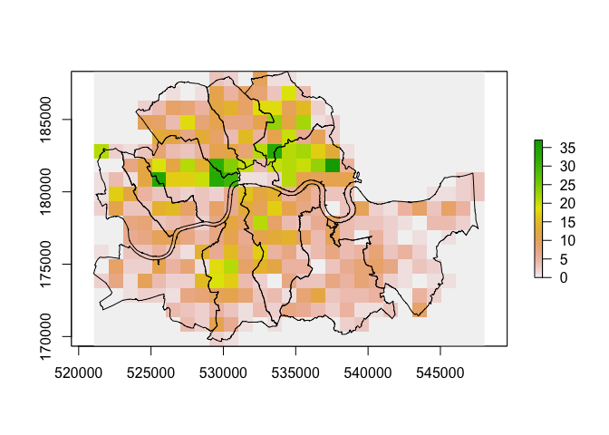

    ##      value count
    ## [1,]     0   201
    ## [2,]     1    35
    ## [3,]     2    36
    ## [4,]     3    34
    ## [5,]     4    26
    ## [6,]     5    25

    ## [1] 4.705653

    ##   K   X       Kmu        Kmu2       XKmu2
    ## 1 0 201 -4.705653 22.14317036 4450.777242
    ## 2 1  35 -3.705653 13.73186432  480.615251
    ## 3 2  36 -2.705653  7.32055827  263.540098
    ## 4 3  34 -1.705653  2.90925223   98.914576
    ## 5 4  26 -0.705653  0.49794619   12.946601
    ## 6 5  25  0.294347  0.08664014    2.166004

This indicates that the 201 quadrats with no crime locations at all
include the null ones that lie outside the boroughs. There are 5
quadrats with over 30 different crime locations. The average number of
crime locations per quadrat is 4.7. Statistics can also be calculated
using the quadrat data.

    s2 <- sum(ff$XKmu2) / (sum(ff$X)-1)
    VMR <- s2 / mu

The observed variance s2 is 41.5362375 and the variance to mean ratio
(VMR) is 8.8268806. This is a unit-less statistic describing the spatial
arrangement of points. In general stratified distributions ~ 0, random
distributions = 1 and clustered distributions a VMR of above 1. This
distribution is highly clustered.

Distance based measurements will be carried out requiring a planar
coordinate based system. A `dist` object is created and then coerced to
a matrix, the distances from each point to itself are removed. To get
the minimum distance to another event `apply` can be used.

    ##          1         2         3         4         5
    ## 1    0.000 2328.9164 3490.7732 3418.9726 2069.8328
    ## 2 2328.916    0.0000 1171.4764 1120.9239  828.9643
    ## 3 3490.773 1171.4764    0.0000  155.9122 1798.5964
    ## 4 3418.973 1120.9239  155.9122    0.0000 1802.5113
    ## 5 2069.833  828.9643 1798.5964 1802.5113    0.0000

    ##          1         2         3         4         5
    ## 1       NA 2328.9164 3490.7732 3418.9726 2069.8328
    ## 2 2328.916        NA 1171.4764 1120.9239  828.9643
    ## 3 3490.773 1171.4764        NA  155.9122 1798.5964
    ## 4 3418.973 1120.9239  155.9122        NA 1802.5113
    ## 5 2069.833  828.9643 1798.5964 1802.5113        NA

The mean nearest neighbour distance is 190.0353488 metres. The top 25
most isolated (from their nearest neighour) cases can be identified and
plotted.

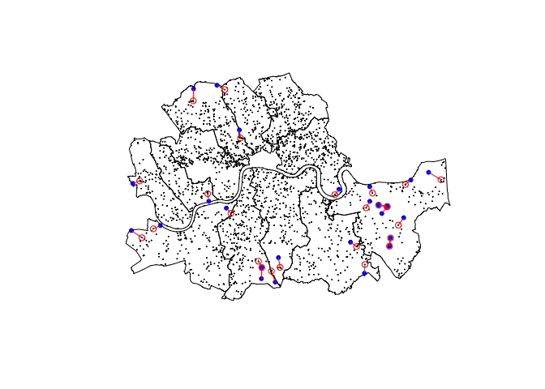

The G function is a cumulative frequency distribution of the nearest
neighbor distance. It is the probability for a specified distance, that
the nearest neighbor distance to another event in the pattern will be
less than the specified distance. The maximum distance to a nearest
neighbour is 1176.9604373 metres. The unique distances need to be
calculated for the x-axis and how many cases there are with distances
smaller than each x. These are then normalised between 0 and 1.

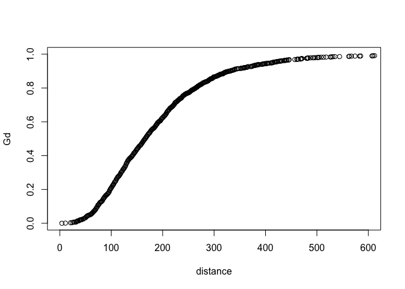

With evenly-spaced events G(d) should rise gradually up to the distance
at which most events are spaced, and then increase rapidly. For
clustered events G(d) rises rapidly at short distances, and then levels
off at larger d-values. The distribution is more clustered than evenly
spaced.

The centres of previously defined raster cells are used to compute the F
function. The distance from all crime locations to these cell centres is
calculated, then a similar process to the G function is followed.

For Evenly-spaced events F(d) should rise rapidly up to the distance at
which most events are spaced and then level off (more nearest neighbors
at small distances from randomly placed points). For clustered events
F(d) rises rapidly at short distances, and then levels off at larger
d-values; again indicating a highly clustered distribution in the
dataset. The expected distribution can be computed, then all three
functions plotted together. K is calculated using the original distance
matrix `d`.

Next the spatstat package is used to make a Kernel Density raster.
SpatialPolygons are coerced to an object of class “owin” (observation
window) and coordinates extracted from SpatialPointsDataFrame. The
kernel density was calculated - the number of points per km2 - then
plotted. A marked point pattern object (ppp) is created, the marks must
be coerced to a factor variable.

    ## [1] "owin"

    ## Planar point pattern: 1925 points
    ## window: polygonal boundary
    ## enclosing rectangle: [521054.9, 547612] x [169648, 188327.4] units

    ## [1] "im"

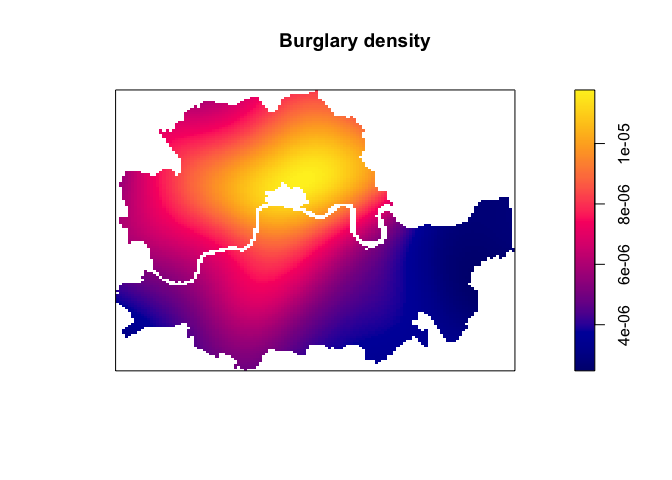

K-plots with an envelope were produced for burglary.

    spatstat.options(checksegments = FALSE)
    kburglary <- Kest(spp$"burglary")
    keburglary <- envelope(spp$"burglary", Kest)

    par(mfrow=c(1,2))
    plot(kburglary, xlim=c(0,2500))
    png("kburglary.png")
    plot(keburglary)
    png("keburglary.png")

In order to determine if population density is a good predictor of
burglary, a Kolmogorov-Smirnov (‘kstest’) test was carried out using
population density as a covariate:

    KS.burglary <- kstest(spp$burglary, ds)
    KS.burglary

This gives the following result: Spatial Kolmogorov-Smirnov test of CSR
in two dimensions data: covariate ‘ds’ evaluated at points of
‘spp$burglary’ and transformed to uniform distribution under CSR D =
0.21068, p-value &lt; 2.2e-16 alternative hypothesis: two-sided

This function performs a goodness-of-fit test of a Poisson point process
model fitted to point pattern data. The observed distribution of the
values of a spatial covariate at the data points, and the predicted
distribution of the same values under the model, are compared. The null
hypothesis is that 2 independent samples are drawn from the same
continuous distribiton. The output reports maximum difference between
the two cumulative distributions (D), and calculates a P value from that
and the sample sizes \[5\]. The P value is small (2.2e-16) so it is
concluded that the two groups were sampled from populations with
different distributions and the null hypothesis is rejected.

### 7. Data Presentation

A combination of interactive chloropleth and KDE maps have been used to
populate a Shiny App for easy access on a smartphone or tablet with a
user friendly interface that allows for simple, easy access and
availability to a large audience. The data used is for bicycle theft
only for the inner London boroughs in 2016. It includes the facility to
click on a map of the boroughs and a coloured circle appears indicating
the density of bicycle thefts which occured in that area.

### 8. Conclusions

Crime rates have been dropping consistently in London from 2011 onwards,
with a anonymously high decrease between 2012 and 2013 noted. However,
certain crimes have shown an increase over that time e.g. violent crime.
There are seasonal patterns in crime present, as evidenced by peaks of
anti-social behaviour correlating to the highest temperature peaks in
the summer season. Bicycle theft is also clearly cyclical with peaks in
the summer and troughs in the winter, against a background of fairly
constant thefts. Burglary has been broadly decreasing since 2012 but a
peak is often visible in the run up to Christmas followed by a sharp
drop in the New Year.

KDE is a valuable method for visualising the density of crimes when
displaying a very large dataset, particular due to the location
anonymisation meaning many crime observations lie immediately on top of
each other. Russel Square and Shoreditch were identified as bicycle
theft hotspots, with Soho and Fitzrovia as burglary hotspots, and Covent
Garden and Soho for theft from the person.

The distribution of crimes across across the inner London boroughs
varies widely. Westminster, with one of the lowest populations, displays
the largest number of crimes at 28.7 per 100 people. Violent crimes peak
in Westminster and Lambeth. There is a clear split between higher values
in central, south and east London, with lower values in north and west
london. Burglaries are also most prevalent in Westminster and Lambeth,
with the lowest in Kensington and Chelsea and Hammersmith and Fulham.

Spatial analysis using point pattern analysis has shown that the most
isolated occurences of burglary tend to occur on the periphery of the
inner London boroughs or within the parks. The dataset is highly
clustered based on the G and F functions, this is further confirmed by
the VMR. The mean nearest neighbour distance is 83m and the maximum
nearest neighbour is 854m. A main constraint of the dataset used is the
lack of unique geographic location resulting in more than half the
records being discounted from the analysis as they are non-unique. The P
value found using the Kolmogorov-Smirnov test is very small (2.2e-16) so
it is concluded that the two groups used were sampled from populations
with different distributions and the null hypothesis of a continuous
distribution is rejected.

### 9. Further Work and Recommendations

A potential feature which could be added to the KDE maps in the Shiny
application would be loction services so user could identify current
position automatically and return a risk rating from 1 to 5 for example,
elaborating on the green, orange and red circles. Ideally, the
chloropleth maps should be adjusted to display data normalised by
population, so the effect of population is removed from the records.

If data download constraints were not an issue, a larger dataset
covering all of the London boroughs for the full period from 2011-2017
could be used. This would provide a more thorough overview of crime
patterns across London. Ideally, the dataset would include the day of
the month the crime occurred as a minimum, and ideally the time of day
too, plus the specific location, as made available within crime datasets
in other cities. This additional granularity would widen the scope for
machine learning methods such as forecasting to be used.

The client focus was threefold for this project, the local residents,
the tourists and the Met Police. There are several recommendations which
can be made as a result of the work carried out:

1.  The Shiny could be made publicly available to encourage both
    residents and tourists to check crime hotspots. This would support
    their aim of making London the safest global city and puts data
    directly into the hands of the general public, allowing them to take
    informed decisions.

2.  For tourists, always be on high alert for pickpockets when visiting
    tourist attractions in Westminster, especially the areas around Soho
    and Covent Garden, and when visiting Shoreditch.

3.  For local residents, think twice before locking your bike up in the
    area around the universities in Russell Square or Shoreditch -
    there's a far greater risk of it getting stolen here than elsewhere,
    always make sure to lock up your car in the summer and if they're
    looking for the 'safest' inner London borough then move to
    Wandsworth which had only 9.66 crimes per 100 people in 2016,
    compared to Westminster's 28.7 crimes per 100 people.

### 10. References

\[1\]Identifying hotspots:an assessment of common techniques, Spencer
Chainey, UCL Jill Dando Institue of Crime Science
<http://www.ucl.ac.uk/jdi/events/int-CIA-conf/ICIAC11_Slides/ICIAC11_1C_SChainey>

\[2\] Making Maps with R, Eric Anderson
<http://eriqande.github.io/rep-res-web/lectures/making-maps-with-R.html>

\[3\] An Introduction to Point Pattern Analysis
<http://gispopsci.org/point-pattern-analysis/>

\[4\] Point Pattern Analysis from R Spatial
<http://rspatial.org/analysis/rst/8-pointpat.html>

\[5\] Interpreting results: Kolmogorov-Smirnov test from GraphPad
Software
<https://www.graphpad.com/guides/prism/7/statistics/interpreting_results_kolmogorov-smirnov_test.htm>
