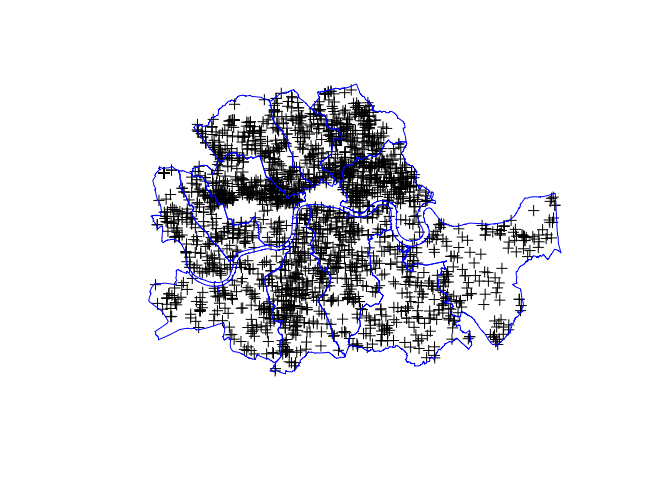
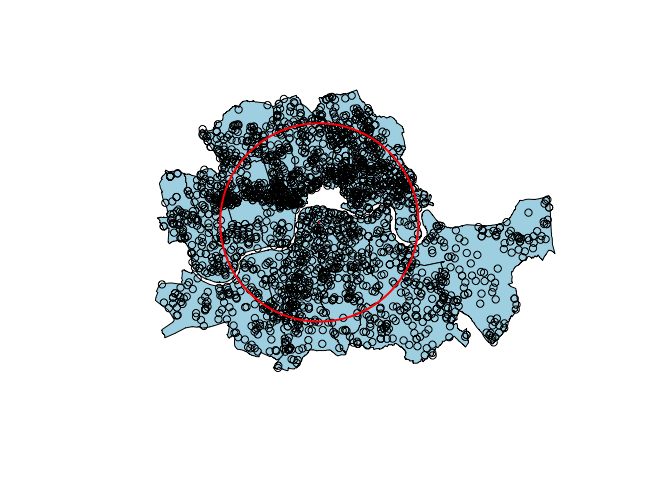
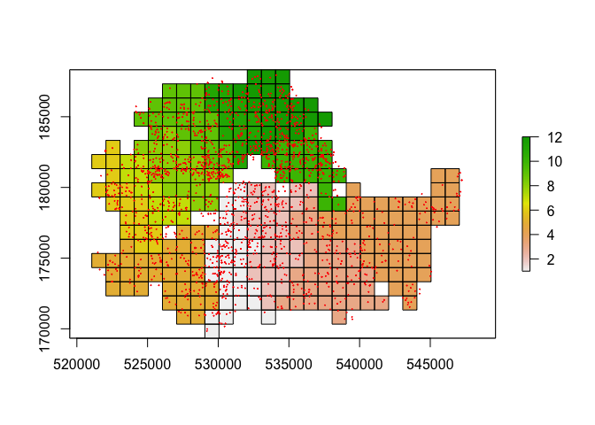
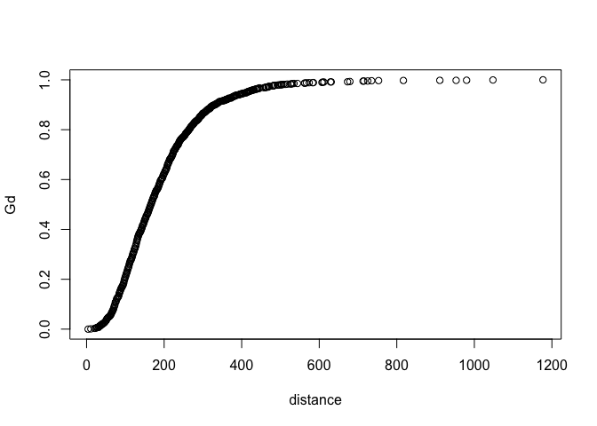
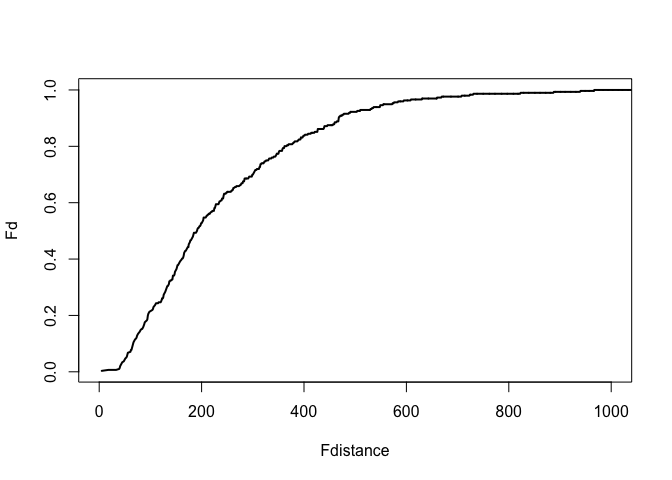
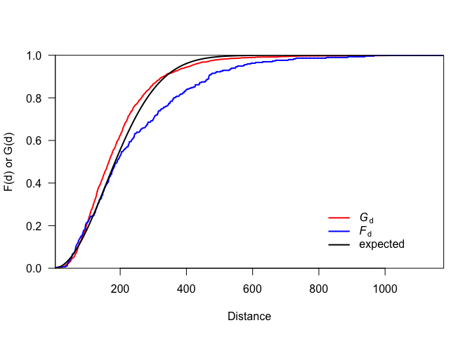
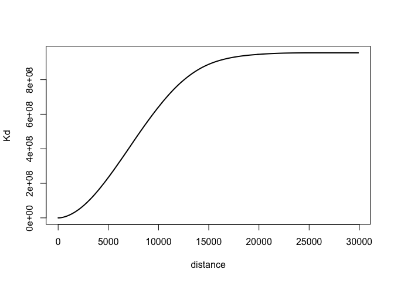

Machine Learning
----------------

### Spatial analysis using point pattern analysis

Point pattern analysis is the evaluation of the pattern, or
distribution, of a set of points on a surface. It can refer to the
actual spatial or temporal location of these points or also include data
from point sources.

The first steps are to load addional libraries `raster`, `gridExtra`,
`spatstat` and `tidyverse`, then ensure that the same coordinate
reference system (CRS) is used for both crime points and borough
polygons - WGS84 was selected. The crime data for the inner boroughs for
2016 is filtered to include only burglaries in November 2016 as this
method did not function with the full unfiltered dataset. The
coordinates for the crime locations and boroughs need to be obtained,
these are then plotted to check the process has worked. The bulk of the
workflow in this section is based on.

    library(raster)
    library(gridExtra)
    library(spatstat)
    library(tidyverse)
    library(dplyr)
    library(ggplot2)
    library(readr)
    library(ggplot2)
    library(lubridate)
    library(scales)
    library(rgdal)
    library(broom)
    library(classInt)
    library(KernSmooth)
    library(RColorBrewer)
    library(leaflet)
    library(sp)
    library(maptools)
    library(rgdal)
    library(rgeos)

    boroughs <- readOGR(dsn = "statistical-gis-boundaries-london/ESRI", "London_Borough_Excluding_MHW", verbose = FALSE)

    wgs.84       <- "+proj=longlat +datum=WGS84"
    central <- boroughs %>% 
      subset(NAME %in% c('Camden','Greenwich','Hackney', 'Hammersmith and Fulham','Islington', 'Kensington and Chelsea','Lambeth','Lewisham', 'Southwark','Tower Hamlets','Wandsworth','Westminster'))

    crime16 <- readRDS('crime16.rds')
    burglary16.2 <- crime16 %>%
      filter(crime_type == "burglary") %>%
      filter(month == 11)

    coords <- SpatialPoints(burglary16.2[,c("longitude","latitude")])
    burglary16.2 <- SpatialPointsDataFrame(coords, burglary16.2)
    proj4string(burglary16.2) <- CRS(wgs.84)
    burglary16.2 <- spTransform(burglary16.2, CRS(proj4string(central)))
    plot(burglary16.2)
    plot(central, border = "blue", add = T)

    xy <- coordinates(burglary16.2)
    dim(xy)

    ## [1] 2414    2

    xy <- unique(xy)
    dim(xy)

    ## [1] 1925    2

Duplicated crime locations must be removed for this technique to be
correctly executed. Due to the 'map points' previously mentioned, many
locations are duplications. When these are removed the dataset reduces
from 2414 to 1925 unique sets of coordinates. Basic statistics are
calculated, mean centre and standard distance for the crime locations,
and plotted with a summary circle created by dividing the circle into
360 points and computing the bearing in radians. The crime location
density is then calculated as 6.4 per km2.

    mc <- apply(xy, 2, mean)
    sd <- sqrt(sum((xy[,1] - mc[1])^2 + (xy[,2] - mc[2])^2) / nrow(xy))
    plot(central, col='light blue')
    points(burglary16.2) #The city of London gap is very clear
    points(cbind(mc[1], mc[2]), pch='*', col='red', cex=0.5)
    bearing <- 1:360 * pi/180
    cx <- mc[1] + sd * cos(bearing)
    cy <- mc[2] + sd * sin(bearing)
    circle <- cbind(cx, cy)
    lines(circle, col='red', lwd=2)

    CityArea <- sum(area(central))
    dens <- nrow(xy) / CityArea

Quadrat analysis was then applied whereby you divide your study area
into subsections of equal size, count the frequency of points in each
subsection and then calculate the frequency of points in each
subsection. Extent for the raster is obtained from the borough polygon,
and then an arbitrary resolution is assigned of 1000. Cells are
identified which lie within the borough boundary, then rasterize is used
to determine frequency of locations in each quadrat.

    r <- raster(central)
    res(r) <- 1000
    r

    ## class       : RasterLayer 
    ## dimensions  : 19, 27, 513  (nrow, ncol, ncell)
    ## resolution  : 1000, 1000  (x, y)
    ## extent      : 521054.9, 548054.9, 169327.4, 188327.4  (xmin, xmax, ymin, ymax)
    ## coord. ref. : +proj=tmerc +lat_0=49 +lon_0=-2 +k=0.999601272 +x_0=400000 +y_0=-100000 +datum=OSGB36 +units=m +no_defs +ellps=airy +towgs84=446.448,-125.157,542.060,0.1502,0.2470,0.8421,-20.4894

    r <- rasterize(central, r)
    plot(r)
    quads <- as(r, 'SpatialPolygons')
    plot(quads, add=TRUE)
    points(burglary16.2, col='red',cex=0.1)

    nc <- rasterize(coordinates(burglary16.2), r, fun='count', background=0)
    plot(nc)
    plot(central, add=TRUE)

    f <- freq(nc, useNA='no')
    head(f)

    ##      value count
    ## [1,]     0   201
    ## [2,]     1    35
    ## [3,]     2    36
    ## [4,]     3    34
    ## [5,]     4    26
    ## [6,]     5    25

    plot(f, pch=20)

    quadrats <- sum(f[,2])
    cases <- sum(f[,1] * f[,2])
    mu <- cases / quadrats
    mu

    ## [1] 4.705653

    ff <- data.frame(f)
    colnames(ff) <- c('K', 'X')
    ff$Kmu <- ff$K - mu
    ff$Kmu2 <- ff$Kmu^2
    ff$XKmu2 <- ff$Kmu2 * ff$X
    head(ff)

    ##   K   X       Kmu        Kmu2       XKmu2
    ## 1 0 201 -4.705653 22.14317036 4450.777242
    ## 2 1  35 -3.705653 13.73186432  480.615251
    ## 3 2  36 -2.705653  7.32055827  263.540098
    ## 4 3  34 -1.705653  2.90925223   98.914576
    ## 5 4  26 -0.705653  0.49794619   12.946601
    ## 6 5  25  0.294347  0.08664014    2.166004

This indicates that the 201 quadrats with no crime locations at all
include the null ones that lie outside the boroughs. There are 5
quadrats with over 30 different crime locations. The average number of
crime locations per quadrat is 4.7. Statistics can also be calculated
using the quadrat data.

    s2 <- sum(ff$XKmu2) / (sum(ff$X)-1)
    VMR <- s2 / mu

The observed variance s2 is 41.5362375 and the variance to mean ratio
(VMR) is 8.8268806. This is a unit-less statistic describing the spatial
arrangement of points. In general stratified distributions ~ 0, random
distributions = 1 and clustered distributions a VMR of above 1. This
distribution is highly clustered.

Distance based measurements will be carried out requiring a planar
coordinate based system. A `dist` object is created and then coerced to
a matrix, the distances from each point to itself are removed. To get
the minimum distance to another event `apply` can be used.

    d <- dist(xy)
    dm <- as.matrix(d)
    dm[1:5, 1:5]

    ##          1         2         3         4         5
    ## 1    0.000 2328.9164 3490.7732 3418.9726 2069.8328
    ## 2 2328.916    0.0000 1171.4764 1120.9239  828.9643
    ## 3 3490.773 1171.4764    0.0000  155.9122 1798.5964
    ## 4 3418.973 1120.9239  155.9122    0.0000 1802.5113
    ## 5 2069.833  828.9643 1798.5964 1802.5113    0.0000

    diag(dm) <- NA
    dm[1:5, 1:5]

    ##          1         2         3         4         5
    ## 1       NA 2328.9164 3490.7732 3418.9726 2069.8328
    ## 2 2328.916        NA 1171.4764 1120.9239  828.9643
    ## 3 3490.773 1171.4764        NA  155.9122 1798.5964
    ## 4 3418.973 1120.9239  155.9122        NA 1802.5113
    ## 5 2069.833  828.9643 1798.5964 1802.5113        NA

    dmin <- apply(dm, 1, min, na.rm=TRUE)
    mdmin <- mean(dmin)
    wdmin <- apply(dm, 1, which.min)

The mean nearest neighbour distance is 190.0353488 metres. The top 25
most isolated (from their nearest neighour) cases can be identified and
plotted.

    plot(central)
    points(burglary16.2, cex=.1)
    ord <- rev(order(dmin))
    far25 <- ord[1:25]
    neighbours <- wdmin[far25]
    points(xy[far25, ], col='blue', pch=20)
    points(xy[neighbours, ], col='red')

    for (i in far25) {
      lines(rbind(xy[i, ], xy[wdmin[i], ]), col='red')
    }

The G function is a cumulative frequency distribution of the nearest
neighbor distance. It is the probability for a specified distance, that
the nearest neighbor distance to another event in the pattern will be
less than the specified distance. The maximum distance to a nearest
neighbour is 1176.9604373 metres. The unique distances need to be
calculated for the x-axis and how many cases there are with distances
smaller than each x. These are then normalised between 0 and 1.

    distance <- sort(unique(round(dmin)))
    Gd <- sapply(distance, function(x) sum(dmin < x))
    Gd <- Gd / length(dmin)
    plot(distance, Gd)

    plot(distance, Gd, xlim=c(0,600))

With evenly-spaced events G(d) should rise gradually up to the distance
at which most events are spaced, and then increase rapidly. For
clustered events G(d) rises rapidly at short distances, and then levels
off at larger d-values. The distribution is more clustered than evenly
spaced.

The centres of previously defined raster cells are used to compute the F
function. The distance from all crime locations to these cell centres is
calculated, then a similar process to the G function is followed.

    p <- rasterToPoints(r)
    d2 <- pointDistance(p[,1:2], xy, longlat=FALSE)
    Fdistance <- sort(unique(round(d2)))
    mind <- apply(d2, 1, min)
    Fd <- sapply(Fdistance, function(x) sum(mind < x))
    Fd <- Fd / length(mind)
    plot(Fdistance, Fd, type='l', lwd=2, xlim=c(0,1000))

For Evenly-spaced events F(d) should rise rapidly up to the distance at
which most events are spaced and then level off (more nearest neighbors
at small distances from randomly placed points). For clustered events
F(d) rises rapidly at short distances, and then levels off at larger
d-values; again indicating a highly clustered distribution in the
dataset. The expected distribution can be computed, then all three
functions plotted together. K is calculated using the original distance
matrix `d`.

    ef <- function(d, lambda) {
      E <- 1 - exp(-1 * lambda * pi * d^2)
    }
    expected <- ef(0:2000, dens)

    plot(distance, Gd, type='l', lwd=2, col='red', las=1,
         ylab='F(d) or G(d)', xlab='Distance', yaxs="i", xaxs="i")
    lines(Fdistance, Fd, lwd=2, col='blue')
    lines(0:2000, expected, lwd=2)

    legend(800, .3, c(expression(italic("G")["d"]), expression(italic("F")["d"]), 'expected'),
           lty=1, col=c('red', 'blue', 'black'), lwd=2, bty="n")

    distance <- seq(1, 30000, 100)
    Kd <- sapply(distance, function(x) sum(d < x))
    Kd <- Kd / (length(Kd) * dens)
    plot(distance, Kd, type='l', lwd=2)

Next the spatstat package is used to make a Kernel Density raster.
SpatialPolygons are coerced to an object of class “owin” (observation
window) and coordinates extracted from SpatialPointsDataFrame. The
kernel density was calculated - the number of points per km2 - then
plotted. A marked point pattern object (ppp) is created, the marks must
be coerced to a factor variable.

    cityOwin <- as.owin(central)
    class(cityOwin)

    ## [1] "owin"

    pts <- coordinates(xy) 
    p <- ppp(pts[,1], pts[,2], window=cityOwin)
    p

    ## Planar point pattern: 1925 points
    ## window: polygonal boundary
    ## enclosing rectangle: [521054.9, 547612] x [169648, 188327.4] units

    plot(p)

    ds <- density(p)
    class(ds)

    ## [1] "im"

    plot(ds, main='Burglary density')

    burglary16.2$fcat <- as.factor(burglary16.2$crime_type)
    burglary16.2 <- remove.duplicates(burglary16.2)

    w <- as.owin(central)
    xy <- coordinates(burglary16.2)
    mpp <- ppp(xy[,1], xy[,2], window = w, marks=burglary16.2$fcat)
    spp <- split(mpp)

K-plots with an envelope were produced for burglary.

    spatstat.options(checksegments = FALSE)
    kburglary <- Kest(spp$"burglary")
    keburglary <- envelope(spp$"burglary", Kest)

    par(mfrow=c(1,2))
    plot(kburglary, xlim=c(0,2500))
    png("kburglary.png")
    plot(keburglary)
    png("keburglary.png")

In order to determine if population density is a good predictor of
burglary, a Kolmogorov-Smirnov (‘kstest’) test was carried out using
population density as a covariate:

    KS.burglary <- kstest(spp$burglary, ds)
    KS.burglary

This gives the following result: Spatial Kolmogorov-Smirnov test of CSR
in two dimensions data: covariate ‘ds’ evaluated at points of
‘spp$burglary’ and transformed to uniform distribution under CSR D =
0.21068, p-value &lt; 2.2e-16 alternative hypothesis: two-sided

This function performs a goodness-of-fit test of a Poisson point process
model fitted to point pattern data. The observed distribution of the
values of a spatial covariate at the data points, and the predicted
distribution of the same values under the model, are compared. The null
hypothesis is that 2 independent samples are drawn from the same
continuous distribiton. The output reports maximum difference between
the two cumulative distributions (D), and calculates a P value from that
and the sample sizes. The P value is small (2.2e-16) so it is concluded
that the two groups were sampled from populations with different
distributions and the null hypothesis is rejected.
