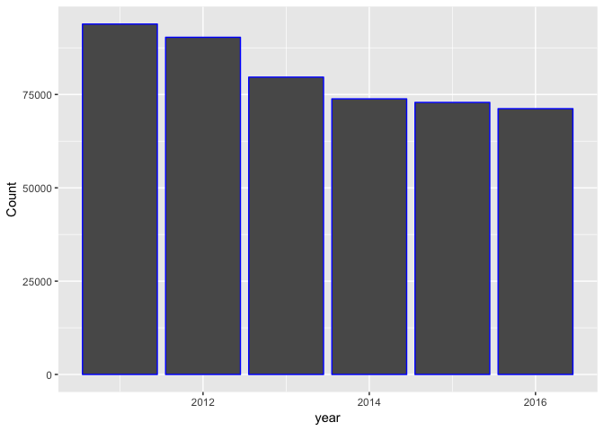
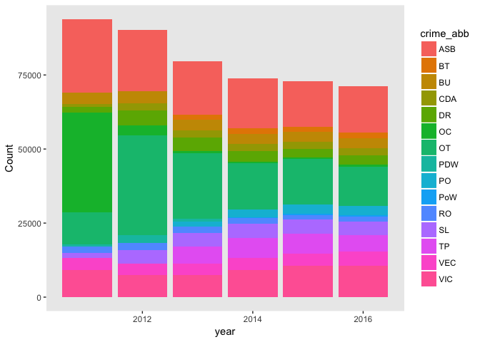
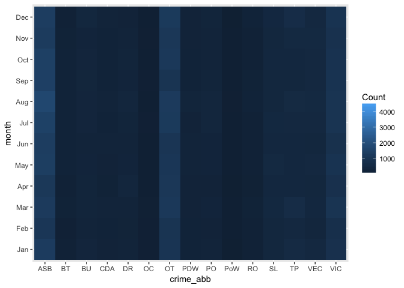
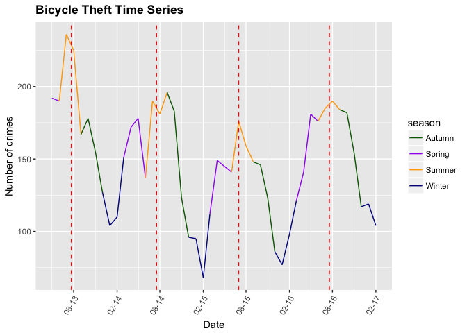
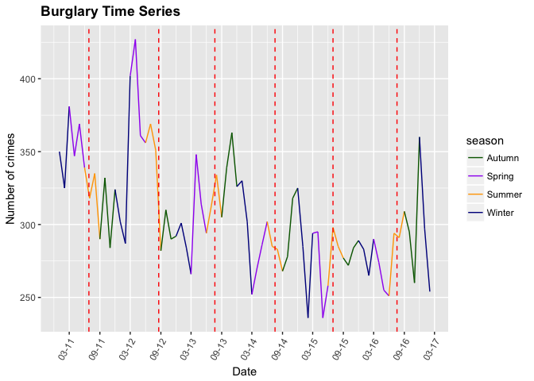

Capstone Milestone Report
-------------------------

### 1. Introduction

The Metropolitan Police operate across 32 boroughs within Greater London and aim to make London the safest global city. To this end, an accessible method allowing both residents and tourists to check where crime hotspots are located would allow them to make informed decisions about where they go and encourage preventative action. This would be a useful service for the Met Police to promote with the aim of reducing opportunistic crimes by raising awareness of the highest risk areas.

For locals, this may be in the context of checking incidences of bicycle theft to identify where is best to lock up your bike, or hotspots for burglaries when looking to rent or purchase property. This may also be useful for tourists visiting the city to flag if they are in a higher risk area.

This project aims to address several key questions:

1.  Is crime on the increase or decrease in central London?

2.  Is the frequency of specific crimes reducing or increasing on an annual basis?

3.  Is there any seasonal variation in the frequency of crimes?

4.  Are certain crimes more prevalent in certain areas - where are these 'hotspots'?

5.  Create a visualisation allowing easy identification of risk level to a certain crime

6.  Can correlations be made between crime occurrences and other indicators e.g. employment levels?

7.  Can time series forecasting be used to estimate occurence of crime in the future?

### 2. Data acquisition

Datasets for street level crime in England, Wales and Northern Ireland are available at (<https://data.police.uk/docs/method/crime-street/>). Data is reported monthly and is available from December 2010 to March 2017 at present. All the data on this site is made available under the Open Government License v3.0.

There is an associated API which can efficiently and rapidly provide a rich data source of information. The API is implemented as a standard JSON web service using HTTP GET and POST requests.

**Example API Request** <https://data.police.uk/api/crimes-street/all-crime?poly=52.268,0.543:52.794,0.238:52.130,0.478&date=2013-01>

To keep the size of the dataset manageable an area over central London has been defined. The *poly* parameter identifies the polygon within which data is extracted and is formatted in lat/lng pairs, separated by colons:

poly=\[lat\],\[lng\]:\[lat\],\[lng\]:\[lat\],\[lng\]:\[lat\],\[lng\]

The date also needs to be specified or the most recent month will be returned. The limit of a custom search area is 10,000 crimes, if it contains more than this the API will return a 503 status code.

Location data is only referencing the approximate location using 'anonymous' map points. This is to protect the privacy of victim. The date of occurence is also truncated to record only month and year for the same reason.

The API will initially be used to acquire the full dataset from December 2011 to March 2017 for central London as defined by a coordinates box with corners: 51.514,-0.225 51.484,-0.225 51.484,-0.105 51.514,-0.105

### 3. Important fields and information

Variable names, types and number of observations were reviewed using glimpse(crime11to17). This reveals there are 11 variables - 6 characters, 3 numerics (1 integer, 2 double precision) and 2 factors. There are 498,628 observations in total.

The following variables are returned: **category**, location\_type, context, persistent\_id, id, location\_subtype, **month**, **latitude**, **longitude**, outcome\_status\_category, outcome\_status\_data. The key fields for this study are in **bold**.

There are 15 different types of crime (variable category). Month and year are available but not day due to the police anonymisation process. Latitude and longitude are provided. Location data is only referencing the approximate location using 'anonymous' map points.

### 4. Data limitations

The main limitations that have been identified with the dataset are:

-   Anonymistation of the data means the locations are fixed to a 'map point' and jittering is required to make all the events visible, although as the dataset gets larger it is not possible to create an effective map visualisation of individual crimes.

-   Anonymisation also means no day/time is provided so it is not possible to analyse potential relationships with certain crimes.

-   It is difficult at present to integrate other datasets relating to indicators at a Borough level as the data is downloaded using the API over a polygon area of central London which encompasses parts of Westminster, Camden, Lambeth and Southwark.

### 5. Data cleaning and wrangling

The following packages were loaded in preparation for data wrangling: `readr`, `dplyr`, `tidyr` and `lubridate`.

They key data wrangling steps that were undertaken as part of this project were as follows:

-   Convert `category` and `location_type` to factor using `as.factor()`.

-   Several of the variables contained no useful data for a civilian user. The variables `context`, `persistent_id`, `id` and `location_subtype` were removed with `select()` and variable names for `category` and `location_type` were changed to `crime_type` and `service` respectively, to make the dataset clearer using `rename()`.

-   Checked columns for missing values using `sapply(crime11to17, function(x) sum(is.na(x)))`. Only the `outcome_status_category` and `outcome_status_date` contain NA values and there is no plan to use these in the scope of the current project.

-   Use the `lubridate` functions `year()` and `month()` to create new columns called `year` and `month` from the original 'month' variable which was in format y-m.

-   Create dataframe for monthly crime statistics from 2011 to 2017. Abbreviate the `crime_type` into new variable called `crime_abb` to improve data visualisations using `case_when()` function nested within `mutate()`. The `group_by()` function is then used to sort by `year`, `month` and `crime_abb`. `summarize()` is used to get a count for each of the new groupings.

-   Repeat process for annual crime statistics from 2011 to 2016, 2017 removed as only a partial year.

-   Create dataframe for seasonal crime numbers using case\_when() to assign Spring (March to May), Summer (June to August), Autumn (September to November) or Winter (December to February) to new season variable. Removed Mar-2017 from analysis as not sufficient data to constitute a full season.

-   Save dataframes created using saveRDS for loading into analysis section.

### 6. Preliminary exploration

The most prevalent crime in the 2011-2017 period is anti-social-behaviour. This accounts for 23% of total recorded crime. The majority of the records are from the Police Force but a small portion is submitted by the British Transport Police who operate on the railways. These records account for only 4.3%. It would be interesting to explore the annual variation in street crimes using a bar chart. The total crimes per year are calculated using group\_by(year) and summarize(Count=n()).

``` r
library(readr)
library(ggplot2)
library(dplyr)
library(tidyr)
library(lubridate)
library(scales)
library(rgdal)
library(broom)
library(classInt)
library(KernSmooth)
library(RColorBrewer)
library(leaflet)
library(sp)
crime11to17 <- readRDS("crime11to17.rds")
monthly.crime <- readRDS("monthlycrime.rds")
annual.crime <- readRDS("annualcrime.rds")
seasonal.crime <- readRDS("seasonalcrime.rds")
total.year <- crime11to17 %>% 
  group_by(year) %>%
  summarize(Count=n()) %>%
  filter(year != 2017) %>%
  as.data.frame()
```

``` r
ggplot(total.year, aes(x = year, y = Count)) +
  geom_col(col = "blue")
```



The abbreviations used are as follows:

| Abbreviation | Crime                   |
|--------------|-------------------------|
| ASB          | Anti-social behaviour   |
| BT           | Bicycle theft           |
| BU           | Burglary                |
| CDA          | Criminal damage & arson |
| DR           | Drugs                   |
| OC           | Other crime             |
| OT           | Other theft             |
| PDW          | Public disorder weapons |
| PO           | Public order            |
| PoW          | Possesion of weapons    |
| RO           | Robbery                 |
| SL           | Shoplifting             |
| TP           | Theft from the person   |
| VEC          | Vehicle crime           |
| VIC          | Violent crime           |

Recorded annual street crime has been decreasing each year in London since 2011. There was a significant decrease between 2012 and 2013 of 11.8% and subsequent years show a reduction with a less steep negative gradient. The variation of specific crime frequency over time is displayed using a bar chart and a line plot with the annual.crime dataframe as input.

``` r
ggplot(annual.crime) +
  geom_bar(stat="identity",aes(x = year, y = Count,fill = crime_abb)) +
  theme(panel.grid = element_blank())
```



``` r
ggplot(annual.crime, aes(x = year, y = Count)) +
  geom_point(aes(col = crime_abb)) +
  geom_line(aes(col = crime_abb)) +
  theme(panel.grid = element_blank(), axis.line = element_line(colour = "black"))
```


Three categories have shown a strong decrease between 2011 and 2016 - other crime, other theft and anti-social behaviour. The anonymously large drop between 2011 and 2012 for other crime, and large increase of other theft between 2012 and 2013 may suggest a change in recording/reporting. Worryingly, violent crime displays a steady increase from 2013 onwards.

The monthly.crime dataframe is used to investigate time series. Initially, the date column needs to be set to the correct format using Lubridate.

``` r
monthly.crime <- monthly.crime %>% 
  unite(date, month, year, sep = "-", remove = FALSE)
monthly.crime$date <- paste0("01-", monthly.crime$date) 
monthly.crime$date <- dmy(monthly.crime$date)
```

A time series is plotted using geom\_area() which stacks time series at each point. The colour scale for the crime categories is manually set using a vector due to the large number of categories.

``` r
crime.col <- c("ASB" = "sienna", "BT" = "red3", "BU" = "orange", "CDA" = "yellow", "DR" = "lightgreen", "OC" = "limegreen", "OT" = "green", "PDW" = "olivedrab", "PO" = "royalblue", "PoW" = "lightblue", "RO" = "aquamarine", "SL" = "lightpink", "TP" = "violet", "VEC" = "deeppink", "VIC" = "grey")
```

``` r
ggplot(monthly.crime, aes(x = date,  y = Count, fill = crime_abb)) +
  geom_area() +
  scale_fill_manual(values = crime.col)
```


This illustrates the changing classification of crimes over time and suggests there was a drive to classify 'other crimes' into different categories. 'Other theft' did not exist prior to late 2011 and seems to increase by a similar degree to the decrease in 'other crime'. Several other categories are added at this point: drugs, shoplifting, criminal damage & arson, and public disorder weapons. The final tranche of categories are introduced in early 2013 - public order, bicycle theft and theft from the person. By early 2017, the other-crime category is used only minimally.

A time series is plotted using geom\_bar() which suggests anti-social behaviour peaks each summer, but due to the scale used it is difficult to analyse it further.

``` r
ggplot(monthly.crime) +
  geom_bar(stat="identity",aes(x = date, y = Count,fill = crime_abb)) +
  theme(panel.grid = element_blank(), axis.line = element_line(colour = "black")) +
  xlab("Date") +
  ylab("Count") +
  scale_fill_manual(values = crime.col)
```


A heatmap can be used to analyse seasonal variation across all crime categories.

``` r
ggplot(monthly.crime,aes(x=crime_abb,y=month,fill=Count))+
  geom_tile(aes(fill=Count))
```



This clearly demonstrates the seasonal fluctuations in anti-social behaviour, with peaks each summer. Bicycle crime and violent crime also appear to be more common in May-July. Most other crimes show minimal seasonal variation.

These variations will be analysed in more detail using the seasonal.crime dataframe. Seasonal colours are set using a vector so the line segments can be individually coloured. Date is converted for time series use. A line plot is created with vertical lines to indicate the day with the highest temperature (red lines). This is created using a dataframe with the maximum London temperature for each year (hottest.day).

``` r
season.cols <- c("Summer" = "orange", "Autumn" = "darkgreen", "Winter" = "darkblue", "Spring" = "purple")
seasonal.crime$date <- paste0("01-", seasonal.crime$date) 
seasonal.crime$date <- dmy(seasonal.crime$date)
ASB.season <- filter(seasonal.crime, crime_type == "anti-social-behaviour")

annual.line <- c("2012-01-01", "2013-01-01", "2014-01-01", "2015-01-01", "2016-01-01", "2017-01-01")
TDates <- c("2011-06-27", "2012-08-19", "2013-07-22", "2014-07-18", "2015-07-01", "2016-07-19")
HTemp <- c(30, 30, 33, 30, 35, 33)
hottest.day <- data.frame(x = TDates, y = HTemp)
```

``` r
ggplot(ASB.season, aes(x = date, y = Count)) +
  geom_line(aes(group = crime_type, col = season)) + 
  scale_colour_manual(values = season.cols) +
  scale_x_date(date_breaks = "6 month", date_labels = "%m-%y") +
  ylab("Number of crimes") +
  xlab("Date") +
  ggtitle("Anti-Social Behaviour Time Series") +
  theme(axis.text.x=element_text(angle=60, hjust=1), plot.title = element_text(lineheight=.8, face="bold")) +
  geom_vline(xintercept = as.numeric(as.Date(TDates)), linetype=2, col = "red")
```


There has been a clear decrease in anti-social behaviour over time, with the exception of 2016 which showed a significant increase. Clear peaks are visible in the summer (orange segments), often coinciding with August when the school summer holidays occur. The peaks frequently coincide very closely to the hottest day of the year, with the exception of 2014. Minimum occurences are consistently just after 1st January. This process will be repeated for bicycle theft and burglaries.

``` r
BT.season <- filter(seasonal.crime, crime_type == "bicycle-theft")
ggplot(BT.season, aes(x = date, y = Count)) +
  geom_line(aes(group = crime_type, col = season)) + 
  scale_colour_manual(values = season.cols) +
  scale_x_date(date_breaks = "6 month", date_labels = "%m-%y") +
  ylab("Number of crimes") +
  xlab("Date") +
  ggtitle("Bicycle Theft Time Series") +
  theme(axis.text.x=element_text(angle=60, hjust=1), plot.title = element_text(lineheight=.8, face="bold")) +
  geom_vline(xintercept = as.numeric(as.Date(TDates)), linetype=2, col = "red")
```



``` r
BU.season <- filter(seasonal.crime, crime_type == "burglary")

ggplot(BU.season, aes(x = date, y = Count)) +
  geom_line(aes(group = crime_type, col = season)) + 
  scale_colour_manual(values = season.cols) +
  scale_x_date(date_breaks = "6 month", date_labels = "%m-%y") +
  ylab("Number of crimes") +
  xlab("Date") +
  ggtitle("Burglary Time Series") +
  theme(axis.text.x=element_text(angle=60, hjust=1), plot.title = element_text(lineheight=.8, face="bold")) +
    geom_vline(xintercept = as.numeric(as.Date(TDates)), linetype=2, col = "red")
```



Bicycle theft statistics are only available from 2013 and they have been fairly steady from 2014 onwards. The time series is cyclical with peaks generally correspond reasonably (within 3 weeks) to the hottest day of the year, and minimum recorded incidences always occuring in the winter.

Burglaries have generally decreased since 2012, though there was a surge in Spring 2012 and another peak in Autumn 2016. There is less of a pattern visible in burglary occurences, though there is frequently a peak in the run up to Christmas followed by a sharp decrease over New Year. There is no clear pattern between high temperatures and burglary.

The Leaflet package can be used to visualise the location of crime occurences. A reduced dataset is required and is only useful if the data is filtered to a single year and single crime, due to overlapping or proximal datapoints. Jittering could be used to improve this.

``` r
VEC.2016 <- crime11to17 %>%
filter(year == 2016, crime_type == 'vehicle-crime')

VEC.2016 %>% 
  leaflet() %>%
  addTiles() %>%
  addMarkers(~longitude, ~latitude)
```

<!--html_preserve-->

<script type="application/json" data-for="htmlwidget-9dbc5520c26770ac5d94">{"x":{"options":{"crs":{"crsClass":"L.CRS.EPSG3857","code":null,"proj4def":null,"projectedBounds":null,"options":{}}},"calls":[{"method":"addTiles","args":["//{s}.tile.openstreetmap.org/{z}/{x}/{y}.png",null,null,{"minZoom":0,"maxZoom":18,"maxNativeZoom":null,"tileSize":256,"subdomains":"abc","errorTileUrl":"","tms":false,"continuousWorld":false,"noWrap":false,"zoomOffset":0,"zoomReverse":false,"opacity":1,"zIndex":null,"unloadInvisibleTiles":null,"updateWhenIdle":null,"detectRetina":false,"reuseTiles":false,"attribution":"&copy; <a href=\"http://openstreetmap.org\">OpenStreetMap<\/a> contributors, <a href=\"http://creativecommons.org/licenses/by-sa/2.0/\">CC-BY-SA<\/a>"}]},{"method":"addMarkers","args":[[51.51253,51.509514,51.485859,51.498936,51.496564,51.502966,51.497899,51.507531,51.498336,51.491165,51.485489,51.491806,51.488371,51.487674,51.508221,51.485009,51.489116,51.513077,51.501566,51.495754,51.502892,51.48939,51.494229,51.506587,51.49485,51.49027,51.500546,51.500397,51.488796,51.500808,51.497532,51.484917,51.507293,51.493613,51.487165,51.487165,51.493462,51.500969,51.512558,51.505458,51.513664,51.506276,51.510505,51.512899,51.492366,51.512955,51.501937,51.508539,51.498865,51.500288,51.495601,51.508486,51.496975,51.486498,51.500288,51.503336,51.513643,51.513474,51.507877,51.496938,51.487136,51.489332,51.486179,51.494263,51.513846,51.48493,51.484861,51.499023,51.51225,51.487506,51.485914,51.509135,51.495451,51.50784,51.506587,51.512379,51.512719,51.484455,51.48992,51.490621,51.493175,51.508642,51.497505,51.484242,51.497255,51.491266,51.486829,51.484427,51.512592,51.501237,51.501237,51.48939,51.489684,51.509054,51.493162,51.48921,51.512424,51.501964,51.49809,51.508871,51.498304,51.506157,51.485748,51.497733,51.510164,51.490054,51.510263,51.508642,51.498336,51.510297,51.487795,51.491386,51.4857,51.50784,51.489168,51.501998,51.511914,51.50472,51.505975,51.499435,51.508337,51.497322,51.511767,51.506712,51.505569,51.498501,51.496311,51.501753,51.499823,51.487732,51.487136,51.501017,51.497255,51.49236,51.488241,51.498903,51.505771,51.495874,51.512975,51.486313,51.484663,51.500651,51.497789,51.508259,51.500735,51.500703,51.511238,51.499014,51.498316,51.510265,51.511375,51.510632,51.486875,51.510925,51.485764,51.495278,51.505458,51.49505,51.501853,51.493713,51.491231,51.485336,51.48992,51.485748,51.491386,51.493694,51.49216,51.511694,51.505921,51.488512,51.497592,51.509904,51.499306,51.490006,51.497733,51.510051,51.509475,51.495775,51.509528,51.503437,51.493096,51.498936,51.492094,51.492206,51.487769,51.497579,51.493033,51.486538,51.492961,51.499433,51.487835,51.497032,51.51225,51.487732,51.491605,51.514,51.497608,51.484999,51.491972,51.490241,51.512096,51.486005,51.500397,51.490893,51.491338,51.4873,51.498012,51.50786,51.491798,51.50472,51.494549,51.504216,51.509053,51.487136,51.512425,51.513828,51.51117,51.493583,51.484498,51.494046,51.495737,51.513343,51.498501,51.490725,51.510192,51.489778,51.503336,51.491488,51.49027,51.496291,51.499953,51.510632,51.494486,51.487353,51.513226,51.505771,51.503456,51.489013,51.499307,51.510003,51.501753,51.506841,51.493244,51.498737,51.511211,51.487045,51.501221,51.505458,51.486416,51.48621,51.49426,51.498304,51.489094,51.499811,51.499443,51.49455,51.500729,51.492797,51.500471,51.492715,51.508045,51.513893,51.504908,51.49461,51.485011,51.491597,51.485754,51.495405,51.497592,51.491488,51.499727,51.510411,51.491082,51.511707,51.507548,51.499443,51.490762,51.490576,51.504908,51.505931,51.501753,51.488408,51.512764,51.50282,51.48658,51.512793,51.490158,51.490878,51.486158,51.50799,51.495877,51.499823,51.486416,51.489778,51.511579,51.500816,51.49461,51.490762,51.491899,51.506747,51.495232,51.485517,51.492344,51.51225,51.508419,51.485181,51.507298,51.485018,51.513839,51.490576,51.511734,51.511036,51.489963,51.500463,51.495877,51.500089,51.490628,51.510096,51.508871,51.510974,51.488172,51.512773,51.502168,51.512876,51.500397,51.490627,51.509609,51.506587,51.485009,51.489886,51.486364,51.498222,51.48832,51.487165,51.509369,51.490601,51.499245,51.485181,51.489874,51.490943,51.496784,51.51225,51.51225,51.512773,51.509475,51.507214,51.48677,51.500397,51.486866,51.493702,51.49853,51.510003,51.507713,51.500397,51.493465,51.501566,51.496734,51.490893,51.484159,51.487795,51.501188,51.485997,51.485783,51.489733,51.495494,51.491991,51.493443,51.488681,51.501815,51.498936,51.492669,51.500506,51.486558,51.495923,51.504908,51.502281,51.49696,51.506747,51.506587,51.496593,51.487165,51.489684,51.511303,51.497608,51.500471,51.491787,51.494212,51.487769,51.499536,51.501221,51.499868,51.491777,51.495317,51.50518,51.50784,51.487165,51.491634,51.488408,51.495067,51.493276,51.50806,51.500471,51.487795,51.486693,51.490738,51.511751,51.489478,51.486687,51.500599,51.508201,51.49216,51.500201,51.506013,51.500599,51.496121,51.497568,51.513643,51.50972,51.494147,51.501632,51.49564,51.512063,51.498936,51.496932,51.490006,51.500599,51.496577,51.495733,51.492852,51.496291,51.503038,51.49696,51.499146,51.492755,51.498201,51.487852,51.485748,51.487165,51.484905,51.497264,51.487032,51.501278,51.495765,51.494892,51.490707,51.505458,51.495754,51.499435,51.489094,51.493748,51.50634,51.504735,51.50786,51.503515,51.501309,51.496607,51.490461,51.490811,51.485738,51.510946,51.495737,51.489271,51.490551,51.500682,51.510275,51.512793,51.485389,51.494752,51.497305,51.511694,51.496199,51.500793,51.500961,51.494693,51.499939,51.508539,51.497058,51.491899,51.49261,51.502613,51.496205,51.489828,51.501675,51.50784,51.496246,51.50799,51.485237,51.48695,51.51225,51.492747,51.500217,51.500936,51.501298,51.511707,51.510973,51.48785,51.493288,51.495125,51.498985,51.50129,51.512596,51.513828,51.501298,51.49948,51.511749,51.510606,51.509005,51.490118,51.493765,51.490628,51.486158,51.49455,51.494486,51.507657,51.513114,51.485129,51.490429,51.510834,51.488681,51.499753,51.51272,51.495109,51.490691,51.511045,51.484381,51.484434,51.497733,51.486313,51.503763,51.502173,51.512719,51.512596,51.49931,51.510827,51.495486,51.499132,51.505458,51.497513,51.510946,51.507758,51.494371,51.503763,51.500089,51.509475,51.500039,51.50634,51.49019,51.503763,51.500227,51.486091,51.509933,51.49273,51.495199,51.499953,51.510974,51.495278,51.509475,51.497817,51.487165,51.502048,51.487045,51.497592,51.493453,51.506818,51.498127,51.491329,51.494688,51.500682,51.502791,51.488141,51.497072,51.50784,51.492242,51.505195,51.50837,51.502892,51.493702,51.510678,51.494864,51.513664,51.484852,51.502862,51.510158,51.513363,51.498704,51.488983,51.489768,51.51052,51.495496,51.499753,51.511055,51.511096,51.501188,51.489717,51.488681,51.491327,51.508871,51.510766,51.511767,51.51393,51.495906,51.500333,51.487852,51.513484,51.503826,51.509182,51.493955,51.489945,51.498201,51.511211,51.486418,51.487754,51.485754,51.493014,51.501566,51.49762,51.51394,51.502966,51.488562,51.513067,51.498336,51.498336,51.497941,51.497789,51.509135,51.511868,51.485505,51.510974,51.500816,51.48817,51.485859,51.494982,51.498632,51.488755,51.492852,51.498524,51.512278,51.491605,51.494522,51.508445,51.498936,51.497202,51.499014,51.491777,51.508165,51.500414,51.489133,51.495906,51.50129,51.500816,51.48475,51.508871,51.498304,51.508132,51.500729,51.512165,51.498737,51.493583,51.49162,51.489982,51.49449,51.500305,51.498304,51.497322,51.485505,51.491386,51.491622,51.498497,51.509475,51.505759,51.491777,51.49219,51.486418,51.499953,51.49461,51.49505,51.493865,51.48737,51.485726,51.496853,51.50784,51.507513,51.498137,51.509514,51.49598,51.494881,51.496819,51.510541,51.49678,51.494864,51.491605,51.510158,51.497072,51.513303,51.509933,51.504908,51.512345,51.496004,51.512938,51.493181,51.499868,51.510606,51.500556,51.486158,51.510757,51.48535,51.512345,51.513452,51.484452,51.489753,51.509475,51.484248,51.492719,51.48695,51.50784,51.489322,51.513622,51.502791,51.50784,51.484999,51.513484,51.497802,51.487857,51.513474,51.487353,51.486392,51.491329,51.50357,51.512086,51.497365,51.509232,51.490576,51.488441,51.508248,51.501202,51.497608,51.513893,51.490831,51.48997,51.494522,51.497975,51.509609,51.512938,51.49449,51.490831,51.504908,51.485517,51.487165,51.502297,51.509392,51.48785,51.513839,51.485469,51.498449,51.51225,51.507309,51.491377,51.484999,51.504286,51.49668,51.510275,51.485748,51.501815,51.490968,51.493106,51.487473,51.484033,51.485517,51.484242,51.48404,51.497351,51.492341,51.508221,51.491306,51.486675,51.498304,51.512447,51.502791,51.498234,51.494416,51.495648,51.502613,51.484677,51.511315,51.504246,51.487032,51.486711,51.499584,51.504515,51.489965,51.508221,51.513343,51.484381,51.488912,51.50784,51.486754,51.485469,51.48508,51.511767,51.512118,51.490576,51.512955,51.512887,51.487136,51.493955,51.507377,51.49317,51.495597,51.494392,51.487769,51.501645,51.510192,51.494212,51.487612,51.512887,51.497592,51.49299,51.51018,51.513553,51.487769,51.493445,51.50799,51.508539,51.490158,51.492656,51.493184,51.50998,51.492341,51.499198,51.485009,51.484248,51.51104,51.488177,51.513245,51.485035,51.512009,51.494489,51.494489,51.508598,51.495765,51.49107,51.513075,51.512908,51.493033,51.510615,51.513552,51.51018,51.487812,51.493904,51.485389,51.495085,51.484274,51.496249,51.491865,51.507298,51.510757,51.499506,51.495405,51.494982,51.494628,51.487165,51.484549,51.498737,51.49379,51.50634,51.511691,51.48982,51.504687,51.497532,51.510839,51.49097,51.498727,51.512998,51.50808,51.499502,51.491777,51.493427,51.489644,51.510003,51.51018,51.49349,51.508045,51.512345,51.506991,51.485754,51.503328,51.498344,51.509933,51.513671,51.489332,51.492925,51.49696,51.494522,51.495095,51.50806,51.49505,51.484362,51.49261,51.486346,51.50634,51.501221,51.491386,51.490179,51.485474,51.488983,51.493337,51.492692,51.488547,51.493265,51.49931,51.512427,51.51318,51.512887,51.505458,51.499603,51.498088,51.485181,51.498582,51.490158,51.510953,51.500961,51.488727,51.490831,51.511268,51.492574,51.51018,51.486418,51.501299,51.489322,51.497365,51.511816,51.493162,51.495828,51.503861,51.507439,51.50693,51.487543,51.513552,51.508215,51.496311,51.49564,51.505458,51.512592,51.511057,51.485933,51.512063,51.49273,51.487835,51.497524,51.504908,51.493583,51.494014,51.490158,51.498436,51.485945,51.500471,51.486335,51.494147,51.509921,51.487098,51.498497,51.513108,51.486469,51.499023,51.512558,51.497283,51.493029,51.484694,51.498582,51.51225,51.506814,51.504286,51.493955,51.493927,51.500936,51.490551,51.48985,51.508539,51.505179,51.487769,51.487795,51.49273,51.500472,51.494202,51.512478,51.512975,51.486596,51.501126,51.490692,51.485575,51.500682,51.508123,51.489684,51.493462,51.489684,51.4857,51.505458,51.48837,51.510158,51.512171,51.497608,51.494554,51.488371,51.484917,51.48854,51.498985,51.493123,51.500682,51.513846,51.497789,51.502371,51.50016,51.489778,51.513338,51.491082,51.492312,51.4983,51.512175,51.49668,51.490158,51.484804,51.493053,51.494629,51.506013,51.493955,51.509922,51.509475,51.505458,51.49273,51.488681,51.510725,51.49505,51.501126,51.498131,51.505458,51.506712,51.499584,51.496249,51.489322,51.487674,51.508602,51.511036,51.504515,51.490468,51.487857,51.497975,51.486172,51.485696,51.497592,51.501174,51.493228,51.495407,51.494335,51.500936,51.501998,51.488893,51.485033,51.486387,51.487711,51.49696,51.49273,51.491377,51.490582,51.510839,51.501675,51.494672,51.49429,51.491777,51.513526,51.499505,51.509294,51.489753,51.510365,51.492715,51.496199,51.510615,51.513828,51.485469,51.48828,51.496638,51.498681,51.489743,51.493007,51.489696,51.500961,51.487728,51.496009,51.494489,51.508871,51.500314,51.503637,51.491173,51.487795,51.500089,51.489116,51.49105,51.497608,51.497592,51.501174,51.496485,51.486418,51.487674,51.501202,51.513012,51.492162,51.513825,51.510263,51.503308,51.499953,51.510003,51.487088,51.512103,51.49324,51.499506,51.51395,51.495405,51.498696,51.497985,51.512938,51.493133,51.486392,51.50457,51.507877,51.505921,51.498127,51.494557,51.494557,51.48535,51.4858,51.486091,51.486392,51.493175,51.490121,51.508447,51.488668,51.4908,51.513828,51.487032,51.505474,51.48947,51.507293,51.484268,51.491223,51.50784,51.505921,51.49564,51.513638,51.501566,51.487088,51.500793,51.507214,51.490893,51.506455,51.492155,51.488729,51.494212,51.492188,51.507377,51.502209,51.498304,51.490118,51.491486,51.495601,51.512975,51.512118,51.511768,51.498766,51.496291,51.489965,51.490158,51.505811,51.498131,51.498685,51.505218,51.512175,51.501566,51.496441,51.489965,51.505467,51.512558,51.487119,51.505444,51.487296,51.513026,51.504222,51.490893,51.491082,51.498304,51.490241,51.50806,51.512975,51.513825,51.488377,51.490429,51.485695,51.513833,51.500735,51.49485,51.489209,51.490429,51.51175,51.512063,51.500753,51.498088,51.498222,51.496232,51.512558,51.498131,51.490158,51.490811,51.513495,51.513643,51.48971,51.500181,51.500181,51.500703,51.501221,51.498513,51.484375,51.487919,51.49146,51.488408,51.486418,51.502892,51.487032,51.492093,51.504657,51.512063,51.499552,51.489778,51.510046,51.496034,51.51141,51.499575,51.496232,51.499603,51.51225,51.501815,51.485801,51.496406,51.500941,51.511045,51.495405,51.493522,51.497289,51.507891,51.486057,51.49144,51.510505,51.512596,51.499433,51.485489,51.495745,51.501566,51.498528,51.488241,51.499475,51.485945,51.491787,51.508419,51.507877,51.497505,51.513737,51.490628,51.510265,51.486675,51.506271,51.513552,51.512793,51.499868,51.501964,51.502958,51.507507,51.510437,51.491173,51.501116,51.50784,51.503763,51.489094,51.49668,51.484242,51.505759,51.504738,51.506802,51.486057,51.494805,51.494805,51.500227,51.503038,51.509294,51.500004,51.492249,51.504448,51.487538,51.512874,51.491309,51.485726,51.513701,51.511342,51.512938,51.497524,51.497558,51.510046,51.48493,51.507755,51.492623,51.507531,51.511057,51.488096,51.51225,51.498513,51.491453,51.492852,51.507506,51.499368,51.503087,51.499603,51.509135,51.510505,51.499575,51.495232,51.506802,51.498768,51.485263,51.497426,51.511707,51.51018,51.497949,51.50784,51.503337,51.484113,51.503763,51.499642,51.501675,51.497072,51.511288,51.505609,51.488595,51.510381,51.498088,51.495568,51.494173,51.490893,51.512461,51.512673,51.498768,51.490893,51.511338,51.493053,51.494014,51.494805,51.51225,51.495733,51.497608,51.497985,51.493957,51.493886,51.492961,51.486675,51.504165,51.512478,51.493033,51.490114,51.487538,51.484478,51.507395,51.501237,51.506344,51.487711,51.484455,51.490811,51.49138,51.487098,51.509777,51.49598,51.485726,51.492341,51.484045,51.500463,51.498012,51.493265,51.501062,51.4858,51.501548,51.494247,51.493288,51.494864,51.491488,51.490878,51.51393,51.494147,51.501675,51.493175,51.498304,51.493955,51.494936,51.493313,51.503826,51.500753,51.502087,51.500181,51.491327,51.485754,51.490691,51.492165,51.496104,51.504687,51.489743,51.500961,51.500463,51.485859,51.506151,51.512764,51.501964,51.491386,51.485469,51.511338,51.505331,51.485489,51.513839,51.511026,51.505886,51.511669,51.50784,51.487674,51.497608,51.513474,51.511338,51.499476,51.502862,51.505609,51.49626,51.510925,51.491231,51.500181,51.487769,51.497072,51.50016,51.495923,51.498737,51.488669,51.493096,51.492187,51.495232,51.489321,51.496975,51.502719,51.499063,51.506587,51.490054,51.499575,51.501964,51.487136,51.509135,51.490893,51.499939,51.48658,51.499117,51.508419,51.495601,51.493486,51.500032,51.485748,51.492299,51.49809,51.497557,51.49171,51.495882,51.501548,51.513714,51.490627,51.49809,51.487045,51.496938,51.496655,51.513714,51.509005,51.488681,51.498012,51.489717,51.485859,51.49809,51.486158,51.491386,51.489022,51.512672,51.512245,51.498127,51.501278,51.510946,51.500269,51.484426,51.513824,51.500463,51.48982,51.491688,51.4858,51.491622,51.507758,51.491082,51.503518,51.500181,51.50784,51.498304,51.491972,51.48828,51.491292,51.500414,51.510033,51.492341,51.500019,51.508337,51.493096,51.485517,51.505458,51.497867,51.508602,51.495278,51.484455,51.500466,51.501221,51.503087,51.512118,51.490241,51.497558,51.506747,51.491291,51.49097,51.48404,51.492659,51.484255,51.512425,51.486158,51.485582,51.512876,51.512876,51.487136,51.512719,51.490241,51.500735,51.512118,51.512887,51.494852,51.496784,51.512278,51.493748,51.510468,51.507386,51.500227,51.512887,51.491486,51.491034,51.505771,51.488417,51.486687,51.500414,51.497743,51.488441,51.497207,51.508539,51.494864,51.484381,51.493462,51.513828,51.492755,51.491478,51.500871,51.495232,51.494983,51.498497,51.510003,51.513108,51.490468,51.501062,51.484677,51.498304,51.4852,51.493427,51.509922,51.490967,51.493065,51.487045,51.498737,51.488225,51.489982,51.500471,51.485358,51.502281,51.509904,51.48471,51.501964,51.497264,51.499925,51.513108,51.490219,51.509053,51.509135,51.499727,51.486418,51.512897,51.490054,51.510411,51.501964,51.495407,51.496485,51.494864,51.500463,51.487165,51.505458,51.509933,51.513101,51.512599,51.501263,51.495754,51.486773,51.488983,51.499953,51.51225,51.487317,51.490967,51.485033,51.497305,51.513734,51.509082,51.495648,51.511338,51.501753,51.498304,51.493265,51.494133,51.489256,51.493583,51.496817,51.511342,51.506932,51.491921,51.485748,51.501309,51.507214,51.49977,51.493957,51.493957,51.484242,51.489067,51.493912,51.491102,51.484937,51.492341,51.502403,51.487045,51.501575,51.50784,51.499846,51.487032,51.500941,51.496593,51.493181,51.487032,51.498936,51.485783,51.503038,51.504216,51.485582,51.484677,51.489814,51.485859,51.498304,51.499605,51.511638,51.494983,51.511859,51.487136,51.498497,51.497592,51.484632,51.502048,51.504575,51.49645,51.507309,51.512245,51.497365,51.511669,51.500793,51.50016,51.508338,51.49917,51.497608,51.506889,51.492842,51.494147,51.496121,51.491605,51.497524,51.493203,51.507577,51.513094,51.503508,51.484434,51.512447,51.497802,51.506837,51.50613,51.505771,51.494416,51.511026,51.489959,51.488562,51.507214,51.50582,51.495486,51.495451,51.512345,51.494247,51.507298,51.487296,51.506276,51.513303,51.493936,51.49762,51.495486,51.501309,51.491991,51.510003,51.505208,51.498012,51.507293,51.511638,51.495601,51.509414,51.506695,51.51225,51.489067,51.486558,51.486364,51.513108,51.501964,51.489332,51.487165,51.505458,51.484455,51.507569,51.500269,51.501964,51.49832,51.491428,51.499939,51.485997,51.496205,51.487395,51.492341,51.495199,51.487962,51.490006,51.502791,51.500941,51.484349,51.512345,51.505825,51.493998,51.496073,51.513495,51.509692,51.498497,51.4987,51.51018,51.487395,51.507758,51.487098,51.507214,51.506211,51.492341,51.512443,51.512345,51.508735,51.486392,51.493292,51.51015,51.490808,51.500414,51.498979,51.501964,51.513552,51.498782,51.500753,51.505576,51.510003,51.495671,51.491231,51.510946,51.493746,51.488177,51.496246,51.496291,51.489684,51.499584,51.489315,51.491488,51.490762,51.508486,51.510732,51.495693,51.512478,51.492546,51.49019,51.501299,51.490897,51.508338,51.499939,51.508007,51.506293,51.509392,51.504176,51.498697,51.500546,51.501221,51.486773,51.509427,51.49349,51.50016,51.50016,51.487045,51.497072,51.490054,51.484452,51.485854,51.499939,51.489067,51.505813,51.48659,51.487684,51.513474,51.513821,51.497567,51.490893,51.50016,51.497608,51.485018,51.502647,51.493427,51.499198,51.500397,51.491082,51.489116,51.495317,51.489116,51.485945,51.489067,51.511418,51.500181,51.486392,51.507473,51.513643,51.513638,51.513899,51.497802,51.507855,51.509135,51.501853,51.506802,51.494147,51.513452,51.494147,51.496249,51.490158,51.49505,51.499753,51.499753,51.489097,51.495125,51.49809,51.492341,51.49853,51.484694,51.510046,51.485263,51.500546,51.49809,51.484375,51.501126,51.494864,51.506597,51.489315,51.509432,51.507877,51.486158,51.493427,51.502613,51.492341,51.513732,51.509475,51.509475,51.501756,51.494155,51.495882,51.497592,51.488377,51.511036,51.513899,51.511338,51.484033,51.501298,51.495906,51.486158,51.498501,51.489315,51.487901,51.484455,51.48493,51.485483,51.486558,51.510632,51.501221,51.503038,51.487795,51.492306,51.485469,51.488512,51.491516,51.500355,51.501283,51.501221,51.49564,51.492529,51.509933,51.488668,51.502791,51.500181,51.49939,51.494164,51.487543,51.496517,51.500397,51.496205,51.498131,51.502281,51.49832,51.510158,51.512897,51.492755,51.510606,51.498865,51.491991,51.485695,51.485695,51.489298,51.489717,51.512079,51.492188,51.498205,51.490647,51.486416,51.49654,51.492184,51.488177,51.498304,51.492206,51.485933,51.488401,51.51374,51.490762,51.4975,51.485859,51.487732,51.510158,51.507473,51.492715,51.486158,51.510392,51.511694,51.510946,51.512719,51.512558,51.505763,51.501174,51.486346,51.497558,51.497608,51.511575,51.505801,51.513761,51.511057,51.49988,51.512876,51.513067,51.499245,51.512934,51.487543,51.489982,51.490219,51.500181,51.513474,51.491668,51.499368,51.485489,51.50784,51.484999,51.509053,51.500472,51.489067,51.494342,51.487032,51.498903,51.507043,51.484233,51.48471,51.493998,51.486475,51.500471,51.49809,51.500321,51.493955,51.494342,51.495693,51.489104,51.510606,51.487857,51.485783,51.487586,51.493348,51.497322,51.488669,51.485474,51.493746,51.484632,51.512897,51.508045,51.498893,51.510946,51.493427,51.494672,51.496936,51.50634,51.509432,51.505218,51.502791,51.497899,51.498903,51.492662,51.492797,51.494936,51.498304,51.497592,51.484937,51.490878,51.498449,51.50935,51.513363,51.490878,51.502743,51.489768,51.493702,51.496249,51.496232,51.492184,51.49107,51.487088,51.488727,51.490481,51.513531,51.494486,51.497608,51.484917,51.51395,51.49626,51.501315,51.487711,51.486566,51.485859,51.491834,51.502986,51.499532,51.497608,51.492184,51.484861,51.488401,51.490811,51.490107,51.490842,51.493313,51.50096,51.489067,51.487136,51.492546,51.488401,51.501753,51.486158,51.505921,51.511055,51.490107,51.489298,51.489768,51.50634,51.509324,51.4975,51.498513,51.486158,51.485358,51.496199,51.489959,51.493727,51.506814,51.50808,51.501998,51.486937,51.496441,51.492629,51.486147,51.48737,51.487045,51.506946,51.511025,51.497592,51.50885,51.500471,51.48982,51.505458,51.494164,51.500753,51.48404,51.487732,51.502862,51.485574,51.491798,51.489717,51.508248,51.495199,51.499433,51.492188,51.495232,51.511816,51.509392,51.499433,51.494147,51.500682,51.509904,51.51191,51.504216,51.51393,51.499603,51.510158,51.499925,51.500463,51.509609,51.487586,51.508318,51.508659,51.513474,51.489753,51.496139,51.500471,51.51254,51.504525,51.501001,51.497122,51.49915,51.496139,51.511473,51.496668,51.51052,51.485582,51.48854,51.497608,51.484255,51.489133,51.512558,51.500355,51.489886,51.48837,51.511768,51.501278,51.511691,51.486335,51.512186,51.512975,51.499953,51.494173,51.513363,51.500735,51.50808,51.513899,51.49138,51.485939,51.510946,51.490429,51.510158,51.4858,51.513474,51.501221,51.492341,51.505771,51.511268,51.49273,51.487484,51.511768,51.497905,51.51117,51.500463,51.513644,51.50822,51.512911,51.509369,51.494416,51.502168,51.49857,51.501174,51.509583,51.512728,51.512938,51.512692,51.494557,51.492922,51.489963,51.496564,51.490893,51.497355,51.512287,51.490576,51.488872,51.508528,51.507713,51.513158,51.511036,51.505208,51.495615,51.488729,51.49171,51.494522,51.494649,51.494649,51.494649,51.486416,51.485966,51.500397,51.485018,51.485358,51.513104,51.500181,51.494354,51.499925,51.491112,51.495494,51.494491,51.495957,51.493313,51.506455,51.502048,51.494752,51.507506,51.495693,51.493486,51.495601,51.487165,51.498394,51.485469,51.501237,51.498178,51.512975,51.497359,51.51018,51.51018,51.485441,51.487165,51.496291,51.499925,51.512908,51.497483,51.499925,51.493265,51.492253,51.506802,51.506802,51.510422,51.51025,51.494549,51.505059,51.492188,51.496783,51.4873,51.511691,51.499823,51.498316,51.51393,51.505474,51.509824,51.51141,51.51049,51.50021,51.506527,51.4982,51.485997,51.488401,51.489814,51.498936,51.505218,51.49505,51.484917,51.50784,51.494881,51.501998,51.513067,51.511291,51.494147,51.493097,51.494023,51.485033,51.498633,51.500089,51.486364,51.500506,51.501964,51.491386,51.507577,51.495755,51.503861,51.501675,51.49273,51.491428,51.488727,51.488629,51.503861,51.487684,51.491688,51.489743,51.488629,51.486596,51.493427,51.485975,51.500816,51.491381,51.495232,51.512938,51.506587,51.491921,51.4987,51.500735,51.486915,51.484632,51.511338,51.501998,51.505218,51.50784,51.490241,51.496034,51.489965,51.489271,51.510297,51.513644,51.48758,51.51228,51.495754,51.486038,51.512887,51.487032,51.500019,51.487204,51.498222,51.491173,51.488408,51.506455,51.48758,51.484632,51.502185,51.497592,51.490967,51.489753,51.514,51.489768,51.49931,51.496291,51.484804,51.493184,51.50613,51.48574,51.510392,51.495877,51.49138,51.488681,51.496485,51.485695,51.485474,51.50784,51.486457,51.511599,51.492749,51.514,51.492299,51.49349,51.485389,51.493957,51.512603,51.490241,51.491251,51.493613,51.48947,51.490536,51.494864,51.490241,51.50021,51.48475,51.495067,51.495754,51.491486,51.495232,51.500414,51.498304,51.510297,51.487136,51.499198,51.504216,51.501202,51.493613,51.495232,51.495232,51.497283,51.487919,51.492773,51.497557,51.496577,51.485011,51.506747,51.512899,51.501963,51.499656,51.493014,51.48677,51.486802,51.498865,51.49324,51.484673,51.503856,51.495451,51.48981,51.508735,51.486418,51.48709,51.4982,51.487543,51.49564,51.501299,51.484861,51.487869,51.492546,51.497426,51.498201,51.513067,51.510422,51.505931,51.487032,51.491947,51.513552,51.505921,51.490355,51.510946,51.484861,51.493511,51.484455,51.498737,51.486754,51.486754,51.51394,51.487204,51.491991,51.485505,51.503337,51.501575,51.484861,51.503276,51.505331,51.499476,51.495176,51.484452,51.513824,51.510297,51.493348,51.484455,51.487032,51.507377,51.513824,51.48982,51.506344,51.498936,51.488218,51.487032,51.512897,51.500471,51.499443,51.491102,51.506932,51.494864,51.511767,51.511767,51.486778,51.493957,51.51153,51.506417,51.508871,51.490831,51.511459,51.493113,51.50743,51.492341,51.512876,51.488595,51.503775,51.493765,51.49626,51.51377,51.486687,51.492093,51.500181,51.490461,51.4852,51.486711,51.510606,51.493511,51.492548,51.493053,51.486809,51.493033,51.48997,51.507339,51.48508,51.505399,51.49939,51.500546,51.500111,51.490054,51.493184,51.512908,51.494693,51.505931,51.501237,51.50822,51.494892,51.512186,51.487098,51.50613,51.486364,51.513899,51.489886,51.48493,51.513824,51.510925,51.500414,51.487538,51.500471,51.501753,51.485748,51.494015,51.48475,51.497067,51.493265,51.494335,51.506673,51.499476,51.485311,51.492014,51.492253,51.485011,51.493551,51.489696,51.513846,51.492842,51.485939,51.505059,51.498632,51.51018,51.495308,51.494401,51.490878,51.511879,51.51242,51.510606,51.500269,51.491338,51.507473,51.484455,51.513638,51.509392,51.501937,51.510766,51.491053,51.489883,51.512599,51.512257,51.511726,51.497264,51.511068,51.513819,51.50016,51.485181,51.502219,51.513303,51.513739,51.485469,51.485018,51.492529,51.495923,51.501986,51.513899,51.492253,51.513846,51.499349,51.513283,51.510551,51.513474,51.485474,51.498131,51.491223,51.510003,51.485939,51.505195,51.496607,51.499575,51.499753,51.493265,51.492162,51.484248,51.513839,51.486802,51.486179,51.513643,51.497592,51.507439,51.49449,51.494892,51.491947,51.491276,51.498697,51.502994,51.511473,51.487754,51.484999,51.484478,51.48854,51.511859,51.510297,51.498313,51.502613,51.490006,51.48992,51.494155,51.491055,51.493955,51.48535,51.493265,51.501202,51.491834,51.492546,51.501202,51.49138,51.492069,51.491798,51.489883,51.491292,51.493955,51.48837,51.495733,51.502281,51.485748,51.502862,51.495232,51.509475,51.494864,51.498576,51.484427,51.508217,51.488681,51.493053,51.493348,51.501753,51.490878,51.490878,51.49261,51.512459,51.510275,51.490179,51.491973,51.500682,51.488755,51.491375,51.503038,51.488408,51.513166,51.489256,51.486773,51.497289,51.485009,51.492341,51.490158,51.487506,51.485854,51.484632,51.51132,51.485582,51.499584,51.48689,51.513904,51.487165,51.485859,51.491834,51.486333,51.485966,51.496938,51.507439,51.492171,51.506585,51.496249,51.487543,51.497534,51.487353,51.486475,51.511575,51.487901,51.487586,51.497183,51.503038,51.497558,51.494802,51.488172,51.49349,51.506926,51.490551,51.507755,51.494903,51.495405,51.493713,51.495601,51.492529,51.509005,51.500004,51.510946,51.501038,51.487648,51.492165,51.513738,51.499476,51.49349,51.489811,51.502371,51.494522,51.490576,51.493722,51.500471,51.498331,51.494805,51.497608,51.488547,51.493096,51.499575,51.510499,51.512335,51.49449,51.50016,51.512975,51.51025,51.48854,51.490158,51.491991,51.506802,51.502048,51.498885,51.490158,51.497802,51.490158,51.484478,51.490158,51.489094,51.499624,51.488912,51.486778,51.498131,51.489301,51.501309,51.500855,51.492444,51.500471,51.497534,51.492344,51.495407,51.490576,51.497558,51.501278,51.498308,51.501278,51.495451,51.494853,51.51374,51.495568,51.511338,51.513222,51.487165,51.512478,51.503456,51.492715,51.49721,51.507531,51.500941,51.510422,51.50457,51.511338,51.506013,51.485933,51.501116,51.492253,51.498737,51.504216,51.500397,51.499435,51.491055,51.51033,51.513493,51.510046,51.498131,51.509475,51.486558,51.49429,51.488755,51.494649,51.50016,51.511827,51.486558,51.485726,51.510003,51.48659,51.489965,51.50149,51.494486,51.485237,51.497743,51.491634,51.513474,51.485219,51.513899,51.496271,51.497055,51.485997,51.512896,51.496311,51.495601,51.506406,51.492341,51.492845,51.500397,51.489987,51.484917,51.497774,51.513169,51.513798,51.502719,51.489117,51.492253,51.510551,51.490878,51.484694,51.499925,51.497482,51.486679,51.501891,51.496249,51.50124,51.50124,51.487032,51.511691,51.506747,51.500227,51.487479,51.491082,51.487648,51.496311,51.489686,51.490429,51.493583,51.492184,51.507855,51.492162,51.507506,51.490808,51.491488,51.494354,51.49564,51.506587,51.489963,51.492615,51.50472,51.512773,51.512908,51.487479,51.485754,51.507133,51.492715,51.497975,51.500004,51.489787,51.496734,51.495601,51.507577,51.484632,51.500397,51.503038,51.51052,51.508123,51.508486,51.500793,51.491856,51.508286,51.494903,51.507043,51.500682,51.486158,51.489094,51.485754,51.507439,51.489906,51.494015,51.51025,51.507377,51.490943,51.489621,51.497905,51.493583,51.512568,51.497774,51.502791,51.510839,51.492852,51.507192,51.490725,51.492263,51.485486,51.491034,51.511055,51.487795,51.485033,51.490692,51.484498,51.498304,51.485939,51.484329,51.495407,51.491034,51.490808,51.485966,51.485859,51.496104,51.489886,51.504908,51.490707,51.498152,51.485754,51.487317,51.513825,51.509037,51.512461,51.492747,51.487648,51.510946,51.498696,51.485726,51.487032,51.501997,51.490601,51.51175,51.49408,51.498304,51.489454,51.511767,51.492094,51.492529,51.509583,51.494518,51.512118,51.489509,51.499435,51.494688,51.49324,51.512226,51.505218,51.495601,51.498304,51.492546,51.504908,51.487165,51.489778,51.486469,51.510234,51.497802,51.500651,51.486158,51.499823,51.501278,51.485469,51.49236,51.501237,51.48947,51.495568,51.497359,51.504222,51.513824,51.508945,51.490967,51.493348,51.506013,51.503276,51.494354,51.490769,51.49449,51.492917,51.498234,51.485489,51.485574,51.494864,51.510275,51.509028,51.489022,51.4986,51.51333,51.506747,51.499811,51.487754,51.485939,51.488629,51.484273,51.512908,51.504515,51.499413,51.513734,51.485018,51.493713,51.488698,51.498737,51.496668,51.49314,51.50129,51.50998,51.500941,51.484255,51.497802,51.511989,51.484632,51.487032,51.490355,51.513824,51.488872,51.485018,51.485389,51.50634,51.497359,51.494864,51.485336,51.488912,51.509933,51.502403,51.509583,51.512492,51.487032,51.492162,51.501298,51.504165,51.487852,51.491292,51.497322,51.500682,51.497579,51.512186,51.500808,51.495215,51.501188,51.501795,51.501753,51.508338,51.509475,51.4857,51.488371,51.510839,51.49721,51.510724,51.498001,51.51175,51.505208,51.491292,51.493184,51.49931,51.493731,51.486479,51.51025,51.498936,51.509135,51.506587,51.507293,51.498538,51.492909,51.495615,51.508871,51.511914,51.498685,51.497072,51.498685,51.513535,51.502209,51.501202,51.506747,51.501038,51.493702,51.497072,51.491104,51.499349,51.50632,51.498304,51.489238,51.493462,51.493731,51.485441,51.504246,51.491269,51.489321,51.51018,51.491266,51.488796,51.509609,51.487769,51.486158,51.497532,51.492749,51.496249,51.507433,51.500871,51.506455,51.493033,51.485966,51.487612,51.498308,51.513893,51.503775,51.498449,51.495451,51.491777,51.513303,51.513338,51.48737,51.500269,51.490707,51.513222,51.493796,51.498308,51.499925,51.494734,51.508208,51.513096,51.512934,51.509475,51.485011,51.497153,51.513101,51.50799,51.502218,51.508642,51.500936,51.48737,51.511338,51.495085,51.501116,51.508445,51.492341,51.505378,51.498513,51.509005,51.485237,51.496485,51.497567,51.492457,51.510003,51.484632,51.484274,51.496073,51.485011,51.506802,51.487204,51.511556,51.512599,51.488812,51.512186,51.512887,51.493184,51.506905,51.501116,51.511816,51.500463,51.51025,51.49809,51.500269,51.500181,51.496485,51.486158,51.511767,51.488225,51.489094,51.486158,51.50998,51.487204,51.50896,51.486456,51.501964,51.493936,51.498538,51.513067,51.494486,51.509609,51.489209,51.48985,51.484673,51.494409,51.491329,51.501753,51.492546,51.508486,51.494522,51.486158,51.493096,51.501188,51.51363,51.484498,51.486098,51.500089,51.497608,51.51033,51.492366,51.512938,51.49485,51.486754,51.505771,51.507713,51.485696,51.499198,51.484268,51.496936,51.500404,51.513821,51.502791,51.513222,51.495067,51.495755,51.496671,51.487136,51.499476,51.494864,51.511045,51.492692,51.512086,51.497899,51.494335,51.487317,51.485854,51.501202,51.501221,51.504176,51.501853,51.4873,51.509418,51.497322,51.501753,51.501964,51.493583,51.496249,51.48997,51.498513,51.513081,51.506013,51.488681,51.490006,51.508539,51.49105,51.511816,51.487795,51.489874,51.497608,51.486422,51.491486,51.490405,51.498283,51.493433,51.491668,51.498707,51.497351,51.489256,51.497153,51.509869,51.492253,51.489963,51.497729,51.491102,51.502209,51.496232,51.493583,51.492852,51.508338,51.498768,51.499953,51.513104,51.486418,51.502892,51.498304,51.49696,51.511338,51.507891,51.498737,51.489184,51.510422,51.498135,51.484248,51.485033,51.487769,51.492533,51.49564,51.495733,51.50462,51.486158,51.512719,51.498316,51.490762,51.484149,51.505195,51.488935,51.513495,51.498696,51.485489,51.484455,51.507377,51.498737,51.501169,51.499306,51.50518,51.513899,51.486802,51.492094,51.497729,51.490627,51.498632,51.501566,51.486456,51.491605,51.513338,51.500305,51.506455,51.488225,51.486333,51.491112,51.485517,51.498497,51.509427,51.499925,51.505458,51.493033,51.487136,51.51374,51.48471,51.512258,51.511767,51.509574,51.499098,51.498696,51.490831,51.505208,51.500269,51.485754,51.510839,51.487032,51.492749,51.486158,51.491094,51.485754,51.495085,51.490811,51.511609,51.511989,51.500181,51.490762,51.511844,51.502281,51.513899,51.506712,51.497322,51.500404,51.48854,51.490808,51.486158,51.493337,51.49485,51.497927,51.500004,51.494734,51.50784,51.502281,51.496291,51.493727,51.512096,51.501221,51.512719,51.496291,51.510974,51.501887,51.502958,51.513828,51.493265,51.49248,51.512461,51.508165,51.505811,51.486422,51.498582,51.489481,51.490576,51.504176,51.512379,51.505378,51.497557,51.493731,51.495199,51.492623,51.495874,51.494864,51.493713,51.501753,51.490429,51.487684,51.4975,51.486158,51.49449,51.487795,51.498497,51.510839,51.510766,51.495351,51.488371,51.512975,51.50632,51.48947,51.492797,51.485859,51.507134,51.486158,51.503508,51.492249,51.486392,51.485237,51.501753,51.491292,51.495146,51.510297,51.494092,51.495601,51.50021,51.489478,51.486392,51.505458,51.488893,51.50613,51.506293,51.501298,51.499198,51.492615,51.497729,51.4975,51.486416,51.494672,51.493419,51.487506,51.493184,51.498985,51.509028,51.489094,51.497975,51.50518,51.488812,51.491488,51.499117,51.513101,51.504222,51.485582,51.510839,51.501753,51.487165,51.504176,51.493998,51.507713,51.495232,51.504216,51.501512,51.487648,51.500753,51.493228,51.492623,51.506587,51.512692,51.487165,51.494864,51.49261,51.49273,51.488241,51.498737,51.505921,51.486158,51.506417,51.485011,51.498088,51.48475,51.506956,51.486196,51.485748,51.488727,51.504515,51.513062,51.486158,51.492692,51.499846,51.500658,51.495494,51.496306,51.488141,51.507192,51.486693,51.513839,51.500032,51.50693,51.497058,51.511291,51.493765,51.51052,51.496734,51.492529,51.504575,51.488912,51.492533,51.510839,51.499435,51.485237,51.486479,51.507377,51.493228,51.495877,51.500941,51.513828,51.485517,51.501126,51.501188,51.493551,51.49273,51.484375,51.493053,51.489275,51.499925,51.51025,51.493427,51.498037,51.501278,51.509428,51.498316,51.494155,51.493228,51.501815,51.499925,51.511768,51.491375,51.495407,51.497802,51.495125,51.493337,51.511669,51.508003,51.508003,51.513067,51.511691,51.495109,51.509053,51.486313,51.484632,51.496205,51.49449,51.485748,51.505569,51.486538,51.484426,51.501278,51.486309,51.507891,51.484686,51.486773,51.490878,51.489184,51.488545,51.511473,51.486693,51.492546,51.501126,51.49162,51.486057,51.500181,51.493427,51.493175,51.49394,51.487795,51.496104,51.492092,51.497264,51.489768,51.486679,51.500032,51.513824,51.502048,51.505444,51.501207,51.48817,51.510839,51.501675,51.507134,51.48854,51.491605,51.513644,51.512459,51.506587,51.500735,51.513671,51.505444,51.492094,51.512599,51.501188,51.513484,51.491329,51.498222,51.497515,51.513484,51.489886,51.512911,51.490054,51.500305,51.48404,51.500305,51.507891,51.492818,51.50021,51.489768,51.501274,51.498037,51.484917,51.505458,51.501202,51.488408,51.497264,51.493662,51.486802,51.512876,51.507321,51.512706,51.500201,51.512505,51.495877,51.510946,51.495879,51.499582,51.501753,51.49939,51.511473,51.487296,51.493184,51.507059,51.485517,51.512938,51.495407,51.49297,51.511457,51.486802,51.492341,51.497899,51.50613,51.498632,51.49379,51.502403,51.486158,51.491991,51.493106,51.511868,51.512378,51.497568,51.488441,51.493583,51.492094,51.501038,51.497312,51.512719,51.494328,51.502209,51.497608,51.499433,51.513166,51.500703,51.509135,51.49473,51.508201,51.513714,51.512749,51.48695,51.485336,51.48471,51.509135,51.494155,51.50613,51.497592,51.492263,51.497802,51.486773,51.512344,51.497058,51.499968,51.509692,51.493184,51.498366,51.512876,51.500333,51.490893,51.513638,51.506623,51.49872,51.504216,51.489322,51.501938,51.49832,51.495879,51.512345,51.490114,51.492922,51.508338,51.494491,51.499753,51.499823,51.490041,51.50822,51.485489,51.484677,51.498304,51.491787,51.48621,51.48947,51.503826,51.485754,51.495828,51.513303,51.507214,51.489392,51.512492,51.500201,51.510599,51.491223,51.501795,51.501795,51.490878,51.484248,51.507433,51.493014,51.500004,51.497122,51.498449,51.501298,51.488911,51.511726,51.499117,51.511609,51.507891,51.509135,51.502048,51.500463,51.51225,51.495877,51.497058,51.49261,51.510234,51.509933,51.493758,51.493239,51.497828,51.48947,51.501278,51.509684,51.511338,51.513104,51.489717,51.498936,51.487136,51.50282,51.513474,51.51299,51.492546,51.502048,51.502892,51.489218,51.485505,51.510839,51.496034,51.502743,51.503038,51.512897,51.49917,51.492574,51.487045,51.490114,51.51052,51.499349,51.493522,51.497482,51.496139,51.513828,51.513737,51.502743,51.498737,51.486915,51.499953,51.50784,51.510096,51.484242,51.511067,51.492249,51.499532,51.506526,51.513788,51.505195,51.499023,51.512118,51.487136,51.495085,51.509427,51.484248,51.4983,51.501964,51.501795,51.509787,51.488668,51.49273,51.499443,51.49809,51.510046,51.513839,51.491329,51.486457,51.486558,51.484632,51.512975,51.499117,51.498576,51.491806,51.484613,51.488417,51.49429,51.501753,51.485237,51.486309,51.497592,51.511391,51.511055,51.486158,51.50885,51.496009,51.510606,51.488796,51.513701,51.492548,51.501566,51.508486,51.499098,51.49948,51.485469,51.497426,51.497743,51.487045,51.513737,51.489886,51.492444,51.493583,51.484426,51.488441,51.501753,51.513145,51.490241,51.497941,51.509609,51.489696,51.490762,51.487795,51.495737,51.487711,51.500269,51.490241,51.498304,51.488401,51.490121,51.488352,51.510946,51.506344,51.498528,51.500471,51.491777,51.496809,51.501753,51.495311,51.498131,51.507214,51.513347,51.485748,51.497032,51.492264,51.509609,51.513552,51.484242,51.496291,51.491921,51.484242,51.487317,51.493318,51.511036,51.506167,51.493288,51.484455,51.500729,51.498037,51.501815,51.487032,51.489298,51.500057,51.498936,51.485939,51.493726,51.500472,51.51351,51.499056,51.495176,51.501278,51.500288,51.487543,51.501221,51.510275,51.500816,51.499575,51.500651,51.513343,51.497505,51.492341,51.502048,51.487619,51.507214,51.50613,51.498316,51.492408,51.499925,51.488755,51.498131,51.508528,51.497153,51.510946,51.50021,51.504687,51.497608,51.490429,51.508618,51.489022,51.500355,51.513063,51.495125,51.493239,51.490107,51.512975,51.500181,51.501126,51.511096,51.510974,51.50808,51.500753,51.4858,51.511726,51.500414,51.486313,51.51394,51.497072,51.49598,51.512175,51.503336,51.492971,51.492529,51.506666,51.497608,51.493096,51.497733,51.508123,51.486915,51.485219,51.512887,51.487165,51.50613,51.512896,51.512719,51.486687,51.497592,51.490107,51.508003,51.509005,51.488452,51.50896,51.500471,51.484659,51.485748,51.499605,51.505218,51.49604,51.490878,51.491366,51.49564,51.487032,51.50632,51.513114,51.49832,51.498366,51.495494,51.485219,51.512793,51.489963,51.486333,51.511036,51.499435,51.513363,51.513363,51.513363,51.501815,51.507377,51.501298,51.486479,51.512896,51.492299,51.491486,51.493401,51.492529,51.492188,51.491428,51.497697,51.488629,51.513343,51.485748,51.506012,51.506673,51.491053,51.495486,51.484175,51.49105,51.491391,51.496205,51.499871,51.487711,51.513077,51.489298,51.511268,51.48695,51.498304,51.488715,51.486829,51.485726,51.495828,51.506597,51.499823,51.490967,51.495601,51.503456,51.495601,51.49373,51.485358,51.490967,51.510606,51.49503,51.510158,51.512767,51.500718,51.512955,51.507377,51.511624,51.493886,51.492188,51.513459,51.490625,51.493184,51.513452,51.490468,51.485764,51.486866,51.513825,51.494489,51.492162,51.495737,51.503048,51.49261,51.490224,51.493113,51.486335,51.513828,51.498685,51.508274,51.488668,51.496291,51.489621,51.498928,51.485336,51.491266,51.484329,51.491668,51.487612,51.500816,51.509053,51.504908,51.513824,51.487165,51.494752,51.501566,51.497515,51.497407,51.487165,51.513114,51.492341,51.495496,51.51225,51.513495,51.494489,51.492263,51.509005,51.506013,51.484175,51.49393,51.501753,51.512103,51.501753,51.485,51.487658,51.501566,51.492253,51.507755,51.494381,51.487857,51.503826,51.503515,51.512558,51.50808,51.513701,51.508045,51.485469,51.492188,51.501815,51.511581,51.493184,51.490475,51.492546,51.501263,51.497592,51.487165,51.503048,51.510265,51.488365,51.512079,51.510946,51.495095,51.494202,51.485779,51.490831,51.48997,51.496938,51.510839,51.490878,51.501283,51.491787,51.493758,51.49236,51.490762,51.500718,51.495875,51.497557,51.501753,51.492341,51.512461,51.491366,51.499584,51.490158,51.485726,51.508221,51.508735,51.496232,51.512345,51.510158,51.484917,51.510839,51.51225,51.492206,51.485859,51.491856,51.497975,51.497899,51.49832,51.508113,51.503839,51.508642,51.496468,51.513363,51.486345,51.501678,51.500414,51.508003,51.486754,51.513363,51.497365,51.498632,51.50518,51.50462,51.484937,51.495902,51.489392,51.490893,51.511816,51.49832,51.494173,51.487919,51.500217,51.506965,51.506276,51.500269,51.51333,51.512975,51.508036,51.484242,51.493234,51.510003,51.507395,51.501174,51.511555,51.507834,51.497802,51.512773,51.497407,51.493033,51.498135,51.500269,51.513077,51.510725,51.49138,51.486158,51.511212,51.51153,51.484455,51.498137,51.497608,51.513552,51.49019,51.486754,51.49809,51.503763,51.512599,51.498304,51.492546,51.51132,51.507891,51.512975,51.507043,51.497407,51.51225,51.496199,51.497868,51.488715,51.500355,51.512558,51.512558,51.486675,51.494852,51.495568,51.513821,51.490355,51.494554,51.497067,51.495601,51.486679,51.510422,51.488698,51.509554,51.511816,51.490054,51.511694,51.51225,51.492529,51.492341,51.503328,51.485754,51.512908,51.508539,51.49931,51.511669,51.500735,51.490893,51.487165,51.490316,51.499006,51.485582,51.512232,51.512938,51.492341,51.499823,51.511556,51.487136,51.513839,51.494522,51.499435,51.490878,51.497351,51.486754,51.506013,51.506455,51.510158,51.507321,51.501566,51.511425,51.499868,51.501667,51.513096,51.510158,51.494852,51.511816,51.499925,51.507657,51.504643,51.490769,51.484268,51.51153,51.504176,51.494263,51.498737,51.501299,51.509838,51.487252,51.51395,51.50896,51.488365,51.491381,51.499823,51.499023,51.507891,51.511816,51.508723,51.488352,51.501038,51.501136,51.486158,51.485263,51.49503,51.49503,51.49503,51.496232,51.512459,51.509609,51.494852,51.502281,51.497899,51.511036,51.502743,51.491386,51.487538,51.487088,51.487032,51.497899,51.491787,51.510392,51.513062,51.496412,51.496723,51.508723,51.491165,51.513347,51.512938,51.49019,51.513096,51.501221,51.512258,51.507395,51.512384,51.487179,51.490831,51.50124,51.507433,51.504634,51.493486,51.505378,51.505059,51.491428,51.493053,51.496784,51.487658,51.500463,51.499063,51.48574,51.494855,51.491856,51.510599,51.490219,51.485336,51.492623,51.495737,51.51052,51.48982,51.512558,51.512938,51.513231,51.492184,51.496306,51.511734,51.501753,51.513495,51.497128,51.503038,51.512955,51.499433,51.502613,51.509634,51.485237,51.500269,51.510615,51.487619,51.508602,51.491668,51.496784,51.495125,51.513839,51.499502,51.484113,51.487165,51.510275,51.492223,51.494864,51.496784,51.507755,51.495531,51.48677,51.513833,51.48574,51.486778,51.506013,51.505537,51.512558,51.510003,51.49171,51.499506,51.501221,51.509933,51.49273,51.507298,51.501081,51.487179,51.502764,51.512975,51.512199,51.497513,51.50241,51.505576,51.512908,51.489753,51.501753,51.489684,51.492094,51.48475,51.49917,51.486456,51.488241,51.487664,51.49853,51.484175,51.489778,51.489271,51.509475,51.506802,51.485219,51.487619,51.501202,51.501202,51.498184,51.509904,51.498449,51.512063,51.510946,51.49314,51.486457,51.489778,51.490893,51.499727,51.491292,51.513732,51.498582,51.508036,51.49058,51.501753,51.496784,51.507531,51.491622,51.497802,51.509418,51.504246,51.487165,51.48837,51.497608,51.513739,51.502403,51.493993,51.489903,51.493927,51.497975,51.511767,51.485011,51.486422,51.492341,51.491668,51.503775,51.494864,51.489945,51.513493,51.501566,51.494864,51.51206,51.497899,51.50021,51.495215,51.486213,51.496291,51.497568,51.507439,51.513495,51.492162,51.512719,51.493313,51.512672,51.506013,51.494864,51.496034,51.494864,51.507214,51.484632,51.499968,51.485975,51.500463,51.485754,51.486418,51.505811,51.506814,51.510158,51.498328,51.48574,51.508248,51.49138,51.513495,51.489478,51.499925,51.502966,51.487045,51.489446,51.486754,51.490536,51.488241,51.49349,51.494805,51.486754,51.509787,51.50634,51.48758,51.51025,51.506013,51.487543,51.506905,51.509634,51.487179,51.500599,51.491516,51.492162,51.488417,51.500181,51.510606,51.507214,51.499506,51.508045,51.503856,51.499986,51.494864,51.498903,51.500032,51.487242,51.501278,51.492093,51.491381,51.499132,51.496121,51.505179,51.501828,51.51206,51.512345,51.49002,51.498576,51.497975,51.496541,51.507439,51.497286,51.506635,51.485,51.493551,51.507877,51.489959,51.49408,51.495693,51.49058,51.4858,51.48726,51.513644,51.495405,51.485929,51.490219,51.513495,51.506211,51.491386,51.486418,51.486418,51.505569,51.489116,51.490965,51.487129,51.48981,51.493175,51.507214,51.492341,51.501815,51.512345,51.512899,51.496485,51.508107,51.501202,51.499847,51.492341,51.511726,51.513819,51.513734,51.510946,51.502613,51.513904,51.51225,51.492273,51.510761,51.495752,51.510946,51.510158,51.50021,51.486098,51.501309,51.498088,51.487088,51.484268,51.492574,51.512975,51.507377,51.501174,51.495407,51.492623,51.513899,51.505059,51.497975,51.497153,51.501938,51.513738,51.506802,51.513226,51.511229,51.491102,51.496104,51.512975,51.500404,51.498135,51.504515,51.484677,51.494155,51.498304,51.496213,51.512811,51.485748,51.509082,51.513869,51.487769,51.499117,51.492925,51.512118,51.500463,51.493029,51.495601,51.50582,51.499506,51.508274,51.500181,51.501126,51.511691,51.505975,51.501188,51.496445,51.501998,51.509475,51.494522,51.512749,51.492184,51.505811,51.490551,51.489965,51.492249,51.492005,51.489684,51.50357,51.512118,51.512118,51.493053,51.50685,51.510732,51.513739,51.497743,51.498131,51.484248,51.513075,51.493886,51.496784,51.500471,51.506013,51.492341,51.49819,51.497843,51.507513,51.488755,51.489743,51.509634,51.51299,51.498632,51.486158,51.498088,51.489116,51.512773,51.497568,51.513114,51.49931,51.511291,51.513484,51.495085,51.513251,51.499413,51.486915,51.498632,51.489886,51.513495,51.495125,51.49393,51.512672,51.49058,51.492364,51.505676,51.499023,51.489945,51.491231,51.491947,51.491973,51.51052,51.50837,51.508735,51.512997,51.502892,51.492206,51.507531,51.485939,51.49872,51.489828,51.48939,51.486778,51.496783,51.497359,51.494852,51.496291,51.488727,51.510839,51.51033,51.500039,51.505378,51.509053,51.49461,51.495317,51.494903,51.498304,51.497524,51.494557,51.488698,51.501221,51.513145,51.484613,51.500032,51.485336,51.50219,51.513798,51.498088,51.509135,51.489218,51.501645,51.508221,51.511338,51.509035,51.497608,51.497351,51.510761,51.499309,51.502613,51.489828,51.494166,51.507877,51.48677,51.512278,51.489094,51.513251,51.500032,51.513681,51.513761,51.500941,51.48471,51.500471,51.511026,51.495601,51.512719,51.509418,51.495072,51.499023,51.498768,51.499953,51.485181,51.506012,51.4857,51.492925,51.490179],[-0.209344,-0.131284,-0.174381,-0.161237,-0.151075,-0.222571,-0.119685,-0.206456,-0.218501,-0.153714,-0.166791,-0.120498,-0.19374,-0.20748,-0.209787,-0.199649,-0.208288,-0.195761,-0.193348,-0.185035,-0.218914,-0.129672,-0.187559,-0.19413,-0.16509,-0.161413,-0.197178,-0.164406,-0.195654,-0.190237,-0.169232,-0.188461,-0.147168,-0.157259,-0.180868,-0.180868,-0.161386,-0.124933,-0.192409,-0.114389,-0.131575,-0.211981,-0.221067,-0.120812,-0.155178,-0.198317,-0.109059,-0.145215,-0.179739,-0.222114,-0.187908,-0.197787,-0.193069,-0.201794,-0.222114,-0.216779,-0.185765,-0.177197,-0.147159,-0.166331,-0.185363,-0.182611,-0.182852,-0.138102,-0.160118,-0.15807,-0.121417,-0.209902,-0.129759,-0.178492,-0.105257,-0.143678,-0.111186,-0.221402,-0.19413,-0.194232,-0.151387,-0.209868,-0.218599,-0.131322,-0.197382,-0.203228,-0.164637,-0.185478,-0.126656,-0.182664,-0.173175,-0.179465,-0.206315,-0.212985,-0.212985,-0.129672,-0.180969,-0.196669,-0.113081,-0.212663,-0.142391,-0.194687,-0.152065,-0.209992,-0.159966,-0.139577,-0.185188,-0.224389,-0.127525,-0.216174,-0.129192,-0.203228,-0.218501,-0.194459,-0.188462,-0.162074,-0.169936,-0.221402,-0.191159,-0.188115,-0.119425,-0.192028,-0.214111,-0.182901,-0.14776,-0.182308,-0.195928,-0.126974,-0.150163,-0.213409,-0.187332,-0.186238,-0.157585,-0.190798,-0.185363,-0.163243,-0.126656,-0.167437,-0.181848,-0.214402,-0.223168,-0.130819,-0.15508,-0.159095,-0.169748,-0.224693,-0.181684,-0.14857,-0.156727,-0.11287,-0.133922,-0.184733,-0.180914,-0.21769,-0.134104,-0.140519,-0.142868,-0.186219,-0.109915,-0.149975,-0.114389,-0.210029,-0.184577,-0.202533,-0.141971,-0.20279,-0.218599,-0.185188,-0.162074,-0.147014,-0.175915,-0.144554,-0.109067,-0.106892,-0.159822,-0.153086,-0.15677,-0.178493,-0.224389,-0.133971,-0.146402,-0.142694,-0.197688,-0.199816,-0.170764,-0.161237,-0.156168,-0.168495,-0.178093,-0.130576,-0.201594,-0.167166,-0.195749,-0.223861,-0.175987,-0.164829,-0.129759,-0.190798,-0.172624,-0.199025,-0.16142,-0.185592,-0.19053,-0.175704,-0.222158,-0.188994,-0.164406,-0.206908,-0.155032,-0.152127,-0.214955,-0.193863,-0.193202,-0.192028,-0.17,-0.21369,-0.213674,-0.185363,-0.217808,-0.118741,-0.138148,-0.184214,-0.216232,-0.13291,-0.149985,-0.190793,-0.213409,-0.179646,-0.207533,-0.178906,-0.216779,-0.209333,-0.161413,-0.163505,-0.198383,-0.140519,-0.168259,-0.136698,-0.127774,-0.223168,-0.221673,-0.118452,-0.214948,-0.143974,-0.186238,-0.214827,-0.169303,-0.220661,-0.215434,-0.219935,-0.158465,-0.114389,-0.224137,-0.162858,-0.211256,-0.159966,-0.206892,-0.188029,-0.214439,-0.17811,-0.19158,-0.197973,-0.159346,-0.159096,-0.205975,-0.213211,-0.211357,-0.206546,-0.178851,-0.203552,-0.175696,-0.208502,-0.159822,-0.209333,-0.213592,-0.189641,-0.186431,-0.193754,-0.195821,-0.214439,-0.188417,-0.156316,-0.211357,-0.110839,-0.186238,-0.162568,-0.134898,-0.119267,-0.164716,-0.193625,-0.146307,-0.217697,-0.179122,-0.149719,-0.192421,-0.157585,-0.224137,-0.18703,-0.193039,-0.217814,-0.206546,-0.188417,-0.155254,-0.13487,-0.16421,-0.218814,-0.142387,-0.129759,-0.134787,-0.210934,-0.207647,-0.167731,-0.144265,-0.156316,-0.182166,-0.146166,-0.152797,-0.166348,-0.192421,-0.211388,-0.16245,-0.141881,-0.209992,-0.145059,-0.210068,-0.183019,-0.223337,-0.153355,-0.164406,-0.170474,-0.209992,-0.19413,-0.199649,-0.161025,-0.164105,-0.21221,-0.144941,-0.180868,-0.170573,-0.165952,-0.214994,-0.210934,-0.174062,-0.183253,-0.161065,-0.129759,-0.129759,-0.183019,-0.151518,-0.129721,-0.161295,-0.164406,-0.222924,-0.132809,-0.113047,-0.143974,-0.133951,-0.164406,-0.151849,-0.193348,-0.189088,-0.206908,-0.202289,-0.188462,-0.220969,-0.16592,-0.160902,-0.1399,-0.216134,-0.160494,-0.151634,-0.186454,-0.15847,-0.161237,-0.128919,-0.215766,-0.182304,-0.209491,-0.211357,-0.224875,-0.18042,-0.13487,-0.19413,-0.167238,-0.180868,-0.180969,-0.217938,-0.16142,-0.159346,-0.166423,-0.16392,-0.178093,-0.161083,-0.158465,-0.177178,-0.197092,-0.173081,-0.219747,-0.221402,-0.180868,-0.140139,-0.162568,-0.164577,-0.192236,-0.106788,-0.159346,-0.188462,-0.187541,-0.164347,-0.189602,-0.209642,-0.106348,-0.219479,-0.154019,-0.175915,-0.172597,-0.146946,-0.219479,-0.180238,-0.212956,-0.185765,-0.131794,-0.199174,-0.155985,-0.168443,-0.11413,-0.161237,-0.214321,-0.178493,-0.219479,-0.192321,-0.185958,-0.159782,-0.163505,-0.213131,-0.18042,-0.166603,-0.176021,-0.194994,-0.167243,-0.185188,-0.180868,-0.213422,-0.194887,-0.122221,-0.223386,-0.198534,-0.185069,-0.18139,-0.114389,-0.185035,-0.182901,-0.206892,-0.194306,-0.10611,-0.114188,-0.142663,-0.194352,-0.116419,-0.146953,-0.109534,-0.114518,-0.220346,-0.186968,-0.149985,-0.106025,-0.178284,-0.179235,-0.138977,-0.193625,-0.161566,-0.192926,-0.114019,-0.144554,-0.114598,-0.107262,-0.10933,-0.177514,-0.20625,-0.145215,-0.186179,-0.155254,-0.156421,-0.209459,-0.188561,-0.180387,-0.169628,-0.221402,-0.184872,-0.149719,-0.173671,-0.179796,-0.129759,-0.174912,-0.171314,-0.166632,-0.196385,-0.193754,-0.188725,-0.169447,-0.205949,-0.161924,-0.156942,-0.170926,-0.155571,-0.118741,-0.196385,-0.166719,-0.108018,-0.14454,-0.196412,-0.179929,-0.162944,-0.16245,-0.179122,-0.17811,-0.168259,-0.12989,-0.214019,-0.196375,-0.21008,-0.13966,-0.186454,-0.176174,-0.134395,-0.170122,-0.153862,-0.137086,-0.19976,-0.204972,-0.224389,-0.159095,-0.218794,-0.105331,-0.151387,-0.155571,-0.224615,-0.130697,-0.115592,-0.109103,-0.114389,-0.10796,-0.186968,-0.141284,-0.106073,-0.218794,-0.211388,-0.146402,-0.107365,-0.10611,-0.1128,-0.218794,-0.151863,-0.121295,-0.195352,-0.194749,-0.170694,-0.198383,-0.145059,-0.149975,-0.146402,-0.145017,-0.180868,-0.216642,-0.219935,-0.159822,-0.129031,-0.142735,-0.162451,-0.161299,-0.1656,-0.179235,-0.116905,-0.115103,-0.167392,-0.221402,-0.166174,-0.148147,-0.151577,-0.218914,-0.132809,-0.126999,-0.202574,-0.131575,-0.112488,-0.193989,-0.150352,-0.189178,-0.139146,-0.110992,-0.107301,-0.148204,-0.209176,-0.176174,-0.145675,-0.122226,-0.220969,-0.157705,-0.186454,-0.149155,-0.209992,-0.155256,-0.195928,-0.212071,-0.154415,-0.163774,-0.167243,-0.142319,-0.107453,-0.206175,-0.2066,-0.192007,-0.194994,-0.215434,-0.176764,-0.208053,-0.175696,-0.160957,-0.193348,-0.115173,-0.117901,-0.222571,-0.181072,-0.215073,-0.218501,-0.218501,-0.196215,-0.181684,-0.143678,-0.13848,-0.19914,-0.145059,-0.217814,-0.208181,-0.174381,-0.209657,-0.15736,-0.194762,-0.159782,-0.217298,-0.1542,-0.172624,-0.159052,-0.143274,-0.161237,-0.211962,-0.184733,-0.197092,-0.214962,-0.188625,-0.137836,-0.154415,-0.170926,-0.217814,-0.181108,-0.209992,-0.159966,-0.192887,-0.19158,-0.123825,-0.220661,-0.184214,-0.19511,-0.206742,-0.183544,-0.21733,-0.159966,-0.182308,-0.19914,-0.162074,-0.161071,-0.163056,-0.146402,-0.215863,-0.197092,-0.172053,-0.176764,-0.198383,-0.206546,-0.210029,-0.157292,-0.202926,-0.171059,-0.200335,-0.221402,-0.197062,-0.183255,-0.131284,-0.182217,-0.115963,-0.159306,-0.193368,-0.128966,-0.202574,-0.172624,-0.150352,-0.167392,-0.159347,-0.156615,-0.211357,-0.147035,-0.179695,-0.150441,-0.198967,-0.177178,-0.14454,-0.132918,-0.179122,-0.134792,-0.177498,-0.147035,-0.200834,-0.120023,-0.118623,-0.146402,-0.178363,-0.158765,-0.179796,-0.221402,-0.211204,-0.14021,-0.116905,-0.221402,-0.185592,-0.142319,-0.20825,-0.163556,-0.177197,-0.136698,-0.205399,-0.161299,-0.105504,-0.213209,-0.148305,-0.117576,-0.156316,-0.136712,-0.203344,-0.194242,-0.16142,-0.213211,-0.120826,-0.192482,-0.159052,-0.15789,-0.209992,-0.150441,-0.183544,-0.120826,-0.211357,-0.218814,-0.180868,-0.107978,-0.199956,-0.169447,-0.144265,-0.179956,-0.164585,-0.129759,-0.128348,-0.118412,-0.185592,-0.217145,-0.137427,-0.138977,-0.185188,-0.15847,-0.157193,-0.120257,-0.133524,-0.176657,-0.218814,-0.185478,-0.222227,-0.162814,-0.219326,-0.209787,-0.170749,-0.206857,-0.159966,-0.212143,-0.116905,-0.217108,-0.189799,-0.136936,-0.209459,-0.197977,-0.118528,-0.219236,-0.122221,-0.108983,-0.163041,-0.215062,-0.14378,-0.209787,-0.190793,-0.19976,-0.143707,-0.221402,-0.114987,-0.179956,-0.20666,-0.195928,-0.148068,-0.152888,-0.198317,-0.116128,-0.185363,-0.2066,-0.11575,-0.190036,-0.149659,-0.141108,-0.178093,-0.160854,-0.207533,-0.16392,-0.222909,-0.116128,-0.159822,-0.222398,-0.210906,-0.138699,-0.178093,-0.192747,-0.149719,-0.145215,-0.146307,-0.137101,-0.18106,-0.132331,-0.219326,-0.193759,-0.199649,-0.178363,-0.113726,-0.190507,-0.152201,-0.106546,-0.133242,-0.212111,-0.134794,-0.215637,-0.198534,-0.162,-0.142624,-0.14511,-0.201594,-0.149685,-0.151728,-0.210906,-0.216578,-0.142655,-0.161566,-0.138313,-0.184065,-0.160798,-0.214014,-0.207647,-0.134792,-0.115614,-0.208502,-0.209657,-0.172705,-0.180868,-0.114344,-0.220661,-0.141132,-0.10611,-0.180511,-0.168331,-0.193398,-0.169232,-0.184162,-0.153894,-0.105172,-0.12026,-0.136098,-0.194828,-0.197092,-0.212671,-0.166235,-0.143974,-0.210906,-0.16379,-0.205975,-0.147035,-0.142828,-0.175696,-0.188048,-0.214309,-0.156615,-0.172505,-0.182611,-0.184658,-0.18042,-0.159052,-0.195938,-0.106788,-0.210029,-0.216756,-0.156421,-0.162968,-0.10611,-0.158465,-0.162074,-0.167107,-0.223079,-0.110992,-0.110005,-0.117998,-0.137759,-0.15687,-0.224615,-0.119966,-0.127156,-0.116128,-0.114389,-0.174624,-0.209348,-0.210934,-0.200468,-0.146307,-0.133012,-0.10933,-0.162253,-0.120826,-0.179317,-0.169042,-0.210906,-0.176764,-0.111333,-0.211204,-0.148305,-0.177004,-0.113081,-0.155729,-0.19637,-0.199874,-0.145252,-0.186672,-0.151728,-0.131034,-0.187332,-0.202745,-0.114389,-0.206315,-0.128237,-0.133371,-0.11413,-0.194749,-0.175987,-0.184317,-0.211357,-0.184214,-0.176634,-0.146307,-0.111105,-0.185713,-0.159346,-0.188247,-0.199174,-0.200454,-0.168512,-0.163056,-0.219539,-0.196365,-0.209902,-0.192409,-0.189124,-0.215438,-0.127272,-0.200468,-0.129759,-0.138469,-0.217145,-0.2066,-0.106451,-0.166632,-0.178284,-0.177189,-0.145215,-0.106547,-0.178093,-0.188462,-0.138366,-0.186577,-0.108961,-0.187181,-0.15508,-0.209957,-0.159852,-0.224446,-0.118839,-0.179235,-0.132032,-0.180969,-0.161386,-0.180969,-0.169936,-0.114389,-0.179106,-0.150352,-0.133236,-0.16142,-0.177793,-0.19374,-0.188461,-0.202952,-0.156942,-0.13992,-0.179235,-0.160118,-0.181684,-0.15669,-0.170553,-0.18703,-0.133649,-0.186431,-0.140357,-0.220894,-0.141998,-0.137427,-0.146307,-0.161503,-0.219399,-0.224336,-0.146946,-0.2066,-0.223511,-0.146402,-0.114389,-0.138366,-0.186454,-0.152649,-0.210029,-0.159852,-0.155262,-0.114389,-0.126974,-0.163041,-0.160798,-0.211204,-0.20748,-0.148642,-0.146166,-0.215062,-0.183963,-0.163556,-0.15789,-0.211644,-0.208134,-0.159822,-0.167487,-0.204929,-0.191056,-0.182196,-0.166632,-0.188115,-0.150478,-0.165253,-0.12183,-0.161675,-0.18042,-0.194749,-0.118412,-0.166428,-0.184162,-0.169628,-0.172084,-0.157434,-0.197092,-0.162077,-0.159673,-0.202972,-0.118623,-0.154364,-0.159096,-0.114598,-0.149685,-0.118741,-0.179956,-0.11033,-0.21743,-0.167976,-0.170855,-0.155325,-0.209807,-0.10933,-0.112931,-0.153532,-0.134794,-0.209992,-0.132352,-0.110804,-0.190028,-0.188462,-0.211388,-0.208288,-0.1774,-0.16142,-0.159822,-0.167487,-0.193304,-0.176764,-0.20748,-0.194242,-0.123978,-0.159363,-0.187084,-0.129192,-0.192617,-0.198383,-0.143974,-0.163817,-0.120556,-0.190508,-0.115614,-0.12636,-0.208502,-0.197914,-0.143123,-0.150441,-0.224078,-0.205399,-0.11065,-0.147159,-0.109067,-0.162451,-0.220176,-0.220176,-0.177498,-0.217276,-0.121295,-0.205399,-0.197382,-0.171445,-0.142236,-0.22258,-0.116664,-0.118741,-0.122221,-0.192517,-0.174107,-0.147168,-0.127664,-0.145443,-0.221402,-0.109067,-0.168443,-0.18199,-0.193348,-0.163817,-0.107262,-0.129721,-0.206908,-0.134565,-0.136128,-0.145803,-0.16392,-0.205748,-0.11575,-0.220137,-0.159966,-0.179929,-0.183462,-0.187908,-0.15508,-0.148068,-0.188391,-0.170537,-0.163505,-0.14378,-0.146307,-0.210976,-0.155262,-0.115994,-0.11009,-0.141998,-0.193348,-0.105641,-0.14378,-0.14655,-0.192409,-0.138998,-0.22174,-0.181785,-0.151461,-0.214713,-0.206908,-0.186431,-0.159966,-0.175704,-0.106788,-0.15508,-0.187084,-0.145702,-0.21008,-0.182928,-0.134292,-0.156727,-0.16509,-0.219102,-0.142983,-0.218915,-0.11413,-0.184981,-0.209348,-0.21221,-0.216178,-0.192409,-0.155262,-0.146307,-0.114518,-0.158417,-0.185765,-0.133404,-0.155194,-0.155194,-0.11287,-0.158465,-0.20596,-0.165741,-0.150301,-0.140507,-0.162568,-0.176764,-0.218914,-0.122221,-0.112578,-0.139119,-0.11413,-0.184611,-0.178906,-0.143281,-0.20793,-0.216666,-0.165908,-0.216178,-0.174624,-0.129759,-0.15847,-0.163192,-0.138274,-0.157785,-0.137086,-0.208502,-0.155491,-0.183649,-0.198805,-0.20763,-0.204437,-0.221067,-0.155571,-0.223861,-0.166791,-0.132308,-0.193348,-0.160476,-0.181848,-0.167555,-0.185713,-0.166423,-0.134787,-0.147159,-0.164637,-0.127147,-0.16245,-0.21769,-0.206857,-0.193508,-0.151728,-0.193625,-0.177178,-0.194687,-0.152257,-0.137966,-0.120942,-0.190028,-0.219791,-0.221402,-0.218794,-0.206892,-0.137427,-0.185478,-0.215863,-0.192632,-0.209929,-0.20763,-0.221708,-0.221708,-0.151863,-0.213131,-0.202972,-0.192935,-0.133574,-0.197701,-0.165542,-0.205382,-0.204673,-0.171059,-0.128273,-0.203381,-0.150441,-0.184317,-0.166292,-0.19222,-0.15807,-0.146256,-0.167009,-0.206456,-0.128237,-0.180053,-0.129759,-0.20596,-0.138951,-0.159782,-0.216025,-0.171608,-0.195161,-0.174624,-0.143678,-0.221067,-0.165908,-0.16421,-0.209929,-0.19271,-0.221618,-0.112602,-0.193754,-0.210906,-0.18041,-0.221402,-0.107776,-0.211062,-0.218794,-0.179997,-0.169628,-0.167392,-0.142178,-0.148749,-0.223102,-0.119114,-0.209348,-0.151231,-0.151705,-0.206908,-0.184357,-0.189969,-0.19271,-0.206908,-0.198453,-0.219399,-0.176634,-0.221708,-0.129759,-0.185958,-0.16142,-0.143123,-0.167157,-0.186305,-0.195749,-0.206857,-0.194557,-0.187181,-0.201594,-0.190733,-0.165542,-0.12391,-0.201663,-0.212985,-0.110216,-0.161675,-0.209868,-0.114518,-0.173195,-0.168512,-0.124673,-0.182217,-0.171059,-0.219326,-0.172797,-0.166348,-0.214955,-0.15687,-0.162088,-0.217276,-0.189862,-0.116234,-0.205949,-0.202574,-0.209333,-0.217697,-0.212071,-0.199174,-0.169628,-0.197382,-0.159966,-0.157332,-0.173442,-0.208729,-0.107453,-0.184981,-0.217419,-0.155194,-0.149155,-0.175696,-0.21249,-0.189024,-0.19489,-0.193398,-0.170855,-0.10933,-0.166348,-0.174381,-0.125657,-0.134898,-0.194687,-0.162074,-0.179956,-0.198453,-0.222609,-0.166791,-0.144265,-0.208582,-0.217069,-0.147509,-0.221402,-0.20748,-0.16142,-0.177197,-0.198453,-0.217175,-0.193989,-0.148749,-0.164975,-0.186219,-0.141971,-0.155194,-0.178093,-0.167392,-0.170553,-0.209491,-0.220661,-0.220852,-0.170764,-0.139325,-0.16421,-0.146255,-0.193069,-0.224065,-0.196041,-0.19413,-0.216174,-0.165908,-0.194687,-0.185363,-0.143678,-0.206908,-0.20625,-0.164716,-0.216036,-0.134787,-0.187908,-0.165217,-0.223636,-0.185188,-0.165812,-0.152065,-0.157072,-0.154066,-0.19801,-0.189862,-0.218565,-0.170474,-0.152065,-0.219935,-0.166331,-0.153434,-0.218565,-0.196412,-0.186454,-0.214955,-0.157705,-0.174381,-0.152065,-0.179122,-0.162074,-0.138748,-0.15698,-0.113128,-0.162451,-0.223386,-0.186968,-0.196742,-0.158638,-0.203975,-0.166348,-0.168331,-0.177375,-0.116064,-0.161071,-0.141284,-0.186431,-0.117336,-0.155194,-0.221402,-0.159966,-0.19053,-0.11033,-0.108087,-0.188625,-0.119301,-0.219326,-0.112265,-0.14776,-0.170764,-0.218814,-0.114389,-0.168786,-0.148642,-0.149975,-0.209868,-0.110964,-0.158465,-0.195161,-0.148068,-0.175704,-0.166292,-0.13487,-0.125979,-0.153894,-0.222227,-0.114269,-0.223342,-0.217808,-0.179122,-0.181997,-0.153355,-0.153355,-0.185363,-0.151387,-0.175704,-0.156727,-0.148068,-0.116128,-0.156014,-0.161065,-0.1542,-0.194306,-0.184033,-0.137682,-0.151863,-0.116128,-0.183462,-0.209639,-0.223168,-0.191477,-0.106348,-0.188625,-0.21972,-0.136712,-0.219367,-0.145215,-0.202574,-0.19976,-0.161386,-0.118741,-0.157078,-0.156496,-0.152226,-0.16421,-0.121188,-0.163056,-0.143974,-0.219539,-0.183963,-0.162088,-0.197977,-0.159966,-0.112286,-0.212671,-0.223511,-0.200005,-0.221358,-0.219935,-0.220661,-0.172126,-0.206742,-0.159346,-0.211921,-0.224875,-0.153086,-0.223713,-0.194687,-0.194887,-0.166989,-0.219539,-0.160464,-0.213674,-0.143678,-0.213592,-0.22248,-0.147258,-0.216174,-0.189641,-0.194687,-0.191056,-0.193304,-0.202574,-0.166348,-0.180868,-0.114389,-0.156615,-0.117719,-0.143191,-0.166849,-0.185035,-0.160344,-0.110992,-0.198383,-0.129759,-0.162353,-0.200005,-0.165253,-0.114019,-0.120158,-0.194391,-0.136936,-0.198453,-0.186238,-0.159966,-0.15687,-0.21237,-0.116267,-0.184214,-0.217984,-0.203381,-0.138594,-0.105814,-0.185188,-0.116419,-0.129721,-0.185913,-0.167157,-0.167157,-0.185478,-0.223429,-0.17465,-0.18074,-0.203195,-0.219326,-0.214568,-0.219935,-0.15982,-0.221402,-0.160826,-0.122221,-0.157785,-0.167238,-0.109219,-0.122221,-0.161237,-0.160902,-0.213131,-0.21369,-0.181997,-0.197977,-0.166804,-0.174381,-0.159966,-0.209159,-0.191638,-0.121188,-0.127772,-0.185363,-0.163056,-0.159822,-0.173566,-0.216642,-0.149267,-0.155834,-0.128348,-0.113128,-0.148305,-0.147509,-0.107262,-0.170553,-0.19687,-0.106983,-0.16142,-0.149461,-0.156858,-0.199174,-0.180238,-0.172624,-0.184317,-0.116191,-0.141782,-0.127376,-0.191557,-0.204972,-0.212143,-0.20825,-0.111824,-0.209508,-0.223168,-0.189799,-0.208582,-0.110203,-0.181072,-0.129721,-0.206293,-0.115592,-0.111186,-0.147035,-0.116234,-0.207647,-0.181785,-0.211981,-0.159347,-0.189544,-0.115173,-0.115592,-0.116419,-0.160494,-0.143974,-0.138131,-0.214955,-0.147168,-0.191638,-0.187908,-0.122771,-0.148028,-0.129759,-0.223429,-0.182304,-0.164105,-0.219539,-0.194687,-0.182611,-0.180868,-0.114389,-0.209868,-0.132833,-0.196742,-0.194687,-0.215678,-0.184415,-0.20625,-0.16592,-0.188561,-0.213411,-0.219326,-0.170694,-0.117991,-0.178493,-0.116905,-0.157785,-0.124852,-0.147035,-0.224939,-0.21118,-0.155302,-0.158417,-0.151048,-0.163056,-0.214079,-0.210906,-0.213411,-0.141284,-0.168512,-0.129721,-0.148667,-0.219326,-0.196045,-0.147035,-0.154228,-0.205399,-0.193906,-0.192519,-0.19373,-0.188625,-0.200554,-0.194687,-0.151728,-0.139503,-0.184981,-0.124571,-0.143974,-0.186623,-0.141971,-0.186968,-0.120908,-0.190507,-0.184872,-0.163505,-0.180969,-0.163041,-0.157317,-0.209333,-0.188417,-0.197787,-0.14857,-0.219166,-0.187181,-0.182829,-0.1128,-0.111333,-0.143036,-0.19687,-0.20625,-0.213484,-0.20662,-0.199956,-0.149643,-0.165497,-0.197178,-0.158465,-0.160344,-0.148465,-0.16379,-0.170553,-0.170553,-0.219935,-0.167392,-0.216174,-0.120023,-0.213774,-0.20625,-0.223429,-0.137775,-0.190181,-0.145097,-0.129824,-0.172917,-0.211717,-0.206908,-0.170553,-0.16142,-0.167731,-0.190554,-0.212671,-0.193759,-0.164406,-0.186431,-0.208288,-0.173081,-0.208288,-0.185713,-0.223429,-0.154985,-0.155194,-0.205399,-0.125675,-0.185765,-0.18199,-0.194244,-0.20825,-0.21532,-0.143678,-0.184577,-0.209929,-0.199174,-0.200834,-0.199174,-0.160798,-0.146307,-0.210029,-0.176174,-0.176174,-0.135532,-0.161924,-0.152065,-0.219326,-0.113047,-0.127272,-0.143281,-0.221618,-0.197178,-0.152065,-0.165741,-0.159852,-0.202574,-0.197155,-0.157317,-0.20141,-0.147159,-0.179122,-0.212671,-0.209459,-0.219326,-0.162068,-0.146402,-0.151518,-0.108432,-0.185718,-0.19801,-0.159822,-0.145702,-0.146166,-0.194244,-0.198453,-0.176657,-0.196385,-0.154415,-0.179122,-0.213409,-0.157317,-0.201768,-0.209868,-0.15807,-0.204758,-0.182304,-0.140519,-0.158465,-0.213131,-0.188462,-0.181844,-0.179956,-0.106892,-0.19242,-0.167433,-0.224885,-0.158465,-0.168443,-0.147839,-0.156615,-0.22258,-0.116905,-0.155194,-0.203923,-0.120603,-0.186672,-0.127724,-0.164406,-0.188561,-0.155262,-0.224875,-0.215678,-0.150352,-0.147258,-0.176021,-0.14454,-0.179739,-0.160494,-0.182928,-0.182928,-0.176923,-0.157705,-0.19923,-0.205748,-0.173772,-0.132934,-0.224137,-0.135402,-0.216653,-0.190507,-0.159966,-0.168495,-0.133371,-0.168402,-0.134656,-0.188417,-0.109991,-0.174381,-0.190798,-0.150352,-0.200867,-0.159096,-0.179122,-0.135023,-0.144554,-0.186968,-0.151387,-0.192409,-0.148786,-0.167487,-0.162968,-0.166292,-0.16142,-0.216284,-0.133583,-0.145637,-0.128237,-0.10864,-0.153355,-0.215073,-0.214994,-0.171411,-0.186672,-0.206742,-0.160464,-0.155194,-0.177197,-0.182489,-0.171608,-0.166791,-0.221402,-0.185592,-0.213674,-0.186577,-0.223429,-0.149912,-0.122221,-0.214402,-0.148417,-0.17217,-0.223713,-0.21118,-0.208492,-0.159346,-0.152065,-0.168731,-0.2066,-0.149912,-0.219166,-0.13824,-0.14454,-0.163556,-0.160902,-0.134413,-0.171359,-0.182308,-0.220852,-0.223079,-0.120908,-0.173566,-0.147258,-0.205975,-0.156225,-0.186968,-0.212671,-0.172084,-0.193445,-0.10611,-0.20141,-0.11009,-0.116905,-0.119685,-0.214402,-0.157989,-0.197973,-0.173442,-0.159966,-0.159822,-0.203195,-0.217697,-0.164585,-0.196023,-0.189178,-0.217697,-0.107181,-0.107301,-0.132809,-0.160798,-0.216178,-0.216653,-0.162,-0.163817,-0.162253,-0.162845,-0.221324,-0.168259,-0.16142,-0.188461,-0.12636,-0.164975,-0.189353,-0.161675,-0.105546,-0.174381,-0.185032,-0.192154,-0.186845,-0.16142,-0.216653,-0.121417,-0.168402,-0.114518,-0.105414,-0.111448,-0.208729,-0.107629,-0.223429,-0.185363,-0.182829,-0.168402,-0.186238,-0.179122,-0.109067,-0.145675,-0.105414,-0.176923,-0.107301,-0.10611,-0.13743,-0.109991,-0.20596,-0.179122,-0.211921,-0.114598,-0.110203,-0.171488,-0.138469,-0.211204,-0.188115,-0.218125,-0.105641,-0.165092,-0.150272,-0.202926,-0.219935,-0.136029,-0.204993,-0.159822,-0.199819,-0.159346,-0.168331,-0.114389,-0.120603,-0.184981,-0.222227,-0.190798,-0.193989,-0.105948,-0.193202,-0.157705,-0.203344,-0.170694,-0.223861,-0.205748,-0.16421,-0.177004,-0.199956,-0.223861,-0.199174,-0.179235,-0.153086,-0.106282,-0.21369,-0.212071,-0.174624,-0.150352,-0.166989,-0.166348,-0.209992,-0.134413,-0.201483,-0.137443,-0.129824,-0.118623,-0.164692,-0.159346,-0.16693,-0.11398,-0.112959,-0.20322,-0.133797,-0.164692,-0.200767,-0.198224,-0.148204,-0.181997,-0.202952,-0.16142,-0.223342,-0.137836,-0.192409,-0.167433,-0.161025,-0.179106,-0.188391,-0.223386,-0.180511,-0.188247,-0.186962,-0.15508,-0.198383,-0.151705,-0.189178,-0.156727,-0.136098,-0.194244,-0.173195,-0.141682,-0.186968,-0.142983,-0.150352,-0.217276,-0.129824,-0.158465,-0.219326,-0.223168,-0.179317,-0.194749,-0.131983,-0.188391,-0.14605,-0.138148,-0.166348,-0.170791,-0.132461,-0.139662,-0.170573,-0.189799,-0.223337,-0.140894,-0.167487,-0.122101,-0.174359,-0.150441,-0.19115,-0.220176,-0.153383,-0.152797,-0.151075,-0.206908,-0.153939,-0.12359,-0.152888,-0.134389,-0.144481,-0.133951,-0.129722,-0.146166,-0.138131,-0.207572,-0.145803,-0.154066,-0.159052,-0.151714,-0.151714,-0.151714,-0.224137,-0.144504,-0.164406,-0.167731,-0.211921,-0.180599,-0.155194,-0.155227,-0.166989,-0.150388,-0.216134,-0.179553,-0.201667,-0.208729,-0.134565,-0.216642,-0.192926,-0.216025,-0.219166,-0.165217,-0.187908,-0.180868,-0.150828,-0.179956,-0.212985,-0.172621,-0.15508,-0.157598,-0.210906,-0.210906,-0.19737,-0.180868,-0.163505,-0.166989,-0.14511,-0.198019,-0.166989,-0.15687,-0.149723,-0.209929,-0.209929,-0.192076,-0.199591,-0.17,-0.15089,-0.205748,-0.18995,-0.187272,-0.180511,-0.157585,-0.180914,-0.212071,-0.192517,-0.192402,-0.216666,-0.125407,-0.158232,-0.196697,-0.197256,-0.16592,-0.168402,-0.166804,-0.161237,-0.221072,-0.210029,-0.188461,-0.221402,-0.115963,-0.188115,-0.215073,-0.186061,-0.199174,-0.173155,-0.162199,-0.165253,-0.19211,-0.211388,-0.164105,-0.215766,-0.194687,-0.162074,-0.141782,-0.163714,-0.19637,-0.169628,-0.138366,-0.184415,-0.162253,-0.161162,-0.19637,-0.145097,-0.177375,-0.170855,-0.161162,-0.209957,-0.212671,-0.184185,-0.217814,-0.188364,-0.16421,-0.150441,-0.19413,-0.105814,-0.214079,-0.156727,-0.133518,-0.173566,-0.198453,-0.188115,-0.221072,-0.221402,-0.175704,-0.20793,-0.223293,-0.106025,-0.194459,-0.170791,-0.139138,-0.127121,-0.185035,-0.113562,-0.116128,-0.122221,-0.112265,-0.110576,-0.21221,-0.190028,-0.162568,-0.134565,-0.139138,-0.173566,-0.197935,-0.159822,-0.200005,-0.118623,-0.199025,-0.107301,-0.224615,-0.163505,-0.161503,-0.18106,-0.209508,-0.168451,-0.135023,-0.192421,-0.181305,-0.186454,-0.193304,-0.182928,-0.223079,-0.221402,-0.19733,-0.214324,-0.186638,-0.199025,-0.165812,-0.16379,-0.161566,-0.167157,-0.185403,-0.175704,-0.155756,-0.157259,-0.174107,-0.155482,-0.202574,-0.175704,-0.158232,-0.181108,-0.164577,-0.185035,-0.183462,-0.16421,-0.188625,-0.159966,-0.194459,-0.185363,-0.193759,-0.21369,-0.194242,-0.157259,-0.16421,-0.16421,-0.189124,-0.150301,-0.163934,-0.157072,-0.192321,-0.178851,-0.13487,-0.120812,-0.157614,-0.110392,-0.160957,-0.161295,-0.177786,-0.179739,-0.190508,-0.179095,-0.108763,-0.111186,-0.143109,-0.154228,-0.22248,-0.21701,-0.197256,-0.186672,-0.168443,-0.111333,-0.121417,-0.200271,-0.182829,-0.112602,-0.194994,-0.215073,-0.192076,-0.110839,-0.122221,-0.16172,-0.151728,-0.109067,-0.141171,-0.186968,-0.121417,-0.108529,-0.209868,-0.220661,-0.114987,-0.114987,-0.117901,-0.110576,-0.160494,-0.19914,-0.107776,-0.15982,-0.121417,-0.107317,-0.222609,-0.217175,-0.166388,-0.120023,-0.203975,-0.194459,-0.171359,-0.209868,-0.122221,-0.11575,-0.203975,-0.168331,-0.110216,-0.161237,-0.113789,-0.122221,-0.147258,-0.159346,-0.214439,-0.18074,-0.138594,-0.202574,-0.195928,-0.195928,-0.188964,-0.167157,-0.146665,-0.136713,-0.209992,-0.120826,-0.146178,-0.168444,-0.150736,-0.219326,-0.153355,-0.223102,-0.109833,-0.162944,-0.164975,-0.15303,-0.106348,-0.112578,-0.155194,-0.109534,-0.112286,-0.108983,-0.14454,-0.108529,-0.185263,-0.219399,-0.215047,-0.201594,-0.192482,-0.108388,-0.20666,-0.194076,-0.203923,-0.197178,-0.159375,-0.216174,-0.18106,-0.14511,-0.177514,-0.110839,-0.212985,-0.132461,-0.185069,-0.186962,-0.168512,-0.209508,-0.164105,-0.194244,-0.161025,-0.15807,-0.203975,-0.186219,-0.188625,-0.165542,-0.159346,-0.186238,-0.185188,-0.112469,-0.181108,-0.221418,-0.15687,-0.182196,-0.108877,-0.217175,-0.168656,-0.132921,-0.149723,-0.178851,-0.201977,-0.209807,-0.160118,-0.156858,-0.141682,-0.15089,-0.15736,-0.210906,-0.128061,-0.133213,-0.217697,-0.107148,-0.111132,-0.14454,-0.196742,-0.155032,-0.125675,-0.209868,-0.18199,-0.199956,-0.109059,-0.155256,-0.164363,-0.151662,-0.143191,-0.126776,-0.156269,-0.194887,-0.188462,-0.183798,-0.170553,-0.210934,-0.162445,-0.159347,-0.174001,-0.179956,-0.167731,-0.147839,-0.209491,-0.159659,-0.194244,-0.149723,-0.160118,-0.150934,-0.123448,-0.132034,-0.129824,-0.223079,-0.155262,-0.145443,-0.143974,-0.141682,-0.148147,-0.146953,-0.165908,-0.176174,-0.15687,-0.159363,-0.178363,-0.144265,-0.177786,-0.182852,-0.185765,-0.159822,-0.199874,-0.183544,-0.185069,-0.16172,-0.129537,-0.165497,-0.215568,-0.200767,-0.208053,-0.185592,-0.12391,-0.202952,-0.127772,-0.194459,-0.206962,-0.209459,-0.178493,-0.218599,-0.185718,-0.143908,-0.2066,-0.177498,-0.15687,-0.194242,-0.185032,-0.182829,-0.194242,-0.181305,-0.109453,-0.193202,-0.151662,-0.108087,-0.2066,-0.179106,-0.185958,-0.224875,-0.185188,-0.193989,-0.16421,-0.151518,-0.202574,-0.207125,-0.179465,-0.201933,-0.186454,-0.219399,-0.171359,-0.186238,-0.217697,-0.217697,-0.156421,-0.179025,-0.138977,-0.167107,-0.128673,-0.179235,-0.194762,-0.165416,-0.213131,-0.162568,-0.131336,-0.116267,-0.160344,-0.183649,-0.199649,-0.219326,-0.146307,-0.178492,-0.213774,-0.173566,-0.211971,-0.181997,-0.163041,-0.201534,-0.130801,-0.180868,-0.174381,-0.185032,-0.174765,-0.144504,-0.166331,-0.199874,-0.145678,-0.139387,-0.160798,-0.186672,-0.132278,-0.136698,-0.208492,-0.216284,-0.201768,-0.134413,-0.132249,-0.213131,-0.166292,-0.155684,-0.210068,-0.16379,-0.107296,-0.178284,-0.146256,-0.17886,-0.208502,-0.202533,-0.187908,-0.147839,-0.196412,-0.192935,-0.186968,-0.186497,-0.142261,-0.189024,-0.205967,-0.217175,-0.16379,-0.16545,-0.15669,-0.159052,-0.156316,-0.168837,-0.159346,-0.203432,-0.221708,-0.16142,-0.137759,-0.170764,-0.165908,-0.188355,-0.203645,-0.183544,-0.170553,-0.15508,-0.199591,-0.202952,-0.146307,-0.160494,-0.209929,-0.216642,-0.160274,-0.146307,-0.20825,-0.146307,-0.12391,-0.146307,-0.206892,-0.109543,-0.143707,-0.188964,-0.155262,-0.186429,-0.116419,-0.16554,-0.174535,-0.159346,-0.132278,-0.142387,-0.191056,-0.152888,-0.166292,-0.223386,-0.178638,-0.223386,-0.111186,-0.128829,-0.134656,-0.151231,-0.198453,-0.199329,-0.180868,-0.187181,-0.221673,-0.159096,-0.145329,-0.206456,-0.157785,-0.192076,-0.11065,-0.198453,-0.146946,-0.133371,-0.219791,-0.149723,-0.220661,-0.21369,-0.164406,-0.182901,-0.143908,-0.142448,-0.197056,-0.143281,-0.155262,-0.146402,-0.182304,-0.157434,-0.194762,-0.151714,-0.170553,-0.140427,-0.182304,-0.171059,-0.143974,-0.190181,-0.14378,-0.125503,-0.168259,-0.173671,-0.21972,-0.140139,-0.129824,-0.164454,-0.194244,-0.132618,-0.153706,-0.16592,-0.201518,-0.223767,-0.187908,-0.13997,-0.219326,-0.191691,-0.164406,-0.173841,-0.188461,-0.206436,-0.14801,-0.202261,-0.224065,-0.1334,-0.149723,-0.132034,-0.217697,-0.127272,-0.166989,-0.151139,-0.137907,-0.107332,-0.160798,-0.164833,-0.164833,-0.122221,-0.180511,-0.13487,-0.151863,-0.118703,-0.186431,-0.142261,-0.223767,-0.135811,-0.21008,-0.184214,-0.216653,-0.21532,-0.159363,-0.216025,-0.19373,-0.209333,-0.155227,-0.168443,-0.19413,-0.152797,-0.144724,-0.192028,-0.183019,-0.14511,-0.118703,-0.175696,-0.121813,-0.159096,-0.15789,-0.192935,-0.121906,-0.189088,-0.187908,-0.141782,-0.173566,-0.164406,-0.213131,-0.148204,-0.132032,-0.197787,-0.107262,-0.179543,-0.130426,-0.141044,-0.148417,-0.179235,-0.179122,-0.206892,-0.175696,-0.199874,-0.137228,-0.112469,-0.199591,-0.11575,-0.183253,-0.204293,-0.14605,-0.184214,-0.213017,-0.206436,-0.116905,-0.184162,-0.159782,-0.137402,-0.179646,-0.188401,-0.123379,-0.209639,-0.145675,-0.188462,-0.165253,-0.224446,-0.216232,-0.159966,-0.141682,-0.111847,-0.191056,-0.209639,-0.19373,-0.144504,-0.174381,-0.19489,-0.161025,-0.211357,-0.18139,-0.165735,-0.175696,-0.162353,-0.187084,-0.130698,-0.184357,-0.174912,-0.142261,-0.186968,-0.197914,-0.171059,-0.122221,-0.111693,-0.165952,-0.218915,-0.152659,-0.159966,-0.209802,-0.195928,-0.156168,-0.147839,-0.122101,-0.136579,-0.148068,-0.137734,-0.182901,-0.1656,-0.190508,-0.137298,-0.221072,-0.187908,-0.159966,-0.182829,-0.211357,-0.180868,-0.178906,-0.196365,-0.197401,-0.20825,-0.224693,-0.179122,-0.157585,-0.223386,-0.179956,-0.167437,-0.212985,-0.163779,-0.151231,-0.157598,-0.214713,-0.203975,-0.12266,-0.200005,-0.171359,-0.146946,-0.107317,-0.155227,-0.149696,-0.183544,-0.224691,-0.217108,-0.166791,-0.105948,-0.202574,-0.138977,-0.198529,-0.138748,-0.149062,-0.105157,-0.13487,-0.188029,-0.208053,-0.141682,-0.161162,-0.121787,-0.14511,-0.215062,-0.156161,-0.120158,-0.167731,-0.202533,-0.175376,-0.220661,-0.198224,-0.18171,-0.170926,-0.132331,-0.157785,-0.223342,-0.20825,-0.136486,-0.173566,-0.122221,-0.141171,-0.203975,-0.134389,-0.167731,-0.161566,-0.10611,-0.157598,-0.202574,-0.20279,-0.143707,-0.195352,-0.214568,-0.122101,-0.172452,-0.122221,-0.159363,-0.196385,-0.194557,-0.167243,-0.108087,-0.182308,-0.179235,-0.130576,-0.186962,-0.190237,-0.169397,-0.220969,-0.220067,-0.186238,-0.19687,-0.151518,-0.169936,-0.19374,-0.184162,-0.145329,-0.116953,-0.201298,-0.218915,-0.138131,-0.108087,-0.18106,-0.224615,-0.138556,-0.111873,-0.199591,-0.161237,-0.143678,-0.19413,-0.147168,-0.219401,-0.149149,-0.207572,-0.209992,-0.119425,-0.115994,-0.167392,-0.115994,-0.200384,-0.220137,-0.194242,-0.13487,-0.186497,-0.132809,-0.167392,-0.211869,-0.150934,-0.213132,-0.159966,-0.205086,-0.161386,-0.138556,-0.19737,-0.219236,-0.109471,-0.146255,-0.210906,-0.182664,-0.195654,-0.209992,-0.178093,-0.179122,-0.169232,-0.186638,-0.160798,-0.1515,-0.152226,-0.134565,-0.201594,-0.144504,-0.222909,-0.178638,-0.213211,-0.109833,-0.164585,-0.111186,-0.197092,-0.159347,-0.133649,-0.202926,-0.196742,-0.18139,-0.199329,-0.166688,-0.178638,-0.166989,-0.175467,-0.194325,-0.132593,-0.171411,-0.146402,-0.178851,-0.206374,-0.117719,-0.149719,-0.193654,-0.203228,-0.166632,-0.202926,-0.198453,-0.138313,-0.219791,-0.143274,-0.219326,-0.196195,-0.20596,-0.196412,-0.173671,-0.193304,-0.211717,-0.210995,-0.143974,-0.173566,-0.184065,-0.155302,-0.178851,-0.209929,-0.110576,-0.120608,-0.143191,-0.115493,-0.186962,-0.116128,-0.18106,-0.14995,-0.219791,-0.177004,-0.166348,-0.199591,-0.152065,-0.196742,-0.155194,-0.193304,-0.179122,-0.195928,-0.172126,-0.206892,-0.179122,-0.132331,-0.110576,-0.211069,-0.120516,-0.194687,-0.189544,-0.219401,-0.168998,-0.168259,-0.209992,-0.219102,-0.177189,-0.179095,-0.21161,-0.161299,-0.186238,-0.182829,-0.197787,-0.159052,-0.179122,-0.170764,-0.220969,-0.180866,-0.216232,-0.183964,-0.211388,-0.16142,-0.142448,-0.155178,-0.150441,-0.16509,-0.114987,-0.223168,-0.133951,-0.208134,-0.193759,-0.127664,-0.193445,-0.203754,-0.172917,-0.116905,-0.199329,-0.164577,-0.163714,-0.204246,-0.185363,-0.217175,-0.202574,-0.137086,-0.117998,-0.213209,-0.119685,-0.182196,-0.162353,-0.213774,-0.194242,-0.158465,-0.149643,-0.184577,-0.187272,-0.212852,-0.182308,-0.186238,-0.194687,-0.184214,-0.160798,-0.192482,-0.20596,-0.135605,-0.146946,-0.186454,-0.178493,-0.145215,-0.1774,-0.177004,-0.188462,-0.174062,-0.16142,-0.17878,-0.183462,-0.21325,-0.198002,-0.179178,-0.182489,-0.181748,-0.162814,-0.116267,-0.206374,-0.140622,-0.149723,-0.152797,-0.21112,-0.18074,-0.220137,-0.216178,-0.184214,-0.154625,-0.19687,-0.19271,-0.198383,-0.180599,-0.176764,-0.218914,-0.159966,-0.18042,-0.198453,-0.198805,-0.220661,-0.209798,-0.192076,-0.163503,-0.178363,-0.165253,-0.178093,-0.194253,-0.202745,-0.185958,-0.194856,-0.179122,-0.151387,-0.180914,-0.188417,-0.218161,-0.148147,-0.171535,-0.158417,-0.197914,-0.166791,-0.209868,-0.11575,-0.220661,-0.153425,-0.15677,-0.219747,-0.194244,-0.177786,-0.156168,-0.21112,-0.170474,-0.15736,-0.193348,-0.120516,-0.172624,-0.133649,-0.21733,-0.134565,-0.172126,-0.174765,-0.150388,-0.218814,-0.163056,-0.148465,-0.166989,-0.114389,-0.201594,-0.185363,-0.134656,-0.223713,-0.17592,-0.195928,-0.197744,-0.182021,-0.197914,-0.120826,-0.138131,-0.196742,-0.175696,-0.184162,-0.122221,-0.186638,-0.179122,-0.138447,-0.175696,-0.138313,-0.114518,-0.141473,-0.136486,-0.155194,-0.188417,-0.2127,-0.224875,-0.194244,-0.126974,-0.182308,-0.203754,-0.202952,-0.19373,-0.179122,-0.110005,-0.16509,-0.220001,-0.192935,-0.175467,-0.221402,-0.224875,-0.163505,-0.171488,-0.222158,-0.158465,-0.151387,-0.163505,-0.145059,-0.157358,-0.152257,-0.118741,-0.15687,-0.106511,-0.184357,-0.214962,-0.210976,-0.17878,-0.200468,-0.139334,-0.152888,-0.149643,-0.194232,-0.196195,-0.157072,-0.138556,-0.170694,-0.167009,-0.130819,-0.202574,-0.202533,-0.186238,-0.128276,-0.145097,-0.109991,-0.179122,-0.183544,-0.188462,-0.163056,-0.184162,-0.155256,-0.140896,-0.19374,-0.15508,-0.213132,-0.174107,-0.197973,-0.174381,-0.151353,-0.179122,-0.191557,-0.133574,-0.205399,-0.173671,-0.186238,-0.108087,-0.159272,-0.194459,-0.154575,-0.187908,-0.158232,-0.209642,-0.205399,-0.114389,-0.150478,-0.209508,-0.20662,-0.196385,-0.193759,-0.144724,-0.21112,-0.109991,-0.224137,-0.172084,-0.188124,-0.178492,-0.18106,-0.156942,-0.198529,-0.206892,-0.15789,-0.219747,-0.115493,-0.209333,-0.216036,-0.117719,-0.214713,-0.181997,-0.184162,-0.186238,-0.180868,-0.149643,-0.21118,-0.133951,-0.16421,-0.21369,-0.198004,-0.142261,-0.184981,-0.204929,-0.167009,-0.19413,-0.19115,-0.180868,-0.202574,-0.156421,-0.138366,-0.181848,-0.220661,-0.109067,-0.179122,-0.136713,-0.178851,-0.209348,-0.181108,-0.123708,-0.216108,-0.185188,-0.162253,-0.215062,-0.168653,-0.179122,-0.117998,-0.160826,-0.223367,-0.216134,-0.196294,-0.115103,-0.137402,-0.187541,-0.144265,-0.223636,-0.145252,-0.186179,-0.186061,-0.162944,-0.148204,-0.189088,-0.147839,-0.149267,-0.143707,-0.194253,-0.184162,-0.182901,-0.173671,-0.111873,-0.11575,-0.204929,-0.192421,-0.157785,-0.118741,-0.218814,-0.159852,-0.220969,-0.201977,-0.138366,-0.165741,-0.219399,-0.220526,-0.166989,-0.199591,-0.212671,-0.213658,-0.223386,-0.130379,-0.180914,-0.185718,-0.204929,-0.15847,-0.166989,-0.188391,-0.168269,-0.191056,-0.20825,-0.161924,-0.110005,-0.147509,-0.200861,-0.200861,-0.215073,-0.180511,-0.170122,-0.213674,-0.159095,-0.173566,-0.188561,-0.183544,-0.185188,-0.150163,-0.167166,-0.158638,-0.223386,-0.137231,-0.198805,-0.219754,-0.160344,-0.217697,-0.209798,-0.112321,-0.200767,-0.187541,-0.182829,-0.159852,-0.19511,-0.20763,-0.155194,-0.212671,-0.197382,-0.155806,-0.188462,-0.19489,-0.191303,-0.194887,-0.107301,-0.137907,-0.223636,-0.203975,-0.216642,-0.22174,-0.128569,-0.208181,-0.184162,-0.169628,-0.151353,-0.202952,-0.172624,-0.170791,-0.179025,-0.19413,-0.156727,-0.172505,-0.22174,-0.156168,-0.143191,-0.220969,-0.142319,-0.161299,-0.21221,-0.187832,-0.142319,-0.161025,-0.139662,-0.216174,-0.21733,-0.222227,-0.21733,-0.198805,-0.205204,-0.158232,-0.107301,-0.187856,-0.213658,-0.188461,-0.114389,-0.194242,-0.162568,-0.194887,-0.107283,-0.177786,-0.153355,-0.124601,-0.178698,-0.172597,-0.124316,-0.192421,-0.186968,-0.146435,-0.201754,-0.186238,-0.203923,-0.200767,-0.181785,-0.18106,-0.212613,-0.218814,-0.150441,-0.191056,-0.131398,-0.122889,-0.177786,-0.219326,-0.119685,-0.209508,-0.15736,-0.141132,-0.214568,-0.179122,-0.160494,-0.120257,-0.13848,-0.19821,-0.212956,-0.136712,-0.184214,-0.156168,-0.186497,-0.153451,-0.151387,-0.187008,-0.220137,-0.16142,-0.223861,-0.131336,-0.11287,-0.143678,-0.132393,-0.154019,-0.218565,-0.184951,-0.179796,-0.20279,-0.223713,-0.143678,-0.185718,-0.209508,-0.159822,-0.188401,-0.20825,-0.160344,-0.193109,-0.186179,-0.174393,-0.151048,-0.18106,-0.211066,-0.153355,-0.163774,-0.206908,-0.18199,-0.127655,-0.167556,-0.21369,-0.211204,-0.206488,-0.215678,-0.146435,-0.147035,-0.190733,-0.153383,-0.19687,-0.179553,-0.176174,-0.157585,-0.190044,-0.132461,-0.166791,-0.197977,-0.159966,-0.166423,-0.162858,-0.163779,-0.107453,-0.175696,-0.155729,-0.159347,-0.129721,-0.162802,-0.172452,-0.172597,-0.216582,-0.145443,-0.220067,-0.220067,-0.217697,-0.178363,-0.1515,-0.160957,-0.192935,-0.20322,-0.164585,-0.196385,-0.122792,-0.156269,-0.216036,-0.141473,-0.198805,-0.143678,-0.216642,-0.166348,-0.129759,-0.192421,-0.186179,-0.156421,-0.197401,-0.156615,-0.175794,-0.127411,-0.187128,-0.174107,-0.223386,-0.137445,-0.198453,-0.180599,-0.157705,-0.161237,-0.185363,-0.119267,-0.177197,-0.17442,-0.182829,-0.216642,-0.218914,-0.141448,-0.19914,-0.184162,-0.20793,-0.107181,-0.213131,-0.147258,-0.106983,-0.169042,-0.219935,-0.190733,-0.148204,-0.150934,-0.155491,-0.12731,-0.164692,-0.118741,-0.127147,-0.107181,-0.220661,-0.133518,-0.198383,-0.221402,-0.141881,-0.185478,-0.123798,-0.133574,-0.186845,-0.200717,-0.149614,-0.148147,-0.209902,-0.148068,-0.185363,-0.138313,-0.148465,-0.178363,-0.220894,-0.194687,-0.220067,-0.12924,-0.22258,-0.194749,-0.214439,-0.152065,-0.143281,-0.144265,-0.161299,-0.19733,-0.182304,-0.173566,-0.15508,-0.216036,-0.207125,-0.120498,-0.218475,-0.191477,-0.157434,-0.186238,-0.173671,-0.137231,-0.159822,-0.213078,-0.145675,-0.179122,-0.199819,-0.153532,-0.14454,-0.195654,-0.128273,-0.185263,-0.193348,-0.197787,-0.182021,-0.166719,-0.179956,-0.112602,-0.21972,-0.219935,-0.127147,-0.161025,-0.174535,-0.184214,-0.158638,-0.136712,-0.186238,-0.135098,-0.175704,-0.196215,-0.209992,-0.209807,-0.188417,-0.188462,-0.149985,-0.161675,-0.196742,-0.175704,-0.159966,-0.168402,-0.171445,-0.201879,-0.186968,-0.110216,-0.160476,-0.159346,-0.197092,-0.154638,-0.186238,-0.161196,-0.155262,-0.129721,-0.166206,-0.185188,-0.147152,-0.132277,-0.209992,-0.151728,-0.185478,-0.163505,-0.105814,-0.185478,-0.162353,-0.209636,-0.146166,-0.149865,-0.205949,-0.209868,-0.19158,-0.213658,-0.15847,-0.122221,-0.176923,-0.180081,-0.161237,-0.141682,-0.174268,-0.186577,-0.126407,-0.138094,-0.166388,-0.223386,-0.222114,-0.186672,-0.158465,-0.138977,-0.217814,-0.165908,-0.224693,-0.190793,-0.164637,-0.219326,-0.216642,-0.174238,-0.129721,-0.209508,-0.180914,-0.200135,-0.166989,-0.194762,-0.155262,-0.144481,-0.206374,-0.186968,-0.158232,-0.193398,-0.16142,-0.128276,-0.15138,-0.138748,-0.167433,-0.128256,-0.161924,-0.152405,-0.105414,-0.15508,-0.155194,-0.159852,-0.122226,-0.145059,-0.211204,-0.184981,-0.116064,-0.156269,-0.188625,-0.159095,-0.117901,-0.167392,-0.182217,-0.141998,-0.216779,-0.224674,-0.147839,-0.151315,-0.16142,-0.170764,-0.224389,-0.197571,-0.133518,-0.164454,-0.116128,-0.180868,-0.209508,-0.201518,-0.151387,-0.106348,-0.159822,-0.105414,-0.200861,-0.196412,-0.206053,-0.211069,-0.159346,-0.160314,-0.185188,-0.209159,-0.221072,-0.126014,-0.217697,-0.160217,-0.168443,-0.122221,-0.213132,-0.214019,-0.215678,-0.211066,-0.216134,-0.164454,-0.193625,-0.152797,-0.174765,-0.146166,-0.182901,-0.189178,-0.189178,-0.189178,-0.15847,-0.11575,-0.196385,-0.111873,-0.201518,-0.165812,-0.183462,-0.105594,-0.147839,-0.205748,-0.184415,-0.223209,-0.161162,-0.190793,-0.185188,-0.196516,-0.108877,-0.164363,-0.115592,-0.221012,-0.1774,-0.188378,-0.188561,-0.195389,-0.161675,-0.195761,-0.176923,-0.179317,-0.179796,-0.159966,-0.219165,-0.173175,-0.171059,-0.155729,-0.197155,-0.157585,-0.200005,-0.187908,-0.221673,-0.187908,-0.165913,-0.211921,-0.200005,-0.14454,-0.109604,-0.150352,-0.12834,-0.151066,-0.198317,-0.11575,-0.133878,-0.186305,-0.205748,-0.163002,-0.196489,-0.18106,-0.200834,-0.183963,-0.109915,-0.222924,-0.187084,-0.212111,-0.159363,-0.149985,-0.109387,-0.156421,-0.181524,-0.168444,-0.188247,-0.118741,-0.115994,-0.196225,-0.22258,-0.163505,-0.204293,-0.10816,-0.20279,-0.182664,-0.111847,-0.182489,-0.222909,-0.217814,-0.213674,-0.211357,-0.203975,-0.180868,-0.192926,-0.193348,-0.187832,-0.185517,-0.180868,-0.214019,-0.219326,-0.209176,-0.129759,-0.158417,-0.212111,-0.188401,-0.196412,-0.146946,-0.221012,-0.129573,-0.186238,-0.120556,-0.186238,-0.10551,-0.114749,-0.193348,-0.149723,-0.146256,-0.113981,-0.163556,-0.107453,-0.224438,-0.192409,-0.136098,-0.128273,-0.205975,-0.179956,-0.205748,-0.15847,-0.127798,-0.18106,-0.134554,-0.182829,-0.166849,-0.159822,-0.180868,-0.109387,-0.21769,-0.20862,-0.19923,-0.186968,-0.195938,-0.108961,-0.209427,-0.120826,-0.10977,-0.166331,-0.184162,-0.217697,-0.224885,-0.166423,-0.175794,-0.167437,-0.188417,-0.151066,-0.184123,-0.157072,-0.186238,-0.219326,-0.184357,-0.160217,-0.163041,-0.146307,-0.171059,-0.209787,-0.154228,-0.216178,-0.147035,-0.150352,-0.188461,-0.184162,-0.129759,-0.168495,-0.174381,-0.179543,-0.15789,-0.119685,-0.215678,-0.224576,-0.220852,-0.203228,-0.216917,-0.189178,-0.201152,-0.106389,-0.188625,-0.200861,-0.114987,-0.189178,-0.148305,-0.15736,-0.219747,-0.194856,-0.203195,-0.169672,-0.162802,-0.206908,-0.177004,-0.215678,-0.151705,-0.150301,-0.171314,-0.208856,-0.211981,-0.196742,-0.13829,-0.15508,-0.195384,-0.185478,-0.13728,-0.143974,-0.201663,-0.167487,-0.126199,-0.197481,-0.20825,-0.183019,-0.185517,-0.201594,-0.163503,-0.196742,-0.195761,-0.152649,-0.173195,-0.179122,-0.189695,-0.146665,-0.209868,-0.183255,-0.16142,-0.151728,-0.1128,-0.114987,-0.152065,-0.218794,-0.143191,-0.159966,-0.182829,-0.211971,-0.198805,-0.15508,-0.148417,-0.185517,-0.129759,-0.114598,-0.156223,-0.219165,-0.167433,-0.192409,-0.192409,-0.206857,-0.156014,-0.151231,-0.172917,-0.141171,-0.177793,-0.221418,-0.187908,-0.137907,-0.192076,-0.175376,-0.138343,-0.177004,-0.216174,-0.144554,-0.129759,-0.147839,-0.219326,-0.188048,-0.175696,-0.14511,-0.145215,-0.224615,-0.147509,-0.156727,-0.206908,-0.180868,-0.139242,-0.184243,-0.181997,-0.224632,-0.150441,-0.219326,-0.157585,-0.120608,-0.185363,-0.144265,-0.159052,-0.182901,-0.217697,-0.162814,-0.114987,-0.146946,-0.134565,-0.150352,-0.124601,-0.193348,-0.183058,-0.177178,-0.175478,-0.132593,-0.150352,-0.156014,-0.177004,-0.166989,-0.12989,-0.1085,-0.149696,-0.127664,-0.146665,-0.149643,-0.138102,-0.220661,-0.111333,-0.124512,-0.109623,-0.12636,-0.211069,-0.20862,-0.188364,-0.157585,-0.209902,-0.198805,-0.177004,-0.152889,-0.201879,-0.186497,-0.117391,-0.179122,-0.221618,-0.109604,-0.109604,-0.109604,-0.216178,-0.179025,-0.209992,-0.156014,-0.224875,-0.119685,-0.146166,-0.107181,-0.162074,-0.165542,-0.163817,-0.122221,-0.119685,-0.166423,-0.135023,-0.168653,-0.167174,-0.190702,-0.152889,-0.153714,-0.166206,-0.150441,-0.1128,-0.132593,-0.158465,-0.17592,-0.201663,-0.130258,-0.21571,-0.120826,-0.164833,-0.1515,-0.196973,-0.165217,-0.196195,-0.15089,-0.184415,-0.219399,-0.161065,-0.114749,-0.166348,-0.196041,-0.168451,-0.113803,-0.179543,-0.216582,-0.160464,-0.20279,-0.167009,-0.149985,-0.148204,-0.168331,-0.192409,-0.150441,-0.201649,-0.216653,-0.196294,-0.182166,-0.186238,-0.158417,-0.159538,-0.213131,-0.198317,-0.223861,-0.209459,-0.131466,-0.173671,-0.196742,-0.149685,-0.174238,-0.148642,-0.182489,-0.161065,-0.161924,-0.144265,-0.194828,-0.211062,-0.180868,-0.138977,-0.224574,-0.202574,-0.161065,-0.146256,-0.105521,-0.161295,-0.134292,-0.168451,-0.188964,-0.146946,-0.151577,-0.192409,-0.143974,-0.154066,-0.115614,-0.158465,-0.156615,-0.194749,-0.207647,-0.111731,-0.21571,-0.196413,-0.15508,-0.185434,-0.10796,-0.110538,-0.124571,-0.14511,-0.118623,-0.186238,-0.180969,-0.156168,-0.181108,-0.106983,-0.120516,-0.181848,-0.14612,-0.113047,-0.221012,-0.178906,-0.106025,-0.146402,-0.209929,-0.164454,-0.174238,-0.194242,-0.194242,-0.147206,-0.153086,-0.164585,-0.11413,-0.186968,-0.18171,-0.19733,-0.178906,-0.206908,-0.213592,-0.108087,-0.162068,-0.200468,-0.195384,-0.130445,-0.186238,-0.161065,-0.206456,-0.161071,-0.20825,-0.212852,-0.219236,-0.180868,-0.179106,-0.16142,-0.174001,-0.214568,-0.190954,-0.120159,-0.106451,-0.15789,-0.195928,-0.178851,-0.17878,-0.219326,-0.182489,-0.109833,-0.202574,-0.192007,-0.197056,-0.193348,-0.202574,-0.129652,-0.119685,-0.158232,-0.169397,-0.165379,-0.163505,-0.212956,-0.199874,-0.168736,-0.159363,-0.151387,-0.208729,-0.15698,-0.146946,-0.202574,-0.20793,-0.202574,-0.129721,-0.173566,-0.174393,-0.184185,-0.166348,-0.175696,-0.176764,-0.210976,-0.138469,-0.150352,-0.131338,-0.168451,-0.203344,-0.173195,-0.158417,-0.209642,-0.166989,-0.222571,-0.219935,-0.176643,-0.114987,-0.155482,-0.181848,-0.16379,-0.221708,-0.114987,-0.12924,-0.10611,-0.139138,-0.199591,-0.146946,-0.186672,-0.14995,-0.131466,-0.21571,-0.219479,-0.19242,-0.159363,-0.191477,-0.155194,-0.14454,-0.129721,-0.115614,-0.205975,-0.108763,-0.150836,-0.202574,-0.214402,-0.223636,-0.11177,-0.223386,-0.112578,-0.188364,-0.109103,-0.180238,-0.106547,-0.151323,-0.129652,-0.147035,-0.163843,-0.207125,-0.15789,-0.14795,-0.138804,-0.105073,-0.216103,-0.10551,-0.201977,-0.147159,-0.110203,-0.152659,-0.219166,-0.130445,-0.217276,-0.223427,-0.170791,-0.208502,-0.205115,-0.160464,-0.158417,-0.148667,-0.162074,-0.176764,-0.176764,-0.150163,-0.208288,-0.134261,-0.196569,-0.143109,-0.197382,-0.129721,-0.219326,-0.15847,-0.147035,-0.120812,-0.193304,-0.136673,-0.194242,-0.188575,-0.219326,-0.156269,-0.183798,-0.120158,-0.186968,-0.209459,-0.130801,-0.129759,-0.224903,-0.119833,-0.169836,-0.186968,-0.150352,-0.158232,-0.183964,-0.116419,-0.209348,-0.163817,-0.127664,-0.169042,-0.15508,-0.11575,-0.167487,-0.191056,-0.167009,-0.194244,-0.15089,-0.15789,-0.206374,-0.206488,-0.205967,-0.209929,-0.127774,-0.140739,-0.18074,-0.19489,-0.15508,-0.203754,-0.163503,-0.215062,-0.197977,-0.185718,-0.159966,-0.148237,-0.134478,-0.185188,-0.194391,-0.105134,-0.178093,-0.216036,-0.184658,-0.148068,-0.166348,-0.215438,-0.187908,-0.206293,-0.115614,-0.196225,-0.155194,-0.159852,-0.180511,-0.214111,-0.220969,-0.191923,-0.188115,-0.146402,-0.159052,-0.184951,-0.216653,-0.210976,-0.178284,-0.14378,-0.133574,-0.176959,-0.180969,-0.105504,-0.148068,-0.148068,-0.219399,-0.212506,-0.14857,-0.174001,-0.21972,-0.155262,-0.178363,-0.142624,-0.186305,-0.161065,-0.159346,-0.146946,-0.219326,-0.182071,-0.198581,-0.197062,-0.194762,-0.170855,-0.131466,-0.17442,-0.15736,-0.179122,-0.209348,-0.208288,-0.183019,-0.212956,-0.214019,-0.224615,-0.186061,-0.142319,-0.138313,-0.158312,-0.156161,-0.133518,-0.15736,-0.161025,-0.158417,-0.161924,-0.129573,-0.15698,-0.130445,-0.179782,-0.221054,-0.209902,-0.192007,-0.141971,-0.16172,-0.128673,-0.148204,-0.151577,-0.154228,-0.18876,-0.218914,-0.168495,-0.206456,-0.141682,-0.167556,-0.180387,-0.129672,-0.188964,-0.18995,-0.157598,-0.156014,-0.163505,-0.162253,-0.184162,-0.142448,-0.107365,-0.196195,-0.213674,-0.206546,-0.173081,-0.17886,-0.159966,-0.184317,-0.220176,-0.175376,-0.158465,-0.135098,-0.218475,-0.223636,-0.20279,-0.188944,-0.202261,-0.209348,-0.143678,-0.141448,-0.160854,-0.209787,-0.198453,-0.123276,-0.16142,-0.162814,-0.119833,-0.164954,-0.209459,-0.180387,-0.213968,-0.147159,-0.161295,-0.1542,-0.206892,-0.149218,-0.223636,-0.167994,-0.145637,-0.157785,-0.223713,-0.159346,-0.208582,-0.187908,-0.151387,-0.212852,-0.182757,-0.209902,-0.19271,-0.198383,-0.210934,-0.196516,-0.169936,-0.184658,-0.167107],null,null,null,{"clickable":true,"draggable":false,"keyboard":true,"title":"","alt":"","zIndexOffset":0,"opacity":1,"riseOnHover":false,"riseOffset":250},null,null,null,null,null,null,null]}],"limits":{"lat":[51.484033,51.514],"lng":[-0.224939,-0.105073]}},"evals":[],"jsHooks":[]}</script>
<!--/html_preserve-->
It would be valuable to be able to visualise the density of crimes rather than individual occurences. A dataframe is created from the original dataset containing only bicycle theft. Jitter is then added to the latitude and longitude. Leaflet can be used to visualise the output. An improvement is visible but it's still difficult to interpret.

``` r
bike <- crime11to17 %>%
  filter(crime_type == 'bicycle-theft')

for(i in 1:length(bike$latitude)){
  bike$longitude[i] <- bike$longitude[i]+runif(1,0.001,0.004)
  bike$latitude[i] <- bike$latitude[i]+runif(1,0.001,0.004)}
```

``` r
leaflet(bike) %>%
  addTiles() %>% 
  addCircles(~longitude,~latitude)
```

<!--html_preserve-->

<script type="application/json" data-for="htmlwidget-abbfc53230f97ed2676d">{"x":{"options":{"crs":{"crsClass":"L.CRS.EPSG3857","code":null,"proj4def":null,"projectedBounds":null,"options":{}}},"calls":[{"method":"addTiles","args":["//{s}.tile.openstreetmap.org/{z}/{x}/{y}.png",null,null,{"minZoom":0,"maxZoom":18,"maxNativeZoom":null,"tileSize":256,"subdomains":"abc","errorTileUrl":"","tms":false,"continuousWorld":false,"noWrap":false,"zoomOffset":0,"zoomReverse":false,"opacity":1,"zIndex":null,"unloadInvisibleTiles":null,"updateWhenIdle":null,"detectRetina":false,"reuseTiles":false,"attribution":"&copy; <a href=\"http://openstreetmap.org\">OpenStreetMap<\/a> contributors, <a href=\"http://creativecommons.org/licenses/by-sa/2.0/\">CC-BY-SA<\/a>"}]},{"method":"addCircles","args":[[51.5086673609041,51.4966072249626,51.5007935092003,51.4905218456927,51.5009125843359,51.512295475207,51.50359412803,51.4896219595258,51.4960744714096,51.49488824526,51.5062772672864,51.4920029435789,51.4949602588358,51.4949158772298,51.4915462889376,51.5000632659891,51.5159628893933,51.4923511163576,51.509457917622,51.5144040295495,51.4895605134751,51.4863095716536,51.4917541164672,51.5077085038455,51.4962465074013,51.4928154231803,51.5088296264535,51.5020592545756,51.4992260657609,51.5006853083638,51.5061688439901,51.508045906956,51.5078966386376,51.4973168749537,51.4979668073084,51.4909110353746,51.5064691037145,51.5038367390088,51.4882988875287,51.4994746553439,51.5060132301227,51.5112503015938,51.4918296083696,51.5115949586385,51.4876258195321,51.4919284714902,51.5030813961108,51.5120166392616,51.4970307624499,51.4933121614843,51.5113141530618,51.500563274713,51.5085006409918,51.5150406896651,51.5131712432334,51.5153541420932,51.4881727893851,51.4935335461047,51.5165145983676,51.5061571552299,51.514645959909,51.5020466670238,51.5040462173488,51.4955559699617,51.501817553121,51.5171123760606,51.5114651203049,51.5006371938905,51.5018394183763,51.4885634233272,51.5033329137288,51.4878938630186,51.5105985408344,51.5096762534046,51.5139655042093,51.5028813649511,51.5042084693494,51.4902923993063,51.4888840045203,51.5022818710311,51.5107067082048,51.4924902022641,51.496593266484,51.4991989950319,51.5106291564659,51.4901446712148,51.4891330380537,51.5108295323992,51.4874275486452,51.5098362347469,51.5015623653828,51.488402586775,51.5056414175781,51.5142701278109,51.5018666700728,51.5100409922357,51.5151865177201,51.5115867544603,51.508809815175,51.4908304607919,51.5163815745307,51.5145519520119,51.4897915811802,51.5155506105895,51.513483179195,51.4961883666428,51.5131510373169,51.5066356105347,51.4930890224016,51.4903146683478,51.507073740975,51.5169153963069,51.4880421188735,51.5007772513335,51.4953358403215,51.4922710011099,51.4917229575801,51.5022623905956,51.4996235254144,51.5088063331421,51.4953773404478,51.4908208839045,51.504481165112,51.492172581556,51.5036345263509,51.4899773563027,51.4924027590129,51.4891533371432,51.4957626126998,51.4930698559712,51.5041510481739,51.4982509195706,51.5080197580661,51.5138324343395,51.5037221064331,51.5163360991512,51.5101173216127,51.5003687974535,51.4929773698882,51.5059921896017,51.4964038804257,51.4958332332953,51.5154331828815,51.4948858260716,51.5146730958751,51.5132683062645,51.4990230827218,51.5149316485984,51.5050647955552,51.5095843041401,51.5141133133236,51.4906347450568,51.5047826903479,51.5047706971719,51.5070593063725,51.509033666302,51.4950655614021,51.493175992898,51.490786845598,51.4887750993582,51.487261449355,51.5060419150632,51.5069821945554,51.5136476649008,51.5097692242542,51.5053189291625,51.5070758611428,51.4968677754835,51.5103065995184,51.5029111145017,51.5146696926478,51.5001811584603,51.4977640992403,51.5017065876207,51.5068921841147,51.5124267221744,51.4947618644062,51.4977578454593,51.4932053870327,51.4887842225858,51.511129302432,51.4897702744931,51.495135555899,51.4960917588494,51.4916834803194,51.5029844654348,51.5039170685572,51.4964191449867,51.4935659544917,51.4893956620586,51.5008425970094,51.492821333175,51.5098752972082,51.5147199181457,51.4886627592326,51.4880888142182,51.4994305474915,51.4985607711656,51.5105577865429,51.5094635638927,51.4964503228718,51.5163699643256,51.5011104859119,51.4927230767453,51.4920454651363,51.4943844026862,51.5022831058258,51.5155658939315,51.5168823675679,51.5097159632849,51.5060686104696,51.5011767663512,51.494163559751,51.5051087150549,51.5125099891645,51.5017705966555,51.5018785762917,51.5046833433226,51.4877597109763,51.5155137150906,51.51161892539,51.5017649078734,51.4896903207743,51.5166420724993,51.5149648437101,51.5043849885542,51.5089403368704,51.4855614338828,51.4879452849018,51.5081981698325,51.503661863418,51.4903417692106,51.5069248560703,51.5050710497779,51.50998615245,51.5116051607853,51.5144130128651,51.5127157344174,51.5148095340892,51.4933704576312,51.5087475467914,51.5004883948112,51.4888844917841,51.5054578491783,51.5030770744104,51.5052090137476,51.4893712106219,51.5153698934065,51.5079168170928,51.5018064648634,51.5164398229594,51.5153606572609,51.5039450163114,51.4994224534915,51.5046257360009,51.492126403936,51.5161042588178,51.4890422006179,51.5006589614311,51.4863316245517,51.4892302280101,51.4913530029718,51.4949140229273,51.497224663384,51.5117659865468,51.4895216343864,51.4897298648277,51.5098642987354,51.5062231875143,51.5067011356086,51.512338654891,51.5144676969,51.4991568559071,51.5030297407384,51.5044046204528,51.5168501776185,51.4883174290856,51.4884483996513,51.4874511424951,51.4901478177723,51.5126558702025,51.4975290760429,51.5095914608616,51.5005150239272,51.4884332447232,51.5125223061994,51.5165823709372,51.4884576574515,51.5153537390984,51.4994854880171,51.5107652155601,51.4938362528716,51.5002361702635,51.5096311286692,51.5049404552242,51.5132803590256,51.5144910885556,51.4907695168909,51.5027581833182,51.5148625396588,51.510626548931,51.511265878325,51.4961612329454,51.509229539423,51.5090013915884,51.4947951164058,51.5012308621324,51.5105751574604,51.5072380630497,51.514491743692,51.4995849659811,51.5159785297472,51.4968787235722,51.4890336150331,51.5078123758775,51.5045693889737,51.5087111549365,51.5140856247918,51.5087617896811,51.5107722568771,51.5036527449362,51.4983709570618,51.5147331301724,51.5089237718961,51.5111503804456,51.5161263502194,51.5075636652097,51.4890672661211,51.4941005765737,51.5113656618959,51.5041750391423,51.4909440670997,51.5071309794692,51.5082858071169,51.4989626753899,51.4942930902674,51.5159137139404,51.4967905732797,51.5021148454854,51.5070950991369,51.4981610562869,51.500206068683,51.4914907413266,51.4935991041991,51.5007370178246,51.51469748027,51.5102733493942,51.4919112053289,51.5067111868324,51.4983018931553,51.4943058437146,51.5099885878625,51.5160568056482,51.5086088977078,51.5082061540353,51.5088068579618,51.4998926214001,51.5118280288765,51.5003856842545,51.4993430301076,51.5083939700088,51.4968758632265,51.4962553160617,51.5098956010757,51.511227944464,51.5014852395311,51.5102362069978,51.4882018537084,51.5022709933396,51.5155643606995,51.4969335144555,51.5130799085654,51.4970203809536,51.4919759292387,51.5061716368536,51.5124231696601,51.4924047614616,51.4870641066469,51.5045331969077,51.4991042246087,51.492984354212,51.4940563961241,51.4896197768177,51.4990929023264,51.4960790571134,51.5086678978961,51.5122219333775,51.5003704935262,51.4904214309786,51.5070474819582,51.5161850754785,51.5094417616845,51.5100483520363,51.5032925824513,51.5073894434993,51.4898518544362,51.510425924607,51.5154076583701,51.4934618763547,51.5106700201759,51.4860188776879,51.489316179588,51.5132037638453,51.5048126682374,51.5065841977353,51.4926427728678,51.5063302070695,51.5041317847269,51.4892036832502,51.5090072522143,51.5152828031165,51.4944009987703,51.504421031029,51.5088723357389,51.5115676809831,51.5083565684927,51.4918696194632,51.4936616731845,51.49009462471,51.512559715511,51.5140513195542,51.5116081274158,51.5119967933406,51.4894931990952,51.5116004310838,51.5055212279017,51.510755843669,51.5116833422647,51.516171443133,51.5133125114602,51.5161912368189,51.5143105578624,51.5016152860857,51.5042950842113,51.5112524167896,51.5079810071811,51.5151437169934,51.5151833173235,51.5065226281101,51.5021153207013,51.5037424395346,51.5097363159155,51.5125653556584,51.5097221930487,51.4904961380318,51.5074038014952,51.5021002563116,51.5030199916655,51.4991084959467,51.5086839897089,51.4877856443063,51.5111194409579,51.512364860088,51.5045976993933,51.5067136566948,51.5131014176081,51.4943558487285,51.5124713375443,51.5107244738152,51.5077467253375,51.4942084188219,51.5092493379422,51.4875841075232,51.4881977289305,51.5065736341797,51.5151490980572,51.510425395309,51.5127294119781,51.494349907821,51.4897680716992,51.4911235365386,51.5120264803891,51.5154636952501,51.4876920321873,51.500672957629,51.5164167547596,51.5041969348755,51.5148654054013,51.5102202328004,51.5155277476717,51.4960881365523,51.5129677630105,51.4856830173842,51.49223560915,51.4945072751419,51.5104865432036,51.5160245348443,51.5154450823579,51.5015379889815,51.5153348266714,51.5068090848861,51.5018359455827,51.5028923780771,51.501232293383,51.4988266374421,51.4886227885324,51.4884080539395,51.5107507541431,51.4999907782523,51.5041621249256,51.5161298144665,51.4927383138492,51.5121832021308,51.5074855857616,51.5050928626637,51.5080971326832,51.4944648067767,51.499163308589,51.4958399238565,51.5162460813568,51.5140760457433,51.5064227704862,51.5112547734276,51.5065155239614,51.497007688888,51.5045054967573,51.5094616054352,51.4980087072344,51.5106797235179,51.5004815500854,51.4986182861138,51.5140950747202,51.4924855814586,51.4964316688404,51.5122525493959,51.5006930688678,51.4975288048867,51.4983770149749,51.5093776970188,51.4873705198484,51.4968602059797,51.4949870045849,51.509001790801,51.5143746261706,51.5033087867341,51.4881076939267,51.4875497140116,51.5039888163618,51.5016191414832,51.4973922713234,51.5158860505863,51.5035914661169,51.5085833771798,51.5160339372365,51.4999072761864,51.5109744893204,51.517280892786,51.5082403119916,51.5113727572465,51.489179553553,51.4898851059946,51.4892997348944,51.5035867750095,51.5123172237081,51.51563094509,51.4993107195064,51.5126929489898,51.5125628029869,51.5045840889068,51.5129421305886,51.515145411788,51.5115923140345,51.5117365931326,51.5077789385071,51.4994491539987,51.5112737774007,51.508337465665,51.5130961011556,51.5145133921462,51.4910765515449,51.5059676528351,51.5030865636826,51.5136942258052,51.4924844755176,51.5046388245842,51.4877619236796,51.513414659188,51.5121279564447,51.5152971427001,51.5144985480392,51.4910999884464,51.5165961745419,51.5031095251143,51.5111245425076,51.5123440748388,51.5146249178579,51.5050300331716,51.490765704506,51.5105429557705,51.5083844197196,51.5133048500731,51.4921367956376,51.5028925473592,51.5101717182323,51.4920365062955,51.5002434176132,51.5102946459483,51.5079057705232,51.507915576029,51.5101882331666,51.5142649558255,51.488860869664,51.5044406147857,51.5103251960065,51.5039611608893,51.4934733091758,51.5069225588961,51.4903866739561,51.5005909848383,51.5047847379815,51.4982071142246,51.4896150342392,51.5017664699294,51.4954725119934,51.516231277271,51.5108350410571,51.5111914138957,51.5044924640479,51.501009155342,51.5017944198248,51.493749782112,51.5039661641683,51.5093498024181,51.5004685310984,51.4981571796268,51.5117524113863,51.4942299483063,51.4948253015841,51.5097316624736,51.4902520423188,51.5040828623894,51.5160727408279,51.5148618938346,51.5161806389201,51.4997163122332,51.5048499616576,51.5052312205253,51.5059772164825,51.5134822280369,51.5150879804491,51.5149599757849,51.5108374495067,51.5094360998364,51.4954790079835,51.4899801571297,51.5140478767157,51.5144497344598,51.5112795924432,51.4885217228625,51.4896498430204,51.4989943696514,51.5054514174746,51.4961286590146,51.5058091920727,51.5087395512601,51.5129552489737,51.5103538278763,51.5133419721857,51.5091062221717,51.5123017195794,51.5097860395967,51.5125206937871,51.5075576526631,51.4999621856749,51.510829035518,51.5127173211653,51.5129706309088,51.5046159071496,51.5052435750753,51.5060754072329,51.5055525082377,51.5052143834353,51.4954213510372,51.4882510901341,51.5132364894814,51.5150486830901,51.5078791335876,51.4869435472483,51.4954960681161,51.5020784774575,51.5014517254361,51.4990791546332,51.5093649754963,51.512761433347,51.5129152305348,51.4972522607863,51.5045746215703,51.505144965784,51.491660203778,51.5053865009705,51.5090856067528,51.5106145599204,51.5095370083607,51.4942250604096,51.4997885130176,51.50488347275,51.4986977305073,51.5129767279419,51.506824008538,51.5080324300373,51.4998702176884,51.5101333821043,51.5116078574684,51.4972488890901,51.5011554481636,51.5042394840923,51.5017640165523,51.496207392091,51.4903779720612,51.4916526589263,51.5070724036382,51.5072734272279,51.5172151858332,51.5010930323736,51.5003668190296,51.5038816124123,51.5099560801509,51.4894644120291,51.502991397124,51.5090682325506,51.4943936935263,51.4883756392976,51.499751275087,51.5015592472844,51.4918825361116,51.5169862391539,51.4947881022163,51.5027530706575,51.4957611461121,51.510467663069,51.4993504402307,51.5157655166376,51.5037149478821,51.492269304285,51.5105653429253,51.4938883697868,51.5121516925842,51.5129552866263,51.5144835400496,51.4879591180332,51.4991036433634,51.4994215475936,51.5005240992594,51.5168594698612,51.5127744741764,51.4887207090393,51.5126311799336,51.5106317029717,51.5041857753164,51.5126004052062,51.507349548913,51.4911386768829,51.5151925224197,51.4887262638735,51.4868037497846,51.5152298090568,51.5067188312634,51.5061674452774,51.4944183013513,51.5008644904641,51.4947777175151,51.4912299260884,51.5150415976383,51.5074613086313,51.4903477915055,51.4935186742801,51.5008680434797,51.509635323926,51.5000962111362,51.51444402358,51.4965179373787,51.4984031966205,51.5065131983076,51.4911234743061,51.5017894374538,51.4969560838837,51.4930913421898,51.4928725640285,51.5058658374496,51.4934795211222,51.5115813502176,51.501703923838,51.5046404210427,51.502648417728,51.5045285671195,51.488581761175,51.4871519408,51.5167776068227,51.5091132970331,51.490966733011,51.4940198640914,51.5117881892375,51.4915110106073,51.5098295166648,51.4937954056327,51.4894418045492,51.4904952140204,51.5132190232925,51.4990599134852,51.5028287182923,51.5082260270221,51.5143064211689,51.4892117562841,51.4889102705377,51.5149856864535,51.4881090660159,51.5106362442599,51.5027901092627,51.5125978590693,51.5087728354727,51.5120597275622,51.5069325391908,51.4952290283578,51.5074504760031,51.4870004233294,51.4868841312029,51.4870349345707,51.5139024553481,51.5094455889773,51.4896414499333,51.5033816399056,51.5097267013368,51.5091684103653,51.5069022548666,51.5154054560581,51.5070781610596,51.4947977106027,51.5105410571084,51.4898844201591,51.5060748223167,51.5066052434007,51.5054522888896,51.5091476335979,51.5060816391295,51.5158645337506,51.5093945292271,51.5101992697115,51.4952037406965,51.5081330244033,51.5047946227233,51.5122447520355,51.5131653121065,51.4996284069359,51.5118213995553,51.493498139021,51.5011494022244,51.4919445638685,51.4901282235939,51.5152972404636,51.5106017729458,51.5169332868101,51.4955708204347,51.5081026517794,51.516581027441,51.4936321736356,51.5092648000579,51.5029506685982,51.5140064285737,51.5093600977734,51.4888136251337,51.4961604155071,51.5145719463685,51.508416647503,51.4880513425848,51.4908989092261,51.5118843645307,51.5151804810926,51.4999209606073,51.5015578647188,51.4979463740338,51.5023308790935,51.505816457753,51.4937216223797,51.4925846215675,51.4884201775222,51.4903170247714,51.5136897618926,51.5093829075528,51.5129587540678,51.4994726359365,51.515078003185,51.512299440639,51.5113582475015,51.5049788305345,51.5029441186792,51.5109211858706,51.4971696255503,51.492193712093,51.5005541663459,51.4956184894695,51.5155533613164,51.4980171629103,51.5007380481946,51.4948266137889,51.5023588778064,51.5136246515596,51.5088725712486,51.4935737597062,51.4997699812362,51.5024142251547,51.4970020435735,51.493303240405,51.5081337144633,51.4933492675999,51.4884404279812,51.5044688064088,51.5005019174019,51.5136018425247,51.514022641516,51.4940549775458,51.5132634400014,51.5053761872367,51.504553722714,51.4983337130851,51.4884638585709,51.4981934640451,51.5084945792414,51.5007584111615,51.4994864355766,51.514623126358,51.4883519166263,51.5083662068165,51.5082785832744,51.4919855009968,51.4904235368312,51.5114208031501,51.4960525190142,51.5109900211157,51.5055866121868,51.5140948278446,51.5104124754789,51.5128687317071,51.4941573003429,51.5147016086282,51.4889996191753,51.5158241154141,51.489128493417,51.5051391437369,51.4920059129128,51.4990727990059,51.4874171526937,51.5153894197766,51.5146192260198,51.4936682653297,51.5109257644669,51.4952575729228,51.5118294452248,51.5130899941463,51.4972925180555,51.4935092365481,51.5030227556436,51.5166640547735,51.5133190032819,51.5148800043177,51.4953462350473,51.5116944048062,51.5099451212437,51.4888756307127,51.4938932126169,51.512937559689,51.5035179299419,51.5089568936556,51.5108680432689,51.5016550273867,51.4907992921594,51.5091148530481,51.5154049650239,51.4971776482727,51.4953964418993,51.5138613704132,51.5056461900022,51.5002722943697,51.4974559972637,51.5066030837499,51.5048267712404,51.5008819787839,51.4896413161955,51.4941499485704,51.492831005485,51.5116308520072,51.4946154795087,51.5078945420339,51.5093162323984,51.4871444422817,51.5072209541985,51.5067390972636,51.5045624166091,51.492563513355,51.4947957499617,51.5002823124435,51.5094861270854,51.5023235258831,51.498884776199,51.5094381443663,51.500131003553,51.5080494721296,51.498726504175,51.4946108215697,51.4912366753081,51.4965732981207,51.5044480726492,51.4980088576275,51.4920783168946,51.504057036242,51.5022462920123,51.5015727457442,51.4967249232506,51.4964399457881,51.5051729870791,51.5149611143959,51.5058079052054,51.5021451937635,51.5019653571853,51.5105261014449,51.4939895709808,51.5110311968291,51.4877666129634,51.4970493097004,51.5026902561522,51.486578563002,51.5004559587257,51.5029683509982,51.492530968003,51.4865427774817,51.5032921633453,51.5111550956027,51.4935947632308,51.5146099793822,51.4951114141021,51.4925351569535,51.5003384490926,51.4983959443592,51.493157801052,51.513763329583,51.501793960109,51.4891170449492,51.4942012339836,51.496374897436,51.4923888550077,51.4882916976264,51.4892455584855,51.4894066543276,51.4882443063049,51.5084614093882,51.4968771180223,51.5017282986422,51.4880596948538,51.5042206672959,51.5149866304505,51.4884298356301,51.5010944356683,51.5033458250624,51.5059383931565,51.5116561876015,51.5056992016854,51.5037112987108,51.488486837751,51.5153333838656,51.5017398017371,51.5052529585106,51.491186508906,51.4905678263948,51.5005725960178,51.4883458830901,51.4977354845371,51.5064340974509,51.4947239489364,51.4994356753099,51.5098923300196,51.5055439899117,51.4909811434536,51.5048242016468,51.4964875613318,51.4911566248699,51.5023683664638,51.4982259212278,51.51120146501,51.4918071260091,51.5021304234971,51.502461570469,51.5063281168214,51.5021797235433,51.5000294214674,51.5014268414141,51.5102907602362,51.4980913810421,51.5016836806303,51.5006364575967,51.5035226048249,51.506028886508,51.487518026971,51.5156812025297,51.4940710724939,51.4886416409892,51.5125357112866,51.5162298511229,51.4946216534869,51.4879996020735,51.514290017613,51.5052788648608,51.5164973786981,51.5092390279978,51.5040675943654,51.4903455873095,51.4950342859169,51.5071372495636,51.491997209123,51.5039217204515,51.5160145212771,51.5145830778054,51.5103855287706,51.5017547299492,51.4945993286818,51.5077330860445,51.5094095547755,51.4945245234004,51.5140146363139,51.4993310563706,51.5060843769569,51.5138476772792,51.4962117352815,51.5102168778308,51.5017323948545,51.5079575995011,51.5022552100312,51.5142165034347,51.4907963016897,51.5057543421744,51.5103259923251,51.5075446964641,51.4950543117736,51.4999405952732,51.4893391249838,51.5092075132855,51.5052432672326,51.5134648826186,51.49651895469,51.4865498044907,51.5095185954611,51.5124718918949,51.5058113389918,51.5011411576686,51.4862686326498,51.5096965181541,51.5014578697693,51.4907834192913,51.4954406766329,51.4931846871076,51.4893293886482,51.5160134760067,51.5008279080042,51.4915981408907,51.5172713121158,51.5171589482683,51.512621316343,51.5132498209636,51.4994617799376,51.505274833245,51.4900476086215,51.5000439608719,51.5031467135405,51.5037924726396,51.5112193571433,51.5130559957983,51.5031982797271,51.496064586838,51.5086120773949,51.4880014425581,51.5114508317802,51.5088992692856,51.4911983438471,51.5027269643596,51.4871640392889,51.4915890265654,51.4941156549456,51.4915168571635,51.4900767116047,51.5145513088589,51.4902861343591,51.5165215568189,51.4872023344545,51.4945444642493,51.5109619820418,51.5039557245791,51.4940305133384,51.5090627699687,51.5011470784452,51.4874520109142,51.4915878629017,51.5102390885393,51.5070718893596,51.5107469977885,51.5009920932278,51.4864158779845,51.5014099875265,51.4987549061272,51.5113578196951,51.51333340055,51.5040178219344,51.4938942785244,51.5097237645199,51.49545039412,51.4957553822767,51.5120555285491,51.5022737351315,51.4995657243832,51.5040765604076,51.4948096215127,51.4987761139306,51.5064837538465,51.4884420939475,51.5006907193613,51.490909196894,51.5087897178688,51.4982793546878,51.5013709574529,51.5159624642824,51.5031455734017,51.50698796105,51.5137449354435,51.4942399461415,51.5114544669734,51.5022320935931,51.495118618539,51.4892609910176,51.4881992866767,51.503865199829,51.5029204963515,51.4905039679161,51.5159883929419,51.5092938691284,51.5083144598057,51.4888414087928,51.5126336970066,51.5140607251692,51.5125825790758,51.5098450776509,51.4947737809005,51.4940880828238,51.5135797271674,51.5017727396849,51.5116995631746,51.5016631137806,51.4936436775628,51.4964500040181,51.5015831078471,51.5014159172859,51.4857286011648,51.5105722884335,51.5014566368201,51.4897528527574,51.5062061829727,51.5059248611731,51.5175492590038,51.5128367728407,51.5029159473629,51.495709769655,51.4947512576396,51.492282682471,51.4887010845682,51.4979576532794,51.5122458463386,51.5107287748411,51.4938709440976,51.4889529084955,51.4866192362051,51.5158944861842,51.4977200041844,51.4858989458297,51.5018807403812,51.51351795258,51.5033481174376,51.5068570353041,51.5038615201266,51.5008473443789,51.4934770150105,51.5128702078866,51.4920978692791,51.4967247497415,51.5070754485263,51.4878558086691,51.5114457090067,51.4948639751375,51.5152887238136,51.4918806758233,51.5028901346883,51.5102030010034,51.488193602296,51.4975484166673,51.494658139338,51.4947149348879,51.4999545367419,51.5093583558537,51.4958028867137,51.5132289693077,51.5038234831446,51.514899044863,51.5019411215178,51.4955016509699,51.4863859864321,51.5040648602711,51.4966321211206,51.5030860040313,51.5100278116634,51.5061224509513,51.5019875723,51.5033817171138,51.4980826285063,51.5135322569607,51.5138494075244,51.4926310277315,51.5045094683218,51.5008015161639,51.516134336136,51.5049748859392,51.4937395972711,51.5072548417995,51.5046745334202,51.4882142313585,51.4900766362235,51.5037922833406,51.4911104241057,51.494356950651,51.5026802839741,51.4987751123316,51.4920152958275,51.4865053083062,51.5117322140109,51.5125588116093,51.4892641744437,51.4938512057294,51.4881707483703,51.5125437657848,51.5115861037103,51.4891615018401,51.515077905436,51.4898540475161,51.508402009093,51.5061138246785,51.4973501688156,51.4976962771319,51.4963898798521,51.5009481535228,51.5110424395538,51.4926259161703,51.4918045735062,51.5101391460266,51.5169474147152,51.4999722825703,51.4956547695269,51.5109692962343,51.5103878937456,51.5116946411743,51.5131025966468,51.5041690475803,51.4977334559318,51.5032241712577,51.5082465238891,51.5170335466908,51.4992326475088,51.502493436024,51.5059406232335,51.4952245135996,51.5024038065519,51.5030005020224,51.5139114536066,51.4907849601155,51.4995503434029,51.4874668794685,51.5161270879327,51.495868350881,51.503814908595,51.4870528081693,51.5170982219183,51.5070414345904,51.5107412941497,51.5164194599001,51.5117503152789,51.5007887520009,51.4949855459013,51.4946422039228,51.5105980141305,51.5145331519373,51.5015925029352,51.5048129297141,51.4931706604069,51.5104386569037,51.4913880803469,51.5076347293502,51.5094908583733,51.5041344693317,51.514889606595,51.4935954390515,51.5098888732795,51.4906864445887,51.5153346434354,51.5154374924234,51.5161365467904,51.4955676852808,51.4890257186345,51.5089464679776,51.5093162015535,51.4921777893235,51.5165855488148,51.5002177121356,51.5086364282653,51.4872243297563,51.5129162330628,51.5151259685566,51.5094189694353,51.5013860200534,51.5053737108789,51.5168340104507,51.4899905859755,51.5110213783387,51.4943587045252,51.5093721152664,51.5075457501967,51.4935289765442,51.5131720056168,51.5024863678389,51.4883092599567,51.5071590701227,51.5152871461917,51.5123045391515,51.515437149596,51.503318571508,51.5057318743759,51.4914671645803,51.5136544847975,51.5074346892643,51.4872309266448,51.4913756443928,51.5129831206759,51.5167821465298,51.5046280653209,51.5047743608424,51.4876154991828,51.4950819999416,51.506755599505,51.4968937243786,51.4893797897513,51.5145114996751,51.4883361820774,51.4935620546154,51.4956662497341,51.5116768081393,51.503062510402,51.4878948182911,51.4920409213915,51.5096425940993,51.4932666579343,51.5059135964306,51.5112105783655,51.5085964003591,51.5112867982313,51.5008316720798,51.4947809468082,51.5064940177764,51.5134254856356,51.5158879752539,51.4878112046712,51.4950306439301,51.5100233398897,51.515320980674,51.5117015285518,51.4996457301777,51.4921672722359,51.5151818688613,51.4899862873026,51.4999646837356,51.4878931238237,51.513400754222,51.5107599938159,51.5022551074489,51.5138120155038,51.5013702973193,51.503541150702,51.4884196896771,51.5027189588942,51.4879898009134,51.5080487474105,51.5095114111955,51.5049291052426,51.5095850294003,51.501008253249,51.5128957765916,51.5098653695875,51.4966621583172,51.5006739815568,51.5124125159898,51.4868215449423,51.486033262787,51.4970144096962,51.5004934223991,51.5055312733597,51.5142721748201,51.5141415313837,51.493623018364,51.5040350605222,51.5066163525186,51.4948292588385,51.5160777188212,51.5066406837191,51.5044644923529,51.5154139483198,51.5008266948292,51.51558133412,51.491538926593,51.4942398612866,51.5037966782508,51.5136338625292,51.5150060521534,51.5126789599145,51.5018126879769,51.4886363889044,51.5070117196724,51.4900484783874,51.5066931898568,51.5042637489301,51.5043752130588,51.4869663503526,51.5119752317625,51.5133438413348,51.4931741317875,51.4917956140855,51.5159774996182,51.5170506650108,51.5112576940193,51.5000604780343,51.5101968176567,51.4888299168069,51.4935640897154,51.503785103857,51.4960614306741,51.5151207848164,51.4897653301792,51.5160816941233,51.4874263153597,51.5130988347115,51.5160061615997,51.5048901885819,51.4990355573861,51.4883237282769,51.495633247615,51.4927271960648,51.4991550168894,51.4986590277957,51.5161963693442,51.5006759792999,51.4878205415654,51.4945076177234,51.5101052740344,51.5144048574176,51.5044723147591,51.4941424144655,51.4902555222084,51.5014063649647,51.5061106165921,51.5149437387137,51.5039967964855,51.5107107347433,51.5095066606775,51.5159491342383,51.5038410557404,51.4988788539019,51.488486756029,51.4859751715914,51.511497825896,51.5158422538825,51.4888251936463,51.4878975682888,51.5033137093491,51.5140121995358,51.4923340618223,51.5084539438617,51.5122179166215,51.5130970595076,51.5118769200557,51.4905746558094,51.5119408909096,51.4916730791783,51.5130767539516,51.4893691414696,51.5069591947278,51.514720941855,51.4918292933513,51.4950815755365,51.5020314519563,51.5046403431238,51.5129243470894,51.5028655147212,51.5028135455565,51.5146798912555,51.4933858049961,51.5046899874889,51.5154566817923,51.5022378697904,51.5039228705219,51.493468454394,51.4992929697792,51.4999754230979,51.5126974596393,51.508367010318,51.4883319049486,51.4897646500074,51.5148064140181,51.5079827528663,51.495944392449,51.4880317418728,51.5031110937888,51.5119346232636,51.5033761174685,51.5115302905415,51.513479255471,51.517489593736,51.5139520125481,51.5011105163329,51.4960155438458,51.4960160435191,51.4889717299861,51.4867334180409,51.5035466755631,51.5119741532223,51.5042526050687,51.4991672556332,51.5002937364408,51.4941685111136,51.5053981142083,51.5042538322123,51.4985090718972,51.5000499741007,51.514697347813,51.5135323375358,51.5041985047864,51.5017250358725,51.4899636386737,51.5126771609038,51.4957109723198,51.5021406692804,51.4889010134919,51.5037580368737,51.4870212946269,51.4944081700041,51.4891811233738,51.5085316450262,51.5069313418403,51.4982142946203,51.5166435323283,51.4965058978459,51.5135187993391,51.4878828883001,51.4904595342756,51.5146889433621,51.5131498324606,51.5038535299035,51.5087899602458,51.5149591697061,51.5140559109956,51.5028878539963,51.5127052857665,51.505964953405,51.5050594365512,51.5058645510765,51.5052197075678,51.5088881765531,51.4931104659933,51.5087996321644,51.5162810130246,51.5130557147744,51.5065987063631,51.4884641093433,51.4991615408273,51.5016454966127,51.4982960253467,51.5051899149458,51.5078038134327,51.5067987503951,51.5147982613108,51.4915676418669,51.5140429932472,51.4940051916537,51.4976617176921,51.5094082237411,51.514624068613,51.5123225749728,51.5088885721098,51.5149726796708,51.5057469481946,51.5114921456775,51.5118316616876,51.5042563345723,51.5150094660617,51.505334777227,51.4940765570462,51.4926019971323,51.5126306205035,51.505493480629,51.5177974270845,51.5126834630009,51.4954749436902,51.4899121921118,51.5106627844188,51.5059360845883,51.5042021988644,51.5080399818344,51.5035681380654,51.5014348393195,51.4970057210293,51.5141730858095,51.4936081679617,51.5144059399855,51.5149061128307,51.5016559725862,51.515369751532,51.5017981072096,51.5072906728772,51.5126675746041,51.4966605627839,51.5075799239802,51.4958492200146,51.5153118175095,51.5026006170355,51.5151450903557,51.5030209947925,51.514549984022,51.5136256997245,51.5015783018492,51.5141411020844,51.5114253674268,51.4965916914692,51.5127960896619,51.5121247735642,51.5060874805257,51.4874159382314,51.5123111556027,51.4956288786543,51.488691029755,51.5087145824831,51.5106787210597,51.4988262817818,51.5150164753604,51.5172817325357,51.4988759535531,51.5146240844407,51.4901047238433,51.5055580902271,51.511648523111,51.492010495498,51.5044357143009,51.4905841139386,51.501745646386,51.5152732242781,51.5136626589848,51.4995480238348,51.4868404812384,51.4889992503024,51.4973770358886,51.5018753760344,51.5020909506786,51.5059069731709,51.48875300789,51.5019059016193,51.5101723657007,51.5017140761744,51.5019690176703,51.5056691165009,51.4890220120442,51.5042656898152,51.5090802963171,51.504149928999,51.5024875487798,51.4926635496195,51.4901126188406,51.5162521378513,51.5135792356873,51.5089541844415,51.512701034245,51.5030609192191,51.4885498614947,51.5139319747357,51.5124806855716,51.5095006589852,51.5090153923032,51.5061751126324,51.4859072129666,51.5050586558823,51.4975755389985,51.4934183088533,51.5009972259087,51.5133217153413,51.487116433354,51.5124020986341,51.496422332714,51.5003309588981,51.5080699688491,51.5041259492444,51.5114855710445,51.5011147146403,51.4888442084354,51.4957668180848,51.495569339572,51.4992159741765,51.4902831342737,51.515488430661,51.5150550398134,51.5033017114727,51.5004607759961,51.5035669563639,51.4885150896646,51.5010177132035,51.5170130781447,51.5159807047258,51.5124936392491,51.4876475635718,51.5004959514215,51.4880542123303,51.5131513084321,51.486237695006,51.492353055745,51.5035367606906,51.5038318559664,51.5146429841255,51.5036218192256,51.5148666307363,51.5106047368063,51.495361389857,51.5165196145713,51.4973092310442,51.5052134374512,51.4954717725957,51.5026666716397,51.4916004236917,51.4892154413075,51.4965570644505,51.5166683139485,51.5156628147961,51.4980892511106,51.5091040411903,51.5078702676833,51.5125341637729,51.4879756811668,51.517724129404,51.5135810183246,51.5069062718087,51.5136268528199,51.4924767620411,51.4888704487666,51.4881157383576,51.4949375618727,51.5067995600171,51.4928881827411,51.5103761377493,51.5110345201502,51.5108845500447,51.4940149834803,51.5147514840704,51.5092473038519,51.5044823372282,51.5093255385065,51.5050317994487,51.4907423305169,51.4876684194932,51.5097124386243,51.5040646217683,51.5003457424734,51.4941129110069,51.5118947505482,51.4869778904708,51.513862388056,51.5135643127517,51.495469499799,51.4997900746965,51.4980489643057,51.508192825697,51.5012299792924,51.4992539891783,51.5162818038118,51.5059958312849,51.4890205777997,51.5118479117554,51.5002198198362,51.5118409171225,51.4971642369655,51.5035853464629,51.4970331381977,51.5020536599638,51.4969554747752,51.513975963688,51.5125933385457,51.5158093774562,51.5026679193006,51.5148332393757,51.5008144718938,51.4958958078166,51.490114355868,51.513383665977,51.5072617643041,51.5158934366053,51.5045986269829,51.515818129165,51.5155788870412,51.5146753201135,51.5042134721211,51.5129932534466,51.510521052972,51.486278674711,51.5158742936145,51.4948665151153,51.5141306087192,51.5130651234124,51.4980119209373,51.5110290961388,51.5147001120871,51.4933577172176,51.4995307061265,51.4972765639925,51.5155128258436,51.5129174315125,51.4896559223234,51.4966317886667,51.5144510067191,51.5130017893285,51.516949254426,51.5134271807947,51.5133710586172,51.5122288222953,51.5167173771412,51.5166965548221,51.5094625550538,51.5015542464661,51.4914998690053,51.5132848346504,51.5128864739147,51.5066909800179,51.4945633500546,51.5097930697093,51.4997903149145,51.5105602222703,51.5162458103197,51.5124885875558,51.4949877685886,51.5046091550356,51.5075789268894,51.5151790547442,51.4937551055218,51.5064582189912,51.5055658007454,51.5040763377957,51.5164113151924,51.5172723198849,51.4880447785831,51.4930745140079,51.5045895754911,51.5019085160437,51.513258732578,51.4925643071143,51.5035238100753,51.4882565437215,51.5164513505556,51.4874557132638,51.4930138297024,51.5112598121358,51.5071424602289,51.4988886656695,51.5164704522612,51.4881916493254,51.5043999099224,51.4909990093106,51.4937931612721,51.5155013087778,51.4984485104015,51.4928850960152,51.4874574869883,51.512049935643,51.510125548565,51.5024217986781,51.4872343476493,51.4879974961755,51.4974936548268,51.5038699626533,51.5013804134973,51.5037435275038,51.5025784632281,51.4868136667767,51.5128530731786,51.5075931065915,51.505098817687,51.4940051581294,51.5015357194661,51.509129623257,51.5157193619454,51.5160788610376,51.509688815221,51.5134127331222,51.5021540619409,51.4946098407314,51.5042363001908,51.4863705522569,51.5086206276016,51.5076466275133,51.5091279071816,51.5165900657336,51.5032129043482,51.4942260250805,51.5151690977217,51.5089436782141,51.5008715385026,51.5160994735865,51.5122291937189,51.4979522206788,51.5127647454832,51.5131080478186,51.5042408814495,51.4897899832928,51.5165276916618,51.5088367956639,51.5115994918596,51.5006786837273,51.4955799894363,51.4897486826047,51.5142128952485,51.4951912010189,51.4871248274365,51.5006517372894,51.5124236960728,51.4857686232044,51.4968749241487,51.5118247449379,51.4897773168648,51.5098056077591,51.5064861269772,51.499338146301,51.4875483221548,51.5143371762856,51.5085390213493,51.4933239758685,51.507226677612,51.4944697848294,51.4885878174114,51.4989677171179,51.4892244574323,51.4896010605297,51.49182961049,51.5148390769786,51.5140689150642,51.5105276977411,51.5042174759747,51.5138332562264,51.5152609150508,51.5145944905022,51.516410601427,51.5120921292319,51.4990838256302,51.4877688433402,51.4940634182291,51.5007794565589,51.4920137256072,51.486143208241,51.4914532378091,51.4879499141818,51.5009230033804,51.4940595676374,51.5137532262286,51.4881102376126,51.4955096323413,51.4917647375076,51.4986176713165,51.4902409982683,51.5105993124228,51.5136906029341,51.5024832375201,51.5069481077067,51.4921776509447,51.5149032134188,51.5075266714382,51.5055026814773,51.5013304183592,51.5077986213378,51.5017389600847,51.4960102628638,51.5155075607926,51.5129208182018,51.5072497532614,51.5072812464078,51.5039149686926,51.498434900823,51.4958018921567,51.4958842793526,51.4945480367617,51.5118565922881,51.5027911360903,51.5020407852665,51.4955116898591,51.5101864261188,51.5055897798955,51.5134533555338,51.4868213114969,51.4918304116411,51.5001142517705,51.4996622587588,51.5142043476285,51.4886470534324,51.4978049115714,51.5156039187198,51.496722791803,51.5085520256017,51.5072515121787,51.4885795705107,51.5119713333558,51.4938564622976,51.5143687596063,51.505765786765,51.4916536488041,51.5150599885053,51.5068107425972,51.4914109558127,51.4928146684839,51.4995272533448,51.516690492384,51.4930415992308,51.4987552990643,51.5058917249823,51.5171173264246,51.5090955679886,51.4952595772793,51.4890202626208,51.4882140856638,51.5083167286863,51.4966203879596,51.4944921582965,51.5053038252293,51.5163889214646,51.5064435826965,51.5050300953419,51.5007498535735,51.5064965529981,51.5097563233699,51.4857654361513,51.5095854173387,51.5064763940413,51.5171159676498,51.5100436043841,51.4986871404607,51.5051490962851,51.4873076098103,51.5163988656804,51.5032262625969,51.5066088065783,51.499082172924,51.5114625587333,51.5068334773252,51.514944054316,51.4992557086001,51.5010844577502,51.5136340052898,51.4972976675588,51.4868920509733,51.5160161809072,51.5010679848111,51.5059845862945,51.5075537734087,51.5127081967226,51.5163869446447,51.504389656388,51.492332297195,51.5101584632328,51.4886756365711,51.5011570702807,51.4985910175713,51.5080015983848,51.492848932303,51.4936240980681,51.4918344542558,51.5013945929235,51.4986727869295,51.4883708901136,51.5063974015607,51.4929349399985,51.5088921709292,51.5067572914305,51.5021840368942,51.5088406603997,51.4886671885276,51.5081030157527,51.5130512979944,51.5120267302944,51.4952677900315,51.5149761343791,51.497343430642,51.504197999769,51.5121820359409,51.5164633222433,51.5043650945041,51.4938506090593,51.4928885010421,51.5144707015584,51.5048464321943,51.5136370273104,51.4929639671183,51.5114812170048,51.5140089394556,51.5041842888925,51.4954661896122,51.515524906039,51.4904162870325,51.5068379657386,51.5138702746738,51.4934489648535,51.4963044300021,51.508022579553,51.5024046785323,51.4915034545956,51.51274272586,51.509685389832,51.5088080817571,51.5072739754798,51.5109629836981,51.5119947795515,51.512660823366,51.4986770730793,51.5025684521219,51.5053260276901,51.5020443223203,51.5057753220562,51.5072299619679,51.5005296479613,51.5050372113111,51.5057427899324,51.5045356976551,51.5018612662337,51.5132512617658,51.5101343742697,51.4924384366823,51.513768069281,51.4963917735493,51.5072345549002,51.5170457458117,51.4879873695737,51.5063447608855,51.502096175761,51.5173526092977,51.5137064572798,51.4873361078787,51.4979686642553,51.5002457272949,51.5118954938446,51.5087620800975,51.5169261590973,51.493912891388,51.5085327070178,51.5152789619373,51.5130363545681,51.5041805818299,51.4953136966304,51.4862707515201,51.5056680971809,51.4949338608973,51.4912001823065,51.4947778860849,51.5088735072493,51.4898043328043,51.5130011794489,51.5155347687397,51.5091944568946,51.4981172581751,51.5046203395781,51.5040591435145,51.5045488633109,51.5054160126439,51.5112442311874,51.4971218282217,51.4958023277762,51.5161547522586,51.5152981139653,51.5111447906801,51.5069629090862,51.4899285603572,51.4916711959306,51.494466093009,51.5093542928551,51.4898235324231,51.5040749314201,51.4998435010825,51.493187135401,51.5087407462199,51.4884588901585,51.4896731956675,51.5031475114673,51.4960746303416,51.5083784374693,51.5092028138488,51.4957417293476,51.5021104434133,51.5015424295876,51.5086933608927,51.5004893208888,51.4948538891775,51.4958088636041,51.5089583789207,51.5135885139735,51.5041660116897,51.5074413704309,51.4879506737963,51.5135586412592,51.5106869528081,51.5168926561735,51.5129888659257,51.4877745465999,51.4936525366088,51.4905410845852,51.5145071808678,51.4921924961102,51.4993209662471,51.4906287782094,51.5045606812855,51.5165662316993,51.5148589655698,51.4898704679334,51.4991561242358,51.5154888114583,51.5047691496654,51.4993287080432,51.505496971625,51.4979343672278,51.4957777517355,51.4883634439449,51.4951192900084,51.4913142048008,51.5034656298727,51.5056316465747,51.4933642761687,51.5136061081459,51.5089032887834,51.5172557091584,51.4881796352411,51.506587006318,51.5050785159337,51.4903180603186,51.5090699337052,51.514108596448,51.5024793492724,51.4919450924534,51.4951930760852,51.4866913283595,51.5164388698693,51.5142227353289,51.5093374353308,51.4952070625821,51.4921235397247,51.4895208655941,51.4927918041903,51.5137457576428,51.5060129257743,51.5151572155434,51.5088174763076,51.5158457479907,51.4983754731292,51.5116065624272,51.5033434556604,51.5154096433537,51.5101684879264,51.5101284774523,51.5147667471202,51.4876834379844,51.5109220484387,51.5107942379717,51.4872895794505,51.5112016855056,51.5127486300695,51.4916584363395,51.515205848484,51.4946895057825,51.4894011810738,51.5124337667542,51.5138770050572,51.5120079462229,51.492992334201,51.5168353311934,51.5098894610582,51.5090886629367,51.5061697787813,51.4970262042561,51.5081203822805,51.5135357933868,51.495548776942,51.5165530252247,51.5117465622605,51.5143289234462,51.4859585036691,51.49432502489,51.5103876769707,51.4883292081306,51.5170439637265,51.4970344984002,51.5053755348897,51.5151603310308,51.5096732551972,51.5122732252423,51.5136703130268,51.495815910539,51.5012287381458,51.505047872273,51.5071663304126,51.50883189468,51.4891795318668,51.5142909707564,51.4910172088726,51.5147976938886,51.4957538218837,51.5109917999192,51.497122821384,51.4965393013081,51.4950892189482,51.493966126424,51.5130599192697,51.504396882407,51.4986933693733,51.5135068606386,51.504708179229,51.5064044874194,51.4875395282148,51.5123035877088,51.4991683213428,51.4958793259688,51.5092191418043,51.4885012022811,51.5072991955905,51.5133935114012,51.4953343595864,51.5045738045408,51.5146948666453,51.511058447814,51.4975376819099,51.5147933069859,51.5038180285205,51.5151953976071,51.4872391321031,51.5015070172163,51.5110539386282,51.5109215957511,51.5042267652209,51.4967152840152,51.4929645287521,51.5080602483623,51.4920944574895,51.4988210317521,51.5009769952268,51.5042710188078,51.5058158822444,51.5027665280236,51.5158300299389,51.5034007263817,51.5082427682004,51.4880492979869,51.4935985230659,51.5007042915238,51.491172623336,51.5127804720256,51.4959262892305,51.5020544304713,51.5112061285546,51.5077607744794,51.5049507673912,51.5011824751223,51.4991993900682,51.5105001832941,51.486890582123,51.5025916308922,51.4989941690029,51.5083832986448,51.4994021048799,51.516230233887,51.4881626879474,51.4893132969961,51.5036501399444,51.4873331378217,51.5089116691215,51.4885187572295,51.497249430749,51.5113222117476,51.4913906628729,51.5096610838248,51.514434642353,51.508960070596,51.4878960832706,51.4917244219402,51.4998180735402,51.5079308987802,51.5055586918975,51.4920591754561,51.511700293367,51.5167830107501,51.5018687414361,51.5069459842434,51.5067518132952,51.5073500468858,51.4884760203848,51.509416520896,51.5159224136035,51.4939518196934,51.4951212802007,51.5113864803806,51.5136686480859,51.5172122939556,51.5012931369817,51.4890931794816,51.4937684471209,51.4886645832607,51.5154482056605,51.5143439192097,51.495536568171,51.4889983926555,51.5067860786173,51.4980293395766,51.500141803728,51.5176998867715,51.4914070040525,51.4998088663013,51.4954941053104,51.4879829043974,51.5068257342216,51.5036692039263,51.4961964933671,51.5044840661696,51.4939979709511,51.4927743927329,51.4994825511561,51.4878868804755,51.5154510502684,51.4888817865531,51.508913495341,51.5147872891786,51.499201918688,51.5030659088589,51.5106039652719,51.493720008081,51.4975070312897,51.4857675363389,51.5033291536987,51.5099376490563,51.5137153350773,51.5144635663977,51.5108121111066,51.4907858548996,51.4887910473913,51.502134522676,51.5084826583333,51.4979973725362,51.4886202387155,51.5020177577216,51.4873279080089,51.4930865871889,51.5047108000517,51.5079358792816,51.5151977964952,51.5099559746532,51.5113252301301,51.5132796176098,51.491864754273,51.5124310153359,51.4988159064145,51.5147610259501,51.5083620914002,51.4912868217551,51.5095173223788,51.515338451865,51.4905430994582,51.4987563417523,51.4937039190506,51.4863197804023,51.4945648115312,51.4880347477688,51.4881577634798,51.5019974204132,51.5072451570885,51.5009831141898,51.5117077746129,51.4938453097386,51.5132845983091,51.4885007429004,51.4919771108091,51.5081648134247,51.4891841136454,51.508247789231,51.5034311635957,51.5049483926457,51.5134992216813,51.4990304584798,51.5135894955576,51.5128256955445,51.5033792495322,51.487373778078,51.4959355860862,51.4881164443105,51.4881705453629,51.5109903190981,51.5027155200422,51.5126186412779,51.4946504203349,51.5121409006737,51.5147376351545,51.4908166145948,51.5135057236281,51.5152542322049,51.490298292848,51.5149331080585,51.4895571563388,51.5116692839918,51.4937627633228,51.5151540410593,51.5005015158792,51.5154347022407,51.5132784213222,51.495712899408,51.493532169405,51.4859039508951,51.502647770756,51.5023500094698,51.5066276980588,51.5043928417096,51.5142829241213,51.4883856369254,51.5066766734345,51.4999304561699,51.5142710934433,51.4923898022223,51.492839912815,51.5029578760141,51.5064238137576,51.5146888085677,51.5067089307326,51.4869141286762,51.4953755201633,51.4868567714362,51.5002166889117,51.5032038953211,51.502483098757,51.5161491876041,51.4958276737368,51.5072050646866,51.4939090313138,51.5017342851839,51.5110136430087,51.5139858511564,51.5152526360082,51.5100898874613,51.5110403926479,51.5117567021659,51.5148646559561,51.5064641319168,51.4987205553939,51.5138861963666,51.5137157424901,51.4925977733204,51.4991261025873,51.514871240629,51.4897754655105,51.5167275404915,51.4957272528484,51.5033665979263,51.5088883146166,51.5107533623755,51.5028304369006,51.5115866966339,51.501768510625,51.508537080223,51.5162995044576,51.5045144787656,51.5042631586222,51.5169479731425,51.4890163255632,51.515740709996,51.516061783764,51.5122692779265,51.4968973488122,51.4904549760105,51.5021807863524,51.4937722485311,51.5071912562343,51.5166798192959,51.4864264936953,51.5130772218096,51.5100981831925,51.5039218684643,51.4938368053186,51.4976664905349,51.4938801269736,51.4959732337802,51.4875527890654,51.4976107105207,51.4913719526028,51.5006590628222,51.5136396314783,51.5087185541782,51.4927194125275,51.5109774292255,51.5021201837912,51.4981347962988,51.4872024952769,51.5043351718242,51.5071117241862,51.5105776021405,51.5035554025084,51.5055317742823,51.50525424576,51.5040217640834,51.5117225853986,51.5111171496821,51.5115809210102,51.4938174319611,51.5077470451963,51.5113663672008,51.4993956932591,51.5154612957226,51.4982736784394,51.5155902229522,51.5078442477811,51.488397103382,51.5124068146959,51.4958157697779,51.502371619259,51.5156408353079,51.5160713252508,51.4868238044134,51.5008989452759,51.5073179437667,51.5054241595395,51.4915239167267,51.5167983440933,51.511497500483,51.4906289890229,51.5153180394283,51.5171776617691,51.5140112509956,51.4893016162993,51.4873975301677,51.5163771510783,51.4907556724842,51.4891231524063,51.502751816039,51.5141764582371,51.5080941893311,51.494806739343,51.4907865415885,51.5153150104002,51.5079050307117,51.4880825841393,51.5126305033781,51.4957295452411,51.5129353013002,51.501213388006,51.506868089978,51.5165615532611,51.5109703462729,51.4934509879068,51.5020236297568,51.4939494575575,51.4958841622402,51.5102867532096,51.5132666499147,51.4917784778489,51.4898376138435,51.5055421926356,51.4888058268962,51.5008328933587,51.5034744322796,51.5012524724657,51.5072698060529,51.4890492221033,51.5009348110416,51.485499453311,51.4889083263033,51.507219970161,51.5151420271301,51.5169349162738,51.4868243579612,51.4943139424802,51.5000714195851,51.5166817057775,51.4988237961861,51.5089705361369,51.5080979424133,51.499561612769,51.5013121503732,51.5039034786885,51.515689701076,51.4879826322162,51.4998320231403,51.5051293130516,51.4993389394584,51.4914153348402,51.5157596338251,51.4962801100386,51.5075972198281,51.4996807637278,51.5157068545452,51.4944484735562,51.51264157582,51.5028400240335,51.5031992497342,51.4915841172677,51.5100824123471,51.4911682996674,51.5075982410132,51.5006445097312,51.490017101203,51.4948700630563,51.4922319733328,51.4999837841465,51.5134302631948,51.50146069295,51.5069191797822,51.4868716017448,51.5013835211957,51.5071372292271,51.4955697386564,51.4941245295062,51.4918820553007,51.4918542451584,51.4901087971435,51.4871685553035,51.496526223344,51.5153554406942,51.4898323863851,51.5020661990535,51.4880097827916,51.5084026058305,51.5148011785175,51.5077392709294,51.5073022806087,51.5002066256981,51.5070884695889,51.5032874411409,51.4912931742828,51.4958466087358,51.4921784322729,51.5051858094046,51.4959411780023,51.5106416203485,51.5123331663183,51.509051582748,51.5064864960496,51.497172281187,51.4913867934129,51.5010697128541,51.5112784791509,51.5115182018657,51.5110858951118,51.4983420577953,51.5078098465021,51.4865772267752,51.4890418576504,51.5131809501112,51.5169094625274,51.4919033672952,51.492307744494,51.5043804320922,51.4932479175321,51.4917109822766,51.4977053201389,51.4995764548176,51.4989158209742,51.5079370269258,51.514248184715,51.4964192244466,51.5123384591697,51.508540674173,51.5166008355563,51.4941089712858,51.5135161609959,51.5086404311449,51.5072643368055,51.4879172645161,51.4892757999322,51.5020263843233,51.4953125604551,51.5020077500891,51.4939196637102,51.5140033673623,51.4941459263198,51.5151580008196,51.5067406097795,51.5030064561616,51.491675077976,51.4911716030233,51.5080201756948,51.5075150641282,51.493835743395,51.4884040139871,51.4964745391558,51.4876322680783,51.4942390471752,51.4933375629324,51.5046093765814,51.5038297632487,51.4976932886259,51.4962150112593,51.4959207249206,51.4926932580727,51.4968950148308,51.4927429836701,51.4956641964068,51.5156620084891,51.5083422079927,51.5047454317283,51.4925244058747,51.496361647765,51.4881014721954,51.4883673747553,51.4864310056618,51.4942149886278,51.486542191481,51.5127383553837,51.5127911762982,51.498644722614,51.5023255522329,51.5021453584116,51.5108963975329,51.514188458312,51.4935991387557,51.4904172111244,51.4883456740163,51.5054658696506,51.5068903545375,51.4948623516873,51.5104839613962,51.4897459219694,51.4958271769278,51.4940849356805,51.5140040759065,51.4877245435238,51.5121178890299,51.5090665016691,51.5107477219306,51.5149040810986,51.4991941043338,51.4883483717251,51.5082603954357,51.4855793524071,51.5050496955679,51.4949752877367,51.488643968656,51.5124107809188,51.5007030398763,51.4877115824118,51.5038237059983,51.4931819654421,51.5073311014817,51.487909181769,51.502977879011,51.4906487689922,51.5048927832101,51.5136122111669,51.5027094648847,51.4917737815249,51.5136776760176,51.51432277687,51.5021254014093,51.5151295603917,51.5154327599851,51.5140776672476,51.4958003304907,51.5173935953208,51.4968830575137,51.4932566832603,51.5100543700274,51.5158542453124,51.5118475789457,51.5119340311342,51.515259645146,51.5033642239258,51.5120863110999,51.5054280590878,51.5053961096082,51.4941597595882,51.4947224196066,51.5022571787358,51.5042690540193,51.5099683752222,51.512634134707,51.5122275011403,51.5034455255074,51.5137904407533,51.5099477861723,51.5055020607053,51.5047440356068,51.5111388307802,51.506569079489,51.4995882068328,51.4966266957831,51.5134121558262,51.4905932356745,51.5133118374308,51.5165704934882,51.4852378049863,51.5057951378424,51.4865487900074,51.5093440714391,51.5099950087766,51.4880756828929,51.5074360536077,51.4961326129617,51.4926762300751,51.4986449019989,51.5010441831465,51.4896494286674,51.5102331970886,51.5015291767375,51.503916485492,51.5153584415902,51.5137345519154,51.4885931772398,51.4892679377824,51.5072831240791,51.4862822630066,51.4868791924394,51.512735781623,51.5147023780913,51.4874232958237,51.4939915024571,51.5068398882186,51.5158139421938,51.5122722406744,51.5029161251672,51.4900602200941,51.5150944191182,51.4996311492864,51.5164493861356,51.5069703041968,51.5162304908113,51.5168793125275,51.5144208744434,51.5164730847779,51.4884169965104,51.4892796663351,51.5124466249303,51.5162617699428,51.504201192471,51.4983602137116,51.4928041572052,51.5115577244006,51.4915972253876,51.5018793081591,51.5110126884097,51.5056318809088,51.5164399282878,51.5047496815651,51.5033106006049,51.5086698092839,51.4944741653146,51.5140386296572,51.5010361986684,51.5130269157205,51.4932616270478,51.5094109864608,51.4952821232937,51.5147257997899,51.4935820982985,51.5042319214942,51.5083065632743,51.5142822426851,51.5143429636028,51.4945318361755,51.4946598300661,51.5146294817634,51.509824299024,51.5106283858973,51.5136666138352,51.5158117900525,51.4928618914383,51.5029489394473,51.5011243014922,51.4943029354151,51.5144065563013,51.5163032034637,51.4967866302698,51.5117164954364,51.5156551520096,51.5001915339046,51.508912066292,51.5129331991149,51.4883275521788,51.5135656335655,51.5103366368943,51.5151011323456,51.5107773671432,51.5161572877703,51.5118081020418,51.4969190887326,51.499605744681,51.5057146153491,51.4911830720957,51.501740619136,51.4977802677911,51.5016550088442,51.4939269041037,51.5135317218244,51.5007135604571,51.5060139632012,51.4979691822748,51.5088144246341,51.500171658721,51.508782010195,51.4893397844298,51.5076092366114,51.5133695890922,51.4872223163376,51.4945239503469,51.5129067865519,51.493201676793,51.4896519955817,51.5034395852348,51.5057481958045,51.510790034063,51.5024828674653,51.5160229795375,51.5053179174811,51.5072259112513,51.5018236966183,51.4981706674095,51.5115656507904,51.5071818993465,51.5010081193487,51.5097430257072,51.4943103119367,51.4943675122748,51.5036644852572,51.487736338159,51.5081348756237,51.5040156574713,51.5159341029455,51.4995048927537,51.5166189832849,51.5006932447509,51.5027562931476,51.5155381395285,51.5018195698578,51.5088998087686,51.4911684072451,51.4956513230601,51.4903957517482,51.502155185891,51.5146085377156,51.4974263000662,51.5175345795326,51.5029559053677,51.4883106134582,51.5136365841919,51.5156460525325,51.495278561986,51.5129421646563,51.5157249160542,51.5026498044084,51.5028533004617,51.5011767733168,51.4874186634198,51.505509287095,51.493363045017,51.4925179401261,51.4951978603363,51.501360348665,51.512783670767,51.4904063127612,51.5129213115397,51.5029670649562,51.5077546570987,51.5004862112161,51.5136036862373,51.5066160223792,51.5031546575732,51.4885147971092,51.5104076503109,51.5132230443182,51.5112690582853,51.5026162253236,51.5114160870034,51.5045329925171,51.4967137363174,51.4955706874734,51.5000582674127,51.5132435241399,51.4988787617988,51.5119695959897,51.500261357124,51.4991032473406,51.5116239332378,51.5145835939637,51.5129710146688,51.4935927846245,51.4894576968969,51.5149399587764,51.5038148821843,51.4859436251038,51.5110919129707,51.5106458468907,51.4872048270845,51.5116424884338,51.500858415001,51.4989034292212,51.4866988828282,51.514737927409,51.4947510043799,51.4970131056555,51.5037088654817,51.5003317143792,51.5037422446115,51.4955694273266,51.513279451134,51.5066162996751,51.4987710234392,51.5086762970529,51.507591851758,51.5133946514285,51.5121112495551,51.5068088615116,51.4948190259697,51.5060592128896,51.5083302568826,51.5140159592551,51.4984206277094,51.5007377212296,51.5073746471618,51.5155854840409,51.4914418401121,51.5143440699748,51.4919451331953,51.5137914821745,51.4987147607117,51.5169932290743,51.5140125731445,51.5025661489994,51.5115099884921,51.5065643117466,51.5059642316683,51.499593267435,51.5070282567089,51.5168356302665,51.5156753826648,51.5076274700807,51.4909603185144,51.5045109314084,51.5127417264373,51.5172443799482,51.5122295427734,51.492166399003,51.5017948568423,51.4944140383703,51.5119019648092,51.5093466870121,51.5155532898334,51.4871274621168,51.5011983030488,51.5004990808721,51.5163867342011,51.5057054590131,51.4968874945889,51.5161227275859,51.5141110297177,51.4911346258863,51.5016920997625,51.5118741365228,51.4884217645416,51.5073381695146,51.5059569875109,51.5046404037939,51.5064856537885,51.5062095664808,51.5026774085708,51.5035394889651,51.5053155263636,51.5152158533506,51.4903147521801,51.5152165914749,51.5142119081091,51.511283421091,51.5009217067416,51.5015765181774,51.505160380654,51.5005262037444,51.5124764210369,51.4875537562332,51.4924671354827,51.5018689808173,51.5116936757152,51.5121770856291,51.5038013962787,51.4950206815926,51.4941412228303,51.5154387879923,51.5140258262767,51.4961242283977,51.4884926895278,51.5010965943693,51.4980584517928,51.4893434670225,51.4912109295564,51.4998962539337,51.5045328456747,51.4908580415576,51.5173453841958,51.5160667280186,51.4928019148919,51.5131362793407,51.5034868635682,51.5037172014004,51.4983678816852,51.4962817990433,51.50222471488,51.5036996035099,51.4928483746088,51.4908149119402,51.5157874000016,51.5142636596986,51.5026316054562,51.505914396227,51.5076167681272,51.515017271498,51.501533744447,51.5149377253574,51.5140824013092,51.5000399319482,51.5022201345807,51.5107883698914,51.5152474586465,51.4985293635303,51.4880380747233,51.4902714015514,51.5145075125547,51.5049770175634,51.5048450924781,51.4990843873839,51.5030738206002,51.4934833529159,51.5151501593857,51.5160942926225,51.504583485728,51.5151146771451,51.4998636316137,51.5077201468416,51.5010239539966,51.5131537372744,51.5000248493361,51.5088281325902,51.4973935775675,51.5123320619359,51.5069648597438,51.5150720157454,51.5144985005115,51.5002689561711,51.5097138721791,51.515608878344,51.5039632830149,51.4948696335238,51.5014627097848,51.4917112247827,51.5002673861266,51.5146441513671,51.4958340603945,51.5157537573956,51.5080903766511,51.5084172154052,51.5158965188703,51.5091287815936,51.5150679671033,51.513596457602,51.5167630320675,51.5079423058156,51.4983987553966,51.4966552119952,51.5017586078982,51.5106077402688,51.5074237659354,51.5082058751849,51.5133058260302,51.5119159187719,51.4994904424178,51.4992812395077,51.4935953106312,51.5166530799666,51.5019582760252,51.5168808974564,51.5142080988135,51.5133106807119,51.5152226281036,51.5045580868525,51.5114563497531,51.5060334562529,51.5004824553171,51.5089128079022,51.5009159056256,51.4937416777948,51.4942060299466,51.5153175097672,51.5152441045563,51.5060476027894,51.5147721696452,51.5093740267161,51.5149484637163,51.5046611654672,51.4919325935012,51.5136269858119,51.5024328386283,51.5163313063783,51.5027701984022,51.5045591243781,51.515175488363,51.5014465815836,51.4945131877509,51.4905245573612,51.4970705009142,51.494538140336,51.4948590502468,51.5152751827083,51.4903336496514,51.5043275885575,51.5065545855126,51.5161121587912,51.4952207758348,51.4977747455262,51.4955515120298,51.5098898041896,51.4924345243495,51.5122937706247,51.4876242233182,51.488127260393,51.4870641370313,51.5082242917122,51.5067864759656,51.4861627066743,51.514974736621,51.5159254063699,51.4932342622343,51.4880039550874,51.4899951856416,51.5071635516646,51.5002970906074,51.5088133876589,51.5092040160098,51.5155132691489,51.5041900232762,51.5092427125367,51.5163883814379,51.5130483663916,51.5095711643317,51.4976609479967,51.510967271425,51.5164921542015,51.4886684782463,51.4877544653162,51.5129800455408,51.496368944992,51.4996691092711,51.5095287166788,51.5162620461763,51.5153311732549,51.4997986847957,51.4960084701164,51.5093086560745,51.5028039575536,51.4917448618299,51.487809457178,51.5086609430779,51.5147387832061,51.5062887774835,51.514797389034,51.5107253858063,51.5157201398466,51.4955104478654,51.4978999764005,51.5068305140707,51.5143749255519,51.5089352029058,51.4927347551552,51.5004304149685,51.50102110624,51.4979665724318,51.5150231343017,51.5135507409925,51.5095268594098,51.5031100140886,51.499927709218,51.5020728476528,51.4895899964748,51.4888025863836,51.5066191939207,51.5140486190171,51.5106424847057,51.5165015925656,51.511347772149,51.5153512660486,51.5149264261732,51.5145453959141,51.5027453546917,51.5128020959082,51.5092595824425,51.5122932570085,51.5014699458908,51.4905463573449,51.5002238479152,51.5102372104496,51.5043403960733,51.5103665615925,51.513529314844,51.5179022001829,51.5142808824369,51.5078688379742,51.514377642687,51.5015497836842,51.4871638592327,51.489963608821,51.4989560314674,51.4949002617946,51.4988457869283,51.5017769366778,51.4959626270284,51.5019008064282,51.5165925700388,51.4872675269311,51.5042515936029,51.4908086901557,51.4960738264632,51.4930888249476,51.4956256522358,51.4852266150352,51.5086344084504,51.5060309085554,51.5127208616865,51.5050875089055,51.5083429018116,51.5128322751051,51.4957671239528,51.5015819092132,51.5044552283141,51.5108355322303,51.5087610366018,51.5101490185806,51.496908826307,51.5039089456785,51.5175817542202,51.5123575271992,51.4996473696549,51.50457346002,51.4934707135784,51.488436747283,51.4889057190003,51.4948706317269,51.4925449867921,51.5024653334183,51.5147842923156,51.502005989018,51.5067730065157,51.5040993167393,51.4995483939685,51.5130876536062,51.4953803718548,51.504825510277,51.4968745455397,51.4933914965438,51.4940711171918,51.4938270186424,51.5006381622493,51.4955487176219,51.5078678610999,51.49197191788,51.4913521020311,51.5120782536501,51.5042442393468,51.4871873315467,51.5034170723401,51.5177269032533,51.5149386089743,51.509919945438,51.5139047667947,51.5139415934422,51.5015941537354,51.5124336531394,51.5164999335614,51.517365462969,51.4894120599876,51.5158805431206,51.5104285233948,51.4897297721461,51.5084642773621,51.5113168531242,51.5167662006992,51.5122599110553,51.4949824926555,51.509842300618,51.5022189310434,51.5011131794192,51.5096839712362,51.5116785823433,51.5052452494183,51.500971517953,51.4932386916813,51.497553735071,51.4896437706389,51.5157460277778,51.4952492822533,51.493820774789,51.4902742640844,51.5146260952568,51.5037873080391,51.4923374299904,51.4945486111769,51.4960942227882,51.5053500626252,51.5093465315895,51.5082609743133,51.4870096683761,51.501222520904,51.4912924060301,51.5096299306242,51.4992434240703,51.5063891659399,51.5145981073229,51.5055750364034,51.5106441031924,51.5141510586799,51.5001226194945,51.4941641296445,51.5014354232737,51.5167541929995,51.5072984188388,51.5141025784289,51.5039934183885,51.5025767110956,51.514885110471,51.5127962837734,51.4936398562426,51.509440105709,51.5025021302786,51.51637660459,51.5002450039184,51.4878011601134,51.5100511177102,51.5092570062095,51.4880504409595,51.5172857407986,51.4988076678588,51.5026370697118,51.5064778730225,51.5080576120436,51.5083340618135,51.5041089887529,51.5104100961076,51.5088389826335,51.5137427986338,51.50453208759,51.5005595943652,51.5123989781051,51.512847234927,51.5005383194131,51.4966342288004,51.5136922745554,51.4998248665498,51.4897248803891,51.4993869522791,51.4889020405834,51.5126328197982,51.5029950434302,51.5154560280365,51.5083502140357,51.4891989430077,51.5029932416678,51.4903059781155,51.4968424119611,51.504738448111,51.5112773391657,51.5148656152544,51.5168650338376,51.4895254860946,51.5117673254312,51.5172342902444,51.5133758060611,51.5000703927091,51.513273111114,51.4976675693785,51.4961633026288,51.487226731672,51.5074771036088,51.5159227766538,51.5058809763465,51.4928501828118,51.5121399434057,51.4946185295811,51.5075768622983,51.4917250601184,51.4908084062163,51.517130425348,51.5124420576194,51.5104420535804,51.5110868576148,51.4988052956393,51.5143805948087,51.4962119008661,51.4936164612931,51.515283933674,51.5013990588935,51.5050848735671,51.4868256630739,51.5128990169486,51.5114666918961,51.4947294088284,51.5057886488197,51.5133000391426,51.5154788626136,51.5149350610232,51.5004875952793,51.5047536893931,51.5142660524434,51.5151574434467,51.4893609574896,51.5050352802276,51.5131685310473,51.4969479955323,51.5044098128079,51.5163264902683,51.490243480212,51.4869176157135,51.5044088556412,51.5133708358314,51.514366220331,51.4886173745578,51.4928549754573,51.5017718428254,51.5149326848884,51.5041499479256,51.5061155805406,51.5047695835098,51.5087540480344,51.5094483671462,51.4981576075136,51.4911160058089,51.5087777764572,51.5118390393969,51.5145963475926,51.5046818784842,51.4879297879963,51.4877488890067,51.5129702251186,51.5095160420215,51.5060995301707,51.5020602899402,51.5107661142375,51.5061648345567,51.4968187325623,51.5108354176502,51.5131860454176,51.4939182855544,51.5107570048692,51.4943365298575,51.5144307323345,51.5098809636688,51.4919845446095,51.5144141907249,51.5012001561339,51.5086549249411,51.4863979066739,51.5143401863037,51.5115095585114,51.491015288378,51.4868648667696,51.4876015660163,51.4980441489698,51.5004725229092,51.490084248611,51.4950821973136,51.5094170816886,51.5149936946016,51.4874976050551,51.486771569588,51.4930170679303,51.503084705439,51.507933166933,51.4951297948855,51.4866932377363,51.5133153192574,51.5154133968215,51.496630714442,51.5003606105311,51.5125574215995,51.5040881558433,51.5072236002498,51.4915042454365,51.5091991135756,51.4891626549495,51.5162606096243,51.4970124770054,51.49482861303,51.4884925817069,51.5107827567183,51.5007692694606,51.504289021555,51.5036095717354,51.5088275985664,51.5051387896127,51.5093086764994,51.5077621062369,51.4925062802847,51.4982652893611,51.5045202233292,51.5070038483819,51.5106842190208,51.5092911770476,51.5104429608971,51.5038077826284,51.5069863157141,51.5085721409127,51.5174251137666,51.5094704563242,51.5082028454558,51.4910190095512,51.5012486135451,51.490376171054,51.5161200595013,51.4999109003458,51.5143388911597,51.514048427503,51.5126425718646,51.4866577917384,51.5047482269112,51.5045171878425,51.506992355407,51.4881524566803,51.4863721555758,51.5146851158993,51.5146174705679,51.5033857282375,51.5024162539844,51.509491921581,51.5111793128698,51.5003686705154,51.5152582621597,51.5017144121069,51.5034309844519,51.5056912086314,51.4858608826157,51.5162298729741,51.4966905396873,51.5152493932819,51.5076891725234,51.5162035554304,51.4991119724417,51.506680438778,51.5083378622181,51.5131096494346,51.5118029884358,51.5170202157214,51.5020723883865,51.4956252234056,51.5064506216987,51.507796213985,51.4913053329838,51.4972034842907,51.5110288388281,51.4965490674851,51.4906127892812,51.5082530514799,51.5162286749201,51.4984717877475,51.5067648087697,51.4882710570794,51.5002925690196,51.5009975611729,51.5041333920028,51.4878528201934,51.5145376439609,51.4884877139444,51.4875549627796,51.4969504278039,51.5126051930032,51.5038897320621,51.510968720109,51.5099384621813,51.5076335229209,51.4893856058511,51.5148246700199,51.5134696215764,51.5168171061451,51.4882714413439,51.4986601479266,51.4885623046158,51.5088789009551,51.4956721722442,51.5089938682613,51.5136945098324,51.4934732109666,51.5148411797522,51.514362514011,51.5151719759934,51.4950554959922,51.5078706938375,51.5010489750489,51.489978669756,51.5109812588892,51.5171265969674,51.4944419901269,51.4962619545634,51.5020917720867,51.4892121073753,51.4892229420969,51.5060392154955,51.4875870406148,51.5091632819433,51.5106584800125,51.4907180460596,51.5120430860862,51.5153999141824,51.5103808390637,51.4909897832608,51.5079883397239,51.5121516908489,51.4869483884899,51.5116324804957,51.5107922546955,51.5016165422894,51.5164695269729,51.5054152842846,51.5062902034817,51.5102895401606,51.4943225797851,51.5065277378766,51.5066870824513,51.4957509003547,51.5058622712417,51.5147733236351,51.5017720847692,51.5160448927913,51.5087969540142,51.5079111428216,51.488507952245,51.5103618337174,51.5047716131992,51.5024588527848,51.5027775325435,51.5105755686594,51.5059667598901,51.4992292004081,51.4959319782647,51.5157089231109,51.5114537253637,51.5136200399816,51.4928752036645,51.5157081285615,51.5072640961782,51.4951852173458,51.4874467190264,51.501013358066,51.4896507716878,51.5152668767922,51.4975263461385,51.5079436289793,51.5082575652987,51.4954512443011,51.5109092103444,51.5145339403686,51.492672631344,51.513925327035,51.5109187944314,51.4888983011564,51.5115662838768,51.49895344906,51.4875897656448,51.4938780509962,51.5129084728299,51.5092641736447,51.5047804075693,51.5085384090342,51.4852744562989,51.5059339361541,51.4881366214401,51.5112807927839,51.5174656775669,51.4985702854306,51.5102155519057,51.5145063969185,51.502198647899,51.516266695437,51.5080563512087,51.490611973073,51.4875690281874,51.5138947322298,51.5062125566356,51.49406487828,51.5157485815604,51.5162856165544,51.4939881729134,51.5048301763023,51.5108006308678,51.5130159030763,51.5134544117557,51.4892316595395,51.4938086329863,51.5091260205525,51.5026211112881,51.5058993760773,51.5032811367705,51.5136649092466,51.5157969197576,51.5125035381439,51.5097335134481,51.4931192385009,51.4870364792352,51.5005408413052,51.5129415285483,51.5037758495873,51.5109598514175,51.4950596366507,51.5139498077047,51.4952638914441,51.5151946165617,51.4883227291605,51.5104244473832,51.5037605617538,51.4890392893953,51.5140382789237,51.5132820350477,51.5014048213132,51.4968114924993,51.4953739300532,51.5061013331352,51.508949665688,51.5107290854195,51.4948425065434,51.5088837412767,51.4993693232938,51.5000518315851,51.5140149978828,51.5043996102348,51.4905415526634,51.5067202886123,51.4960840467826,51.509043699786,51.4895081309121,51.4868885310101,51.4890469539336,51.4955771093319,51.5052686794536,51.4877573113178,51.5043981854863,51.506868227091,51.5065062700227,51.4885434291978,51.4896305235415,51.5088413694237,51.4915922344484,51.5028797902855,51.5140475022963,51.5088459352976,51.5088603473389,51.5031952521676,51.5144250726866,51.4945320395524,51.5094827239454,51.4953151196517,51.5107471605944,51.4926277805997,51.496821381456,51.4926517006108,51.5108695918757,51.514936475062,51.5147135374071,51.5094566167988,51.5154599759233,51.5037365439408,51.5128178270378,51.4990639968909,51.505625352707,51.4976317340747,51.5155475829454,51.4869433742786,51.5115511528552,51.5092492159773,51.50034779566,51.5137773826978,51.4925614001161,51.5037818123652,51.4959248353205,51.4912979492117,51.4869046031573,51.4878688215983,51.488884251861,51.4903536566571,51.5123075982548,51.5003429308408,51.5130986490861,51.4914071155462,51.5108701524921,51.4884942523204,51.4999495434577,51.4888152928939,51.5014599761757,51.4931128146456,51.5031238417143,51.5116780762565,51.49422799324,51.505626441098,51.4943783180796,51.5122847328718,51.4958827325771,51.5157329960644,51.5046690046997,51.4890466581694,51.5004281153447,51.4953614615406,51.5085076756532,51.5041898181654,51.5093216235181,51.5090695520306,51.4898346386827,51.4894194001883,51.5162880633036,51.4900325886817,51.5145570908336,51.4956570458844,51.4881156851342,51.5131366321498,51.5060235480365,51.506900786318,51.5126324048432,51.4944989533112,51.5163020932343,51.5060973242014,51.4918678481165,51.5069006492533,51.5006763303553,51.4960459379652,51.5169992482495,51.4865026147118,51.5024978366435,51.5122297176987,51.4860479715075,51.5109522400402,51.4927152852351,51.4901919513725,51.4992340976943,51.5087697018242,51.5087429711276,51.5004106943336,51.5094875801135,51.5075807536076,51.5071002177549,51.5154821346573,51.5115581656165,51.5025943471083,51.4875834891374,51.4927900323736,51.5102421275208,51.513767460404,51.5127295834907,51.5125383854678,51.5020996414313,51.4951542330632,51.4952515515719,51.4868445956097,51.5028047555699,51.4991529586691,51.5025579735726,51.5152087994153,51.5145683788879,51.5076012537889,51.5131537102171,51.5032281311621,51.4967823616883,51.4888216688585,51.5001736069245,51.4872441322191,51.5113878370596,51.5003347046389,51.5006310224474,51.488319014031,51.5141199008784,51.5026102516902,51.5153684476077,51.4936847407821,51.5161279857575,51.5041035795706,51.4952835442116,51.4919536905403,51.5145620582496,51.4985624352118,51.5023538093422,51.4859679961868,51.5139229263478,51.4936356343282,51.5143071857193,51.5104348030238,51.5098832525046,51.4903414411311,51.4957737240326,51.5162527470817,51.5108145064121,51.5051019129239,51.5001379574917,51.4885670227202,51.5177520720498,51.503508012816,51.5031401456119,51.4893509608581,51.4898123318332,51.515412203205,51.5159329728214,51.5020677357221,51.5142977706673,51.4951242426318,51.5162199744192,51.5125627995141,51.5165538768526,51.5159172236545,51.4908477418549,51.5059560602215,51.5050260692389,51.5051649514423,51.499650313484,51.4885627303258,51.4883003828168,51.4994247746549,51.4874481345651,51.4951882973177,51.5092786185934,51.5061233113511,51.5163375262004,51.5025444223143,51.4963738544643,51.5141459473047,51.513457224532,51.4887770585976,51.5093857005312,51.5141406768637,51.4899145768609,51.5151708314064,51.4952699228224,51.5018368067722,51.5011424277026,51.510639879117,51.5018039261524,51.5067548447606,51.5120237436397,51.5070233311658,51.5037023567177,51.5082567517302,51.5150978143212,51.4950726797774,51.488630790563,51.5084464809665,51.513796572121,51.4989204988484,51.4936616520309,51.4906620514629,51.5038654795264,51.4998812176609,51.5067782084751,51.5029739251302,51.5072597917853,51.4863762273275,51.4867416010711,51.5064897728838,51.5051085113261,51.4989312649745,51.5090785852935,51.5123695536713,51.4934286586886,51.4982976557878,51.5141629993553,51.5134702785078,51.4899223900378,51.5008184609452,51.5022114941741,51.4981161438186,51.5103877803684,51.5108471554996,51.5156051985091,51.5169547751659,51.5161600544222,51.489441003162,51.4883981477756,51.5155647472156,51.5091878649587,51.5099501879529,51.5153724663545,51.516783803509,51.512366707394,51.512607402765,51.508354588441,51.5037654692747,51.501336264414,51.4997941099133,51.500923822454,51.4924736861368,51.5013911424217,51.5154299430928,51.5039381251288,51.4897060227932,51.4892987112994,51.5088056204293,51.488189331569,51.5164552092585,51.5069509622693,51.4885815498284,51.4909272012402,51.5091915788377,51.4930337729277,51.5153515563706,51.5050897958194,51.5132284375846,51.501833174514,51.5138110186241,51.5048914895709,51.5015434199091,51.493259966892,51.5136038674466,51.5041536061142,51.4924458871926,51.4918625641141,51.5076804079539,51.4931023744084,51.5118673542804,51.5097495771085,51.516422768929,51.4939017110683,51.4899314168077,51.5034582960333,51.5063376877993,51.5072886816137,51.516090035376,51.5085942647903,51.5087448175998,51.5036051630553,51.5018174107107,51.5045378921509,51.4920786117066,51.49699450028,51.5091633368741,51.5019857695007,51.505487713657,51.5004734040024,51.4965192471248,51.5003394064203,51.5162160363265,51.513434491773,51.4914801160537,51.4995695864547,51.4921514005484,51.4896932941698,51.4934820141184,51.5115573434652,51.4875589797954,51.5029438027537,51.5130161062147,51.5014742982502,51.5015759081708,51.5013827618192,51.4904208249994,51.5021604319789,51.5129750719391,51.4943270921599,51.5068499533933,51.5088355110059,51.5091794554653,51.5105155865346,51.4903856493562,51.5097452200374,51.5156366012225,51.5130125990791,51.5140675747707,51.5141940472311,51.4990748146218,51.5091674159804,51.502182554795,51.5089579985588,51.5035533544686,51.5141581030829,51.5168661008311,51.5146538883984,51.4981751061825,51.4900696536871,51.4890934487724,51.5112618409288,51.4936700338286,51.4958912661814,51.4992298718504,51.5047677000359,51.5050232263849,51.4963234490859,51.5083753921654,51.5067115529167,51.4947980214446,51.5133912989993,51.5073253438518,51.4875162295256,51.4866703462342,51.5097668261309,51.4919053075082,51.5041469652919,51.501851374478,51.5094755905235,51.5099057885223,51.4932121002444,51.5130592375484,51.5031320178774,51.4983064992392,51.488255746057,51.4943009854953,51.5078487343987,51.492109062114,51.5018204940052,51.5151305035245,51.5070069672373,51.4871280816214,51.5090795439775,51.4863604092188,51.4953793168007,51.4908143356242,51.4943818243414,51.5078484512454,51.5088744790772,51.5060769127543,51.4986198757871,51.4987411451148,51.5152635054239,51.5056358135061,51.5164353039821,51.4876758391733,51.4898716834694,51.4964963776798,51.5154672527782,51.4895715885344,51.4880429220639,51.4893839976096,51.5152776447615,51.4996993182423,51.5036783452725,51.5091095763132,51.4920091333705,51.5086756933145,51.4955100918993,51.5149848482237,51.5169667323417,51.5149337133481,51.5017292042965,51.4950218588599,51.5091734982861,51.4996849694357,51.4912572787322,51.513340919551,51.5155849622231,51.4865225153672,51.4941432741,51.4891722586224,51.4877046027148,51.5120637099102,51.501430424862,51.5163937486171,51.4875474072096,51.5065263303182,51.4945245209586,51.4940145255975,51.4899476361417,51.4888030777571,51.5120226418672,51.5089331593182,51.4927642415848,51.5020276477087,51.4945990078659,51.510080453799,51.5012736369116,51.5092729047749,51.4994938487675,51.4984536193229,51.5002573838508,51.488804487291,51.4912197189334,51.4956991547041,51.4862643876197,51.51440419368,51.5073773382294,51.5139323705066,51.5118982189616,51.4873070569243,51.4999880239482,51.4960090358916,51.5061183965402,51.4895053184375,51.5117157459127,51.5051769022598,51.4905305486265,51.5021663518923,51.5138158129609,51.5056500514011,51.5013009581943,51.5022396348908,51.5029308211398,51.516785417393,51.5154632892561,51.4924441806672,51.4968722821874,51.4995178821415,51.5016754870956,51.5153473782664,51.5042765912386,51.5093181681398,51.5069310544258,51.4870609930058,51.5156332662354,51.5163998632223,51.4994700562136,51.505827825269,51.4889020220743,51.5091627726232,51.500151876135,51.5028787025845,51.5045578481689,51.5003049006839,51.5056865388553,51.5137527852873,51.4971543790326,51.508314184477,51.4936382336947,51.50960597857,51.5108980109869,51.4971293415277,51.5083397117029,51.5110624461907,51.491815959946,51.5124086074134,51.4995417866528,51.5115692359171,51.4876500157153,51.4964932819603,51.5085633126219,51.4998296088917,51.5087580241328,51.4915457751849,51.5106162094627,51.5130309713064,51.48809221712,51.4956472777893,51.5148376332488,51.4947461234491,51.5004243092055,51.4893740409987,51.5120745192414,51.5027036054763,51.4955596356363,51.4866902525082,51.5105465979433,51.4975248399695,51.5172104825808,51.5157128099277,51.5151952270356,51.486519130669,51.50789063148,51.4958929710235,51.4938740174506,51.5155397354313,51.4936632181313,51.5145181878472,51.4888217771957,51.4948498559491,51.5107828069868,51.4879996418246,51.5045250712737,51.5122015774229,51.4895802556995,51.4887748453946,51.4900040410697,51.4942443585124,51.4926981142766,51.4924272971102,51.5146476182297,51.4884535634103,51.4942972687107,51.4991480300945,51.4924575451562,51.4882461442392,51.4886017691814,51.5096007784088,51.5156545526951,51.4906267810482,51.5150857656679,51.5141331197394,51.4976998258114,51.5053098621365,51.4881134536345,51.4967938731871,51.4879028804303,51.5006608942005,51.490735564207,51.4936848026163,51.5156077455648,51.4860923302255,51.4874408798594,51.4968464458572,51.5036181198663,51.5129309318895,51.4865526419724,51.4932202333654,51.4950468763664,51.5152823916283,51.4881702237241,51.508916462274,51.498884133564,51.5035392146612,51.4991828772383,51.4918723566424,51.49566351645,51.4954491722849,51.5129500960209,51.5149254131623,51.5079393805348,51.4918430100486,51.4962189678796,51.5084884049088,51.5068403097991,51.4866756552178,51.4920900075731,51.491231915092,51.5017375975833,51.5140573571744,51.50388458107,51.4991203132082,51.5100646269246,51.4915345008413,51.5135145281989,51.4990986230127,51.5023087232103,51.5016917186058,51.5100706015992,51.4946856694111,51.5156545751865,51.5087224518132,51.4949087129185,51.5151057605173,51.5151588631588,51.5052334637608,51.4885148263403,51.5013338460974,51.4870427363454,51.5148495595336,51.5149077552169,51.5063352306571,51.5146107144892,51.4873815839084,51.4925247463533,51.5029974491754,51.5138140451528,51.4909979457342,51.5112917053094,51.4915856566613,51.4863723819932,51.5106821801413,51.4866831799834,51.5015287463365,51.5013161227555,51.4863388391158,51.4945158657453,51.5152217070837,51.499870459243,51.5156193673437,51.4888700417219,51.4929035302914,51.5091137192141,51.5137734001644,51.5125048305064,51.5115037196806,51.4986294333638,51.5092742587203,51.4928688595204,51.5116043892384,51.5101851463818,51.5070017530911,51.4891407164268,51.5127221888546,51.4935258312487,51.5140457146482,51.5068004586019,51.5086255479447,51.514966329986,51.5024711070055,51.5161126140626,51.5160839127417,51.4997648198409,51.5121740464105,51.5109120262283,51.4878444007812,51.5146545623519,51.5165888575636,51.5137626499826,51.4881833319822,51.5012332923034,51.4990499998929,51.5172033727309,51.5019288618159,51.4885966648703,51.4964320197445,51.5148903780847,51.4954567916675,51.5154062098025,51.5140327842232,51.4941247817759,51.5006872283682,51.5112796158648,51.5073639214288,51.4995786070754,51.5161008684674,51.4918109469658,51.5018952130659,51.4983481723904,51.5152122244193,51.5058140077904,51.5174434057784,51.5114098060358,51.5056990295625,51.5010546704061,51.4968421403805,51.4946451971757,51.4995737799604,51.4890790853736,51.4960763471423,51.4964839341012,51.5111199423808,51.4950413473466,51.514451530995,51.5065625195246,51.4974264968749,51.5066385453778,51.4915510214141,51.5046435206212,51.4863432185794,51.4866172873922,51.5132301105403,51.4920071389494,51.5149362507483,51.5141786481588,51.5014353975275,51.5084905843236,51.4899737359342,51.4868411588657,51.5165048327636,51.5079135309855,51.5052394414873,51.508516493414,51.5092898239151,51.5068480269484,51.487324106035,51.4947037197706,51.4961088018242,51.501330953365,51.4911227658469,51.48734223884,51.4957512205719,51.5159836688154,51.4895045170462,51.4983148342502,51.4905797722423,51.5094702748004,51.4960922212233,51.515290631902,51.5148657801089,51.5094420447161,51.5174869139156,51.4907556021559,51.4893140239189,51.4863665130645,51.4855865687256,51.4965804809811,51.4957661053968,51.5038230190354,51.4926220473169,51.5052207266298,51.5038077384995,51.4891223374553,51.5173471419994,51.5018340141667,51.5056319532371,51.4952237725563,51.5008724022677,51.5020071822898,51.511265111441,51.5076167273054,51.5019474219179,51.515961549174,51.5135778658181,51.5031859641598,51.4973974945839,51.5058862825894,51.5032673568478,51.4877780946636,51.4880166280119,51.4881277962988,51.5051277066939,51.4871080913486,51.5105876384339,51.5152994907115,51.5176604271965,51.5114458205033,51.5122248578181,51.5146697142497,51.5132708759098,51.4890233083569,51.4969230156128,51.5088377830206,51.5132293804821,51.5109513752117,51.5128339193182,51.5044620927987,51.5121590212048,51.5145786812982,51.5122755285514,51.5140889079132,51.5038076563424,51.5137854543055,51.4993112524034,51.4954588960495,51.5086214865315,51.5160681628103,51.4871620190996,51.4902406507812,51.5081779309138,51.4875139304158,51.5007868329542,51.5093694871811,51.5001063971313,51.4958177769221,51.4989050815999,51.491108618095,51.4918675869161,51.485782706495,51.4947975736457,51.508094830488,51.4977656444495,51.4920501296488,51.506163421271,51.4953310586864,51.5118668721113,51.4868227690517,51.5117661764874,51.489806761267,51.4869540030327,51.5043267499687,51.5059316383693,51.4858301865657,51.5032496669534,51.5032593158119,51.48967322159,51.5078987606883,51.4895255140861,51.5170917170639,51.4894391110296,51.4885630549595,51.5051973640342,51.4898960442895,51.4948685878634,51.5156843163103,51.5064034698943,51.5111861585847,51.4879244926883,51.517183745454,51.5127633038288,51.5093243360357,51.4922158068614,51.497728024324,51.5164475978138,51.5163547542516,51.5118660028469,51.5160639917643,51.488098062299,51.5143438479861,51.5024858288826,51.4891338338416,51.4912298631378,51.4867995276912,51.4964418230278,51.4924706593459,51.5153521094199,51.4897024410476,51.4976716594482,51.5058525240256,51.502109715265,51.4930284367173,51.5172235270199,51.5137339926537,51.4916594843392,51.4881675652553,51.5059021105156,51.5075421640358,51.4955495896533,51.4966969972394,51.502787716137,51.501289246193,51.4969497917155,51.5055855849655,51.4999601751296,51.4952756600641,51.5064435974734,51.5038085643465,51.5140904031984,51.4967653225894,51.4975040950831,51.5148514171366,51.4952574732099,51.4931818546339,51.490863239129,51.5020642183602,51.4946005943558,51.5061323842181,51.5078859970904,51.4935970116898,51.5021999103965,51.5087953029521,51.5132792940585,51.5113435293444,51.5014302969759,51.4974073353897,51.4899659522053,51.4937421720674,51.4896626517727,51.4912290925295,51.4893900807099,51.4876021297434,51.5087332317463,51.5011324393368,51.4961636057366,51.4975412672055,51.4932256286733,51.5151767232164,51.4859723275871,51.5150491328628,51.5054279954755,51.5171509189001,51.5088367932238,51.4923452895145,51.4935103209722,51.4953632004158,51.502578915197,51.4950825516551,51.4986609716302,51.5173005776491,51.5032710126901,51.4962763250539,51.4867633161676,51.5128345899454,51.4958751886784,51.5026484152882,51.5096631028159,51.5137221786802,51.5022678870215,51.4900617536696,51.495039238207,51.4920444631447,51.5156229184253,51.5158529648417,51.5001824257658,51.495828872319,51.5052484967744,51.5087139771626,51.4880940282264,51.4921796329428,51.4933181710143,51.4947618097759,51.4881004844568,51.5152678810988,51.4967973194768,51.5014037635687,51.4949337846963,51.4894543243824,51.4924771215396,51.4938725732928,51.51696961606,51.5021669695833,51.5092920185583,51.4884692786238,51.4997306183651,51.5148639202565,51.4871669156428,51.4928118950144,51.5070311773926,51.5037826914955,51.5041055572273,51.4924053377411,51.5019989345769,51.4916962743015,51.507023201973,51.5057040332245,51.4998795971009,51.4878335123442,51.5066078502172,51.5170580823484,51.511509967179,51.5137450452233,51.4960428168542,51.4992476642278,51.5154230714629,51.5129897401857,51.4925622443769,51.5164647418169,51.5002905414063,51.5146215938393,51.5162408737144,51.507789163975,51.4937923151473,51.4916318394379,51.514335880265,51.507958599374,51.5163971051082,51.5149499772183,51.5024364277419,51.5155191032658,51.4962677012819,51.493636442643,51.5093359114809,51.5089348213097,51.4943846035655,51.515866075702,51.4997132409636,51.5110368194407,51.4863178868165,51.486842729677,51.4989045112026,51.5118594506878,51.5097312041282,51.4954316288398,51.4995139468548,51.5073958272375,51.4944926202856,51.4951578275676,51.5150752104022,51.5151086221765,51.4887138075638,51.494129897384,51.5008737992684,51.5058430131584,51.4922965254468,51.4982771396644,51.5129639936729,51.5011191259736,51.5114660585374,51.4957926384131,51.5098192183963,51.5126264585876,51.5037391664886,51.5049860584434,51.5008559869939,51.5067012066344,51.4933313916167,51.5064065454972,51.4942937238976,51.5034067079959,51.5142462048208,51.5096300911968,51.4927421993439,51.5120066016575,51.5042340918362,51.5123800902113,51.5085337530379,51.4904726155301,51.497802781662,51.5150857104397,51.5117805248547,51.5149241102433,51.516089212906,51.4988605564986,51.5057269826574,51.5014087709823,51.5093503421877,51.4937765869072,51.4900805780871,51.5119601471142,51.5160626079866,51.4953681276281,51.515794406626,51.5164233849699,51.5075763806838,51.4898161516083,51.515320457646,51.5013460337331,51.4981543660598,51.4943902402519,51.4886917118337,51.4932434352628,51.4998983897053,51.4992632706772,51.5076389529972,51.494707592639,51.4939550168384,51.5017179915285,51.5120273071423,51.5026000662368,51.5029318634303,51.4983770553572,51.5125777921083,51.5005158335776,51.495251184213,51.5025897248819,51.4948056446795,51.5136511241285,51.4884436824723,51.4872284293516,51.5115131801291,51.5082081216026,51.5010352139189,51.5118034757156,51.5148734888691,51.4959624333599,51.5067340299424,51.5053142692601,51.4955324612257,51.5072507932016,51.4887570345565,51.4915395460956,51.5026334650727,51.5071996180197,51.5136437480782,51.5004241221403,51.5063278903508,51.5089143063023,51.4863933369217,51.493989745144,51.4893739113954,51.5026458916359,51.4925790849408,51.4934469403839,51.5173415089949,51.4864389935374,51.5117009903395,51.4921425997686,51.5145421781356,51.5119409354307,51.5130612697161,51.5049027675802,51.4973456515298,51.5091185274864,51.5054045410709,51.4924539474609,51.5095324296296,51.5048436489755,51.5015824546557,51.489212017065,51.486668156177,51.5006081130322,51.4884173134706,51.499103920463,51.5044377564141,51.5016023529594,51.5023124308542,51.5072656288838,51.5136230360365,51.4921779055924,51.5132464562257,51.4923990265777,51.4937948325473,51.4964312294725,51.4886105349397,51.5105516207049,51.5164671242649,51.4922566035806,51.5020417922564,51.5136076384554,51.5090895603911,51.510523896499,51.5169765065738,51.505048648436,51.5145462052373,51.5175885879049,51.4968752635645,51.5126130848344,51.4961521599117,51.4850446225132,51.5166119457235,51.5103144764465,51.5119595703031,51.5058936619766,51.4964802797692,51.5082066587154,51.4993165655965,51.5090896614077,51.5040773588053,51.4975724999696,51.5137663497407,51.5004698152941,51.500655043999,51.505271553486,51.5046146514695,51.4913690467515,51.4872500729093,51.5108849539418,51.5127659750963,51.4869260174122,51.4883353001513,51.4978650883498,51.5117683078184,51.5171325168871,51.4924972848563,51.4962148104069,51.5151492064599,51.5055331245647,51.5056909644051,51.5100944630759,51.5103984999747,51.5147113372639,51.5106384082763,51.5032107939965,51.5046671147514,51.5133932709563,51.5014708940091,51.4916092412649,51.5017148734945,51.4969358026128,51.5080531768901,51.5084168590511,51.5098497326249,51.4968696461639,51.5126678505895,51.4945668645787,51.4879435110335,51.5073747214614,51.5019024415024,51.5116221239848,51.5089382057499,51.4898421433376,51.5156083408413,51.5140011570855,51.5050538681818,51.5048463205662,51.5017281786108,51.5090349223547,51.4880076479291,51.4892091568844,51.4989698492888,51.5068868126774,51.503940190251,51.4934002953863,51.4935964365392,51.4983487932061,51.4991158629237,51.4980383082469,51.511448569459,51.5037879046237,51.4912360774597,51.5093399351075,51.5164658582033,51.5160990446264,51.5168905390645,51.4972383259607,51.5173820533934,51.5165072624509,51.4994489330849,51.5123423082618,51.5166135677727,51.4949758711956,51.4967674347966,51.5110954234832,51.4875699160447,51.5068578487762,51.4927077176306,51.5062589595206,51.5077857979533,51.5065368936089,51.5109263861576,51.5115425806978,51.4891074806848,51.506597660001,51.5135915870559,51.5005951818596,51.5064144859519,51.4865895986923,51.5118853204073,51.5051381702783,51.5091800300743,51.5041904937461,51.4918383847119,51.4893748926875,51.4865919025749,51.4912134199192,51.5138639293135,51.5029517594563,51.5054417587814,51.4915311678237,51.4872064980296,51.5154315562912,51.495330457674,51.5114762947117,51.5038147662097,51.4874975498388,51.4995021818338,51.5100017991156,51.5011637173632,51.5159517345884,51.4886348142159,51.4878772888234,51.4879652075868,51.5101053214029,51.5164395644761,51.5127109368169,51.5116136659866,51.4908151771618,51.4967940441187,51.4859501197276,51.5141036798189,51.5175109014531,51.5159000593332,51.512796449167,51.488296211682,51.4889867288466,51.491178907749,51.4958853381364,51.511122720585,51.5032349911728,51.5030571936448,51.5127086133847,51.4892119838749,51.5114819469993,51.4874426916197,51.5091318925949,51.5043229685143,51.5027602998698,51.5098224522675,51.4875074686915,51.5077013890926,51.4930021565716,51.5155138187117,51.515743559077,51.5128347311688,51.5092603574866,51.5128369848994,51.5108325744642,51.5113674524172,51.4874953943801,51.514171236756,51.5045641471929,51.5083507084077,51.5035812612553,51.5154937472688,51.5031963141369,51.5142557708986,51.5163490082242,51.4875095690626,51.5154747097798,51.5099345854404,51.5144510054027,51.4869132821181,51.4907928748245,51.5017929337802,51.4927840541505,51.5165830041327,51.4886815644533,51.486260617811,51.5130121634801,51.5033348630334,51.5147514790654,51.4918377744773,51.516632373979,51.5130000851405,51.5159537053845,51.4854399980344,51.505081760641,51.5158453885568,51.5132526161401,51.5029204567205,51.5156871958227,51.5024217951338,51.4898155735233,51.5133223082235,51.4882380576448,51.4882641324389,51.4869308561038,51.5149567070204,51.4869124010188,51.5156892564672,51.4951200392331,51.4942433781325,51.4958000358892,51.5121915093968,51.5099743203478,51.5103778196742,51.5109788248574,51.5019520887557,51.5086559061561,51.5017629903675,51.4887390658317,51.5158476565782,51.5156154270514,51.5059397864318,51.5020051874978,51.5166985114681,51.4961189643897,51.51062199066,51.4892574104201,51.4972685307265,51.4895949297037,51.5105341958961,51.489074069188,51.4922157465917,51.4920200931279,51.4952322505173,51.4955416688039,51.508728090387,51.5018052953696,51.5132720292216,51.5164068833331,51.4883765436652,51.4883672627572,51.5081623693076,51.511739743912,51.4999182578971,51.4878192436678,51.5161871435342,51.4934465093053,51.4941114912648,51.4999452999605,51.5036388715185,51.5117526667745,51.4987808211128,51.5089346759274,51.5162122129843,51.513324893155,51.4905878410645,51.5072726443991,51.5059622127291,51.5113252971175,51.5001389713409,51.5005470521932,51.4865602468164,51.4886722988756,51.51514269439,51.504823097351,51.5007013078777,51.496412055201,51.4993038037215,51.5034996011372,51.5000432762157,51.5053618347222,51.5154917194641,51.5085922615016,51.5123347540626,51.5101354703309,51.511708552816,51.515808392211,51.5101210194765,51.5138665964611,51.5113682146755,51.5120329034548,51.513229353448,51.5082222834937,51.5020813839606,51.505013093644,51.5085352329515,51.5153347640835,51.5056841629829,51.4897834296902,51.4963170903914,51.4890514610431,51.5142556714215,51.5007975932588,51.4873777617479,51.4863309072482,51.4964280597368,51.5163320235817,51.5108121988976,51.5110625097338,51.4875323723575,51.4877325901982,51.5009323409179,51.5040142186601,51.4899047800042,51.4968723841607,51.4900918891293,51.4951432918147,51.5099230440376,51.4924390121021,51.4882483017766,51.50307185502,51.4882057525539,51.4972223486005,51.5153598043254,51.4883214762247,51.5003467438056,51.5035856650682,51.4897127609074,51.5128612779504,51.4976730420258,51.4975439201387,51.4979279952498,51.502428551259,51.4886731469619,51.5144246807728,51.4914249713745,51.4935168233544,51.5113072356265,51.490234445821,51.5122123340607,51.4857310978171,51.4926345225385,51.4907460825276,51.5108563326353,51.4904582987301,51.5060127528388,51.506029208701,51.5130042695255,51.494070266095,51.5138023576997,51.5080112448693,51.5134065998286,51.4880465857827,51.4989768394931,51.51227007904,51.5050597404841,51.5025051001676,51.5063431629413,51.4966250626637,51.4914374329943,51.4892360345346,51.517795707514,51.5107159308156,51.5111449153554,51.4995766230079,51.5115627851225,51.4979259289179,51.5006231931501,51.4913830915885,51.4893339743723,51.5162896574628,51.4862262649543,51.5058778119021,51.5026841527777,51.4984711905073,51.5168352610719,51.503558102668,51.5042508410479,51.5150702605265,51.4983307675464,51.5126105848388,51.5106596246433,51.4921252202079,51.5168544543931,51.5111663407652,51.4972327804008,51.4898796605991,51.5050937381457,51.5132413723756,51.4999398979875,51.511666345859,51.4935021799157,51.4869272637446,51.5026271673426,51.49103533222,51.4973174297749,51.4902617524249,51.5155037152632,51.5094618664243,51.5034279987773,51.4926641676715,51.5102394399737,51.4921669545818,51.4983508783736,51.5044385247505,51.4874772374741,51.4928842216459,51.4870104976061,51.4912850616567,51.4922171147281,51.4871677192506,51.5164614192925,51.4920928525804,51.492098195155,51.4961480063251,51.5151102785192,51.4882362761446,51.4905059873048,51.4997273835289,51.5058442920722,51.511875102059,51.5062165826608,51.4858897048704,51.5004917482499,51.4930544163227,51.4908928361845,51.4897284419012,51.5033159562464,51.510571421482,51.5063596514589,51.4960639306853,51.4951530463794,51.4956275249908,51.5156007713696,51.5067638123124,51.4925775753768,51.5025215744043,51.5167343584094,51.4919886816781,51.4937089486841,51.5163343731362,51.5081462660075,51.4884539846063,51.4899445935526,51.5102322580425,51.4875779440792,51.50826099672,51.5020545884743,51.5160269376341,51.4937036204542,51.4946809271473,51.4972982369706,51.4873764843221,51.5143342613229,51.4937055463535,51.4861696578013,51.5075378094634,51.4924736374761,51.4884643662147,51.5042821436223,51.4968353804128,51.5088476472276,51.5027727426705,51.4885591337384,51.5154879361008,51.5036065326605,51.4950177684554,51.4911874256968,51.4888821956785,51.5103014966064,51.4945641352937,51.5051518295937,51.5109817075688,51.5130595518404,51.5077461188879,51.4952027147645,51.4929875904442,51.5139423393244,51.5103527169976,51.5046692499628,51.4871613946989,51.491437609402,51.5121580558546,51.5001847816471,51.499612212207,51.5151729870198,51.4903500132161,51.5116011448223,51.4984035982561,51.5165563695501,51.5132592939807,51.5051759955085,51.5040664430666,51.4880301790673,51.4853616549184,51.5091659927808,51.488797811782,51.491622532154,51.5007922546836,51.5116189558991,51.5042283198067,51.5048297784222,51.4884025155207,51.515147271488,51.5160268752127,51.4966540451976,51.5008442241925,51.5105945825747,51.50690959969,51.4911235061158,51.4879799975759,51.5083314999461,51.4930425279577,51.5164986328533,51.488301697599,51.5130434297817,51.5134316925081,51.5025741015861,51.4935330993619,51.4866695398874,51.5017264433376,51.5105860817864,51.5102935037772,51.5028270726156,51.5159420227314,51.5160941725256,51.4930973224587,51.487174944338,51.5122558040494,51.4881761407225,51.4943924110488,51.5144595963391,51.4994388658634,51.5047623326329,51.5141216487014,51.504755287334,51.5040086170771,51.5020174060655,51.506524052298,51.5138045108616,51.5111459430982,51.5035080019676,51.4891056331269,51.4921425748946,51.497268487823,51.5072242902117,51.5086235129486,51.5095057875008,51.4932817756422,51.4883201009663,51.5031716973815,51.494339860988,51.5042890172374,51.4951875098682,51.5042515704429,51.5000060638511,51.500741741039,51.5147455760526,51.4990737264627,51.4870078155302,51.5164204756939,51.4939486001606,51.4984522600607,51.5141225426861,51.4930818691134,51.4882846089353,51.5104402968218,51.4992497863518,51.5058969795328,51.5109283538457,51.5107031369233,51.5083982670248,51.4988712197926,51.5160670561783,51.4939856046713,51.5116161259023,51.5153586241355,51.4946650904643,51.4860171448761,51.5141987312894,51.51490685614,51.5111431638506,51.5090460045344,51.4893974414407,51.497697416338,51.4940763201695,51.5008818950372,51.5105639545915,51.4908573250731,51.5104051130064,51.493233428051,51.4868619574941,51.48830822766,51.5044460679782,51.5089665062388,51.5077760560656,51.4914150510539,51.4925909519003,51.51682878422,51.4891622585888,51.5030969310051,51.5089745480495,51.5057544716301,51.5031021302005,51.5126052324293,51.4879569425841,51.5117781687184,51.4878714880624,51.4983876967213,51.4910817116493,51.4953411884394,51.5052790002934,51.4875090789155,51.5087060526884,51.5162177854242,51.5096279081648,51.5073286330343,51.4998486759172,51.5116063146635,51.4900293632025,51.5063863834865,51.4885291698715,51.5029429477073,51.4909996992715,51.5118011444803,51.4883729764397,51.5113054668592,51.5063037696899,51.4948562940161,51.4940120635288,51.5005031868329,51.5012361635238,51.5011362619921,51.4988104008829,51.4872540500155,51.4999229911548,51.4951528634242,51.4948770711418,51.4969518481013,51.5151505575204,51.4893755296222,51.5162041022129,51.491211423474,51.5154751605423,51.511992264549,51.4934224103633,51.5141295911238,51.4988207244002,51.513113293347,51.4878146475336,51.5022022828913,51.5101959591942,51.5074702798634,51.5106644625232,51.4946671007925,51.5107574337487,51.4938535360757,51.5026424087533,51.5148266203767,51.4938790440492,51.5026681426583,51.5097848634114,51.5015955078242,51.5153543910336,51.4907224369243,51.496619502702,51.4874140697366,51.5054702408933,51.5137480089466,51.4889157255389,51.5039875676066,51.4880289230151,51.5001311385981,51.5043103528788,51.4986537705626,51.4883188467632,51.5157841442713,51.5092269722921,51.5165021866116,51.4915208553923,51.4880549443468,51.4921644908639,51.5113842432471,51.4935217060245,51.4958060193115,51.515400168036,51.5100137936698,51.4968969226835,51.501212950298,51.5162538489027,51.5140702699198,51.5103218308861,51.4889041129242,51.4881366843545,51.5167501260023,51.4901100931583,51.4887510599568,51.4956571230662,51.4983696828603,51.4920431421297,51.4970310841796,51.5085699055499,51.5165048357064,51.512963177927,51.4924974259102,51.5002719118425,51.4874500203261,51.5075459202366,51.5169984636784,51.5064427854313,51.5041039524822,51.4924416306172,51.5019331174081,51.5063602226409,51.5050474134641,51.5103809303682,51.4935306649436,51.4918093936026,51.5009216298578,51.5044890582654,51.5133941374562,51.5125872313821,51.4931696755064,51.5130752597451,51.4962909147926,51.4872991407251,51.4892504298251,51.5077593126783,51.4892871408281,51.4973733244906,51.4962827947731,51.4989482959386,51.5158190309988,51.5130956991523,51.5098930465965,51.4904418678778,51.5073630115896,51.5136873522345,51.496567284583,51.5114953029298,51.5042606549444,51.5156838763059,51.5103059277765,51.5066653801179,51.5104293045957,51.5001642270761,51.4963774401137,51.5158063570414,51.5034900030603,51.5157339744135,51.5148403532258,51.5031643583192,51.5129694295921,51.4933953832565,51.4972428943717,51.4928633966128,51.4877409057547,51.5156937984178,51.4932842345487,51.5082182239616,51.5071506898431,51.496826745084,51.5062277943273,51.4906781701877,51.5023215252483,51.4916950100905,51.4925294994898,51.4888416790888,51.515952639335,51.49816470985,51.4991384466402,51.5005723487972,51.4901928479605,51.5092920918189,51.4981712367305,51.5125928170521,51.5036870422829,51.5115252681719,51.4997166194966,51.4927997133486,51.4891826880828,51.4928265185694,51.486149777406,51.5125130587118,51.4973005107874,51.5046748215895,51.5114028787932,51.4995934757127,51.5092929688588,51.5080803024392,51.5158721021982,51.5020477882725,51.4985971305015,51.5117900224204,51.4943858695525,51.512263788263,51.5043568976269,51.5093781832339,51.5057800146457,51.5106782570739,51.5041321863293,51.5167355587314,51.5012839342126,51.5157578586823,51.4977626702963,51.4900105315785,51.4954662889516,51.4961536783882,51.4903067515231,51.5030143659388,51.4995355987616,51.5155555115968,51.5124278185084,51.5007356916266,51.4939857256527,51.4875167359006,51.5112228971455,51.5040454987016,51.516610778193,51.5153692635085,51.5149830242452,51.5066504947792,51.5123618933803,51.5136983688193,51.5089823172001,51.4945107659027,51.4966597274517,51.4985106924742,51.4934952804144,51.5151731901727,51.4949921083009,51.4973678808916,51.5096255302631,51.5006984364761,51.4946889788457,51.5075425301726,51.5089554447508,51.5074920176555,51.4991125091217,51.498911326633,51.5038574947197,51.5038637271747,51.4966531671962,51.5123070467939,51.4988542139645,51.5090627024964,51.5020825554784,51.5118409471679,51.5042398915464,51.4904646545566,51.5046572299229,51.5055024480432,51.5125404111718,51.4881786817555,51.5100318616007,51.5053244702238,51.5043648967234,51.4938854219625,51.5056360771386,51.5129327267935,51.5146299358558,51.5114527519207,51.4901713840847,51.4899802553703,51.5130674801022,51.4885230435502,51.4864637904116,51.5009446508097,51.5028427643154,51.5140307301784,51.5076668768445,51.4927360527338,51.5065132310296,51.5038959033824,51.5054068170334,51.5162111713956,51.4884889549803,51.4974197807632,51.5111061217359,51.513112032243,51.4933404737224,51.4985530345606,51.4927524592795,51.5001064977759,51.5016700477479,51.4996959542254,51.4923695702306,51.4905034633068,51.5039201592024,51.5021716312876,51.5135303534676,51.5097209973409,51.5152280036553,51.5079089735338,51.4949178703442,51.4908466560529,51.5148120799833,51.5011535330512,51.4908964667184,51.5172504220638,51.497762163863,51.5124179199426,51.5109983595501,51.5118850381894,51.5129653137696,51.4995058922867,51.511132554123,51.5092835350615,51.5124067373078,51.504731195551,51.5154014174307,51.4876480198946,51.5157036098352,51.4904762740921,51.4921776967839,51.4901206486491,51.515935129098,51.4873482543463,51.5035655599017,51.5075961111216,51.5107177785613,51.5060748330631,51.5079618712015,51.4864743793477,51.5018801290628,51.5105466851787,51.4995509079192,51.4892200638855,51.5168816744699,51.4953621218538,51.5013632960697,51.5004749428638,51.5158777467192,51.5074936963656,51.5038862691719,51.5033138411258,51.500150646,51.5137446865907,51.49700894498,51.5036742776926,51.5159771503479,51.5090656106783,51.4964428708308,51.5120688099958,51.5129746039718,51.5155405430751,51.4886917793909,51.5033574911361,51.5140579796718,51.513462096129,51.5025862379168,51.4887569077994,51.486755249433,51.4926607747603,51.5008322871248,51.5156910992269,51.4973070946849,51.4985397315342,51.4959942183519,51.512703034514,51.5142394846753,51.4925464369789,51.510102879537,51.4886412120529,51.5140997180523,51.5061077883728,51.4861244168348,51.5091090590697,51.4982426843643,51.5027945396477,51.4972429632723,51.4924705419951,51.5000910016279,51.5178003513382,51.5150680604754,51.5141757825229,51.5030399384431,51.488492070509,51.4994362651245,51.5168912827719,51.4905155429681,51.4882877776184,51.4956323714954,51.5143691023757,51.4960661182198,51.5055497644141,51.4954365418185,51.4870287904736,51.4913279221252,51.5082904686167,51.5092465226785,51.5068410751311,51.4890767585297,51.5133535934373,51.5039550203018,51.4952697675895,51.4917016471317,51.4888732429887,51.5029306097084,51.5153554603592,51.4920228370533,51.4881312451378,51.5146006745485,51.5030665803919,51.5016247625342,51.5056981453102,51.4878458849632,51.4963015804029,51.4891194007996,51.4951825930868,51.4922595471616,51.4885667276271,51.4912753379346,51.4903803050353,51.4997552008561,51.509329864402,51.507049745554,51.5005255174917,51.4889455645402,51.4952100870125,51.4925113045233,51.5065605674815,51.5054726529974,51.5167159460273,51.4998062772192,51.5146794935352,51.4920602052149,51.4934670266655,51.4882696287031,51.5086735544955,51.5024933905983,51.5125682669306,51.5100611581107,51.4896034395679,51.4954225843418,51.4948736513146,51.4921232286552,51.4916321521181,51.495383571929,51.4970800624938,51.4871102671455,51.4985239022183,51.5102960969743,51.4972124238011,51.49424975225,51.4920911866221,51.5134988716991,51.5101178980753,51.5161579548965,51.513518578425,51.4898584874047,51.5082004371262,51.4870299558618,51.5022092398352,51.5038394108463,51.4919630680843,51.4926604850381,51.4926943766679,51.5081254621056,51.5008453845743,51.5146742635813,51.5010812029706,51.5107365300348,51.5164979357431,51.4912047839768,51.4943592823599,51.504058323515,51.5089285783669,51.4969671035435,51.5028979751647,51.4884213146293,51.5084975529813,51.4987383843626,51.4963561240508,51.5035679325463,51.5047129464767,51.4913592068418,51.5011442627998,51.5132276161204,51.5045669652225,51.4872554616824,51.5116949290853,51.5002900406692,51.5109455830491,51.5156974053924,51.5148647490452,51.5123918256626,51.5112852449234,51.5081192614035,51.5115127197613,51.4930612194296,51.4871982274179,51.4910489358881,51.5160767891999,51.4923535115279,51.5140947961745,51.4931469209859,51.5164398809418,51.5132491778876,51.5155543485008,51.4932636085239,51.5112073544661,51.5128498996279,51.5018218136381,51.5152705256743,51.487825167324,51.5121416983271,51.4907023011307,51.4942235754636,51.5062141832427,51.5002985048856,51.5146592724549,51.5060329103561,51.5014031964163,51.5134961558802,51.4919551379943,51.512981408933,51.5123727959286,51.5085596565925,51.5107030420913,51.5059849876059,51.5161771997499,51.5107576820872,51.4869271445028,51.5151912660229,51.5071209810691,51.513011702008,51.5137785073646,51.5047822738671,51.4879690310337,51.4895610843144,51.4953720739367,51.509484732621,51.4919932994968,51.5064381137144,51.48652455727,51.5057639147757,51.502791454991,51.5062640864333,51.5084328688319,51.5170116735405,51.5040478237174,51.5123859490451,51.5023190448812,51.4874874171939,51.498498901217,51.5076135234757,51.4884569278658,51.4859673102435,51.5160469927232,51.513907680183,51.4880505429889,51.4913508838649,51.4901754633233,51.5093473805896,51.5110778678336,51.5014504752801,51.5050644515517,51.5051516387628,51.5098320936997,51.5159284217027,51.4919051751536,51.4915793879915,51.5049214248634,51.514873260226,51.5128892460943,51.5135818543964,51.5031746099513,51.5148682477414,51.5039693861859,51.5119617821444,51.5025395179011,51.5144275349066,51.4913642423585,51.5124921274927,51.487736717453,51.5019848741307,51.5108507654924,51.5155252144923,51.4923853655099,51.5128109367693,51.5143528859195,51.5019653104646,51.4940012455944,51.4934876335464,51.4886807879702,51.5142439771672,51.5009336995844,51.5041548105521,51.5086900751027,51.4940469368384,51.486986515686,51.5102288102958,51.4942042626989,51.4979208592437,51.4883645715214,51.4918434913591,51.4944994062999,51.486985163696,51.5062373747657,51.5160919396144,51.513494208976,51.511388604366,51.4883529689352,51.490199772681,51.5147837145597,51.4892196979027,51.4952012669743,51.5014400024414,51.5133509962223,51.4894692954846,51.5065448857424,51.5038343557102,51.5131144821219,51.4962589651852,51.4869841467663,51.5155313171229,51.5018209402259,51.5157110659088,51.4864307015018,51.5169460502668,51.5153786056919,51.503056767856,51.487998351687,51.506398415891,51.4886264949876,51.5017699971845,51.5104676221424,51.4916973461401,51.4961138800078,51.4892334070635,51.5000663132624,51.505322570702,51.500839035216,51.5144075505654,51.5109066585866,51.4954699082867,51.4946216386535,51.5025177571411,51.5058208876123,51.488540199101,51.5150127192997,51.4920714467986,51.5042026763915,51.4978515511601,51.5112211123701,51.5064162757357,51.5000338690668,51.5014890630639,51.4907491918025,51.504485181163,51.514098259462,51.4932642333098,51.4953889836757,51.512470045498,51.506673018328,51.5049216881828,51.4933126137373,51.4967569346211,51.4885369625666,51.4860736823288,51.5167312015256,51.4892033401624,51.5099668774937,51.5146348271436,51.4982812512804,51.4965390554671,51.4930823824267,51.5147462568251,51.5081675644325,51.5010250649918,51.4888366528501,51.5126987350304,51.5109949828096,51.4880983792772,51.4858664054566,51.4945151658564,51.5104557444794,51.511637846443,51.5163395687908,51.5033921821157,51.5041130142169,51.4893714044998,51.4937159182789,51.5151953504417,51.4951800216482,51.4992694012224,51.5155641033978,51.5014856992007,51.508125078112,51.5078073325024,51.5096994374712,51.5138668584426,51.4886394741221,51.5102367704639,51.5058780758491,51.49523930516,51.512684780611,51.5152859663764,51.5132991264107,51.4985125978831,51.5068832343957,51.4949976460404,51.493271934635,51.5143280655957,51.500050457818,51.5150669878191,51.5042375219904,51.5131422680108,51.4865603572881,51.4919390737629,51.4998561962962,51.5060944375248,51.5090078254583,51.4890853779132,51.4919023253973,51.5063852599763,51.5149077581373,51.5039838492424,51.4894570322476,51.5074955875621,51.5011250117678,51.4875989321379,51.5007978834418,51.4928068540837,51.4881370633702,51.4958726441692,51.4924689499714,51.5139178532956,51.5112065166129,51.5002756553196,51.5027775995297,51.4899351289284,51.4930913563643,51.4872424737212,51.5075407184595,51.5021519987137,51.5087038907948,51.4928745117098,51.5031927308558,51.4897147714354,51.5148338390877,51.4922299736675,51.5128893830044,51.4984016480601,51.5031219491602,51.4916750223079,51.5091516451486,51.5132377136402,51.4903384579304,51.4932403771788,51.5149064258016,51.4956096263973,51.5141260861288,51.516310151267,51.5111720045783,51.5019685995224,51.5158119828008,51.4870125515648,51.5166382669405,51.5140008058831,51.5132822687628,51.4933384533308,51.4950922409801,51.50232947547,51.5077030651178,51.5061623666213,51.5165188014624,51.509832304525,51.4957973674104,51.5091986974474,51.5062669025976,51.4944744833112,51.4928532954986,51.5139468228432,51.5147945883939,51.5040471159261,51.5010801789018,51.4898033755495,51.4893954044973,51.5172792381399,51.4945206120125,51.4993552150731,51.5160943635629,51.5118418168776,51.51044954051,51.4854906181674,51.5122422975439,51.4955733927172,51.4860412948421,51.4876339229857,51.5020104217094,51.4875353774851,51.5036198447618,51.4956793916775,51.5101816017799,51.5136627017846,51.4958717033169,51.5027723964687,51.5151320192389,51.4949412507999,51.4984230227258,51.4913949609727,51.4934419124784,51.4919653875666,51.5095486331872,51.4984829953621,51.496586413497,51.4989693009092,51.491436579902,51.4878473139626,51.4972490280125,51.4947398193092,51.5136527114728,51.5117816361203,51.5158937159694,51.4972291618096,51.5113528125727,51.4899432175871,51.5151179665869,51.4885579745931,51.4900126496083,51.497989102053,51.4995885230724,51.5009887526308,51.4985685173714,51.4890460791044,51.4999898814818,51.5165138272188,51.5129195657349,51.5101508151484,51.4904434921515,51.4929481241653,51.5154409557585,51.5077975765929,51.5093499545601,51.4995684783739,51.4979689227475,51.5113634772877,51.513282913579,51.5153585784208,51.5149063152994,51.5110341368544,51.5123744604384,51.5152342085402,51.4989021582615,51.51565630106,51.4982573267131,51.510308110373,51.4962363527388,51.5055315601251,51.502640579876,51.503109676258,51.5111036038708,51.4882100344798,51.5008136367901,51.5152392714491,51.5147812370724,51.5139338781886,51.4955031722371,51.5121684617028,51.4919046950247,51.499312355563,51.5008125852447,51.4969522137911,51.5138737446823,51.5082357851625,51.4972999671193,51.5018986895677,51.4892463085561,51.5014268290443,51.5098950861858,51.4884032954779,51.5143091924337,51.5139163163353,51.5140614418586,51.5028175493213,51.5047955883338,51.4942358317762,51.5137721844752,51.5063009176516,51.5081219616252,51.4892407064187,51.4941989835013,51.5166471527365,51.5063393685063,51.4991472716398,51.5014082130733,51.50798954691,51.4946937334386,51.4996426599225,51.5021929656349,51.5164880720117,51.499301986228,51.5039925240223,51.5025057530942,51.4884099591209,51.4897579954227,51.5071070181623,51.4992128525858,51.5052488807155,51.4876216417664,51.4869408062978,51.4878700873456,51.504783906027,51.5064798777936,51.5086007603035,51.504123303063,51.4902971370136,51.5112207026959,51.5155389476398,51.5132079827133,51.5020025340238,51.4904466407393,51.4876238002748,51.4892532435922,51.4913530973028,51.5152992595331,51.5101355347127,51.5078004763185,51.512335854022,51.4937760551757,51.5165899432755,51.5141973293029,51.5059854240098,51.5032837738736,51.4899393777309,51.486419199773,51.4919614904099,51.5093467236787,51.4920373384938,51.5133595963602,51.4926155661344,51.5092337926216,51.5136297686235,51.5035362552215,51.5112987184622,51.5051129618158,51.5024804437064,51.4868142516693,51.4995230059009,51.4890659278571,51.5102314000117,51.5052298021976,51.4889024049025,51.5058765619751,51.5110409090787,51.5099677884033,51.49801529977,51.5102261214735,51.5153404210332,51.501308130855,51.4981127729296,51.5164535783931,51.4917182107449,51.5147657987596,51.4962127662228,51.4919417493758,51.5142238140329,51.4943124287978,51.5089525171425,51.4890468040844,51.5119922558026,51.4919774439612,51.4871857516491,51.5120307884961,51.4894907194463,51.4887986715812,51.4957675820311,51.5160501722637,51.5001199382348,51.4921481022408,51.5005918384335,51.4867004708501,51.5147277911429,51.5012363355411,51.494375728059,51.4886194549593,51.500663114535,51.5151082595105,51.4873024601925,51.496569359689,51.4893946177518,51.4967121558463,51.4970509506305,51.4908270823106,51.495321895214,51.4985060658133,51.5145466057144,51.514428825832,51.4888235897562,51.5074463583385,51.4978556377954,51.4969045592444,51.4935142789518,51.4894975473554,51.4893692159699,51.4906508139187,51.5101686004784,51.5021303779271,51.4978185912872,51.4989159924285,51.4894512438555,51.5049863483826,51.5114867606896,51.5138082700377,51.4878329765632,51.5091682507237,51.5159188503635,51.4891494815349,51.5003717860851,51.5172476017523,51.512804382625,51.4928457239663,51.4876756334401,51.5012375793639,51.498614059432,51.4964827932214,51.4940605612582,51.5008514712872,51.4948219907307,51.490078747703,51.5036038326816,51.4943657088967,51.5105649560723,51.5176131613182,51.4920461785023,51.4890734364549,51.5123572090909,51.514492687743,51.5032318796322,51.5026019348337,51.5119056945268,51.5096617634389,51.4889396004957,51.4935808409564,51.4869181130295,51.5055797410215,51.4964571632395,51.500881051465,51.4963826088561,51.4932966256467,51.5121750649631,51.4890574356566,51.5011437284562,51.516151401121,51.5156772198347,51.4996481757982,51.4998978581156,51.513528743559,51.5000181090967,51.4968584286784,51.4925420258026,51.5136403187355,51.5068385000185,51.4882959898448,51.5062556948079,51.4904073146535,51.498817131335,51.5105960814066,51.4947157937608,51.5162452150988,51.4910372056585,51.5020735204544,51.4860698761105,51.5046943314898,51.4904095169526,51.5116415931524,51.4884310789379,51.512308267501,51.5065171179636,51.5091570896304,51.4936822692402,51.499541014665,51.4968339147899,51.4993634849667,51.5172887042664,51.5141908810503,51.5029502238782,51.4956114470451,51.4976556556411,51.5155150667322,51.5124582739354,51.5014518048408,51.5004593129393,51.4875598259952,51.5032045095841,51.5080542750442,51.5001190637359,51.5086504809744,51.5154770428906,51.4957139537612,51.4915246352701,51.4887656555286,51.4905627020461,51.5136732501939,51.4918808107773,51.4948207828208,51.4888112586761,51.5150163829704,51.5046349247705,51.5025762103834,51.4912098769017,51.4941029275514,51.4978253937641,51.5152678211292,51.5171517301551,51.491728498724,51.496645736011,51.4931721474115,51.5028641300189,51.5018308217416,51.5094463176463,51.5017349530176,51.4926752564056,51.5108978141975,51.516861088453,51.514883123883,51.5038275662364,51.5063380728231,51.4939162002667,51.5133985627183,51.5056572585093,51.4998796365395,51.489015657584,51.5149284390023,51.4961953166432,51.5001292742423,51.490451262489,51.5107028929652,51.4899021711624,51.5106663659786,51.4944341122961,51.4969977924153,51.505848766797,51.5064994783927,51.5008479522399,51.5159554094835,51.5037466825667,51.4874324979856,51.5089739627462,51.5081520392309,51.4882710461955,51.4917099754519,51.4857171233708,51.5022071875203,51.4960390481885,51.5073547069015,51.4879418851558,51.4866658165748,51.5096493638491,51.4951011040699,51.4898106557583,51.5107612378206,51.5155669770987,51.5073150503896,51.4938992673711,51.4943757782888,51.5006600448619,51.5119366492628,51.5167317535414,51.5106867975676,51.5153194317642,51.5115066574626,51.5138911479062,51.509698668155,51.5055989678159,51.5018856343363,51.5171170828366,51.5090975505889,51.492995700622,51.4867064226989,51.4885942143671,51.4876809756578,51.4943978151783,51.4919825020215,51.5061981096934,51.4960588932546,51.5103804509466,51.5108327825817,51.4911151253031,51.5052550741778,51.5008915611752,51.495257425942,51.5143411000066,51.5058839651662,51.4866557513934,51.5145320000668,51.5043151385231,51.4993453385581,51.4977828649517,51.4984658056305,51.4962078098116,51.496140899175,51.5143417761594,51.513727431733,51.4994860560494,51.5030899899409,51.4898836261008,51.488351741541,51.490771378032,51.4983598555937,51.4860892349702,51.4875766997928,51.5015504173015,51.5018658051434,51.4972011047182,51.4999432927062,51.5032829076319,51.5010143393005,51.4998670440687,51.5146354508961,51.5150854596221,51.4982445885079,51.5152693679406,51.5071405537116,51.5015037655998,51.4996670874365,51.5092593021138,51.507452496177,51.5028096570017,51.4889448977349,51.4992750648835,51.5089501992768,51.515875376233,51.5150913406781,51.506347771387,51.4969915060956,51.4998899667805,51.5137699393425,51.4880206465271,51.5046895070493,51.4871741451664,51.5111274981358,51.5057291167784,51.5159456806952,51.5046483968468,51.4900318836274,51.489681408221,51.5135337702218,51.4876425416352,51.5167986357607,51.5052457661573,51.5002415693121,51.5053969857324,51.509939201357,51.493119344337,51.4886116226968,51.5007952220393,51.5170885485351,51.5027978191813,51.5009077397876,51.4993865628562,51.4879159410683,51.4872142967864,51.5066614262947,51.5011306749924,51.5089630911205,51.4915580280163,51.5079277592721,51.4936747794681,51.5102657858659,51.4882695230479,51.5165628071556,51.486384554827],[-0.11153875912706,-0.162212378025092,-0.203849363351241,-0.176169188978763,-0.170526750381527,-0.193658848620957,-0.184803120877137,-0.181357531865288,-0.153942530862898,-0.1542097850767,-0.106498536139157,-0.208138039065788,-0.154825182898812,-0.142605030078745,-0.170656799837699,-0.20785444973875,-0.148805601242676,-0.171722786076119,-0.110623543323983,-0.12549220990001,-0.176656975076919,-0.177465141622575,-0.162540539447403,-0.215528529505227,-0.112238011506706,-0.221060798478317,-0.111754645059288,-0.210668085379114,-0.210914920556862,-0.159279645639274,-0.110422399625584,-0.109640698884318,-0.134752237315016,-0.186314568774082,-0.150473441283181,-0.108181511186702,-0.221601384133991,-0.204449518358968,-0.171398504436392,-0.116123281862298,-0.219809536797971,-0.21741219818685,-0.214193158723764,-0.218868121948324,-0.198671255833009,-0.133036511168292,-0.176990104941316,-0.169403944126472,-0.166554583917998,-0.11042199222832,-0.152194689332187,-0.220795073461287,-0.11026188667997,-0.156448536972914,-0.183493321706664,-0.154497974273849,-0.140687301034557,-0.145631602459434,-0.148451205426943,-0.217031066329651,-0.175714924602114,-0.176631899300395,-0.11365933892015,-0.164973077636799,-0.156598498983124,-0.156365077943856,-0.168784922367569,-0.159615612575117,-0.175296456216732,-0.112371433479747,-0.162268674625823,-0.181733850218436,-0.168888176479751,-0.218208857202668,-0.174039245711772,-0.167006744742833,-0.16644458471073,-0.219521611559452,-0.18207831924,-0.175985049497301,-0.12124770311299,-0.18239631382186,-0.156862202755267,-0.138413341129556,-0.123786312260527,-0.108914920803573,-0.101511173211055,-0.113410598722519,-0.220518747259416,-0.217728624200679,-0.171172541940076,-0.217345501265666,-0.14927013445683,-0.122979705272406,-0.203896723282291,-0.122578033546561,-0.119170818946406,-0.149384440505268,-0.108476377268238,-0.130620303665381,-0.210768286696974,-0.129888648683777,-0.205820457035581,-0.127755831421701,-0.133029013926513,-0.161634805045938,-0.214789480768993,-0.111638259107048,-0.10453097861189,-0.13187111325247,-0.221317734180471,-0.132799264651027,-0.207113928174987,-0.220318670155682,-0.209674061311785,-0.219935636094583,-0.218909244412947,-0.110090325307654,-0.146125352093996,-0.214787105729219,-0.107420032773279,-0.14562639928503,-0.10999213299357,-0.209518063355936,-0.109398727414796,-0.139715584432533,-0.163931891143775,-0.143984225307291,-0.186846339165816,-0.140355159836883,-0.113486102812663,-0.12673774415217,-0.209217280801432,-0.122363693880014,-0.188611761916464,-0.12264996717697,-0.141489958868278,-0.123538186352741,-0.209914336210594,-0.216917580081621,-0.210622478572618,-0.208486245377282,-0.104397206198379,-0.202023375348417,-0.222477756347291,-0.168295202506149,-0.203228796937667,-0.181966154044131,-0.151358335130543,-0.104038755646266,-0.154560590792753,-0.219477597686972,-0.114425655955654,-0.149742603145933,-0.221537670134088,-0.222117589551244,-0.216183949031891,-0.158275802674331,-0.202754682445271,-0.10638805969082,-0.106397792977011,-0.216327712576337,-0.216221330969328,-0.145450555661889,-0.22145194401614,-0.218234264606576,-0.216304256278368,-0.139365833086444,-0.218445158191489,-0.170977889065009,-0.137847647905871,-0.189831846360346,-0.123092928601695,-0.175479793742662,-0.111632248611223,-0.122763246944308,-0.16648836135323,-0.205672517580757,-0.174083422579067,-0.119554643688301,-0.196049376944534,-0.140622220863571,-0.194667539707853,-0.165579547068026,-0.149021674795739,-0.10574175142684,-0.210102579218931,-0.153579851644922,-0.157535815425554,-0.107675058823809,-0.133715450916113,-0.211867725849861,-0.217924699858528,-0.130352053134048,-0.217896681881221,-0.122328341438925,-0.131172523917761,-0.123158371094005,-0.131106957837822,-0.13567496064724,-0.17198088365468,-0.136608070568742,-0.198689075292675,-0.191786176932879,-0.128061821235977,-0.181543043330671,-0.176706171660881,-0.133183228211496,-0.135978402612034,-0.219055476856882,-0.102195642443368,-0.103368661923576,-0.174346292907694,-0.1108457846244,-0.195675171682166,-0.113709978790075,-0.17627149670798,-0.110880544662535,-0.122902724903394,-0.113965727846811,-0.218509737236423,-0.193813447901893,-0.112053735322122,-0.103253517382933,-0.118847127878826,-0.117547075093498,-0.104015189508572,-0.124328024696453,-0.119504893824838,-0.127363063909985,-0.172840956908302,-0.219358211502913,-0.136529009815047,-0.110402111395555,-0.219939532320246,-0.140637591196993,-0.11293841851826,-0.135721754742276,-0.196725826253204,-0.136504526257111,-0.219099478400541,-0.190859075720541,-0.106040084181083,-0.102053855743021,-0.106934613544967,-0.213080359259989,-0.120943665385522,-0.2090301295959,-0.196410981386969,-0.182334896267479,-0.169049723945742,-0.180659873108855,-0.107081809065921,-0.131073242584227,-0.102174935724396,-0.172185508104026,-0.171256794121766,-0.110414846156819,-0.159290663917119,-0.176705698364856,-0.176669575283568,-0.11810313730409,-0.165245708386511,-0.171946175060775,-0.217894344464408,-0.106698215679461,-0.116919003891889,-0.219549122927476,-0.136744294494681,-0.215619300572673,-0.139140747153865,-0.160026729793554,-0.115732825220041,-0.203795353014721,-0.177325408544056,-0.116102622579396,-0.19958859307711,-0.166162617744308,-0.117053101231242,-0.216775868843505,-0.193757463236036,-0.176620628123805,-0.220089185447197,-0.129466219958162,-0.176547070122467,-0.184456844400737,-0.124397820400495,-0.105987280926397,-0.148204345709307,-0.156182466426151,-0.140390471158709,-0.172066887712235,-0.116374953935798,-0.127843240430519,-0.171601991059372,-0.128616973137172,-0.127345790803272,-0.113000623327827,-0.220360196346849,-0.15775352254164,-0.212851101990918,-0.218780210911993,-0.15390844641454,-0.124277338542115,-0.218812333828768,-0.106752971915022,-0.131059026393471,-0.218209771053631,-0.217974602235913,-0.187097635867033,-0.154706235087944,-0.105407721674159,-0.204337065041205,-0.2015330915982,-0.131706132944096,-0.175741746850442,-0.110749222806688,-0.118482574399304,-0.134997123741543,-0.168762616421005,-0.188910255050212,-0.123046665203566,-0.185235396355096,-0.113166999749873,-0.219145885339936,-0.120516976717602,-0.112786485693917,-0.217399962610975,-0.222811053721005,-0.12250222800732,-0.116250745543519,-0.153346386627531,-0.110804798774688,-0.214911276199961,-0.116270204201518,-0.155043666191392,-0.118394657046802,-0.164167166559601,-0.112816254951578,-0.216863173277549,-0.142167022449808,-0.141462289442631,-0.178026171990525,-0.193705759751318,-0.16599335013793,-0.118664781984616,-0.217470923634011,-0.141537751730826,-0.109686702364417,-0.170870596570157,-0.157163050769599,-0.109642405143218,-0.129345044240013,-0.110956694270983,-0.108843539095461,-0.11202346828397,-0.117067210359443,-0.21807866868004,-0.16526620709027,-0.193506368381914,-0.135652269932156,-0.19998072978363,-0.138189913335947,-0.126728762160623,-0.16881188546438,-0.208314689760366,-0.217972877231657,-0.216329215696026,-0.16289848862949,-0.132166959252758,-0.106285522801442,-0.183180423846126,-0.141750614689011,-0.103838617583958,-0.216163049013553,-0.142599419295249,-0.209539390409889,-0.121074779560134,-0.168182763018154,-0.218390824588224,-0.159418764246888,-0.213799734618666,-0.108965248488048,-0.17805310669232,-0.209649665721836,-0.209377390045224,-0.136874977260156,-0.128823486918176,-0.140299882083725,-0.113195955392007,-0.122267583440471,-0.111569324063171,-0.108522589471169,-0.175915546543794,-0.223484496384846,-0.111557073461957,-0.218852927538797,-0.141020603664089,-0.15741113367193,-0.119753711503766,-0.177970019865308,-0.195498728477322,-0.131429142856451,-0.1135039420562,-0.109340128030332,-0.125054390022228,-0.11170873731241,-0.213092937388953,-0.193332783580158,-0.221168391478002,-0.118011427040812,-0.137356323301638,-0.186738440745609,-0.113018617856583,-0.140472546973569,-0.108119928436331,-0.130947203629525,-0.131106095270749,-0.189107228348631,-0.131905721691633,-0.12277394706904,-0.142002537670229,-0.149635065856181,-0.209933545313271,-0.218927391289499,-0.111281097256104,-0.169282888065932,-0.218382606385274,-0.125612932370232,-0.131070840418672,-0.215301024300784,-0.133608943619387,-0.193816638478924,-0.105675030662818,-0.166666427824089,-0.218199319899747,-0.156622985299194,-0.158865778418707,-0.111215090529697,-0.17115342080237,-0.209063091321047,-0.219890307795255,-0.168650762075933,-0.110037318992406,-0.177311451406365,-0.144947034324439,-0.193487920768008,-0.187356360626919,-0.170349465777859,-0.108489257472545,-0.119499932799065,-0.121273177486384,-0.18493717126783,-0.217909222136378,-0.111804555252228,-0.169071023326974,-0.152749670571415,-0.169215543321941,-0.210033925668115,-0.198428595301284,-0.141566725797007,-0.143420298683561,-0.102629554921079,-0.12202784542767,-0.11234504556473,-0.127881125243844,-0.193690635429,-0.166749892065909,-0.170958333397955,-0.176044275197577,-0.163911288237533,-0.169444296514524,-0.210423834809208,-0.172188228423944,-0.110394377874022,-0.127658836446576,-0.110578826258881,-0.130306256975658,-0.137763167944984,-0.109856341460038,-0.118642194191871,-0.138731358980786,-0.117914352356179,-0.161471391280461,-0.146218640568281,-0.12698135885391,-0.18552091401146,-0.104068086315101,-0.176399019403581,-0.125542486043494,-0.109086924469095,-0.118295075802077,-0.123691166436274,-0.172215737907566,-0.163185144062657,-0.19419428026001,-0.177881664891953,-0.133486880104978,-0.145672044580324,-0.19015790478177,-0.129151915390635,-0.220550635548711,-0.16812760803071,-0.112949252152616,-0.108180899373155,-0.110924080044763,-0.219020762292514,-0.143109123063747,-0.186973651988754,-0.154846143724963,-0.11649897162728,-0.21526743834509,-0.131268133051127,-0.10694063792905,-0.141089082028065,-0.177138225220041,-0.103218397174394,-0.170988239077579,-0.219595361944985,-0.150246863547362,-0.13986236952669,-0.211180886639889,-0.134952234784257,-0.163851001716044,-0.16779680569228,-0.118112198381163,-0.127647593983345,-0.14046566188084,-0.112004948205581,-0.176269230831796,-0.13955924390859,-0.139179579621337,-0.112926011713255,-0.212696804887474,-0.161213951363252,-0.126546262255298,-0.180312575442564,-0.194650884090139,-0.173035446533352,-0.141486585792433,-0.114910877407037,-0.173374341781601,-0.110734814678352,-0.155553222871551,-0.219581639533084,-0.104846098349739,-0.133082075024124,-0.217227921014152,-0.167100757090982,-0.164725797643773,-0.216185340982573,-0.212631299301088,-0.175822916051038,-0.12723895152393,-0.130727802039249,-0.116123160415506,-0.136393399749948,-0.140763236885263,-0.15605875484251,-0.129068253323479,-0.154406500976212,-0.106787702366786,-0.193149920260772,-0.218564575438693,-0.139251962704709,-0.166912276032522,-0.110518336179467,-0.169178839848053,-0.116798100636236,-0.16502840451337,-0.15101636791059,-0.10460711530539,-0.125175858330637,-0.128133760182055,-0.176948142950553,-0.120214231913254,-0.144158094696267,-0.168330383074844,-0.201232153352099,-0.127180364575386,-0.194179890097916,-0.175789970682541,-0.173766636898901,-0.166582441539878,-0.166929607070193,-0.143906199430667,-0.164169798864316,-0.164285036566887,-0.143352987359691,-0.192170406093234,-0.129019985725904,-0.114638155665489,-0.167839119047366,-0.146081852004033,-0.175230865596609,-0.134779918066598,-0.12818716826703,-0.216211345505401,-0.122818892304197,-0.138973716344224,-0.113656764511272,-0.194909854303213,-0.115793145604439,-0.12116363580383,-0.218333840602269,-0.190352247279992,-0.112941697592881,-0.166746875057461,-0.160285198482018,-0.108305016305355,-0.157810327605866,-0.200679337781627,-0.177032968914077,-0.195980441364244,-0.128791295870565,-0.104804207698751,-0.123811264770754,-0.108816529095463,-0.167964057635594,-0.181656465057321,-0.172235478055416,-0.215784489189224,-0.218452815250026,-0.191352227346372,-0.10425755641903,-0.16762105110232,-0.168092513680555,-0.187670187530434,-0.219298885934286,-0.216704628872164,-0.105130331999963,-0.132294255007798,-0.184946047914416,-0.136292074164646,-0.177036471853433,-0.110917928796554,-0.112095229028085,-0.110431435801614,-0.115732139817858,-0.105017694831436,-0.107750379754014,-0.168621655336723,-0.132329011815965,-0.196357080608195,-0.221699676466769,-0.122644006769681,-0.128578481665229,-0.127271651767237,-0.178959975928294,-0.107791748462208,-0.186426207896966,-0.216067031696565,-0.221322827187445,-0.114608014367046,-0.110110583560985,-0.118268560362257,-0.121843337886222,-0.130156505796637,-0.111287803250166,-0.195433556129143,-0.122705634387445,-0.143567229895314,-0.111898052281501,-0.140248446218096,-0.121339737488376,-0.149400605004329,-0.111659362588286,-0.147139060212836,-0.117127299885273,-0.143220490650989,-0.10535152134035,-0.113628157862335,-0.107602018870292,-0.107190890160352,-0.113475626013961,-0.117837934714405,-0.136980601864453,-0.121519760773094,-0.108518018439138,-0.169346199482845,-0.106501009143557,-0.123539034686318,-0.111493745399905,-0.134748193978893,-0.19505072485739,-0.195901747241862,-0.175894074776806,-0.189502719420005,-0.169896896127364,-0.125732606327737,-0.123525905389642,-0.218326708992243,-0.133857591110257,-0.21121640662034,-0.117323319144025,-0.123108815082692,-0.141800748182645,-0.132510459829334,-0.109401006729497,-0.112698049321106,-0.116871099686194,-0.139082570402935,-0.16687364243055,-0.18035832083999,-0.168970909209413,-0.212334305080848,-0.176082308302095,-0.138247569994226,-0.190699642206784,-0.210018458458839,-0.185989594796954,-0.111770500222953,-0.126634816233279,-0.211492496609509,-0.182349797779486,-0.190192607849373,-0.129294615736829,-0.203606210950539,-0.163580444513658,-0.112490639005588,-0.155542540824145,-0.177452408344746,-0.176671937966451,-0.174058665658697,-0.169174590686122,-0.134630071956025,-0.220082252277605,-0.105638636547968,-0.172824799004631,-0.136043701462047,-0.141190962773873,-0.182991241612812,-0.177184788522208,-0.204379370891161,-0.167134622206587,-0.195666426663522,-0.197445082652053,-0.192605238780888,-0.126611258942714,-0.177991823165936,-0.117824343587449,-0.117361946873777,-0.194099659299139,-0.120198142889097,-0.168943600337861,-0.203021283506339,-0.11546233861756,-0.196868617704274,-0.173685276347792,-0.130527700598063,-0.215582756512299,-0.214079574549375,-0.139322286333354,-0.165151050879736,-0.177506577413058,-0.216588894983809,-0.112623628626844,-0.112260221026363,-0.163881889077684,-0.21013051635492,-0.165699946170561,-0.206496239174318,-0.211967776641948,-0.212559041673606,-0.111411909801455,-0.161308765594643,-0.113861290333267,-0.218446704271946,-0.138121978921438,-0.181904919830762,-0.183125480455777,-0.120142016886186,-0.114120185129683,-0.139825811074553,-0.175720102085231,-0.142238517667744,-0.124593822406767,-0.125732111306557,-0.215798885538714,-0.102706716728989,-0.207368821281515,-0.176748140443712,-0.175709142210325,-0.17373339736175,-0.123225769099889,-0.188746874192631,-0.138529179854522,-0.190131478633732,-0.107779344087452,-0.105304650866356,-0.142126444622438,-0.195128208034342,-0.209701747143963,-0.220079029698621,-0.203050995593604,-0.12046139360014,-0.212621462115124,-0.169243588286361,-0.194864940717822,-0.129576357135832,-0.12996430322611,-0.185875424818773,-0.209816002402609,-0.211824232632682,-0.148723143199587,-0.217793421910088,-0.124372601084879,-0.189687862250257,-0.196414029269397,-0.106004704907497,-0.16852504693242,-0.106939320979869,-0.191184857165407,-0.144430470536582,-0.18308409733047,-0.208846811778827,-0.206857754547365,-0.18829546710379,-0.120205948821921,-0.21896581906255,-0.185820186648313,-0.127478850401808,-0.126491273389068,-0.208025469637865,-0.12637731462503,-0.111656120816648,-0.19189375870505,-0.109416778261518,-0.117006567418812,-0.146307946915343,-0.146182573280601,-0.146750493310463,-0.132155105630923,-0.146562778304467,-0.122357845194992,-0.11094625363479,-0.19532616297389,-0.179246738068797,-0.112055604424594,-0.125530668954941,-0.185404110925861,-0.169516568628049,-0.134993062458791,-0.120023416102361,-0.143478153936129,-0.158244593958821,-0.107904943779092,-0.205968611590711,-0.123002193117403,-0.219198260765521,-0.12868174149807,-0.221410195718819,-0.11299497068537,-0.207379396399258,-0.106898677669641,-0.218811747854806,-0.105416684258699,-0.203990339906437,-0.122964221495438,-0.216946401300551,-0.177066487369724,-0.143663951135272,-0.137668780639952,-0.119889568021618,-0.176164727471912,-0.167133040123062,-0.108816269592864,-0.219357802418912,-0.195803132719254,-0.122826370105414,-0.163260057845009,-0.217002221025493,-0.141974541483244,-0.106305015726928,-0.108162371480567,-0.134282758050941,-0.182214464896001,-0.218984261744654,-0.168568652706595,-0.217197142332824,-0.130550716833418,-0.187095660460586,-0.21896030846983,-0.158538230919061,-0.184001278997594,-0.134642053137815,-0.187549336860744,-0.195278578594694,-0.20853506277216,-0.165215661996428,-0.132261265495179,-0.129786269233601,-0.17095043033427,-0.172370150507038,-0.139728599666972,-0.121250171531141,-0.141866822219787,-0.211602136618691,-0.144165863556774,-0.108944128587509,-0.155429010010446,-0.169739244669847,-0.102620908692027,-0.21814679125708,-0.215953838308519,-0.184932613338392,-0.127004944376636,-0.12301357175158,-0.133540045304108,-0.165036679597732,-0.145742427772293,-0.12366675572581,-0.176758905931041,-0.148727031359263,-0.118796750533935,-0.139715486632412,-0.103953976151546,-0.171398923301328,-0.177163107948808,-0.1955556960616,-0.166695209702838,-0.104748896879842,-0.105036984081976,-0.165668230193323,-0.107641938973313,-0.129018145789621,-0.143473043696169,-0.120857892396348,-0.108172105602916,-0.139376495638328,-0.168958874245549,-0.132964494693778,-0.137667514188595,-0.121111353506941,-0.142853865993841,-0.131451354464136,-0.17510503946583,-0.110660240165018,-0.210298105219379,-0.19036423333245,-0.177623586487284,-0.138625511094308,-0.208062512705898,-0.155668553038372,-0.126023029846381,-0.197787703641417,-0.168094720818477,-0.125755804301662,-0.170804133372691,-0.221300533523163,-0.176691629228545,-0.144544879186053,-0.126784860822652,-0.137493900258083,-0.170796887006005,-0.142276977876272,-0.102652587870499,-0.220264747241136,-0.221287254937204,-0.219818430170145,-0.157758716618191,-0.218895840257404,-0.168791464815989,-0.168708111406261,-0.138085705253027,-0.147170154226536,-0.125923690630544,-0.138990166740125,-0.178392019702392,-0.122003502880154,-0.109598639049161,-0.141731013159595,-0.161193666933877,-0.113066792175207,-0.215863363455288,-0.215844046417693,-0.107243819302842,-0.222424453256397,-0.119016165048698,-0.188237670198809,-0.13738344447466,-0.112677812276209,-0.221511191217216,-0.106287727187583,-0.112470448323093,-0.111338470774271,-0.187813018064871,-0.168217071242003,-0.15760890550847,-0.158577837395089,-0.1314807591369,-0.16221234652409,-0.14019530234318,-0.202921278977063,-0.135046076192047,-0.138163687066859,-0.206454058013935,-0.182674618730053,-0.167344257327747,-0.174978719996884,-0.101852089858975,-0.197091060340522,-0.209420491511934,-0.188729896881653,-0.201848433944367,-0.169921381808052,-0.159171389341816,-0.171510549704272,-0.19080947471806,-0.125165337236961,-0.109791467570992,-0.179207274426421,-0.175350220773034,-0.142210247096278,-0.144245240792712,-0.141468101358578,-0.18264397304301,-0.157000041731492,-0.171904058948789,-0.169898549653267,-0.135223850012196,-0.17206354726583,-0.177305939601542,-0.178265255794622,-0.186565985430999,-0.142980839145985,-0.197689169495478,-0.135557310792828,-0.204807610512827,-0.160136604425149,-0.17652008749399,-0.208618274558976,-0.146579476885036,-0.153811574646523,-0.106812306237957,-0.11326319487443,-0.17979315978446,-0.176380106642304,-0.141488692830347,-0.124099939176604,-0.176592804063039,-0.167360594838267,-0.139644019743165,-0.110493340221034,-0.170902514661402,-0.176491378627149,-0.197347151762331,-0.215461348500229,-0.128036437482318,-0.179378783283049,-0.118178728640955,-0.189139779472901,-0.214897572886437,-0.209175195981091,-0.215407694036733,-0.189102816143231,-0.16316468386198,-0.142625944881132,-0.172195122643771,-0.106014393247571,-0.176860335557146,-0.216331171672503,-0.210607140113382,-0.137875526085358,-0.13957440391868,-0.214820509585557,-0.217908718232647,-0.138273489744078,-0.134927696816025,-0.213312487806179,-0.218839099358926,-0.114602153670447,-0.141043364050403,-0.105841559545584,-0.188632541261306,-0.185841435990009,-0.196556442687191,-0.124762501558451,-0.175880239208592,-0.108661832508253,-0.106517889497465,-0.168546366716029,-0.140340622733006,-0.105185412208226,-0.190846061866602,-0.12498321998105,-0.17393231776252,-0.182482803168703,-0.159121115693059,-0.192355851866944,-0.122299228793286,-0.180837222336704,-0.181072011544945,-0.186255464606039,-0.198933616645718,-0.127121808734423,-0.159086538781006,-0.120742086032448,-0.131870054057879,-0.1028085826775,-0.184417329835441,-0.202867457123468,-0.17552275835433,-0.141560075220443,-0.1354860035793,-0.214725328810619,-0.136308305557095,-0.195219943432223,-0.210315610443318,-0.121041961278975,-0.215989611350257,-0.174581119562427,-0.221874838928696,-0.221721925539389,-0.106924204445058,-0.102397958471194,-0.114009106196484,-0.106104996326281,-0.213829661299752,-0.127365831635959,-0.174000808488118,-0.12494999634332,-0.175879012729405,-0.13029038415583,-0.169270582674935,-0.219105414671784,-0.13740972189079,-0.188286134540007,-0.205189754237415,-0.111904704926103,-0.173039471085422,-0.176541236958198,-0.161812660452895,-0.113267912200686,-0.107030538631894,-0.118196593165118,-0.124197306085235,-0.12168839128669,-0.199639497570885,-0.128121536979495,-0.21775259130305,-0.116534304293282,-0.125042588721381,-0.102777578798369,-0.175197389190748,-0.194088584241323,-0.208505122689676,-0.111649105719429,-0.214517770454217,-0.140800459432514,-0.212130386635249,-0.139153359645341,-0.118348251121065,-0.20830027274066,-0.129760229103031,-0.135208413623013,-0.129685253771732,-0.147588341191087,-0.148739312896391,-0.21734130715175,-0.170552825845711,-0.104822213621924,-0.219526311258784,-0.113590998377904,-0.221043155334018,-0.119962626514409,-0.111362868612336,-0.164225722314298,-0.198213852696804,-0.213223232067142,-0.187897816578208,-0.190031741035795,-0.20857065878427,-0.162452701540884,-0.220705386064792,-0.20279774584871,-0.176999554634936,-0.209855096034985,-0.141965476972682,-0.120783136806007,-0.169096728717085,-0.154679682701038,-0.192871566865599,-0.162173012191879,-0.20602986154183,-0.217705111667978,-0.117373811688218,-0.217228319842877,-0.138920440378508,-0.121599551899686,-0.11182673412006,-0.127096770906994,-0.175315046299875,-0.183491600577075,-0.117999281814964,-0.127340681674523,-0.150015774586471,-0.140720394390939,-0.211877102949454,-0.155704869004762,-0.121413051785674,-0.14500662368634,-0.178044343854943,-0.141491658989955,-0.215037033352837,-0.1773605953412,-0.175680010819938,-0.115034671913885,-0.11181643519846,-0.222082722950686,-0.17833483862868,-0.168844033390939,-0.133361446489522,-0.112978164023055,-0.204804515416406,-0.17286067028523,-0.122957438958706,-0.107776687868979,-0.109411296408847,-0.186693168234717,-0.179948710219413,-0.124912225173755,-0.177803921847735,-0.13778285014957,-0.216797078934675,-0.21370108927756,-0.177168552891016,-0.17351275272423,-0.135932728198234,-0.196851575964401,-0.109664755664045,-0.111973073476959,-0.121215899514036,-0.210921287921064,-0.117015703391224,-0.145191893520389,-0.122617813427562,-0.137001951590719,-0.215988582655579,-0.141229065417251,-0.177246259133462,-0.134262940246779,-0.177288728659006,-0.145964794719513,-0.215400507814275,-0.171860497165635,-0.173494746489974,-0.183358906753009,-0.219918988781281,-0.172365325941868,-0.208654019354407,-0.103747158424132,-0.215980199821997,-0.126657812080301,-0.11940782789859,-0.181606538608156,-0.185881155519305,-0.220205670645958,-0.21682984963602,-0.216746084714761,-0.125253451065483,-0.142418728512006,-0.138194090504775,-0.141383721383726,-0.218507442976292,-0.116833847518625,-0.118398237686267,-0.162642965347331,-0.176914303503847,-0.169918979513649,-0.130131993063822,-0.172881984119002,-0.135414152135089,-0.112939505892579,-0.173061145087356,-0.220582636669124,-0.216095148647588,-0.116495775875265,-0.21659138883839,-0.216025671861334,-0.105286883607034,-0.201540616298519,-0.175665452250186,-0.122726223970331,-0.107761108918009,-0.104174081010038,-0.209186662555296,-0.174832730963456,-0.138790677401021,-0.222488364990106,-0.124268671257138,-0.177432455987168,-0.203492501031136,-0.105112207831688,-0.113497541194104,-0.104856228082592,-0.215782419317691,-0.194884538968008,-0.217450793507392,-0.216560059001809,-0.192570470735978,-0.219139911448771,-0.19467519660984,-0.20874763924288,-0.18553745035995,-0.1972070835506,-0.219715875665598,-0.141036170639144,-0.108521432538301,-0.197558379669048,-0.137494384676194,-0.211584516830539,-0.19673836327403,-0.22233179499327,-0.217159312209707,-0.171666410057189,-0.219955162211161,-0.176432940394981,-0.218040040128343,-0.212010026147336,-0.196712830719624,-0.208686206790434,-0.140151554556509,-0.17710708562973,-0.123994497234091,-0.201914686408296,-0.174655812790014,-0.14423200054583,-0.125285276741689,-0.176325218533775,-0.146681709871832,-0.178300656585632,-0.195916958944336,-0.219745968311558,-0.105842870052999,-0.13586869448073,-0.176606810268274,-0.223771398703787,-0.222802184697529,-0.12433663834423,-0.16453478537189,-0.118396760728594,-0.17334837678366,-0.22016189904115,-0.204744572643803,-0.164810085455077,-0.21892199391662,-0.21916457868433,-0.205274676813809,-0.130411510119298,-0.219741128540596,-0.220197080608688,-0.122929131018408,-0.219949724214811,-0.221662439238103,-0.135448874520462,-0.219408190459654,-0.121079597454522,-0.115243909179201,-0.134515361129532,-0.178029416886987,-0.216560717202922,-0.216294036932081,-0.215785789984776,-0.175997092177058,-0.131549340963492,-0.108311938983187,-0.117896243177066,-0.108493575952401,-0.18329864426709,-0.15252017223989,-0.187593382944046,-0.17001742889793,-0.120587427146709,-0.110889691740541,-0.219373378513845,-0.126808467168061,-0.218750757392494,-0.134629213727726,-0.146530658055177,-0.218414246318474,-0.192265646804433,-0.11931584035044,-0.171966888046522,-0.153096843731953,-0.129811445405368,-0.218541073515078,-0.104334239808936,-0.216187343051158,-0.12696086961264,-0.176401570423869,-0.135384317317996,-0.221129195530511,-0.139201278354492,-0.108778262440262,-0.125738619395599,-0.134365874580769,-0.140243699588912,-0.20211884244471,-0.108583460569879,-0.111909730600692,-0.132428113803621,-0.161543678006437,-0.213970176790284,-0.163826807023983,-0.109489587475948,-0.103788478860075,-0.184982807309771,-0.134566813064991,-0.22133622851537,-0.174313867948834,-0.187760417133372,-0.117520657568786,-0.166983722892122,-0.218926375157664,-0.223383492355069,-0.219104559460187,-0.215545895379003,-0.212033095217776,-0.137057418573899,-0.173375402834427,-0.164768978051504,-0.112100702166358,-0.195807389795799,-0.221053813632637,-0.21082772618633,-0.169719749719536,-0.103008919555921,-0.188464944227848,-0.219956629168302,-0.209648270534327,-0.177137659338528,-0.205586204171421,-0.197250988317441,-0.134514630532883,-0.186185101888178,-0.109692283183798,-0.189174394346442,-0.15523146088622,-0.103818685498282,-0.207887143353602,-0.146488263815431,-0.120981994384643,-0.121215221185746,-0.220114123367408,-0.222492500910979,-0.13031733002758,-0.188302331002159,-0.177461967713658,-0.20397526748636,-0.123368701495092,-0.223098649703901,-0.215488605787871,-0.19588813334135,-0.123591299950449,-0.117072440425478,-0.211812687125448,-0.222714297559788,-0.110434977748025,-0.14811998868156,-0.118656244573684,-0.107819373684205,-0.139745467234653,-0.203274385821767,-0.156847434232345,-0.194896318157122,-0.175375433194183,-0.16327624747668,-0.122082622951725,-0.21668749211234,-0.137113531665595,-0.179142469161881,-0.11367061055477,-0.218599182605276,-0.159484960669169,-0.221001536579819,-0.132920264934095,-0.173172051180551,-0.105386393008281,-0.171795623455022,-0.20910626967006,-0.111207650900522,-0.218064005902501,-0.106021206521813,-0.140142402579686,-0.169312399573814,-0.115369543105384,-0.10488256165486,-0.206072578110382,-0.124137446085963,-0.135125412845241,-0.115068258006671,-0.123363646652902,-0.1338308716179,-0.10758348895425,-0.186681939417299,-0.13516403010809,-0.139787380601909,-0.222880072792737,-0.188460762518959,-0.110387989562297,-0.15496652192482,-0.142862372265765,-0.110573976424746,-0.17565536563158,-0.145781868850298,-0.140514853898793,-0.208577932537537,-0.133387708436575,-0.157519873644045,-0.122446677231967,-0.195688397067295,-0.214869560647028,-0.138097012644339,-0.169560622583566,-0.187227257829651,-0.217312932264725,-0.216037866429603,-0.21778539560499,-0.106812342424702,-0.110648790490106,-0.179928925229928,-0.105207730777387,-0.120361591202948,-0.104415585480385,-0.176988093660533,-0.135056863023063,-0.17499519187359,-0.12475283632534,-0.138283752608005,-0.211703785652079,-0.203813124913912,-0.107081432467807,-0.177482017124435,-0.219366227250269,-0.103673704781292,-0.16405580954033,-0.112778895665161,-0.122024023617893,-0.128223756721519,-0.158127551848751,-0.110370094217885,-0.20325848985829,-0.179663997996591,-0.134049943367692,-0.18036768699727,-0.145595862289978,-0.106535086301105,-0.210414879410302,-0.141597718272125,-0.19879660211849,-0.135478147955585,-0.213339677121852,-0.184387649145566,-0.112023493631501,-0.215676310323294,-0.218391613503164,-0.170214812897801,-0.10679058018286,-0.135405833412021,-0.221436688167332,-0.139526443949778,-0.104238400703775,-0.118763627874408,-0.127125225720745,-0.140861069007875,-0.120155418269612,-0.178657746308243,-0.142730255898086,-0.111205779328784,-0.119641626092881,-0.216455751479976,-0.178018161253901,-0.135603602480482,-0.133742951772703,-0.222460558331996,-0.120478807025332,-0.133940486452276,-0.121710225787165,-0.167258723936491,-0.147091446045136,-0.139949910825556,-0.12181758374105,-0.218027867173487,-0.110238163520806,-0.183622559812488,-0.21219121568884,-0.154609049669377,-0.104044180711394,-0.175373576355996,-0.114099761386888,-0.178138394278605,-0.211059936036952,-0.130576040565185,-0.209599262053857,-0.102723867027218,-0.158788081470674,-0.105789580509402,-0.110936968729254,-0.220463457900643,-0.124901327405373,-0.116148477681624,-0.196713222411364,-0.215543291582366,-0.202903957420651,-0.136613068748463,-0.115130158850426,-0.146990252400169,-0.220234434215663,-0.172759791876066,-0.169381207867691,-0.137696403439302,-0.193174205170393,-0.134548280004988,-0.124531250428572,-0.191085995180726,-0.20804928991482,-0.171050412138855,-0.161346576831823,-0.147975016354607,-0.140179699766653,-0.109787934452167,-0.109436339421751,-0.141239079043662,-0.175331887099789,-0.145223804813679,-0.168870100344256,-0.143445819127444,-0.111133581752647,-0.221638239451248,-0.208674127644297,-0.182508124662757,-0.116800714544615,-0.148482723544629,-0.194886371497212,-0.175588615575237,-0.161615157938777,-0.116877142159756,-0.171685910171922,-0.184371386325648,-0.209983023739565,-0.160331002820218,-0.202812430995369,-0.158152615527494,-0.112848501451349,-0.110659944769261,-0.18955665506717,-0.134691710270235,-0.118575558216393,-0.177521448415332,-0.127304632306067,-0.170665044062449,-0.143282297146065,-0.145837991933096,-0.135146843427429,-0.177074682978112,-0.109969215111744,-0.199294528155182,-0.133122978575494,-0.174575867325418,-0.123725822736321,-0.18813198145812,-0.108011584118238,-0.110332766190231,-0.110107725989366,-0.219484145659719,-0.116072831513815,-0.109284426427657,-0.118062812680602,-0.132787132919123,-0.11039813390168,-0.125141173276005,-0.117291426348211,-0.116475164458798,-0.13164523372497,-0.11319478203984,-0.113176849853048,-0.109286243051514,-0.116458805519342,-0.108981021688506,-0.109781654261492,-0.182751308005033,-0.171927363996487,-0.110503171097521,-0.125999204321509,-0.214058757344639,-0.135426074674349,-0.118117264939606,-0.215304885434186,-0.126519620386153,-0.218105291797778,-0.105900129938183,-0.102759925884815,-0.107380656881781,-0.223559567348167,-0.134943097204564,-0.120566981961228,-0.222061901362902,-0.145993187559512,-0.130895974991692,-0.139376940398261,-0.134300074505497,-0.168007930791846,-0.217129303366883,-0.177421969026225,-0.146277502111468,-0.107328621475782,-0.158250323409948,-0.13846528846097,-0.114944282164352,-0.125432162214465,-0.128022875564938,-0.123534406146631,-0.172697759975098,-0.155583967222998,-0.175890778745452,-0.10860325869219,-0.168368031237416,-0.195346659033561,-0.103930093443966,-0.221660566379759,-0.103715834654745,-0.175601332195699,-0.120008221138643,-0.105015252850858,-0.131214302160779,-0.13341118662335,-0.222199830070106,-0.117286300064612,-0.135782666027775,-0.221279981918983,-0.12988857534438,-0.14410544423669,-0.216651500724455,-0.103285084061932,-0.123104172198266,-0.137295418662874,-0.172216115118613,-0.220342319432372,-0.142713203732306,-0.14368666499443,-0.101760743770204,-0.119101531615749,-0.177389695022097,-0.121380008493925,-0.112596027267434,-0.216717904399348,-0.218992085297124,-0.175492670967564,-0.15861282852287,-0.139173982330274,-0.176250939913733,-0.157640932261279,-0.134673471337473,-0.117214783187434,-0.179328849504462,-0.218486128488733,-0.132849147500193,-0.214318347641425,-0.13259116402331,-0.1090465513948,-0.105950169929964,-0.175270505156565,-0.21913223332702,-0.175424136555418,-0.105596501155291,-0.111301348482551,-0.120738616366681,-0.210331222395543,-0.124283458161239,-0.172520516798479,-0.14016412002326,-0.211622757635091,-0.118976502887443,-0.123553567455979,-0.110313774142426,-0.219357605217954,-0.184780019843969,-0.17552402509599,-0.179693542972432,-0.123228765212277,-0.139240915894561,-0.19863534691434,-0.220214880835263,-0.109976926349163,-0.214528732585901,-0.10580727595707,-0.167931150218343,-0.186617621221552,-0.107238037915304,-0.120065876957703,-0.216374023703765,-0.168675701454423,-0.135221393092114,-0.126182531470977,-0.108883360331815,-0.176847761355005,-0.139752911528278,-0.170872195636552,-0.113618086265435,-0.17609971977926,-0.11056969172103,-0.132893059013003,-0.222177585503681,-0.150677314419318,-0.129426215017181,-0.148034762322702,-0.195784746328728,-0.187830378936639,-0.179430194937849,-0.174508015901942,-0.114989552523211,-0.162382239244867,-0.221115269961826,-0.118792157174027,-0.176261247045526,-0.179972024721719,-0.110798943654047,-0.178203306555508,-0.152420354813201,-0.177400798015893,-0.177858825567542,-0.11561070312766,-0.157584924461568,-0.119683209399728,-0.127506138145367,-0.139223933327494,-0.122454058549548,-0.153930820939478,-0.111572686001183,-0.185188856260642,-0.177721060848692,-0.135416266530927,-0.119816596942065,-0.107990613789078,-0.103230360638971,-0.104296582249768,-0.180436425805796,-0.108264621787217,-0.113159398495253,-0.118888994544705,-0.119628862463912,-0.147591394158952,-0.135891741294401,-0.219209363269925,-0.134147107852589,-0.152324987000942,-0.174737570633508,-0.177369484635528,-0.115530865867907,-0.109264248423502,-0.180236733244441,-0.169188587118547,-0.168522252014747,-0.220067042878594,-0.211085358086508,-0.119865932519827,-0.120078847965412,-0.193346906355269,-0.107298647469128,-0.109599326201512,-0.166257705945184,-0.110082983036924,-0.110646009274038,-0.207395600810379,-0.118058394366354,-0.166834510467349,-0.184819832933387,-0.165949599881306,-0.140911525516612,-0.125918909994842,-0.17833654350525,-0.181590300735954,-0.129708399062084,-0.190633920566134,-0.124694848276297,-0.189794146545365,-0.124648727185281,-0.18972703880473,-0.169229193235157,-0.167104080503715,-0.170039235318968,-0.135047439784633,-0.127300853406178,-0.175605489352848,-0.141531392854737,-0.192916579242477,-0.165271519466454,-0.14234896185489,-0.169147673728319,-0.129159466213146,-0.1399422166372,-0.11823591948908,-0.177492657956166,-0.131276503557578,-0.105410524896741,-0.137316330715334,-0.111127400119357,-0.114249411472786,-0.161083644568903,-0.13066256768932,-0.125264203949761,-0.118576846148714,-0.177034956392031,-0.213021277878171,-0.168232488327103,-0.119103633603303,-0.214101030865451,-0.13785040630332,-0.12414604632098,-0.126259016454453,-0.20674137720456,-0.123369152477482,-0.136758869176254,-0.22063888819477,-0.116815369287916,-0.177861148025535,-0.156234703662971,-0.138178807884635,-0.143459247639291,-0.155411356388247,-0.17839813914809,-0.195039540045099,-0.122555877345636,-0.144606865412088,-0.122454275017986,-0.133825174986683,-0.109422186315596,-0.137125069437278,-0.220157506972782,-0.170864902462302,-0.126651886673573,-0.174860518634394,-0.167045156216158,-0.115077042815946,-0.145098976982372,-0.123127554140706,-0.125284000774421,-0.218925645193083,-0.131788445232671,-0.124710872525765,-0.152329410298198,-0.110869940364888,-0.217541678288491,-0.121704268407207,-0.126141852690069,-0.110881908416316,-0.109808707762802,-0.158615392940752,-0.158280069232948,-0.114393183566598,-0.103183452886671,-0.221573320821863,-0.177912024534671,-0.126103168666903,-0.122571384705419,-0.176998852419484,-0.177600455154097,-0.21737537908902,-0.110820955319634,-0.195222677982923,-0.169207124369767,-0.196751062928136,-0.186170901052469,-0.123385574308498,-0.119282902943751,-0.212181428936303,-0.156241635692321,-0.221337585433759,-0.132780614193928,-0.115507486820646,-0.162240161354637,-0.160263937840361,-0.155462161752127,-0.133120960278176,-0.114507129443111,-0.196799987994829,-0.120120174643572,-0.121213661514731,-0.139635781694176,-0.105371459616011,-0.130502006722251,-0.192907829458442,-0.105402654230025,-0.120946715383368,-0.136978789280893,-0.111692009412717,-0.218273371816508,-0.219506675646719,-0.210438211613605,-0.194071352631524,-0.109730744482232,-0.118883731067825,-0.204093586053606,-0.130838853488643,-0.213187615645522,-0.161378394448951,-0.106619034862436,-0.173448496077087,-0.123371349306032,-0.217200274396295,-0.195457343875034,-0.148072705216181,-0.193983709022203,-0.218481272217663,-0.117841815248033,-0.112241146993857,-0.140255780127831,-0.124522019039787,-0.136561293311605,-0.179893293806123,-0.13118072740845,-0.169319723331977,-0.177446368202232,-0.164864683414705,-0.141413502324037,-0.13185065057373,-0.168845305855062,-0.160194948806928,-0.156745666531252,-0.178671780408356,-0.186465745179234,-0.134852599464668,-0.108823793410722,-0.171102505150907,-0.145782254876047,-0.178112029504023,-0.203928939355377,-0.13315161880314,-0.177105101717435,-0.122595510161126,-0.11327211000797,-0.176278723429358,-0.177522343676686,-0.223027093711093,-0.10403122565431,-0.159192753827246,-0.222798762242461,-0.153027898216764,-0.212556610817812,-0.116445272261221,-0.204938578804601,-0.140723708696024,-0.143050004788412,-0.150028874821158,-0.126225326630555,-0.167074582563622,-0.177505056480542,-0.221429696842113,-0.196613215291712,-0.149950293078449,-0.15709540141437,-0.141511890600041,-0.117474943848271,-0.122155379769668,-0.139019106973011,-0.118097925776327,-0.208614859487658,-0.126080308808832,-0.141250716427041,-0.163625543464938,-0.168724442888008,-0.130514359963367,-0.136434653832905,-0.162154388325797,-0.196197070580924,-0.175083546875792,-0.134954227836594,-0.13938979592157,-0.167351895210708,-0.125590091802111,-0.175525280109271,-0.112446141796453,-0.163133654831806,-0.130424257120712,-0.217536732889485,-0.1504713688208,-0.175067627127908,-0.215628320771934,-0.170173663913928,-0.127965399522243,-0.12355410527123,-0.118666416160272,-0.216453157221166,-0.207538145208422,-0.155378467384549,-0.210318884707697,-0.175630528427694,-0.139937493794149,-0.130569811879897,-0.150845564137237,-0.173434485452181,-0.192562765976215,-0.129620270720461,-0.106464122574275,-0.215997999140533,-0.118002377225449,-0.109055412694916,-0.205158522804275,-0.133080808737308,-0.111646264205968,-0.143181454796763,-0.166400063978404,-0.154272060958209,-0.114800076578936,-0.217616572004301,-0.1108483468992,-0.189724280055294,-0.192480516274692,-0.143188633266054,-0.117098478389686,-0.132187613164024,-0.111219825439913,-0.107680617274145,-0.186479361034889,-0.112156226196593,-0.182876926315572,-0.182721415453957,-0.201109242164303,-0.127734820513101,-0.168820491052484,-0.112689992303962,-0.214926931586942,-0.113141223829208,-0.108111724833004,-0.158182725305779,-0.144169447481036,-0.208604419044793,-0.111778805963961,-0.217439949524349,-0.156073148304934,-0.110770039013879,-0.109415495726816,-0.111034581447313,-0.156884754530182,-0.187393532708539,-0.110950264218995,-0.206571335497079,-0.178452168945914,-0.211312500408033,-0.109904508014036,-0.140822851177637,-0.193470990440099,-0.122724512116093,-0.110251185348783,-0.17907814907375,-0.206053132927597,-0.176300558387665,-0.11040024943679,-0.177829495239705,-0.192208786389329,-0.110493206643203,-0.123521837668423,-0.125517078268662,-0.175095119094441,-0.128091431252435,-0.150614360456513,-0.121460026267726,-0.126250445630146,-0.142283338776181,-0.21590348804196,-0.110739840855157,-0.142350838829136,-0.107483173066301,-0.109868571940199,-0.139834320910882,-0.19266720654046,-0.204483301883442,-0.108721096865742,-0.137050508015474,-0.112151064285344,-0.128969221241873,-0.134956676818078,-0.145021513559027,-0.168745865991505,-0.137924907505367,-0.216595743647255,-0.207420656763174,-0.175702242516616,-0.125833282286769,-0.146358326770423,-0.176766403484056,-0.111954900758607,-0.135349943590213,-0.217791015617982,-0.167243266587986,-0.201198320041394,-0.154035973361349,-0.134953607293041,-0.205264736535165,-0.172672708347088,-0.15173295604278,-0.136106537302259,-0.105747749645624,-0.214545556078499,-0.206008007064128,-0.109385052661626,-0.157252559538014,-0.223522203146031,-0.149587012141209,-0.219743841585996,-0.139550341907697,-0.149518308502084,-0.163942720148822,-0.131620683515033,-0.172956113799524,-0.103049726378534,-0.186605799090834,-0.157360323226184,-0.181443412051309,-0.217614315862967,-0.173143017177401,-0.163569259266416,-0.121153512424067,-0.219045044379074,-0.147525884593138,-0.111015623589778,-0.141209626871554,-0.169102651838588,-0.168360885604892,-0.141861717857001,-0.174671404512992,-0.110512711353892,-0.108515842790965,-0.148529394585948,-0.110985583513077,-0.105905801596021,-0.111856609273063,-0.109586607323786,-0.110691575205246,-0.117587321817121,-0.192429891435165,-0.134713538580723,-0.125574760954989,-0.148919180139329,-0.1253109391286,-0.111984931882737,-0.128711308578387,-0.117390705907326,-0.105380758327397,-0.211783162221367,-0.175138159912037,-0.222085395983437,-0.107860958747528,-0.126710350882774,-0.177237513411056,-0.135118063616201,-0.107930813228223,-0.198179835982822,-0.152221375068311,-0.144197386681272,-0.143101907476885,-0.142594175791295,-0.110410365395006,-0.222226127916269,-0.178594062387004,-0.191459704115603,-0.176000082232198,-0.175006274903806,-0.169905725941695,-0.112368806469021,-0.102880776482079,-0.134146378792785,-0.187528477226142,-0.122272323709888,-0.178724260473,-0.109354493720749,-0.111293874741126,-0.109421083863651,-0.111548682285532,-0.193316295289157,-0.210989927894903,-0.152528682699939,-0.150218285353051,-0.192740509887036,-0.214522413485475,-0.112741046918081,-0.188934178019224,-0.10730480033011,-0.153584820248097,-0.219042723726945,-0.179012627288626,-0.183837679075414,-0.203610217308557,-0.192182021011617,-0.141548193588758,-0.103142281244885,-0.103878762013528,-0.202554379433032,-0.218593317648062,-0.119703691962093,-0.110079345938029,-0.189895227160931,-0.133297693217333,-0.176022471754752,-0.107250971635535,-0.202554661011979,-0.180280651605414,-0.1554001704237,-0.107915605494436,-0.137550151903674,-0.122470046019919,-0.223859410444494,-0.218125509461431,-0.113356304973152,-0.137241011182623,-0.125932166241974,-0.16805511620166,-0.177915686143555,-0.17600346609416,-0.216667127273789,-0.188882657844044,-0.126038560945237,-0.128687440415883,-0.143413609249387,-0.105524093192665,-0.126861163883891,-0.115235964404155,-0.176645879611749,-0.142148208818352,-0.199764351044107,-0.103378678240709,-0.19286840984924,-0.111849698416948,-0.122930826046305,-0.155235590585651,-0.185670236637143,-0.157900423682399,-0.114013016447512,-0.218175944111949,-0.215363025782596,-0.222938534633629,-0.221523999007668,-0.147153319167681,-0.190074248319987,-0.12326548077541,-0.110745486936565,-0.110053502902448,-0.215185593078807,-0.112307510681916,-0.135383896401372,-0.171056281393792,-0.173447716008609,-0.181075027372418,-0.177504099518286,-0.150747340461677,-0.188463081415702,-0.139262693223098,-0.106385218274722,-0.168276632585065,-0.17425226159537,-0.207902718076685,-0.138469739635849,-0.125247899424162,-0.139090278872155,-0.110695614609202,-0.180735257461114,-0.136410369286405,-0.133989145139208,-0.158273500501193,-0.135522157070287,-0.191457468472533,-0.134573021979745,-0.123145103607224,-0.121891991583673,-0.14045373764761,-0.143860532872792,-0.121463394636778,-0.195927959267847,-0.201530035424728,-0.166120643642804,-0.128513797106802,-0.112689364442678,-0.184349156424848,-0.189284944659011,-0.187404931894315,-0.113792876980288,-0.191551804374456,-0.144800295672232,-0.104465216245646,-0.111536178514395,-0.223851646351162,-0.166478920936273,-0.110737319656914,-0.188524969523059,-0.140092533955399,-0.130669295182344,-0.193740131790506,-0.18548300573829,-0.177563598115688,-0.216488011991488,-0.219472428264793,-0.123795380237864,-0.158391018702399,-0.140084719725203,-0.101806149087423,-0.123230687925549,-0.217410065408794,-0.208717189433094,-0.195856756986514,-0.152544825099785,-0.190612376510361,-0.185759716974387,-0.111681130298913,-0.221170483535375,-0.218186663531875,-0.144373558561407,-0.138561078992765,-0.121354830041902,-0.165344743032159,-0.166642984464441,-0.171661925283041,-0.174858064844772,-0.18309415155855,-0.130473967317732,-0.134870102149174,-0.218121650408287,-0.189591363052005,-0.10782081306448,-0.21821489289313,-0.217584842201754,-0.177827235541066,-0.127904557030657,-0.167956075824954,-0.180427964974275,-0.22028850292065,-0.11985829354012,-0.141306121203687,-0.135490837720443,-0.139416150549166,-0.103524414552603,-0.156501788406035,-0.218317255845524,-0.126680976782549,-0.129519672868647,-0.190587279856633,-0.11964055549054,-0.16434531733817,-0.195519627425734,-0.194531644894514,-0.208248369981866,-0.165875170735849,-0.155166199365733,-0.181823565607669,-0.108065334420845,-0.160627551036978,-0.14213802799711,-0.138275487095239,-0.186066221019521,-0.106868614970112,-0.148226597807113,-0.127088665381052,-0.202794074907433,-0.119099357390963,-0.125735499984711,-0.211870037133118,-0.203221832539886,-0.18943878549106,-0.12479570891349,-0.217352171280213,-0.128607022050025,-0.139453992136631,-0.216568650843309,-0.147561671372179,-0.218479605720989,-0.118521693878751,-0.211760706313821,-0.121807015344311,-0.189174131327718,-0.143332856677329,-0.139994691621875,-0.133692362433065,-0.125013956281932,-0.201037295572791,-0.107370158032011,-0.109993241945602,-0.16985633823383,-0.11206064604296,-0.157145263963599,-0.184569070321986,-0.194779540473266,-0.141899701288266,-0.125795153854417,-0.123779807358695,-0.22018486691918,-0.121070413264023,-0.129631874806356,-0.170145334472604,-0.207619286902947,-0.110195590967838,-0.140488781810943,-0.14193592768123,-0.141586571246317,-0.179625204652477,-0.130537508388182,-0.111460971082129,-0.112935339369612,-0.11009195212587,-0.19349397615041,-0.155086752466492,-0.12715001609146,-0.18727716448478,-0.166666696378171,-0.103923722898977,-0.216881014284501,-0.184526324750185,-0.205526341001565,-0.170694028798196,-0.111337311299786,-0.138162996643279,-0.138930854052236,-0.140725072137285,-0.176483293005763,-0.112980782341013,-0.145043141186107,-0.220316963785995,-0.1577265656879,-0.176922770348059,-0.21677478222625,-0.156039570746582,-0.177549703542368,-0.216560016901897,-0.159773865270145,-0.202852805735772,-0.114069384336229,-0.164038603137873,-0.209496346988948,-0.117159570540013,-0.156976642329244,-0.202352196104143,-0.142787947495634,-0.113615773559315,-0.120240513777036,-0.141098623750623,-0.122240849296045,-0.108013445851836,-0.162637214508723,-0.218731333132733,-0.198652859085133,-0.109311233166028,-0.135271627288504,-0.222023339615453,-0.120972389916632,-0.112490018740296,-0.105011798906628,-0.217611482561743,-0.194857720505066,-0.146641726611301,-0.106117558242004,-0.177854131776832,-0.105138386299729,-0.213303319498146,-0.150997826570448,-0.113290863367701,-0.111311281037085,-0.119475509615881,-0.140321481924059,-0.20819497728119,-0.119051532906456,-0.126761495957816,-0.145773644224131,-0.119877299984835,-0.176791430229414,-0.119613630929915,-0.204644984639725,-0.130258579296658,-0.123245663754074,-0.192326528896008,-0.134992293425616,-0.168910756619729,-0.160470493389383,-0.110329027684085,-0.174757976559376,-0.216082384115029,-0.176762419195278,-0.112528935753541,-0.181980690518402,-0.197391032795325,-0.156672052615143,-0.210758252485029,-0.158632146859283,-0.161353718505926,-0.222853817687795,-0.120051625610372,-0.214042010759806,-0.192714618948322,-0.155684946470456,-0.118970087530766,-0.185683351585422,-0.125050606886553,-0.120929511046536,-0.177728413158743,-0.20574958109289,-0.137595546695421,-0.157100440579122,-0.179361775142133,-0.126519450079659,-0.177247236772105,-0.13392517886471,-0.134069129717976,-0.130025048978426,-0.124247349006943,-0.140821745901044,-0.132356459345182,-0.130327634296384,-0.142699490044368,-0.177118738907227,-0.168579413153572,-0.146028143857056,-0.222258773029527,-0.128540387062522,-0.132534779906964,-0.156218595130119,-0.118100444180883,-0.106481051028119,-0.215202355813302,-0.20730818611997,-0.126197670849029,-0.197405580375467,-0.111280906243775,-0.109283621284472,-0.12952046245442,-0.163131753919911,-0.110520266815381,-0.157601103218947,-0.108296899285417,-0.163483900995214,-0.16416759889576,-0.107340620469177,-0.106049301501049,-0.19652730517976,-0.110483066331629,-0.122287852693666,-0.18986337036006,-0.207269247772254,-0.140840070866,-0.14842900572319,-0.17224331158551,-0.122819570399951,-0.17768434547456,-0.189534059971774,-0.211841700810241,-0.15867585309314,-0.127487274495201,-0.135627296992533,-0.1327697719601,-0.106909083417136,-0.221950415278146,-0.106708262563061,-0.146878564216321,-0.112514059468672,-0.131459992919015,-0.113109540559838,-0.195591355131259,-0.113597838855099,-0.142821595913852,-0.130265934552422,-0.110517348091068,-0.127982255884236,-0.215866287561249,-0.103934541130945,-0.21358026735829,-0.123882180350553,-0.159947049438279,-0.123402297169618,-0.17465862700429,-0.120274822903518,-0.118891077042112,-0.17686399544742,-0.187690606586438,-0.134344233443962,-0.108167835862316,-0.12019194758069,-0.120377083622061,-0.127199046968292,-0.117781521377869,-0.143658667175457,-0.174651221656401,-0.135232247071469,-0.111526209985076,-0.125711416550333,-0.123303269106781,-0.126272345053263,-0.109211910244986,-0.114613243197262,-0.205212955122527,-0.162184606021885,-0.21893924512559,-0.223008368814016,-0.212867569602018,-0.155980724748082,-0.177311058361463,-0.196574441733893,-0.22164130162333,-0.111209257746615,-0.211857036265545,-0.126104355148939,-0.139369067487195,-0.124283530319432,-0.119434826020427,-0.117867476105856,-0.103605977047428,-0.140549982442075,-0.190750429183625,-0.11077851106442,-0.110698216897495,-0.111732245106542,-0.21857491749781,-0.136982264915973,-0.125435667790888,-0.140516496442877,-0.113042369484469,-0.142883524968825,-0.117938809094429,-0.109669709182594,-0.115332223384447,-0.105733238807118,-0.111973088322008,-0.120111318941038,-0.115607656874249,-0.173464797441941,-0.175879970822847,-0.1194952558646,-0.134458113236235,-0.122364974309267,-0.170186476249438,-0.215291724984268,-0.189860298337184,-0.163172935720282,-0.145675367912596,-0.12236913217744,-0.1608152291154,-0.11739535254937,-0.124267255164569,-0.19113548822833,-0.186792561873874,-0.123481694515374,-0.213645609634371,-0.174975392014984,-0.200548975161981,-0.220531914014196,-0.129748241845176,-0.110719550120678,-0.167080209909065,-0.220867608112441,-0.187258759018484,-0.103984548670836,-0.123999650074288,-0.188612898726882,-0.177191615338381,-0.194730695260126,-0.118333754498689,-0.107440869486421,-0.156565229891084,-0.122305396722352,-0.144064675819522,-0.185559058810009,-0.137075048312359,-0.173620970870228,-0.13055575645216,-0.125433341519604,-0.211239879469631,-0.185760663580434,-0.101842363353347,-0.213884626196444,-0.136875063050497,-0.175764093201971,-0.152358108158993,-0.113078346043393,-0.121900252324339,-0.192941780861732,-0.219964446466936,-0.208924895250812,-0.11194268108931,-0.185552015908353,-0.128330513120167,-0.111742136122851,-0.137252620118484,-0.215490217087161,-0.122785320182906,-0.143721266879953,-0.113283907583483,-0.222415856630063,-0.117344721871372,-0.213954942258932,-0.221910118209254,-0.12457562143071,-0.181992222426107,-0.15376949638438,-0.105314709793271,-0.177372461317305,-0.115930962598737,-0.143457120954843,-0.156900981574671,-0.222414923101883,-0.11790581215959,-0.122130830679918,-0.112827035795949,-0.194524636262102,-0.177101583063267,-0.218984708952658,-0.210544350648997,-0.192808298781969,-0.104561349387269,-0.133336900801539,-0.172528968766961,-0.184957666050762,-0.166503411286438,-0.131908311913988,-0.170191420374395,-0.115717800724341,-0.110308201373069,-0.105383107821884,-0.120943571432769,-0.11042051199116,-0.113092209598782,-0.175564786391068,-0.145347889122168,-0.172064647213858,-0.165842953199677,-0.219752766079983,-0.198368607942607,-0.123688802371653,-0.184422340411363,-0.165750488929756,-0.221781509888368,-0.117318398033457,-0.109824708304284,-0.184936121516153,-0.110494268252082,-0.110401634983519,-0.171277160426326,-0.222552366728881,-0.213458366793586,-0.103686303337112,-0.203177714574989,-0.177133820226865,-0.188167588348769,-0.216585030763201,-0.130941568199661,-0.120415979553688,-0.11177177952699,-0.18847946934518,-0.139314164640864,-0.126089607071476,-0.17128202839832,-0.142127429165328,-0.133365208626315,-0.120935276949441,-0.207143566119097,-0.10544450496446,-0.163091911955116,-0.142701235294497,-0.135045051779421,-0.12273543210455,-0.110035336117867,-0.10968423453523,-0.102999772066478,-0.149923446883483,-0.169716281062942,-0.16823632219002,-0.19452624179841,-0.216303573463842,-0.217933846517665,-0.187498451101406,-0.125288614145337,-0.146919654814616,-0.137294049832733,-0.203768513816696,-0.126286662473775,-0.116963991387878,-0.111465447063126,-0.212154063611163,-0.201431808922635,-0.134219792131212,-0.18363579092294,-0.124620367947886,-0.19727736990465,-0.168952144784784,-0.136618616090301,-0.159653384156886,-0.134975405479131,-0.216756360048322,-0.219507686098486,-0.125550205087684,-0.132085027721956,-0.222802121435745,-0.215945310662933,-0.154958520502461,-0.161591476346921,-0.205072915670112,-0.17405864552418,-0.184581239956172,-0.172818788358927,-0.159824217817696,-0.190724747381408,-0.170726060885465,-0.162615887666412,-0.176016229222892,-0.119687603908706,-0.189838219144016,-0.17746541686316,-0.165796034905238,-0.216373275849326,-0.223530275327373,-0.186027912076211,-0.193683686406946,-0.207589534287229,-0.122025866890328,-0.21758838747995,-0.177408624345196,-0.167480236524587,-0.179123416114591,-0.209127978813,-0.19670292466357,-0.181203525485059,-0.220496726312734,-0.128322600127619,-0.120675850514291,-0.111664849851625,-0.156981047806384,-0.167885871239454,-0.109235996924493,-0.110303865106603,-0.109741972288176,-0.124279932749843,-0.120040179161541,-0.143641588278916,-0.124086949871074,-0.156016609062778,-0.114072685746264,-0.169991422313623,-0.135142607471796,-0.132038093287852,-0.130412906906933,-0.134221378448302,-0.18264625045364,-0.171629066153107,-0.146510894946579,-0.121881068954095,-0.163181439076155,-0.187568006998958,-0.180098524377208,-0.194628854807239,-0.179547996940199,-0.179067570020204,-0.186051905512586,-0.222398128164032,-0.11182237784661,-0.178181488918366,-0.190611324541699,-0.193845150090853,-0.221177940618251,-0.188562321228439,-0.154612421556748,-0.166968377199974,-0.219756684263296,-0.144899808256686,-0.177253299223855,-0.102575805804148,-0.129842082226774,-0.189613643398188,-0.145507717506574,-0.114524652544377,-0.162882990224438,-0.176268820588052,-0.21886242539319,-0.203780185572857,-0.126709683215521,-0.219625306328353,-0.183493603823375,-0.17692311432505,-0.167972324840168,-0.116047666087521,-0.217213089230204,-0.143049918708086,-0.209060741716906,-0.1709826164359,-0.109785041067973,-0.110644094261318,-0.124555081425669,-0.217896564684303,-0.176058109586287,-0.130602741296818,-0.127567381301835,-0.215706303179929,-0.154879948799992,-0.127127865880132,-0.184178107122473,-0.128333428632302,-0.125552397501744,-0.139532262082858,-0.144642392903911,-0.220531295839524,-0.102369135510098,-0.198806638832564,-0.217324438058505,-0.209555859220823,-0.111324888716718,-0.219865121927343,-0.18010189590905,-0.105975347091781,-0.204628179330053,-0.124373432613626,-0.176951979675964,-0.177610759802802,-0.162091610314544,-0.194447066258412,-0.172369825896505,-0.216046834066309,-0.119157896096254,-0.146685560359787,-0.119443453470754,-0.122124727371192,-0.112233435755396,-0.19619180213874,-0.215827005590821,-0.140531511512047,-0.13487661055544,-0.149190704936746,-0.157908399031835,-0.148230341460632,-0.187164704914164,-0.143961799458243,-0.13907775421305,-0.136448032194145,-0.180831645628816,-0.116480716912951,-0.14833454142081,-0.111152786308467,-0.130725007032633,-0.165201452531286,-0.130709562786805,-0.141416014567181,-0.119701622292442,-0.121112032227494,-0.120365099954162,-0.141057252068935,-0.192219005046261,-0.180251663246663,-0.163982380924778,-0.192707803063516,-0.12478018672245,-0.104918790003892,-0.219560628865844,-0.10659038207872,-0.115183601399852,-0.160468065847887,-0.115478937222328,-0.134043181729035,-0.113792318664383,-0.210715374148924,-0.186580418959649,-0.168789584423324,-0.157976935710887,-0.133255941223241,-0.145644767360553,-0.122983566352753,-0.155503650594141,-0.212394565298161,-0.20381173859828,-0.188312020932185,-0.133058386815213,-0.153073585598618,-0.188731984395841,-0.190580716303939,-0.141586180311766,-0.12276005054982,-0.115681728591464,-0.132537344061038,-0.142639426151087,-0.17527322435395,-0.222478042650744,-0.203278712756695,-0.120532313859066,-0.125402226048011,-0.171781253209647,-0.122581495535841,-0.101789786266318,-0.187444654546224,-0.110429726315174,-0.131093786242833,-0.120773453729969,-0.138635642630907,-0.208720847085688,-0.130009315588746,-0.196189434695221,-0.133946490620017,-0.114002204138573,-0.216461494744081,-0.203128871335372,-0.109734435523152,-0.168128557710694,-0.178051632254515,-0.139157533729699,-0.189004582829345,-0.220922334314095,-0.113899966957999,-0.117218429668751,-0.106758890383078,-0.155389478040513,-0.127502640060641,-0.208754707182756,-0.217226616163578,-0.1202006812131,-0.19417426857998,-0.133765154451698,-0.192585408492945,-0.106344586311718,-0.192087173486754,-0.122807213580884,-0.211133158856051,-0.114008676266469,-0.105930259924486,-0.139332725243049,-0.174603022077238,-0.103253015701581,-0.147913821083169,-0.115844718408411,-0.158201458001839,-0.207087146758413,-0.220473174006039,-0.110556166873347,-0.221320788061913,-0.128702104122713,-0.117310888163608,-0.178052994049257,-0.212035859460996,-0.179961409551252,-0.109721146353731,-0.113561389288371,-0.118365952938179,-0.145339185579158,-0.15534398096063,-0.182585430223689,-0.107545948075969,-0.167717231677411,-0.118469905568464,-0.129032220628984,-0.167420273831598,-0.209107784036668,-0.120837545487199,-0.177811465141494,-0.133058361674894,-0.160615075356193,-0.169749649358014,-0.109560039169054,-0.121577333528358,-0.113107721067986,-0.121609573486138,-0.204714155166505,-0.206761233405976,-0.118650332826039,-0.177806818771074,-0.175896657751072,-0.181532239851043,-0.174211151263447,-0.104310114871938,-0.21160264772669,-0.210747140396386,-0.147152639372712,-0.196624538034091,-0.140065926046504,-0.213233718823621,-0.133629927849038,-0.211802158578238,-0.112424969813121,-0.126238876246322,-0.120050027807685,-0.106391169984825,-0.127798892163077,-0.172389000629079,-0.12729879081459,-0.128600582577981,-0.2029623211245,-0.190136058723953,-0.197818805345552,-0.176644791204613,-0.151827943194559,-0.223559845108191,-0.134900497293007,-0.136636339999497,-0.134955096735146,-0.129376552402502,-0.177161681684164,-0.143402659749003,-0.197202116713297,-0.143683512837011,-0.190247460481273,-0.209568090335699,-0.206512444278317,-0.190615741553843,-0.177803480742397,-0.126228415585009,-0.137629281860016,-0.127083715780448,-0.10974704524303,-0.144622502990216,-0.10230880741114,-0.117812065399196,-0.164892879069582,-0.135910964402139,-0.14041148424363,-0.145632482415633,-0.160410027955642,-0.118186320660813,-0.159523501673197,-0.211880044242956,-0.141688669245653,-0.107772805977043,-0.21611991669593,-0.113234108358189,-0.219459513849884,-0.135022760256864,-0.134811474013301,-0.111287736367503,-0.105459946108304,-0.212190207753826,-0.205987050532483,-0.195879100063544,-0.195814765895134,-0.195506851713754,-0.112272459933102,-0.176158041716976,-0.205729783646315,-0.196852148798779,-0.175978842255235,-0.125651811762411,-0.209216838929331,-0.112893450248722,-0.11838735204467,-0.111588413772587,-0.136711716439085,-0.110795879588729,-0.10397661664653,-0.107081505217491,-0.111000710906494,-0.135949432614494,-0.114503656096259,-0.109816246402852,-0.167245103192767,-0.131463167301549,-0.126614424025608,-0.156758265565483,-0.128494573551675,-0.162898904915182,-0.195120728319658,-0.107815406158911,-0.102950847178522,-0.134715388896395,-0.135524690963306,-0.178508092526106,-0.191323991211308,-0.161455078183427,-0.150727584489128,-0.217404975856621,-0.186796745545642,-0.127855057420062,-0.14436441966584,-0.163117740272997,-0.173393953757059,-0.124650612571012,-0.117947106760865,-0.11160403886627,-0.218835433790822,-0.186379791665392,-0.216750083124736,-0.211329108416283,-0.17324129041487,-0.177406334140003,-0.1094092114258,-0.130198552491026,-0.214495143861081,-0.123349398411322,-0.171925723405862,-0.2183931956836,-0.106250893178266,-0.129706886160057,-0.106356580371188,-0.118444602814913,-0.123046289265705,-0.174772236911148,-0.144635012980429,-0.196710515843365,-0.219747360466046,-0.114856618615448,-0.220946605645293,-0.218439897620896,-0.158590860913625,-0.197950575371133,-0.117419439504517,-0.154324706501937,-0.157566096468721,-0.142194911749192,-0.175323374684798,-0.120696433023127,-0.171009917130763,-0.220593260350877,-0.117742052438444,-0.201437653984899,-0.135306647780329,-0.132335307651548,-0.145602844686918,-0.136296468237603,-0.176454994865591,-0.111057284580491,-0.169103800080875,-0.172420135642944,-0.194139128987243,-0.102763363842381,-0.147508790127443,-0.187714526068892,-0.123258298700785,-0.136065374526447,-0.198084171329202,-0.112788030382702,-0.112836808119003,-0.10485851797457,-0.209617827464841,-0.114343084124584,-0.139385269563809,-0.139737029706715,-0.104534758624051,-0.219965677797327,-0.151153949184315,-0.123806568946032,-0.185017841706133,-0.220909292889774,-0.125685834772211,-0.110529050961196,-0.112043235894119,-0.116945543970624,-0.130681401126256,-0.138967047040833,-0.12156429013787,-0.114120934132455,-0.108352078659751,-0.132081522004299,-0.204564726525685,-0.217821823747329,-0.218175253370464,-0.119473101264091,-0.113173440394459,-0.109385358983861,-0.21700114871913,-0.192158580762302,-0.107028550074063,-0.135333061084153,-0.123111364724277,-0.13267559254355,-0.108789228904504,-0.174523403636456,-0.109795193170277,-0.19821500276925,-0.117132006614413,-0.210769682241848,-0.21424148488952,-0.135956565942384,-0.175301021897268,-0.123207935057277,-0.124222007560382,-0.110992566073949,-0.125831609897759,-0.109100008073473,-0.135783493141638,-0.217813197908383,-0.130551537816882,-0.107969375539316,-0.140295717070159,-0.173871305798467,-0.117283946712213,-0.12160105097959,-0.215992933923112,-0.108632742575286,-0.125371705562158,-0.120989476563737,-0.140496089793926,-0.117992763993973,-0.123385475095311,-0.125377898265727,-0.21242054093134,-0.199619103831997,-0.121376859195342,-0.12125316727188,-0.130754855626782,-0.191382233779326,-0.132965847602569,-0.215614880390704,-0.209689333425025,-0.119849640615435,-0.117967918290235,-0.22161284392048,-0.169471941923106,-0.119919831136042,-0.136429513964588,-0.217974553143501,-0.13945441993808,-0.111859136379125,-0.135181609229466,-0.176496946995743,-0.215932374981768,-0.114268098816762,-0.176237342947759,-0.114689501946518,-0.106735368297838,-0.111338282659244,-0.117634115536593,-0.12891302790151,-0.147183403981078,-0.112539356823683,-0.13058800628536,-0.136836752382997,-0.154472436532522,-0.114568142843168,-0.178565059087003,-0.176498090661028,-0.111955421382362,-0.144572097800523,-0.182389850365894,-0.102511679040875,-0.162226797691762,-0.123630891794056,-0.200953150092969,-0.120631635204632,-0.178793570032569,-0.17498614339068,-0.175602485078963,-0.104290730444698,-0.148231804136245,-0.17104247240432,-0.141676877299659,-0.128494415276829,-0.12395439976472,-0.111129072070623,-0.17775454281378,-0.218104407094492,-0.110324339810289,-0.110681029409613,-0.138517670579694,-0.196985610510649,-0.175471482876819,-0.148258091203926,-0.130703644273624,-0.167253662179133,-0.139145683787635,-0.172672396801932,-0.219510357192483,-0.119307191358496,-0.11980246562678,-0.12033666628487,-0.196978050482595,-0.207701293463303,-0.216539658893427,-0.134756392778374,-0.122194050073512,-0.150247299064435,-0.143121226969032,-0.112585558043255,-0.11173669675415,-0.178482775652263,-0.13674317811171,-0.121059913351011,-0.135555265536062,-0.116649048329756,-0.108688765807226,-0.221165828011131,-0.120988426012585,-0.12436492611184,-0.164208062134042,-0.210387892365579,-0.11306760684311,-0.126659971664727,-0.110445928244885,-0.150444390948903,-0.143418083779888,-0.204620189064182,-0.113500404775895,-0.136072679357244,-0.17383088518893,-0.127950485774884,-0.128366661005961,-0.204506612282014,-0.127347510404469,-0.166843739366287,-0.17944835437501,-0.15250107652602,-0.138703531910837,-0.119103226884687,-0.139132065165397,-0.167400998002525,-0.138175607286436,-0.122003538557608,-0.119724292150907,-0.104772360915214,-0.132385589514008,-0.130142281483741,-0.149055808407098,-0.175653299194142,-0.208447107311154,-0.181098923609087,-0.131535071297983,-0.159541304823954,-0.136335929428419,-0.11863592215951,-0.197220626307745,-0.131565171098359,-0.123845865652502,-0.114344586123733,-0.129398535988642,-0.207125657881485,-0.218264052803572,-0.167427705419047,-0.155107521280557,-0.128974282028502,-0.118068028567769,-0.221764466652857,-0.216076404803382,-0.127513028985694,-0.178811064414673,-0.216422061792839,-0.20510909937002,-0.16609439339737,-0.136015592122098,-0.17895437334286,-0.199312802646901,-0.111755353968591,-0.208183124674408,-0.119286372427339,-0.106940534239743,-0.124849245859079,-0.132582211111557,-0.190893441289615,-0.116332750577657,-0.153746102678996,-0.212843323347559,-0.12352615257746,-0.134147256387893,-0.183220874617338,-0.186384107656812,-0.130784247246612,-0.205685043191604,-0.17665280950648,-0.110449121105243,-0.190099996919462,-0.172550741645884,-0.186115909658657,-0.194231821363436,-0.162105138006419,-0.127334993835589,-0.137657179635102,-0.216035769582253,-0.109465760477645,-0.109394495555259,-0.105837060846057,-0.221967643969985,-0.129766508519292,-0.114729014288973,-0.124529568607077,-0.137938369188085,-0.210379415536311,-0.196687224055286,-0.115853169372017,-0.164943351326166,-0.111775061848141,-0.195201092755828,-0.161680585048728,-0.12835228887457,-0.17818778458856,-0.198985706340717,-0.176588166031884,-0.156993521254027,-0.156907936709218,-0.135502920006065,-0.129722537395976,-0.118279396300878,-0.171174288828325,-0.125621719873944,-0.124631911341945,-0.144840933006575,-0.121788505551215,-0.135481667140959,-0.125065354741594,-0.119070678326454,-0.213801338867599,-0.167748559809664,-0.142970269827973,-0.166959961292243,-0.198792402163891,-0.194532126091642,-0.210095785540776,-0.116139633710673,-0.122384038429501,-0.12962788530138,-0.114122374046333,-0.193695044017663,-0.169074711161684,-0.128423011091344,-0.16531781400916,-0.215899992468357,-0.143984424397429,-0.210612401365569,-0.147424408015352,-0.132974525787869,-0.173837876181744,-0.203373321735246,-0.210920761034625,-0.138907804370409,-0.220748262205398,-0.108991982690735,-0.110378812281393,-0.177425247451516,-0.171109624143621,-0.122591111222619,-0.110288380975114,-0.116570423213942,-0.215276116631363,-0.12920126404069,-0.107686613005582,-0.11407266777358,-0.146140696303776,-0.133392117463982,-0.152560918499518,-0.191251198456312,-0.12170508086486,-0.185699503630448,-0.123270180222323,-0.104576221238485,-0.192215582238311,-0.104781344410608,-0.215938462358397,-0.108879161196249,-0.137752232886847,-0.159318164164465,-0.105455532365566,-0.216377946624594,-0.205299765880607,-0.109097065606365,-0.11308861585151,-0.116422359155966,-0.127298570086692,-0.135331263548454,-0.221992626698514,-0.109250592227386,-0.107901663669767,-0.10916982155128,-0.220100067892751,-0.141554608580561,-0.109168890387496,-0.124383435357166,-0.110314810853675,-0.205958599302452,-0.125432172360223,-0.122452195251871,-0.117943822275093,-0.105343800931858,-0.107292836203489,-0.115827942888895,-0.176107366639216,-0.133648816260967,-0.170674937110266,-0.14252814556708,-0.175645092410631,-0.128636821934188,-0.10853721715368,-0.204731169239962,-0.105742867369313,-0.120534531316126,-0.137946935198287,-0.108466595653968,-0.137583764534023,-0.147516922696851,-0.210557840101294,-0.191258549106317,-0.192839687268205,-0.133382422471534,-0.14508610426278,-0.139082643244736,-0.133645629908619,-0.16725052369386,-0.172113911174199,-0.179901693003478,-0.108164529836955,-0.155647823342921,-0.14877538060515,-0.140739255722791,-0.109968361301091,-0.169653508109122,-0.111268176544724,-0.133051778792649,-0.16737287365984,-0.131919499845285,-0.118872944390144,-0.133373894528855,-0.197330473441795,-0.131704252035255,-0.115135225838536,-0.198521121787332,-0.132249639248379,-0.128235315092439,-0.168814680279655,-0.220078627397776,-0.120491876172177,-0.141120030132515,-0.138496824234983,-0.203901303918777,-0.214904914847581,-0.123452928075045,-0.127258035434809,-0.117221505357131,-0.128401828341197,-0.105460397026164,-0.144089010523818,-0.117642466919398,-0.11969731358769,-0.218838385199325,-0.129319851778025,-0.208402868968669,-0.103161000230111,-0.200378093942674,-0.140410044073652,-0.116317958405662,-0.178139998300364,-0.135616753186675,-0.132810299914883,-0.18204371179511,-0.200753669429041,-0.177703965019798,-0.133640477173151,-0.116512050390717,-0.215547109707031,-0.223295916452073,-0.111795936291372,-0.128984990484953,-0.138634525088448,-0.105565372515012,-0.204224933759661,-0.219812498920595,-0.200688809281629,-0.217626784238923,-0.215036715473421,-0.172062164171509,-0.168816136924924,-0.111791912329383,-0.214519310539385,-0.127951707700489,-0.120306356953178,-0.107395002161939,-0.134491874321049,-0.168542133185688,-0.130715316486811,-0.166584366889741,-0.214323608934309,-0.195148933229039,-0.118059434654227,-0.217946956049416,-0.126891659160539,-0.222179413546359,-0.195741565799933,-0.110974236056242,-0.214246467897825,-0.146847042110778,-0.125875740076151,-0.218804595049862,-0.121767490696438,-0.125139840938278,-0.13746328883642,-0.103622831618322,-0.142558123380242,-0.200400739898864,-0.104765533705439,-0.142568920663744,-0.177133612728417,-0.120989048515722,-0.202955575013246,-0.169542734858746,-0.110724813142071,-0.223684702977896,-0.121411650930109,-0.135791021110911,-0.124395561893884,-0.141269004406625,-0.136987901826011,-0.211897116245132,-0.110046201429185,-0.108525088103637,-0.175822118022859,-0.221307508043466,-0.202082754453016,-0.219064156676134,-0.201095818957493,-0.186477916647146,-0.214781205621477,-0.108450156812068,-0.118647243092712,-0.111789073409107,-0.222256639803587,-0.124171200979687,-0.109429739673449,-0.103390339629738,-0.145386760677796,-0.154044265013779,-0.205312966805089,-0.112084845509673,-0.111804905612288,-0.125347690074008,-0.10784069399906,-0.143449433348555,-0.160371651722828,-0.112476414005073,-0.127579565656079,-0.145666031237202,-0.139186012410617,-0.108718730544882,-0.201148401730532,-0.172816318287678,-0.105428184395183,-0.188856582385052,-0.140388662457824,-0.116995440158468,-0.120281765035329,-0.186113651263081,-0.178129656480851,-0.106852079036564,-0.111183344023595,-0.107388418624748,-0.12168394451453,-0.178168048644198,-0.120902654791364,-0.13956033391941,-0.104916393192295,-0.174828030143559,-0.218877781594403,-0.2181628244156,-0.169599557387134,-0.211266307257025,-0.102128040403107,-0.175259904083693,-0.111271425014189,-0.216560051535532,-0.133086138138821,-0.104526848794814,-0.106592157570034,-0.218325002303606,-0.133555834221769,-0.118104333926402,-0.111615752996445,-0.131994083501054,-0.185990802905774,-0.12719732584545,-0.102609636000047,-0.17197096317208,-0.179929974174216,-0.215786284622237,-0.223509958576165,-0.174339547159273,-0.118561577867197,-0.124698410222441,-0.138682929310996,-0.167050192377659,-0.139311048440656,-0.139802654016163,-0.144293026581727,-0.111922925116761,-0.118884875562837,-0.14591149464326,-0.182013626223309,-0.190461287207583,-0.119626926144395,-0.217802352163205,-0.162239156340908,-0.200921977671921,-0.136068113136383,-0.136248302434433,-0.155746530380581,-0.137018007533185,-0.10612176748961,-0.11194170796991,-0.179449868140437,-0.105342980222167,-0.183720572706021,-0.135261952549335,-0.178267867550712,-0.124351664827945,-0.193340979231521,-0.138669155165197,-0.142078226407437,-0.1086833609042,-0.152376666819392,-0.128445762094881,-0.153616897754995,-0.118320875935465,-0.13839776055409,-0.212846806459429,-0.131184639419951,-0.180007900150372,-0.203923371609552,-0.137610933439367,-0.115663589111032,-0.150894436048152,-0.191360250491908,-0.213987484882811,-0.137195775983019,-0.194019599890901,-0.216358584883628,-0.120115342503224,-0.110534259079058,-0.141026132568412,-0.203167664309505,-0.140100229312826,-0.223307902534509,-0.219312139187938,-0.216429451201288,-0.110884569010615,-0.128328885620233,-0.200774571805853,-0.167166654651195,-0.168137443247626,-0.171002483600682,-0.217298640492894,-0.167073382943435,-0.147997230951216,-0.135554344406815,-0.16508411510553,-0.116880987499615,-0.217522697365969,-0.137271838280218,-0.221762155397795,-0.119950041174565,-0.1733279653908,-0.123649174195612,-0.219233733740009,-0.109944568722952,-0.13507632872658,-0.109744324364677,-0.117273178794196,-0.171942048103945,-0.175348779743668,-0.10988879799794,-0.166986266373223,-0.116673039563177,-0.212976569141645,-0.159517019828113,-0.217426359055329,-0.120179702182729,-0.150835216980236,-0.117077817612689,-0.142502887074009,-0.173512240723554,-0.17490752262214,-0.172381728274446,-0.116780785971325,-0.128287934529215,-0.141592865582369,-0.109919276253996,-0.112723811585257,-0.217026904018853,-0.169305350558508,-0.129090964594729,-0.181907725815624,-0.121316617819525,-0.12632528351151,-0.124317932223925,-0.168140710567964,-0.211803421561601,-0.11980412298259,-0.212433098411897,-0.214386490498114,-0.112491430374594,-0.149148825268278,-0.111989293236319,-0.200061911707172,-0.111342018200308,-0.103769332022874,-0.217728478567207,-0.125926289014939,-0.133313895870458,-0.13736180930982,-0.116845290058188,-0.192309586452749,-0.189771909869043,-0.111254788228562,-0.107185563983155,-0.175492832337948,-0.14650849938304,-0.110394141558617,-0.156016348474996,-0.142851982094916,-0.214998439295972,-0.156362099539895,-0.109398357468251,-0.125884055902718,-0.210841722948031,-0.125241588187963,-0.161943984905301,-0.174087795801088,-0.19337246207747,-0.195329098648073,-0.21702997409223,-0.175618280505892,-0.215248574841341,-0.127042035690108,-0.166617981989078,-0.110391672066856,-0.209451213281136,-0.177909803912502,-0.158024382975958,-0.207951382256223,-0.16103078805281,-0.123820052259969,-0.164719052736031,-0.120655542757325,-0.156809119283093,-0.175996127093486,-0.196207476391016,-0.218035177420823,-0.214560270287802,-0.178003263346877,-0.174647030742416,-0.136797551572002,-0.174298936153414,-0.20929160297622,-0.222692529326655,-0.217457021421293,-0.215117786310945,-0.218960672530809,-0.102888137546355,-0.107785367547847,-0.129754676986584,-0.158534638620263,-0.128720594791031,-0.219783070109466,-0.218017413613796,-0.112811885196982,-0.216909612963932,-0.111118925091844,-0.109181915665725,-0.19931757648232,-0.220783245630885,-0.137298084731929,-0.10637012286789,-0.17802759956428,-0.11139634545866,-0.112840913983794,-0.217845208301747,-0.194153487639081,-0.199660041195339,-0.110567645963026,-0.201032809167705,-0.191212420026658,-0.191037359327745,-0.113046619034639,-0.218464808516435,-0.220501410302998,-0.12264186783479,-0.153476073503405,-0.217701249831121,-0.145459709580602,-0.109032060173318,-0.207451349250665,-0.208012135524357,-0.122189980161792,-0.121344331046805,-0.118802590206241,-0.122040984336661,-0.129339527976016,-0.190665732204245,-0.173820268512355,-0.121686909731057,-0.123405337632675,-0.104747485666245,-0.126093171969146,-0.219569514732055,-0.202975594079986,-0.132296201788237,-0.123059429234313,-0.138106332772033,-0.12024474512923,-0.13490010049177,-0.152165304732623,-0.186550762306362,-0.157734225594962,-0.18607465518719,-0.168689595242605,-0.18646250080584,-0.187540916322514,-0.144593883510677,-0.118599866751526,-0.217717633297861,-0.133869984757265,-0.132133307324605,-0.106873052617963,-0.195422074445428,-0.165093541460706,-0.194097808086693,-0.211464826918265,-0.177873018280966,-0.18467263229263,-0.216124818664767,-0.156488434889834,-0.137767400268046,-0.150637473898498,-0.184420826225184,-0.17595107091758,-0.214049412516186,-0.199839628660316,-0.124455746370874,-0.106017413051311,-0.112468709663522,-0.103865728491813,-0.108058514775919,-0.106309993856106,-0.217849082627511,-0.131434200054809,-0.129088577280179,-0.178442696870681,-0.129865003758958,-0.15225869294377,-0.120056051936975,-0.136309029737739,-0.215944841098744,-0.111088171518907,-0.16710183398952,-0.221744116246767,-0.112871550130161,-0.105941985765601,-0.161690360172,-0.166515187040934,-0.177424449434701,-0.140231669122888,-0.129358763536796,-0.11993674345994,-0.171045029548161,-0.167572259007396,-0.199757287355034,-0.12771372158201,-0.108510379875526,-0.21341233553875,-0.116412866291068,-0.108191461029906,-0.136223956649032,-0.139386696631446,-0.129222925100967,-0.215287732296124,-0.217427291158786,-0.108538759148231,-0.122514862341113,-0.172380221765798,-0.121766781547615,-0.11584645359543,-0.122969120755561,-0.1880070745125,-0.113741438930176,-0.138734752490237,-0.172307497340372,-0.145773979377082,-0.144064362733006,-0.176994043197943,-0.157411940408196,-0.189125424013607,-0.218322490008721,-0.105839367772408,-0.124357345992973,-0.106380004467893,-0.141415697420988,-0.155419995488394,-0.149605735252313,-0.11775244262862,-0.211787502610913,-0.19878404674389,-0.122186021942342,-0.133700884379439,-0.138970974454744,-0.193299329660466,-0.116919117199948,-0.176885841091992,-0.10264413662247,-0.129359055476138,-0.134164184612542,-0.1076721222365,-0.219591348201348,-0.169223373994432,-0.18414191486467,-0.12650900397099,-0.128588277466699,-0.197063981014295,-0.119132586177759,-0.16695980056284,-0.114627571278272,-0.125472089072226,-0.134025334228307,-0.176605130010139,-0.182319039514527,-0.134330107355317,-0.123130264718501,-0.115368616148069,-0.118253438671529,-0.200066280914899,-0.101195444054591,-0.129134030876085,-0.176264614642495,-0.121443728597179,-0.111322752949657,-0.135001321898041,-0.119044048122259,-0.219724724243103,-0.181919231683753,-0.167928769675421,-0.12010887895317,-0.137648685842225,-0.177927153862737,-0.158202271878287,-0.134756432355395,-0.109922653130082,-0.110404727202434,-0.16701990515998,-0.116690478260806,-0.209909001987573,-0.124109078300908,-0.1333504916043,-0.123118915271271,-0.209254530263431,-0.111553577795425,-0.109406285620587,-0.158085758656995,-0.160541114574049,-0.117909622733427,-0.12100097329741,-0.120821991083954,-0.1195280978566,-0.211733739659207,-0.178024407971511,-0.163386391181016,-0.119390930834014,-0.153946588382548,-0.161799932393054,-0.170675365752032,-0.123155001545301,-0.116408907271633,-0.110861528290935,-0.213662802070042,-0.146320502294537,-0.168778816677796,-0.110453234075835,-0.160660792723561,-0.182140458265895,-0.205292079267669,-0.109133550450286,-0.123548356452063,-0.12223595256548,-0.222736412132835,-0.183200125653153,-0.156678784463955,-0.116022927548448,-0.164664647513101,-0.175929715175312,-0.112929949966526,-0.177445911203427,-0.12146319980295,-0.148437620221797,-0.156808677590001,-0.176006865717871,-0.110770360748317,-0.115855609330248,-0.12626824858921,-0.17753405732003,-0.119667178335575,-0.138021222215058,-0.121272230331192,-0.161143173117222,-0.175948558109311,-0.190208248299103,-0.129708667143354,-0.143637071645269,-0.12942022607393,-0.158859917890497,-0.125063375057144,-0.203960396432575,-0.156611541164095,-0.117891451874882,-0.112788290489931,-0.108067901870446,-0.121558635454057,-0.132586493985377,-0.168688960057825,-0.130830723171137,-0.112766136955969,-0.175512739257116,-0.118158888618872,-0.118442693472551,-0.117558368542874,-0.103272426803457,-0.170958359569242,-0.148042446132725,-0.187882155813839,-0.206971706888311,-0.119463945560899,-0.109817713141885,-0.121174779764419,-0.138786555321692,-0.112897367414819,-0.193469855476961,-0.10577474453333,-0.110547968569478,-0.168866430171784,-0.133050876070861,-0.188568314439148,-0.130542676662041,-0.134045566824203,-0.137074817502551,-0.157412651755396,-0.169235812050456,-0.222337818913838,-0.114115940721726,-0.115104597984552,-0.169602745472239,-0.10946299324663,-0.147655297318783,-0.174683119111743,-0.115281821553849,-0.194139709411178,-0.161665989619818,-0.127231158064142,-0.167413962759206,-0.173311582528172,-0.114213073750831,-0.108811151422031,-0.127672711668558,-0.146133252398513,-0.112523889124194,-0.104449921559818,-0.16987969359076,-0.189217699550949,-0.168612252475712,-0.129593665819319,-0.13338053412527,-0.188664649598459,-0.182227989019312,-0.116238967057727,-0.215468808312459,-0.117104873967767,-0.12364906454728,-0.115222467110094,-0.147689574607903,-0.116607772440128,-0.169192195503991,-0.176312899890712,-0.18675063244636,-0.14033701710069,-0.117039723873219,-0.173092943374418,-0.116161762206769,-0.213480814586386,-0.117236203701179,-0.126689767163791,-0.14233507407818,-0.126423528893141,-0.124592881997783,-0.217091111437442,-0.110526536745079,-0.113555199088762,-0.219900834397644,-0.124288986417647,-0.136512364738818,-0.131447772486966,-0.209344703771716,-0.130131843463287,-0.212770642094405,-0.137126066720737,-0.118663951405967,-0.111005124206921,-0.108987419546703,-0.11245439802067,-0.174094231967043,-0.220846977645781,-0.145888294495128,-0.116983517979024,-0.176630842012055,-0.215952123267753,-0.134813501865977,-0.150066570163118,-0.10916090139039,-0.136915997224135,-0.11392194602737,-0.129328284237584,-0.106068639307434,-0.199892803615849,-0.11224987149824,-0.113122337026089,-0.192529939769257,-0.12554784027911,-0.113121986250427,-0.121700776965167,-0.120815770016095,-0.118949222952081,-0.164960327821448,-0.113485129073666,-0.104694562498257,-0.102355343293412,-0.124405172167761,-0.119158047242921,-0.117039926385574,-0.158945629799921,-0.195713647070644,-0.17957922728359,-0.140190221262785,-0.111856688168399,-0.160384863895688,-0.106721437388001,-0.119722934022222,-0.213779184460955,-0.159951506385075,-0.2026343190961,-0.158316304605894,-0.198183372863792,-0.119707185668679,-0.179701175279656,-0.220356814092683,-0.125459300477361,-0.108148590305038,-0.141842358599929,-0.13999857734864,-0.130557489600988,-0.187023829716306,-0.115155629568236,-0.214173663402138,-0.137848712934611,-0.140719476025831,-0.185920578418937,-0.205640177321548,-0.196596786887642,-0.158251932489062,-0.145947261500614,-0.177551795242522,-0.174527670745432,-0.111175170894047,-0.145299910786066,-0.12794705538143,-0.155671581591576,-0.189600595558465,-0.112953673174573,-0.181986720429143,-0.19181571134665,-0.143072596168878,-0.110727457045844,-0.117385590534369,-0.188314774310963,-0.196462278960068,-0.10147819905646,-0.121169177519666,-0.207817841986353,-0.119747551742518,-0.163375138936685,-0.132924218760543,-0.161171176728183,-0.135422353611423,-0.122294233649779,-0.11101060863285,-0.204367038577974,-0.114057315703068,-0.185576283255672,-0.213176763589298,-0.113863508170025,-0.111707829149241,-0.161167183534831,-0.175745532582412,-0.156117160234705,-0.218639202959601,-0.211256741468383,-0.119216860063793,-0.156035110342916,-0.132380044137258,-0.159695863778818,-0.120350814984921,-0.130647522368968,-0.139778631553801,-0.115773096416621,-0.222151473226508,-0.124503556943143,-0.120052273116982,-0.207735225166574,-0.213510436873114,-0.129354213061625,-0.172303355019633,-0.21870585054695,-0.180804489864731,-0.118319379832324,-0.113415915465672,-0.113786490544531,-0.175207839991396,-0.136429804740002,-0.108308596383139,-0.15571532565495,-0.182535042978816,-0.105437499575663,-0.136991469377382,-0.131721262349023,-0.12649671899334,-0.164068805583904,-0.111514482707486,-0.127721861022281,-0.133617115905624,-0.19383082143845,-0.206110062691037,-0.207523392415529,-0.177452419636996,-0.113115225150684,-0.188173490886902,-0.13916240167306,-0.10678530719468,-0.135212076136285,-0.223438925608281,-0.107815576975135,-0.105583288560065,-0.219835946408059,-0.170331638263961,-0.217057280962322,-0.222909006002376,-0.146666251359263,-0.112299902233794,-0.191471300975012,-0.139562293067213,-0.123764910555579,-0.154728348801732,-0.107439132184008,-0.218853246779645,-0.209341143437661,-0.117469513429396,-0.183526976745339,-0.194346940388659,-0.175719069681158,-0.153014521902768,-0.111344465459032,-0.177144015913794,-0.107189812824814,-0.118269236848265,-0.114710467258003,-0.168949780000748,-0.217983196418444,-0.182958550678631,-0.13225793604294,-0.128265867765283,-0.212537331395872,-0.206244449704278,-0.142913280533543,-0.156780816577375,-0.192379244524887,-0.122018595859218,-0.127219421085671,-0.19002418994265,-0.115619710111959,-0.127048523321304,-0.114172043308312,-0.18252568967413,-0.111941458533552,-0.204921700751154,-0.170080958329223,-0.212048908460798,-0.210036177487811,-0.127569417419078,-0.165706564363454,-0.136760435764518,-0.112039621231612,-0.219345226766596,-0.105798852679979,-0.120549486207439,-0.139035973376188,-0.161407314292278,-0.218244052564204,-0.188506343704276,-0.12660943224111,-0.133836652738933,-0.120460016607456,-0.136341380798368,-0.147478684671661,-0.137752056064226,-0.197676899856767,-0.12068364918302,-0.16609543375125,-0.196151985881548,-0.133626113338165,-0.219578218028644,-0.220836994713888,-0.123357032239385,-0.212245413622979,-0.123230846389843,-0.177529325846342,-0.14049092537885,-0.125460767693937,-0.177316399404278,-0.130011601131868,-0.204598392061835,-0.119113191978203,-0.178300488163942,-0.123466398882566,-0.212415982695511,-0.103440468993166,-0.113871060033582,-0.119812892300818,-0.115079285018241,-0.160179812102212,-0.101276634888878,-0.130160598091159,-0.129156654479155,-0.123676190797513,-0.190255778579451,-0.166222826311471,-0.204301171492377,-0.18801857754775,-0.171825968011592,-0.128855140002254,-0.172584380413247,-0.107439507460371,-0.128692794480434,-0.191487922504567,-0.114263491469901,-0.110933024305884,-0.20701931499758,-0.202757135644702,-0.159978123343812,-0.212387611717327,-0.182677906430462,-0.148696759152118,-0.108354786516646,-0.218738115602171,-0.206979283756606,-0.122966079529652,-0.115765025858711,-0.202051152545769,-0.175919230505984,-0.12208976071595,-0.149702546499478,-0.12518848913729,-0.111847476552939,-0.182581838112786,-0.139762910912374,-0.157894420898503,-0.107107735417375,-0.119408543308541,-0.177326166062115,-0.167642559449296,-0.160271898945823,-0.134146568177721,-0.194599018050825,-0.141989957251927,-0.21743443566435,-0.109837699853536,-0.105946838969726,-0.144631064141957,-0.219910790185835,-0.140092952134714,-0.106713727763409,-0.109028734555168,-0.134581091105031,-0.11973808791516,-0.131683364732217,-0.105658108814761,-0.214674244296424,-0.207672065565189,-0.214057200276798,-0.107837845306512,-0.126030777520347,-0.119834601849826,-0.192398385314139,-0.218138343101133,-0.1324628882969,-0.22238889672194,-0.12789357407669,-0.131352401402837,-0.105163807917928,-0.124350352149872,-0.129528994298089,-0.123067096450342,-0.222208312872756,-0.106034555301731,-0.130865018089995,-0.151810353790125,-0.11742762233977,-0.184766030924676,-0.112357521411264,-0.128885744617237,-0.168979342855213,-0.135359425880063,-0.12154808362842,-0.115823092471519,-0.130105750849133,-0.126230576150088,-0.158881707851982,-0.155876750938993,-0.201790826712519,-0.135314249156708,-0.122059400902173,-0.182283371204535,-0.125025948310575,-0.115705447329752,-0.177904797990238,-0.123478865987413,-0.13830081782515,-0.190042163380515,-0.207348566259312,-0.154835662598042,-0.124630696303356,-0.169213417812554,-0.131892296968753,-0.122564674034275,-0.102559931938982,-0.211364535746858,-0.130272575737642,-0.210803907336434,-0.11111156538965,-0.171816083713442,-0.125945360172814,-0.111465913641093,-0.101310842485555,-0.218432497615924,-0.216914694620425,-0.117399049634989,-0.129219298008543,-0.150301943806784,-0.125090781412072,-0.111706630934561,-0.191461647435978,-0.125960670289123,-0.127681029699054,-0.167064099165242,-0.189900455031404,-0.112987552567652,-0.197766086461605,-0.112108924870646,-0.212688955512946,-0.112082720528184,-0.165822162403999,-0.119532909334447,-0.145704815097541,-0.207100396955054,-0.203868117659835,-0.130810269605491,-0.221497215854904,-0.195351125718795,-0.188867386797022,-0.178855569948435,-0.121503232765835,-0.112988625171861,-0.221010227640776,-0.111422496396849,-0.12268963807625,-0.150439202075752,-0.12035200914838,-0.184810164929364,-0.207408033924825,-0.175363731174462,-0.165006133029368,-0.12543942333887,-0.213892599609133,-0.109059019466413,-0.120934417118087,-0.200576877109036,-0.167100051300962,-0.212039832976589,-0.107430536685927,-0.149121622025149,-0.140526710335096,-0.144641615921635,-0.148586860400505,-0.204659501899324,-0.110334141952081,-0.125970210949544,-0.110431776021307,-0.163691321707617,-0.203787129396802,-0.218078597250756,-0.117263754168747,-0.109188207392873,-0.154468925142368,-0.122956939738734,-0.169735757062476,-0.210886174400426,-0.192416976730077,-0.171231833433576,-0.174095502345052,-0.109414354115238,-0.13152781648897,-0.213891712697072,-0.176324411071269,-0.117835671152117,-0.130464688050343,-0.204678830198815,-0.17994692259096,-0.203108372693287,-0.156070717361106,-0.171680898758531,-0.107032885394488,-0.217589988998357,-0.215126265262026,-0.194005025597289,-0.105193732602021,-0.165521870562008,-0.217145707265297,-0.217408190728396,-0.132595054558342,-0.119462324619142,-0.1350039369341,-0.212669375307139,-0.200400665569544,-0.124726072610823,-0.140810497537326,-0.132044361407138,-0.131771525658065,-0.158732946287077,-0.122828993451493,-0.13261863981688,-0.139613833860675,-0.13817601815117,-0.114345716506502,-0.139951721416829,-0.140188131553013,-0.129048883205388,-0.21516540474028,-0.195595095525766,-0.171952070392812,-0.164771978087619,-0.12323340707745,-0.110747860884679,-0.13108679677303,-0.106257043956157,-0.176293819132924,-0.106056427426582,-0.138380187952334,-0.118930229167029,-0.168540003230115,-0.125843927588433,-0.137471787114901,-0.106791798280537,-0.181688531691002,-0.20938259347933,-0.107178858367085,-0.188288665694309,-0.132582582139399,-0.110138435047751,-0.119230918325301,-0.166532447247606,-0.120024044594072,-0.215949613794206,-0.221584633086864,-0.218207050510492,-0.140129408734273,-0.158524109216418,-0.208413508239698,-0.223434331925107,-0.172053197033241,-0.115736919036094,-0.120442895815108,-0.218317365398906,-0.188017564076034,-0.212643293577733,-0.210053121134672,-0.116657006482957,-0.220125432980761,-0.123206877352158,-0.121771127257347,-0.131514107398557,-0.193603384731991,-0.133974413523927,-0.158530236065667,-0.163407503000518,-0.179870438313587,-0.124009765894748,-0.219094622812195,-0.146061693150293,-0.202174142885512,-0.123480515760876,-0.178956641499445,-0.207027244962433,-0.115126265320316,-0.106949657193348,-0.1950652469988,-0.20491161826119,-0.138572596532624,-0.215344128477611,-0.130335508641072,-0.189753992297277,-0.176277091828305,-0.211699065409368,-0.129944188030694,-0.120799370537009,-0.110943769258168,-0.107865966078758,-0.221962111223079,-0.217639211539611,-0.189767596008906,-0.202757770889113,-0.1089570920275,-0.149437541808575,-0.209509461985903,-0.116115684951663,-0.177280247409768,-0.192017061134499,-0.124368240665056,-0.113901602062136,-0.124754486011988,-0.103289827298656,-0.209956956450364,-0.208269123457845,-0.198520818152277,-0.145472797053549,-0.203068601106999,-0.174926198990434,-0.1883606866343,-0.109965525747892,-0.108743235812733,-0.1271778711932,-0.163965108442785,-0.114679647513432,-0.124086028759066,-0.193366938532967,-0.213699472139748,-0.144436576989857,-0.135824708413893,-0.168361896007858,-0.135650378327493,-0.204728761852726,-0.201317234180938,-0.210328326069895,-0.112675847102689,-0.15166802684534,-0.134514696212051,-0.11270438482729,-0.203024990849489,-0.133693102171879,-0.121954056937331,-0.137112685411023,-0.10378586446321,-0.15871666874991,-0.217722645334274,-0.176480285146361,-0.156893990344938,-0.207392868903456,-0.152837640146632,-0.211183797736686,-0.143817990855724,-0.179680667944495,-0.185323844094342,-0.140332970069537,-0.110982298501687,-0.117373643250737,-0.184961868214995,-0.174920912035435,-0.22293828126391,-0.119338997230899,-0.175545914054813,-0.171115791607752,-0.156893331991147,-0.171488886159927,-0.127769731633248,-0.132616926627746,-0.17473660591311,-0.155024583337041,-0.189860873783901,-0.219741083400862,-0.201104789833035,-0.203174529144367,-0.223401856046174,-0.110836245539209,-0.1212802614801,-0.117678255923744,-0.201211913744915,-0.117139573308351,-0.170965569341416,-0.205558607987715,-0.222251632002585,-0.186958051539585,-0.1025938026569,-0.127379538398543,-0.136067145628152,-0.11990458042598,-0.117912852626471,-0.125016688956682,-0.178957174629198,-0.209670436793949,-0.10561997381614,-0.188259347696358,-0.105806970890492,-0.16819972851688,-0.211812751892194,-0.209511689101579,-0.19753686587967,-0.105240833951078,-0.118189508888116,-0.213169067660106,-0.10837633984489,-0.132513682645997,-0.219530852921072,-0.130713514510639,-0.140610187748885,-0.110973839655753,-0.149829950160319,-0.190067971912721,-0.104021885302605,-0.114493343559993,-0.165866122124916,-0.131362238391027,-0.121293489792826,-0.121835974426119,-0.178555473734854,-0.209991382557666,-0.120601510282815,-0.189578729497975,-0.114477169062212,-0.182275684197357,-0.136567758629614,-0.135445302455215,-0.141217135317927,-0.163883368184209,-0.12490732544947,-0.113298567416612,-0.179371161180442,-0.113132081894172,-0.101096577472894,-0.139126234484714,-0.116739292657657,-0.110228709030302,-0.118625072270809,-0.102995215462811,-0.144593203126937,-0.221224132266805,-0.117474632800734,-0.21821709749658,-0.19434017696563,-0.189733983834099,-0.116305830143584,-0.184673519796826,-0.179249348446487,-0.220624519179188,-0.219996868485784,-0.134033943478215,-0.164413787581148,-0.135305081962293,-0.148967041436395,-0.173635203754181,-0.131493606655814,-0.106963089328647,-0.125226912340565,-0.140719501565604,-0.109806950443294,-0.109049809004704,-0.170706080635501,-0.109705290030625,-0.210890669495134,-0.21793127737773,-0.205127675817294,-0.160520471167529,-0.114698652790647,-0.218445790183496,-0.208722022152828,-0.140415893630661,-0.158394633320408,-0.137103425015489,-0.13623159701563,-0.192259249576263,-0.188227426556988,-0.126060259781966,-0.105293835194373,-0.135391540827891,-0.158256306293353,-0.134498658135293,-0.191313009657979,-0.108320911152624,-0.141183568612816,-0.222419719102331,-0.122666441784244,-0.124528974896498,-0.20177754552071,-0.144918775692895,-0.124448059076399,-0.116912930171184,-0.21564630709333,-0.195372158621071,-0.186724235652439,-0.175918886505693,-0.137880022586411,-0.106371736877153,-0.11470675208701,-0.18851950968905,-0.140400784950888,-0.128162653620221,-0.1128765059349,-0.145867689506184,-0.207119750006478,-0.200793224163396,-0.16742108641742,-0.162197319676194,-0.194067705815572,-0.12486745481973,-0.131615571626645,-0.165103086249636,-0.211288013244994,-0.131446584155064,-0.117621786623124,-0.113182894779855,-0.121884459903721,-0.101531409716716,-0.136474351388037,-0.111243650249841,-0.176347948145552,-0.132284038465705,-0.130883377861971,-0.157659436074371,-0.216032197374817,-0.18769748469826,-0.171691870024288,-0.186799002663746,-0.175196227814801,-0.210484667161304,-0.162226752829995,-0.223001142853739,-0.140484114057222,-0.11728338133608,-0.220610312065443,-0.136424652174344,-0.17884753504418,-0.22096882165454,-0.148222865617856,-0.116435727418179,-0.205761361327434,-0.117899250260437,-0.187257638433419,-0.123613047637789,-0.130282231228508,-0.118170294797517,-0.133885944519473,-0.198098697091283,-0.11685401022773,-0.218327335371451,-0.191951917492935,-0.112370671085548,-0.107253993522903,-0.108367162359772,-0.121316079432381,-0.187604648866726,-0.169042026049856,-0.180612755195234,-0.12071636775443,-0.153075908638265,-0.215161246431682,-0.184989866744258,-0.18475777184712,-0.174946417763328,-0.174690380307773,-0.218774620624553,-0.140028094741121,-0.130422948711237,-0.168023485212496,-0.146082906607222,-0.167072991766898,-0.213258637974655,-0.12023926530806,-0.168777294442432,-0.120779106635509,-0.108650419870984,-0.11190962565757,-0.106609520741815,-0.113892254855717,-0.217719855839385,-0.146446910909586,-0.22071516129995,-0.126083160130821,-0.158389729255561,-0.119245761457078,-0.195586753624421,-0.21545763975016,-0.172659607998438,-0.128032065726096,-0.131827937615458,-0.13706661338711,-0.115216817097379,-0.213826212458463,-0.132298275497874,-0.124983987533472,-0.220553996501552,-0.167126850223955,-0.1813428936364,-0.134191837803427,-0.129947052063817,-0.13008902023012,-0.221069805793615,-0.189751459653415,-0.205318599057209,-0.178191048334345,-0.125571537201062,-0.181018062462829,-0.119740853627488,-0.178635485252624,-0.141918996078571,-0.192542789513988,-0.184394053530615,-0.209794530626861,-0.21121619863946,-0.147521152717736,-0.158715889747204,-0.107422152748425,-0.142930923464423,-0.21860871674842,-0.177476860999504,-0.169139743063508,-0.192870753821766,-0.185402152085958,-0.125349414920868,-0.222282396225292,-0.213265413255082,-0.129792866953697,-0.220326333275896,-0.215517838543713,-0.110896377840811,-0.125992345634479,-0.142160390426084,-0.114105453619055,-0.213958182829816,-0.200161287893038,-0.216342575218262,-0.197427412637632,-0.11599260324909,-0.111944547527503,-0.116929099446526,-0.184281143897038,-0.141867506624557,-0.156511893532639,-0.106137860600766,-0.178325766985944,-0.221657354582293,-0.179179081869774,-0.180854552842673,-0.213864854486993,-0.220550542606698,-0.195243224922653,-0.222526918111812,-0.220854183349138,-0.137882946778273,-0.116108732672818,-0.138961886216985,-0.134554112312784,-0.188603015492706,-0.166876565147676,-0.111439028966041,-0.114101507998273,-0.173898445745539,-0.200089142077276,-0.139346826194802,-0.152016393945757,-0.102773135688776,-0.185104554563075,-0.185208950943099,-0.15729383990418,-0.220811314017257,-0.22282185056179,-0.220166850017615,-0.209759426884694,-0.217412067286676,-0.11121454334883,-0.215372517274121,-0.110618177467758,-0.110934985348523,-0.200133368306436,-0.200378662205027,-0.210876419108039,-0.220822113550369,-0.128963747770527,-0.214664268089684,-0.216733864063757,-0.104356206597751,-0.115688791133486,-0.22080610659356,-0.106686013693837,-0.111217367168739,-0.161501700899778,-0.17875748651032,-0.207944452817768,-0.164735131285507,-0.115942898711443,-0.181637142409056,-0.217499255601982,-0.18227193569882,-0.121061370999595,-0.188144933838589,-0.205145065824218,-0.167496646245152,-0.204961595262039,-0.179892648131579,-0.207559093542052,-0.21756995290797,-0.209233835786004,-0.120913690248551,-0.126126513809085,-0.220309694959102,-0.178781541633412,-0.203000976631179,-0.128363079044143,-0.167339705647111,-0.128282005987611,-0.184182762667509,-0.148694485315576,-0.18685147621144,-0.124621410145605,-0.190450569099078,-0.156193563671483,-0.169054439362746,-0.12035558791719,-0.184463987254564,-0.164046880446361,-0.22057601352882,-0.167305367200544,-0.173787210910974,-0.156301257091589,-0.129327893306876,-0.211119361246495,-0.168453375944544,-0.20734794550108,-0.106753970195267,-0.148630821613289,-0.193034767801208,-0.219166048406156,-0.162404015386451,-0.137725909105787,-0.181894195797117,-0.2227683788608,-0.186463572189171,-0.127892859606078,-0.219897738908194,-0.16754373121462,-0.124539297332656,-0.124860953674978,-0.177170285231659,-0.186026004026197,-0.150459588577051,-0.148649019921955,-0.197238921231909,-0.157765133604441,-0.110604948711218,-0.127575595602857,-0.127427610407457,-0.179374969102202,-0.158658888176583,-0.128057047252949,-0.122305542882109,-0.165006781210164,-0.169097310249945,-0.177175127118025,-0.221525267223997,-0.140469818441529,-0.21958285544752,-0.179849682426771,-0.180264271792522,-0.10340953385224,-0.106857176050853,-0.2061008885685,-0.160570527870625,-0.126658205607409,-0.185968510504713,-0.199878619450504,-0.102020399708575,-0.135974907596791,-0.168535123521604,-0.173288545755787,-0.174883880778026,-0.127493196661634,-0.206893367620913,-0.185405585931271,-0.171182068039108,-0.17870678069954,-0.179555721199365,-0.154729753477884,-0.206900974545145,-0.157657577585928,-0.192749502936745,-0.152416198679183,-0.1359164166118,-0.129512874541838,-0.136755055421598,-0.114496292488882,-0.168613624113521,-0.171711307094086,-0.110395302274065,-0.128186649243871,-0.162467521668967,-0.126916195032375,-0.136238634352854,-0.218035004666902,-0.214092114034966,-0.102957108910117,-0.115676313100046,-0.167346751036264,-0.174882882985085,-0.126623297115697,-0.183397766863348,-0.167271768210365,-0.174537781643685,-0.16197408702782,-0.177296744013133,-0.209999102957204,-0.155563239379726,-0.108889446688054,-0.185612871190507,-0.113684761693256,-0.157898360605385,-0.208469393033285,-0.215892608280061,-0.216273216162542,-0.19446755288028,-0.108255806757852,-0.120162645113971,-0.197972364866018,-0.136620600182245,-0.191823343037812,-0.102935462208677,-0.107251982867826,-0.169147481250485,-0.131245452421615,-0.219016829747081,-0.139238556941863,-0.168200415840747,-0.181333433462273,-0.106367808453334,-0.1155737441586,-0.191712537721775,-0.109397053528829,-0.145314149137549,-0.213307587126683,-0.177163425247634,-0.133721065677064,-0.216400355238939,-0.154603967156397,-0.15489669046307,-0.177598392114909,-0.10887287559746,-0.179938622930126,-0.150026083795281,-0.123904395135563,-0.130247417890133,-0.145881903441014,-0.219920824767321,-0.166884299537774,-0.147380423290398,-0.135242137377845,-0.117660882101379,-0.166837800967649,-0.167200715721726,-0.116402083720732,-0.11055659691564,-0.10314243817189,-0.105286212017212,-0.112127949851133,-0.114039572452169,-0.104787090184085,-0.167107113900956,-0.136749210701602,-0.134366776522359,-0.132153701013567,-0.117763769864282,-0.177935164575923,-0.177224713596275,-0.2211405467957,-0.163599627458718,-0.205552409988947,-0.137930742441004,-0.194011238323849,-0.159723603701806,-0.115905970369875,-0.221378330377629,-0.199842019964473,-0.138625671348752,-0.218192443984272,-0.221319500274289,-0.124025411765739,-0.209420176348707,-0.177842771781368,-0.159804411141185,-0.179657465558259,-0.161929325179193,-0.129003011397555,-0.216516322363345,-0.11807716301078,-0.171893805413438,-0.178289342918344,-0.194493397390658,-0.138206375889264,-0.164079376033723,-0.162170888584323,-0.133219041699681,-0.105884554239424,-0.209162352708478,-0.206913531082351,-0.210235350596264,-0.131426150293419,-0.208486164759176,-0.118324375798654,-0.217848277413182,-0.135365109271284,-0.214134442996932,-0.122477300990768,-0.202959265576782,-0.110501662185173,-0.111522758126948,-0.135699090960713,-0.164663465591617,-0.142173181372533,-0.210816942315403,-0.116193745679056,-0.21631260306499,-0.163457808264725,-0.16695923324642,-0.109724504402596,-0.121678732705509,-0.221527272490976,-0.208560732951691,-0.203471369031977,-0.20256140390623,-0.13748228268283,-0.106965680166811,-0.169172639721448,-0.117880543866837,-0.104571111282624,-0.185236521226928,-0.19251402223579,-0.146650486394087,-0.211047185948143,-0.151172676205607,-0.200913280834105,-0.189044898605902,-0.16049358472766,-0.110922285238674,-0.126647915444314,-0.192442744032394,-0.214960535317201,-0.220633960495416,-0.144752531982634,-0.196911505744463,-0.127342954333579,-0.103773459029045,-0.12726421950732,-0.11304939454305,-0.13865910033663,-0.203624766751263,-0.185817320973195,-0.153553437906327,-0.117519474608768,-0.130013712247616,-0.204123553054089,-0.169135187113034,-0.213695221961396,-0.218504457452046,-0.167017106024936,-0.20416942310987,-0.165824011469325,-0.111938297009328,-0.117858756979007,-0.215165461872822,-0.114231027211994,-0.108561808486829,-0.1371086253989,-0.212494532931069,-0.209222790119346,-0.206786023103215,-0.116543587811712,-0.169836351146242,-0.216680668089734,-0.109618708016284,-0.176704665562745,-0.10914630202665,-0.188401667630307,-0.22130180978377,-0.130775985034794,-0.215006313560057,-0.194487198288597,-0.203792267898727,-0.182153950524468,-0.166575742907265,-0.216432553304559,-0.208163388826402,-0.210606317513617,-0.202392496686069,-0.221808459469395,-0.106823052969856,-0.104054299124192,-0.142218459002357,-0.209444765063625,-0.209429947759168,-0.150676552616883,-0.190835141510902,-0.220820916658284,-0.212473731136911,-0.147886805058952,-0.181333925171273,-0.122779119952925,-0.16355538462162,-0.153199492477722,-0.176754513252717,-0.208473741936654,-0.209938723675,-0.206712567342509,-0.103694874027569,-0.19992856935727,-0.113024110313073,-0.177929599275986,-0.158191604589045,-0.146385911803432,-0.108121853742845,-0.144253236633437,-0.2159965094698,-0.185774826542597,-0.167017646568147,-0.1700123644973,-0.21635639983323,-0.210642493028903,-0.217257906816611,-0.216749683692107,-0.203494941346953,-0.134361457209874,-0.187145043691423,-0.196041018652076,-0.199223587602915,-0.103967126491608,-0.205588260634709,-0.106008724755397,-0.120545369413957,-0.104967482374592,-0.15660826744546,-0.114230453652902,-0.19143526560081,-0.118853105360711,-0.218788771529522,-0.219414018296249,-0.205854209198857,-0.207074831953464,-0.118577616887318,-0.106291886039207,-0.184936067355204,-0.143913598259091,-0.14185100459625,-0.217489524424238,-0.139348607130939,-0.162798926083598,-0.209275623171881,-0.123161913521077,-0.124488529145341,-0.118600513504764,-0.184359629779065,-0.221841297627194,-0.214912027020631,-0.198685135788178,-0.118551047320932,-0.145954884683814,-0.121213635425359,-0.12572213135932,-0.118644662281675,-0.104421776058927,-0.221790950534081,-0.184320118257359,-0.122336120028365,-0.112814305591365,-0.12747738277472,-0.135259066325393,-0.12539165184162,-0.121751379176252,-0.216488957380649,-0.159094100818597,-0.187283228563745,-0.216643331480006,-0.167694981771851,-0.156295504679073,-0.109679642323466,-0.168134163262231,-0.129584465521149,-0.154667364398846,-0.161348022769485,-0.119593190834435,-0.215565308038138,-0.166710723262655,-0.130874151856305,-0.220001792764893,-0.136786804034362,-0.155948033388637,-0.179946749644328,-0.185344970870404,-0.123581056174956,-0.200021506109141,-0.221284082817124,-0.133856532954684,-0.109584293781789,-0.191208330669628,-0.18739793829456,-0.102069663461573,-0.222270579889942,-0.159640441715235,-0.105967198138462,-0.185565470486304,-0.219364585186353,-0.114708165933084,-0.21669038364891,-0.134135042958023,-0.210426008098902,-0.191375986983215,-0.222147736538582,-0.217884239493402,-0.206384181616861,-0.107614456484888,-0.187679796158837,-0.169715258895269,-0.213428724432603,-0.188279617137481,-0.177788329530405,-0.117825189910308,-0.13454859187869,-0.121017269748377,-0.175881263161479,-0.201689991999147,-0.127634225163715,-0.218768309130412,-0.105903764512107,-0.183685154194368,-0.102776145371269,-0.216556303126136,-0.167917777419697,-0.1163674656385,-0.150263974983495,-0.167883018172953,-0.148330710375873,-0.21751417758649,-0.13423732004361,-0.198653235722069,-0.160249206148833,-0.103409803498128,-0.157714493144054,-0.12734239256875,-0.178816364108345,-0.138560147844572,-0.151121229813918,-0.167529812567078,-0.218704103762357,-0.209130718347063,-0.215105562828349,-0.219642628216263,-0.156252732858343,-0.131083965579502,-0.168274234073022,-0.217700749531386,-0.210956436186109,-0.173365681424381,-0.116837295411164,-0.106216878217455,-0.122352875504363,-0.108924770223379,-0.189849547972685,-0.204743744831711,-0.214582929821275,-0.12271862550059,-0.15700019404084,-0.131226960441912,-0.188981499528347,-0.221773546170177,-0.169010008645851,-0.121457662459971,-0.168269803404018,-0.214712510540312,-0.107669675145946,-0.170307859795505,-0.172388762520935,-0.158626662518779,-0.106894045998305,-0.124501558153145,-0.134289099328673,-0.194889769965056,-0.111271976245834,-0.143227019595442,-0.119776518328855,-0.104991149629459,-0.107351867954375,-0.216280353392186,-0.19393579532733,-0.188070698025884,-0.16784118977017,-0.121455684106607,-0.168275890622197,-0.112858804467125,-0.128915551713623,-0.134564727031289,-0.17739777621763,-0.216104954585658,-0.209340079114249,-0.11339143950451,-0.21561520171693,-0.142003209134515,-0.105579355743691,-0.134032197421867,-0.137295469961612,-0.185449400979761,-0.184510854131801,-0.135804824902911,-0.213046930033501,-0.181802556158612,-0.103554145495698,-0.222884602399081,-0.129480209914392,-0.13403938649014,-0.129994985131644,-0.206979246060427,-0.13021776185428,-0.218489486936245,-0.18771529380881,-0.22335737512831,-0.157400194168195,-0.218846905742072,-0.220727000000631,-0.15109308177135,-0.198289538232682,-0.156165856150782,-0.111386673614118,-0.130479833203778,-0.19457704298632,-0.155208555701755,-0.135989169142082,-0.111982780500708,-0.122244305519896,-0.214754940952646,-0.117775631534109,-0.12183811843353,-0.116017797760906,-0.20290260781954,-0.125480654543096,-0.117156458704041,-0.129365086801931,-0.110308312297499,-0.128850867405446,-0.112995870638439,-0.136012483139059,-0.126968340872251,-0.207872274193976,-0.210564892758848,-0.120139945908612,-0.204998003936319,-0.220571371375196,-0.158561808148662,-0.112825249368092,-0.21658508916481,-0.171318600723686,-0.181523361468736,-0.174804340979593,-0.191944397685921,-0.17397339981073,-0.1997135204593,-0.190240706564626,-0.216384189646402,-0.122291978061475,-0.138656869220564,-0.124064726580644,-0.172343901127329,-0.140889170523951,-0.10965858224358,-0.158406311530417,-0.140304350382091,-0.206743465588011,-0.14001731360238,-0.222832341704646,-0.221378550646348,-0.178617573385136,-0.103786163625989,-0.114365304482806,-0.132712429319102,-0.177237346490344,-0.215930965439077,-0.109001882829932,-0.14826749061439,-0.160360167990951,-0.204435872950831,-0.175160051891312,-0.212781622748993,-0.222598493880143,-0.196501725990694,-0.174431998553235,-0.12664165464413,-0.194544085264906,-0.110654451568531,-0.120666709124386,-0.219073808928093,-0.205309915809538,-0.135581606142092,-0.128684670984821,-0.175722640098939,-0.132096639929064,-0.118450870193517,-0.219462628192499,-0.113683145124996,-0.106932377842154,-0.184334419374244,-0.139643830226041,-0.16818260128461,-0.193664749224352,-0.130726324505063,-0.140806918124333,-0.102782240942948,-0.127913357509241,-0.181247539048575,-0.159081073453516,-0.10422157985306,-0.174411285789611,-0.127766705897277,-0.131891311422015,-0.17614831794532,-0.18735020534114,-0.222847191617569,-0.198944604928117,-0.15305120967911,-0.177247725824352,-0.19602968706076,-0.197750872479631,-0.118112582871376,-0.216078386461329,-0.184649090857657,-0.215455656314468,-0.20328743726957,-0.159252547722554,-0.17008525243726,-0.117435371701991,-0.108056552190995,-0.144733093338173,-0.187756717312966,-0.117551968825692,-0.108874790125571,-0.205936139241474,-0.113192004878806,-0.222840966280889,-0.121448478077572,-0.176343759799972,-0.1250599197901,-0.182149744975638,-0.14046912898048,-0.202477544388976,-0.142626932208102,-0.126062286313742,-0.167557539380297,-0.143522448155973,-0.103625214505984,-0.16758683908838,-0.110383415636186,-0.14726236246467,-0.190049482826443,-0.133575507768005,-0.153068491619274,-0.139381283140866,-0.218829558596479,-0.158173530570984,-0.186760584058957,-0.116544130605886,-0.123903573081335,-0.156432116869852,-0.19575130706613,-0.107887031179728,-0.179187003527312,-0.128339795478342,-0.184445968228495,-0.222936030371221,-0.206208537128352,-0.162163955872288,-0.191619660865936,-0.187405000631247,-0.149705708986253,-0.123665938373223,-0.101534774183638,-0.119581424989931,-0.220659369861443,-0.142169734952576,-0.209005313613094,-0.132520844240874,-0.216283676094363,-0.186125553708348,-0.125671585032431,-0.102153559708657,-0.217278773814639,-0.146071267853901,-0.122038571128516,-0.111306082401225,-0.223094239332924,-0.176700782233281,-0.143809291613698,-0.222023575650273,-0.129583648255993,-0.192350219216095,-0.180673589008866,-0.126807567681987,-0.131235769212458,-0.155387847616907,-0.123525706266988,-0.219767602498176,-0.113078735986292,-0.106151380475046,-0.17965887706217,-0.106114086154977,-0.157655454586508,-0.140486155817257,-0.167515900485359,-0.124773623848841,-0.221432295998313,-0.179953166599566,-0.10291979905992,-0.106877693139823,-0.160608937519442,-0.116235833633466,-0.107162069909872,-0.16756877824818,-0.216632469032137,-0.12868699824143,-0.103852463083271,-0.111068914354071,-0.189518373558924,-0.115308875961201,-0.137772677730681,-0.14413885190649,-0.115847014307218,-0.199263391907046,-0.116932322492255,-0.105402807617282,-0.199645299825286,-0.18010556526947,-0.16021690383948,-0.208287690992698,-0.131770822103556,-0.1118466415068,-0.20343679295169,-0.110789396563811,-0.211952717170058,-0.21682400569037,-0.14361620024577,-0.118602137212507,-0.108425199233474,-0.122287069181167,-0.132847906671664,-0.164486288429232,-0.144249019127982,-0.102062553264759,-0.139818747557612,-0.168168381085612,-0.136671283098957,-0.203124779034646,-0.189419611674778,-0.187266431159142,-0.157357193210663,-0.115671351139456,-0.12409951326099,-0.125812966272537,-0.190413835071838,-0.198489728854615,-0.166007743624866,-0.214177828129653,-0.205811241782678,-0.105819924900331,-0.140019995808467,-0.106054489967363,-0.126974443737386,-0.106854078251479,-0.191609030881429,-0.127865487902265,-0.123641934938537,-0.105270926000515,-0.126625673262196,-0.167217872585544,-0.117953759735225,-0.115517477838989,-0.172577245334344,-0.134658603135964,-0.193575578477602,-0.12043115681676,-0.165576687105121,-0.110193098109327,-0.121246219109321,-0.129879186301595,-0.2137858808321,-0.129676803234207,-0.217398723141063,-0.110810486088075,-0.158228755754406,-0.115761131539186,-0.11464707305585,-0.11702703752852,-0.115613958255751,-0.120361739188341,-0.189834910876302,-0.105307987254692,-0.163406099801909,-0.215532515234835,-0.111719611310434,-0.116748016645441,-0.159366495322913,-0.11695177939971,-0.126987125869809,-0.170817339762552,-0.186710930799169,-0.137713298234385,-0.219469245768923,-0.118934320967125,-0.125463109567963,-0.189301269419851,-0.126543920253817,-0.204050404770024,-0.126677288875781,-0.150971913334727,-0.130425035510885,-0.159549648690049,-0.208593447316546,-0.207938304531997,-0.126946879565129,-0.214065702998705,-0.184080163215162,-0.204353226583827,-0.205010461166333,-0.191840184723748,-0.193925840510942,-0.109909417373145,-0.12555684289263,-0.10747645410824,-0.159174934683593,-0.114605266130503,-0.21585503872438,-0.208232210032858,-0.127610241162764,-0.125418495843509,-0.105742734425744,-0.122784549175795,-0.106044786280276,-0.213532474846214,-0.104164175078819,-0.150160155726802,-0.150597037840575,-0.173527737394791,-0.12489332908497,-0.14268071965239,-0.119977367700219,-0.105296598054808,-0.164849319241507,-0.215166261353131,-0.1868841577635,-0.203432938625015,-0.103261861341348,-0.139623060970351,-0.175101018193288,-0.112522779011082,-0.107305514725529,-0.145209443472495,-0.103482376462124,-0.140483814247711,-0.119594351987563,-0.188584669537878,-0.165684386449948,-0.214401301334729,-0.121918267169544,-0.106253689020287,-0.217637770471819,-0.214967912535999,-0.204788199621633,-0.117789717235826,-0.108435091656735,-0.133264650818564,-0.110062136448137,-0.177415811408769,-0.171493088263292,-0.123738875200531,-0.155405310705192,-0.203176324655309,-0.112721660596587,-0.194411155059604,-0.164873375694862,-0.116269443765925,-0.10518342091405,-0.110772486703504,-0.132668463744326,-0.218911835471345,-0.209772293973263,-0.211020128327887,-0.107161682813765,-0.125610516245587,-0.171502468102686,-0.206577394081358,-0.12326900380831,-0.168442691823719,-0.209329068551771,-0.209456028852755,-0.11880972437855,-0.175536363944775,-0.196585566270782,-0.106451216288807,-0.20488397119835,-0.216757083176194,-0.190755197565112,-0.160061472443294,-0.205451324190304,-0.216464063135356,-0.137770043728592,-0.119757258494195,-0.107327284096457,-0.140837848185722,-0.201840747348495,-0.137724695118103,-0.200120380507035,-0.123629075082183,-0.218270039095774,-0.191257667635597,-0.122467763374876,-0.112847238216817,-0.216608829892905,-0.207536293390548,-0.158714039143918,-0.110468159998156,-0.165163893683575,-0.207357270000592,-0.165096646241605,-0.11227649928819,-0.184145696810117,-0.158171278499251,-0.108514877124708,-0.147609673238359,-0.176080334906142,-0.17097764034009,-0.156159313352177,-0.218204634275004,-0.20875328800573,-0.126487905134227,-0.173399092553999,-0.178809756813331,-0.19895004418521,-0.130002603190785,-0.190244421218023,-0.193882870055184,-0.103936443388738,-0.171416268797576,-0.11580282002775,-0.124703743855095,-0.214747102487586,-0.107003725753594,-0.122888438554149,-0.191527255602512,-0.195154666165344,-0.12382461465233,-0.133941935738897,-0.129071807090469,-0.166771431540513,-0.112092606937546,-0.128499308191748,-0.211064487542273,-0.11963982884171,-0.145112664207462,-0.130864051480778,-0.127094945250474,-0.188375792806229,-0.138487586763319,-0.101640676373305,-0.19601182994784,-0.106452764304664,-0.156712198553711,-0.217807491465935,-0.193434300345324,-0.116582407112177,-0.119841935139591,-0.122064120125981,-0.126642073864626,-0.137506409171831,-0.205895482449738,-0.217446211491019,-0.175112166985834,-0.185174682776269,-0.221264762698207,-0.194280404757136,-0.122760650775673,-0.115640377150657,-0.193510903384231,-0.143692968919557,-0.10975950540689,-0.219822239124447,-0.217880385708934,-0.113775123988712,-0.19543116271556,-0.21484525329013,-0.189327813652592,-0.146396643706907,-0.127469686061362,-0.218413069211373,-0.192870687505843,-0.212233166999163,-0.138716992280971,-0.184774323242879,-0.21784311067988,-0.117936974745285,-0.107254128237616,-0.184419935818642,-0.118188947981697,-0.172016042122316,-0.108476606394222,-0.112408465840887,-0.127125794984588,-0.115152315863186,-0.185269850489702,-0.105326895987278,-0.172721240057381,-0.152659124220708,-0.111455253658151,-0.21738482346124,-0.117415996640876,-0.208861965193883,-0.145657158718528,-0.161842241092475,-0.103197028929589,-0.177702254910691,-0.214933355520107,-0.22038759280904,-0.222567695382293,-0.101965167903267,-0.215312458700042,-0.219890953678869,-0.187902899744647,-0.135173988621691,-0.214768755112194,-0.216992019209085,-0.115273155936707,-0.114331081528237,-0.17415272159902,-0.109021200719422,-0.126381774096495,-0.110461379345609,-0.135540325272705,-0.114001463193154,-0.133366348659389,-0.215651797965597,-0.126839670340965,-0.171358922358261,-0.110739303303132,-0.219664804842787,-0.114322744257484,-0.21382994306495,-0.182466235370046,-0.220711449187964,-0.173283127103627,-0.133188936092619,-0.112588060886675,-0.217262599223237,-0.111502075750222,-0.103155640532009,-0.107918393834136,-0.108844799838472,-0.208379286648165,-0.177898037732495,-0.140089454033749,-0.209130654850887,-0.101658903733609,-0.217727405973654,-0.166904066582205,-0.107801576268353,-0.199081666833684,-0.110971228560602,-0.118814469225088,-0.130722272188902,-0.134505375988193,-0.179466488315949,-0.10866805568778,-0.175688835720139,-0.160084881829757,-0.191019469961658,-0.176302662151132,-0.186859871274112,-0.122341449142924,-0.112753352408564,-0.107977609603075,-0.131872821330538,-0.152330104894346,-0.119852662672564,-0.176662958051382,-0.184119992014389,-0.222487202672537,-0.201554244553633,-0.139104681661516,-0.120336538270395,-0.188628065793701,-0.18169630827184,-0.219011297635783,-0.166447152012156,-0.213467444396736,-0.126463229846777,-0.211150899758097,-0.222690241841344,-0.218065667225923,-0.116545869666329,-0.215511960147381,-0.118366617486523,-0.215818728977941,-0.105449754346471,-0.188225555140212,-0.186636606144819,-0.104033638358116,-0.154605707502218,-0.21641150479502,-0.213052029184764,-0.207162219823154,-0.104613434943644,-0.129126701177603,-0.104863960125327,-0.217250076369349,-0.215677185709348,-0.117121326424126,-0.163857160781028,-0.103903193022318,-0.130897434651336,-0.194279731269049,-0.102510367445402,-0.123786229331363,-0.112518695458803,-0.219029042469066,-0.193909435353063,-0.210179330870347,-0.121281144808089,-0.124035721320778,-0.115980404687276,-0.108951127730658,-0.114312932176748,-0.12268851733445,-0.173568335289614,-0.173336934084399,-0.215321656031605,-0.184393628300106,-0.107982172359101,-0.118019106404567,-0.218813821557388,-0.168734662043305,-0.123489905003592,-0.216158473023158,-0.178157363449216,-0.203216088223217,-0.205666651569193,-0.19267373616826,-0.192735226287896,-0.222916860989062,-0.211768400348661,-0.192658920737315,-0.151535857276915,-0.187176931253804,-0.210055781700248,-0.105108041394306,-0.102180029744204,-0.171457516662709,-0.105706054661151,-0.217508765886039,-0.112824331871001,-0.118719917158106,-0.219933875582164,-0.214213922485299,-0.219154318989532,-0.223031468789071,-0.196639709711211,-0.157273844831724,-0.196578745395197,-0.132752697997021,-0.212801683543047,-0.217665615900677,-0.211873734315868,-0.113420604551883,-0.16015041298027,-0.12334309506467,-0.157301653891752,-0.134305001379652,-0.13508224718315,-0.137786179523127,-0.196354481405938,-0.214996264185335,-0.112238123382941,-0.179886154110786,-0.105643851469744,-0.216800442133337,-0.131013467170561,-0.222001677969703,-0.175421220877063,-0.195645792232363,-0.156751353073681,-0.179825900939751,-0.171616812008025,-0.1350388949007,-0.169831378285727,-0.154739183110358,-0.193327480259022,-0.121344865339538,-0.132573126143778,-0.142190996537924,-0.170731503973879,-0.206956431150699,-0.21408609858004,-0.206338968910135,-0.221049556769026,-0.209270873094408,-0.112278723766096,-0.15640066633472,-0.220001655929869,-0.165512620607978,-0.132375605971735,-0.162975370943766,-0.177306223213965,-0.108202575929705,-0.177787601256175,-0.103912355070828,-0.213167842269989,-0.129739694929361,-0.210203636756955,-0.210614863440173,-0.190788121872269,-0.200008585384859,-0.143584539105503,-0.115047518590899,-0.152086902080016,-0.21146121091784,-0.140213197139191,-0.1205809855136,-0.145686202931635,-0.128775294967577,-0.131487992558811,-0.143071287768923,-0.222028030121459,-0.215924186515458,-0.144913496076448,-0.137747245074069,-0.135104520360067,-0.132830002192862,-0.10563177829092,-0.128978056885202,-0.118056202441461,-0.191212924752802,-0.205520703495305,-0.18516814657576,-0.132282062964303,-0.117501791348223,-0.174645438872708,-0.219868110024022,-0.220492514981441,-0.128241603061114,-0.190309857073572,-0.206960082531909,-0.127627355834322,-0.20141674726918,-0.19463589313695,-0.119231155774778,-0.146824803427605,-0.165418734709427,-0.124973123946114,-0.117850881048899,-0.107562900934482,-0.1087085437306,-0.105664769000482,-0.222526392649604,-0.218071023653725,-0.221934217454227,-0.217314371214505,-0.193015782865377,-0.125933166010283,-0.199825107800035,-0.124879382372458,-0.209662796976987,-0.175152473341249,-0.206250405186379,-0.22028648467222,-0.177499376598448,-0.131445026773551,-0.125581085947225,-0.117589628298687,-0.19586186484669,-0.153942341947118,-0.210590041009976,-0.138635969232561,-0.195831127669824,-0.132369233783148,-0.139284115614511,-0.122247828328019,-0.202325908713374,-0.156989726284707,-0.125948728156162,-0.164036446902655,-0.123044787935713,-0.116556226486284,-0.19459079585233,-0.136935835380491,-0.214409253404941,-0.208169884915931,-0.157318460262714,-0.126729151587894,-0.147342450531945,-0.137063432436878,-0.167881739932882,-0.131573766198779,-0.110027036694979,-0.13775801343758,-0.141710742724217,-0.216306018346943,-0.13406836538762,-0.121354243551426,-0.126814682107717,-0.130379724690424,-0.124157802090416,-0.214352974921754,-0.211880207689853,-0.125928193531089,-0.144194822284244,-0.21368013653617,-0.133391413277915,-0.128471055954836,-0.114164742826223,-0.129685152237874,-0.18710747556485,-0.218363577979382,-0.178342716304578,-0.210274328606257,-0.134473202796407,-0.135053498136219,-0.12998003816608,-0.145904197947435,-0.130314913152846,-0.189150586832238,-0.196709686176291,-0.116110269715488,-0.216765428305861,-0.106636443968007,-0.215342968761422,-0.212828807846332,-0.193620828604938,-0.180600495055631,-0.176390651639981,-0.124014748041287,-0.104242202992229,-0.127179436901398,-0.153622304700799,-0.122471633798102,-0.149519350920547,-0.189212061226286,-0.130136960566465,-0.117108390287224,-0.106909874672769,-0.191046802641237,-0.219394457328381,-0.114924100483757,-0.133232613093454,-0.215551191643473,-0.129662146836791,-0.193561841131208,-0.106029204043156,-0.126286363024779,-0.138866705191409,-0.175943746121565,-0.141131126944078,-0.178609647991536,-0.21514638078749,-0.113798188711921,-0.165753431219736,-0.10401210414635,-0.186070409667959,-0.118652394537758,-0.217957487693721,-0.121719039188256,-0.20043408577995,-0.120283764378676,-0.220526557907522,-0.109570556439862,-0.215490227839954,-0.102530791239342,-0.108224140529469,-0.134761832079029,-0.123020153475903,-0.220875348347066,-0.176175373109022,-0.102784925514588,-0.119559998604335,-0.217026804681266,-0.220915144199209,-0.133081866666762,-0.132656735805331,-0.215272798142441,-0.140016383677326,-0.158465650724042,-0.1138428154634,-0.13333551443796,-0.104455602390967,-0.104113036153734,-0.180020111381622,-0.20750815900949,-0.107148012416363,-0.113202619747525,-0.129048568832994,-0.122728477426982,-0.210132085604372,-0.214992678036705,-0.153094892895255,-0.221906324160082,-0.210732325000733,-0.213541912202263,-0.215407135841889,-0.107684014770398,-0.130428979173828,-0.138093364497151,-0.126823626165047,-0.215407039681923,-0.122227677112721,-0.216182320343763,-0.202739054157859,-0.124177038357198,-0.182319502617899,-0.21452203101155,-0.221151612464517,-0.136043952385802,-0.126124409719851,-0.135301374273723,-0.211545571760751,-0.113915247291993,-0.116923768430112,-0.188913758434594,-0.115675279194662,-0.208311698382478,-0.145402822551437,-0.16413570169968,-0.133484010846555,-0.126748164194565,-0.218415350590177,-0.140194481921453,-0.119896636270843,-0.197550311903572,-0.191854928682925,-0.189905973814055,-0.161435242815679,-0.142036608016744,-0.175583418023504,-0.221954340218578,-0.135683147638619,-0.117309105213908,-0.154111833099164,-0.138063797741627,-0.102546668585602,-0.186067338385811,-0.214885099174608,-0.209634773904692,-0.108579312592374,-0.104966614699818,-0.142304750453094,-0.103788472182572,-0.188089035254177,-0.212735373437332,-0.135256105041424,-0.125013977803439,-0.214912404695751,-0.147173948802684,-0.116703926621119,-0.119819145704798,-0.134293703173866,-0.167400259900138,-0.110345155028256,-0.218807019636892,-0.133984973992223,-0.128597244965622,-0.157571134301925,-0.184798401883936,-0.216034701531217,-0.121489605334302,-0.132904239905534,-0.114101922289722,-0.175040957797527,-0.136679672839116,-0.117125495037608,-0.108968285211626,-0.207930258967336,-0.130329191461209,-0.127519970502714,-0.221813168212077,-0.221496565104008,-0.211372751026003,-0.109806438631656,-0.139874186291609,-0.107028317523675,-0.109967588737819,-0.200394903335998,-0.107712657697298,-0.158572945521286,-0.126074233683538,-0.201106776715189,-0.151763826909913,-0.141341997819163,-0.217937677371493,-0.137006675712211,-0.119691373539366,-0.17701311845392,-0.169079809638198,-0.125992595797181,-0.21796021869499,-0.214721457783133,-0.204294591644606,-0.120071763891304,-0.190942473298021,-0.191977627070766,-0.204799678910455,-0.173336091018647,-0.153886923975341,-0.168765712282529,-0.207711737372592,-0.221670214792281,-0.136002593939718,-0.181117325516449,-0.21140645750658,-0.143460539637407,-0.197161370578229,-0.1050570203159,-0.198510941456031,-0.157529228239378,-0.215032376851227,-0.216081664116248,-0.101992719394065,-0.108945661758009,-0.204041871370522,-0.205704748109993,-0.204931903676948,-0.130180238407481,-0.20774539414406,-0.218036241503609,-0.212976776234327,-0.120880712321112,-0.115359221730553,-0.204331135004312,-0.137451885403279,-0.180885028966263,-0.191156436119866,-0.111726320573764,-0.103775842347326,-0.216215515771953,-0.161202611636823,-0.170427509261167,-0.161015854936441,-0.126096380523594,-0.115086145017782,-0.105438271583766,-0.22001808592196,-0.16190179453196,-0.125834500523008,-0.169383172216967,-0.157959710748682,-0.105803000156768,-0.120265774860788,-0.186838684776368,-0.102722597539874,-0.171367321382001,-0.110329834789673,-0.191742409693828,-0.199432093262618,-0.204293586258471,-0.11832572820982,-0.207657804515535,-0.216711524767531,-0.21809680572358,-0.204593115549745,-0.215995788589343,-0.198530839913135,-0.10627872473878,-0.126283228299446,-0.162462614555359,-0.219794829948528,-0.173068897871161,-0.131290696558667,-0.186014444408907,-0.188786773624357,-0.198243283053672,-0.116221778529685,-0.193363828175848,-0.211883445674492,-0.12642032550774,-0.169013778670158,-0.207045795668906,-0.195140391180443,-0.128259984209601,-0.200464017017884,-0.220006103150489,-0.147791643359309,-0.218005301212542,-0.18236614274116,-0.111776405496281,-0.140724150092928,-0.162637381744148,-0.122830799844138,-0.161319162283987,-0.134040508489963,-0.194787365201261,-0.195535237687325,-0.204463657872863,-0.120194115992837,-0.209636557181977,-0.184350926358594,-0.21716500610948,-0.110391733645961,-0.113966788509913,-0.201572655608552,-0.192907164556988,-0.208403484725377,-0.11282227632756,-0.106989863012513,-0.118285062041463,-0.201921193638753,-0.174438699444633,-0.191146997818453,-0.20277042420106,-0.109530749830354,-0.120782624951374,-0.17350431042292,-0.10647089338363,-0.107033634528397,-0.146665339630119,-0.212402103824168,-0.124544833019098,-0.217106217434131,-0.203360328792477,-0.221824759527113,-0.170766456625381,-0.130708723220022,-0.185307366432214,-0.135728980153097,-0.210198956974462,-0.120898530498894,-0.190129947595857,-0.114230070773978,-0.214885936995508,-0.17121429581878,-0.192925666618446,-0.203204719687341,-0.160363591726074,-0.178935205805574,-0.217006069771191,-0.124274636162797,-0.20268900780426,-0.204291169937294,-0.21606623404672,-0.138648955915663,-0.12678719428494,-0.129227359481996,-0.11568204645496,-0.218151203386219,-0.145466471138708,-0.169859875642333,-0.1849699500688,-0.104706986845633,-0.121872232111679,-0.132798082932718,-0.14940602139027,-0.105993285925727,-0.106925796437958,-0.220955501557201,-0.217973266397161,-0.203651919567864,-0.185546895011267,-0.113934439872645,-0.209362571178697,-0.109093741191173,-0.140094084308775,-0.21844559656344,-0.206616899764765,-0.200319886638345,-0.12144933398542,-0.117445980159288,-0.136054029601533,-0.174250127113715,-0.204852318495655,-0.168779813803224,-0.173997628603481,-0.209311219785633,-0.175615310688701,-0.215908170920137,-0.185596979833033,-0.140013206262939,-0.184828225729657,-0.217288629742539,-0.174212459306756,-0.205972231343234,-0.128476198774174,-0.108525907702837,-0.127097413584921,-0.17057826895378,-0.204570454568202,-0.219481702144256,-0.218576890336296,-0.186198720734525,-0.217751913702819,-0.220733319406504,-0.168853337832917,-0.134241067854887,-0.185374346770631,-0.105107217752742,-0.208120870667726,-0.103539787490444,-0.107060458751058,-0.199612041941671,-0.124276138171431,-0.10925538728168,-0.12148595676364,-0.198150839929774,-0.20603828600513,-0.155931580422547,-0.211575128096186,-0.176889691648271,-0.205709856949482,-0.215217582528271,-0.118704556547353,-0.112812444979705,-0.114205878103558,-0.17376284199192,-0.172282936002478,-0.115791479917653,-0.117075874109697,-0.206056789883476,-0.115649167419653,-0.108177526216172,-0.183147264996992,-0.110518712427404,-0.175619977945743,-0.131992779547237,-0.133094343706263,-0.218058358443666,-0.201358838258507,-0.187221244684877,-0.198926482999427],10,null,null,{"lineCap":null,"lineJoin":null,"clickable":true,"pointerEvents":null,"className":"","stroke":true,"color":"#03F","weight":5,"opacity":0.5,"fill":true,"fillColor":"#03F","fillOpacity":0.2,"dashArray":null},null,null,null,null,null,null]}],"limits":{"lat":[51.4850446225132,51.5179022001829],"lng":[-0.223859410444494,-0.101096577472894]}},"evals":[],"jsHooks":[]}</script>
<!--/html_preserve-->
Kernel Density Estimation (KDE) is a way to estimate the probability density function of a random variable, inferences about the population are made based on a finite data sample. The latitude and longitude for bicycle thefts are saved in a separate dataframe. KDE is carried out using bkde2D() with the df, bandwidth and gridsize as input. The contour lines created are then converted to spatial polygons.

``` r
latlong <- select(bike, longitude, latitude)
kde <- bkde2D(latlong,
              bandwidth=c(.0055, .0048), gridsize = c(75,75))
cl <- contourLines(kde$x1 , kde$x2 , kde$fhat)
levs <- as.factor(sapply(cl, `[[`, "level"))
nlev <- length(levels(levs))
pgons <- lapply(1:length(cl), function(i) Polygons(list(Polygon(cbind(CL[[i]]$x, CL[[i]]$y))), ID=i))
spgons <- SpatialPolygons(pgons)
leaflet(spgons) %>% addTiles() %>%
  addPolygons(color = heat.colors(nlev, NULL)[levs])
```

The heat map shows a concentration of bicycle thefts in Covent Garden and on the South Bank, two of the most popular tourist areas in London.

### 7. Initial findings and impact on approach

Crime rates have been dropping consistently in London from 2011 onwards. However, certain crimes have shown an increase over that time e.g. violent crime. There are seasonal patterns in crime present, as evidenced by peaks of anti-social behaviour correlating to the temperature peaks in the summer season. Bicycle theft is also clearly cyclical.

The dataset would be too large if all London boroughs were incorporated into the analysis. It is proposed to use shapefiles of the boroughs outlines to sort the data to include only the 'inner' London boroughs. These are Camden, Greenwich, Hackney, Hammersmith and Fulham, Islington, Kensington and Chelsea, Lambeth, Lewisham, Southwark, Tower Hamlets, Wandsworth and Westminster. This would allow investigation into geographic patterns plus correlations with other indicators available on a borough level.

This would also enable the normalisation of crime rates, which would go some way towards removing the effect of a high population density within boroughs. This can be done by dividing total crime number by the borough population. An additional dataset will be loaded which includes population plus other key economic indicators such as employment, on a borough level.

Kernel Density Estimation maps will be updated using the inner boroughs dataset, providing a far more extensive overview of high risk areas. Chloropleth maps will be created to interactively display the frequency of specific crimes across boroughs. A combination of both these interactive maps could be used to populate a Shiney App.
